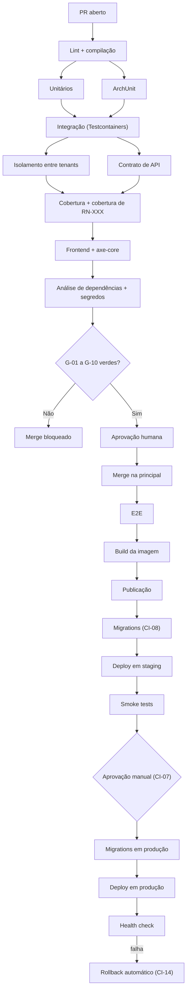

# ADR-030 — GitHub Actions como plataforma de integração e entrega contínua

## Status

**Aceito** em 2026-07-29.
Operacionaliza `ART-103`, `ART-104`.

## Data

2026-07-29

## Contexto

O pipeline não é apenas automação de build: neste projeto ele é o **mecanismo que impede que código não conforme entre na branch principal**. Como a implementação é majoritariamente feita por agentes de IA, os gates automatizados substituem parte do que, em um time convencional, seria revisão humana detalhada.

Restrições:

| # | Restrição | Origem |
|---|---|---|
| R-01 | Build falha em lint, cobertura abaixo do mínimo e CVE `HIGH`/`CRITICAL` | `ART-103` |
| R-02 | Testes de integração exigem Docker (Testcontainers) | [ADR-029](ADR-029-testcontainers.md) |
| R-03 | Migrations rodam antes da subida da nova versão | DP-01 |
| R-04 | Deploy em staging automático no merge; produção com aprovação manual | `architecture.md` §11 |
| R-05 | Segredos nunca em código ou arquivo versionado | `ART-083` |
| R-06 | Dez gates bloqueantes definidos em `strategy.md` §12 | `G-01` a `G-10` |

## Decisão

| # | Regra |
|---|---|
| CI-01 | A plataforma de CI/CD é **GitHub Actions**, com workflows versionados em `.github/workflows/`. |
| CI-02 | O workflow de PR executa, nesta ordem: lint e compilação → testes unitários → testes de arquitetura → testes de integração → testes de isolamento → testes de contrato → cobertura → cobertura de `RN-XXX` → testes de frontend com axe-core → análise de dependências. |
| CI-03 | Os **dez gates** `G-01` a `G-10` de `strategy.md` §12 são bloqueantes. Nenhum é advertência. |
| CI-04 | Etapas independentes rodam em **paralelo**; a ordem de CI-02 é de dependência lógica, não necessariamente sequencial no tempo. |
| CI-05 | A branch principal é **protegida**: merge exige verificações verdes, ao menos uma aprovação e branch atualizada. Push direto é proibido. |
| CI-06 | O merge na branch principal dispara: E2E → build da imagem → publicação no registro → deploy em `staging` → smoke tests (R-04). |
| CI-07 | O deploy em `production` é um workflow **manual com aprovação**, usando *environment* protegido do GitHub. |
| CI-08 | Migrations executam como **etapa dedicada**, antes da atualização das réplicas (R-03, DK-12 de [ADR-020](ADR-020-docker.md)). |
| CI-09 | Segredos vivem em *GitHub Secrets* / *Environments*, nunca em arquivo versionado (R-05). Detecção de segredo é gate (`G-07`). |
| CI-10 | Toda action de terceiro é fixada por **SHA de commit**, nunca por tag móvel. |
| CI-11 | Workflows disparados por `pull_request` de fork **não** recebem segredos nem publicam artefatos. |
| CI-12 | Dependências (Maven, npm) e imagens Docker são cacheadas entre execuções. |
| CI-13 | Toda imagem publicada é etiquetada com a versão semântica e o SHA do commit ([ADR-033](ADR-033-versioning.md)); `latest` não é usado em deploy. |
| CI-14 | Falha de deploy em produção aciona **rollback automático** para a versão anterior; o rollback nunca depende de rollback de migration (DP-04). |
| CI-15 | Dependabot está habilitado para Maven, npm, GitHub Actions e imagens base Docker. |
| CI-16 | O tempo alvo do workflow de PR é de **até 20 minutos**; o feedback inicial (lint + unitários + arquitetura) chega em até 3 minutos. |

## Motivação

**Por que GitHub Actions:** o código já está no GitHub, o que elimina integração entre sistemas, sincronização de credenciais e um segundo lugar para configurar. A definição do pipeline é versionada junto com o código, o que torna uma mudança de pipeline revisável no mesmo PR da mudança que a exige. As proteções de branch, os *environments* com aprovação e os *secrets* são nativos da mesma plataforma.

**Por que todos os gates são bloqueantes (CI-03):** um gate que emite advertência é ignorado após a segunda semana. O valor de `G-04` (toda `RN-XXX` tem teste) e de `G-09` (todo endpoint tem teste de isolamento) vem inteiramente de eles impedirem o merge. Como advertência, seriam ruído.

**Por que a ordem de CI-02:** as etapas mais rápidas e mais frequentemente reprovadas vêm primeiro. Lint e compilação falham em segundos; não faz sentido subir Testcontainers antes de saber se o código compila. Isso atende CI-16 (feedback inicial em 3 min).

**Por que branch protegida (CI-05):** sem proteção, os gates são contornáveis por push direto — e o mecanismo inteiro perde sentido.

**Por que actions fixadas por SHA (CI-10):** uma action de terceiro executa com acesso ao repositório e, em alguns casos, a segredos. Referenciá-la por tag móvel significa que o autor pode alterar o conteúdo daquela tag a qualquer momento — um vetor de ataque de cadeia de suprimentos já explorado publicamente. O SHA é imutável.

**Por que sem segredos em PR de fork (CI-11):** um PR de fork executa código não confiável. Se o workflow tivesse acesso a segredos, qualquer pessoa poderia exfiltrá-los abrindo um PR.

**Por que rollback automático (CI-14):** o tempo entre a detecção de falha e a restauração do serviço é o que determina o impacto. Automatizar remove a latência de decisão humana no pior momento possível. Isso só é seguro porque DP-04 garante que o rollback da aplicação não depende do schema.

**Por que Dependabot (CI-15):** `ART-103` bloqueia CVE `HIGH`/`CRITICAL`. Sem atualização proativa, o build passaria a falhar de surpresa quando uma CVE fosse publicada em uma dependência antiga. O Dependabot transforma isso em um fluxo contínuo de PRs pequenos.

## Alternativas consideradas

### A1 — GitLab CI

| Aspecto | Avaliação |
|---|---|
| **Prós** | Pipeline muito maduro; ambientes e *review apps* nativos; registro de contêiner integrado; excelente para monorepo. |
| **Contras** | Exigiria migrar o repositório ou manter espelhamento entre plataformas; duas fontes de verdade para código e pipeline. |
| **Por que foi descartada** | O código está no GitHub. A vantagem funcional não compensa a migração ou o espelhamento. |

### A2 — Jenkins

| Aspecto | Avaliação |
|---|---|
| **Prós** | Máxima flexibilidade; enorme ecossistema de plugins; execução em infraestrutura própria; sem limite de minutos. |
| **Contras** | Servidor a operar, atualizar e proteger (um Jenkins exposto é alvo conhecido); plugins com histórico de vulnerabilidades; configuração frequentemente fora do repositório; sem SRE dedicado no MVP. |
| **Por que foi descartada** | Adicionar um servidor a operar contradiz a restrição de equipe pequena e o princípio de simplicidade operacional (`ART-002`). |

### A3 — CircleCI / Travis / Buildkite

| Aspecto | Avaliação |
|---|---|
| **Prós** | Boa performance; recursos maduros; boa experiência de configuração. |
| **Contras** | Mais um serviço com credenciais de acesso ao repositório; custo adicional; integração com proteções de branch e *environments* menos fluida que a nativa. |
| **Por que foram descartadas** | Nenhum recurso diferencial que o GitHub Actions não ofereça para este caso de uso. |

### A4 — Scripts de deploy manuais (sem CI/CD)

| Aspecto | Avaliação |
|---|---|
| **Prós** | Nenhuma plataforma; controle total; sem custo. |
| **Contras** | Gates dependem de disciplina humana; nenhuma verificação obrigatória; deploy sujeito a erro; sem auditoria de quem publicou o quê. |
| **Por que foi descartada** | O pipeline **é** o mecanismo de conformidade deste projeto. Sem ele, `ART-103` e `ART-104` seriam inaplicáveis. |

### A5 — GitOps (Argo CD / Flux) para a etapa de deploy

| Aspecto | Avaliação |
|---|---|
| **Prós** | Estado desejado declarado em Git; reconciliação automática; auditoria natural; rollback por reversão de commit. |
| **Contras** | Pressupõe Kubernetes; adiciona um componente a operar; complexidade acima da necessidade do MVP. |
| **Por que não foi adotada no MVP** | Depende da plataforma de execução, ainda não fixada por ADR. Permanece como evolução natural da etapa de deploy quando o alvo for Kubernetes, sem alterar o pipeline de CI descrito aqui. |

## Consequências

### Positivas

| # | Consequência |
|---|---|
| C+01 | Conformidade verificada automaticamente; código não conforme não entra na principal. |
| C+02 | Pipeline versionado junto com o código, revisável em PR. |
| C+03 | Sem servidor de CI a operar. |
| C+04 | Segredos e aprovações nativos da mesma plataforma. |
| C+05 | Deploy em staging automático e rastreável (R-04). |
| C+06 | Rollback automático reduz o tempo de indisponibilidade (CI-14). |
| C+07 | Dependabot mantém as dependências dentro de `ART-103`. |

### Negativas

| # | Consequência | Aceita porque |
|---|---|---|
| C-01 | Dependência de plataforma proprietária. | Os passos são scripts portáveis; migrar exigiria reescrever apenas a orquestração. |
| C-02 | Custo por minuto acima da cota gratuita. | Mitigado por cache (CI-12) e paralelismo. |
| C-03 | Indisponibilidade do GitHub paralisa build e deploy. | Risco aceito; deploy emergencial manual é documentado em runbook. |
| C-04 | Pipeline de ~20 min pode incomodar em correções pequenas. | Feedback inicial em 3 min (CI-16). |
| C-05 | Fixar actions por SHA (CI-10) exige atualização manual periódica. | Automatizada pelo Dependabot (CI-15). |

### Limitações

| # | Limitação |
|---|---|
| L-01 | O pipeline verifica conformidade automatizável; decisões de design continuam dependendo de revisão humana. |
| L-02 | Testes de desempenho com volume realista não cabem no ciclo de PR; executam separadamente. |
| L-03 | O rollback automático cobre falha de health check; falhas lógicas exigem decisão humana. |

### Custos

| Item | Custo |
|---|---|
| Plataforma | Cota gratuita para repositório privado + excedente por minuto |
| Implementação | ~3 dias para o pipeline completo com todos os gates |
| Manutenção | Atualização de actions e ajustes de gate |

## Trade-offs

| Sacrificado | Em favor de | Justificativa da troca |
|---|---|---|
| **Independência de plataforma** | Integração nativa com o repositório | Os passos são scripts; a orquestração é a única parte acoplada. |
| **Flexibilidade** do Jenkins | Ausência de servidor a operar | Equipe pequena sem SRE (`ART-002`). |
| **Velocidade** do ciclo de PR | Rigor dos dez gates | Gates são o mecanismo de conformidade do projeto. |
| **Conveniência** de tags móveis em actions | Segurança de cadeia de suprimentos | Vetor de ataque real e documentado. |
| **Controle total** do deploy manual | Rastreabilidade e repetibilidade | Deploy manual não é auditável nem reproduzível. |

## Impacto na arquitetura

| Módulo | Impacto |
|---|---|
| `.github/workflows/` | Definição do pipeline. |
| Testes | Todas as suítes de [ADR-028](ADR-028-testing-strategy.md) executadas aqui. |
| Build | Imagens Docker construídas e publicadas ([ADR-020](ADR-020-docker.md)). |
| Migrations | Etapa dedicada (CI-08). |
| Verificadores | Scripts de `G-04` (cobertura de `RN-XXX`), `G-09` (isolamento por endpoint) e OA-03 (conformidade do OpenAPI). |

| Documento dependente | Relação |
|---|---|
| `docs/06-testing/strategy.md` §12 | Gates `G-01` a `G-10` |
| `docs/03-architecture/architecture.md` §11 | Ambientes e deploy |
| `docs/ai/definition-of-done.md` | Conformidade verificada |
| `docs/ai/project-constitution.md` | ART-103, ART-104 |

| Spec dependente | Relação |
|---|---|
| Todas as specs | Definition of Done depende do pipeline verde |

| ADR relacionado | Relação |
|---|---|
| [ADR-028](ADR-028-testing-strategy.md) / [ADR-029](ADR-029-testcontainers.md) | Suítes executadas |
| [ADR-020](ADR-020-docker.md) | Build e publicação de imagem |
| [ADR-007](ADR-007-flyway.md) | Migrations (CI-08) |
| [ADR-031](ADR-031-conventional-commits.md) / [ADR-032](ADR-032-git-flow.md) | Fluxo que alimenta o pipeline |
| [ADR-033](ADR-033-versioning.md) | Etiquetagem e versionamento |

## Impacto no banco

| Item | Impacto |
|---|---|
| Testes | Testcontainers sobe PostgreSQL real em CI (R-02). |
| Migrations | Etapa dedicada antes do deploy (CI-08); falha impede a subida da nova versão. |
| Credenciais | Injetadas por *GitHub Secrets* por ambiente; usuário de migração distinto do da aplicação (S-01 de [ADR-006](ADR-006-postgresql.md)). |
| Verificação | `flyway migrate` do zero em banco limpo prova F0-04 a cada execução. |

## Impacto na API

Não se aplica ao contrato. Efeito indireto relevante: o gate de contrato (OA-03 de [ADR-012](ADR-012-openapi.md)) e a detecção de quebra entre releases (OA-11) executam no pipeline — é ali que a estabilidade do contrato deixa de ser intenção e passa a ser verificação.

## Impacto no Frontend

| Item | Impacto |
|---|---|
| Testes | Jest + Testing Library com axe-core (gate `G-08`). |
| Build | Build de produção do Angular no pipeline. |
| Imagem | Imagem Nginx com os estáticos ([ADR-020](ADR-020-docker.md)). |
| E2E | Playwright após o merge, contra o ambiente de staging. |
| Orçamento | Falha se o bundle exceder o limite configurado. |

## Impacto na Infraestrutura

| Item | Impacto |
|---|---|
| Runners | Hospedados pelo GitHub; runners próprios apenas se surgir necessidade de rede privada. |
| Registro | Imagens publicadas em registro privado, autenticado por segredo. |
| Ambientes | `staging` (automático) e `production` (aprovação manual) como *environments* protegidos. |
| Segredos | Escopados por ambiente; produção não é acessível a workflows de PR (CI-11). |
| Rollback | Automatizado por CI-14. |
| Observabilidade | O deploy registra a versão publicada, correlacionável com métricas ([ADR-046](ADR-046-observability.md)). |

## Segurança

| # | Consideração |
|---|---|
| S-01 | CI-10 protege contra comprometimento de action de terceiro (cadeia de suprimentos, OWASP A08). |
| S-02 | CI-11 impede exfiltração de segredos por PR de fork. |
| S-03 | Permissões do `GITHUB_TOKEN` são declaradas explicitamente por workflow, com o mínimo necessário. |
| S-04 | Gate `G-07` detecta segredo commitado; a resposta é rotação imediata da credencial (`P-06`). |
| S-05 | Gate `G-06` bloqueia CVE `HIGH`/`CRITICAL` (`ART-103`, OWASP A06). |
| S-06 | Ambientes protegidos exigem aprovação para produção, criando trilha de quem autorizou cada deploy. |
| S-07 | **Multi-tenant:** o gate `G-09` garante que nenhum endpoint entre em produção sem teste de isolamento — o gate mais importante do pipeline. |
| S-08 | **LGPD:** nenhum dado real transita pelo pipeline; logs de execução não contêm dado pessoal. |
| S-09 | **Auditoria:** cada deploy é rastreável a um commit, a um autor e a um aprovador. |

## Performance

| # | Consideração |
|---|---|
| P-01 | Paralelismo (CI-04) reduz o tempo total de parede. |
| P-02 | Cache (CI-12) elimina a maior parte do tempo de download de dependências. |
| P-03 | O feedback inicial em 3 min (CI-16) preserva o fluxo de trabalho. |
| P-04 | Testes de integração são a etapa mais longa; mitigados por reuso de contêiner (TC-03). |
| P-05 | E2E fora do ciclo de PR mantém o PR rápido. |

## Escalabilidade

| # | Consideração |
|---|---|
| E-01 | Runners hospedados escalam sob demanda; execuções concorrentes são suportadas. |
| E-02 | O tempo de pipeline cresce com o número de testes; a resposta é paralelizar, não reduzir cobertura (E-03 de [ADR-029](ADR-029-testcontainers.md)). |
| E-03 | O custo por minuto cresce com a frequência de PRs; monitorado. |
| E-04 | Se o volume justificar, runners próprios reduzem custo sem alterar os workflows. |

## Riscos

| # | Risco | Probabilidade | Impacto | Severidade |
|---|---|---|---|---|
| RK-01 | Gate desabilitado sob pressão de prazo | Média | Crítico | **Alta** |
| RK-02 | Segredo exposto em log de execução | Baixa | Crítico | **Alta** |
| RK-03 | Action de terceiro comprometida | Baixa | Crítico | **Alta** |
| RK-04 | Pipeline lento levando a contornos | Média | Alto | Alta |
| RK-05 | Indisponibilidade do GitHub bloqueando deploy emergencial | Baixa | Alto | Média |
| RK-06 | Falha de migration em produção deixando o sistema inconsistente | Baixa | Crítico | **Alta** |
| RK-07 | Custo de minutos acima do previsto | Média | Baixo | Baixa |

## Mitigações

| Risco | Mitigação | Verificação |
|---|---|---|
| RK-01 | Alteração de workflow exige revisão do Arquiteto; desabilitar gate exige ADR substituto; `CODEOWNERS` protege `.github/` | Proteção de branch |
| RK-02 | Segredos nunca ecoados; mascaramento automático do GitHub; gate `G-07`; revisão de scripts que imprimem variáveis | Pipeline |
| RK-03 | CI-10 (SHA fixo); Dependabot atualiza; conjunto mínimo de actions de terceiros | Revisão de dependências |
| RK-04 | CI-16 como meta; paralelismo; cache; monitoramento do tempo de pipeline | Métrica de CI |
| RK-05 | Runbook de deploy manual documentado e ensaiado | Runbook |
| RK-06 | CI-08 executa migrations antes do deploy; falha aborta o deploy; FW-08/FW-09 garantem compatibilidade; backup verificado antes de migration destrutiva | Processo de deploy |
| RK-07 | Cache e paralelismo; monitoramento do consumo; runners próprios se necessário | Acompanhamento mensal |

## Referências

| Fonte | Uso |
|---|---|
| [GitHub Actions — Documentation](https://docs.github.com/en/actions) | Referência da plataforma |
| [GitHub — Security hardening for Actions](https://docs.github.com/en/actions/security-for-github-actions/security-guides/security-hardening-for-github-actions) | CI-09, CI-10, CI-11 |
| [GitHub — Environments e deployment protection](https://docs.github.com/en/actions/how-tos/deploy/configure-and-manage-deployments/manage-environments) | CI-07 |
| [GitHub — Dependabot](https://docs.github.com/en/code-security/dependabot) | CI-15 |
| [OWASP — CI/CD Security](https://owasp.org/www-project-top-10-ci-cd-security-risks/) | Base das mitigações |
| [DORA — Accelerate metrics](https://dora.dev/) | Motivação de deploy automatizado |
| `docs/06-testing/strategy.md` §12 | Gates `G-01` a `G-10` |
