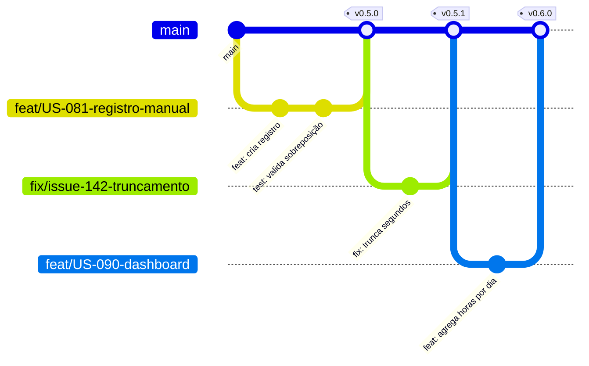

# ADR-032 — Trunk-based development com branches curtas e branch principal sempre implantável

## Status

**Aceito** em 2026-07-29.
Formaliza §9.1 de `docs/ai/coding-guidelines.md` (`BR-01` a `BR-06`).

> **Nota sobre o nome do arquivo:** o nome `ADR-032-git-flow` designa o tema "fluxo de trabalho com Git". A decisão **rejeita** o modelo Gitflow (A1) em favor de trunk-based development. O nome do arquivo é imutável por VR-03 do `README.md` deste diretório.

## Data

2026-07-29

## Contexto

O modelo de branches determina a frequência de integração, o tamanho dos conflitos, a velocidade de entrega e a complexidade do pipeline.

Características do projeto que condicionam a escolha:

| # | Característica | Consequência |
|---|---|---|
| CR-01 | Equipe pequena, com implementação majoritária por agentes de IA | Muitas branches simultâneas, de vida curta |
| CR-02 | Uma única versão em produção (SaaS) | Não é necessário manter várias versões vivas |
| CR-03 | Deploy contínuo para staging, produção com aprovação | O fluxo precisa suportar entrega frequente |
| CR-04 | Gates automatizados como mecanismo de conformidade | A qualidade é verificada no PR, não em branch de estabilização |

Restrições:

| # | Restrição | Origem |
|---|---|---|
| R-01 | `main` está sempre implantável | `BR-01` |
| R-02 | Nenhum commit direto em `main`; sempre por PR | `BR-02` |
| R-03 | Branch de funcionalidade vive no máximo 3 dias | `BR-03` |
| R-04 | Rebase sobre `main` antes do merge | `BR-04` |
| R-05 | `hotfix` pode pular staging, mas nunca os gates de teste | `BR-06` |

## Decisão

| # | Regra |
|---|---|
| GF-01 | O modelo é **trunk-based development**: existe **uma** branch de longa duração, `main`, sempre implantável (R-01). |
| GF-02 | Todo trabalho ocorre em **branch curta** criada a partir de `main` e integrada por Pull Request (R-02). |
| GF-03 | Nomenclatura de branch: `feat/US-XXX-descricao`, `fix/US-XXX-descricao` ou `fix/issue-NNN`, `refactor/descricao`, `docs/descricao`, `chore/descricao`, `hotfix/descricao`. |
| GF-04 | Uma branch vive **no máximo 3 dias** (R-03). Trabalho maior é decomposto em incrementos integráveis. |
| GF-05 | A branch é **rebaseada** sobre `main` antes do merge (R-04); o merge usa *squash* com mensagem convencional (CC-11 de [ADR-031](ADR-031-conventional-commits.md)). |
| GF-06 | A branch é **excluída** após o merge (`BR-05`). |
| GF-07 | `main` é protegida: exige verificações verdes, ao menos uma aprovação e branch atualizada ([ADR-030](ADR-030-github-actions.md) CI-05). |
| GF-08 | **Não existem** branches `develop`, `release` nem `feature` de longa duração. |
| GF-09 | Funcionalidade incompleta é integrada **desativada**, protegida por *feature flag* ([ADR-048](ADR-048-feature-flags.md)) ou por ausência de rota/endpoint exposto — nunca mantida fora de `main` por semanas. |
| GF-10 | `hotfix` segue o mesmo fluxo, com prioridade: parte de `main`, PR, gates completos, merge e deploy. Pode pular staging (R-05), **nunca** os gates. |
| GF-11 | Cada merge em `main` é candidato a release; a decisão de publicar em produção é separada e manual ([ADR-030](ADR-030-github-actions.md) CI-07). |
| GF-12 | Reverter em produção é feito por **redeploy da versão anterior**, não por reversão de commit — mais rápido e sem risco de conflito. A reversão do commit ocorre depois, com calma. |
| GF-13 | Nenhuma branch de longa duração é mantida para experimentos; experimentos vivem em fork ou em branch descartável, nunca integrados parcialmente. |

## Motivação

**Por que trunk-based:**

1. **Conflitos crescem com o tempo de vida da branch.** Uma branch de 3 dias tem conflitos triviais; uma de 3 semanas tem conflitos que exigem reinterpretar decisões. GF-04 mantém o custo de integração próximo de zero.
2. **`main` sempre implantável (R-01) só é sustentável com integração frequente.** Se o código fica fora da principal por semanas, a principal não reflete o estado real do trabalho, e o que se pensa estar pronto na verdade não foi integrado.
3. **Os gates estão no PR, não em branch de estabilização (CR-04).** Gitflow surgiu quando a qualidade era estabilizada em uma branch `release` durante dias. Com dez gates automatizados bloqueando o merge, essa fase não existe: o código chega em `main` já verificado.
4. **Uma versão em produção (CR-02).** Branches de release existem para manter várias versões vivas simultaneamente. Um SaaS com uma versão não tem esse problema.
5. **Muitas branches simultâneas de agentes (CR-01).** Com vários agentes trabalhando em paralelo, branches longas produziriam conflitos combinatórios. Integração frequente é o que torna o paralelismo viável.

**Por que branch curta com PR, e não commit direto (GF-02):** o PR é onde os gates rodam e onde a revisão acontece. Commit direto contornaria ambos.

**Por que squash (GF-05):** ver CC-11 de [ADR-031](ADR-031-conventional-commits.md). Um commit por unidade de mudança em `main` mantém o histórico útil e o changelog limpo.

**Por que integrar funcionalidade incompleta desativada (GF-09):** é o mecanismo que torna GF-04 possível para trabalho grande. A alternativa — manter a branch aberta até a funcionalidade estar completa — reintroduz exatamente o problema que o modelo evita. Código integrado e desativado é código testado, revisado e livre de conflito.

**Por que rollback por redeploy (GF-12):** reverter um commit em `main` durante um incidente exige resolver conflitos sob pressão, esperar o pipeline e torcer para não introduzir um segundo problema. Redeploy da imagem anterior é uma operação de segundos, já testada, e não toca o repositório.

## Alternativas consideradas

### A1 — Gitflow (`main`, `develop`, `feature/*`, `release/*`, `hotfix/*`)

| Aspecto | Avaliação |
|---|---|
| **Prós** | Modelo muito conhecido e documentado; separa explicitamente desenvolvimento de produção; suporta manutenção de várias versões; branch `release` permite estabilização. |
| **Contras** | Duas branches de longa duração a sincronizar, com merges recorrentes entre elas; branches de funcionalidade tendem a durar semanas, gerando conflitos grandes; a fase de estabilização é desnecessária quando os gates são automatizados (CR-04); `hotfix` precisa ser aplicado em duas branches; o próprio autor do modelo passou a desaconselhá-lo para aplicações web com entrega contínua. |
| **Por que foi descartada** | Foi desenhado para software com **versões distribuídas** e múltiplas versões suportadas — o oposto de CR-02. Toda sua complexidade resolve problemas que este produto não tem. |

### A2 — GitHub Flow (branch por funcionalidade, sem restrição de duração)

| Aspecto | Avaliação |
|---|---|
| **Prós** | Muito simples: `main` + branches de funcionalidade + PR; próximo do modelo adotado. |
| **Contras** | Sem limite de duração de branch (não impõe R-03); sem orientação sobre funcionalidade incompleta, o que na prática produz branches longas. |
| **Por que foi descartada como enunciado** | A decisão adotada **é** um GitHub Flow com duas restrições adicionais e decisivas: GF-04 (limite de 3 dias) e GF-09 (integrar desativado). Sem elas, o modelo degenera em branches longas. |

### A3 — Commits diretos em `main` (trunk-based puro, sem PR)

| Aspecto | Avaliação |
|---|---|
| **Prós** | Integração máxima; zero atrito; nenhum conflito. |
| **Contras** | Sem revisão; sem execução de gates antes da integração; `main` quebra com frequência; incompatível com R-02. |
| **Por que foi descartada** | Os gates são o mecanismo de conformidade do projeto (CR-04), e eles rodam no PR. Sem PR, não há verificação prévia. |

### A4 — Release branches para versões suportadas

| Aspecto | Avaliação |
|---|---|
| **Prós** | Permite correções em versões antigas sem incluir novidades; necessário em software instalado no cliente. |
| **Contras** | Manutenção de N branches; correções aplicadas em várias linhas; complexidade de teste multiplicada. |
| **Por que foi descartada** | CR-02: há uma única versão em produção. Se um dia houver instalação *on-premises* ou API pública com versões suportadas, a decisão será revisitada por ADR. |

### A5 — Monorepo com branches por componente

| Aspecto | Avaliação |
|---|---|
| **Prós** | Permite ritmos de release distintos para backend e frontend. |
| **Contras** | Backend e frontend evoluem juntos e são implantados juntos; branches separadas criariam divergência de contrato; PRs que atravessam os dois (o caso comum) ficariam impossíveis. |
| **Por que foi descartada** | O contrato entre backend e frontend muda em conjunto; separar as branches quebraria a atomicidade dessas mudanças. |

## Consequências

### Positivas

| # | Consequência |
|---|---|
| C+01 | Conflitos pequenos e raros (GF-04). |
| C+02 | `main` reflete o estado real do trabalho. |
| C+03 | Modelo simples de explicar e de seguir — inclusive por agentes. |
| C+04 | Cada merge é candidato a release, permitindo entrega frequente. |
| C+05 | Histórico linear e legível (GF-05). |
| C+06 | Sem sincronização entre branches de longa duração. |
| C+07 | `hotfix` sem caminho especial nem risco de esquecer uma branch (GF-10). |

### Negativas

| # | Consequência | Aceita porque |
|---|---|---|
| C-01 | Exige decompor trabalho grande em incrementos integráveis. | É uma disciplina benéfica; produz PRs revisáveis. |
| C-02 | Funcionalidade incompleta convive em `main`, exigindo flags ou ausência de exposição (GF-09). | Custo menor que branches longas; [ADR-048](ADR-048-feature-flags.md) trata o mecanismo. |
| C-03 | `main` quebrada bloqueia toda a equipe. | Mitigado pelos gates: só entra código verde. |
| C-04 | Rebase frequente exige familiaridade com Git. | Fluxo padronizado e documentado. |
| C-05 | Squash perde granularidade do trabalho. | Deliberado (GF-05). |

### Limitações

| # | Limitação |
|---|---|
| L-01 | Não suporta manutenção simultânea de múltiplas versões em produção (consequência de rejeitar A4). |
| L-02 | Exige pipeline rápido e confiável; um pipeline lento torna o modelo doloroso. |
| L-03 | Funcionalidades muito grandes exigem planejamento de decomposição antes de começar. |

### Custos

| Item | Custo |
|---|---|
| Implementação | Configuração de proteção de branch: ~1 hora |
| Disciplina | Decomposição de trabalho grande |
| Ferramenta | Nenhuma além do GitHub |

## Trade-offs

| Sacrificado | Em favor de | Justificativa da troca |
|---|---|---|
| **Isolamento** de funcionalidade em branch longa | Integração contínua e conflitos pequenos | Isolamento prolongado apenas adia e amplifica o conflito. |
| **Separação** entre desenvolvimento e produção (Gitflow) | Simplicidade e `main` sempre implantável | A separação é feita pelo deploy, não pela branch. |
| **Suporte a múltiplas versões** | Simplicidade do modelo | CR-02: há uma versão em produção. |
| **Granularidade** do histórico de branch | Histórico limpo da principal | Commits intermediários são ruído. |
| **Liberdade** de manter trabalho fora de `main` | Visibilidade do estado real | Código não integrado não está pronto, ainda que pareça. |

## Impacto na arquitetura

| Módulo | Impacto |
|---|---|
| Repositório | Configuração de proteção de `main`. |
| CI | Workflow de PR e workflow de merge ([ADR-030](ADR-030-github-actions.md)). |
| Feature flags | Mecanismo que viabiliza GF-09 ([ADR-048](ADR-048-feature-flags.md)). |

| Documento dependente | Relação |
|---|---|
| `docs/ai/coding-guidelines.md` §9.1 | `BR-01` a `BR-06` |
| `docs/ai/review-checklist.md` | Revisão no PR |
| `docs/03-architecture/architecture.md` §11 | Deploy a partir de `main` |

| Spec dependente | Relação |
|---|---|
| `specs/implementation-order.md` | Ordem de implementação e decomposição em tarefas integráveis |
| Todas as specs | `tasks.md` decompõe em incrementos |

| ADR relacionado | Relação |
|---|---|
| [ADR-031](ADR-031-conventional-commits.md) | Mensagens e squash |
| [ADR-030](ADR-030-github-actions.md) | Gates e proteção de branch |
| [ADR-033](ADR-033-versioning.md) | Versão por merge |
| [ADR-048](ADR-048-feature-flags.md) | Viabiliza GF-09 |

## Impacto no banco

| Item | Impacto |
|---|---|
| Migrations | Numeração sequencial gera conflito entre PRs paralelos; resolvido por renumeração antes do merge (FW-04 de [ADR-007](ADR-007-flyway.md)). Branches curtas reduzem drasticamente a incidência. |
| Compatibilidade | Como cada merge é candidato a release, toda migration precisa ser compatível com a versão anterior (FW-08), sem exceção. |
| Reversão | GF-12 é possível porque DP-04 garante que o rollback da aplicação não depende de rollback de schema. |

## Impacto na API

| Item | Impacto |
|---|---|
| Compatibilidade | Integração frequente exige que mudanças de contrato sejam compatíveis ou versionadas ([ADR-043](ADR-043-api-versioning.md)). |
| Endpoint incompleto | Não é exposto até estar pronto (GF-09): a rota não é registrada ou é protegida por flag. |
| Contrato | O gate de contrato (OA-03) roda em cada PR, impedindo que uma quebra chegue a `main`. |

## Impacto no Frontend

| Item | Impacto |
|---|---|
| Tela incompleta | Integrada sem rota exposta ou protegida por flag (GF-09). |
| Atomicidade | Mudanças que atravessam backend e frontend vão no **mesmo** PR, mantendo o contrato consistente. |
| Deploy | Backend e frontend são implantados juntos a partir do mesmo merge. |

## Impacto na Infraestrutura

| Item | Impacto |
|---|---|
| Proteção de branch | Configurada no GitHub (GF-07). |
| Deploy | Merge em `main` dispara staging; produção exige aprovação. |
| Rollback | Redeploy da imagem anterior (GF-12), viabilizado pela etiquetagem por versão e SHA ([ADR-020](ADR-020-docker.md) DK-07). |
| Retenção | Imagens de versões anteriores mantidas no registro para permitir GF-12. |

## Segurança

| # | Consideração |
|---|---|
| S-01 | GF-07 impede que código entre em `main` sem passar pelos gates de segurança (`G-06`, `G-07`, `G-09`). |
| S-02 | GF-10 garante que correções urgentes de segurança não pulem os testes — a pressa é o momento de maior risco de introduzir uma segunda falha. |
| S-03 | Integração frequente reduz a janela entre a descoberta de uma vulnerabilidade e sua correção em produção. |
| S-04 | Toda alteração passa por revisão de ao menos uma pessoa (GF-07). |
| S-05 | **Multi-tenant:** o gate `G-09` (teste de isolamento por endpoint) roda em todo PR, inclusive em `hotfix`. |
| S-06 | **LGPD:** nenhum dado real transita pelo fluxo de branches. |
| S-07 | **Auditoria:** cada mudança em `main` é rastreável a um PR, a um autor e a um revisor. |

## Performance

Não se aplica ao runtime. Efeito no processo: branches curtas reduzem o tempo de resolução de conflito e o tempo entre escrita e integração — os dois maiores custos ocultos de modelos com branches longas.

## Escalabilidade

| # | Consideração |
|---|---|
| E-01 | O modelo escala com o número de contribuidores **desde que** as branches permaneçam curtas; é justamente com muitos contribuidores que branches longas se tornam inviáveis. |
| E-02 | Múltiplos agentes trabalhando em paralelo produzem muitos PRs pequenos, que é o padrão ideal para este modelo. |
| E-03 | O gargalo é o tempo de pipeline; CI-16 de [ADR-030](ADR-030-github-actions.md) o mantém sob controle. |
| E-04 | Se o volume de PRs crescer muito, fila de merge automatizada é a evolução natural. |

## Riscos

| # | Risco | Probabilidade | Impacto | Severidade |
|---|---|---|---|---|
| RK-01 | Branches ultrapassando 3 dias e acumulando conflitos | **Alta** | Médio | Alta |
| RK-02 | `main` quebrada bloqueando a equipe | Baixa | Alto | Média |
| RK-03 | Funcionalidade incompleta exposta acidentalmente em produção | Média | Alto | Alta |
| RK-04 | Conflito de numeração de migration entre PRs paralelos | Média | Baixo | Baixa |
| RK-05 | `hotfix` pulando gates sob pressão | Média | Crítico | **Alta** |
| RK-06 | Acúmulo de flags de funcionalidades já concluídas | Média | Baixo | Baixa |
| RK-07 | Rollback impossível por imagem anterior removida do registro | Baixa | Alto | Média |

## Mitigações

| Risco | Mitigação | Verificação |
|---|---|---|
| RK-01 | GF-04 explícita; relatório de idade das branches abertas; decomposição obrigatória em `tasks.md` | Acompanhamento semanal |
| RK-02 | Gates impedem merge de código quebrado; se ocorrer, a correção tem prioridade absoluta sobre qualquer outro trabalho | Processo |
| RK-03 | GF-09: rota/endpoint não registrado ou flag desativada por padrão; teste que verifica que a funcionalidade não é acessível com a flag desligada | Teste de flag |
| RK-04 | Renumeração antes do merge (FW-04); CI detecta duplicidade de número | Job de CI |
| RK-05 | GF-10 explícita; os gates não são desabiláveis por tipo de branch; a proteção de `main` não distingue `hotfix` | Configuração de CI |
| RK-06 | Toda flag nasce com data de remoção; revisão periódica ([ADR-048](ADR-048-feature-flags.md)) | Revisão de flags |
| RK-07 | Política de retenção do registro preserva todas as versões implantadas em produção ([ADR-020](ADR-020-docker.md)) | Política de registro |

## Referências

| Fonte | Uso |
|---|---|
| [Trunk Based Development](https://trunkbaseddevelopment.com/) | Modelo adotado |
| [GitHub Flow](https://docs.github.com/en/get-started/using-github/github-flow) | Base de GF-02 |
| [Vincent Driessen — A successful Git branching model (com a nota de reflexão do autor)](https://nvie.com/posts/a-successful-git-branching-model/) | Alternativa A1 e sua ressalva |
| [Martin Fowler — Feature Branch vs Continuous Integration](https://martinfowler.com/bliki/FeatureBranch.html) | Fundamento de GF-04 |
| [Martin Fowler — Feature Toggles](https://martinfowler.com/articles/feature-toggles.html) | Base de GF-09 |
| [DORA — Trunk-based development](https://dora.dev/capabilities/trunk-based-development/) | Evidência empírica |
| `docs/ai/coding-guidelines.md` §9.1 | Regras `BR-01` a `BR-06` |
