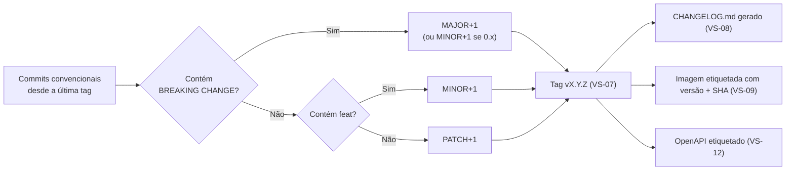

# ADR-033 — Versionamento semântico da aplicação, independente da versão da API

## Status

**Aceito** em 2026-07-29.
Formaliza §9.2 de `docs/ai/coding-guidelines.md` (`VR-01` a `VR-04`).

## Data

2026-07-29

## Contexto

O projeto produz artefatos que precisam ser identificados sem ambiguidade:

| Artefato | Necessidade de versão |
|---|---|
| Imagem Docker | Identificar exatamente o que está em execução; permitir rollback ([ADR-032](ADR-032-git-flow.md) GF-12) |
| API HTTP | Comunicar compatibilidade a consumidores ([ADR-043](ADR-043-api-versioning.md)) |
| Schema do banco | Saber qual conjunto de migrations foi aplicado ([ADR-007](ADR-007-flyway.md)) |
| Documento OpenAPI | Detectar quebras entre releases ([ADR-012](ADR-012-openapi.md) OA-11) |
| Changelog | Comunicar o que mudou por versão |

O ponto de atenção é que **a versão da aplicação e a versão da API não são a mesma coisa**. A aplicação pode chegar à versão 5 mantendo `/api/v1`; e uma mudança incompatível de API não implica reescrever a aplicação.

Restrições:

| # | Restrição | Origem |
|---|---|---|
| R-01 | A API é versionada por path; `MAJOR` da aplicação não altera a versão da API | `VR-01` |
| R-02 | Mudança incompatível de API exige nova versão de path e depreciação de 12 meses | `VR-02` |
| R-03 | Toda versão gera entrada no `CHANGELOG.md` | `VR-03` |
| R-04 | Antes do lançamento, a versão permanece `0.x.y` | `VR-04` |
| R-05 | Imagens etiquetadas com versão e SHA; `latest` não é usado em deploy | DK-07 de [ADR-020](ADR-020-docker.md) |

## Decisão

| # | Regra |
|---|---|
| VS-01 | A aplicação usa **Semantic Versioning 2.0.0**: `MAJOR.MINOR.PATCH`. |
| VS-02 | Semântica: `MAJOR` = mudança incompatível de contrato público; `MINOR` = funcionalidade compatível; `PATCH` = correção compatível. |
| VS-03 | O "contrato público" da aplicação é a **API HTTP** e o **comportamento observável** pelo usuário. Refatoração interna nunca incrementa `MAJOR`. |
| VS-04 | A **versão da API é independente** e vive no path (`/api/v1`). Incrementar `MAJOR` da aplicação **não** altera a versão da API (R-01). |
| VS-05 | Antes do lançamento comercial (fim de F4/GA), a versão permanece `0.x.y`; nesse intervalo, `MINOR` absorve mudanças incompatíveis, conforme a própria SemVer (R-04). |
| VS-06 | A versão é **calculada a partir dos commits** convencionais desde a última tag ([ADR-031](ADR-031-conventional-commits.md)): `BREAKING CHANGE` → `MAJOR`; `feat` → `MINOR`; `fix`/`perf` → `PATCH`. |
| VS-07 | Cada release cria uma **tag Git anotada** `vMAJOR.MINOR.PATCH` na branch principal. |
| VS-08 | O `CHANGELOG.md` é **gerado** a partir dos commits, no formato *Keep a Changelog* (R-03). |
| VS-09 | Toda imagem é etiquetada com `vMAJOR.MINOR.PATCH` **e** com o SHA do commit (R-05). |
| VS-10 | A aplicação expõe a versão em `/actuator/info` e a inclui em todo evento de log (campo `version` de LG-02) e nas métricas. |
| VS-11 | O **schema do banco** tem versionamento próprio, dado pela numeração sequencial das migrations Flyway. Não há correspondência obrigatória entre versão da aplicação e versão do schema. |
| VS-12 | O documento OpenAPI publicado em cada release é etiquetado com a versão da aplicação, permitindo comparação entre releases (OA-11). |
| VS-13 | O frontend e o backend compartilham a **mesma** versão, pois são implantados juntos a partir do mesmo merge ([ADR-032](ADR-032-git-flow.md)). |

## Motivação

**Por que SemVer:** é o padrão que comunica compatibilidade em três números, universalmente compreendido. A alternativa (números sequenciais ou datas) não comunica nada sobre risco de atualização.

**Por que separar versão da aplicação da versão da API (VS-04) — a decisão mais importante:** confundi-las produz um de dois erros. Ou a versão da API muda a cada release da aplicação (`/api/v3`, `/api/v4`…), obrigando todos os clientes a migrar por mudanças que não os afetam; ou a aplicação nunca incrementa `MAJOR` para não mexer na API, e a versão deixa de comunicar o que comunica. Separando, `/api/v1` permanece estável por anos enquanto a aplicação evolui livremente — e a versão da API muda **apenas** quando o contrato realmente quebra (R-02).

**Por que calcular a partir dos commits (VS-06):** versão decidida manualmente é esquecida, escolhida por intuição ou aplicada de forma inconsistente. Derivá-la dos commits torna o incremento uma **consequência** do que foi feito, verificável e reproduzível. Isso só funciona porque [ADR-031](ADR-031-conventional-commits.md) impõe o formato — as duas decisões são interdependentes.

**Por que `0.x.y` antes do lançamento (VS-05):** durante o MVP, mudanças incompatíveis são frequentes e esperadas. Incrementar `MAJOR` a cada uma produziria `v7.0.0` antes do primeiro cliente, o que não comunica nada. A própria especificação SemVer prevê `0.x` como faixa de desenvolvimento inicial.

**Por que versão no log e nas métricas (VS-10):** ao investigar um incidente, a primeira pergunta é "qual versão estava rodando?". Ter o campo em cada evento de log e como rótulo de métrica responde imediatamente e permite comparar o comportamento entre versões durante um deploy gradual.

**Por que schema com versionamento próprio (VS-11):** o schema evolui em ritmo diferente da aplicação; várias releases podem não alterá-lo, e uma única release pode trazer três migrations. Forçar correspondência criaria uma restrição artificial. A ligação entre os dois existe pelo commit, não pelo número.

**Por que frontend e backend na mesma versão (VS-13):** eles são implantados juntos, a partir do mesmo merge, e o contrato entre eles muda em conjunto. Versões separadas criariam a pergunta "qual frontend funciona com qual backend?" sem nenhum ganho.

## Alternativas consideradas

### A1 — Versionamento por data (CalVer, ex.: `2026.07.29`)

| Aspecto | Avaliação |
|---|---|
| **Prós** | Comunica imediatamente quando a versão foi lançada; sem discussão sobre qual componente incrementar; adequado a produtos com cadência regular. |
| **Contras** | Não comunica **compatibilidade** — a informação mais importante para um consumidor de API; duas versões de datas próximas podem ter diferença enorme ou nenhuma; incompatível com ferramentas que resolvem faixas semânticas. |
| **Por que foi descartada** | Com API pública prevista em F8, comunicar compatibilidade é requisito. CalVer é adequado a produtos sem contrato público de API (sistemas operacionais, distribuições). |

### A2 — Número de build sequencial (`build-1234`)

| Aspecto | Avaliação |
|---|---|
| **Prós** | Trivial de gerar; sempre único; sem decisão a tomar. |
| **Contras** | Não comunica nada além da ordem; impossível saber se atualizar é seguro; changelog sem estrutura de agrupamento. |
| **Por que foi descartada** | O SHA do commit já cumpre o papel de identificador único (VS-09); a versão precisa comunicar mais que ordem. |

### A3 — Versão única compartilhada entre aplicação e API

| Aspecto | Avaliação |
|---|---|
| **Prós** | Um único número a acompanhar; sem ambiguidade sobre "qual versão". |
| **Contras** | Descrito na motivação: ou força migração de clientes sem necessidade, ou congela a versão da aplicação. |
| **Por que foi descartada** | São contratos com públicos e ritmos diferentes; unificá-los prejudica ambos. |

### A4 — Versão manual definida pelo time a cada release

| Aspecto | Avaliação |
|---|---|
| **Prós** | Controle humano; permite marcar releases de destaque com números "redondos". |
| **Contras** | Inconsistente; esquecida; sujeita a debate improdutivo; não reproduzível. |
| **Por que foi descartada** | VS-06 torna o incremento uma consequência verificável do trabalho realizado. |

### A5 — Versões independentes para frontend e backend

| Aspecto | Avaliação |
|---|---|
| **Prós** | Cada componente evolui no próprio ritmo; releases independentes. |
| **Contras** | Matriz de compatibilidade entre versões a manter e testar; eles são implantados juntos, tornando a independência fictícia; o contrato entre os dois muda em conjunto. |
| **Por que foi descartada** | Criaria uma pergunta ("qual frontend com qual backend?") sem resolver nenhum problema real. |

## Consequências

### Positivas

| # | Consequência |
|---|---|
| C+01 | A versão comunica compatibilidade, não apenas ordem. |
| C+02 | Cálculo automático e reproduzível a partir dos commits (VS-06). |
| C+03 | Changelog gerado sem trabalho manual (VS-08). |
| C+04 | API estável em `/api/v1` enquanto a aplicação evolui (VS-04). |
| C+05 | Rollback determinístico por etiqueta de versão (VS-09). |
| C+06 | Investigação de incidente sabe imediatamente a versão (VS-10). |
| C+07 | Quebras de contrato detectáveis por comparação entre releases (VS-12). |

### Negativas

| # | Consequência | Aceita porque |
|---|---|---|
| C-01 | Dois esquemas de versão (aplicação e API) exigem explicação. | Documentado aqui e em [ADR-043](ADR-043-api-versioning.md); a alternativa é pior. |
| C-02 | VS-06 depende inteiramente da disciplina de commits. | Verificada por gate ([ADR-031](ADR-031-conventional-commits.md) CC-09). |
| C-03 | `MAJOR` pode crescer rápido se `BREAKING CHANGE` for usado com frouxidão. | VS-03 delimita o que é contrato público. |
| C-04 | A qualidade do changelog depende da qualidade das mensagens de commit. | Revisão de PR cobre; L-03 de [ADR-031](ADR-031-conventional-commits.md). |
| C-05 | Cada merge produz uma versão, gerando muitas versões. | É a consequência esperada da entrega contínua; o registro tem política de retenção. |

### Limitações

| # | Limitação |
|---|---|
| L-01 | SemVer não expressa "compatível, mas com comportamento alterado" (mudança sutil de semântica sem quebra de contrato). |
| L-02 | O cálculo automático não distingue uma correção trivial de uma crítica; ambas são `PATCH`. |
| L-03 | A versão do schema (VS-11) não é derivável da versão da aplicação. |

### Custos

| Item | Custo |
|---|---|
| Ferramenta | Geração de versão e changelog no pipeline (gratuita) |
| Implementação | ~4 horas |
| Manutenção | Nenhuma além da disciplina de commits |

## Trade-offs

| Sacrificado | Em favor de | Justificativa da troca |
|---|---|---|
| **Simplicidade** de um único esquema de versão | Estabilidade da API para consumidores | Unificar prejudicaria a aplicação ou os clientes. |
| **Controle humano** sobre a versão | Reprodutibilidade e consistência | Versão manual é esquecida e debatida. |
| **Informação temporal** (CalVer) | Informação de compatibilidade | Compatibilidade é o que o consumidor precisa saber. |
| **Independência** entre frontend e backend | Ausência de matriz de compatibilidade | Eles são implantados juntos. |
| **Poucos números de versão** | Entrega contínua | Muitas versões é sintoma de entrega frequente, não problema. |

## Impacto na arquitetura

| Módulo | Impacto |
|---|---|
| Build | Versão injetada no artefato e exposta em `/actuator/info` (VS-10). |
| Observabilidade | `version` em todo log e como rótulo de métrica. |
| CI/CD | Cálculo de versão, tag, changelog e etiquetagem de imagem. |
| API | Versão do path independente ([ADR-043](ADR-043-api-versioning.md)). |

| Documento dependente | Relação |
|---|---|
| `docs/ai/coding-guidelines.md` §9.2 | `VR-01` a `VR-04` |
| `CHANGELOG.md` | Gerado por VS-08 |
| `docs/00-overview/roadmap.md` | Marcos de release (v1.1, v2.0, v2.1, v2.2) |

| Spec dependente | Relação |
|---|---|
| `specs/future/019-public-api` | Versionamento visível a terceiros |

| ADR relacionado | Relação |
|---|---|
| [ADR-031](ADR-031-conventional-commits.md) | Fonte do cálculo (VS-06) |
| [ADR-032](ADR-032-git-flow.md) | Uma versão por merge |
| [ADR-043](ADR-043-api-versioning.md) | Versão da API |
| [ADR-020](ADR-020-docker.md) | Etiquetagem de imagem |
| [ADR-007](ADR-007-flyway.md) | Versão do schema (VS-11) |
| [ADR-012](ADR-012-openapi.md) | Documento por versão (VS-12) |

## Impacto no banco

| Item | Impacto |
|---|---|
| Versão do schema | Numeração sequencial das migrations, independente da versão da aplicação (VS-11). |
| Rastreabilidade | `flyway_schema_history` registra quais migrations foram aplicadas e quando, permitindo correlacionar com a versão implantada. |
| Compatibilidade | FW-08/FW-09 garantem que qualquer versão adjacente da aplicação funcione com o schema corrente — pré-requisito do rollback de VS-09. |

## Impacto na API

| Item | Impacto |
|---|---|
| Path | `/api/v1` permanece estável independentemente da versão da aplicação (VS-04). |
| Incompatibilidade | Exige nova versão de path e depreciação de 12 meses (R-02). |
| Documento | OpenAPI etiquetado por versão da aplicação, permitindo comparação (VS-12). |
| Cabeçalho | A resposta **pode** expor a versão da aplicação em cabeçalho apenas em ambientes não produtivos; em produção, isso é informação desnecessária ao cliente e é omitida. |

## Impacto no Frontend

| Item | Impacto |
|---|---|
| Versão | A mesma do backend (VS-13). |
| Exibição | A versão aparece em uma tela de "sobre" ou no rodapé, para que o usuário possa informá-la ao suporte. |
| Cache | Assets com hash; uma nova versão invalida o cache automaticamente. |
| Compatibilidade | Frontend e backend da mesma versão são implantados juntos; janelas de coexistência durante o deploy são cobertas por FW-08 e pela tolerância a campos ausentes. |

## Impacto na Infraestrutura

| Item | Impacto |
|---|---|
| Imagens | Etiquetadas com versão e SHA (VS-09). |
| Registro | Política de retenção preserva todas as versões implantadas em produção (RK-07 de [ADR-032](ADR-032-git-flow.md)). |
| Deploy | Referencia a etiqueta de versão, nunca `latest`. |
| Rollback | Redeploy de uma etiqueta anterior conhecida. |
| Observabilidade | `version` como rótulo permite comparar métricas entre versões durante e após o deploy. |

## Segurança

| # | Consideração |
|---|---|
| S-01 | Saber exatamente qual versão está em execução é pré-requisito para responder a uma CVE: sem isso, é impossível determinar exposição. |
| S-02 | A versão **não** é exposta publicamente em produção (ver "Impacto na API"): revelá-la facilita a busca por vulnerabilidades conhecidas daquela versão. |
| S-03 | O changelog é público interno; correções de segurança são descritas de forma que não sirvam de guia para explorar instalações não atualizadas. |
| S-04 | Tags Git anotadas registram quem criou cada release. |
| S-05 | **Multi-tenant:** todos os tenants rodam a mesma versão simultaneamente (consequência de [ADR-001](ADR-001-multi-tenant.md) L-03); não há versão por tenant a rastrear. |
| S-06 | **LGPD:** o changelog não contém dado pessoal. |
| S-07 | **Auditoria:** a versão em cada log e métrica permite reconstruir qual código produziu qual comportamento em qualquer momento. |

## Performance

Não se aplica ao runtime. Efeito no processo: a geração de versão e changelog leva segundos no pipeline. O rótulo `version` nas métricas tem cardinalidade baixa e controlada (uma ou duas versões ativas simultaneamente durante um deploy).

## Escalabilidade

| # | Consideração |
|---|---|
| E-01 | O número de versões cresce com a frequência de merges; gerenciado por política de retenção no registro. |
| E-02 | O changelog cresce com o histórico, organizado por versão. |
| E-03 | A separação entre versão da aplicação e da API permite que a aplicação evolua indefinidamente sem forçar migração de clientes. |
| E-04 | Múltiplas versões de API coexistindo (F8) são suportadas pelo path, sem afetar este esquema. |

## Riscos

| # | Risco | Probabilidade | Impacto | Severidade |
|---|---|---|---|---|
| RK-01 | `BREAKING CHANGE` omitido, gerando `MINOR` em mudança incompatível | Média | Alto | **Alta** |
| RK-02 | Confusão entre versão da aplicação e versão da API | Média | Médio | Média |
| RK-03 | Changelog de baixa qualidade por commits mal descritos | Média | Baixo | Baixa |
| RK-04 | Imagem de versão anterior removida, impedindo rollback | Baixa | Alto | Média |
| RK-05 | Versão exposta publicamente em produção facilitando reconhecimento | Baixa | Médio | Baixa |
| RK-06 | `MAJOR` incrementado por refatoração interna | Baixa | Baixo | Baixa |

## Mitigações

| Risco | Mitigação | Verificação |
|---|---|---|
| RK-01 | Detecção automatizada de quebra no OpenAPI (OA-11) confrontada com a presença de `BREAKING CHANGE`; divergência falha o build | Gate de contrato |
| RK-02 | VS-04 documentada aqui e em [ADR-043](ADR-043-api-versioning.md); a documentação da API sempre cita a versão do path, nunca a da aplicação | Revisão de documentação |
| RK-03 | Revisão de PR verifica a mensagem; lista de descrições proibidas (RK-03 de [ADR-031](ADR-031-conventional-commits.md)) | Verificador + revisão |
| RK-04 | Política de retenção preserva todas as versões implantadas em produção | Política de registro |
| RK-05 | Cabeçalho de versão desabilitado no perfil `prod`; teste de configuração verifica a ausência | Teste de configuração |
| RK-06 | VS-03 delimita "contrato público"; revisão do uso de `BREAKING CHANGE` | `review-checklist.md` |

## Referências

| Fonte | Uso |
|---|---|
| [Semantic Versioning 2.0.0](https://semver.org/) | Especificação adotada |
| [Keep a Changelog](https://keepachangelog.com/) | Formato do changelog (VS-08) |
| [Conventional Commits — relação com SemVer](https://www.conventionalcommits.org/en/v1.0.0/#why-use-conventional-commits) | Base de VS-06 |
| [CalVer](https://calver.org/) | Alternativa A1 |
| [Stripe — API versioning](https://docs.stripe.com/api/versioning) | Referência de separação entre versão de produto e de API |
| [Git — annotated tags](https://git-scm.com/book/en/v2/Git-Basics-Tagging) | VS-07 |
| `docs/ai/coding-guidelines.md` §9.2 | Regras `VR-01` a `VR-04` |
