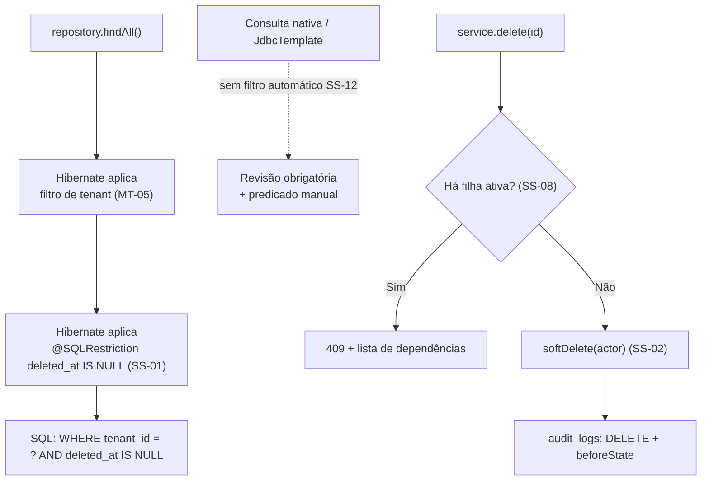

# ADR-034 — Estratégia técnica de soft delete: `@SQLRestriction`, índices parciais e restauração explícita

## Status

**Aceito** em 2026-07-29.
Detalha a implementação de [ADR-003](ADR-003-soft-delete.md). Fundamenta `ART-055`.

## Data

2026-07-29

## Contexto

[ADR-003](ADR-003-soft-delete.md) decidiu **que** a exclusão é lógica. Este ADR decide **como** essa regra é aplicada de forma que o desenvolvedor (e o agente) não possa esquecê-la.

A exigência central de SD-04 é: *registro excluído desaparece de toda consulta padrão, sem exigir predicado escrito pelo desenvolvedor*. Se a aplicação do filtro depender de lembrança, uma única omissão expõe registro excluído — e o modo de falha é silencioso.

Restrições:

| # | Restrição | Origem |
|---|---|---|
| R-01 | Registro excluído invisível em toda consulta padrão, automaticamente | SD-04 |
| R-02 | Índices únicos parciais para permitir recadastro | SD-06, `ART-055` |
| R-03 | Exclusão de pai bloqueada quando houver filha ativa; sem cascata | SD-05 |
| R-04 | Relatórios históricos precisam **incluir** registros excluídos quando a regra exigir | `ART-005` |
| R-05 | A camada 2 do isolamento de tenant também usa filtro Hibernate | MT-05 de [ADR-001](ADR-001-multi-tenant.md) |
| R-06 | Exclusão e restauração são auditadas | SD-07, SD-08 |

## Decisão

| # | Regra |
|---|---|
| SS-01 | Toda entidade soft-deletable declara **`@SQLRestriction("deleted_at IS NULL")`** na classe. O predicado passa a ser adicionado pelo Hibernate a **toda** consulta sobre a entidade (R-01). |
| SS-02 | A exclusão é executada por um método de domínio (`softDelete(actorId, clock)`) em `BaseEntity`, que preenche `deletedAt` e `deletedBy` de forma atômica e coerente. |
| SS-03 | `repository.delete()` e `deleteById()` são **proibidos** em entidades de domínio; o repositório de domínio não expõe métodos de exclusão física. |
| SS-04 | Consultas que precisam **incluir** excluídos (R-04) usam um repositório ou método explicitamente marcado, com consulta nativa ou `@Query` sem a restrição, sempre acompanhado de justificativa e de permissão específica. Não existe *flag* genérica de "incluir excluídos". |
| SS-05 | Todo índice único de entidade soft-deletable é **parcial**: `... WHERE deleted_at IS NULL` (R-02, `ART-055`). |
| SS-06 | Índices de listagem frequentemente usados também são parciais, reduzindo tamanho e melhorando seletividade. |
| SS-07 | Constraint `CHECK ((deleted_at IS NULL) = (deleted_by IS NULL))` garante coerência do par (SS-02). |
| SS-08 | A verificação de dependências ativas (R-03) ocorre na **camada de serviço**, antes da exclusão, e produz `409` com a lista do que impede. Não é feita por FK nem por trigger. |
| SS-09 | A **restauração** é um método de serviço explícito, com permissão própria, que valida se a restauração é possível (ex.: a chave natural não foi reutilizada por outro registro ativo) e é auditada (R-06). |
| SS-10 | Registro excluído é **imutável**: qualquer operação de escrita sobre ele é rejeitada, exceto a restauração (SD-11). |
| SS-11 | A ordem de aplicação dos filtros é: **tenant primeiro, exclusão depois**. Um registro excluído de outro tenant é, portanto, duplamente invisível (R-05). |
| SS-12 | Consultas nativas (`nativeQuery = true`) e acesso via `JdbcTemplate` **não** recebem o filtro automaticamente; seu uso exige revisão do Arquiteto e inclusão manual do predicado. |
| SS-13 | Contagens e agregações seguem a mesma regra: por padrão, excluem os registros logicamente excluídos. |
| SS-14 | A purga física (SD-09) usa um caminho de código **separado e explícito**, fora dos repositórios de domínio, com auditoria própria. |

## Motivação

**Por que `@SQLRestriction` (SS-01) — a decisão central:** ele é aplicado pelo Hibernate no nível da **entidade**, o que significa que consultas derivadas de repositório, JPQL, `Specification`, navegação por associação e carregamento preguiçoso **todos** recebem o predicado. Nenhum desses caminhos depende de o desenvolvedor lembrar. É a mesma filosofia da camada 2 do isolamento de tenant: o controle crítico precisa ser algo que não se escreve, portanto não se esquece.

**Por que não uma *flag* genérica de "incluir excluídos" (SS-04):** um parâmetro como `includeDeleted` acabaria sendo passado por engano, ou exposto na API, e transformaria a exceção em caminho fácil. Exigir um método explicitamente marcado torna cada uso visível em revisão e contável.

**Por que verificar dependências no serviço e não por FK (SS-08):** a FK verifica existência de **linha**, não de linha *ativa*. Como as filhas continuam existindo após a exclusão lógica, uma FK com `RESTRICT` bloquearia a exclusão do pai mesmo quando todas as filhas estivessem excluídas — comportamento errado. A verificação precisa considerar `deleted_at IS NULL` nas filhas, o que é lógica de negócio, não integridade estrutural (coerente com PG-06 de [ADR-006](ADR-006-postgresql.md)).

**Por que índices parciais (SS-05):** sem eles, um cliente excluído bloquearia para sempre o recadastro do mesmo CNPJ. O índice parcial faz a unicidade valer apenas entre os registros ativos — exatamente a semântica desejada. Este é o recurso do PostgreSQL que torna toda a estratégia viável ([ADR-006](ADR-006-postgresql.md)).

**Por que restauração valida antes de executar (SS-09):** entre a exclusão e a restauração, outro registro pode ter assumido a mesma chave natural (justamente porque SS-05 o permite). Restaurar sem validar violaria o índice parcial e produziria erro de constraint em vez de mensagem útil.

**Por que registro excluído é imutável (SS-10):** editar um registro excluído produz um estado sem significado — algo que "não existe" mas mudou. Também abriria caminho para burlar a auditoria: alterar o registro enquanto ele está invisível e depois restaurá-lo.

**Por que tenant antes de exclusão (SS-11):** garante que nenhuma consulta que investigue registros excluídos (SS-04) possa alcançar outro tenant. A exceção de exclusão nunca é exceção de tenancy.

## Alternativas consideradas

### A1 — Predicado `deleted_at IS NULL` escrito manualmente em cada consulta

| Aspecto | Avaliação |
|---|---|
| **Prós** | Explícito e visível no código; nenhuma "mágica"; controle total sobre quando incluir excluídos. |
| **Contras** | Depende de disciplina em 100% das consultas, para sempre; uma omissão expõe registro excluído silenciosamente; agentes de IA replicam omissões a partir de exemplos; navegação por associação não teria como aplicar o predicado. |
| **Por que foi descartada** | Mesmo raciocínio de A4 de [ADR-001](ADR-001-multi-tenant.md): controle crítico não pode depender de lembrança. |

### A2 — `@Where` (anotação legada do Hibernate)

| Aspecto | Avaliação |
|---|---|
| **Prós** | Mesmo efeito prático de `@SQLRestriction`; amplamente conhecida; muito material disponível. |
| **Contras** | **Descontinuada** no Hibernate 6 em favor de `@SQLRestriction`; manter uma anotação obsoleta cria trabalho de migração futuro. |
| **Por que foi descartada** | É a versão antiga da mesma solução. `@SQLRestriction` é a forma atual e suportada. |

### A3 — Filtro Hibernate (`@Filter`) ativado por interceptor, como no tenant

| Aspecto | Avaliação |
|---|---|
| **Prós** | Pode ser **desativado** por sessão, o que facilita consultas históricas (R-04); mesma mecânica já usada para tenancy, portanto familiar. |
| **Contras** | Precisa ser ativado explicitamente em toda sessão — se o interceptor falhar em algum caminho (job, listener, evento assíncrono), o filtro não é aplicado e **todos** os registros excluídos ficam visíveis; a possibilidade de desativar é justamente o risco. |
| **Por que foi descartada** | Para tenancy, a ativação por interceptor é necessária porque o valor do filtro (o `tenantId`) é dinâmico por requisição. Para soft delete, o predicado é **constante**, o que permite usar `@SQLRestriction` — que não pode ser esquecido nem desativado. Preferir a solução mais rígida onde ela é possível é o critério. |

### A4 — Views que filtram registros excluídos

| Aspecto | Avaliação |
|---|---|
| **Prós** | Filtro no banco, aplicável inclusive a consultas nativas (resolveria SS-12); transparente para a aplicação. |
| **Contras** | Uma view por tabela, dobrando os objetos de schema e o custo de migration; escrita através de view é limitada; o mapeamento JPA ficaria confuso (entidade mapeada para view, escrita para tabela); dificulta as consultas históricas de R-04. |
| **Por que foi descartada** | Dobra a superfície de schema e complica a escrita, para resolver apenas o caso residual de SS-12 — que é tratado por revisão obrigatória. |

### A5 — Interceptor de aplicação que reescreve o SQL

| Aspecto | Avaliação |
|---|---|
| **Prós** | Cobriria também consultas nativas; um único ponto de aplicação. |
| **Contras** | Reescrever SQL por interceptação é frágil e difícil de depurar; falha de forma imprevisível em consultas complexas; comportamento não óbvio para quem lê o código. |
| **Por que foi descartada** | O risco de reescrita incorreta de SQL em um sistema financeiro supera o benefício. |

## Consequências

### Positivas

| # | Consequência |
|---|---|
| C+01 | Registro excluído invisível automaticamente em todos os caminhos JPA (SS-01). |
| C+02 | Impossível esquecer o filtro em consulta derivada, JPQL ou `Specification`. |
| C+03 | Recadastro de chave natural funciona (SS-05). |
| C+04 | Exclusão bloqueada com mensagem útil, não com erro de FK (SS-08). |
| C+05 | Consultas históricas possíveis, mas explícitas e contáveis (SS-04). |
| C+06 | Registro excluído de outro tenant duplamente invisível (SS-11). |
| C+07 | Índices parciais são menores que os totais equivalentes. |

### Negativas

| # | Consequência | Aceita porque |
|---|---|---|
| C-01 | `@SQLRestriction` não se aplica a consulta nativa nem a `JdbcTemplate` (SS-12). | Uso restrito e revisado; é a única lacuna conhecida. |
| C-02 | Consultas históricas exigem caminho de código separado. | É o custo de tornar a exceção visível. |
| C-03 | O predicado adicional aparece em todo SQL gerado, tornando-o mais verboso na depuração. | Aceitável; o predicado é indexado. |
| C-04 | SS-08 exige uma consulta de verificação antes de cada exclusão de entidade com filhas. | Consulta indexada e barata; a alternativa (FK) daria o comportamento errado. |
| C-05 | Índices parciais são sintaticamente mais complexos nas migrations. | Padronizado por convenção. |

### Limitações

| # | Limitação |
|---|---|
| L-01 | SS-12 é uma lacuna estrutural: o filtro não alcança SQL escrito fora do JPA. |
| L-02 | `@SQLRestriction` não pode ser desativado por sessão (é a sua virtude e sua limitação). |
| L-03 | Agregações no banco feitas por consulta nativa precisam do predicado manual. |

### Custos

| Item | Custo |
|---|---|
| Implementação | Anotação em `BaseEntity` e nas entidades; verificação de dependências por entidade com filhas |
| Runtime | Um predicado indexado por consulta |
| Migration | Índices parciais em todas as chaves naturais |

## Trade-offs

| Sacrificado | Em favor de | Justificativa da troca |
|---|---|---|
| **Flexibilidade** de desativar o filtro por sessão (A3) | Impossibilidade de esquecer | O predicado é constante; a rigidez é gratuita e o esquecimento é fatal. |
| **Cobertura** de consultas nativas (A4, A5) | Simplicidade e previsibilidade | A lacuna é pequena e é coberta por revisão obrigatória. |
| **Conveniência** de uma flag genérica | Visibilidade de cada exceção | Flag genérica transformaria a exceção em caminho comum. |
| **Integridade por FK** na exclusão | Semântica correta de "filha ativa" | FK bloquearia mesmo com todas as filhas excluídas. |
| **Simplicidade** dos índices únicos | Possibilidade de recadastro | Sem índice parcial, a exclusão lógica seria percebida como bug. |

## Impacto na arquitetura

| Módulo | Impacto |
|---|---|
| `shared/persistence` | `BaseEntity` com `@SQLRestriction`, `softDelete()` e `restore()`. |
| `shared/persistence` | Repositório base de domínio que **não** expõe `delete()`/`deleteById()` (SS-03). |
| Toda feature | Verificação de dependências ativas no serviço (SS-08). |
| `report` | Consultas históricas explícitas (SS-04). |
| `audit` | Exclusão e restauração auditadas (R-06). |
| `tenant` | Purga física em caminho separado (SS-14). |

| Documento dependente | Relação |
|---|---|
| `docs/ai/project-constitution.md` | ART-051, ART-055, P-03 |
| `docs/03-architecture/database.md` §5.3 | Índices únicos parciais |
| `docs/03-architecture/backend.md` §7.3 | `BaseEntity` |
| `docs/ai/backend-rules.md` | `BR-020` a `BR-039` |

| Spec dependente | Relação |
|---|---|
| Todas as specs | Dimensão obrigatória "Soft delete" da §8.1 de `specs/README.md` |

| ADR relacionado | Relação |
|---|---|
| [ADR-003](ADR-003-soft-delete.md) | Decisão que este ADR implementa |
| [ADR-001](ADR-001-multi-tenant.md) | Ordem dos filtros (SS-11) |
| [ADR-006](ADR-006-postgresql.md) | Índices parciais |
| [ADR-018](ADR-018-auditing.md) | Auditoria de exclusão e restauração |
| [ADR-036](ADR-036-report-generation.md) | Consultas históricas (R-04) |

## Impacto no banco

| Item | Impacto |
|---|---|
| Índice único | `CREATE UNIQUE INDEX uq_<tabela>_<colunas> ON <tabela> (tenant_id, <colunas>) WHERE deleted_at IS NULL;` |
| Índice de listagem | Parcial quando a consulta dominante for de registros ativos (SS-06). |
| Constraint | `ck_<tabela>_deleted_pair`: `CHECK ((deleted_at IS NULL) = (deleted_by IS NULL))` (SS-07). |
| FK | Nenhuma com `ON DELETE CASCADE` (não há `DELETE` a propagar). |
| SQL gerado | Todo `SELECT` sobre entidade soft-deletable inclui `deleted_at IS NULL`. |
| Purga | Caminho separado (SS-14), com `DELETE` físico permitido apenas ali. |

## Impacto na API

| Item | Impacto |
|---|---|
| `DELETE` | Exclusão lógica; `204 No Content`. |
| Bloqueio | `409` com `conflictingResource` listando as dependências ativas (SS-08). |
| Restauração | Endpoint de ação explícito, com permissão própria (SS-09). |
| Restauração impossível | `409` quando a chave natural foi reutilizada, com mensagem específica. |
| Listagens | Nunca retornam excluídos; não existe parâmetro genérico para incluí-los (SS-04). |
| Edição de excluído | `409` ou `404`, conforme a permissão do solicitante (SS-10). |

## Impacto no Frontend

| Item | Impacto |
|---|---|
| Exclusão | Diálogo de confirmação informando que a ação é reversível pelo administrador. |
| Bloqueio | Mensagem que **nomeia** as dependências e oferece navegação até elas. |
| Restauração | Tela disponível apenas a papéis com a permissão correspondente. |
| Estado | Após exclusão, o item sai da lista otimisticamente; erro reverte. |
| Linguagem | Nunca usar "excluído permanentemente" (é factualmente falso). |

## Impacto na Infraestrutura

| Item | Impacto |
|---|---|
| Armazenamento | Linhas excluídas permanecem até a purga; monitorado por métrica de tamanho de tabela. |
| Jobs | `TenantPurgeJob` executa SS-14 ([ADR-039](ADR-039-background-jobs.md)). |
| `autovacuum` | Não recupera espaço de registros logicamente excluídos. |

## Segurança

| # | Consideração |
|---|---|
| S-01 | SS-01 é o controle que impede vazamento passivo de registro excluído. |
| S-02 | SS-11 garante que a exceção de exclusão nunca contorne o isolamento de tenant. |
| S-03 | SS-04 torna cada consulta histórica visível e revisável, em vez de um parâmetro fácil de abusar. |
| S-04 | SS-09 (restauração privilegiada e auditada) impede que dado ocultado deliberadamente reapareça sem registro. |
| S-05 | SS-10 impede alteração silenciosa de registro invisível. |
| S-06 | **Multi-tenant:** registro excluído mantém o mesmo controle de acesso do ativo; nunca há relaxamento por estar excluído. |
| S-07 | **LGPD:** soft delete não é eliminação; o direito do titular é atendido por SS-14 e pela pseudonimização da trilha ([ADR-018](ADR-018-auditing.md) AU-17). |
| S-08 | **Auditoria:** exclusão, tentativa bloqueada, restauração e purga são todas registradas. |

## Performance

| # | Consideração |
|---|---|
| P-01 | O predicado `deleted_at IS NULL` é altamente seletivo e coberto por índices parciais. |
| P-02 | Índices parciais são **menores** que os totais equivalentes, o que pode melhorar a performance em relação a um cenário sem soft delete com o mesmo volume lógico. |
| P-03 | SS-08 adiciona uma consulta indexada antes de cada exclusão de entidade com filhas. |
| P-04 | Contagens (SS-13) precisam do predicado; em tabelas grandes, usa-se estimativa ou contador desnormalizado quando a spec permitir. |
| P-05 | Tabelas maiores aumentam o custo de varredura sequencial; toda listagem é indexada e paginada. |

## Escalabilidade

| # | Consideração |
|---|---|
| E-01 | A proporção de registros excluídos é tipicamente baixa; o crescimento adicional é marginal. |
| E-02 | Índices parciais mantêm o custo de indexação proporcional aos registros **ativos**, não ao total. |
| E-03 | Se a proporção crescer, arquivamento por partição é o próximo passo, sem alterar esta estratégia. |
| E-04 | A purga (SS-14) executa em lote com limite por execução, evitando transação longa. |

## Riscos

| # | Risco | Probabilidade | Impacto | Severidade |
|---|---|---|---|---|
| RK-01 | Consulta nativa sem o predicado expondo registro excluído (SS-12) | Média | Alto | **Alta** |
| RK-02 | Índice único criado sem a cláusula parcial | Média | Médio | Média |
| RK-03 | Verificação de dependências esquecida em entidade com filhas | Média | Médio | Média |
| RK-04 | Restauração violando índice parcial por chave reutilizada | Média | Baixo | Baixa |
| RK-05 | `repository.delete()` usado por engano | Baixa | Alto | Média |
| RK-06 | Consulta histórica (SS-04) usada indevidamente em fluxo comum | Baixa | Médio | Baixa |
| RK-07 | Agregações incluindo excluídos por consulta nativa | Média | Médio | Média |

## Mitigações

| Risco | Mitigação | Verificação |
|---|---|---|
| RK-01 | SS-12: `nativeQuery` exige revisão do Arquiteto; regra ArchUnit que lista e conta os usos; teste que exclui e reconsulta em cada endpoint de listagem | ArchUnit + teste |
| RK-02 | Padrão obrigatório (`ART-055`); teste por entidade que exclui e recadastra a mesma chave natural | Teste de unicidade |
| RK-03 | SS-08 declarada na spec de cada feature com filhas; teste que tenta excluir pai com filha ativa | `acceptance.md` |
| RK-04 | SS-09 valida antes de executar e retorna `409` com mensagem específica; teste do cenário | Teste de restauração |
| RK-05 | SS-03: o repositório base de domínio não expõe métodos de exclusão física; regra ArchUnit | ArchUnit |
| RK-06 | Métodos de SS-04 nomeados de forma explícita (`findAllIncludingDeletedForReport`) e protegidos por permissão; contagem de usos em revisão | Revisão |
| RK-07 | Toda agregação nativa é revisada com atenção específica ao predicado; teste que compara agregação com e sem registro excluído | Teste de agregação |

## Referências

| Fonte | Uso |
|---|---|
| [Hibernate ORM 6 — `@SQLRestriction`](https://docs.jboss.org/hibernate/orm/6.4/javadocs/org/hibernate/annotations/SQLRestriction.html) | SS-01 |
| [Hibernate ORM 6 — Filters](https://docs.jboss.org/hibernate/orm/6.4/userguide/html_single/Hibernate_User_Guide.html#pc-filter) | Alternativa A3 |
| [PostgreSQL — Partial Indexes](https://www.postgresql.org/docs/16/indexes-partial.html) | SS-05 |
| [PostgreSQL — CHECK constraints](https://www.postgresql.org/docs/16/ddl-constraints.html) | SS-07 |
| [Martin Fowler — Audit Log](https://martinfowler.com/eaaDev/AuditLog.html) | Relação com auditoria |
| `docs/03-architecture/database.md` §5.3 | Padrão de índice parcial |
