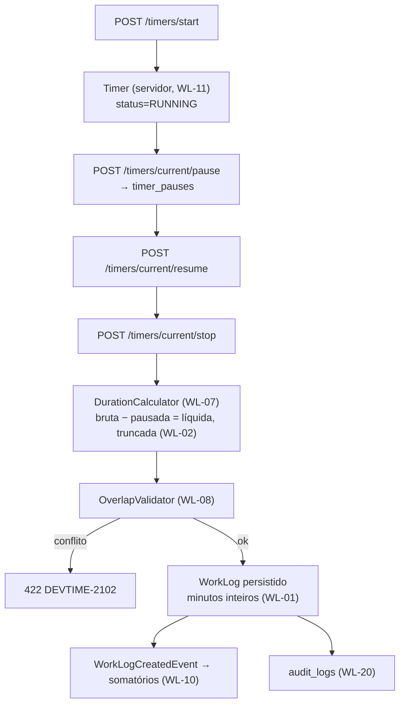

# ADR-035 — Arquitetura do registro de horas: `WorkLog` em minutos inteiros, com timer como estado do servidor

## Status

**Aceito** em 2026-07-29.
Fundamenta `ART-034`, `ART-035`, `ART-036`.
Absorve parcialmente o identificador legado `ADR-004` de `docs/03-architecture/architecture.md` §6 (durações em minutos inteiros).

## Data

2026-07-29

## Contexto

O `WorkLog` é a entidade central do produto: toda hora faturável, todo saldo de banco de horas e todo relatório derivam dele. Um erro aqui propaga para a fatura do cliente final.

O registro ocorre por dois caminhos:

| Caminho | Descrição |
|---|---|
| Manual | O usuário informa início, fim (ou duração) e descrição |
| Cronômetro | O usuário inicia, pausa, retoma e encerra; o sistema calcula a duração |

Restrições:

| # | Restrição | Origem |
|---|---|---|
| R-01 | Durações em minutos inteiros; ponto flutuante proibido | `ART-034`, `P-04` |
| R-02 | Segundos são **truncados**, não arredondados | `ART-036` |
| R-03 | Instantes em UTC (`TIMESTAMPTZ`); datas de calendário no fuso do tenant | `ART-030`, `ART-031` |
| R-04 | Nenhum estado de negócio em memória; o timer sobrevive a reinício | `ART-080`, AQ-04 |
| R-05 | Cronômetro em duas abas reflete a mesma fonte | CE-A-03 |
| R-06 | Feedback percebido ao iniciar o cronômetro em menos de 200 ms | AQ-02 |
| R-07 | Sem sobreposição de sessões do mesmo usuário | RN-102 |
| R-08 | Rastreabilidade até usuário, ticket, contrato e cliente | `ART-003` |
| R-09 | ~500k work logs por tenant por ano em uso intenso | `architecture.md` §10.2 |

## Decisão

### Representação da duração

| # | Regra |
|---|---|
| WL-01 | Toda duração é armazenada como **`INTEGER` de minutos**. `FLOAT`, `DOUBLE`, `DECIMAL` e `INTERVAL` são proibidos (R-01). |
| WL-02 | Segundos são **truncados** na persistência de sessões de trabalho (R-02). |
| WL-03 | A exibição usa `HH:MM` (`ART-035`); a hora decimal com 2 casas aparece **apenas** em relatórios financeiros. |
| WL-04 | A API troca durações em **minutos inteiros**; a formatação é responsabilidade da apresentação. |
| WL-05 | O `WorkLog` registra três durações distintas: **bruta** (fim − início), **pausada** e **líquida** (bruta − pausada). A líquida é a base de faturamento. |

### Estrutura e cálculo

| # | Regra |
|---|---|
| WL-06 | O `WorkLog` armazena `startedAt`/`endedAt` como `TIMESTAMPTZ` (UTC) e `workDate` como `DATE` **no fuso do tenant** (R-03). O `workDate` é derivado, persistido e indexado — não recalculado a cada consulta. |
| WL-07 | O cálculo de duração é responsabilidade de um componente puro `DurationCalculator` (CL-08 de [ADR-016](ADR-016-controller-service-repository.md)), testável sem banco. |
| WL-08 | A detecção de sobreposição (R-07) é responsabilidade de `OverlapValidator`, executado na **camada de serviço** com consulta ao banco (VL-05 de [ADR-015](ADR-015-validation.md)), **não** por constraint `EXCLUDE` do PostgreSQL. |
| WL-09 | `contractId` e `clientId` são **desnormalizados** em `work_logs` para viabilizar consultas de relatório sem múltiplos joins, com job diário de reconciliação (DA-03). |
| WL-10 | Somatórios em `Ticket` e em `ContractPeriod` são mantidos por **eventos de domínio** publicados após o commit, com job de reconciliação. |

### Timer

| # | Regra |
|---|---|
| WL-11 | O **estado do cronômetro é do servidor** (R-04, R-05): entidade `Timer` com `startedAt`, `status` e coleção `timer_pauses`. O cliente é uma projeção. |
| WL-12 | Existe **no máximo um** timer ativo por usuário, garantido por índice único parcial. |
| WL-13 | As transições do timer são **ações explícitas** de API (`POST /timers/current/pause`), não `PATCH` de status (AP-03 de [ADR-011](ADR-011-rest-api.md)). |
| WL-14 | O encerramento do timer publica `TimerCompletedEvent`, consumido **dentro da mesma transação** para criar o `WorkLog` — o timer nunca é encerrado sem gerar o registro correspondente. |
| WL-15 | O cliente calcula o tempo decorrido localmente para atender R-06, mas **reconcilia** com o servidor a cada carregamento e periodicamente. Divergência sempre resolve em favor do servidor. |
| WL-16 | Timers esquecidos são tratados por jobs: alerta em 8 h, abandono em 16 h, descarte após 7 dias (RN-163 a RN-165, [ADR-039](ADR-039-background-jobs.md)). |

### Imutabilidade e ciclo de vida

| # | Regra |
|---|---|
| WL-17 | Um `WorkLog` pertencente a período **fechado** é imutável: edição e exclusão são rejeitadas com `409`. |
| WL-18 | Alteração de `WorkLog` em período aberto publica evento que recalcula os somatórios afetados. |
| WL-19 | Exclusão é lógica ([ADR-003](ADR-003-soft-delete.md)) e ajusta os somatórios. |
| WL-20 | Toda criação, alteração e exclusão é auditada com `beforeState`/`afterState` ([ADR-018](ADR-018-auditing.md)). |

## Motivação

**Por que minutos inteiros (WL-01) — a decisão mais consequente:** somatórios de horas em ponto flutuante acumulam erro. `7.5 + 0.1 + 0.2` em IEEE-754 produz `7.800000000000001`; somado ao longo de centenas de lançamentos, o erro chega ao valor faturado e gera divergência de centavos em fatura — o tipo de defeito que destrói a confiança no produto. Em minutos, `450 + 6 + 12 = 468`, sempre, em qualquer plataforma. A aritmética inteira é exata, associativa e determinística.

**Por que truncar e não arredondar (WL-02):** arredondar para cima cobraria tempo não trabalhado. Truncar garante que o sistema **nunca** cobre a mais — uma escolha ética e comercial, não apenas técnica. Em disputa com o cliente, a política de truncamento é defensável; a de arredondamento, não.

**Por que três durações (WL-05):** a duração bruta é o que o relógio mostrou; a líquida é o que se fatura. Guardar apenas a líquida perderia a informação de quanto tempo a sessão levou de fato, impossibilitando auditar pausas. Guardar apenas a bruta obrigaria a recalcular a líquida a cada consulta, com risco de divergência.

**Por que `workDate` persistido (WL-06):** derivar a data no fuso do tenant a partir do `TIMESTAMPTZ` em toda consulta impediria o uso de índice (a expressão de conversão não é indexável de forma simples) e produziria resultados diferentes se o fuso do tenant mudasse. Persistir congela a decisão no momento do registro — que é o comportamento correto — e permite indexar.

**Por que sobreposição validada na aplicação (WL-08):** o PostgreSQL oferece constraint `EXCLUDE` com `tstzrange`, que resolveria o caso base. Mas a regra RN-102 tem exceções de negócio (casos em que a sobreposição é permitida) que uma constraint não modela, e o erro do banco não produz mensagem utilizável — precisaria informar **qual** registro conflita e em que intervalo. A validação na camada de serviço produz `422` com o registro conflitante identificado.

**Por que desnormalizar `contractId`/`clientId` (WL-09):** os relatórios agregam por contrato e por cliente. Sem a desnormalização, cada agregação exigiria join com `tickets` e `contracts`, degradando AQ-01 com 100k registros. O risco de divergência é mitigado por job de reconciliação, conforme DA-03 exige.

**Por que o timer é do servidor (WL-11):** R-04 e R-05 são inegociáveis. Um cronômetro em `localStorage` se perde ao trocar de máquina, diverge entre abas e não sobrevive à limpeza do navegador. O usuário perderia horas de trabalho registrado — o pior defeito possível em um produto de time tracking. AQ-04 exige que 50 cronômetros ativos sejam 100% recuperados após reinício do backend.

**Por que `TimerCompletedEvent` dentro da transação (WL-14):** se o timer fosse encerrado e o `WorkLog` criado em transações separadas, uma falha entre os dois deixaria tempo trabalhado sem registro. A atomicidade é obrigatória.

**Por que imutabilidade após fechamento (WL-17):** o período fechado gerou um snapshot assinado e, possivelmente, uma fatura enviada ao cliente ([ADR-036](ADR-036-report-generation.md)). Alterar um `WorkLog` depois faria o relatório regerado divergir do enviado, violando `ART-005`.

## Alternativas consideradas

### A1 — Duração em `NUMERIC(10,2)` de horas

| Aspecto | Avaliação |
|---|---|
| **Prós** | Legível diretamente (`7.50`); exata (decimal, não binária); formato usado em faturas. |
| **Contras** | Divisões produzem arredondamento (`1/3` de hora não é representável exatamente em 2 casas); somatórios exigem cuidado com a precisão; a unidade natural do domínio é o minuto, não o centésimo de hora. |
| **Por que foi descartada** | A exatidão em divisões e rateios (necessária no rateio de período, RN-211–217) é garantida por inteiros e não por decimais de precisão fixa. A hora decimal permanece como **formato de exibição** em relatórios financeiros (WL-03). |

### A2 — Duração em segundos inteiros

| Aspecto | Avaliação |
|---|---|
| **Prós** | Precisão maior; conversão trivial para qualquer unidade; também exata. |
| **Contras** | Precisão desnecessária: nenhum contrato é faturado por segundo; exigiria decidir política de arredondamento na exibição em toda tela; números maiores sem ganho. |
| **Por que foi descartada** | A unidade de negócio é o minuto. Guardar segundos criaria a pergunta "arredondar ou truncar?" em cada exibição, quando WL-02 já resolve o problema uma vez, na persistência. |

### A3 — `INTERVAL` do PostgreSQL

| Aspecto | Avaliação |
|---|---|
| **Prós** | Tipo semanticamente correto; aritmética de intervalo nativa; legível em consultas SQL. |
| **Contras** | Mapeamento JPA problemático (não há tipo Java padrão equivalente); aritmética com meses e dias tem semântica ambígua; portabilidade reduzida; comparações e somas exigem cuidado. |
| **Por que foi descartada** | O atrito de mapeamento e a ambiguidade semântica superam a expressividade. |

### A4 — Timer no cliente, sincronizado periodicamente

| Aspecto | Avaliação |
|---|---|
| **Prós** | Feedback instantâneo garantido; funciona offline; menos requisições ao servidor. |
| **Contras** | Viola R-04 (estado de negócio no cliente); perde-se ao trocar de máquina ou limpar o navegador; duas abas divergem (viola R-05); relógio do cliente pode estar errado ou ser manipulado; AQ-04 impossível de atender. |
| **Por que foi descartada** | O tempo registrado é a matéria-prima do faturamento; não pode depender do estado de um navegador. WL-15 captura o benefício de UX (feedback imediato) sem abrir mão da fonte de verdade. |

### A5 — Sobreposição impedida por constraint `EXCLUDE` do PostgreSQL

| Aspecto | Avaliação |
|---|---|
| **Prós** | Garantia absoluta no banco; imune a corrida entre requisições concorrentes; sem consulta prévia. |
| **Contras** | Não modela as exceções de negócio de RN-102; a mensagem de erro não identifica o registro conflitante; exige extensão `btree_gist`; interage mal com soft delete (o registro excluído continuaria ocupando o intervalo, a menos que a constraint fosse condicional); viola PG-06 (regra de negócio no banco). |
| **Por que foi descartada** | A incompatibilidade com soft delete e a ausência de mensagem útil são decisivas. A corrida residual (dois registros simultâneos que passam pela validação) é tratada por RN-102 com verificação dentro da transação. |

### A6 — Armazenar apenas a duração líquida

| Aspecto | Avaliação |
|---|---|
| **Prós** | Uma coluna a menos; menos chance de divergência entre valores. |
| **Contras** | Impossível auditar pausas; impossível responder "quanto tempo essa sessão levou de fato?"; a informação perdida não é recuperável. |
| **Por que foi descartada** | A auditabilidade das pausas é necessária em disputa sobre horas faturadas (`ART-003`). |

## Consequências

### Positivas

| # | Consequência |
|---|---|
| C+01 | Aritmética de saldo exata e determinística (F2-02: recalcular N vezes dá sempre o mesmo resultado). |
| C+02 | O sistema nunca cobra tempo não trabalhado (WL-02). |
| C+03 | Cronômetro sobrevive a recarga, troca de aba e reinício do backend (AQ-04, F1-03). |
| C+04 | Tempo trabalhado nunca é perdido: encerrar o timer sempre gera `WorkLog` (WL-14). |
| C+05 | Relatórios de período fechado permanecem reproduzíveis (WL-17). |
| C+06 | Consultas de relatório eficientes pela desnormalização (WL-09). |
| C+07 | Cálculo testável exaustivamente sem banco (WL-07). |

### Negativas

| # | Consequência | Aceita porque |
|---|---|---|
| C-01 | Minutos exigem formatação em toda exibição (WL-03). | Concentrada em um componente `dt-duration` e em um pipe. |
| C-02 | Truncar descarta até 59 segundos por sessão. | Deliberado e comunicado; favorece o cliente final. |
| C-03 | Desnormalização (WL-09) pode divergir. | Job diário de reconciliação, com alerta crítico em caso de divergência. |
| C-04 | Somatórios por evento (WL-10) podem divergir. | Mesmo job de reconciliação. |
| C-05 | Timer no servidor exige requisição a cada ação. | Mitigado por atualização otimista (WL-15, R-06). |
| C-06 | WL-08 adiciona uma consulta antes de cada gravação. | Consulta indexada por `(tenant_id, user_id, started_at)`. |
| C-07 | Imutabilidade após fechamento (WL-17) gera atrito quando há erro real. | Corrigido por lançamento de ajuste no período seguinte, com trilha. |

### Limitações

| # | Limitação |
|---|---|
| L-01 | Precisão limitada ao minuto: não atende cobrança por segundo (fora do escopo). |
| L-02 | Sem registro offline no MVP; o timer exige conectividade para iniciar e encerrar. |
| L-03 | A desnormalização exige job de reconciliação para permanecer confiável. |
| L-04 | Correção de erro em período fechado exige ajuste, não edição. |

### Custos

| Item | Custo |
|---|---|
| Armazenamento | ~500k linhas/tenant/ano; particionamento previsto acima de 50M linhas |
| Implementação | Núcleo do produto; a maior parte do esforço de F1 |
| Runtime | Consulta de sobreposição por gravação; eventos de somatório |

## Trade-offs

| Sacrificado | Em favor de | Justificativa da troca |
|---|---|---|
| **Legibilidade** direta da duração | Exatidão aritmética | Formatação é problema resolvido uma vez; erro de centavos, não. |
| **Precisão** ao segundo | Simplicidade e alinhamento com a unidade de negócio | Nenhum contrato é faturado por segundo. |
| **Até 59 segundos** por sessão (truncamento) | Nunca cobrar tempo não trabalhado | Escolha ética defensável em disputa. |
| **Normalização** do modelo (WL-09) | Desempenho de relatório | Mitigado por reconciliação; DA-03 autoriza com justificativa. |
| **Simplicidade** do timer no cliente | Durabilidade do tempo registrado | Perder horas trabalhadas é o pior defeito possível. |
| **Garantia de banco** contra sobreposição | Mensagem útil e compatibilidade com soft delete | A corrida residual é tratada na transação. |
| **Flexibilidade** de editar período fechado | Imutabilidade de relatório | `ART-005` é compromisso com o cliente final. |

## Impacto na arquitetura

| Módulo | Impacto |
|---|---|
| `worklog` | Entidade central, serviço, validadores, calculadora. |
| `timer` | Entidade `Timer`, `timer_pauses`, transições e jobs. |
| `contract/period` | Consome eventos para somatórios e saldo. |
| `ticket` | Consome eventos para somatório. |
| `report` | Consulta `work_logs` com os campos desnormalizados. |
| `shared/time` | Conversão de fuso, truncamento, formatação. |

| Documento dependente | Relação |
|---|---|
| `docs/02-domain/business-rules.md` | RN-102, RN-110–113, RN-163–165 |
| `docs/02-domain/entities.md` | `WorkLog`, `Timer`, invariantes `INV-WKL-*` |
| `docs/03-architecture/database.md` §7.8, §7.9 | Modelo físico |
| `docs/04-api/worklogs.md` | Contrato |

| Spec dependente | Relação |
|---|---|
| `specs/008-worklogs` | Implementa o núcleo |
| `specs/009-timer` | Implementa WL-11 a WL-16 |
| `specs/011-bank-hours` | Depende da exatidão de WL-01 |
| `specs/012-reports` | Depende de WL-09 e WL-17 |

| ADR relacionado | Relação |
|---|---|
| [ADR-006](ADR-006-postgresql.md) | Tipos e particionamento |
| [ADR-039](ADR-039-background-jobs.md) | Jobs de timer e reconciliação |
| [ADR-036](ADR-036-report-generation.md) | Imutabilidade (WL-17) |
| [ADR-024](ADR-024-signals.md) | Timer como projeção no cliente |
| [ADR-018](ADR-018-auditing.md) | Trilha de alterações |

## Impacto no banco

| Item | Impacto |
|---|---|
| Tipos | `gross_minutes`, `paused_minutes`, `net_minutes` como `INTEGER` (WL-01). |
| Instantes | `started_at`, `ended_at` como `TIMESTAMPTZ`; `work_date` como `DATE` (WL-06). |
| Índice principal | `(tenant_id, user_id, started_at)` — sustenta a verificação de sobreposição e a listagem por usuário. |
| Índices de relatório | `(tenant_id, contract_id, work_date)` e `(tenant_id, client_id, work_date)`, viabilizados por WL-09. |
| Constraints | `ck_work_logs_net_minutes_positive`; `ck_work_logs_end_after_start`; duração máxima de 24 h. |
| Timer | `uq_timers_user_active` parcial, garantindo no máximo um timer ativo por usuário (WL-12). |
| Particionamento | Por range de `work_date` a partir de 50M linhas (R-09). |
| Reconciliação | Job diário compara somatórios e campos desnormalizados (WL-09, WL-10). |

## Impacto na API

| Item | Impacto |
|---|---|
| Durações | Trocadas em **minutos inteiros** (WL-04); nunca em `HH:MM` nem em decimal. |
| Instantes | ISO-8601 com offset (`ART-033`). |
| Timer | Ações explícitas: `start`, `pause`, `resume`, `stop` (WL-13). |
| Estado do timer | `GET /timers/current` retorna início, pausas e status, permitindo ao cliente calcular o decorrido sem consultar a cada segundo (WL-15). |
| Erros | `422 DEVTIME-2102` (sobreposição, com o registro conflitante); `409` (período fechado, WL-17); `409` (timer já ativo, WL-12). |
| Idempotência | Ações de timer aceitam `Idempotency-Key` (`ART-074`), evitando duplicidade por reenvio. |

## Impacto no Frontend

| Item | Impacto |
|---|---|
| Entrada de duração | Componente `dt-duration-input` que aceita `HH:MM` e converte para minutos (PN-06 de [ADR-025](ADR-025-primeng.md)). |
| Exibição | Pipe de duração formatando minutos em `HH:MM`; nunca conversão manual espalhada. |
| Timer | `TimerStore` global como projeção do servidor (SG-12 de [ADR-024](ADR-024-signals.md)). |
| Feedback | Atualização otimista ao iniciar/pausar, com reconciliação (WL-15, R-06). |
| Reconciliação | Ao carregar a aplicação e periodicamente, consulta `GET /timers/current`; divergência resolve pelo servidor. |
| Período fechado | UI desabilita edição e exclusão, e explica o motivo. |

## Impacto na Infraestrutura

| Item | Impacto |
|---|---|
| Jobs | `TimerWatchdogJob` (15 min), `AbandonedTimerCleanupJob` (diário), `DenormalizationReconcileJob` (diário). |
| Armazenamento | Maior tabela de domínio; crescimento monitorado. |
| Relógio | O `startedAt` do timer é definido pelo **servidor**, nunca pelo cliente — imune a relógio incorreto ou manipulado. |
| Alertas | Divergência de desnormalização é alerta **crítico** (`architecture.md` §12). |

## Segurança

| # | Consideração |
|---|---|
| S-01 | O `startedAt` é definido pelo servidor: o cliente não pode forjar tempo trabalhado manipulando o relógio local. |
| S-02 | Lançamento manual com datas arbitrárias é limitado por regra de negócio (intervalo permitido) e auditado. |
| S-03 | Um `MEMBER` só cria, edita e exclui os próprios registros (ownership, AZ-03 de [ADR-010](ADR-010-role-permission.md)). |
| S-04 | A descrição do work log **nunca** é registrada em log de aplicação (`security.md` §9.2). |
| S-05 | WL-17 impede alteração retroativa de base de faturamento. |
| S-06 | **Multi-tenant:** `work_logs` é tenant-scoped; a verificação de sobreposição consulta **apenas** dentro do tenant e do usuário. |
| S-07 | **LGPD:** a descrição pode conter dado pessoal do cliente final; é exportável e purgável junto com o tenant. |
| S-08 | **Auditoria:** toda criação, alteração e exclusão gera trilha com `beforeState`/`afterState` (WL-20) — é a evidência usada em disputa. |

## Performance

| # | Consideração |
|---|---|
| P-01 | Aritmética inteira é a operação mais barata possível. |
| P-02 | WL-08 adiciona uma consulta indexada por gravação; sustentada por `(tenant_id, user_id, started_at)`. |
| P-03 | WL-09 elimina joins em consultas de relatório — principal ganho de AQ-01. |
| P-04 | WL-10 evita recalcular somatórios a cada leitura. |
| P-05 | WL-06 (`work_date` persistido) permite indexar a data no fuso do tenant. |
| P-06 | WL-15 atende AQ-02 sem requisição síncrona a cada segundo. |
| P-07 | Particionamento é a alavanca de escala quando a tabela crescer (R-09). |

## Escalabilidade

| # | Consideração |
|---|---|
| E-01 | ~500k linhas/tenant/ano; índices compostos iniciados por `tenant_id` mantêm as consultas seletivas. |
| E-02 | Particionamento por `work_date` a partir de 50M linhas, sem alteração de aplicação. |
| E-03 | Somatórios desnormalizados evitam agregações crescentes no caminho quente. |
| E-04 | Timers são poucos e efêmeros; a tabela permanece pequena com a limpeza de WL-16. |
| E-05 | Eventos síncronos (WL-10) podem migrar para assíncronos em F6 sem alterar o domínio ([ADR-042](ADR-042-rabbitmq.md)). |

## Riscos

| # | Risco | Probabilidade | Impacto | Severidade |
|---|---|---|---|---|
| RK-01 | Divergência entre campos desnormalizados e a fonte | Média | Alto | **Alta** |
| RK-02 | Corrida criando work logs sobrepostos apesar de WL-08 | Média | Alto | Alta |
| RK-03 | Timer perdido por falha, resultando em tempo não registrado | Baixa | Crítico | **Alta** |
| RK-04 | Conversão de fuso incorreta gravando `work_date` errado | Média | Alto | Alta |
| RK-05 | Formatação de duração divergente entre telas | Média | Baixo | Baixa |
| RK-06 | Somatórios divergentes por evento não processado | Média | Alto | Alta |
| RK-07 | Crescimento da tabela degradando consultas | Média | Médio | Média |

## Mitigações

| Risco | Mitigação | Verificação |
|---|---|---|
| RK-01 | `DenormalizationReconcileJob` diário; divergência gera **alerta crítico**; teste que altera o ticket e verifica a propagação | Job + alerta |
| RK-02 | Verificação dentro da transação com o índice apropriado; teste de concorrência criando dois work logs simultâneos | Teste de concorrência |
| RK-03 | WL-11 (estado no servidor) + WL-14 (mesma transação); teste que reinicia o backend com 50 timers ativos e verifica recuperação total (AQ-04) | Teste de resiliência |
| RK-04 | Conversão centralizada em `shared/time`; testes cobrindo virada de dia, horário de verão e fusos distintos; `Clock` injetado (TS-08) | Suíte de tempo |
| RK-05 | Formatação exclusivamente por pipe e componente `dt-duration`; lint contra conversão manual | Revisão |
| RK-06 | Eventos processados na mesma transação quando a consistência é obrigatória; reconciliação diária para os demais | Job de reconciliação |
| RK-07 | Índices compostos; particionamento planejado; monitoramento de consultas lentas | [ADR-047](ADR-047-monitoring.md) |

## Referências

| Fonte | Uso |
|---|---|
| [IEEE 754 — Limitações de ponto flutuante](https://docs.oracle.com/cd/E19957-01/806-3568/ncg_goldberg.html) | Fundamento de WL-01 |
| [PostgreSQL — Date/Time Types](https://www.postgresql.org/docs/16/datatype-datetime.html) | `TIMESTAMPTZ`, `DATE`, `INTERVAL` (A3) |
| [PostgreSQL — Exclusion Constraints](https://www.postgresql.org/docs/16/ddl-constraints.html#DDL-CONSTRAINTS-EXCLUSION) | Alternativa A5 |
| [Java — `java.time` e fusos IANA](https://docs.oracle.com/en/java/javase/21/docs/api/java.base/java/time/package-summary.html) | Conversão de fuso |
| [Martin Fowler — Value Object](https://martinfowler.com/bliki/ValueObject.html) | Modelagem de duração |
| `docs/02-domain/business-rules.md` | RN-102, RN-110–113, RN-163–165 |
| `docs/03-architecture/database.md` §5.4, §5.5, §7.8 | Decisões de modelagem |
