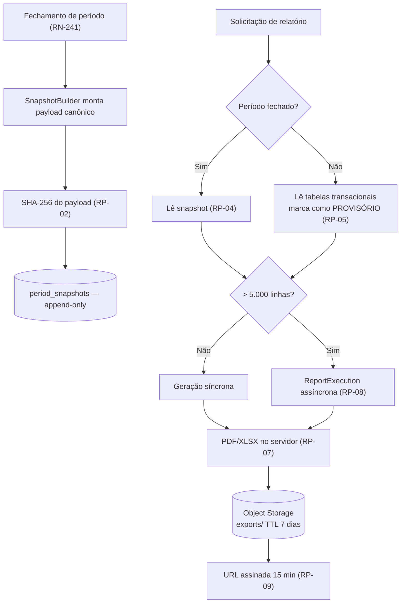

# ADR-036 — Relatórios determinísticos gerados a partir de snapshot imutável assinado

## Status

**Aceito** em 2026-07-29.
Fundamenta `ART-005`. Fase F3.

## Data

2026-07-29

## Contexto

`ART-005` estabelece que **relatórios são imutáveis no tempo**: um relatório gerado para um período fechado deve produzir sempre o mesmo resultado, independentemente de alterações cadastrais posteriores. O critério F3-01 exige que o PDF de um período fechado seja byte-idêntico ao regerá-lo (exceto a data de emissão).

Essa exigência decorre do uso real: o relatório é enviado ao cliente final como base de faturamento. Se o cliente pedir a segunda via seis meses depois e o documento vier diferente — porque o nome do cliente foi corrigido, uma categoria foi renomeada ou uma hora foi ajustada —, a credibilidade do fornecedor é destruída.

Restrições:

| # | Restrição | Origem |
|---|---|---|
| R-01 | Relatório de período fechado é reproduzível indefinidamente | `ART-005`, AQ-06, F3-01 |
| R-02 | Exportação em PDF e XLSX; o XLSX abre sem aviso de corrupção nas principais ferramentas | F3-02 |
| R-03 | Exportação assíncrona a partir de 5.000 linhas | RN-706, CE-A-04 |
| R-04 | Arquivos exportados expiram em 7 dias | §4.10 de `state-machines.md`, SG-04 |
| R-05 | Download por URL assinada com TTL de 15 min | RN-712 |
| R-06 | Snapshot com SHA-256 | RN-701 |
| R-07 | Chamada externa nunca dentro de transação de banco | TX-06 |

## Decisão

| # | Regra |
|---|---|
| RP-01 | Ao **fechar** um período, o sistema gera um **snapshot imutável** (`period_snapshots`) contendo todos os dados necessários para reproduzir o relatório: linhas de work log, totais, dados cadastrais de cliente e contrato **no momento do fechamento**, política aplicada e parâmetros de cálculo. |
| RP-02 | O snapshot é armazenado em `JSONB` e acompanhado de um **hash SHA-256** do payload canônico (R-06), permitindo detectar adulteração. |
| RP-03 | O snapshot é **append-only**: nunca é atualizado nem excluído. Não usa soft delete (SD-10 de [ADR-003](ADR-003-soft-delete.md)). |
| RP-04 | Relatório de período **fechado** é gerado **exclusivamente** a partir do snapshot, jamais consultando as tabelas transacionais (R-01). |
| RP-05 | Relatório de período **aberto** é gerado a partir das tabelas transacionais e é explicitamente marcado como **provisório** no documento. |
| RP-06 | A geração é **determinística**: mesma entrada produz saída byte-idêntica, exceto pelo carimbo de emissão, isolado em um campo identificado. Isso exige ordenação estável, fontes embarcadas, formatação com locale explícito e ausência de qualquer valor gerado aleatoriamente. |
| RP-07 | PDF é gerado no **servidor** a partir de template HTML (OpenPDF / Flying Saucer); XLSX é gerado com Apache POI. Nunca capturados do cliente ([ADR-026](ADR-026-chartjs.md) CH-08). |
| RP-08 | Exportações com **até 5.000 linhas** são síncronas; acima disso, assíncronas (R-03), com recurso de execução (`ReportExecution`) e estados observáveis. |
| RP-09 | O arquivo é armazenado em Object Storage sob a chave `{tenantId}/exports/{reportExecutionId}/{fileName}` ([ADR-038](ADR-038-file-storage.md)) e baixado por **URL assinada com TTL de 15 minutos** (R-05). |
| RP-10 | Arquivos exportados expiram em **7 dias** (R-04), por política de ciclo de vida no bucket e por job de expiração do registro. |
| RP-11 | A geração ocorre **fora** de transação de banco (R-07): os dados são lidos, a transação é encerrada e só então o documento é produzido e enviado ao storage. |
| RP-12 | Toda exportação é auditada: quem exportou, o quê, quando e com qual filtro ([ADR-018](ADR-018-auditing.md)). |
| RP-13 | O relatório respeita o **escopo de dados** do papel: um `MEMBER` exporta apenas os próprios registros (nota ⁵ de `permissions.md`). |
| RP-14 | O snapshot é versionado por um campo `schemaVersion`: mudanças em sua estrutura não invalidam snapshots antigos, que continuam sendo lidos pela versão correspondente do renderizador. |

## Motivação

**Por que snapshot e não regeração a partir das tabelas (RP-01/RP-04) — a decisão central:** os dados transacionais **mudam legitimamente** depois do fechamento. O cliente corrige a razão social; uma categoria é renomeada; um work log de outro período é ajustado; a política do contrato é alterada para o período seguinte. Nada disso é erro — mas tudo isso alteraria um relatório regerado a partir das tabelas. O snapshot congela o estado exato no instante do fechamento, que é o único estado que corresponde ao documento enviado ao cliente.

**Por que o snapshot contém dados cadastrais, não apenas referências (RP-01):** guardar apenas `clientId` não resolveria — o nome viria da tabela e teria mudado. O snapshot precisa conter o **valor**, não o ponteiro. É deliberadamente denormalizado e redundante: essa é sua função.

**Por que hash SHA-256 (RP-02):** permite detectar adulteração do snapshot, inclusive por acesso direto ao banco. Em uma disputa, poder demonstrar que o registro não foi alterado desde o fechamento tem valor probatório. Combinado com AU-07 de [ADR-018](ADR-018-auditing.md), forma o par de garantias de integridade do produto.

**Por que determinismo explícito (RP-06):** "byte-idêntico" não acontece por acaso. Ordenação não determinística de consulta, fonte resolvida do sistema operacional, formatação dependente do locale padrão da JVM e metadados de criação do PDF são fontes reais de divergência. Cada uma precisa ser controlada deliberadamente.

**Por que gerar no servidor (RP-07):** captura do cliente produziria documento dependente de resolução, tema, versão de navegador e fontes instaladas — tornando R-01 impossível.

**Por que assíncrono acima de 5.000 linhas (RP-08):** uma exportação de 100k linhas leva minutos; mantê-la síncrona significaria conexão HTTP aberta por minutos, sujeita a timeout de proxy, com o usuário bloqueado e sem meio de recuperar o resultado se a conexão cair. O recurso de execução torna o progresso observável e o resultado recuperável.

**Por que fora de transação (RP-11):** a geração envolve CPU intensa e chamada ao Object Storage. Mantê-la em transação seguraria uma conexão de banco por minutos e violaria TX-06 e TX-07.

**Por que URL assinada com TTL curto (RP-09):** o relatório contém dados financeiros e possivelmente pessoais. Uma URL permanente vazaria por histórico de navegador, log de proxy ou encaminhamento de e-mail. Quinze minutos é suficiente para o download e curto o bastante para limitar a exposição.

**Por que `schemaVersion` no snapshot (RP-14):** em dois anos, a estrutura do snapshot terá mudado. Sem versionamento, ou os snapshots antigos se tornariam ilegíveis, ou o renderizador acumularia condicionais implícitas. O campo torna a compatibilidade explícita.

## Alternativas consideradas

### A1 — Regerar o relatório a partir das tabelas transacionais

| Aspecto | Avaliação |
|---|---|
| **Prós** | Sem armazenamento adicional; sem duplicação de dados; sempre reflete o estado atual; menos código. |
| **Contras** | Viola R-01 de forma direta: alterações cadastrais posteriores mudam o documento; impossível provar o que foi enviado ao cliente; períodos antigos exigiriam consultas cada vez mais caras. |
| **Por que foi descartada** | Falha no requisito central. "Sempre reflete o estado atual" é exatamente o comportamento **indesejado** para um documento já enviado. |

### A2 — Armazenar o PDF gerado, em vez do snapshot dos dados

| Aspecto | Avaliação |
|---|---|
| **Prós** | Reprodutibilidade absoluta e trivial (é o mesmo arquivo); sem risco de divergência de renderização. |
| **Contras** | Formato único: um XLSX ou uma visualização em tela do mesmo período exigiriam outro artefato; correção de defeito de **layout** não pode ser aplicada a documentos antigos; armazenamento maior; o conteúdo não é consultável nem agregável. |
| **Por que foi descartada como fonte** | O snapshot dos **dados** é mais flexível: permite gerar PDF, XLSX e visualização em tela a partir da mesma fonte, e permite corrigir o template sem falsificar os dados. O PDF gerado **também** é armazenado (RP-09), mas como conveniência com validade de 7 dias, não como fonte de verdade. |

### A3 — Snapshot apenas dos totais, com detalhamento vindo das tabelas

| Aspecto | Avaliação |
|---|---|
| **Prós** | Snapshot muito menor; totais garantidos; menos armazenamento. |
| **Contras** | O detalhamento (linha a linha) é justamente o que o cliente contesta em uma disputa; totais que não batem com o detalhamento exibido seriam pior que nenhum snapshot. |
| **Por que foi descartada** | Garantia parcial em documento financeiro é pior que evidente ausência de garantia, porque cria confiança indevida. |

### A4 — Geração de PDF no cliente (jsPDF, impressão do navegador)

| Aspecto | Avaliação |
|---|---|
| **Prós** | Sem carga de CPU no servidor; resposta imediata; sem armazenamento. |
| **Contras** | Resultado depende de navegador, resolução, fontes e tema; impossível garantir R-01; exportações grandes travam a aba; o cliente precisaria receber todos os dados, contrariando o escopo de dados (RP-13). |
| **Por que foi descartada** | Reprodutibilidade impossível e exposição desnecessária de dados. |

### A5 — Ferramenta externa de BI ou de relatórios (JasperReports Server, Metabase)

| Aspecto | Avaliação |
|---|---|
| **Prós** | Recursos ricos de layout; editor visual; agendamento pronto. |
| **Contras** | Um serviço a mais para operar; conectaria diretamente ao banco, contornando o isolamento de tenant da aplicação (falha crítica de segurança); licenciamento; templates fora do controle de versão do projeto. |
| **Por que foi descartada** | Qualquer ferramenta que consulte o banco diretamente contorna as camadas de isolamento de [ADR-001](ADR-001-multi-tenant.md) — risco inaceitável em multi-tenancy por coluna discriminadora. |

### A6 — Exportação sempre síncrona

| Aspecto | Avaliação |
|---|---|
| **Prós** | Muito mais simples: sem recurso de execução, sem estados, sem job. |
| **Contras** | Timeout em exportações grandes; conexão HTTP presa por minutos; resultado perdido se a conexão cair; thread do servidor ocupada. |
| **Por que foi descartada** | R-03 define o limite; acima dele, o modelo síncrono simplesmente não funciona. Abaixo, ele **é** usado (RP-08) — a decisão é híbrida por desenho. |

## Consequências

### Positivas

| # | Consequência |
|---|---|
| C+01 | R-01, AQ-06 e F3-01 atendidos: o relatório é reproduzível indefinidamente. |
| C+02 | O snapshot serve PDF, XLSX e visualização em tela a partir da mesma fonte. |
| C+03 | Integridade demonstrável pelo hash (RP-02). |
| C+04 | Correção de layout aplicável a documentos antigos sem alterar os dados. |
| C+05 | Exportações grandes não bloqueiam o usuário (RP-08). |
| C+06 | Exposição do arquivo limitada a 15 minutos (RP-09). |
| C+07 | Relatórios antigos não dependem de consultas cada vez mais caras nas tabelas transacionais. |

### Negativas

| # | Consequência | Aceita porque |
|---|---|---|
| C-01 | Duplicação deliberada de dados no snapshot. | É a função do snapshot; sem redundância, não há congelamento. |
| C-02 | `period_snapshots` cresce sem limpeza (imutável). | ~12 por contrato por ano; `JSONB` comprimido por TOAST. |
| C-03 | Complexidade do fluxo assíncrono (execução, estados, job, limpeza). | Necessária acima do limite de R-03. |
| C-04 | Determinismo (RP-06) exige cuidado permanente em cada alteração do gerador. | Verificado por teste de reprodutibilidade. |
| C-05 | Correção de erro **nos dados** de um período fechado não altera o snapshot. | Deliberado: a correção é um ajuste no período seguinte, com trilha. |
| C-06 | Geração de PDF/XLSX é CPU-intensa e concorre com o tráfego transacional. | Isolada em pool próprio; candidata à extração em F6. |

### Limitações

| # | Limitação |
|---|---|
| L-01 | Snapshot só existe para período **fechado**; relatórios de período aberto são provisórios por natureza (RP-05). |
| L-02 | Alteração de layout muda a aparência de documentos antigos, ainda que os dados sejam idênticos — F3-01 refere-se a dados e a estabilidade de renderização com o **mesmo** template. |
| L-03 | O snapshot não captura o que **não** entrou no período (registros lançados depois com data retroativa bloqueada). |

### Custos

| Item | Custo |
|---|---|
| Armazenamento | `JSONB` por período fechado; comprimido |
| Implementação | ~5 dias (snapshot, geradores, fluxo assíncrono) |
| CPU | Geração de PDF/XLSX; isolada em pool próprio |
| Storage | Arquivos exportados, expirados em 7 dias |

## Trade-offs

| Sacrificado | Em favor de | Justificativa da troca |
|---|---|---|
| **Normalização** dos dados | Congelamento do estado no fechamento | Sem redundância, não existe imutabilidade. |
| **Armazenamento** | Valor probatório | Custo baixo frente ao risco de perder uma disputa. |
| **Simplicidade** (só síncrono) | Viabilidade de exportações grandes | Acima de 5.000 linhas o modelo síncrono não funciona. |
| **Reflexo do estado atual** | Fidelidade ao documento enviado | O usuário que quer o estado atual gera relatório do período aberto. |
| **Flexibilidade** de corrigir período fechado | Confiança no documento | Correção é feita por ajuste rastreável, não por reescrita. |
| **Recursos de uma ferramenta de BI** | Segurança de isolamento e controle de versão | Ferramenta que acessa o banco direto contorna o isolamento. |

## Impacto na arquitetura

| Módulo | Impacto |
|---|---|
| `contract/period` | `SnapshotBuilder` no fechamento (RN-241). |
| `report` | `ReportExecution`, geradores de PDF e XLSX, renderizador por `schemaVersion`. |
| `shared/storage` | `StoragePort` para envio e URL assinada. |
| `audit` | Registro de cada exportação (RP-12). |
| Jobs | Expiração de exportações (RP-10). |

| Documento dependente | Relação |
|---|---|
| `docs/02-domain/business-rules.md` | RN-241, RN-701, RN-706, RN-712 |
| `docs/02-domain/state-machines.md` §4.10 | Estados da exportação |
| `docs/04-api/reports.md` | Contrato |
| `docs/03-architecture/integrations.md` §6.2 | Object Storage |

| Spec dependente | Relação |
|---|---|
| `specs/012-reports` | Implementa integralmente |
| `specs/011-bank-hours` | Fechamento gera o snapshot |

| ADR relacionado | Relação |
|---|---|
| [ADR-035](ADR-035-worklog-architecture.md) | Imutabilidade de work log em período fechado (WL-17) |
| [ADR-038](ADR-038-file-storage.md) | Armazenamento e URL assinada |
| [ADR-039](ADR-039-background-jobs.md) | Execução assíncrona e expiração |
| [ADR-018](ADR-018-auditing.md) | Trilha de exportação |
| [ADR-026](ADR-026-chartjs.md) | Gráficos no servidor (CH-08) |
| [ADR-006](ADR-006-postgresql.md) | `JSONB` |

## Impacto no banco

| Item | Impacto |
|---|---|
| Tabela | `period_snapshots (id, tenant_id, contract_period_id, schema_version, payload JSONB, payload_sha256 CHAR(64), created_at, created_by)`. |
| Imutabilidade | Sem `UPDATE` nem `DELETE` concedidos ao usuário da aplicação sobre a tabela (RP-03), à semelhança de `audit_logs`. |
| Tabela | `report_executions` com estado, filtros, contagem de linhas, chave do arquivo e expiração. |
| Volume | ~12 snapshots por contrato por ano; `JSONB` comprimido por TOAST. |
| Índices | `(tenant_id, contract_period_id)` no snapshot; `(tenant_id, status, created_at)` nas execuções. |
| Transação | RP-11: a leitura dos dados encerra a transação antes da geração. |

## Impacto na API

| Item | Impacto |
|---|---|
| Síncrono | `GET /api/v1/reports/...` retorna o arquivo diretamente quando abaixo do limite (RP-08). |
| Assíncrono | `POST /api/v1/report-executions` cria a execução e retorna `202` com o recurso; `GET /report-executions/{id}` informa o estado. |
| Download | `GET /report-executions/{id}/download` retorna `302` para URL assinada com TTL de 15 min (RP-09). |
| Expiração | Execução expirada retorna `410 Gone` com código específico. |
| Escopo | Filtros e conteúdo respeitam o escopo de dados do papel (RP-13). |
| Provisório | Relatório de período aberto vem marcado como provisório, no corpo e no documento (RP-05). |
| Rate limit | Exportação limitada a 20 por hora por tenant ([ADR-045](ADR-045-rate-limit.md)). |

## Impacto no Frontend

| Item | Impacto |
|---|---|
| Síncrono | Download direto com indicador de progresso. |
| Assíncrono | Cria a execução, exibe progresso e notifica ao concluir; a página pode ser fechada sem perder o resultado. |
| Estado | A execução é consultada por polling; a lista de execuções recentes fica disponível. |
| Provisório | Rótulo visível quando o relatório é de período aberto. |
| Expiração | Execuções expiradas são exibidas como tal, com opção de gerar novamente. |
| Download | Navega para a URL assinada; o frontend nunca manipula o conteúdo do arquivo. |

## Impacto na Infraestrutura

| Item | Impacto |
|---|---|
| CPU | Geração de PDF/XLSX é CPU-intensa; executada em pool dedicado, com limite de concorrência. |
| Storage | Bucket com prefixo `exports/` e política de ciclo de vida de 7 dias (RP-10, SG-04). |
| Jobs | `ExportCleanupJob` diário expira registros de execução. |
| Memória | Exportações grandes usam escrita em fluxo, não montagem integral em memória. |
| Escala | Em F6, a geração é candidata natural à extração para workers ([ADR-042](ADR-042-rabbitmq.md)). |

## Segurança

| # | Consideração |
|---|---|
| S-01 | O relatório contém dados financeiros e possivelmente pessoais; RP-09 (URL assinada, 15 min) limita a janela de exposição. |
| S-02 | O bucket **nunca** é público; todo acesso é por URL assinada (SG-01). |
| S-03 | RP-13: o conteúdo respeita o escopo de dados do papel; um `MEMBER` não exporta horas de colegas. |
| S-04 | RP-12: toda exportação é auditada — exportação em massa é um dos principais vetores de exfiltração de dados. |
| S-05 | O hash (RP-02) permite detectar adulteração do snapshot no banco. |
| S-06 | Template de PDF **nunca** interpola conteúdo do usuário sem escape — injeção em template HTML é vetor real. |
| S-07 | **Multi-tenant:** a chave do arquivo é prefixada por `tenantId` (SG-01); o snapshot é tenant-scoped; a URL assinada é gerada apenas após verificar o pertencimento. |
| S-08 | **LGPD:** relatórios exportados contêm dado pessoal; expiram em 7 dias e são purgados junto com o tenant. |
| S-09 | **Auditoria:** o snapshot é ele próprio evidência do estado no fechamento. |

## Performance

| # | Consideração |
|---|---|
| P-01 | RP-04 torna o relatório de período fechado uma leitura de **uma** linha, independentemente do volume de work logs. |
| P-02 | Geração de PDF/XLSX é CPU-bound; não se beneficia de virtual threads (L-01 de [ADR-004](ADR-004-java21.md)) e roda em pool próprio. |
| P-03 | RP-08 evita conexões HTTP longas. |
| P-04 | RP-11 mantém as transações curtas (TX-07). |
| P-05 | Escrita em fluxo evita picos de memória em exportações grandes. |
| P-06 | O `JSONB` do snapshot é comprimido e não é consultado em caminho quente. |

## Escalabilidade

| # | Consideração |
|---|---|
| E-01 | O custo de gerar relatório de período fechado é **constante**, não proporcional ao volume histórico. |
| E-02 | `period_snapshots` cresce previsivelmente (12 por contrato por ano). |
| E-03 | A geração assíncrona é limitada por concorrência, protegendo o serviço transacional. |
| E-04 | Extração para workers em F6 é o próximo passo se a carga exigir — favorecida por ser o primeiro candidato à extração (`architecture.md` §13). |
| E-05 | Arquivos exportados não acumulam (RP-10). |

## Riscos

| # | Risco | Probabilidade | Impacto | Severidade |
|---|---|---|---|---|
| RK-01 | Geração não determinística quebrando F3-01 | **Alta** | Alto | **Alta** |
| RK-02 | Snapshot incompleto, faltando dado necessário ao relatório | Média | Alto | **Alta** |
| RK-03 | URL assinada vazando e permitindo acesso indevido | Baixa | Alto | Média |
| RK-04 | Geração pesada degradando o serviço transacional | Média | Alto | Alta |
| RK-05 | XLSX gerado com aviso de corrupção (F3-02) | Média | Médio | Média |
| RK-06 | Mudança na estrutura do snapshot invalidando os antigos | Média | Alto | Alta |
| RK-07 | Exportação em massa usada para exfiltrar dados | Baixa | Alto | Média |

## Mitigações

| Risco | Mitigação | Verificação |
|---|---|---|
| RK-01 | Ordenação estável explícita, fontes embarcadas, locale fixo, metadados de PDF sem timestamp variável; teste que gera o mesmo relatório duas vezes e compara byte a byte, ignorando o campo de emissão | Teste de reprodutibilidade (F3-01) |
| RK-02 | Teste que fecha um período, **altera** todos os dados cadastrais de origem e regera o relatório, exigindo resultado idêntico | Teste de imutabilidade (AQ-06) |
| RK-03 | TTL de 15 min; URL de uso único quando o provedor suportar; auditoria de geração de URL | `security.md` §11 |
| RK-04 | Pool dedicado com limite de concorrência; RP-11; monitoramento de CPU e de fila de execuções | [ADR-047](ADR-047-monitoring.md) |
| RK-05 | Teste que abre o arquivo gerado com a biblioteca de leitura e valida a estrutura; verificação manual documentada em Excel, LibreOffice e Google Sheets a cada mudança no gerador | Teste + checklist |
| RK-06 | RP-14 (`schemaVersion`); teste que renderiza snapshots de todas as versões suportadas | Teste de compatibilidade |
| RK-07 | Rate limit de exportação (20/hora/tenant); auditoria obrigatória (RP-12); alerta de volume anômalo de exportações | [ADR-045](ADR-045-rate-limit.md) + alerta |

## Referências

| Fonte | Uso |
|---|---|
| [PostgreSQL — JSON Types](https://www.postgresql.org/docs/16/datatype-json.html) | Armazenamento do snapshot |
| [RFC 6234 — SHA-256](https://www.rfc-editor.org/rfc/rfc6234) | RP-02 |
| [PDF/A — ISO 19005](https://www.iso.org/standard/38920.html) | Referência de arquivamento de longo prazo |
| [Apache POI](https://poi.apache.org/) | Geração de XLSX |
| [OpenPDF](https://github.com/LibrePDF/OpenPDF) / [Flying Saucer](https://github.com/flyingsaucerproject/flyingsaucer) | Geração de PDF a partir de HTML |
| [AWS S3 — Presigned URLs](https://docs.aws.amazon.com/AmazonS3/latest/userguide/using-presigned-url.html) | RP-09 |
| [Martin Fowler — Snapshot](https://martinfowler.com/eaaDev/Snapshot.html) | Padrão de referência |
| `docs/02-domain/business-rules.md` | RN-241, RN-701, RN-706, RN-712 |
