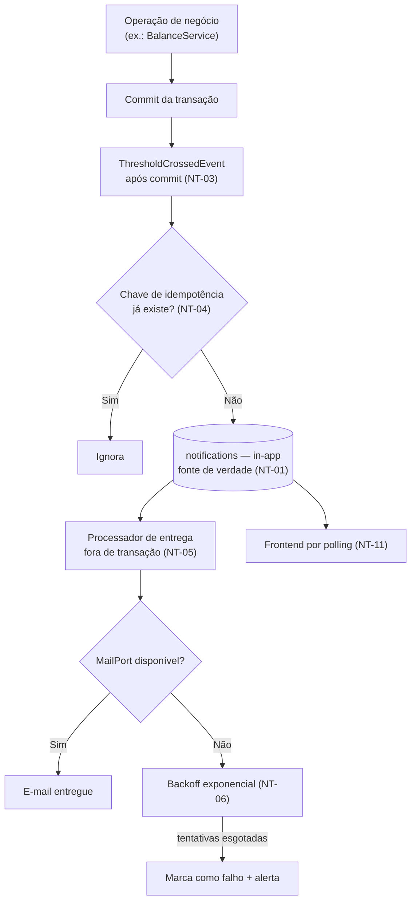

# ADR-037 — Notificações in-app como fonte de verdade e e-mail como canal de entrega secundário

## Status

**Aceito** em 2026-07-29.
Fase F2.

## Data

2026-07-29

## Contexto

O DevTime precisa avisar o usuário sobre eventos que exigem ação ou atenção:

| Evento | Regra |
|---|---|
| Limiar de banco de horas cruzado (75%, 90%, 100%) | RN-6xx |
| Fechamento de período em 3 dias | RN-605 |
| Contrato terminando em 15 dias | RN-606 |
| Cronômetro ativo há 8 horas | RN-163 |
| Cronômetro abandonado | RN-164 |
| Convite para o tenant, verificação de e-mail, redefinição de senha | RN-4xx |

Restrições:

| # | Restrição | Origem |
|---|---|---|
| R-01 | Provedor de e-mail indisponível **degrada**, não bloqueia | AQ-09, IN-04 |
| R-02 | Notificações in-app continuam funcionando; e-mails são reprocessados | AQ-09 |
| R-03 | Notificação dispara exatamente uma vez por limiar por período (idempotência) | F2-05 |
| R-04 | Notificações lidas com mais de 90 dias são removidas | RN-609 |
| R-05 | Reenvio com backoff em caso de falha | RN-610 |
| R-06 | Chamada externa nunca dentro de transação de banco | TX-06 |
| R-07 | Sem mensageria no MVP | `architecture.md` §5 |

## Decisão

| # | Regra |
|---|---|
| NT-01 | A **notificação in-app é a fonte de verdade**: toda notificação é persistida na tabela `notifications` antes de qualquer tentativa de entrega externa. |
| NT-02 | O **e-mail é canal de entrega secundário**, derivado da notificação in-app. Falha no e-mail **nunca** impede a criação da notificação (R-01). |
| NT-03 | Notificações são geradas por **eventos de domínio** consumidos **após o commit** da operação que os originou (R-06). |
| NT-04 | Toda notificação possui uma **chave de idempotência** derivada de (tenant, destinatário, tipo, entidade, ocorrência). Tentar criar duas vezes a mesma notificação é operação sem efeito (R-03). |
| NT-05 | O envio de e-mail ocorre **fora** da transação de negócio, por um processador que lê notificações pendentes de entrega — nunca por chamada direta no fluxo da requisição (R-06). |
| NT-06 | A entrega é tentada com **backoff exponencial** e número máximo de tentativas; esgotadas, a notificação permanece in-app e o e-mail é marcado como falho, com alerta (R-05). |
| NT-07 | O usuário controla **preferências por tipo de notificação** e por canal; o canal in-app não é desativável para eventos críticos de segurança. |
| NT-08 | Notificações lidas com mais de 90 dias são removidas por job (R-04). `notifications` **não** usa soft delete (SD-10 de [ADR-003](ADR-003-soft-delete.md)). |
| NT-09 | O conteúdo do e-mail **não** contém dado sensível: ele informa o **fato** e leva o usuário à aplicação. Valores financeiros, descrições de trabalho e documentos não são incluídos. |
| NT-10 | O adaptador de e-mail é acessado por uma **porta** (`MailPort`), com implementação substituível; em desenvolvimento, o adaptador aponta para MailHog ([ADR-021](ADR-021-docker-compose.md)). |
| NT-11 | O frontend consulta notificações por **polling** em intervalo moderado. Não há WebSocket nem SSE no MVP. |
| NT-12 | A migração do processador de entrega para fila (F6) não altera o domínio: a abstração de NT-03 e NT-05 já isola o mecanismo ([ADR-042](ADR-042-rabbitmq.md)). |

## Motivação

**Por que in-app como fonte de verdade (NT-01) — a decisão central:** o e-mail é um canal fora do nosso controle. Ele pode ser bloqueado por filtro de spam, rejeitado pelo servidor do destinatário, atrasado por horas ou simplesmente ignorado. Se a notificação **existe apenas** como e-mail, um aviso de "banco de horas em 100%" pode nunca chegar, e o usuário descobre o estouro na fatura. Com a notificação persistida, ela está garantidamente disponível na aplicação, e o e-mail é apenas uma chance a mais de o usuário perceber antes. Isso é exatamente o que AQ-09 exige.

**Por que após o commit (NT-03):** notificar sobre uma operação que ainda pode sofrer rollback produziria avisos sobre fatos que não aconteceram. Eventos de efeito colateral são processados após o commit; eventos que **devem** ser consistentes com a operação são processados dentro dela (`architecture.md` §6, ADR legado 006).

**Por que idempotência por chave (NT-04):** F2-05 é explícito. Sem a chave, uma reexecução de job, um retry de requisição ou um reprocessamento de evento produziria notificações duplicadas — que o usuário percebe como ruído e que, repetidas, treinam a ignorar todas as notificações. A chave torna a criação naturalmente idempotente, o que é também requisito de todo job ([ADR-039](ADR-039-background-jobs.md)).

**Por que envio fora do fluxo da requisição (NT-05):** enviar e-mail de forma síncrona adicionaria a latência do SMTP (centenas de milissegundos a segundos) ao tempo de resposta, e uma indisponibilidade do provedor faria a operação de negócio falhar — violando R-01 diretamente.

**Por que o e-mail não contém dado sensível (NT-09):** o e-mail trafega por servidores de terceiros, é armazenado indefinidamente na caixa do destinatário e pode ser encaminhado. Um e-mail com "seu saldo é de R$ 12.450,00 no contrato ACME" expõe informação comercial em um canal sem controle. Informar o fato e levar à aplicação mantém o dado dentro do perímetro autenticado.

**Por que polling e não WebSocket (NT-11):** WebSocket exigiria conexão persistente por usuário, gestão de estado de conexão no servidor (contrariando `ART-080`), tratamento de reconexão e escala com afinidade. As notificações do produto não são de tempo real — um atraso de alguns minutos é irrelevante para "período fecha em 3 dias". O custo de infraestrutura não se justifica.

## Alternativas consideradas

### A1 — E-mail como único canal

| Aspecto | Avaliação |
|---|---|
| **Prós** | Muito mais simples: sem tabela, sem tela, sem polling; chega onde o usuário já está. |
| **Contras** | Entrega não garantida; sem histórico dentro do produto; sem estado de lido/não lido; indisponibilidade do provedor significa notificação perdida (viola R-01 e AQ-09). |
| **Por que foi descartada** | Aviso de estouro de banco de horas é informação com consequência financeira; não pode depender de um canal sem garantia de entrega. |

### A2 — Notificação in-app apenas, sem e-mail

| Aspecto | Avaliação |
|---|---|
| **Prós** | Sem integração externa; sem falha de entrega; sem risco de vazamento por e-mail. |
| **Contras** | O usuário só descobre ao abrir a aplicação; avisos com prazo (fechamento em 3 dias) perdem a função se o usuário não entrar; convite e redefinição de senha **exigem** e-mail por natureza. |
| **Por que foi descartada** | Alguns fluxos (convite, verificação, redefinição) são impossíveis sem e-mail, e avisos com prazo perdem o propósito. |

### A3 — Envio síncrono de e-mail no fluxo da requisição

| Aspecto | Avaliação |
|---|---|
| **Prós** | Mais simples; feedback imediato sobre a entrega; sem processador nem estado de entrega. |
| **Contras** | Latência do SMTP no tempo de resposta; falha do provedor derruba a operação de negócio; viola R-01 e TX-06. |
| **Por que foi descartada** | Acopla a disponibilidade de uma operação de negócio à disponibilidade de um serviço externo. |

### A4 — Fila de mensagens (RabbitMQ) desde o MVP

| Aspecto | Avaliação |
|---|---|
| **Prós** | Desacoplamento real; retry e dead-letter nativos; escala independente do consumidor. |
| **Contras** | Um contêiner e uma classe de falha a mais no MVP (R-07); complexidade de entrega e de ordenação; volume esperado não justifica. |
| **Por que foi descartada para o MVP** | A tabela `notifications` funciona como fila durável com muito menos infraestrutura. NT-12 preserva o caminho: a migração em F6 não toca o domínio ([ADR-042](ADR-042-rabbitmq.md)). |

### A5 — Serviço externo de notificação (provedor de push/e-mail transacional com estado)

| Aspecto | Avaliação |
|---|---|
| **Prós** | Entrega multicanal pronta; painéis de entrega; templates gerenciados. |
| **Contras** | Estado da notificação fora do nosso banco, dificultando consulta in-app e escopo por tenant; custo por notificação; dado do usuário enviado a terceiro (LGPD); dependência externa em fluxo que precisa degradar bem. |
| **Por que foi descartada** | O estado precisa estar no nosso banco para NT-01. O provedor permanece como opção apenas para o **transporte** do e-mail, atrás de `MailPort` (NT-10). |

### A6 — WebSocket / Server-Sent Events para entrega em tempo real

| Aspecto | Avaliação |
|---|---|
| **Prós** | Entrega imediata; sem polling; melhor experiência percebida. |
| **Contras** | Conexão persistente por usuário; estado de conexão no servidor (contraria `ART-080`); reconexão, escala com afinidade e proxy compatível; nenhuma notificação do produto exige tempo real. |
| **Por que foi descartada** | Custo de infraestrutura e complexidade sem requisito que o justifique. Reavaliável se surgir necessidade de tempo real (ex.: colaboração em F5). |

## Consequências

### Positivas

| # | Consequência |
|---|---|
| C+01 | AQ-09 atendida: indisponibilidade de e-mail degrada, não bloqueia. |
| C+02 | Histórico de notificações dentro do produto, com estado de lido/não lido. |
| C+03 | Idempotência garantida por construção (NT-04), atendendo F2-05. |
| C+04 | Operações de negócio não pagam latência de SMTP. |
| C+05 | Nenhum dado sensível trafega por e-mail (NT-09). |
| C+06 | Migração para fila em F6 sem tocar o domínio (NT-12). |
| C+07 | Sem infraestrutura adicional no MVP. |

### Negativas

| # | Consequência | Aceita porque |
|---|---|---|
| C-01 | Polling gera requisições periódicas de todos os usuários ativos. | Intervalo moderado; endpoint leve e indexado. |
| C-02 | Notificação in-app só é vista quando o usuário abre a aplicação. | Por isso o e-mail existe como canal secundário. |
| C-03 | O processador de entrega é mais complexo que uma chamada direta. | Necessário para R-01 e TX-06. |
| C-04 | `notifications` cresce com o uso. | Limpeza por job (NT-08). |
| C-05 | E-mail sem dado (NT-09) obriga o usuário a entrar na aplicação. | É o comportamento desejado por segurança. |
| C-06 | Preferências por tipo (NT-07) adicionam configuração a manter. | Reduzem fadiga de notificação, que é o principal risco de utilidade. |

### Limitações

| # | Limitação |
|---|---|
| L-01 | Sem entrega em tempo real (consequência de NT-11). |
| L-02 | Sem push mobile nem notificação de navegador no MVP. |
| L-03 | A confirmação de entrega do e-mail é limitada ao que o provedor reporta; abertura e clique não são rastreados. |

### Custos

| Item | Custo |
|---|---|
| Implementação | ~4 dias (tabela, eventos, processador, preferências, tela) |
| Infraestrutura | Provedor de e-mail (SMTP ou API) |
| Runtime | Polling de todos os usuários ativos |

## Trade-offs

| Sacrificado | Em favor de | Justificativa da troca |
|---|---|---|
| **Simplicidade** (só e-mail) | Garantia de entrega da informação | Aviso com consequência financeira não pode depender de canal sem garantia. |
| **Imediatismo** (WebSocket) | Statelessness e simplicidade | Nenhuma notificação do produto é de tempo real. |
| **Riqueza** do e-mail | Não expor dado sensível fora do perímetro | E-mail é canal permanente e sem controle. |
| **Desacoplamento** de uma fila real | Ausência de infraestrutura no MVP | Tabela funciona como fila durável; migração preservada. |
| **Latência** de entrega (processamento assíncrono) | Disponibilidade da operação de negócio | Alguns segundos de atraso são irrelevantes. |

## Impacto na arquitetura

| Módulo | Impacto |
|---|---|
| `notification` | Entidade, serviço, processador de entrega, preferências. |
| `shared/event` | Eventos consumidos após o commit (NT-03). |
| `shared/integration` | `MailPort` e adaptador (NT-10). |
| Features de origem | Publicam eventos; **não** conhecem notificação nem e-mail. |
| Jobs | Processamento de entrega, reenvio e limpeza. |

| Documento dependente | Relação |
|---|---|
| `docs/02-domain/business-rules.md` | RN-605, RN-606, RN-609, RN-610, RN-6xx |
| `docs/03-architecture/integrations.md` §6.1 | Integração de e-mail |
| `docs/04-api/notifications.md` | Contrato |
| `docs/03-architecture/database.md` §7.10 | Modelo de `notifications` |

| Spec dependente | Relação |
|---|---|
| `specs/013-notifications` | Implementa integralmente |
| `specs/011-bank-hours` | Origem dos limiares |
| `specs/001-authentication` | Convite, verificação, redefinição |

| ADR relacionado | Relação |
|---|---|
| [ADR-039](ADR-039-background-jobs.md) | Jobs de entrega e limpeza |
| [ADR-042](ADR-042-rabbitmq.md) | Migração futura (NT-12) |
| [ADR-018](ADR-018-auditing.md) | Distinção entre notificação e auditoria |
| [ADR-021](ADR-021-docker-compose.md) | MailHog em desenvolvimento |

## Impacto no banco

| Item | Impacto |
|---|---|
| Tabela | `notifications (id, tenant_id, recipient_user_id, type, title, body, entity_type, entity_id, idempotency_key, read_at, delivery_status, delivery_attempts, next_attempt_at, created_at)`. |
| Índice | `uq_notifications_idempotency` sobre `(tenant_id, idempotency_key)` — garante NT-04 no nível do banco. |
| Índice | `(tenant_id, recipient_user_id, read_at, created_at DESC)` para a listagem e a contagem de não lidas. |
| Índice | `(delivery_status, next_attempt_at)` para o processador de entrega. |
| Soft delete | Ausente (NT-08). |
| Retenção | Lidas com mais de 90 dias removidas por job (R-04). |
| Preferências | Tabela própria por usuário e tipo (NT-07). |

## Impacto na API

| Item | Impacto |
|---|---|
| `GET /api/v1/notifications` | Listagem paginada, com filtro por lidas/não lidas. |
| `GET /api/v1/notifications/unread-count` | Endpoint leve, alvo do polling (NT-11). |
| `POST /api/v1/notifications/{id}/read` e `/read-all` | Ações de marcação. |
| `GET`/`PUT /api/v1/notification-preferences` | Preferências por tipo e canal (NT-07). |
| Escopo | Um usuário vê apenas as **próprias** notificações, mesmo sendo `OWNER`. |
| Rate limit | O endpoint de contagem tem limite compatível com o intervalo de polling. |

## Impacto no Frontend

| Item | Impacto |
|---|---|
| Indicador | Contador de não lidas no cabeçalho, atualizado por polling (NT-11). |
| Painel | Lista de notificações com navegação para a entidade relacionada. |
| Polling | Intervalo moderado, **pausado** quando a aba está em segundo plano — evita requisições inúteis. |
| Preferências | Tela de configuração por tipo e canal. |
| Estado | `NotificationStore` com Signals ([ADR-024](ADR-024-signals.md)); marcação otimista de leitura. |

## Impacto na Infraestrutura

| Item | Impacto |
|---|---|
| E-mail | Provedor SMTP ou API, configurado por variável de ambiente. |
| Local | MailHog captura os e-mails, sem envio real ([ADR-021](ADR-021-docker-compose.md) S-03). |
| Jobs | Processador de entrega, reenvio com backoff e limpeza ([ADR-039](ADR-039-background-jobs.md)). |
| Alertas | Falha persistente de entrega gera alerta; taxa de rejeição monitorada. |
| Reputação | SPF, DKIM e DMARC configurados no domínio para evitar classificação como spam. |

## Segurança

| # | Consideração |
|---|---|
| S-01 | NT-09 é o controle central: o e-mail informa o fato e leva à aplicação, sem expor dado financeiro ou pessoal. |
| S-02 | Links em e-mail apontam para a aplicação autenticada; nenhum link concede acesso por si só. |
| S-03 | Tokens em e-mail (verificação, redefinição) são de uso único e curta validade (PW-06). |
| S-04 | Notificações de segurança (reuso de refresh token, alteração de senha) **não** são desativáveis (NT-07). |
| S-05 | O corpo da notificação é escapado na renderização, tanto em HTML de e-mail quanto na UI. |
| S-06 | **Multi-tenant:** `notifications` é tenant-scoped e escopada por destinatário; um usuário nunca vê notificação de outro, mesmo no mesmo tenant. |
| S-07 | **LGPD:** o e-mail do destinatário é dado pessoal; é mascarado em log (`security.md` §9.2) e purgado com o tenant. |
| S-08 | **Auditoria:** o envio de notificação **não** substitui a trilha; operações auditáveis geram `audit_logs` independentemente ([ADR-018](ADR-018-auditing.md)). |

## Performance

| # | Consideração |
|---|---|
| P-01 | O endpoint de contagem é o mais chamado do sistema; deve ser uma consulta indexada trivial, e é candidato a cache de curta duração ([ADR-040](ADR-040-cache-strategy.md)). |
| P-02 | O envio de e-mail está fora do caminho da requisição (NT-05). |
| P-03 | O processador de entrega opera em lotes, com limite por execução. |
| P-04 | Polling pausado em segundo plano reduz significativamente o volume. |
| P-05 | A limpeza (NT-08) mantém a tabela em tamanho estável. |

## Escalabilidade

| # | Consideração |
|---|---|
| E-01 | O volume de notificações cresce com usuários ativos e eventos; limitado por NT-08. |
| E-02 | O polling cresce linearmente com usuários simultâneos — é o principal fator de escala desta decisão. |
| E-03 | Se o polling se tornar gargalo, as saídas são cache ([ADR-040](ADR-040-cache-strategy.md)) e, depois, SSE por ADR próprio. |
| E-04 | A migração do processador para fila (NT-12) permite escalar a entrega independentemente. |

## Riscos

| # | Risco | Probabilidade | Impacto | Severidade |
|---|---|---|---|---|
| RK-01 | Notificações duplicadas por falha de idempotência | Média | Médio | Média |
| RK-02 | Fadiga de notificação levando o usuário a ignorar todas | **Alta** | Alto | **Alta** |
| RK-03 | E-mails classificados como spam | Média | Alto | Alta |
| RK-04 | Polling gerando carga excessiva | Média | Médio | Média |
| RK-05 | Dado sensível incluído em e-mail | Média | Alto | Alta |
| RK-06 | Falha silenciosa de entrega sem ninguém perceber | Média | Médio | Média |
| RK-07 | Crescimento descontrolado da tabela | Baixa | Baixo | Baixa |

## Mitigações

| Risco | Mitigação | Verificação |
|---|---|---|
| RK-01 | NT-04 com índice único no banco — a duplicidade é impossível, não apenas improvável; teste que dispara o mesmo evento duas vezes (F2-05) | Teste de idempotência |
| RK-02 | Preferências por tipo (NT-07); limiares bem escolhidos; nenhuma notificação puramente informativa por e-mail; revisão periódica dos tipos ativos | Revisão de produto |
| RK-03 | SPF, DKIM e DMARC; provedor com boa reputação; monitoramento de taxa de rejeição | Monitoramento de entrega |
| RK-04 | Intervalo moderado; polling pausado em segundo plano; endpoint leve; cache de curta duração | Métrica de requisições |
| RK-05 | NT-09 explícita; revisão obrigatória de todo template de e-mail; teste que verifica ausência de valores monetários e de descrições nos templates | Teste de template |
| RK-06 | Métrica de falhas de entrega com alerta; notificação permanece in-app mesmo com e-mail falho (NT-02) | [ADR-047](ADR-047-monitoring.md) |
| RK-07 | Job de limpeza (NT-08); métrica de tamanho da tabela | Monitoramento |

## Referências

| Fonte | Uso |
|---|---|
| [RFC 5321 — SMTP](https://www.rfc-editor.org/rfc/rfc5321) | Protocolo de entrega |
| [RFC 7208 — SPF](https://www.rfc-editor.org/rfc/rfc7208) e [RFC 6376 — DKIM](https://www.rfc-editor.org/rfc/rfc6376) | Reputação de envio |
| [Transactional Outbox Pattern](https://microservices.io/patterns/data/transactional-outbox.html) | Fundamento de NT-01/NT-05 |
| [OWASP — Forgot Password Cheat Sheet](https://cheatsheetseries.owasp.org/cheatsheets/Forgot_Password_Cheat_Sheet.html) | Conteúdo de e-mails de segurança |
| [Nielsen Norman Group — Notification design](https://www.nngroup.com/articles/indicators-validations-notifications/) | Base de RK-02 |
| `docs/03-architecture/integrations.md` §6.1 | Especificação da integração de e-mail |
