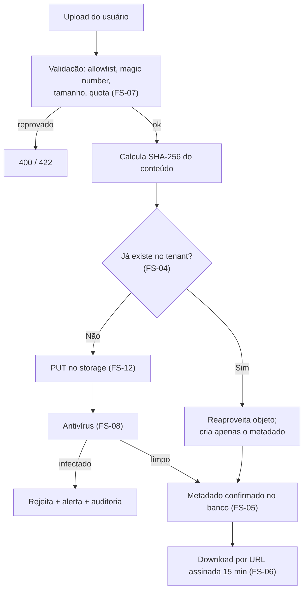

# ADR-038 — Object Storage S3-compatible com chave por checksum e acesso por URL assinada

## Status

**Aceito** em 2026-07-29.
Fase F4.

## Data

2026-07-29

## Contexto

A partir de F4, o produto armazena arquivos binários:

| Tipo | Origem | Volume esperado |
|---|---|---|
| Anexos de work log, ticket e comentário | Upload do usuário | Moderado, com duplicatas frequentes |
| Arquivos exportados (PDF, XLSX) | Geração do servidor ([ADR-036](ADR-036-report-generation.md)) | Alto, mas efêmero (7 dias) |
| Logo do tenant | Upload do usuário | Baixo |

Restrições:

| # | Restrição | Origem |
|---|---|---|
| R-01 | Falha do storage **não** impede o registro de horas | AQ-10, IN-04, SG-05 |
| R-02 | O bucket nunca é público; todo acesso por URL assinada | SG-01 |
| R-03 | Criptografia em repouso habilitada | SG-02 |
| R-04 | Exportações removidas após 7 dias | SG-04 |
| R-05 | Deduplicação por checksum dentro do tenant | RN-805 |
| R-06 | Anexos verificados por antivírus | `integrations.md` §6.3 |
| R-07 | Arquivos servidos com `Content-Disposition: attachment` | AN-03 |
| R-08 | Chamada externa nunca dentro de transação de banco | TX-06 |

## Decisão

| # | Regra |
|---|---|
| FS-01 | Arquivos binários são armazenados em **Object Storage S3-compatible**, nunca no banco de dados nem no sistema de arquivos do contêiner. |
| FS-02 | O acesso é feito por uma **porta** (`StoragePort`) com adaptador `S3StorageAdapter`; em desenvolvimento, o adaptador aponta para **MinIO** ([ADR-021](ADR-021-docker-compose.md)). |
| FS-03 | A organização de chaves é: `{tenantId}/attachments/{yyyy}/{MM}/{checksumSha256}`, `{tenantId}/exports/{reportExecutionId}/{fileName}`, `{tenantId}/branding/logo/{uuid}`. |
| FS-04 | O nome do arquivo de anexo é a **soma SHA-256 do conteúdo** (FS-03), o que produz **deduplicação automática dentro do tenant** (R-05) e permite verificar integridade sem consulta adicional. |
| FS-05 | O **metadado** do arquivo (nome original, tipo, tamanho, autor, entidade relacionada, checksum) vive no **banco**; o storage guarda apenas o conteúdo. |
| FS-06 | O bucket **nunca** é público (R-02). O download ocorre por **URL assinada com TTL de 15 minutos**, gerada apenas após verificação de permissão e de pertencimento ao tenant. |
| FS-07 | O upload é validado no servidor: tipo permitido por **allowlist**, verificação de *magic number* (não apenas da extensão nem do `Content-Type` declarado), tamanho máximo e quota por tenant. |
| FS-08 | Todo anexo passa por **verificação antivírus** antes de ficar disponível (R-06). Enquanto pendente, o anexo existe com estado próprio e não é baixável. |
| FS-09 | Arquivos são servidos com `Content-Disposition: attachment` e `Content-Type` **derivado da verificação**, nunca do valor declarado pelo cliente (R-07). |
| FS-10 | A exclusão do conteúdo no storage ocorre **apenas** quando o último registro que o referencia é purgado (RN-805) — consequência direta de FS-04, já que o mesmo conteúdo pode ser referenciado por vários anexos. |
| FS-11 | Falha do storage **degrada**: o registro de horas, tickets e comentários continua funcionando; apenas a operação de anexo falha (R-01). |
| FS-12 | Operações de storage ocorrem **fora** de transação de banco (R-08). O padrão é: gravar no storage, depois confirmar o metadado em transação curta; órfãos são limpos por job. |
| FS-13 | Criptografia em repouso habilitada no bucket (R-03); versionamento habilitado com retenção de 30 dias. |
| FS-14 | O prefixo `exports/` tem política de ciclo de vida de **7 dias** (R-04). |
| FS-15 | Toda operação de upload, download e exclusão é auditada ([ADR-018](ADR-018-auditing.md)). |

## Motivação

**Por que Object Storage e não banco (FS-01):** binários em `BYTEA` inflam o banco, o backup e a memória de consulta; o banco passa a ser dimensionado por volume de arquivo em vez de por dado transacional; e o *streaming* de download atravessa a aplicação e o pool de conexões. Object Storage é feito para isso: custo por GB muito menor, escala independente, download direto pelo cliente via URL assinada (sem passar pela aplicação).

**Por que S3-compatible e não um provedor específico (FS-02):** a compatibilidade com a API do S3 é oferecida por praticamente todos os provedores e por implementações locais (MinIO). Isso mantém o ambiente de desenvolvimento fiel e evita aprisionamento a um fornecedor.

**Por que chave por checksum (FS-04) — a decisão mais interessante:** três benefícios simultâneos. (1) **Deduplicação**: o mesmo PDF anexado a dez tickets ocupa espaço uma vez. (2) **Integridade**: o nome do objeto **é** o hash do conteúdo, então verificar corrupção não exige metadado adicional. (3) **Idempotência de upload**: reenviar o mesmo arquivo produz a mesma chave, sem duplicar. A contrapartida é FS-10: como vários registros podem apontar para o mesmo objeto, a exclusão precisa de contagem de referências.

**Por que metadado no banco (FS-05):** o nome original, o autor, a entidade relacionada e o estado de verificação são dados transacionais que precisam de consulta, filtro, isolamento por tenant e trilha de auditoria. O storage é um armazenamento de conteúdo endereçado, não um banco de metadados.

**Por que URL assinada com TTL curto (FS-06):** anexos podem conter contrato, comprovante ou documento pessoal. Um bucket público ou uma URL permanente vazariam por histórico de navegador, log de proxy ou compartilhamento acidental. Quinze minutos permitem o download e limitam a exposição.

**Por que validar por *magic number* (FS-07):** extensão e `Content-Type` são fornecidos pelo cliente e trivialmente falsificáveis. Um executável renomeado para `.pdf` passaria por qualquer validação baseada em nome. A verificação dos bytes iniciais é a única confiável.

**Por que antivírus antes de disponibilizar (FS-08):** o arquivo será baixado por outros usuários e, potencialmente, pelo cliente final. Distribuir malware a partir da plataforma é dano reputacional grave, além de risco direto.

**Por que `Content-Disposition: attachment` (FS-09):** servir um HTML ou SVG enviado pelo usuário com `Content-Type: text/html` no mesmo domínio permitiria XSS armazenado. Forçar download neutraliza a execução no contexto da aplicação.

**Por que fora de transação (FS-12):** manter uma transação de banco aberta durante o upload de um arquivo de vários MB seguraria uma conexão por segundos, violando TX-06 e TX-07. O custo é a possibilidade de órfão (objeto sem metadado), resolvida por job — que é o problema mais barato dos dois.

## Alternativas consideradas

### A1 — Arquivos no banco de dados (`BYTEA` / *large objects*)

| Aspecto | Avaliação |
|---|---|
| **Prós** | Transacionalidade completa (sem órfãos); backup único; isolamento de tenant garantido pelo mesmo mecanismo; sem serviço adicional. |
| **Contras** | Banco cresce com volume de arquivo; backup e restore muito mais lentos; download atravessa a aplicação e o pool de conexões; consumo de memória por download; custo por GB muito superior ao de object storage; `TOAST` degrada consultas na tabela. |
| **Por que foi descartada** | O banco é o recurso mais caro e mais difícil de escalar do sistema; usá-lo para binários desperdiça-o. A transacionalidade perdida é recuperada por FS-12 + job de limpeza. |

### A2 — Sistema de arquivos local do contêiner ou volume compartilhado

| Aspecto | Avaliação |
|---|---|
| **Prós** | Simples; rápido; sem serviço externo; sem custo adicional. |
| **Contras** | Contêiner é efêmero: arquivos se perdem ([ADR-020](ADR-020-docker.md)); volume compartilhado entre réplicas exige NFS ou similar, com problemas de consistência e desempenho; backup manual; contraria `ART-080` (estado na aplicação). |
| **Por que foi descartada** | Incompatível com réplicas stateless e com contêineres efêmeros. |

### A3 — Provedor específico com SDK proprietário

| Aspecto | Avaliação |
|---|---|
| **Prós** | Recursos avançados do provedor; integração otimizada. |
| **Contras** | Aprisionamento ao fornecedor; ambiente local exigiria emulador ou credenciais de nuvem em desenvolvimento; migração futura cara. |
| **Por que foi descartada** | A API S3 é suficiente para todas as operações necessárias (FS-02 lista quatro), e a compatibilidade permite MinIO local — que é o que mantém o desenvolvimento fiel e sem custo. |

### A4 — Upload direto do cliente para o storage (URL assinada de escrita)

| Aspecto | Avaliação |
|---|---|
| **Prós** | O arquivo não trafega pela aplicação: menos CPU, memória e banda no servidor; melhor desempenho para arquivos grandes. |
| **Contras** | A validação de tipo, tamanho e conteúdo (FS-07) e a verificação antivírus (FS-08) só podem ocorrer **depois** do upload, deixando uma janela em que conteúdo não verificado está no bucket; a quota por tenant fica mais difícil de impor; o fluxo é mais complexo (obter URL, enviar, confirmar). |
| **Por que foi descartada no MVP** | O controle de conteúdo antes da gravação é mais importante que a economia de banda no volume esperado. Permanece como evolução se o tamanho médio dos arquivos crescer, com verificação assíncrona pós-upload e quarentena. |

### A5 — Nome de objeto aleatório (UUID) em vez de checksum

| Aspecto | Avaliação |
|---|---|
| **Prós** | Exclusão trivial (um objeto por registro, sem contagem de referências); sem necessidade de calcular hash no upload. |
| **Contras** | Sem deduplicação (R-05 não atendido); sem verificação de integridade embutida; upload repetido do mesmo arquivo cria duplicatas. |
| **Por que foi descartada** | R-05 é requisito explícito, e os benefícios de integridade e idempotência são significativos. FS-10 resolve a complexidade de exclusão. |

## Consequências

### Positivas

| # | Consequência |
|---|---|
| C+01 | Banco permanece dimensionado por dado transacional, não por volume de arquivo. |
| C+02 | Deduplicação automática dentro do tenant (FS-04). |
| C+03 | Verificação de integridade sem metadado adicional. |
| C+04 | Download não atravessa a aplicação (FS-06), economizando CPU e banda. |
| C+05 | Falha do storage degrada, não bloqueia (FS-11, AQ-10). |
| C+06 | Prefixo por tenant permite quota, política de ciclo de vida e exclusão por tenant no próprio bucket. |
| C+07 | Ambiente local fiel com MinIO, sem custo nem credencial de nuvem. |

### Negativas

| # | Consequência | Aceita porque |
|---|---|---|
| C-01 | Sem transacionalidade entre banco e storage; órfãos são possíveis (FS-12). | Resolvido por job de limpeza; o problema inverso (transação longa) seria pior. |
| C-02 | Exclusão exige contagem de referências (FS-10). | Consequência direta do benefício de FS-04. |
| C-03 | Calcular SHA-256 no upload consome CPU proporcional ao tamanho. | Barato frente à I/O; calculado em fluxo, sem carregar o arquivo inteiro em memória. |
| C-04 | Um serviço externo a mais na topologia. | Gerenciado; MinIO em desenvolvimento. |
| C-05 | Antivírus adiciona latência entre upload e disponibilidade. | Estado explícito comunicado ao usuário (FS-08). |
| C-06 | URL assinada com TTL curto exige nova geração se o usuário demorar. | 15 min é amplo para iniciar um download. |

### Limitações

| # | Limitação |
|---|---|
| L-01 | Deduplicação é **por tenant**, não global — deliberado, para não criar canal lateral entre tenants (ver S-06). |
| L-02 | Sem versionamento de anexo pelo usuário: um novo upload cria um novo anexo, não uma nova versão. |
| L-03 | Sem pré-visualização no navegador (consequência de FS-09). |

### Custos

| Item | Custo |
|---|---|
| Armazenamento | Por GB armazenado e por requisição |
| Implementação | ~3 dias (porta, adaptador, validação, antivírus, jobs) |
| Antivírus | Contêiner ClamAV ou serviço |
| Transferência | Download direto do storage, não da aplicação |

## Trade-offs

| Sacrificado | Em favor de | Justificativa da troca |
|---|---|---|
| **Transacionalidade** entre banco e storage | Transações curtas e banco enxuto | Órfão limpo por job é problema menor que conexão presa por segundos. |
| **Simplicidade de exclusão** (nome aleatório) | Deduplicação e integridade | R-05 é requisito; a contagem de referências é código bem delimitado. |
| **Economia de banda** no upload (A4) | Validação antes da gravação | Conteúdo não verificado no bucket é risco maior que custo de banda. |
| **Pré-visualização** no navegador | Prevenção de XSS armazenado | `attachment` é a defesa efetiva. |
| **Deduplicação global** | Ausência de canal lateral entre tenants | Ver S-06: deduplicação global permitiria inferir a existência de arquivo alheio. |

## Impacto na arquitetura

| Módulo | Impacto |
|---|---|
| `shared/storage` | `StoragePort`, `S3StorageAdapter`, geração de URL assinada. |
| `shared/integration` | `AntivirusPort`, `ClamAvAdapter`. |
| `attachment` | Feature de anexos: metadado, estados, contagem de referências. |
| `report` | Consome o storage para exportações ([ADR-036](ADR-036-report-generation.md)). |
| `tenant` | Logo e quota por plano. |
| Jobs | Limpeza de órfãos e expiração de exportações. |

| Documento dependente | Relação |
|---|---|
| `docs/03-architecture/integrations.md` §6.2, §6.3 | Storage e antivírus |
| `docs/03-architecture/security.md` §11 | Segurança de anexos |
| `docs/02-domain/business-rules.md` | RN-801, RN-802, RN-805, RN-712 |

| Spec dependente | Relação |
|---|---|
| `specs/015-attachments` | Implementa integralmente |
| `specs/012-reports` | Armazenamento de exportações |
| `specs/014-comments` | Anexos em comentários |

| ADR relacionado | Relação |
|---|---|
| [ADR-036](ADR-036-report-generation.md) | Exportações armazenadas |
| [ADR-039](ADR-039-background-jobs.md) | Jobs de limpeza e expiração |
| [ADR-044](ADR-044-security.md) | Controles de upload |
| [ADR-049](ADR-049-saas-readiness.md) | Quota por plano |
| [ADR-021](ADR-021-docker-compose.md) | MinIO local |

## Impacto no banco

| Item | Impacto |
|---|---|
| Tabela | `attachments (id, tenant_id, entity_type, entity_id, original_name, content_type, size_bytes, checksum_sha256, storage_key, scan_status, uploaded_by, created_at, deleted_at, ...)`. |
| Índice | `(tenant_id, checksum_sha256)` — sustenta a deduplicação e a contagem de referências (FS-04, FS-10). |
| Índice | `(tenant_id, entity_type, entity_id)` para listar anexos de uma entidade. |
| Conteúdo | **Nunca** armazenado no banco (FS-01). |
| Quota | Soma de `size_bytes` por tenant, com contador desnormalizado e reconciliação. |
| Soft delete | Aplicável ao metadado ([ADR-003](ADR-003-soft-delete.md)); o objeto só é removido na purga (FS-10). |

## Impacto na API

| Item | Impacto |
|---|---|
| Upload | `POST /api/v1/attachments` com `multipart/form-data`; retorna o metadado com o estado de verificação. |
| Estado | Anexo pendente de verificação não é baixável; a resposta informa o estado (FS-08). |
| Download | `GET /api/v1/attachments/{id}/download` retorna `302` para URL assinada com TTL de 15 min (FS-06). |
| Erros | `413` (tamanho excedido), `415` (tipo não permitido), `422` (quota excedida), `422` (arquivo infectado). |
| Rate limit | Upload limitado a 100 por hora por tenant ([ADR-045](ADR-045-rate-limit.md)). |
| Degradação | Indisponibilidade do storage afeta **apenas** os endpoints de anexo (FS-11). |

## Impacto no Frontend

| Item | Impacto |
|---|---|
| Upload | Componente com progresso, validação prévia de tipo e tamanho (conveniência; a validação autoritativa é do servidor). |
| Estado | Exibe "verificando" enquanto o antivírus não concluiu; o download só é oferecido depois (FS-08). |
| Download | Navega para a URL assinada; o frontend nunca manipula o conteúdo. |
| Erros | Mensagens específicas por código (tamanho, tipo, quota, infectado). |
| Quota | Consumo exibido ao usuário quando próximo do limite. |

## Impacto na Infraestrutura

| Item | Impacto |
|---|---|
| Bucket | Privado, com criptografia em repouso e versionamento com retenção de 30 dias (FS-13). |
| Ciclo de vida | Prefixo `exports/` removido após 7 dias (FS-14). |
| Local | MinIO no Docker Compose ([ADR-021](ADR-021-docker-compose.md)). |
| Antivírus | ClamAV como contêiner ou serviço. |
| Credenciais | Apenas em variáveis de ambiente (`ART-083`). |
| Jobs | Limpeza de órfãos; expiração de exportações. |
| Monitoramento | Volume por tenant, taxa de erro do storage, fila de verificação. |

## Segurança

| # | Consideração |
|---|---|
| S-01 | FS-06: bucket privado e URL assinada de TTL curto são o controle de acesso central. |
| S-02 | FS-07: validação por *magic number*, não por extensão nem por `Content-Type` declarado. |
| S-03 | FS-09: `Content-Disposition: attachment` previne XSS armazenado via HTML/SVG enviado pelo usuário. |
| S-04 | FS-08: antivírus impede a plataforma de distribuir malware. |
| S-05 | Limite de tamanho e quota por tenant previnem exaustão de armazenamento como vetor de negação de serviço. |
| S-06 | **Multi-tenant:** o prefixo `{tenantId}/` isola os objetos, e a **deduplicação é restrita ao tenant** (L-01) — deduplicação global permitiria a um tenant inferir a existência de um arquivo idêntico em outro tenant, verificando se o upload foi instantâneo. Esse canal lateral é eliminado por desenho. |
| S-07 | **LGPD:** anexos podem conter dado pessoal; são exportáveis com o tenant e purgados junto com ele; criptografados em repouso. |
| S-08 | **Auditoria:** upload, download e exclusão são auditados (FS-15) — download em massa é vetor de exfiltração. |
| S-09 | Nome original do arquivo é sanitizado antes de qualquer uso em cabeçalho ou caminho, evitando *path traversal* e injeção de cabeçalho. |

## Performance

| # | Consideração |
|---|---|
| P-01 | Download direto do storage não consome CPU nem banda da aplicação (FS-06). |
| P-02 | SHA-256 é calculado em fluxo, sem carregar o arquivo inteiro em memória. |
| P-03 | FS-04 evita armazenar e transferir conteúdo duplicado. |
| P-04 | FS-12 mantém transações curtas. |
| P-05 | Antivírus adiciona latência ao upload; é executado de forma que não bloqueie a resposta além do necessário. |
| P-06 | Uploads grandes usam escrita em fluxo, com limite de tamanho aplicado antes da leitura completa. |

## Escalabilidade

| # | Consideração |
|---|---|
| E-01 | Object Storage escala independentemente da aplicação e do banco. |
| E-02 | Deduplicação reduz o crescimento efetivo. |
| E-03 | O prefixo por tenant permite políticas e métricas por tenant no próprio bucket. |
| E-04 | Se o volume de upload crescer muito, A4 (upload direto) é a evolução mapeada, com quarentena e verificação assíncrona. |
| E-05 | Exportações não acumulam (FS-14). |

## Riscos

| # | Risco | Probabilidade | Impacto | Severidade |
|---|---|---|---|---|
| RK-01 | Bucket configurado como público | Baixa | Crítico | **Crítica** |
| RK-02 | Arquivo malicioso distribuído pela plataforma | Baixa | Alto | **Alta** |
| RK-03 | Objetos órfãos acumulando por falha em FS-12 | Média | Baixo | Baixa |
| RK-04 | Exclusão de objeto ainda referenciado por outro anexo (FS-10) | Média | Alto | Alta |
| RK-05 | Indisponibilidade do storage afetando operações que não deveria | Média | Médio | Média |
| RK-06 | Quota não aplicada, permitindo consumo abusivo | Média | Médio | Média |
| RK-07 | XSS armazenado por arquivo servido inline | Baixa | Alto | Média |

## Mitigações

| Risco | Mitigação | Verificação |
|---|---|---|
| RK-01 | Bucket privado por configuração de infraestrutura; teste que tenta acessar um objeto sem URL assinada e espera negação | Teste de integração |
| RK-02 | FS-07 + FS-08; anexo indisponível até a verificação concluir; alerta em detecção | Teste com arquivo de teste EICAR |
| RK-03 | Job de limpeza que remove objetos sem metadado após período de carência; métrica de órfãos | Job + métrica |
| RK-04 | Contagem de referências por `(tenant_id, checksum)` antes de excluir; teste que anexa o mesmo arquivo duas vezes, exclui um e verifica que o outro continua baixável | Teste de deduplicação |
| RK-05 | FS-11: adaptador com timeout curto e falha isolada; teste de resiliência com storage indisponível (AQ-10) | Teste de resiliência |
| RK-06 | Quota verificada na camada de serviço antes do upload; contador reconciliado por job | Teste de quota |
| RK-07 | FS-09 em **todos** os caminhos de download; teste que verifica o cabeçalho retornado | Teste de cabeçalho |

## Referências

| Fonte | Uso |
|---|---|
| [AWS S3 — Presigned URLs](https://docs.aws.amazon.com/AmazonS3/latest/userguide/using-presigned-url.html) | FS-06 |
| [AWS S3 — Lifecycle configuration](https://docs.aws.amazon.com/AmazonS3/latest/userguide/object-lifecycle-mgmt.html) | FS-14 |
| [MinIO — Documentation](https://min.io/docs/minio/container/index.html) | Ambiente local |
| [OWASP — File Upload Cheat Sheet](https://cheatsheetseries.owasp.org/cheatsheets/File_Upload_Cheat_Sheet.html) | FS-07, FS-08, FS-09 |
| [OWASP — Unrestricted File Upload](https://owasp.org/www-community/vulnerabilities/Unrestricted_File_Upload) | Base das mitigações |
| [ClamAV — Documentation](https://docs.clamav.net/) | FS-08 |
| [Content-addressable storage](https://en.wikipedia.org/wiki/Content-addressable_storage) | Fundamento de FS-04 |
| `docs/03-architecture/integrations.md` §6.2 | Especificação da integração |
