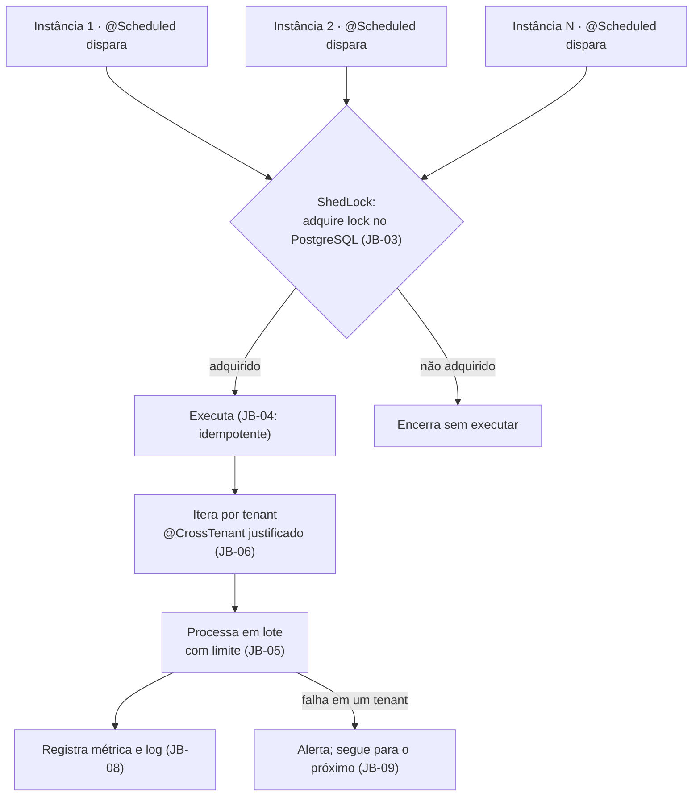

# ADR-039 — Jobs agendados no mesmo artefato, com lock distribuído em banco e idempotência obrigatória

## Status

**Aceito** em 2026-07-29.
Substitui o identificador legado `ADR-007` de `docs/03-architecture/architecture.md` §6 e absorve parcialmente o legado `ADR-006` (eventos de domínio).

## Data

2026-07-29

## Contexto

O domínio exige treze execuções periódicas, listadas em `architecture.md` §6: geração de períodos, abertura de períodos agendados, vigilância de cronômetros, lembretes de fechamento e de fim de contrato, encerramento automático de contratos, reconciliação de desnormalização, destravamento de períodos presos, limpeza de notificações, expiração de exportações, remoção de refresh tokens e purga de tenants cancelados.

Restrições:

| # | Restrição | Origem |
|---|---|---|
| R-01 | Com N instâncias, cada job executa **exatamente uma vez** | AQ-07 |
| R-02 | Todo job é **idempotente**: seguro para reexecução | `architecture.md` §6 |
| R-03 | A aplicação é stateless e replicável | `ART-080` |
| R-04 | Jobs operam por tenant, respeitando o fuso de cada um | `ART-032` |
| R-05 | Sem Redis nem mensageria no MVP | `architecture.md` §5 |
| R-06 | Falha de job gera alerta de severidade alta | `architecture.md` §12 |
| R-07 | Chamada externa nunca dentro de transação de banco | TX-06 |

## Decisão

| # | Regra |
|---|---|
| JB-01 | Os jobs residem no **mesmo artefato** da API, ativados por um **perfil dedicado** (`scheduler`). Não há artefato separado ([ADR-020](ADR-020-docker.md)). |
| JB-02 | O agendamento usa `@Scheduled` do Spring, com expressões cron declaradas em **configuração tipada**, nunca fixadas em código. |
| JB-03 | A execução única com múltiplas instâncias é garantida por **ShedLock com backend PostgreSQL** (R-01, R-05). |
| JB-04 | **Todo job é idempotente** (R-02). Nenhum job pode depender de "ter rodado exatamente uma vez". Esta é a regra mais importante deste ADR. |
| JB-05 | Todo job processa em **lotes com limite por execução**, evitando transação longa (TX-07) e permitindo retomada na execução seguinte. |
| JB-06 | Jobs que operam sobre tenants iteram por tenant, usando **`@CrossTenant` justificado** (`ART-023`) para descobrir os tenants e, em seguida, estabelecendo o contexto de cada um antes de processá-lo. |
| JB-07 | Jobs sensíveis a fuso (geração e abertura de período, lembretes) respeitam o **fuso do tenant** (R-04), não o do servidor. |
| JB-08 | Toda execução registra início, fim, duração, quantidade processada e resultado, em log estruturado e em métrica. |
| JB-09 | Falha de job gera **alerta de severidade alta** (R-06) e não é silenciada. Falha parcial em um tenant não interrompe o processamento dos demais. |
| JB-10 | Chamadas externas (e-mail, storage) ocorrem **fora** de transação (R-07). |
| JB-11 | **Eventos de domínio** são publicados via `ApplicationEventPublisher`, abstraídos por `DomainEventPublisher`. Eventos que **devem** ser consistentes com a operação são consumidos **dentro** da transação; eventos de efeito colateral, **após o commit**. |
| JB-12 | A migração para mensageria (F6) não toca o domínio: a abstração de JB-11 isola o mecanismo ([ADR-042](ADR-042-rabbitmq.md)). |
| JB-13 | Todo job tem **teste de reexecução**: executá-lo duas vezes sobre o mesmo estado produz o mesmo resultado (CA-04 de `architecture.md` §16). |
| JB-14 | Nenhum job executa operação destrutiva sem janela de carência explícita e auditoria (ex.: purga após 30 dias). |
| JB-15 | Um job que exceda um tempo máximo configurado é interrompido e alertado, evitando que segure o lock indefinidamente. |

## Motivação

**Por que no mesmo artefato (JB-01):** um artefato separado dobraria o pipeline, o deploy, o monitoramento e a superfície de configuração, para executar código que **já está** na aplicação e depende dos mesmos serviços de domínio. O perfil dedicado dá o controle necessário (habilitar apenas onde se deseja) sem duplicar nada. Isso também garante que job e API executem exatamente a mesma versão da regra de negócio.

**Por que ShedLock com PostgreSQL (JB-03):** R-01 exige execução única, e R-05 elimina Redis. O PostgreSQL já é dependência obrigatória e oferece a garantia transacional necessária para o lock. ShedLock é uma biblioteca pequena, com uma única responsabilidade, que resolve exatamente esse problema — sem introduzir infraestrutura.

**Por que idempotência é a regra central (JB-04):** o lock reduz drasticamente, mas não elimina, a possibilidade de execução dupla. Cenários reais: a instância perde a conexão após adquirir o lock e antes de liberá-lo; o lock expira durante uma execução mais longa que o previsto; alguém dispara o job manualmente em uma investigação. Em qualquer um desses casos, um job não idempotente gera período duplicado, notificação duplicada ou saldo transportado duas vezes. **Idempotência é a garantia; o lock é a otimização.** Essa inversão de prioridade é deliberada.

**Por que lotes com limite (JB-05):** um job de purga que processe todos os tenants em uma transação criaria uma transação de minutos, segurando locks e violando TX-07. Com limite por execução, o trabalho restante é retomado na execução seguinte — o que só funciona porque JB-04 garante segurança na reexecução.

**Por que fuso do tenant (JB-07):** "gerar períodos às 03:00" significa 03:00 **no fuso do tenant**. Um tenant em `America/Sao_Paulo` e outro em `Europe/Lisbon` têm momentos diferentes de virada de dia. Usar o fuso do servidor produziria períodos com datas erradas para parte dos tenants — erro que aparece diretamente no faturamento.

**Por que falha parcial não interrompe (JB-09):** se o processamento do tenant 47 falhar, os tenants 48 em diante não podem ficar sem serviço. O job registra a falha, alerta e continua.

**Por que eventos síncronos no MVP (JB-11):** mensageria adicionaria um contêiner, uma classe de falha e complexidade de entrega e ordenação, sem ganho no volume esperado. A distinção entre "dentro da transação" e "após o commit" é o que importa: a geração do primeiro período de um contrato **precisa** ser atômica com a ativação do contrato; o envio de uma notificação **não pode** desfazer a operação de negócio se falhar.

## Alternativas consideradas

### A1 — Artefato separado para o scheduler

| Aspecto | Avaliação |
|---|---|
| **Prós** | Escala independente; falha isolada; recursos dedicados; sem risco de job pesado afetar a API. |
| **Contras** | Dobra pipeline, deploy, imagem, configuração e monitoramento; duplica o código de domínio ou exige biblioteca compartilhada; risco de divergência de versão entre API e scheduler. |
| **Por que foi descartada** | O volume de trabalho dos jobs não justifica a duplicação operacional. JB-01 (perfil dedicado) entrega o isolamento de execução sem duplicar o artefato — pode-se subir uma instância com o perfil `scheduler` e outras sem ele. |

### A2 — Agendador do sistema operacional (cron) invocando endpoints

| Aspecto | Avaliação |
|---|---|
| **Prós** | Simples; independente da aplicação; visível na infraestrutura. |
| **Contras** | Endpoint de disparo é superfície de ataque e precisa de autenticação própria; configuração fora do repositório (não versionada com o código); sem contexto de execução nem retry; timeout de HTTP limita a duração; um cron por ambiente a manter. |
| **Por que foi descartada** | Configuração de agendamento fora do controle de versão diverge silenciosamente entre ambientes, e o endpoint de disparo é risco desnecessário. |

### A3 — Quartz Scheduler com armazenamento em banco

| Aspecto | Avaliação |
|---|---|
| **Prós** | Muito completo: clustering, persistência de jobs, retry, agendamento dinâmico, histórico de execução. |
| **Contras** | Complexidade e superfície muito acima da necessidade; ~11 tabelas próprias; configuração extensa; agendamento dinâmico não é requisito (os treze jobs são fixos). |
| **Por que foi descartada** | Resolve problemas que não temos (agendamento dinâmico em runtime, persistência de definição de job). ShedLock resolve o único problema real — execução única — com uma tabela e uma anotação. |

### A4 — Redis como backend de lock

| Aspecto | Avaliação |
|---|---|
| **Prós** | Lock mais rápido; TTL nativo; ShedLock suporta. |
| **Contras** | Redis não existe no MVP (R-05); locks distribuídos em Redis têm modos de falha conhecidos em cenários de partição; o PostgreSQL oferece garantia transacional mais forte. |
| **Por que foi descartada para o MVP** | Não há ganho: a frequência dos jobs é de minutos, e o custo de um lock em banco é irrelevante nessa escala. Migração possível em F6 ([ADR-041](ADR-041-redis.md)), sem urgência. |

### A5 — Fila de mensagens com agendamento (RabbitMQ com plugin de atraso)

| Aspecto | Avaliação |
|---|---|
| **Prós** | Desacoplamento; retry e dead-letter nativos; escala independente dos consumidores. |
| **Contras** | Infraestrutura adicional (R-05); agendamento periódico não é o caso de uso natural de uma fila; complexidade de garantir execução única mesmo assim. |
| **Por que foi descartada para o MVP** | Fila resolve **processamento assíncrono**, não **agendamento periódico**. Em F6, a fila pode receber o **trabalho** disparado pelo job, mantendo o agendamento aqui ([ADR-042](ADR-042-rabbitmq.md)). |

### A6 — Sem jobs: processamento sob demanda na primeira requisição

| Aspecto | Avaliação |
|---|---|
| **Prós** | Sem agendador; sem lock; trabalho feito apenas quando necessário. |
| **Contras** | Latência imprevisível na requisição que "paga a conta"; tenants inativos nunca teriam períodos gerados nem lembretes enviados; lembretes com prazo (3 dias antes) exigem execução por tempo, não por acesso. |
| **Por que foi descartada** | Vários jobs existem justamente para agir **na ausência** de atividade do usuário (lembretes, timers abandonados, purga). |

## Consequências

### Positivas

| # | Consequência |
|---|---|
| C+01 | AQ-07 atendida: cada job executa uma vez com N instâncias. |
| C+02 | Nenhuma infraestrutura adicional (JB-03). |
| C+03 | Job e API compartilham exatamente a mesma versão da regra de negócio (JB-01). |
| C+04 | Idempotência torna a reexecução segura em qualquer cenário (JB-04). |
| C+05 | Lotes evitam transações longas (JB-05). |
| C+06 | Falha isolada por tenant (JB-09). |
| C+07 | Migração para mensageria preservada (JB-12). |

### Negativas

| # | Consequência | Aceita porque |
|---|---|---|
| C-01 | Jobs competem por CPU e conexões com a API na mesma instância. | Perfil dedicado permite isolar em instância própria quando necessário. |
| C-02 | Lock em banco adiciona escritas periódicas. | Frequência baixa; custo desprezível. |
| C-03 | Idempotência exige desenho cuidadoso em cada job. | É a garantia central; verificada por teste (JB-13). |
| C-04 | Sem retry automático de execução falha; a próxima execução periódica é a retentativa. | Combinado com JB-04 e JB-05, é suficiente para todos os jobs previstos. |
| C-05 | Iteração por tenant exige `@CrossTenant`, ampliando a superfície dessa exceção. | Justificada, revisada e contável (`ART-023`). |
| C-06 | Job longo pode exceder o lock (JB-15). | Limite de tempo configurado, com alerta. |

### Limitações

| # | Limitação |
|---|---|
| L-01 | Sem agendamento dinâmico em runtime: os jobs são fixos e definidos em configuração. |
| L-02 | Sem histórico persistido de execuções além de log e métrica. |
| L-03 | Sem retry imediato com backoff no nível do job (existe no nível do item, ex.: entrega de e-mail). |

### Custos

| Item | Custo |
|---|---|
| Dependência | ShedLock 5.x (Apache 2.0) |
| Banco | Uma tabela de lock; escritas periódicas |
| Implementação | ~2 dias de infraestrutura + o custo de cada job |

## Trade-offs

| Sacrificado | Em favor de | Justificativa da troca |
|---|---|---|
| **Isolamento** de recursos (artefato separado) | Simplicidade operacional e versão única | Perfil dedicado entrega o isolamento quando necessário, sem duplicar. |
| **Recursos** do Quartz | Simplicidade | Agendamento dinâmico não é requisito. |
| **Velocidade** do lock em Redis | Ausência de infraestrutura no MVP | A frequência dos jobs torna a diferença irrelevante. |
| **Retry automático** por execução | Simplicidade, viabilizada por idempotência | A próxima execução periódica é a retentativa natural. |
| **Garantia** apenas pelo lock | Idempotência como garantia primária | Lock pode falhar; idempotência é robusta a qualquer cenário. |

## Impacto na arquitetura

| Módulo | Impacto |
|---|---|
| `shared/scheduling` | Configuração do ShedLock, propriedades tipadas de cron, classe base de job. |
| `shared/event` | `DomainEventPublisher` (JB-11). |
| `contract/period` | `GeneratePeriodsJob`, `OpenScheduledPeriodsJob`, `PeriodClosingReminderJob`, `StuckClosingJob`. |
| `timer` | `TimerWatchdogJob`, `AbandonedTimerCleanupJob`. |
| `contract` | `ContractEndingReminderJob`, `AutoEndContractsJob`. |
| `notification` | `NotificationCleanupJob`, processador de entrega. |
| `report` | `ExportCleanupJob`. |
| `auth` | `RefreshTokenCleanupJob`. |
| `tenant` | `TenantPurgeJob`. |
| Transversal | `DenormalizationReconcileJob`. |

| Documento dependente | Relação |
|---|---|
| `docs/03-architecture/architecture.md` §6 | Tabela dos treze jobs |
| `docs/02-domain/business-rules.md` | RN-163–165, RN-213, RN-605, RN-606, RN-609, RN-008 |
| `docs/02-domain/state-machines.md` | Transições automáticas |

| Spec dependente | Relação |
|---|---|
| `specs/004-contracts`, `specs/009-timer`, `specs/011-bank-hours`, `specs/012-reports`, `specs/013-notifications` | Cada uma declara seus jobs |

| ADR relacionado | Relação |
|---|---|
| [ADR-006](ADR-006-postgresql.md) | Backend do lock |
| [ADR-020](ADR-020-docker.md) | Perfil `scheduler` no mesmo artefato |
| [ADR-042](ADR-042-rabbitmq.md) | Migração futura (JB-12) |
| [ADR-041](ADR-041-redis.md) | Possível backend alternativo de lock |
| [ADR-047](ADR-047-monitoring.md) | Alertas de falha de job |
| [ADR-001](ADR-001-multi-tenant.md) | `@CrossTenant` em JB-06 |

## Impacto no banco

| Item | Impacto |
|---|---|
| Tabela | `shedlock (name, lock_until, locked_at, locked_by)` — tabela técnica, sem `tenant_id` e sem soft delete. |
| Escritas | Uma escrita por tentativa de execução, por job. |
| Transações | Curtas, por lote (JB-05). |
| Consultas cross-tenant | JB-06 exige consultas sem filtro de tenant para descobrir os tenants a processar; restritas e justificadas. |
| Lock pessimista | `StuckClosingJob` e o fechamento de período usam `SELECT ... FOR UPDATE` (TX-05). |

## Impacto na API

Não se aplica ao contrato, porque jobs não expõem endpoints. Duas consequências indiretas:

| Efeito | Descrição |
|---|---|
| Estado observável | Jobs alteram estado (períodos criados, contratos encerrados, notificações geradas), o que aparece nas respostas dos endpoints correspondentes. |
| Sem disparo por API | **Não** existe endpoint público para disparar job (A2 descartada). Disparo manual, se necessário, ocorre por ferramenta operacional restrita, com auditoria. |

## Impacto no Frontend

Não se aplica diretamente. Efeito indireto: o frontend precisa refletir mudanças feitas por jobs (novo período gerado, contrato encerrado automaticamente, timer marcado como abandonado) — o que reforça que o cliente **não** deve manter estado de negócio em cache indefinido (SG-09 de [ADR-024](ADR-024-signals.md)).

## Impacto na Infraestrutura

| Item | Impacto |
|---|---|
| Perfil | `scheduler` habilitado em ao menos uma instância; pode ser isolado em instância dedicada se necessário. |
| Relógio | Instâncias com relógio sincronizado (NTP); o ShedLock depende de tempo consistente. |
| Configuração | Expressões cron por ambiente, em configuração tipada (JB-02). |
| Monitoramento | Métrica de duração, quantidade processada e falhas por job ([ADR-047](ADR-047-monitoring.md)). |
| Alertas | Falha de job: severidade alta. Job não executado na janela esperada: alerta. |
| Deploy | Jobs param durante o deploy e retomam depois; a idempotência garante que nada se perca. |

## Segurança

| # | Consideração |
|---|---|
| S-01 | Jobs executam com um **ator de sistema** identificado (AU-04 de [ADR-018](ADR-018-auditing.md)); suas ações são auditadas como qualquer outra. |
| S-02 | JB-06 amplia o uso de `@CrossTenant`; cada uso é justificado, revisado e contável (`ART-023`). |
| S-03 | JB-14: nenhuma operação destrutiva sem janela de carência e auditoria — a purga de tenant é a operação mais perigosa do sistema. |
| S-04 | Não há endpoint de disparo (A2), eliminando essa superfície de ataque. |
| S-05 | Jobs que enviam e-mail respeitam NT-09 de [ADR-037](ADR-037-notification-strategy.md). |
| S-06 | **Multi-tenant:** após descobrir os tenants, o job **estabelece o contexto de cada um** antes de processá-lo; o processamento em si é tenant-scoped, exatamente como uma requisição. |
| S-07 | **LGPD:** `TenantPurgeJob` executa o direito de eliminação (RN-008); sua correção é crítica e ensaiada em staging. |
| S-08 | **Auditoria:** toda ação de job gera trilha; a execução em si é registrada em log e métrica (JB-08). |

## Performance

| # | Consideração |
|---|---|
| P-01 | Jobs concorrem por CPU e conexões com a API; JB-05 limita o impacto por execução. |
| P-02 | O lock adiciona uma escrita por tentativa; desprezível. |
| P-03 | Jobs pesados (reconciliação, purga) executam fora do horário de pico. |
| P-04 | JB-15 impede que um job travado segure o lock indefinidamente. |
| P-05 | A iteração por tenant deve usar consultas paginadas; carregar todos os tenants em memória é proibido. |

## Escalabilidade

| # | Consideração |
|---|---|
| E-01 | O lock garante execução única independentemente do número de instâncias (AQ-07). |
| E-02 | O trabalho por execução cresce com o número de tenants; JB-05 mantém cada execução limitada, distribuindo o trabalho no tempo. |
| E-03 | Se o volume exigir, o perfil `scheduler` é isolado em instância dedicada, sem alteração de código. |
| E-04 | Em F6, o job passa a **enfileirar** trabalho para workers, mantendo o agendamento aqui ([ADR-042](ADR-042-rabbitmq.md)). |

## Riscos

| # | Risco | Probabilidade | Impacto | Severidade |
|---|---|---|---|---|
| RK-01 | Job não idempotente executando duas vezes e duplicando estado | Média | Crítico | **Crítica** |
| RK-02 | Job falhando silenciosamente sem ninguém perceber | Média | Alto | **Alta** |
| RK-03 | Job longo excedendo o lock e permitindo execução concorrente | Média | Alto | Alta |
| RK-04 | Fuso do servidor usado em vez do fuso do tenant | Média | Alto | Alta |
| RK-05 | Job pesado degradando a API na mesma instância | Média | Médio | Média |
| RK-06 | `TenantPurgeJob` apagando dado indevidamente | Baixa | Crítico | **Alta** |
| RK-07 | Falha em um tenant interrompendo o processamento dos demais | Média | Médio | Média |

## Mitigações

| Risco | Mitigação | Verificação |
|---|---|---|
| RK-01 | JB-04 como regra absoluta; JB-13 exige teste de reexecução para **todo** job (CA-04) | Suíte de idempotência |
| RK-02 | JB-08 e JB-09: métrica por job, alerta de falha e alerta de **ausência** de execução na janela esperada | [ADR-047](ADR-047-monitoring.md) |
| RK-03 | Tempo máximo de lock configurado acima da duração esperada; JB-15 interrompe e alerta; JB-04 protege caso ocorra | Métrica de duração |
| RK-04 | JB-07 explícita; `Clock` injetado (TS-08 de [ADR-028](ADR-028-testing-strategy.md)); testes com múltiplos fusos e virada de dia | Suíte de tempo |
| RK-05 | JB-05 (lotes limitados); execução fora do pico; perfil isolável em instância dedicada | Métrica de CPU |
| RK-06 | JB-14 (carência de 30 dias); lista explícita de tabelas; ensaio obrigatório em staging; auditoria da purga preservada | Teste + ensaio |
| RK-07 | JB-09: tratamento de erro por tenant, com alerta e continuidade; teste que injeta falha em um tenant e verifica que os demais são processados | Teste de resiliência |

## Referências

| Fonte | Uso |
|---|---|
| [ShedLock](https://github.com/lukas-krecan/ShedLock) | JB-03 |
| [Spring — Task Execution and Scheduling](https://docs.spring.io/spring-boot/reference/features/task-execution-and-scheduling.html) | JB-02 |
| [Spring — Application Events e `@TransactionalEventListener`](https://docs.spring.io/spring-framework/reference/core/beans/context-introduction.html#context-functionality-events) | JB-11 |
| [Quartz Scheduler](https://www.quartz-scheduler.org/) | Alternativa A3 |
| [Idempotency in distributed systems](https://aws.amazon.com/builders-library/making-retries-safe-with-idempotent-APIs/) | Fundamento de JB-04 |
| [PostgreSQL — Explicit Locking](https://www.postgresql.org/docs/16/explicit-locking.html) | Lock pessimista |
| `docs/03-architecture/architecture.md` §6 | Tabela dos treze jobs |
