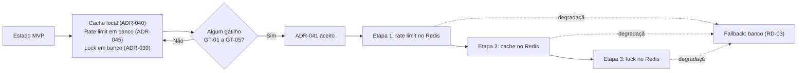

# ADR-041 — Redis como cache distribuído, lock e contador de rate limit a partir de F6

## Status

**Proposto** em 2026-07-29.
**Não é vinculante e não pode ser implementado** enquanto não for aceito (ADR-U02 do `README.md` deste diretório).
Alvo: fase **F6 — SaaS Comercial**.

## Data

2026-07-29

## Contexto

Três decisões do MVP declaram explicitamente uma limitação que Redis resolveria:

| Decisão | Limitação declarada |
|---|---|
| [ADR-040](ADR-040-cache-strategy.md) | Cache local: invalidação não alcança outras instâncias (L-01); TTLs precisam ser curtos (CA-06) |
| [ADR-045](ADR-045-rate-limit.md) | Contador em banco: escrita a cada requisição contada |
| [ADR-039](ADR-039-background-jobs.md) | Lock em banco: adequado, mas não é o mecanismo mais eficiente |

Nenhuma dessas limitações é problema **hoje**. Este ADR existe para registrar **quando** e **por que** elas passarão a ser, e qual é a resposta planejada — evitando que a decisão seja tomada às pressas sob a pressão de um incidente.

Restrições e premissas:

| # | Premissa |
|---|---|
| P-01 | F6 introduz planos, cobrança e onboarding self-service, com crescimento esperado no número de tenants e instâncias |
| P-02 | Redis já está previsto na evolução arquitetural (`architecture.md` §13) |
| P-03 | Nenhum dado de negócio pode viver exclusivamente em Redis (DA-01, `ART-080`) |
| P-04 | O isolamento entre tenants continua inviolável ([ADR-001](ADR-001-multi-tenant.md)) |

## Decisão

**Proposta:** introduzir Redis em F6 como infraestrutura de apoio, com escopo estritamente delimitado.

| # | Regra proposta |
|---|---|
| RD-01 | Redis é adotado para **três** finalidades, e apenas estas: cache distribuído, lock distribuído e contadores de rate limit. |
| RD-02 | **Nenhum dado de negócio** vive exclusivamente em Redis (P-03). Perder o Redis inteiro deve degradar a performance, jamais causar perda de dado. |
| RD-03 | A aplicação **continua funcionando** com o Redis indisponível: cache degrada para acesso direto ao banco; rate limit degrada para o contador em banco; lock degrada para o backend PostgreSQL. |
| RD-04 | **Toda chave é prefixada por `tenantId`** (CA-02 de [ADR-040](ADR-040-cache-strategy.md)), com um prefixo global adicional de ambiente para impedir colisão entre `staging` e `production` caso compartilhem instância. |
| RD-05 | A migração do cache **não altera** chaves, TTLs nem eventos de invalidação: muda apenas o provedor (CA-12). |
| RD-06 | Com cache compartilhado, os TTLs podem ser ampliados — mas a revisão de cada TTL é feita **caso a caso**, reavaliando a consequência declarada em CA-07. Ampliar TTL não é automático. |
| RD-07 | CA-04 permanece: **nada financeiro** com TTL longo, mesmo com cache distribuído. |
| RD-08 | Redis é configurado com **persistência habilitada** e política de evicção explícita (`allkeys-lru` para o cache; chaves de lock e rate limit protegidas por banco de dados lógico separado ou por prefixo com política própria). |
| RD-09 | Autenticação obrigatória, TLS em trânsito, e acesso restrito à rede da aplicação. Redis **nunca** exposto publicamente. |
| RD-10 | Nenhum dado sensível é armazenado (CA-10). |
| RD-11 | A adoção é **incremental**: primeiro rate limit (maior ganho, menor risco), depois cache, e por último lock — cada etapa validada em staging antes da seguinte. |
| RD-12 | A introdução exige atualizar [ADR-040](ADR-040-cache-strategy.md), [ADR-045](ADR-045-rate-limit.md) e [ADR-039](ADR-039-background-jobs.md) com o novo backend, mantendo o comportamento observável. |

### Gatilhos objetivos de adoção

A proposta deve ser aceita quando **qualquer** condição for observada:

| # | Gatilho | Origem |
|---|---|---|
| GT-01 | Mais de **4 instâncias** da API em produção | E-03 de [ADR-040](ADR-040-cache-strategy.md) |
| GT-02 | Necessidade comprovada de TTL superior a 60 s em algum cache | E-03 de [ADR-040](ADR-040-cache-strategy.md) |
| GT-03 | Escrita de rate limit representando parcela mensurável da carga de escrita do banco | [ADR-045](ADR-045-rate-limit.md) |
| GT-04 | Divergência entre instâncias causando incidente reportado por usuário | L-01 de [ADR-040](ADR-040-cache-strategy.md) |
| GT-05 | Entrada em F6 com projeção de crescimento que atinja GT-01 em até 6 meses | `roadmap.md` |

## Motivação

**Por que Redis resolve exatamente estas três coisas:** as três são estado **efêmero e compartilhado entre instâncias** — precisamente o caso de uso para o qual um armazenamento de chave-valor em memória é a ferramenta certa. Nenhuma delas é dado de negócio, o que satisfaz P-03 sem esforço.

**Por que o maior ganho é o rate limit (RD-11):** o contador em banco escreve a cada requisição contada, no caminho quente. Em Redis, um `INCR` com expiração é uma operação atômica de microssegundos, sem tocar o banco transacional. É também a etapa de **menor risco**: se o Redis falhar, degradar para o banco é trivial e o impacto é apenas de performance.

**Por que degradação obrigatória (RD-03):** introduzir Redis como dependência **crítica** trocaria um problema de performance por um problema de disponibilidade. Um Redis indisponível não pode derrubar o produto. A degradação para banco em todos os três casos mantém a disponibilidade e transforma a falha em lentidão.

**Por que ampliar TTL não é automático (RD-06):** a tentação natural após adotar cache compartilhado é aumentar todos os TTLs. Mas o TTL curto de `session-validity` (30 s) existe por razão de **segurança** (atraso de revogação), não apenas por causa da divergência entre instâncias. Cada TTL precisa ser reavaliado contra sua consequência declarada.

**Por que gatilhos objetivos:** sem eles, a decisão vira debate recorrente ("já está na hora do Redis?") ou é tomada tarde demais, durante um incidente. Os gatilhos transformam a pergunta em uma verificação de métrica.

**Por que persistência habilitada (RD-08):** embora nada de negócio viva em Redis, perder todo o cache simultaneamente em um reinício produziria uma avalanche de consultas ao banco (*cache stampede*) exatamente no pior momento. A persistência reduz esse efeito.

## Alternativas consideradas

### A1 — Permanecer com cache local, rate limit e lock em banco indefinidamente

| Aspecto | Avaliação |
|---|---|
| **Prós** | Nenhuma infraestrutura adicional; nenhum custo; nenhuma classe de falha nova; simplicidade máxima. |
| **Contras** | Divergência entre instâncias cresce com o número de réplicas (L-01 de [ADR-040](ADR-040-cache-strategy.md)); escrita de rate limit no caminho quente; TTLs presos em valores curtos. |
| **Por que não é a decisão** | É a decisão **atual** e permanece válida até que um gatilho seja observado. Este ADR não a substitui hoje; apenas define quando substituí-la. |

### A2 — Cache distribuído embutido (Hazelcast, Infinispan em modo embarcado)

| Aspecto | Avaliação |
|---|---|
| **Prós** | Sem serviço externo: as instâncias formam um cluster entre si; invalidação alcança todas; sem latência de rede para um serviço central. |
| **Contras** | Estado de cluster **dentro** da aplicação, contrariando `ART-080`; descoberta de membros e particionamento de rede (*split brain*) são problemas reais e difíceis; o consumo de memória e o comportamento sob deploy gradual ficam imprevisíveis; depuração muito mais difícil. |
| **Por que foi descartada** | Transforma instâncias stateless em membros de cluster com estado compartilhado — exatamente o que `ART-080` evita. A complexidade de operação é maior que a de um Redis gerenciado. |

### A3 — Memcached

| Aspecto | Avaliação |
|---|---|
| **Prós** | Muito simples; excelente desempenho como cache puro; menor consumo de memória por chave. |
| **Contras** | Apenas cache: não oferece as primitivas atômicas necessárias para lock (`SET NX EX`) nem para rate limit (`INCR` com expiração); sem persistência; sem estruturas de dados. |
| **Por que foi descartada** | Resolveria um dos três casos de uso, exigindo outra solução para os outros dois. |

### A4 — Banco de dados dedicado para dados efêmeros

| Aspecto | Avaliação |
|---|---|
| **Prós** | Tecnologia já conhecida; sem novo tipo de infraestrutura; isolaria a carga efêmera do banco transacional. |
| **Contras** | Outra instância de PostgreSQL a operar, com custo comparável ao do Redis; desempenho muito inferior para contadores e cache; sem TTL nativo (exigiria job de limpeza). |
| **Por que foi descartada** | Custo operacional semelhante ao do Redis com desempenho muito pior para o caso de uso. |

### A5 — Redis desde o MVP

| Aspecto | Avaliação |
|---|---|
| **Prós** | Evita a migração futura; TTLs livres desde o início; rate limit eficiente desde o dia um. |
| **Contras** | Contêiner e classe de falha adicionais sem necessidade demonstrada; custo operacional em um MVP com equipe pequena; complexidade que não se paga no volume inicial. |
| **Por que foi descartada** | Já descartada em [ADR-040](ADR-040-cache-strategy.md) A2 e [ADR-045](ADR-045-rate-limit.md). Este ADR é justamente o registro de quando reverter essa escolha. |

## Consequências

### Positivas (esperadas após a aceitação)

| # | Consequência |
|---|---|
| C+01 | Invalidação de cache alcança todas as instâncias, eliminando L-01 de [ADR-040](ADR-040-cache-strategy.md). |
| C+02 | TTLs podem ser ampliados onde a consequência permitir (RD-06). |
| C+03 | Rate limit deixa de escrever no banco transacional a cada requisição. |
| C+04 | Escala horizontal deixa de multiplicar cópias de cache. |
| C+05 | Lock distribuído mais eficiente, com TTL nativo. |
| C+06 | Base para recursos futuros que exijam estado compartilhado efêmero (ex.: contadores de quota em tempo real, F6). |

### Negativas

| # | Consequência | Aceita porque |
|---|---|---|
| C-01 | Um serviço a mais para operar, monitorar, atualizar e proteger. | Serviço gerenciado reduz o custo; o ganho justifica após os gatilhos. |
| C-02 | Nova classe de falha na topologia. | Mitigada por RD-03 (degradação obrigatória). |
| C-03 | Latência de rede por acesso (microssegundos a milissegundos), contra nanossegundos em heap. | Ainda muito inferior ao custo de uma consulta ao banco. |
| C-04 | Custo recorrente de infraestrutura. | Proporcional ao crescimento que motivou os gatilhos. |
| C-05 | Serialização de objetos em cache, com custo e risco de incompatibilidade entre versões. | Formato de serialização estável e versionado. |
| C-06 | Mais uma superfície de segurança a proteger (RD-09). | Rede restrita, autenticação e TLS. |

### Limitações

| # | Limitação |
|---|---|
| L-01 | Redis não substitui o banco: nenhum dado de negócio pode residir ali (RD-02). |
| L-02 | Locks distribuídos em Redis têm modos de falha conhecidos em cenários de partição de rede; para operações críticas (fechamento de período), o lock **pessimista no banco** permanece (TX-05). |
| L-03 | Cache compartilhado torna um erro de chave (RD-04) ainda mais grave: o vazamento alcançaria todas as instâncias. |

### Custos

| Item | Custo |
|---|---|
| Infraestrutura | Instância gerenciada de Redis por ambiente |
| Implementação | ~3 dias, distribuídos nas três etapas de RD-11 |
| Operação | Monitoramento, atualização e backup de configuração |

## Trade-offs

| Sacrificado | Em favor de | Justificativa da troca |
|---|---|---|
| **Simplicidade** da topologia | Consistência de cache entre instâncias | Trocado apenas quando um gatilho comprovar a necessidade. |
| **Latência** de nanossegundos (heap) | Compartilhamento entre instâncias | Ainda ordens de magnitude mais rápido que o banco. |
| **Ausência de custo** recorrente | Escala | Proporcional ao crescimento. |
| **Uma única tecnologia de dados** | Ferramenta adequada a estado efêmero | Redis não guarda dado de negócio (RD-02), então a fonte de verdade continua única. |
| **Adoção imediata** (A5) | Evitar complexidade não justificada | Gatilhos objetivos evitam tanto a antecipação quanto o atraso. |

## Impacto na arquitetura

| Módulo | Impacto |
|---|---|
| `shared/cache` | Provedor trocado; chaves, TTLs e invalidação preservados (RD-05). |
| `shared/ratelimit` | Backend trocado para Redis, com degradação para banco (RD-03). |
| `shared/scheduling` | Backend do ShedLock trocado, com degradação para banco. |
| Domínio | **Nenhum impacto**: nenhuma feature conhece o Redis. |

| Documento dependente | Relação |
|---|---|
| `docs/03-architecture/architecture.md` §5, §13 | Redis previsto na evolução |
| `docs/03-architecture/security.md` §8.1 | Rate limit migrando para Redis em F6 |

| Spec dependente | Relação |
|---|---|
| `specs/future/018-subscriptions` | Quotas em tempo real podem se beneficiar |

| ADR relacionado | Relação |
|---|---|
| [ADR-040](ADR-040-cache-strategy.md) | Cache que este ADR distribui |
| [ADR-045](ADR-045-rate-limit.md) | Contador que este ADR migra |
| [ADR-039](ADR-039-background-jobs.md) | Lock que este ADR pode migrar |
| [ADR-042](ADR-042-rabbitmq.md) | Também de F6; decisões independentes |
| [ADR-049](ADR-049-saas-readiness.md) | Contexto de F6 |

## Impacto no banco

| Item | Impacto |
|---|---|
| Carga de escrita | Redução: o contador de rate limit deixa de escrever a cada requisição. |
| Carga de leitura | Redução adicional: cache compartilhado tem taxa de acerto maior. |
| Tabelas | `rate_limit_counters` e `shedlock` podem ser mantidas como caminho de degradação (RD-03), não removidas. |
| Fonte de verdade | Inalterada (RD-02). |

## Impacto na API

Não se aplica ao contrato: nenhum endpoint muda. Efeito observável possível: com TTLs eventualmente maiores (RD-06), algumas respostas podem refletir estado ligeiramente mais defasado — sempre dentro da consequência declarada em CA-07.

## Impacto no Frontend

Não se aplica, porque a mudança é inteiramente de infraestrutura do servidor.

## Impacto na Infraestrutura

| Item | Impacto |
|---|---|
| Serviço | Instância gerenciada de Redis por ambiente, na rede privada da aplicação. |
| Local | Contêiner Redis adicionado ao Docker Compose sob perfil ([ADR-021](ADR-021-docker-compose.md) DC-10). |
| Configuração | Persistência habilitada, política de evicção explícita (RD-08), `maxmemory` definido. |
| Segurança | Autenticação, TLS, rede restrita, nunca exposto publicamente (RD-09). |
| Monitoramento | Memória, taxa de acerto, evicções, latência, conexões, chaves expiradas. |
| Alta disponibilidade | Avaliada conforme a criticidade; com RD-03, indisponibilidade degrada em vez de derrubar. |

## Segurança

| # | Consideração |
|---|---|
| S-01 | RD-04: prefixo de tenant **e** de ambiente em toda chave. Em cache compartilhado, um erro de chave alcança todas as instâncias (L-03). |
| S-02 | RD-09: autenticação, TLS e rede restrita. Redis sem autenticação exposto à internet é um dos alvos mais explorados que existem. |
| S-03 | RD-10: nenhum dado sensível armazenado. |
| S-04 | O acesso ao Redis é restrito à aplicação; nenhum acesso administrativo direto em produção sem registro. |
| S-05 | Comandos perigosos (`FLUSHALL`, `KEYS`, `CONFIG`) desabilitados ou renomeados na configuração. |
| S-06 | **Multi-tenant:** o isolamento passa a depender também da disciplina de chaves; o gerador centralizado de CA-02 permanece obrigatório. |
| S-07 | **LGPD:** dados pessoais em cache são mínimos e efêmeros; Redis é purgável e não é fonte de verdade. |
| S-08 | **Auditoria:** operações no Redis não geram trilha de negócio; a trilha continua em `audit_logs`. |

## Performance

| # | Consideração |
|---|---|
| P-01 | Acesso em microssegundos a poucos milissegundos, contra dezenas de milissegundos de uma consulta ao banco. |
| P-02 | `INCR` atômico é a operação ideal para rate limit. |
| P-03 | Serialização adiciona custo em relação ao cache em heap; objetos cacheados devem ser pequenos. |
| P-04 | Taxa de acerto maior com cache compartilhado, especialmente com muitas instâncias. |
| P-05 | Risco de *cache stampede* em reinício; mitigado por RD-08 e por jitter nos TTLs. |

## Escalabilidade

| # | Consideração |
|---|---|
| E-01 | Cache compartilhado escala com o número de instâncias sem duplicação (resolve L-02 de [ADR-040](ADR-040-cache-strategy.md)). |
| E-02 | Redis escala verticalmente com folga para o volume previsto; cluster é possível se necessário. |
| E-03 | Rate limit deixa de ser limitado pela capacidade de escrita do banco transacional. |
| E-04 | Abre caminho para recursos de F6 que exijam contadores em tempo real (quotas por plano). |

## Riscos

| # | Risco | Probabilidade | Impacto | Severidade |
|---|---|---|---|---|
| RK-01 | Redis virar dependência crítica, derrubando o produto em caso de falha | Média | **Crítico** | **Crítica** |
| RK-02 | Chave sem prefixo de tenant vazando entre tenants em escala | Baixa | **Crítico** | **Crítica** |
| RK-03 | Redis exposto sem autenticação | Baixa | Crítico | **Alta** |
| RK-04 | Evicção sob pressão de memória removendo chaves de lock | Média | Alto | Alta |
| RK-05 | *Cache stampede* após reinício | Média | Médio | Média |
| RK-06 | TTLs ampliados sem reavaliar a consequência (RD-06) | Média | Médio | Média |
| RK-07 | Incompatibilidade de serialização durante deploy gradual | Média | Médio | Média |

## Mitigações

| Risco | Mitigação | Verificação |
|---|---|---|
| RK-01 | RD-03 obrigatória; teste de resiliência que derruba o Redis e verifica que a aplicação continua funcional, apenas mais lenta | Teste de resiliência |
| RK-02 | Gerador de chave centralizado (CA-02) com prefixo obrigatório; teste de isolamento de cache; RD-04 acrescenta prefixo de ambiente | Teste de isolamento |
| RK-03 | RD-09; verificação de configuração no provisionamento; nunca exposto publicamente | Revisão de infraestrutura |
| RK-04 | RD-08: bancos lógicos separados ou política de evicção que preserve chaves de lock; alternativamente, manter o lock no banco (RD-11 posterga essa etapa) | Configuração |
| RK-05 | Persistência habilitada (RD-08); jitter nos TTLs; aquecimento gradual | Teste de reinício |
| RK-06 | RD-06 explícita: cada TTL reavaliado contra CA-07; revisão obrigatória | `review-checklist.md` |
| RK-07 | Formato de serialização estável e versionado; chaves incluem versão do formato quando necessário | Teste de deploy gradual |

## Referências

| Fonte | Uso |
|---|---|
| [Redis — Documentation](https://redis.io/docs/latest/) | Referência |
| [Redis — Distributed locks (Redlock) e suas ressalvas](https://redis.io/docs/latest/develop/use-cases/patterns/distributed-locks/) | Base de L-02 |
| [Martin Kleppmann — How to do distributed locking](https://martin.kleppmann.com/2016/02/08/how-to-do-distributed-locking.html) | Crítica ao lock em Redis (L-02) |
| [Redis — Security](https://redis.io/docs/latest/operate/oss_and_stack/management/security/) | RD-09 |
| [Spring Data Redis](https://docs.spring.io/spring-data/redis/reference/) | Integração |
| [AWS — Caching best practices: stampede](https://aws.amazon.com/caching/best-practices/) | RK-05 |
| `docs/03-architecture/architecture.md` §13 | Evolução planejada |
