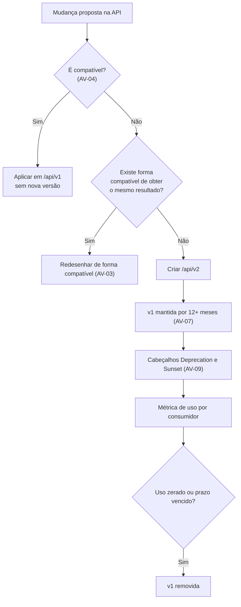

# ADR-043 — Versionamento de API por path, com compatibilidade retroativa como regra

## Status

**Aceito** em 2026-07-29.
Fundamenta `ART-070`, `VR-01`, `VR-02`. Depende de [ADR-011](ADR-011-rest-api.md).

## Data

2026-07-29

## Contexto

A API tem um consumidor no MVP (a SPA) e consumidores externos previstos em F8 (API pública, webhooks, integrações). A diferença entre os dois é decisiva:

| Consumidor | Característica |
|---|---|
| SPA própria | Implantada junto com o backend; pode ser atualizada no mesmo instante |
| Integrador externo (F8) | Atualiza quando quer, ou nunca; não controlamos seu cronograma |

Enquanto houver apenas o primeiro, versionamento é quase supérfluo. A partir do segundo, ele é a diferença entre evoluir a API e quebrar clientes em produção. A decisão precisa ser tomada **antes** do primeiro consumidor externo, porque retrofit de versionamento em uma API sem prefixo é uma quebra em si.

Restrições:

| # | Restrição | Origem |
|---|---|---|
| R-01 | A API é versionada por path: `/api/v1/...` | `ART-070` |
| R-02 | `MAJOR` da aplicação não altera a versão da API | `VR-01`, VS-04 de [ADR-033](ADR-033-versioning.md) |
| R-03 | Mudança incompatível exige nova versão de path e depreciação de 12 meses | `VR-02` |
| R-04 | O documento OpenAPI detecta quebras entre releases | OA-11 de [ADR-012](ADR-012-openapi.md) |
| R-05 | Deploy sem downtime faz versões N e N+1 coexistirem por minutos | DP-02 |

## Decisão

| # | Regra |
|---|---|
| AV-01 | A API é versionada por **prefixo de path**: `/api/v{N}`, com `N` inteiro. A versão atual é `v1`. |
| AV-02 | A versão da API é **independente** da versão da aplicação (R-02). |
| AV-03 | **A regra padrão é a compatibilidade retroativa.** Nova versão de path é o **último** recurso, não o primeiro. |
| AV-04 | São **compatíveis** (não exigem nova versão): adicionar endpoint; adicionar campo **opcional** na requisição; adicionar campo na resposta; adicionar valor a um enum **de saída** cujo contrato preveja valores desconhecidos; adicionar parâmetro de query opcional; adicionar novo código de erro para uma condição nova. |
| AV-05 | São **incompatíveis** (exigem nova versão): remover ou renomear endpoint ou campo; tornar obrigatório um campo antes opcional; alterar o tipo ou o formato de um campo; alterar a semântica de um campo existente; remover valor de enum; alterar o status HTTP de um cenário existente; remover ou ressignificar um código `DEVTIME-XXXX`. |
| AV-06 | Adicionar valor a enum de **entrada** é compatível; adicionar valor a enum de **saída** é compatível **apenas** se o contrato declarar, desde o início, que o cliente deve tolerar valores desconhecidos. Essa cláusula é obrigatória em todo enum de saída. |
| AV-07 | Ao criar `v2`, a versão `v1` permanece funcional por **no mínimo 12 meses** (R-03), com data de encerramento anunciada. |
| AV-08 | Durante a coexistência, as versões compartilham a **mesma** camada de serviço e o mesmo banco. A diferença vive **apenas** na camada de adaptação (controller, DTO, mapper). Duplicar regra de negócio por versão é proibido. |
| AV-09 | Endpoints depreciados retornam o cabeçalho `Deprecation` e `Sunset` (RFC 8594) e são registrados em métrica por consumidor, permitindo saber quem ainda os usa. |
| AV-10 | Quebras são **detectadas automaticamente** comparando o documento OpenAPI entre releases (R-04); a detecção é gate de build. |
| AV-11 | Não há versionamento por endpoint: a versão é do **conjunto**. Um endpoint novo nasce na versão corrente. |
| AV-12 | O cliente **não** escolhe versão por cabeçalho, por parâmetro nem por negociação de conteúdo. O path é a única forma. |
| AV-13 | Códigos de erro `DEVTIME-XXXX` são estáveis entre versões: o mesmo código significa a mesma coisa em `v1` e em `v2`. |

## Motivação

**Por que path e não cabeçalho (AV-01/AV-12):** o path é visível na URL, o que torna a versão evidente em log, em métrica, em documentação, em ferramenta de teste e em uma conversa de suporte. Um cabeçalho de versão é invisível: um cliente que esqueça de enviá-lo recebe silenciosamente a versão padrão, e o diagnóstico de "por que está funcionando diferente?" fica muito mais difícil. O path também permite rotear versões no proxy, se necessário.

**Por que compatibilidade retroativa como regra (AV-03) — a decisão central:** criar `v2` parece a solução limpa, mas o custo real é alto: dois conjuntos de controllers e DTOs a manter, documentar e testar, por no mínimo 12 meses; clientes que precisam migrar; e a decisão de quando remover `v1`. A maior parte das mudanças pode ser feita de forma compatível se for **desenhada** para isso. AV-04 e AV-05 tornam a distinção objetiva, e AV-03 exige tentar a forma compatível antes.

**Por que a lista explícita de compatível e incompatível (AV-04/AV-05):** sem ela, cada mudança vira debate. Com a lista, a pergunta é uma consulta. Isso é especialmente relevante quando a implementação é feita por agentes: a distinção precisa ser verificável, não intuída.

**Por que a cláusula de enum de saída (AV-06):** este é o caso mais sutil. Adicionar um valor a um enum de resposta quebra clientes que fazem `switch` exaustivo — a menos que o contrato tenha declarado, **desde o início**, que valores desconhecidos podem aparecer. Declarar isso desde `v1` é gratuito; declarar depois é uma quebra.

**Por que serviço compartilhado entre versões (AV-08):** duplicar a regra de negócio por versão produziria duas implementações que divergem, e a divergência apareceria como comportamento diferente entre `v1` e `v2` para a mesma operação. A versão é uma questão de **forma do contrato**, não de comportamento do domínio.

**Por que 12 meses (AV-07):** é prazo suficiente para que um integrador externo inclua a migração em seu próprio planejamento, sem ser tão longo que congele a evolução da API.

**Por que detecção automatizada (AV-10):** confiar que alguém perceba uma quebra ao revisar um diff não funciona — a quebra costuma ser sutil (um campo que virou obrigatório, um tipo que mudou de inteiro para string). Comparar o documento OpenAPI entre releases detecta mecanicamente.

## Alternativas consideradas

### A1 — Versionamento por cabeçalho (`Accept-Version`, `X-API-Version`)

| Aspecto | Avaliação |
|---|---|
| **Prós** | URL estável e "limpa"; conceitualmente mais alinhado ao REST (a URL identifica o recurso, não sua representação); permite versionar por recurso. |
| **Contras** | Invisível na URL, portanto invisível em log, métrica e cache; cliente que omite o cabeçalho recebe silenciosamente uma versão padrão; muito mais difícil de testar manualmente (curl, navegador); roteamento por proxy fica mais complexo. |
| **Por que foi descartada** | A visibilidade é decisiva para diagnóstico e suporte, e `ART-070` já fixa o path. |

### A2 — Versionamento por negociação de conteúdo (`Accept: application/vnd.devtime.v2+json`)

| Aspecto | Avaliação |
|---|---|
| **Prós** | Tecnicamente o mais correto segundo a semântica HTTP; permite versionar a representação por recurso. |
| **Contras** | Verboso e propenso a erro de digitação; suporte irregular em ferramentas e SDKs; a mesma invisibilidade de A1; curva de adoção para integradores. |
| **Por que foi descartada** | Correção teórica que custa usabilidade real. |

### A3 — Versionamento por parâmetro de query (`?version=2`)

| Aspecto | Avaliação |
|---|---|
| **Prós** | Visível; fácil de testar; simples de implementar. |
| **Contras** | Mistura versão com filtro no mesmo espaço; facilmente omitido; polui todas as URLs; interage mal com cache e com documentação. |
| **Por que foi descartada** | Sem vantagem sobre o path e com desvantagens claras. |

### A4 — Sem versionamento, apenas compatibilidade retroativa perpétua

| Aspecto | Avaliação |
|---|---|
| **Prós** | Uma única versão para sempre; sem duplicação; sem migração de clientes. |
| **Contras** | Impossível corrigir um erro de design de contrato; a API acumula campos depreciados indefinidamente; alguma mudança será inevitavelmente incompatível (correção de segurança, mudança regulatória). |
| **Por que foi descartada** | A compatibilidade perpétua é o **objetivo** (AV-03), mas não pode ser garantia absoluta. Ter o mecanismo de versão disponível, ainda que raramente usado, é o que permite corrigir erros estruturais. |

### A5 — Versionamento por data (`/api/2026-07-29/...`), no estilo Stripe

| Aspecto | Avaliação |
|---|---|
| **Prós** | Permite muitas versões pequenas; cliente fixa a data e recebe exatamente aquele comportamento; evolução granular sem quebra. |
| **Contras** | Exige manter camadas de transformação entre todas as versões, o que é significativo; adequado a APIs com milhares de integradores e equipe dedicada; complexidade muito acima da necessidade. |
| **Por que foi descartada** | O modelo funciona bem em escala de plataforma pública madura. Para uma API com um consumidor e integradores previstos em F8, o custo de manutenção seria desproporcional. |

## Consequências

### Positivas

| # | Consequência |
|---|---|
| C+01 | Versão visível em URL, log, métrica e documentação. |
| C+02 | AV-04/AV-05 tornam a decisão objetiva, sem debate. |
| C+03 | AV-03 mantém uma única versão pela maior parte da vida do produto. |
| C+04 | Integradores externos (F8) têm prazo previsível de migração (AV-07). |
| C+05 | Quebras detectadas automaticamente antes de chegar a produção (AV-10). |
| C+06 | Serviço compartilhado evita divergência de comportamento entre versões (AV-08). |
| C+07 | Coexistência de versões durante deploy sem downtime é natural (R-05). |

### Negativas

| # | Consequência | Aceita porque |
|---|---|---|
| C-01 | O prefixo `/api/v1` aparece em todas as URLs, mesmo com uma só versão. | Custo estético mínimo; adicioná-lo depois seria uma quebra. |
| C-02 | Criar `v2` duplica a camada de adaptação por 12+ meses. | Por isso AV-03 torna a criação de versão o último recurso. |
| C-03 | Disciplina permanente de avaliar cada mudança contra AV-04/AV-05. | Automatizada por AV-10. |
| C-04 | A cláusula de enum de saída (AV-06) precisa estar em todo contrato desde o início. | Custo zero se feito desde `v1`. |
| C-05 | Depreciação exige acompanhamento de uso por 12 meses. | Automatizado por métrica (AV-09). |

### Limitações

| # | Limitação |
|---|---|
| L-01 | Não permite evolução granular por recurso (consequência de AV-11). |
| L-02 | Não oferece a flexibilidade de versionamento por data (A5). |
| L-03 | A compatibilidade de comportamento **semântico** (mesmo contrato, comportamento sutilmente diferente) não é detectável por AV-10 — depende de teste e de revisão. |

### Custos

| Item | Custo |
|---|---|
| Implementação | Prefixo no roteamento: trivial |
| Detecção de quebra | Ferramenta de comparação de OpenAPI no pipeline |
| Criação de `v2` | Alta, quando ocorrer — motivo de AV-03 |

## Trade-offs

| Sacrificado | Em favor de | Justificativa da troca |
|---|---|---|
| **Pureza REST** (URL identifica só o recurso) | Visibilidade e diagnóstico | Versão invisível dificulta suporte e observabilidade. |
| **Granularidade** por recurso ou por data | Simplicidade de manutenção | Uma única versão coesa é muito mais barata de manter. |
| **Liberdade** de mudar o contrato | Estabilidade para consumidores | Sem estabilidade, não há integração externa possível. |
| **URL limpa** | Preparação para F8 desde o início | Adicionar o prefixo depois seria a quebra que se quer evitar. |
| **Flexibilidade** de duplicar regra por versão | Consistência de comportamento | Duas implementações divergem. |

## Impacto na arquitetura

| Módulo | Impacto |
|---|---|
| `*/controller` | Todos sob `/api/v1`. |
| `shared/web` | Configuração do prefixo, aplicada de forma centralizada. |
| CI | Comparação de OpenAPI entre releases (AV-10). |
| Observabilidade | Métrica por versão de API e por endpoint depreciado (AV-09). |

| Documento dependente | Relação |
|---|---|
| `docs/ai/project-constitution.md` | ART-070 |
| `docs/ai/coding-guidelines.md` §9.2 | `VR-01`, `VR-02` |
| `docs/04-api/*` | Todos os contratos |
| `docs/00-overview/roadmap.md` | F8 — API pública |

| Spec dependente | Relação |
|---|---|
| Todas as specs | Seção "Endpoints utilizados" |
| `specs/future/019-public-api` | Consumidor externo |

| ADR relacionado | Relação |
|---|---|
| [ADR-011](ADR-011-rest-api.md) | Estilo de API |
| [ADR-012](ADR-012-openapi.md) | Detecção de quebra (OA-11) |
| [ADR-033](ADR-033-versioning.md) | Independência entre versões (VS-04) |
| [ADR-017](ADR-017-exception-handling.md) | Estabilidade de códigos (AV-13) |
| [ADR-050](ADR-050-future-integrations.md) | Consumidores externos |

## Impacto no banco

Não se aplica diretamente. Relação relevante: a regra das duas releases para remoção de coluna (FW-09 de [ADR-007](ADR-007-flyway.md)) é o análogo de AV-05 no nível de schema — um campo removido do banco só pode sair da API depois, e nunca no mesmo passo. As duas disciplinas se reforçam.

## Impacto na API

Este ADR **é** a decisão de versionamento:

| Item | Regra |
|---|---|
| Prefixo | `/api/v1` em todos os endpoints |
| Compatível | AV-04 |
| Incompatível | AV-05 |
| Enum de saída | Cláusula obrigatória de tolerância a valores desconhecidos (AV-06) |
| Depreciação | Cabeçalhos `Deprecation` e `Sunset`; 12 meses mínimos |
| Seleção | Apenas por path (AV-12) |
| Códigos de erro | Estáveis entre versões (AV-13) |
| Documentação | Um documento OpenAPI por versão ([ADR-012](ADR-012-openapi.md)) |

## Impacto no Frontend

| Item | Impacto |
|---|---|
| URL base | Configurada uma vez, com o prefixo de versão. |
| Migração | Como a SPA é implantada junto com o backend, ela migra de versão imediatamente; não usufrui do período de 12 meses. |
| Tolerância | Mesmo sendo consumidor acoplado, o frontend **deve** tolerar campos novos e valores de enum desconhecidos — durante o deploy sem downtime, versões N e N+1 coexistem (R-05). |
| Depreciação | O frontend nunca deve consumir endpoint depreciado; a métrica de AV-09 permite verificar. |

## Impacto na Infraestrutura

| Item | Impacto |
|---|---|
| Proxy | Pode rotear por prefixo de versão, se um dia versões diferentes forem servidas por instâncias diferentes. |
| Métrica | Rótulo de versão em todas as métricas de endpoint. |
| Documentação | Um documento OpenAPI publicado por versão ativa. |
| Deploy | Coexistência de versões durante o deploy é natural com o prefixo. |

## Segurança

| # | Consideração |
|---|---|
| S-01 | Versão antiga mantida por 12 meses precisa receber **todas** as correções de segurança; uma `v1` depreciada e desatualizada é passivo de segurança. |
| S-02 | AV-08 (serviço compartilhado) garante que uma correção de segurança no domínio se aplique automaticamente a todas as versões — este é um benefício de segurança direto da decisão. |
| S-03 | Uma correção de segurança que exija mudança incompatível é a exceção legítima ao prazo de AV-07; a remoção antecipada é comunicada com o prazo possível. |
| S-04 | Endpoints depreciados continuam sujeitos a autenticação, autorização e rate limit idênticos. |
| S-05 | **Multi-tenant:** o isolamento é da camada de serviço (AV-08), portanto vale igualmente em todas as versões. Nenhuma versão pode ter isolamento mais fraco. |
| S-06 | **LGPD:** uma versão antiga não pode expor campo pessoal que a nova removeu por minimização — nesse caso, a remoção do campo é tratada como correção obrigatória, não como quebra opcional. |
| S-07 | **Auditoria:** a versão da API usada é registrada no log de cada requisição. |

## Performance

Não se aplica de forma relevante: o prefixo é apenas roteamento. Efeito indireto: manter duas versões ativas aumenta a superfície de código e o número de testes, o que afeta o tempo de build, não o runtime.

## Escalabilidade

| # | Consideração |
|---|---|
| E-01 | O número de versões ativas é o principal fator de custo de manutenção; AV-03 o mantém em uma. |
| E-02 | Versões podem ser servidas por instâncias distintas se necessário (roteamento por prefixo). |
| E-03 | Em F8, com múltiplos integradores, a métrica de uso por versão (AV-09) orienta quando remover. |
| E-04 | A disciplina de compatibilidade permite evoluir a API indefinidamente sem coordenar com clientes. |

## Riscos

| # | Risco | Probabilidade | Impacto | Severidade |
|---|---|---|---|---|
| RK-01 | Quebra incompatível introduzida sem perceber | **Alta** | Alto | **Alta** |
| RK-02 | Criação prematura de `v2` por conveniência | Média | Médio | Média |
| RK-03 | Versão antiga sem correção de segurança | Baixa | Alto | Média |
| RK-04 | Valor novo em enum de saída quebrando cliente (AV-06) | Média | Médio | Média |
| RK-05 | Regra de negócio duplicada entre versões (violando AV-08) | Média | Alto | Alta |
| RK-06 | `v1` mantida indefinidamente por falta de acompanhamento | Média | Médio | Média |
| RK-07 | Mudança semântica sem mudança de contrato (L-03) | Média | Alto | Alta |

## Mitigações

| Risco | Mitigação | Verificação |
|---|---|---|
| RK-01 | AV-10: comparação automatizada do OpenAPI entre releases como gate de build; confronto com a presença de `BREAKING CHANGE` no commit ([ADR-031](ADR-031-conventional-commits.md)) | Gate de contrato |
| RK-02 | AV-03: criar versão exige justificativa e aprovação do Arquiteto, demonstrando que não há forma compatível | Revisão arquitetural |
| RK-03 | AV-08 faz correções no domínio valerem para todas as versões; a superfície específica de versão é apenas adaptação | Revisão de segurança |
| RK-04 | AV-06 obrigatória em todo enum de saída desde `v1`; teste de contrato que verifica a cláusula documentada | Gate de contrato |
| RK-05 | Regra ArchUnit: controllers de versões distintas devem depender do **mesmo** serviço; nenhuma lógica em controller (CL-02) | ArchUnit |
| RK-06 | AV-09 (métrica por versão) e data de encerramento anunciada; revisão trimestral do uso | Monitoramento |
| RK-07 | Testes de comportamento por endpoint, não apenas de forma; revisão obrigatória de mudança semântica; documentação em `docs/04-api/` atualizada no mesmo PR (`ART-111`) | Suíte de contrato |

## Referências

| Fonte | Uso |
|---|---|
| [RFC 8594 — Sunset HTTP Header](https://www.rfc-editor.org/rfc/rfc8594) | AV-09 |
| [Microsoft — API Guidelines: Versioning](https://github.com/microsoft/api-guidelines/blob/vNext/Guidelines.md#12-versioning) | AV-01, AV-04, AV-05 |
| [Google — API Design: Versioning e compatibilidade](https://cloud.google.com/apis/design/versioning) | Base de AV-04/AV-05 |
| [Stripe — API versioning](https://docs.stripe.com/api/versioning) | Alternativa A5 |
| [GitHub — API versions](https://docs.github.com/en/rest/about-the-rest-api/api-versions) | Referência de versionamento por data |
| [OpenAPI diff tooling](https://github.com/OpenAPITools/openapi-diff) | AV-10 |
| `docs/ai/coding-guidelines.md` §9.2 | `VR-01`, `VR-02` |
