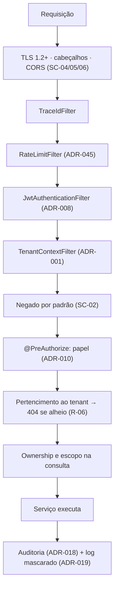

# ADR-044 — Política de segurança: defesa em profundidade e cobertura verificável do OWASP Top 10

## Status

**Aceito** em 2026-07-29.
Consolida `ART-080` a `ART-085`. Complementa [ADR-001](ADR-001-multi-tenant.md), [ADR-008](ADR-008-jwt.md), [ADR-009](ADR-009-refresh-token.md), [ADR-010](ADR-010-role-permission.md) e [ADR-045](ADR-045-rate-limit.md).

## Data

2026-07-29

## Contexto

O DevTime custodia dados comercialmente sensíveis de múltiplos clientes no mesmo banco: valores de contrato, horas faturáveis, nomes de clientes finais e descrições de trabalho. Uma falha de segurança tem três consequências simultâneas: dano ao cliente afetado, dano reputacional ao produto e exposição regulatória (LGPD).

Decisões de segurança específicas já estão registradas em ADRs próprios. Este ADR existe para responder ao que **nenhum deles responde sozinho**: qual é a política que os organiza, o que cobre o que sobrou, e como se verifica que a cobertura é real.

Restrições:

| # | Restrição | Origem |
|---|---|---|
| R-01 | Todo endpoint é negado por padrão | `ART-085` |
| R-02 | Segredos apenas em variáveis de ambiente | `ART-083` |
| R-03 | Log jamais contém senha, token, hash, documento completo ou conteúdo de anexo | `ART-084` |
| R-04 | Autorização em duas camadas: papel e pertencimento ao tenant | `ART-082` |
| R-05 | Build falha em CVE `HIGH`/`CRITICAL` | `ART-103` |
| R-06 | Acesso cross-tenant retorna `404` | `ART-024` |

## Decisão

| # | Regra |
|---|---|
| SC-01 | A postura é **defesa em profundidade**: nenhum controle crítico depende de uma única camada. Onde a falha é grave, há redundância independente. |
| SC-02 | **Negado por padrão** (R-01): rota nova é inacessível até que seja explicitamente autorizada. A allowlist de rotas públicas é curta, revisada e testada. |
| SC-03 | A **ordem da cadeia de filtros** é parte do contrato de segurança: `TraceId → RateLimit → JwtAuthentication → TenantContext`. Alterá-la exige ADR. |
| SC-04 | Os **cabeçalhos de segurança** de `security.md` §8.2 são obrigatórios em todas as respostas: HSTS, CSP, `X-Content-Type-Options`, `X-Frame-Options`, `Referrer-Policy`, `Permissions-Policy` e `Cache-Control: no-store` nas respostas de API. |
| SC-05 | **CORS** com origens explícitas por ambiente e `allowCredentials = true`; `*` é proibido. |
| SC-06 | **TLS 1.2+** obrigatório em todo tráfego externo e entre a aplicação e o banco. |
| SC-07 | Senhas com **BCrypt custo 12**; mínimo de 10 caracteres com maiúscula, minúscula e dígito; verificação contra lista de senhas comuns; **sem** expiração periódica. |
| SC-08 | Toda dependência é verificada no pipeline; CVE `HIGH`/`CRITICAL` bloqueia o build (R-05); Dependabot ativo. |
| SC-09 | Detecção de segredo é gate de build; segredo commitado exige **rotação imediata** da credencial (`P-06`). |
| SC-10 | Dados são classificados em **Crítico, Sensível, Interno e Público** (`security.md` §9.1), e o tratamento em log, resposta e armazenamento segue a classificação. |
| SC-11 | A cobertura do **OWASP Top 10** é mapeada controle a controle (tabela abaixo) e cada linha tem **verificação automatizada** ou procedimento documentado. |
| SC-12 | Eventos de segurança são auditados obrigatoriamente: login, falha de login, negação de autorização, tentativa cross-tenant, alteração de papel, reuso de refresh token, upload rejeitado. |
| SC-13 | Tentativa de acesso cross-tenant gera **alerta crítico imediato** (`architecture.md` §12) e aciona o procedimento de resposta a incidentes (`security.md` §12). |
| SC-14 | Swagger UI, stack trace e endpoints de diagnóstico são **desabilitados em produção**. |
| SC-15 | MFA e SSO empresarial estão fora do escopo do MVP; previstos para F6, por ADR próprio. |
| SC-16 | Nenhuma URL fornecida pelo usuário é requisitada pelo backend no MVP; a partir de F8 (webhooks), allowlist de destino e bloqueio de IPs privados são obrigatórios. |

### Mapa de cobertura do OWASP Top 10

| Risco | Controles | Onde está decidido | Verificação |
|---|---|---|---|
| **A01** Broken Access Control | Isolamento em camadas; RBAC com escopo de dados; `404` em vez de `403`; negado por padrão | [ADR-001](ADR-001-multi-tenant.md), [ADR-010](ADR-010-role-permission.md), SC-02 | Suíte de isolamento (gate `G-09`) + suíte de papéis |
| **A02** Cryptographic Failures | TLS 1.2+ com HSTS; BCrypt 12; refresh token como hash; segredos em ambiente; criptografia em repouso | SC-06, SC-07, [ADR-009](ADR-009-refresh-token.md), [ADR-038](ADR-038-file-storage.md) | Teste de configuração + revisão |
| **A03** Injection | Parâmetros vinculados no JPA; concatenação de SQL proibida; Angular escapa por padrão; `innerHTML` proibido | [ADR-005](ADR-005-spring-boot.md), [ADR-022](ADR-022-angular.md), [ADR-015](ADR-015-validation.md) | ArchUnit + revisão + lint |
| **A04** Insecure Design | Modelo de ameaças; regras explícitas; limites de recurso; máquinas de estado fechadas | `security.md` §4, `docs/02-domain/` | Revisão arquitetural |
| **A05** Security Misconfiguration | Negado por padrão; Swagger off em produção; sem stack trace; cabeçalhos; `ddl-auto=validate` | SC-02, SC-04, SC-14, [ADR-017](ADR-017-exception-handling.md) | Teste de configuração por perfil |
| **A06** Vulnerable Components | Verificação de dependências; gate `G-06`; Dependabot; revisão antes de adicionar dependência | SC-08, [ADR-030](ADR-030-github-actions.md) | Pipeline |
| **A07** Identification and Authentication Failures | Bloqueio por tentativas; rate limit; rotação com detecção de reuso; mensagens uniformes | [ADR-008](ADR-008-jwt.md), [ADR-009](ADR-009-refresh-token.md), [ADR-045](ADR-045-rate-limit.md) | Suíte de autenticação |
| **A08** Software and Data Integrity Failures | Snapshot com SHA-256; auditoria append-only; antivírus; *magic number*; actions fixadas por SHA | [ADR-036](ADR-036-report-generation.md), [ADR-018](ADR-018-auditing.md), [ADR-038](ADR-038-file-storage.md), [ADR-030](ADR-030-github-actions.md) | Testes específicos |
| **A09** Logging and Monitoring Failures | Log estruturado com `traceId`; auditoria de operação crítica; alertas | [ADR-019](ADR-019-logging.md), [ADR-018](ADR-018-auditing.md), [ADR-047](ADR-047-monitoring.md) | Teste de mascaramento + alertas |
| **A10** SSRF | Nenhuma URL do usuário requisitada no MVP; allowlist e bloqueio de IP privado em F8 | SC-16, [ADR-050](ADR-050-future-integrations.md) | Revisão |

## Motivação

**Por que defesa em profundidade (SC-01):** todo controle único falha eventualmente — por bug, por esquecimento ou por caminho não previsto. A pergunta correta não é "este controle funciona?", mas "o que acontece **quando** ele falhar?". No isolamento entre tenants, por exemplo, há cinco camadas ([ADR-001](ADR-001-multi-tenant.md)): esquecer uma anotação não resulta em vazamento porque outra camada absorve.

**Por que negado por padrão (SC-02):** o modo de falha importa mais que o caminho feliz. Com permitido por padrão, esquecer de proteger um endpoint o deixa **público** — e ninguém percebe, porque tudo funciona. Com negado por padrão, esquecer o deixa **inacessível** — e alguém percebe imediatamente, porque nada funciona. A falha ruidosa é infinitamente preferível.

**Por que a ordem dos filtros é contrato (SC-03):** o rate limit precisa vir **antes** da autenticação, ou um atacante consegue esgotar recursos de verificação de senha; o contexto de tenant precisa vir **depois** da autenticação, ou não há de onde extrair o `tid`. Uma reordenação aparentemente inofensiva desmonta controles.

**Por que o mapa de cobertura com verificação (SC-11) — a contribuição central deste ADR:** listar controles é fácil; provar que estão ativos é o que importa. Cada linha da tabela aponta **onde a decisão está** e **como se verifica**. Uma linha sem verificação automatizada é uma lacuna conhecida, não uma cobertura presumida.

**Por que sem expiração de senha (SC-07):** a exigência de troca periódica é reconhecidamente contraproducente: leva a senhas incrementais previsíveis e a anotação em papel. Comprimento e verificação contra listas comuns são controles mais efetivos.

**Por que alerta crítico em tentativa cross-tenant (SC-13):** é o único evento do produto que **não tem explicação legítima**. Um erro de digitação em um ID produz `404` de recurso inexistente; um ID válido de outro tenant significa que alguém obteve esse ID de algum lugar. Toda ocorrência merece investigação.

**Por que MFA fora do MVP (SC-15):** é decisão consciente, não omissão. MFA exige fluxo de cadastro, recuperação, códigos de backup e suporte — e o público inicial é de freelancers individuais. Postergar está registrado; esquecer não estaria.

## Alternativas consideradas

### A1 — Controles de segurança decididos caso a caso, sem política consolidada

| Aspecto | Avaliação |
|---|---|
| **Prós** | Menos documentação; cada decisão no seu contexto. |
| **Contras** | Impossível saber se a cobertura é completa; lacunas invisíveis; nenhuma verificação sistemática; auditoria de segurança sem ponto de partida. |
| **Por que foi descartada** | A pergunta "estamos cobertos?" precisa de resposta verificável. SC-11 fornece essa resposta. |

### A2 — Adotar um framework de conformidade completo (ISO 27001, SOC 2) desde o MVP

| Aspecto | Avaliação |
|---|---|
| **Prós** | Cobertura abrangente; exigido por clientes enterprise; processo maduro de controles e evidências. |
| **Contras** | Custo de certificação e de processo desproporcional ao estágio; muitos controles são organizacionais, não técnicos; consumiria o orçamento do MVP. |
| **Por que foi descartada para o MVP** | OWASP Top 10 cobre os riscos técnicos relevantes com custo compatível. Certificação é decisão comercial de F6+, e a arquitetura atual não a impede. |

### A3 — WAF (firewall de aplicação) como camada principal de proteção

| Aspecto | Avaliação |
|---|---|
| **Prós** | Proteção genérica sem alterar a aplicação; bloqueia ataques conhecidos; mitigação rápida de vulnerabilidade recém-descoberta. |
| **Contras** | Falsos positivos bloqueiam uso legítimo; não entende a lógica de negócio (não protege contra falha de autorização, que é o principal risco aqui); cria falsa sensação de segurança; custo. |
| **Por que foi descartada como camada principal** | O principal risco do produto é A01 (controle de acesso), que um WAF não endereça. Um WAF permanece útil como **camada adicional** de borda, e sua adoção é decisão de infraestrutura, não substituta destes controles. |

### A4 — Terceirizar autenticação e autorização a um provedor de identidade

| Aspecto | Avaliação |
|---|---|
| **Prós** | MFA, SSO e detecção de anomalia prontos; menos código de segurança próprio. |
| **Contras** | Descartado em [ADR-008](ADR-008-jwt.md) A4: `tid` e `role` dependem de `memberships`, criando duas fontes de verdade sobre autorização; custo por usuário ativo. |
| **Por que foi descartada** | Coerência com [ADR-008](ADR-008-jwt.md). |

### A5 — Pentest periódico como principal mecanismo de garantia

| Aspecto | Avaliação |
|---|---|
| **Prós** | Perspectiva externa; encontra o que a equipe não vê; exigido por alguns clientes. |
| **Contras** | Pontual: valida um instante, não o fluxo contínuo de mudanças; caro; não impede a introdução de falha entre um teste e outro. |
| **Por que não é o mecanismo principal** | Complementar, não substituto. As suítes automatizadas (SC-11) verificam **a cada PR**; o pentest valida periodicamente o conjunto. A adoção de pentest é recomendada antes do lançamento comercial. |

## Consequências

### Positivas

| # | Consequência |
|---|---|
| C+01 | Cobertura do OWASP Top 10 mapeada e verificável (SC-11). |
| C+02 | Falha de um controle não resulta em comprometimento (SC-01). |
| C+03 | Endpoint novo é inacessível por padrão (SC-02). |
| C+04 | Vulnerabilidades de dependência bloqueiam o build (SC-08). |
| C+05 | Eventos de segurança auditados e alertados (SC-12, SC-13). |
| C+06 | Lacunas conhecidas (MFA, SSO, WAF) estão registradas, não esquecidas. |
| C+07 | Postura verificável a cada PR, não apenas em auditoria pontual. |

### Negativas

| # | Consequência | Aceita porque |
|---|---|---|
| C-01 | Múltiplas camadas aumentam a complexidade e o custo de manutenção. | É a essência de SC-01; a alternativa é ponto único de falha. |
| C-02 | Negado por padrão gera atrito no desenvolvimento (endpoint novo não funciona até ser autorizado). | O atrito é o mecanismo. |
| C-03 | Gate de CVE bloqueia o build por vulnerabilidade em dependência transitiva. | Necessário; Dependabot reduz a frequência de surpresas. |
| C-04 | Auditoria de eventos de segurança gera volume. | Retenção controlada ([ADR-018](ADR-018-auditing.md)). |
| C-05 | Sem MFA no MVP (SC-15). | Registrado e planejado. |
| C-06 | BCrypt custo 12 torna o login deliberadamente lento (~250 ms). | É o controle contra força bruta, não um defeito. |

### Limitações

| # | Limitação |
|---|---|
| L-01 | Sem MFA, SSO nem detecção de anomalia comportamental no MVP. |
| L-02 | Sem WAF; proteção contra ataques volumétricos depende da infraestrutura de borda. |
| L-03 | Sem certificação formal (A2). |
| L-04 | Verificação automatizada cobre o que é automatizável; falhas de design dependem de revisão humana. |

### Custos

| Item | Custo |
|---|---|
| Implementação | Distribuída pelos ADRs específicos |
| Pipeline | Suítes de segurança e análise de dependências |
| Manutenção | Atualização de dependências e revisão periódica do mapa (SC-11) |

## Trade-offs

| Sacrificado | Em favor de | Justificativa da troca |
|---|---|---|
| **Simplicidade** (um controle por risco) | Defesa em profundidade | Controle único falha; a pergunta é o que acontece quando falha. |
| **Velocidade** de desenvolvimento (negado por padrão) | Falha ruidosa em vez de silenciosa | Endpoint público por esquecimento é o pior modo de falha. |
| **Conveniência** (login rápido) | Resistência a força bruta | BCrypt lento é o controle, não o problema. |
| **Cobertura** de MFA e SSO | Escopo do MVP | Registrado em SC-15, com fase definida. |
| **Garantia externa** (certificação, pentest contínuo) | Verificação contínua automatizada | Automatizado verifica a cada PR; pentest complementa periodicamente. |

## Impacto na arquitetura

| Módulo | Impacto |
|---|---|
| `shared/security` | Cadeia de filtros, configuração, `PermissionEvaluator`, cabeçalhos. |
| `shared/tenancy` | Camada 1 do isolamento. |
| `shared/error` | Nenhum vazamento em resposta de erro. |
| `shared/observability` | Correlação e alertas de segurança. |
| `audit` | Eventos de segurança (SC-12). |
| Toda feature | `@PreAuthorize`, escopo de dados, validação. |

| Documento dependente | Relação |
|---|---|
| `docs/03-architecture/security.md` | Documento inteiro |
| `docs/ai/project-constitution.md` §4.9 | ART-080 a ART-085 |
| `docs/02-domain/permissions.md` | Autorização |
| `docs/06-testing/strategy.md` §9.2 | Testes de segurança |

| Spec dependente | Relação |
|---|---|
| Todas as specs | Dimensão obrigatória "Segurança" da §8.1 de `specs/README.md` |

| ADR relacionado | Relação |
|---|---|
| [ADR-001](ADR-001-multi-tenant.md) | A01 |
| [ADR-008](ADR-008-jwt.md) / [ADR-009](ADR-009-refresh-token.md) | A02, A07 |
| [ADR-010](ADR-010-role-permission.md) | A01 |
| [ADR-017](ADR-017-exception-handling.md) | A05 |
| [ADR-018](ADR-018-auditing.md) / [ADR-019](ADR-019-logging.md) | A09 |
| [ADR-038](ADR-038-file-storage.md) | A08 |
| [ADR-045](ADR-045-rate-limit.md) | A07 |
| [ADR-030](ADR-030-github-actions.md) | A06, A08 |

## Impacto no banco

| Item | Impacto |
|---|---|
| Usuários | Usuário da aplicação sem privilégio de superusuário nem de DDL; usuário de migração separado. |
| Criptografia | Em repouso (disco) e em trânsito (TLS, SC-06). |
| Isolamento | Responsabilidade da aplicação no MVP; RLS previsto em F6 ([ADR-001](ADR-001-multi-tenant.md) MT-10). |
| Auditoria | `audit_logs` append-only, sem `UPDATE`/`DELETE` para a aplicação. |
| Senhas | Apenas o hash BCrypt é armazenado (SC-07). |
| Backups | Contêm dado pessoal; mesmo nível de proteção e retenção controlada. |

## Impacto na API

| Item | Impacto |
|---|---|
| Autenticação | `Bearer` obrigatório fora da allowlist (SC-02). |
| Cabeçalhos | Conforme SC-04 em todas as respostas. |
| CORS | Origens explícitas por ambiente (SC-05). |
| Erros | Nenhum vazamento de detalhe interno; `404` para recurso alheio (R-06). |
| Rate limit | Por escopo, com `429` e `Retry-After` ([ADR-045](ADR-045-rate-limit.md)). |
| Documentação | Swagger UI desabilitado em produção (SC-14). |

## Impacto no Frontend

| Item | Impacto |
|---|---|
| CSP | Restringe origens de script; sem `eval` nem script inline. |
| XSS | Angular escapa por padrão; `innerHTML` com conteúdo do usuário é proibido. |
| Tokens | Access em memória, refresh em cookie `HttpOnly` ([ADR-008](ADR-008-jwt.md), [ADR-009](ADR-009-refresh-token.md)). |
| Autorização | Guards são usabilidade; a decisão é sempre do servidor (RB-14). |
| Dependências | npm verificado no pipeline (SC-08). |
| Console | Nenhum dado sensível registrado no console do navegador ([ADR-019](ADR-019-logging.md)). |

## Impacto na Infraestrutura

| Item | Impacto |
|---|---|
| TLS | Terminado no proxy, com HSTS; TLS também entre aplicação e banco (SC-06). |
| Segredos | Apenas em variáveis de ambiente ou cofre do orquestrador (R-02). |
| Contêiner | Não-root, sistema de arquivos somente leitura, sem ferramentas ([ADR-020](ADR-020-docker.md)). |
| Rede | Banco e serviços de apoio em rede privada, sem exposição pública. |
| Alertas | Tentativa cross-tenant como alerta crítico (SC-13). |
| Incidentes | Procedimento documentado em `security.md` §12. |

## Segurança

Este ADR **é** a decisão de segurança. Pontos de reforço nas dimensões transversais:

| # | Consideração |
|---|---|
| S-01 | **Multi-tenant:** o isolamento é o controle mais crítico; cinco camadas independentes, verificadas por suíte obrigatória por endpoint. |
| S-02 | **LGPD:** classificação de dados (SC-10); mascaramento em log; exportação, anonimização e purga; base legal para retenção da trilha por 5 anos. |
| S-03 | **Auditoria:** eventos de segurança obrigatórios (SC-12), com trilha append-only. |
| S-04 | **Soft delete:** registro excluído mantém o mesmo controle de acesso do ativo ([ADR-003](ADR-003-soft-delete.md) S-01). |
| S-05 | **UUID:** não-enumerabilidade complementa o isolamento, mas **não** é controle de acesso ([ADR-002](ADR-002-uuid.md) S-01). |
| S-06 | **Escalabilidade:** rate limit por tenant protege contra vizinho barulhento e contra abuso ([ADR-045](ADR-045-rate-limit.md)). |
| S-07 | **Observabilidade:** sem log e alerta adequados, uma invasão passa despercebida — A09 é risco de segurança, não apenas de operação. |

## Performance

| # | Consideração |
|---|---|
| P-01 | Validação de JWT é local, sem I/O ([ADR-008](ADR-008-jwt.md)). |
| P-02 | BCrypt custo 12 leva ~250 ms **por desenho**; incide apenas no login. |
| P-03 | A cadeia de filtros adiciona overhead desprezível. |
| P-04 | O escopo de dados na consulta (RB-06) exige índices adequados. |
| P-05 | Rate limit em banco adiciona uma escrita por requisição contada — limitação conhecida, endereçada por [ADR-041](ADR-041-redis.md). |
| P-06 | Log estruturado e auditoria adicionam custo proporcional ao tráfego, dimensionado. |

## Escalabilidade

| # | Consideração |
|---|---|
| E-01 | Os controles são stateless e escalam com as instâncias. |
| E-02 | Rate limit e cache de sessão são os pontos que se beneficiam de estado compartilhado em F6 ([ADR-041](ADR-041-redis.md)). |
| E-03 | A suíte de isolamento cresce linearmente com os endpoints, gerada por padrão comum. |
| E-04 | RLS (MT-10) é a camada adicional planejada quando o parque justificar. |
| E-05 | MFA e SSO (SC-15) escalam com o público empresarial de F6. |

## Riscos

| # | Risco | Probabilidade | Impacto | Severidade |
|---|---|---|---|---|
| RK-01 | Vazamento de dados entre tenants | Média | **Crítico** | **Crítica** |
| RK-02 | Endpoint novo sem autorização adequada | **Alta** | Alto | **Alta** |
| RK-03 | CVE crítica em dependência amplamente usada | Alta | Alto | **Alta** |
| RK-04 | Vazamento de segredo (repositório, log, imagem) | Média | Crítico | **Alta** |
| RK-05 | XSS armazenado por conteúdo do usuário | Média | Alto | Alta |
| RK-06 | Comprometimento de conta por senha fraca ou reutilizada | Média | Alto | Alta |
| RK-07 | Ausência de MFA sendo bloqueador comercial em F6 | Média | Médio | Média |
| RK-08 | Falha de segurança não detectada por ausência de monitoramento | Baixa | **Crítico** | **Alta** |

## Mitigações

| Risco | Mitigação | Verificação |
|---|---|---|
| RK-01 | Cinco camadas de isolamento; suíte obrigatória por endpoint; alerta crítico em tentativa (SC-13); RLS em F6 | Gate `G-09` |
| RK-02 | SC-02 (negado por padrão); ArchUnit exigindo `@PreAuthorize`; suíte que chama cada endpoint com cada papel | ArchUnit + suíte de papéis |
| RK-03 | SC-08 (gate `G-06`); Dependabot; janela de atualização emergencial no runbook; reconstrução periódica da imagem | Pipeline |
| RK-04 | SC-09 (gate `G-07`); segredos apenas em ambiente; nunca em imagem ([ADR-020](ADR-020-docker.md) DK-05); rotação imediata em caso de exposição | Pipeline + runbook |
| RK-05 | Angular escapa por padrão; `innerHTML` proibido; CSP; `Content-Disposition: attachment` em anexos ([ADR-038](ADR-038-file-storage.md) FS-09) | Lint + teste de cabeçalho |
| RK-06 | SC-07 (comprimento, complexidade, lista de senhas comuns); bloqueio por tentativas; rate limit no login | Suíte de autenticação |
| RK-07 | SC-15 registra a lacuna com fase definida; a arquitetura de [ADR-008](ADR-008-jwt.md) não impede a adição | Planejamento de F6 |
| RK-08 | [ADR-046](ADR-046-observability.md) e [ADR-047](ADR-047-monitoring.md); alertas de segurança específicos; auditoria obrigatória (SC-12) | Alertas configurados |

## Referências

| Fonte | Uso |
|---|---|
| [OWASP Top 10 — 2021](https://owasp.org/Top10/) | Base de SC-11 |
| [OWASP — Application Security Verification Standard (ASVS)](https://owasp.org/www-project-application-security-verification-standard/) | Referência de controles |
| [OWASP — Cheat Sheet Series](https://cheatsheetseries.owasp.org/) | Controles específicos |
| [NIST SP 800-63B — Digital Identity Guidelines](https://pages.nist.gov/800-63-3/sp800-63b.html) | Base de SC-07 (sem expiração de senha) |
| [Mozilla — Web Security Guidelines](https://infosec.mozilla.org/guidelines/web_security) | Cabeçalhos (SC-04) |
| [LGPD — Lei 13.709/2018](https://www.planalto.gov.br/ccivil_03/_ato2015-2018/2018/lei/l13709.htm) | Proteção de dados |
| [OWASP — Threat Modeling](https://owasp.org/www-community/Threat_Modeling) | `security.md` §4 |
| `docs/03-architecture/security.md` | Especificação completa |
