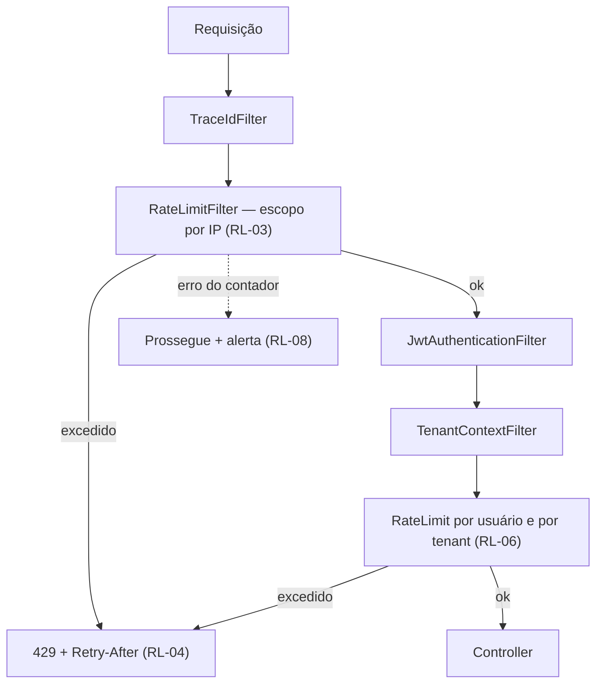

# ADR-045 — Rate limiting por escopo, com contador em banco no MVP

## Status

**Aceito** em 2026-07-29.
Implementa `security.md` §8.1. Evolui para Redis em F6 ([ADR-041](ADR-041-redis.md)).

## Data

2026-07-29

## Contexto

O rate limiting protege contra três problemas distintos, frequentemente confundidos:

| Problema | Exemplo | Escopo adequado |
|---|---|---|
| **Ataque** | Força bruta de senha, enumeração de contas | IP + identificador |
| **Abuso** | Um tenant gerando 10.000 exportações por hora | Tenant |
| **Vizinho barulhento** | Um tenant consumindo a capacidade dos demais | Tenant |

O terceiro é consequência direta de [ADR-001](ADR-001-multi-tenant.md) C-01: com banco e schema compartilhados, um tenant atípico degrada os outros. O rate limit por tenant é a mitigação declarada daquele risco.

Restrições:

| # | Restrição | Origem |
|---|---|---|
| R-01 | Limites por escopo, conforme `security.md` §8.1 | `security.md` |
| R-02 | Contador em banco no MVP; Redis em F6 | `security.md` §8.1 |
| R-03 | Instâncias são stateless e replicáveis | `ART-080` |
| R-04 | Sem Redis no MVP | `architecture.md` §5 |
| R-05 | Resposta ao exceder é `429` com `Retry-After` | `security.md` §8.1 |
| R-06 | Rate limit vem **antes** da autenticação na cadeia de filtros | SC-03 de [ADR-044](ADR-044-security.md) |

### Limites definidos

| Escopo | Limite | Janela |
|---|---|---|
| Login por IP + e-mail | 10 | 1 min |
| Registro por IP | 5 | 1 hora |
| Redefinição de senha por e-mail | 3 | 1 hora |
| Reenvio de verificação | 3 | 1 hora |
| API autenticada por usuário | 300 | 1 min |
| Exportação por tenant | 20 | 1 hora |
| Upload por tenant | 100 | 1 hora |

## Decisão

| # | Regra |
|---|---|
| RL-01 | O rate limiting é aplicado por **escopo**, conforme a tabela acima. Não existe limite global único. |
| RL-02 | O contador é mantido em **tabela no PostgreSQL** no MVP (R-02, R-04), com janela fixa por período. |
| RL-03 | O limite é aplicado por um **filtro na cadeia**, posicionado **antes** da autenticação (R-06). |
| RL-04 | Exceder o limite retorna **`429 Too Many Requests`** com `Retry-After` e código `DEVTIME-9002` (R-05). |
| RL-05 | Escopos **não autenticados** (login, registro, redefinição) usam IP e o identificador informado; escopos **autenticados** usam `userId` ou `tenantId` extraídos do token. |
| RL-06 | Para escopos autenticados, o filtro de rate limit é aplicado **após** a validação do token, mas antes do processamento da requisição — na prática, dois pontos de aplicação: um pré-autenticação (por IP) e outro pós-autenticação (por usuário e por tenant). |
| RL-07 | A contagem é **atômica**: incremento e verificação ocorrem em uma única operação, evitando corrida entre instâncias (R-03). |
| RL-08 | Falha do mecanismo de rate limit **não bloqueia** a requisição: em caso de erro do contador, a requisição prossegue e um alerta é gerado. A disponibilidade prevalece sobre o limite. |
| RL-09 | O IP considerado é o real do cliente, extraído do cabeçalho de encaminhamento **apenas** quando a requisição vem de um proxy confiável e configurado. |
| RL-10 | Registros de contador expirados são removidos por job. |
| RL-11 | Bloqueio por tentativas de login (conta temporariamente bloqueada) é mecanismo **distinto** e complementar ao rate limit, definido em `security.md` §5. |
| RL-12 | A resposta `429` é **uniforme**: não revela se o limite atingido foi por IP, por conta ou por tenant. |
| RL-13 | Métricas de rate limit são expostas por escopo, permitindo distinguir ataque de limite mal dimensionado. |
| RL-14 | A migração para Redis em F6 preserva escopos, limites e comportamento; muda apenas o backend do contador ([ADR-041](ADR-041-redis.md)). |

## Motivação

**Por que por escopo e não um limite global (RL-01):** os três problemas do contexto exigem respostas diferentes. Um limite global de 300 requisições por minuto não impede 10 tentativas de senha por segundo contra uma conta específica, e um limite de 10 por minuto inviabilizaria o uso normal da aplicação. Cada escopo tem uma ameaça e um perfil de uso legítimo distintos.

**Por que antes da autenticação (RL-03/R-06):** validar um JWT é barato, mas verificar uma senha com BCrypt custo 12 leva ~250 ms de CPU **por desenho** ([ADR-044](ADR-044-security.md) SC-07). Sem rate limit antes, um atacante consegue consumir toda a CPU disponível apenas enviando tentativas de login — transformando um controle de segurança em vetor de negação de serviço.

**Por que contador em banco no MVP (RL-02):** o estado precisa ser compartilhado entre instâncias (R-03), e Redis não existe no MVP (R-04). O PostgreSQL já é dependência obrigatória e oferece a atomicidade necessária (RL-07) com `INSERT ... ON CONFLICT DO UPDATE`. O custo é uma escrita por requisição contada — aceitável no volume atual, e o gatilho de migração está registrado em [ADR-041](ADR-041-redis.md) GT-03.

**Por que falha não bloqueia (RL-08) — decisão contraintuitiva mas correta:** se o contador falhar (indisponibilidade, timeout, erro), há duas opções: bloquear tudo ou deixar passar. Bloquear transformaria uma falha do mecanismo de proteção em indisponibilidade total do produto — o rate limit viraria a causa do problema que deveria evitar. Deixar passar degrada a proteção temporariamente, com alerta. Para um produto cuja ameaça principal é falha de autorização (não volumétrica), essa é a troca certa.

**Por que resposta uniforme (RL-12):** informar "limite de tentativas de login para este e-mail excedido" confirma que o e-mail existe, permitindo enumeração de contas (OWASP A07). A resposta `429` é a mesma independentemente do escopo atingido.

**Por que IP apenas de proxy confiável (RL-09):** cabeçalhos de encaminhamento são fornecidos pelo cliente e trivialmente falsificáveis. Confiar neles cegamente permite que um atacante contorne o limite por IP enviando um valor diferente a cada requisição. A extração só é válida quando a requisição comprovadamente vem do nosso proxy.

**Por que rate limit e bloqueio de conta são distintos (RL-11):** o rate limit protege recursos (CPU, banco); o bloqueio de conta protege uma conta específica após tentativas falhas. Um atacante distribuído contorna o limite por IP mas ainda esbarra no bloqueio de conta; um ataque de força bruta em uma única origem esbarra nos dois.

## Alternativas consideradas

### A1 — Rate limit apenas no proxy reverso ou na borda

| Aspecto | Avaliação |
|---|---|
| **Prós** | Não consome recursos da aplicação; bloqueia antes de chegar ao backend; configuração declarativa; muito eficiente. |
| **Contras** | O proxy não conhece `userId` nem `tenantId` — só IP; limites por tenant (os mais importantes para o vizinho barulhento) são impossíveis; configuração fora do repositório, divergindo entre ambientes; sem integração com códigos de erro e auditoria da aplicação. |
| **Por que não é suficiente sozinho** | Os escopos por usuário e por tenant exigem conhecimento do token. O limite no proxy permanece **complementar** (proteção volumétrica de borda), decidido na infraestrutura, sem substituir esta decisão. |

### A2 — Rate limit em memória por instância

| Aspecto | Avaliação |
|---|---|
| **Prós** | Zero I/O; extremamente rápido; sem infraestrutura. |
| **Contras** | Com N instâncias, o limite efetivo é N× o configurado — um limite de 10 por minuto vira 40 com 4 instâncias; contador perdido a cada deploy; um atacante distribuído entre instâncias multiplica o efeito. |
| **Por que foi descartada** | Um limite que não é global é um limite que não existe. Para controle de segurança, previsibilidade é requisito. |

### A3 — Redis desde o MVP

| Aspecto | Avaliação |
|---|---|
| **Prós** | `INCR` atômico com TTL nativo é a solução ideal; sem escrita no banco transacional; latência mínima. |
| **Contras** | Infraestrutura adicional no MVP (R-04); uma classe de falha a mais. |
| **Por que foi descartada para o MVP** | O volume não justifica. RL-14 e [ADR-041](ADR-041-redis.md) GT-03 registram o gatilho e o caminho de migração. |

### A4 — Algoritmo de janela deslizante ou *token bucket*

| Aspecto | Avaliação |
|---|---|
| **Prós** | Janela deslizante é mais justa (evita o pico na virada da janela fixa); *token bucket* permite rajadas controladas, o que é mais próximo do uso real. |
| **Contras** | Mais estado por chave; mais complexo de implementar corretamente sobre uma tabela; janela fixa é suficiente para os limites definidos. |
| **Por que foi descartada no MVP** | O problema da janela fixa (até 2× o limite na virada) é tolerável nos escopos definidos. Ao migrar para Redis, adotar janela deslizante fica barato e será reavaliado então. |

### A5 — Sem rate limit, confiando em monitoramento e resposta manual

| Aspecto | Avaliação |
|---|---|
| **Prós** | Nenhuma complexidade; nenhum falso positivo bloqueando uso legítimo. |
| **Contras** | Força bruta contra login sem qualquer barreira; um tenant abusivo degrada todos; resposta manual leva minutos ou horas. |
| **Por que foi descartada** | O endpoint de login com BCrypt é vetor direto de negação de serviço, e a mitigação de C-01 de [ADR-001](ADR-001-multi-tenant.md) depende deste controle. |

### A6 — Cota por plano em vez de rate limit

| Aspecto | Avaliação |
|---|---|
| **Prós** | Alinhado ao modelo comercial; limites diferenciados por plano. |
| **Contras** | Cota (uso total por período) e rate limit (taxa instantânea) resolvem problemas distintos: cota não impede um pico que derrube o serviço. |
| **Por que foi descartada como substituto** | São complementares. A cota por plano é decisão de [ADR-049](ADR-049-saas-readiness.md); o rate limit protege a disponibilidade. |

## Consequências

### Positivas

| # | Consequência |
|---|---|
| C+01 | Força bruta contra login limitada a 10 tentativas por minuto por IP e e-mail. |
| C+02 | Vizinho barulhento mitigado por limites por tenant (C-01 de [ADR-001](ADR-001-multi-tenant.md)). |
| C+03 | Endpoint de login protegido de ser usado como vetor de negação de serviço (RL-03). |
| C+04 | Limite global e previsível entre instâncias (RL-02, RL-07). |
| C+05 | Nenhuma infraestrutura adicional no MVP. |
| C+06 | Falha do mecanismo não derruba o produto (RL-08). |
| C+07 | Métricas por escopo permitem distinguir ataque de limite mal dimensionado (RL-13). |

### Negativas

| # | Consequência | Aceita porque |
|---|---|---|
| C-01 | Uma escrita no banco por requisição contada. | Aceitável no volume atual; gatilho de migração registrado. |
| C-02 | Janela fixa permite até 2× o limite na virada (A4). | Tolerável nos escopos definidos. |
| C-03 | Falso positivo possível em redes com NAT compartilhado (escritório, operadora móvel). | Limites por IP são generosos; escopos autenticados usam `userId`. |
| C-04 | RL-08 abre janela de proteção degradada em caso de falha. | Alertada; preferível à indisponibilidade. |
| C-05 | Mais uma tabela e um job de limpeza. | Custo mínimo. |
| C-06 | Dois pontos de aplicação (RL-06) tornam o fluxo menos óbvio. | Necessário porque IP e usuário são conhecidos em momentos distintos. |

### Limitações

| # | Limitação |
|---|---|
| L-01 | Não protege contra ataque volumétrico distribuído (DDoS) — isso é responsabilidade da borda. |
| L-02 | Janela fixa, não deslizante (A4). |
| L-03 | Não diferencia limites por plano no MVP (isso é [ADR-049](ADR-049-saas-readiness.md)). |
| L-04 | Contador em banco não escala indefinidamente com o volume de requisições. |

### Custos

| Item | Custo |
|---|---|
| Implementação | ~2 dias (filtro, tabela, contagem atômica, job) |
| Banco | Uma escrita por requisição contada; uma tabela |
| Runtime | Uma operação de banco por requisição nos escopos aplicáveis |

## Trade-offs

| Sacrificado | Em favor de | Justificativa da troca |
|---|---|---|
| **Desempenho** (escrita por requisição) | Limite global e previsível | Limite por instância não é limite. |
| **Precisão** (janela deslizante) | Simplicidade da implementação em banco | O erro da janela fixa é tolerável nos escopos definidos. |
| **Proteção garantida** (RL-08) | Disponibilidade | Rate limit não pode virar a causa da indisponibilidade. |
| **Simplicidade** (limite único) | Adequação de cada limite à sua ameaça | Um limite único ou é permissivo demais ou inviabiliza o uso. |
| **Eficiência** do Redis | Ausência de infraestrutura no MVP | Migração registrada e com gatilho objetivo. |

## Impacto na arquitetura

| Módulo | Impacto |
|---|---|
| `shared/ratelimit` | `RateLimitFilter`, definição de escopos, contador, métricas. |
| `shared/security` | Posição na cadeia de filtros (RL-03, RL-06). |
| `shared/error` | Tradução para `429` `DEVTIME-9002`. |
| `auth` | Escopos de login, registro, redefinição e reenvio. |
| `report` | Escopo de exportação. |
| `attachment` | Escopo de upload. |
| Jobs | Limpeza de contadores expirados (RL-10). |

| Documento dependente | Relação |
|---|---|
| `docs/03-architecture/security.md` §8.1 | Tabela de limites |
| `docs/04-api/*` | Comportamento de `429` |
| `docs/ai/project-constitution.md` §6 | Faixa `DEVTIME-9000` |

| Spec dependente | Relação |
|---|---|
| `specs/001-authentication` | Escopos de autenticação |
| `specs/012-reports` | Escopo de exportação |
| `specs/015-attachments` | Escopo de upload |

| ADR relacionado | Relação |
|---|---|
| [ADR-041](ADR-041-redis.md) | Migração do contador (RL-14) |
| [ADR-001](ADR-001-multi-tenant.md) | Mitigação de C-01 |
| [ADR-044](ADR-044-security.md) | Cobertura de A07 |
| [ADR-008](ADR-008-jwt.md) | Proteção do login |
| [ADR-049](ADR-049-saas-readiness.md) | Cota por plano (complementar) |

## Impacto no banco

| Item | Impacto |
|---|---|
| Tabela | `rate_limit_counters (scope_key, window_start, count, expires_at)`, com chave primária em `(scope_key, window_start)`. |
| Atomicidade | `INSERT ... ON CONFLICT (scope_key, window_start) DO UPDATE SET count = count + 1 RETURNING count` — incremento e leitura em uma operação (RL-07). |
| Escrita | Uma por requisição contada; é a principal preocupação de performance desta decisão. |
| Tenancy | Tabela técnica: **não** possui `tenant_id` como coluna de isolamento (o tenant faz parte de `scope_key`); não usa soft delete. |
| Limpeza | Job remove registros expirados (RL-10). |
| Índice | `expires_at` para o job de limpeza. |
| `autovacuum` | Ajustado para esta tabela, que tem alta taxa de atualização. |

## Impacto na API

| Item | Impacto |
|---|---|
| `429` | `DEVTIME-9002`, com `Retry-After` em segundos (RL-04). |
| Cabeçalhos | Opcionalmente `RateLimit-Limit`, `RateLimit-Remaining` e `RateLimit-Reset` nos escopos autenticados, ajudando clientes bem-comportados a se adaptarem. **Não** são expostos em escopos não autenticados, para não auxiliar um atacante a calibrar. |
| Uniformidade | A resposta não revela qual escopo foi atingido (RL-12). |
| Documentação | Limites documentados no OpenAPI por endpoint ([ADR-012](ADR-012-openapi.md)). |
| Idempotência | Requisições bloqueadas por `429` não têm efeito; retentar após `Retry-After` é seguro. |

## Impacto no Frontend

| Item | Impacto |
|---|---|
| `429` | Interceptor exibe mensagem clara e respeita `Retry-After` antes de permitir nova tentativa. |
| Login | Mensagem específica orientando o usuário a aguardar, sem revelar se o e-mail existe. |
| Retentativa | O cliente **não** retenta automaticamente em `429` sem respeitar `Retry-After` — retry cego agrava o problema. |
| Polling | O intervalo de polling de notificações é dimensionado com folga em relação ao limite de 300/min ([ADR-037](ADR-037-notification-strategy.md)). |
| Exportação | UI informa o limite de 20 por hora quando próximo de atingi-lo. |

## Impacto na Infraestrutura

| Item | Impacto |
|---|---|
| Proxy | Pode aplicar limite volumétrico de borda, complementar (A1). |
| IP real | Cabeçalho de encaminhamento configurado e confiável apenas a partir do proxy (RL-09). |
| Monitoramento | Métricas por escopo e taxa de `429` ([ADR-047](ADR-047-monitoring.md)). |
| Alertas | Pico de `429` em escopo de autenticação sugere ataque; pico em escopo autenticado sugere limite mal dimensionado ou cliente defeituoso. |
| Jobs | Limpeza de contadores ([ADR-039](ADR-039-background-jobs.md)). |

## Segurança

| # | Consideração |
|---|---|
| S-01 | RL-03 protege o endpoint de login de ser usado como vetor de exaustão de CPU. |
| S-02 | RL-12 evita enumeração de contas pela mensagem de erro (OWASP A07). |
| S-03 | RL-09 impede contorno do limite por cabeçalho de encaminhamento falsificado. |
| S-04 | Excesso de `429` em escopo de autenticação é evento de segurança auditável (SC-12 de [ADR-044](ADR-044-security.md)). |
| S-05 | RL-11: o bloqueio de conta complementa o rate limit contra ataque distribuído. |
| S-06 | **Multi-tenant:** limites por tenant são a mitigação declarada de C-01 de [ADR-001](ADR-001-multi-tenant.md); um tenant não consegue consumir a capacidade dos demais. |
| S-07 | **LGPD:** o IP usado na chave é dado pessoal; a chave é hasheada quando persistida por período relevante, e os registros expiram rapidamente (RL-10). |
| S-08 | **Auditoria:** bloqueios em escopos de autenticação geram evento; bloqueios em escopos comuns geram apenas métrica, para não inflar a trilha. |

## Performance

| # | Consideração |
|---|---|
| P-01 | Uma operação de banco por requisição contada é o custo dominante desta decisão. |
| P-02 | A operação é um `INSERT ... ON CONFLICT` sobre chave primária: muito eficiente, mas ainda uma escrita. |
| P-03 | A tabela tem alta taxa de atualização, exigindo `autovacuum` ajustado. |
| P-04 | O filtro adiciona latência da ordem de um acesso a banco no caminho de toda requisição contada. |
| P-05 | Migrar para Redis ([ADR-041](ADR-041-redis.md)) elimina P-01 a P-04 — é o principal ganho daquela decisão. |

## Escalabilidade

| # | Consideração |
|---|---|
| E-01 | O limite é global entre instâncias por construção (RL-02, RL-07). |
| E-02 | A carga de escrita cresce linearmente com o tráfego — é o limite de escala desta implementação. |
| E-03 | O gatilho de migração é GT-03 de [ADR-041](ADR-041-redis.md): quando a escrita de rate limit representar parcela mensurável da carga do banco. |
| E-04 | Limites por plano (F6) são acréscimo de configuração, não mudança estrutural ([ADR-049](ADR-049-saas-readiness.md)). |

## Riscos

| # | Risco | Probabilidade | Impacto | Severidade |
|---|---|---|---|---|
| RK-01 | Escrita de rate limit degradando o banco sob carga | Média | Alto | **Alta** |
| RK-02 | Falso positivo bloqueando usuário legítimo em rede compartilhada | Média | Médio | Média |
| RK-03 | Contorno do limite por cabeçalho de IP falsificado | Baixa | Alto | Média |
| RK-04 | RL-08 mascarando falha persistente do contador | Média | Médio | Média |
| RK-05 | Limite mal dimensionado inviabilizando uso legítimo | Média | Alto | Alta |
| RK-06 | Cliente retentando em laço após `429`, agravando o problema | Média | Médio | Média |
| RK-07 | Pico na virada da janela fixa (L-02) | Média | Baixo | Baixa |

## Mitigações

| Risco | Mitigação | Verificação |
|---|---|---|
| RK-01 | Métrica de escrita por segundo na tabela; gatilho GT-03 aciona a migração para Redis; `autovacuum` ajustado | [ADR-047](ADR-047-monitoring.md) |
| RK-02 | Limites por IP generosos; escopos autenticados usam `userId`, não IP; monitoramento de `429` por escopo | Métrica RL-13 |
| RK-03 | RL-09: extração apenas de proxy confiável; teste que envia cabeçalho forjado diretamente e verifica que é ignorado | Teste de segurança |
| RK-04 | RL-08 gera **alerta**, não apenas log; falha persistente é tratada como incidente | Alerta dedicado |
| RK-05 | RL-13 distingue ataque de limite mal dimensionado; limites revisáveis por configuração, sem deploy de código | Configuração tipada |
| RK-06 | `Retry-After` obrigatório; frontend respeita antes de nova tentativa; documentação para integradores em F8 | Teste de frontend |
| RK-07 | Aceito; a migração para Redis permitirá janela deslizante (A4) | Reavaliação em F6 |

## Referências

| Fonte | Uso |
|---|---|
| [RFC 6585 §4 — 429 Too Many Requests](https://www.rfc-editor.org/rfc/rfc6585#section-4) | RL-04 |
| [RFC 9110 §10.2.3 — Retry-After](https://www.rfc-editor.org/rfc/rfc9110#field.retry-after) | RL-04 |
| [IETF Draft — RateLimit header fields](https://datatracker.ietf.org/doc/draft-ietf-httpapi-ratelimit-headers/) | Cabeçalhos informativos |
| [OWASP — Denial of Service Cheat Sheet](https://cheatsheetseries.owasp.org/cheatsheets/Denial_of_Service_Cheat_Sheet.html) | Base de RL-03 |
| [OWASP — Blocking Brute Force Attacks](https://owasp.org/www-community/controls/Blocking_Brute_Force_Attacks) | RL-11 |
| [PostgreSQL — `INSERT ... ON CONFLICT`](https://www.postgresql.org/docs/16/sql-insert.html#SQL-ON-CONFLICT) | RL-07 |
| [Cloudflare — Rate limiting algorithms](https://blog.cloudflare.com/counting-things-a-lot-of-different-things/) | Alternativa A4 |
| `docs/03-architecture/security.md` §8.1 | Tabela de limites |
