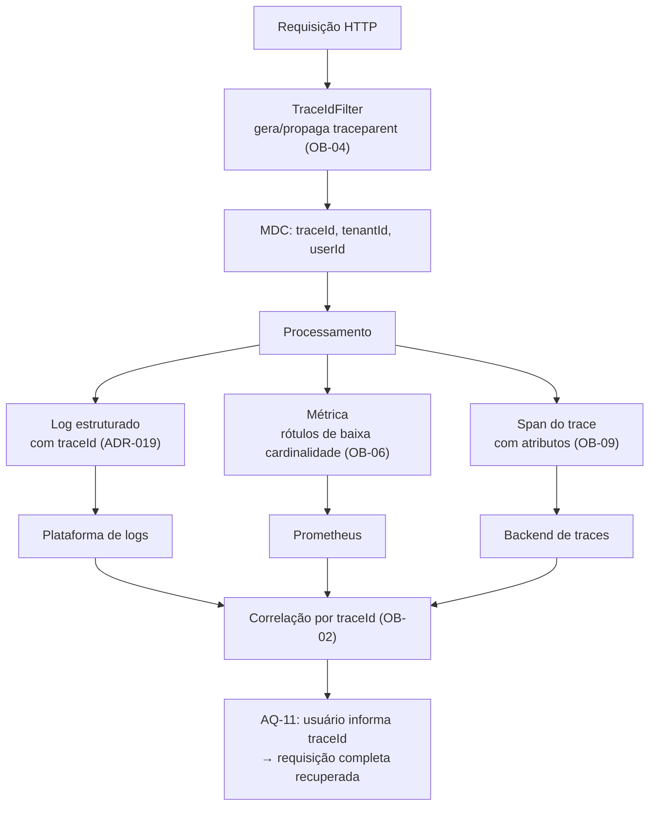

# ADR-046 — Observabilidade em três pilares correlacionados por OpenTelemetry

## Status

**Aceito** em 2026-07-29.
Implementa `architecture.md` §12. Complementa [ADR-019](ADR-019-logging.md) e é complementado por [ADR-047](ADR-047-monitoring.md).

## Data

2026-07-29

## Contexto

Um SaaS multi-tenant tem uma pergunta operacional que sistemas single-tenant não têm: **"o problema é do sistema ou é de um tenant específico?"** Latência alta pode ser degradação geral ou um tenant com volume atípico ([ADR-001](ADR-001-multi-tenant.md) C-01). Sem observabilidade que distinga os dois, o diagnóstico é adivinhação.

Além disso, AQ-11 é explícito: o usuário reporta um erro citando um código, e o `traceId` deve recuperar a requisição completa nos logs.

Restrições:

| # | Restrição | Origem |
|---|---|---|
| R-01 | Três pilares: logs estruturados, métricas (Micrometer → Prometheus) e traces (OpenTelemetry) | `architecture.md` §12 |
| R-02 | Todo log carrega `traceId`, `tenantId`, `userId`, `action` e duração | `architecture.md` §12 |
| R-03 | Nenhum log contém dado sensível | `ART-084`, [ADR-019](ADR-019-logging.md) |
| R-04 | `traceId` recupera a requisição completa | AQ-11 |
| R-05 | Metas mensuráveis de latência (AQ-01, AQ-02) | `architecture.md` §9 |
| R-06 | A aplicação é stateless e replicável | `ART-080` |

Este ADR trata da **coleta e correlação** da telemetria. O que fazer com ela — alertas, SLOs, painéis, health checks — é [ADR-047](ADR-047-monitoring.md).

## Decisão

| # | Regra |
|---|---|
| OB-01 | A observabilidade é composta por **três pilares**: **logs** estruturados, **métricas** e **traces** distribuídos (R-01). |
| OB-02 | Os três são **correlacionados pelo `traceId`**. Dado um `traceId`, é possível ir do log ao trace e ao contexto da requisição (R-04). |
| OB-03 | A instrumentação usa **OpenTelemetry** como padrão de coleta e propagação; as métricas são expostas via Micrometer no formato Prometheus. |
| OB-04 | A propagação de contexto segue **W3C Trace Context** (`traceparent`), aceita do cliente quando presente e gerada quando ausente. |
| OB-05 | **`tenantId` é dimensão de primeira classe** em logs e em traces. Em **métricas**, `tenantId` **não** é rótulo padrão, por cardinalidade (ver OB-06). |
| OB-06 | Rótulos de métrica têm **cardinalidade controlada e limitada**: rota como *template* (nunca URL com IDs), método, status, nome do job, nome do cache. **Nunca** `userId`, `tenantId` genérico ou qualquer identificador de alta cardinalidade. |
| OB-07 | Exceção controlada a OB-05/OB-06: um conjunto **pequeno e explícito** de métricas críticas pode ser rotulado por tenant (ex.: requisições por tenant, para detectar vizinho barulhento), com limite de cardinalidade e agregação de tenants pouco ativos em um rótulo "outros". |
| OB-08 | Métricas obrigatórias: latência por endpoint (histograma), taxa de erro por status, work logs criados, timers ativos, fechamentos de período, execuções e falhas de job, taxa de acerto de cache, conexões do pool, filas e contadores de rate limit. |
| OB-09 | Traces cobrem a requisição completa, incluindo consultas ao banco e chamadas externas, com **amostragem** configurável — 100% em `staging`, taxa reduzida em produção, com **sempre 100% para requisições com erro**. |
| OB-10 | Nenhum dado sensível em atributo de trace, de métrica ou de log (R-03). Parâmetros de consulta com dado pessoal são omitidos. |
| OB-11 | A aplicação expõe `/actuator/prometheus` restrito à rede interna, e **não** exporta telemetria diretamente para um provedor externo: a coleta é responsabilidade da plataforma. |
| OB-12 | A telemetria é **por instância**, com rótulos de `service`, `version` e `instance`, permitindo distinguir comportamento entre versões durante um deploy. |
| OB-13 | Nenhuma decisão de negócio depende de telemetria: ela é observação, nunca fonte de verdade (DA-01). |
| OB-14 | A instrumentação **não** pode alterar o comportamento nem falhar a requisição: erro no pipeline de telemetria é registrado e ignorado. |

## Motivação

**Por que três pilares e não um (OB-01):** cada um responde a uma pergunta diferente e nenhum substitui os outros. **Métricas** respondem "quantos e quão rápido?" — são baratas, agregadas e servem a alertas. **Logs** respondem "o que aconteceu nesta requisição específica?" — são detalhados e caros. **Traces** respondem "onde o tempo foi gasto?" — mostram a decomposição de uma requisição em etapas. Diagnosticar latência alta com apenas métricas mostra *que* está lento; o trace mostra *onde*.

**Por que correlação por `traceId` (OB-02) — o que torna os três úteis juntos:** sem correlação, são três sistemas separados e o diagnóstico vira comparação manual de horários. Com o `traceId` presente nos três, a investigação é: métrica mostra pico de latência → trace de exemplo mostra que o tempo está em uma consulta → log daquele `traceId` mostra qual tenant e quais parâmetros. Isso é AQ-11 operacionalizado.

**Por que `tenantId` em log e trace mas não em métrica (OB-05/OB-06) — a decisão mais importante e mais fácil de errar:** cada combinação distinta de rótulos cria uma série temporal no Prometheus. Com 5.000 tenants × 50 endpoints × 5 status, seriam 1,25 milhão de séries **de uma única métrica** — o que derruba o sistema de métricas. Em logs e traces, o `tenantId` é apenas um campo, sem custo estrutural. A regra é: **alta cardinalidade em log e trace, baixa cardinalidade em métrica.** OB-07 abre uma exceção estreita e controlada para o caso em que a informação por tenant é operacionalmente necessária.

**Por que template de rota (OB-06):** `/api/v1/work-logs/{id}` é um rótulo; `/api/v1/work-logs/0192f3a4-...` seriam milhões. Este é o erro clássico que inutiliza um sistema de métricas.

**Por que OpenTelemetry (OB-03/OB-04):** é o padrão de fato, neutro em relação a fornecedor. Instrumentar com OTel permite trocar o backend de observabilidade sem tocar a aplicação — o que importa porque a escolha de fornecedor é de infraestrutura e pode mudar.

**Por que amostragem com 100% em erro (OB-09):** amostrar traces reduz custo, mas amostrar **erros** é perder exatamente o que se quer investigar. A regra é reduzir a amostra do caminho feliz e manter integralmente o caminho de falha.

**Por que não exportar diretamente para um provedor (OB-11):** acoplaria a aplicação a um fornecedor e criaria dependência de rede no caminho de execução. A aplicação expõe e a plataforma coleta — o mesmo princípio de `stdout` para logs ([ADR-019](ADR-019-logging.md) LG-01).

**Por que a telemetria não pode falhar a requisição (OB-14):** observabilidade que derruba o serviço observado é pior que ausência de observabilidade.

## Alternativas consideradas

### A1 — Apenas logs, sem métricas nem traces

| Aspecto | Avaliação |
|---|---|
| **Prós** | Muito mais simples; um único sistema; logs estruturados já permitem agregação limitada. |
| **Contras** | Alertar sobre "taxa de erro acima de 1% em 5 minutos" exige agregar logs continuamente, o que é caro e lento; sem histograma de latência confiável; sem visão de onde o tempo é gasto dentro de uma requisição. |
| **Por que foi descartada** | Alertas (`architecture.md` §12) precisam de métricas: agregação sobre logs é cara, tem latência e falha justamente sob alto volume, que é quando mais se precisa dela. |

### A2 — Apenas métricas, sem traces

| Aspecto | Avaliação |
|---|---|
| **Prós** | Baixo custo; suficiente para alertas; simples de operar. |
| **Contras** | Métrica mostra que o p95 subiu, não **onde**; diagnosticar N+1, consulta lenta ou chamada externa lenta exigiria adivinhação ou instrumentação manual caso a caso. |
| **Por que foi descartada** | O tempo de diagnóstico é o que determina o tempo de indisponibilidade. Trace é o que transforma horas em minutos. |

### A3 — Instrumentação com SDK proprietário do fornecedor

| Aspecto | Avaliação |
|---|---|
| **Prós** | Integração otimizada; recursos exclusivos; instrumentação automática frequentemente mais completa. |
| **Contras** | Aprisionamento: trocar de fornecedor exigiria reinstrumentar toda a aplicação; ambiente local dependeria de credenciais ou de emulador. |
| **Por que foi descartada** | OTel é o padrão neutro e é suportado por todos os fornecedores relevantes. O aprisionamento em observabilidade é caro e desnecessário. |

### A4 — `tenantId` como rótulo em todas as métricas

| Aspecto | Avaliação |
|---|---|
| **Prós** | Visão por tenant nativa em qualquer métrica; detecção imediata de vizinho barulhento; painéis por cliente. |
| **Contras** | Explosão de cardinalidade que derruba o sistema de métricas em escala (ver OB-05); custo proporcional ao número de séries; consultas lentas. |
| **Por que foi descartada** | É o erro mais comum e mais caro em observabilidade de SaaS. OB-07 atende à necessidade real com um conjunto pequeno e limitado de métricas. |

### A5 — Amostragem de 100% dos traces em produção

| Aspecto | Avaliação |
|---|---|
| **Prós** | Nenhum trace perdido; qualquer requisição investigável. |
| **Contras** | Custo de armazenamento e de ingestão proporcional ao tráfego; overhead de instrumentação; a maior parte dos traces do caminho feliz nunca é consultada. |
| **Por que foi descartada** | OB-09 captura o valor (100% dos erros, amostra do sucesso) a uma fração do custo. |

### A6 — Observabilidade construída internamente (tabelas de métricas próprias)

| Aspecto | Avaliação |
|---|---|
| **Prós** | Sem dependência externa; controle total; dados dentro do próprio banco. |
| **Contras** | Reimplementar histogramas, agregação temporal, retenção e consulta é um produto em si; carga de escrita no banco transacional; nenhuma ferramenta de visualização pronta. |
| **Por que foi descartada** | Esforço desproporcional para reproduzir mal o que ferramentas maduras fazem bem. |

## Consequências

### Positivas

| # | Consequência |
|---|---|
| C+01 | AQ-11 atendida: `traceId` recupera a requisição completa. |
| C+02 | Diagnóstico de latência mostra **onde** o tempo é gasto, não apenas que está lento. |
| C+03 | Distinção entre problema geral e problema de um tenant (OB-05, OB-07). |
| C+04 | Alertas confiáveis baseados em métricas ([ADR-047](ADR-047-monitoring.md)). |
| C+05 | Comparação de comportamento entre versões durante o deploy (OB-12). |
| C+06 | Neutralidade em relação ao fornecedor (OB-03). |
| C+07 | Cardinalidade controlada evita o modo de falha mais comum de sistemas de métricas. |

### Negativas

| # | Consequência | Aceita porque |
|---|---|---|
| C-01 | Três sistemas de telemetria a operar e custear. | Cada um responde a uma pergunta que os outros não respondem. |
| C-02 | Overhead de instrumentação (CPU e memória). | Poucos pontos percentuais; amostragem reduz o custo de traces. |
| C-03 | Métricas não permitem consulta por tenant de forma geral (OB-06). | Logs e traces têm `tenantId`; OB-07 cobre o caso crítico. |
| C-04 | Amostragem faz perder traces de requisições bem-sucedidas. | 100% dos erros são mantidos (OB-09). |
| C-05 | Custo de armazenamento cresce com o tráfego. | Retenção controlada; amostragem ajustável. |
| C-06 | Disciplina permanente de cardinalidade. | Verificada por revisão e por monitoramento do número de séries. |

### Limitações

| # | Limitação |
|---|---|
| L-01 | Sem monitoramento de experiência real do usuário (RUM) no frontend no MVP. |
| L-02 | Sem *profiling* contínuo de CPU e memória. |
| L-03 | Traces amostrados podem não conter a requisição específica que se quer investigar (exceto erros). |
| L-04 | Métricas por tenant limitadas ao conjunto de OB-07. |

### Custos

| Item | Custo |
|---|---|
| Instrumentação | Agente OTel + Micrometer; ~2 dias de configuração |
| Runtime | Poucos pontos percentuais de CPU e memória |
| Plataforma | Ingestão e retenção de logs, métricas e traces |

## Trade-offs

| Sacrificado | Em favor de | Justificativa da troca |
|---|---|---|
| **Simplicidade** (um só pilar) | Capacidade de diagnóstico | Tempo de diagnóstico determina tempo de indisponibilidade. |
| **Visão por tenant** em todas as métricas | Viabilidade do sistema de métricas | Cardinalidade explosiva derruba o próprio sistema. |
| **Completude** dos traces | Custo | 100% dos erros preservados. |
| **Recursos exclusivos** de um fornecedor | Neutralidade e portabilidade | Aprisionamento em observabilidade é caro de reverter. |
| **Overhead zero** | Visibilidade | Sistema sem observabilidade é sistema que falha em silêncio. |

## Impacto na arquitetura

| Módulo | Impacto |
|---|---|
| `shared/observability` | `TraceIdFilter`, configuração de OTel e Micrometer, MDC, métricas de negócio. |
| `shared/tenancy` | Popula `tenantId` no MDC e nos atributos do span. |
| Toda feature | Métricas de negócio relevantes (work logs criados, fechamentos, exportações). |
| `shared/error` | `traceId` na resposta de erro ([ADR-017](ADR-017-exception-handling.md)). |
| Jobs | Métricas de execução, duração e falha ([ADR-039](ADR-039-background-jobs.md)). |

| Documento dependente | Relação |
|---|---|
| `docs/03-architecture/architecture.md` §12 | Pilares e conteúdo obrigatório |
| `docs/03-architecture/architecture.md` §9 | Atributos de qualidade mensuráveis |
| `docs/03-architecture/integrations.md` §6.4 | Integração de observabilidade |

| Spec dependente | Relação |
|---|---|
| Todas as specs | Dimensão obrigatória "Performance" declara a meta a observar |

| ADR relacionado | Relação |
|---|---|
| [ADR-019](ADR-019-logging.md) | Pilar de logs |
| [ADR-047](ADR-047-monitoring.md) | Uso da telemetria: alertas, SLOs, health |
| [ADR-017](ADR-017-exception-handling.md) | `traceId` na resposta |
| [ADR-005](ADR-005-spring-boot.md) | Actuator |
| [ADR-042](ADR-042-rabbitmq.md) | Propagação de contexto em mensagens |

## Impacto no banco

| Item | Impacto |
|---|---|
| Instrumentação | Consultas aparecem como spans no trace, revelando N+1 e consultas lentas — um dos maiores ganhos práticos. |
| Métricas | Pool de conexões, tempo de espera, consultas lentas. |
| Carga | A telemetria **não** é armazenada no banco da aplicação (A6 descartada). |
| Diagnóstico | O trace mostra a duração de cada consulta, complementando `pg_stat_statements`. |

## Impacto na API

| Item | Impacto |
|---|---|
| `traceparent` | Aceito do cliente quando presente; gerado quando ausente (OB-04). |
| Resposta de erro | Contém `traceId` ([ADR-017](ADR-017-exception-handling.md)), permitindo AQ-11. |
| Métricas | Latência e status por template de rota (OB-06). |
| Endpoint | `/actuator/prometheus` restrito à rede interna (OB-11). |

## Impacto no Frontend

| Item | Impacto |
|---|---|
| Propagação | O frontend propaga `traceparent` quando disponível, permitindo correlação ponta a ponta. |
| Exibição | `traceId` exibido de forma copiável em erro `500` (AQ-11). |
| RUM | Fora do escopo do MVP (L-01); a instrumentação do frontend limita-se à propagação. |
| Console | Nenhum dado sensível registrado ([ADR-019](ADR-019-logging.md)). |

## Impacto na Infraestrutura

| Item | Impacto |
|---|---|
| Agente | Agente OTel Java, compatível com Java 21 e virtual threads ([ADR-004](ADR-004-java21.md)). |
| Coleta | Responsabilidade da plataforma; a aplicação expõe e escreve em `stdout` (OB-11). |
| Retenção | Logs 30 dias (90 para segurança); métricas por período mais longo; traces por período curto. |
| Rede | `/actuator/prometheus` acessível apenas internamente. |
| Custo | Monitorado; amostragem e retenção são as alavancas de ajuste. |
| Rótulos | `service`, `version`, `instance`, `env` em toda telemetria (OB-12). |

## Segurança

| # | Consideração |
|---|---|
| S-01 | OB-10: nenhum dado sensível em atributo de trace, rótulo de métrica ou campo de log. Traces são especialmente arriscados porque a instrumentação automática pode capturar parâmetros de consulta e cabeçalhos. |
| S-02 | Cabeçalhos de autenticação **nunca** aparecem em spans; a lista de cabeçalhos capturados é uma allowlist explícita. |
| S-03 | `/actuator/prometheus` não é exposto publicamente (OB-11): métricas revelam volume de negócio e topologia. |
| S-04 | O `traceId` é opaco e seguro para exibir ao usuário. |
| S-05 | **Multi-tenant:** `tenantId` em logs e traces permite investigar por tenant, mas o acesso à plataforma de observabilidade **não** é segmentado por tenant — o que reforça OB-10 e a proibição de dado de negócio na telemetria. |
| S-06 | **LGPD:** telemetria com `userId` e IP é tratamento de dado pessoal; retenção limitada, mascaramento e minimização se aplicam ([ADR-019](ADR-019-logging.md)). |
| S-07 | **Auditoria:** telemetria **não** é trilha de auditoria (LG-11); a trilha é `audit_logs` ([ADR-018](ADR-018-auditing.md)). |
| S-08 | Observabilidade é controle de segurança: OWASP A09 é "Logging and Monitoring Failures" — sem ela, uma invasão passa despercebida. |

## Performance

| # | Consideração |
|---|---|
| P-01 | Overhead da instrumentação: poucos pontos percentuais de CPU. |
| P-02 | Amostragem (OB-09) é a principal alavanca de custo dos traces. |
| P-03 | Métricas são agregadas em memória e expostas sob demanda; custo desprezível. |
| P-04 | Cardinalidade alta afeta o **sistema de métricas**, não a aplicação — mas o efeito é igualmente grave (OB-06). |
| P-05 | Appender de log assíncrono evita que I/O de log bloqueie a requisição ([ADR-019](ADR-019-logging.md) P-02). |
| P-06 | OB-14: falha da telemetria nunca degrada a requisição. |

## Escalabilidade

| # | Consideração |
|---|---|
| E-01 | O volume de telemetria cresce linearmente com o tráfego. |
| E-02 | Cardinalidade de métricas cresce com endpoints, não com tenants (OB-06) — é o que torna o modelo escalável. |
| E-03 | Amostragem e retenção são ajustáveis sem alterar código. |
| E-04 | OB-07 tem limite de cardinalidade explícito para não degradar com o crescimento do número de tenants. |
| E-05 | Instâncias adicionais produzem mais telemetria, distinguível por rótulo `instance` (OB-12). |

## Riscos

| # | Risco | Probabilidade | Impacto | Severidade |
|---|---|---|---|---|
| RK-01 | Explosão de cardinalidade derrubando o sistema de métricas | **Alta** | Alto | **Alta** |
| RK-02 | Dado sensível capturado por instrumentação automática | Média | Alto | **Alta** |
| RK-03 | Custo de observabilidade acima do previsto | Média | Médio | Média |
| RK-04 | Overhead degradando a latência | Baixa | Médio | Baixa |
| RK-05 | Correlação quebrada por `traceId` não propagado em algum caminho | Média | Médio | Média |
| RK-06 | Falha da telemetria afetando a requisição | Baixa | Alto | Média |
| RK-07 | `/actuator/prometheus` exposto publicamente | Baixa | Médio | Média |

## Mitigações

| Risco | Mitigação | Verificação |
|---|---|---|
| RK-01 | OB-06 explícita; template de rota obrigatório; monitoramento do número de séries com alerta; revisão de toda métrica nova quanto a rótulos | Alerta de cardinalidade |
| RK-02 | OB-10 e S-02: allowlist de cabeçalhos e atributos capturados; teste que inspeciona os atributos de span em fluxos sensíveis | Teste de telemetria |
| RK-03 | Amostragem e retenção ajustáveis; acompanhamento mensal de custo | Revisão de custo |
| RK-04 | Medição de overhead em teste de carga; agente atualizado; amostragem reduzida se necessário | Teste de carga |
| RK-05 | Propagação centralizada no filtro; teste que verifica presença do `traceId` em log, trace e resposta de erro para o mesmo fluxo | Teste de correlação |
| RK-06 | OB-14: erro de telemetria é capturado e ignorado; teste de resiliência com backend de telemetria indisponível | Teste de resiliência |
| RK-07 | Exposição restrita por configuração; teste que verifica `404` no endpoint sob perfil de produção sem rede interna | Teste de configuração |

## Referências

| Fonte | Uso |
|---|---|
| [OpenTelemetry — Documentation](https://opentelemetry.io/docs/) | OB-03 |
| [W3C — Trace Context](https://www.w3.org/TR/trace-context/) | OB-04 |
| [Micrometer — Documentation](https://docs.micrometer.io/micrometer/reference/) | Métricas |
| [Prometheus — Naming e cardinalidade](https://prometheus.io/docs/practices/naming/) | Base de OB-06 |
| [Google SRE Book — Monitoring Distributed Systems](https://sre.google/sre-book/monitoring-distributed-systems/) | Fundamento dos pilares |
| [Charity Majors — Observability vs Monitoring](https://www.honeycomb.io/blog/observability-a-manifesto) | Distinção entre este ADR e [ADR-047](ADR-047-monitoring.md) |
| [OWASP Top 10 — A09](https://owasp.org/Top10/A09_2021-Security_Logging_and_Monitoring_Failures/) | Base de S-08 |
| `docs/03-architecture/architecture.md` §12 | Pilares e conteúdo obrigatório |
