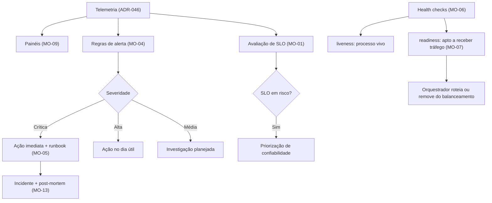

# ADR-047 — Monitoramento: SLOs, alertas acionáveis e health checks

## Status

**Aceito** em 2026-07-29.
Consome a telemetria de [ADR-046](ADR-046-observability.md). Implementa `architecture.md` §12 (tabela de alertas) e DP-05.

## Data

2026-07-29

## Contexto

[ADR-046](ADR-046-observability.md) decidiu **como coletar** telemetria. Este ADR decide **o que fazer com ela**: quais condições merecem acordar alguém, quais metas o sistema deve cumprir e como o orquestrador sabe se uma instância está saudável.

A distinção importa porque o principal risco de monitoramento não é a ausência de alertas — é o **excesso**. Um sistema que dispara alertas por condições que não exigem ação treina a equipe a ignorá-los, e o alerta importante se perde no ruído.

Restrições:

| # | Restrição | Origem |
|---|---|---|
| R-01 | A tabela de alertas de `architecture.md` §12 é normativa | `architecture.md` |
| R-02 | Readiness só responde OK após validação do schema | DP-05 |
| R-03 | Falha de deploy aciona rollback automático | `architecture.md` §11, CI-14 de [ADR-030](ADR-030-github-actions.md) |
| R-04 | Metas mensuráveis de qualidade (AQ-01 a AQ-12) | `architecture.md` §9 |
| R-05 | Tentativa de acesso cross-tenant é alerta crítico | SC-13 de [ADR-044](ADR-044-security.md) |
| R-06 | Falha de job é alerta de severidade alta | JB-09 de [ADR-039](ADR-039-background-jobs.md) |

## Decisão

| # | Regra |
|---|---|
| MO-01 | Os **atributos de qualidade** de `architecture.md` §9 (AQ-01 a AQ-12) são a base dos **SLOs**. Cada SLO tem indicador, meta e janela de avaliação. |
| MO-02 | **Todo alerta é acionável**: dispara apenas quando existe uma ação humana definida. Alerta sem ação correspondente é removido, não silenciado. |
| MO-03 | Alertas têm **três severidades**: **Crítica** (ação imediata, fora do horário se necessário), **Alta** (ação no mesmo dia útil), **Média** (investigação planejada). Não existe severidade "informativa" — isso é painel, não alerta. |
| MO-04 | A tabela de alertas de `architecture.md` §12 é o conjunto mínimo obrigatório (R-01). Cada linha tem condição, janela, severidade e **runbook**. |
| MO-05 | Todo alerta aponta para um **runbook**: o que verificar, como diagnosticar e como mitigar. Alerta sem runbook não vai para produção. |
| MO-06 | **Health checks** são separados: `liveness` (o processo está vivo?) e `readiness` (está apto a receber tráfego?). |
| MO-07 | `readiness` só responde OK após a validação do schema (R-02) e verifica as dependências **essenciais** (banco). Dependências **não essenciais** (storage, e-mail) **não** afetam a readiness — sua indisponibilidade degrada, não impede tráfego (AQ-09, AQ-10). |
| MO-08 | `liveness` **não** verifica dependências externas: uma instância viva com banco indisponível deve ser mantida, não reiniciada — reiniciar não resolveria e agravaria. |
| MO-09 | Painéis obrigatórios: visão geral do serviço (latência, taxa de erro, tráfego, saturação), banco (conexões, consultas lentas, locks, tamanho), jobs (execuções, duração, falhas), negócio (work logs criados, timers ativos, fechamentos) e segurança (negações, `429`, tentativas cross-tenant). |
| MO-10 | Alertas de **negócio** existem além dos técnicos: período preso em `CLOSING` por mais de 10 min e divergência de desnormalização são **críticos**, porque corrompem dado financeiro em silêncio. |
| MO-11 | Após cada deploy, a comparação de métricas entre versões (OB-12 de [ADR-046](ADR-046-observability.md)) é verificada; degradação aciona o rollback automático (R-03). |
| MO-12 | Alerta que dispara com frequência sem exigir ação é tratado como **defeito do alerta**: ou o limiar é ajustado, ou a condição é corrigida, ou o alerta é removido. Silenciar sem decidir é proibido. |
| MO-13 | Incidentes têm **post-mortem sem culpa**, com ações corretivas rastreadas. |
| MO-14 | Os SLOs são revisados periodicamente contra o comportamento real; meta inatingível ou trivialmente atingida é meta errada. |

### SLOs iniciais

| # | Indicador | Meta | Janela | Origem |
|---|---|---|---|---|
| SLO-01 | Disponibilidade da API (requisições sem `5xx`) | 99,5% | 30 dias | — |
| SLO-02 | Latência p95 do dashboard | < 800 ms | 7 dias | AQ-01 |
| SLO-03 | Latência p95 das operações de escrita de work log | < 500 ms | 7 dias | AQ-02 |
| SLO-04 | Sucesso de execução de jobs | 100% | 7 dias | AQ-07 |
| SLO-05 | Acessos cross-tenant bem-sucedidos | **zero** | sempre | AQ-03 |
| SLO-06 | Recuperação de timers após reinício | 100% | sempre | AQ-04 |

## Motivação

**Por que alerta acionável (MO-02) — a regra central:** o valor de um sistema de alertas é inversamente proporcional ao número de alertas que ninguém trata. Cada alerta ignorado reduz a atenção dada aos demais. A pergunta de admissão é: *"quando isto disparar, o que exatamente a pessoa deve fazer?"* Se não houver resposta, é um painel, não um alerta.

**Por que sem severidade "informativa" (MO-03):** informação sem ação é painel. Criar uma categoria de alerta que não exige ação é institucionalizar o ruído.

**Por que runbook obrigatório (MO-05):** o alerta dispara às 3h da manhã, para quem talvez não tenha escrito aquele código. Sem runbook, os primeiros minutos são gastos descobrindo o que a condição significa. O runbook é o que transforma o alerta em ação rápida.

**Por que liveness e readiness separados (MO-06/MO-07/MO-08) — distinção frequentemente errada:** confundi-los produz um modo de falha grave. Se o `liveness` verificar o banco, uma indisponibilidade do banco fará o orquestrador **reiniciar todas as instâncias** — que voltarão igualmente incapazes de conectar, em laço, transformando uma indisponibilidade de banco em indisponibilidade total com *crash loop*. `liveness` responde "reiniciar ajudaria?"; `readiness` responde "envie tráfego para mim agora?".

**Por que dependências não essenciais fora do readiness (MO-07):** AQ-09 e AQ-10 determinam que indisponibilidade de e-mail e de storage **degrada**, não bloqueia. Se essas dependências afetassem a readiness, todas as instâncias sairiam do balanceamento e o produto ficaria indisponível — exatamente o oposto do requisito.

**Por que alertas de negócio (MO-10):** um período preso em `CLOSING` não gera erro `5xx` nem latência alta; do ponto de vista técnico, está tudo bem. Mas o usuário não consegue fechar o período e o dado financeiro fica inconsistente. Divergência de desnormalização é ainda pior: nada falha, e os números simplesmente ficam errados. São falhas **silenciosas**, e por isso precisam de alerta explícito.

**Por que SLO em vez de apenas alertas (MO-01):** alertas detectam problemas agudos; SLOs detectam degradação gradual. Uma latência que sobe 10% por mês nunca dispara alerta, mas em seis meses dobrou. O SLO torna a degradação visível e a prioriza contra novas funcionalidades.

**Por que alerta ruidoso é defeito (MO-12):** silenciar sem decidir é a forma mais comum de erosão de um sistema de alertas. A regra força a escolha: ajustar, corrigir ou remover.

## Alternativas consideradas

### A1 — Apenas monitoramento de disponibilidade externa (ping / uptime check)

| Aspecto | Avaliação |
|---|---|
| **Prós** | Simples e barato; detecta indisponibilidade total; independente da aplicação. |
| **Contras** | Só detecta o que já é óbvio; não detecta degradação, falha de job, divergência de dado nem tentativa cross-tenant; sem diagnóstico. |
| **Por que foi descartada como abordagem única** | As falhas mais perigosas do produto (MO-10, R-05) são silenciosas do ponto de vista de disponibilidade. Uptime check externo permanece útil como camada adicional. |

### A2 — Alertar sobre tudo o que é mensurável

| Aspecto | Avaliação |
|---|---|
| **Prós** | Nada passa despercebido; sensação de cobertura completa. |
| **Contras** | Fadiga de alerta: com dezenas de alertas por dia, todos são ignorados; o alerta crítico se perde; a equipe cria filtros automáticos que escondem tudo. |
| **Por que foi descartada** | É o modo de falha mais comum em monitoramento. MO-02 e MO-12 existem especificamente para evitá-lo. |

### A3 — Alertas apenas sobre sintomas (sem alertas sobre causas)

| Aspecto | Avaliação |
|---|---|
| **Prós** | Doutrina consolidada de SRE: alertar sobre o que o usuário sente, não sobre causas internas; menos alertas; sem falsos positivos por causa que não afetou ninguém. |
| **Contras** | Falhas silenciosas (MO-10) não produzem sintoma perceptível até ser tarde; um job que falha hoje só vira sintoma dias depois; divergência de desnormalização pode nunca virar sintoma técnico. |
| **Por que foi parcialmente adotada** | A doutrina é seguida para a maior parte dos alertas (latência, erro, disponibilidade). A exceção deliberada é MO-10: falhas de dado financeiro precisam ser detectadas **antes** de virarem sintoma, porque quando viram, o dano já está feito. |

### A4 — Monitoramento delegado ao provedor de infraestrutura

| Aspecto | Avaliação |
|---|---|
| **Prós** | Sem configuração; métricas de infraestrutura prontas; integrado ao ambiente. |
| **Contras** | Cobre infraestrutura (CPU, memória, rede), não aplicação nem negócio; sem visão de SLO por endpoint; sem alertas de MO-10. |
| **Por que foi descartada como abordagem única** | Métricas de infraestrutura são necessárias, não suficientes. Permanecem como complemento. |

### A5 — Sem SLO formal, apenas alertas

| Aspecto | Avaliação |
|---|---|
| **Prós** | Menos processo; menos métricas a acompanhar. |
| **Contras** | Sem meta explícita, a degradação gradual nunca é priorizada; não há critério objetivo para decidir entre nova funcionalidade e trabalho de confiabilidade. |
| **Por que foi descartada** | Os atributos de qualidade de `architecture.md` §9 já são metas mensuráveis; formalizá-los como SLO custa pouco e dá o critério de priorização. |

## Consequências

### Positivas

| # | Consequência |
|---|---|
| C+01 | Problemas detectados antes de o usuário reportar. |
| C+02 | Falhas silenciosas de dado financeiro detectadas (MO-10). |
| C+03 | Alertas confiáveis, porque todos são acionáveis (MO-02). |
| C+04 | Resposta rápida por causa dos runbooks (MO-05). |
| C+05 | Health checks corretos evitam *crash loop* e remoção indevida do balanceamento (MO-06 a MO-08). |
| C+06 | SLOs dão critério objetivo para priorizar confiabilidade (MO-01). |
| C+07 | Rollback automático baseado em métrica após deploy (MO-11). |

### Negativas

| # | Consequência | Aceita porque |
|---|---|---|
| C-01 | Configuração e manutenção de alertas, painéis e runbooks. | O custo de não detectar é maior. |
| C-02 | Alertas exigem alguém disponível para responder. | As severidades (MO-03) delimitam o que exige resposta imediata. |
| C-03 | SLOs criam obrigação de priorizar confiabilidade sobre funcionalidades quando em risco. | É o objetivo. |
| C-04 | Falsos positivos consomem atenção. | MO-12 trata como defeito a ser corrigido. |
| C-05 | Runbooks precisam ser mantidos junto com o sistema. | Item de revisão quando o comportamento muda. |
| C-06 | Post-mortem consome tempo após incidente. | É onde o aprendizado ocorre (MO-13). |

### Limitações

| # | Limitação |
|---|---|
| L-01 | Alertas detectam o que foi previsto; falhas inéditas dependem de investigação a partir da telemetria. |
| L-02 | Sem escala de plantão formal no MVP; a resposta a alerta crítico depende de disponibilidade da equipe. |
| L-03 | SLOs iniciais são estimativas e serão ajustados contra o comportamento real (MO-14). |
| L-04 | Sem monitoramento sintético de jornadas de usuário no MVP. |

### Custos

| Item | Custo |
|---|---|
| Implementação | ~3 dias (health checks, painéis, alertas, runbooks) |
| Plataforma | Custo de alertas e painéis |
| Operação | Manutenção de regras e resposta a incidentes |

## Trade-offs

| Sacrificado | Em favor de | Justificativa da troca |
|---|---|---|
| **Cobertura máxima** de alertas | Confiabilidade do sistema de alertas | Alerta ignorado é pior que alerta inexistente. |
| **Pureza** de alertar só sobre sintomas (A3) | Detecção de falha silenciosa de dado | Dano financeiro descoberto tarde é irreversível. |
| **Simplicidade** (sem SLO) | Critério objetivo de priorização | Degradação gradual não dispara alerta. |
| **Reinício automático** em falha de dependência | Evitar *crash loop* (MO-08) | Reiniciar não resolve indisponibilidade de banco. |
| **Readiness rigorosa** (todas as dependências) | Degradação em vez de indisponibilidade (MO-07) | AQ-09 e AQ-10 exigem degradar. |

## Impacto na arquitetura

| Módulo | Impacto |
|---|---|
| `shared/observability` | Indicadores de health, métricas de negócio. |
| `shared/health` | `HealthIndicator` de banco e de validação de schema (R-02). |
| Todo módulo | Métricas de negócio relevantes para MO-09 e MO-10. |
| `contract/period` | Métrica de períodos presos em `CLOSING` (MO-10). |
| Jobs | Métricas de execução e falha (R-06). |

| Documento dependente | Relação |
|---|---|
| `docs/03-architecture/architecture.md` §12 | Tabela de alertas (R-01) |
| `docs/03-architecture/architecture.md` §9 | Atributos de qualidade → SLOs |
| `docs/03-architecture/architecture.md` §11 | Health check e rollback |
| `docs/03-architecture/security.md` §12 | Resposta a incidentes |

| Spec dependente | Relação |
|---|---|
| Todas as specs | Dimensão obrigatória "Performance" declara a meta observada |
| `specs/011-bank-hours` | Alerta de período preso e de divergência |

| ADR relacionado | Relação |
|---|---|
| [ADR-046](ADR-046-observability.md) | Fonte da telemetria |
| [ADR-039](ADR-039-background-jobs.md) | Alertas de job (R-06) |
| [ADR-030](ADR-030-github-actions.md) | Rollback automático (MO-11) |
| [ADR-044](ADR-044-security.md) | Alertas de segurança (R-05) |
| [ADR-035](ADR-035-worklog-architecture.md) | Divergência de desnormalização (MO-10) |

## Impacto no banco

| Item | Impacto |
|---|---|
| Métricas | Conexões ativas e ociosas, tempo de espera por conexão, consultas lentas, locks, tamanho por tabela e por partição, *bloat*. |
| Alertas | Pool próximo da saturação; consulta lenta recorrente; transação acima de 3 s (TX-07); crescimento anômalo de tabela. |
| Health | O banco é dependência **essencial**: sua indisponibilidade afeta `readiness` (MO-07), mas não `liveness` (MO-08). |
| Schema | `readiness` valida o schema antes de responder OK (R-02). |
| Divergência | `DenormalizationReconcileJob` alimenta o alerta crítico de MO-10. |

## Impacto na API

| Item | Impacto |
|---|---|
| `/actuator/health/liveness` | Consumido pelo orquestrador; não verifica dependências (MO-08). |
| `/actuator/health/readiness` | Consumido pelo orquestrador; verifica banco e schema (MO-07). |
| Métricas | Latência e taxa de erro por template de rota alimentam SLO-01 a SLO-03. |
| Exposição | Endpoints de health não expõem detalhe interno em produção: respondem apenas o estado agregado, sem nome de componente nem mensagem de erro. |

## Impacto no Frontend

| Item | Impacto |
|---|---|
| Erro `500` | Exibe o `traceId` (AQ-11), o que alimenta o fluxo de suporte. |
| Degradação | Quando uma dependência não essencial falha (anexo, e-mail), a UI comunica a limitação sem sugerir indisponibilidade geral (AQ-09, AQ-10). |
| RUM | Fora do escopo do MVP (L-04 de [ADR-046](ADR-046-observability.md)). |

## Impacto na Infraestrutura

| Item | Impacto |
|---|---|
| Orquestrador | Configurado com os dois health checks, com limiares e períodos de carência adequados. |
| Alertas | Configurados na plataforma de monitoramento, versionados como código quando possível. |
| Runbooks | Versionados no repositório, junto com o código. |
| Rollback | Automático em falha de health check pós-deploy (R-03, MO-11). |
| Painéis | Definidos como código, versionados. |
| Notificação | Canal de alerta por severidade; crítico com escalonamento. |

## Segurança

| # | Consideração |
|---|---|
| S-01 | Alertas de segurança são obrigatórios: tentativa cross-tenant (crítico, R-05), reuso de refresh token, pico de `429` em autenticação, negações repetidas. |
| S-02 | Endpoints de health não revelam detalhe interno em produção — a resposta detalhada é informação de reconhecimento. |
| S-03 | Painéis e alertas contêm dado operacional; o acesso à plataforma de monitoramento é restrito. |
| S-04 | MO-13 (post-mortem) aplica-se também a incidentes de segurança, complementando `security.md` §12. |
| S-05 | **Multi-tenant:** SLO-05 (zero acessos cross-tenant bem-sucedidos) é o SLO mais importante do produto — sua violação é incidente de severidade máxima. |
| S-06 | **LGPD:** painéis não exibem dado pessoal; métricas são agregadas. |
| S-07 | **Auditoria:** alertas de segurança são correlacionados com `audit_logs` durante a investigação. |
| S-08 | Ausência de monitoramento é, ela própria, risco de segurança (OWASP A09). |

## Performance

| # | Consideração |
|---|---|
| P-01 | Health checks são chamados com frequência pelo orquestrador; devem ser leves — a verificação de banco usa uma consulta trivial, não uma operação de negócio. |
| P-02 | A avaliação de regras de alerta ocorre na plataforma, não na aplicação. |
| P-03 | Métricas de negócio são contadores em memória, expostos sob demanda. |
| P-04 | Painéis com consultas pesadas podem sobrecarregar o sistema de métricas; janelas e resoluções são dimensionadas. |
| P-05 | SLO-02 e SLO-03 são medidos a partir dos histogramas de latência de [ADR-046](ADR-046-observability.md). |

## Escalabilidade

| # | Consideração |
|---|---|
| E-01 | O número de alertas deve permanecer pequeno e estável, mesmo com o crescimento do sistema (MO-02, MO-12). |
| E-02 | Painéis por tenant não são viáveis por cardinalidade (OB-06); a visão por tenant vem de logs e traces, e de OB-07 para o conjunto crítico. |
| E-03 | O custo de monitoramento cresce com o volume de telemetria, não com o número de tenants. |
| E-04 | Com o crescimento, escala de plantão formal e escalonamento automatizado passam a ser necessários (L-02). |

## Riscos

| # | Risco | Probabilidade | Impacto | Severidade |
|---|---|---|---|---|
| RK-01 | Fadiga de alerta levando a ignorar alertas reais | **Alta** | **Crítico** | **Crítica** |
| RK-02 | `liveness` verificando dependência e causando *crash loop* | Média | **Crítico** | **Crítica** |
| RK-03 | Falha silenciosa de dado não detectada | Média | Alto | **Alta** |
| RK-04 | Alerta sem runbook atrasando a resposta | Média | Médio | Média |
| RK-05 | SLO mal calibrado gerando ruído ou falsa tranquilidade | Média | Médio | Média |
| RK-06 | Ausência de resposta a alerta crítico fora do horário (L-02) | Média | Alto | Alta |
| RK-07 | Readiness rigorosa demais removendo todas as instâncias do balanceamento | Baixa | **Crítico** | **Alta** |

## Mitigações

| Risco | Mitigação | Verificação |
|---|---|---|
| RK-01 | MO-02 (acionável) e MO-12 (ruidoso é defeito); revisão periódica da taxa de disparo por alerta; meta de zero alertas ignorados | Revisão mensal de alertas |
| RK-02 | MO-08 explícita; teste que derruba o banco e verifica que as instâncias **não** são reiniciadas, apenas removidas do balanceamento | Teste de resiliência |
| RK-03 | MO-10: alertas críticos para período preso e divergência de desnormalização; job de reconciliação diário ([ADR-035](ADR-035-worklog-architecture.md)) | Teste do job + alerta |
| RK-04 | MO-05: alerta sem runbook não vai para produção; revisão ao criar alerta | Revisão de alerta |
| RK-05 | MO-14: revisão periódica contra comportamento real; SLO trivialmente atingido ou inatingível é recalibrado | Revisão trimestral |
| RK-06 | Severidades bem calibradas (MO-03) para que "crítico" seja realmente raro; escala de plantão formalizada quando o produto tiver clientes pagantes | Planejamento de F6 |
| RK-07 | MO-07: apenas dependências essenciais afetam readiness; teste que derruba storage e e-mail e verifica que a readiness permanece OK (AQ-09, AQ-10) | Teste de resiliência |

## Referências

| Fonte | Uso |
|---|---|
| [Google SRE Book — Monitoring Distributed Systems](https://sre.google/sre-book/monitoring-distributed-systems/) | Base de MO-02 e A3 |
| [Google SRE Workbook — Implementing SLOs](https://sre.google/workbook/implementing-slos/) | MO-01, MO-14 |
| [Google SRE Book — Postmortem Culture](https://sre.google/sre-book/postmortem-culture/) | MO-13 |
| [Kubernetes — Liveness, Readiness e Startup Probes](https://kubernetes.io/docs/tasks/configure-pod-container/configure-liveness-readiness-startup-probes/) | MO-06 a MO-08 |
| [Spring Boot — Kubernetes probes](https://docs.spring.io/spring-boot/reference/actuator/endpoints.html#actuator.endpoints.kubernetes-probes) | Implementação |
| [Prometheus — Alerting best practices](https://prometheus.io/docs/practices/alerting/) | MO-02, MO-12 |
| [Rob Ewaschuk — My Philosophy on Alerting](https://docs.google.com/document/d/199PqyG3UsyXlwieHaqbGiWVa8eMWi8zzAn0YfcApr8Q/) | Fundamento de MO-02 |
| `docs/03-architecture/architecture.md` §9, §12 | Atributos de qualidade e tabela de alertas |
