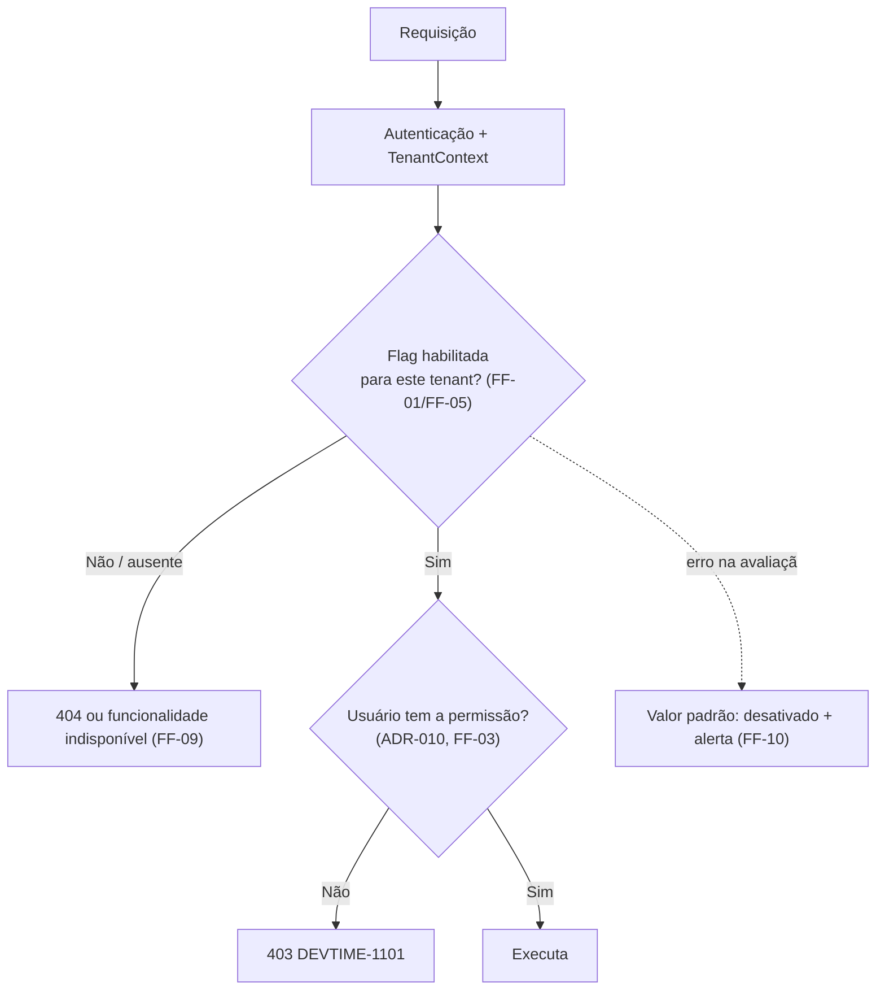

# ADR-048 — Feature flags por tenant, avaliadas exclusivamente no backend

## Status

**Proposto** em 2026-07-29.
**Não é vinculante e não pode ser implementado** enquanto não for aceito (ADR-U02 do `README.md` deste diretório).
Alvo: fase **F5 — Colaboração**.

## Data

2026-07-29

## Contexto

[ADR-032](ADR-032-git-flow.md) GF-09 estabelece que funcionalidade incompleta é integrada em `main` **desativada**, protegida por feature flag ou pela ausência de rota exposta. Enquanto o MVP puder se apoiar apenas na segunda opção (não registrar a rota), nenhum mecanismo de flag é necessário.

A partir de F5, três necessidades tornam a ausência de rota insuficiente:

| # | Necessidade | Fase |
|---|---|---|
| NC-01 | Liberar funcionalidade para um subconjunto de tenants (beta fechado) | F5 |
| NC-02 | Desativar rapidamente uma funcionalidade problemática sem deploy (*kill switch*) | F5 |
| NC-03 | Diferenciar funcionalidades por plano comercial | F6 |

Restrições:

| # | Restrição | Origem |
|---|---|---|
| R-01 | Nenhum estado de negócio no cliente; autorização sempre no servidor | `ART-080`, RB-14 de [ADR-010](ADR-010-role-permission.md) |
| R-02 | Flag não é permissão: papéis e permissões são [ADR-010](ADR-010-role-permission.md) | `ART-082` |
| R-03 | Isolamento entre tenants inviolável | [ADR-001](ADR-001-multi-tenant.md) |
| R-04 | Toda alteração relevante é auditada | [ADR-018](ADR-018-auditing.md) |
| R-05 | Diferenciação por plano é [ADR-049](ADR-049-saas-readiness.md) | — |

## Decisão

**Proposta:** introduzir feature flags em F5, com escopo estritamente delimitado.

| # | Regra proposta |
|---|---|
| FF-01 | Feature flags são avaliadas **exclusivamente no backend**. O frontend recebe o resultado, nunca a regra (R-01). |
| FF-02 | Existem **três tipos**, e apenas estes: **release** (funcionalidade incompleta em `main`, GF-09), **operacional** (*kill switch* para desativar rapidamente, NC-02) e **permissão de escopo** (liberar para um subconjunto de tenants, NC-01). |
| FF-03 | **Flag não é permissão** (R-02). Uma flag decide se a funcionalidade **existe** para aquele tenant; a permissão decide se **aquele usuário** pode usá-la. As duas verificações são independentes e ambas obrigatórias. |
| FF-04 | **Flag não é plano comercial** (R-05). A diferenciação por plano é decidida em [ADR-049](ADR-049-saas-readiness.md) e pode **usar** o mecanismo de flag, mas o conjunto de funcionalidades de um plano é dado do domínio, não configuração operacional. |
| FF-05 | O escopo de avaliação é: **global**, **por tenant** ou **por percentual de tenants**. **Não** existe flag por usuário individual no MVP de F5. |
| FF-06 | Toda flag nasce com um **responsável** e uma **data de remoção**. Flags de *release* são removidas assim que a funcionalidade é liberada para todos. |
| FF-07 | Flags são armazenadas no **banco**, com cache de curta duração ([ADR-040](ADR-040-cache-strategy.md)), e alteráveis **sem deploy**. |
| FF-08 | Toda alteração de flag é **auditada**: quem, quando, qual flag, qual escopo, valor anterior e novo (R-04). |
| FF-09 | O valor padrão de toda flag é **desativado**. Uma flag ausente ou não configurada resulta em funcionalidade indisponível. |
| FF-10 | A avaliação **nunca falha a requisição**: erro na consulta da flag resulta em valor padrão (desativado) e alerta. |
| FF-11 | Código protegido por flag é **removido** junto com a flag (FF-06). Código morto atrás de flag permanentemente ativa é dívida técnica. |
| FF-12 | Flags **não** controlam comportamento de dado já persistido: uma funcionalidade desativada não altera nem oculta registros criados enquanto ela estava ativa. |
| FF-13 | O número de flags ativas simultaneamente é **limitado**; ultrapassar o limite exige revisão e remoção antes de criar novas. |
| FF-14 | Toda combinação de flags que possa ocorrer em produção deve ser testável; combinações não suportadas são impedidas por validação na configuração. |

## Motivação

**Por que avaliação no backend (FF-01):** se o frontend decidisse a partir da regra, um usuário poderia habilitar a funcionalidade manipulando o cliente. A flag deixaria de ser controle e viraria sugestão. Além disso, o endpoint precisa recusar a chamada mesmo que a UI a ofereça — pela mesma razão de RB-14.

**Por que flag não é permissão (FF-03) — a distinção mais importante:** confundi-las produz um sistema em que ninguém sabe por que um usuário não consegue fazer algo. São perguntas diferentes: *"esta funcionalidade existe para este tenant?"* (flag) e *"este usuário pode usá-la?"* (permissão). Ambas precisam ser verdadeiras, e cada uma tem sua resposta de erro distinta — o que torna o diagnóstico direto.

**Por que flag não é plano (FF-04):** o conjunto de funcionalidades de um plano é informação **de negócio**, faturável, com contrato associado; ele pertence ao domínio de assinaturas ([ADR-049](ADR-049-saas-readiness.md)). Uma flag operacional é configuração transitória. Se o plano fosse implementado como flag, alterar uma configuração operacional poderia, por acidente, conceder funcionalidade paga.

**Por que padrão desativado (FF-09):** mesma lógica de "negado por padrão" (SC-02 de [ADR-044](ADR-044-security.md)): o modo de falha precisa ser fechar, não abrir. Uma flag mal configurada não deve liberar funcionalidade incompleta em produção.

**Por que data de remoção obrigatória (FF-06/FF-11) — o problema real de feature flags:** o custo não está em criá-las, está em **nunca removê-las**. Uma base com 200 flags tem 2²⁰⁰ combinações teóricas, das quais nenhuma é testada; o código fica ilegível e o comportamento imprevisível. A disciplina de remoção é o que separa feature flags de uma armadilha.

**Por que sem flag por usuário (FF-05):** flag por usuário produz cardinalidade alta, dificulta o teste e frequentemente é usada como substituto de permissão — reintroduzindo a confusão de FF-03.

**Por que flags não afetam dado persistido (FF-12):** desligar uma funcionalidade não pode fazer registros existentes desaparecerem ou serem reinterpretados. Um work log criado com uma funcionalidade ativa continua válido depois que ela é desligada. Essa regra evita que uma flag operacional cause perda aparente de dado.

## Alternativas consideradas

### A1 — Sem feature flags: apenas ausência de rota exposta (estado atual)

| Aspecto | Avaliação |
|---|---|
| **Prós** | Zero mecanismo, zero configuração, zero risco de combinação; código sempre em um único estado. |
| **Contras** | Não atende NC-01 (liberação parcial) nem NC-02 (*kill switch* sem deploy); desativar exige deploy, o que leva minutos no melhor caso. |
| **Por que não é a decisão** | É a decisão **atual** e permanece válida até F5. Este ADR define quando substituí-la. |

### A2 — Serviço externo de feature flags

| Aspecto | Avaliação |
|---|---|
| **Prós** | Interface de gestão pronta; segmentação avançada; experimentos A/B; auditoria e histórico prontos; SDKs maduros. |
| **Contras** | Dependência externa no caminho de decisão; custo por uso; dados de tenants enviados a terceiro (LGPD); complexidade desproporcional às três necessidades reais; a segmentação avançada não é requisito. |
| **Por que foi descartada** | As necessidades são simples (NC-01 a NC-03) e o escopo de avaliação é pequeno (FF-05). Uma tabela no banco com cache resolve, sem dependência externa nem exposição de dados. |

### A3 — Flags em configuração de ambiente (variável ou arquivo)

| Aspecto | Avaliação |
|---|---|
| **Prós** | Muito simples; sem banco; versionado com a infraestrutura. |
| **Contras** | Alterar exige redeploy ou reinício (não atende NC-02); não permite escopo por tenant (não atende NC-01); sem auditoria de alteração. |
| **Por que foi descartada** | Falha nas duas necessidades principais. |

### A4 — Flags avaliadas no frontend, a partir de configuração pública

| Aspecto | Avaliação |
|---|---|
| **Prós** | Sem chamada ao backend para decidir; UI reage instantaneamente. |
| **Contras** | Contornável pelo usuário (viola R-01); revela a existência de funcionalidades não lançadas; o backend precisaria verificar de qualquer forma, tornando a avaliação no cliente redundante. |
| **Por que foi descartada** | Flag avaliada no cliente não é controle. FF-01 mantém a decisão no servidor; o frontend consome apenas o resultado. |

### A5 — Flags como parte do modelo de permissões

| Aspecto | Avaliação |
|---|---|
| **Prós** | Um único mecanismo de "pode ou não pode"; menos conceitos. |
| **Contras** | Confunde duas perguntas distintas (FF-03); poluiria a matriz de permissões, que é normativa e testada exaustivamente ([ADR-010](ADR-010-role-permission.md)); flags são transitórias e permissões são estáveis — misturá-las tornaria a matriz instável. |
| **Por que foi descartada** | A matriz papel × permissão é finita, documentada e verificada por teste. Introduzir nela elementos transitórios destruiria essa propriedade. |

## Consequências

### Positivas (esperadas após a aceitação)

| # | Consequência |
|---|---|
| C+01 | Funcionalidade incompleta integrada com segurança em `main` (GF-09). |
| C+02 | *Kill switch* sem deploy (NC-02). |
| C+03 | Beta fechado por tenant (NC-01). |
| C+04 | Redução do risco de lançamento: liberação gradual com observação. |
| C+05 | Padrão desativado evita liberação acidental (FF-09). |
| C+06 | Alterações auditadas (FF-08). |
| C+07 | Base para diferenciação por plano em F6, sem confundir os conceitos (FF-04). |

### Negativas

| # | Consequência | Aceita porque |
|---|---|---|
| C-01 | Cada flag ativa dobra o número de caminhos de código a considerar. | FF-06, FF-11 e FF-13 limitam a quantidade e a duração. |
| C-02 | Testes precisam cobrir os estados relevantes de cada flag. | FF-14 exige testabilidade de toda combinação possível. |
| C-03 | Flags esquecidas viram dívida técnica. | FF-06 (data de remoção) e revisão periódica. |
| C-04 | Uma consulta adicional por avaliação. | Cacheada com TTL curto (FF-07). |
| C-05 | Estado de produção passa a depender de configuração fora do código. | Auditada (FF-08) e com padrão seguro (FF-09). |
| C-06 | Risco de usar flag como permissão ou como plano. | FF-03 e FF-04 explícitas, verificadas em revisão. |

### Limitações

| # | Limitação |
|---|---|
| L-01 | Sem flag por usuário individual (FF-05). |
| L-02 | Sem experimentos A/B com análise estatística. |
| L-03 | Sem segmentação por atributo arbitrário (região, plano, data de criação) no MVP de F5. |
| L-04 | Flags não afetam dado já persistido (FF-12), o que limita seu uso para mudanças de comportamento retroativas. |

### Custos

| Item | Custo |
|---|---|
| Implementação | ~2 dias (tabela, avaliação, cache, auditoria, interface administrativa) |
| Manutenção | Revisão periódica e remoção (FF-06) |
| Runtime | Consulta cacheada por avaliação |

## Trade-offs

| Sacrificado | Em favor de | Justificativa da troca |
|---|---|---|
| **Simplicidade** (sem flags) | Liberação gradual e *kill switch* | Necessidades reais a partir de F5; até lá, A1 permanece. |
| **Recursos avançados** (serviço externo) | Ausência de dependência e de custo | As necessidades são simples e o escopo é pequeno. |
| **Flexibilidade** (flag por usuário) | Testabilidade e clareza conceitual | Flag por usuário vira permissão disfarçada. |
| **Permanência** das flags | Legibilidade do código | Flag eterna é código morto com condicional. |
| **Avaliação no cliente** (mais rápida) | Controle efetivo | Flag no cliente é contornável. |

## Impacto na arquitetura

| Módulo | Impacto |
|---|---|
| `shared/featureflag` | Entidade, serviço de avaliação, cache, auditoria. |
| `tenant` | Associação de flags a tenants. |
| Features com flag | Verificação no serviço, **antes** da regra de negócio e **junto** com a verificação de permissão (FF-03). |
| Administração | Interface interna de gestão de flags, restrita. |

| Documento dependente | Relação |
|---|---|
| `docs/ai/coding-guidelines.md` §9.1 | GF-09 depende deste mecanismo |
| `docs/02-domain/permissions.md` | Distinção entre flag e permissão (FF-03) |
| `docs/00-overview/roadmap.md` | F5 e F6 |

| Spec dependente | Relação |
|---|---|
| `specs/future/017-permissions` | Distinção com permissões granulares |
| `specs/future/018-subscriptions` | Diferenciação por plano (FF-04) |

| ADR relacionado | Relação |
|---|---|
| [ADR-032](ADR-032-git-flow.md) | Viabiliza GF-09 |
| [ADR-010](ADR-010-role-permission.md) | Flag **não** é permissão (FF-03) |
| [ADR-049](ADR-049-saas-readiness.md) | Flag **não** é plano (FF-04) |
| [ADR-040](ADR-040-cache-strategy.md) | Cache da avaliação |
| [ADR-018](ADR-018-auditing.md) | Auditoria de alteração |

## Impacto no banco

| Item | Impacto |
|---|---|
| Tabela | `feature_flags (key, description, owner, default_enabled, removal_target_date, created_at, ...)` — global, sem `tenant_id`. |
| Tabela | `feature_flag_tenants (flag_key, tenant_id, enabled, updated_at, updated_by)` — sobrescrita por tenant. |
| Índice | `(flag_key, tenant_id)` para a avaliação. |
| Consultas | Uma por avaliação, cacheada com TTL curto (FF-07). |
| Auditoria | Alterações registradas em `audit_logs` (FF-08). |
| Soft delete | Não se aplica: flags removidas são removidas de fato, junto com o código (FF-11). |

## Impacto na API

| Item | Impacto |
|---|---|
| Funcionalidade desativada | Endpoint responde `404`, como se não existisse — **não** `403`, que revelaria a existência da funcionalidade. |
| Consulta de flags | `GET /api/v1/features` retorna o **resultado** da avaliação para o tenant corrente, nunca as regras (FF-01). |
| Administração | Endpoints de gestão restritos a papéis administrativos da plataforma, fora do escopo de tenant. |
| Documentação | Endpoints protegidos por flag são documentados no OpenAPI com indicação de disponibilidade condicional. |

## Impacto no Frontend

| Item | Impacto |
|---|---|
| Consumo | O frontend obtém a lista de funcionalidades **habilitadas** para o tenant e usa apenas para exibir ou ocultar elementos. |
| Regra | Assim como com permissões (RB-14), ocultar no cliente **não** é o controle: o servidor recusa de qualquer forma. |
| Estado | Armazenado no `AuthStore` junto com as permissões; recarregado na troca de tenant (SG-11 de [ADR-024](ADR-024-signals.md)). |
| Rotas | Rota de funcionalidade desabilitada não é registrada ou é protegida por guard. |
| Mensagens | Funcionalidade indisponível não é apresentada como erro, e sim como inexistente para aquele contexto. |

## Impacto na Infraestrutura

| Item | Impacto |
|---|---|
| Alteração | Feita por interface administrativa, sem deploy (FF-07). |
| Cache | TTL curto significa que a alteração leva alguns segundos para propagar entre instâncias ([ADR-040](ADR-040-cache-strategy.md) CA-06). |
| Monitoramento | Métrica de uso por flag, permitindo saber quais estão efetivamente ativas e quais podem ser removidas. |
| Alertas | Erro na avaliação de flag (FF-10); número de flags acima do limite (FF-13). |

## Segurança

| # | Consideração |
|---|---|
| S-01 | FF-01: avaliação no servidor; flag no cliente seria contornável. |
| S-02 | FF-09: padrão desativado; flag mal configurada não libera funcionalidade incompleta. |
| S-03 | FF-03: flag **nunca** substitui verificação de permissão; ambas são obrigatórias e independentes. |
| S-04 | Funcionalidade desativada responde `404`, não revelando sua existência. |
| S-05 | A gestão de flags é operação privilegiada e auditada (FF-08). |
| S-06 | **Multi-tenant:** a avaliação é sempre no contexto do tenant corrente; a chave de cache é prefixada por tenant (CA-02 de [ADR-040](ADR-040-cache-strategy.md)). Uma flag habilitada para o tenant A jamais afeta o tenant B. |
| S-07 | **LGPD:** flags não armazenam dado pessoal. |
| S-08 | **Auditoria:** alteração de flag é evento relevante — ela muda o comportamento do sistema em produção sem passar pelo pipeline. |

## Performance

| # | Consideração |
|---|---|
| P-01 | Uma consulta por avaliação, cacheada com TTL curto. |
| P-02 | A avaliação ocorre no início da operação, antes de trabalho pesado. |
| P-03 | FF-10 garante que erro na avaliação não adicione latência significativa. |
| P-04 | O número limitado de flags (FF-13) mantém o cache pequeno. |

## Escalabilidade

| # | Consideração |
|---|---|
| E-01 | O número de flags é limitado por FF-13; não cresce indefinidamente. |
| E-02 | A avaliação por tenant escala com o cache; sem cache, seria uma consulta por requisição. |
| E-03 | Percentual de tenants (FF-05) permite liberação gradual sem listar tenants individualmente. |
| E-04 | Em F6, o mecanismo pode servir de base para a diferenciação por plano, respeitada a separação de FF-04. |

## Riscos

| # | Risco | Probabilidade | Impacto | Severidade |
|---|---|---|---|---|
| RK-01 | Acúmulo de flags nunca removidas | **Alta** | Alto | **Alta** |
| RK-02 | Flag usada como permissão, contornando a matriz de autorização | Média | **Crítico** | **Crítica** |
| RK-03 | Flag usada como plano comercial, liberando funcionalidade paga por engano | Média | Alto | Alta |
| RK-04 | Combinação de flags não testada produzindo comportamento inesperado | Média | Alto | Alta |
| RK-05 | Flag desligada fazendo dado existente parecer perdido | Baixa | Alto | Média |
| RK-06 | Alteração de flag em produção sem rastreabilidade | Baixa | Médio | Baixa |
| RK-07 | Erro na avaliação bloqueando funcionalidade legítima | Média | Médio | Média |

## Mitigações

| Risco | Mitigação | Verificação |
|---|---|---|
| RK-01 | FF-06 (data de remoção obrigatória); FF-13 (limite); relatório de flags vencidas; remoção como item de backlog técnico com prioridade | Revisão mensal de flags |
| RK-02 | FF-03 explícita; toda verificação de flag é acompanhada de verificação de permissão; teste que desabilita a permissão com a flag ativa e espera `403` | Suíte de autorização |
| RK-03 | FF-04 explícita; a diferenciação por plano é dado do domínio ([ADR-049](ADR-049-saas-readiness.md)), com sua própria verificação | Revisão arquitetural |
| RK-04 | FF-14: combinações não suportadas são impedidas por validação; teste cobrindo os estados relevantes de cada flag | Suíte de flags |
| RK-05 | FF-12 explícita: dado persistido não é afetado; teste que cria registro com a flag ativa, desativa a flag e verifica que o registro permanece íntegro | Teste de flag |
| RK-06 | FF-08 (auditoria obrigatória) com autor, valor anterior e novo | Auditoria |
| RK-07 | FF-10 (padrão seguro com alerta); monitoramento de erros de avaliação | Alerta |

## Referências

| Fonte | Uso |
|---|---|
| [Martin Fowler — Feature Toggles](https://martinfowler.com/articles/feature-toggles.html) | Tipos de flag (FF-02) e disciplina de remoção |
| [Pete Hodgson — Feature Toggle categories](https://martinfowler.com/articles/feature-toggles.html#CategoriesOfToggles) | Base de FF-02 |
| [Trunk Based Development — Feature Flags](https://trunkbaseddevelopment.com/feature-flags/) | Relação com GF-09 |
| [OWASP — Authorization Cheat Sheet](https://cheatsheetseries.owasp.org/cheatsheets/Authorization_Cheat_Sheet.html) | Base de FF-03 |
| [Google — Launch and iterate](https://sre.google/sre-book/reliable-product-launches/) | Liberação gradual |
| `docs/ai/coding-guidelines.md` §9.1 | GF-09 |
