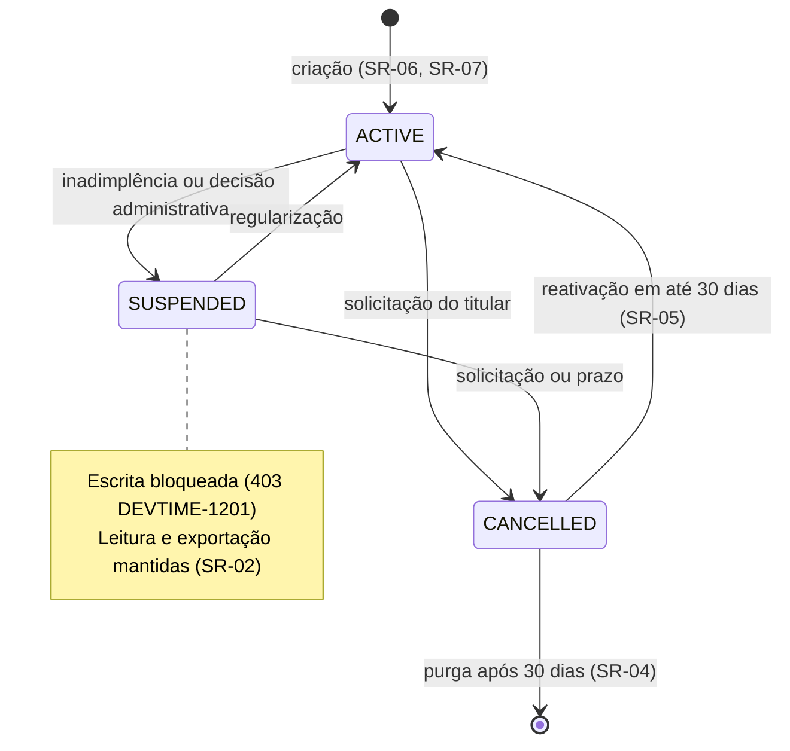

# ADR-049 — Preparação para SaaS: ciclo de vida do tenant, planos, quotas e onboarding

## Status

**Aceito** em 2026-07-29 (parte estrutural, F0).
As capacidades comerciais (cobrança, autoatendimento de plano) permanecem **fora do escopo do MVP** e serão detalhadas em F6, por ADR complementar.

## Data

2026-07-29

## Contexto

`ART-001` estabelece que o DevTime é multi-tenant desde o primeiro commit, e `ART-043` estabelece que o MVP **não** processa pagamentos. Entre esses dois extremos existe uma faixa de decisões que precisam ser tomadas **agora**, porque retrofitá-las é caro, mesmo que sua exploração comercial só ocorra em F6:

| # | Decisão que não pode esperar | Por quê |
|---|---|---|
| DC-01 | Ciclo de vida do tenant (estados e transições) | Determina o comportamento de toda requisição |
| DC-02 | Existência de plano como entidade | Adicionar depois exige migrar todos os tenants |
| DC-03 | Quotas por tenant | Sem elas, um tenant consome recursos ilimitadamente |
| DC-04 | Purga de dados após cancelamento | Obrigação legal (LGPD), não recurso comercial |
| DC-05 | Onboarding autônomo | Determina se o cadastro é operação de aplicação ou de infraestrutura |

Restrições:

| # | Restrição | Origem |
|---|---|---|
| R-01 | Multi-tenant desde o primeiro commit | `ART-001` |
| R-02 | O MVP não processa pagamentos | `ART-043` |
| R-03 | Tenant suspenso responde `403` em todas as rotas exceto autenticação e billing | §10 da constituição |
| R-04 | Purga de tenant cancelado após 30 dias | RN-008 |
| R-05 | Todo tenant tem `timezone` obrigatório | `ART-032` |
| R-06 | Todo tenant tem ao menos um `OWNER` ativo | RB-12 de [ADR-010](ADR-010-role-permission.md) |
| R-07 | Exportação completa dos dados do titular | AQ-12 |

## Decisão

### Ciclo de vida do tenant

| # | Regra |
|---|---|
| SR-01 | O `Tenant` possui os estados **`ACTIVE`**, **`SUSPENDED`** e **`CANCELLED`**, com transições explícitas e auditadas. |
| SR-02 | `SUSPENDED` bloqueia **operações de escrita** com `403 DEVTIME-1201`, mantendo leitura e exportação disponíveis — o cliente suspenso não perde acesso aos próprios dados (R-03). |
| SR-03 | `CANCELLED` bloqueia todo acesso de negócio com `403 DEVTIME-1202` e inicia a contagem de 30 dias para a purga (R-04). |
| SR-04 | A purga é executada por `TenantPurgeJob`, em lote, com carência de 30 dias, auditoria própria e **preservação da trilha pseudonimizada** (AU-17 de [ADR-018](ADR-018-auditing.md)). |
| SR-05 | Reativação de tenant `CANCELLED` é possível **apenas** dentro da janela de 30 dias, antes da purga. |

### Provisionamento e onboarding

| # | Regra |
|---|---|
| SR-06 | A criação de tenant é uma **operação transacional de aplicação** (um `INSERT` e seus dados iniciais), nunca uma operação de infraestrutura — consequência direta de [ADR-001](ADR-001-multi-tenant.md) C+02. |
| SR-07 | A criação de tenant estabelece, na mesma transação: o tenant com `timezone` (R-05), o primeiro `Membership` como `OWNER` (R-06), o plano padrão e os dados iniciais (categorias padrão). |
| SR-08 | O onboarding autônomo (registro público) existe desde o MVP; o que F6 acrescenta é a **escolha e a cobrança** de plano. |

### Plano e quotas

| # | Regra |
|---|---|
| SR-09 | **`Plan` existe como entidade desde o MVP** (DC-02), com um único plano padrão. Sua estrutura suporta múltiplos planos sem migração. |
| SR-10 | Todo tenant referencia um plano. O plano define **quotas** e, em F6, o conjunto de funcionalidades disponíveis. |
| SR-11 | As quotas do MVP são: número de usuários, número de contratos ativos, armazenamento de anexos e volume de exportações. Cada uma tem valor no plano e contador por tenant. |
| SR-12 | A verificação de quota ocorre na **camada de serviço**, antes da operação, retornando `422` com código específico. |
| SR-13 | Contadores de quota são **desnormalizados** com job de reconciliação (DA-03), pelo mesmo raciocínio de WL-09 de [ADR-035](ADR-035-worklog-architecture.md). |
| SR-14 | **Quota não é rate limit** ([ADR-045](ADR-045-rate-limit.md)): quota limita **acúmulo** (quantos contratos existem); rate limit limita **taxa** (quantas requisições por minuto). As duas são independentes e ambas necessárias. |
| SR-15 | **Plano não é feature flag** ([ADR-048](ADR-048-feature-flags.md) FF-04): o conjunto de funcionalidades de um plano é dado do domínio, faturável e contratual. |
| SR-16 | Ultrapassar quota **nunca** apaga nem oculta dado existente: bloqueia apenas a criação de novos registros do tipo limitado. |

### Fora do escopo do MVP

| # | Regra |
|---|---|
| SR-17 | **Cobrança, integração com gateway de pagamento, faturamento e gestão de assinatura estão fora do escopo do MVP** (R-02) e serão decididos em F6, por ADR complementar. |
| SR-18 | Contudo, o modelo de dados **não impede** sua introdução: `Plan` existe (SR-09), o tenant tem estados que suportam inadimplência (`SUSPENDED`, SR-02) e as quotas já são verificadas (SR-12). |

## Motivação

**Por que decidir agora o que só será usado em F6:** o custo de cada item de DC-01 a DC-05 é assimétrico. Criar a coluna `plan_id` hoje custa uma linha de migration; criá-la com 5.000 tenants em produção exige migração de dados, valor padrão, e coordenação com o deploy. O mesmo vale para os estados do tenant, que precisam ser verificados em toda requisição — adicioná-los depois significa revisar todo o fluxo de autorização.

**Por que `SUSPENDED` mantém leitura (SR-02) — decisão de produto com consequência técnica:** suspender um cliente inadimplente é legítimo; impedi-lo de acessar os próprios dados não é. Ele precisa poder exportar seu histórico e regularizar a situação. Tecnicamente, isso significa que a verificação de suspensão discrimina por **tipo de operação**, não por rota — o que é mais simples de implementar desde o início do que retrofitar.

**Por que 30 dias de carência antes da purga (SR-04/SR-05):** cancelamento por engano acontece. Purga imediata seria irreversível e geraria incidente grave de perda de dados. Trinta dias é prazo suficiente para o arrependimento e compatível com a expectativa da LGPD sobre eliminação em prazo razoável.

**Por que a trilha sobrevive à purga (SR-04):** obrigação legal de guarda por 5 anos, com dados pessoais pseudonimizados — a mesma conciliação de S-06 de [ADR-018](ADR-018-auditing.md). Purga dos dados de negócio, preservação da trilha anonimizada.

**Por que quotas desde o MVP (SR-11) — não é preparação comercial, é proteção:** sem quotas, um tenant pode criar 10.000 usuários ou consumir 500 GB de anexos. Isso não é problema de faturamento; é problema de **disponibilidade** para os demais tenants (C-01 de [ADR-001](ADR-001-multi-tenant.md)). Quotas são o complemento do rate limit: uma limita acúmulo, a outra limita taxa (SR-14).

**Por que quota não apaga dado (SR-16):** se um plano for rebaixado e o tenant estiver acima da nova quota, apagar o excedente seria destruição de dado do cliente. O comportamento correto é bloquear novas criações e permitir que o tenant reduza ou faça upgrade.

**Por que declarar explicitamente o que está fora (SR-17):** a fronteira precisa ser escrita. Sem SR-17, um agente implementador poderia inferir que "preparação para SaaS" inclui integração de pagamento e produzir código não solicitado. SR-18 registra que a porta está aberta.

## Alternativas consideradas

### A1 — Adiar todas as decisões de SaaS para F6

| Aspecto | Avaliação |
|---|---|
| **Prós** | MVP mais simples; nenhuma estrutura sem uso imediato; foco total no domínio. |
| **Contras** | `plan_id` e estados de tenant adicionados depois exigem migração de dados em produção e revisão de todo o fluxo de autorização; sem quotas, o produto fica sem proteção contra consumo abusivo desde o primeiro cliente; a purga LGPD é obrigação legal, não recurso comercial. |
| **Por que foi descartada** | Confunde "capacidade comercial" (que pode esperar) com "estrutura de dados e proteção" (que não pode). SR-17 separa os dois: o comercial é adiado, o estrutural não. |

### A2 — Implementar a plataforma comercial completa no MVP

| Aspecto | Avaliação |
|---|---|
| **Prós** | Produto pronto para monetizar desde o lançamento; nenhuma migração futura. |
| **Contras** | Integração com gateway de pagamento, faturamento, notas fiscais, gestão de assinatura, ciclos de cobrança e tratamento de inadimplência é um subproduto inteiro; viola `ART-043`; consumiria o orçamento do MVP; o modelo comercial ainda não está validado. |
| **Por que foi descartada** | O MVP precisa validar o produto antes de monetizá-lo. Construir cobrança para um modelo comercial não validado é a forma mais cara de errar. |

### A3 — Quotas apenas em F6, com rate limit como única proteção

| Aspecto | Avaliação |
|---|---|
| **Prós** | Menos código; rate limit já protege contra picos. |
| **Contras** | Rate limit limita **taxa**, não **acúmulo** (SR-14): um tenant pode criar 10.000 usuários respeitando 300 requisições por minuto, ao longo de horas; armazenamento de anexos cresceria sem limite. |
| **Por que foi descartada** | São proteções contra problemas diferentes; nenhuma substitui a outra. |

### A4 — Estado do tenant apenas como booleano `ativo`

| Aspecto | Avaliação |
|---|---|
| **Prós** | Mais simples; uma coluna; verificação trivial. |
| **Contras** | Não distingue suspensão (temporária, com leitura mantida) de cancelamento (definitivo, com purga programada); não suporta a janela de reativação; não permite discriminar por tipo de operação (SR-02). |
| **Por que foi descartada** | Os três estados têm comportamentos genuinamente diferentes; um booleano forçaria regras implícitas em outros campos. |

### A5 — Tenant dedicado por cliente enterprise desde o MVP

| Aspecto | Avaliação |
|---|---|
| **Prós** | Atenderia exigência de isolamento físico; permitiria plano enterprise diferenciado. |
| **Contras** | Descartado em [ADR-001](ADR-001-multi-tenant.md) A1: custo fixo por tenant inviabiliza o plano individual; sem SRE dedicado; nenhum cliente enterprise existe no MVP. |
| **Por que foi descartada** | Coerência com [ADR-001](ADR-001-multi-tenant.md); o caminho de extração permanece preservado (E-05 daquele ADR). |

## Consequências

### Positivas

| # | Consequência |
|---|---|
| C+01 | Provisionamento de tenant é transacional e instantâneo (SR-06). |
| C+02 | Onboarding autônomo funciona desde o MVP (SR-08). |
| C+03 | Proteção contra consumo abusivo desde o primeiro cliente (SR-11). |
| C+04 | LGPD atendida: exportação, cancelamento e purga (R-04, R-07). |
| C+05 | Estrutura para múltiplos planos sem migração futura (SR-09, SR-18). |
| C+06 | Cliente suspenso mantém acesso aos próprios dados (SR-02). |
| C+07 | Cancelamento reversível dentro da janela (SR-05). |

### Negativas

| # | Consequência | Aceita porque |
|---|---|---|
| C-01 | Estrutura de plano existe com um único plano no MVP. | Custo mínimo hoje, migração cara depois. |
| C-02 | Verificação de estado do tenant em toda requisição. | Consulta leve, cacheada ([ADR-040](ADR-040-cache-strategy.md)). |
| C-03 | Contadores de quota desnormalizados podem divergir. | Job de reconciliação (SR-13). |
| C-04 | Verificação de quota adiciona lógica a cada criação limitada. | Concentrada em um componente. |
| C-05 | SR-02 exige discriminar operações por tipo (leitura vs. escrita). | Mais simples de implementar agora que retrofitar. |
| C-06 | A purga é a operação mais destrutiva do sistema. | Carência, auditoria e ensaio obrigatório. |

### Limitações

| # | Limitação |
|---|---|
| L-01 | Sem cobrança, faturamento nem gestão de assinatura no MVP (SR-17). |
| L-02 | Um único plano no MVP; múltiplos planos exigem apenas dados, não estrutura nova. |
| L-03 | Sem tenant dedicado para cliente enterprise (A5). |
| L-04 | Sem migração de tenant entre instâncias implementada (o caminho existe, mas não é automatizado). |

### Custos

| Item | Custo |
|---|---|
| Implementação | ~4 dias (estados, plano, quotas, purga, onboarding) |
| Banco | Tabelas de plano e contadores de quota |
| Runtime | Verificação de estado e de quota por operação aplicável |

## Trade-offs

| Sacrificado | Em favor de | Justificativa da troca |
|---|---|---|
| **Simplicidade** do MVP | Ausência de migração cara em F6 | O custo de adicionar hoje é ordens de magnitude menor. |
| **Capacidade de monetizar** desde o lançamento | Foco em validar o produto | Construir cobrança para modelo não validado é caro e provavelmente errado. |
| **Liberdade** do tenant (sem quotas) | Proteção dos demais tenants | Consumo ilimitado por um degrada todos ([ADR-001](ADR-001-multi-tenant.md) C-01). |
| **Purga imediata** no cancelamento | Reversibilidade de erro | Trinta dias evitam perda irreversível por engano. |
| **Bloqueio total** na suspensão | Acesso do cliente aos próprios dados | Suspender cobrança não justifica reter dados do cliente. |

## Impacto na arquitetura

| Módulo | Impacto |
|---|---|
| `tenant` | Estados, transições, plano, quotas, contadores, purga. |
| `shared/tenancy` | Verificação de estado do tenant no filtro/interceptor. |
| `shared/quota` | Componente de verificação de quota (SR-12). |
| `auth` | Registro público e criação transacional de tenant (SR-06, SR-07). |
| Features com quota | `user`, `contract`, `attachment`, `report`. |
| Jobs | `TenantPurgeJob`, reconciliação de contadores. |

| Documento dependente | Relação |
|---|---|
| `docs/ai/project-constitution.md` | ART-001, ART-032, ART-043 |
| `docs/02-domain/business-rules.md` | RN-008 |
| `docs/02-domain/state-machines.md` | Máquina de estados do tenant |
| `docs/03-architecture/security.md` §9.3 | LGPD |
| `docs/00-overview/roadmap.md` | F6 |

| Spec dependente | Relação |
|---|---|
| `specs/001-authentication` | Registro e criação de tenant |
| `specs/002-users` | Quota de usuários |
| `specs/004-contracts` | Quota de contratos |
| `specs/015-attachments` | Quota de armazenamento |
| `specs/future/018-subscriptions` | Capacidades comerciais de F6 |

| ADR relacionado | Relação |
|---|---|
| [ADR-001](ADR-001-multi-tenant.md) | Modelo de tenancy que viabiliza SR-06 |
| [ADR-003](ADR-003-soft-delete.md) / [ADR-034](ADR-034-soft-delete-strategy.md) | Purga (SD-09) |
| [ADR-018](ADR-018-auditing.md) | Trilha preservada na purga |
| [ADR-045](ADR-045-rate-limit.md) | Complementar a quotas (SR-14) |
| [ADR-048](ADR-048-feature-flags.md) | Plano **não** é flag (SR-15) |
| [ADR-039](ADR-039-background-jobs.md) | `TenantPurgeJob` |

## Impacto no banco

| Item | Impacto |
|---|---|
| Tabela | `tenants` com `status`, `timezone`, `plan_id`, `cancelled_at`, `purge_scheduled_at`. |
| Tabela | `plans` com quotas e, em F6, conjunto de funcionalidades. |
| Coluna `status` | `VARCHAR(20)` + `CHECK` (PG-05 de [ADR-006](ADR-006-postgresql.md)). |
| Contadores | Colunas desnormalizadas em `tenants` (usuários, contratos, bytes de anexo), reconciliadas por job (SR-13). |
| Purga | `DELETE` físico em caminho separado e explícito (SS-14 de [ADR-034](ADR-034-soft-delete-strategy.md)), com lista de tabelas versionada. |
| Trilha | `audit_logs` **não** é purgada; é pseudonimizada (SR-04). |
| Índice | `(status, purge_scheduled_at)` para o job de purga. |

## Impacto na API

| Item | Impacto |
|---|---|
| Registro | `POST /api/v1/auth/register` cria usuário e tenant transacionalmente (SR-06). |
| Suspenso | `403 DEVTIME-1201` em operações de escrita; leitura e exportação permitidas (SR-02). |
| Cancelado | `403 DEVTIME-1202` em todas as operações de negócio (SR-03). |
| Quota | `422` com código específico por tipo de quota (SR-12). |
| Exportação LGPD | Endpoint de exportação completa dos dados do tenant (R-07). |
| Cancelamento | Endpoint de solicitação, informando a data da purga e a possibilidade de reativação. |
| Plano | `GET /api/v1/tenants/current/plan` retorna plano e consumo de quotas. |

## Impacto no Frontend

| Item | Impacto |
|---|---|
| Onboarding | Fluxo de registro com criação de tenant, fuso e primeiro `OWNER`. |
| Suspenso | Interface em modo somente leitura, com mensagem explicativa e caminho de regularização. |
| Cancelado | Acesso bloqueado, com informação sobre a janela de reativação. |
| Quota | Consumo exibido quando próximo do limite; mensagem específica ao atingir. |
| Cancelamento | Confirmação explícita, informando prazo de purga e o que será eliminado. |
| Exportação | Tela de exportação completa dos dados (R-07). |

## Impacto na Infraestrutura

| Item | Impacto |
|---|---|
| Provisionamento | Nenhuma operação de infraestrutura por tenant (SR-06) — benefício direto de [ADR-001](ADR-001-multi-tenant.md). |
| Jobs | `TenantPurgeJob` diário; reconciliação de contadores. |
| Armazenamento | Quota de anexos limita o crescimento por tenant ([ADR-038](ADR-038-file-storage.md)). |
| Monitoramento | Tenants por estado, consumo de quota, execuções de purga. |
| Alertas | Falha de purga; tenant próximo de quota crítica. |

## Segurança

| # | Consideração |
|---|---|
| S-01 | A verificação de estado do tenant ocorre **antes** da verificação de permissão (§4.1 de `permissions.md`); um tenant cancelado não acessa nada, independentemente do papel. |
| S-02 | A purga é a operação mais destrutiva do sistema: exige carência, auditoria, lista explícita de tabelas e ensaio em staging. |
| S-03 | Reativação (SR-05) é operação privilegiada e auditada. |
| S-04 | Quotas protegem contra abuso deliberado de recursos, que é vetor de negação de serviço contra outros tenants. |
| S-05 | **Multi-tenant:** a criação de tenant é o único ponto em que um novo `tenantId` nasce; o processo é transacional e auditado. |
| S-06 | **LGPD:** SR-03, SR-04 e R-07 implementam os direitos de eliminação, portabilidade e acesso; a trilha pseudonimizada atende à obrigação de guarda. |
| S-07 | **Auditoria:** toda transição de estado, alteração de plano e execução de purga é registrada. |
| S-08 | **Soft delete:** a purga é a **única** exceção ao `P-03` (SD-09 de [ADR-003](ADR-003-soft-delete.md)), e é justificada por obrigação legal. |

## Performance

| # | Consideração |
|---|---|
| P-01 | A verificação de estado do tenant ocorre por requisição; cacheada com TTL curto ([ADR-040](ADR-040-cache-strategy.md)). |
| P-02 | A verificação de quota usa contadores desnormalizados, evitando `COUNT(*)` em cada criação. |
| P-03 | A purga é executada em lotes com limite por execução (JB-05 de [ADR-039](ADR-039-background-jobs.md)). |
| P-04 | A criação de tenant é uma transação curta com poucos `INSERT`. |
| P-05 | A reconciliação de contadores roda fora do horário de pico. |

## Escalabilidade

| # | Consideração |
|---|---|
| E-01 | O custo marginal de um novo tenant é próximo de zero (C+03 de [ADR-001](ADR-001-multi-tenant.md)). |
| E-02 | Quotas limitam o crescimento por tenant, tornando o consumo previsível. |
| E-03 | Múltiplos planos são dados, não estrutura (SR-09). |
| E-04 | Tenant com volume muito acima da média pode ser extraído para instância dedicada (E-05 de [ADR-001](ADR-001-multi-tenant.md)) — caminho preservado, não automatizado (L-04). |
| E-05 | A purga em lote escala com o número de tenants cancelados, sem afetar os ativos. |

## Riscos

| # | Risco | Probabilidade | Impacto | Severidade |
|---|---|---|---|---|
| RK-01 | Purga apagando dados indevidamente | Baixa | **Crítico** | **Crítica** |
| RK-02 | Quotas não verificadas em alguma operação, permitindo consumo abusivo | Média | Alto | Alta |
| RK-03 | Contadores de quota divergindo do real | Média | Médio | Média |
| RK-04 | Tenant suspenso perdendo acesso à exportação dos próprios dados | Média | Alto | Alta |
| RK-05 | Estrutura de plano insuficiente para o modelo comercial de F6 | Média | Médio | Média |
| RK-06 | Cancelamento acidental sem possibilidade de reversão | Baixa | Alto | Média |
| RK-07 | Verificação de estado do tenant ausente em algum caminho | Média | Alto | Alta |

## Mitigações

| Risco | Mitigação | Verificação |
|---|---|---|
| RK-01 | Carência de 30 dias (SR-04); lista explícita e versionada de tabelas; ensaio obrigatório em staging com cópia de volume realista; auditoria preservada | Teste + ensaio |
| RK-02 | Verificação centralizada em `shared/quota`; teste por tipo de quota que tenta ultrapassar o limite | Suíte de quotas |
| RK-03 | Job de reconciliação (SR-13); alerta em divergência, como em [ADR-035](ADR-035-worklog-architecture.md) RK-01 | Job + alerta |
| RK-04 | SR-02 explícita; teste que suspende um tenant e verifica que leitura e exportação continuam funcionando | Teste de estado |
| RK-05 | SR-09 mantém a estrutura simples e extensível; a modelagem detalhada de planos é decidida em F6, quando o modelo comercial estiver validado | ADR de F6 |
| RK-06 | SR-05 (janela de 30 dias); confirmação explícita na UI informando o prazo; auditoria | Teste de fluxo |
| RK-07 | Verificação no filtro/interceptor, aplicada a todas as requisições autenticadas — não por endpoint; teste que exercita cada endpoint com tenant suspenso e cancelado | Suíte de estado de tenant |

## Referências

| Fonte | Uso |
|---|---|
| [AWS SaaS Lens — Tenant lifecycle e onboarding](https://docs.aws.amazon.com/wellarchitected/latest/saas-lens/saas-lens.html) | SR-01 a SR-08 |
| [Microsoft — Multitenant SaaS: tenant lifecycle](https://learn.microsoft.com/en-us/azure/architecture/guide/multitenant/considerations/tenant-lifecycle) | Estados e transições |
| [LGPD — Lei 13.709/2018, arts. 16 e 18](https://www.planalto.gov.br/ccivil_03/_ato2015-2018/2018/lei/l13709.htm) | Eliminação, portabilidade e conservação |
| [ANPD — Orientações sobre eliminação de dados](https://www.gov.br/anpd/pt-br) | SR-03, SR-04 |
| [Stripe — Subscription lifecycle](https://docs.stripe.com/billing/subscriptions/overview) | Referência para F6 (SR-17) |
| `docs/02-domain/state-machines.md` | Máquina de estados do tenant |
| `docs/00-overview/roadmap.md` | Fase F6 |
