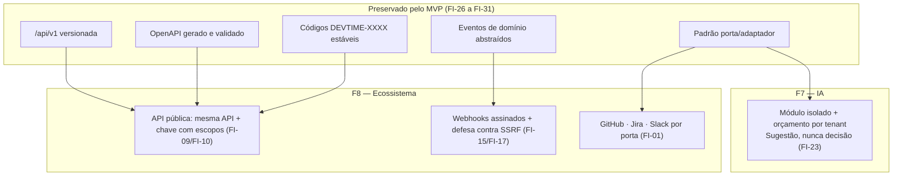

# ADR-050 — Fronteira das integrações futuras: API pública, webhooks e provedor de IA

## Status

**Proposto** em 2026-07-29.
**Não é vinculante e não pode ser implementado** enquanto não for aceito (ADR-U02 do `README.md` deste diretório).
Alvo: fases **F7 — Inteligência Artificial** e **F8 — Ecossistema**.

## Data

2026-07-29

## Contexto

`docs/03-architecture/integrations.md` §7 e `architecture.md` §13 preveem, para F7 e F8: gateway de pagamento (F6), provedor de IA (F7), integrações com GitHub, GitLab, Jira e Slack (F8), e API pública com webhooks (F8).

Nenhuma dessas integrações é construída no MVP. Este ADR não as projeta — isso seria especulação, proibida por IA-01. Ele registra a **fronteira**: quais decisões do MVP as viabilizam, quais restrições são inegociáveis quando elas chegarem, e o que **não pode ser quebrado** hoje para que elas continuem possíveis.

Restrições que já existem e que condicionam qualquer integração futura:

| # | Restrição | Origem |
|---|---|---|
| R-01 | Nenhuma URL fornecida pelo usuário é requisitada pelo backend no MVP | SC-16 de [ADR-044](ADR-044-security.md) |
| R-02 | Isolamento entre tenants é inviolável | [ADR-001](ADR-001-multi-tenant.md) |
| R-03 | A API é versionada por path, com compatibilidade como regra | [ADR-043](ADR-043-api-versioning.md) |
| R-04 | Toda integração externa segue o padrão de resiliência de `integrations.md` §5 | `integrations.md` |
| R-05 | Chamada externa nunca dentro de transação de banco | TX-06 |
| R-06 | Nenhum dado de negócio sai do perímetro sem base legal e controle | LGPD, `security.md` §9 |

## Decisão

**Proposta:** estabelecer as restrições vinculantes que qualquer integração futura deverá respeitar, e registrar o que o MVP preserva para viabilizá-las.

### Princípios gerais (aplicáveis a toda integração futura)

| # | Regra proposta |
|---|---|
| FI-01 | Toda integração externa é acessada por uma **porta** (`*Port`) com adaptador substituível, como já ocorre com `MailPort`, `StoragePort` e `AntivirusPort`. Nenhuma feature conhece o provedor. |
| FI-02 | Toda integração é **classificada por criticidade** (`integrations.md` §4.1) e declara explicitamente o comportamento em caso de indisponibilidade. Nenhuma integração externa pode bloquear o registro de horas. |
| FI-03 | Toda chamada externa ocorre **fora** de transação de banco (R-05), com timeout, retry com backoff e disjuntor. |
| FI-04 | Nenhuma integração recebe acesso direto ao banco. Toda integração passa pela camada de serviço, respeitando isolamento, permissões e auditoria (R-02). |
| FI-05 | Toda integração é **habilitada por tenant** e desabilitada por padrão. |
| FI-06 | Credenciais de integração são armazenadas **cifradas**, com chave gerenciada fora da aplicação, e **nunca** retornadas por API após o cadastro. |
| FI-07 | Toda chamada de integração é auditada: qual integração, qual tenant, qual operação, sucesso ou falha. |
| FI-08 | Nenhum dado pessoal ou financeiro sai do perímetro sem base legal registrada e sem que o tenant tenha habilitado a integração explicitamente (R-06). |

### API pública e webhooks (F8)

| # | Regra proposta |
|---|---|
| FI-09 | A API pública é a **mesma** API REST do produto ([ADR-011](ADR-011-rest-api.md)), sob o mesmo versionamento ([ADR-043](ADR-043-api-versioning.md)). **Não** haverá uma API paralela. |
| FI-10 | A autenticação de integradores usa **chave de API com escopos**, não JWT de usuário: chaves são de longa duração, revogáveis individualmente e vinculadas a um tenant e a um conjunto de escopos. |
| FI-11 | A chave de API é armazenada **apenas como hash** (mesmo princípio de RT-03 de [ADR-009](ADR-009-refresh-token.md)) e exibida uma única vez, na criação. |
| FI-12 | Os escopos de chave são um subconjunto das permissões existentes ([ADR-010](ADR-010-role-permission.md)); uma chave **nunca** pode fazer mais que o papel que a criou. |
| FI-13 | Rate limit específico e mais restritivo para chaves de API ([ADR-045](ADR-045-rate-limit.md)). |
| FI-14 | A migração de HS256 para **RS256** ocorre nesta fase (JW-13 de [ADR-008](ADR-008-jwt.md)), permitindo que consumidores validem tokens sem poder emiti-los. |
| FI-15 | **Webhooks** são assinados (HMAC sobre o corpo, com segredo por endpoint), incluem timestamp para prevenir *replay*, e o consumidor deve validar ambos. |
| FI-16 | A entrega de webhook usa retry com backoff, tem *dead-letter* e é observável pelo tenant (histórico de entregas com estado). |
| FI-17 | **SSRF é a ameaça central dos webhooks** (OWASP A10): a URL de destino passa por **allowlist de esquema** (`https` apenas), **bloqueio de IPs privados, de loopback e de metadados de nuvem**, resolução de DNS validada no momento da chamada, e proibição de seguir redirecionamentos para destinos bloqueados. |
| FI-18 | O payload do webhook contém **referências e o mínimo de contexto**, nunca dados sensíveis (mesmo princípio de MQ-07 de [ADR-042](ADR-042-rabbitmq.md)); o consumidor busca os detalhes pela API autenticada. |

### Provedor de IA (F7)

| # | Regra proposta |
|---|---|
| FI-19 | O módulo de IA é **isolado**, acessado por porta (FI-01), e sua indisponibilidade **nunca** afeta funcionalidade central. |
| FI-20 | Existe **orçamento por tenant** para uso de IA, verificado antes da chamada, com o mesmo mecanismo de quota de [ADR-049](ADR-049-saas-readiness.md). |
| FI-21 | Nenhum dado é enviado ao provedor de IA sem **consentimento explícito do tenant** e sem base legal registrada (R-06, FI-08). |
| FI-22 | Dados enviados ao provedor são **minimizados**: apenas o necessário para a tarefa, com dados identificáveis removidos ou pseudonimizados sempre que a tarefa permitir. |
| FI-23 | Respostas de IA são **sugestões**, nunca decisões automáticas sobre dado financeiro. Toda saída passa por confirmação humana antes de alterar estado. |
| FI-24 | Respostas são cacheadas quando a entrada for idêntica, reduzindo custo e latência ([ADR-040](ADR-040-cache-strategy.md)). |
| FI-25 | O provedor **não** pode usar os dados enviados para treinamento; isso é requisito contratual verificado antes da adoção. |

### O que o MVP preserva (vinculante hoje)

| # | Regra vinculante **agora** |
|---|---|
| FI-26 | O prefixo `/api/v1` existe desde o MVP, tornando a API pública de F8 uma extensão e não uma quebra ([ADR-043](ADR-043-api-versioning.md)). |
| FI-27 | O documento OpenAPI é gerado e validado desde o MVP ([ADR-012](ADR-012-openapi.md)), sendo o contrato que integradores consumirão. |
| FI-28 | Os códigos de erro `DEVTIME-XXXX` são estáveis desde o MVP ([ADR-017](ADR-017-exception-handling.md)), permitindo tratamento programático por terceiros. |
| FI-29 | Eventos de domínio existem e são abstraídos desde o MVP (JB-11 de [ADR-039](ADR-039-background-jobs.md)); eles serão a fonte dos webhooks. |
| FI-30 | O padrão de porta e adaptador está estabelecido desde o MVP, e **toda** nova integração deve segui-lo (FI-01). |
| FI-31 | SC-16 de [ADR-044](ADR-044-security.md) permanece vinculante: **no MVP, nenhuma URL fornecida pelo usuário é requisitada pelo backend.** Introduzir essa capacidade exige a aceitação deste ADR e a implementação integral de FI-17. |

## Motivação

**Por que registrar a fronteira sem projetar a solução:** especular sobre o desenho de uma integração que será construída daqui a mais de um ano produz documentação que envelhece antes de ser lida — o mesmo raciocínio de `specs/future/`. O que **não** envelhece são as restrições: SSRF continuará sendo a ameaça de webhook, o isolamento de tenant continuará inviolável, e a compatibilidade de API continuará sendo requisito. Registrar isso agora impede que uma decisão do MVP feche essas portas por acidente.

**Por que a API pública é a mesma API (FI-09) — a decisão mais consequente:** manter duas APIs significaria duas superfícies para autenticar, autorizar, documentar, testar e versionar — e a segunda inevitavelmente divergiria da primeira. Manter uma só significa que a disciplina de contrato do MVP ([ADR-043](ADR-043-api-versioning.md)) **já é** a preparação para F8. Também significa que a API interna precisa ser boa o suficiente para ser pública, o que é uma pressão saudável desde já.

**Por que chave de API e não JWT de usuário (FI-10):** um integrador não é um usuário: não faz login, não tem sessão de 15 minutos, não pode renovar token interativamente. Chave de longa duração com escopos é o modelo adequado — e revogável individualmente, o que um JWT stateless não é.

**Por que escopos são subconjunto das permissões (FI-12):** se a chave pudesse ter escopos independentes da matriz de permissões, existiriam dois modelos de autorização — e o mais permissivo seria explorado. Ancorar os escopos nas permissões existentes mantém um único modelo.

**Por que SSRF é destacada (FI-17) — a ameaça mais subestimada:** webhook significa que o **cliente escolhe uma URL que o nosso servidor vai requisitar**. Sem controle, um tenant pode apontar o webhook para `http://169.254.169.254/` (metadados de nuvem) e obter credenciais da infraestrutura, ou para serviços internos não expostos. É exatamente por isso que SC-16 proíbe essa capacidade no MVP: ela só pode existir com a defesa completa implementada.

**Por que payload de webhook com referências (FI-18):** o webhook é entregue a um endpoint controlado pelo tenant, mas que pode ter sido comprometido, mal configurado ou apontado para terceiro. Enviar apenas referências limita o dano.

**Por que IA é sugestão e nunca decisão (FI-23):** o produto lida com faturamento. Um modelo que altere horas, categorize automaticamente ou ajuste saldos sem confirmação humana introduziria erro não determinístico em dado financeiro — inaceitável, e incompatível com a rastreabilidade de `ART-003`.

**Por que consentimento e minimização para IA (FI-21/FI-22):** enviar descrições de trabalho a um provedor externo é tratamento de dado pessoal por terceiro. Exige base legal, consentimento e minimização — e o tenant precisa poder recusar sem perder o produto.

**Por que FI-31 é vinculante hoje:** é a única regra deste ADR que vale imediatamente. Ela impede que alguém implemente "só um webhook simples" sem a defesa de FI-17.

## Alternativas consideradas

### A1 — Não registrar nada sobre integrações futuras

| Aspecto | Avaliação |
|---|---|
| **Prós** | Nenhuma especulação; nenhuma documentação a envelhecer; foco total no MVP. |
| **Contras** | Uma decisão do MVP pode fechar uma porta sem que ninguém perceba; quando a integração chegar, as restrições de segurança serão descobertas sob pressão de prazo; SC-16 ficaria sem contexto sobre quando e como pode ser revertida. |
| **Por que foi descartada** | O valor está em registrar as **restrições**, não em projetar a solução. FI-31 é o exemplo: sem este ADR, alguém poderia implementar webhook sem defesa contra SSRF. |

### A2 — Projetar completamente as integrações de F7 e F8 agora

| Aspecto | Avaliação |
|---|---|
| **Prós** | Nenhuma surpresa futura; arquitetura completa desenhada. |
| **Contras** | Especulação sobre requisitos não validados; provedores, APIs de terceiros e o próprio modelo de negócio mudarão; documentação detalhada envelheceria e passaria a induzir ao erro. |
| **Por que foi descartada** | Viola IA-01 (não especular). O detalhamento deve ocorrer quando a necessidade for real. |

### A3 — API pública separada da API interna

| Aspecto | Avaliação |
|---|---|
| **Prós** | Liberdade de evoluir a API interna sem restrição; contrato público desenhado especificamente para integradores; superfície pública menor. |
| **Contras** | Duas APIs para autenticar, autorizar, documentar, testar e versionar; a interna seria a fonte e a pública uma tradução que diverge; duplicação de esforço permanente. |
| **Por que foi descartada** | O custo de manter duas superfícies é permanente. A disciplina de contrato de [ADR-043](ADR-043-api-versioning.md) torna a API interna adequada para uso público — e a pressão de mantê-la assim é benéfica. |

### A4 — Webhooks substituídos por polling do integrador

| Aspecto | Avaliação |
|---|---|
| **Prós** | Elimina completamente o risco de SSRF (FI-17); sem entrega, sem retry, sem DLQ; muito mais simples. |
| **Contras** | Integrador precisa consultar periodicamente, com latência e desperdício; carga de leitura proporcional ao número de integradores; experiência inferior. |
| **Por que não foi descartada definitivamente** | É uma alternativa **legítima** e significativamente mais segura. Se o custo de implementar FI-17 corretamente for alto em relação ao valor dos webhooks, polling com endpoint de eventos incrementais é a opção preferível. A decisão fica para F8, com esta análise registrada. |

### A5 — Executar o modelo de IA internamente, sem provedor externo

| Aspecto | Avaliação |
|---|---|
| **Prós** | Nenhum dado sai do perímetro (resolve FI-21/FI-22 na origem); sem custo por chamada; sem dependência externa. |
| **Contras** | Infraestrutura de inferência (GPU) com custo fixo alto; qualidade inferior à de modelos de fronteira; operação e atualização de modelo por nossa conta. |
| **Por que não foi descartada definitivamente** | Permanece como alternativa a avaliar em F7, especialmente se a restrição de privacidade (FI-21) inviabilizar o provedor externo para parte dos tenants. A decisão fica para F7. |

## Consequências

### Positivas (esperadas)

| # | Consequência |
|---|---|
| C+01 | As portas para F7 e F8 permanecem abertas sem custo no MVP (FI-26 a FI-30). |
| C+02 | As restrições de segurança estão registradas **antes** da pressão de prazo. |
| C+03 | FI-31 impede a implementação prematura e insegura de webhook. |
| C+04 | A API pública será uma extensão, não uma reescrita (FI-09). |
| C+05 | O padrão de porta/adaptador já está estabelecido e testado com três integrações do MVP. |
| C+06 | Alternativas mais seguras (A4, A5) estão registradas para reavaliação no momento certo. |

### Negativas

| # | Consequência | Aceita porque |
|---|---|---|
| C-01 | Documento sobre funcionalidades que podem nunca existir. | Registra restrições, não desenho; as restrições não envelhecem. |
| C-02 | FI-09 implica que a API interna precisa ser adequada para uso público. | É pressão saudável e já é a disciplina de [ADR-043](ADR-043-api-versioning.md). |
| C-03 | FI-31 restringe uma capacidade que poderia ser útil antes de F8. | A restrição é justamente o valor: SSRF é ameaça grave. |
| C-04 | As regras propostas podem se mostrar inadequadas quando a necessidade for real. | São restrições de segurança e de arquitetura, não desenho; ajustes exigirão emenda a este ADR. |

### Limitações

| # | Limitação |
|---|---|
| L-01 | Não define o desenho das integrações; cada uma exigirá ADR próprio quando for construída. |
| L-02 | Não escolhe provedores nem tecnologias específicas. |
| L-03 | Não cobre o gateway de pagamento de F6, que é parte de [ADR-049](ADR-049-saas-readiness.md) SR-17. |
| L-04 | Não estima esforço nem prazo. |

### Custos

| Item | Custo |
|---|---|
| Hoje | Zero em implementação; apenas FI-31 como restrição |
| Em F7/F8 | Significativo, estimado quando as integrações forem detalhadas |

## Trade-offs

| Sacrificado | Em favor de | Justificativa da troca |
|---|---|---|
| **Detalhamento** das integrações futuras | Ausência de especulação que envelhece | Restrições duram; desenhos não. |
| **Liberdade** de evoluir a API interna sem restrição | API pública sem duplicação (FI-09) | Duas APIs custam mais que uma boa API. |
| **Capacidade** de webhook antes de F8 (FI-31) | Segurança contra SSRF | Webhook sem defesa completa é vetor de comprometimento da infraestrutura. |
| **Automação** por IA (FI-23) | Correção de dado financeiro | Erro não determinístico em faturamento é inaceitável. |
| **Qualidade** de modelos de fronteira (A5) | Possível requisito de privacidade | Decisão adiada para F7, com a alternativa registrada. |

## Impacto na arquitetura

| Módulo | Impacto (futuro) |
|---|---|
| `shared/integration` | Portas e adaptadores das novas integrações (FI-01). |
| `apikey` (F8) | Chaves com escopos, hash, revogação. |
| `webhook` (F8) | Endpoints registrados por tenant, assinatura, entrega, histórico. |
| `ai` (F7) | Módulo isolado com orçamento por tenant. |
| `shared/event` | Eventos de domínio como fonte dos webhooks (FI-29). |
| **Hoje** | Nenhum impacto além de FI-31. |

| Documento dependente | Relação |
|---|---|
| `docs/03-architecture/integrations.md` §7 | Integrações futuras |
| `docs/03-architecture/architecture.md` §13 | Evolução arquitetural |
| `docs/00-overview/roadmap.md` | F7 e F8 |
| `docs/07-backlog/future.md` | Backlog pós-MVP |

| Spec dependente | Relação |
|---|---|
| `specs/future/019-public-api` | API pública e webhooks |
| `specs/future/020-ai` | Módulo de IA |

| ADR relacionado | Relação |
|---|---|
| [ADR-011](ADR-011-rest-api.md) / [ADR-043](ADR-043-api-versioning.md) | API pública é a mesma API |
| [ADR-012](ADR-012-openapi.md) | Contrato para integradores |
| [ADR-008](ADR-008-jwt.md) | Migração para RS256 (FI-14) |
| [ADR-010](ADR-010-role-permission.md) | Escopos ancorados nas permissões |
| [ADR-044](ADR-044-security.md) | SC-16 e OWASP A10 |
| [ADR-042](ADR-042-rabbitmq.md) | Entrega assíncrona de webhooks |
| [ADR-049](ADR-049-saas-readiness.md) | Orçamento e quotas |

## Impacto no banco

| Item | Impacto (futuro) |
|---|---|
| `api_keys` | Hash da chave, tenant, escopos, criação, último uso, revogação. |
| `webhook_endpoints` | URL, segredo cifrado, eventos assinados, estado, por tenant. |
| `webhook_deliveries` | Histórico de entregas com estado, tentativas e resposta; retenção limitada. |
| `ai_usage` | Consumo por tenant para o orçamento de FI-20. |
| **Hoje** | Nenhuma tabela criada. |

## Impacto na API

| Item | Impacto (futuro) |
|---|---|
| Autenticação | Chave de API como alternativa ao JWT, com escopos (FI-10, FI-12). |
| Rate limit | Escopo específico e mais restritivo para chaves (FI-13). |
| Documentação | O mesmo OpenAPI serve integradores (FI-27). |
| Webhooks | Endpoints de gestão de assinaturas e de consulta de histórico de entregas. |
| Erros | Os mesmos códigos `DEVTIME-XXXX`, estáveis (FI-28). |
| Compatibilidade | Uma vez pública, a API fica sujeita a [ADR-043](ADR-043-api-versioning.md) com rigor ainda maior: quebras afetam terceiros. |

## Impacto no Frontend

| Item | Impacto (futuro) |
|---|---|
| Chaves de API | Tela de gestão: criação (com exibição única, FI-11), listagem e revogação. |
| Webhooks | Tela de configuração de endpoints e visualização do histórico de entregas. |
| IA | Sugestões apresentadas como **sugestão**, com confirmação explícita do usuário (FI-23). |
| Consentimento | Fluxo explícito de consentimento antes de habilitar a IA (FI-21). |
| **Hoje** | Nenhum impacto. |

## Impacto na Infraestrutura

| Item | Impacto (futuro) |
|---|---|
| Rede de saída | Webhooks exigem tráfego de saída controlado, com allowlist e bloqueio de destinos internos (FI-17). |
| Segredos | Chave de criptografia para credenciais de integração (FI-06), gerenciada fora da aplicação. |
| Workers | Entrega de webhook e chamadas de IA como trabalho assíncrono ([ADR-042](ADR-042-rabbitmq.md)). |
| Monitoramento | Taxa de sucesso de entrega, latência e custo por integração. |
| Custo | Chamadas de IA têm custo por uso, controlado por FI-20. |
| **Hoje** | Nenhum impacto. |

## Segurança

| # | Consideração |
|---|---|
| S-01 | **SSRF (FI-17) é a ameaça central** dos webhooks: sem allowlist de esquema, bloqueio de IPs privados e de metadados de nuvem, e validação de DNS no momento da chamada, um tenant obtém credenciais da infraestrutura. |
| S-02 | Redirecionamentos precisam ser validados a cada salto: uma URL pública que redireciona para `169.254.169.254` contorna uma validação feita apenas na URL inicial. |
| S-03 | FI-11: chave de API armazenada como hash; vazamento do banco não entrega chaves utilizáveis. |
| S-04 | FI-12: escopos ancorados nas permissões; nenhuma chave pode exceder o papel que a criou. |
| S-05 | FI-15: webhooks assinados com HMAC e timestamp, prevenindo forja e *replay*. |
| S-06 | FI-18: payload com referências limita o dano de um endpoint comprometido. |
| S-07 | **Multi-tenant:** toda integração é escopada por tenant (FI-05); uma chave de API pertence a **um** tenant, e webhooks entregam apenas eventos daquele tenant. Vazamento entre tenants por integração seria falha crítica. |
| S-08 | **LGPD:** FI-08, FI-21 e FI-22 — dado só sai do perímetro com consentimento, base legal e minimização; FI-25 impede uso para treinamento. |
| S-09 | **Auditoria:** FI-07 — toda chamada de integração é auditada; uso de chave de API é rastreável ao integrador. |
| S-10 | FI-31 mantém a superfície fechada até que a defesa completa exista. |

## Performance

| # | Consideração |
|---|---|
| P-01 | Chamadas externas são a maior fonte de latência variável; FI-03 exige timeout, retry e disjuntor. |
| P-02 | Entrega de webhook é assíncrona, fora do caminho da requisição ([ADR-042](ADR-042-rabbitmq.md)). |
| P-03 | Chamadas de IA têm latência de segundos; nunca no caminho síncrono de uma operação de negócio (FI-19). |
| P-04 | FI-24 (cache de respostas de IA) reduz custo e latência em entradas repetidas. |
| P-05 | Chaves de API aumentam o tráfego total; FI-13 limita. |

## Escalabilidade

| # | Consideração |
|---|---|
| E-01 | A API pública amplia o tráfego de forma não controlada por nós; FI-13 é a proteção. |
| E-02 | Entrega de webhook escala com número de integradores × eventos; workers dedicados. |
| E-03 | Custo de IA escala com uso; FI-20 (orçamento por tenant) é o controle. |
| E-04 | Cada integração nova é um adaptador atrás de uma porta (FI-01), sem impacto nas existentes. |
| E-05 | A extração do módulo de IA como serviço independente é prevista em `architecture.md` §13. |

## Riscos

| # | Risco | Probabilidade | Impacto | Severidade |
|---|---|---|---|---|
| RK-01 | SSRF via webhook expondo credenciais de infraestrutura | Média | **Crítico** | **Crítica** |
| RK-02 | Chave de API vazada concedendo acesso prolongado | Média | **Crítico** | **Crítica** |
| RK-03 | Dado pessoal enviado a provedor de IA sem base legal | Média | Alto | **Alta** |
| RK-04 | Quebra de contrato da API pública afetando integradores | Média | Alto | Alta |
| RK-05 | Custo de IA acima do previsto | Média | Médio | Média |
| RK-06 | Webhook implementado antes de F8 sem a defesa de FI-17 | Baixa | **Crítico** | **Alta** |
| RK-07 | Decisão de IA automática alterando dado financeiro | Baixa | **Crítico** | **Alta** |
| RK-08 | Integração externa indisponível degradando funcionalidade central | Média | Alto | Alta |

## Mitigações

| Risco | Mitigação | Verificação |
|---|---|---|
| RK-01 | FI-17 integral: allowlist de esquema, bloqueio de IPs privados/loopback/metadados, validação de DNS na chamada, redirecionamentos validados a cada salto (S-02); teste que tenta cada destino bloqueado | Suíte de SSRF |
| RK-02 | FI-11 (hash); revogação individual; escopos mínimos (FI-12); rate limit próprio (FI-13); registro de último uso para detectar chave abandonada | Auditoria + monitoramento |
| RK-03 | FI-21 (consentimento explícito), FI-22 (minimização), FI-25 (sem treinamento); revisão jurídica antes da adoção do provedor | Revisão de conformidade |
| RK-04 | [ADR-043](ADR-043-api-versioning.md) com rigor ampliado; detecção automatizada de quebra (OA-11); depreciação de 12 meses | Gate de contrato |
| RK-05 | FI-20 (orçamento por tenant); FI-24 (cache); monitoramento de custo por tenant com alerta | Métrica de custo |
| RK-06 | FI-31 vinculante **hoje**; SC-16 de [ADR-044](ADR-044-security.md); revisão bloqueia qualquer requisição a URL fornecida pelo usuário | `review-checklist.md` |
| RK-07 | FI-23: toda saída de IA é sugestão com confirmação humana; teste que verifica que nenhuma alteração de estado ocorre sem confirmação | Teste de fluxo |
| RK-08 | FI-02: classificação de criticidade obrigatória; nenhuma integração externa bloqueia o registro de horas; teste de resiliência por integração | Teste de resiliência |

## Referências

| Fonte | Uso |
|---|---|
| [OWASP — Server Side Request Forgery Prevention](https://cheatsheetseries.owasp.org/cheatsheets/Server_Side_Request_Forgery_Prevention_Cheat_Sheet.html) | Base de FI-17 |
| [OWASP Top 10 — A10 SSRF](https://owasp.org/Top10/A10_2021-Server-Side_Request_Forgery_%28SSRF%29/) | Ameaça central |
| [Stripe — Webhook signatures](https://docs.stripe.com/webhooks#verify-official-libraries) | Modelo de FI-15 |
| [GitHub — Webhook security](https://docs.github.com/en/webhooks/using-webhooks/securing-your-webhooks) | Assinatura e validação |
| [OWASP — REST Security Cheat Sheet](https://cheatsheetseries.owasp.org/cheatsheets/REST_Security_Cheat_Sheet.html) | Chaves de API |
| [OWASP — LLM Top 10](https://owasp.org/www-project-top-10-for-large-language-model-applications/) | Riscos do módulo de IA |
| [LGPD — Lei 13.709/2018](https://www.planalto.gov.br/ccivil_03/_ato2015-2018/2018/lei/l13709.htm) | FI-08, FI-21, FI-22 |
| `docs/03-architecture/integrations.md` §7 | Integrações futuras previstas |
