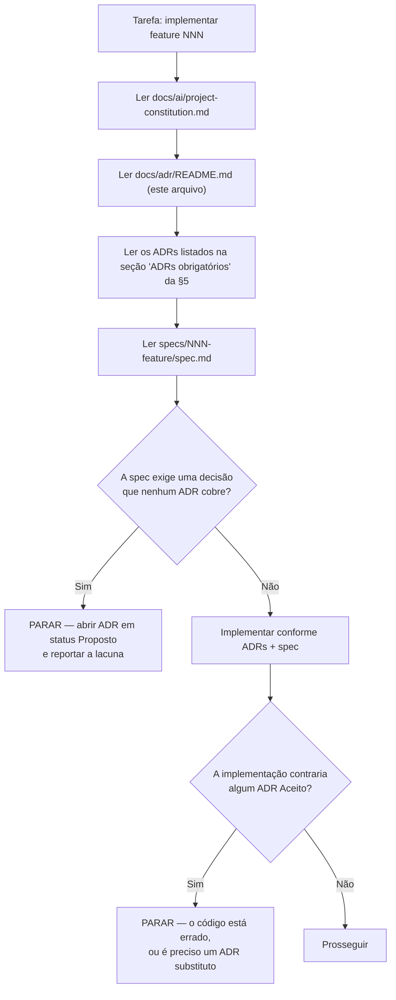
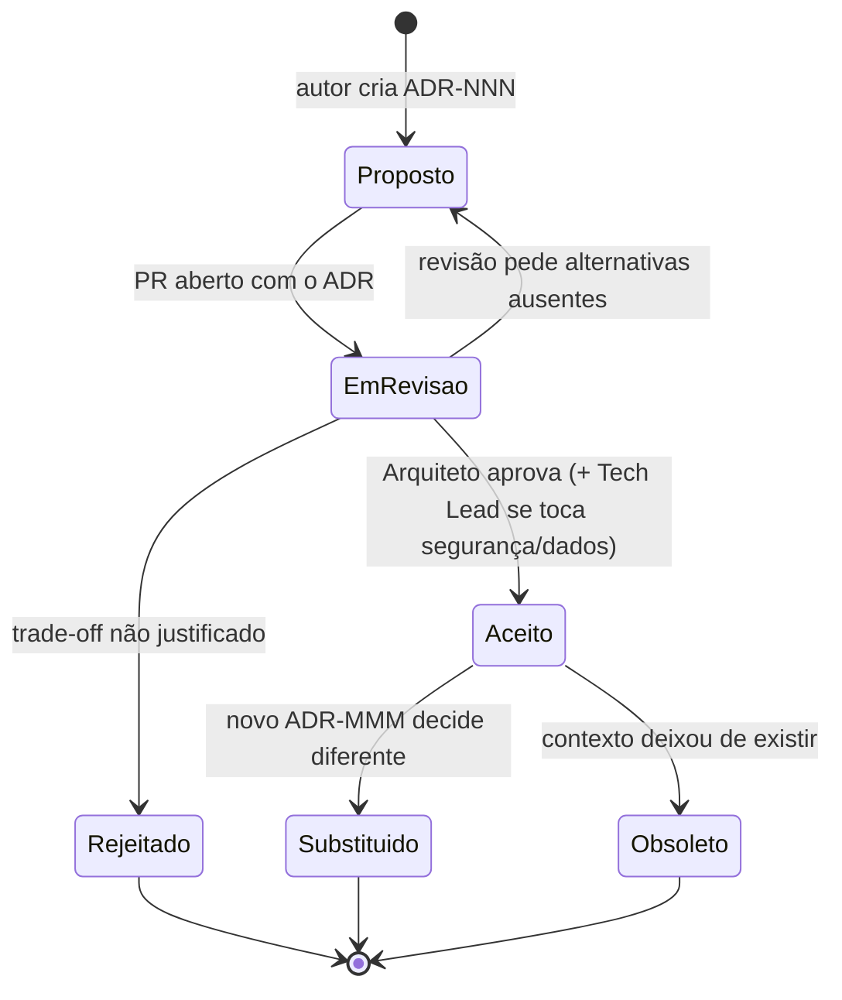
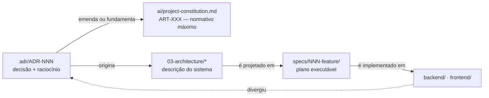

# `docs/adr/` — Registro de Decisões Arquiteturais do DevTime

> **Este diretório é o registro canônico de decisões arquiteturais do DevTime.**
> Toda decisão estrutural, transversal ou irreversível do produto está aqui, com contexto, alternativas avaliadas, consequências, trade-offs e riscos.
> Se uma decisão arquitetural não possui ADR, ela **não existe** — e nenhum agente pode assumi-la.

---

## 1. O que é um ADR

**ADR** (*Architecture Decision Record*) é um documento imutável que registra **uma** decisão arquitetural significativa, no momento em que ela foi tomada, junto com o raciocínio que a produziu.

Um ADR responde a cinco perguntas que o código nunca responde:

| Pergunta | Onde é respondida |
|---|---|
| Qual era o problema? | §Contexto |
| O que foi decidido, sem ambiguidade? | §Decisão |
| O que **mais** foi avaliado e por que foi descartado? | §Alternativas consideradas |
| O que essa decisão custa? | §Consequências e §Trade-offs |
| O que quebra se ela for revertida? | §Impacto na arquitetura e §Riscos |

### 1.1 O que é e o que não é

| Um ADR **é** | Um ADR **não é** |
|---|---|
| Registro de uma decisão e de seu raciocínio | Tutorial de implementação |
| Imutável após aceito (só é substituído, nunca reescrito) | Documento vivo atualizado a cada sprint |
| Escopo de **uma** decisão | Compêndio de várias decisões relacionadas |
| Fonte de contexto histórico ("por que estamos assim?") | Fonte de regra de negócio (isso é `docs/02-domain/`) |
| Vinculante para humanos e agentes de IA | Sugestão ou recomendação |

### 1.2 Por que ADRs existem neste projeto

O DevTime é desenvolvido com **Spec Driven Development** e implementado majoritariamente por **agentes de IA**. Um agente não tem memória institucional: ele não sabe que UUIDv4 foi descartado, que WebFlux foi avaliado, que `localStorage` foi rejeitado por XSS. Sem ADR, o agente **reabre decisões já fechadas** e produz código divergente a cada sessão.

O ADR é, portanto, o mecanismo que transforma decisões humanas em **contexto executável e estável** para o agente.

---

## 2. Como utilizar

### 2.1 Fluxo de leitura do agente implementador



### 2.2 Regras de uso

| # | Regra |
|---|---|
| ADR-U01 | Um ADR com status **Aceito** é vinculante. Contrariá-lo é bug, não escolha de estilo. |
| ADR-U02 | Um ADR com status **Proposto** **não** é vinculante e **não** pode ser implementado. |
| ADR-U03 | Nenhum agente decide arquitetura. Diante de lacuna, o agente **para** e propõe um ADR (IA-01, §9 da constituição). |
| ADR-U04 | Um ADR nunca é editado após aceito, exceto para alterar o campo **Status** e adicionar referência ao ADR substituto. |
| ADR-U05 | Divergência entre ADR e código é resolvida no PR: ou o código muda, ou nasce um ADR substituto. Nunca "exceção não documentada" (ART-110). |
| ADR-U06 | Toda ADR é referenciada pelo identificador completo `ADR-NNN`, estável e nunca reutilizado. |
| ADR-U07 | Um ADR que dependa de outro declara essa dependência na seção **Impacto na arquitetura**. |

### 2.3 Como citar um ADR

| Contexto | Forma |
|---|---|
| Em documento de `docs/` | `ADR-012` com link relativo |
| Em `specs/` | `ADR-012` na seção **Dependências** da spec |
| Em código Java | Javadoc de classe: `Conforme ADR-014.` |
| Em mensagem de commit | Rodapé: `Refs: ADR-014` |
| Em PR | Seção "Decisões aplicadas" do template de PR |

---

## 3. Quando criar um novo ADR

### 3.1 Critério objetivo

Crie um ADR quando a decisão atender a **pelo menos um** dos critérios abaixo:

| # | Critério | Exemplo |
|---|---|---|
| CR-01 | Afeta mais de um módulo ou mais de uma camada | Estratégia de soft delete |
| CR-02 | É cara ou arriscada de reverter | Modelo de multi-tenancy |
| CR-03 | Introduz, remove ou substitui uma dependência de infraestrutura | Adotar Redis |
| CR-04 | Altera contrato público (API, evento, schema de banco) | Versionamento de API |
| CR-05 | Cria ou modifica um controle de segurança | Armazenamento do refresh token |
| CR-06 | Emenda um artigo da constituição (ART-XXX) | ART-114 |
| CR-07 | Estabelece um padrão que agentes devem repetir sem variação | Padrão de DTO |
| CR-08 | Descarta uma alternativa que voltará a ser sugerida | WebFlux, NgRx, UUIDv4 |

### 3.2 Quando **não** criar

| Situação | Onde documentar |
|---|---|
| Regra de negócio | `docs/02-domain/business-rules.md` (`RN-XXX`) |
| Convenção de código sem impacto estrutural | `docs/ai/coding-guidelines.md` |
| Detalhe de implementação de uma única classe | Javadoc |
| Contrato de endpoint | `docs/04-api/` |
| Escolha de biblioteca trivial e substituível em uma tarde | PR, com justificativa |
| Plano de execução de feature | `specs/NNN-feature/` |

**Teste decisivo:** *se outra pessoa tomasse a decisão oposta daqui a seis meses, seria caro?* Se sim, é ADR.

---

## 4. Fluxo de aprovação



### 4.1 Status possíveis

| Status | Significado | Vinculante? | Pode virar código? |
|---|---|:--:|:--:|
| **Proposto** | Decisão redigida, ainda não aprovada | ❌ | ❌ |
| **Aceito** | Aprovada e em vigor | ✅ | ✅ |
| **Substituído** | Superada por outro ADR; corpo mantido como histórico | ❌ | ❌ |
| **Obsoleto** | O contexto desapareceu; nenhum ADR a substitui | ❌ | ❌ |

> **Regra:** um ADR **Substituído** declara no Status a linha `Substituído por ADR-MMM`. O ADR substituto declara `Substitui ADR-NNN`. A ligação é sempre bidirecional — caso contrário o histórico se perde.

### 4.2 Quórum de aprovação

| Natureza da decisão | Aprovador obrigatório |
|---|---|
| Estrutural (camadas, pacotes, tenancy, dados) | Arquiteto |
| Segurança, LGPD, autenticação, autorização | Arquiteto **e** Tech Lead |
| Infraestrutura com custo recorrente | Arquiteto **e** responsável pelo orçamento |
| Emenda a artigo da constituição (ART-XXX) | Arquiteto **e** Tech Lead, com atualização do artigo no mesmo PR |
| Frontend, padrão de UI | Arquiteto |

### 4.3 Regras do processo

| # | Regra |
|---|---|
| AP-01 | Um ADR entra no repositório já como `Proposto`; nunca nasce `Aceito`. |
| AP-02 | Enquanto um ADR não estiver `Aceito`, a decisão anterior continua valendo integralmente (§8 da constituição). |
| AP-03 | Um ADR sem ao menos **duas** alternativas reais avaliadas é devolvido na revisão. |
| AP-04 | Um ADR sem seção **Trade-offs** preenchida é devolvido. "Não há trade-off" é resposta inválida. |
| AP-05 | Aceitar um ADR que emenda um `ART-XXX` obriga a atualizar a constituição no **mesmo PR** (ART-111). |
| AP-06 | Rejeitar um ADR não o apaga: ele permanece com status `Rejeitado`, para impedir que a mesma proposta retorne sem novo argumento. |

---

## 5. Índice dos ADRs

### 5.1 Fundamentos de domínio e dados

| ADR | Título | Status | Fase |
|---|---|---|---|
| [ADR-001](ADR-001-multi-tenant.md) | Multi-tenancy: banco único, schema único, `tenant_id` | Aceito | F0 |
| [ADR-002](ADR-002-uuid.md) | UUIDv7 gerado na aplicação como chave primária | Aceito | F0 |
| [ADR-003](ADR-003-soft-delete.md) | Soft delete obrigatório em entidades de domínio | Aceito | F0 |
| [ADR-034](ADR-034-soft-delete-strategy.md) | Estratégia técnica de soft delete (`@SQLRestriction`, índices parciais, restauração) | Aceito | F0 |
| [ADR-006](ADR-006-postgresql.md) | PostgreSQL 16 como único banco transacional | Aceito | F0 |
| [ADR-007](ADR-007-flyway.md) | Flyway com migrations imutáveis e versionadas | Aceito | F0 |
| [ADR-018](ADR-018-auditing.md) | Auditoria em duas camadas: `BaseEntity` + `audit_logs` append-only | Aceito | F0 |

### 5.2 Plataforma backend

| ADR | Título | Status | Fase |
|---|---|---|---|
| [ADR-004](ADR-004-java21.md) | Java 21 LTS com virtual threads | Aceito | F0 |
| [ADR-005](ADR-005-spring-boot.md) | Spring Boot 3 com Spring MVC (não WebFlux) | Aceito | F0 |
| [ADR-016](ADR-016-controller-service-repository.md) | Camadas Controller → Service → Repository | Aceito | F0 |
| [ADR-027](ADR-027-folder-structure.md) | Organização por feature (vertical slice) | Aceito | F0 |
| [ADR-013](ADR-013-dto.md) | DTOs `*Request`/`*Response` como fronteira da API | Aceito | F0 |
| [ADR-014](ADR-014-mapstruct.md) | MapStruct para mapeamento em tempo de compilação | Aceito | F0 |
| [ADR-015](ADR-015-validation.md) | Validação em quatro camadas com Jakarta Bean Validation | Aceito | F0 |
| [ADR-017](ADR-017-exception-handling.md) | Tratamento global de erros com RFC 7807 e códigos `DEVTIME-XXXX` | Aceito | F0 |

### 5.3 API

| ADR | Título | Status | Fase |
|---|---|---|---|
| [ADR-011](ADR-011-rest-api.md) | REST/JSON sobre HTTP como estilo de API | Aceito | F0 |
| [ADR-012](ADR-012-openapi.md) | OpenAPI 3.1 gerado a partir do código | Aceito | F0 |
| [ADR-043](ADR-043-api-versioning.md) | Versionamento de API por path (`/api/v1`) | Aceito | F0 |

### 5.4 Segurança

| ADR | Título | Status | Fase |
|---|---|---|---|
| [ADR-008](ADR-008-jwt.md) | Autenticação por JWT stateless de 15 minutos | Aceito | F0 |
| [ADR-009](ADR-009-refresh-token.md) | Refresh token opaco, rotativo, com detecção de reuso | Aceito | F0 |
| [ADR-010](ADR-010-role-permission.md) | RBAC com papéis fixos e permissões derivadas em runtime | Aceito | F0 |
| [ADR-044](ADR-044-security.md) | Política de segurança: defesa em profundidade e OWASP Top 10 | Aceito | F0 |
| [ADR-045](ADR-045-rate-limit.md) | Rate limiting por escopo, com contador em banco no MVP | Aceito | F0 |

### 5.5 Frontend

| ADR | Título | Status | Fase |
|---|---|---|---|
| [ADR-022](ADR-022-angular.md) | Angular como framework de frontend | Aceito | F0 |
| [ADR-023](ADR-023-standalone-components.md) | 100% standalone components, `NgModule` proibido | Aceito | F0 |
| [ADR-024](ADR-024-signals.md) | Signals como modelo de estado, em vez de NgRx | Aceito | F0 |
| [ADR-025](ADR-025-primeng.md) | PrimeNG + PrimeFlex como biblioteca de UI | Aceito | F0 |
| [ADR-026](ADR-026-chartjs.md) | Chart.js via `p-chart` para visualização de dados | Aceito | F2 |

### 5.6 Qualidade e processo

| ADR | Título | Status | Fase |
|---|---|---|---|
| [ADR-028](ADR-028-testing-strategy.md) | Pirâmide de testes com cobertura rastreável a `RN-XXX` | Aceito | F0 |
| [ADR-029](ADR-029-testcontainers.md) | Testcontainers com PostgreSQL real; banco em memória proibido | Aceito | F0 |
| [ADR-030](ADR-030-github-actions.md) | GitHub Actions como plataforma de CI/CD | Aceito | F0 |
| [ADR-031](ADR-031-conventional-commits.md) | Conventional Commits com rastreabilidade a `RN-`/`US-`/`ADR-` | Aceito | F0 |
| [ADR-032](ADR-032-git-flow.md) | Trunk-based development com branches curtas | Aceito | F0 |
| [ADR-033](ADR-033-versioning.md) | SemVer para releases e CalVer para o schema | Aceito | F0 |

### 5.7 Infraestrutura

| ADR | Título | Status | Fase |
|---|---|---|---|
| [ADR-020](ADR-020-docker.md) | Empacotamento em imagem Docker com multi-stage e usuário não-root | Aceito | F0 |
| [ADR-021](ADR-021-docker-compose.md) | Docker Compose como ambiente local reproduzível | Aceito | F0 |
| [ADR-019](ADR-019-logging.md) | Logs estruturados em JSON com mascaramento obrigatório | Aceito | F0 |
| [ADR-046](ADR-046-observability.md) | Observabilidade em três pilares com OpenTelemetry | Aceito | F0 |
| [ADR-047](ADR-047-monitoring.md) | Monitoramento, SLOs, alertas e health checks | Aceito | F0 |

### 5.8 Capacidades de domínio

| ADR | Título | Status | Fase |
|---|---|---|---|
| [ADR-035](ADR-035-worklog-architecture.md) | Arquitetura de registro de horas: `WorkLog` imutável em minutos inteiros | Aceito | F1 |
| [ADR-036](ADR-036-report-generation.md) | Relatórios determinísticos a partir de snapshot assinado | Aceito | F3 |
| [ADR-037](ADR-037-notification-strategy.md) | Notificações in-app como fonte de verdade; e-mail como entrega secundária | Aceito | F2 |
| [ADR-038](ADR-038-file-storage.md) | Object Storage S3-compatible com chave por checksum | Aceito | F4 |
| [ADR-039](ADR-039-background-jobs.md) | Jobs no mesmo artefato, com ShedLock e idempotência obrigatória | Aceito | F0 |

### 5.9 Escala e evolução

| ADR | Título | Status | Fase |
|---|---|---|---|
| [ADR-040](ADR-040-cache-strategy.md) | Cache em duas camadas, com invalidação por evento | Aceito | F2 |
| [ADR-041](ADR-041-redis.md) | Redis como cache distribuído, lock e rate limit | **Proposto** | F6 |
| [ADR-042](ADR-042-rabbitmq.md) | RabbitMQ para eventos assíncronos e workers | **Proposto** | F6 |
| [ADR-048](ADR-048-feature-flags.md) | Feature flags por tenant, avaliadas no backend | **Proposto** | F5 |
| [ADR-049](ADR-049-saas-readiness.md) | Preparação para SaaS: planos, quotas, onboarding e ciclo de vida do tenant | Aceito | F0/F6 |
| [ADR-050](ADR-050-future-integrations.md) | Fronteira de integrações futuras: API pública, webhooks e IA | **Proposto** | F7/F8 |

---

## 6. Relação com `docs/`

`docs/` é a **fonte de verdade** (SSoT) do produto. `docs/adr/` é a **memória das decisões** que produziram essa fonte de verdade.

| Aspecto | `docs/03-architecture/` | `docs/adr/` |
|---|---|---|
| Responde | "Como o sistema é hoje?" | "Por que ele é assim, e o que foi descartado?" |
| Tempo verbal | Presente, descritivo | Passado, deliberativo |
| Mutabilidade | Atualizado sempre que o sistema muda | **Imutável** após aceito |
| Granularidade | Por dimensão (backend, banco, segurança) | Por decisão |
| Consumo pelo agente | Sempre, ao implementar | Ao decidir, ao divergir, ao propor mudança |

### 6.1 Direção da dependência



**Regra de precedência em caso de conflito:**

```
project-constitution.md  >  adr/ (Aceito)  >  02-domain/  >  03-architecture/  >  04-api/  >  05-ui/  >  specs/
```

> Um ADR `Aceito` prevalece sobre `03-architecture/` porque a descrição pode estar desatualizada em relação à decisão. Um ADR **nunca** prevalece sobre a constituição: se contradiz um `ART-XXX`, ele obrigatoriamente **emenda** o artigo no mesmo PR (AP-05).

### 6.2 Documentos que dependem deste diretório

| Documento | Dependência |
|---|---|
| `ai/project-constitution.md` | ART-114 define a obrigatoriedade de ADR |
| `03-architecture/architecture.md` | §6 descreve decisões cuja origem está aqui |
| `03-architecture/backend.md` | Stack, camadas, tenancy, eventos, jobs |
| `03-architecture/frontend.md` | Angular, Signals, PrimeNG |
| `03-architecture/database.md` | UUID, soft delete, tipos, migrations |
| `03-architecture/security.md` | JWT, refresh token, RBAC, OWASP |
| `03-architecture/integrations.md` | Storage, e-mail, antivírus, integrações futuras |
| `06-testing/strategy.md` | Pirâmide, Testcontainers, gates |
| `ai/definition-of-done.md` | Conformidade com ADRs é item de DoD |
| `ai/review-checklist.md` | Verificação de aderência a ADR no PR |

---

## 7. Relação com `specs/`

| Regra | Descrição |
|---|---|
| SR-01 | Toda `spec.md` lista, na seção **Dependências**, os ADRs que a governam. |
| SR-02 | Uma spec **nunca** toma decisão arquitetural. Se precisar de uma, o autor abre um ADR antes de concluir a spec (SP-01 análogo). |
| SR-03 | Uma spec que contradiz um ADR `Aceito` está errada, mesmo que o revisor concorde com ela. Corrija a spec ou abra o ADR substituto. |
| SR-04 | O `feature-template.md` exige a linha **ADRs aplicáveis** no cabeçalho de toda spec. |
| SR-05 | Mudança de ADR obriga revisão de **todas** as specs que o referenciam, no mesmo PR (análogo a MN-01). |

**Mapa de aplicação típico:**

| Spec | ADRs sempre aplicáveis | ADRs específicos |
|---|---|---|
| `001-authentication` | 001, 002, 003, 016, 017 | 008, 009, 010, 044, 045 |
| `002-users` · `003-clients` | 001, 002, 003, 013, 014, 015, 016, 018 | 034 |
| `004-contracts` | idem | 035, 039 |
| `007-tickets` · `008-worklogs` · `009-timer` | idem | 035, 039, 040 |
| `010-dashboard` · `011-bank-hours` | idem | 026, 035, 040 |
| `012-reports` | idem | 036, 038, 039 |
| `013-notifications` | idem | 037, 039 |
| `015-attachments` | idem | 038, 044 |
| `future/*` | — | 041, 042, 048, 049, 050 |

---

## 8. Quem pode alterar um ADR

| Papel | Pode criar `Proposto` | Pode aceitar | Pode substituir | Pode editar corpo de `Aceito` |
|---|:--:|:--:|:--:|:--:|
| Arquiteto | ✅ | ✅ | ✅ | ❌ |
| Tech Lead | ✅ | ✅ (com Arquiteto, em segurança/dados) | ✅ | ❌ |
| Desenvolvedor | ✅ | ❌ | ❌ | ❌ |
| Agente de IA | ✅ (obrigatório ao encontrar lacuna) | ❌ | ❌ | ❌ |
| Product Owner | ✅ (decisões com impacto de produto) | ❌ | ❌ | ❌ |
| QA · Revisor | ✅ | ❌ | ❌ | ❌ |

### 8.1 O que é permitido alterar em um ADR `Aceito`

| Alteração | Permitida | Observação |
|---|:--:|---|
| Campo **Status** | ✅ | Único caminho para `Substituído`/`Obsoleto` |
| Adicionar link para o ADR substituto | ✅ | Obrigatório ao substituir |
| Corrigir erro de digitação ou link quebrado | ✅ | Sem alterar sentido; commit `docs:` |
| Adicionar referência externa | ✅ | Apenas acréscimo |
| Alterar Decisão, Motivação, Alternativas, Consequências | ❌ | Exige **novo** ADR substituto |
| Renumerar ou renomear arquivo | ❌ | Quebra rastreabilidade histórica |
| Excluir o arquivo | ❌ | Nem mesmo para `Rejeitado` |

**Motivação:** um ADR editado retroativamente destrói justamente o valor que ele existe para preservar — saber **o que se sabia** no momento da decisão. Decisão nova, arquivo novo.

---

## 9. Versionamento

| # | Regra |
|---|---|
| VR-01 | O número `NNN` é atribuído sequencialmente, na ordem de criação do arquivo, e é **imutável e não reutilizável**. |
| VR-02 | Um ADR `Rejeitado` **consome** seu número permanentemente. |
| VR-03 | O nome do arquivo segue `ADR-NNN-slug-em-kebab-case.md` e nunca muda. |
| VR-04 | O histórico de versões de um ADR é o histórico do Git. Não há changelog interno ao arquivo. |
| VR-05 | O campo **Data** registra a data de criação como `Proposto`. A data de aceitação vai no campo **Status**. |
| VR-06 | Substituição é encadeada e rastreável: `ADR-008 → ADR-051 → ADR-072`. Nenhum elo é apagado. |
| VR-07 | ADRs não recebem versão semântica própria; eles são versionados pelo repositório. |
| VR-08 | Faixas reservadas: `001–050` decisões fundacionais do MVP; `051+` decisões subsequentes, em ordem cronológica pura. |

---

## 10. Estrutura obrigatória de um ADR

Todo arquivo deste diretório segue **exatamente** esta ordem de seções. Seção ausente ou fora de ordem é bloqueante em revisão.

| # | Seção | Conteúdo obrigatório |
|---|---|---|
| 1 | `# ADR-NNN — Título` | Título imperativo e específico |
| 2 | `## Status` | `Proposto` · `Aceito` · `Substituído` · `Obsoleto` (+ ADR relacionado) |
| 3 | `## Data` | `AAAA-MM-DD` |
| 4 | `## Contexto` | Problema, necessidade, cenário, restrições |
| 5 | `## Decisão` | Enunciado sem ambiguidade, verificável |
| 6 | `## Motivação` | Por que esta decisão, tecnicamente |
| 7 | `## Alternativas consideradas` | Todas, com prós, contras e razão do descarte |
| 8 | `## Consequências` | Positivas, negativas, limitações, custos, benefícios |
| 9 | `## Trade-offs` | O que foi **sacrificado**, explicitamente |
| 10 | `## Impacto na arquitetura` | Módulos afetados, documentos e specs dependentes |
| 11 | `## Impacto no banco` | Ou `Não se aplica, porque…` |
| 12 | `## Impacto na API` | Ou `Não se aplica, porque…` |
| 13 | `## Impacto no Frontend` | Ou `Não se aplica, porque…` |
| 14 | `## Impacto na Infraestrutura` | Ou `Não se aplica, porque…` |
| 15 | `## Segurança` | Sempre preenchida |
| 16 | `## Performance` | Sempre preenchida |
| 17 | `## Escalabilidade` | Sempre preenchida |
| 18 | `## Riscos` | Enumerados e classificados |
| 19 | `## Mitigações` | Uma por risco, verificável |
| 20 | `## Referências` | Documentação oficial, RFC, best practices |

> **Nota de formatação:** o enunciado original do padrão usa `#` em todas as seções. Este repositório usa `#` apenas no título e `##` nas demais, para preservar Markdown válido com um único H1 por documento. A **ordem e a obrigatoriedade** das seções são idênticas.

### 10.1 Regras de redação

| # | Regra |
|---|---|
| RD-01 | Nunca escrever "porque é melhor", "é a boa prática" ou "é o padrão do mercado" sem o mecanismo técnico que sustenta a afirmação. |
| RD-02 | Toda alternativa descartada declara **por que** foi descartada, e não apenas seus contras. |
| RD-03 | "Não se aplica" é sempre seguido de `, porque…`. |
| RD-04 | Nenhuma regra implícita: se o comportamento não está escrito, ele não existe. |
| RD-05 | Números têm unidade e origem (ex.: "15 min, conforme TK-02"). |
| RD-06 | Nenhum ADR contém código-fonte executável. Assinaturas, nomes de classe e trechos de configuração ilustrativos são permitidos. |
| RD-07 | Todo ADR responde às oito dimensões transversais do projeto: multi-tenant, soft delete, UUID, auditoria, LGPD, escalabilidade, performance, segurança. |

---

## 11. Decisões herdadas de `architecture.md` §6 (de-para)

`docs/03-architecture/architecture.md` §6 contém ADRs numeradas **inline** (`ADR-001` a `ADR-007`) criadas antes deste diretório. Essa numeração **colide** com a deste registro e é a partir de agora **obsoleta como identificador**.

| Identificador legado (em `architecture.md` §6) | Assunto | Situação neste registro |
|---|---|---|
| `ADR-001` legado | Monólito modular em vez de microsserviços | **Pendente de migração** — reservado `ADR-051`. Enquanto isso, a fonte é `architecture.md` §6 |
| `ADR-002` legado | Multi-tenancy com `tenant_id` | **Migrada** → [ADR-001](ADR-001-multi-tenant.md) |
| `ADR-003` legado | Organização por feature (vertical slice) | **Migrada** → [ADR-027](ADR-027-folder-structure.md) |
| `ADR-004` legado | Durações em minutos inteiros | **Migrada parcialmente** → [ADR-035](ADR-035-worklog-architecture.md) §Decisão; reservado `ADR-052` para o enunciado isolado |
| `ADR-005` legado | UUIDv7 gerado na aplicação | **Migrada** → [ADR-002](ADR-002-uuid.md) |
| `ADR-006` legado | Eventos de domínio síncronos com abstração | **Migrada parcialmente** → [ADR-039](ADR-039-background-jobs.md) e [ADR-042](ADR-042-rabbitmq.md); reservado `ADR-053` para o enunciado isolado |
| `ADR-007` legado | Jobs agendados com ShedLock | **Migrada** → [ADR-039](ADR-039-background-jobs.md) |

**Regra de transição (obrigatória):**

| # | Regra |
|---|---|
| TR-01 | A partir desta data, `ADR-NNN` **sempre** se refere a um arquivo de `docs/adr/`. Nenhuma outra numeração é válida. |
| TR-02 | `architecture.md` §6 deve renomear seus blocos para `DA-01`…`DA-07` (Decisão de Arquitetura) e apontar para o ADR correspondente. Enquanto isso não ocorrer, prevalece a coluna "Situação" da tabela acima. |
| TR-03 | Os números `051`, `052` e `053` estão **reservados** e não podem ser atribuídos a outra decisão. |

---

## 12. Pendências normativas em aberto

| # | Pendência | Impacto | Ação exigida |
|---|---|---|---|
| PN-01 | `ART-114` determina o caminho `docs/03-architecture/adr/ADR-NNN-titulo.md`; este registro está em `docs/adr/`. | Um agente que siga a constituição ao pé da letra procurará no caminho errado. | Emendar `ART-114` para `docs/adr/ADR-NNN-titulo.md` em PR dedicado. |
| PN-02 | O template de ADR da constituição (§8) é mais curto que o deste diretório (20 seções). | Divergência de estrutura entre documentos normativos. | Substituir o template da constituição por uma referência à §10 deste README. |
| PN-03 | ADRs legados em `architecture.md` §6 ainda usam a numeração colidente. | Ambiguidade de referência. | Executar TR-02. |
| PN-04 | `ADR-051`, `ADR-052` e `ADR-053` reservados e ainda não escritos. | Três decisões vigentes sem ADR próprio. | Redigir os três ADRs migrando o conteúdo de `architecture.md` §6. |

---

## 13. Critérios de aceite deste diretório

| # | Critério |
|---|---|
| CA-01 | Todo arquivo possui as 20 seções da §10, na ordem, sem seção vazia nem `TBD`. |
| CA-02 | Todo ADR possui ao menos duas alternativas reais avaliadas, com razão de descarte. |
| CA-03 | Nenhum ADR contradiz a constituição sem emendá-la explicitamente. |
| CA-04 | Todo `ART-XXX` que se origina de uma decisão tem ao menos um ADR que a registra. |
| CA-05 | Toda dependência de infraestrutura declarada em `03-architecture/` tem ADR correspondente. |
| CA-06 | Nenhum número de ADR está duplicado, ausente na sequência sem justificativa, ou reutilizado. |
| CA-07 | Todo ADR `Substituído` aponta para o substituto, e vice-versa. |
| CA-08 | Todo ADR responde às oito dimensões transversais (RD-07). |
| CA-09 | O índice da §5 lista todos os arquivos existentes, e nenhum arquivo inexistente. |
| CA-10 | Nenhum ADR contém código-fonte executável (RD-06). |

---

## 14. Referências

| Fonte | Uso |
|---|---|
| [Michael Nygard — Documenting Architecture Decisions](https://cognitect.com/blog/2011/11/15/documenting-architecture-decisions) | Formato original do ADR |
| [ADR GitHub Organization](https://adr.github.io/) | Catálogo de templates e ferramentas |
| [Microsoft — Architecture decision record](https://learn.microsoft.com/en-us/azure/well-architected/architect-role/architecture-decision-record) | Prática de ADR no Azure Well-Architected |
| [AWS Prescriptive Guidance — ADR process](https://docs.aws.amazon.com/prescriptive-guidance/latest/architectural-decision-records/adr-process.html) | Fluxo de aprovação e ciclo de vida |
| [ThoughtWorks Technology Radar — Lightweight ADR](https://www.thoughtworks.com/radar/techniques/lightweight-architecture-decision-records) | Justificativa da adoção |
| [Joel Parker Henderson — architecture-decision-record](https://github.com/joelparkerhenderson/architecture-decision-record) | Coletânea de templates |
| [RFC 2119](https://www.rfc-editor.org/rfc/rfc2119) | Semântica de "deve", "não deve", "pode" |
| `docs/ai/project-constitution.md` | ART-114 e processo de emenda |
| `docs/03-architecture/architecture.md` | Contexto arquitetural das decisões |
