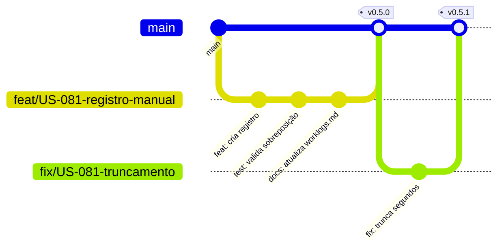
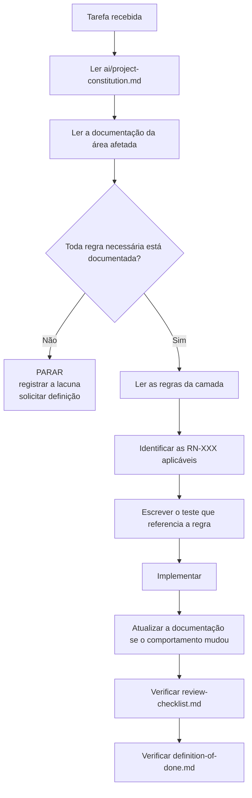

# Diretrizes de Código — DevTime

## 1. Objetivo

Estabelecer as convenções gerais de código, versionamento, commits, documentação e colaboração aplicáveis a **todo** o repositório, independentemente da linguagem. As regras específicas de cada camada estão em [`backend-rules.md`](backend-rules.md) e [`frontend-rules.md`](frontend-rules.md).

## 2. Escopo

| Dentro | Fora |
|---|---|
| Convenções transversais de código e nomenclatura | Regras específicas de backend (`backend-rules.md`) |
| Estrutura do repositório | Regras específicas de frontend (`frontend-rules.md`) |
| Commits, branches, versionamento e PRs | Checklist de revisão (`review-checklist.md`) |
| Comentários, documentação e tratamento de erro | Definition of Done (`definition-of-done.md`) |

## 3. Definições

| Termo | Definição |
|---|---|
| **Agente** | Qualquer executor (humano ou IA) que produza código a partir desta documentação. |
| **Convenção** | Padrão obrigatório, verificável em revisão ou automaticamente. |
| **Commit convencional** | Formato estruturado de mensagem de commit. |
| **SemVer** | Versionamento semântico `MAJOR.MINOR.PATCH`. |

---

## 4. Princípios de código

| # | Princípio | Aplicação prática |
|---|---|---|
| CG-01 | **A documentação é a fonte de verdade** | Código que diverge de `docs/` é bug do código ou da documentação — nunca uma exceção não documentada (ART-110) |
| CG-02 | **Nenhuma regra de negócio é inventada** | Encontrou lacuna? Pare, registre, pergunte. Não decida sozinho |
| CG-03 | **Explicitação vence concisão** | Código óbvio para quem chega em 6 meses vale mais que código curto |
| CG-04 | **Nomes revelam intenção** | `netMinutes`, não `min`; `assertNoOverlap`, não `check` |
| CG-05 | **Cada unidade faz uma coisa** | Método com "e" no nome provavelmente faz duas |
| CG-06 | **Falhe cedo e alto** | Estado inválido lança exceção; nunca degrada silenciosamente |
| CG-07 | **Toda regra referencia seu identificador** | `// RN-102: sessões do mesmo usuário não podem se sobrepor` |
| CG-08 | **Simetria** | Código semelhante resolve problemas semelhantes da mesma forma |
| CG-09 | **Sem código morto** | Código não usado é removido, não comentado. O histórico do versionamento existe para isso |
| CG-10 | **Sem otimização especulativa** | Otimize com medição, não com suposição |

---

## 5. Estrutura do repositório

```
devtime/
├── .github/
│   ├── workflows/            # pipelines
│   ├── PULL_REQUEST_TEMPLATE.md
│   └── ISSUE_TEMPLATE/
├── docs/                     # fonte de verdade
├── backend/
│   ├── src/main/java/com/devtime/
│   ├── src/main/resources/
│   │   ├── db/migration/     # Flyway
│   │   ├── templates/mail/
│   │   └── application*.yml
│   └── src/test/
├── frontend/
│   ├── src/app/
│   ├── src/assets/
│   └── src/styles/
├── infra/
│   ├── docker/
│   ├── docker-compose.yml
│   └── scripts/
├── .env.example
├── README.md
└── CHANGELOG.md
```

| # | Regra |
|---|---|
| RE-01 | `docs/` está no mesmo repositório do código — documentação em repositório separado desatualiza |
| RE-02 | Nenhum arquivo com segredo é versionado; `.env.example` contém apenas nomes e descrições |
| RE-03 | `README.md` permite subir o ambiente em até 3 comandos |
| RE-04 | `CHANGELOG.md` segue o formato Keep a Changelog |
| RE-05 | Nenhum artefato de build é versionado |

---

## 6. Nomenclatura universal

### 6.1 Regras gerais

| # | Regra |
|---|---|
| NM-01 | Todo nome de conceito de domínio vem do glossário (`00-overview/glossary.md`) |
| NM-02 | Termos proibidos do glossário nunca aparecem em código |
| NM-03 | Nomes em **inglês** no código; **português** apenas na interface e em mensagens ao usuário |
| NM-04 | Sem abreviação, exceto siglas consagradas (`id`, `url`, `api`, `dto`, `http`) |
| NM-05 | Booleano usa prefixo `is`, `has`, `can`, `should` |
| NM-06 | Coleção usa plural |
| NM-07 | Método que retorna booleano é uma pergunta (`isLocked`, `hasOverlap`) |
| NM-08 | Método que valida e lança exceção usa prefixo `assert` |
| NM-09 | Método que retorna ou lança usa prefixo `require` |
| NM-10 | Nomes genéricos são proibidos: `data`, `info`, `value`, `item`, `manager`, `helper`, `util`, `handler`, `process` |

### 6.2 Sufixos com significado fixo

| Sufixo | Significado | Exemplo |
|---|---|---|
| `*Minutes` | Duração em minutos inteiros | `netMinutes` |
| `*At` | Instante (`TIMESTAMPTZ`) | `createdAt`, `lockedAt` |
| `*Date` | Data de calendário | `workDate`, `startDate` |
| `*Id` | Identificador UUID | `contractId` |
| `*Count` | Contagem inteira | `editCount` |
| `*Rate` | Percentual ou taxa | `consumptionRate` |
| `*Policy` | Estratégia configurável | `RolloverPolicy` |
| `*Request` / `*Response` | DTO de entrada/saída | `WorkLogCreateRequest` |
| `*Event` | Evento de domínio | `WorkLogCreatedEvent` |

### 6.3 Exemplos comparativos

| ❌ Proibido | ✅ Correto | Motivo |
|---|---|---|
| `float hours` | `int netMinutes` | ART-034 |
| `boolean deleted` | `Instant deletedAt` | Padrão de soft delete |
| `double amount` | `BigDecimal amount` + `String currency` | ART-040/041 |
| `getData()` | `getWorkLogsByPeriod()` | NM-10 |
| `TimeEntry` | `WorkLog` | Glossário |
| `Task` | `Ticket` | Glossário |
| `check(x)` | `assertNoOverlap(x)` | NM-08 |
| `Utils.calc()` | `DurationCalculator.netMinutes()` | NM-10 |

---

## 7. Comentários e documentação

| # | Regra |
|---|---|
| CM-01 | Comentário explica **por quê**, nunca **o quê** |
| CM-02 | Toda validação de regra de negócio referencia seu identificador `RN-XXX` |
| CM-03 | Toda decisão não óbvia explica a alternativa rejeitada |
| CM-04 | Comentário desatualizado é pior que ausência de comentário — atualize ou remova |
| CM-05 | `TODO` exige identificador de issue: `// TODO(#142): ...` |
| CM-06 | `FIXME` e `HACK` são proibidos na branch principal |
| CM-07 | Código comentado é proibido (CG-09) |
| CM-08 | Documentação de método público descreve contrato, exceções e efeitos colaterais |

**Exemplos:**

```java
// ❌ Descreve o óbvio
// incrementa o contador
editCount++;

// ✅ Explica a razão
// RN-123: editCount alimenta a contra-métrica de qualidade de captura.
// Índice alto indica formulário ruim, não flexibilidade desejada.
editCount++;

// ✅ Documenta a alternativa rejeitada
// A validação de sobreposição fica na aplicação, não em constraint EXCLUDE,
// porque precisamos retornar o registro conflitante ao usuário (RN-102, §5.4
// de database.md). O índice idx_work_logs_overlap dá suporte à consulta.
overlapValidator.assertNoOverlap(userId, range, excludeId);
```

---

## 8. Tratamento de erro

| # | Regra |
|---|---|
| ER-01 | Nunca capturar exceção sem tratar ou relançar |
| ER-02 | Nunca capturar `Exception` genérica fora do tratamento global |
| ER-03 | Exceção de negócio referencia o código `DEVTIME-XXXX` |
| ER-04 | Mensagem de exceção descreve o problema e o contexto, sem dado sensível |
| ER-05 | Nunca usar exceção para controle de fluxo normal |
| ER-06 | Nunca retornar `null` para indicar erro; usar `Optional` ou lançar |
| ER-07 | Toda exceção não tratada é registrada com `traceId` |
| ER-08 | Falha em operação não essencial degrada; falha em operação essencial propaga |

---

## 9. Versionamento e branches

### 9.1 Modelo de branches



| Tipo | Padrão | Exemplo |
|---|---|---|
| Funcionalidade | `feat/US-XXX-descricao-curta` | `feat/US-081-registro-manual` |
| Correção | `fix/US-XXX-descricao` ou `fix/issue-NNN` | `fix/issue-142-truncamento` |
| Refatoração | `refactor/descricao` | `refactor/extrai-balance-calculator` |
| Documentação | `docs/descricao` | `docs/atualiza-regras-carry-over` |
| Infraestrutura | `chore/descricao` | `chore/atualiza-testcontainers` |
| Correção urgente | `hotfix/descricao` | `hotfix/vazamento-tenant` |

| # | Regra |
|---|---|
| BR-01 | `main` está sempre implantável |
| BR-02 | Nenhum commit direto em `main`; sempre por PR |
| BR-03 | Branch de funcionalidade vive no máximo 3 dias |
| BR-04 | Rebase sobre `main` antes do merge; sem merge commits desnecessários |
| BR-05 | Branch é excluída após o merge |
| BR-06 | `hotfix` pode pular staging, mas nunca os gates de teste |

### 9.2 Versionamento semântico

| Componente | Incrementa quando |
|---|---|
| `MAJOR` | Mudança incompatível de contrato de API |
| `MINOR` | Nova funcionalidade compatível |
| `PATCH` | Correção compatível |

| # | Regra |
|---|---|
| VR-01 | A API é versionada por path (`/api/v1`); `MAJOR` da aplicação não altera a versão da API |
| VR-02 | Mudança incompatível de API exige nova versão de path e depreciação de 12 meses |
| VR-03 | Toda versão gera entrada no `CHANGELOG.md` |
| VR-04 | Antes do lançamento, a versão permanece `0.x.y` |

---

## 10. Commits

**Formato obrigatório (Conventional Commits):**

```
<tipo>(<escopo>): <descrição imperativa em minúsculas>

[corpo opcional explicando o porquê]

[rodapé opcional com referências]
```

| Tipo | Uso |
|---|---|
| `feat` | Nova funcionalidade |
| `fix` | Correção de bug |
| `refactor` | Mudança sem alterar comportamento |
| `perf` | Melhoria de desempenho |
| `test` | Adição ou correção de teste |
| `docs` | Documentação |
| `style` | Formatação sem mudança de lógica |
| `build` | Build, dependências |
| `ci` | Pipeline |
| `chore` | Manutenção sem impacto em código de produção |
| `revert` | Reversão |

**Escopos válidos:** `auth`, `tenant`, `client`, `contract`, `period`, `ticket`, `worklog`, `timer`, `category`, `tag`, `report`, `notification`, `attachment`, `audit`, `ui`, `infra`, `docs`.

| # | Regra |
|---|---|
| CO-01 | Descrição no imperativo, minúscula, sem ponto final, com no máximo 72 caracteres |
| CO-02 | Um commit resolve **um** problema |
| CO-03 | O corpo explica o porquê quando não for óbvio |
| CO-04 | Referências no rodapé: `Refs: US-081`, `Closes: #142`, `Regra: RN-102` |
| CO-05 | Mudança incompatível usa `!` após o escopo e `BREAKING CHANGE:` no rodapé |
| CO-06 | Nenhum commit quebra o build |

**Exemplos:**

```
feat(worklog): impede sobreposição de sessões do mesmo usuário

Intervalos são tratados como semi-abertos [início, fim), permitindo
que sessões consecutivas se toquem exatamente sem conflito.

Refs: US-083
Regra: RN-102
```

```
fix(timer)!: preserva o cronômetro quando a validação falha

Antes, uma falha ao gerar o registro descartava o cronômetro e o tempo
trabalhado era perdido. Agora o cronômetro permanece no estado anterior
e a resposta indica timerPreserved.

BREAKING CHANGE: a resposta de erro de /timers/current/stop passa a
incluir os campos timerPreserved e recovery.

Refs: US-080
Regra: RN-160
Closes: #187
```

---

## 11. Pull Requests

### 11.1 Modelo obrigatório

```markdown
## O que muda
Descrição objetiva da mudança.

## Por quê
Motivação e problema resolvido.

## Rastreabilidade
- Story: US-XXX
- Requisito: RF-XXX
- Regras: RN-XXX, RN-YYY
- Documentos atualizados: docs/...

## Como testar
Passos para verificação manual.

## Checklist
- [ ] Documentação atualizada no mesmo PR (ART-111)
- [ ] Testes cobrindo as regras referenciadas (ART-101)
- [ ] Teste de isolamento entre tenants, se houver endpoint novo
- [ ] Nenhuma regra de negócio criada sem documentação prévia
- [ ] Sem segredo, dado sensível ou código morto
- [ ] Migrations seguem as regras de compatibilidade
```

| # | Regra |
|---|---|
| PR-01 | PR com mais de 400 linhas alteradas deve ser dividido |
| PR-02 | PR sem rastreabilidade a uma story é rejeitado |
| PR-03 | PR que altera comportamento sem atualizar a documentação é rejeitado |
| PR-04 | Ao menos uma aprovação; duas em mudanças de segurança ou de cálculo |
| PR-05 | Todos os gates verdes antes do merge |
| PR-06 | O autor não aprova o próprio PR |
| PR-07 | Comentário de revisão não resolvido bloqueia o merge |

---

## 12. Formatação e ferramentas

| Aspecto | Backend | Frontend |
|---|---|---|
| Formatador | Spotless com Google Java Format (AOSP) | Prettier |
| Linter | Checkstyle + SpotBugs | ESLint + Angular ESLint |
| Largura de linha | 120 | 120 |
| Indentação | 4 espaços | 2 espaços |
| Aspas | — | Simples |
| Ponto e vírgula | Obrigatório | Obrigatório |
| Import curinga | Proibido | Proibido |
| Verificação | Bloqueia o build | Bloqueia o build |

| # | Regra |
|---|---|
| FT-01 | Formatação é responsabilidade da ferramenta, nunca do revisor |
| FT-02 | Formatação automática executa antes do commit |
| FT-03 | Nenhum PR contém alteração puramente de formatação misturada a lógica |

---

## 13. Dependências

| # | Regra |
|---|---|
| DP-01 | Toda dependência nova exige justificativa no PR |
| DP-02 | Verificar: licença compatível, manutenção ativa, alternativa nativa avaliada |
| DP-03 | Nenhuma dependência com CVE `HIGH`/`CRITICAL` |
| DP-04 | Versões fixadas; sem faixas abertas |
| DP-05 | Dependência apenas de teste nunca entra no artefato de produção |
| DP-06 | Atualizações de segurança têm prioridade sobre funcionalidades |

---

## 14. Protocolo para agentes de IA

### 14.1 Antes de escrever qualquer código



### 14.2 Regras invioláveis para agentes

| # | Regra |
|---|---|
| IA-01 | **Nunca invente regra de negócio.** Lacuna na documentação é bloqueio, não convite à criatividade |
| IA-02 | **Nunca contorne uma proibição da constituição.** Se ela impede o trabalho, abra ADR |
| IA-03 | **Nunca altere migration já mesclada.** Crie uma nova |
| IA-04 | **Nunca desabilite um teste** para fazer o build passar |
| IA-05 | **Nunca reduza uma meta de cobertura** para atingir o gate |
| IA-06 | **Nunca implemente sem teste** que referencie a regra |
| IA-07 | **Nunca altere comportamento sem atualizar a documentação** no mesmo PR |
| IA-08 | **Nunca use termo proibido** do glossário |
| IA-09 | **Nunca exponha entidade JPA** na API |
| IA-10 | **Nunca escreva consulta sem filtro de tenant** fora de `@CrossTenant` justificado |
| IA-11 | Ao encontrar contradição entre documentos, siga a hierarquia: Constituição > `02-domain/` > `03-architecture/` > `04-api/` > demais |
| IA-12 | Ao encontrar erro na documentação, **reporte**; não implemente o que julga correto |

### 14.3 Formato de reporte de lacuna

```markdown
## Lacuna de especificação

**Tarefa:** US-XXX — descrição
**Documento consultado:** docs/02-domain/business-rules.md §X
**Lacuna:** <o que não está definido>
**Impacto:** <o que fica bloqueado>
**Opções identificadas:**
| Opção | Prós | Contras |
|---|---|---|
| A | ... | ... |
| B | ... | ... |
**Recomendação:** <opção> porque <motivo>
**Aguardando decisão para prosseguir.**
```

---

## 15. Casos especiais

| # | Caso | Tratamento |
|---|---|---|
| CE-G-01 | Regra técnica impossível de cumprir | Abrir ADR; não contornar silenciosamente |
| CE-G-02 | Documentação contraditória | Seguir a hierarquia (IA-11) e reportar a contradição |
| CE-G-03 | Correção urgente em produção | Gates de teste continuam obrigatórios; teste de reprodução é exigido |
| CE-G-04 | Refatoração ampla necessária | PR separado, sem mistura com mudança de comportamento |
| CE-G-05 | Dependência crítica descontinuada | ADR com plano de migração |
| CE-G-06 | Código legado sem teste | Escrever teste caracterizando o comportamento antes de alterar |
| CE-G-07 | Conflito entre convenção e biblioteca | A biblioteca vence apenas na fronteira de integração; o domínio mantém a convenção |

## 16. Casos de erro

| Situação | Consequência |
|---|---|
| Commit fora do formato convencional | Bloqueado por hook |
| PR sem rastreabilidade | Rejeitado |
| Regra implementada sem documentação prévia | Revertido |
| Termo proibido em código | Bloqueado na revisão |
| Segredo versionado | Rotação imediata da credencial + reversão |
| Teste desabilitado sem issue | Build falha |
| Migration alterada após merge | Revertido |

## 17. Critérios de aceite

| # | Critério |
|---|---|
| CA-01 | Formatação e lint são verificados automaticamente e bloqueiam o build |
| CA-02 | Nenhum commit na branch principal está fora do formato convencional |
| CA-03 | Todo PR possui rastreabilidade a story, requisito e regras |
| CA-04 | Nenhum termo proibido do glossário aparece no código |
| CA-05 | Nenhum `TODO` sem issue vinculada |
| CA-06 | Nenhum segredo versionado, verificado por scanner |
| CA-07 | Toda dependência possui justificativa registrada |

## 18. Dependências e impactos

| Documento | Relação |
|---|---|
| `project-constitution.md` | Fonte normativa das proibições |
| `backend-rules.md` | Especializa estas diretrizes para o backend |
| `frontend-rules.md` | Especializa para o frontend |
| `review-checklist.md` | Operacionaliza a verificação |
| `definition-of-done.md` | Define quando o trabalho está concluído |
| `00-overview/glossary.md` | Fonte dos nomes válidos |

**Impacto:** alterar uma convenção de nomenclatura ou de commit afeta todo o repositório e o histórico futuro; exige registro e comunicação explícita.
