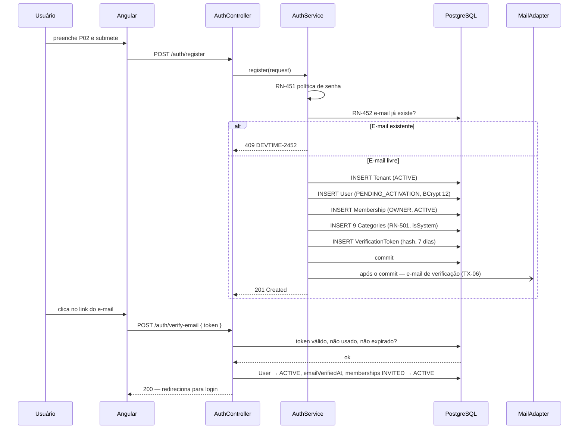
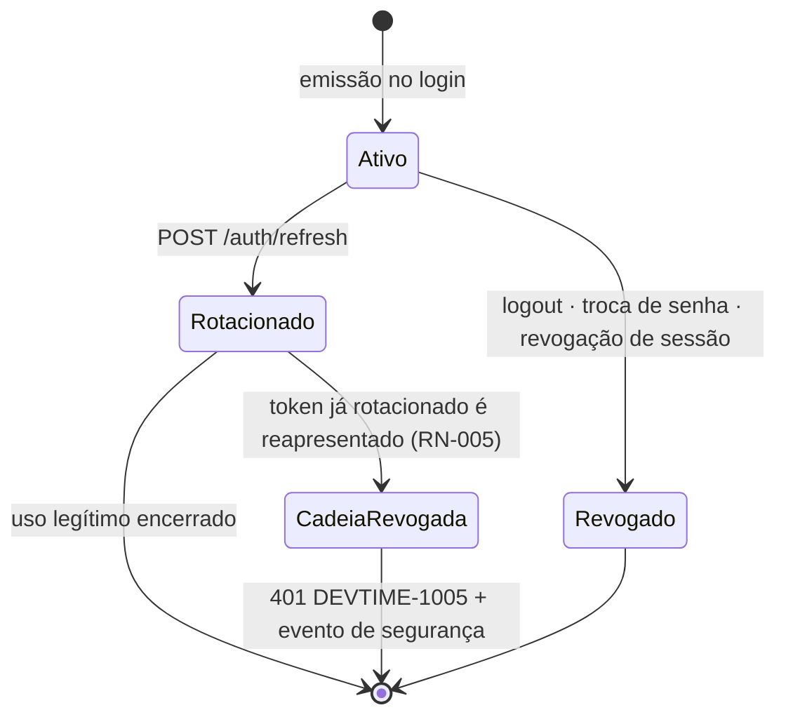
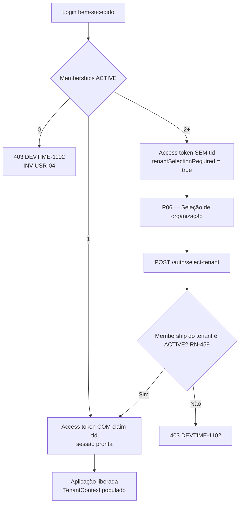

# 001 — Authentication

| Campo | Valor |
|---|---|
| **Feature** | 001 |
| **Épico** | EP-02 (Autenticação e Conta) · EP-03 (Base Multi-tenant) |
| **Sprint** | S2 |
| **Prioridade** | P0 |
| **Complexidade** | Alta |
| **Estimativa** | 34 pts · 8 dias-agente |
| **Stories** | US-010 a US-013, US-015 a US-024 |
| **Status** | SPEC_APPROVED |

## 1. Objetivo

Prover o ciclo completo de identidade e sessão do DevTime: cadastro com criação do tenant, verificação de e-mail, autenticação, seleção de organização, renovação rotativa de token, encerramento de sessão, recuperação e alteração de senha — produzindo o `TenantContext` do qual toda outra funcionalidade depende.

## 2. Problema que resolve

Sem sessão autenticada e sem tenant selecionado, nenhuma consulta do sistema pode ser filtrada com segurança (ART-021). Esta feature é o **único** ponto onde `userId`, `tenantId`, `role` e `permissions` entram no sistema. Ela também resolve a dor de entrada do usuário: cadastrar-se e estar operando em menos de dois minutos, sem configuração manual de organização, fuso ou categorias (PR-01).

## 3. Escopo

| # | Item | Referência |
|---|---|---|
| E-01 | Cadastro de conta com criação simultânea de `User`, `Tenant` e `Membership` OWNER | RN-452, INV-TEN-02 |
| E-02 | Seed automático das 9 categorias padrão na criação do tenant | RN-501 |
| E-03 | Verificação de e-mail com token de 7 dias, de uso único | §4.2 `state-machines.md` |
| E-04 | Reenvio de verificação com invalidação do token anterior | RN-457 |
| E-05 | Login com bloqueio após 5 falhas em 15 minutos | RN-453 |
| E-06 | Emissão de access token JWT (15 min) e refresh token opaco (30 dias) | ART-080 |
| E-07 | Rotação de refresh token com detecção de reuso e revogação em cadeia | RN-005, INV-RFT-01 |
| E-08 | Listagem e seleção de tenant; token de pré-seleção sem claim `tid` | CE-P-11 |
| E-09 | Logout da sessão corrente e de todas as sessões | — |
| E-10 | Recuperação de senha com token de 1 hora, uso único | RN-461 |
| E-11 | Alteração de senha com revogação das demais sessões | RN-454 |
| E-12 | Gestão de sessões ativas (listar e revogar) | US-020 |
| E-13 | Consulta e aceite de convite por token | RN-457 |
| E-14 | `GET /auth/me` com usuário, tenant, papel e permissões efetivas | — |
| E-15 | Guards, interceptor de autenticação com fila de refresh e telas P01–P07 | §7.3 `frontend.md` |

## 4. Fora do escopo

| Item | Onde está | Motivo |
|---|---|---|
| Edição de perfil e preferências | `002-users` | É gestão de conta, não de sessão |
| Configurações do tenant | `002-users` | Idem |
| Convite de membros (emissão) | `002-users` / `future/016-teams` | Aqui só se consome e aceita o token |
| Matriz de permissões por papel | `docs/02-domain/permissions.md` | Esta feature apenas **carrega** o conjunto |
| MFA / TOTP | `future/017-permissions` | Fora do MVP |
| SSO / OAuth externo | `future/019-public-api` | Fora do MVP |
| Chaves de API | `future/019-public-api` | F8 |

## 5. Dependências

### 5.1 Features
| Feature | Tipo | O que consome |
|---|---|---|
| F0 — Fundação | Bloqueante | `BaseEntity`, `TenantContext`, `GlobalExceptionHandler`, Flyway, pipeline |
| `005-categories` | Consumidora invertida | O seed de RN-501 roda no cadastro; a feature 005 fornece a entidade e o serviço de seed |

> **Nota de sequência:** o seed de categorias é executado por `001`, mas a entidade `Category` pertence a `005`. Para não inverter a ordem, `001` chama `CategorySeedService` por sua **interface pública** e `005` é implementada logo em seguida (ordem 3). No S2, o seed pode ser entregue como migration de dados até que `005` exista — decisão registrada em §39.

### 5.2 Documentos obrigatórios
| Documento | Seções relevantes |
|---|---|
| `docs/04-api/authentication.md` | §5 completa — contratos exatos |
| `docs/02-domain/business-rules.md` | RN-001 a RN-012, RN-451 a RN-461 |
| `docs/02-domain/state-machines.md` | §4.1 Tenant, §4.2 User, §4.3 Membership |
| `docs/02-domain/permissions.md` | §4 ordem de verificação, §7 matriz |
| `docs/02-domain/entities.md` | §6.1 Tenant, §6.2 User, §6.3 Membership, §6.19 RefreshToken |
| `docs/03-architecture/security.md` | JWT, BCrypt, rate limit, headers |
| `docs/05-ui/pages.md` | P01 a P07 |

### 5.3 Infraestrutura
| Componente | Uso |
|---|---|
| PostgreSQL | `users`, `tenants`, `memberships`, `refresh_tokens`, `verification_tokens` |
| Provedor de e-mail | Verificação, redefinição de senha, alerta de segurança |
| Rate limiter de borda | 5/h no cadastro, 10/min no login (ART-073) |

## 6. Regras de negócio

| ID | Tipo | Enunciado resumido | Erro | Onde é aplicada |
|---|---|---|---|---|
| RN-451 | Bloqueante | Senha ≥ 10 caracteres, com maiúscula, minúscula e dígito, fora de lista comum | `DEVTIME-2451` / 422 | `PasswordPolicyValidator` |
| RN-452 | Bloqueante | E-mail único global entre não excluídos, normalizado em minúsculas | `DEVTIME-2452` / 409 | `AuthService.register` |
| RN-453 | Automática | 5 falhas em 15 min ⇒ bloqueio de 30 min; zera em login bem-sucedido | `DEVTIME-1006` / 423 | `LoginAttemptService` |
| RN-454 | Automática | Troca de senha atualiza `passwordChangedAt` e revoga todos os refresh tokens exceto o corrente | — | `AuthService.changePassword` |
| RN-455 | Bloqueante | Sempre ao menos um `OWNER` ativo por tenant | `DEVTIME-2455` / 409 | Validado no cadastro (cria o OWNER) |
| RN-457 | Automática | Convite expira em 7 dias; reenvio invalida o token anterior | `DEVTIME-2457` / 410 | `InvitationService` |
| RN-459 | Bloqueante | Membership `SUSPENDED`/`REMOVED` não autentica no tenant, mas mantém acesso a outros | `DEVTIME-1102` / 403 | `TenantSelectionService` |
| RN-461 | Bloqueante | Token de redefinição expira em 1 hora e é de uso único | `DEVTIME-1007` / 410 | `PasswordResetService` |
| RN-005 | Automática | Reuso de refresh token rotacionado revoga toda a cadeia e registra evento de segurança | `DEVTIME-1005` / 401 | `RefreshTokenService` |
| RN-501 | Automática | Criação de tenant gera as 9 categorias padrão com `isSystem = true` | — | `CategorySeedService` |
| RN-007 | Bloqueante | Tenant `SUSPENDED` permite apenas leitura | `DEVTIME-1201` / 403 | `TenantContextFilter` |
| RN-008 | Bloqueante | Tenant `CANCELLED` rejeita acesso após 30 dias de retenção | `DEVTIME-1202` / 403 | `TenantContextFilter` |
| RN-002 | Bloqueante | Recurso de outro tenant retorna `404`, nunca `403` | `DEVTIME-2002` / 404 | Toda a aplicação |

### 6.1 Ordem de aplicação — login

| # | Verificação | Falha |
|---|---|---|
| 1 | Rate limit por IP + e-mail | `429` |
| 2 | Usuário existe (busca `@CrossTenant`) | Resposta genérica — ver §19 |
| 3 | `status ≠ LOCKED` ou `lockedUntil` expirado (RN-453) | `423 DEVTIME-1006` |
| 4 | Senha confere (BCrypt custo 12) | `401 DEVTIME-1001` + incremento de tentativa |
| 5 | `status = ACTIVE` (e-mail verificado) | `403 DEVTIME-1008` |
| 6 | Existe ao menos um `Membership ACTIVE` (INV-USR-04) | `403 DEVTIME-1003` |
| 7 | Um único membership ⇒ emite token com `tid`; múltiplos ⇒ token de pré-seleção | — |

**Por que a ordem é esta:** o bloqueio (3) precede a verificação de senha (4) para que uma conta bloqueada não sirva de oráculo de senha correta. A verificação de e-mail (5) vem **depois** da senha para que um atacante não descubra quais e-mails existem e estão pendentes de ativação.

### 6.2 Ordem de aplicação — autorização de toda requisição (§4.1 de `permissions.md`)

| # | Verificação | Falha |
|---|---|---|
| 1 | Token válido e não expirado | `401 DEVTIME-1001` |
| 2 | Claim `tid` presente | `401 DEVTIME-1002` |
| 3 | Status do tenant (`SUSPENDED` bloqueia escrita, `CANCELLED` bloqueia tudo) | `403 DEVTIME-1201`/`1202` |
| 4 | Membership `ACTIVE` | `403 DEVTIME-1102` |
| 5 | Papel possui a permissão | `403 DEVTIME-1101` |
| 6 | Recurso pertence ao tenant | `404 DEVTIME-2002` |
| 7 | Ownership | `403 DEVTIME-1103` |
| 8 | Guarda de estado | `409`/`422` |

### 6.3 Invariantes envolvidas
| ID | Invariante | Como é garantida |
|---|---|---|
| INV-USR-01 | `email` único entre não excluídos | Índice único parcial + verificação no service |
| INV-USR-02 | `passwordHash` nunca retornado | Ausente de todo Response DTO; teste de contrato |
| INV-USR-03 | `LOCKED` exige `lockedUntil` | Preenchido na mesma operação |
| INV-USR-04 | Sem membership ativo, não seleciona tenant | Verificação 6 do login |
| INV-TEN-01 | `slug` único global | Índice único + geração com sufixo numérico em colisão |
| INV-TEN-02 | Todo tenant tem ao menos um OWNER | Cadastro cria `Membership` OWNER na mesma transação |
| INV-MEM-01 | `(tenantId, userId)` único | Índice único parcial |
| INV-RFT-01 | Reuso de token rotacionado revoga a cadeia | `replacedById` + verificação no refresh |

## 7. Fluxo principal — cadastro e primeiro acesso

1. Usuário submete e-mail, senha, nome completo, nome da organização, fuso e aceite dos termos em `/auth/register` (P02).
2. `AuthService` valida formato (Bean Validation), política de senha (RN-451) e unicidade do e-mail (RN-452).
3. Em uma **única transação**: cria `Tenant` (`ACTIVE`, `slug` derivado do nome), `User` (`PENDING_ACTIVATION`, hash BCrypt custo 12) e `Membership` (`role = OWNER`, `status = ACTIVE`, `acceptedAt = now()`).
4. Aciona o seed das 9 categorias padrão (RN-501) na mesma transação.
5. Gera `VerificationToken` (validade 7 dias, armazenado como hash).
6. **Após o commit**, envia o e-mail de verificação. Falha no envio não desfaz o cadastro (TX-06, AQ-09).
7. Retorna `201` com `userId`, `tenantId` e `verificationEmailSent`.
8. Usuário abre o link, o front chama `POST /auth/verify-email` (P03); `User` passa a `ACTIVE`, `emailVerifiedAt` é preenchido e memberships `INVITED` do usuário são ativados.
9. Usuário faz login (P01). Com um único tenant, recebe access token já com `tid` e a sessão está pronta.
10. `authInterceptor` passa a anexar `Authorization: Bearer` em toda requisição; `authGuard` e `tenantSelectedGuard` liberam a navegação.

## 8. Fluxos alternativos

| # | Fluxo | Gatilho | Comportamento |
|---|---|---|---|
| FA-01 | Múltiplos tenants | Login de usuário com 2+ memberships ativos | Retorna token de **pré-seleção** (sem `tid`) e `tenants[]`; front redireciona para P06; apenas `/auth/tenants` e `/auth/select-tenant` respondem (CE-P-11) |
| FA-02 | E-mail não verificado | Login com `PENDING_ACTIVATION` | `403 DEVTIME-1004` com ação "reenviar verificação" |
| FA-03 | Conta bloqueada | 5ª falha em 15 min | `423 DEVTIME-1006` com `lockedUntil`; e-mail de alerta de segurança |
| FA-04 | Access token expirado | `401` em qualquer requisição | `authInterceptor` chama `/auth/refresh` **uma vez**, com fila compartilhada, e reenvia a original |
| FA-05 | Refresh reusado | Token já rotacionado é apresentado | Revoga toda a cadeia (RN-005), `401 DEVTIME-1005`, evento de segurança, sessão limpa e redirecionamento para login |
| FA-06 | Esqueci a senha | P04 | Sempre `202`, mesmo com e-mail inexistente (§19). E-mail com token de 1 hora, uso único |
| FA-07 | Troca de senha autenticada | P26 | Exige senha atual; revoga todos os refresh tokens exceto o corrente (RN-454) |
| FA-08 | Aceite de convite | Link de convite | `GET /auth/invitations/{token}` exibe tenant e papel; aceite ativa o membership. Usuário inexistente é levado ao cadastro com e-mail pré-preenchido e imutável |
| FA-09 | Convite expirado | Token com mais de 7 dias | `410 DEVTIME-2457` com ação "solicitar novo convite" |
| FA-10 | Membership suspenso durante a sessão | Token válido, membership `SUSPENDED` | Verificação 4 rejeita com `403 DEVTIME-1102` (CE-P-09) |
| FA-11 | Papel alterado durante a sessão | `MEMBER_UPDATE_ROLE` em outro contexto | Access tokens do usuário no tenant são invalidados (IMP-04); próximo refresh traz o novo papel |
| FA-12 | Logout de todas as sessões | P26 | Revoga todos os refresh tokens do usuário, inclusive o corrente |

## 9. Diagramas

### 9.1 Cadastro e verificação

### 9.2 Rotação de refresh e detecção de reuso

### 9.3 Decisão de seleção de tenant

## 10. Estados

### 10.1 `User`
| Estado | Significado | Operações permitidas | Operações bloqueadas |
|---|---|---|---|
| `PENDING_ACTIVATION` | Cadastrado, e-mail não verificado | Verificar e-mail, reenviar verificação | Login (`DEVTIME-1004`) |
| `ACTIVE` | Operacional | Todas | — |
| `LOCKED` | Bloqueio temporário por falhas | Aguardar expiração, desbloqueio por admin | Login (`DEVTIME-1006`) |
| `DISABLED` | Desativado | Reativação por admin | Todas |

### 10.2 `Membership`
| Estado | Significado | Operações permitidas | Operações bloqueadas |
|---|---|---|---|
| `INVITED` | Convite enviado | Aceitar, revogar | Autenticar no tenant |
| `ACTIVE` | Vínculo válido | Todas conforme o papel | — |
| `SUSPENDED` | Suspenso | Reativação | Autenticar no tenant (`DEVTIME-1102`) |
| `REMOVED` | Removido (terminal) | — | Todas. Readmissão exige novo convite |

## 11. Transições

| Origem | Destino | Gatilho | Guarda | Efeito | Permissão |
|---|---|---|---|---|---|
| — | `User.PENDING_ACTIVATION` | Cadastro ou convite | E-mail único (RN-452) | E-mail de verificação (7 dias) | Pública |
| `PENDING_ACTIVATION` | `User.ACTIVE` | Token de verificação | Não expirado, não usado | `emailVerifiedAt`; ativa memberships `INVITED` | Pública |
| `ACTIVE` | `User.LOCKED` | 5 falhas em 15 min | — | `lockedUntil = now()+30min`; e-mail de alerta | Automática |
| `LOCKED` | `User.ACTIVE` | Expiração ou ação de admin | `now() > lockedUntil` ou ADMIN/OWNER | Zera `failedLoginAttempts` | Automática / ADMIN |
| — | `Membership.INVITED` | Convite | Sem membership ativo do mesmo usuário | `invitedAt` | `MEMBER_INVITE` |
| `INVITED` | `Membership.ACTIVE` | Aceite | Convite não expirado (RN-457) | `acceptedAt` | Pública com token |
| `INVITED` | `Membership.REMOVED` | Expiração ou revogação | — | Invalida o token | Automática |

### 11.1 Transições proibidas
| Transição | Motivo da proibição |
|---|---|
| `LOCKED → DISABLED` direto | O bloqueio não pode ser usado como via de desativação silenciosa; deve passar por `ACTIVE` |
| `PENDING_ACTIVATION → LOCKED` | Não há login possível antes da verificação; o contador não se aplica |
| `Membership.REMOVED → *` | Readmissão gera novo `Membership`, preservando o histórico do vínculo anterior |
| `Tenant.CANCELLED → *` | Reativação exige processo manual de suporte registrado em auditoria |

## 12. Casos de erro

> **Precedência.** Esta tabela foi **sincronizada com `docs/04-api/authentication.md` §8**, que é
> normativa sobre o contrato de erro da API (`specs/README.md` §1: `docs/` é a fonte de verdade,
> `specs/` é o recorte executável). A versão anterior atribuía `DEVTIME-1003` a "credenciais
> inválidas" e `DEVTIME-1004` a "e-mail não verificado", divergindo do documento de API. A
> divergência foi reportada e resolvida em favor de `docs/`.

| Código | HTTP | Situação | Mensagem ao usuário | Regra |
|---|:--:|---|---|---|
| `DEVTIME-1001` | 401 | Token ausente, inválido ou expirado **ou credenciais inválidas** | Autenticação necessária | §19, AU-01 |
| `DEVTIME-1002` | 401 | Tenant não selecionado no token | Selecione uma organização | CE-P-11 |
| `DEVTIME-1003` | 403 | Usuário sem organização ativa | Você não possui acesso ativo a nenhuma organização | INV-USR-04 |
| `DEVTIME-1004` | 401 | Refresh token ausente, inválido ou expirado | Sua sessão expirou | CX-06 |
| `DEVTIME-1005` | 401 | Refresh token reusado | Sua sessão foi encerrada por segurança | RN-005 |
| `DEVTIME-1006` | 423 | Conta bloqueada | Conta bloqueada temporariamente. Tente novamente às HH:MM | RN-453 |
| `DEVTIME-1007` | 410 | Token de redefinição expirado ou usado | Link expirado. Solicite um novo | RN-461 |
| `DEVTIME-1008` | 403 | E-mail não verificado | Verifique seu e-mail para continuar | §4.2 SM |
| `DEVTIME-1009` | 410 | Token de verificação expirado | Link expirado. Solicite um novo e-mail | §4.2 SM |
| `DEVTIME-1010` | 404 | Token de verificação inválido | Link de verificação inválido | — |
| `DEVTIME-1011` | 422 | Senha atual incorreta | A senha atual informada está incorreta | PW-05 |
| `DEVTIME-1012` | 422 | Nova senha igual à atual | A nova senha deve ser diferente da atual | — |
| `DEVTIME-1102` | 403 | Membership inativo, suspenso ou removido | Seu acesso a esta organização foi revogado | RN-459 |
| `DEVTIME-1201` | 403 | Tenant suspenso, operação de escrita | Organização suspensa: apenas leitura | RN-007 |
| `DEVTIME-1202` | 403 | Tenant cancelado | Organização cancelada | RN-008 |
| `DEVTIME-2451` | 422 | Senha fora da política | Senha não atende aos requisitos | RN-451 |
| `DEVTIME-2452` | 409 | E-mail já cadastrado | Este e-mail já está em uso | RN-452 |
| `DEVTIME-2457` | 410 | Convite expirado | Convite expirado. Solicite um novo | RN-457 |
| `DEVTIME-2000` | 400 | Termos não aceitos / campo inválido | Verifique os campos destacados | — |
| — | 429 | Rate limit excedido | Muitas tentativas. Aguarde um instante | ART-073 |

### 12.1 Casos extremos

| # | Caso | Comportamento esperado |
|---|---|---|
| CX-01 | Cadastro com e-mail em maiúsculas e espaços | Normalizado para minúsculas e sem espaços antes da verificação de unicidade (RN-452) |
| CX-02 | Dois cadastros simultâneos com o mesmo e-mail | O índice único garante que apenas um vence; o outro recebe `409 DEVTIME-2452` traduzido da violação de constraint (EH-05) |
| CX-03 | Colisão de `slug` de tenant | Sufixo numérico incremental (`acme`, `acme-2`); nunca falha o cadastro por causa do slug |
| CX-04 | Token de verificação usado duas vezes | **Idempotente:** a segunda chamada retorna `200` e o estado do usuário não muda. Clientes de e-mail com pré-visualização consomem o link antes do usuário, e recusar a segunda chamada quebraria um fluxo legítimo (§5.6 e CA-08 de `authentication.md`). Token **substituído por reenvio** é caso distinto: retorna `410 DEVTIME-1009` |
| CX-05 | Refresh concorrente em 3 abas | Uma única chamada real; as demais aguardam na fila e recebem o mesmo token (§7.3 `frontend.md`) |
| CX-06 | Refresh com token revogado por logout | `401 DEVTIME-1001`; não dispara revogação em cadeia (não é reuso de rotacionado) |
| CX-07 | Redefinição de senha com token válido e conta bloqueada | Permitida; a redefinição bem-sucedida desbloqueia e zera `failedLoginAttempts` |
| CX-08 | Usuário pertence a 2 tenants, um suspenso | O tenant suspenso aparece na lista, marcado; a seleção é permitida em modo leitura (RN-007) |
| CX-09 | Aceite de convite por usuário já logado em outro tenant | Membership ativado; a sessão corrente **não** troca de tenant automaticamente |
| CX-10 | Relógio do cliente adiantado | Irrelevante: expiração é validada pelo servidor a partir do `exp` assinado |
| CX-11 | Cadastro com `timezone` inválido | `400`; a lista de fusos IANA válidos é servida pelo backend (INV-TEN-03) |
| CX-12 | Falha no envio do e-mail de verificação | Cadastro persiste; `verificationEmailSent = false`; a UI oferece reenvio (AQ-09) |

## 13. Modelo de dados

### 13.1 Entidades impactadas
| Entidade | Operação | Tabela | Referência |
|---|---|---|---|
| `Tenant` | Cria, lê | `tenants` | §6.1 `entities.md` |
| `User` | Cria, lê, atualiza | `users` | §6.2 |
| `Membership` | Cria, lê, atualiza | `memberships` | §6.3 |
| `RefreshToken` | Cria, lê, revoga | `refresh_tokens` | §6.19 |
| `VerificationToken` | Cria, lê, consome | `verification_tokens` | Suporte a esta feature |
| `Category` | Cria (seed) | `categories` | RN-501 · feature `005` |
| `AuditLog` | Cria | `audit_logs` | §6.20 |

> `User`, `Tenant` e `RefreshToken` **não são tenant-scoped** — são as únicas entidades sem filtro automático de `tenant_id` (§4.1 de `entities.md`). Todo acesso a elas fora do contexto de tenant exige `@CrossTenant` justificado.

### 13.2 Campos obrigatórios na criação
| Campo | Tipo | Origem | Imutável | Validação |
|---|---|---|:--:|---|
| `user.email` | String(255) | Request, normalizado | ✖ | RFC 5322, ≤255, único (RN-452) |
| `user.passwordHash` | String(72) | BCrypt custo 12 | ✖ | Nunca exposto (INV-USR-02) |
| `user.fullName` | String(150) | Request | ✖ | 2–150 |
| `user.status` | enum | Sistema | ✖ | `PENDING_ACTIVATION` |
| `user.passwordChangedAt` | TIMESTAMPTZ | `now()` | ✖ | — |
| `tenant.name` | String(120) | Request ou `fullName` | ✖ | 2–120 |
| `tenant.slug` | String(60) | Derivado | ✔ 🔒 | Regex e unicidade global |
| `tenant.timezone` | String(60) | Request ou default | ✖ | ID IANA (INV-TEN-03) |
| `membership.role` | enum | Sistema | ✖ | `OWNER` no cadastro |
| `refreshToken.tokenHash` | String(64) | SHA-256 do valor opaco | ✔ 🔒 | O valor bruto **nunca** é persistido |
| `refreshToken.expiresAt` | TIMESTAMPTZ | `now() + 30d` | ✔ 🔒 | ART-080 |

### 13.3 Migrations
| Migration | Conteúdo | Compatibilidade |
|---|---|---|
| `V002__create_tenants.sql` | `tenants` + índice único em `slug` (parcial, não excluídos) | Nova tabela — compatível |
| `V003__create_users.sql` | `users` + índice único em `lower(email)` (parcial) | Nova tabela |
| `V004__create_memberships.sql` | `memberships` + único `(tenant_id, user_id)` parcial | Nova tabela |
| `V005__create_refresh_tokens.sql` | `refresh_tokens` + índice em `token_hash` e `user_id` | Nova tabela |
| `V006__create_verification_tokens.sql` | `verification_tokens` (verificação, redefinição, convite) | Nova tabela |

### 13.4 Índices
| Índice | Colunas | Sustenta |
|---|---|---|
| `uq_users_email` | `lower(email)` WHERE `deleted_at IS NULL` | RN-452, login |
| `uq_tenants_slug` | `slug` WHERE `deleted_at IS NULL` | INV-TEN-01 |
| `uq_memberships_tenant_user` | `(tenant_id, user_id)` WHERE `deleted_at IS NULL` | INV-MEM-01 |
| `idx_memberships_user_status` | `(user_id, status)` | Listagem de tenants no login |
| `uq_refresh_tokens_hash` | `token_hash` | Refresh e detecção de reuso |
| `idx_refresh_tokens_user` | `(user_id, revoked_at)` | Logout-all e gestão de sessões |
| `idx_verification_tokens_hash` | `token_hash` | Verificação, redefinição, convite |

## 14. Endpoints utilizados

| Método | Rota | Operação | Permissão | Sucesso | Doc |
|---|---|---|---|:--:|---|
| POST | `/api/v1/auth/register` | Criar conta e tenant | Pública (5/h por IP) | 201 | §5.2 |
| POST | `/api/v1/auth/verify-email` | Verificar e-mail | Pública | 200 | §5.6 |
| POST | `/api/v1/auth/resend-verification` | Reenviar verificação | Pública | 202 | §5.1 |
| POST | `/api/v1/auth/login` | Autenticar | Pública (10/min) | 200 | §5.3 |
| POST | `/api/v1/auth/refresh` | Renovar tokens | Cookie de refresh | 200 | §5.4 |
| POST | `/api/v1/auth/logout` | Encerrar sessão | Autenticada | 204 | §5.1 |
| POST | `/api/v1/auth/logout-all` | Encerrar todas | Autenticada | 204 | §5.1 |
| GET | `/api/v1/auth/tenants` | Listar organizações | Pré-seleção | 200 | §5.1 |
| POST | `/api/v1/auth/select-tenant` | Selecionar organização | Pré-seleção | 200 | §5.5 |
| POST | `/api/v1/auth/forgot-password` | Solicitar redefinição | Pública | 202 | §5.7 |
| POST | `/api/v1/auth/reset-password` | Redefinir senha | Pública | 200 | §5.8 |
| POST | `/api/v1/auth/change-password` | Alterar senha | Autenticada | 204 | §5.9 |
| GET | `/api/v1/auth/me` | Sessão corrente | Autenticada | 200 | §5.10 |
| GET | `/api/v1/auth/sessions` | Listar sessões | Autenticada | 200 | §5.11 |
| DELETE | `/api/v1/auth/sessions/{id}` | Revogar sessão | Autenticada | 204 | §5.11 |
| GET | `/api/v1/auth/invitations/{token}` | Consultar convite | Pública | 200 | §5.12 |
| POST | `/api/v1/auth/invitations/{token}/accept` | Aceitar convite | Pública/Autenticada | 200 | §5.12 |

## 15. Eventos

| Evento | Publicado por | Consumidores | Momento | Efeito |
|---|---|---|---|---|
| `UserRegisteredEvent` | `AuthService` | `MailAdapter` | Após o commit | Envia e-mail de verificação. Falha não desfaz o cadastro (TX-06) |
| `TenantCreatedEvent` | `AuthService` | `CategorySeedService` | Dentro da transação | Cria as 9 categorias (RN-501) — deve ser atômico com o tenant |
| `EmailVerifiedEvent` | `AuthService` | `MembershipService` | Dentro da transação | Ativa memberships `INVITED` |
| `PasswordChangedEvent` | `AuthService` | `RefreshTokenService`, `MailAdapter` | Revogação dentro; e-mail após o commit | RN-454 |
| `AccountLockedEvent` | `LoginAttemptService` | `MailAdapter`, métricas | Após o commit | Alerta de segurança |
| `RefreshTokenReuseDetectedEvent` | `RefreshTokenService` | Auditoria, alerta operacional | Dentro da transação | Revoga a cadeia (RN-005) |
| `TenantSelectedEvent` | `AuthService` | Métricas | Após o commit | Telemetria |

**Justificativa da separação:** o seed de categorias é atômico com a criação do tenant porque um tenant sem categorias impede o primeiro registro de horas (RN-104). Já o envio de e-mail é pós-commit porque a indisponibilidade do provedor não pode impedir o cadastro (AQ-09).

## 16. Permissões

| Operação | Permissão | Papéis | Ownership | Escopo de dados |
|---|---|---|---|---|
| Cadastro, login, verificação, redefinição | Pública | — | — | — |
| Refresh | Posse do cookie de refresh | — | Token pertence ao usuário | — |
| Seleção de tenant | Token de pré-seleção ou autenticado | — | Membership `ACTIVE` do usuário (RN-459) | Apenas tenants do próprio usuário |
| `GET /auth/me` | Autenticada | Todos | Próprio usuário | — |
| Listar/revogar sessões | Autenticada | Todos | Somente as próprias sessões | — |
| Alterar a própria senha | Autenticada | Todos | Exige a senha atual | — |
| Aceitar convite | Posse do token | — | E-mail do convite = e-mail do usuário | — |

**Regra de ownership OWN-09 (derivada):** uma sessão pertence exclusivamente ao seu `userId`. Tentar revogar sessão de outro usuário retorna `404 DEVTIME-2002`, nunca `403` — o ID de sessão alheio não deve ser confirmável (ART-024).

## 17. Validações

### 17.1 Camada 1 — Formato (`400`)
| Campo | Restrição | Mensagem |
|---|---|---|
| `email` | `@Email`, `@Size(max=255)`, `@NotBlank` | Informe um e-mail válido |
| `password` | `@NotBlank`, `@Size(min=10, max=128)` | A senha deve ter ao menos 10 caracteres |
| `fullName` | `@NotBlank`, `@Size(min=2, max=150)` | Informe seu nome completo |
| `tenantName` | `@Size(min=2, max=120)` | Nome da organização inválido |
| `timezone` | `@Pattern` de ID IANA | Fuso horário inválido |
| `acceptedTerms` | `@AssertTrue` | É necessário aceitar os termos |
| `token` | `@NotBlank` | Link inválido |
| `tenantId` | `@NotNull` UUID | Organização inválida |

### 17.2 Camada 2 — Negócio (`4xx`)
| Validação | Regra | Erro |
|---|---|---|
| Política de senha (maiúscula, minúscula, dígito, fora de lista comum) | RN-451 | `DEVTIME-2451` / 422 |
| Unicidade de e-mail entre não excluídos | RN-452 | `DEVTIME-2452` / 409 |
| Conta não bloqueada | RN-453 | `DEVTIME-1006` / 423 |
| Senha confere | — | `DEVTIME-1001` / 401 |
| E-mail verificado | §4.2 SM | `DEVTIME-1008` / 403 |
| Existe membership ativo | INV-USR-04 | `DEVTIME-1003` / 403 |
| Membership do tenant selecionado está `ACTIVE` | RN-459 | `DEVTIME-1102` / 403 |
| Token de verificação/redefinição válido, não usado, não expirado | RN-461 | `DEVTIME-1007` / 410 |
| Convite não expirado | RN-457 | `DEVTIME-2457` / 410 |
| Refresh token não revogado e não rotacionado | RN-005 | `DEVTIME-1005` / 401 |
| Senha atual correta na alteração | PW-05 | `DEVTIME-1011` / 422 |
| Nova senha diferente da atual | RN-451 (derivada) | `DEVTIME-1012` / 422 |

### 17.3 Camada 3 — Consistência (`409`)
| Constraint | Garante | Mapeado para |
|---|---|---|
| `uq_users_email` | INV-USR-01 | `DEVTIME-2452` |
| `uq_tenants_slug` | INV-TEN-01 | Retry com sufixo — nunca chega ao usuário |
| `uq_memberships_tenant_user` | INV-MEM-01 | `DEVTIME-2001` |
| `uq_refresh_tokens_hash` | Unicidade do token | `DEVTIME-9001` (colisão é falha interna) |

## 18. Auditoria

| Ação | `action` | `beforeState` | `afterState` | Metadata |
|---|---|---|---|---|
| Cadastro | `USER_REGISTERED` | — | `{status, email}` | IP, user agent, traceId |
| Verificação de e-mail | `USER_EMAIL_VERIFIED` | `{status}` | `{status, emailVerifiedAt}` | IP, traceId |
| Login bem-sucedido | `USER_LOGIN_SUCCEEDED` | — | `{lastLoginAt}` | IP, user agent, tenantId |
| Login falho | `USER_LOGIN_FAILED` | `{failedLoginAttempts}` | `{failedLoginAttempts}` | IP, user agent. **Nunca** a senha tentada |
| Bloqueio | `USER_LOCKED` | `{status}` | `{status, lockedUntil}` | IP |
| Troca de senha | `USER_PASSWORD_CHANGED` | — | `{passwordChangedAt}` | IP. **Nunca** hash nem senha |
| Redefinição de senha | `USER_PASSWORD_RESET` | — | `{passwordChangedAt}` | IP |
| Seleção de tenant | `TENANT_SELECTED` | — | `{tenantId, role}` | traceId |
| Reuso de refresh | `SECURITY_TOKEN_REUSE_DETECTED` | `{chainId}` | `{revokedCount}` | IP, user agent — severidade crítica |
| Revogação de sessão | `SESSION_REVOKED` | — | `{sessionId}` | IP |
| Aceite de convite | `MEMBERSHIP_ACTIVATED` | `{status}` | `{status, acceptedAt, role}` | traceId |

`AuditLog` é *append-only* (INV-AUD-01) e é gravado na **mesma transação** da operação (RN-006).

## 19. Segurança

| # | Vetor | Mitigação | Verificação |
|---|---|---|---|
| SG-01 | Enumeração de e-mail no cadastro | Mensagem `409` é genérica e o tempo de resposta é constante | Teste de timing |
| SG-02 | Enumeração no "esqueci a senha" | **Sempre** `202`, com ou sem conta correspondente | Teste de resposta idêntica |
| SG-03 | Enumeração no login | `DEVTIME-1003` idêntico para e-mail inexistente e senha errada; comparação BCrypt executada mesmo sem usuário (defesa contra timing) | Teste de timing |
| SG-04 | Força bruta de senha | Rate limit 10/min por IP+e-mail e bloqueio de 30 min após 5 falhas (RN-453) | Teste de bloqueio |
| SG-05 | Roubo de refresh token | Rotação a cada uso + detecção de reuso com revogação em cadeia (RN-005) | Teste de reuso |
| SG-06 | XSS lendo o refresh token | Refresh em cookie `HttpOnly`, `Secure`, `SameSite=Strict`; nunca em `localStorage` | Revisão + teste |
| SG-07 | CSRF no refresh | `SameSite=Strict` + verificação de origem | Teste |
| SG-08 | Access token de longa duração | TTL de 15 min; o dano de um vazamento é limitado no tempo | Configuração validada na inicialização |
| SG-09 | Privilégio revogado ainda válido | Alteração de papel invalida os access tokens no tenant (IMP-04) | Teste CE-P-07 |
| SG-10 | Escalonamento horizontal | `tenantId` **jamais** vem da requisição; sempre do JWT (ART-021) | Teste de isolamento por endpoint |
| SG-11 | Token forjado | Assinatura HMAC com segredo de ambiente; `alg=none` rejeitado explicitamente | Teste com token adulterado |
| SG-12 | Senha em log | `passwordHash`, `password` e tokens em allowlist de mascaramento (ART-084) | Inspeção automatizada de log |
| SG-13 | Reuso de token de redefinição | Uso único, marcado como consumido na mesma transação (RN-461) | Teste |
| SG-14 | Cadastro automatizado em massa | Rate limit 5/h por IP; verificação de e-mail obrigatória para operar | Teste |

### 19.1 LGPD

| Dado pessoal | Base legal | Retenção | Exportação | Anonimização | Proibido em log |
|---|---|---|---|---|---|
| E-mail | Execução de contrato | Vida da conta + 30 dias após cancelamento | `GET /tenant/export` | Substituído por `usuario-{hash}@anonimizado.local` | ❌ em log de erro; mascarado em log de acesso |
| Nome completo | Execução de contrato | Idem | ✔ | Substituído por `Usuário Removido` | ❌ |
| `passwordHash` | Segurança | Vida da conta | ❌ **nunca exportado** | Descartado | ❌ absoluto |
| IP e user agent | Legítimo interesse (segurança) | 12 meses em `audit_logs` | ✔ | IP truncado no último octeto | Permitido em log de segurança |
| Fuso e locale | Execução de contrato | Vida da conta | ✔ | Mantido | Permitido |

**Purga:** tenant `CANCELLED` é purgado 30 dias após o cancelamento (RN-008, `TenantPurgeJob`). O `User` só é purgado se não possuir membership em nenhum outro tenant.

## 20. Performance

| Operação | Meta | Índice/estratégia | Risco |
|---|---|---|---|
| Login | p95 < 400 ms | `uq_users_email`; BCrypt custo 12 domina o tempo (~250 ms) | Custo maior degrada; menor enfraquece |
| Refresh | p95 < 100 ms | `uq_refresh_tokens_hash`; sem BCrypt | — |
| Validação de JWT por requisição | < 2 ms | Verificação de assinatura em memória, sem consulta a banco | Consultar membership a cada requisição seria N+1 global — **proibido**; o papel viaja no token |
| `GET /auth/me` | p95 < 150 ms | Consulta única com join de membership | — |
| Listagem de tenants | p95 < 150 ms | `idx_memberships_user_status` | — |

**Decisão:** o papel e as permissões viajam no access token, evitando uma consulta por requisição. O custo é uma janela de até 15 minutos com privilégio desatualizado, mitigada por IMP-04 (alteração de papel invalida os tokens). A alternativa — consultar o membership a cada requisição — foi rejeitada por adicionar uma query a 100% do tráfego.

### 20.1 Escalabilidade

`users` e `refresh_tokens` são tabelas globais, não particionadas por tenant. Com 100k usuários e 30 dias de retenção, `refresh_tokens` gira em torno de algumas centenas de milhares de linhas; `RefreshTokenCleanupJob` (diário) remove os expirados. `verification_tokens` é limpa pelo mesmo job. Nenhuma listagem desta feature retorna coleção não paginada.

## 21. Componentes Frontend

### 21.1 Rotas
| Rota | Componente | Guard | Lazy | Tela |
|---|---|---|:--:|---|
| `/auth/login` | `LoginPage` | `guestGuard` | ✔ | P01 |
| `/auth/register` | `RegisterPage` | `guestGuard` | ✔ | P02 |
| `/auth/verify` | `VerifyEmailPage` | — | ✔ | P03 |
| `/auth/forgot-password` | `ForgotPasswordPage` | `guestGuard` | ✔ | P04 |
| `/auth/reset-password` | `ResetPasswordPage` | — | ✔ | P05 |
| `/auth/select-tenant` | `SelectTenantPage` | `authGuard` | ✔ | P06 |
| `/auth/invitation/:token` | `AcceptInvitationPage` | — | ✔ | P07 |
| `/forbidden` | `ForbiddenPage` | `authGuard` | ✔ | P35 |

### 21.2 Componentes
| Componente | Tipo | Responsabilidade | Inputs | Outputs |
|---|---|---|---|---|
| `LoginPage` | Page | Formulário de login, tratamento de `423` e `403` | — | — |
| `RegisterPage` | Page | Cadastro com medidor de força de senha | — | — |
| `VerifyEmailPage` | Page | Consome o token da query string; estados sucesso/expirado | — | — |
| `ForgotPasswordPage` | Page | Sempre exibe confirmação genérica (SG-02) | — | — |
| `ResetPasswordPage` | Page | Nova senha com confirmação | — | — |
| `SelectTenantPage` | Page | Lista organizações; marca as suspensas | — | — |
| `AcceptInvitationPage` | Page | Exibe tenant e papel; ramifica entre login e cadastro | — | — |
| `dt-password-strength` | Presentational | Feedback visual da política RN-451 | `password` | — |
| `dt-tenant-selector` | Shared | Troca de organização na topbar | `tenants`, `current` | `select` |
| `dt-auth-layout` | Presentational | Layout L1 das telas públicas | `title` | — |

### 21.3 Stores e serviços Angular
| Artefato | Tipo | Estado exposto | Escopo |
|---|---|---|---|
| `AuthStore` | Store global | `user`, `tenant`, `role`, `permissions`, `isAuthenticated`, `tenantSelectionRequired`, `loading`, `error` | `core/auth`, `providedIn: 'root'` |
| `AuthService` | Serviço | `login`, `logout`, `refresh`, `selectTenant`, `register` | `core/auth` |
| `AuthApi` | API | Somente HTTP dos 17 endpoints | `core/auth` |
| `TokenStorage` | Serviço | Access token **em memória**; refresh em cookie `HttpOnly` | `core/auth` |

**Decisão:** o access token vive em memória (signal), não em `localStorage`. O custo é perder a sessão ao recarregar a aba até o primeiro refresh; o ganho é imunidade a exfiltração por XSS. O refresh silencioso na inicialização da aplicação restaura a sessão sem que o usuário perceba.

### 21.4 Guards, interceptors, pipes e directives
| Artefato | Tipo | Uso |
|---|---|---|
| `authGuard` | Guard | Sessão válida; redireciona para `/auth/login?returnUrl=` |
| `guestGuard` | Guard | Impede acesso às telas públicas quando já autenticado |
| `tenantSelectedGuard` | Guard | Exige `tid`; redireciona para `/auth/select-tenant` |
| `permissionGuard(perms)` | Guard | Verifica permissões do papel; redireciona para `/forbidden` |
| `authInterceptor` | Interceptor | Anexa `Bearer`; em `401`, refresh **único** com fila e reenvio |
| `errorInterceptor` | Interceptor | Traduz `ProblemDetail`; em falha de refresh, limpa a sessão |
| `hasPermission` | Directive | Oculta elemento sem permissão (ergonomia apenas — IMP-06) |

## 22. Serviços Backend

### 22.1 Controllers
| Classe | Rota base | Endpoints |
|---|---|---|
| `AuthController` | `/api/v1/auth` | register, verify-email, resend-verification, login, refresh, logout, logout-all, tenants, select-tenant, forgot-password, reset-password, change-password, me |
| `SessionController` | `/api/v1/auth/sessions` | listar, revogar |
| `InvitationAcceptanceController` | `/api/v1/auth/invitations` | consultar, aceitar |

### 22.2 Services
| Interface | Implementação | Responsabilidade | Permissão declarada |
|---|---|---|---|
| `AuthService` | `AuthServiceImpl` | Cadastro, login, seleção de tenant, alteração de senha | Pública / autenticada |
| `RefreshTokenService` | `RefreshTokenServiceImpl` | Emissão, rotação, revogação, detecção de reuso (RN-005) | — |
| `VerificationTokenService` | `VerificationTokenServiceImpl` | Emissão e consumo de tokens de verificação, redefinição e convite | — |
| `LoginAttemptService` | `LoginAttemptServiceImpl` | Contagem de falhas e bloqueio (RN-453) | — |
| `PasswordResetService` | `PasswordResetServiceImpl` | Fluxo de recuperação (RN-461) | Pública |
| `SessionService` | `SessionServiceImpl` | Listar e revogar sessões | Ownership |
| `InvitationAcceptanceService` | `InvitationAcceptanceServiceImpl` | Consulta e aceite de convite (RN-457) | Posse do token |
| `TenantProvisioningService` | `TenantProvisioningServiceImpl` | Criação de tenant, slug e disparo do seed | — |

### 22.3 Componentes de domínio
| Classe | Tipo | Responsabilidade | Regras |
|---|---|---|---|
| `PasswordPolicyValidator` | Validator | Política de senha e lista de senhas comuns | RN-451 |
| `EmailNormalizer` | Utilitário de domínio | Minúsculas, remoção de espaços | RN-452 |
| `SlugGenerator` | Generator | Slug a partir do nome, com resolução de colisão | INV-TEN-01 |
| `JwtService` | Serviço de segurança | Emissão e validação; claims `sub`, `tid`, `role`, `perms`, `exp` | ART-080 |
| `JwtAuthenticationFilter` | Filtro | Valida o token e popula o `SecurityContext` | §4.1 permissions |
| `TenantContextFilter` | Filtro | Popula `TenantContext`; verifica status do tenant e do membership | RN-007, RN-008, RN-459 |
| `PermissionEvaluator` | Avaliador | Resolve `hasPermission` a partir do papel | §7 permissions |
| `OpaqueTokenGenerator` | Generator | Token opaco de 256 bits; persiste apenas o SHA-256 | INV-RFT-01 |

### 22.4 Jobs
| Classe | Cron | Lock | Responsabilidade | Idempotência |
|---|---|---|---|---|
| `RefreshTokenCleanupJob` | `0 0 4 * * *` | `refreshTokenCleanup`, 10m | Remove tokens expirados e revogados há mais de 30 dias | Deleção por predicado — reexecutável |
| `VerificationTokenCleanupJob` | `0 15 4 * * *` | `verificationTokenCleanup`, 10m | Remove tokens consumidos ou expirados | Idem |
| `UnlockExpiredAccountsJob` | `0 */10 * * * *` | `unlockAccounts`, 5m | `LOCKED → ACTIVE` quando `lockedUntil` expira | Atualização condicional |
| `TenantPurgeJob` | `0 30 4 * * *` | `tenantPurge`, 30m | Purga tenants cancelados há mais de 30 dias (RN-008) | Processa em lote, por predicado |

## 23. DTOs

| DTO | Direção | Campos principais | Observação |
|---|---|---|---|
| `RegisterRequest` | Request | `email`, `password`, `fullName`, `tenantName`, `timezone`, `acceptedTerms` | `@AssertTrue` em `acceptedTerms` |
| `RegisterResponse` | Response | `userId`, `tenantId`, `email`, `status`, `verificationEmailSent` | Sem token — login exige verificação |
| `LoginRequest` | Request | `email`, `password` | — |
| `LoginResponse` | Response | `accessToken`, `tokenType`, `expiresIn`, `tenantSelectionRequired`, `user`, `tenant?`, `role?`, `permissions?`, `tenants[]?` | Refresh vai em cookie, **não** no corpo |
| `RefreshResponse` | Response | `accessToken`, `expiresIn` | Novo refresh vai em cookie rotacionado |
| `SelectTenantRequest` | Request | `tenantId` | — |
| `TenantOptionResponse` | Response | `id`, `name`, `slug`, `role`, `logoUrl`, `status` | Marca tenants suspensos |
| `VerifyEmailRequest` | Request | `token` | — |
| `ForgotPasswordRequest` | Request | `email` | Resposta sempre `202` |
| `ResetPasswordRequest` | Request | `token`, `newPassword` | — |
| `ChangePasswordRequest` | Request | `currentPassword`, `newPassword` | — |
| `MeResponse` | Response | `user`, `tenant`, `role`, `permissions[]`, `settings` | Nunca inclui `passwordHash` |
| `SessionResponse` | Response | `id`, `userAgent`, `ipAddress`, `createdAt`, `lastUsedAt`, `current` | IP com último octeto mascarado |
| `InvitationResponse` | Response | `tenantName`, `role`, `invitedByName`, `expiresAt`, `email`, `userExists` | Não revela dados internos do tenant |
| `AcceptInvitationRequest` | Request | `password?`, `fullName?` | Obrigatórios quando o usuário ainda não existe |

## 24. Mappers

| Mapper | De → Para | Mapeamentos não triviais |
|---|---|---|
| `UserMapper` | `User` → `UserResponse` | `displayName` com fallback para o primeiro nome; `passwordHash` **ignorado explicitamente** |
| `TenantMapper` | `Tenant` → `TenantResponse` | `settings` de JSONB para record tipado |
| `MembershipMapper` | `Membership` + `Tenant` → `TenantOptionResponse` | Achata dois agregados; deriva `status` combinado |
| `SessionMapper` | `RefreshToken` → `SessionResponse` | `current` comparando com o token da requisição; IP mascarado |

Todos com `unmappedTargetPolicy = ERROR` (MP-01).

## 25. Repositories

| Repository | Entidade | Métodos específicos | Índice usado |
|---|---|---|---|
| `UserRepository` | `User` | `findByEmail` **`@CrossTenant`**, `findByIdAndStatus`, `existsByEmail` | `uq_users_email` |
| `TenantRepository` | `Tenant` | `existsBySlug`, `findByIdForUpdate` | `uq_tenants_slug` |
| `MembershipRepository` | `Membership` | `findActiveByUserId` **`@CrossTenant`**, `findByTenantIdAndUserId`, `countActiveOwners` | `idx_memberships_user_status` |
| `RefreshTokenRepository` | `RefreshToken` | `findByTokenHash` **`@CrossTenant`**, `revokeAllByUserId`, `revokeChain`, `deleteExpired` | `uq_refresh_tokens_hash` |
| `VerificationTokenRepository` | `VerificationToken` | `findByTokenHashAndType`, `invalidatePrevious` | `idx_verification_tokens_hash` |

**Usos de `@CrossTenant` nesta feature (exaustivos):** `UserRepository.findByEmail`, `MembershipRepository.findActiveByUserId`, `RefreshTokenRepository.findByTokenHash`. Todos justificados por ocorrerem **antes** da seleção de tenant (§7.4 de `backend.md`). Qualquer novo uso exige aprovação explícita e teste de isolamento adicional.

## 26. Entities utilizadas
| Entidade | Origem | Campos relevantes |
|---|---|---|
| `User` | Esta feature | `email`, `passwordHash`, `status`, `failedLoginAttempts`, `lockedUntil`, `passwordChangedAt`, `emailVerifiedAt` |
| `Tenant` | Esta feature | `name`, `slug`, `timezone`, `status`, `settings` |
| `Membership` | Esta feature | `role`, `status`, `invitedAt`, `acceptedAt` |
| `RefreshToken` | Esta feature | `tokenHash`, `expiresAt`, `revokedAt`, `replacedById`, `userAgent`, `ipAddress` |
| `Category` | `005-categories` | Somente o seed (RN-501) |
| `AuditLog` | F0 | Trilha de todas as ações da §18 |

## 27. Validators e Exceptions

| Classe | Tipo | Regra | Código de erro |
|---|---|---|---|
| `PasswordPolicyValidator` | Validator | RN-451 | `DEVTIME-2451` |
| `EmailUniquenessValidator` | Validator | RN-452 | `DEVTIME-2452` |
| `AccountLockValidator` | Validator | RN-453 | `DEVTIME-1006` |
| `TokenExpiryValidator` | Validator | RN-457, RN-461 | `DEVTIME-2457`, `DEVTIME-1007` |
| `MembershipActiveValidator` | Validator | RN-459 | `DEVTIME-1102` |
| `InvalidCredentialsException` | Exception | AU-01 | `DEVTIME-1001` / 401 |
| `EmailNotVerifiedException` | Exception | §4.2 SM | `DEVTIME-1008` / 403 |
| `AccountLockedException` | Exception | RN-453 | `DEVTIME-1006` / 423 |
| `TokenReuseDetectedException` | Exception | RN-005 | `DEVTIME-1005` / 401 |
| `TokenExpiredException` | Exception | RN-461 | `DEVTIME-1007` / 410 |
| `VerificationTokenExpiredException` | Exception | §4.2 SM | `DEVTIME-1009` / 410 |
| `VerificationTokenInvalidException` | Exception | — | `DEVTIME-1010` / 404 |
| `CurrentPasswordIncorrectException` | Exception | PW-05 | `DEVTIME-1011` / 422 |
| `PasswordUnchangedException` | Exception | — | `DEVTIME-1012` / 422 |
| `InvitationExpiredException` | Exception | RN-457 | `DEVTIME-2457` / 410 |
| `TenantSuspendedException` | Exception | RN-007 | `DEVTIME-1201` / 403 |
| `TenantCancelledException` | Exception | RN-008 | `DEVTIME-1202` / 403 |

Toda exceção é criada por método fábrica nomeado pela regra, nunca por construtor genérico (§8.3 de `backend.md`).

## 28. Logs

| Evento | Nível | Campos | Proibido |
|---|---|---|---|
| Cadastro concluído | INFO | `userId`, `tenantId`, `traceId` | `email` completo, senha |
| Login bem-sucedido | INFO | `userId`, `tenantId`, `ip`, `traceId` | Senha, token |
| Login falho | INFO | `emailHash`, `ip`, `attemptCount`, `traceId` | E-mail em claro, senha tentada |
| Conta bloqueada | WARN | `userId`, `lockedUntil`, `ip` | — |
| Reuso de refresh detectado | ERROR | `userId`, `chainId`, `revokedCount`, `ip`, `userAgent` | Valor do token |
| Falha no envio de e-mail | WARN | `userId`, `emailType`, `attempt`, `traceId` | Corpo do e-mail |
| Acesso negado | INFO | `userId`, `tenantId`, `requiredPermission`, `resource` | Dados do recurso (IMP-05) |
| Tentativa cross-tenant | ERROR | `userId`, `tenantId`, `requestedResourceId` | Conteúdo do recurso |

## 29. Métricas

| Métrica | Tipo | Tags | Alerta |
|---|---|---|---|
| `auth.register.total` | Counter | `outcome` | Queda abrupta indica quebra do funil |
| `auth.login.total` | Counter | `outcome` (`success`, `bad_credentials`, `locked`, `unverified`) | Taxa de falha > 30% em 5 min |
| `auth.login.duration` | Timer | — | p95 > 800 ms |
| `auth.refresh.total` | Counter | `outcome` | — |
| `auth.token.reuse_detected` | Counter | — | **Qualquer ocorrência** — severidade crítica |
| `auth.account.locked` | Counter | — | > 10/h indica ataque |
| `auth.email.send_failures` | Counter | `type` | > 5% de falha |
| `auth.sessions.active` | Gauge | — | — |
| `auth.cross_tenant.attempt` | Counter | — | **Qualquer ocorrência** — crítica |

## 30. Comportamentos esperados

| # | Comportamento |
|---|---|
| CE-01 | O cadastro cria tenant, usuário, membership OWNER e as 9 categorias em uma única transação |
| CE-02 | Falha no envio de e-mail nunca desfaz o cadastro |
| CE-03 | Login com um único tenant já retorna a sessão pronta, sem tela intermediária |
| CE-04 | Todo refresh rotaciona o token e invalida o anterior |
| CE-05 | Reuso de token rotacionado revoga toda a cadeia e encerra a sessão |
| CE-06 | Requisições concorrentes com token expirado disparam **um único** refresh |
| CE-07 | A resposta de "esqueci a senha" é idêntica com e sem conta correspondente |
| CE-08 | Troca de senha mantém a sessão corrente e derruba as demais |
| CE-09 | O access token carrega `sub`, `tid`, `role` e `perms`; nenhuma consulta a banco é feita para autorizar |
| CE-10 | Todo acesso a recurso de outro tenant retorna `404`, com tempo de resposta indistinguível |
| CE-11 | A UI oculta ações sem permissão, mas a decisão é sempre do backend |
| CE-12 | Após recarregar a página, a sessão é restaurada por refresh silencioso |

## 31. Comportamentos proibidos

| # | Proibição | Motivo |
|---|---|---|
| CP-01 | Retornar `passwordHash` em qualquer resposta | INV-USR-02 |
| CP-02 | Persistir o valor bruto do refresh token | Vazamento do banco entregaria sessões ativas |
| CP-03 | Armazenar refresh token em `localStorage` ou `sessionStorage` | Exfiltração trivial por XSS |
| CP-04 | Aceitar `tenantId` vindo do corpo, da query ou de header para autorizar | ART-021 |
| CP-05 | Retornar `403` para recurso de outro tenant | Confirma a existência do recurso (ART-024) |
| CP-06 | Diferenciar "e-mail não existe" de "senha incorreta" | Enumeração de contas |
| CP-07 | Consultar o banco para resolver permissão a cada requisição | N+1 global; papel viaja no token |
| CP-08 | Emitir access token para usuário `PENDING_ACTIVATION` | E-mail não verificado não opera |
| CP-09 | Reativar um `Membership` `REMOVED` | Readmissão gera novo membership |
| CP-10 | Enviar e-mail dentro da transação de banco | TX-06 |
| CP-11 | Logar e-mail em claro, senha, hash ou token | ART-084 |
| CP-12 | Confiar em guard de frontend como barreira de segurança | IMP-06 |
| CP-13 | Usar `@CrossTenant` fora dos três métodos listados na §25 | ART-023 |

## 32. Restrições

| # | Restrição | Origem |
|---|---|---|
| RS-01 | Access token TTL = 15 min; refresh TTL = 30 dias | ART-080 |
| RS-02 | BCrypt custo 12 | ART-081 |
| RS-03 | Aplicação stateless: nenhuma sessão em memória do servidor | ART-080 |
| RS-04 | Segredos apenas em variáveis de ambiente | ART-083, CF-02 |
| RS-05 | Rate limit: 5/h no cadastro, 10/min no login | ART-073 |
| RS-06 | `billingDay`, planos e limites por plano ficam para F6 | `mvp.md` §5.2 |
| RS-07 | Idioma inicial `pt-BR`; estrutura pronta para `en-US` | I18-06 |
| RS-08 | A aplicação falha ao iniciar se `jwtSecret` estiver ausente | CF-03 |

## 33. Critérios de aceite

| # | Critério | Verificação |
|---|---|---|
| CA-01 | Cadastro cria tenant, usuário, membership OWNER e 9 categorias atomicamente | Teste de integração |
| CA-02 | Nenhum endpoint revela a existência de um e-mail | Teste de resposta e de timing |
| CA-03 | Reuso de refresh revoga toda a cadeia e gera evento de segurança | Teste de integração |
| CA-04 | 5 falhas em 15 min bloqueiam por 30 min; login bem-sucedido zera o contador | Teste |
| CA-05 | Usuário com 2+ tenants recebe token de pré-seleção e só acessa `/auth/tenants` e `/auth/select-tenant` | Teste de API |
| CA-06 | Troca de senha revoga todas as sessões exceto a corrente | Teste |
| CA-07 | Token de redefinição é de uso único e expira em 1 hora | Teste |
| CA-08 | Nenhuma resposta contém `passwordHash` | Teste de contrato sobre todos os DTOs |
| CA-09 | Acesso cross-tenant retorna `404` em 100% dos casos | Suíte de isolamento |
| CA-10 | Refresh concorrente em 3 abas resulta em uma única chamada | Teste de frontend |
| CA-11 | A sessão é restaurada após recarga sem que o usuário refaça login | E2E |
| CA-12 | Existe teste para cada célula da matriz de permissões referente a esta feature | Relatório de cobertura |
| CA-13 | Nenhum log contém e-mail em claro, senha, hash ou token | Inspeção automatizada |

## 34. Checklist de implementação

- [ ] Migrations `V002` a `V006` criadas, com índices únicos parciais
- [ ] `BaseEntity` aplicada onde couber; `User`, `Tenant` e `RefreshToken` **sem** `tenantId`
- [ ] `JwtService` com claims `sub`, `tid`, `role`, `perms`, `exp`, `iat`, `jti`
- [ ] `alg=none` e algoritmos assimétricos não configurados são rejeitados explicitamente
- [ ] `TenantContextFilter` verifica status do tenant e do membership na ordem da §6.2
- [ ] `requireTenantId()` lança exceção quando o contexto está vazio — nunca retorna `null`
- [ ] Rotação de refresh com `replacedById` e detecção de reuso
- [ ] Cookie de refresh `HttpOnly`, `Secure`, `SameSite=Strict`, path restrito a `/api/v1/auth`
- [ ] BCrypt custo 12 configurado e validado na inicialização
- [ ] Comparação de senha executada mesmo sem usuário encontrado (defesa de timing)
- [ ] Seed das 9 categorias na mesma transação do tenant
- [ ] Envio de e-mail exclusivamente após o commit
- [ ] `AuditLog` gravado na mesma transação em todas as ações da §18
- [ ] Rate limit aplicado em `register`, `login`, `forgot-password` e `resend-verification`
- [ ] Os três usos de `@CrossTenant` anotados com justificativa
- [ ] `AuthStore` com signals privados e exposição `asReadonly()`
- [ ] Access token em memória; nunca em `localStorage`
- [ ] `authInterceptor` com fila única de refresh
- [ ] Telas P01–P07 sem texto fixo (i18n)
- [ ] Todos os textos de erro mapeados por código `DEVTIME-XXXX`

## 35. Checklist de revisão

- [ ] Nenhum DTO de resposta contém `passwordHash`, `tokenHash` ou senha
- [ ] Nenhum `@CrossTenant` além dos três justificados
- [ ] Todas as respostas de erro seguem RFC 7807 com `traceId`
- [ ] Ordem de verificação da §6.2 implementada exatamente
- [ ] `404` (não `403`) para recurso de outro tenant
- [ ] Rate limit testado e não contornável por header
- [ ] Nenhum segredo versionado
- [ ] Toda `RN-XXX` da §6 possui teste com `@DisplayName` iniciando pelo ID
- [ ] ArchUnit verde; nenhuma feature acessa repositório de `auth`
- [ ] Cobertura ≥ 90% em `*Service`, `*Validator` desta feature

## 36. Checklist de QA

- [ ] Todos os cenários de `acceptance.md` verdes
- [ ] Fluxo completo: cadastro → e-mail → verificação → login → operação
- [ ] Recuperação de senha ponta a ponta, incluindo token expirado
- [ ] Bloqueio por 5 falhas e desbloqueio automático após 30 min
- [ ] Multi-tenant: login, seleção, troca de organização, limpeza dos stores
- [ ] Sessão sobrevive a recarga, hibernação e reconexão
- [ ] Refresh simultâneo em 3 abas
- [ ] Zero violações do axe-core em P01–P07
- [ ] Navegação completa por teclado nos formulários
- [ ] Mensagens em pt-BR, compreensíveis, sem jargão técnico

## 37. Definition of Done

| # | Item | Referência |
|---|---|---|
| DoD-01 | Todos os critérios da §33 verdes | — |
| DoD-02 | Cobertura ≥ 80% global e ≥ 90% em services e validators | CA-08 `backend.md` |
| DoD-03 | Teste de isolamento entre tenants para todos os endpoints | CA-03 `architecture.md` |
| DoD-04 | Contrato OpenAPI publicado e coincidente com a implementação | §14 `backend.md` |
| DoD-05 | `docs/04-api/authentication.md` sincronizado com o comportamento | ART-111 |
| DoD-06 | Zero violações do axe-core nas telas da feature | AC-01 |
| DoD-07 | Métricas e alertas da §29 ativos | §12 `architecture.md` |
| DoD-08 | Revisão de segurança com duas aprovações | PR-04 |

## 38. Riscos

| # | Risco | Prob. | Impacto | Mitigação | Gatilho |
|---|---|:--:|:--:|---|---|
| R-01 | Corrida de refresh entre abas gera logout indevido | Média | Alto | Fila única no interceptor; teste multi-aba | Logout inesperado no dogfooding |
| R-02 | Cookie de refresh bloqueado por configuração de navegador | Média | Alto | Domínio único para API e SPA; diagnóstico explícito na UI | Falha de refresh em ambiente real |
| R-03 | Detecção de reuso disparando falso positivo | Baixa | Alto | Distinguir revogado (logout) de rotacionado (reuso) — CX-06 | Reclamação de sessão encerrada sem motivo |
| R-04 | BCrypt custo 12 elevando a latência de login | Média | Médio | Meta p95 de 400 ms medida desde o início | p95 > 800 ms |
| R-05 | Vazamento entre tenants por esquecimento de filtro | Baixa | **Crítico** | Defesa em 3 camadas + suíte de isolamento por endpoint | Qualquer ocorrência |
| R-06 | Enumeração de contas por diferença de tempo de resposta | Média | Médio | BCrypt executado mesmo sem usuário; teste de timing | Diferença > 50 ms entre os casos |

## 39. Observações

| # | Observação |
|---|---|
| OB-01 | **Seed de categorias:** a dependência circular aparente entre `001` e `005` é resolvida por interface. `001` chama `CategorySeedService`; se `005` ainda não existir na S2, o seed é entregue como migration de dados e substituído pelo service em S3, sem alteração de comportamento observável. |
| OB-02 | **Papel no token vs. consulta por requisição:** optamos pelo papel no token (§20). A janela de 15 min com privilégio desatualizado é mitigada por IMP-04. Se F5 introduzir permissões por contrato, será necessário reavaliar — permissões granulares podem não caber no token. |
| OB-03 | **Access token em memória:** perde-se a sessão ao recarregar até o refresh silencioso completar. Aceito em troca de imunidade a XSS. A UI deve exibir um estado de carregamento inicial, nunca a tela de login piscando. |
| OB-04 | **Evolução SaaS:** `Tenant.planCode` já existe (default `FREE`) e é ignorado no MVP. F6 adicionará verificação de limite **após** a permissão, com código próprio `DEVTIME-1300` — sem alterar a ordem da §6.2. |
| OB-05 | **MFA:** o modelo de `User` não possui campos de MFA. Introduzi-los em F5 exigirá migration aditiva e um passo extra entre as verificações 4 e 5 do login. A ordem atual foi desenhada para acomodar essa inserção. |
| OB-06 | **`CLIENT_PORTAL`:** o papel já consta em `permissions.md` para v2.x, mas não é emitível no MVP. O enum `Role` deve incluí-lo desde já para evitar migration de enum futura. |
| OB-07 | **Convites:** o consumo do token de convite está aqui; a **emissão** está em `002-users`. A separação evita que `001` dependa de gestão de membros, que é F5. |
