# 001 — Authentication · Tarefas

## 1. Convenções

| Campo | Regra |
|---|---|
| **ID** | `T-001-XX`, estável e imutável |
| **Descrição** | Verbo no infinitivo + objeto. Uma tarefa = uma unidade entregável e revisável |
| **Dependências** | IDs de tarefas ou features que precisam estar concluídas |
| **Estimativa** | Horas-agente. Tarefa acima de 8h deve ser decomposta |
| **Prioridade** | `P0` bloqueante · `P1` necessária · `P2` cortável |

## 2. Resumo

| Grupo | Tarefas | Estimativa |
|---|:--:|---|
| Banco | 6 | 9h |
| Backend | 22 | 62h |
| Frontend | 14 | 38h |
| Testes | 10 | 34h |
| Documentação | 4 | 7h |
| Infra | 4 | 10h |
| **Total** | **60** | **160h ≈ 8 dias-agente** |

## 3. Banco

| ID | Descrição | Dependências | Estimativa | Prioridade |
|---|---|---|:--:|:--:|
| T-001-01 | Criar migration `V002__create_tenants.sql` com colunas de `entities.md` §6.1, `settings` JSONB e índice único parcial em `slug` | F0 | 1,5h | P0 |
| T-001-02 | Criar migration `V003__create_users.sql` com índice único parcial em `lower(email)` e colunas de bloqueio | T-001-01 | 1,5h | P0 |
| T-001-03 | Criar migration `V004__create_memberships.sql` com único parcial `(tenant_id, user_id)` e índice `(user_id, status)` | T-001-02 | 1,5h | P0 |
| T-001-04 | Criar migration `V005__create_refresh_tokens.sql` com único em `token_hash`, FK de `replaced_by_id` e índice `(user_id, revoked_at)` | T-001-02 | 1,5h | P0 |
| T-001-05 | Criar migration `V006__create_verification_tokens.sql` com `type` (VERIFICATION, PASSWORD_RESET, INVITATION), `token_hash`, `expires_at`, `consumed_at` | T-001-02 | 1,5h | P0 |
| T-001-06 | Criar migration de seed das 9 categorias padrão (temporária até `005` — ver OB-01) | T-001-01 | 1,5h | P0 |

## 4. Backend

### 4.1 Domínio e persistência

| ID | Descrição | Dependências | Estimativa | Prioridade |
|---|---|---|:--:|:--:|
| T-001-07 | Criar entidades `Tenant`, `User`, `Membership` com enums `TenantStatus`, `UserStatus`, `MembershipStatus`, `Role` (incluindo `CLIENT_PORTAL` — OB-06) | T-001-03 | 4h | P0 |
| T-001-08 | Criar entidades `RefreshToken` e `VerificationToken` com `TokenType` | T-001-05 | 2h | P0 |
| T-001-09 | Criar `UserRepository`, `TenantRepository`, `MembershipRepository` com os métodos da §25 e anotação `@CrossTenant` justificada | T-001-07 | 3h | P0 |
| T-001-10 | Criar `RefreshTokenRepository` e `VerificationTokenRepository` | T-001-08 | 2h | P0 |

### 4.2 Segurança

| ID | Descrição | Dependências | Estimativa | Prioridade |
|---|---|---|:--:|:--:|
| T-001-11 | Implementar `JwtService`: emissão e validação com claims `sub`, `tid`, `role`, `perms`, `exp`, `iat`, `jti`; rejeição explícita de `alg=none` | T-001-07 | 4h | P0 |
| T-001-12 | Implementar `OpaqueTokenGenerator` (256 bits) e o esquema de persistência por SHA-256 | T-001-08 | 2h | P0 |
| T-001-13 | Implementar `JwtAuthenticationFilter` populando o `SecurityContext` | T-001-11 | 3h | P0 |
| T-001-14 | Implementar `TenantContextFilter` com a ordem de verificação da §6.2 (status do tenant, membership ativo) | T-001-13 | 4h | P0 |
| T-001-15 | Implementar `PermissionEvaluator` e o enum `Permission` conforme §6 de `permissions.md` | T-001-11 | 3h | P0 |
| T-001-16 | Configurar `SecurityConfig`: rotas públicas, CORS, headers de segurança, cookie de refresh `HttpOnly`/`Secure`/`SameSite=Strict` | T-001-14 | 3h | P0 |
| T-001-17 | Implementar `PasswordPolicyValidator` (RN-451) com lista de senhas comuns | — | 2h | P0 |

### 4.3 Serviços

| ID | Descrição | Dependências | Estimativa | Prioridade |
|---|---|---|:--:|:--:|
| T-001-18 | Implementar `SlugGenerator` com resolução de colisão por sufixo (CX-03) | T-001-07 | 1,5h | P0 |
| T-001-19 | Implementar `TenantProvisioningService`: criação de tenant, membership OWNER e disparo do seed, tudo em uma transação | T-001-18, T-001-06 | 3h | P0 |
| T-001-20 | Implementar `AuthService.register` com RN-451, RN-452 e `UserRegisteredEvent` pós-commit | T-001-19, T-001-17 | 4h | P0 |
| T-001-21 | Implementar `VerificationTokenService`: emissão, consumo de uso único e invalidação do anterior (RN-457, RN-461) | T-001-10 | 3h | P0 |
| T-001-22 | Implementar `AuthService.verifyEmail` com ativação de memberships `INVITED` | T-001-21 | 2h | P0 |
| T-001-23 | Implementar `LoginAttemptService` (RN-453) com bloqueio de 30 min e reset em sucesso | T-001-09 | 3h | P0 |
| T-001-24 | Implementar `AuthService.login` na ordem exata da §6.1, com comparação BCrypt mesmo sem usuário (SG-03) | T-001-23, T-001-11 | 4h | P0 |
| T-001-25 | Implementar `RefreshTokenService`: emissão, rotação, revogação e detecção de reuso em cadeia (RN-005) | T-001-12 | 5h | P0 |
| T-001-26 | Implementar `AuthService.selectTenant` e `listTenants` com verificação RN-459 | T-001-24 | 3h | P0 |
| T-001-27 | Implementar `PasswordResetService` (forgot/reset) com resposta sempre `202` (SG-02) | T-001-21 | 3h | P0 |
| T-001-28 | Implementar `AuthService.changePassword` com RN-454 (revoga todas exceto a corrente) | T-001-25 | 2h | P0 |
| T-001-29 | Implementar `SessionService` (listar e revogar) com ownership e IP mascarado | T-001-25 | 2,5h | P1 |
| T-001-30 | Implementar `InvitationAcceptanceService` (consulta e aceite, RN-457) | T-001-21 | 3h | P1 |

### 4.4 API, mapeamento e jobs

| ID | Descrição | Dependências | Estimativa | Prioridade |
|---|---|---|:--:|:--:|
| T-001-31 | Criar todos os DTOs da §23 como `record` imutáveis com Bean Validation | T-001-20 | 3h | P0 |
| T-001-32 | Criar `UserMapper`, `TenantMapper`, `MembershipMapper`, `SessionMapper` com `unmappedTargetPolicy = ERROR` | T-001-31 | 2h | P0 |
| T-001-33 | Criar `AuthController`, `SessionController`, `InvitationAcceptanceController` com anotações OpenAPI | T-001-32 | 4h | P0 |
| T-001-34 | Registrar os códigos de erro da §12 no enum `ErrorCode` e criar as exceções da §27 com métodos fábrica | T-001-33 | 2,5h | P0 |
| T-001-35 | Implementar auditoria da §18 na mesma transação de cada operação | T-001-33 | 3h | P0 |
| T-001-36 | Implementar `RefreshTokenCleanupJob`, `VerificationTokenCleanupJob`, `UnlockExpiredAccountsJob`, `TenantPurgeJob` com `@SchedulerLock` | T-001-25 | 4h | P1 |
| T-001-37 | Implementar templates de e-mail (verificação, redefinição, alerta de bloqueio, convite) e o `MailAdapter` | T-001-20 | 4h | P0 |
| T-001-38 | Configurar rate limit em `register`, `login`, `forgot-password` e `resend-verification` | T-001-16 | 2h | P0 |

## 5. Frontend

| ID | Descrição | Dependências | Estimativa | Prioridade |
|---|---|---|:--:|:--:|
| T-001-39 | Criar `AuthApi` com os 17 endpoints, sem transformação de dado (AP-03) | T-001-33 | 3h | P0 |
| T-001-40 | Criar `TokenStorage` com access token em memória e refresh em cookie | T-001-39 | 2h | P0 |
| T-001-41 | Criar `AuthStore` com signals privados, `asReadonly()`, `computed` de permissões | T-001-40 | 4h | P0 |
| T-001-42 | Implementar `authInterceptor` com fila única de refresh e reenvio da requisição original | T-001-41 | 5h | P0 |
| T-001-43 | Implementar `errorInterceptor` traduzindo `ProblemDetail` e o mapa i18n de códigos `DEVTIME-XXXX` | T-001-42 | 3h | P0 |
| T-001-44 | Implementar `authGuard`, `guestGuard`, `tenantSelectedGuard`, `permissionGuard` | T-001-41 | 3h | P0 |
| T-001-45 | Implementar a directive `hasPermission` | T-001-41 | 1h | P1 |
| T-001-46 | Criar `dt-auth-layout` (layout L1) | — | 2h | P0 |
| T-001-47 | Criar `LoginPage` (P01) com tratamento de `423`, `403` e `401` | T-001-46, T-001-41 | 3h | P0 |
| T-001-48 | Criar `RegisterPage` (P02) e `dt-password-strength` | T-001-46 | 4h | P0 |
| T-001-49 | Criar `VerifyEmailPage` (P03) com estados sucesso, expirado e reenvio | T-001-46 | 2h | P0 |
| T-001-50 | Criar `ForgotPasswordPage` (P04) e `ResetPasswordPage` (P05) | T-001-46 | 3h | P0 |
| T-001-51 | Criar `SelectTenantPage` (P06) e `dt-tenant-selector`, com limpeza dos stores na troca (CE-F-04) | T-001-41 | 3h | P1 |
| T-001-52 | Criar `AcceptInvitationPage` (P07) e `ForbiddenPage` (P35) | T-001-46 | 3h | P1 |

## 6. Testes

| ID | Descrição | Dependências | Estimativa | Prioridade |
|---|---|---|:--:|:--:|
| T-001-53 | Testes unitários de `PasswordPolicyValidator`, `SlugGenerator`, `EmailNormalizer`, `JwtService` | T-001-17 | 4h | P0 |
| T-001-54 | Testes de integração do cadastro: atomicidade de tenant + user + membership + categorias | T-001-20 | 4h | P0 |
| T-001-55 | Testes de integração do login cobrindo a ordem completa da §6.1 | T-001-24 | 4h | P0 |
| T-001-56 | Testes de rotação e detecção de reuso de refresh (RN-005), incluindo CX-06 | T-001-25 | 4h | P0 |
| T-001-57 | Testes de bloqueio de conta (RN-453) e desbloqueio automático | T-001-23 | 2h | P0 |
| T-001-58 | Testes de segurança: enumeração de e-mail, timing, `alg=none`, token adulterado | T-001-24 | 4h | P0 |
| T-001-59 | Suíte de isolamento entre tenants para todos os endpoints da feature | T-001-33 | 4h | P0 |
| T-001-60 | Testes de API (`@WebMvcTest`) de todos os endpoints, incluindo o contrato sem `passwordHash` | T-001-33 | 4h | P0 |
| T-001-61 | Testes de frontend: fila de refresh, guards, restauração de sessão | T-001-44 | 4h | P0 |
| T-001-62 | E2E Playwright: cadastro → verificação → login → seleção de tenant → operação | T-001-52 | 4h | P0 |

## 7. Documentação

| ID | Descrição | Dependências | Estimativa | Prioridade |
|---|---|---|:--:|:--:|
| T-001-63 | Sincronizar `docs/04-api/authentication.md` com o comportamento implementado | T-001-33 | 2h | P0 |
| T-001-64 | Publicar o contrato OpenAPI e validar contra a implementação | T-001-33 | 2h | P0 |
| T-001-65 | Documentar variáveis de ambiente em `.env.example` (segredo JWT, TTLs, SMTP) | T-001-16 | 1h | P0 |
| T-001-66 | Atualizar o status da feature em `specs/implementation-order.md` §12 | T-001-62 | 0,5h | P0 |

## 8. Infra

| ID | Descrição | Dependências | Estimativa | Prioridade |
|---|---|---|:--:|:--:|
| T-001-67 | Configurar `DevTimeProperties.SecurityProps` validado (`jwtSecret`, TTLs, `bcryptStrength`) com falha na inicialização se ausente | F0 | 2h | P0 |
| T-001-68 | Configurar o provedor de e-mail por perfil (simulado em `test` e `local`, real em `staging`/`prod`) | T-001-37 | 3h | P0 |
| T-001-69 | Configurar métricas da §29 no Micrometer e os alertas de `token.reuse_detected` e `cross_tenant.attempt` | T-001-35 | 3h | P1 |
| T-001-70 | Adicionar o gate de inspeção de log (nenhum e-mail em claro, senha, hash ou token) ao pipeline | T-001-69 | 2h | P1 |

## 9. Ordem de execução

```mermaid
flowchart LR
    subgraph DB["Banco"]
        A["T-001-01..06"]
    end
    subgraph SEC["Segurança"]
        B["T-001-07..10<br/>entidades e repositórios"]
        C["T-001-11..17<br/>JWT · filtros · política"]
    end
    subgraph SVC["Serviços"]
        D["T-001-18..22<br/>cadastro e verificação"]
        E["T-001-23..25<br/>login e refresh"]
        F["T-001-26..30<br/>tenant · senha · sessões"]
    end
    subgraph API["API"]
        G["T-001-31..38"]
    end
    subgraph FE["Frontend"]
        H["T-001-39..45<br/>infra de sessão"]
        I["T-001-46..52<br/>telas"]
    end
    subgraph QA["Testes e entrega"]
        J["T-001-53..62"]
        K["T-001-63..70"]
    end
    A --> B --> C --> D --> E --> F --> G --> H --> I --> J --> K

    style C stroke:#c00,stroke-width:2px
    style E stroke:#c00,stroke-width:2px
```

**Caminho crítico:** `T-001-02 → 07 → 11 → 13 → 14 → 24 → 25 → 33 → 42 → 47 → 62`.
`T-001-11` (JWT) e `T-001-25` (rotação de refresh) são os pontos de maior risco; ambos exigem os testes escritos antes da implementação (SQ-02).

**Paralelizável:** `T-001-46` a `T-001-52` (telas) podem ser desenvolvidas contra o contrato OpenAPI, com MSW, antes de `T-001-33` estar concluída. `T-001-36` (jobs) e `T-001-68` a `T-001-70` (infra) são independentes do caminho crítico.

## 10. Critérios de conclusão por grupo

| Grupo | Concluído quando |
|---|---|
| Banco | Migrations aplicam do zero em banco limpo; todos os índices únicos parciais existem e são exercitados por teste de violação |
| Backend | Todos os 17 endpoints respondem conforme `docs/04-api/authentication.md`; ordem de verificação da §6.2 comprovada por teste; nenhum `@CrossTenant` além dos três justificados |
| Frontend | Sessão sobrevive a recarga; refresh concorrente em 3 abas gera uma única chamada; nenhum texto fixo; zero violações do axe-core em P01–P07 |
| Testes | Cobertura ≥ 90% em services e validators; suíte de isolamento verde para todos os endpoints; testes de timing e enumeração verdes |
| Documentação | `authentication.md` e OpenAPI coincidem com a implementação; `.env.example` completo |
| Infra | Aplicação falha ao iniciar sem `jwtSecret`; métricas e alertas críticos ativos; gate de log no pipeline |
