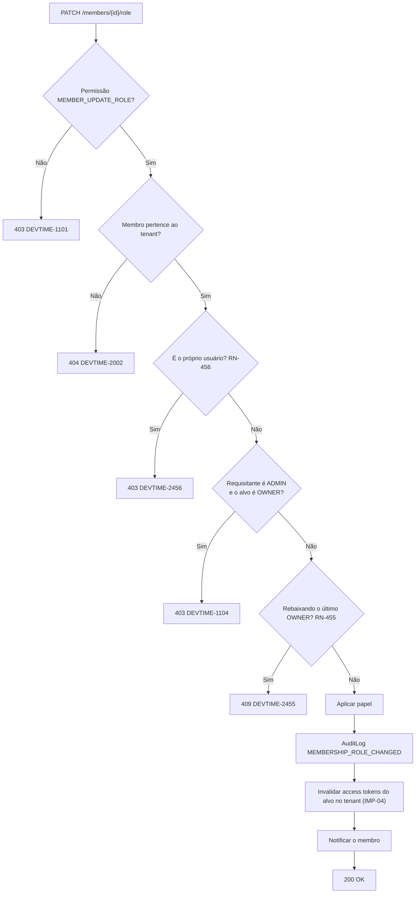
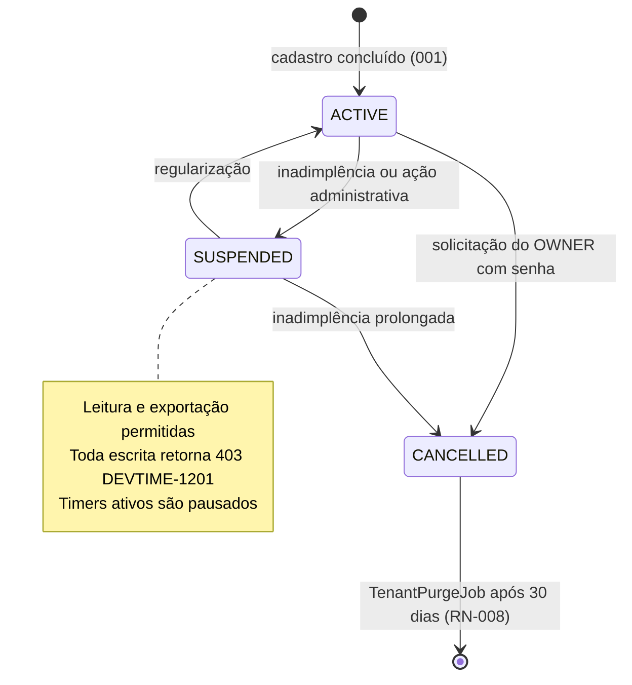
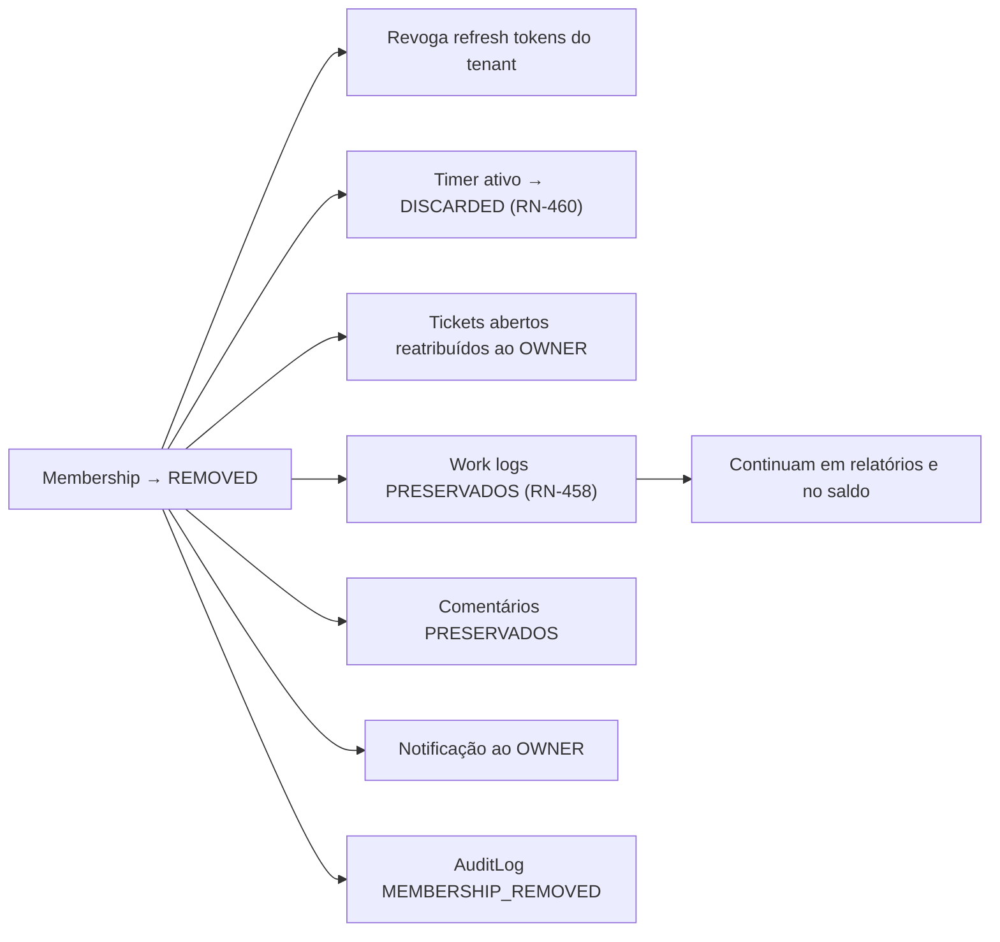

# 002 — Users & Tenant

| Campo | Valor |
|---|---|
| **Feature** | 002 |
| **Épico** | EP-02 (conta) · EP-15 (auditoria e preferências) |
| **Sprint** | S2 (perfil e organização) · S11 (auditoria) |
| **Prioridade** | P0 |
| **Complexidade** | Média |
| **Estimativa** | 26 pts · 6 dias-agente |
| **Stories** | US-014, US-021 a US-024, US-186 a US-193 |
| **Status** | SPEC_APPROVED |

## 1. Objetivo

Gerir a conta do usuário (perfil, preferências, avatar), a organização (dados, configurações operacionais, exportação, cancelamento), os membros do tenant (listagem, convite, papel, remoção) e a consulta da trilha de auditoria.

## 2. Problema que resolve

O usuário precisa ajustar o comportamento do sistema ao seu contexto — fuso, moeda, jornada de referência, janela retroativa, limiares de alerta — sem depender de suporte. E precisa provar, em uma disputa contratual, quem alterou o quê e quando (PV-04, ART-003). Sem `tenant.settings` configurável, todo cálculo de banco de horas usaria constantes globais que não servem a nenhum tenant real.

## 3. Escopo

| # | Item | Referência |
|---|---|---|
| E-01 | Edição do próprio perfil (nome, nome de exibição, fuso, locale) | §6.2 `entities.md` |
| E-02 | Preferências do usuário (tema, categoria padrão, período do dashboard, notificações) | §6.2.1 |
| E-03 | Upload e remoção de avatar | US-014 |
| E-04 | Consulta e edição dos dados da organização (nome, razão social, documento, logo, endereço) | §6.1 |
| E-05 | Edição de `tenant.settings` — as 10 chaves operacionais | §6.1.1 |
| E-06 | Exportação completa dos dados do tenant (LGPD, AQ-12) | RN-008 |
| E-07 | Cancelamento do tenant com confirmação por senha | §4.1 `state-machines.md` |
| E-08 | Listagem de membros com papel e status | §7.1 `users.md` |
| E-09 | Emissão de convite com papel | RN-457 |
| E-10 | Alteração de papel de membro | RN-455, RN-456 |
| E-11 | Suspensão, reativação e remoção de membro | RN-458 a RN-460 |
| E-12 | Consulta paginada e filtrável da trilha de auditoria | §6.20 `entities.md` |
| E-13 | Telas P26 a P29, P32 e P33 | `pages.md` |

> **Nota de fase:** E-08 a E-11 pertencem a F5 (`future/016-teams`) do ponto de vista de **produto**. São implementados aqui em versão mínima porque o modelo `Membership` já existe desde `001` e porque RN-455/RN-456 precisam de teste desde o MVP — um tenant sem OWNER é irrecuperável. A UI de equipe (P32) fica oculta por `permissionGuard` no MVP solo.

## 4. Fora do escopo

| Item | Onde está | Motivo |
|---|---|---|
| Autenticação, sessão e tokens | `001-authentication` | Separação entre identidade e gestão de conta |
| Aceite de convite (consumo do token) | `001-authentication` | O aceite é público; a emissão é autenticada |
| Permissões granulares por contrato | `future/017-permissions` | F5 |
| Custo interno por membro (`defaultHourlyCost`) | `future/017-permissions` | F5 — o campo existe, mas não é editável |
| Planos, cobrança e limites | `future/018-subscriptions` | F6 |
| Categorias e tags | `005`, `006` | São entidades próprias |

## 5. Dependências

### 5.1 Features
| Feature | Tipo | O que consome |
|---|---|---|
| `001-authentication` | Bloqueante | `TenantContext`, `User`, `Tenant`, `Membership`, emissão de token de convite |
| F0 — Fundação | Bloqueante | `AuditLog`, soft delete, tenancy |

### 5.2 Documentos obrigatórios
| Documento | Seções relevantes |
|---|---|
| `docs/04-api/users.md` | §5 a §7, §10 (auditoria) |
| `docs/02-domain/entities.md` | §6.1, §6.1.1, §6.2, §6.2.1, §6.3, §6.20 |
| `docs/02-domain/business-rules.md` | RN-007, RN-008, RN-455 a RN-460 |
| `docs/02-domain/permissions.md` | §6.1, §6.2, §7 |
| `docs/02-domain/state-machines.md` | §4.1 Tenant, §4.3 Membership |
| `docs/05-ui/pages.md` | P26, P27, P28, P29, P32, P33 |

### 5.3 Infraestrutura
| Componente | Uso |
|---|---|
| Object Storage | Avatar do usuário, logo do tenant, arquivo de exportação |
| Provedor de e-mail | Convite, alerta de mudança de papel, confirmação de cancelamento |
| PostgreSQL | `users`, `tenants`, `memberships`, `audit_logs` (particionada por mês) |

## 6. Regras de negócio

| ID | Tipo | Enunciado resumido | Erro | Onde é aplicada |
|---|---|---|---|---|
| RN-007 | Bloqueante | Tenant `SUSPENDED` permite apenas leitura e exportação | `DEVTIME-1201` / 403 | `TenantContextFilter` |
| RN-008 | Bloqueante | Tenant `CANCELLED` rejeita acesso após 30 dias de retenção | `DEVTIME-1202` / 403 | `TenantContextFilter`, `TenantPurgeJob` |
| RN-455 | Bloqueante | Sempre ao menos um `OWNER` ativo por tenant | `DEVTIME-2455` / 409 | `MembershipService` |
| RN-456 | Bloqueante | Ninguém altera o próprio papel | `DEVTIME-2456` / 403 | `MembershipService` |
| RN-457 | Automática | Convite expira em 7 dias; reenvio invalida o anterior | `DEVTIME-2457` / 410 | `InvitationService` |
| RN-458 | Automática | Remoção preserva work logs, tickets e comentários; revoga acesso imediatamente | — | `MembershipService` |
| RN-459 | Bloqueante | Membro `SUSPENDED`/`REMOVED` não autentica no tenant | `DEVTIME-1102` / 403 | `001` |
| RN-460 | Automática | Timer ativo de membro removido é descartado, com notificação ao OWNER | — | `MembershipService` → `009-timer` |
| RN-006 | Automática | Toda alteração auditável gera `AuditLog` na mesma transação | — | `AuditListener` |
| RN-003 | Automática | Exclusão é lógica | — | Todas |
| RN-011 | Bloqueante | Campos imutáveis (🔒) não podem ser alterados | `DEVTIME-2003` / 422 | `TenantService` (`slug`) |
| RN-012 | Bloqueante | Toda listagem é paginada, `size` máximo 100 | `DEVTIME-2006` / 400 | `AuditLogController` |

### 6.1 Ordem de aplicação — alteração de papel

| # | Verificação | Falha |
|---|---|---|
| 1 | Permissão `MEMBER_UPDATE_ROLE` | `403 DEVTIME-1101` |
| 2 | Membro pertence ao tenant | `404 DEVTIME-2002` |
| 3 | Não é o próprio usuário (RN-456) | `403 DEVTIME-2456` |
| 4 | Requisitante `ADMIN` não age sobre `OWNER` nem promove a `OWNER` (nota ¹) | `403 DEVTIME-1104` |
| 5 | Rebaixamento não deixa o tenant sem OWNER ativo (RN-455) | `409 DEVTIME-2455` |
| 6 | Aplica e invalida os access tokens do usuário no tenant (IMP-04) | — |

**Por que a ordem é esta:** a verificação de auto-alteração (3) precede a de hierarquia (4) porque um OWNER tentando se rebaixar deve receber a mensagem correta ("não é possível alterar o próprio papel"), não uma mensagem sobre hierarquia. A verificação do último OWNER (5) é a última porque é a mais cara — exige contagem no banco.

### 6.2 Configurações de `tenant.settings`

| Chave | Tipo | Default | Faixa válida | Impacto |
|---|---|---|---|---|
| `workDayMinutes` | int | 480 | 60–1440 | Métricas de jornada no dashboard |
| `workDays` | int[] | `[1,2,3,4,5]` | subconjunto de 1–7, não vazio | `burnRate` e projeção |
| `defaultRolloverPolicy` | enum | `NONE` | `NONE`, `FULL`, `CAPPED` | Pré-preenchimento de contrato |
| `defaultOveragePolicy` | enum | `WARN` | `BLOCK`, `WARN`, `ALLOW_BILLABLE` | Pré-preenchimento de contrato |
| `timerLongRunningMinutes` | int | 480 | 30–1440 | RN-163 |
| `timerAutoAbandonMinutes` | int | 960 | > `timerLongRunningMinutes`, ≤ 2880 | RN-164 |
| `allowFutureWorkLogs` | boolean | `false` | — | RN-119 |
| `retroactiveLimitDays` | int | 30 | 0–365 | RN-120 |
| `roundingMinutes` | int | 0 | 0, 5, 6, 10, 15, 30 | RN-113 |
| `notificationThresholds` | int[] | `[50,80,100]` | 1–200, ordenado, sem duplicata, máx. 5 | RN-602 |

**Regra crítica:** alterar `roundingMinutes` **não** recalcula work logs existentes. A alteração vale apenas para registros futuros. Recalcular alteraria relatórios já entregues, violando ART-005. A UI deve declarar isso explicitamente.

### 6.3 Invariantes envolvidas
| ID | Invariante | Como é garantida |
|---|---|---|
| INV-TEN-02 | Todo tenant tem ao menos um OWNER ativo | RN-455 em remoção, suspensão e rebaixamento |
| INV-TEN-03 | `timezone` é ID IANA resolvível | Validação contra `ZoneId.getAvailableZoneIds()` |
| INV-TEN-04 | Tenant `CANCELLED` não aceita escrita | `TenantContextFilter` |
| INV-MEM-01 | `(tenantId, userId)` único | Índice único parcial |
| INV-MEM-02 | Ao menos um OWNER ativo por tenant | Contagem com lock antes da operação |
| INV-MEM-03 | OWNER não se auto-remove sendo o último | RN-455 + RN-456 |
| INV-MEM-04 | `ACTIVE` exige `acceptedAt` | Preenchido no aceite |
| INV-USR-02 | `passwordHash` nunca exposto | Ausente de todo DTO |
| INV-AUD-01 | `AuditLog` é *append-only* | Sem `updatedAt`/`deletedAt`; nenhuma rota de escrita |

## 7. Fluxo principal — configuração da organização

1. Usuário com `TENANT_UPDATE` acessa P29.
2. Front carrega `GET /api/v1/tenant` com dados e `settings`.
3. Usuário altera nome, logo, fuso, moeda e as chaves de `settings`.
4. Front envia `PATCH /api/v1/tenant/settings` com `version` para controle otimista (RN-004).
5. `TenantService` valida: `timezone` IANA (INV-TEN-03), faixas da §6.2, coerência entre `timerLongRunningMinutes` e `timerAutoAbandonMinutes`, e imutabilidade do `slug` (RN-011).
6. Persiste, gera `AuditLog` com `beforeState`/`afterState` apenas dos campos alterados (RN-006), na mesma transação.
7. Retorna `200` com o tenant atualizado e `version` incrementada.
8. Front atualiza o `AuthStore`; alterações de fuso e moeda refletem imediatamente em todos os pipes de formatação.

## 8. Fluxos alternativos

| # | Fluxo | Gatilho | Comportamento |
|---|---|---|---|
| FA-01 | Edição de perfil | P26 | `PATCH /users/me`; fuso pessoal sobrepõe o do tenant apenas na exibição, nunca no cálculo |
| FA-02 | Preferências | P27 | `PATCH /users/me/preferences`; aplicação imediata do tema, sem recarga |
| FA-03 | Upload de avatar | P26 | `POST /users/me/avatar` multipart; mesmas regras de tipo e tamanho de `015-attachments` |
| FA-04 | Exportação de dados | P29 | `GET /tenant/export` assíncrono; `202` com identificador; e-mail ao concluir; URL assinada de 15 min (RN-712) |
| FA-05 | Cancelamento do tenant | P29 | Exige senha e digitação do nome da organização; `POST /tenant/cancel`; revoga todos os tokens; agenda purga para +30 dias |
| FA-06 | Convite de membro | P32 | `POST /members/invitations` com e-mail e papel; token de 7 dias; e-mail enviado pós-commit |
| FA-07 | Reenvio de convite | P32 | Invalida o token anterior e emite novo (RN-457) |
| FA-08 | Alteração de papel | P32 | `PATCH /members/{id}/role` na ordem da §6.1; invalida os access tokens do alvo |
| FA-09 | Remoção de membro | P32 | `DELETE /members/{id}`; preserva registros (RN-458); descarta timer ativo (RN-460); reatribui tickets abertos ao OWNER |
| FA-10 | Consulta de auditoria | P33 | `GET /audit-logs` paginado, filtrável por entidade, ação, ator e período; somente leitura |
| FA-11 | Tenant suspenso | Qualquer escrita | `403 DEVTIME-1201`; exportação continua permitida (RN-007) |

## 9. Diagramas

### 9.1 Alteração de papel

### 9.2 Ciclo de vida do tenant

### 9.3 Remoção de membro e efeitos cruzados

## 10. Estados

### 10.1 `Tenant`
| Estado | Significado | Operações permitidas | Operações bloqueadas |
|---|---|---|---|
| `ACTIVE` | Operacional | Todas | — |
| `SUSPENDED` | Suspenso | Leitura, exportação | Toda escrita (`DEVTIME-1201`) |
| `CANCELLED` | Cancelado (terminal) | Exportação nos 30 dias de retenção | Tudo após a retenção (`DEVTIME-1202`) |

### 10.2 `Membership`
| Estado | Significado | Operações permitidas | Operações bloqueadas |
|---|---|---|---|
| `INVITED` | Convite pendente | Aceitar, reenviar, revogar | Autenticar no tenant |
| `ACTIVE` | Vínculo válido | Conforme o papel | — |
| `SUSPENDED` | Suspenso | Reativação | Autenticar no tenant |
| `REMOVED` | Removido (terminal) | — | Tudo. Readmissão exige novo convite |

## 11. Transições

| Origem | Destino | Gatilho | Guarda | Efeito | Permissão |
|---|---|---|---|---|---|
| `Tenant.ACTIVE` | `SUSPENDED` | Ação administrativa | — | Bloqueia escrita; pausa timers; notifica OWNERs | Plataforma |
| `Tenant.SUSPENDED` | `ACTIVE` | Regularização | — | Restaura escrita; notifica | Plataforma |
| `Tenant.*` | `CANCELLED` | Solicitação do OWNER | Confirmação por senha; nenhum período em `CLOSING` | Revoga todos os tokens; agenda purga +30d; libera exportação | `TENANT_DELETE` (só OWNER) |
| `Membership.ACTIVE` | `SUSPENDED` | Ação de ADMIN/OWNER | Não é o último OWNER (RN-455) | Revoga tokens do tenant; descarta timer (RN-460) | `MEMBER_SUSPEND` |
| `Membership.SUSPENDED` | `ACTIVE` | Reativação | — | Restaura acesso | `MEMBER_SUSPEND` |
| `Membership.ACTIVE`/`SUSPENDED` | `REMOVED` | Remoção | Não é o último OWNER; não é auto-remoção do último OWNER | RN-458, RN-460, reatribuição de tickets | `MEMBER_REMOVE` |
| `Membership.INVITED` | `REMOVED` | Revogação ou expiração | — | Invalida o token | `MEMBER_REMOVE` |

### 11.1 Transições proibidas
| Transição | Motivo da proibição |
|---|---|
| `Tenant.CANCELLED → *` | Decisão definitiva; reativação exige processo manual de suporte registrado em auditoria |
| `Membership.REMOVED → *` | Readmissão gera novo membership, preservando o histórico do vínculo anterior |
| Auto-alteração de papel | RN-456, inclusive para OWNER — evita rebaixamento acidental do último proprietário |
| Escrita em `AuditLog` por qualquer rota | INV-AUD-01 — a trilha é *append-only* pelo listener |

## 12. Casos de erro

| Código | HTTP | Situação | Mensagem ao usuário | Regra |
|---|:--:|---|---|---|
| `DEVTIME-1101` | 403 | Papel sem a permissão | Você não tem permissão para esta ação | §7 permissions |
| `DEVTIME-1104` | 403 | ADMIN agindo sobre OWNER | Ação não permitida sobre um proprietário | nota ¹ |
| `DEVTIME-1201` | 403 | Escrita em tenant suspenso | Organização suspensa: apenas leitura | RN-007 |
| `DEVTIME-1202` | 403 | Tenant cancelado | Organização cancelada | RN-008 |
| `DEVTIME-2002` | 404 | Membro de outro tenant | Recurso não encontrado | RN-002 |
| `DEVTIME-2003` | 422 | Tentativa de alterar `slug` | Este campo não pode ser alterado | RN-011 |
| `DEVTIME-2004` | 409 | Conflito de `version` | O registro foi alterado. Recarregue e tente novamente | RN-004 |
| `DEVTIME-2006` | 400 | `size` acima de 100 | Tamanho de página inválido | RN-012 |
| `DEVTIME-2455` | 409 | Último OWNER | A organização deve ter ao menos um proprietário | RN-455 |
| `DEVTIME-2456` | 403 | Auto-alteração de papel | Você não pode alterar o próprio papel | RN-456 |
| `DEVTIME-2457` | 410 | Convite expirado | Convite expirado. Reenvie o convite | RN-457 |
| `DEVTIME-2000` | 400 | `settings` fora da faixa | Verifique os campos destacados | §6.2 |

### 12.1 Casos extremos

| # | Caso | Comportamento esperado |
|---|---|---|
| CX-01 | Último OWNER tenta se remover | `409 DEVTIME-2455`. A mensagem sugere promover outro membro antes |
| CX-02 | Dois ADMINs rebaixam o mesmo OWNER simultaneamente | Lock na contagem de OWNERs; um sucede, o outro recebe `409 DEVTIME-2455` |
| CX-03 | Membro removido possuía 200 work logs | Todos preservados e continuam nos relatórios e no saldo (RN-458) |
| CX-04 | Membro removido tinha timer `PAUSED` | Descartado igualmente (CE-ME-06); o tempo consta apenas na auditoria |
| CX-05 | Convite para e-mail já membro ativo | `409 DEVTIME-2001`; a mensagem informa que o usuário já participa |
| CX-06 | Convite para e-mail com membership `REMOVED` | Permitido: gera **novo** membership `INVITED`, preservando o anterior |
| CX-07 | Alteração de `timezone` do tenant com work logs existentes | `workDate` já persistidos **não** são recalculados; a mudança vale para registros futuros. Aviso explícito na UI |
| CX-08 | `roundingMinutes` alterado de 0 para 15 | Registros existentes inalterados (§6.2); apenas novos são arredondados |
| CX-09 | `timerAutoAbandonMinutes` menor que `timerLongRunningMinutes` | `400`; validação cruzada no DTO |
| CX-10 | `notificationThresholds` com valores desordenados ou duplicados | Normalizado para ordenado e único; se exceder 5, `400` |
| CX-11 | Exportação de tenant com 500k work logs | Assíncrona; `202` com identificador; e-mail ao concluir; nunca síncrona |
| CX-12 | Cancelamento com período em `CLOSING` | Bloqueado até o fechamento concluir ou ser revertido pelo `StuckClosingJob` |
| CX-13 | Consulta de auditoria com intervalo de 5 anos | Paginação obrigatória; a partição por mês limita a varredura; `size` máximo 100 |
| CX-14 | Usuário altera o próprio fuso pessoal | Afeta apenas exibição; todo cálculo continua no fuso do tenant (ART-031) |

## 13. Modelo de dados

### 13.1 Entidades impactadas
| Entidade | Operação | Tabela | Referência |
|---|---|---|---|
| `User` | Lê, atualiza | `users` | §6.2 |
| `Tenant` | Lê, atualiza, soft delete lógico via `status` | `tenants` | §6.1 |
| `Membership` | Cria, lê, atualiza, soft delete | `memberships` | §6.3 |
| `AuditLog` | Cria (por listener), lê | `audit_logs` | §6.20 |
| `Timer` | Descarta (RN-460) | `timers` | Via interface de `009` |
| `Ticket` | Reatribui | `tickets` | Via interface de `007` |

### 13.2 Campos obrigatórios na criação (convite)
| Campo | Tipo | Origem | Imutável | Validação |
|---|---|---|:--:|---|
| `membership.tenantId` | UUID | `TenantContext` | ✔ 🔒 | Nunca da requisição |
| `membership.userId` | UUID | Usuário existente ou criado no aceite | ✔ 🔒 | — |
| `membership.role` | enum | Request | ✖ | `MEMBER`, `MANAGER`, `ADMIN`; `OWNER` só por OWNER |
| `membership.status` | enum | Sistema | ✖ | `INVITED` |
| `membership.invitedBy` | UUID | `TenantContext` | ✔ 🔒 | — |
| `membership.invitedAt` | TIMESTAMPTZ | `now()` | ✔ 🔒 | — |

### 13.3 Migrations
| Migration | Conteúdo | Compatibilidade |
|---|---|---|
| `V007__create_audit_logs.sql` | `audit_logs` particionada por mês em `occurred_at`, sem `updated_at` nem `deleted_at` | Nova tabela |
| `V008__audit_log_partitions.sql` | Partições dos próximos 12 meses + função de criação automática | Aditiva |
| `V009__tenant_settings_defaults.sql` | Backfill de `settings` com os defaults da §6.2 para tenants existentes | Aditiva com default |

### 13.4 Índices
| Índice | Colunas | Sustenta |
|---|---|---|
| `idx_audit_logs_tenant_occurred` | `(tenant_id, occurred_at DESC)` | Listagem padrão da trilha |
| `idx_audit_logs_entity` | `(tenant_id, entity_type, entity_id, occurred_at DESC)` | Histórico de um registro |
| `idx_audit_logs_actor` | `(tenant_id, actor_id, occurred_at DESC)` | Auditoria por usuário |
| `idx_memberships_tenant_role` | `(tenant_id, role, status)` | Contagem de OWNERs (RN-455) |

## 14. Endpoints utilizados

| Método | Rota | Operação | Permissão | Sucesso | Doc |
|---|---|---|---|:--:|---|
| PATCH | `/api/v1/users/me` | Editar perfil | Autenticada | 200 | §5.1 |
| PATCH | `/api/v1/users/me/preferences` | Editar preferências | Autenticada | 200 | §5.2 |
| POST | `/api/v1/users/me/avatar` | Enviar avatar | Autenticada | 200 | §5.3 |
| DELETE | `/api/v1/users/me/avatar` | Remover avatar | Autenticada | 204 | §5.3 |
| GET | `/api/v1/tenant` | Dados da organização | `TENANT_VIEW` | 200 | §6.1 |
| PATCH | `/api/v1/tenant` | Editar dados | `TENANT_UPDATE` | 200 | §6.1 |
| PATCH | `/api/v1/tenant/settings` | Editar configurações | `TENANT_UPDATE` | 200 | §6.2 |
| POST | `/api/v1/tenant/cancel` | Cancelar organização | `TENANT_DELETE` | 202 | §6.3 |
| GET | `/api/v1/tenant/export` | Exportar dados | `TENANT_VIEW` | 202 | §6.4 |
| GET | `/api/v1/members` | Listar membros | `MEMBER_VIEW` | 200 | §7.1 |
| POST | `/api/v1/members/invitations` | Convidar membro | `MEMBER_INVITE` | 201 | §7.2 |
| POST | `/api/v1/members/invitations/{id}/resend` | Reenviar convite | `MEMBER_INVITE` | 202 | §7.2 |
| PATCH | `/api/v1/members/{id}/role` | Alterar papel | `MEMBER_UPDATE_ROLE` | 200 | §7.3 |
| POST | `/api/v1/members/{id}/suspend` | Suspender membro | `MEMBER_SUSPEND` | 200 | §7.3 |
| POST | `/api/v1/members/{id}/reactivate` | Reativar membro | `MEMBER_SUSPEND` | 200 | §7.3 |
| DELETE | `/api/v1/members/{id}` | Remover membro | `MEMBER_REMOVE` | 204 | §7.4 |
| GET | `/api/v1/audit-logs` | Consultar auditoria | `TENANT_AUDIT_VIEW` | 200 | §10.1 |

## 15. Eventos

| Evento | Publicado por | Consumidores | Momento | Efeito |
|---|---|---|---|---|
| `TenantSettingsUpdatedEvent` | `TenantService` | Cache local, métricas | Após o commit | Invalida configurações em cache |
| `TenantCancelledEvent` | `TenantService` | `RefreshTokenService`, `MailAdapter` | Revogação dentro; e-mail após | Revoga tokens; agenda purga |
| `MemberInvitedEvent` | `MembershipService` | `MailAdapter` | Após o commit | Envia o convite |
| `MemberRoleChangedEvent` | `MembershipService` | `JwtService`, `013-notifications` | Após o commit | Invalida access tokens (IMP-04); notifica |
| `MemberRemovedEvent` | `MembershipService` | `009-timer`, `007-tickets`, `013-notifications` | Descarte de timer e reatribuição **dentro** da transação; notificação após | RN-458, RN-460 |
| `MemberSuspendedEvent` | `MembershipService` | `009-timer`, `RefreshTokenService` | Dentro da transação | Revoga tokens; descarta timer |

**Justificativa:** o descarte do timer é atômico com a remoção porque um membro sem acesso com timer ativo produziria um work log órfão sem autor válido. Já a notificação é pós-commit porque sua falha não pode reverter a remoção.

## 16. Permissões

| Operação | Permissão | Papéis | Ownership | Escopo de dados |
|---|---|---|---|---|
| Editar perfil e preferências | Autenticada | Todos | Somente o próprio usuário | — |
| Ver organização | `TENANT_VIEW` | Todos | — | Tenant da sessão |
| Editar organização e `settings` | `TENANT_UPDATE` | OWNER, ADMIN | — | Tenant da sessão |
| Cancelar organização | `TENANT_DELETE` | **Somente OWNER** | Confirmação por senha | — |
| Exportar dados | `TENANT_VIEW` | Todos | — | Permitido mesmo com tenant `SUSPENDED` |
| Listar membros | `MEMBER_VIEW` | Todos | — | Tenant da sessão |
| Convidar | `MEMBER_INVITE` | OWNER, ADMIN | — | — |
| Alterar papel | `MEMBER_UPDATE_ROLE` | OWNER; ADMIN com restrição ¹ | RN-456: nunca o próprio | — |
| Suspender / reativar | `MEMBER_SUSPEND` | OWNER; ADMIN com restrição ¹ | — | — |
| Remover | `MEMBER_REMOVE` | OWNER; ADMIN com restrição ¹ | — | — |
| Consultar auditoria | `TENANT_AUDIT_VIEW` | OWNER, ADMIN | — | Tenant da sessão |

**Restrição ¹:** `ADMIN` não altera, suspende nem remove um `OWNER`, e não promove ninguém a `OWNER` (`DEVTIME-1104`).
**OWN-06:** ninguém altera o próprio papel, nem sendo OWNER (RN-456).

## 17. Validações

### 17.1 Camada 1 — Formato (`400`)
| Campo | Restrição | Mensagem |
|---|---|---|
| `fullName` | `@Size(min=2,max=150)` | Informe seu nome completo |
| `displayName` | `@Size(max=60)` | Nome de exibição muito longo |
| `timezone` | ID IANA | Fuso horário inválido |
| `locale` | BCP-47 | Idioma inválido |
| `tenant.name` | `@Size(min=2,max=120)` | Nome da organização inválido |
| `tenant.documentNumber` | Apenas dígitos, ≤ 20 | Documento inválido |
| `tenant.currency` | ISO-4217, 3 letras | Moeda inválida |
| `settings.*` | Faixas da §6.2 | Valor fora da faixa permitida |
| `settings` cruzado | `timerAutoAbandonMinutes > timerLongRunningMinutes` | O limiar de abandono deve ser maior que o de alerta |
| `role` | Enum válido | Papel inválido |
| `email` do convite | `@Email`, ≤255 | Informe um e-mail válido |
| `size` da listagem | `@Max(100)` | Tamanho de página inválido |

### 17.2 Camada 2 — Negócio
| Validação | Regra | Erro |
|---|---|---|
| `slug` não pode ser alterado | RN-011 | `DEVTIME-2003` / 422 |
| Ninguém altera o próprio papel | RN-456 | `DEVTIME-2456` / 403 |
| ADMIN não age sobre OWNER | nota ¹ | `DEVTIME-1104` / 403 |
| Sempre ao menos um OWNER ativo | RN-455 | `DEVTIME-2455` / 409 |
| Convite não duplica membership ativo | INV-MEM-01 | `DEVTIME-2001` / 409 |
| Cancelamento exige senha correta | §4.1 SM | `DEVTIME-1003` / 401 |
| Cancelamento exige ausência de período em `CLOSING` | §4.1 SM | `DEVTIME-2010` / 409 |
| `version` corresponde ao estado atual | RN-004 | `DEVTIME-2004` / 409 |
| Escrita em tenant suspenso | RN-007 | `DEVTIME-1201` / 403 |

### 17.3 Camada 3 — Consistência
| Constraint | Garante | Mapeado para |
|---|---|---|
| `uq_memberships_tenant_user` | INV-MEM-01 | `DEVTIME-2001` |
| `chk_tenant_currency` | ISO-4217 | `DEVTIME-2000` |
| `audit_logs` sem coluna `updated_at`/`deleted_at` | INV-AUD-01 | Estrutural |

## 18. Auditoria

| Ação | `action` | `beforeState` | `afterState` | Metadata |
|---|---|---|---|---|
| Perfil alterado | `USER_PROFILE_UPDATED` | Campos alterados | Campos alterados | IP, traceId |
| Preferências alteradas | `USER_PREFERENCES_UPDATED` | Chaves alteradas | Chaves alteradas | traceId |
| Organização alterada | `TENANT_UPDATED` | Campos alterados | Campos alterados | IP, traceId |
| Configurações alteradas | `TENANT_SETTINGS_UPDATED` | Chaves alteradas | Chaves alteradas | IP, traceId — **auditoria obrigatória**: `settings` afeta cálculo |
| Organização cancelada | `TENANT_CANCELLED` | `{status}` | `{status, purgeScheduledAt}` | IP, confirmação |
| Exportação solicitada | `TENANT_EXPORT_REQUESTED` | — | `{executionId, format}` | IP — rastreabilidade LGPD |
| Convite enviado | `MEMBERSHIP_INVITED` | — | `{email, role}` | traceId |
| Papel alterado | `MEMBERSHIP_ROLE_CHANGED` | `{role}` | `{role}` | IP, traceId — **crítico** |
| Membro suspenso | `MEMBERSHIP_SUSPENDED` | `{status}` | `{status}` | IP, motivo |
| Membro removido | `MEMBERSHIP_REMOVED` | `{status, role}` | `{status}` | IP, contagem de registros preservados |

`AuditLog` não possui rota de escrita, `updatedAt` nem `deletedAt` (INV-AUD-01). Entidades auditadas obrigatoriamente: `WorkLog`, `Contract`, `ContractPeriod`, `PeriodAdjustment`, `Membership`, `User`, `Client`, `Tenant`.

## 19. Segurança

| # | Vetor | Mitigação | Verificação |
|---|---|---|---|
| SG-01 | Auto-promoção a OWNER | RN-456 bloqueia auto-alteração; ADMIN não promove a OWNER | Teste por célula da matriz |
| SG-02 | Tenant sem OWNER (bloqueio permanente) | RN-455 com lock na contagem | Teste de concorrência |
| SG-03 | Privilégio revogado ainda válido por 15 min | Alteração de papel invalida os access tokens (IMP-04) | Teste CE-P-07 |
| SG-04 | Cancelamento acidental ou por sessão sequestrada | Exige senha **e** digitação do nome da organização | Teste |
| SG-05 | Exportação usada para exfiltrar dados | `AuditLog` obrigatório; URL assinada de 15 min; e-mail de alerta ao OWNER | Teste |
| SG-06 | Adulteração da trilha de auditoria | Sem rota de escrita; sem `updatedAt`; permissão de banco restrita a `INSERT` e `SELECT` | Teste de tentativa de `UPDATE` |
| SG-07 | Enumeração de membros de outro tenant | Filtro automático de tenant; `404` para id externo | Suíte de isolamento |
| SG-08 | Avatar como vetor de upload malicioso | Allowlist de tipo e verificação de magic number (RN-802) | Teste com EICAR e SVG |
| SG-09 | `settings` fora de faixa quebrando cálculo | Validação de faixa e cruzada; auditoria de toda alteração | Teste de faixa |

### 19.1 LGPD

| Dado pessoal | Base legal | Retenção | Exportação | Anonimização | Proibido em log |
|---|---|---|---|---|---|
| Nome, e-mail, avatar | Execução de contrato | Vida da conta | ✔ `GET /tenant/export` | `Usuário Removido` + e-mail hash | ❌ e-mail em claro |
| Documento do tenant (CNPJ/CPF) | Obrigação legal | 5 anos após cancelamento | ✔ | Mascarado, exceto os 4 últimos dígitos | ❌ completo |
| Endereço | Execução de contrato | Vida da conta | ✔ | Removido | ❌ |
| IP e user agent na auditoria | Legítimo interesse | 12 meses ativos, 5 anos arquivados | ✔ | IP truncado no último octeto | Permitido em log de segurança |
| Preferências | Execução de contrato | Vida da conta | ✔ | Descartadas | Permitido |

**Direitos do titular:** acesso e portabilidade por `GET /tenant/export` (formato aberto — JSON + CSV, AQ-12). Eliminação por cancelamento do tenant, com purga em 30 dias (RN-008). Work logs de membro removido são **preservados** (RN-458) por obrigação de registro contratual; a base legal é obrigação legal e legítimo interesse, e a anonimização substitui a identificação nominal quando solicitada.

## 20. Performance

| Operação | Meta | Índice/estratégia | Risco |
|---|---|---|---|
| `GET /tenant` | p95 < 100 ms | Consulta por PK | — |
| `PATCH /tenant/settings` | p95 < 200 ms | Atualização por PK com `version` | — |
| `GET /members` | p95 < 200 ms | `idx_memberships_tenant_role`, projeção | — |
| Contagem de OWNERs (RN-455) | < 20 ms | `idx_memberships_tenant_role` com lock | Lock sob concorrência alta |
| `GET /audit-logs` | p95 < 500 ms | Partição por mês + `idx_audit_logs_tenant_occurred` | Consulta sem filtro de período varre muitas partições |
| Exportação de tenant | Assíncrona | Streaming em lotes; nunca carrega tudo em memória | Tenant com 500k work logs |

### 20.1 Escalabilidade

`audit_logs` cresce de 5 a 10× mais rápido que `work_logs` (§10.2 de `architecture.md`) e é particionada por mês desde o início. A consulta padrão **exige** filtro de período; sem ele, o backend aplica os últimos 30 dias como default, nunca varre tudo. Arquivamento após 12 meses, retenção total de 5 anos.

A exportação completa é sempre assíncrona e escrita em streaming direto para o object storage, com no máximo 5.000 linhas em memória por vez.

## 21. Componentes Frontend

### 21.1 Rotas
| Rota | Componente | Guard | Lazy | Tela |
|---|---|---|:--:|---|
| `/settings/profile` | `ProfileSettingsPage` | `authGuard` | ✔ | P26 |
| `/settings/preferences` | `PreferencesSettingsPage` | `authGuard` | ✔ | P27 |
| `/settings/notifications` | `NotificationSettingsPage` | `authGuard` | ✔ | P28 |
| `/settings/organization` | `OrganizationSettingsPage` | `permissionGuard(['TENANT_UPDATE'])` | ✔ | P29 |
| `/settings/team` | `TeamSettingsPage` | `permissionGuard(['MEMBER_VIEW'])` | ✔ | P32 |
| `/settings/audit` | `AuditSettingsPage` | `permissionGuard(['TENANT_AUDIT_VIEW'])` | ✔ | P33 |

### 21.2 Componentes
| Componente | Tipo | Responsabilidade | Inputs | Outputs |
|---|---|---|---|---|
| `ProfileSettingsPage` | Page | Perfil e avatar | — | — |
| `PreferencesSettingsPage` | Page | Tema, categoria padrão, período do dashboard | — | — |
| `OrganizationSettingsPage` | Page | Dados, logo, `settings`, exportação, cancelamento | — | — |
| `TeamSettingsPage` | Page | Lista de membros, convite, papel, remoção | — | — |
| `AuditSettingsPage` | Page | Trilha filtrável com `beforeState`/`afterState` | — | — |
| `dt-settings-layout` | Presentational | Layout L9 com navegação lateral | `sections` | — |
| `dt-avatar-upload` | Shared | Upload com recorte e pré-visualização | `currentUrl` | `uploaded`, `removed` |
| `dt-tenant-settings-form` | Presentational | Formulário das 10 chaves com avisos de impacto | `settings` | `save` |
| `dt-member-row` | Presentational | Linha de membro com ações por papel | `member`, `canManage` | `changeRole`, `suspend`, `remove` |
| `dt-role-selector` | Presentational | Seleção de papel com descrição de cada um | `current`, `allowOwner` | `change` |
| `dt-audit-entry` | Presentational | Entrada da trilha com diff antes/depois | `entry` | — |
| `dt-danger-zone` | Presentational | Cancelamento com dupla confirmação | `tenantName` | `confirm` |

### 21.3 Stores e serviços Angular
| Artefato | Tipo | Estado exposto | Escopo |
|---|---|---|---|
| `TenantStore` | Store | `tenant`, `settings`, `loading`, `error` | `providedIn: 'root'` — sobrevive à navegação |
| `MemberStore` | Store | `members`, `owners` (computed), `canRemove` (computed), `loading` | Provido na rota `/settings/team` |
| `AuditStore` | Store | `entries`, `filter`, `page`, `loading` | Provido na rota `/settings/audit` |
| `UserProfileService` | Serviço | Perfil, preferências, avatar | `core` |
| `TenantApi`, `MemberApi`, `AuditApi` | API | Somente HTTP | `providedIn: 'root'` |

### 21.4 Guards, interceptors, pipes e directives
| Artefato | Tipo | Uso |
|---|---|---|
| `permissionGuard` | Guard | Protege P29, P32 e P33 |
| `unsavedChangesGuard` | Guard | Formulários de perfil e organização |
| `hasPermission` | Directive | Oculta ações de gestão de membros |
| `tenantDatePipe` | Pipe | Datas da trilha no fuso do tenant |
| `auditActionPipe` | Pipe | Traduz `action` para texto em pt-BR |

## 22. Serviços Backend

### 22.1 Controllers
| Classe | Rota base | Endpoints |
|---|---|---|
| `UserProfileController` | `/api/v1/users/me` | perfil, preferências, avatar |
| `TenantController` | `/api/v1/tenant` | consultar, editar, settings, cancelar, exportar |
| `MemberController` | `/api/v1/members` | listar, convidar, reenviar, papel, suspender, reativar, remover |
| `AuditLogController` | `/api/v1/audit-logs` | consultar (somente `GET`) |

### 22.2 Services
| Interface | Implementação | Responsabilidade | Permissão declarada |
|---|---|---|---|
| `UserProfileService` | `UserProfileServiceImpl` | Perfil, preferências, avatar | Autenticada + ownership |
| `TenantService` | `TenantServiceImpl` | Dados, `settings`, cancelamento | `TENANT_VIEW` / `TENANT_UPDATE` / `TENANT_DELETE` |
| `TenantSettingsService` | `TenantSettingsServiceImpl` | Leitura tipada de `settings` por outras features | — (interface pública) |
| `TenantExportService` | `TenantExportServiceImpl` | Exportação assíncrona completa | `TENANT_VIEW` |
| `MembershipService` | `MembershipServiceImpl` | Ciclo de vida do membership | `MEMBER_*` |
| `InvitationService` | `InvitationServiceImpl` | Emissão e reenvio de convite (RN-457) | `MEMBER_INVITE` |
| `AuditLogService` | `AuditLogServiceImpl` | Consulta paginada e filtrável | `TENANT_AUDIT_VIEW` |

> `TenantSettingsService` é a **única** porta de leitura de `settings` para as demais features. Nenhuma feature lê o JSONB diretamente — isso garante tipagem, defaults e um único ponto de evolução.

### 22.3 Componentes de domínio
| Classe | Tipo | Responsabilidade | Regras |
|---|---|---|---|
| `TenantSettingsValidator` | Validator | Faixas e validações cruzadas da §6.2 | §6.2 |
| `LastOwnerGuard` | Validator | Impede tenant sem OWNER ativo | RN-455 |
| `SelfRoleChangeGuard` | Validator | Impede auto-alteração de papel | RN-456 |
| `AdminOverOwnerGuard` | Validator | Impede ADMIN agir sobre OWNER | nota ¹ |
| `MemberRemovalOrchestrator` | Serviço de domínio | Descarte de timer, reatribuição de tickets, preservação de registros | RN-458, RN-460 |
| `AuditLogWriter` | Componente | Escrita *append-only* na mesma transação | RN-006, INV-AUD-01 |
| `TimezoneValidator` | Validator | ID IANA resolvível | INV-TEN-03 |

### 22.4 Jobs
| Classe | Cron | Lock | Responsabilidade | Idempotência |
|---|---|---|---|---|
| `TenantPurgeJob` | `0 30 4 * * *` | `tenantPurge`, 30m | Purga tenants cancelados há mais de 30 dias (RN-008) | Por predicado, em lote |
| `AuditPartitionJob` | `0 0 1 1 * *` | `auditPartition`, 10m | Cria as partições dos próximos 3 meses | `CREATE IF NOT EXISTS` |
| `AuditArchiveJob` | `0 0 5 1 * *` | `auditArchive`, 60m | Arquiva partições com mais de 12 meses | Verifica se já arquivada |
| `ExpiredInvitationJob` | `0 0 3 * * *` | `expiredInvitations`, 10m | `INVITED → REMOVED` após 7 dias (RN-457) | Atualização condicional |

## 23. DTOs

| DTO | Direção | Campos principais | Observação |
|---|---|---|---|
| `UserProfileUpdateRequest` | Request | `fullName`, `displayName`, `timezone`, `locale` | E-mail **não** é alterável no MVP |
| `UserPreferencesRequest` | Request | `theme`, `defaultCategoryId`, `dashboardPeriod`, `emailNotifications`, `mutedNotificationTypes`, `timerReminderEnabled` | Espelha §6.2.1 |
| `UserProfileResponse` | Response | `id`, `email`, `fullName`, `displayName`, `avatarUrl`, `timezone`, `locale`, `preferences` | Sem `passwordHash` |
| `TenantResponse` | Response | Dados + `settings` tipado + `version` | `slug` marcado como somente leitura |
| `TenantUpdateRequest` | Request | `name`, `legalName`, `documentNumber`, `email`, `phone`, `timezone`, `locale`, `currency`, `logoUrl`, `address`, `version` | `slug` ausente (imutável) |
| `TenantSettingsRequest` | Request | As 10 chaves da §6.2 + `version` | Validação cruzada por `@AssertTrue` |
| `TenantCancelRequest` | Request | `password`, `confirmationName` | Dupla confirmação |
| `MemberResponse` | Response | `id`, `userId`, `fullName`, `email`, `role`, `status`, `invitedAt`, `acceptedAt`, `availableActions[]` | `availableActions` conforme papel do requisitante (ME-06) |
| `InvitationRequest` | Request | `email`, `role`, `message?` | — |
| `RoleUpdateRequest` | Request | `role`, `version` | — |
| `MemberRemovalResponse` | Response | `preservedWorkLogs`, `reassignedTickets`, `discardedTimers` | Transparência sobre os efeitos (RN-458) |
| `AuditLogResponse` | Response | `id`, `actorName`, `actorType`, `action`, `entityType`, `entityId`, `beforeState`, `afterState`, `occurredAt`, `metadata` | IP mascarado |
| `AuditLogFilter` | Filter | `entityType`, `entityId`, `actorId`, `action`, `occurredAtFrom`, `occurredAtTo` | Período obrigatório ou default de 30 dias |
| `TenantExportResponse` | Response | `executionId`, `status`, `estimatedRows` | `202 Accepted` |

## 24. Mappers

| Mapper | De → Para | Mapeamentos não triviais |
|---|---|---|
| `UserProfileMapper` | `User` → `UserProfileResponse` | `preferences` de JSONB para record; `passwordHash` ignorado explicitamente |
| `TenantMapper` | `Tenant` → `TenantResponse` | `settings` de JSONB para record com defaults aplicados |
| `MemberMapper` | `Membership` + `User` → `MemberResponse` | Achata dois agregados; calcula `availableActions` a partir do papel do requisitante |
| `AuditLogMapper` | `AuditLog` → `AuditLogResponse` | Resolve `actorName`; mascara IP; serializa os diffs |

## 25. Repositories

| Repository | Entidade | Métodos específicos | Índice usado |
|---|---|---|---|
| `MembershipRepository` | `Membership` | `countActiveOwners`, `findByTenantIdWithUser`, `lockTenantOwners` | `idx_memberships_tenant_role` |
| `TenantRepository` | `Tenant` | `findByIdForUpdate`, `findCancelledBefore` | PK |
| `UserRepository` | `User` | `findByIdForProfile` | PK |
| `AuditLogRepository` | `AuditLog` | `search(Specification, Pageable)`, `findByEntity` — **sem** método de escrita público | `idx_audit_logs_*` |

**Regra:** `AuditLogRepository` não expõe `save` publicamente. A escrita ocorre exclusivamente por `AuditLogWriter`, chamado pelo listener JPA.

## 26. Entities utilizadas
| Entidade | Origem | Campos relevantes |
|---|---|---|
| `User` | `001` | `fullName`, `displayName`, `avatarUrl`, `timezone`, `locale`, `preferences` |
| `Tenant` | `001` | Todos, exceto `slug` (imutável) e `planCode` (F6) |
| `Membership` | `001` | `role`, `status`, `invitedBy`, `invitedAt`, `acceptedAt` |
| `AuditLog` | Esta feature | Todos |

## 27. Validators e Exceptions

| Classe | Tipo | Regra | Código de erro |
|---|---|---|---|
| `TenantSettingsValidator` | Validator | §6.2 | `DEVTIME-2000` |
| `TimezoneValidator` | Validator | INV-TEN-03 | `DEVTIME-2000` |
| `LastOwnerGuard` | Validator | RN-455 | `DEVTIME-2455` |
| `SelfRoleChangeGuard` | Validator | RN-456 | `DEVTIME-2456` |
| `AdminOverOwnerGuard` | Validator | nota ¹ | `DEVTIME-1104` |
| `LastOwnerException` | Exception | RN-455 | `DEVTIME-2455` / 409 |
| `SelfRoleChangeException` | Exception | RN-456 | `DEVTIME-2456` / 403 |
| `AdminOverOwnerException` | Exception | nota ¹ | `DEVTIME-1104` / 403 |
| `ImmutableFieldException` | Exception | RN-011 | `DEVTIME-2003` / 422 |
| `TenantSuspendedException` | Exception | RN-007 | `DEVTIME-1201` / 403 |

## 28. Logs

| Evento | Nível | Campos | Proibido |
|---|---|---|---|
| Configurações alteradas | INFO | `tenantId`, `userId`, chaves alteradas, traceId | — |
| Papel alterado | WARN | `tenantId`, `actorId`, `targetUserId`, `fromRole`, `toRole` | E-mail em claro |
| Membro removido | WARN | `tenantId`, `actorId`, `targetUserId`, contagens preservadas | Nome, e-mail |
| Tentativa de deixar tenant sem OWNER | WARN | `tenantId`, `actorId` | — |
| Cancelamento de organização | ERROR | `tenantId`, `actorId`, `purgeScheduledAt` | — |
| Exportação solicitada | INFO | `tenantId`, `userId`, `executionId`, `rowCount` | Conteúdo exportado |
| Consulta de auditoria | INFO | `tenantId`, `userId`, filtros aplicados | Conteúdo dos registros |

## 29. Métricas

| Métrica | Tipo | Tags | Alerta |
|---|---|---|---|
| `tenant.settings.updated` | Counter | `key` | — |
| `tenant.cancelled` | Counter | — | Qualquer ocorrência — investigar churn |
| `tenant.export.duration` | Timer | `rowCount` bucket | p95 > 5 min |
| `member.role.changed` | Counter | `fromRole`, `toRole` | — |
| `member.removed` | Counter | — | — |
| `member.last_owner_blocked` | Counter | — | > 5/dia indica UI confusa |
| `audit.query.duration` | Timer | `rangeDays` bucket | p95 > 1 s |
| `audit.write.failures` | Counter | — | **Qualquer ocorrência** — crítica |

## 30. Comportamentos esperados

| # | Comportamento |
|---|---|
| CE-01 | Um tenant nunca fica sem OWNER ativo, em nenhum caminho |
| CE-02 | Ninguém altera o próprio papel, nem sendo OWNER |
| CE-03 | Alterar `settings` afeta apenas registros futuros; nada é recalculado |
| CE-04 | Remover membro preserva integralmente work logs, tickets e comentários |
| CE-05 | Remover ou suspender membro descarta seu timer ativo imediatamente |
| CE-06 | Alterar papel invalida os access tokens do alvo naquele tenant |
| CE-07 | Toda alteração de `settings` é auditada com antes e depois |
| CE-08 | Tenant suspenso permite leitura e exportação, e bloqueia toda escrita |
| CE-09 | A trilha de auditoria é somente leitura por qualquer rota |
| CE-10 | Exportação é sempre assíncrona e registrada em auditoria |
| CE-11 | Fuso pessoal do usuário afeta apenas exibição, nunca cálculo |
| CE-12 | `slug` do tenant nunca muda após a criação |

## 31. Comportamentos proibidos

| # | Proibição | Motivo |
|---|---|---|
| CP-01 | Permitir a remoção, suspensão ou rebaixamento do último OWNER | Tenant irrecuperável |
| CP-02 | Permitir auto-alteração de papel | RN-456 |
| CP-03 | Recalcular work logs ao alterar `roundingMinutes` ou `timezone` | ART-005 |
| CP-04 | Excluir fisicamente work logs de membro removido | RN-458 |
| CP-05 | Expor rota de escrita ou exclusão em `audit_logs` | INV-AUD-01 |
| CP-06 | Alterar o `slug` do tenant | RN-011 |
| CP-07 | Ler `tenant.settings` diretamente do JSONB em outra feature | Contorna defaults e tipagem |
| CP-08 | Executar exportação completa de forma síncrona | Esgota memória e conexão |
| CP-09 | Consultar auditoria sem filtro de período | Varre todas as partições |
| CP-10 | Permitir que ADMIN promova alguém a OWNER | nota ¹ |
| CP-11 | Cancelar tenant sem confirmação por senha e nome | SG-04 |
| CP-12 | Logar e-mail em claro ou documento completo | ART-084 |

## 32. Restrições

| # | Restrição | Origem |
|---|---|---|
| RS-01 | E-mail do usuário não é alterável no MVP | Exigiria reverificação e cadeia de convites |
| RS-02 | `defaultHourlyCost` do membership existe, mas não é editável | F5 |
| RS-03 | `planCode` do tenant é ignorado | F6 |
| RS-04 | Papéis são fixos; papéis customizados são F6 | §14 `permissions.md` |
| RS-05 | Retenção de tenant cancelado: 30 dias | RN-008 |
| RS-06 | Retenção de auditoria: 12 meses ativos, 5 anos arquivados | §10.2 `architecture.md` |
| RS-07 | Listagens com `size` máximo de 100 | RN-012 |
| RS-08 | Avatar e logo: 10 MB, allowlist de imagem | RN-801, RN-802 |

## 33. Critérios de aceite

| # | Critério | Verificação |
|---|---|---|
| CA-01 | Nenhum caminho deixa um tenant sem OWNER ativo | Testes de remoção, suspensão, rebaixamento e concorrência |
| CA-02 | Auto-alteração de papel é rejeitada para todos os papéis | Teste por papel |
| CA-03 | Alteração de papel invalida os access tokens do alvo | Teste de integração |
| CA-04 | Toda chave de `settings` valida faixa e validação cruzada | Teste por chave |
| CA-05 | Alterar `settings` não modifica nenhum work log existente | Teste com dados pré-existentes |
| CA-06 | Remoção de membro preserva 100% dos work logs e descarta o timer | Teste de integração |
| CA-07 | `audit_logs` não possui nenhuma rota de escrita ou exclusão | Varredura de rotas + teste de `UPDATE` |
| CA-08 | Toda ação da §18 gera `AuditLog` com antes e depois | Teste por ação |
| CA-09 | Tenant suspenso bloqueia escrita e permite exportação | Teste |
| CA-10 | Exportação retorna `202` e produz arquivo completo em formato aberto | Teste E2E |
| CA-11 | Cancelamento exige senha e nome, e revoga todos os tokens | Teste |
| CA-12 | Consulta de auditoria sem período aplica default de 30 dias | Teste |
| CA-13 | Existe teste para cada célula da matriz de permissões desta feature | Relatório |

## 34. Checklist de implementação

- [ ] `V007` a `V009` criadas; `audit_logs` particionada por mês, sem `updated_at` nem `deleted_at`
- [ ] Permissão de banco em `audit_logs` restrita a `INSERT` e `SELECT`
- [ ] `TenantSettingsService` é a única porta de leitura de `settings`
- [ ] Defaults da §6.2 aplicados na leitura, não apenas na escrita
- [ ] `TenantSettingsValidator` com faixas e validação cruzada
- [ ] `LastOwnerGuard` usa lock pessimista na contagem de OWNERs
- [ ] `SelfRoleChangeGuard` e `AdminOverOwnerGuard` aplicados na ordem da §6.1
- [ ] Alteração de papel dispara invalidação de access tokens (IMP-04)
- [ ] `MemberRemovalOrchestrator` descarta timer e reatribui tickets na mesma transação
- [ ] Work logs de membro removido permanecem visíveis em relatórios
- [ ] `AuditLogWriter` grava na mesma transação da operação
- [ ] `beforeState`/`afterState` contêm **apenas** os campos alterados
- [ ] Exportação em streaming, com no máximo 5.000 linhas em memória
- [ ] Cancelamento exige senha e nome digitado
- [ ] `AuditLogFilter` aplica default de 30 dias quando o período está ausente
- [ ] `slug` ausente de todo DTO de atualização
- [ ] `dt-tenant-settings-form` exibe o aviso de que alterações valem apenas para registros futuros
- [ ] P32 oculta por `permissionGuard` no MVP solo
- [ ] Nenhum texto fixo nas telas P26–P33

## 35. Checklist de revisão

- [ ] Nenhuma rota permite escrita em `audit_logs`
- [ ] Nenhuma feature lê `tenant.settings` fora de `TenantSettingsService`
- [ ] RN-455 testada sob concorrência com lock comprovado
- [ ] RN-456 testada para OWNER, ADMIN, MANAGER e MEMBER
- [ ] Nenhum log contém e-mail em claro ou documento completo
- [ ] Toda ação da §18 possui teste de auditoria
- [ ] `404` (não `403`) para membro de outro tenant
- [ ] Exportação registrada em auditoria
- [ ] Cobertura ≥ 90% em services e validators

## 36. Checklist de QA

- [ ] Todos os cenários de `acceptance.md` verdes
- [ ] Tentativa de remover o último OWNER por todos os caminhos
- [ ] Alteração de cada chave de `settings` com valor de borda
- [ ] Remoção de membro com work logs, tickets e timer ativo
- [ ] Exportação completa aberta em ferramenta externa
- [ ] Cancelamento com senha errada e com nome errado
- [ ] Trilha de auditoria filtrada por entidade, ator, ação e período
- [ ] Zero violações do axe-core em P26–P33
- [ ] Troca de tema aplicada sem recarga

## 37. Definition of Done

| # | Item | Referência |
|---|---|---|
| DoD-01 | Todos os critérios da §33 verdes | — |
| DoD-02 | Cobertura ≥ 90% em services e validators | CA-08 `backend.md` |
| DoD-03 | Suíte de isolamento verde para todos os endpoints | CA-03 `architecture.md` |
| DoD-04 | `docs/04-api/users.md` sincronizado | ART-111 |
| DoD-05 | Zero violações do axe-core nas telas | AC-01 |
| DoD-06 | Exportação validada por terceiro em ferramenta externa | AQ-12 |
| DoD-07 | Métricas e alerta de `audit.write.failures` ativos | §12 `architecture.md` |

## 38. Riscos

| # | Risco | Prob. | Impacto | Mitigação | Gatilho |
|---|---|:--:|:--:|---|---|
| R-01 | Tenant fica sem OWNER por corrida | Baixa | **Crítico** | Lock pessimista na contagem; teste de concorrência | Qualquer tenant sem OWNER |
| R-02 | `settings` inválido quebra o cálculo de saldo | Média | Alto | Validação de faixa e cruzada; auditoria de toda alteração | Divergência de saldo após alteração |
| R-03 | Auditoria degrada com volume | Média | Médio | Partição por mês; período obrigatório; arquivamento | p95 > 1 s |
| R-04 | Exportação esgota memória | Média | Alto | Streaming em lotes; assíncrona sempre | OOM ou timeout |
| R-05 | Remoção de membro perde horas trabalhadas | Baixa | **Crítico** | RN-458 testada com 200 work logs | Qualquer perda |
| R-06 | Privilégio revogado ainda válido por 15 min | Média | Médio | IMP-04 invalida tokens | Acesso após rebaixamento |

## 39. Observações

| # | Observação |
|---|---|
| OB-01 | **Gestão de membros no MVP:** implementada por necessidade técnica (RN-455/RN-456 precisam de teste), mas com UI oculta para o perfil solo. `future/016-teams` adiciona escopo por contrato, aprovação de horas e custo interno, sem alterar o modelo de `Membership`. |
| OB-02 | **`TenantSettingsService` como porta única:** decisão deliberada. A alternativa — cada feature ler o JSONB — foi rejeitada porque um default ausente produziria `null` em cálculo de saldo, com falha silenciosa. |
| OB-03 | **Não recalcular ao mudar `settings`:** consequência direta de ART-005. Um cliente que recebeu um relatório não pode vê-lo mudar porque o prestador ajustou uma configuração hoje. A UI deve tornar isso explícito, ou o usuário assumirá o contrário. |
| OB-04 | **Auditoria particionada desde o início:** particionar depois exigiria janela de manutenção com a tabela já grande. O custo inicial é baixo; o custo de adiar é alto. |
| OB-05 | **E-mail não alterável:** decisão de MVP. Alterá-lo exigiria reverificação, invalidação de convites pendentes e tratamento de colisão com conta existente. Registrado como dívida consciente. |
| OB-06 | **Evolução SaaS:** `planCode` e `TENANT_BILLING` já existem no modelo e na matriz de permissões. F6 acrescentará verificação de limite após a permissão (`DEVTIME-1300`), sem alterar a ordem da §6.1 nem esta feature. |
