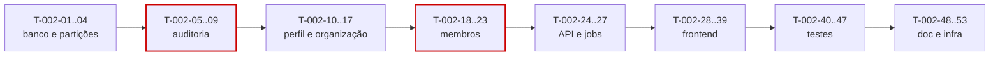

# 002 — Users & Tenant · Tarefas

## 1. Convenções

| Campo | Regra |
|---|---|
| **ID** | `T-002-XX`, estável e imutável |
| **Descrição** | Verbo no infinitivo + objeto. Uma tarefa = uma unidade entregável |
| **Dependências** | IDs de tarefas ou features que precisam estar concluídas |
| **Estimativa** | Horas-agente |
| **Prioridade** | `P0` bloqueante · `P1` necessária · `P2` cortável |

## 2. Resumo

| Grupo | Tarefas | Estimativa |
|---|:--:|---|
| Banco | 4 | 8h |
| Backend | 18 | 48h |
| Frontend | 12 | 32h |
| Testes | 8 | 24h |
| Documentação | 3 | 5h |
| Infra | 3 | 6h |
| **Total** | **48** | **123h ≈ 6 dias-agente** |

## 3. Banco

| ID | Descrição | Dependências | Estimativa | Prioridade |
|---|---|---|:--:|:--:|
| T-002-01 | Criar `V007__create_audit_logs.sql` particionada por mês em `occurred_at`, **sem** `updated_at` e `deleted_at` | 001 | 3h | P0 |
| T-002-02 | Criar `V008__audit_log_partitions.sql` com as partições dos próximos 12 meses e função de criação automática | T-002-01 | 2h | P0 |
| T-002-03 | Restringir a permissão de banco em `audit_logs` a `INSERT` e `SELECT` para o usuário da aplicação | T-002-01 | 1h | P0 |
| T-002-04 | Criar `V009__tenant_settings_defaults.sql` com backfill dos defaults da §6.2 e índice `idx_memberships_tenant_role` | 001 | 2h | P0 |

## 4. Backend

### 4.1 Auditoria

| ID | Descrição | Dependências | Estimativa | Prioridade |
|---|---|---|:--:|:--:|
| T-002-05 | Criar entidade `AuditLog` sem campos de atualização e exclusão (INV-AUD-01) | T-002-01 | 2h | P0 |
| T-002-06 | Implementar `AuditLogWriter` gravando na mesma transação, com diff apenas dos campos alterados | T-002-05 | 4h | P0 |
| T-002-07 | Integrar `AuditLogWriter` ao `AuditListener` para as entidades auditadas obrigatórias | T-002-06 | 3h | P0 |
| T-002-08 | Criar `AuditLogRepository` com `search` por `Specification`, **sem** `save` público | T-002-05 | 2h | P0 |
| T-002-09 | Implementar `AuditLogService` com default de 30 dias quando o período está ausente | T-002-08 | 2,5h | P0 |

### 4.2 Perfil e organização

| ID | Descrição | Dependências | Estimativa | Prioridade |
|---|---|---|:--:|:--:|
| T-002-10 | Implementar `UserProfileService` (perfil, preferências) com ownership | 001 | 3h | P0 |
| T-002-11 | Implementar upload e remoção de avatar com allowlist e magic number | T-002-10 | 3h | P1 |
| T-002-12 | Implementar `TenantSettingsValidator` com faixas e validação cruzada da §6.2 | 001 | 3h | P0 |
| T-002-13 | Implementar `TimezoneValidator` contra `ZoneId.getAvailableZoneIds()` | — | 1h | P0 |
| T-002-14 | Implementar `TenantSettingsService` como porta única de leitura, com aplicação de defaults | T-002-12 | 3h | P0 |
| T-002-15 | Implementar `TenantService` (consultar, editar, `settings`) com `version` e rejeição de `slug` | T-002-14 | 4h | P0 |
| T-002-16 | Implementar cancelamento do tenant com senha, nome e guarda de período em `CLOSING` | T-002-15 | 3h | P1 |
| T-002-17 | Implementar `TenantExportService` assíncrono, em streaming, com URL assinada de 15 min | T-002-15 | 5h | P1 |

### 4.3 Membros

| ID | Descrição | Dependências | Estimativa | Prioridade |
|---|---|---|:--:|:--:|
| T-002-18 | Implementar `LastOwnerGuard` com lock pessimista na contagem (RN-455) | T-002-04 | 3h | P0 |
| T-002-19 | Implementar `SelfRoleChangeGuard` (RN-456) e `AdminOverOwnerGuard` (nota ¹) | 001 | 2h | P0 |
| T-002-20 | Implementar `MembershipService`: listar, alterar papel, suspender, reativar na ordem da §6.1 | T-002-18, T-002-19 | 4h | P0 |
| T-002-21 | Implementar `MemberRemovalOrchestrator`: descarte de timer, reatribuição de tickets, preservação de registros | T-002-20 | 4h | P0 |
| T-002-22 | Implementar `InvitationService` (emissão e reenvio, RN-457) com e-mail pós-commit | T-002-20 | 3h | P1 |
| T-002-23 | Implementar a invalidação de access tokens ao alterar papel (IMP-04) | T-002-20 | 2h | P0 |

### 4.4 API e jobs

| ID | Descrição | Dependências | Estimativa | Prioridade |
|---|---|---|:--:|:--:|
| T-002-24 | Criar todos os DTOs da §23 com Bean Validation e `@AssertTrue` cruzado | T-002-15 | 3h | P0 |
| T-002-25 | Criar `UserProfileMapper`, `TenantMapper`, `MemberMapper` (com `availableActions`), `AuditLogMapper` (IP mascarado) | T-002-24 | 3h | P0 |
| T-002-26 | Criar `UserProfileController`, `TenantController`, `MemberController`, `AuditLogController` (somente `GET`) | T-002-25 | 4h | P0 |
| T-002-27 | Implementar `TenantPurgeJob`, `AuditPartitionJob`, `AuditArchiveJob`, `ExpiredInvitationJob` com `@SchedulerLock` | T-002-16 | 4h | P1 |

## 5. Frontend

| ID | Descrição | Dependências | Estimativa | Prioridade |
|---|---|---|:--:|:--:|
| T-002-28 | Criar `TenantApi`, `MemberApi`, `AuditApi` | T-002-26 | 2h | P0 |
| T-002-29 | Criar `TenantStore`, `MemberStore` (com `owners` e `canRemove` computed), `AuditStore` | T-002-28 | 4h | P0 |
| T-002-30 | Criar `dt-settings-layout` (layout L9) com navegação lateral | — | 2h | P0 |
| T-002-31 | Criar `ProfileSettingsPage` (P26) e `dt-avatar-upload` | T-002-30 | 4h | P0 |
| T-002-32 | Criar `PreferencesSettingsPage` (P27) com aplicação imediata do tema | T-002-30 | 3h | P1 |
| T-002-33 | Criar `dt-tenant-settings-form` com avisos de impacto por chave | T-002-29 | 4h | P0 |
| T-002-34 | Criar `OrganizationSettingsPage` (P29) integrando dados, logo e `settings` | T-002-33 | 3h | P0 |
| T-002-35 | Criar `dt-danger-zone` com dupla confirmação de cancelamento | T-002-34 | 2h | P1 |
| T-002-36 | Criar `dt-role-selector` e `dt-member-row` com ações condicionadas ao papel | T-002-29 | 3h | P1 |
| T-002-37 | Criar `TeamSettingsPage` (P32) com convite, papel e remoção | T-002-36 | 3h | P1 |
| T-002-38 | Criar `dt-audit-entry` com visualização de diff antes/depois | T-002-29 | 3h | P1 |
| T-002-39 | Criar `AuditSettingsPage` (P33) com filtros persistidos na URL | T-002-38 | 3h | P1 |

## 6. Testes

| ID | Descrição | Dependências | Estimativa | Prioridade |
|---|---|---|:--:|:--:|
| T-002-40 | Testes unitários de `TenantSettingsValidator` cobrindo todas as bordas de faixa e a validação cruzada | T-002-12 | 4h | P0 |
| T-002-41 | Testes de RN-455 por todos os caminhos (remoção, suspensão, rebaixamento) e sob concorrência | T-002-18 | 4h | P0 |
| T-002-42 | Testes de RN-456 para todos os papéis | T-002-19 | 2h | P0 |
| T-002-43 | Teste de integração da remoção de membro com 200 work logs, tickets e timer ativo | T-002-21 | 4h | P0 |
| T-002-44 | Testes de auditoria: toda ação da §18 gera registro com diff correto | T-002-07 | 4h | P0 |
| T-002-45 | Teste de imutabilidade de `audit_logs` (tentativa de `UPDATE` e `DELETE` falha) | T-002-03 | 2h | P0 |
| T-002-46 | Teste de que alterar `settings` não modifica nenhum work log existente | T-002-15 | 2h | P0 |
| T-002-47 | Testes de API, isolamento entre tenants e frontend (stores e formulários) | T-002-39 | 2h | P0 |

## 7. Documentação

| ID | Descrição | Dependências | Estimativa | Prioridade |
|---|---|---|:--:|:--:|
| T-002-48 | Sincronizar `docs/04-api/users.md` com o comportamento implementado | T-002-26 | 2h | P0 |
| T-002-49 | Documentar o formato do arquivo de exportação (LGPD, AQ-12) | T-002-17 | 2h | P1 |
| T-002-50 | Atualizar o status da feature em `implementation-order.md` §12 | T-002-47 | 0,5h | P0 |

## 8. Infra

| ID | Descrição | Dependências | Estimativa | Prioridade |
|---|---|---|:--:|:--:|
| T-002-51 | Configurar o bucket de object storage para avatares, logos e exportações, com URLs assinadas | T-002-11 | 3h | P1 |
| T-002-52 | Configurar as métricas da §29 e o alerta crítico de `audit.write.failures` | T-002-44 | 2h | P0 |
| T-002-53 | Adicionar ao pipeline a verificação de que `audit_logs` não possui rota de escrita | T-002-45 | 1h | P0 |

## 9. Ordem de execução

**Caminho crítico:** `T-002-01 → 05 → 06 → 07 → 14 → 15 → 18 → 20 → 21 → 26 → 43`.
`T-002-06` (escrita de auditoria) e `T-002-18` (guarda do último OWNER) são os pontos de maior risco.

**Paralelizável:** `T-002-10`/`T-002-11` (perfil) são independentes de `T-002-18` a `T-002-23` (membros). `T-002-30` a `T-002-32` (telas de perfil) podem ser desenvolvidas contra o contrato, com MSW.

## 10. Critérios de conclusão por grupo

| Grupo | Concluído quando |
|---|---|
| Banco | `audit_logs` particionada, sem colunas de atualização, com permissão restrita a `INSERT`/`SELECT` comprovada por teste |
| Backend | Nenhum caminho deixa um tenant sem OWNER; `settings` valida todas as faixas; remoção preserva 100% dos registros; auditoria grava na mesma transação |
| Frontend | Formulário de `settings` exibe o impacto de cada chave; cancelamento exige dupla confirmação; trilha filtrável com filtros na URL; zero violações do axe-core |
| Testes | Cobertura ≥ 90% em services e validators; RN-455 provada sob concorrência; imutabilidade da auditoria comprovada |
| Documentação | `users.md` sincronizado; formato de exportação documentado |
| Infra | Object storage configurado; alerta de `audit.write.failures` ativo; gate de rota de auditoria no pipeline |
