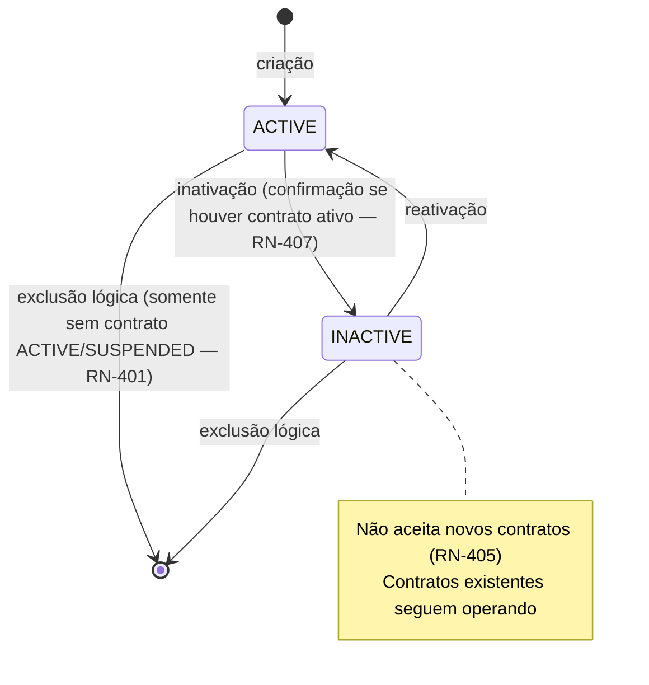
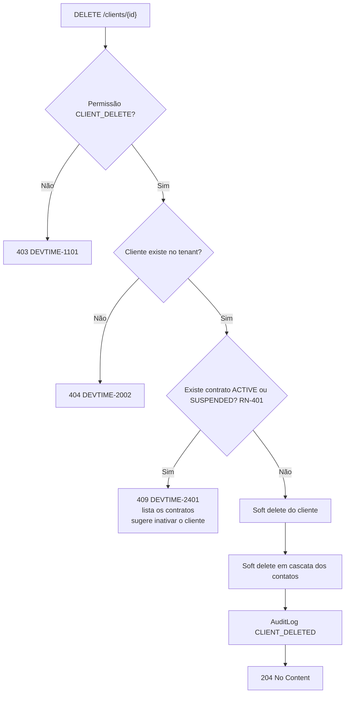
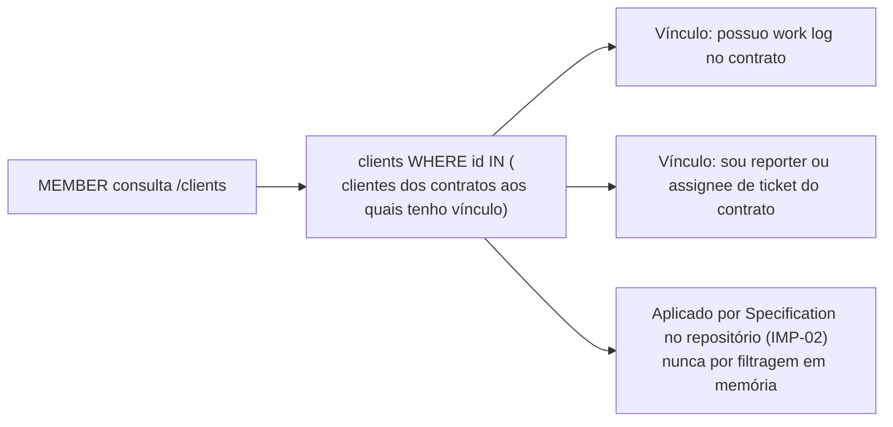

# 003 — Clients

| Campo | Valor |
|---|---|
| **Feature** | 003 |
| **Épico** | EP-04 (Gestão de Clientes) |
| **Sprint** | S3 |
| **Prioridade** | P0 |
| **Complexidade** | Baixa |
| **Estimativa** | 13 pts · 3 dias-agente |
| **Stories** | US-030 a US-039 |
| **Status** | SPEC_APPROVED |

## 1. Objetivo

Gerir a carteira de clientes do tenant: cadastro com validação de CPF/CNPJ, contatos, inativação controlada, exclusão restrita por dependência e visão consolidada de consumo por cliente.

## 2. Problema que resolve

O cliente é a contraparte de todo contrato e o destinatário de todo relatório. Sem um cadastro com razão social, documento e contato correto, o PDF entregue não é apresentável (PV-05) e o freelancer volta à planilha. A validação de CPF/CNPJ evita o erro mais comum de digitação em documento fiscal, que só é descoberto na emissão da nota.

## 3. Escopo

| # | Item | Referência |
|---|---|---|
| E-01 | CRUD de cliente com soft delete | §6.4 `entities.md` |
| E-02 | Validação de dígitos verificadores de CPF e CNPJ | RN-402 |
| E-03 | Unicidade de nome e de documento por tenant | RN-403, RN-404 |
| E-04 | Gestão de contatos, com no máximo um primário | RN-406, INV-CON-01 |
| E-05 | Inativação e reativação com alerta sobre contratos ativos | RN-405, RN-407 |
| E-06 | Restrição de exclusão com contrato ativo ou suspenso | RN-401 |
| E-07 | Cor automática derivada do nome, para uso em gráficos | §6.4 |
| E-08 | Resumo consolidado: contratos, saldo e consumo do cliente | §8 `clients.md` |
| E-09 | Escopo de dados de `MEMBER` (apenas clientes vinculados) | nota ² `permissions.md` |
| E-10 | Telas P10, P11 e P12 | `pages.md` |

## 4. Fora do escopo

| Item | Onde está | Motivo |
|---|---|---|
| Contratos do cliente | `004-contracts` | Entidade própria |
| Relatório consolidado por cliente | `012-reports` | É saída, não cadastro |
| Portal de acesso do cliente | `future/018-subscriptions` | F6 |
| Envio automático de relatório por e-mail ao contato | `012-reports` | Depende de exportação |
| Campos personalizados | Fora do roadmap | Conflito CF-02 de `personas.md` |

## 5. Dependências

### 5.1 Features
| Feature | Tipo | O que consome |
|---|---|---|
| `001-authentication` | Bloqueante | `TenantContext`, permissões |
| `002-users` | Bloqueante | `tenant.settings` (moeda, locale), auditoria |
| `004-contracts` | Consumidora | Consulta `ClientService` para validar cliente `ACTIVE` (RN-201) |
| `012-reports` | Consumidora | Dados do cliente no cabeçalho do relatório (RN-703) |

### 5.2 Documentos obrigatórios
| Documento | Seções relevantes |
|---|---|
| `docs/04-api/clients.md` | §5 a §10 |
| `docs/02-domain/entities.md` | §6.4 Client, §6.5 Contact, §7.1 Address |
| `docs/02-domain/business-rules.md` | RN-401 a RN-407 |
| `docs/02-domain/state-machines.md` | §4.4 Client |
| `docs/02-domain/permissions.md` | §6.3, §7, nota ² |
| `docs/05-ui/pages.md` | P10, P11, P12 |

### 5.3 Infraestrutura
| Componente | Uso |
|---|---|
| PostgreSQL | `clients`, `contacts` |
| Nenhuma integração externa | Validação de documento é algorítmica, não consulta a Receita Federal |

## 6. Regras de negócio

| ID | Tipo | Enunciado resumido | Erro | Onde é aplicada |
|---|---|---|---|---|
| RN-401 | Bloqueante | Cliente com contrato `ACTIVE` ou `SUSPENDED` não pode ser excluído | `DEVTIME-2401` / 409 | `ClientService.delete` |
| RN-402 | Bloqueante | CPF/CNPJ deve ser válido pelos dígitos verificadores | `DEVTIME-2402` / 422 | `DocumentValidator` |
| RN-403 | Bloqueante | `(tenantId, documentNumber)` único entre não excluídos | `DEVTIME-2403` / 409 | Índice parcial + service |
| RN-404 | Bloqueante | `(tenantId, lower(name))` único entre não excluídos | `DEVTIME-2404` / 409 | Índice parcial + service |
| RN-405 | Bloqueante | Cliente `INACTIVE` não aceita novos contratos | `DEVTIME-2405` / 422 | `ClientService.getActiveForContract` |
| RN-406 | Bloqueante | No máximo um contato primário; marcar um desmarca o anterior | — | `ContactService` |
| RN-407 | Automática | Inativar com contratos ativos exige confirmação; contratos **não** são inativados em cascata | — | `ClientService.deactivate` |
| RN-003 | Automática | Exclusão é lógica | — | Todas |
| RN-004 | Bloqueante | Alteração exige `version` correspondente | `DEVTIME-2004` / 409 | Todas as edições |
| RN-012 | Bloqueante | Listagem paginada, `size` máximo 100 | `DEVTIME-2006` / 400 | `ClientController` |
| RN-001 | Bloqueante | Toda operação no tenant do usuário autenticado | `DEVTIME-1200` / 403 | Filtro automático |

### 6.1 Ordem de aplicação — criação de cliente

| # | Verificação | Falha |
|---|---|---|
| 1 | Permissão `CLIENT_CREATE` | `403 DEVTIME-1101` |
| 2 | Formato dos campos (Bean Validation) | `400` |
| 3 | Documento válido, quando informado (RN-402) | `422 DEVTIME-2402` |
| 4 | Nome único no tenant (RN-404) | `409 DEVTIME-2404` |
| 5 | Documento único no tenant (RN-403) | `409 DEVTIME-2403` |
| 6 | Persiste, deriva a cor do nome, gera auditoria | — |

**Por que a ordem é esta:** a validação de formato do documento (3) precede a de unicidade (5) porque um documento inválido não deve consumir uma consulta ao banco, e porque a mensagem "CPF inválido" é mais útil que "CPF já cadastrado" quando ambos se aplicam.

### 6.2 Invariantes envolvidas
| ID | Invariante | Como é garantida |
|---|---|---|
| INV-CLI-01 | `(tenantId, documentNumber)` único quando não nulo | Índice único parcial (`WHERE document_number IS NOT NULL AND deleted_at IS NULL`) |
| INV-CLI-02 | `(tenantId, lower(name))` único entre não excluídos | Índice único parcial sobre expressão |
| INV-CLI-03 | Cliente com contrato ativo não é excluído | RN-401 verificada com contagem |
| INV-CLI-04 | `INACTIVE` impede novos contratos | RN-405 em `004-contracts` |
| INV-CON-01 | No máximo um contato primário por cliente | Índice único parcial (`WHERE is_primary = true`) + desmarcação automática |

## 7. Fluxo principal — cadastro de cliente

1. Usuário com `CLIENT_CREATE` abre P12.
2. Preenche nome, razão social, tipo e número do documento, e-mail, telefone, site, endereço e observações.
3. O front valida o formato do documento localmente (espelho da regra do servidor — FM-02) e exibe a máscara adequada ao tipo.
4. Envia `POST /api/v1/clients`.
5. `ClientService` aplica a ordem da §6.1.
6. Persiste com `status = ACTIVE`, `activeContractsCount = 0` e `color` derivada deterministicamente do nome.
7. Gera `AuditLog` `CLIENT_CREATED` na mesma transação.
8. Retorna `201` com `Location` e o cliente criado.
9. O front navega para P11, oferecendo a ação "criar contrato" — o caminho natural imediato.

## 8. Fluxos alternativos

| # | Fluxo | Gatilho | Comportamento |
|---|---|---|---|
| FA-01 | Cadastro sem documento | Campo vazio | Permitido. A unicidade de documento não se aplica (índice parcial) |
| FA-02 | Documento tipo `OTHER` | Cliente estrangeiro | Nenhuma validação de dígito; apenas unicidade e tamanho |
| FA-03 | Edição de cliente | P12 em modo edição | `PATCH` com `version`; documento pode ser alterado, revalidando RN-402 e RN-403 |
| FA-04 | Adição de contato | P11 | `POST /clients/{id}/contacts`; ao marcar `isPrimary`, o anterior é desmarcado (RN-406) |
| FA-05 | Inativação sem contratos ativos | P11 | Direta, sem confirmação |
| FA-06 | Inativação com contratos ativos | P11 | Exibe a lista de contratos afetados e exige confirmação; os contratos **continuam operando** (RN-407) |
| FA-07 | Reativação | P11 | Volta a `ACTIVE` e libera a criação de contratos |
| FA-08 | Exclusão sem contratos | P11 | Soft delete; some de todas as consultas |
| FA-09 | Exclusão com contratos ativos | P11 | `409 DEVTIME-2401`; a mensagem lista os contratos e sugere inativar |
| FA-10 | Resumo consolidado | P11 | `GET /clients/{id}/summary` com contratos, saldo agregado e consumo do período corrente |
| FA-11 | `MEMBER` consultando clientes | P10 | Vê apenas clientes com os quais tem vínculo (nota ²); os demais retornam `404` |

## 9. Diagramas

### 9.1 Ciclo de vida e restrições

### 9.2 Exclusão com verificação de dependência

### 9.3 Escopo de dados de `MEMBER`

## 10. Estados

| Estado | Significado | Operações permitidas | Operações bloqueadas |
|---|---|---|---|
| `ACTIVE` | Operacional | Editar, criar contrato, inativar, excluir (se sem contrato ativo) | — |
| `INACTIVE` | Inativo | Editar, reativar, excluir | Criar novo contrato (`DEVTIME-2405`) |
| *excluído* | Soft delete | — | Todas. Invisível a toda consulta padrão |

## 11. Transições

| Origem | Destino | Gatilho | Guarda | Efeito | Permissão |
|---|---|---|---|---|---|
| — | `ACTIVE` | Criação | RN-402, RN-403, RN-404 | Deriva `color`; `activeContractsCount = 0` | `CLIENT_CREATE` |
| `ACTIVE` | `INACTIVE` | Inativação | Confirmação explícita se houver contrato ativo (RN-407) | Bloqueia novos contratos; contratos existentes seguem | `CLIENT_DELETE` |
| `INACTIVE` | `ACTIVE` | Reativação | — | Libera criação de contratos | `CLIENT_DELETE` |
| `ACTIVE`/`INACTIVE` | *excluído* | Exclusão | Nenhum contrato `ACTIVE`/`SUSPENDED` (RN-401) | Soft delete; cascata soft nos contatos | `CLIENT_DELETE` |

### 11.1 Transições proibidas
| Transição | Motivo da proibição |
|---|---|
| Exclusão com contrato `ACTIVE`/`SUSPENDED` | ART-004: nenhum dado com histórico financeiro é destruído |
| Inativação em cascata dos contratos | RN-407: o cliente pausado não implica contrato encerrado; a decisão comercial é separada |
| Restauração de cliente excluído por rota da API | Restauração é operação de suporte, registrada em auditoria |

## 12. Casos de erro

| Código | HTTP | Situação | Mensagem ao usuário | Regra |
|---|:--:|---|---|---|
| `DEVTIME-1101` | 403 | Papel sem a permissão | Você não tem permissão para esta ação | §7 permissions |
| `DEVTIME-2002` | 404 | Cliente de outro tenant ou fora do escopo | Recurso não encontrado | RN-002, CE-P-05 |
| `DEVTIME-2004` | 409 | Conflito de `version` | O registro foi alterado. Recarregue e tente novamente | RN-004 |
| `DEVTIME-2006` | 400 | `size` acima de 100 | Tamanho de página inválido | RN-012 |
| `DEVTIME-2401` | 409 | Exclusão com contrato ativo | Cliente com contrato ativo não pode ser excluído | RN-401 |
| `DEVTIME-2402` | 422 | Documento inválido | CPF/CNPJ inválido | RN-402 |
| `DEVTIME-2403` | 409 | Documento duplicado | Já existe um cliente com este documento | RN-403 |
| `DEVTIME-2404` | 409 | Nome duplicado | Já existe um cliente com este nome | RN-404 |
| `DEVTIME-2405` | 422 | Contrato para cliente inativo | Cliente inativo não aceita novos contratos | RN-405 |
| `DEVTIME-1201` | 403 | Escrita em tenant suspenso | Organização suspensa: apenas leitura | RN-007 |

### 12.1 Casos extremos

| # | Caso | Comportamento esperado |
|---|---|---|
| CX-01 | Dois clientes com o mesmo nome, diferindo apenas na caixa | Rejeitado (RN-404 é case-insensitive) |
| CX-02 | Cliente excluído e novo cliente com o mesmo nome | Permitido: o índice único é parcial, ignorando excluídos |
| CX-03 | Documento com máscara (`12.345.678/0001-95`) | Normalizado para apenas dígitos antes de validar e persistir |
| CX-04 | CPF com todos os dígitos iguais (`11111111111`) | Rejeitado — passa na fórmula, mas é sequência inválida conhecida |
| CX-05 | CNPJ de filial com mesma raiz de matriz já cadastrada | Permitido: a unicidade é sobre o número completo, não sobre a raiz |
| CX-06 | Cliente sem documento | Permitido; a unicidade de documento não se aplica |
| CX-07 | Dois contatos marcados como primários na mesma requisição | Rejeitado por validação de formato antes da persistência |
| CX-08 | Marcar contato como primário quando já existe outro | O anterior é desmarcado automaticamente na mesma transação (RN-406) |
| CX-09 | Exclusão do contato primário | Permitida; o cliente fica sem primário até que outro seja marcado |
| CX-10 | Inativar cliente com 10 contratos ativos | Confirmação lista os 10; nenhum é alterado (RN-407) |
| CX-11 | Reativar cliente cujos contratos foram encerrados no período de inatividade | Cliente volta a `ACTIVE`; contratos `ENDED` permanecem `ENDED` (CE-15) |
| CX-12 | Nome com 150 caracteres e acentos | Aceito; a unicidade compara sem diferenciar caixa, mas **com** acentos |
| CX-13 | `MEMBER` acessa cliente ao qual não tem vínculo por id direto | `404 DEVTIME-2002` (CE-P-05), nunca `403` |
| CX-14 | Cliente com 500 contratos históricos | O resumo é paginado; `activeContractsCount` é desnormalizado e não exige agregação |

## 13. Modelo de dados

### 13.1 Entidades impactadas
| Entidade | Operação | Tabela | Referência |
|---|---|---|---|
| `Client` | Cria, lê, atualiza, soft delete | `clients` | §6.4 |
| `Contact` | Cria, lê, atualiza, soft delete | `contacts` | §6.5 |
| `Contract` | Lê (contagem para RN-401) | `contracts` | Via `ContractService` |
| `AuditLog` | Cria | `audit_logs` | §6.20 |

### 13.2 Campos obrigatórios na criação
| Campo | Tipo | Origem | Imutável | Validação |
|---|---|---|:--:|---|
| `tenantId` | UUID | `TenantContext` | ✔ 🔒 | Nunca da requisição (ART-021) |
| `name` | String(150) | Request | ✖ | 2–150; único por tenant (RN-404) |
| `documentType` | enum | Request | ✖ | `CPF`, `CNPJ`, `OTHER`; opcional |
| `documentNumber` | String(20) | Request, normalizado | ✖ | Apenas dígitos; validado se CPF/CNPJ (RN-402); único (RN-403) |
| `status` | enum | Sistema | ✖ | `ACTIVE` |
| `color` | String(7) | Derivado do nome | ✖ | Hex; determinístico |
| `activeContractsCount` | int | Sistema | ✖ 💾 | `0`; recalculado por evento de contrato |
| `contact.clientId` | UUID | Path | ✔ 🔒 | Cliente do tenant |
| `contact.name` | String(150) | Request | ✖ | 2–150 |

### 13.3 Migrations
| Migration | Conteúdo | Compatibilidade |
|---|---|---|
| `V010__create_clients.sql` | `clients` + `address` embutido + índices únicos parciais | Nova tabela |
| `V011__create_contacts.sql` | `contacts` + índice único parcial de `is_primary` por cliente | Nova tabela |

### 13.4 Índices
| Índice | Colunas | Sustenta |
|---|---|---|
| `uq_clients_tenant_name` | `(tenant_id, lower(name))` WHERE `deleted_at IS NULL` | RN-404, INV-CLI-02 |
| `uq_clients_tenant_document` | `(tenant_id, document_number)` WHERE `document_number IS NOT NULL AND deleted_at IS NULL` | RN-403, INV-CLI-01 |
| `idx_clients_tenant_status_name` | `(tenant_id, status, lower(name))` | Listagem padrão ordenada |
| `idx_clients_tenant_search` | GIN sobre `name` e `legal_name` sem acento | Busca textual parcial |
| `idx_contacts_client` | `(tenant_id, client_id)` WHERE `deleted_at IS NULL` | Contatos do cliente |
| `uq_contacts_primary` | `(client_id)` WHERE `is_primary = true AND deleted_at IS NULL` | INV-CON-01 |

## 14. Endpoints utilizados

| Método | Rota | Operação | Permissão | Sucesso | Doc |
|---|---|---|---|:--:|---|
| GET | `/api/v1/clients` | Listar com filtro e busca | `CLIENT_VIEW` | 200 | §5 |
| POST | `/api/v1/clients` | Criar | `CLIENT_CREATE` | 201 | §6 |
| GET | `/api/v1/clients/{id}` | Detalhar | `CLIENT_VIEW` | 200 | §7 |
| GET | `/api/v1/clients/{id}/summary` | Resumo consolidado | `CLIENT_VIEW` | 200 | §8 |
| PUT | `/api/v1/clients/{id}` | Substituir | `CLIENT_UPDATE` | 200 | §9.1 |
| PATCH | `/api/v1/clients/{id}` | Atualizar parcialmente | `CLIENT_UPDATE` | 200 | §9.1 |
| POST | `/api/v1/clients/{id}/deactivate` | Inativar | `CLIENT_DELETE` | 200 | §9.2 |
| POST | `/api/v1/clients/{id}/reactivate` | Reativar | `CLIENT_DELETE` | 200 | §9.2 |
| DELETE | `/api/v1/clients/{id}` | Excluir (lógico) | `CLIENT_DELETE` | 204 | §9.3 |
| POST | `/api/v1/clients/{id}/contacts` | Adicionar contato | `CLIENT_UPDATE` | 201 | §10.1 |
| PATCH | `/api/v1/clients/{id}/contacts/{contactId}` | Editar contato | `CLIENT_UPDATE` | 200 | §10.1 |
| DELETE | `/api/v1/clients/{id}/contacts/{contactId}` | Remover contato | `CLIENT_UPDATE` | 204 | §10.2 |

## 15. Eventos

| Evento | Publicado por | Consumidores | Momento | Efeito |
|---|---|---|---|---|
| `ClientCreatedEvent` | `ClientService` | Métricas | Após o commit | Telemetria |
| `ClientDeactivatedEvent` | `ClientService` | `013-notifications` | Após o commit | Notifica OWNER/ADMIN se houver contratos ativos |
| `ContractStatusChangedEvent` | `004-contracts` | `ClientService` | **Dentro** da transação | Recalcula `activeContractsCount` incrementalmente |

**Justificativa:** `activeContractsCount` é desnormalizado (§9 de `entities.md`) e atualizado dentro da transação de mudança de status do contrato. Fora dela, a listagem de clientes exibiria contagem divergente logo após a ativação. O `DenormalizationReconcileJob` noturno corrige eventuais divergências.

## 16. Permissões

| Operação | Permissão | Papéis | Ownership | Escopo de dados |
|---|---|---|---|---|
| Listar e detalhar | `CLIENT_VIEW` | OWNER, ADMIN, MANAGER, VIEWER; `MEMBER` com restrição ² | — | `MEMBER`: apenas clientes vinculados |
| Resumo consolidado | `CLIENT_VIEW` + `CONTRACT_VIEW_FINANCIAL` para colunas monetárias | Idem | — | `MEMBER` não vê valores |
| Criar | `CLIENT_CREATE` | OWNER, ADMIN, MANAGER | — | — |
| Editar | `CLIENT_UPDATE` | OWNER, ADMIN, MANAGER | — | — |
| Inativar, reativar, excluir | `CLIENT_DELETE` | OWNER, ADMIN | — | — |
| Gerir contatos | `CLIENT_UPDATE` | OWNER, ADMIN, MANAGER | — | — |

**Restrição ²:** `MEMBER` enxerga apenas clientes dos contratos aos quais tem vínculo — possui work log no contrato, ou é `reporterId`/`assigneeId` de ticket do contrato. Aplicado por `Specification` no repositório (IMP-02), **nunca** por filtragem em memória.

## 17. Validações

### 17.1 Camada 1 — Formato (`400`)
| Campo | Restrição | Mensagem |
|---|---|---|
| `name` | `@NotBlank`, `@Size(min=2,max=150)` | Informe o nome do cliente |
| `legalName` | `@Size(max=200)` | Razão social muito longa |
| `documentType` | Enum válido | Tipo de documento inválido |
| `documentNumber` | `@Size(max=20)`, apenas dígitos após normalização | Documento inválido |
| `email` | `@Email`, `@Size(max=255)` | Informe um e-mail válido |
| `phone` | Formato E.164 | Telefone inválido |
| `website` | URL válida, `@Size(max=255)` | Endereço de site inválido |
| `notes` | `@Size(max=4000)` | Observações muito longas |
| `color` | Hex `#RRGGBB` | Cor inválida |
| `address.postalCode` | `@Size(max=20)` | CEP inválido |
| `contact.name` | `@NotBlank`, `@Size(min=2,max=150)` | Informe o nome do contato |
| `size` | `@Max(100)` | Tamanho de página inválido |

### 17.2 Camada 2 — Negócio
| Validação | Regra | Erro |
|---|---|---|
| Dígitos verificadores de CPF/CNPJ | RN-402 | `DEVTIME-2402` / 422 |
| CPF/CNPJ com dígitos repetidos | RN-402 (derivada) | `DEVTIME-2402` / 422 |
| Nome único no tenant | RN-404 | `DEVTIME-2404` / 409 |
| Documento único no tenant | RN-403 | `DEVTIME-2403` / 409 |
| Exclusão sem contrato ativo ou suspenso | RN-401 | `DEVTIME-2401` / 409 |
| Inativação com contratos exige confirmação | RN-407 | `409` com lista de contratos até confirmar |
| `version` correspondente | RN-004 | `DEVTIME-2004` / 409 |

### 17.3 Camada 3 — Consistência
| Constraint | Garante | Mapeado para |
|---|---|---|
| `uq_clients_tenant_name` | INV-CLI-02 | `DEVTIME-2404` |
| `uq_clients_tenant_document` | INV-CLI-01 | `DEVTIME-2403` |
| `uq_contacts_primary` | INV-CON-01 | `DEVTIME-2001` |
| FK `contracts.client_id` restrita | INV-CLI-03 | `DEVTIME-2401` |

## 18. Auditoria

| Ação | `action` | `beforeState` | `afterState` | Metadata |
|---|---|---|---|---|
| Criação | `CLIENT_CREATED` | — | `{name, documentNumber, status}` | IP, traceId |
| Edição | `CLIENT_UPDATED` | Campos alterados | Campos alterados | IP, traceId |
| Inativação | `CLIENT_DEACTIVATED` | `{status}` | `{status}` | Contratos ativos no momento |
| Reativação | `CLIENT_REACTIVATED` | `{status}` | `{status}` | traceId |
| Exclusão | `CLIENT_DELETED` | `{status, name}` | `{deletedAt}` | IP, traceId |
| Contato adicionado | `CONTACT_CREATED` | — | `{name, isPrimary}` | traceId |
| Contato removido | `CONTACT_DELETED` | `{name}` | `{deletedAt}` | traceId |

## 19. Segurança

| # | Vetor | Mitigação | Verificação |
|---|---|---|---|
| SG-01 | Enumeração da carteira de clientes de outro tenant | Filtro automático de tenant; `404` para id externo | Suíte de isolamento |
| SG-02 | `MEMBER` mapeando a carteira completa | Escopo por `Specification` no repositório; contagem e paginação também filtradas | Inspeção de SQL em teste |
| SG-03 | Injeção na busca textual | `Specification` tipada; nunca concatenação de string (RP-04) | Teste com payload de injeção |
| SG-04 | Vazamento de documento em log | Documento mascarado, exceto os 4 últimos dígitos | Inspeção de log |
| SG-05 | Exclusão em massa acidental | `CLIENT_DELETE` restrita a OWNER/ADMIN; soft delete reversível por suporte | Matriz de permissões |
| SG-06 | Uso do resumo para inferir faturamento por papel sem acesso | `CONTRACT_VIEW_FINANCIAL` controla as colunas monetárias | Teste por papel |

### 19.1 LGPD

| Dado pessoal | Base legal | Retenção | Exportação | Anonimização | Proibido em log |
|---|---|---|---|---|---|
| Nome e razão social do cliente | Execução de contrato | Vida do tenant | ✔ `GET /tenant/export` | `Cliente Removido` | Permitido (é dado de pessoa jurídica na maioria dos casos) |
| CPF de cliente pessoa física | Obrigação legal | 5 anos após o último contrato | ✔ | Mascarado, exceto os 4 últimos dígitos | ❌ completo |
| E-mail e telefone do contato | Execução de contrato | Vida do cliente | ✔ | Removidos | ❌ e-mail em claro |
| Endereço | Execução de contrato | Idem | ✔ | Removido | ❌ |

**Observação:** quando `documentType = CPF`, o cliente é pessoa física e todo o registro é dado pessoal. O tratamento de retenção e anonimização é o mesmo aplicado a usuários.

## 20. Performance

| Operação | Meta | Índice/estratégia | Risco |
|---|---|---|---|
| Listagem com busca | p95 < 300 ms | `idx_clients_tenant_search` (GIN) + projeção | Busca sem índice degradaria com 10k clientes |
| Detalhe | p95 < 150 ms | PK + join de contatos | — |
| Resumo consolidado | p95 < 500 ms | `activeContractsCount` desnormalizado; agregação de saldo por período corrente | Cliente com 500 contratos |
| Verificação RN-401 | < 30 ms | Índice `(tenant_id, client_id, status)` em `contracts` | — |
| Escopo de `MEMBER` | p95 < 400 ms | Subconsulta com `EXISTS`, não `IN` com lista materializada | Degradaria com muitos contratos |

### 20.1 Escalabilidade

`clients` é uma tabela pequena mesmo em tenants grandes (centenas a poucos milhares de linhas). O risco real está no **resumo**, que agrega saldo de todos os contratos. A mitigação é limitar o resumo ao período corrente de cada contrato e paginar a lista de contratos, nunca agregando o histórico completo. Listagens usam projeção (`ClientSummaryProjection`), nunca a entidade completa (RP-03).

## 21. Componentes Frontend

### 21.1 Rotas
| Rota | Componente | Guard | Lazy | Tela |
|---|---|---|:--:|---|
| `/clients` | `ClientListPage` | `permissionGuard(['CLIENT_VIEW'])` | ✔ | P10 |
| `/clients/:id` | `ClientDetailPage` | `permissionGuard(['CLIENT_VIEW'])` | ✔ | P11 |
| `/clients/new` | `ClientFormPage` | `permissionGuard(['CLIENT_CREATE'])` | ✔ | P12 |
| `/clients/:id/edit` | `ClientFormPage` | `permissionGuard(['CLIENT_UPDATE'])` | ✔ | P12 |

### 21.2 Componentes
| Componente | Tipo | Responsabilidade | Inputs | Outputs |
|---|---|---|---|---|
| `ClientListPage` | Page | Lista com busca, filtro de status e paginação na URL | — | — |
| `ClientDetailPage` | Page | Dados, contatos, contratos e resumo | — | — |
| `ClientFormPage` | Page | Criação e edição, com `unsavedChangesGuard` | — | — |
| `dt-client-card` | Presentational | Cartão com cor, nome, contratos ativos e consumo | `client` | `select` |
| `dt-document-input` | Shared | Máscara dinâmica por tipo e validação local | `type`, `value` | `change`, `valid` |
| `dt-contact-list` | Presentational | Contatos com marcação de primário | `contacts`, `canEdit` | `add`, `edit`, `remove`, `setPrimary` |
| `dt-client-summary` | Presentational | Contratos, saldo agregado e consumo do período | `summary`, `showFinancial` | — |
| `dt-address-form` | Shared | Endereço com busca por CEP (opcional, sem integração no MVP) | `address` | `change` |
| `dt-deactivate-dialog` | Presentational | Confirmação listando contratos afetados (RN-407) | `contracts` | `confirm`, `cancel` |

### 21.3 Stores e serviços Angular
| Artefato | Tipo | Estado exposto | Escopo |
|---|---|---|---|
| `ClientStore` | Store | `clients`, `selected`, `activeClients` (computed), `loading`, `error` | Provido na rota `/clients` |
| `ClientApi` | API | Somente HTTP dos 12 endpoints | `providedIn: 'root'` |
| `ContactApi` | API | Contatos | `providedIn: 'root'` |

### 21.4 Guards, interceptors, pipes e directives
| Artefato | Tipo | Uso |
|---|---|---|
| `permissionGuard` | Guard | Protege P10, P11 e P12 |
| `unsavedChangesGuard` | Guard | Formulário de cliente |
| `hasPermission` | Directive | Oculta criar, editar, inativar e excluir |
| `documentPipe` | Pipe | Formata CPF/CNPJ para exibição |
| `documentValidator` | Validator | Espelha RN-402 no cliente (FM-02) |

## 22. Serviços Backend

### 22.1 Controllers
| Classe | Rota base | Endpoints |
|---|---|---|
| `ClientController` | `/api/v1/clients` | listar, criar, detalhar, resumo, atualizar, inativar, reativar, excluir |
| `ContactController` | `/api/v1/clients/{id}/contacts` | adicionar, editar, remover |

### 22.2 Services
| Interface | Implementação | Responsabilidade | Permissão declarada |
|---|---|---|---|
| `ClientService` | `ClientServiceImpl` | CRUD, inativação, exclusão restrita | `CLIENT_*` |
| `ClientSummaryService` | `ClientSummaryServiceImpl` | Agregação de contratos e saldo | `CLIENT_VIEW` |
| `ContactService` | `ContactServiceImpl` | CRUD de contatos, regra de primário | `CLIENT_UPDATE` |

**Interface pública consumida por outras features:** `ClientService.getActiveForContract(clientId)` — usada por `004-contracts` para aplicar RN-201 e RN-405. Nenhuma feature acessa `ClientRepository` diretamente (AR-02).

### 22.3 Componentes de domínio
| Classe | Tipo | Responsabilidade | Regras |
|---|---|---|---|
| `DocumentValidator` | Validator | Dígitos verificadores de CPF e CNPJ; rejeita sequências repetidas | RN-402 |
| `DocumentNormalizer` | Utilitário | Remove máscara, mantendo apenas dígitos | CX-03 |
| `ClientColorGenerator` | Generator | Cor determinística a partir do nome (hash → paleta) | §6.4 |
| `ClientDeletionGuard` | Validator | Verifica contratos `ACTIVE`/`SUSPENDED` | RN-401 |
| `PrimaryContactPolicy` | Policy | Desmarca o primário anterior ao marcar um novo | RN-406 |
| `MemberClientScopeSpecification` | Specification | Escopo de dados de `MEMBER` | nota ² |

### 22.4 Jobs
| Classe | Cron | Lock | Responsabilidade | Idempotência |
|---|---|---|---|---|
| `DenormalizationReconcileJob` | `0 0 2 * * *` | `denormReconcile`, 30m | Reconcilia `activeContractsCount` por agregação real | Recalcula do zero; convergente |

> O job é compartilhado com `004`, `007` e `011`. Cada feature registra seu reconciliador; o job apenas os orquestra.

## 23. DTOs

| DTO | Direção | Campos principais | Observação |
|---|---|---|---|
| `ClientCreateRequest` | Request | `name`, `legalName`, `documentType`, `documentNumber`, `email`, `phone`, `website`, `address`, `notes`, `color?` | `color` opcional; derivada se ausente |
| `ClientUpdateRequest` | Request | Mesmos campos + `version` | `status` **ausente** (ME-05: transições por endpoint dedicado) |
| `ClientResponse` | Response | Todos + `status`, `activeContractsCount`, `contacts[]`, `version`, `availableTransitions[]` | ME-06 |
| `ClientSummaryProjection` | Projection | `id`, `name`, `color`, `status`, `activeContractsCount`, `totalConsumedMinutes`, `totalRemainingMinutes` | Usada na listagem — nunca a entidade |
| `ClientFilter` | Filter | `status`, `search`, `hasActiveContracts` | `search` sem acento e sem caixa |
| `ClientDetailSummaryResponse` | Response | `contracts[]`, `currentPeriodConsumed`, `currentPeriodRemaining`, `estimatedValue?` | Campos monetários omitidos sem `CONTRACT_VIEW_FINANCIAL` |
| `DeactivateRequest` | Request | `confirmed`, `reason?` | `confirmed` obrigatório se houver contratos ativos |
| `ContactRequest` | Request | `name`, `email`, `phone`, `role`, `isPrimary`, `receivesReports` | — |
| `ContactResponse` | Response | Todos + `id` | — |

## 24. Mappers

| Mapper | De → Para | Mapeamentos não triviais |
|---|---|---|
| `ClientMapper` | `Client` → `ClientResponse` | `address` embutido para record; `documentNumber` formatado com máscara; `availableTransitions` conforme papel |
| `ClientSummaryMapper` | `ClientSummaryProjection` → resposta de listagem | Formatação de duração em `HH:MM` |
| `ContactMapper` | `Contact` → `ContactResponse` | — |

## 25. Repositories

| Repository | Entidade | Métodos específicos | Índice usado |
|---|---|---|---|
| `ClientRepository` | `Client` | `search(Specification, Pageable)` retornando projeção, `existsByNameIgnoreCase`, `existsByDocumentNumber`, `findByIdWithContacts` | `uq_clients_*`, `idx_clients_tenant_search` |
| `ContactRepository` | `Contact` | `findByClientId`, `unsetPrimary(clientId)` | `idx_contacts_client`, `uq_contacts_primary` |

## 26. Entities utilizadas
| Entidade | Origem | Campos relevantes |
|---|---|---|
| `Client` | Esta feature | Todos |
| `Contact` | Esta feature | Todos |
| `Address` (VO) | `entities.md` §7.1 | Embutido em `Client` |
| `Contract` | `004-contracts` | Somente leitura de `status` para RN-401 |

## 27. Validators e Exceptions

| Classe | Tipo | Regra | Código de erro |
|---|---|---|---|
| `DocumentValidator` | Validator | RN-402 | `DEVTIME-2402` |
| `ClientNameUniquenessValidator` | Validator | RN-404 | `DEVTIME-2404` |
| `ClientDocumentUniquenessValidator` | Validator | RN-403 | `DEVTIME-2403` |
| `ClientDeletionGuard` | Validator | RN-401 | `DEVTIME-2401` |
| `InvalidDocumentException` | Exception | RN-402 | `DEVTIME-2402` / 422 |
| `DuplicateClientException` | Exception | RN-403, RN-404 | `DEVTIME-2403`/`2404` / 409 |
| `ClientHasActiveContractsException` | Exception | RN-401 | `DEVTIME-2401` / 409 |
| `InactiveClientException` | Exception | RN-405 | `DEVTIME-2405` / 422 |

## 28. Logs

| Evento | Nível | Campos | Proibido |
|---|---|---|---|
| Cliente criado | INFO | `tenantId`, `userId`, `clientId`, traceId | Nome, documento completo |
| Cliente inativado | INFO | `clientId`, `activeContractsCount` | — |
| Exclusão bloqueada por RN-401 | INFO | `clientId`, contagem de contratos | — |
| Documento inválido | INFO | `tenantId`, `documentType` | **Nunca** o número tentado |
| Acesso fora do escopo de `MEMBER` | INFO | `userId`, `clientId` solicitado | Dados do cliente |

## 29. Métricas

| Métrica | Tipo | Tags | Alerta |
|---|---|---|---|
| `client.created` | Counter | — | — |
| `client.deleted.blocked` | Counter | `reason` | > 20/dia indica UI confusa |
| `client.document.invalid` | Counter | `documentType` | > 30% das tentativas indica máscara ruim |
| `client.list.duration` | Timer | `hasSearch` | p95 > 500 ms |
| `client.summary.duration` | Timer | `contractCount` bucket | p95 > 1 s |

## 30. Comportamentos esperados

| # | Comportamento |
|---|---|
| CE-01 | CPF e CNPJ são validados algoritmicamente antes de qualquer consulta ao banco |
| CE-02 | Máscara de documento é removida antes de validar e persistir |
| CE-03 | Nome e documento são únicos por tenant, ignorando registros excluídos |
| CE-04 | Cliente com contrato ativo ou suspenso nunca é excluído |
| CE-05 | Inativar cliente não altera nenhum contrato |
| CE-06 | Marcar um contato como primário desmarca o anterior atomicamente |
| CE-07 | `MEMBER` enxerga apenas clientes vinculados, com filtro aplicado na consulta |
| CE-08 | `activeContractsCount` reflete a realidade e é reconciliado diariamente |
| CE-09 | A cor do cliente é determinística e estável entre execuções |
| CE-10 | Toda listagem é paginada e usa projeção |

## 31. Comportamentos proibidos

| # | Proibição | Motivo |
|---|---|---|
| CP-01 | Excluir fisicamente um cliente | RN-003, ART-051 |
| CP-02 | Excluir cliente com contrato `ACTIVE`/`SUSPENDED` | RN-401, ART-004 |
| CP-03 | Inativar contratos em cascata ao inativar o cliente | RN-407 |
| CP-04 | Persistir documento com máscara | Quebra a unicidade e a comparação |
| CP-05 | Filtrar o escopo de `MEMBER` em memória | IMP-02: vaza por contagem, paginação e tempo de resposta |
| CP-06 | Retornar a entidade completa em listagem | RP-03 |
| CP-07 | Alterar `status` por `PATCH` genérico | ME-05: transições exigem endpoint de ação |
| CP-08 | Concatenar string na busca textual | RP-04 |
| CP-09 | Logar o número de documento completo | ART-084 |
| CP-10 | Acessar `ClientRepository` a partir de outra feature | AR-02 |

## 32. Restrições

| # | Restrição | Origem |
|---|---|---|
| RS-01 | Sem consulta a serviço externo de validação de documento | `integrations.md` — MVP é algorítmico |
| RS-02 | Sem busca automática de endereço por CEP no MVP | Dependência externa desnecessária |
| RS-03 | Sem campos personalizados | Conflito CF-02 de `personas.md` |
| RS-04 | Listagem com `size` máximo de 100 | RN-012 |
| RS-05 | Cliente não possui usuários próprios; o portal é F6 | `future/018-subscriptions` |

## 33. Critérios de aceite

| # | Critério | Verificação |
|---|---|---|
| CA-01 | CPF e CNPJ inválidos são rejeitados, incluindo sequências repetidas | Teste com tabela de casos |
| CA-02 | Documento com máscara é normalizado antes de validar e persistir | Teste |
| CA-03 | Nome duplicado, mesmo com caixa diferente, é rejeitado | Teste |
| CA-04 | Cliente excluído libera o nome e o documento para novo cadastro | Teste |
| CA-05 | Exclusão com contrato ativo retorna `409` listando os contratos | Teste de integração |
| CA-06 | Inativar cliente com contratos ativos exige confirmação e não altera contratos | Teste |
| CA-07 | Apenas um contato primário existe por cliente, em qualquer sequência de operações | Teste, incluindo concorrência |
| CA-08 | `MEMBER` não enxerga cliente sem vínculo, nem por id direto | Teste com inspeção de SQL |
| CA-09 | `activeContractsCount` converge após o job de reconciliação | Teste de convergência |
| CA-10 | Toda listagem é paginada e retorna projeção | Teste de contrato |
| CA-11 | Existe teste para cada célula da matriz de permissões desta feature | Relatório |

## 34. Checklist de implementação

- [ ] `V010` e `V011` com índices únicos **parciais** (ignorando excluídos)
- [ ] `uq_contacts_primary` como índice único parcial sobre `is_primary = true`
- [ ] `DocumentValidator` rejeita sequências repetidas além de validar os dígitos
- [ ] `DocumentNormalizer` aplicado antes de validar, comparar e persistir
- [ ] `ClientColorGenerator` determinístico, com teste de estabilidade
- [ ] `ClientDeletionGuard` consulta `ContractService`, nunca `ContractRepository`
- [ ] `PrimaryContactPolicy` desmarca o anterior na mesma transação
- [ ] `MemberClientScopeSpecification` aplicada no repositório
- [ ] Listagem retorna `ClientSummaryProjection`, nunca a entidade
- [ ] Busca textual por `Specification`, sem concatenação
- [ ] `status` ausente dos DTOs de atualização
- [ ] `activeContractsCount` atualizado por evento dentro da transação
- [ ] Reconciliador registrado no `DenormalizationReconcileJob`
- [ ] `dt-document-input` com máscara dinâmica e validação espelhada
- [ ] `dt-deactivate-dialog` lista os contratos afetados
- [ ] Filtros e paginação persistidos na URL
- [ ] Nenhum texto fixo nas telas P10–P12

## 35. Checklist de revisão

- [ ] Nenhum acesso a `ClientRepository` de fora da feature
- [ ] Escopo de `MEMBER` aplicado por query, comprovado por inspeção de SQL
- [ ] `404` (não `403`) para cliente de outro tenant ou fora do escopo
- [ ] Nenhum log contém documento completo
- [ ] Toda `RN-XXX` da §6 possui teste referenciando o ID
- [ ] Nenhuma listagem sem paginação
- [ ] Cobertura ≥ 90% em services e validators

## 36. Checklist de QA

- [ ] Todos os cenários de `acceptance.md` verdes
- [ ] Cadastro com CPF, CNPJ, `OTHER` e sem documento
- [ ] Documento com e sem máscara
- [ ] Exclusão bloqueada e permitida
- [ ] Inativação com e sem contratos ativos
- [ ] Sequência completa de marcação de contato primário
- [ ] Consulta como `MEMBER` sem vínculo
- [ ] Busca com acento, sem acento e com caixa variada
- [ ] Zero violações do axe-core em P10–P12
- [ ] Filtros preservados ao compartilhar o link

## 37. Definition of Done

| # | Item | Referência |
|---|---|---|
| DoD-01 | Todos os critérios da §33 verdes | — |
| DoD-02 | Cobertura ≥ 90% em services e validators | CA-08 `backend.md` |
| DoD-03 | Suíte de isolamento verde para todos os endpoints | CA-03 `architecture.md` |
| DoD-04 | `docs/04-api/clients.md` sincronizado | ART-111 |
| DoD-05 | Zero violações do axe-core em P10–P12 | AC-01 |
| DoD-06 | Interface pública `ClientService.getActiveForContract` publicada para `004` | AR-03 |

## 38. Riscos

| # | Risco | Prob. | Impacto | Mitigação | Gatilho |
|---|---|:--:|:--:|---|---|
| R-01 | Validação de CNPJ incorreta em casos de borda | Baixa | Médio | Tabela de casos reais conhecidos; teste com 100 documentos válidos e 100 inválidos | Cliente real rejeitado |
| R-02 | Escopo de `MEMBER` vazando por contagem ou paginação | Média | Alto | `Specification` no repositório; teste com inspeção de SQL | Contagem divergente do visível |
| R-03 | `activeContractsCount` divergindo | Média | Baixo | Atualização dentro da transação + reconciliação diária | Divergência detectada pelo job |
| R-04 | Índice único parcial não aplicado, permitindo duplicata | Baixa | Médio | Teste de violação de constraint | Duplicata em produção |
| R-05 | Resumo lento em cliente com muitos contratos | Baixa | Baixo | Limitado ao período corrente; contratos paginados | p95 > 1 s |

## 39. Observações

| # | Observação |
|---|---|
| OB-01 | **Unicidade de nome (RN-404):** discutível do ponto de vista de produto — dois clientes podem legitimamente ter o mesmo nome fantasia. A regra existe porque o nome é o identificador visual em toda a interface e nos relatórios, e homônimos causam lançamento de horas no cliente errado. Se o beta mostrar atrito, a alternativa é permitir duplicata exigindo documento distinto, o que exigiria alterar `business-rules.md` antes do código. |
| OB-02 | **Cor determinística:** derivada do nome por hash sobre uma paleta fixa. Alterar o nome altera a cor, o que pode surpreender. Aceito porque a cor é auxiliar e o campo é editável manualmente. |
| OB-03 | **Sem validação externa de documento:** consultar a Receita Federal traria dependência externa, latência e custo, para um ganho marginal — o erro de digitação já é capturado pelos dígitos verificadores. Reavaliar em F8 (`future/019-public-api`). |
| OB-04 | **Evolução SaaS:** `Contact.receivesReports` já existe e é persistido, mas não é usado no MVP. `012-reports` poderá consumi-lo para envio automático sem alteração de modelo. O portal do cliente (F6) reutilizará `Contact` como base de identidade externa. |
| OB-05 | **Escopo de `MEMBER`:** a definição operacional de "cliente vinculado" depende de `work_logs` e `tickets`, que só existem a partir de `007` e `008`. Até lá, `MEMBER` enxerga a lista vazia — comportamento correto, e não um defeito. |
