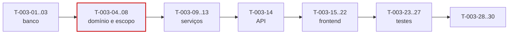

# 003 — Clients · Tarefas

## 1. Convenções

| Campo | Regra |
|---|---|
| **ID** | `T-003-XX`, estável e imutável |
| **Descrição** | Verbo no infinitivo + objeto |
| **Dependências** | IDs de tarefas ou features concluídas |
| **Estimativa** | Horas-agente; acima de 8h deve ser decomposta |
| **Prioridade** | `P0` bloqueante · `P1` necessária · `P2` cortável |

## 2. Resumo

| Grupo | Tarefas | Estimativa |
|---|:--:|---|
| Banco | 3 | 5h |
| Backend | 11 | 26h |
| Frontend | 8 | 20h |
| Testes | 5 | 12h |
| Documentação | 2 | 3h |
| Infra | 1 | 1h |
| **Total** | **30** | **67h ≈ 3 dias-agente** |

## 3. Banco

| ID | Descrição | Dependências | Estimativa | Prioridade |
|---|---|---|:--:|:--:|
| T-003-01 | Criar `V010__create_clients.sql` com `address` embutido e os índices únicos **parciais** de nome e documento | 002 | 2h | P0 |
| T-003-02 | Criar `V011__create_contacts.sql` com índice único parcial `uq_contacts_primary` | T-003-01 | 1,5h | P0 |
| T-003-03 | Criar o índice GIN `idx_clients_tenant_search` para busca sem acento e sem caixa | T-003-01 | 1,5h | P1 |

## 4. Backend

| ID | Descrição | Dependências | Estimativa | Prioridade |
|---|---|---|:--:|:--:|
| T-003-04 | Criar entidades `Client` e `Contact` com o VO `Address` embutido e o enum `ClientStatus` | T-003-02 | 2h | P0 |
| T-003-05 | Implementar `DocumentNormalizer` (remoção de máscara) e `DocumentValidator` (dígitos verificadores + rejeição de sequências repetidas) | — | 3h | P0 |
| T-003-06 | Implementar `ClientColorGenerator` determinístico sobre paleta fixa | — | 1h | P1 |
| T-003-07 | Criar `ClientRepository` com `search` por `Specification` retornando projeção, e os métodos de unicidade | T-003-04 | 3h | P0 |
| T-003-08 | Implementar `MemberClientScopeSpecification` com `EXISTS` sobre work logs e tickets | T-003-07 | 3h | P0 |
| T-003-09 | Implementar `ClientService` (CRUD) aplicando a ordem da §6.1 | T-003-05, T-003-07 | 4h | P0 |
| T-003-10 | Implementar `ClientDeletionGuard` consultando `ContractService` (RN-401) | T-003-09 | 2h | P0 |
| T-003-11 | Implementar inativação e reativação com confirmação e listagem de contratos afetados (RN-407) | T-003-10 | 2,5h | P0 |
| T-003-12 | Implementar `ContactService` com `PrimaryContactPolicy` (RN-406) | T-003-04 | 2,5h | P0 |
| T-003-13 | Implementar `ClientSummaryService` limitado ao período corrente, com contratos paginados | T-003-09 | 3h | P1 |
| T-003-14 | Criar DTOs, mappers, `ClientController` e `ContactController` com OpenAPI; registrar os códigos de erro | T-003-13 | 4h | P0 |

## 5. Frontend

| ID | Descrição | Dependências | Estimativa | Prioridade |
|---|---|---|:--:|:--:|
| T-003-15 | Criar `ClientApi` e `ContactApi` | T-003-14 | 2h | P0 |
| T-003-16 | Criar `ClientStore` com signals privados e `activeClients` computed | T-003-15 | 2,5h | P0 |
| T-003-17 | Criar `dt-document-input` com máscara dinâmica e `documentValidator` espelhando RN-402 | — | 3h | P0 |
| T-003-18 | Criar `dt-address-form` | — | 2h | P1 |
| T-003-19 | Criar `ClientFormPage` (P12) com `unsavedChangesGuard` e mapeamento de erros `422` por campo | T-003-17 | 3,5h | P0 |
| T-003-20 | Criar `dt-client-card` e `ClientListPage` (P10) com busca, filtro e paginação na URL | T-003-16 | 3,5h | P0 |
| T-003-21 | Criar `dt-contact-list` e `dt-deactivate-dialog` | T-003-16 | 2,5h | P1 |
| T-003-22 | Criar `dt-client-summary` e `ClientDetailPage` (P11) | T-003-21 | 3h | P1 |

## 6. Testes

| ID | Descrição | Dependências | Estimativa | Prioridade |
|---|---|---|:--:|:--:|
| T-003-23 | Testes unitários de `DocumentValidator` com 100 documentos válidos e 100 inválidos, incluindo sequências repetidas | T-003-05 | 3h | P0 |
| T-003-24 | Testes de unicidade de nome e documento, incluindo caixa, acento e registros excluídos | T-003-09 | 2,5h | P0 |
| T-003-25 | Testes de RN-401 (exclusão) e RN-407 (inativação) com contratos em todos os estados | T-003-11 | 2,5h | P0 |
| T-003-26 | Testes de `PrimaryContactPolicy`, incluindo sequência de marcações e concorrência | T-003-12 | 2h | P0 |
| T-003-27 | Teste do escopo de `MEMBER` com inspeção do SQL gerado + suíte de isolamento entre tenants | T-003-08 | 2h | P0 |

## 7. Documentação

| ID | Descrição | Dependências | Estimativa | Prioridade |
|---|---|---|:--:|:--:|
| T-003-28 | Sincronizar `docs/04-api/clients.md` com o comportamento implementado | T-003-14 | 2h | P0 |
| T-003-29 | Publicar a interface `ClientService.getActiveForContract` para consumo por `004` e atualizar o status em `implementation-order.md` | T-003-14 | 1h | P0 |

## 8. Infra

| ID | Descrição | Dependências | Estimativa | Prioridade |
|---|---|---|:--:|:--:|
| T-003-30 | Registrar o reconciliador de `activeContractsCount` no `DenormalizationReconcileJob` e configurar as métricas da §29 | T-003-09 | 1h | P1 |

## 9. Ordem de execução

**Caminho crítico:** `T-003-01 → 04 → 05 → 07 → 09 → 14 → 19 → 24`.
`T-003-08` (escopo de `MEMBER`) é o ponto de maior risco de segurança e deve ter o teste de inspeção de SQL escrito antes da implementação.

**Paralelizável:** `T-003-17` e `T-003-18` (componentes de formulário) são independentes do backend e podem ser desenvolvidos com MSW. `T-003-13` (resumo) depende de `004` para dados reais e pode ser concluído após.

## 10. Critérios de conclusão por grupo

| Grupo | Concluído quando |
|---|---|
| Banco | Índices únicos são **parciais** e comprovados por teste de violação e de reuso após exclusão |
| Backend | RN-401 a RN-407 implementadas na ordem da §6.1; escopo de `MEMBER` aplicado por query; nenhum acesso a `ContractRepository` |
| Frontend | Máscara dinâmica funcional; erros `422` mapeados por campo; filtros na URL; zero violações do axe-core |
| Testes | Cobertura ≥ 90% em services e validators; tabela de documentos válidos e inválidos verde; SQL do escopo de `MEMBER` inspecionado |
| Documentação | `clients.md` sincronizado; interface pública publicada para `004` |
| Infra | Reconciliador registrado; métricas ativas |
