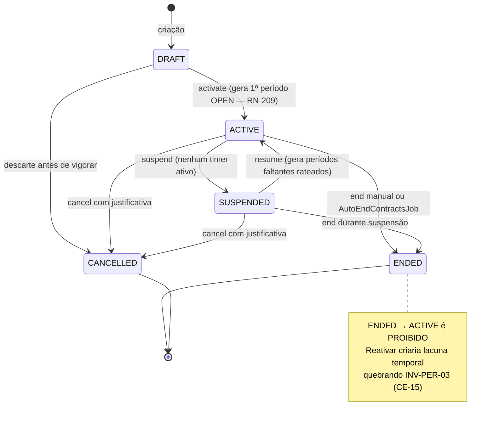
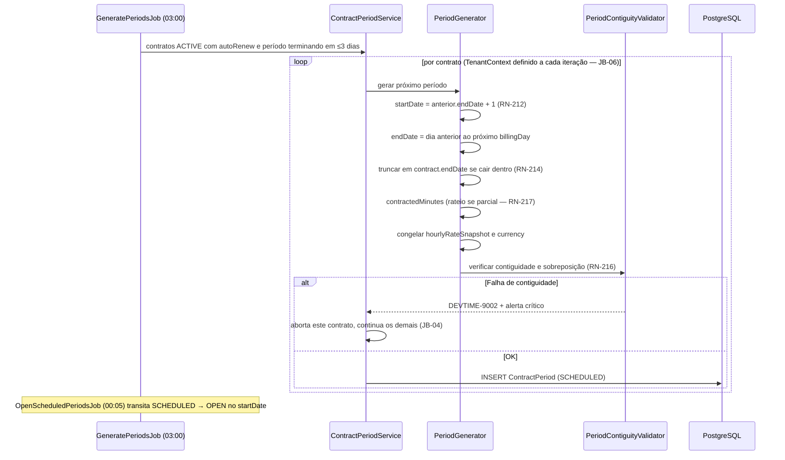
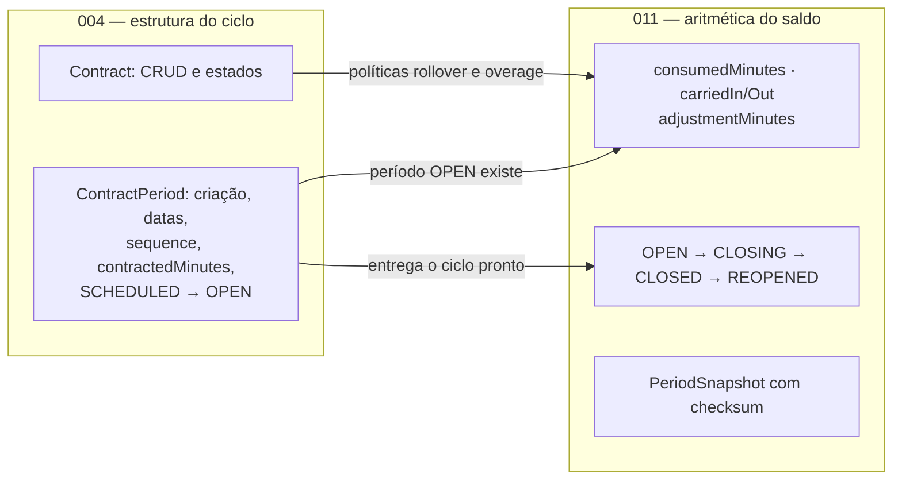

# 004 — Contracts & Periods

| Campo | Valor |
|---|---|
| **Feature** | 004 |
| **Épico** | EP-05 (Gestão de Contratos) |
| **Sprint** | S3 (CRUD e prévia) · S4 (geração de períodos) |
| **Prioridade** | P0 |
| **Complexidade** | **Crítica** |
| **Estimativa** | 42 pts · 10 dias-agente |
| **Stories** | US-040 a US-057 |
| **Status** | SPEC_APPROVED |

## 1. Objetivo

Gerir o contrato — o objeto central do produto — e o ciclo de vida dos seus períodos de apuração: criação, políticas comerciais, máquina de estados completa, prévia de períodos, geração automática contígua com rateio proporcional e truncamento por fim de vigência.

## 2. Problema que resolve

O contrato define **quantas horas existem** e **em qual janela**. Sem períodos contíguos e sem sobreposição, não há onde alocar uma hora trabalhada (RN-107) e o banco de horas não existe. Este é o ponto do sistema onde um erro de borda de calendário produz horas alocadas no período errado — e um relatório errado entregue ao cliente. É por isso que a complexidade é classificada como crítica: não pela dificuldade, mas pela consequência.

## 3. Escopo

| # | Item | Referência |
|---|---|---|
| E-01 | CRUD de contrato com código sequencial `CT-0001` | §6.6 `entities.md` |
| E-02 | Tipos `MONTHLY_HOURS` e `HOURLY_OPEN` | RN-202, RN-210 |
| E-03 | Políticas de rollover (`NONE`, `FULL`, `CAPPED`) e de excedente (`BLOCK`, `WARN`, `ALLOW_BILLABLE`) | RN-224 a RN-234 |
| E-04 | Máquina de estados de 5 estados com todas as guardas | §4.5 `state-machines.md` |
| E-05 | Prévia de períodos antes de salvar | §6 `contracts.md` |
| E-06 | Geração do primeiro período na ativação | RN-209 |
| E-07 | Geração automática de períodos subsequentes por job | RN-211 a RN-216 |
| E-08 | Rateio proporcional de período parcial | RN-217 |
| E-09 | Truncamento do período por `endDate` | RN-214 |
| E-10 | Transição `SCHEDULED → OPEN` no `startDate` | §4.6 SM |
| E-11 | Histórico de alterações do contrato | §12.2 `contracts.md` |
| E-12 | Telas P13, P14 e P15 | `pages.md` |

## 4. Fora do escopo

| Item | Onde está | Motivo |
|---|---|---|
| Cálculo de saldo, extrato e ajustes | `011-bank-hours` | Separação entre estrutura do ciclo e aritmética do saldo |
| Fechamento, snapshot e reabertura | `011-bank-hours` | Idem — S10 |
| Tickets do contrato | `007-tickets` | Entidade própria |
| Relatório de período | `012-reports` | É saída |
| Contrato de escopo fechado (preço fixo) | `future/` — F5 | Não usa banco de horas |
| Cobrança e faturamento | Fora do roadmap | NO-01 |

> **Fronteira explícita com `011`:** esta feature **cria e mantém** `ContractPeriod` com `contractedMinutes`, `startDate`, `endDate`, `sequence` e `status` até `OPEN`. A partir de `OPEN`, os campos `consumedMinutes`, `carriedIn/Out`, `adjustmentMinutes` e as transições `CLOSING`, `CLOSED` e `REOPENED` pertencem a `011`. `004` **nunca** calcula saldo.

## 5. Dependências

### 5.1 Features
| Feature | Tipo | O que consome |
|---|---|---|
| `003-clients` | Bloqueante | `ClientService.getActiveForContract` (RN-201, RN-405) |
| `005-categories` | Bloqueante | `defaultCategoryId` do contrato |
| `002-users` | Bloqueante | `tenant.settings` (`defaultRolloverPolicy`, `defaultOveragePolicy`), fuso, moeda |
| `007`, `008`, `011`, `012` | Consumidoras | `ContractService` e `ContractPeriodService` como interfaces públicas |

### 5.2 Documentos obrigatórios
| Documento | Seções relevantes |
|---|---|
| `docs/04-api/contracts.md` | §5 a §9, §12 |
| `docs/02-domain/entities.md` | §6.6 Contract, §6.7 ContractPeriod |
| `docs/02-domain/business-rules.md` | RN-201 a RN-217 |
| `docs/02-domain/state-machines.md` | §4.5, §4.6 |
| `docs/02-domain/permissions.md` | §6.4, §7, nota ³ |
| `docs/05-ui/pages.md` | P13, P14, P15 |

### 5.3 Infraestrutura
| Componente | Uso |
|---|---|
| PostgreSQL | `contracts`, `contract_periods` |
| Scheduler | `GeneratePeriodsJob`, `OpenScheduledPeriodsJob`, `AutoEndContractsJob` |
| ShedLock | Execução única com múltiplas instâncias |

## 6. Regras de negócio

| ID | Tipo | Enunciado resumido | Erro | Onde é aplicada |
|---|---|---|---|---|
| RN-201 | Bloqueante | Contrato pertence a cliente `ACTIVE` | `DEVTIME-2201` / 422 | `ContractService.create` |
| RN-202 | Bloqueante | `MONTHLY_HOURS` exige `monthlyMinutes` entre 1 e 44.640 | `DEVTIME-2202` / 422 | Validação de DTO + service |
| RN-203 | Bloqueante | `billingDay` entre 1 e 28 | `DEVTIME-2203` / 422 | Validação de DTO |
| RN-204 | Bloqueante | `endDate ≥ startDate` quando informada | `DEVTIME-2204` / 422 | `@AssertTrue` no DTO |
| RN-205 | Bloqueante | Contrato com work logs não é excluído | `DEVTIME-2205` / 409 | `ContractDeletionGuard` |
| RN-206 | Bloqueante | `type` imutável fora de `DRAFT` | `DEVTIME-2003` / 422 | `ContractService.update` |
| RN-207 | Bloqueante | Alterar `monthlyMinutes` afeta períodos futuros e o aberto mediante confirmação; fechados nunca | `DEVTIME-2207` / 409 | `ContractService.update` |
| RN-208 | Bloqueante | Alterar `billingDay` só sem período `OPEN` com work logs | `DEVTIME-2208` / 409 | `ContractService.update` |
| RN-209 | Automática | Ativação gera o 1º `ContractPeriod` como `OPEN` | — | `ContractStateMachine` |
| RN-210 | Automática | `HOURLY_OPEN` não tem saldo, carry-over nem alerta; `contractedMinutes = 0` | — | `PeriodGenerator` |
| RN-211 | Automática | 1º período: de `startDate` até o dia anterior ao próximo `billingDay` | — | `PeriodGenerator` |
| RN-212 | Automática | Períodos seguintes: do `billingDay` de M ao dia anterior ao de M+1 | — | `PeriodGenerator` |
| RN-213 | Automática | Job diário às 03:00 cria o próximo período com ≤ 3 dias para o fim e `autoRenew = true` | — | `GeneratePeriodsJob` |
| RN-214 | Automática | `endDate` dentro de um período trunca o período; nenhum posterior é gerado | — | `PeriodGenerator` |
| RN-216 | Automática | Períodos sempre contíguos e sem sobreposição; falha é erro crítico com alerta | `DEVTIME-9002` | `PeriodContiguityValidator` |
| RN-217 | Automática | Período parcial tem `contractedMinutes` rateado por dias corridos, se `prorateFirstPeriod` | — | `ProrationCalculator` |
| RN-004 | Bloqueante | Alteração exige `version` | `DEVTIME-2004` / 409 | Todas as edições |
| RN-011 | Bloqueante | Campos 🔒 não são alteráveis | `DEVTIME-2003` / 422 | `type`, `sequence`, `contractedMinutes` |

### 6.1 Ordem de aplicação — criação de contrato

| # | Verificação | Falha |
|---|---|---|
| 1 | Permissão `CONTRACT_CREATE` | `403 DEVTIME-1101` |
| 2 | Formato dos campos | `400` |
| 3 | Cliente existe no tenant e está `ACTIVE` (RN-201, RN-405) | `422 DEVTIME-2201` / `2405` |
| 4 | Coerência do tipo: `MONTHLY_HOURS` exige `monthlyMinutes` (INV-CTR-02); `HOURLY_OPEN` não aceita saldo (INV-CTR-03) | `422 DEVTIME-2202` |
| 5 | `billingDay` entre 1 e 28 (RN-203) | `422 DEVTIME-2203` |
| 6 | `endDate ≥ startDate` (RN-204) | `422 DEVTIME-2204` |
| 7 | `rolloverPolicy = CAPPED` exige `rolloverCapMinutes` (INV-CTR-04) | `422 DEVTIME-2000` |
| 8 | `code` único no tenant (INV-CTR-01); gerado se ausente | `409 DEVTIME-2001` |
| 9 | Persiste em `DRAFT`; **nenhum período é gerado** | — |

**Por que nenhum período em `DRAFT`:** um contrato em elaboração pode ter datas e políticas alteradas livremente. Gerar períodos antes da ativação criaria estrutura que precisaria ser destruída a cada edição, e abriria a possibilidade de work logs em contrato não vigente.

### 6.2 Algoritmo de geração de períodos (RN-211/212/214/217)

| # | Passo | Regra |
|---|---|---|
| 1 | `sequence = 1`: `startDate = contract.startDate` | RN-211 |
| 2 | `endDate` = dia anterior à próxima ocorrência de `billingDay` a partir de `startDate` | RN-211 |
| 3 | Se `startDate` já é o `billingDay`, o período é um ciclo cheio | RN-211 |
| 4 | Períodos seguintes: `startDate = anterior.endDate + 1 dia`; `endDate` = dia anterior ao próximo `billingDay` | RN-212, INV-PER-03 |
| 5 | Se `contract.endDate` cai dentro do período, `endDate = contract.endDate` e a geração para | RN-214 |
| 6 | `contractedMinutes` = `monthlyMinutes` em ciclo cheio; rateado em período parcial | RN-217 |
| 7 | Rateio: `round(monthlyMinutes × diasDoPeríodo / diasDoCicloCheio)` | RN-217 |
| 8 | `HOURLY_OPEN`: `contractedMinutes = 0` sempre | RN-210 |
| 9 | Congela `hourlyRateSnapshot`, `overageRateSnapshot` e `currency` do contrato | §6.7 |
| 10 | Verifica contiguidade e ausência de sobreposição antes de persistir | RN-216 |

**Tabela normativa de geração (RN-211/212):**

| `startDate` | `billingDay` | Período 1 | Período 2 | Período 3 |
|---|:--:|---|---|---|
| 2026-01-01 | 1 | 01/01 – 31/01 | 01/02 – 28/02 | 01/03 – 31/03 |
| 2026-01-10 | 1 | 10/01 – 31/01 (parcial) | 01/02 – 28/02 | 01/03 – 31/03 |
| 2026-01-15 | 15 | 15/01 – 14/02 | 15/02 – 14/03 | 15/03 – 14/04 |
| 2026-01-20 | 5 | 20/01 – 04/02 (parcial) | 05/02 – 04/03 | 05/03 – 04/04 |
| 2026-02-28 | 28 | 28/02 – 27/03 | 28/03 – 27/04 | 28/04 – 27/05 |

**Exemplo normativo de rateio (RN-217):** contrato de 40h (2.400 min), `startDate = 10/01`, `billingDay = 1`. Período 1 = 10/01 a 31/01 = 22 dias; ciclo cheio de janeiro = 31 dias. `contractedMinutes = round(2400 × 22/31) = 1.703 min`.

### 6.3 Invariantes envolvidas
| ID | Invariante | Como é garantida |
|---|---|---|
| INV-CTR-01 | `(tenantId, code)` único | Índice único parcial |
| INV-CTR-02 | `MONTHLY_HOURS` ⇒ `monthlyMinutes > 0` | Validação + constraint |
| INV-CTR-03 | `HOURLY_OPEN` ⇒ sem saldo nem rollover | Validação + constraint |
| INV-CTR-04 | `CAPPED` ⇒ `rolloverCapMinutes` não nulo | Validação + constraint |
| INV-CTR-05 | `endDate ≥ startDate` | `@AssertTrue` + constraint |
| INV-CTR-06 | `ACTIVE` ⇒ existe ao menos um período | RN-209 na transição |
| INV-CTR-07 | `type` imutável fora de `DRAFT` | RN-206 |
| INV-CTR-08 | Contrato com work logs não é excluído | RN-205 |
| INV-PER-01 | `(contractId, sequence)` único | Índice único |
| INV-PER-02 | Períodos nunca se sobrepõem | `PeriodContiguityValidator` + constraint de exclusão |
| INV-PER-03 | Períodos contíguos: `p[n].start = p[n−1].end + 1` | Idem |
| INV-PER-04 | `endDate ≥ startDate` | Constraint |
| INV-PER-05 | Minutos não negativos | Constraint |
| INV-PER-07 | No máximo um período `OPEN` por contrato | Índice único parcial |

## 7. Fluxo principal — do rascunho ao contrato vigente

1. Usuário com `CONTRACT_CREATE` abre P15 e seleciona um cliente `ACTIVE`.
2. Escolhe o tipo, informa `monthlyMinutes` (se `MONTHLY_HOURS`), `startDate`, `endDate` opcional, `billingDay` e as políticas — pré-preenchidas a partir de `tenant.settings`.
3. O front chama `POST /contracts/preview-periods` a cada alteração relevante, exibindo os 3 primeiros períodos com datas e minutos contratados.
4. Usuário confirma. `POST /contracts` cria em `DRAFT` com `code` sequencial. **Nenhum período é gerado.**
5. Usuário revisa em P14 e aciona `POST /contracts/{id}/activate`.
6. `ContractStateMachine` verifica: cliente `ACTIVE`, campos obrigatórios do tipo, `startDate` definida.
7. Transita para `ACTIVE`, gera o 1º `ContractPeriod` com status `OPEN` (RN-209), incrementa `client.activeContractsCount` e torna `type` imutável (RN-206).
8. Publica `ContractActivatedEvent` **dentro** da transação — o período deve existir junto com o contrato ativo (INV-CTR-06).
9. A partir daqui, tickets e work logs podem ser criados.
10. `GeneratePeriodsJob` cria o próximo período quando faltarem ≤ 3 dias (RN-213); `OpenScheduledPeriodsJob` o abre no `startDate`.

## 8. Fluxos alternativos

| # | Fluxo | Gatilho | Comportamento |
|---|---|---|---|
| FA-01 | Prévia sem salvar | P15 | `POST /contracts/preview-periods` retorna os períodos calculados; **nenhuma** persistência |
| FA-02 | Contrato `HOURLY_OPEN` | Tipo selecionado | Campos de saldo e rollover ocultos; períodos gerados apenas para agrupamento, com `contractedMinutes = 0` (RN-210) |
| FA-03 | Suspensão | P14 | `ACTIVE → SUSPENDED`; interrompe a geração de novos períodos; o período aberto permanece aberto |
| FA-04 | Retomada após 2 ciclos | P14 | `SUSPENDED → ACTIVE`; os períodos faltantes são gerados com `contractedMinutes` rateado, mantendo a contiguidade (CE-ME-09) |
| FA-05 | Encerramento | P14 ou `AutoEndContractsJob` ao atingir `endDate` | Trunca o período corrente em `endDate` (RN-214); fecha automaticamente após 3 dias; decrementa `activeContractsCount` |
| FA-06 | Cancelamento (distrato) | P14 | Exige justificativa; trunca o período corrente em `now()`; work logs preservados |
| FA-07 | Alteração de `monthlyMinutes` | P15 em edição | Afeta períodos futuros; o período aberto só com confirmação explícita; fechados nunca (RN-207) |
| FA-08 | Alteração de `billingDay` | P15 em edição | Rejeitada se houver período `OPEN` com work logs (RN-208) |
| FA-09 | Exclusão em `DRAFT` | P14 | Permitida — não há períodos nem work logs |
| FA-10 | Exclusão com work logs | P14 | `409 DEVTIME-2205`; a alternativa é encerrar ou cancelar |
| FA-11 | Contrato com `startDate` retroativa | Criação | Períodos passados são gerados como `CLOSED` sem snapshot, marcados como `MIGRATION`; work logs neles só por `ADMIN` (CE-06) |
| FA-12 | Histórico do contrato | P14 | `GET /contracts/{id}/history` a partir de `AuditLog` |

## 9. Diagramas

### 9.1 Máquina de estados do contrato

### 9.2 Geração e abertura de períodos

### 9.3 Fronteira entre 004 e 011

## 10. Estados

### 10.1 `Contract`
| Estado | Significado | Operações permitidas | Operações bloqueadas |
|---|---|---|---|
| `DRAFT` | Em elaboração | Editar tudo, ativar, cancelar, excluir | Criar ticket, work log; suspender; encerrar |
| `ACTIVE` | Vigente | Criar ticket e work log; suspender; encerrar; cancelar; editar com restrições | Alterar `type`; excluir com work logs |
| `SUSPENDED` | Temporariamente parado | Registro **retroativo** dentro da vigência; retomar; encerrar; cancelar | Novo período; work log fora da vigência |
| `ENDED` | Concluído (terminal) | Consultar; relatórios | Todo registro novo; qualquer transição |
| `CANCELLED` | Distratado (terminal) | Consultar; relatórios | Tudo |

### 10.2 `ContractPeriod` (parte de `004`)
| Estado | Significado | Operações permitidas | Operações bloqueadas |
|---|---|---|---|
| `SCHEDULED` | Criado, ainda não iniciado | Abertura automática no `startDate` | Work log, ajuste, relatório |
| `OPEN` | Vigente | Work log, ajuste, fechamento (via `011`) | — |
| `CLOSING`, `CLOSED`, `REOPENED` | — | Ver `011-bank-hours` | — |

## 11. Transições

| Origem | Destino | Gatilho | Guarda | Efeito | Permissão |
|---|---|---|---|---|---|
| `DRAFT` | `ACTIVE` | `POST /activate` | Cliente `ACTIVE`; campos do tipo completos; `startDate` definida | Gera 1º período `OPEN`; `activeContractsCount++`; `type` torna-se imutável | `CONTRACT_TRANSITION` |
| `DRAFT` | `CANCELLED` | `POST /cancel` | — | — | `CONTRACT_TRANSITION` |
| `ACTIVE` | `SUSPENDED` | `POST /suspend` com motivo | Nenhum timer ativo em tickets do contrato | Interrompe geração; período aberto permanece | `CONTRACT_TRANSITION` (MANAGER pode ³) |
| `SUSPENDED` | `ACTIVE` | `POST /resume` | Cliente `ACTIVE` | Gera períodos faltantes com rateio, mantendo contiguidade | `CONTRACT_TRANSITION` (MANAGER pode ³) |
| `ACTIVE`/`SUSPENDED` | `ENDED` | `POST /end` ou job | Nenhum timer ativo | Trunca o período em `endDate`; fecha após 3 dias; `activeContractsCount--` | `CONTRACT_TRANSITION` (**somente OWNER/ADMIN** ³) |
| `ACTIVE`/`SUSPENDED` | `CANCELLED` | `POST /cancel` com justificativa | Confirmação explícita | Trunca o período em `now()`; work logs preservados | `CONTRACT_TRANSITION` (**somente OWNER/ADMIN** ³) |
| — | `Period.SCHEDULED` | `GeneratePeriodsJob` | Contrato `ACTIVE`; `autoRenew` | Congela `contractedMinutes` e snapshots de valor | Sistema |
| `Period.SCHEDULED` | `Period.OPEN` | `OpenScheduledPeriodsJob` | Período anterior `CLOSED` ou inexistente | Aplica `carriedInMinutes` quando disponível | Sistema |

### 11.1 Transições proibidas
| Transição | Motivo da proibição |
|---|---|
| `ENDED → ACTIVE` | Recriaria a sequência de períodos com lacuna temporal, quebrando INV-PER-03. Deve-se criar um novo contrato (CE-15) |
| `CANCELLED → *` | Cancelamento é decisão comercial definitiva |
| `ACTIVE → DRAFT` | O contrato já produziu períodos e possivelmente horas |
| `DRAFT → SUSPENDED` / `DRAFT → ENDED` | Não se suspende nem se encerra o que nunca vigorou |
| Alteração de `status` por `PATCH` | ME-05: transições exigem endpoint de ação |
| Alteração de `type` fora de `DRAFT` | RN-206: mudaria o modelo comercial e invalidaria todo o histórico de saldo |

## 12. Casos de erro

| Código | HTTP | Situação | Mensagem ao usuário | Regra |
|---|:--:|---|---|---|
| `DEVTIME-2201` | 422 | Cliente inválido ou inativo | Cliente inválido ou inativo | RN-201 |
| `DEVTIME-2202` | 422 | `monthlyMinutes` fora da faixa | Quantidade de horas mensais inválida | RN-202 |
| `DEVTIME-2203` | 422 | `billingDay` fora de 1–28 | Dia de faturamento deve estar entre 1 e 28 | RN-203 |
| `DEVTIME-2204` | 422 | `endDate < startDate` | A data final deve ser posterior à inicial | RN-204 |
| `DEVTIME-2205` | 409 | Exclusão com work logs | Contrato com registros não pode ser excluído | RN-205 |
| `DEVTIME-2003` | 422 | Alteração de campo imutável | Este campo não pode ser alterado | RN-206, RN-011 |
| `DEVTIME-2207` | 409 | Alteração afeta período fechado | Alteração afeta período fechado | RN-207 |
| `DEVTIME-2208` | 409 | `billingDay` com horas lançadas | Não é possível alterar o ciclo com horas lançadas | RN-208 |
| `DEVTIME-2010` | 409 | Transição não permitida | Transição de estado inválida | ME-04 |
| `DEVTIME-2011` | 409 | Entidade em estado terminal | Contrato encerrado ou cancelado | ME-04 |
| `DEVTIME-2405` | 422 | Cliente inativo | Cliente inativo não aceita novos contratos | RN-405 |
| `DEVTIME-9002` | — | Falha de contiguidade | Erro interno; alerta operacional crítico | RN-216 |
| `DEVTIME-1101` | 403 | Papel insuficiente para a transição | Você não tem permissão para esta ação | nota ³ |

### 12.1 Casos extremos

| # | Caso | Comportamento esperado |
|---|---|---|
| CX-01 | `startDate = 2026-02-28`, `billingDay = 28` | Ciclo 28/02–27/03; nenhum tratamento especial (CE-05) |
| CX-02 | `billingDay = 28` em fevereiro de ano bissexto | Idem — a restrição a 28 elimina toda ambiguidade (RN-203) |
| CX-03 | `startDate` igual ao `billingDay` | Primeiro período é ciclo cheio, sem rateio (RN-211, passo 3) |
| CX-04 | `endDate` no mesmo dia do `startDate` | Período único de 1 dia; `contractedMinutes` rateado para 1/N do ciclo |
| CX-05 | `endDate` no meio do primeiro período | Período truncado; nenhum período posterior gerado (RN-214) |
| CX-06 | Contrato suspenso por 2 ciclos e retomado | Períodos faltantes gerados com rateio, mantendo contiguidade (CE-ME-09) |
| CX-07 | `prorateFirstPeriod = false` | Período parcial recebe `monthlyMinutes` cheio; decisão explícita do usuário |
| CX-08 | `HOURLY_OPEN` com `monthlyMinutes` informado | Rejeitado por INV-CTR-03 |
| CX-09 | Rateio resultando em fração | `round()` sobre minutos inteiros; nunca ponto flutuante (ART-034) |
| CX-10 | Dois períodos gerados simultaneamente pelo job em duas instâncias | ShedLock garante execução única; índice único `(contractId, sequence)` é a segunda barreira |
| CX-11 | Job falha em um tenant | Os demais continuam (JB-04); a falha é registrada e alertada |
| CX-12 | Contrato ativado com `startDate` 6 meses no passado | Períodos passados como `CLOSED` sem snapshot, marcados `MIGRATION` (CE-06) |
| CX-13 | Alteração de `monthlyMinutes` com período aberto sem work logs | Permitida com confirmação; o período aberto é atualizado |
| CX-14 | Alteração de `monthlyMinutes` com período fechado | O período fechado nunca muda (RN-207, ART-005) |
| CX-15 | Encerramento com timer ativo | Bloqueado; a guarda exige nenhum timer ativo em tickets do contrato |
| CX-16 | Contrato ativado e `client` inativado no mesmo instante | Lock no cliente; a ativação falha ou o cliente permanece ativo — nunca contrato ativo sob cliente inativo |

## 13. Modelo de dados

### 13.1 Entidades impactadas
| Entidade | Operação | Tabela | Referência |
|---|---|---|---|
| `Contract` | Cria, lê, atualiza, soft delete | `contracts` | §6.6 |
| `ContractPeriod` | Cria, lê, atualiza (até `OPEN`) | `contract_periods` | §6.7 |
| `Client` | Lê; atualiza `activeContractsCount` | `clients` | Via `ClientService` |
| `AuditLog` | Cria | `audit_logs` | §6.20 |

### 13.2 Campos obrigatórios na criação
| Campo | Tipo | Origem | Imutável | Validação |
|---|---|---|:--:|---|
| `clientId` | UUID | Request | ✔ 🔒 | Cliente `ACTIVE` do tenant (RN-201) |
| `code` | String(30) | Sequencial `CT-0001` | ✖ | Único por tenant (INV-CTR-01) |
| `name` | String(150) | Request | ✖ | 2–150 |
| `type` | enum | Request | ✔ 🔒 fora de `DRAFT` | `MONTHLY_HOURS`, `HOURLY_OPEN` (RN-206) |
| `monthlyMinutes` | int | Request | ✖ | Condicional; 1–44.640 (RN-202) |
| `startDate` | DATE | Request | ✖ | No fuso do tenant |
| `endDate` | DATE | Request | ✖ | ≥ `startDate` (RN-204) |
| `billingDay` | int | Request ou dia de `startDate` | ✖ | 1–28 (RN-203) |
| `rolloverPolicy` | enum | Request ou `tenant.settings` | ✖ | `CAPPED` exige `rolloverCapMinutes` |
| `overagePolicy` | enum | Request ou `tenant.settings` | ✖ | Ignorada em `HOURLY_OPEN` (RN-210) |
| `currency` | CHAR(3) | Do tenant | ✖ | ISO-4217 |
| `period.sequence` | int | Incremental | ✔ 🔒 | Único por contrato (INV-PER-01) |
| `period.startDate`/`endDate` | DATE | Calculados | ✔ 🔒 | Contíguos e sem sobreposição (INV-PER-02/03) |
| `period.contractedMinutes` | int | Congelado na criação | ✔ 🔒 | ≥ 0; rateado se parcial |
| `period.hourlyRateSnapshot` | NUMERIC | Do contrato | ✔ 🔒 | Congelado |

### 13.3 Migrations
| Migration | Conteúdo | Compatibilidade |
|---|---|---|
| `V012__create_contracts.sql` | `contracts` + único parcial de `code` + constraints de coerência de tipo | Nova tabela |
| `V013__create_contract_periods.sql` | `contract_periods` + único `(contract_id, sequence)` + único parcial de período `OPEN` | Nova tabela |
| `V014__period_overlap_constraint.sql` | Constraint `EXCLUDE USING gist` impedindo sobreposição de `daterange` por contrato | Aditiva |
| `V015__contract_code_sequence.sql` | Sequência por tenant para `CT-XXXX` | Aditiva |

### 13.4 Índices
| Índice | Colunas | Sustenta |
|---|---|---|
| `uq_contracts_tenant_code` | `(tenant_id, code)` WHERE `deleted_at IS NULL` | INV-CTR-01 |
| `idx_contracts_tenant_client_status` | `(tenant_id, client_id, status)` | RN-401, listagem por cliente |
| `idx_contracts_tenant_status_end` | `(tenant_id, status, end_date)` | `AutoEndContractsJob`, `ContractEndingReminderJob` |
| `uq_periods_contract_sequence` | `(contract_id, sequence)` | INV-PER-01 |
| `uq_periods_open` | `(contract_id)` WHERE `status = 'OPEN' AND deleted_at IS NULL` | INV-PER-07 |
| `ex_periods_no_overlap` | `EXCLUDE (contract_id WITH =, daterange(start_date, end_date, '[]') WITH &&)` | INV-PER-02 |
| `idx_periods_contract_dates` | `(tenant_id, contract_id, start_date, end_date)` | RN-107 (resolução de período por data) |
| `idx_periods_status_end` | `(tenant_id, status, end_date)` | `GeneratePeriodsJob`, `OpenScheduledPeriodsJob` |

## 14. Endpoints utilizados

| Método | Rota | Operação | Permissão | Sucesso | Doc |
|---|---|---|---|:--:|---|
| GET | `/api/v1/contracts` | Listar com filtros | `CONTRACT_VIEW` | 200 | §7 |
| POST | `/api/v1/contracts` | Criar em `DRAFT` | `CONTRACT_CREATE` | 201 | §5 |
| POST | `/api/v1/contracts/preview-periods` | Prévia sem persistir | `CONTRACT_CREATE` | 200 | §6 |
| GET | `/api/v1/contracts/{id}` | Detalhar | `CONTRACT_VIEW` | 200 | §7 |
| PATCH | `/api/v1/contracts/{id}` | Atualizar | `CONTRACT_UPDATE` | 200 | §7 |
| POST | `/api/v1/contracts/{id}/activate` | Ativar | `CONTRACT_TRANSITION` | 200 | §8.1 |
| POST | `/api/v1/contracts/{id}/suspend` | Suspender | `CONTRACT_TRANSITION` | 200 | §8.2 |
| POST | `/api/v1/contracts/{id}/resume` | Retomar | `CONTRACT_TRANSITION` | 200 | §8.3 |
| POST | `/api/v1/contracts/{id}/end` | Encerrar | `CONTRACT_TRANSITION` (OWNER/ADMIN) | 200 | §8.4 |
| POST | `/api/v1/contracts/{id}/cancel` | Cancelar | `CONTRACT_TRANSITION` (OWNER/ADMIN) | 200 | §8.5 |
| DELETE | `/api/v1/contracts/{id}` | Excluir em `DRAFT` | `CONTRACT_DELETE` | 204 | §8.6 |
| GET | `/api/v1/contracts/{id}/history` | Histórico de alterações | `CONTRACT_VIEW` | 200 | §12.2 |
| GET | `/api/v1/contract-periods/current` | Período corrente do contrato | `PERIOD_VIEW` | 200 | §12.1 |

## 15. Eventos

| Evento | Publicado por | Consumidores | Momento | Efeito |
|---|---|---|---|---|
| `ContractActivatedEvent` | `ContractService` | `ContractPeriodService`, `ClientService` | **Dentro** da transação | Gera 1º período; incrementa `activeContractsCount`. Deve ser atômico (INV-CTR-06) |
| `ContractStatusChangedEvent` | `ContractService` | `ClientService`, `013-notifications` | Contagem dentro; notificação após | Atualiza `activeContractsCount`; notifica |
| `ContractEndedEvent` | `ContractService` | `ContractPeriodService` | Dentro da transação | Trunca o período corrente (RN-214) |
| `PeriodCreatedEvent` | `PeriodGenerator` | Métricas | Após o commit | Telemetria |
| `PeriodOpenedEvent` | `ContractPeriodService` | `011-bank-hours` | Dentro da transação | Aplica `carriedInMinutes` do período anterior |

## 16. Permissões

| Operação | Permissão | Papéis | Ownership | Escopo de dados |
|---|---|---|---|---|
| Listar e detalhar | `CONTRACT_VIEW` | OWNER, ADMIN, MANAGER, VIEWER; `MEMBER` com restrição ² | — | `MEMBER`: apenas contratos vinculados |
| Ver valores monetários | `CONTRACT_VIEW_FINANCIAL` | OWNER, ADMIN, MANAGER, VIEWER | — | `MEMBER` **não** vê |
| Criar e prévia | `CONTRACT_CREATE` | OWNER, ADMIN, MANAGER | — | — |
| Editar | `CONTRACT_UPDATE` | OWNER, ADMIN, MANAGER | — | — |
| Ativar, suspender, retomar | `CONTRACT_TRANSITION` | OWNER, ADMIN, MANAGER ³ | — | — |
| Encerrar, cancelar | `CONTRACT_TRANSITION` | **Somente OWNER e ADMIN** ³ | — | Cancelar exige justificativa |
| Excluir em `DRAFT` | `CONTRACT_DELETE` | OWNER, ADMIN | — | — |
| Ver períodos | `PERIOD_VIEW` | Todos, com restrição ² para `MEMBER` | — | — |

**Nota ³:** `MANAGER` executa `DRAFT → ACTIVE` e `ACTIVE ↔ SUSPENDED`, mas **não** `ENDED` nem `CANCELLED` — encerrar um contrato é decisão comercial, não operacional.

## 17. Validações

### 17.1 Camada 1 — Formato (`400`)
| Campo | Restrição | Mensagem |
|---|---|---|
| `clientId` | `@NotNull` UUID | Selecione um cliente |
| `name` | `@NotBlank`, `@Size(2,150)` | Informe o nome do contrato |
| `type` | `@NotNull` enum | Tipo de contrato inválido |
| `monthlyMinutes` | `@Min(1) @Max(44640)` | Quantidade de horas mensais inválida |
| `startDate` | `@NotNull` | Informe a data de início |
| `billingDay` | `@Min(1) @Max(28)` | Dia de faturamento deve estar entre 1 e 28 |
| `rolloverCapMinutes` | `@Min(0)` | Teto de transporte inválido |
| `rolloverExpiryPeriods` | `@Min(0)` | Valor inválido |
| `hourlyRate`, `overageRate` | `@DecimalMin("0")` | Valor inválido |
| `notificationThresholds` | máx. 5, 1–200 | Limiares inválidos |
| Cruzada: tipo × campos | `@AssertTrue` | INV-CTR-02, INV-CTR-03, INV-CTR-04 |
| Cruzada: datas | `@AssertTrue` | INV-CTR-05 |

### 17.2 Camada 2 — Negócio
| Validação | Regra | Erro |
|---|---|---|
| Cliente `ACTIVE` do tenant | RN-201, RN-405 | `DEVTIME-2201` / `2405` |
| `type` imutável fora de `DRAFT` | RN-206 | `DEVTIME-2003` |
| `monthlyMinutes` não afeta período fechado | RN-207 | `DEVTIME-2207` |
| `billingDay` sem horas lançadas | RN-208 | `DEVTIME-2208` |
| Exclusão sem work logs | RN-205 | `DEVTIME-2205` |
| Transição válida pela matriz | ME-04 | `DEVTIME-2010` |
| Nenhum timer ativo ao suspender ou encerrar | §4.5 SM | `DEVTIME-2311` |
| Contiguidade e ausência de sobreposição | RN-216 | `DEVTIME-9002` |
| `version` correspondente | RN-004 | `DEVTIME-2004` |

### 17.3 Camada 3 — Consistência
| Constraint | Garante | Mapeado para |
|---|---|---|
| `uq_contracts_tenant_code` | INV-CTR-01 | `DEVTIME-2001` |
| `chk_contract_type_coherence` | INV-CTR-02/03/04 | `DEVTIME-2202` |
| `chk_contract_dates` | INV-CTR-05 | `DEVTIME-2204` |
| `uq_periods_contract_sequence` | INV-PER-01 | `DEVTIME-9002` |
| `ex_periods_no_overlap` | INV-PER-02 | `DEVTIME-9002` |
| `uq_periods_open` | INV-PER-07 | `DEVTIME-9002` |
| `chk_period_minutes_non_negative` | INV-PER-05 | `DEVTIME-2000` |

**Decisão:** a ausência de sobreposição é garantida por constraint `EXCLUDE` no banco, **além** da validação de aplicação. A validação de aplicação existe para retornar mensagem útil; a constraint existe porque nenhuma corrida pode produzir sobreposição — o efeito seria horas alocadas em dois períodos, corrompendo dois relatórios.

## 18. Auditoria

| Ação | `action` | `beforeState` | `afterState` | Metadata |
|---|---|---|---|---|
| Criação | `CONTRACT_CREATED` | — | `{code, type, monthlyMinutes, startDate}` | IP, traceId |
| Edição | `CONTRACT_UPDATED` | Campos alterados | Campos alterados | IP, traceId |
| Ativação | `CONTRACT_STATUS_CHANGED` | `{status}` | `{status, firstPeriodId}` | IP |
| Suspensão | `CONTRACT_STATUS_CHANGED` | `{status}` | `{status}` | Motivo |
| Retomada | `CONTRACT_STATUS_CHANGED` | `{status}` | `{status, generatedPeriods}` | — |
| Encerramento | `CONTRACT_STATUS_CHANGED` | `{status}` | `{status, truncatedPeriodId}` | IP |
| Cancelamento | `CONTRACT_STATUS_CHANGED` | `{status}` | `{status}` | **Justificativa obrigatória** |
| Período criado | `PERIOD_CREATED` | — | `{sequence, startDate, endDate, contractedMinutes}` | `actorType = SYSTEM` |
| Período aberto | `PERIOD_STATUS_CHANGED` | `{status}` | `{status}` | `actorType = SYSTEM` |

## 19. Segurança

| # | Vetor | Mitigação | Verificação |
|---|---|---|---|
| SG-01 | Contrato de outro tenant | Filtro automático; `404` para id externo | Suíte de isolamento |
| SG-02 | `MEMBER` mapeando a carteira de contratos | Escopo por `Specification` (nota ²) | Inspeção de SQL |
| SG-03 | `MEMBER` inferindo faturamento | `CONTRACT_VIEW_FINANCIAL` omite campos monetários no backend | Teste por papel |
| SG-04 | `MANAGER` encerrando contrato | Nota ³ restringe `ENDED`/`CANCELLED` a OWNER/ADMIN | Teste por célula da matriz |
| SG-05 | Alteração de `status` por `PATCH` | ME-05: campo ausente do DTO e ignorado se enviado | Teste |
| SG-06 | Manipulação de `contractedMinutes` de período fechado | Campo 🔒; RN-207 protege períodos fechados | Teste |
| SG-07 | Job cruzando tenants indevidamente | `@CrossTenant` com `TenantContext` definido a cada iteração (JB-06) | Teste de isolamento em job |

### 19.1 LGPD

| Dado pessoal | Base legal | Retenção | Exportação | Anonimização | Proibido em log |
|---|---|---|---|---|---|
| Nenhum dado pessoal direto | — | — | — | — | — |
| Vínculo indireto com cliente pessoa física | Execução de contrato | 5 anos (obrigação fiscal) | ✔ | Herda a anonimização do cliente | Valores em log de negócio |

**Observação:** `Contract` não contém dado pessoal próprio. O tratamento decorre do cliente associado. Valores monetários não são dado pessoal, mas são **dado sensível de negócio** e não devem aparecer em log de aplicação.

## 20. Performance

| Operação | Meta | Índice/estratégia | Risco |
|---|---|---|---|
| Listagem de contratos | p95 < 400 ms | `idx_contracts_tenant_client_status` + projeção | — |
| Detalhe com período corrente | p95 < 300 ms | `idx_periods_contract_dates` | — |
| Prévia de períodos | p95 < 150 ms | Cálculo puro em memória, sem acesso a banco | — |
| Resolução de período por data (RN-107) | < 20 ms | `idx_periods_contract_dates` | Consulta em **todo** registro de horas — é o índice mais crítico da feature |
| `GeneratePeriodsJob` | < 5 min para 10.000 contratos | Lote com `idx_periods_status_end`; commit por lote | Job longo bloqueia o lock |

### 20.1 Escalabilidade

`contract_periods` cresce 12 linhas por contrato por ano — desprezível. O ponto de pressão é a **resolução de período por data**, executada em toda criação e edição de work log. O índice `(tenant_id, contract_id, start_date, end_date)` sustenta a consulta em tempo constante.

Os jobs processam em lotes com limite por execução (JB-03) e definem o `TenantContext` a cada iteração (JB-06). Falha em um tenant não interrompe os demais (JB-04).

## 21. Componentes Frontend

### 21.1 Rotas
| Rota | Componente | Guard | Lazy | Tela |
|---|---|---|:--:|---|
| `/contracts` | `ContractListPage` | `permissionGuard(['CONTRACT_VIEW'])` | ✔ | P13 |
| `/contracts/:id` | `ContractDetailPage` | `permissionGuard(['CONTRACT_VIEW'])` | ✔ | P14 |
| `/contracts/new` | `ContractFormPage` | `permissionGuard(['CONTRACT_CREATE'])` | ✔ | P15 |
| `/contracts/:id/edit` | `ContractFormPage` | `permissionGuard(['CONTRACT_UPDATE'])` | ✔ | P15 |

### 21.2 Componentes
| Componente | Tipo | Responsabilidade | Inputs | Outputs |
|---|---|---|---|---|
| `ContractListPage` | Page | Lista com filtros de cliente, status e tipo | — | — |
| `ContractDetailPage` | Page | Dados, períodos, ações de transição, histórico | — | — |
| `ContractFormPage` | Page | Criação e edição com prévia reativa | — | — |
| `dt-contract-card` | Presentational | Cartão com saldo e criticidade | `contract` | `select` |
| `dt-contract-type-selector` | Presentational | Seleção de tipo com explicação de cada modelo | `value`, `locked` | `change` |
| `dt-rollover-policy-form` | Presentational | Política de transporte com exemplos numéricos | `policy`, `cap` | `change` |
| `dt-overage-policy-form` | Presentational | Política de excedente com explicação do efeito | `policy` | `change` |
| `dt-period-preview` | Presentational | Tabela dos 3 primeiros períodos com datas e minutos | `periods` | — |
| `dt-period-timeline` | Presentational | Linha do tempo dos períodos com status | `periods` | `select` |
| `dt-contract-actions` | Presentational | Botões conforme `availableTransitions` e papel | `contract`, `permissions` | `activate`, `suspend`, `resume`, `end`, `cancel` |
| `dt-transition-dialog` | Presentational | Confirmação com justificativa quando exigida | `transition`, `requiresReason` | `confirm` |
| `dt-contract-history` | Presentational | Histórico a partir da auditoria | `entries` | — |

### 21.3 Stores e serviços Angular
| Artefato | Tipo | Estado exposto | Escopo |
|---|---|---|---|
| `ContractStore` | Store | `contracts`, `selected`, `activeContracts`, `criticalContracts`, `totalRemainingMinutes` (computed), `loading`, `error` | `providedIn: 'root'` — consumido pelo dashboard |
| `ContractPeriodStore` | Store | `periods`, `currentPeriod`, `loading` | Provido na rota de detalhe |
| `ContractApi`, `ContractPeriodApi` | API | Somente HTTP | `providedIn: 'root'` |

### 21.4 Guards, interceptors, pipes e directives
| Artefato | Tipo | Uso |
|---|---|---|
| `permissionGuard` | Guard | Protege P13, P14 e P15 |
| `unsavedChangesGuard` | Guard | Formulário de contrato |
| `hasPermission` | Directive | Oculta ações de transição não permitidas |
| `durationPipe` | Pipe | `monthlyMinutes` em `HH:MM` |
| `moneyPipe` | Pipe | Valores na moeda do contrato (I18-04) |
| `tenantDatePipe` | Pipe | Datas no fuso do tenant |

## 22. Serviços Backend

### 22.1 Controllers
| Classe | Rota base | Endpoints |
|---|---|---|
| `ContractController` | `/api/v1/contracts` | listar, criar, prévia, detalhar, atualizar, transições, excluir, histórico |
| `ContractPeriodController` | `/api/v1/contract-periods` | período corrente (saldo e fechamento ficam em `011`) |

### 22.2 Services
| Interface | Implementação | Responsabilidade | Permissão declarada |
|---|---|---|---|
| `ContractService` | `ContractServiceImpl` | CRUD e transições | `CONTRACT_*` |
| `ContractPeriodService` | `ContractPeriodServiceImpl` | Criação, abertura e consulta de períodos; `resolveOpenPeriod` para RN-107 | `PERIOD_VIEW` |
| `ContractPreviewService` | `ContractPreviewServiceImpl` | Prévia sem persistência | `CONTRACT_CREATE` |

**Interfaces públicas consumidas por outras features:**
`ContractService.getActiveForWorkLog(contractId)` (RN-306, usado por `007`/`008`) · `ContractPeriodService.resolveOpenPeriod(contractId, workDate)` (RN-107, usado por `008`) · `ContractPeriodService.getCurrentPeriod(contractId)` (usado por `010`/`011`).

### 22.3 Componentes de domínio
| Classe | Tipo | Responsabilidade | Regras |
|---|---|---|---|
| `PeriodGenerator` | Generator | Gera períodos contíguos com truncamento | RN-211 a RN-214 |
| `ProrationCalculator` | Calculator | Rateio proporcional por dias corridos | RN-217 |
| `PeriodContiguityValidator` | Validator | Contiguidade e ausência de sobreposição | RN-216, INV-PER-02/03 |
| `ContractStateMachine` | StateMachine | Matriz de transições e guardas | §4.5 SM |
| `PeriodStateMachine` | StateMachine | `SCHEDULED → OPEN` | §4.6 SM |
| `ContractCodeGenerator` | Generator | `CT-XXXX` sequencial por tenant | INV-CTR-01 |
| `ContractDeletionGuard` | Validator | Verifica work logs | RN-205 |
| `BillingDayChangeGuard` | Validator | Verifica período `OPEN` com work logs | RN-208 |
| `MonthlyMinutesChangeGuard` | Validator | Protege períodos fechados | RN-207 |
| `ContractTypeCoherenceValidator` | Validator | Coerência tipo × campos | INV-CTR-02/03/04 |

### 22.4 Jobs
| Classe | Cron | Lock | Responsabilidade | Idempotência |
|---|---|---|---|---|
| `GeneratePeriodsJob` | `0 0 3 * * *` (fuso do tenant) | `generatePeriods`, 30m | Cria o próximo período com ≤ 3 dias para o fim (RN-213) | Verifica existência antes de criar; índice único é a segunda barreira |
| `OpenScheduledPeriodsJob` | `0 5 0 * * *` | `openPeriods`, 10m | `SCHEDULED → OPEN` no `startDate` | Atualização condicional por status e data |
| `AutoEndContractsJob` | `0 10 0 * * *` | `autoEndContracts`, 15m | `ACTIVE → ENDED` ao atingir `endDate` | Condicional por status e data |
| `ContractEndingReminderJob` | `0 0 9 * * *` | `contractEndingReminder`, 10m | Aviso 15 dias antes de `endDate` (RN-606) | `dedupeKey` impede duplicata |

## 23. DTOs

| DTO | Direção | Campos principais | Observação |
|---|---|---|---|
| `ContractCreateRequest` | Request | `clientId`, `name`, `description`, `type`, `monthlyMinutes`, `startDate`, `endDate`, `billingDay`, `rolloverPolicy`, `rolloverCapMinutes`, `rolloverExpiryPeriods`, `overagePolicy`, `hourlyRate`, `overageRate`, `autoRenew`, `notificationThresholds`, `defaultCategoryId`, `prorateFirstPeriod` | Validação cruzada por `@AssertTrue` |
| `ContractUpdateRequest` | Request | Subconjunto editável + `version` | `type` e `status` **ausentes** |
| `ContractResponse` | Response | Todos + `code`, `status`, `client`, `currentPeriod`, `availableTransitions[]`, `version` | Campos monetários omitidos sem `CONTRACT_VIEW_FINANCIAL` |
| `ContractSummaryProjection` | Projection | `id`, `code`, `name`, `clientName`, `status`, `type`, `consumedMinutes`, `remainingMinutes`, `consumptionRate` | Listagem — nunca a entidade |
| `ContractFilter` | Filter | `clientId`, `status`, `statusIn`, `type`, `search`, `endingBefore` | — |
| `PeriodPreviewRequest` | Request | `type`, `monthlyMinutes`, `startDate`, `endDate`, `billingDay`, `prorateFirstPeriod` | Sem `clientId` — é cálculo puro |
| `PeriodPreviewResponse` | Response | `periods[]` com `sequence`, `label`, `startDate`, `endDate`, `contractedMinutes`, `isPartial` | Nenhuma persistência |
| `ContractPeriodResponse` | Response | `id`, `sequence`, `label`, `startDate`, `endDate`, `status`, `contractedMinutes` | Campos de saldo vêm de `011` |
| `TransitionRequest` | Request | `reason?`, `confirmed?` | `reason` obrigatório em `cancel` |
| `ContractHistoryResponse` | Response | Entradas de auditoria do contrato | Somente leitura |

## 24. Mappers

| Mapper | De → Para | Mapeamentos não triviais |
|---|---|---|
| `ContractMapper` | `Contract` → `ContractResponse` | `client` achatado; `availableTransitions` conforme estado e papel; campos monetários condicionais à permissão |
| `ContractSummaryMapper` | Projection → listagem | Duração em `HH:MM`; `consumptionRate` arredondado |
| `ContractPeriodMapper` | `ContractPeriod` → response | `label` derivado das datas |
| `PeriodPreviewMapper` | Cálculo → response | Marca `isPartial` |

## 25. Repositories

| Repository | Entidade | Métodos específicos | Índice usado |
|---|---|---|---|
| `ContractRepository` | `Contract` | `search(Specification, Pageable)` com projeção, `existsByCode`, `findActiveByClientId`, `findEndingBefore`, `countActiveByClientId` | `uq_contracts_tenant_code`, `idx_contracts_*` |
| `ContractPeriodRepository` | `ContractPeriod` | `findByContractIdAndDateBetween`, `findOpenByContractId`, `findLastByContractId`, `findScheduledStartingOn`, `findEndingWithin(days)`, `findByContractIdOrderBySequence` | `idx_periods_contract_dates`, `uq_periods_open`, `idx_periods_status_end` |

## 26. Entities utilizadas
| Entidade | Origem | Campos relevantes |
|---|---|---|
| `Contract` | Esta feature | Todos |
| `ContractPeriod` | Esta feature | Estruturais; campos de saldo pertencem a `011` |
| `Client` | `003` | `status` (RN-201), `activeContractsCount` |
| `Category` | `005` | `defaultCategoryId` |

## 27. Validators e Exceptions

| Classe | Tipo | Regra | Código de erro |
|---|---|---|---|
| `ContractTypeCoherenceValidator` | Validator | INV-CTR-02/03/04 | `DEVTIME-2202` |
| `BillingDayValidator` | Validator | RN-203 | `DEVTIME-2203` |
| `ContractDateRangeValidator` | Validator | RN-204 | `DEVTIME-2204` |
| `PeriodContiguityValidator` | Validator | RN-216 | `DEVTIME-9002` |
| `ContractDeletionGuard` | Validator | RN-205 | `DEVTIME-2205` |
| `BillingDayChangeGuard` | Validator | RN-208 | `DEVTIME-2208` |
| `MonthlyMinutesChangeGuard` | Validator | RN-207 | `DEVTIME-2207` |
| `InvalidContractTypeException` | Exception | RN-202, RN-206 | `DEVTIME-2202`/`2003` |
| `ContractHasWorkLogsException` | Exception | RN-205 | `DEVTIME-2205` / 409 |
| `InvalidStateTransitionException` | Exception | ME-04 | `DEVTIME-2010` / 409 com `availableTransitions` |
| `PeriodContiguityViolationException` | Exception | RN-216 | `DEVTIME-9002` — falha crítica |
| `InactiveClientException` | Exception | RN-201, RN-405 | `DEVTIME-2201`/`2405` |

## 28. Logs

| Evento | Nível | Campos | Proibido |
|---|---|---|---|
| Contrato criado | INFO | `tenantId`, `contractId`, `code`, `type` | `hourlyRate`, valores |
| Contrato ativado | INFO | `contractId`, `firstPeriodId`, `contractedMinutes` | Valores monetários |
| Período gerado | INFO | `contractId`, `sequence`, datas, `contractedMinutes` | — |
| Falha de contiguidade | ERROR | `contractId`, `sequence`, datas esperadas e obtidas | — |
| Transição executada | INFO | `contractId`, `fromStatus`, `toStatus`, `actorId` | Justificativa completa |
| Job concluído | INFO | Nome, tenants processados, períodos criados, falhas | — |
| Job falhou em um tenant | WARN | `tenantId`, `contractId`, causa | Stack trace em produção |

## 29. Métricas

| Métrica | Tipo | Tags | Alerta |
|---|---|---|---|
| `contract.created` | Counter | `type` | — |
| `contract.status.changed` | Counter | `from`, `to` | — |
| `period.generated` | Counter | `isPartial` | Queda a zero indica job parado |
| `period.contiguity.violation` | Counter | — | **Qualquer ocorrência** — crítica (RN-216) |
| `period.generation.job.duration` | Timer | — | p95 > 5 min |
| `period.generation.job.failures` | Counter | `tenantId` | Qualquer ocorrência |
| `period.resolve.duration` | Timer | — | p95 > 50 ms — impacta todo registro de horas |
| `contract.list.duration` | Timer | — | p95 > 600 ms |

## 30. Comportamentos esperados

| # | Comportamento |
|---|---|
| CE-01 | Contrato em `DRAFT` não possui períodos e pode ser editado livremente |
| CE-02 | A ativação gera exatamente um período `OPEN`, atomicamente |
| CE-03 | Períodos são sempre contíguos e nunca se sobrepõem |
| CE-04 | Período parcial tem `contractedMinutes` rateado por dias corridos |
| CE-05 | `contractedMinutes` e os snapshots de valor são congelados na criação do período |
| CE-06 | `endDate` trunca o período corrente e interrompe a geração |
| CE-07 | `HOURLY_OPEN` gera períodos apenas para agrupamento, com `contractedMinutes = 0` |
| CE-08 | A prévia produz exatamente os mesmos períodos que serão gerados |
| CE-09 | Alterações de contrato nunca modificam períodos fechados |
| CE-10 | Contratos suspensos não geram novos períodos; ao retomar, os faltantes são criados com rateio |
| CE-11 | `MANAGER` ativa e suspende, mas não encerra nem cancela |
| CE-12 | Jobs são idempotentes e seguros com múltiplas instâncias |

## 31. Comportamentos proibidos

| # | Proibição | Motivo |
|---|---|---|
| CP-01 | Gerar período para contrato em `DRAFT` | Estrutura descartável e risco de work log em contrato não vigente |
| CP-02 | Permitir sobreposição ou lacuna entre períodos | INV-PER-02/03; corromperia a alocação de horas |
| CP-03 | Alterar `contractedMinutes` de período fechado | ART-005 |
| CP-04 | Reativar contrato `ENDED` | Criaria lacuna temporal (CE-15) |
| CP-05 | Alterar `type` fora de `DRAFT` | RN-206 |
| CP-06 | Alterar `status` por `PATCH` genérico | ME-05 |
| CP-07 | Excluir contrato com work logs | RN-205, ART-004 |
| CP-08 | Usar ponto flutuante no rateio | ART-034 |
| CP-09 | Arredondar o rateio para cima | PR-03 — nunca cobrar tempo não contratado a mais |
| CP-10 | Calcular saldo nesta feature | Fronteira com `011`; duplicaria a fórmula canônica |
| CP-11 | Job sem `@SchedulerLock` | Execução duplicada geraria períodos duplicados |
| CP-12 | Job abortando todos os tenants por falha em um | JB-04 |

## 32. Restrições

| # | Restrição | Origem |
|---|---|---|
| RS-01 | `billingDay` restrito a 1–28 | RN-203 — elimina ambiguidade de calendário |
| RS-02 | Apenas dois tipos de contrato no MVP | `mvp.md` §5.2 |
| RS-03 | Sem contrato de escopo fechado | F5 |
| RS-04 | Duração sempre em minutos inteiros | ART-034 |
| RS-05 | Valores em `NUMERIC(19,4)` com moeda explícita | ART-040/041 |
| RS-06 | Job de geração roda às 03:00 no fuso do tenant | ADR-007 |
| RS-07 | Sem faturamento nem emissão de nota | NO-01 |

## 33. Critérios de aceite

| # | Critério | Verificação |
|---|---|---|
| CA-01 | Todos os 5 cenários da tabela normativa de geração produzem exatamente os períodos documentados | Teste parametrizado |
| CA-02 | O rateio reproduz exatamente o exemplo normativo (1.703 min) | Teste |
| CA-03 | Períodos são contíguos e sem sobreposição em 100% dos cenários gerados | Teste com 1.000 combinações de data |
| CA-04 | A prévia coincide exatamente com os períodos gerados na ativação | Teste comparativo |
| CA-05 | A ativação gera exatamente um período `OPEN` atomicamente | Teste de integração e de rollback |
| CA-06 | Toda transição permitida e toda proibida possuem teste | Matriz completa |
| CA-07 | `MANAGER` não encerra nem cancela | Teste por célula |
| CA-08 | Alteração de contrato nunca modifica período fechado | Teste |
| CA-09 | `endDate` trunca corretamente e interrompe a geração | Teste |
| CA-10 | Contrato suspenso e retomado após 2 ciclos mantém contiguidade | Teste |
| CA-11 | Jobs são idempotentes; reexecução não duplica períodos | Teste de reexecução |
| CA-12 | Constraint `EXCLUDE` impede sobreposição mesmo com bypass da aplicação | Teste com `INSERT` direto |
| CA-13 | `resolveOpenPeriod` responde em menos de 50 ms com 10.000 períodos | Teste de performance |

## 34. Checklist de implementação

- [ ] `V012` a `V015` criadas, incluindo a constraint `EXCLUDE USING gist` de sobreposição
- [ ] Índice único parcial garantindo no máximo um período `OPEN` por contrato
- [ ] `PeriodGenerator` implementado exatamente conforme os 10 passos da §6.2
- [ ] `ProrationCalculator` usando `round()` sobre inteiros, nunca ponto flutuante
- [ ] `PeriodContiguityValidator` executado **antes** de persistir
- [ ] `contractedMinutes`, `hourlyRateSnapshot`, `overageRateSnapshot` e `currency` congelados na criação
- [ ] `ContractStateMachine` com a matriz completa e `availableTransitions` na resposta (ME-06)
- [ ] Ativação gera o período dentro da mesma transação
- [ ] `type` marcado imutável ao sair de `DRAFT`
- [ ] `MonthlyMinutesChangeGuard` e `BillingDayChangeGuard` implementados
- [ ] `HOURLY_OPEN` com `contractedMinutes = 0` e sem política de excedente
- [ ] Prévia sem nenhuma escrita no banco
- [ ] Todos os jobs com `@SchedulerLock`, processamento em lote e `TenantContext` por iteração
- [ ] Falha em um tenant não interrompe os demais
- [ ] `resolveOpenPeriod` como interface pública para `008`
- [ ] `status` ausente dos DTOs de atualização
- [ ] Campos monetários condicionados a `CONTRACT_VIEW_FINANCIAL` no backend
- [ ] `dt-period-preview` atualizando reativamente a cada alteração relevante
- [ ] Ações de transição exibidas conforme `availableTransitions` e papel

## 35. Checklist de revisão

- [ ] Nenhum cálculo de saldo nesta feature (fronteira com `011`)
- [ ] Nenhum ponto flutuante em cálculo de duração
- [ ] Constraint de sobreposição presente e testada com `INSERT` direto
- [ ] Toda transição da matriz possui teste de aceitação e de rejeição
- [ ] Nota ³ implementada: `MANAGER` não encerra nem cancela
- [ ] Jobs idempotentes, comprovados por teste de reexecução
- [ ] Nenhum log contém valor monetário
- [ ] Cobertura ≥ 90% em `PeriodGenerator`, `ProrationCalculator` e validators
- [ ] **Duas aprovações no PR** (complexidade crítica — SQ-03)

## 36. Checklist de QA

- [ ] Todos os cenários de `acceptance.md` verdes
- [ ] Os 5 cenários da tabela normativa reproduzidos manualmente
- [ ] Rateio conferido com calculadora independente
- [ ] Contrato criado, ativado, suspenso, retomado, encerrado e cancelado
- [ ] Contrato `HOURLY_OPEN` de ponta a ponta
- [ ] Prévia comparada com os períodos efetivamente gerados
- [ ] Bordas de calendário: fevereiro, ano bissexto, `billingDay = 28`, `startDate = billingDay`
- [ ] Jobs executados duas vezes seguidas sem duplicar períodos
- [ ] Zero violações do axe-core em P13–P15
- [ ] Ações ocultas conforme papel

## 37. Definition of Done

| # | Item | Referência |
|---|---|---|
| DoD-01 | Todos os critérios da §33 verdes | — |
| DoD-02 | Cobertura ≥ 90% em generator, calculator e validators | CA-08 `backend.md` |
| DoD-03 | Suíte temporal com 1.000 combinações de data verde | RP-01 de `mvp.md` |
| DoD-04 | Suíte de isolamento verde | CA-03 `architecture.md` |
| DoD-05 | `docs/04-api/contracts.md` sincronizado | ART-111 |
| DoD-06 | Interfaces públicas publicadas para `007`, `008` e `011` | AR-03 |
| DoD-07 | Alerta de `period.contiguity.violation` ativo | §12 `architecture.md` |
| DoD-08 | Duas aprovações no PR | PR-04, SQ-03 |

## 38. Riscos

| # | Risco | Prob. | Impacto | Mitigação | Gatilho |
|---|---|:--:|:--:|---|---|
| R-01 | **Bordas de calendário na geração (RP-01)** | Alta | **Crítico** | Suíte temporal escrita antes do código; 1.000 combinações; tabela normativa como oráculo | Qualquer falha em `TC-047xT` |
| R-02 | Sobreposição de períodos por corrida | Baixa | **Crítico** | Constraint `EXCLUDE` no banco além da validação | Qualquer ocorrência |
| R-03 | Rateio divergindo do esperado pelo cliente | Média | Alto | Fórmula normativa com exemplo; `prorateFirstPeriod` configurável | Questionamento no beta |
| R-04 | Job duplicando períodos com múltiplas instâncias | Baixa | Alto | ShedLock + índice único `(contractId, sequence)` | Sequência duplicada |
| R-05 | `resolveOpenPeriod` lento degradando o registro de horas | Baixa | Alto | Índice dedicado; teste de performance | p95 > 50 ms |
| R-06 | Contrato ativado sem período por falha parcial | Baixa | **Crítico** | Geração dentro da transação; INV-CTR-06 testada | Contrato `ACTIVE` sem período |

## 39. Observações

| # | Observação |
|---|---|
| OB-01 | **`billingDay` limitado a 28:** decisão que elimina toda a classe de bugs de fim de mês. O custo é não suportar ciclos nos dias 29–31, o que na prática é raro em contratos de sustentação. Documentado em RN-203 com a motivação. |
| OB-02 | **Constraint `EXCLUDE` além da validação:** redundância deliberada. A validação de aplicação existe para retornar mensagem útil; a constraint existe porque nenhuma corrida pode produzir sobreposição — o efeito seria horas em dois períodos e dois relatórios corrompidos. |
| OB-03 | **Fronteira com `011`:** a separação entre estrutura do ciclo e aritmética do saldo é o que permite entregar contratos na S3/S4 e banco de horas na S7 sem retrabalho. `004` nunca lê nem escreve `consumedMinutes`. |
| OB-04 | **`ENDED → ACTIVE` proibido:** a alternativa seria permitir a reativação gerando um período de lacuna. Rejeitada porque a lacuna quebra INV-PER-03 e produz um contrato cujo histórico não é contínuo — impossível de explicar ao cliente. Criar um novo contrato é a operação correta. |
| OB-05 | **Períodos retroativos (CE-06):** contratos migrados de planilha nascem com `startDate` no passado. Os períodos passados são criados como `CLOSED` sem snapshot e marcados `MIGRATION`, deixando explícito que aqueles números não passaram pelo fechamento atômico. |
| OB-06 | **Evolução SaaS:** `rolloverExpiryPeriods` já existe e é lido por `011`. `prorateFirstPeriod` é configurável por contrato. Contrato de escopo fechado (F5) será um terceiro valor de `ContractType`, exigindo apenas que `PeriodGenerator` trate `contractedMinutes = null` — o modelo já comporta. |
