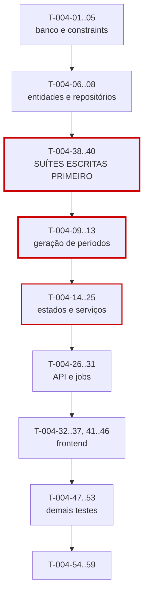

# 004 — Contracts & Periods · Tarefas

## 1. Convenções

| Campo | Regra |
|---|---|
| **ID** | `T-004-XX`, estável e imutável |
| **Descrição** | Verbo no infinitivo + objeto |
| **Dependências** | IDs de tarefas ou features concluídas |
| **Estimativa** | Horas-agente; acima de 8h deve ser decomposta |
| **Prioridade** | `P0` bloqueante · `P1` necessária · `P2` cortável |

> **Complexidade crítica (SQ-02):** as tarefas de teste `T-004-38`, `T-004-39` e `T-004-40` são escritas e revisadas **antes** de `T-004-09` a `T-004-13`. Nenhuma linha do gerador de períodos é escrita antes da suíte temporal existir.

## 2. Resumo

| Grupo | Tarefas | Estimativa |
|---|:--:|---|
| Banco | 5 | 11h |
| Backend | 20 | 62h |
| Frontend | 12 | 38h |
| Testes | 10 | 40h |
| Documentação | 3 | 5h |
| Infra | 3 | 6h |
| **Total** | **53** | **162h ≈ 10 dias-agente** |

## 3. Banco

| ID | Descrição | Dependências | Estimativa | Prioridade |
|---|---|---|:--:|:--:|
| T-004-01 | Criar `V012__create_contracts.sql` com único parcial de `code` e constraints de coerência de tipo (INV-CTR-02/03/04/05) | 003, 005 | 3h | P0 |
| T-004-02 | Criar `V013__create_contract_periods.sql` com único `(contract_id, sequence)` e único parcial de período `OPEN` | T-004-01 | 2,5h | P0 |
| T-004-03 | Criar `V014__period_overlap_constraint.sql` com `EXCLUDE USING gist` sobre `daterange` por contrato | T-004-02 | 2,5h | P0 |
| T-004-04 | Criar `V015__contract_code_sequence.sql` com sequência de `CT-XXXX` por tenant | T-004-01 | 1,5h | P0 |
| T-004-05 | Criar os índices `idx_periods_contract_dates`, `idx_periods_status_end` e `idx_contracts_tenant_status_end` | T-004-02 | 1,5h | P0 |

## 4. Backend

### 4.1 Domínio

| ID | Descrição | Dependências | Estimativa | Prioridade |
|---|---|---|:--:|:--:|
| T-004-06 | Criar entidades `Contract` e `ContractPeriod` com os enums `ContractStatus`, `ContractType`, `RolloverPolicy`, `OveragePolicy`, `PeriodStatus` | T-004-02 | 4h | P0 |
| T-004-07 | Criar `ContractRepository` e `ContractPeriodRepository` com os métodos da §25 | T-004-06 | 4h | P0 |
| T-004-08 | Implementar `ContractCodeGenerator` sequencial por tenant, seguro sob concorrência | T-004-04 | 2h | P0 |

### 4.2 Geração de períodos — núcleo crítico

| ID | Descrição | Dependências | Estimativa | Prioridade |
|---|---|---|:--:|:--:|
| T-004-09 | Implementar `ProrationCalculator` com `round()` sobre inteiros, sem ponto flutuante (RN-217) | T-004-38 | 3h | P0 |
| T-004-10 | Implementar `PeriodGenerator` — passos 1 a 5 da §6.2 (cálculo de datas, RN-211/212/214) | T-004-38, T-004-39 | 6h | P0 |
| T-004-11 | Implementar `PeriodGenerator` — passos 6 a 9 (`contractedMinutes`, rateio, `HOURLY_OPEN`, congelamento de snapshots) | T-004-10, T-004-09 | 4h | P0 |
| T-004-12 | Implementar `PeriodContiguityValidator` (RN-216, INV-PER-02/03) executado antes de persistir | T-004-10 | 3h | P0 |
| T-004-13 | Implementar `ContractPreviewService` — cálculo puro, sem acesso a banco | T-004-11 | 2h | P0 |

### 4.3 Máquinas de estado e serviços

| ID | Descrição | Dependências | Estimativa | Prioridade |
|---|---|---|:--:|:--:|
| T-004-14 | Implementar `ContractStateMachine` com a matriz completa e `availableTransitions` (ME-06) | T-004-06 | 4h | P0 |
| T-004-15 | Implementar `PeriodStateMachine` para `SCHEDULED → OPEN` | T-004-06 | 2h | P0 |
| T-004-16 | Implementar `ContractTypeCoherenceValidator` (INV-CTR-02/03/04) | T-004-06 | 2h | P0 |
| T-004-17 | Implementar `ContractService.create` na ordem da §6.1, consumindo `ClientService.getActiveForContract` | T-004-16, T-004-08 | 4h | P0 |
| T-004-18 | Implementar `ContractService.update` com `MonthlyMinutesChangeGuard` (RN-207) e `BillingDayChangeGuard` (RN-208) | T-004-17 | 4h | P0 |
| T-004-19 | Implementar a transição de ativação gerando o 1º período na mesma transação (RN-209, INV-CTR-06) | T-004-14, T-004-11 | 3h | P0 |
| T-004-20 | Implementar suspensão e retomada, com geração dos períodos faltantes rateados (CE-ME-09) | T-004-19 | 4h | P0 |
| T-004-21 | Implementar encerramento e cancelamento com truncamento do período (RN-214) e restrição da nota ³ | T-004-19 | 4h | P0 |
| T-004-22 | Implementar `ContractDeletionGuard` (RN-205) e a exclusão em `DRAFT` | T-004-17 | 2h | P0 |
| T-004-23 | Implementar `ContractPeriodService.resolveOpenPeriod` como interface pública para `008` (RN-107) | T-004-07 | 3h | P0 |
| T-004-24 | Implementar `ContractService.getActiveForWorkLog` como interface pública para `007`/`008` (RN-306) | T-004-17 | 2h | P0 |
| T-004-25 | Implementar geração de períodos retroativos como `CLOSED` marcados `MIGRATION` (CE-06) | T-004-11 | 3h | P1 |

### 4.4 API e jobs

| ID | Descrição | Dependências | Estimativa | Prioridade |
|---|---|---|:--:|:--:|
| T-004-26 | Criar todos os DTOs da §23 com validação cruzada por `@AssertTrue` | T-004-21 | 4h | P0 |
| T-004-27 | Criar mappers com omissão condicional de campos monetários por `CONTRACT_VIEW_FINANCIAL` | T-004-26 | 3h | P0 |
| T-004-28 | Criar `ContractController` e `ContractPeriodController` com OpenAPI; registrar os códigos de erro da §12 | T-004-27 | 4h | P0 |
| T-004-29 | Implementar `GeneratePeriodsJob` com `@SchedulerLock`, lote e `TenantContext` por iteração (RN-213) | T-004-12 | 4h | P0 |
| T-004-30 | Implementar `OpenScheduledPeriodsJob` e `AutoEndContractsJob` | T-004-29 | 3h | P0 |
| T-004-31 | Implementar `ContractEndingReminderJob` com `dedupeKey` (RN-606) | T-004-30 | 2h | P1 |

## 5. Frontend

| ID | Descrição | Dependências | Estimativa | Prioridade |
|---|---|---|:--:|:--:|
| T-004-32 | Criar `ContractApi`, `ContractPeriodApi`, `ContractStore` e `ContractPeriodStore` com computeds de criticidade | T-004-28 | 5h | P0 |
| T-004-33 | Criar `dt-contract-type-selector` com explicação de cada modelo | — | 2,5h | P0 |
| T-004-34 | Criar `dt-rollover-policy-form` com exemplos numéricos por política | — | 3h | P0 |
| T-004-35 | Criar `dt-overage-policy-form` com explicação do efeito de cada política | — | 2,5h | P0 |
| T-004-36 | Criar `dt-period-preview` com atualização reativa a cada alteração relevante | T-004-32 | 3h | P0 |
| T-004-37 | Criar `ContractFormPage` (P15) integrando os componentes e a prévia | T-004-36 | 5h | P0 |
| T-004-41 | Criar `dt-contract-card` e `ContractListPage` (P13) com filtros na URL | T-004-32 | 4h | P0 |
| T-004-42 | Criar `dt-period-timeline` | T-004-32 | 3h | P1 |
| T-004-43 | Criar `dt-contract-actions` e `dt-transition-dialog` com justificativa condicional | T-004-32 | 4h | P0 |
| T-004-44 | Criar `dt-contract-history` | T-004-32 | 2,5h | P1 |
| T-004-45 | Criar `ContractDetailPage` (P14) integrando períodos, ações e histórico | T-004-43, T-004-42 | 4h | P0 |
| T-004-46 | Aplicar `hasPermission` para ocultar transições não permitidas e campos monetários | T-004-45 | 2h | P0 |

## 6. Testes

| ID | Descrição | Dependências | Estimativa | Prioridade |
|---|---|---|:--:|:--:|
| T-004-38 | **Escrever antes do código:** suíte temporal parametrizada com os 5 cenários normativos da §6.2 e o exemplo de rateio | T-004-06 | 5h | P0 |
| T-004-39 | **Escrever antes do código:** suíte de contiguidade com 1.000 combinações de `startDate` × `billingDay` × `endDate` | T-004-06 | 5h | P0 |
| T-004-40 | **Escrever antes do código:** matriz completa de transições, com aceitação e rejeição de cada célula | T-004-06 | 4h | P0 |
| T-004-47 | Testes unitários de `ProrationCalculator` incluindo bordas de arredondamento | T-004-09 | 3h | P0 |
| T-004-48 | Teste de atomicidade da ativação, incluindo rollback com falha na geração do período | T-004-19 | 3h | P0 |
| T-004-49 | Teste da constraint `EXCLUDE` com `INSERT` direto contornando a aplicação | T-004-03 | 3h | P0 |
| T-004-50 | Testes de RN-207 e RN-208 com períodos em todos os estados | T-004-18 | 3h | P0 |
| T-004-51 | Testes de idempotência dos jobs, com reexecução e execução concorrente em duas instâncias | T-004-30 | 4h | P0 |
| T-004-52 | Teste de performance de `resolveOpenPeriod` com 10.000 períodos | T-004-23 | 3h | P0 |
| T-004-53 | Suíte de isolamento entre tenants + matriz de permissões (nota ³) + testes de frontend da prévia | T-004-46 | 7h | P0 |

## 7. Documentação

| ID | Descrição | Dependências | Estimativa | Prioridade |
|---|---|---|:--:|:--:|
| T-004-54 | Sincronizar `docs/04-api/contracts.md` com o comportamento implementado | T-004-28 | 2h | P0 |
| T-004-55 | Publicar as interfaces `getActiveForWorkLog`, `resolveOpenPeriod` e `getCurrentPeriod` para `007`, `008` e `011` | T-004-24 | 2h | P0 |
| T-004-56 | Atualizar o status da feature em `implementation-order.md` §12 | T-004-53 | 0,5h | P0 |

## 8. Infra

| ID | Descrição | Dependências | Estimativa | Prioridade |
|---|---|---|:--:|:--:|
| T-004-57 | Configurar o perfil `scheduler` e o agendamento no fuso do tenant | T-004-29 | 2h | P0 |
| T-004-58 | Configurar as métricas da §29 e o alerta **crítico** de `period.contiguity.violation` | T-004-51 | 2h | P0 |
| T-004-59 | Configurar o alerta de job falho e de `period.generated` zerado | T-004-58 | 2h | P1 |

## 9. Ordem de execução

**Caminho crítico:** `T-004-01 → 02 → 03 → 06 → 38/39 → 10 → 11 → 12 → 19 → 28 → 48`.

**Regra inegociável (SQ-02):** `T-004-38`, `T-004-39` e `T-004-40` são concluídas e **revisadas** antes de `T-004-09`. A suíte temporal é o oráculo do gerador; escrevê-la depois significaria escrever testes que confirmam o que o código faz, não o que a regra exige.

**Paralelizável:** `T-004-33`, `T-004-34` e `T-004-35` (componentes de política) são independentes e podem ser desenvolvidos com MSW. `T-004-31` (lembrete) e `T-004-25` (períodos retroativos) são `P1` e podem ser adiados dentro da sprint.

## 10. Critérios de conclusão por grupo

| Grupo | Concluído quando |
|---|---|
| Banco | Constraint `EXCLUDE` impede sobreposição mesmo com `INSERT` direto; único parcial garante um só período `OPEN`; migrations aplicam do zero |
| Backend | Os 5 cenários normativos reproduzidos exatamente; rateio igual ao exemplo (1.703 min); contiguidade em 1.000 combinações; ativação atômica; jobs idempotentes |
| Frontend | Prévia coincide com o gerado; ações refletem `availableTransitions` e papel; campos monetários ocultos sem permissão; zero violações do axe-core |
| Testes | Suítes temporais escritas antes do código; cobertura ≥ 90% em generator, calculator e validators; matriz de transições 100% coberta |
| Documentação | `contracts.md` sincronizado; interfaces públicas publicadas para `007`, `008` e `011` |
| Infra | Perfil `scheduler` ativo; alerta crítico de contiguidade configurado e testado |
