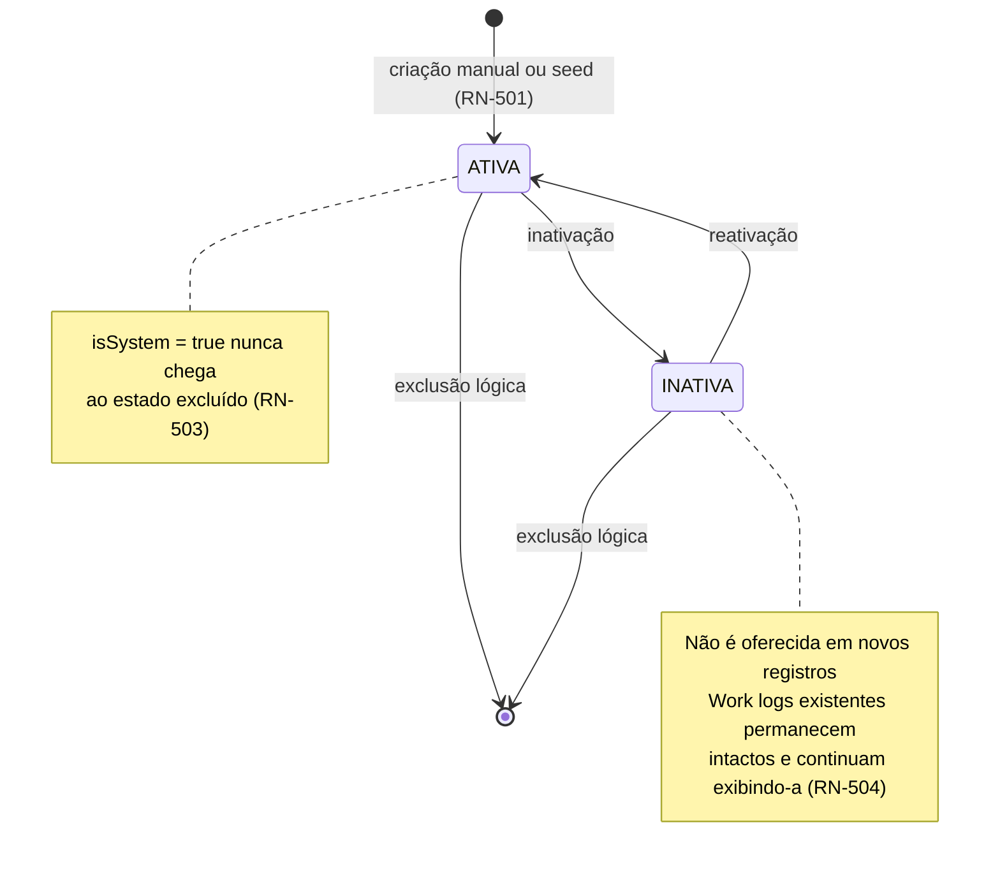
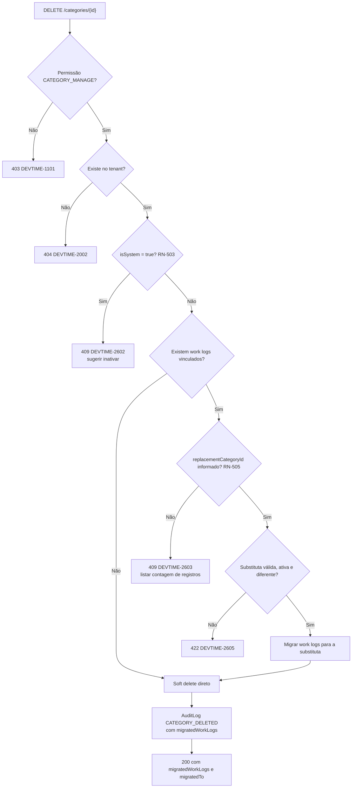
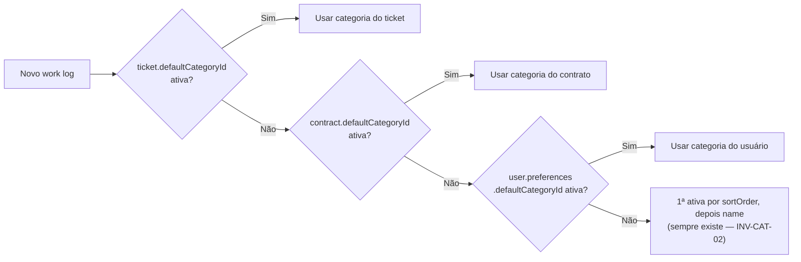

# 005 — Categories

| Campo | Valor |
|---|---|
| **Feature** | 005 |
| **Épico** | EP-06 (Tickets e Classificação) |
| **Sprint** | S3 |
| **Prioridade** | P0 |
| **Complexidade** | Baixa |
| **Estimativa** | 8 pts · 2 dias-agente |
| **Stories** | US-072 a US-076 |
| **Status** | SPEC_APPROVED |

## 1. Objetivo

Manter o catálogo de categorias de trabalho do tenant — criado automaticamente com 9 categorias padrão — usado para classificar a natureza de cada registro de horas e para determinar o valor inicial de `billable`.

## 2. Problema que resolve

O cliente que recebe um relatório quer saber **em que** as horas foram gastas, não apenas quantas foram. "40 horas" não sustenta uma conversa; "22h de desenvolvimento, 9h de correção de bug, 6h de reunião, 3h de suporte" sustenta. A categoria é o segundo critério de agrupamento mais usado nos relatórios, atrás apenas da data (RN-712 §13).

O seed de 9 categorias (RN-501) existe porque exigir que o usuário crie taxonomia antes de registrar a primeira hora é uma barreira de adoção desnecessária: ele quer registrar horas, não modelar um sistema de classificação. O catálogo é editável, mas nunca vazio.

## 3. Escopo

| # | Item | Referência |
|---|---|---|
| E-01 | CRUD de categoria com soft delete | §6.10 `entities.md` |
| E-02 | Seed de 9 categorias de sistema na criação do tenant | RN-501 |
| E-03 | Unicidade de nome por tenant, sem diferenciação de caixa | RN-502 |
| E-04 | Proteção da categoria de sistema contra exclusão | RN-503 |
| E-05 | Inativação sem efeito sobre registros existentes | RN-504 |
| E-06 | Exclusão com migração obrigatória para categoria substituta | RN-505 |
| E-07 | Reordenação por `sortOrder` | §8.4 `users.md` |
| E-08 | `billableByDefault` como origem de `billable` no work log | §6.10, RN-112 |
| E-09 | Estatística de uso por categoria (`workLogsCount`, `totalMinutes`) | §8.1 `users.md` |
| E-10 | Interface pública de resolução de categoria padrão para `008` | RN-104 |
| E-11 | Tela P30 | `pages.md` |

## 4. Fora do escopo

| Item | Onde está | Motivo |
|---|---|---|
| Tags | `006-tags` | Taxonomia livre, natureza distinta: categoria é obrigatória e exclusiva; tag é opcional e múltipla |
| Aplicação de RN-104 no registro de horas | `008-worklogs` | Esta feature **fornece** a categoria; quem a valida no work log é `008` |
| Categoria padrão do contrato (`defaultCategoryId`) | `004-contracts` | Campo do contrato, não da categoria |
| Categoria padrão do usuário (`preferences.defaultCategoryId`) | `002-users` | Campo de preferência |
| Agrupamento por categoria em relatório | `012-reports` | É saída |
| Categorias por cliente ou por contrato | Fora do roadmap | Taxonomia por contrato multiplica a complexidade sem demanda validada |
| Hierarquia de categorias (subcategorias) | Fora do roadmap | Um nível é suficiente para o relatório; hierarquia complica o agrupamento |

## 5. Dependências

### 5.1 Features
| Feature | Tipo | O que consome |
|---|---|---|
| `001-authentication` | Bloqueante | `TenantContext`, permissões |
| `002-users` | Bloqueante | Gatilho de criação do tenant (executa o seed RN-501); `preferences.defaultCategoryId` |
| `004-contracts` | Consumidora | `defaultCategoryId` do contrato referencia esta entidade |
| `007-tickets` | Consumidora | `defaultCategoryId` do ticket |
| `008-worklogs` | Consumidora | `CategoryService.resolveDefault` e validação de RN-104 |
| `009-timer` | Consumidora | Categoria do timer |
| `012-reports` | Consumidora | Agrupamento e rótulo de cor |

### 5.2 Documentos obrigatórios
| Documento | Seções relevantes |
|---|---|
| `docs/04-api/users.md` | §8 Categorias |
| `docs/02-domain/entities.md` | §6.10 Category, incluindo a tabela de seed |
| `docs/02-domain/business-rules.md` | RN-501 a RN-505, RN-104, RN-112 |
| `docs/02-domain/permissions.md` | §6.7, §7 |
| `docs/05-ui/pages.md` | P30 |
| `docs/05-ui/design-system.md` | Paleta de cores e ícones PrimeIcons |

### 5.3 Infraestrutura
| Componente | Uso |
|---|---|
| PostgreSQL | Tabela `categories` |
| Nenhuma integração externa | — |

## 6. Regras de negócio

| ID | Tipo | Enunciado resumido | Erro | Onde é aplicada |
|---|---|---|---|---|
| RN-501 | Automática | Criar tenant gera as 9 categorias padrão com `isSystem = true` | — | `CategorySeedService` |
| RN-502 | Bloqueante | Nome único por tenant, sem diferenciação de caixa | `DEVTIME-2601` / 409 | Índice parcial + `CategoryService` |
| RN-503 | Bloqueante | Categoria `isSystem` não é excluída; pode ser inativada e renomeada | `DEVTIME-2602` / 409 | `SystemCategoryGuard` |
| RN-504 | Automática | Inativar não afeta work logs existentes; apenas deixa de ser oferecida | — | `CategoryService.deactivate` |
| RN-505 | Bloqueante | Exclusão com work logs vinculados exige categoria substituta, para a qual os registros migram | `DEVTIME-2603` / 409 | `CategoryDeletionService` |
| RN-104 | Bloqueante | Work log exige categoria válida e **ativa**; ordem de pré-seleção definida | `DEVTIME-2104` / 422 | `CategoryService.resolveDefault` (aplicada em `008`) |
| RN-112 | Automática | `billable` do work log nasce de `category.billableByDefault` | — | Consumida por `008`/`009` |
| RN-003 | Automática | Exclusão é lógica | — | Todas |
| RN-004 | Bloqueante | Alteração exige `version` correspondente | `DEVTIME-2004` / 409 | Todas as edições |
| RN-011 | Bloqueante | `isSystem` é imutável | `DEVTIME-2003` / 422 | `CategoryService.update` |
| RN-012 | Bloqueante | Listagem paginada, `size` máximo 100 | `DEVTIME-2006` / 400 | `CategoryController` |
| RN-001 | Bloqueante | Toda operação no tenant do usuário autenticado | `DEVTIME-1200` / 403 | Filtro automático |
| RN-002 | Bloqueante | Categoria de outro tenant retorna `404` | `DEVTIME-2002` / 404 | Filtro automático |
| RN-006 | Automática | Toda alteração gera `AuditLog` na mesma transação | — | Todas |

### 6.1 Ordem de aplicação — exclusão de categoria

| # | Verificação | Falha |
|---|---|---|
| 1 | Permissão `CATEGORY_MANAGE` | `403 DEVTIME-1101` |
| 2 | Categoria existe no tenant | `404 DEVTIME-2002` |
| 3 | Não é categoria de sistema (RN-503) | `409 DEVTIME-2602` |
| 4 | Se há work logs vinculados, `replacementCategoryId` foi informado (RN-505) | `409 DEVTIME-2603` |
| 5 | Substituta existe, está ativa e é diferente da excluída | `422 DEVTIME-2605` |
| 6 | Migra os work logs para a substituta | — |
| 7 | Soft delete da categoria; gera auditoria com a contagem migrada | — |

**Por que a ordem é esta:** a verificação de sistema (3) precede a de vínculos (4) porque uma categoria de sistema nunca será excluída, independentemente de ter ou não registros — pedir a substituta primeiro faria o usuário escolher algo que seria descartado. A validação da substituta (5) precede a migração (6) porque migrar para uma categoria inválida corromperia os registros de forma difícil de reverter.

### 6.2 Ordem de pré-seleção da categoria (RN-104)

| # | Origem | Condição |
|---|---|---|
| 1 | `ticket.defaultCategoryId` | Preenchida e a categoria está ativa |
| 2 | `contract.defaultCategoryId` | Idem |
| 3 | `user.preferences.defaultCategoryId` | Idem |
| 4 | Primeira categoria ativa por `sortOrder`, depois por `name` | Sempre existe (RN-501 garante ≥ 1) |

**Por que esta ordem:** vai do mais específico ao mais genérico. O ticket conhece a natureza exata do trabalho; o contrato conhece o tipo de serviço prestado; o usuário conhece seu próprio padrão de trabalho. O desempate final por `sortOrder` e depois `name` é necessário para que a resolução seja **determinística** — sem ele, dois registros feitos em sequência poderiam receber categorias diferentes sem que nada tivesse mudado.

**Comportamento em caso de categoria inativa na cadeia:** a origem é **pulada**, não rejeitada. Um ticket que aponta para uma categoria inativada meses atrás não deve impedir o registro de horas; ele apenas deixa de sugerir aquela categoria.

### 6.3 Invariantes envolvidas
| ID | Invariante | Como é garantida |
|---|---|---|
| INV-CAT-01 | `(tenantId, lower(name))` único entre categorias não excluídas | Índice único parcial sobre expressão |
| INV-CAT-02 | Todo tenant possui ao menos uma categoria ativa | RN-501 no seed + RN-503 impede excluir as de sistema |
| INV-CAT-03 | `isSystem = true` ⇒ categoria não excluível | `SystemCategoryGuard` + verificação no service |
| INV-CAT-04 | Nenhum work log referencia categoria excluída | RN-505 migra antes do soft delete |
| INV-CAT-05 | `isSystem` é imutável após a criação | Campo ausente dos DTOs de atualização |

## 7. Fluxo principal — criação de categoria

1. Usuário com `CATEGORY_MANAGE` abre P30.
2. Informa nome, descrição, cor, ícone e `billableByDefault`.
3. O front sugere uma cor livre da paleta e valida o formato hexadecimal localmente (FM-02).
4. Envia `POST /api/v1/categories`.
5. `CategoryService` verifica a unicidade do nome sem diferenciar caixa (RN-502).
6. Persiste com `isSystem = false`, `active = true` e `sortOrder` igual ao maior existente + 1.
7. Gera `AuditLog` `CATEGORY_CREATED` na mesma transação.
8. Retorna `201` com `Location`.
9. A nova categoria passa a ser oferecida imediatamente em P23 e no cronômetro.

## 8. Fluxos alternativos

| # | Fluxo | Gatilho | Comportamento |
|---|---|---|---|
| FA-01 | Seed na criação do tenant | `TenantCreatedEvent` | Cria as 9 categorias da tabela §6.10, com `isSystem = true`, `sortOrder` de 0 a 8, na **mesma transação** da criação do tenant |
| FA-02 | Renomear categoria de sistema | P30 | Permitido (RN-503). `isSystem` permanece `true` |
| FA-03 | Inativar categoria | P30 | `active = false`; deixa de ser oferecida; work logs existentes intactos (RN-504) |
| FA-04 | Reativar categoria | P30 | Volta a ser oferecida; nenhum efeito retroativo |
| FA-05 | Excluir categoria sem vínculos | P30 | Soft delete direto, sem exigir substituta |
| FA-06 | Excluir categoria com vínculos | P30 | Exige `replacementCategoryId`; migra e informa a contagem |
| FA-07 | Excluir categoria de sistema | P30 | `409 DEVTIME-2602`; a UI sugere inativar |
| FA-08 | Reordenar | P30, arrastar e soltar | `PATCH /categories/reorder` com **todos** os ids do tenant |
| FA-09 | Consultar uso | P30 | Cada linha exibe `workLogsCount` e `totalMinutes` |
| FA-10 | Categoria pré-selecionada no work log | P23 | Resolvida pela cadeia da §6.2 |
| FA-11 | Cadeia de pré-seleção com categorias inativas | P23 | Origens inativas são puladas; nunca falha |

## 9. Diagramas

### 9.1 Ciclo de vida da categoria

### 9.2 Exclusão com migração (RN-505)

### 9.3 Cadeia de resolução da categoria padrão (RN-104)

## 10. Estados

| Estado | Significado | Operações permitidas | Operações bloqueadas |
|---|---|---|---|
| `active = true` | Oferecida em novos registros | Editar, renomear, reordenar, inativar, excluir (se não for de sistema) | — |
| `active = false` | Não oferecida; histórico preservado | Editar, renomear, reativar, excluir (se não for de sistema) | Ser selecionada em novo work log ou timer (`DEVTIME-2104`) |
| *excluído* | Soft delete | — | Todas. Invisível a toda consulta padrão |

> Categoria **não possui** campo `status` nem máquina de estados formal: `active` é um booleano. Modelar um enum de dois valores adicionaria uma máquina de estados para uma decisão binária sem guardas — complexidade sem contrapartida.

## 11. Transições

| Origem | Destino | Gatilho | Guarda | Efeito | Permissão |
|---|---|---|---|---|---|
| — | `active = true` | Criação manual | Nome único (RN-502) | `isSystem = false`; `sortOrder = max + 1` | `CATEGORY_MANAGE` |
| — | `active = true` | Seed do tenant (RN-501) | Tenant recém-criado | 9 categorias com `isSystem = true` | Sistema (`actorType = SYSTEM`) |
| `active = true` | `active = false` | Inativação | — | Deixa de ser oferecida; nenhum work log alterado (RN-504) | `CATEGORY_MANAGE` |
| `active = false` | `active = true` | Reativação | — | Volta a ser oferecida | `CATEGORY_MANAGE` |
| qualquer | *excluído* | Exclusão | `isSystem = false` (RN-503); substituta se houver vínculos (RN-505) | Migra work logs; soft delete | `CATEGORY_MANAGE` |

### 11.1 Transições proibidas
| Transição | Motivo da proibição |
|---|---|
| `isSystem = true` → *excluído* | RN-503. As 9 categorias de seed garantem INV-CAT-02: sempre existe categoria disponível. Permitir a exclusão abriria a possibilidade de um tenant sem nenhuma categoria, tornando RN-104 insatisfazível |
| `isSystem = false` → `isSystem = true` | RN-011. `isSystem` distingue o que foi semeado do que o usuário criou; torná-lo editável apagaria essa distinção e permitiria contornar RN-503 |
| Exclusão com vínculos sem substituta | RN-505. Deixaria work logs apontando para categoria inexistente, quebrando INV-CAT-04 e todos os relatórios agrupados por categoria |
| Alteração de `sortOrder` fora de `/reorder` | A reordenação é atômica sobre o conjunto completo; alterações individuais produziriam ordens duplicadas ou com lacunas |

## 12. Casos de erro

| Código | HTTP | Situação | Mensagem ao usuário | Regra |
|---|:--:|---|---|---|
| `DEVTIME-1101` | 403 | Papel sem `CATEGORY_MANAGE` | Você não tem permissão para esta ação | §7 permissions |
| `DEVTIME-2002` | 404 | Categoria de outro tenant | Recurso não encontrado | RN-002 |
| `DEVTIME-2003` | 422 | Tentativa de alterar `isSystem` | Este campo não pode ser alterado | RN-011 |
| `DEVTIME-2004` | 409 | Conflito de `version` | O registro foi alterado. Recarregue e tente novamente | RN-004 |
| `DEVTIME-2006` | 400 | `size` acima de 100 | Tamanho de página inválido | RN-012 |
| `DEVTIME-2000` | 422 | Cor fora do formato hexadecimal | Cor inválida | §8.2 `users.md` |
| `DEVTIME-2601` | 409 | Nome duplicado no tenant | Já existe uma categoria com este nome | RN-502 |
| `DEVTIME-2602` | 409 | Exclusão de categoria de sistema | Categoria padrão não pode ser excluída. Inative-a se não desejar utilizá-la | RN-503 |
| `DEVTIME-2603` | 409 | Exclusão com vínculos sem substituta | Existem registros nesta categoria. Escolha uma categoria substituta | RN-505 |
| `DEVTIME-2605` | 422 | Substituta inválida, inativa ou igual à excluída | Categoria substituta inválida | §8.3 `users.md` |
| `DEVTIME-2104` | 422 | Uso de categoria inativa em work log | Categoria inválida ou inativa | RN-104 (aplicada em `008`) |
| `DEVTIME-1201` | 403 | Escrita em tenant suspenso | Organização suspensa: apenas leitura | RN-007 |

### 12.1 Casos extremos

| # | Caso | Comportamento esperado |
|---|---|---|
| CX-01 | Duas categorias com nome diferindo apenas na caixa | Rejeitado — RN-502 é *case-insensitive* |
| CX-02 | Nome com acento: "Análise" e "Analise" | **Aceitos como distintos** — a unicidade ignora caixa, mas não acentos, coerente com RN-404 em `003` |
| CX-03 | Categoria excluída e nova com o mesmo nome | Permitido: o índice único é parcial e ignora excluídos |
| CX-04 | Renomear categoria de sistema para o nome de outra existente | Rejeitado com `DEVTIME-2601` — a proteção de sistema não dispensa a unicidade |
| CX-05 | Excluir a última categoria ativa não sistêmica | Permitido: as 9 de sistema permanecem, preservando INV-CAT-02 |
| CX-06 | Inativar **todas** as categorias | Permitido inativar todas, inclusive as de sistema. O registro de horas passa a falhar com `DEVTIME-2104`. A UI alerta ao inativar a última ativa, mas **não bloqueia** — é uma decisão legítima de um tenant em pausa |
| CX-07 | Substituta igual à categoria excluída | `422 DEVTIME-2605` |
| CX-08 | Substituta inativa | `422 DEVTIME-2605` — migrar para uma categoria inativa criaria registros com categoria não oferecida |
| CX-09 | Exclusão com 100.000 work logs vinculados | Migração em lote (`UPDATE` em massa, sem carregar entidades); a resposta informa a contagem real migrada |
| CX-10 | Reordenação com lista incompleta | `422` — a lista deve conter todas as categorias do tenant (§8.4) |
| CX-11 | Reordenação com id de outro tenant | `422`; nenhuma ordem é alterada — a operação é atômica |
| CX-12 | Reordenação com ids duplicados | `422`; ordem inalterada |
| CX-13 | Work log em categoria inativada após a criação | Permanece válido e continua exibindo a categoria (RN-504); a edição do work log **mantém** a categoria original se não for alterada |
| CX-14 | Seed executado duas vezes para o mesmo tenant | Idempotente: a segunda execução não cria duplicatas (impedido por INV-CAT-01) |
| CX-15 | Ticket aponta para categoria excluída | A cadeia da §6.2 pula a origem e segue para o contrato |
| CX-16 | Cor fora da paleta do design system | Aceita, desde que hexadecimal válida. A paleta é sugestão, não restrição |

## 13. Modelo de dados

### 13.1 Entidades impactadas
| Entidade | Operação | Tabela | Referência |
|---|---|---|---|
| `Category` | Cria, lê, atualiza, soft delete | `categories` | §6.10 |
| `WorkLog` | Atualiza (`categoryId` na migração de RN-505) | `work_logs` | Via `WorkLogService` |
| `Tenant` | Lê (gatilho do seed) | `tenants` | §6.1 |
| `AuditLog` | Cria | `audit_logs` | §6.20 |

### 13.2 Campos obrigatórios na criação
| Campo | Tipo | Origem | Imutável | Validação |
|---|---|---|:--:|---|
| `tenantId` | UUID | `TenantContext` | ✔ 🔒 | Nunca da requisição (ART-021) |
| `name` | String(60) | Request | ✖ | 2–60; único por tenant sem caixa (RN-502) |
| `description` | String(255) | Request | ✖ | Opcional |
| `color` | String(7) | Request | ✖ | Hex `#RRGGBB`; default `#6366F1` |
| `icon` | String(40) | Request | ✖ | Nome PrimeIcons; opcional |
| `billableByDefault` | boolean | Request | ✖ | Default `true` |
| `active` | boolean | Sistema | ✖ | `true` na criação |
| `sortOrder` | int | Sistema | ✖ | `max(sortOrder) + 1` |
| `isSystem` | boolean | Sistema | ✔ 🔒 | `false` na criação manual; `true` no seed |

### 13.3 Migrations
| Migration | Conteúdo | Compatibilidade |
|---|---|---|
| `V016__create_categories.sql` | Tabela `categories` + índice único parcial sobre `(tenant_id, lower(name))` + índice de ordenação | Nova tabela |

> **Sem migration de seed.** As 9 categorias são criadas pelo `CategorySeedService` no fluxo de criação do tenant, não por `INSERT` em migration. Uma migration de dados só semearia os tenants existentes no momento da sua execução, deixando todos os tenants futuros sem categorias — o oposto do necessário.

### 13.4 Índices
| Índice | Colunas | Sustenta |
|---|---|---|
| `uq_categories_tenant_name` | `(tenant_id, lower(name))` WHERE `deleted_at IS NULL` | RN-502, INV-CAT-01 |
| `idx_categories_tenant_active_order` | `(tenant_id, active, sort_order, name)` WHERE `deleted_at IS NULL` | Listagem ordenada e cadeia da §6.2 |
| `idx_work_logs_category` | `(tenant_id, category_id)` WHERE `deleted_at IS NULL` | Contagem de vínculos (RN-505) e estatística de uso |

## 14. Endpoints utilizados

| Método | Rota | Operação | Permissão | Sucesso | Doc |
|---|---|---|---|:--:|---|
| GET | `/api/v1/categories` | Listar com filtro `active` e `search` | `CATEGORY_VIEW` | 200 | §8.1 `users.md` |
| POST | `/api/v1/categories` | Criar | `CATEGORY_MANAGE` | 201 | §8.2 |
| PUT | `/api/v1/categories/{id}` | Atualizar | `CATEGORY_MANAGE` | 200 | §8 |
| PATCH | `/api/v1/categories/reorder` | Reordenar | `CATEGORY_MANAGE` | 200 | §8.4 |
| DELETE | `/api/v1/categories/{id}` | Excluir com `replacementCategoryId` opcional | `CATEGORY_MANAGE` | 200 | §8.3 |

> A exclusão retorna `200` com corpo (`migratedWorkLogs`, `migratedTo`), não `204`. A contagem de registros migrados é informação que o usuário precisa ver — um `204` silencioso esconderia que 87 registros mudaram de classificação.

## 15. Eventos

| Evento | Publicado por | Consumidores | Momento | Efeito |
|---|---|---|---|---|
| `TenantCreatedEvent` | `002-users` | `CategorySeedService` | **Dentro** da transação | Cria as 9 categorias padrão (RN-501) |
| `CategoryDeactivatedEvent` | `CategoryService` | Métricas | Após o commit | Telemetria |
| `CategoryMergedEvent` | `CategoryDeletionService` | `010-dashboard`, `012-reports` | Após o commit | Invalida caches de agrupamento por categoria |

**Justificativa do momento do seed:** o seed ocorre **dentro** da transação de criação do tenant. Fora dela, existiria uma janela — ainda que de milissegundos — em que um tenant válido não teria nenhuma categoria, violando INV-CAT-02. Se a criação do tenant falhar, as categorias não devem existir; se o seed falhar, o tenant não deve ser criado. São a mesma unidade de trabalho.

## 16. Permissões

| Operação | Permissão | Papéis | Ownership | Escopo de dados |
|---|---|---|---|---|
| Listar e consultar | `CATEGORY_VIEW` | OWNER, ADMIN, MANAGER, MEMBER, VIEWER | — | Todo o tenant — categorias não são dado sensível |
| Criar, editar, reordenar | `CATEGORY_MANAGE` | OWNER, ADMIN, MANAGER | — | — |
| Inativar, reativar, excluir | `CATEGORY_MANAGE` | OWNER, ADMIN, MANAGER | — | — |
| Seed automático | — | Sistema (`actorType = SYSTEM`) | — | Ignora RBAC, respeita o tenant (CE-P-08) |

> **`MEMBER` lê mas não gerencia:** ele precisa da lista para classificar suas horas, mas alterar a taxonomia afeta os relatórios de todos os clientes — decisão de quem responde pela entrega. Diferentemente de `TAG_MANAGE`, que `MEMBER` possui (§7 de `permissions.md`), porque tag é anotação pessoal e descartável.

## 17. Validações

### 17.1 Camada 1 — Formato (`400`)
| Campo | Restrição | Mensagem |
|---|---|---|
| `name` | `@NotBlank`, `@Size(min=2,max=60)` | Informe o nome da categoria |
| `description` | `@Size(max=255)` | Descrição muito longa |
| `color` | `@Pattern(^#[0-9A-Fa-f]{6}$)` | Cor inválida |
| `icon` | `@Size(max=40)` | Ícone inválido |
| `billableByDefault` | `@NotNull` | Informe se é faturável por padrão |
| `orderedIds` | `@NotEmpty`, sem duplicatas | Lista de ordenação inválida |
| `size` | `@Max(100)` | Tamanho de página inválido |

### 17.2 Camada 2 — Negócio
| Validação | Regra | Erro |
|---|---|---|
| Nome único no tenant, sem caixa | RN-502 | `DEVTIME-2601` / 409 |
| Categoria de sistema não excluível | RN-503 | `DEVTIME-2602` / 409 |
| Substituta obrigatória com vínculos | RN-505 | `DEVTIME-2603` / 409 |
| Substituta existente, ativa e distinta | §8.3 `users.md` | `DEVTIME-2605` / 422 |
| `orderedIds` contém todas as categorias do tenant | §8.4 `users.md` | `422` |
| `isSystem` ausente do payload de atualização | RN-011 | `DEVTIME-2003` / 422 |
| `version` correspondente | RN-004 | `DEVTIME-2004` / 409 |

### 17.3 Camada 3 — Consistência
| Constraint | Garante | Mapeado para |
|---|---|---|
| `uq_categories_tenant_name` | INV-CAT-01 | `DEVTIME-2601` |
| FK `work_logs.category_id` → `categories.id` | INV-CAT-04 | `DEVTIME-2603` |
| `CHECK (color ~ '^#[0-9A-Fa-f]{6}$')` | Formato de cor | `DEVTIME-2000` |

## 18. Auditoria

| Ação | `action` | `beforeState` | `afterState` | Metadata |
|---|---|---|---|---|
| Seed do tenant | `CATEGORY_SEEDED` | — | `{count: 9}` | `actorType = SYSTEM`, traceId |
| Criação | `CATEGORY_CREATED` | — | `{name, color, billableByDefault}` | IP, traceId |
| Edição | `CATEGORY_UPDATED` | Campos alterados | Campos alterados | IP, traceId |
| Inativação | `CATEGORY_DEACTIVATED` | `{active: true}` | `{active: false}` | traceId |
| Reativação | `CATEGORY_REACTIVATED` | `{active: false}` | `{active: true}` | traceId |
| Reordenação | `CATEGORY_REORDERED` | Ordem anterior | Ordem nova | traceId |
| Exclusão com migração | `CATEGORY_DELETED` | `{name, workLogsCount}` | `{deletedAt, migratedTo}` | `migratedWorkLogs`, IP, traceId |

> A auditoria da exclusão registra **quantos** registros migraram e **para onde**. Sem esse dado, uma reclassificação em massa seria irreversível e inexplicável meses depois, quando um relatório histórico apresentasse números diferentes do esperado.

## 19. Segurança

| # | Vetor | Mitigação | Verificação |
|---|---|---|---|
| SG-01 | Categoria de outro tenant acessada por id | Filtro automático; `404` (ART-024) | Suíte de isolamento |
| SG-02 | Reordenação com ids de outro tenant | Todos os ids validados contra o tenant antes de qualquer escrita; operação atômica | Teste com id externo |
| SG-03 | Migração de work logs para categoria de outro tenant | Substituta validada dentro do tenant | Teste dedicado |
| SG-04 | `MEMBER` alterando a taxonomia do tenant | `CATEGORY_MANAGE` negada a `MEMBER` e `VIEWER` | Matriz de permissões |
| SG-05 | Contorno de RN-503 alterando `isSystem` | Campo ausente dos DTOs de atualização; ignorado se enviado | Teste com payload malicioso |
| SG-06 | Exclusão em massa acidental de taxonomia | Categorias de sistema protegidas; soft delete reversível por suporte | RN-503 |

### 19.1 LGPD

| Dado pessoal | Base legal | Retenção | Exportação | Anonimização | Proibido em log |
|---|---|---|---|---|---|
| Nenhum | — | — | — | — | — |

**Justificativa:** `Category` não contém dado pessoal. Nome, cor, ícone e ordenação são metadados de classificação de trabalho, sem vínculo com pessoa natural. A entidade é exportada em `GET /tenant/export` como parte da configuração do tenant, e nada nela exige anonimização. Esta seção existe preenchida — e não omitida — porque SP-08 exige que a pergunta seja **respondida**, não presumida.

## 20. Performance

| Operação | Meta | Índice/estratégia | Risco |
|---|---|---|---|
| Listagem | p95 < 100 ms | `idx_categories_tenant_active_order`; conjunto pequeno (dezenas de linhas) | Desprezível |
| Listagem com estatística de uso | p95 < 400 ms | Agregação por `idx_work_logs_category`; contagem calculada sob demanda, não a cada requisição | Tenant com 500k work logs |
| Resolução da categoria padrão (§6.2) | < 10 ms | Cache local por requisição; a lista inteira cabe em memória | Chamada em toda criação de work log |
| Contagem de vínculos na exclusão | < 200 ms | `COUNT` por `idx_work_logs_category` | — |
| Migração em massa (RN-505) | < 5 s para 100k registros | `UPDATE` em lote, sem carregar entidades no contexto de persistência | Migração de categoria muito usada |

### 20.1 Escalabilidade

`categories` é a menor tabela do sistema: dezenas de linhas por tenant, mesmo em tenants grandes. Nenhum problema de escala existe na entidade em si.

O risco real está em duas operações que **atravessam** `work_logs`: a estatística de uso (§8.1) e a migração de RN-505. Ambas são resolvidas por índice dedicado e por operação em lote no banco. A estatística de uso é **opcional na listagem** — solicitada por parâmetro `includeUsage`, não calculada por padrão — para que a tela de seleção de categoria em P23, chamada a cada registro de horas, nunca pague o custo da agregação.

Com 100k+ work logs por tenant, a migração de RN-505 permanece uma operação de administrador, executada raramente. Um `UPDATE ... WHERE category_id = ?` sobre índice é linear no número de linhas afetadas e não bloqueia leituras no PostgreSQL.

## 21. Componentes Frontend

### 21.1 Rotas
| Rota | Componente | Guard | Lazy | Tela |
|---|---|---|:--:|---|
| `/settings/categories` | `CategorySettingsPage` | `permissionGuard(['CATEGORY_VIEW'])` | ✔ | P30 |

### 21.2 Componentes
| Componente | Tipo | Responsabilidade | Inputs | Outputs |
|---|---|---|---|---|
| `CategorySettingsPage` | Page | Lista, ordenação por arrastar, ações e diálogos | — | — |
| `dt-category-list` | Presentational | Lista ordenável com uso e indicador de sistema | `categories`, `canManage` | `reorder`, `edit`, `toggleActive`, `delete` |
| `dt-category-form-dialog` | Presentational | Criação e edição, com seletor de cor e ícone | `category?` | `save`, `cancel` |
| `dt-category-badge` | Shared | Selo com cor e ícone, reutilizado em P17–P23 e relatórios | `category`, `size` | — |
| `dt-category-picker` | Shared | Seleção em formulários, listando **apenas ativas** | `value`, `required` | `change` |
| `dt-category-delete-dialog` | Presentational | Confirmação com seleção de substituta quando há vínculos | `category`, `usageCount`, `candidates` | `confirm`, `cancel` |
| `dt-color-picker` | Shared | Paleta do design system + entrada hexadecimal livre | `value` | `change` |
| `dt-icon-picker` | Shared | Seleção de ícone PrimeIcons | `value` | `change` |

> `dt-category-badge` e `dt-category-picker` são **compartilhados** e consumidos por `007`, `008`, `009` e `012`. Estão nesta feature porque aqui está a fonte da verdade da cor, do ícone e do estado ativo — replicá-los produziria divergência visual entre telas.

### 21.3 Stores e serviços Angular
| Artefato | Tipo | Estado exposto | Escopo |
|---|---|---|---|
| `CategoryStore` | Store | `categories`, `activeCategories` (computed), `loading`, `error` | `providedIn: 'root'` — carregada uma vez por sessão e reutilizada por todas as telas |
| `CategoryApi` | API | Somente HTTP dos 5 endpoints | `providedIn: 'root'` |

> **Escopo `root`, não por rota:** a lista de categorias é pequena, muda raramente e é consumida por praticamente todas as telas de registro. Provê-la na rota `/settings/categories` obrigaria cada tela a recarregá-la. O invalidamento ocorre por evento após qualquer escrita.

### 21.4 Guards, interceptors, pipes e directives
| Artefato | Tipo | Uso |
|---|---|---|
| `permissionGuard` | Guard | Protege P30 |
| `hasPermission` | Directive | Oculta criar, editar, reordenar e excluir de quem não tem `CATEGORY_MANAGE` |
| `categoryNamePipe` | Pipe | Exibe o nome com o selo de cor |
| `unsavedChangesGuard` | Guard | Diálogo de formulário com alterações pendentes |

## 22. Serviços Backend

### 22.1 Controllers
| Classe | Rota base | Endpoints |
|---|---|---|
| `CategoryController` | `/api/v1/categories` | listar, criar, atualizar, reordenar, excluir |

### 22.2 Services
| Interface | Implementação | Responsabilidade | Permissão declarada |
|---|---|---|---|
| `CategoryService` | `CategoryServiceImpl` | CRUD, inativação, reativação, resolução da categoria padrão | `CATEGORY_VIEW`, `CATEGORY_MANAGE` |
| `CategorySeedService` | `CategorySeedServiceImpl` | Seed das 9 categorias na criação do tenant (RN-501) | Sistema — sem `@PreAuthorize`, invocada por evento interno |
| `CategoryDeletionService` | `CategoryDeletionServiceImpl` | Exclusão com migração em lote (RN-505) | `CATEGORY_MANAGE` |
| `CategoryUsageService` | `CategoryUsageServiceImpl` | Estatística de uso sob demanda | `CATEGORY_VIEW` |

**Interfaces públicas consumidas por outras features:**

| Método | Consumidor | Contrato |
|---|---|---|
| `CategoryService.resolveDefault(ticketId, contractId, userId)` | `008`, `009` | Aplica a cadeia da §6.2; nunca retorna vazio (INV-CAT-02) |
| `CategoryService.getActiveById(categoryId)` | `008`, `009` | Retorna vazio se inexistente ou inativa, produzindo `DEVTIME-2104` no chamador |
| `CategoryService.getAllForReport()` | `012` | Categorias inclusive inativas e excluídas, para rotular registros históricos |

> `getAllForReport` inclui **excluídas** deliberadamente: um relatório de período fechado deve exibir o nome da categoria vigente à época. Omiti-la produziria linhas sem classificação em relatórios já entregues.

### 22.3 Componentes de domínio
| Classe | Tipo | Responsabilidade | Regras |
|---|---|---|---|
| `SystemCategoryGuard` | Validator | Impede exclusão de `isSystem = true` | RN-503 |
| `CategoryNameUniquenessValidator` | Validator | Unicidade sem diferenciação de caixa | RN-502 |
| `DefaultCategoryResolver` | Policy | Cadeia de pré-seleção da §6.2 | RN-104 |
| `CategoryReorderPolicy` | Policy | Valida completude e unicidade de `orderedIds`; aplica em lote | §8.4 `users.md` |
| `CategoryReplacementValidator` | Validator | Substituta existente, ativa e distinta | §8.3 `users.md` |
| `DefaultCategoryCatalog` | Utilitário | Tabela imutável das 9 categorias de seed | RN-501, §6.10 |

### 22.4 Jobs
| Classe | Cron | Lock | Responsabilidade | Idempotência |
|---|---|---|---|---|
| — | — | — | Não se aplica — nenhuma operação desta feature é temporal ou agendada | — |

## 23. DTOs

| DTO | Direção | Campos principais | Observação |
|---|---|---|---|
| `CategoryCreateRequest` | Request | `name`, `description`, `color`, `icon`, `billableByDefault` | `isSystem`, `active` e `sortOrder` **ausentes** — são do sistema |
| `CategoryUpdateRequest` | Request | Mesmos + `version` | `isSystem` ausente (INV-CAT-05); `active` alterado por endpoint próprio |
| `CategoryResponse` | Response | Todos + `id`, `active`, `sortOrder`, `isSystem`, `version`, `usage?` | `usage` presente apenas com `includeUsage=true` |
| `CategoryUsageDto` | Projection | `workLogsCount`, `totalMinutes` | Agregação sob demanda |
| `CategoryFilter` | Filter | `active`, `search`, `includeUsage` | — |
| `CategoryReorderRequest` | Request | `orderedIds[]` | Deve conter todas as categorias do tenant |
| `CategoryDeleteResponse` | Response | `migratedWorkLogs`, `migratedTo` | §8.3 `users.md` |
| `CategoryOptionProjection` | Projection | `id`, `name`, `color`, `icon`, `billableByDefault` | Usada em seletores; não carrega estatística |

## 24. Mappers

| Mapper | De → Para | Mapeamentos não triviais |
|---|---|---|
| `CategoryMapper` | `Category` → `CategoryResponse` | `usage` incluído condicionalmente; `isSystem` somente leitura |
| `CategoryOptionMapper` | `Category` → `CategoryOptionProjection` | Projeção enxuta para seletores |

## 25. Repositories

| Repository | Entidade | Métodos específicos | Índice usado |
|---|---|---|---|
| `CategoryRepository` | `Category` | `findByTenantOrdered`, `existsByNameIgnoreCase`, `findActiveOptions`, `findFirstActiveOrdered`, `updateSortOrderBatch` | `uq_categories_tenant_name`, `idx_categories_tenant_active_order` |
| `WorkLogRepository` | `WorkLog` | `countByCategoryId`, `sumMinutesByCategory`, `reassignCategory(from, to)` | `idx_work_logs_category` |

> `reassignCategory` é um `UPDATE` em lote executado no banco. Carregar 100k entidades para alterar um campo esgotaria a memória e levaria minutos (CX-09).

## 26. Entities utilizadas
| Entidade | Origem | Campos relevantes |
|---|---|---|
| `Category` | Esta feature | Todos |
| `WorkLog` | `008-worklogs` | Somente `categoryId`, para contagem e migração |
| `Tenant` | `002-users` | Gatilho do seed |

## 27. Validators e Exceptions

| Classe | Tipo | Regra | Código de erro |
|---|---|---|---|
| `CategoryNameUniquenessValidator` | Validator | RN-502 | `DEVTIME-2601` |
| `SystemCategoryGuard` | Validator | RN-503 | `DEVTIME-2602` |
| `CategoryReplacementValidator` | Validator | §8.3 `users.md` | `DEVTIME-2605` |
| `CategoryReorderPolicy` | Validator | §8.4 `users.md` | `DEVTIME-2000` |
| `DuplicateCategoryException` | Exception | RN-502 | `DEVTIME-2601` / 409 |
| `SystemCategoryException` | Exception | RN-503 | `DEVTIME-2602` / 409 |
| `CategoryInUseException` | Exception | RN-505 | `DEVTIME-2603` / 409 |
| `InvalidReplacementCategoryException` | Exception | §8.3 | `DEVTIME-2605` / 422 |
| `InactiveCategoryException` | Exception | RN-104 | `DEVTIME-2104` / 422 |

## 28. Logs

| Evento | Nível | Campos | Proibido |
|---|---|---|---|
| Seed executado | INFO | `tenantId`, `count`, traceId | — |
| Categoria criada | INFO | `tenantId`, `userId`, `categoryId`, traceId | — |
| Categoria inativada | INFO | `categoryId`, `workLogsCount` | — |
| Exclusão com migração | **WARN** | `categoryId`, `replacementId`, `migratedWorkLogs` | — |
| Exclusão bloqueada por RN-503 | INFO | `categoryId` | — |
| Reordenação | INFO | `tenantId`, contagem | Ordem completa (ruído sem valor) |

> A exclusão com migração é `WARN`, não `INFO`: reclassificar registros históricos em massa é uma operação que altera relatórios já emitidos. Quando alguém questionar um número, este log é o primeiro lugar a consultar.

## 29. Métricas

| Métrica | Tipo | Tags | Alerta |
|---|---|---|---|
| `category.created` | Counter | — | — |
| `category.deleted.with_migration` | Counter | — | > 5/dia por tenant indica taxonomia instável |
| `category.deleted.blocked_system` | Counter | — | > 20/dia indica UI confusa sobre categorias padrão |
| `category.seed.duration` | Timer | — | p95 > 200 ms atrasa a criação de tenant |
| `category.migration.rows` | Distribution | — | p99 > 50.000 exige revisar a estratégia de lote |
| `worklog.category.inactive_attempt` | Counter | — | Crescimento indica seletor oferecendo categoria inativa |

## 30. Comportamentos esperados

| # | Comportamento |
|---|---|
| CE-01 | Todo tenant nasce com exatamente 9 categorias ativas de sistema |
| CE-02 | O seed ocorre na mesma transação da criação do tenant |
| CE-03 | Nome duplicado, mesmo com caixa diferente, é rejeitado |
| CE-04 | Categoria de sistema pode ser renomeada e inativada, nunca excluída |
| CE-05 | Inativar categoria não altera nenhum work log existente |
| CE-06 | Excluir categoria com vínculos exige substituta e migra os registros |
| CE-07 | A resolução da categoria padrão é determinística e nunca falha |
| CE-08 | Categorias inativas na cadeia de pré-seleção são puladas, não rejeitadas |
| CE-09 | A reordenação é atômica sobre o conjunto completo |
| CE-10 | A estatística de uso só é calculada quando explicitamente solicitada |
| CE-11 | Relatórios de períodos passados exibem o nome da categoria vigente, mesmo se excluída |
| CE-12 | Toda alteração de taxonomia gera auditoria com estado anterior e posterior |

## 31. Comportamentos proibidos

| # | Proibição | Motivo |
|---|---|---|
| CP-01 | Excluir fisicamente uma categoria | RN-003, ART-051 |
| CP-02 | Excluir categoria com `isSystem = true` | RN-503, INV-CAT-02 |
| CP-03 | Excluir categoria com vínculos sem migrar | RN-505, INV-CAT-04 |
| CP-04 | Permitir alteração de `isSystem` | RN-011, INV-CAT-05 |
| CP-05 | Semear categorias por migration SQL | Deixaria tenants futuros sem categorias |
| CP-06 | Semear fora da transação de criação do tenant | Janela com tenant sem categoria viola INV-CAT-02 |
| CP-07 | Carregar entidades para migrar 100k work logs | Esgota memória; `UPDATE` em lote é obrigatório |
| CP-08 | Calcular estatística de uso em toda listagem | Penaliza o seletor de P23, chamado a cada registro |
| CP-09 | Oferecer categoria inativa em seletor de novo registro | RN-104; produz erro previsível para o usuário |
| CP-10 | Alterar `sortOrder` fora de `/reorder` | Produz ordens duplicadas ou com lacunas |
| CP-11 | Omitir categorias excluídas de relatórios históricos | Linhas sem classificação em relatório já entregue |
| CP-12 | Acessar `CategoryRepository` a partir de outra feature | AR-02 |

## 32. Restrições

| # | Restrição | Origem |
|---|---|---|
| RS-01 | Um único nível de categorias, sem hierarquia | Decisão de escopo; hierarquia complica o agrupamento em relatórios |
| RS-02 | Taxonomia por tenant, não por cliente ou contrato | Sem demanda validada; multiplicaria a complexidade da cadeia da §6.2 |
| RS-03 | Cor livre em hexadecimal; a paleta é sugestão | `design-system.md` |
| RS-04 | Listagem com `size` máximo de 100 | RN-012 |
| RS-05 | As 9 categorias de seed são fixas e idênticas para todo tenant | RN-501; personalização do seed é F6 |

## 33. Critérios de aceite

| # | Critério | Verificação |
|---|---|---|
| CA-01 | Criar tenant produz exatamente as 9 categorias da tabela §6.10, com `isSystem = true` | Teste de integração |
| CA-02 | O seed e a criação do tenant compartilham a transação (falha em um reverte o outro) | Teste com injeção de falha |
| CA-03 | Nome duplicado com caixa diferente é rejeitado com `DEVTIME-2601` | Teste |
| CA-04 | Nomes diferindo por acento são aceitos como distintos | Teste |
| CA-05 | Exclusão de categoria de sistema retorna `DEVTIME-2602` | Teste |
| CA-06 | Renomear e inativar categoria de sistema são permitidos | Teste |
| CA-07 | Exclusão com vínculos sem substituta retorna `DEVTIME-2603` com a contagem | Teste |
| CA-08 | Migração reatribui todos os work logs e informa a contagem correta | Teste com 1.000 registros |
| CA-09 | Substituta inativa, inexistente ou igual retorna `DEVTIME-2605` | Teste |
| CA-10 | A cadeia da §6.2 é determinística e pula origens inativas | Teste parametrizado com as 4 origens |
| CA-11 | Reordenação com lista incompleta, duplicada ou com id externo é rejeitada sem efeito | Teste |
| CA-12 | Categoria inativa não aparece em `dt-category-picker` | Teste de frontend |
| CA-13 | Categoria de outro tenant retorna `404`, nunca `403` | Suíte de isolamento |
| CA-14 | Existe teste para cada célula da matriz de permissões desta feature | Relatório |

## 34. Checklist de implementação

- [ ] `V016` com índice único **parcial** sobre `(tenant_id, lower(name))`, ignorando excluídos
- [ ] `CHECK` de formato hexadecimal em `color`
- [ ] `DefaultCategoryCatalog` com as 9 categorias exatamente como na tabela §6.10 (nome, cor, ícone, faturável)
- [ ] `CategorySeedService` invocado **dentro** da transação de `TenantCreatedEvent`
- [ ] Seed idempotente, protegido por INV-CAT-01
- [ ] `SystemCategoryGuard` verificado **antes** da contagem de vínculos (§6.1)
- [ ] `CategoryReplacementValidator` rejeita substituta inativa, inexistente, de outro tenant e igual à excluída
- [ ] Migração por `UPDATE` em lote, sem carregar entidades
- [ ] `DefaultCategoryResolver` com desempate por `sortOrder` e depois `name`
- [ ] `DefaultCategoryResolver` pula origens inativas em vez de falhar
- [ ] `isSystem` ausente de `CategoryCreateRequest` e `CategoryUpdateRequest`
- [ ] `active` alterado apenas por endpoint dedicado, nunca por `PUT`
- [ ] `CategoryReorderPolicy` valida completude, unicidade e propriedade do tenant antes de qualquer escrita
- [ ] `includeUsage` como parâmetro opcional, desligado por padrão
- [ ] `getAllForReport` inclui categorias inativas **e** excluídas
- [ ] `CategoryStore` provida em `root` e invalidada após escrita
- [ ] `dt-category-picker` filtra por `active = true`
- [ ] `dt-category-badge` reutilizado por `007`, `008`, `009` e `012` sem duplicação
- [ ] Nenhum texto fixo em P30 (ART-095)
- [ ] Auditoria da exclusão registra `migratedWorkLogs` e `migratedTo`

## 35. Checklist de revisão

- [ ] Nenhum acesso a `CategoryRepository` de fora da feature
- [ ] `404` (não `403`) para categoria de outro tenant
- [ ] Nenhuma migration de dados semeando categorias
- [ ] Toda `RN-XXX` da §6 possui teste referenciando o ID no `@DisplayName`
- [ ] Migração de vínculos comprovadamente em lote (inspeção de SQL)
- [ ] Estatística de uso ausente da listagem padrão
- [ ] Teste de isolamento entre tenants para os 5 endpoints
- [ ] Cobertura ≥ 90% em services e validators
- [ ] Nenhuma listagem sem paginação

## 36. Checklist de QA

- [ ] Todos os cenários de `acceptance.md` verdes
- [ ] Tenant recém-criado exibe as 9 categorias com cores e ícones corretos
- [ ] Criação, edição, inativação, reativação e exclusão
- [ ] Exclusão com e sem vínculos
- [ ] Tentativa de excluir categoria de sistema exibe orientação para inativar
- [ ] Reordenação por arrastar e soltar persiste após recarregar
- [ ] Seletor de categoria em P23 não oferece inativas
- [ ] Work log antigo continua exibindo a categoria inativada
- [ ] Relatório de período fechado exibe categoria excluída corretamente
- [ ] Zero violações do axe-core em P30
- [ ] Navegação e reordenação completas por teclado
- [ ] Mensagens em pt-BR, sem jargão técnico

## 37. Definition of Done

| # | Item | Referência |
|---|---|---|
| DoD-01 | Todos os critérios da §33 verdes | — |
| DoD-02 | Cobertura ≥ 90% em services e validators | CA-08 `backend.md` |
| DoD-03 | Suíte de isolamento verde para os 5 endpoints | CA-03 `architecture.md` |
| DoD-04 | `docs/04-api/users.md` §8 sincronizado | ART-111 |
| DoD-05 | Zero violações do axe-core em P30 | AC-01 |
| DoD-06 | Interfaces `resolveDefault`, `getActiveById` e `getAllForReport` publicadas para `008`, `009` e `012` | AR-03 |
| DoD-07 | `dt-category-badge` e `dt-category-picker` disponíveis como componentes compartilhados | `frontend.md` |

## 38. Riscos

| # | Risco | Prob. | Impacto | Mitigação | Gatilho |
|---|---|:--:|:--:|---|---|
| R-01 | Seed fora da transação deixa tenant sem categoria | Baixa | Alto | Seed por evento **dentro** da transação; teste com injeção de falha | Tenant sem categoria em produção |
| R-02 | Migração de categoria muito usada travando o banco | Baixa | Médio | `UPDATE` em lote sobre índice; medição com 100k registros | p99 de migração > 10 s |
| R-03 | Cadeia de pré-seleção não determinística | Média | Médio | Desempate explícito por `sortOrder` e `name`; teste de repetição | Duas resoluções divergentes |
| R-04 | Estatística de uso na listagem degradando P23 | Média | Médio | `includeUsage` desligado por padrão | p95 do seletor > 300 ms |
| R-05 | Usuário inativa todas as categorias e trava o registro de horas | Baixa | Médio | Alerta na UI ao inativar a última ativa (sem bloquear — CX-06) | `worklog.category.inactive_attempt` crescendo |
| R-06 | Índice único não parcial impedindo reuso de nome após exclusão | Baixa | Baixo | Teste de reuso pós-exclusão | Nome bloqueado indevidamente |

## 39. Observações

| # | Observação |
|---|---|
| OB-01 | **Por que `active` é booleano e não enum:** categoria tem exatamente dois estados, sem guardas nem efeitos colaterais na transição. Um enum exigiria máquina de estados, matriz de transições e `availableTransitions` — três artefatos para representar um interruptor. A alternativa foi rejeitada por custo sem benefício. Se um terceiro estado surgir (por exemplo, "arquivada"), a migração para enum é direta. |
| OB-02 | **Acentos na unicidade (CX-02):** "Análise" e "Analise" coexistem. É defensável dos dois lados — poderia ser tratado como duplicata. Mantivemos coerência com RN-404 de `003-clients`, que adota o mesmo critério. Alterar exigiria mudar `business-rules.md` **antes** do código, e mudar ambas as regras juntas. |
| OB-03 | **CX-06 — inativar todas as categorias não é bloqueado:** poderia ser tratado como erro, garantindo que sempre exista uma categoria selecionável. Optamos por alertar sem bloquear porque um tenant em pausa tem o direito legítimo de desativar sua taxonomia, e porque a alternativa exigiria uma regra de negócio nova — o que SP-01 proíbe a esta spec criar. Se o beta mostrar que isso confunde, a regra deve nascer em `business-rules.md`. |
| OB-04 | **`getAllForReport` inclui excluídas:** decisão deliberada, contrária ao comportamento padrão de RN-003. Relatório de período fechado é servido de snapshot (RN-701), mas o nome da categoria pode ser resolvido por join em consultas ao vivo. Omitir excluídas produziria "—" onde havia "Desenvolvimento". |
| OB-05 | **Evolução SaaS:** o seed é uma tabela imutável em código (`DefaultCategoryCatalog`). Em F6, com planos e personalização, ela vira um template configurável por plano sem alteração de modelo — apenas a origem do catálogo muda. `isSystem` já distingue semeado de criado, que é exatamente a informação necessária para essa evolução. |
| OB-06 | **Dívida conhecida:** a estatística de uso (§8.1) é calculada por agregação ao vivo. Com volume muito alto, o caminho natural é um contador desnormalizado em `Category`, atualizado por evento, como `activeContractsCount` em `003`. Não foi feito agora porque a operação é rara (tela de configuração) e desnormalização prematura adiciona um campo para reconciliar sem necessidade comprovada. |
