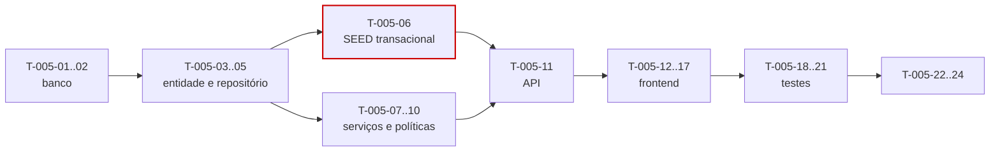

# 005 — Categories · Tarefas

## 1. Convenções

| Campo | Regra |
|---|---|
| **ID** | `T-005-XX`, estável e imutável |
| **Descrição** | Verbo no infinitivo + objeto |
| **Dependências** | IDs de tarefas ou features concluídas |
| **Estimativa** | Horas-agente; acima de 8h deve ser decomposta |
| **Prioridade** | `P0` bloqueante · `P1` necessária · `P2` cortável |

> **Ordem de execução na fila:** esta feature é a **3ª** da ordem oficial, antes de `003-clients`. Ela precede `004` porque a categoria é dependência de `WorkLog` (RN-104) e o seed ocorre dentro da criação do tenant, em `002`. Deixá-la para o fim obrigaria a criar um stub em `008`.

## 2. Resumo

| Grupo | Tarefas | Estimativa |
|---|:--:|---|
| Banco | 2 | 3h |
| Backend | 9 | 20h |
| Frontend | 6 | 13h |
| Testes | 4 | 8h |
| Documentação | 2 | 2h |
| Infra | 1 | 1h |
| **Total** | **24** | **47h ≈ 2 dias-agente** |

## 3. Banco

| ID | Descrição | Dependências | Estimativa | Prioridade |
|---|---|---|:--:|:--:|
| T-005-01 | Criar `V016__create_categories.sql` com índice único **parcial** sobre `(tenant_id, lower(name))` e `CHECK` de formato hexadecimal em `color` | 002 | 2h | P0 |
| T-005-02 | Criar `idx_categories_tenant_active_order` para a listagem ordenada e a cadeia de resolução da §6.2 | T-005-01 | 1h | P0 |

> **Sobre `idx_work_logs_category`:** a §13.4 da spec o declara como requisito desta feature (sustenta RN-505 e a estatística de uso), mas a tabela `work_logs` só passa a existir em `008-worklogs`. Ele é portanto criado na migration de `008`, não aqui — aplicação direta de CE-O-03. A tarefa correspondente é registrada em `specs/008-worklogs/tasks.md`, e `T-005-09` só pode ser considerada concluída em desempenho após `008` existir.

## 4. Backend

| ID | Descrição | Dependências | Estimativa | Prioridade |
|---|---|---|:--:|:--:|
| T-005-03 | Criar a entidade `Category` com os campos da §13.2 e `isSystem` imutável | T-005-01 | 1,5h | P0 |
| T-005-04 | Criar `DefaultCategoryCatalog` com as 9 categorias exatamente como na tabela §6.10 de `entities.md` | — | 1h | P0 |
| T-005-05 | Criar `CategoryRepository` com `findByTenantOrdered`, `existsByNameIgnoreCase`, `findActiveOptions`, `findFirstActiveOrdered` e `updateSortOrderBatch` | T-005-03 | 2,5h | P0 |
| T-005-06 | Implementar `CategorySeedService` acionado por `TenantCreatedEvent` **dentro** da transação (RN-501) | T-005-04, T-005-05 | 2,5h | P0 |
| T-005-07 | Implementar `CategoryService` (CRUD, inativação, reativação) com `CategoryNameUniquenessValidator` (RN-502) | T-005-05 | 3h | P0 |
| T-005-08 | Implementar `DefaultCategoryResolver` com a cadeia da §6.2, desempate determinístico e salto de origens inativas (RN-104) | T-005-07 | 2,5h | P0 |
| T-005-09 | Implementar `SystemCategoryGuard`, `CategoryReplacementValidator` e `CategoryDeletionService` com migração em lote (RN-503, RN-505) | T-005-07 | 3h | P0 |
| T-005-10 | Implementar `CategoryReorderPolicy` com validação de completude, unicidade e propriedade do tenant, aplicada atomicamente | T-005-07 | 2h | P1 |
| T-005-11 | Criar DTOs, `CategoryMapper`, `CategoryUsageService` (`includeUsage` opcional) e `CategoryController` com OpenAPI; registrar os códigos de erro da §12 | T-005-09, T-005-10 | 2h | P0 |

## 5. Frontend

| ID | Descrição | Dependências | Estimativa | Prioridade |
|---|---|---|:--:|:--:|
| T-005-12 | Criar `CategoryApi` e `CategoryStore` em escopo `root`, com `activeCategories` computed e invalidação após escrita | T-005-11 | 2,5h | P0 |
| T-005-13 | Criar `dt-color-picker` e `dt-icon-picker` sobre a paleta do design system, aceitando valor livre | — | 2,5h | P1 |
| T-005-14 | Criar `dt-category-badge` e `dt-category-picker` como componentes **compartilhados**, consumidos por `007`, `008`, `009` e `012` | T-005-12 | 2,5h | P0 |
| T-005-15 | Criar `dt-category-form-dialog` com `unsavedChangesGuard` e mapeamento de `DEVTIME-2601` para o campo `name` | T-005-13 | 2h | P0 |
| T-005-16 | Criar `dt-category-delete-dialog` com seleção de substituta e exibição da contagem de registros afetados | T-005-12 | 2h | P0 |
| T-005-17 | Criar `dt-category-list` com reordenação por arrastar e soltar (acessível por teclado) e `CategorySettingsPage` (P30) | T-005-14, T-005-16 | 1,5h | P0 |

## 6. Testes

| ID | Descrição | Dependências | Estimativa | Prioridade |
|---|---|---|:--:|:--:|
| T-005-18 | Testes do seed: 9 categorias exatas, atomicidade com a criação do tenant (injeção de falha) e idempotência | T-005-06 | 2,5h | P0 |
| T-005-19 | Testes de unicidade (caixa, acento, reuso após exclusão) e de proteção de categoria de sistema | T-005-07, T-005-09 | 2h | P0 |
| T-005-20 | Testes de `DefaultCategoryResolver` parametrizados nas 4 origens, incluindo origens inativas e determinismo por repetição | T-005-08 | 2h | P0 |
| T-005-21 | Testes de exclusão com migração (1.000 registros, inspeção de SQL em lote), reordenação atômica e suíte de isolamento entre tenants | T-005-09, T-005-10 | 1,5h | P0 |

## 7. Documentação

| ID | Descrição | Dependências | Estimativa | Prioridade |
|---|---|---|:--:|:--:|
| T-005-22 | Sincronizar `docs/04-api/users.md` §8 com o comportamento implementado | T-005-11 | 1h | P0 |
| T-005-23 | Publicar as interfaces `resolveDefault`, `getActiveById` e `getAllForReport` para `008`, `009` e `012`; atualizar o status em `implementation-order.md` §12 | T-005-11 | 1h | P0 |

## 8. Infra

| ID | Descrição | Dependências | Estimativa | Prioridade |
|---|---|---|:--:|:--:|
| T-005-24 | Configurar as métricas da §29, com alerta em `category.seed.duration` e `category.migration.rows` | T-005-11 | 1h | P1 |

## 9. Ordem de execução

**Caminho crítico:** `T-005-01 → 03 → 05 → 06 → 11 → 14 → 18`.

`T-005-06` (seed transacional) é o ponto de maior risco: um seed fora da transação produz tenants sem categoria, violando INV-CAT-02 de forma silenciosa e irreversível. Seu teste de atomicidade (`T-005-18`) deve ser escrito junto com a implementação.

**Paralelizável:** `T-005-13` (seletores de cor e ícone) é independente do backend e pode ser desenvolvido com MSW. `T-005-10` (reordenação) é `P1` e pode ser concluída após a entrega do CRUD.

**Bloqueio para outras features:** `T-005-14` (`dt-category-badge` e `dt-category-picker`) bloqueia o frontend de `007`, `008` e `009`. Priorizá-la libera três features paralelas.

## 10. Critérios de conclusão por grupo

| Grupo | Concluído quando |
|---|---|
| Banco | Índice único é **parcial** e comprovado por teste de violação e de reuso após exclusão; `CHECK` de cor rejeita valor inválido |
| Backend | Seed produz as 9 categorias na mesma transação; RN-502, RN-503 e RN-505 implementadas na ordem da §6.1; migração comprovadamente em lote; resolução da §6.2 determinística |
| Frontend | Seletor não oferece categorias inativas; reordenação persiste e é acessível por teclado; componentes compartilhados publicados; zero violações do axe-core |
| Testes | Cobertura ≥ 90% em services e validators; atomicidade do seed provada com injeção de falha; isolamento verde nos 5 endpoints |
| Documentação | `users.md` §8 sincronizado; três interfaces públicas publicadas |
| Infra | Métricas ativas; alerta de duração do seed configurado |
