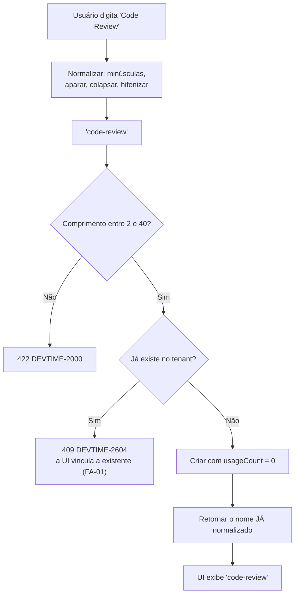
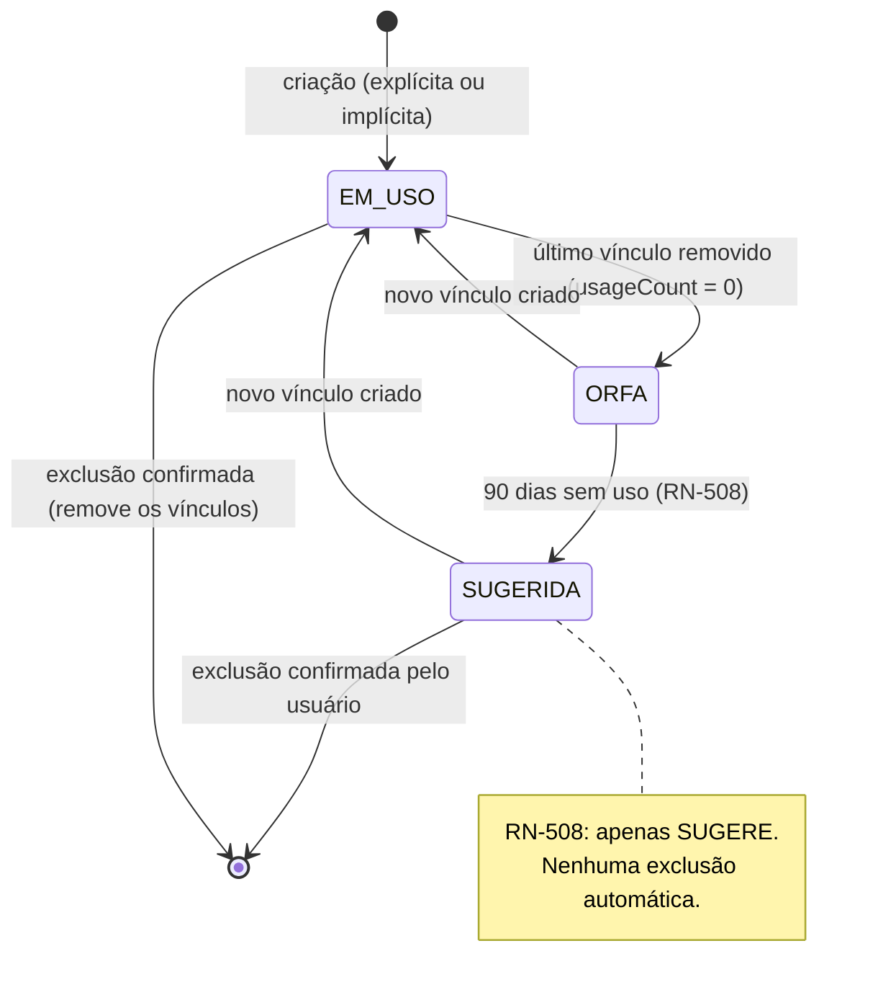
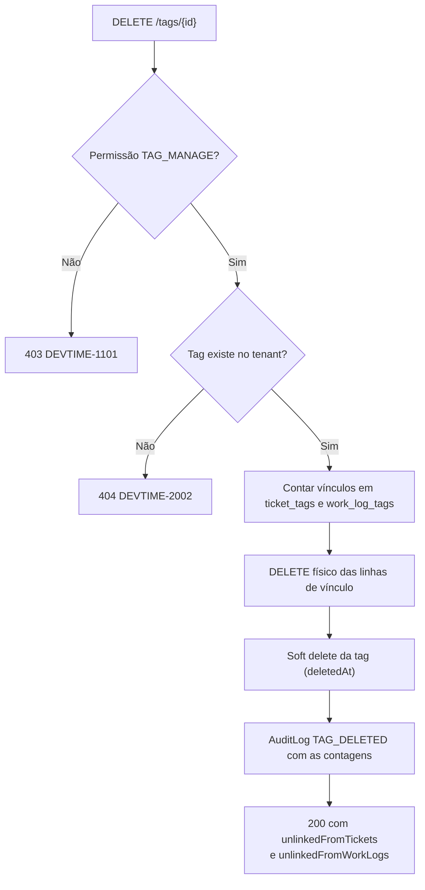

# 006 — Tags

| Campo | Valor |
|---|---|
| **Feature** | 006 |
| **Épico** | EP-06 (Tickets e Classificação) |
| **Sprint** | S4 |
| **Prioridade** | P1 |
| **Complexidade** | Baixa |
| **Estimativa** | 5 pts · 1 dia-agente |
| **Stories** | US-077 a US-079 |
| **Status** | SPEC_APPROVED |

## 1. Objetivo

Manter um vocabulário livre de rótulos normalizados do tenant, aplicáveis a tickets e a registros de horas, para recortes transversais que a categoria — obrigatória, única e curada — não consegue expressar.

## 2. Problema que resolve

A categoria responde "que **tipo** de trabalho foi feito" e é obrigatória, exclusiva e estável. Existe uma segunda pergunta que ela não responde: "a que **assunto** esse trabalho pertence". `refatoracao`, `migracao-v2`, `urgente`, `tecnico-debito` atravessam categorias e contratos, nascem quando o trabalho começa e desaparecem quando termina.

Forçar essa informação na categoria produziria uma taxonomia inflada e instável — exatamente o que RN-503 e o seed de 9 categorias existem para evitar. A tag é o oposto deliberado da categoria: opcional, múltipla, descartável, criável por qualquer `MEMBER`.

A normalização (RN-506) existe porque vocabulário livre sem normalização degenera: `Refatoração`, `refatoracao`, `Refatoração ` e `REFATORACAO` viram quatro rótulos que deveriam ser um, e o filtro por tag deixa de funcionar em semanas.

## 3. Escopo

| # | Item | Referência |
|---|---|---|
| E-01 | CRUD de tag com soft delete | §6.11 `entities.md` |
| E-02 | Normalização determinística do nome | RN-506 |
| E-03 | Unicidade do nome normalizado por tenant, entre 2 e 40 caracteres | RN-507 |
| E-04 | Vínculo com tickets (`ticket_tags`) e work logs (`work_log_tags`) | §6.11 |
| E-05 | Limite de 10 tags por ticket e 10 por work log | RN-313, INV-TAG-01 |
| E-06 | `usageCount` desnormalizado, recalculado a vincular e desvincular | §6.11 |
| E-07 | Criação implícita ao digitar uma tag inexistente no ticket | §9.2 `users.md` |
| E-08 | Sugestão de limpeza de tags sem uso há mais de 90 dias | RN-508 |
| E-09 | Exclusão removendo todos os vínculos, informando as contagens | §9.3 `users.md` |
| E-10 | Tela P31 | `pages.md` |

## 4. Fora do escopo

| Item | Onde está | Motivo |
|---|---|---|
| Categorias | `005-categories` | Natureza oposta: obrigatória, única, curada |
| Aplicação de tags no ticket | `007-tickets` | Esta feature **fornece** o vocabulário; `007` faz o vínculo na UI de ticket |
| Aplicação de tags no work log | `008-worklogs` | Idem |
| Filtro por tag em listagens | `007`, `008`, `014-busca` de `docs/07-backlog` | É consumo, não cadastro |
| Agrupamento por tag em relatório | `012-reports` | É saída (§13 `business-rules.md`) |
| Exclusão automática de tags sem uso | Fora do roadmap | RN-508 determina **sugerir**, nunca excluir automaticamente |
| Tags hierárquicas ou com namespace | Fora do roadmap | Vocabulário livre plano é o ponto da feature |
| Cor automática por hash do nome | Fora do roadmap | Diferente de `Client.color`; aqui a cor é escolhida ou usa o default |

## 5. Dependências

### 5.1 Features
| Feature | Tipo | O que consome |
|---|---|---|
| `001-authentication` | Bloqueante | `TenantContext`, permissões |
| `002-users` | Bloqueante | Auditoria, papéis |
| `007-tickets` | Consumidora | `TagService.resolveOrCreate` e o limite de 10 (RN-313) |
| `008-worklogs` | Consumidora | Vínculo com work log e INV-TAG-01 |
| `012-reports` | Consumidora | Agrupamento por tag |

### 5.2 Documentos obrigatórios
| Documento | Seções relevantes |
|---|---|
| `docs/04-api/users.md` | §9 Tags |
| `docs/02-domain/entities.md` | §6.11 Tag e os relacionamentos `ticket_tags` / `work_log_tags` |
| `docs/02-domain/business-rules.md` | RN-506, RN-507, RN-508, RN-313 |
| `docs/02-domain/permissions.md` | §6.7, §7 |
| `docs/05-ui/pages.md` | P31 |

### 5.3 Infraestrutura
| Componente | Uso |
|---|---|
| PostgreSQL | `tags`, `ticket_tags`, `work_log_tags` |
| Nenhuma integração externa | — |

## 6. Regras de negócio

| ID | Tipo | Enunciado resumido | Erro | Onde é aplicada |
|---|---|---|---|---|
| RN-506 | Automática | Nome normalizado: minúsculas, bordas aparadas, espaços internos viram hífen | — | `TagNormalizer` |
| RN-507 | Bloqueante | Nome único por tenant, entre 2 e 40 caracteres | `DEVTIME-2604` / 409 | Índice único parcial + `TagService` |
| RN-508 | Automática | Tags com `usageCount = 0` há mais de 90 dias são **sugeridas** para limpeza, nunca excluídas | — | `TagCleanupSuggestionJob` |
| RN-313 | Bloqueante | Máximo de 10 tags por ticket | `DEVTIME-2313` / 422 | `TagLinkPolicy` (aplicada em `007`) |
| RN-003 | Automática | Exclusão da tag é lógica | — | `TagService.delete` |
| RN-004 | Bloqueante | Alteração exige `version` correspondente | `DEVTIME-2004` / 409 | Edições |
| RN-012 | Bloqueante | Listagem paginada, `size` máximo 100 | `DEVTIME-2006` / 400 | `TagController` |
| RN-001 | Bloqueante | Toda operação no tenant do usuário autenticado | `DEVTIME-1200` / 403 | Filtro automático |
| RN-002 | Bloqueante | Tag de outro tenant retorna `404` | `DEVTIME-2002` / 404 | Filtro automático |
| RN-006 | Automática | Toda alteração gera `AuditLog` na mesma transação | — | Todas |

### 6.1 Algoritmo de normalização (RN-506)

| # | Passo | Exemplo |
|---|---|---|
| 1 | Remover espaços das bordas | `"  Code Review  "` → `"Code Review"` |
| 2 | Converter para minúsculas | `"Code Review"` → `"code review"` |
| 3 | Colapsar sequências de espaços internos em um único espaço | `"code   review"` → `"code review"` |
| 4 | Substituir cada espaço interno por hífen | `"code review"` → `"code-review"` |
| 5 | Validar o comprimento do resultado (2 a 40) | `"code-review"` → aceito |

**Tabela normativa de normalização:**

| Entrada | Saída | Observação |
|---|---|---|
| `Code Review` | `code-review` | Caso base da §9.2 de `users.md` |
| `  urgente  ` | `urgente` | Bordas aparadas |
| `REFATORAÇÃO` | `refatoração` | **Acentos preservados** |
| `migracao   v2` | `migracao-v2` | Espaços colapsados antes do hífen |
| `débito-técnico` | `débito-técnico` | Hífen já existente é mantido |
| `a` | — | Rejeitado: 1 caractere (RN-507) |
| `ab` | `ab` | Mínimo aceito |
| `Sprint 2026 Q1 Planejamento Estratégico Geral` | — | Rejeitado: 44 caracteres após normalização |
| `--` | `--` | Aceito: a regra não proíbe hífens isolados |
| `Code  Review ` + `code-review` | mesma tag | Ambos normalizam para o mesmo valor (RN-507) |

**O que a normalização deliberadamente NÃO faz:**

| Não faz | Motivo |
|---|---|
| Remover acentos | `débito` e `debito` são palavras distintas em português; remover acento tornaria a tag ilegível ao usuário que a digitou |
| Remover caracteres especiais | `v2.1`, `api/rest` e `c#` são rótulos legítimos; uma allowlist de caracteres exigiria uma regra de negócio que não existe em `docs/` |
| Aplicar *stemming* ou singularizar | `bug` e `bugs` permanecem distintos. Unificá-los exigiria dicionário e produziria fusões erradas |
| Traduzir ou corrigir ortografia | Fora do escopo; produziria alterações silenciosas no dado do usuário |

> **Consequência aceita:** `refatoração` e `refatoracao` coexistem como tags distintas. É o custo de preservar acentos, e é coerente com CX-02 de `005-categories` e RN-404 de `003-clients`. A UI mitiga isso sugerindo tags existentes durante a digitação (§7, passo 3).

### 6.2 Ordem de aplicação — criação de tag

| # | Verificação | Falha |
|---|---|---|
| 1 | Permissão `TAG_MANAGE` | `403 DEVTIME-1101` |
| 2 | Formato bruto do campo (não vazio, ≤ 60 caracteres antes da normalização) | `400` |
| 3 | Normalizar (RN-506) | — |
| 4 | Comprimento do resultado entre 2 e 40 (RN-507) | `422 DEVTIME-2000` |
| 5 | Unicidade do nome **normalizado** no tenant (RN-507) | `409 DEVTIME-2604` |
| 6 | Persistir com `usageCount = 0` e cor informada ou default | — |

**Por que a normalização (3) precede a validação de comprimento (4):** o limite de 40 caracteres aplica-se ao nome **armazenado**, não ao digitado. `"Code Review Detalhado"` tem 21 caracteres e normaliza para `code-review-detalhado`, também com 21 — mas entradas com muitos espaços encolhem, e validar antes rejeitaria entradas que resultariam em nomes válidos. O limite de 60 no passo (2) é apenas proteção contra payload abusivo.

**Por que a unicidade (5) usa o nome normalizado:** verificar o nome bruto permitiria `Code Review` e `code-review` como registros distintos que colidiriam no índice — produzindo erro de constraint em vez da mensagem de negócio correta.

### 6.3 Invariantes envolvidas
| ID | Invariante | Como é garantida |
|---|---|---|
| INV-TAG-01 | Máximo de 10 tags por ticket e 10 por work log | `TagLinkPolicy` + `CHECK` por contagem na aplicação |
| INV-TAG-02 | `(tenantId, name)` único entre tags não excluídas | Índice único parcial |
| INV-TAG-03 | `name` está sempre em forma normalizada | Normalização no service, antes de qualquer persistência |
| INV-TAG-04 | `usageCount` = número de vínculos ativos em `ticket_tags` + `work_log_tags` | Atualização por evento + reconciliação diária |
| INV-TAG-05 | Nenhum vínculo aponta para tag excluída | Vínculos removidos na exclusão |

## 7. Fluxo principal — criação implícita ao rotular um ticket

1. Usuário com `TAG_MANAGE` abre P19 (detalhe do ticket) e foca o campo de tags.
2. Digita `Code Review`.
3. O componente sugere tags existentes cujo nome normalizado contenha o texto digitado — evitando a criação de quase-duplicatas.
4. Nenhuma sugestão corresponde; o usuário confirma a criação.
5. O front envia `POST /api/v1/tags` com `{ "name": "Code Review" }`.
6. `TagService` aplica a ordem da §6.2 e persiste `code-review`.
7. A resposta retorna o nome **já normalizado**, e a UI exibe `code-review` — o usuário vê imediatamente o que foi de fato criado.
8. O front vincula a tag ao ticket, respeitando o limite de 10 (RN-313).
9. `usageCount` é incrementado na mesma transação do vínculo.

## 8. Fluxos alternativos

| # | Fluxo | Gatilho | Comportamento |
|---|---|---|---|
| FA-01 | Tag já existe com nome normalizado equivalente | Passo 6 | `409 DEVTIME-2604`; a UI vincula a tag existente em vez de criar |
| FA-02 | Criação explícita em P31 | Tela de configuração | Mesma ordem da §6.2, com escolha de cor |
| FA-03 | Renomear tag | P31 | Novo nome é normalizado e revalidado quanto à unicidade; os vínculos são preservados |
| FA-04 | Alterar cor | P31 | Sem efeito sobre vínculos ou `usageCount` |
| FA-05 | Desvincular tag de um ticket | P19 | Remove a linha de `ticket_tags`; decrementa `usageCount` |
| FA-06 | Exclusão de tag | P31 | Soft delete da tag; **remove** todos os vínculos; retorna as contagens desvinculadas |
| FA-07 | 11ª tag em um ticket | P19 | `422 DEVTIME-2313`; nenhuma tag é vinculada |
| FA-08 | Sugestão de limpeza | P31 | Lista tags com `usageCount = 0` há mais de 90 dias, com ação de exclusão em lote — sempre confirmada pelo usuário (RN-508) |
| FA-09 | Filtro por uso mínimo | P31 | `GET /tags?minUsage=5` |
| FA-10 | Tag criada por `MEMBER` | P19 | Permitido — `MEMBER` possui `TAG_MANAGE` (§7 `permissions.md`) |
| FA-11 | `VIEWER` tentando criar | P19 | `403 DEVTIME-1101` |

## 9. Diagramas

### 9.1 Normalização e resolução (RN-506, RN-507)

### 9.2 Ciclo de vida e vínculos

> `EM_USO`, `ORFA` e `SUGERIDA` **não são valores persistidos**. São estados derivados de `usageCount` e de `updatedAt`, descritos aqui para tornar o ciclo de vida explícito. `Tag` não possui campo `status` — modelar um enum para uma condição inteiramente derivável de um contador seria duplicar a fonte da verdade.

### 9.3 Exclusão com remoção de vínculos

## 10. Estados

| Estado (derivado) | Significado | Operações permitidas | Operações bloqueadas |
|---|---|---|---|
| `usageCount > 0` | Em uso por ao menos um ticket ou work log | Renomear, alterar cor, vincular, desvincular, excluir | — |
| `usageCount = 0` | Órfã; nenhum vínculo | Renomear, alterar cor, vincular, excluir | — |
| `usageCount = 0` há mais de 90 dias | Sugerida para limpeza (RN-508) | Todas as acima | Exclusão automática — **proibida** |
| *excluído* | Soft delete; vínculos removidos | — | Todas. Invisível a toda consulta padrão |

> Não há bloqueio de exclusão por uso. Diferentemente da categoria (RN-505), excluir uma tag em uso não deixa registro órfão: a tag é anotação acessória, e o ticket ou work log continua íntegro e classificado por sua categoria obrigatória. Exigir migração para outra tag imporia atrito a uma operação de limpeza rotineira.

## 11. Transições

| Origem | Destino | Gatilho | Guarda | Efeito | Permissão |
|---|---|---|---|---|---|
| — | criada | Criação explícita ou implícita | Nome normalizado único e com 2–40 caracteres (RN-507) | `usageCount = 0`; cor informada ou `#94A3B8` | `TAG_MANAGE` |
| criada | renomeada | Renomeação | Novo nome normalizado, único e válido | Vínculos e `usageCount` preservados | `TAG_MANAGE` |
| `usageCount = n` | `n + 1` | Vínculo a ticket ou work log | Limite de 10 no alvo (RN-313, INV-TAG-01) | Linha em `ticket_tags` ou `work_log_tags` | `TICKET_UPDATE_*` / `WORKLOG_UPDATE_*` |
| `usageCount = n` | `n − 1` | Desvínculo | — | Linha removida | Idem |
| qualquer | *excluído* | Exclusão | — | Remove todos os vínculos; soft delete da tag | `TAG_MANAGE` |

### 11.1 Transições proibidas
| Transição | Motivo da proibição |
|---|---|
| Exclusão automática por inatividade | RN-508 determina **sugerir**. Excluir automaticamente destruiria vocabulário que o usuário pode retomar, sem que ele tenha pedido |
| Vínculo além do 10º no mesmo alvo | RN-313 e INV-TAG-01. Além de legibilidade, cada tag adicional multiplica as linhas de junção em consultas de relatório |
| Persistir nome não normalizado | INV-TAG-03. Quebraria a unicidade e o filtro por tag, que é a razão de a tag existir |
| Alterar `usageCount` diretamente por API | É desnormalizado (INV-TAG-04); só muda por efeito de vínculo ou reconciliação |
| Vínculo a tag excluída | INV-TAG-05 |

## 12. Casos de erro

| Código | HTTP | Situação | Mensagem ao usuário | Regra |
|---|:--:|---|---|---|
| `DEVTIME-1101` | 403 | Papel sem `TAG_MANAGE` (`VIEWER`) | Você não tem permissão para esta ação | §7 permissions |
| `DEVTIME-2002` | 404 | Tag de outro tenant | Recurso não encontrado | RN-002 |
| `DEVTIME-2004` | 409 | Conflito de `version` | O registro foi alterado. Recarregue e tente novamente | RN-004 |
| `DEVTIME-2006` | 400 | `size` acima de 100 | Tamanho de página inválido | RN-012 |
| `DEVTIME-2000` | 422 | Nome com menos de 2 ou mais de 40 caracteres após normalização | O nome da etiqueta deve ter entre 2 e 40 caracteres | RN-507, §9.2 |
| `DEVTIME-2604` | 409 | Nome normalizado já existe | Esta etiqueta já existe | RN-507 |
| `DEVTIME-2313` | 422 | 11ª tag no mesmo ticket | Máximo de 10 etiquetas por ticket | RN-313 |
| `DEVTIME-1201` | 403 | Escrita em tenant suspenso | Organização suspensa: apenas leitura | RN-007 |

### 12.1 Casos extremos

| # | Caso | Comportamento esperado |
|---|---|---|
| CX-01 | `"Code Review"` e `"code-review"` criadas em sequência | A segunda é rejeitada com `DEVTIME-2604`; ambas normalizam para o mesmo valor |
| CX-02 | `"refatoração"` e `"refatoracao"` | **Coexistem** — acentos são preservados (§6.1) |
| CX-03 | Nome só com espaços (`"   "`) | Normaliza para vazio; rejeitado com `DEVTIME-2000` |
| CX-04 | Nome com 41 caracteres após normalização | Rejeitado com `DEVTIME-2000` |
| CX-05 | Nome de 60 caracteres com muitos espaços que encolhe para 38 | Aceito — o limite se aplica ao resultado normalizado |
| CX-06 | Nome com emoji ou caractere não latino | Aceito; a normalização não filtra caracteres |
| CX-07 | Nome já hifenizado (`"code-review"`) | Inalterado pela normalização; idempotente |
| CX-08 | Tag excluída e recriada com o mesmo nome | Permitido: o índice único é parcial e ignora excluídos. A nova tag nasce com `usageCount = 0` e **não** recupera os vínculos anteriores |
| CX-09 | Renomear tag para o nome de outra existente | `409 DEVTIME-2604` |
| CX-10 | Vincular a mesma tag duas vezes ao mesmo ticket | Idempotente: o vínculo já existe, `usageCount` **não** é incrementado novamente |
| CX-11 | Vincular a 10ª tag e depois trocar uma | Permitido: desvincular e vincular mantém a contagem em 10 |
| CX-12 | Excluir tag vinculada a 500 tickets e 3.000 work logs | Vínculos removidos em lote; resposta informa `unlinkedFromTickets = 500` e `unlinkedFromWorkLogs = 3000` |
| CX-13 | Tag com `usageCount` divergente do real | Corrigida pelo `DenormalizationReconcileJob` noturno (INV-TAG-04) |
| CX-14 | Tag órfã há 89 dias | **Não** sugerida; o limiar é estritamente maior que 90 dias |
| CX-15 | Tag sugerida para limpeza recebe novo vínculo | Sai da lista de sugestões imediatamente, sem intervenção |
| CX-16 | Exclusão em lote de 200 tags sugeridas | Cada exclusão é individual e auditada; falha em uma não impede as demais |
| CX-17 | Work log com 10 tags é editado sem tocar nas tags | Permitido — o limite é verificado apenas ao **adicionar** |

## 13. Modelo de dados

### 13.1 Entidades impactadas
| Entidade | Operação | Tabela | Referência |
|---|---|---|---|
| `Tag` | Cria, lê, atualiza, soft delete | `tags` | §6.11 |
| *(vínculo ticket)* | Cria, lê, remove | `ticket_tags` | §6.11 |
| *(vínculo work log)* | Cria, lê, remove | `work_log_tags` | §6.11 |
| `Ticket` | Lê (contagem para RN-313) | `tickets` | Via `TicketService` |
| `AuditLog` | Cria | `audit_logs` | §6.20 |

### 13.2 Campos obrigatórios na criação
| Campo | Tipo | Origem | Imutável | Validação |
|---|---|---|:--:|---|
| `tenantId` | UUID | `TenantContext` | ✔ 🔒 | Nunca da requisição (ART-021) |
| `name` | String(40) | Request, **normalizado** | ✖ | 2–40 após normalização; único por tenant (RN-507) |
| `color` | String(7) | Request | ✖ | Hex `#RRGGBB`; default `#94A3B8` |
| `usageCount` | int | Sistema | ✖ 💾 | `0`; nunca vem da requisição |
| `ticket_tags.ticketId` | UUID | Path | ✔ 🔒 | Ticket do tenant |
| `ticket_tags.tagId` | UUID | Request | ✔ 🔒 | Tag do tenant, não excluída |
| `work_log_tags.workLogId` | UUID | Path | ✔ 🔒 | Work log do tenant |

### 13.3 Migrations
| Migration | Conteúdo | Compatibilidade |
|---|---|---|
| `V017__create_tags.sql` | Tabela `tags` + índice único parcial `(tenant_id, name)` + índice de ordenação por `usage_count` | Nova tabela |
| `V018__create_tag_links.sql` | `ticket_tags` e `work_log_tags`, ambas com `tenant_id`, PK composta e FKs | Novas tabelas |

> `work_log_tags` referencia `work_logs`, criada apenas em `008`. Aplicação de CE-O-03: a migration de vínculo com work log é **incremental**, criada dentro de `008`. `V018` cria apenas `ticket_tags`; a tarefa correspondente consta em `specs/008-worklogs/tasks.md`.

### 13.4 Índices
| Índice | Colunas | Sustenta |
|---|---|---|
| `uq_tags_tenant_name` | `(tenant_id, name)` WHERE `deleted_at IS NULL` | RN-507, INV-TAG-02 |
| `idx_tags_tenant_usage` | `(tenant_id, usage_count DESC, name)` WHERE `deleted_at IS NULL` | Ordenação padrão da §9.1 e filtro `minUsage` |
| `idx_tags_tenant_orphan` | `(tenant_id, updated_at)` WHERE `usage_count = 0 AND deleted_at IS NULL` | RN-508 |
| `pk_ticket_tags` | `(ticket_id, tag_id)` | Idempotência do vínculo (CX-10) |
| `idx_ticket_tags_tag` | `(tenant_id, tag_id)` | Contagem e remoção em massa na exclusão |
| `pk_work_log_tags` | `(work_log_id, tag_id)` | Idempotência |
| `idx_work_log_tags_tag` | `(tenant_id, tag_id)` | Idem |

## 14. Endpoints utilizados

| Método | Rota | Operação | Permissão | Sucesso | Doc |
|---|---|---|---|:--:|---|
| GET | `/api/v1/tags` | Listar com `search` e `minUsage`, ordenado por `usageCount` desc | `TAG_VIEW` | 200 | §9.1 `users.md` |
| POST | `/api/v1/tags` | Criar, retornando o nome normalizado | `TAG_MANAGE` | 201 | §9.2 |
| PATCH | `/api/v1/tags/{id}` | Renomear ou alterar cor | `TAG_MANAGE` | 200 | §9 |
| DELETE | `/api/v1/tags/{id}` | Excluir removendo os vínculos | `TAG_MANAGE` | 200 | §9.3 |
| GET | `/api/v1/tags/cleanup-suggestions` | Tags órfãs há mais de 90 dias | `TAG_MANAGE` | 200 | RN-508 |

> A exclusão retorna `200` com `unlinkedFromTickets` e `unlinkedFromWorkLogs` (§9.3), não `204`. O usuário precisa saber que 3.000 registros perderam um rótulo.

## 15. Eventos

| Evento | Publicado por | Consumidores | Momento | Efeito |
|---|---|---|---|---|
| `TagLinkedEvent` | `007`, `008` | `TagService` | **Dentro** da transação | Incrementa `usageCount` |
| `TagUnlinkedEvent` | `007`, `008` | `TagService` | **Dentro** da transação | Decrementa `usageCount` |
| `TagDeletedEvent` | `TagService` | `010-dashboard`, `012-reports` | Após o commit | Invalida caches de agrupamento por tag |
| `TagCreatedEvent` | `TagService` | Métricas | Após o commit | Telemetria |

**Justificativa do momento:** `usageCount` é atualizado **dentro** da transação do vínculo, como `activeContractsCount` em `003-clients`. Fora dela, a listagem ordenada por uso exibiria contagem divergente logo após rotular um ticket, e o filtro `minUsage` retornaria resultados inconsistentes. O `DenormalizationReconcileJob` noturno corrige divergências residuais (CX-13).

## 16. Permissões

| Operação | Permissão | Papéis | Ownership | Escopo de dados |
|---|---|---|---|---|
| Listar e consultar | `TAG_VIEW` | OWNER, ADMIN, MANAGER, MEMBER, VIEWER | — | Todo o tenant |
| Criar, renomear, alterar cor | `TAG_MANAGE` | OWNER, ADMIN, MANAGER, **MEMBER** | — | — |
| Excluir | `TAG_MANAGE` | OWNER, ADMIN, MANAGER, **MEMBER** | — | — |
| Sugestões de limpeza | `TAG_MANAGE` | Idem | — | — |
| Vincular e desvincular | `TICKET_UPDATE_*` / `WORKLOG_UPDATE_*` | Conforme a feature consumidora | Conforme OWN-04 e OWN-01 | — |

> **`MEMBER` possui `TAG_MANAGE`, diferentemente de `CATEGORY_MANAGE`.** A assimetria é deliberada e vem da §7 de `permissions.md`: a tag é anotação de trabalho, criada no fluxo de quem executa; a categoria é taxonomia de relatório, que afeta o que o cliente lê. Um desenvolvedor precisa rotular `migracao-v2` sem pedir autorização; ele não deve poder renomear "Desenvolvimento" para outra coisa em todos os relatórios.
>
> **Consequência aceita:** `MEMBER` pode excluir uma tag usada por toda a equipe. O risco é baixo — a exclusão não destrói nenhum ticket nem work log, é auditada e a tag pode ser recriada. Restringir a exclusão a papéis superiores exigiria uma permissão nova (`TAG_DELETE`), que não existe no catálogo da §6.7 e que esta spec não pode criar (SP-01).

## 17. Validações

### 17.1 Camada 1 — Formato (`400`)
| Campo | Restrição | Mensagem |
|---|---|---|
| `name` | `@NotBlank`, `@Size(max=60)` antes da normalização | Informe o nome da etiqueta |
| `color` | `@Pattern(^#[0-9A-Fa-f]{6}$)` | Cor inválida |
| `minUsage` | `@Min(0)` | Filtro de uso inválido |
| `size` | `@Max(100)` | Tamanho de página inválido |

### 17.2 Camada 2 — Negócio
| Validação | Regra | Erro |
|---|---|---|
| Comprimento entre 2 e 40 após normalização | RN-507 | `DEVTIME-2000` / 422 |
| Unicidade do nome normalizado no tenant | RN-507 | `DEVTIME-2604` / 409 |
| Limite de 10 tags por ticket | RN-313 | `DEVTIME-2313` / 422 |
| Limite de 10 tags por work log | INV-TAG-01 | `DEVTIME-2313` / 422 |
| Tag não excluída ao vincular | INV-TAG-05 | `DEVTIME-2002` / 404 |
| `version` correspondente | RN-004 | `DEVTIME-2004` / 409 |

### 17.3 Camada 3 — Consistência
| Constraint | Garante | Mapeado para |
|---|---|---|
| `uq_tags_tenant_name` | INV-TAG-02 | `DEVTIME-2604` |
| `pk_ticket_tags (ticket_id, tag_id)` | Idempotência do vínculo (CX-10) | Ignorado silenciosamente |
| `pk_work_log_tags (work_log_id, tag_id)` | Idem | Idem |
| FK `ticket_tags.tag_id` → `tags.id` | INV-TAG-05 | `DEVTIME-2002` |
| `CHECK (usage_count >= 0)` | INV-TAG-04 | `DEVTIME-9002` (erro interno) |
| `CHECK (color ~ '^#[0-9A-Fa-f]{6}$')` | Formato de cor | `DEVTIME-2000` |

## 18. Auditoria

| Ação | `action` | `beforeState` | `afterState` | Metadata |
|---|---|---|---|---|
| Criação | `TAG_CREATED` | — | `{name, color}` | Nome bruto digitado, traceId |
| Renomeação | `TAG_RENAMED` | `{name}` | `{name}` | traceId |
| Alteração de cor | `TAG_UPDATED` | `{color}` | `{color}` | traceId |
| Exclusão | `TAG_DELETED` | `{name, usageCount}` | `{deletedAt}` | `unlinkedFromTickets`, `unlinkedFromWorkLogs`, IP, traceId |
| Exclusão em lote por sugestão | `TAG_CLEANUP_EXECUTED` | `{tagNames[]}` | `{count}` | traceId |

> A criação registra o **nome bruto digitado** além do normalizado. Quando um usuário afirmar ter criado `Code Review` e encontrar `code-review`, a auditoria explica o que aconteceu. Sem isso, a normalização parece um defeito.

## 19. Segurança

| # | Vetor | Mitigação | Verificação |
|---|---|---|---|
| SG-01 | Tag de outro tenant acessada por id | Filtro automático; `404` (ART-024) | Suíte de isolamento |
| SG-02 | Vínculo de tag do tenant A a ticket do tenant B | Ambos validados no tenant antes do vínculo | Teste com id cruzado |
| SG-03 | Injeção via `search` de tag | `Specification` tipada; nunca concatenação (RP-04) | Teste com payload de injeção |
| SG-04 | XSS por nome de tag renderizado em UI e PDF | Escape na renderização; nome nunca interpretado como HTML | Teste com `<script>` no nome |
| SG-05 | `usageCount` manipulado por payload | Campo ausente de todos os DTOs de escrita | Teste com payload malicioso |
| SG-06 | Exclusão em massa por `MEMBER` | Auditada; tag recriável; nenhum dado de trabalho destruído | §16 |
| SG-07 | Exaustão por criação ilimitada de tags | `TAG_MANAGE` exige autenticação; limite de 10 por alvo reduz o incentivo; monitorado por `tag.created` | Métrica da §29 |

### 19.1 LGPD

| Dado pessoal | Base legal | Retenção | Exportação | Anonimização | Proibido em log |
|---|---|---|---|---|---|
| Nenhum por construção | — | — | — | — | — |
| Nome de tag digitado livremente | Legítimo interesse | Vida do tenant | ✔ `GET /tenant/export` | Não se aplica | — |

**Análise:** `Tag` não possui campo destinado a dado pessoal. Entretanto, o nome é **texto livre digitado pelo usuário** — nada impede alguém de criar a tag `joao-silva-cpf-123`. O sistema não pode prevenir isso sem uma regra de conteúdo que `docs/` não define.

O tratamento é: (a) o nome da tag é exportado junto com os dados do tenant, atendendo ao direito de acesso; (b) a exclusão do tenant remove as tags junto com o restante; (c) a tag é editável e excluível por qualquer `MEMBER`, então a correção de um dado indevido é imediata e não exige suporte. Nenhum campo de tag entra em log de aplicação além do id — decisão registrada na §28.

## 20. Performance

| Operação | Meta | Índice/estratégia | Risco |
|---|---|---|---|
| Listagem ordenada por uso | p95 < 150 ms | `idx_tags_tenant_usage`; `usageCount` desnormalizado evita agregação | Tenant com milhares de tags |
| Busca por prefixo (autocompletar) | p95 < 100 ms | `idx_tags_tenant_usage` + limite de 20 resultados; debounce de 250 ms no cliente | Chamada a cada tecla digitada |
| Vínculo e desvínculo | < 30 ms | PK composta; incremento de contador na mesma transação | Contenção em tag muito popular |
| Exclusão com remoção de vínculos | < 2 s para 3.500 vínculos | `DELETE` em lote por `idx_ticket_tags_tag` e `idx_work_log_tags_tag` | Tag usada em todo o tenant |
| Sugestões de limpeza | p95 < 200 ms | `idx_tags_tenant_orphan`, índice parcial sobre `usage_count = 0` | — |
| Reconciliação de `usageCount` | Dentro da janela noturna | Agregação por tag em lote | Tenant muito grande |

### 20.1 Escalabilidade

`tags` cresce mais que `categories`, mas continua pequena: centenas a poucos milhares de linhas por tenant, porque o vocabulário útil de uma equipe é naturalmente limitado. RN-508 existe justamente para conter o crescimento por acúmulo.

O ponto de atenção real é o **autocompletar**, chamado a cada tecla digitada em P19 e P23. A mitigação é dupla: debounce de 250 ms no cliente e limite de 20 resultados no servidor, servidos direto do índice. Sem isso, rotular um ticket dispararia uma dezena de consultas.

As tabelas de vínculo crescem proporcionalmente a `tickets × 10` e `work_logs × 10`. Com 100k work logs por tenant, `work_log_tags` pode chegar a centenas de milhares de linhas — motivo pelo qual a exclusão remove vínculos por `DELETE` em lote sobre índice, nunca carregando entidades.

Contenção em tag popular (`urgente` vinculada milhares de vezes) é possível no incremento de `usageCount`. É aceita: o contador é desnormalizado e reconciliado à noite, então uma atualização perdida sob contenção extrema se corrige sozinha (CX-13). Trocar o incremento por agregação ao vivo custaria mais em toda listagem do que resolve.

## 21. Componentes Frontend

### 21.1 Rotas
| Rota | Componente | Guard | Lazy | Tela |
|---|---|---|:--:|---|
| `/settings/tags` | `TagSettingsPage` | `permissionGuard(['TAG_VIEW'])` | ✔ | P31 |

### 21.2 Componentes
| Componente | Tipo | Responsabilidade | Inputs | Outputs |
|---|---|---|---|---|
| `TagSettingsPage` | Page | Lista com uso, filtro `minUsage`, edição e sugestões de limpeza | — | — |
| `dt-tag-chip` | Shared | Selo com cor e nome, com remoção opcional | `tag`, `removable` | `remove` |
| `dt-tag-input` | Shared | Entrada com autocompletar, criação implícita e limite de 10 | `value`, `max`, `disabled` | `change`, `create` |
| `dt-tag-list` | Presentational | Lista administrativa com `usageCount` e ações | `tags`, `canManage` | `edit`, `delete` |
| `dt-tag-cleanup-panel` | Presentational | Tags órfãs há mais de 90 dias, com seleção em lote | `suggestions` | `deleteSelected` |
| `dt-tag-form-dialog` | Presentational | Criação e edição com prévia da normalização | `tag?` | `save`, `cancel` |

> `dt-tag-chip` e `dt-tag-input` são **compartilhados** e consumidos por `007` (P19, P20) e `008` (P21, P23). Estão nesta feature porque aqui está a fonte da verdade da normalização e do limite.
>
> `dt-tag-form-dialog` exibe **prévia da normalização em tempo real**: ao digitar `Code Review`, mostra "será salva como `code-review`". Sem essa prévia, a normalização surpreende o usuário depois de salvar — e surpresa em cadastro gera chamado de suporte.

### 21.3 Stores e serviços Angular
| Artefato | Tipo | Estado exposto | Escopo |
|---|---|---|---|
| `TagStore` | Store | `tags`, `topTags` (computed), `orphanSuggestions`, `loading`, `error` | `providedIn: 'root'` — consumida por P19, P21, P23 e P31 |
| `TagApi` | API | Somente HTTP dos 5 endpoints | `providedIn: 'root'` |

### 21.4 Guards, interceptors, pipes e directives
| Artefato | Tipo | Uso |
|---|---|---|
| `permissionGuard` | Guard | Protege P31 |
| `hasPermission` | Directive | Oculta criar, editar e excluir de `VIEWER` |
| `tagNormalizePipe` | Pipe | Prévia da normalização no formulário (espelha RN-506 — FM-02) |
| `unsavedChangesGuard` | Guard | Diálogo com alterações pendentes |

## 22. Serviços Backend

### 22.1 Controllers
| Classe | Rota base | Endpoints |
|---|---|---|
| `TagController` | `/api/v1/tags` | listar, criar, atualizar, excluir, sugestões de limpeza |

### 22.2 Services
| Interface | Implementação | Responsabilidade | Permissão declarada |
|---|---|---|---|
| `TagService` | `TagServiceImpl` | CRUD, normalização, resolução por nome | `TAG_VIEW`, `TAG_MANAGE` |
| `TagLinkService` | `TagLinkServiceImpl` | Vínculo e desvínculo, contadores, limite de 10 | Delegada à feature consumidora |
| `TagCleanupService` | `TagCleanupServiceImpl` | Sugestões de limpeza e exclusão em lote (RN-508) | `TAG_MANAGE` |

**Interfaces públicas consumidas por outras features:**

| Método | Consumidor | Contrato |
|---|---|---|
| `TagService.resolveOrCreate(rawName)` | `007`, `008` | Normaliza; retorna a existente ou cria. Idempotente |
| `TagLinkService.linkToTicket(ticketId, tagIds)` | `007` | Aplica RN-313; substitui o conjunto atomicamente |
| `TagLinkService.linkToWorkLog(workLogId, tagIds)` | `008` | Aplica INV-TAG-01 |
| `TagService.getAllForReport()` | `012` | Inclui excluídas, para rotular registros históricos |

### 22.3 Componentes de domínio
| Classe | Tipo | Responsabilidade | Regras |
|---|---|---|---|
| `TagNormalizer` | Utilitário | Os 5 passos da §6.1, idempotente | RN-506 |
| `TagNameValidator` | Validator | Comprimento 2–40 após normalização | RN-507 |
| `TagUniquenessValidator` | Validator | Unicidade do nome normalizado | RN-507 |
| `TagLinkPolicy` | Policy | Limite de 10 por alvo; idempotência do vínculo | RN-313, INV-TAG-01 |
| `TagUsageCounter` | Policy | Incremento e decremento na transação do vínculo | INV-TAG-04 |

### 22.4 Jobs
| Classe | Cron | Lock | Responsabilidade | Idempotência |
|---|---|---|---|---|
| `TagCleanupSuggestionJob` | `0 30 3 * * *` | `tagCleanup`, 15m | Marca tags órfãs há mais de 90 dias como sugeridas; **nunca exclui** (RN-508) | Recalcula do zero; convergente |
| `DenormalizationReconcileJob` | `0 0 2 * * *` | compartilhado com `003`, `004`, `007`, `011` | Reconcilia `usageCount` por agregação real | Convergente |

> `TagCleanupSuggestionJob` poderia ser dispensado, calculando a sugestão ao vivo pela consulta em `idx_tags_tenant_orphan`. Ele existe porque o cálculo depende de "há mais de 90 dias **sem uso**", e `updatedAt` muda por qualquer edição — inclusive alteração de cor. O job registra o instante em que `usageCount` chegou a zero, informação que a tabela sozinha não preserva.

## 23. DTOs

| DTO | Direção | Campos principais | Observação |
|---|---|---|---|
| `TagCreateRequest` | Request | `name`, `color?` | `usageCount` **ausente** — é do sistema |
| `TagUpdateRequest` | Request | `name?`, `color?`, `version` | `usageCount` ausente |
| `TagResponse` | Response | `id`, `name` (normalizado), `color`, `usageCount`, `version` | O nome retornado é sempre o normalizado (§9.2) |
| `TagOptionProjection` | Projection | `id`, `name`, `color` | Autocompletar; não carrega `usageCount` |
| `TagFilter` | Filter | `search`, `minUsage` | `search` compara o termo normalizado |
| `TagDeleteResponse` | Response | `unlinkedFromTickets`, `unlinkedFromWorkLogs` | §9.3 `users.md` |
| `TagCleanupSuggestionResponse` | Response | `tags[]`, `orphanSince` | RN-508 |
| `TagLinkRequest` | Request | `tagIds[]` ou `tagNames[]` | Nomes acionam `resolveOrCreate` |

## 24. Mappers

| Mapper | De → Para | Mapeamentos não triviais |
|---|---|---|
| `TagMapper` | `Tag` → `TagResponse` | Nenhum — o nome já está normalizado na persistência (INV-TAG-03) |
| `TagOptionMapper` | `Tag` → `TagOptionProjection` | Projeção enxuta para autocompletar |

## 25. Repositories

| Repository | Entidade | Métodos específicos | Índice usado |
|---|---|---|---|
| `TagRepository` | `Tag` | `findByTenantOrderedByUsage`, `findByNormalizedName`, `searchForAutocomplete(limit 20)`, `findOrphansOlderThan(days)` | `uq_tags_tenant_name`, `idx_tags_tenant_usage`, `idx_tags_tenant_orphan` |
| `TicketTagRepository` | *(vínculo)* | `findByTicketId`, `countByTicketId`, `deleteByTagId`, `countByTagId` | `pk_ticket_tags`, `idx_ticket_tags_tag` |
| `WorkLogTagRepository` | *(vínculo)* | `findByWorkLogId`, `countByWorkLogId`, `deleteByTagId`, `countByTagId` | `pk_work_log_tags`, `idx_work_log_tags_tag` |

## 26. Entities utilizadas
| Entidade | Origem | Campos relevantes |
|---|---|---|
| `Tag` | Esta feature | Todos |
| `Ticket` | `007-tickets` | Somente `id`, para vínculo e contagem |
| `WorkLog` | `008-worklogs` | Somente `id`, para vínculo e contagem |

## 27. Validators e Exceptions

| Classe | Tipo | Regra | Código de erro |
|---|---|---|---|
| `TagNameValidator` | Validator | RN-507 (comprimento) | `DEVTIME-2000` |
| `TagUniquenessValidator` | Validator | RN-507 (unicidade) | `DEVTIME-2604` |
| `TagLinkPolicy` | Validator | RN-313, INV-TAG-01 | `DEVTIME-2313` |
| `DuplicateTagException` | Exception | RN-507 | `DEVTIME-2604` / 409 |
| `InvalidTagNameException` | Exception | RN-507 | `DEVTIME-2000` / 422 |
| `TagLimitExceededException` | Exception | RN-313 | `DEVTIME-2313` / 422 |

## 28. Logs

| Evento | Nível | Campos | Proibido |
|---|---|---|---|
| Tag criada | INFO | `tenantId`, `userId`, `tagId`, traceId | **Nome da tag** — é texto livre e pode conter dado pessoal (§19.1) |
| Tag excluída | INFO | `tagId`, `unlinkedFromTickets`, `unlinkedFromWorkLogs` | Nome |
| Limite de 10 atingido | INFO | `ticketId` ou `workLogId`, `userId` | Nomes das tags |
| Limpeza em lote executada | INFO | `tenantId`, contagem | Lista de nomes |
| Divergência de `usageCount` corrigida | WARN | `tagId`, valor anterior, valor real | — |

> **Nome de tag nunca entra em log.** É o único campo de texto livre desta feature e não há regra que impeça um usuário de digitar um dado pessoal nele (§19.1). O id é suficiente para depuração, e a auditoria — que é dado do tenant, não log de aplicação — preserva o nome quando necessário.

## 29. Métricas

| Métrica | Tipo | Tags | Alerta |
|---|---|---|---|
| `tag.created` | Counter | `implicit` (criada no fluxo do ticket) ou `explicit` | Crescimento anômalo indica falha do autocompletar |
| `tag.created.implicit_ratio` | Gauge | — | > 90% indica que o autocompletar não está sugerindo bem |
| `tag.limit.exceeded` | Counter | `target` (ticket, worklog) | > 50/dia indica que o limite de 10 é baixo demais na prática |
| `tag.autocomplete.duration` | Timer | — | p95 > 150 ms degrada a digitação |
| `tag.deleted.with_links` | Counter | — | Pico indica limpeza em massa; útil ao investigar rótulos sumidos |
| `tag.usage_count.drift` | Counter | — | > 0 por dois dias seguidos indica falha no evento transacional |
| `tag.orphan.count` | Gauge | — | Crescimento contínuo indica vocabulário inflado (RN-508 não sendo atendida) |

## 30. Comportamentos esperados

| # | Comportamento |
|---|---|
| CE-01 | Todo nome é normalizado antes de qualquer validação de unicidade ou persistência |
| CE-02 | A normalização é idempotente: aplicá-la duas vezes produz o mesmo resultado |
| CE-03 | Acentos são preservados; caracteres especiais não são filtrados |
| CE-04 | A resposta de criação retorna o nome já normalizado |
| CE-05 | Entradas que normalizam para o mesmo valor são a mesma tag |
| CE-06 | O limite de 10 é verificado por alvo, ao adicionar |
| CE-07 | Vincular a mesma tag duas vezes é idempotente e não altera `usageCount` |
| CE-08 | `usageCount` é atualizado na transação do vínculo e reconciliado à noite |
| CE-09 | A exclusão remove os vínculos e informa as contagens |
| CE-10 | Tags órfãs são sugeridas para limpeza, nunca excluídas automaticamente |
| CE-11 | O autocompletar sugere tags existentes antes de oferecer a criação |
| CE-12 | O nome da tag nunca aparece em log de aplicação |
| CE-13 | Relatórios históricos exibem tags excluídas |

## 31. Comportamentos proibidos

| # | Proibição | Motivo |
|---|---|---|
| CP-01 | Excluir fisicamente uma tag | RN-003, ART-051 |
| CP-02 | Excluir tags automaticamente por inatividade | RN-508 determina sugerir; excluir destruiria vocabulário sem pedido do usuário |
| CP-03 | Persistir nome não normalizado | INV-TAG-03; quebraria unicidade e filtro |
| CP-04 | Remover acentos na normalização | Torna a tag ilegível; §6.1 |
| CP-05 | Filtrar caracteres especiais | Exigiria regra de conteúdo inexistente em `docs/` |
| CP-06 | Validar o comprimento antes de normalizar | Rejeitaria entradas que resultariam em nomes válidos |
| CP-07 | Aceitar `usageCount` da requisição | É desnormalizado (INV-TAG-04) |
| CP-08 | Vincular além do 10º item | RN-313, INV-TAG-01 |
| CP-09 | Bloquear exclusão de tag em uso | Tag é acessória; exigir migração imporia atrito a uma limpeza rotineira |
| CP-10 | Logar o nome da tag | Texto livre pode conter dado pessoal (§19.1) |
| CP-11 | Carregar entidades para remover 3.500 vínculos | `DELETE` em lote é obrigatório |
| CP-12 | Autocompletar sem debounce nem limite | Dispara uma consulta por tecla |
| CP-13 | Acessar `TagRepository` a partir de outra feature | AR-02 |

## 32. Restrições

| # | Restrição | Origem |
|---|---|---|
| RS-01 | Vocabulário plano, sem hierarquia nem namespace | Decisão de escopo; a tag existe para ser leve |
| RS-02 | Máximo de 10 tags por ticket e 10 por work log | RN-313, INV-TAG-01 |
| RS-03 | Nome entre 2 e 40 caracteres após normalização | RN-507 |
| RS-04 | Sem exclusão automática | RN-508 |
| RS-05 | Cor escolhida ou default; sem derivação por hash | Diferente de `Client.color`; sem regra que a exija |
| RS-06 | Listagem com `size` máximo de 100 | RN-012 |

## 33. Critérios de aceite

| # | Critério | Verificação |
|---|---|---|
| CA-01 | A tabela normativa da §6.1 é reproduzida integralmente | Teste parametrizado |
| CA-02 | A normalização é idempotente em 1.000 aplicações sucessivas | Teste |
| CA-03 | Acentos são preservados; `refatoração` e `refatoracao` coexistem | Teste |
| CA-04 | Entradas equivalentes após normalização colidem com `DEVTIME-2604` | Teste |
| CA-05 | O comprimento é validado sobre o nome normalizado, não sobre o digitado | Teste com CX-05 |
| CA-06 | A resposta de criação retorna o nome normalizado | Teste de contrato |
| CA-07 | A 11ª tag retorna `DEVTIME-2313` e nenhuma é vinculada | Teste |
| CA-08 | Vínculo duplicado é idempotente e não altera `usageCount` | Teste |
| CA-09 | `usageCount` converge após o job de reconciliação | Teste de convergência |
| CA-10 | A exclusão remove todos os vínculos e informa as contagens corretas | Teste com 3.500 vínculos |
| CA-11 | Tag excluída e recriada não recupera os vínculos anteriores | Teste |
| CA-12 | Tags órfãs há 89 dias não são sugeridas; há 91 dias, sim | Teste com `Clock` fixo |
| CA-13 | Nenhum log contém nome de tag | Inspeção de log |
| CA-14 | Tag de outro tenant retorna `404`, nunca `403` | Suíte de isolamento |
| CA-15 | `MEMBER` cria e exclui tags; `VIEWER` recebe `403` | Matriz de permissões |

## 34. Checklist de implementação

- [ ] `V017` com índice único **parcial** sobre `(tenant_id, name)`, ignorando excluídos
- [ ] `V018` cria apenas `ticket_tags`; `work_log_tags` é criada na migration de `008` (CE-O-03)
- [ ] `CHECK (usage_count >= 0)` e `CHECK` de formato hexadecimal em `color`
- [ ] `TagNormalizer` implementa os 5 passos da §6.1, **nesta ordem**, e é idempotente
- [ ] `TagNormalizer` **não** remove acentos nem filtra caracteres especiais
- [ ] Normalização aplicada **antes** da validação de comprimento e de unicidade (§6.2)
- [ ] Limite bruto de 60 caracteres antes de normalizar, como proteção de payload
- [ ] `TagLinkPolicy` verifica o limite de 10 apenas ao adicionar (CX-17)
- [ ] Vínculo idempotente pela PK composta, sem incrementar `usageCount` novamente
- [ ] `usageCount` atualizado **dentro** da transação do vínculo
- [ ] Reconciliador de `usageCount` registrado no `DenormalizationReconcileJob`
- [ ] Exclusão remove vínculos por `DELETE` em lote, sem carregar entidades
- [ ] `TagCleanupSuggestionJob` **nunca** exclui; apenas marca sugestões
- [ ] `getAllForReport` inclui tags excluídas
- [ ] `usageCount` ausente de todos os DTOs de escrita
- [ ] `dt-tag-input` com debounce de 250 ms e limite de 20 sugestões
- [ ] `dt-tag-form-dialog` exibe prévia da normalização em tempo real
- [ ] `tagNormalizePipe` espelha RN-506 exatamente (FM-02)
- [ ] Nome da tag escapado na renderização de UI e PDF
- [ ] Nenhum log contém nome de tag
- [ ] Auditoria de criação registra o nome bruto digitado
- [ ] Nenhum texto fixo em P31 (ART-095)

## 35. Checklist de revisão

- [ ] Nenhum acesso a `TagRepository` de fora da feature
- [ ] `404` (não `403`) para tag de outro tenant
- [ ] Normalização do backend e do frontend produzem resultados idênticos (teste cruzado)
- [ ] Toda `RN-XXX` da §6 possui teste referenciando o ID no `@DisplayName`
- [ ] Remoção de vínculos comprovadamente em lote (inspeção de SQL)
- [ ] Nenhum log com nome de tag (inspeção)
- [ ] Teste de isolamento entre tenants para os 5 endpoints
- [ ] Cobertura ≥ 90% em `TagNormalizer`, services e validators
- [ ] Nenhuma listagem sem paginação
- [ ] Autocompletar com debounce e limite comprovados

## 36. Checklist de QA

- [ ] Todos os cenários de `acceptance.md` verdes
- [ ] Criação com espaços, maiúsculas, acentos e hífens já presentes
- [ ] Prévia da normalização coincide com o resultado salvo
- [ ] Autocompletar sugere antes de oferecer criação
- [ ] Limite de 10 tags atingido em ticket e em work log
- [ ] Troca de tag no 10º item permitida
- [ ] Exclusão de tag muito usada, conferindo as contagens
- [ ] Tag recriada após exclusão não recupera vínculos
- [ ] Painel de sugestões de limpeza com exclusão em lote
- [ ] `usageCount` correto após sequência de vínculos e desvínculos
- [ ] Zero violações do axe-core em P31
- [ ] Navegação e remoção de chips completas por teclado
- [ ] Nome com `<script>` renderizado como texto em UI e PDF

## 37. Definition of Done

| # | Item | Referência |
|---|---|---|
| DoD-01 | Todos os critérios da §33 verdes | — |
| DoD-02 | Cobertura ≥ 90% em `TagNormalizer`, services e validators | CA-08 `backend.md` |
| DoD-03 | Suíte de isolamento verde para os 5 endpoints | CA-03 `architecture.md` |
| DoD-04 | `docs/04-api/users.md` §9 sincronizado | ART-111 |
| DoD-05 | Zero violações do axe-core em P31 | AC-01 |
| DoD-06 | Interfaces `resolveOrCreate`, `linkToTicket`, `linkToWorkLog` e `getAllForReport` publicadas | AR-03 |
| DoD-07 | `dt-tag-chip` e `dt-tag-input` disponíveis como componentes compartilhados para `007` e `008` | `frontend.md` |
| DoD-08 | Normalização espelhada no frontend, verificada por teste cruzado | FM-02 |

## 38. Riscos

| # | Risco | Prob. | Impacto | Mitigação | Gatilho |
|---|---|:--:|:--:|---|---|
| R-01 | Normalização inconsistente entre frontend e backend | Média | Baixo | Tabela normativa da §6.1 como oráculo dos dois lados; teste cruzado | Prévia divergindo do salvo |
| R-02 | Vocabulário inflado por quase-duplicatas (acentos) | Média | Baixo | Autocompletar sugestivo; RN-508; métrica `tag.orphan.count` | Crescimento contínuo de órfãs |
| R-03 | `usageCount` divergente sob concorrência | Média | Baixo | Atualização transacional + reconciliação noturna | `tag.usage_count.drift` > 0 por dois dias |
| R-04 | Autocompletar degradando a digitação | Média | Médio | Debounce de 250 ms, limite de 20, índice dedicado | p95 > 150 ms |
| R-05 | `MEMBER` excluindo tag usada por toda a equipe | Baixa | Baixo | Auditada e recriável; nenhum dado de trabalho perdido | Reclamação de rótulo sumido |
| R-06 | Dado pessoal digitado em nome de tag | Baixa | Médio | Nome fora de log; exportável e excluível por qualquer `MEMBER` | Solicitação de titular |
| R-07 | XSS por nome de tag em PDF de relatório | Baixa | Alto | Escape na renderização; teste com payload | Teste de segurança falho |

## 39. Observações

| # | Observação |
|---|---|
| OB-01 | **Por que a exclusão remove vínculos fisicamente, contrariando RN-003:** `ticket_tags` e `work_log_tags` são tabelas de junção puras — não herdam `BaseEntity`, não têm `id` próprio, não são auditadas e não possuem ciclo de vida. Soft delete nelas exigiria filtrar `deleted_at` em toda consulta de tag, tornando `usageCount` ambíguo (contaria vínculos excluídos?) e o filtro por tag inconsistente. A tag em si **é** soft deleted, preservando o rastro. A alternativa rejeitada — soft delete também nos vínculos — foi descartada por adicionar uma condição a todas as consultas em troca de um histórico que a auditoria já registra (§18). |
| OB-02 | **Por que acentos são preservados (§6.1):** remover acentos unificaria `refatoração` e `refatoracao`, o que é atraente. Foi rejeitado porque tornaria o rótulo ilegível — o usuário digita `débito-técnico` e vê `debito-tecnico`, parecendo defeito. A quase-duplicata é mitigada pelo autocompletar, que é a solução de produto correta: prevenir na entrada, não corromper o dado. |
| OB-03 | **`MEMBER` com `TAG_MANAGE` (§16):** vem diretamente da §7 de `permissions.md` e é intencional. A assimetria com `CATEGORY_MANAGE` é o ponto: tag é do executor, categoria é do relatório. O efeito colateral — `MEMBER` pode excluir tag de todos — é aceito e documentado, porque restringi-lo exigiria uma permissão nova que esta spec não pode criar (SP-01). Se o beta mostrar problema, `TAG_DELETE` deve nascer em `permissions.md` primeiro. |
| OB-04 | **Estados derivados, não persistidos (§9.2):** `EM_USO`, `ORFA` e `SUGERIDA` são deriváveis de `usageCount` e do instante em que ele zerou. Persistir um `status` duplicaria a fonte da verdade e exigiria reconciliação entre dois campos. O `TagCleanupSuggestionJob` existe apenas porque o **instante em que `usageCount` zerou** não é derivável de `updatedAt`, que muda por qualquer edição. |
| OB-05 | **Limite de 10 (RN-313):** vem de `business-rules.md` e é justificado por legibilidade e performance. É plausível que 10 seja baixo para times que usam tags como taxonomia estruturada. A métrica `tag.limit.exceeded` existe para detectar isso; alterar o limite exige mudar `business-rules.md` antes do código. |
| OB-06 | **Evolução SaaS:** o vocabulário de tags é o candidato natural a alimentar sugestões automáticas em F7 (`future/020-ai`) — sugerir a tag provável a partir da descrição do work log. Nada nesta feature impede isso: o histórico de vínculos em `work_log_tags` já é a base de treino, e `TagService.resolveOrCreate` já é o ponto de entrada idempotente que uma sugestão automática usaria. |
| OB-07 | **Dívida conhecida:** `search` compara o termo normalizado por `LIKE` com prefixo, sem índice trigram. Suficiente para milhares de tags. Se o volume crescer muito ou a busca por infixo se tornar necessária, o caminho é um índice GIN trigram, como em `003-clients`. Não foi feito agora porque a tabela é pequena e o índice teria custo de escrita em toda vinculação. |
