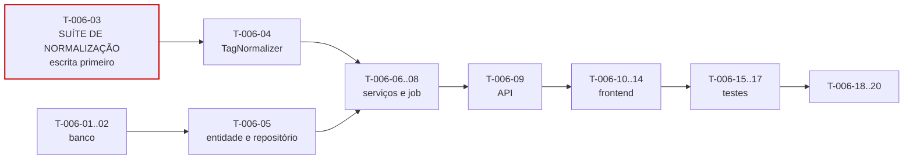

# 006 — Tags · Tarefas

## 1. Convenções

| Campo | Regra |
|---|---|
| **ID** | `T-006-XX`, estável e imutável |
| **Descrição** | Verbo no infinitivo + objeto |
| **Dependências** | IDs de tarefas ou features concluídas |
| **Estimativa** | Horas-agente; acima de 8h deve ser decomposta |
| **Prioridade** | `P0` bloqueante · `P1` necessária · `P2` cortável |

> **Paralelizável com `004`:** esta feature depende apenas de `002` e não compartilha migration nem arquivo com `004-contracts`. É a candidata natural ao segundo agente durante S4 (§8.1 de `implementation-order.md`).

## 2. Resumo

| Grupo | Tarefas | Estimativa |
|---|:--:|---|
| Banco | 2 | 3h |
| Backend | 7 | 13h |
| Frontend | 5 | 10h |
| Testes | 3 | 6h |
| Documentação | 2 | 2h |
| Infra | 1 | 1h |
| **Total** | **20** | **35h ≈ 1,5 dia-agente** |

## 3. Banco

| ID | Descrição | Dependências | Estimativa | Prioridade |
|---|---|---|:--:|:--:|
| T-006-01 | Criar `V017__create_tags.sql` com índice único **parcial** `(tenant_id, name)`, `CHECK (usage_count >= 0)` e `CHECK` de formato hexadecimal em `color` | 002 | 1,5h | P0 |
| T-006-02 | Criar `V018__create_tag_links.sql` com `ticket_tags` (PK composta, `tenant_id`, FKs) e os índices `idx_tags_tenant_usage` e `idx_tags_tenant_orphan` | T-006-01 | 1,5h | P0 |

> `work_log_tags` **não** é criada aqui: `work_logs` só existe em `008`. A migration incremental correspondente é tarefa de `008` (CE-O-03), assim como `idx_work_log_tags_tag`. Reservar o número da migration agora violaria SQ-05.

## 4. Backend

| ID | Descrição | Dependências | Estimativa | Prioridade |
|---|---|---|:--:|:--:|
| T-006-03 | **Escrever antes do código:** suíte parametrizada de `TagNormalizer` a partir da tabela normativa da §6.1, incluindo idempotência e os casos que a normalização não deve fazer | — | 2h | P0 |
| T-006-04 | Implementar `TagNormalizer` com os 5 passos da §6.1, sem remoção de acento e sem filtro de caracteres | T-006-03 | 1,5h | P0 |
| T-006-05 | Criar a entidade `Tag` e `TagRepository` com `findByNormalizedName`, `searchForAutocomplete` (limite 20) e `findOrphansOlderThan` | T-006-01 | 2h | P0 |
| T-006-06 | Implementar `TagService` (CRUD, `resolveOrCreate` idempotente) aplicando a ordem da §6.2 | T-006-04, T-006-05 | 2,5h | P0 |
| T-006-07 | Implementar `TagLinkService` e `TagLinkPolicy` com limite de 10 (RN-313), vínculo idempotente e `TagUsageCounter` transacional | T-006-06 | 2,5h | P0 |
| T-006-08 | Implementar `TagCleanupService` e `TagCleanupSuggestionJob` que **apenas sugere**, nunca exclui (RN-508) | T-006-06 | 1,5h | P1 |
| T-006-09 | Criar DTOs, `TagMapper`, `TagController` com OpenAPI e a exclusão com `DELETE` em lote de vínculos; registrar os códigos de erro da §12 | T-006-07 | 2h | P0 |

## 5. Frontend

| ID | Descrição | Dependências | Estimativa | Prioridade |
|---|---|---|:--:|:--:|
| T-006-10 | Criar `TagApi` e `TagStore` em escopo `root`, com `topTags` computed e invalidação após escrita | T-006-09 | 2h | P0 |
| T-006-11 | Implementar `tagNormalizePipe` espelhando RN-506 e o teste cruzado contra a tabela normativa do backend (FM-02) | T-006-04 | 1,5h | P0 |
| T-006-12 | Criar `dt-tag-chip` e `dt-tag-input` como componentes **compartilhados**, com debounce de 250 ms, limite de 20 sugestões, criação implícita e limite de 10 | T-006-10, T-006-11 | 3h | P0 |
| T-006-13 | Criar `dt-tag-form-dialog` com prévia da normalização em tempo real e mapeamento de `DEVTIME-2604` para o campo `name` | T-006-11 | 1,5h | P0 |
| T-006-14 | Criar `dt-tag-list`, `dt-tag-cleanup-panel` e `TagSettingsPage` (P31) com filtro `minUsage` | T-006-12 | 2h | P1 |

## 6. Testes

| ID | Descrição | Dependências | Estimativa | Prioridade |
|---|---|---|:--:|:--:|
| T-006-15 | Testes de unicidade do nome normalizado (colisão, acento, reuso após exclusão) e de validação de comprimento sobre o resultado normalizado | T-006-06 | 2h | P0 |
| T-006-16 | Testes de vínculo: limite de 10, idempotência, `usageCount` sob concorrência e convergência do reconciliador | T-006-07 | 2h | P0 |
| T-006-17 | Testes de exclusão com 3.500 vínculos (inspeção de SQL em lote), sugestões de limpeza com `Clock` fixo, isolamento entre tenants e escape de `<script>` em UI e PDF | T-006-09, T-006-08 | 2h | P0 |

## 7. Documentação

| ID | Descrição | Dependências | Estimativa | Prioridade |
|---|---|---|:--:|:--:|
| T-006-18 | Sincronizar `docs/04-api/users.md` §9 com o comportamento implementado | T-006-09 | 1h | P0 |
| T-006-19 | Publicar as interfaces `resolveOrCreate`, `linkToTicket`, `linkToWorkLog` e `getAllForReport` para `007`, `008` e `012`; atualizar o status em `implementation-order.md` §12 | T-006-09 | 1h | P0 |

## 8. Infra

| ID | Descrição | Dependências | Estimativa | Prioridade |
|---|---|---|:--:|:--:|
| T-006-20 | Registrar o reconciliador de `usageCount` no `DenormalizationReconcileJob` e configurar as métricas da §29 | T-006-07 | 1h | P1 |

## 9. Ordem de execução

**Caminho crítico:** `T-006-03 → 04 → 06 → 07 → 09 → 12 → 16`.

`T-006-03` (suíte de normalização) precede a implementação. A tabela normativa da §6.1 é o oráculo: escrevê-la depois produziria testes que confirmam o que o normalizador faz — inclusive seus erros. É o mesmo princípio de SQ-02 aplicado a uma feature de complexidade baixa, porque o custo é de duas horas e o erro seria silencioso e permanente no dado.

**Paralelizável:** `T-006-11` (pipe do frontend) depende apenas de `T-006-04` e pode ser feito em paralelo ao backend. `T-006-08` e `T-006-14` (limpeza) são `P1` e podem ser adiados dentro da sprint.

**Bloqueio para outras features:** `T-006-12` (`dt-tag-chip` e `dt-tag-input`) bloqueia a UI de tags em `007` e `008`.

## 10. Critérios de conclusão por grupo

| Grupo | Concluído quando |
|---|---|
| Banco | Índice único é **parcial**, comprovado por teste de colisão e de reuso após exclusão; `ticket_tags` idempotente pela PK composta |
| Backend | Tabela normativa da §6.1 reproduzida integralmente; normalização idempotente; limite de 10 aplicado por alvo; `usageCount` transacional e reconciliável; job **nunca** exclui |
| Frontend | Prévia da normalização idêntica ao backend (teste cruzado); autocompletar com debounce e limite; chips acessíveis por teclado; zero violações do axe-core |
| Testes | Cobertura ≥ 90% em `TagNormalizer`, services e validators; isolamento verde nos 5 endpoints; `<script>` renderizado como texto |
| Documentação | `users.md` §9 sincronizado; quatro interfaces públicas publicadas |
| Infra | Reconciliador registrado; métricas ativas; alerta de `usage_count.drift` configurado |
