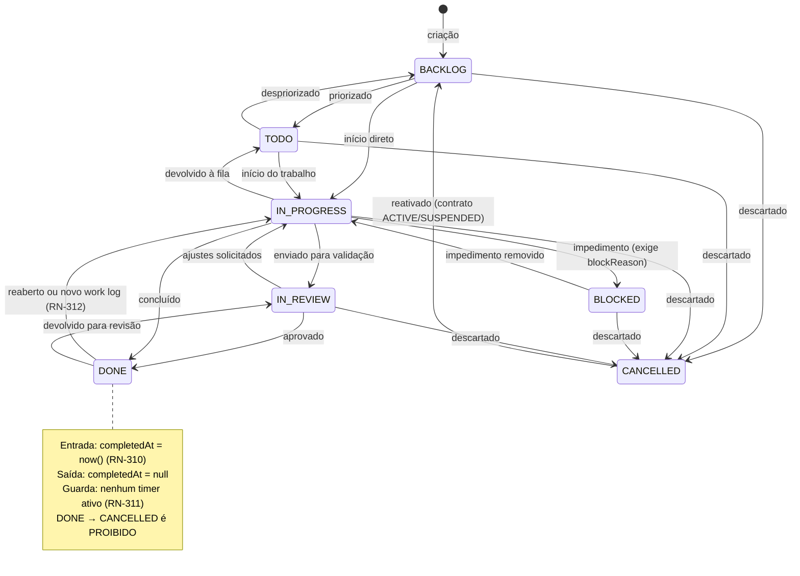
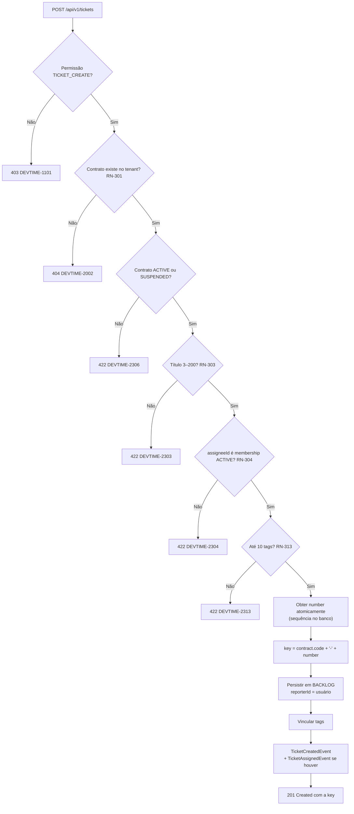
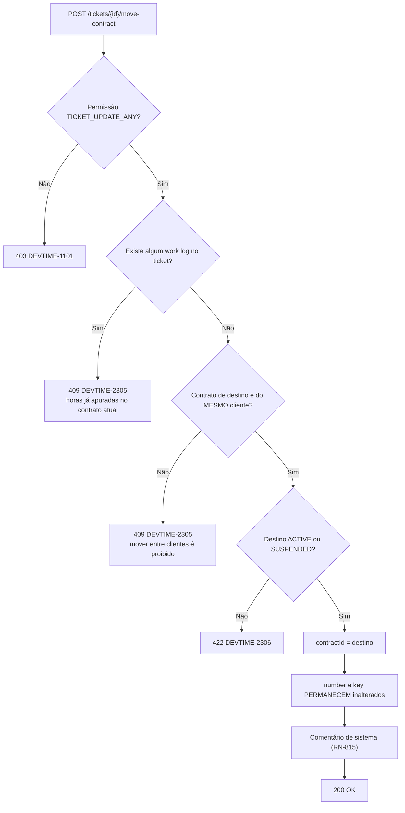

# 007 — Tickets

| Campo | Valor |
|---|---|
| **Feature** | 007 |
| **Épico** | EP-06 (Tickets e Classificação) |
| **Sprint** | S4 |
| **Prioridade** | P0 |
| **Complexidade** | Média |
| **Estimativa** | 29 pts · 7 dias-agente |
| **Stories** | US-060 a US-071 |
| **Status** | SPEC_APPROVED |

## 1. Objetivo

Gerir as unidades de trabalho do tenant — com chave legível derivada do contrato, máquina de 7 estados, responsável, estimativa, tags e totais de horas consumidas — servindo como o vínculo obrigatório de todo registro de horas.

## 2. Problema que resolve

RN-101 determina que **todo work log pertence a um ticket**. Não existe registro de horas avulso. Essa é a decisão mais estruturante do produto: ela é o que permite responder "no que essas 40 horas foram gastas" com uma lista de itens nomeados, em vez de um bloco de descrições soltas.

O ticket é também o objeto de conversa com o cliente. `CT-0001-42` é um identificador que sobrevive a e-mail, reunião e nota fiscal — enquanto um UUID não. Por isso `key` deriva do código do contrato (RN-302) e é estável para sempre.

Sem esta feature, `008-worklogs` não tem onde ancorar as horas e a hierarquia `WorkLog → Ticket → Contract → Client → Tenant` se rompe na origem.

## 3. Escopo

| # | Item | Referência |
|---|---|---|
| E-01 | CRUD de ticket com soft delete restrito | §6.12 `entities.md`, RN-307 |
| E-02 | Chave legível `{contract.code}-{number}` com sequência atômica por contrato | RN-302 |
| E-03 | Máquina de 7 estados com matriz completa e guardas | §4.7 `state-machines.md` |
| E-04 | Atribuição de responsável, restrita a membership ativo | RN-304 |
| E-05 | Movimentação entre contratos do mesmo cliente, sem work logs | RN-305 |
| E-06 | Totais desnormalizados `spentMinutes` e `billableMinutes` | RN-308 |
| E-07 | Sinalização de estouro de estimativa, sem bloqueio | RN-309 |
| E-08 | Preenchimento automático de `startedAt` e `completedAt` | RN-310 |
| E-09 | Retorno automático de `DONE` para `IN_PROGRESS` ao receber work log | RN-312 |
| E-10 | Vínculo de até 10 tags | RN-313 |
| E-11 | Quadro (kanban) com movimentação por arrastar | §7 `tickets.md`, P18 |
| E-12 | Linha do tempo de atividade do ticket | §11 `tickets.md` |
| E-13 | Comentários de sistema em mudanças estruturais | RN-815 |
| E-14 | Interfaces públicas para `008`, `009`, `012`, `013`, `014` | AR-03 |
| E-15 | Telas P17, P18, P19 e P20 | `pages.md` |

## 4. Fora do escopo

| Item | Onde está | Motivo |
|---|---|---|
| Registro de horas no ticket | `008-worklogs` | Entidade própria; o ticket apenas **acumula** os totais |
| Cronômetro | `009-timer` | Idem |
| Comentários de usuário | `014-comments` | Entidade própria. Esta feature emite apenas comentários de **sistema** (RN-815) |
| Anexos | `015-attachments` | Entidade própria |
| Notificação de atribuição e de comentário | `013-notifications` | Esta feature **publica o evento**; `013` decide e entrega |
| Criação e edição de tags | `006-tags` | Esta feature apenas **vincula** |
| Subtarefas ou hierarquia de tickets | Fora do roadmap | Um nível é suficiente para o relatório ao cliente |
| Dependências entre tickets (bloqueia/bloqueado por) | Fora do roadmap | `BLOCKED` com `blockReason` textual cobre o caso sem grafo |
| Sprints, estimativa em pontos, velocity | Fora do roadmap | NO-02: DevTime não é ferramenta de gestão ágil |
| Integração com Jira/GitHub | F8 | `externalRef` já existe e é persistido, sem uso no MVP |
| Campos personalizados | Fora do roadmap | Conflito CF-02 de `personas.md` |

## 5. Dependências

### 5.1 Features
| Feature | Tipo | O que consome |
|---|---|---|
| `004-contracts` | Bloqueante | `ContractService.getActiveForWorkLog` (RN-301, RN-306), `contract.code` para a `key` (RN-302) |
| `005-categories` | Bloqueante | `defaultCategoryId` do ticket; `dt-category-picker` |
| `006-tags` | Bloqueante | `TagService.resolveOrCreate`, `TagLinkService.linkToTicket` (RN-313) |
| `002-users` | Bloqueante | Validação de membership ativo (RN-304); auditoria |
| `008-worklogs` | Consumidora | `TicketService.getForWorkLog`; publica eventos que disparam RN-308 e RN-312 |
| `009-timer` | Consumidora | Timer aponta para ticket; RN-311 consulta timers ativos |
| `012-reports` | Consumidora | Agrupamento por ticket; `key` no relatório |
| `013-notifications` | Consumidora | `TicketAssignedEvent`, `TicketReopenedEvent` |
| `014-comments` | Consumidora | Comentários no ticket; RN-815 é emitida daqui |
| `015-attachments` | Consumidora | Anexos no ticket |

### 5.2 Documentos obrigatórios
| Documento | Seções relevantes |
|---|---|
| `docs/04-api/tickets.md` | §5 a §11 |
| `docs/02-domain/entities.md` | §6.12 Ticket |
| `docs/02-domain/business-rules.md` | RN-301 a RN-314, RN-815 |
| `docs/02-domain/state-machines.md` | §4.7 Ticket, §5 efeitos cruzados |
| `docs/02-domain/permissions.md` | §6.5, §7, OWN-04, nota ⁴ |
| `docs/05-ui/pages.md` | P17, P18, P19, P20 |

### 5.3 Infraestrutura
| Componente | Uso |
|---|---|
| PostgreSQL | `tickets`, `ticket_tags`, sequência por contrato |
| Nenhuma integração externa | `externalRef` é campo livre; integração é F8 |

## 6. Regras de negócio

| ID | Tipo | Enunciado resumido | Erro | Onde é aplicada |
|---|---|---|---|---|
| RN-301 | Bloqueante | Todo ticket pertence a um contrato do tenant | `DEVTIME-2301` / 422 | `TicketService.create` |
| RN-302 | Automática | `number` sequencial por contrato, atômico; `key = {contract.code}-{number}` | — | `TicketNumberGenerator` |
| RN-303 | Bloqueante | Título entre 3 e 200 caracteres | `DEVTIME-2303` / 422 | Bean Validation + service |
| RN-304 | Bloqueante | `assigneeId`, quando informado, é membership `ACTIVE` do tenant | `DEVTIME-2304` / 422 | `AssigneeValidator` |
| RN-305 | Bloqueante | Contrato só muda sem work logs e apenas para outro contrato do **mesmo cliente** | `DEVTIME-2305` / 409 | `ContractMoveGuard` |
| RN-306 | Bloqueante | Contrato `ENDED`/`CANCELLED` não aceita work log; `SUSPENDED` aceita só retroativo na vigência | `DEVTIME-2306` / 422 | Consultada por `008`/`009` |
| RN-307 | Bloqueante | Ticket com work logs não é excluído; apenas cancelado | `DEVTIME-2307` / 409 | `TicketDeletionGuard` |
| RN-308 | Automática | `spentMinutes` e `billableMinutes` recalculados a cada criação, edição ou exclusão de work log | — | `TicketTotalsUpdater` |
| RN-309 | **Aviso** | `spentMinutes > estimatedMinutes` sinaliza estouro na UI e nos relatórios; **não bloqueia** | — | Campo derivado `isOverEstimate` |
| RN-310 | Automática | 1ª entrada em `IN_PROGRESS` preenche `startedAt`; `DONE` preenche `completedAt`; sair de `DONE` limpa `completedAt` | — | `TicketStateMachine` |
| RN-311 | Bloqueante | Não move para `DONE` com timer ativo apontando para o ticket | `DEVTIME-2311` / 409 | `ActiveTimerGuard` |
| RN-312 | **Aviso** | Ticket `DONE` que recebe work log volta a `IN_PROGRESS` e notifica o responsável | — | Consumidor de `WorkLogCreatedEvent` |
| RN-313 | Bloqueante | Máximo de 10 tags por ticket | `DEVTIME-2313` / 422 | `TagLinkPolicy` (de `006`) |
| RN-314 | Automática | Cancelar não exclui work logs nem devolve horas ao saldo | — | `TicketStateMachine` |
| RN-815 | Automática | Comentário de sistema em mudança de status, de responsável e de contrato | — | `SystemCommentEmitter` |
| RN-003 | Automática | Exclusão é lógica | — | Todas |
| RN-004 | Bloqueante | Alteração exige `version` correspondente | `DEVTIME-2004` / 409 | Edições |
| RN-011 | Bloqueante | `number`, `key` e `reporterId` são imutáveis | `DEVTIME-2003` / 422 | `TicketService.update` |
| RN-012 | Bloqueante | Listagem paginada, `size` máximo 100 | `DEVTIME-2006` / 400 | `TicketController` |
| RN-001 | Bloqueante | Toda operação no tenant do usuário autenticado | `DEVTIME-1200` / 403 | Filtro automático |
| RN-002 | Bloqueante | Ticket de outro tenant retorna `404` | `DEVTIME-2002` / 404 | Filtro automático |
| RN-006 | Automática | Toda alteração gera `AuditLog` na mesma transação | — | Todas |

### 6.1 Ordem de aplicação — criação de ticket

| # | Verificação | Falha |
|---|---|---|
| 1 | Permissão `TICKET_CREATE` | `403 DEVTIME-1101` |
| 2 | Formato dos campos (Bean Validation) | `400` |
| 3 | Contrato existe no tenant (RN-301) | `404 DEVTIME-2002` |
| 4 | Contrato está `ACTIVE` ou `SUSPENDED` | `422 DEVTIME-2306` |
| 5 | Título entre 3 e 200 caracteres (RN-303) | `422 DEVTIME-2303` |
| 6 | `assigneeId`, se informado, é membership `ACTIVE` (RN-304) | `422 DEVTIME-2304` |
| 7 | `defaultCategoryId`, se informado, é categoria ativa do tenant | `422 DEVTIME-2104` |
| 8 | No máximo 10 tags (RN-313) | `422 DEVTIME-2313` |
| 9 | Gera `number` atomicamente e monta `key` (RN-302) | — |
| 10 | Persiste em `BACKLOG` com `reporterId` = usuário autenticado | — |
| 11 | Vincula tags; publica `TicketCreatedEvent`; gera auditoria | — |

**Por que o contrato é validado (3 e 4) antes de tudo:** a `key` deriva de `contract.code`. Sem contrato válido não há como gerar o identificador, e todas as demais validações seriam trabalho descartado. A separação entre "existe" (`404`) e "não aceita" (`422`) é necessária: um contrato inexistente no tenant não pode ser distinguido de um de outro tenant (ART-024), enquanto um contrato encerrado é um erro de negócio legítimo, cuja mensagem deve ser específica.

**Por que a geração do `number` (9) é o penúltimo passo:** a sequência é um recurso escasso e não reciclável. Consumi-la antes de todas as validações produziria lacunas na numeração a cada requisição inválida — e uma lacuna em `CT-0001-7` levanta a pergunta "onde está o ticket 6?" com o cliente.

### 6.2 Geração da chave (RN-302)

| # | Passo | Regra |
|---|---|---|
| 1 | Obter o próximo `number` do contrato, atomicamente | Sequência no banco por `contract_id`, nunca `MAX(number) + 1` em aplicação |
| 2 | `key = {contract.code}-{number}` | Ex.: `CT-0001` + `42` → `CT-0001-42` |
| 3 | `number` e `key` tornam-se imutáveis | RN-011, INV-TCK-01 |
| 4 | `key` é reconstruída na leitura, nunca reescrita | Campo derivado persistido para permitir busca por índice |

**Tabela normativa de chaves:**

| `contract.code` | `number` | `key` |
|---|:--:|---|
| `CT-0001` | 1 | `CT-0001-1` |
| `CT-0001` | 42 | `CT-0001-42` |
| `CT-0002` | 1 | `CT-0002-1` |
| `CT-0010` | 137 | `CT-0010-137` |

> A sequência é **por contrato**, não por tenant: dois contratos do mesmo tenant possuem, ambos, um ticket de número 1. O prefixo do contrato garante a unicidade global da `key`.

**Consequência de RN-305 sobre a `key`:** ao mover um ticket entre contratos, `number` e `key` **não mudam**. Um ticket `CT-0001-42` movido para `CT-0002` continua sendo `CT-0001-42`. Alterá-la quebraria toda referência externa já comunicada ao cliente — o exato oposto do propósito da chave. É por isso que RN-305 só permite a movimentação quando não há work logs: o histórico de horas continuaria apontando para uma chave de outro contrato, e o relatório ficaria incompreensível.

### 6.3 Invariantes envolvidas
| ID | Invariante | Como é garantida |
|---|---|---|
| INV-TCK-01 | `(contractId, number)` é único | Índice único + sequência atômica no banco |
| INV-TCK-02 | `contractId` é imutável se existir ao menos um work log | `ContractMoveGuard` (RN-305) |
| INV-TCK-03 | Ticket com work logs não é excluído | `TicketDeletionGuard` (RN-307) |
| INV-TCK-04 | `status = DONE` ⇒ `completedAt` preenchido | `TicketStateMachine` (RN-310) |
| INV-TCK-05 | `spentMinutes ≥ billableMinutes ≥ 0` | `TicketTotalsUpdater` + `CHECK` |
| INV-TAG-01 | Máximo de 10 tags por ticket | `TagLinkPolicy` de `006` |

## 7. Fluxo principal — criação de ticket

1. Usuário com `TICKET_CREATE` abre P20, a partir de P17 ou do detalhe de um contrato.
2. Seleciona o contrato — a lista mostra apenas contratos `ACTIVE` e `SUSPENDED` do tenant.
3. Informa título, descrição em Markdown, tipo, prioridade, responsável, estimativa, prazo, categoria padrão e tags.
4. O front exibe a chave que **será** gerada (`CT-0001-<próximo>`), consultando `GET /contracts/{id}/next-ticket-number`.
5. Envia `POST /api/v1/tickets`.
6. `TicketService` aplica a ordem da §6.1.
7. `TicketNumberGenerator` obtém o número atomicamente e monta a `key`.
8. Persiste em `BACKLOG`, com `reporterId` do usuário autenticado, `spentMinutes = 0` e `billableMinutes = 0`.
9. Vincula as tags por `TagLinkService.linkToTicket` (RN-313).
10. Publica `TicketCreatedEvent`; se houver `assigneeId`, publica `TicketAssignedEvent`.
11. Gera `AuditLog` `TICKET_CREATED` na mesma transação.
12. Retorna `201` com `Location` e o ticket criado, exibindo a `key`.
13. O front navega para P19, oferecendo "iniciar cronômetro" — o caminho natural imediato.

## 8. Fluxos alternativos

| # | Fluxo | Gatilho | Comportamento |
|---|---|---|---|
| FA-01 | Criação sem responsável | Campo vazio | Permitido; `assigneeId` nulo, nenhuma notificação |
| FA-02 | Criação sem estimativa | Campo vazio | Permitido; `progressRate` e `isOverEstimate` retornam nulo (RN-309 não se aplica) |
| FA-03 | Atribuição posterior | P19 | `POST /tickets/{id}/assign`; publica `TicketAssignedEvent`; gera comentário de sistema (RN-815) |
| FA-04 | Reatribuição | P19 | Notifica o **novo** responsável; o anterior não é notificado da remoção |
| FA-05 | Remoção do responsável | P19, `assigneeId` nulo | Permitido; nenhuma notificação |
| FA-06 | Transição de status | P18 (arrastar) ou P19 | `POST /tickets/{id}/transition`; valida a matriz §4.7 e as guardas |
| FA-07 | Transição para `BLOCKED` | P19 | Exige `blockReason` com no mínimo 5 caracteres; gera comentário de sistema |
| FA-08 | Transição para `DONE` com timer ativo | P19 | `409 DEVTIME-2311`, listando os timers ativos |
| FA-09 | Retorno automático de `DONE` | Novo work log em ticket `DONE` | Volta a `IN_PROGRESS`, limpa `completedAt`, notifica o responsável (RN-312) |
| FA-10 | Cancelamento | P19 | Vai a `CANCELLED`; work logs preservados; nenhuma hora devolvida (RN-314) |
| FA-11 | Reativação de cancelado | P19 | `CANCELLED → BACKLOG`, apenas se o contrato estiver `ACTIVE` ou `SUSPENDED` |
| FA-12 | Movimentação entre contratos | P19 | `POST /tickets/{id}/move-contract`; só sem work logs e no mesmo cliente (RN-305); `key` **inalterada** |
| FA-13 | Exclusão sem work logs | P19 | Soft delete; some das consultas |
| FA-14 | Exclusão com work logs | P19 | `409 DEVTIME-2307`; a mensagem sugere cancelar |
| FA-15 | Busca por chave | P17, campo de busca | `GET /tickets/by-key/{key}`; navega direto ao detalhe |
| FA-16 | Quadro kanban | P18 | Colunas por status; arrastar dispara a transição com as mesmas guardas do endpoint |
| FA-17 | Estouro de estimativa | Work log que ultrapassa | `isOverEstimate` verdadeiro; selo na UI; **nenhum bloqueio** (RN-309) |
| FA-18 | Linha do tempo | P19 | `GET /tickets/{id}/activity`: auditoria, comentários de sistema, work logs e comentários de usuário em ordem cronológica |
| FA-19 | `MEMBER` transicionando ticket alheio | P18 | `403 DEVTIME-1101` — `MEMBER` só transiciona onde é relator ou responsável (nota ⁴) |
| FA-20 | Ticket de contrato encerrado | P19 | Continua consultável e editável nos campos descritivos; **novo work log** é rejeitado por RN-306 |

## 9. Diagramas

### 9.1 Máquina de estados (§4.7 `state-machines.md`)



### 9.2 Criação com geração atômica da chave (RN-302)



### 9.3 Efeitos cruzados com work log (RN-308, RN-312)

```mermaid
sequenceDiagram
    participant WL as 008-worklogs
    participant TS as TicketTotalsUpdater
    participant SM as TicketStateMachine
    participant NT as 013-notifications

    WL->>TS: WorkLogCreatedEvent (dentro da transação)
    TS->>TS: spentMinutes += netMinutes (RN-308)
    TS->>TS: billableMinutes += billableMinutes
    alt Ticket está em DONE
        TS->>SM: solicitar reabertura (RN-312)
        SM->>SM: status = IN_PROGRESS; completedAt = null
        SM->>NT: TicketReopenedEvent (após o commit)
        NT->>NT: notifica o responsável
    end
    Note over TS: Nenhuma hora é devolvida ao saldo em cancelamento (RN-314)
    WL->>TS: WorkLogDeletedEvent
    TS->>TS: spentMinutes −= netMinutes
    Note over SM: Exclusão de work log NÃO reverte a reabertura de RN-312
```

### 9.4 Movimentação entre contratos (RN-305)



## 10. Estados

| Estado | Significado | Operações permitidas | Operações bloqueadas |
|---|---|---|---|
| `BACKLOG` | Registrado, não priorizado | Editar, atribuir, priorizar, iniciar, cancelar, excluir (se sem work logs), mover contrato | Ir direto a `BLOCKED`, `IN_REVIEW` ou `DONE` |
| `TODO` | Priorizado, aguardando início | Editar, atribuir, iniciar, despriorizar, cancelar | Ir direto a `BLOCKED`, `IN_REVIEW` ou `DONE` |
| `IN_PROGRESS` | Em execução | Editar, atribuir, registrar horas, bloquear, enviar a revisão, concluir, devolver à fila, cancelar | Voltar a `BACKLOG` |
| `BLOCKED` | Impedido por dependência externa | Editar, atribuir, desbloquear, cancelar | Ir a `TODO`, `IN_REVIEW` ou `DONE` sem passar por `IN_PROGRESS` |
| `IN_REVIEW` | Aguardando validação | Editar, atribuir, aprovar, solicitar ajustes, cancelar | Ir a `BACKLOG`, `TODO` ou `BLOCKED` |
| `DONE` | Concluído | Reabrir, devolver a revisão, registrar horas (reabre automaticamente) | **Cancelar** (proibido); ir a `BACKLOG`, `TODO` ou `BLOCKED` |
| `CANCELLED` | Descartado | Reativar para `BACKLOG` (se o contrato permitir) | Todas as demais transições; registrar horas |
| *excluído* | Soft delete; só possível sem work logs | — | Todas. Invisível a toda consulta padrão |

## 11. Transições

| Origem | Destino | Gatilho | Guarda | Efeito | Permissão |
|---|---|---|---|---|---|
| — | `BACKLOG` | Criação | §6.1 | `number` e `key` gerados; `reporterId` = usuário | `TICKET_CREATE` |
| `BACKLOG` | `TODO` | Priorização | — | — | `TICKET_TRANSITION` ⁴ |
| `TODO` | `BACKLOG` | Despriorização | — | — | `TICKET_TRANSITION` ⁴ |
| `BACKLOG`/`TODO` | `IN_PROGRESS` | Início | — | 1ª vez: `startedAt = now()` (RN-310) | `TICKET_TRANSITION` ⁴ |
| `IN_PROGRESS` | `TODO` | Devolução à fila | — | — | `TICKET_TRANSITION` ⁴ |
| `IN_PROGRESS` | `BLOCKED` | Impedimento | `blockReason` ≥ 5 caracteres | Comentário de sistema (RN-815) | `TICKET_TRANSITION` ⁴ |
| `BLOCKED` | `IN_PROGRESS` | Desbloqueio | — | Limpa `blockReason`; comentário de sistema | `TICKET_TRANSITION` ⁴ |
| `IN_PROGRESS` | `IN_REVIEW` | Envio a validação | — | Notifica o relator | `TICKET_TRANSITION` ⁴ |
| `IN_REVIEW` | `IN_PROGRESS` | Ajustes solicitados | — | — | `TICKET_TRANSITION` ⁴ |
| `IN_PROGRESS`/`IN_REVIEW` | `DONE` | Conclusão | **Nenhum timer ativo** (RN-311) | `completedAt = now()`; notifica o relator | `TICKET_TRANSITION` ⁴ |
| `DONE` | `IN_PROGRESS` | Reabertura manual | — | `completedAt = null` | `TICKET_TRANSITION` ⁴ |
| `DONE` | `IN_PROGRESS` | **Novo work log** (RN-312) | — | `completedAt = null`; notifica o responsável | Automática (sistema) |
| `DONE` | `IN_REVIEW` | Devolução para revisão | — | `completedAt = null` | `TICKET_TRANSITION` ⁴ |
| `BACKLOG`/`TODO`/`IN_PROGRESS`/`BLOCKED`/`IN_REVIEW` | `CANCELLED` | Descarte | — | Work logs preservados; nenhuma hora devolvida (RN-314); comentário de sistema | `TICKET_TRANSITION` ⁴ |
| `CANCELLED` | `BACKLOG` | Reativação | Contrato `ACTIVE` ou `SUSPENDED` | — | `TICKET_TRANSITION` ⁴ |
| qualquer | *excluído* | Exclusão | Nenhum work log (RN-307) | Soft delete; desvincula tags | `TICKET_DELETE` |

⁴ `MEMBER` executa transições **apenas** em tickets em que é `reporterId` ou `assigneeId` (OWN-04, nota ⁴ de `permissions.md`).

### 11.1 Transições proibidas

| Transição | Motivo da proibição |
|---|---|
| `DONE → CANCELLED` | Um ticket concluído representa trabalho entregue e horas possivelmente faturadas. Cancelá-lo sugeriria que o trabalho não ocorreu, contradizendo o relatório já emitido (§4.7 `state-machines.md`) |
| `CANCELLED → *` exceto `BACKLOG` | Reativar deve recomeçar o fluxo. Voltar direto a `IN_PROGRESS` pularia a repriorização, que é a decisão que justifica a reativação |
| `IN_PROGRESS → BACKLOG` | O trabalho já começou e `startedAt` está preenchido. Voltar ao backlog produziria um ticket "não priorizado" com horas registradas |
| `BLOCKED → TODO`/`IN_REVIEW`/`DONE` | O desbloqueio precisa passar por `IN_PROGRESS`, tornando explícito que o trabalho foi retomado antes de avançar |
| `BACKLOG`/`TODO` → `BLOCKED` | Não se bloqueia o que não começou. O impedimento é uma condição da execução |
| `* → DONE` com timer ativo | RN-311. Concluir com timer rodando produziria tempo órfão registrado após a conclusão |
| Exclusão com work logs | RN-307, ART-004. Destruiria o vínculo de horas já apuradas |
| Alteração de `number`, `key` ou `reporterId` | RN-011. A chave é referência externa permanente (§6.2) |
| Movimentação de contrato com work logs | RN-305, INV-TCK-02. Realocaria horas entre saldos já apurados |
| Movimentação para contrato de **outro cliente** | RN-305. O work log copia `clientId` (RN-109); mudar de cliente tornaria o histórico incoerente |

## 12. Casos de erro

| Código | HTTP | Situação | Mensagem ao usuário | Regra |
|---|:--:|---|---|---|
| `DEVTIME-1101` | 403 | Papel sem a permissão, ou `MEMBER` em ticket alheio | Você não tem permissão para esta ação | §7 permissions, nota ⁴ |
| `DEVTIME-1103` | 403 | Violação de ownership em `TICKET_UPDATE_OWN` | Você só pode alterar seus próprios registros | OWN-04 |
| `DEVTIME-2002` | 404 | Ticket ou contrato de outro tenant | Recurso não encontrado | RN-002 |
| `DEVTIME-2003` | 422 | Tentativa de alterar `number`, `key` ou `reporterId` | Este campo não pode ser alterado | RN-011 |
| `DEVTIME-2004` | 409 | Conflito de `version` | O registro foi alterado. Recarregue e tente novamente | RN-004 |
| `DEVTIME-2006` | 400 | `size` acima de 100 | Tamanho de página inválido | RN-012 |
| `DEVTIME-2010` | 409 | Transição fora da matriz §4.7 | Não é possível mudar o ticket para este status | ME-04 |
| `DEVTIME-2104` | 422 | `defaultCategoryId` inválido ou inativo | Categoria inválida ou inativa | RN-104 |
| `DEVTIME-2301` | 422 | Contrato ausente na criação | Contrato obrigatório | RN-301 |
| `DEVTIME-2303` | 422 | Título fora de 3–200 | O título deve ter entre 3 e 200 caracteres | RN-303 |
| `DEVTIME-2304` | 422 | Responsável inexistente ou inativo | Responsável inválido ou inativo | RN-304 |
| `DEVTIME-2305` | 409 | Movimentação com work logs ou entre clientes | Ticket com horas não pode mudar de contrato | RN-305 |
| `DEVTIME-2306` | 422 | Contrato `ENDED`/`CANCELLED` | Contrato encerrado não aceita registros | RN-306 |
| `DEVTIME-2307` | 409 | Exclusão com work logs | Ticket com horas não pode ser excluído. Cancele-o | RN-307 |
| `DEVTIME-2311` | 409 | `DONE` com timer ativo | Existe cronômetro ativo neste ticket | RN-311 |
| `DEVTIME-2313` | 422 | 11ª tag | Máximo de 10 etiquetas por ticket | RN-313 |
| `DEVTIME-1201` | 403 | Escrita em tenant suspenso | Organização suspensa: apenas leitura | RN-007 |

### 12.1 Casos extremos

| # | Caso | Comportamento esperado |
|---|---|---|
| CX-01 | Dois tickets criados simultaneamente no mesmo contrato | Números distintos e consecutivos; a sequência no banco garante atomicidade (RN-302) |
| CX-02 | Criação falha após consumir o número | Número **não** é reciclado; a lacuna é aceita. Reciclar exigiria coordenação que reintroduziria a corrida |
| CX-03 | Contrato renomeado após tickets criados | `contract.code` é imutável (INV-CTR-01), portanto a `key` permanece válida |
| CX-04 | Ticket movido de contrato mantém a `key` antiga | Correto e deliberado (§6.2); a `key` é referência externa permanente |
| CX-05 | Ticket `DONE` recebe work log retroativo | Volta a `IN_PROGRESS` e notifica (RN-312, CE-ME-05) |
| CX-06 | Work log do ticket reaberto é excluído em seguida | O ticket **permanece** `IN_PROGRESS`; a reabertura não é revertida automaticamente — reverter exigiria saber o estado anterior, que RN-312 não preserva |
| CX-07 | Ticket cancelado com 40h registradas | Horas preservadas e continuam consumindo saldo (RN-314); aparecem nos relatórios |
| CX-08 | Estimativa de 10h e 30h gastas | `isOverEstimate` verdadeiro; selo na UI; **nenhum bloqueio** (RN-309) |
| CX-09 | Ticket sem estimativa | `progressRate` e `isOverEstimate` nulos; nenhuma sinalização |
| CX-10 | Responsável é removido do tenant | Membership vai a `REMOVED`; tickets abertos são reatribuídos ao `OWNER` (§4.3 SM); `assigneeId` nunca fica apontando para membership removido |
| CX-11 | Transição para `DONE` com timer `PAUSED` | Bloqueada igualmente — `PAUSED` é timer ativo (CE-ME-01) |
| CX-12 | Título com exatamente 3 e com 200 caracteres | Ambos aceitos; 2 e 201 rejeitados |
| CX-13 | Descrição Markdown com 20.000 caracteres | Aceita; renderizada com sanitização de HTML |
| CX-14 | Ticket com 10 tags é editado sem tocar nelas | Permitido; o limite é verificado apenas ao adicionar |
| CX-15 | Reativação de cancelado cujo contrato foi encerrado | `409` — a guarda exige contrato `ACTIVE` ou `SUSPENDED` (§4.7) |
| CX-16 | Auto-transição (mesmo status de origem e destino) | `200` sem efeito e sem auditoria (ME-03) |
| CX-17 | `MEMBER` cria ticket e depois é removido como responsável | Continua sendo `reporterId`, mantendo ownership para OWN-04 |
| CX-18 | Contrato com 10.000 tickets | Listagem paginada; `number` continua sequencial; sem degradação por índice `(contract_id, number)` |
| CX-19 | Busca por `key` inexistente | `404 DEVTIME-2002`, indistinguível de chave de outro tenant |
| CX-20 | `blockReason` com 4 caracteres | `422`; o mínimo de 5 vem de §4.7 |
| CX-21 | Ticket excluído logicamente e nova busca pela mesma `key` | `404`; a `key` **não** é liberada para reuso, pois `number` não é reciclado |

## 13. Modelo de dados

### 13.1 Entidades impactadas
| Entidade | Operação | Tabela | Referência |
|---|---|---|---|
| `Ticket` | Cria, lê, atualiza, soft delete | `tickets` | §6.12 |
| *(vínculo)* | Cria, lê, remove | `ticket_tags` | `006-tags` |
| `Contract` | Lê (RN-301, RN-306, `code`) | `contracts` | Via `ContractService` |
| `Membership` | Lê (RN-304) | `memberships` | Via `MembershipService` |
| `Category` | Lê (`defaultCategoryId`) | `categories` | Via `CategoryService` |
| `WorkLog` | Lê (contagem para RN-305, RN-307; soma para RN-308) | `work_logs` | Via `WorkLogService` |
| `Timer` | Lê (RN-311) | `timers` | Via `TimerService` |
| `Comment` | Cria (sistema — RN-815) | `comments` | `014-comments` |
| `AuditLog` | Cria | `audit_logs` | §6.20 |

### 13.2 Campos obrigatórios na criação
| Campo | Tipo | Origem | Imutável | Validação |
|---|---|---|:--:|---|
| `tenantId` | UUID | `TenantContext` | ✔ 🔒 | Nunca da requisição (ART-021) |
| `contractId` | UUID | Request | ✖ | Contrato `ACTIVE`/`SUSPENDED` do tenant (RN-301, RN-306) |
| `number` | int | Sequência do banco | ✔ 🔒 | Atômico por contrato (RN-302) |
| `key` | String(20) | Derivado | ✔ 🔒 | `{contract.code}-{number}` |
| `title` | String(200) | Request | ✖ | 3–200 (RN-303) |
| `description` | Text(20000) | Request | ✖ | Markdown; opcional; sanitizado na renderização |
| `type` | enum | Request | ✖ | `FEATURE`, `BUG`, `SUPPORT`, `MEETING`, `MAINTENANCE`, `OTHER`; default `FEATURE` |
| `status` | enum | Sistema | ✖ | `BACKLOG`; alterado só por endpoint de transição (ME-05) |
| `priority` | enum | Request | ✖ | `LOW`, `MEDIUM`, `HIGH`, `URGENT`; default `MEDIUM` |
| `assigneeId` | UUID | Request | ✖ | Membership `ACTIVE` (RN-304); opcional |
| `reporterId` | UUID | Usuário autenticado | ✔ 🔒 | Nunca da requisição |
| `estimatedMinutes` | int | Request | ✖ | ≥ 0; opcional |
| `spentMinutes` | int | Sistema | ✖ 💾 | `0`; recalculado por RN-308 |
| `billableMinutes` | int | Sistema | ✖ 💾 | `0`; ≤ `spentMinutes` (INV-TCK-05) |
| `dueDate` | DATE | Request | ✖ | Opcional |
| `defaultCategoryId` | UUID | Request | ✖ | Categoria ativa do tenant; opcional |
| `externalRef` | String(200) | Request | ✖ | Livre; sem integração no MVP |

### 13.3 Migrations
| Migration | Conteúdo | Compatibilidade |
|---|---|---|
| `V019__create_tickets.sql` | Tabela `tickets` + índice único `(contract_id, number)` + `CHECK (spent_minutes >= billable_minutes)` + `CHECK (billable_minutes >= 0)` | Nova tabela |
| `V020__ticket_number_sequence.sql` | Função e sequência de `number` por contrato, com aquisição atômica | Nova estrutura |
| `V021__ticket_indexes.sql` | Índices de listagem, quadro e busca | Índices |

> A sequência de `number` **não** pode ser `MAX(number) + 1` calculado na aplicação: sob duas criações simultâneas, ambas leriam o mesmo máximo e produziriam chaves duplicadas (CX-01). A implementação usa um contador por contrato adquirido com bloqueio no banco, ou uma sequência dedicada — a decisão fica com `backend.md`, mas a **atomicidade é requisito**, não escolha.

### 13.4 Índices
| Índice | Colunas | Sustenta |
|---|---|---|
| `uq_tickets_contract_number` | `(contract_id, number)` | RN-302, INV-TCK-01 |
| `uq_tickets_tenant_key` | `(tenant_id, key)` WHERE `deleted_at IS NULL` | `GET /tickets/by-key/{key}` |
| `idx_tickets_tenant_status_updated` | `(tenant_id, status, updated_at DESC)` WHERE `deleted_at IS NULL` | Listagem e quadro |
| `idx_tickets_tenant_assignee` | `(tenant_id, assignee_id, status)` WHERE `deleted_at IS NULL` | "Meus tickets" e escopo de `MEMBER` |
| `idx_tickets_tenant_contract` | `(tenant_id, contract_id, status)` WHERE `deleted_at IS NULL` | Tickets do contrato |
| `idx_tickets_search` | GIN sobre `title` e `key`, sem acento | Busca textual |
| `idx_tickets_tenant_due` | `(tenant_id, due_date)` WHERE `due_date IS NOT NULL AND deleted_at IS NULL` | Prazos |

## 14. Endpoints utilizados

| Método | Rota | Operação | Permissão | Sucesso | Doc |
|---|---|---|---|:--:|---|
| GET | `/api/v1/tickets` | Listar com filtros e busca | `TICKET_VIEW` | 200 | §5 |
| GET | `/api/v1/tickets/board` | Quadro agrupado por status | `TICKET_VIEW` | 200 | §7 |
| GET | `/api/v1/tickets/{id}` | Detalhar | `TICKET_VIEW` | 200 | §6 |
| GET | `/api/v1/tickets/by-key/{key}` | Buscar por chave legível | `TICKET_VIEW` | 200 | §6 |
| POST | `/api/v1/tickets` | Criar | `TICKET_CREATE` | 201 | §8 |
| PUT/PATCH | `/api/v1/tickets/{id}` | Atualizar | `TICKET_UPDATE_OWN` ou `_ANY` | 200 | §9 |
| POST | `/api/v1/tickets/{id}/transition` | Mudar status | `TICKET_TRANSITION` | 200 | §10 |
| POST | `/api/v1/tickets/{id}/assign` | Atribuir responsável | `TICKET_ASSIGN` | 200 | §10 |
| POST | `/api/v1/tickets/{id}/move-contract` | Mover de contrato | `TICKET_UPDATE_ANY` | 200 | §10 |
| DELETE | `/api/v1/tickets/{id}` | Excluir (lógico) | `TICKET_DELETE` | 204 | §9 |
| GET | `/api/v1/tickets/{id}/activity` | Linha do tempo | `TICKET_VIEW` | 200 | §11 |
| GET | `/api/v1/tickets/{id}/work-logs` | Horas do ticket | `WORKLOG_VIEW_OWN`/`_ANY` | 200 | §11 — servido por `008` |

> `/tickets/{id}/comments` e `/tickets/{id}/attachments`, embora documentados em `tickets.md`, pertencem a `014-comments` e `015-attachments`. Aparecem lá, não aqui.

## 15. Eventos

| Evento | Publicado por | Consumidores | Momento | Efeito |
|---|---|---|---|---|
| `TicketCreatedEvent` | `TicketService` | Métricas | Após o commit | Telemetria |
| `TicketAssignedEvent` | `TicketService` | `013-notifications` | Após o commit | Notifica o novo responsável (RN-607) |
| `TicketStatusChangedEvent` | `TicketStateMachine` | `014-comments`, métricas | **Dentro** da transação (comentário de sistema — RN-815) | Comentário de sistema; auditoria |
| `TicketReopenedEvent` | `TicketStateMachine` | `013-notifications` | Após o commit | Notifica o responsável (RN-312) |
| `TicketContractMovedEvent` | `TicketService` | `014-comments` | **Dentro** da transação | Comentário de sistema (RN-815) |
| `WorkLogCreatedEvent` | `008-worklogs` | `TicketTotalsUpdater` | **Dentro** da transação | RN-308; possível RN-312 |
| `WorkLogUpdatedEvent` | `008-worklogs` | `TicketTotalsUpdater` | **Dentro** da transação | Recalcula os totais |
| `WorkLogDeletedEvent` | `008-worklogs` | `TicketTotalsUpdater` | **Dentro** da transação | Reduz os totais; **não** reverte RN-312 (CX-06) |

**Justificativa dos momentos:** comentários de sistema (RN-815) e totais desnormalizados (RN-308) são publicados **dentro** da transação porque são parte do mesmo fato — um ticket cujo status mudou sem o comentário correspondente tem linha do tempo incompleta, e um total divergente aparece imediatamente na listagem. Notificações são publicadas **após o commit** porque envolvem entrega externa: falha no envio de e-mail não pode reverter uma transição de status já decidida (TX-06).

## 16. Permissões

| Operação | Permissão | Papéis | Ownership | Escopo de dados |
|---|---|---|---|---|
| Listar, detalhar, buscar por chave, quadro | `TICKET_VIEW` | Todos os 5 papéis | — | **Todos os tickets do tenant**, inclusive para `MEMBER` (§9 `permissions.md`) |
| Criar | `TICKET_CREATE` | OWNER, ADMIN, MANAGER, MEMBER | — | — |
| Editar próprio (relator ou responsável) | `TICKET_UPDATE_OWN` | OWNER, ADMIN, MANAGER, MEMBER | OWN-04 | — |
| Editar qualquer | `TICKET_UPDATE_ANY` | OWNER, ADMIN, MANAGER | Dispensa ownership (OWN-08) | — |
| Atribuir responsável | `TICKET_ASSIGN` | OWNER, ADMIN, MANAGER; `MEMBER` ⁴ | `MEMBER`: só em tickets próprios | — |
| Transicionar status | `TICKET_TRANSITION` | OWNER, ADMIN, MANAGER; `MEMBER` ⁴ | `MEMBER`: só em tickets próprios | — |
| Mover de contrato | `TICKET_UPDATE_ANY` | OWNER, ADMIN, MANAGER | — | — |
| Excluir | `TICKET_DELETE` | OWNER, ADMIN, MANAGER | — | — |
| Linha do tempo | `TICKET_VIEW` | Todos | — | Work logs de terceiros ocultos de `MEMBER` (§9) |

> **`MEMBER` enxerga todos os tickets, mas não todas as horas.** É a assimetria declarada na §9 de `permissions.md`: um desenvolvedor precisa ver o quadro completo para colaborar, mas não deve ver quantas horas os colegas registraram. Na linha do tempo (`/activity`), os work logs de outros membros são omitidos para `MEMBER` — o filtro é aplicado por query, nunca em memória (IMP-02).
>
> **⁴ `MEMBER` só atribui e transiciona tickets próprios** (relator ou responsável — OWN-04). Ele pode transicionar um ticket que criou mesmo sem ser o responsável.

## 17. Validações

### 17.1 Camada 1 — Formato (`400`)
| Campo | Restrição | Mensagem |
|---|---|---|
| `title` | `@NotBlank`, `@Size(min=3,max=200)` | O título deve ter entre 3 e 200 caracteres |
| `description` | `@Size(max=20000)` | Descrição muito longa |
| `type` | Enum válido | Tipo de ticket inválido |
| `priority` | Enum válido | Prioridade inválida |
| `estimatedMinutes` | `@Min(0)` | Estimativa inválida |
| `dueDate` | Data válida | Prazo inválido |
| `externalRef` | `@Size(max=200)` | Referência externa muito longa |
| `blockReason` | `@Size(min=5,max=500)` quando destino é `BLOCKED` | Informe o motivo do impedimento (mínimo 5 caracteres) |
| `tagIds` | `@Size(max=10)` | Máximo de 10 etiquetas |
| `size` | `@Max(100)` | Tamanho de página inválido |

### 17.2 Camada 2 — Negócio
| Validação | Regra | Erro |
|---|---|---|
| Contrato existe no tenant | RN-301 | `DEVTIME-2002` / 404 |
| Contrato `ACTIVE` ou `SUSPENDED` | RN-306 | `DEVTIME-2306` / 422 |
| Responsável é membership `ACTIVE` | RN-304 | `DEVTIME-2304` / 422 |
| Categoria padrão ativa | RN-104 | `DEVTIME-2104` / 422 |
| Transição pertence à matriz §4.7 | ME-04 | `DEVTIME-2010` / 409 |
| `blockReason` informado ao ir a `BLOCKED` | §4.7 | `422` |
| Nenhum timer ativo ao ir a `DONE` | RN-311 | `DEVTIME-2311` / 409 |
| Contrato do ticket permite reativação | §4.7 | `DEVTIME-2010` / 409 |
| Nenhum work log ao mover de contrato | RN-305 | `DEVTIME-2305` / 409 |
| Contrato de destino do mesmo cliente | RN-305 | `DEVTIME-2305` / 409 |
| Nenhum work log ao excluir | RN-307 | `DEVTIME-2307` / 409 |
| Até 10 tags | RN-313 | `DEVTIME-2313` / 422 |
| Ownership em `*_OWN` | OWN-04 | `DEVTIME-1103` / 403 |
| `version` correspondente | RN-004 | `DEVTIME-2004` / 409 |

### 17.3 Camada 3 — Consistência
| Constraint | Garante | Mapeado para |
|---|---|---|
| `uq_tickets_contract_number` | INV-TCK-01 | `DEVTIME-2001` (erro interno — indica falha da sequência) |
| `uq_tickets_tenant_key` | Unicidade da chave | `DEVTIME-2001` |
| `CHECK (spent_minutes >= billable_minutes)` | INV-TCK-05 | `DEVTIME-9002` |
| `CHECK (billable_minutes >= 0)` | INV-TCK-05 | `DEVTIME-9002` |
| FK `tickets.contract_id` → `contracts.id` | RN-301 | `DEVTIME-2002` |
| FK `tickets.assignee_id` → `memberships.user_id` | RN-304 | `DEVTIME-2304` |

## 18. Auditoria

| Ação | `action` | `beforeState` | `afterState` | Metadata |
|---|---|---|---|---|
| Criação | `TICKET_CREATED` | — | `{key, title, contractId, status}` | IP, traceId |
| Edição | `TICKET_UPDATED` | Campos alterados | Campos alterados | IP, traceId |
| Mudança de status | `TICKET_STATUS_CHANGED` | `{status}` | `{status}` | `blockReason` quando aplicável, traceId (ME-02) |
| Reabertura automática | `TICKET_STATUS_CHANGED` | `{status: DONE}` | `{status: IN_PROGRESS}` | `actorType = SYSTEM`, `workLogId` disparador (RN-312) |
| Atribuição | `TICKET_ASSIGNED` | `{assigneeId}` | `{assigneeId}` | traceId |
| Movimentação de contrato | `TICKET_CONTRACT_MOVED` | `{contractId}` | `{contractId}` | `key` inalterada, traceId |
| Exclusão | `TICKET_DELETED` | `{key, status}` | `{deletedAt}` | IP, traceId |
| Vínculo de tags | `TICKET_TAGS_CHANGED` | Tags anteriores | Tags novas | traceId |

> A reabertura automática (RN-312) é auditada com `actorType = SYSTEM` e registra **qual work log** a disparou. Sem esse dado, o responsável veria seu ticket concluído voltar a "em andamento" sem explicação — e a linha do tempo é justamente onde ele buscaria a resposta.

## 19. Segurança

| # | Vetor | Mitigação | Verificação |
|---|---|---|---|
| SG-01 | Ticket de outro tenant por id ou por `key` | Filtro automático; `404` (ART-024); busca por `key` também filtrada | Suíte de isolamento |
| SG-02 | Enumeração de tickets por chave sequencial | `key` é previsível por construção; mitigado pelo filtro de tenant, que retorna `404` para chaves de outros tenants | Teste de enumeração |
| SG-03 | `MEMBER` transicionando ticket alheio | Ownership verificado no service (OWN-04, nota ⁴) | Matriz de permissões |
| SG-04 | `MEMBER` vendo horas de colegas na linha do tempo | Work logs de terceiros filtrados por query (IMP-02) | Inspeção de SQL |
| SG-05 | XSS por descrição Markdown | Sanitização na renderização; allowlist de tags HTML; nenhum `innerHTML` cru | Teste com payload |
| SG-06 | XSS por título em PDF de relatório | Escape no gerador de PDF de `012` | Teste com payload |
| SG-07 | `reporterId` forjado no payload | Campo ausente dos DTOs; sempre do `TenantContext` | Teste com payload malicioso |
| SG-08 | `spentMinutes` manipulado por API | Desnormalizado; ausente de todos os DTOs de escrita | Teste com payload |
| SG-09 | Escalonamento por `move-contract` para contrato de outro cliente | RN-305 valida o cliente do destino | Teste dedicado |
| SG-10 | Injeção na busca textual | `Specification` tipada; nunca concatenação (RP-04) | Teste com payload |

### 19.1 LGPD

| Dado pessoal | Base legal | Retenção | Exportação | Anonimização | Proibido em log |
|---|---|---|---|---|---|
| `reporterId`, `assigneeId` (vínculo com pessoa) | Execução de contrato | Vida do tenant | ✔ `GET /tenant/export` | Substituídos por `Usuário Removido` | Permitido (é UUID) |
| `title` e `description` (texto livre) | Legítimo interesse | Vida do tenant | ✔ | Não se aplica | ❌ conteúdo em log |
| Menções a pessoas na descrição | Legítimo interesse | Idem | ✔ | Manual, sob solicitação | ❌ |

**Análise:** `title` e `description` são texto livre e podem conter dado pessoal de terceiros (nome de contato do cliente, por exemplo). O sistema não pode preveni-lo sem uma regra de conteúdo que `docs/` não define. O tratamento é: conteúdo exportável, editável pelo autor a qualquer momento, e **nunca** registrado em log de aplicação — apenas o `id` e a `key` (§28).

Remoção de um membro (`Membership → REMOVED`) **preserva** os tickets (RN-458) e reatribui os abertos ao `OWNER` (§4.3 SM). O `reporterId` histórico é mantido para integridade do registro; a anonimização substitui a exibição do nome, não o vínculo.

## 20. Performance

| Operação | Meta | Índice/estratégia | Risco |
|---|---|---|---|
| Listagem com filtros | p95 < 300 ms | `idx_tickets_tenant_status_updated`; projeção, nunca a entidade | Tenant com 50k tickets |
| Quadro (kanban) | p95 < 400 ms | Uma consulta agrupada por status, com limite por coluna; **não** uma consulta por coluna | 7 consultas separadas seriam 7× o custo |
| Busca por `key` | p95 < 50 ms | `uq_tickets_tenant_key` | — |
| Busca textual | p95 < 400 ms | `idx_tickets_search` (GIN) | Busca sem índice degradaria com 50k tickets |
| Detalhe com tags e totais | p95 < 200 ms | PK + join de tags; totais desnormalizados evitam agregação | N+1 ao carregar tags |
| Geração de `number` | < 20 ms | Sequência no banco | Contenção em contrato muito ativo |
| Linha do tempo | p95 < 500 ms | Paginação por cursor; união ordenada de auditoria, comentários e work logs | Ticket com 1.000 eventos |
| RN-308 (atualização de totais) | < 30 ms | Incremento em vez de agregação | Executado em toda escrita de work log |

### 20.1 Escalabilidade

`tickets` é a segunda maior tabela do sistema, atrás de `work_logs`. Com 100k+ tickets por tenant, três pontos exigem atenção:

**Quadro kanban.** Com 7 colunas, a implementação ingênua faz 7 consultas. A obrigatória é **uma** consulta agrupada com limite por coluna (padrão: 50 cartões visíveis) e carregamento sob demanda ao rolar. Um quadro que carrega 100k cartões trava o navegador antes de trafegar.

**Totais desnormalizados (RN-308).** `spentMinutes` é atualizado por **incremento**, nunca por reagregação de todos os work logs do ticket. A diferença é entre uma operação constante e uma linear no número de registros — e RN-308 dispara em toda escrita de work log, o caminho mais quente do sistema.

**Linha do tempo.** Une três fontes (auditoria, comentários, work logs). Paginada por cursor, nunca por `OFFSET`, que degrada linearmente. Limitada aos 50 eventos mais recentes por página.

Listagens usam `TicketSummaryProjection`, nunca a entidade completa (RP-03) — carregar `description` de 20.000 caracteres em uma listagem de 100 itens trafegaria 2 MB desnecessários.

## 21. Componentes Frontend

### 21.1 Rotas
| Rota | Componente | Guard | Lazy | Tela |
|---|---|---|:--:|---|
| `/tickets` | `TicketListPage` | `permissionGuard(['TICKET_VIEW'])` | ✔ | P17 |
| `/tickets/board` | `TicketBoardPage` | `permissionGuard(['TICKET_VIEW'])` | ✔ | P18 |
| `/tickets/:id` | `TicketDetailPage` | `permissionGuard(['TICKET_VIEW'])` | ✔ | P19 |
| `/tickets/new` | `TicketFormPage` | `permissionGuard(['TICKET_CREATE'])` | ✔ | P20 |
| `/tickets/:id/edit` | `TicketFormPage` | `permissionGuard(['TICKET_UPDATE_OWN'])` | ✔ | P20 |

### 21.2 Componentes
| Componente | Tipo | Responsabilidade | Inputs | Outputs |
|---|---|---|---|---|
| `TicketListPage` | Page | Lista com filtros compostos e paginação na URL | — | — |
| `TicketBoardPage` | Page | Quadro por status com arrastar e soltar | — | — |
| `TicketDetailPage` | Page | Dados, horas, tags, linha do tempo e ações | — | — |
| `TicketFormPage` | Page | Criação e edição, com `unsavedChangesGuard` | — | — |
| `dt-ticket-card` | Presentational | Cartão com chave, título, responsável, prioridade e progresso | `ticket`, `compact` | `select` |
| `dt-ticket-key` | Shared | Chave legível com cópia para a área de transferência | `ticketKey` | `copy` |
| `dt-ticket-status-badge` | Shared | Selo de status com cor | `status` | — |
| `dt-ticket-priority-badge` | Shared | Selo de prioridade | `priority` | — |
| `dt-ticket-transition-menu` | Presentational | Ações conforme `availableTransitions` e papel (ME-06) | `ticket`, `transitions` | `transition` |
| `dt-block-reason-dialog` | Presentational | Motivo do impedimento, mínimo 5 caracteres | — | `confirm`, `cancel` |
| `dt-assignee-picker` | Shared | Seleção de responsável entre memberships **ativos** | `value` | `change` |
| `dt-ticket-progress` | Presentational | Barra estimado × gasto, com selo de estouro (RN-309) | `spent`, `estimated` | — |
| `dt-ticket-timeline` | Presentational | Linha do tempo paginada por cursor | `ticketId` | `loadMore` |
| `dt-move-contract-dialog` | Presentational | Contratos do **mesmo cliente**; alerta sobre a `key` inalterada | `ticket`, `contracts` | `confirm`, `cancel` |
| `dt-markdown-editor` | Shared | Edição e prévia de Markdown com sanitização | `value` | `change` |
| `dt-markdown-view` | Shared | Renderização sanitizada | `content` | — |

### 21.3 Stores e serviços Angular
| Artefato | Tipo | Estado exposto | Escopo |
|---|---|---|---|
| `TicketStore` | Store | `tickets`, `selected`, `boardColumns` (computed), `filters`, `loading`, `error` | Provido na rota `/tickets` |
| `TicketApi` | API | Somente HTTP dos 12 endpoints | `providedIn: 'root'` |
| `TicketActivityStore` | Store | `events`, `cursor`, `hasMore` | Provido em P19 |

### 21.4 Guards, interceptors, pipes e directives
| Artefato | Tipo | Uso |
|---|---|---|
| `permissionGuard` | Guard | Protege P17–P20 |
| `unsavedChangesGuard` | Guard | Formulário de ticket |
| `hasPermission` | Directive | Oculta criar, editar, transicionar, atribuir, mover e excluir |
| `isOwnTicket` | Directive | Habilita ações de `MEMBER` apenas em tickets próprios (nota ⁴) |
| `durationPipe` | Pipe | Formata minutos em `HH:MM` |
| `ticketKeyPipe` | Pipe | Formatação da chave |

## 22. Serviços Backend

### 22.1 Controllers
| Classe | Rota base | Endpoints |
|---|---|---|
| `TicketController` | `/api/v1/tickets` | listar, quadro, detalhar, buscar por chave, criar, atualizar, excluir |
| `TicketTransitionController` | `/api/v1/tickets/{id}` | transição, atribuição, movimentação de contrato |
| `TicketActivityController` | `/api/v1/tickets/{id}/activity` | linha do tempo |

### 22.2 Services
| Interface | Implementação | Responsabilidade | Permissão declarada |
|---|---|---|---|
| `TicketService` | `TicketServiceImpl` | CRUD, movimentação de contrato, exclusão restrita | `TICKET_*` |
| `TicketTransitionService` | `TicketTransitionServiceImpl` | Transições e atribuição, com guardas | `TICKET_TRANSITION`, `TICKET_ASSIGN` |
| `TicketBoardService` | `TicketBoardServiceImpl` | Quadro em consulta única agrupada | `TICKET_VIEW` |
| `TicketActivityService` | `TicketActivityServiceImpl` | Linha do tempo unificada, paginada por cursor | `TICKET_VIEW` |
| `TicketTotalsService` | `TicketTotalsServiceImpl` | RN-308 por incremento; reconciliação | Interna |

**Interfaces públicas consumidas por outras features:**

| Método | Consumidor | Contrato |
|---|---|---|
| `TicketService.getForWorkLog(ticketId)` | `008`, `009` | Retorna o ticket com `contractId` e `clientId` para RN-109; falha se o contrato não aceitar registro (RN-306) |
| `TicketTotalsService.applyWorkLogDelta(ticketId, delta)` | `008` | Aplica RN-308 por incremento, dentro da transação |
| `TicketTransitionService.reopenOnWorkLog(ticketId)` | `008` | Aplica RN-312 |
| `TicketService.getKeyById(ticketId)` | `012`, `013` | Chave legível para relatórios e notificações |

### 22.3 Componentes de domínio
| Classe | Tipo | Responsabilidade | Regras |
|---|---|---|---|
| `TicketNumberGenerator` | Generator | Número sequencial atômico por contrato | RN-302, INV-TCK-01 |
| `TicketKeyBuilder` | Utilitário | Monta `{contract.code}-{number}` | RN-302 |
| `TicketStateMachine` | StateMachine | Matriz §4.7, guardas, `availableTransitions` | ME-04, ME-06, RN-310 |
| `ActiveTimerGuard` | Validator | Bloqueia `DONE` com timer ativo | RN-311 |
| `AssigneeValidator` | Validator | Membership `ACTIVE` | RN-304 |
| `ContractMoveGuard` | Validator | Sem work logs, mesmo cliente | RN-305, INV-TCK-02 |
| `TicketDeletionGuard` | Validator | Sem work logs | RN-307, INV-TCK-03 |
| `TicketTotalsUpdater` | Policy | Incremento de `spentMinutes` e `billableMinutes` | RN-308, INV-TCK-05 |
| `SystemCommentEmitter` | Policy | Comentário de sistema em mudanças estruturais | RN-815 |
| `BlockReasonValidator` | Validator | Mínimo de 5 caracteres ao ir a `BLOCKED` | §4.7 |

### 22.4 Jobs
| Classe | Cron | Lock | Responsabilidade | Idempotência |
|---|---|---|---|---|
| `DenormalizationReconcileJob` | `0 0 2 * * *` | compartilhado com `003`, `004`, `006`, `011` | Reconcilia `spentMinutes` e `billableMinutes` por agregação real | Recalcula do zero; convergente |

> Nenhum job move status de ticket automaticamente. Um ticket parado em `IN_PROGRESS` há meses é um problema de gestão, não de sistema — fechá-lo automaticamente inventaria uma conclusão que não ocorreu, violando PR-03.

## 23. DTOs

| DTO | Direção | Campos principais | Observação |
|---|---|---|---|
| `TicketCreateRequest` | Request | `contractId`, `title`, `description`, `type`, `priority`, `assigneeId?`, `estimatedMinutes?`, `dueDate?`, `defaultCategoryId?`, `tagIds[]`, `externalRef?` | `status`, `number`, `key`, `reporterId`, `spentMinutes` **ausentes** |
| `TicketUpdateRequest` | Request | Mesmos campos editáveis + `version` | `status` ausente (ME-05); `contractId` ausente (endpoint próprio) |
| `TicketResponse` | Response | Todos + `key`, `status`, `spentMinutes`, `billableMinutes`, `progressRate`, `isOverEstimate`, `tags[]`, `availableTransitions[]`, `version` | ME-06 |
| `TicketSummaryProjection` | Projection | `id`, `key`, `title`, `status`, `priority`, `assignee`, `spentMinutes`, `estimatedMinutes`, `tags[]` | Listagem e quadro — **nunca** a entidade |
| `TicketFilter` | Filter | `status[]`, `priority[]`, `type[]`, `assigneeId`, `reporterId`, `contractId`, `clientId`, `tagIds[]`, `search`, `dueBefore`, `isOverEstimate` | Filtros compostos |
| `TicketBoardResponse` | Response | `columns[]` com `status`, `total` e `tickets[]` limitados | Uma consulta agrupada |
| `TransitionRequest` | Request | `targetStatus`, `blockReason?` | `blockReason` obrigatório para `BLOCKED` |
| `AssignRequest` | Request | `assigneeId?` | Nulo remove o responsável |
| `MoveContractRequest` | Request | `targetContractId`, `confirmed` | `confirmed` reconhece que a `key` não muda |
| `TicketActivityResponse` | Response | `events[]` com `type`, `occurredAt`, `actor`, `payload`, `cursor` | Paginada por cursor |

## 24. Mappers

| Mapper | De → Para | Mapeamentos não triviais |
|---|---|---|
| `TicketMapper` | `Ticket` → `TicketResponse` | `progressRate` e `isOverEstimate` calculados; `availableTransitions` conforme estado **e** papel; tags carregadas em lote |
| `TicketSummaryMapper` | `TicketSummaryProjection` → resposta de listagem | Duração em `HH:MM`; sem `description` |
| `TicketActivityMapper` | Fontes heterogêneas → `TicketActivityResponse` | Unifica auditoria, comentários e work logs em um tipo comum, ordenado por instante |

## 25. Repositories

| Repository | Entidade | Métodos específicos | Índice usado |
|---|---|---|---|
| `TicketRepository` | `Ticket` | `search(Specification, Pageable)` retornando projeção, `findByKey`, `findBoardGrouped`, `nextNumberForContract`, `incrementTotals` | `uq_tickets_*`, `idx_tickets_*` |
| `TicketActivityRepository` | *(consulta)* | `findActivityByCursor` unindo três fontes | Índices de `audit_logs`, `comments`, `work_logs` |

> `nextNumberForContract` executa a aquisição atômica no banco. `incrementTotals` é um `UPDATE ... SET spent_minutes = spent_minutes + ?`, nunca uma leitura seguida de escrita — a leitura-modificação-escrita perderia atualizações sob concorrência.

## 26. Entities utilizadas
| Entidade | Origem | Campos relevantes |
|---|---|---|
| `Ticket` | Esta feature | Todos |
| `Contract` | `004-contracts` | `code`, `status`, `clientId` — somente leitura |
| `Membership` | `002-users` | `status`, `userId` — RN-304 |
| `Category` | `005-categories` | `id`, `active` — `defaultCategoryId` |
| `Tag` | `006-tags` | Vínculo por `ticket_tags` |
| `WorkLog` | `008-worklogs` | Contagem e soma — RN-305, RN-307, RN-308 |
| `Timer` | `009-timer` | Existência de timer ativo — RN-311 |

## 27. Validators e Exceptions

| Classe | Tipo | Regra | Código de erro |
|---|---|---|---|
| `AssigneeValidator` | Validator | RN-304 | `DEVTIME-2304` |
| `ContractMoveGuard` | Validator | RN-305 | `DEVTIME-2305` |
| `TicketDeletionGuard` | Validator | RN-307 | `DEVTIME-2307` |
| `ActiveTimerGuard` | Validator | RN-311 | `DEVTIME-2311` |
| `BlockReasonValidator` | Validator | §4.7 | `422` |
| `TicketStateMachine` | StateMachine | ME-04 | `DEVTIME-2010` |
| `InvalidAssigneeException` | Exception | RN-304 | `DEVTIME-2304` / 422 |
| `TicketContractMoveException` | Exception | RN-305 | `DEVTIME-2305` / 409 |
| `TicketHasWorkLogsException` | Exception | RN-307 | `DEVTIME-2307` / 409 |
| `ActiveTimerException` | Exception | RN-311 | `DEVTIME-2311` / 409 |
| `InvalidTransitionException` | Exception | ME-04 | `DEVTIME-2010` / 409 |
| `ContractNotAcceptingWorkException` | Exception | RN-306 | `DEVTIME-2306` / 422 |

## 28. Logs

| Evento | Nível | Campos | Proibido |
|---|---|---|---|
| Ticket criado | INFO | `tenantId`, `userId`, `ticketId`, `key`, `contractId` | **`title` e `description`** — texto livre (§19.1) |
| Transição de status | INFO | `ticketId`, `key`, origem, destino | `blockReason` (texto livre) |
| Reabertura automática (RN-312) | INFO | `ticketId`, `workLogId` disparador | — |
| Transição rejeitada | INFO | `ticketId`, origem, destino tentado, motivo | — |
| Movimentação de contrato | **WARN** | `ticketId`, contrato origem e destino | — |
| Exclusão bloqueada por RN-307 | INFO | `ticketId`, contagem de work logs | — |
| Divergência de totais corrigida | WARN | `ticketId`, valores anterior e real | — |

> **`title` e `description` nunca entram em log.** São texto livre e podem conter dado pessoal (§19.1). A `key` é suficiente para identificar o ticket em qualquer investigação — e é justamente o identificador que humanos usam.
>
> Movimentação de contrato é `WARN` porque altera a que contrato o trabalho pertence. Raro, e a primeira coisa a verificar quando um ticket "sumiu" de um relatório.

## 29. Métricas

| Métrica | Tipo | Tags | Alerta |
|---|---|---|---|
| `ticket.created` | Counter | `type`, `priority` | — |
| `ticket.transition` | Counter | `from`, `to` | — |
| `ticket.transition.rejected` | Counter | `from`, `to`, `reason` | > 100/dia indica UI oferecendo transição inválida |
| `ticket.reopened.auto` | Counter | — | Crescimento indica conclusão prematura recorrente (RN-312) |
| `ticket.done.blocked_by_timer` | Counter | — | > 20/dia indica que a UI não avisa sobre o timer antes |
| `ticket.delete.blocked` | Counter | — | > 20/dia indica UI confusa entre excluir e cancelar |
| `ticket.over_estimate.ratio` | Gauge | — | > 60% indica estimativas sistematicamente otimistas |
| `ticket.board.duration` | Timer | `columnCount` | p95 > 400 ms |
| `ticket.list.duration` | Timer | `hasSearch` | p95 > 500 ms |
| `ticket.number.contention` | Counter | — | Crescimento indica contenção na sequência |
| `ticket.totals.drift` | Counter | — | > 0 por dois dias indica falha no incremento transacional |

## 30. Comportamentos esperados

| # | Comportamento |
|---|---|
| CE-01 | Todo ticket possui contrato e chave legível derivada dele |
| CE-02 | A numeração é sequencial por contrato e gerada atomicamente |
| CE-03 | `number` e `key` nunca mudam, inclusive ao mover de contrato |
| CE-04 | Toda transição respeita a matriz §4.7 e suas guardas |
| CE-05 | `startedAt` é preenchido na 1ª entrada em `IN_PROGRESS` e nunca sobrescrito |
| CE-06 | `completedAt` é preenchido em `DONE` e limpo ao sair |
| CE-07 | Concluir com timer ativo é bloqueado, inclusive timer pausado |
| CE-08 | Ticket concluído que recebe work log volta a `IN_PROGRESS` e notifica |
| CE-09 | Cancelar preserva todas as horas registradas |
| CE-10 | Estouro de estimativa sinaliza, nunca bloqueia |
| CE-11 | Totais são atualizados por incremento na transação do work log |
| CE-12 | Mudanças estruturais geram comentário de sistema |
| CE-13 | `MEMBER` vê todos os tickets, mas não as horas dos colegas |
| CE-14 | `MEMBER` só transiciona e atribui tickets próprios |
| CE-15 | O quadro é servido por uma consulta agrupada, com limite por coluna |
| CE-16 | Toda listagem é paginada e usa projeção |

## 31. Comportamentos proibidos

| # | Proibição | Motivo |
|---|---|---|
| CP-01 | Excluir fisicamente um ticket | RN-003, ART-051 |
| CP-02 | Excluir ticket com work logs | RN-307, ART-004 |
| CP-03 | Gerar `number` por `MAX(number) + 1` na aplicação | Produz chaves duplicadas sob concorrência (CX-01) |
| CP-04 | Reciclar número de criação falha | Reintroduziria a corrida que a sequência elimina |
| CP-05 | Alterar `number`, `key` ou `reporterId` | RN-011; a chave é referência externa permanente |
| CP-06 | Alterar a `key` ao mover de contrato | Quebraria toda referência já comunicada ao cliente |
| CP-07 | Mover ticket com work logs, ou para outro cliente | RN-305, INV-TCK-02 |
| CP-08 | Permitir `DONE → CANCELLED` | §4.7; sugeriria que o trabalho entregue não ocorreu |
| CP-09 | Concluir com timer ativo ou pausado | RN-311, CE-ME-01 |
| CP-10 | Bloquear registro por estouro de estimativa | RN-309 é **aviso**; estimativa é referência, não limite |
| CP-11 | Devolver horas ao saldo ao cancelar | RN-314; o trabalho foi realizado |
| CP-12 | Reagregar todos os work logs para atualizar totais | Linear no caminho mais quente do sistema |
| CP-13 | Alterar `status` por `PATCH` genérico | ME-05 |
| CP-14 | Uma consulta por coluna no quadro | 7× o custo necessário |
| CP-15 | Retornar a entidade completa em listagem | RP-03; `description` de 20.000 caracteres |
| CP-16 | Filtrar horas de terceiros em memória para `MEMBER` | IMP-02; vaza por contagem e paginação |
| CP-17 | Logar `title`, `description` ou `blockReason` | Texto livre com possível dado pessoal (§19.1) |
| CP-18 | Renderizar Markdown sem sanitização | SG-05 |
| CP-19 | Mover status de ticket por job automático | Inventaria conclusão que não ocorreu (PR-03) |
| CP-20 | Acessar `TicketRepository` a partir de outra feature | AR-02 |

## 32. Restrições

| # | Restrição | Origem |
|---|---|---|
| RS-01 | Um nível de tickets, sem subtarefas | Decisão de escopo |
| RS-02 | Sem dependências entre tickets | `BLOCKED` com motivo textual cobre o caso |
| RS-03 | Sem sprints, pontos de história ou velocity | NO-02: DevTime não é ferramenta ágil |
| RS-04 | Máximo de 10 tags por ticket | RN-313 |
| RS-05 | Título entre 3 e 200 caracteres | RN-303 |
| RS-06 | Descrição até 20.000 caracteres | §6.12 `entities.md` |
| RS-07 | `externalRef` sem integração no MVP | F8 |
| RS-08 | Sem campos personalizados | Conflito CF-02 de `personas.md` |
| RS-09 | Listagem com `size` máximo de 100 | RN-012 |

## 33. Critérios de aceite

| # | Critério | Verificação |
|---|---|---|
| CA-01 | A tabela normativa de chaves da §6.2 é reproduzida exatamente | Teste parametrizado |
| CA-02 | 100 criações simultâneas no mesmo contrato produzem 100 números distintos e consecutivos | Teste de concorrência |
| CA-03 | Todas as 49 células da matriz §4.7 possuem teste de aceitação ou rejeição | Relatório de cobertura |
| CA-04 | `DONE → CANCELLED` é rejeitado com `DEVTIME-2010` | Teste |
| CA-05 | `startedAt` é preenchido só na 1ª entrada em `IN_PROGRESS` | Teste com múltiplas entradas |
| CA-06 | `completedAt` é preenchido em `DONE` e limpo em toda saída | Teste |
| CA-07 | `DONE` com timer `RUNNING` e com `PAUSED` retorna `DEVTIME-2311` | Teste |
| CA-08 | Work log em ticket `DONE` reabre, limpa `completedAt` e notifica | Teste de integração |
| CA-09 | Excluir o work log que causou a reabertura **não** reverte o status | Teste (CX-06) |
| CA-10 | Cancelar preserva work logs e não devolve saldo | Teste |
| CA-11 | Movimentação com work logs ou entre clientes retorna `DEVTIME-2305` | Teste |
| CA-12 | Movimentação bem-sucedida mantém `number` e `key` | Teste |
| CA-13 | Exclusão com work logs retorna `DEVTIME-2307` sugerindo cancelar | Teste |
| CA-14 | `spentMinutes` é atualizado por incremento e converge após reconciliação | Teste com inspeção de SQL |
| CA-15 | Estouro de estimativa sinaliza sem bloquear | Teste |
| CA-16 | `MEMBER` não vê work logs de colegas na linha do tempo | Teste com inspeção de SQL |
| CA-17 | `MEMBER` recebe `403` ao transicionar ticket alheio e sucesso no próprio | Teste |
| CA-18 | O quadro é servido por **uma** consulta agrupada | Inspeção de SQL |
| CA-19 | Ticket de outro tenant retorna `404`, por id e por `key` | Suíte de isolamento |
| CA-20 | Markdown com payload de XSS é renderizado como texto | Teste de segurança |
| CA-21 | Existe teste para cada célula da matriz de permissões desta feature | Relatório |

## 34. Checklist de implementação

- [ ] `V019` com índice único `(contract_id, number)` e os dois `CHECK` de INV-TCK-05
- [ ] `V020` com aquisição **atômica** de `number`; nunca `MAX + 1` na aplicação
- [ ] `TicketKeyBuilder` reproduz a tabela normativa da §6.2
- [ ] `number` e `key` ausentes de todos os DTOs de escrita
- [ ] `reporterId` sempre do `TenantContext`, ausente do payload
- [ ] Validação de contrato (existência e status) **antes** de consumir a sequência (§6.1)
- [ ] `TicketStateMachine` implementa a matriz §4.7 integralmente, com `availableTransitions` por estado **e** papel
- [ ] `RN-310`: `startedAt` só na 1ª entrada; `completedAt` limpo em toda saída de `DONE`
- [ ] `ActiveTimerGuard` considera `RUNNING` **e** `PAUSED` (CE-ME-01)
- [ ] `BlockReasonValidator` com mínimo de 5 caracteres
- [ ] `ContractMoveGuard` verifica ausência de work logs **e** mesmo cliente
- [ ] Movimentação de contrato **não** altera `number` nem `key`
- [ ] `TicketDeletionGuard` consulta `WorkLogService`, nunca `WorkLogRepository`
- [ ] `TicketTotalsUpdater` usa `UPDATE ... SET x = x + ?`, nunca leitura-modificação-escrita
- [ ] RN-312 aplicada dentro da transação do work log; notificação após o commit
- [ ] Exclusão de work log **não** reverte a reabertura (CX-06)
- [ ] `SystemCommentEmitter` dispara em status, responsável e contrato (RN-815)
- [ ] Comentário de sistema publicado **dentro** da transação
- [ ] Quadro servido por **uma** consulta agrupada, com limite por coluna
- [ ] Linha do tempo paginada por cursor, nunca por `OFFSET`
- [ ] Work logs de terceiros filtrados por query para `MEMBER` (IMP-02)
- [ ] Listagem retorna `TicketSummaryProjection`, sem `description`
- [ ] Markdown sanitizado na renderização, com allowlist
- [ ] Nenhum log contém `title`, `description` ou `blockReason`
- [ ] `status` ausente dos DTOs de atualização (ME-05)
- [ ] Filtros e paginação persistidos na URL
- [ ] Nenhum texto fixo em P17–P20 (ART-095)

## 35. Checklist de revisão

- [ ] Nenhum acesso a `TicketRepository` de fora da feature
- [ ] `404` (não `403`) para ticket de outro tenant, por id e por `key`
- [ ] Toda célula da matriz §4.7 possui teste
- [ ] Toda transição proibida possui teste de rejeição
- [ ] Toda `RN-XXX` da §6 possui teste referenciando o ID no `@DisplayName`
- [ ] Atomicidade da sequência comprovada por teste de concorrência
- [ ] Incremento de totais comprovado por inspeção de SQL
- [ ] Quadro comprovadamente em consulta única
- [ ] Escopo de horas de `MEMBER` aplicado por query
- [ ] Nenhum log com texto livre
- [ ] Cobertura ≥ 90% em `TicketStateMachine`, services e validators
- [ ] Nenhuma consulta N+1 ao carregar tags e responsável

## 36. Checklist de QA

- [ ] Todos os cenários de `acceptance.md` verdes
- [ ] Criação com e sem responsável, estimativa, prazo e tags
- [ ] Chave exibida corretamente e copiável
- [ ] Todas as transições da matriz, incluindo as rejeitadas
- [ ] Bloqueio com e sem motivo
- [ ] Conclusão com timer rodando e pausado
- [ ] Reabertura automática ao registrar horas em ticket concluído
- [ ] Cancelamento com horas registradas
- [ ] Reativação de cancelado com contrato ativo e encerrado
- [ ] Movimentação de contrato com e sem horas, mesmo cliente e cliente diferente
- [ ] Exclusão com e sem horas
- [ ] Quadro: arrastar entre todas as colunas, incluindo movimentos inválidos
- [ ] Busca por chave, por título com acento e sem acento
- [ ] Como `MEMBER`: transicionar ticket próprio e alheio; conferir horas na linha do tempo
- [ ] Estouro de estimativa exibido sem bloquear
- [ ] Markdown com `<script>` renderizado como texto
- [ ] Zero violações do axe-core em P17–P20
- [ ] Quadro navegável e movimentável por teclado
- [ ] Filtros preservados ao compartilhar o link

## 37. Definition of Done

| # | Item | Referência |
|---|---|---|
| DoD-01 | Todos os critérios da §33 verdes | — |
| DoD-02 | Cobertura ≥ 90% em `TicketStateMachine`, services e validators | CA-08 `backend.md` |
| DoD-03 | Suíte de isolamento verde para todos os endpoints | CA-03 `architecture.md` |
| DoD-04 | `docs/04-api/tickets.md` sincronizado | ART-111 |
| DoD-05 | Zero violações do axe-core em P17–P20 | AC-01 |
| DoD-06 | Interfaces `getForWorkLog`, `applyWorkLogDelta`, `reopenOnWorkLog` e `getKeyById` publicadas para `008`, `009`, `012` e `013` | AR-03 |
| DoD-07 | Matriz §4.7 100% coberta, com aceitação e rejeição | CA-01/CA-02 `state-machines.md` |
| DoD-08 | Teste de concorrência da sequência verde com 100 criações simultâneas | CA-02 |

## 38. Riscos

| # | Risco | Prob. | Impacto | Mitigação | Gatilho |
|---|---|:--:|:--:|---|---|
| R-01 | **Sequência de `number` sob concorrência produzindo chaves duplicadas** | Média | Médio | Geração atômica no banco; teste com 100 criações simultâneas | Duas chaves iguais no mesmo contrato |
| R-02 | Totais desnormalizados divergindo | Média | Médio | Incremento transacional + reconciliação noturna | `ticket.totals.drift` > 0 por dois dias |
| R-03 | Quadro lento com muitos tickets | Média | Médio | Consulta única agrupada, limite por coluna, carregamento sob demanda | p95 > 400 ms |
| R-04 | Reabertura automática (RN-312) surpreendendo o responsável | Média | Baixo | Notificação + auditoria com o work log disparador; comentário de sistema | Reclamação sobre status alterado sozinho |
| R-05 | `MEMBER` inferindo horas de colegas pela linha do tempo | Baixa | Alto | Filtro por query; teste com inspeção de SQL | Contagem divergente do visível |
| R-06 | XSS por Markdown na descrição | Baixa | Alto | Sanitização com allowlist; teste com payload | Teste de segurança falho |
| R-07 | Chave inconsistente após movimentação de contrato | Baixa | Médio | `key` explicitamente imutável; teste dedicado | Chave alterada em produção |
| R-08 | Contenção na sequência de contrato muito ativo | Baixa | Baixo | Métrica `ticket.number.contention`; sequência dedicada por contrato | p95 de criação > 200 ms |

## 39. Observações

| # | Observação |
|---|---|
| OB-01 | **A `key` não muda ao mover de contrato (§6.2, CX-04).** É contraintuitivo: um ticket `CT-0001-42` no contrato `CT-0002` parece inconsistente. A alternativa — renumerar no destino — foi rejeitada porque a chave já foi comunicada ao cliente por e-mail, reunião e possivelmente nota fiscal. Alterá-la quebraria a única referência estável que existe. RN-305 mitiga o estranhamento restringindo a movimentação a tickets **sem horas**, ou seja, recém-criados, cuja chave dificilmente circulou. |
| OB-02 | **Lacunas na numeração são aceitas (CX-02).** Uma criação que falha após consumir o número deixa um buraco. Reciclar exigiria coordenação entre a sequência e a transação, reintroduzindo exatamente a corrida que a sequência elimina. O custo é uma pergunta ocasional ("cadê o ticket 6?"); o benefício é a impossibilidade de duas chaves iguais. |
| OB-03 | **RN-312 não é reversível (CX-06).** Excluir o work log que reabriu um ticket não o devolve a `DONE`, porque a regra não preserva o estado anterior. Implementar a reversão exigiria armazenar o estado pré-reabertura e decidir o que fazer se houver outras alterações no intervalo — complexidade desproporcional a um caso raro. O usuário reconclui manualmente. |
| OB-04 | **`MEMBER` vê todos os tickets (§16).** Vem da §9 de `permissions.md` e é deliberado: colaboração exige visibilidade do quadro. A restrição incide sobre **horas**, não sobre tickets. A consequência é que `MEMBER` vê os títulos de todos os clientes, o que é informação de negócio. Foi avaliado e aceito — a alternativa (escopo de tickets como o de contratos) tornaria o quadro inútil para times. |
| OB-05 | **Estimativa não bloqueia (RN-309).** Poderia ser um teto. É apenas aviso porque estimativa errada é normal e bloquear o registro faria o desenvolvedor **não registrar** as horas excedentes — destruindo o dado que o produto existe para capturar. O selo de estouro e a métrica `ticket.over_estimate.ratio` transformam o desvio em informação de gestão em vez de atrito. |
| OB-06 | **Comentários de sistema (RN-815) dependem de `014-comments`.** Esta feature emite os eventos e a policy; a entidade `Comment` pertence a `014`, que é `P2` e está no fim da fila. Até `014` existir, `SystemCommentEmitter` grava apenas o `AuditLog` correspondente, e a linha do tempo é montada só de auditoria e work logs. Isso é **comportamento correto e temporário**, não defeito — e está registrado como dependência em `tasks.md`. |
| OB-07 | **Evolução SaaS:** `externalRef` já existe e é persistido, sem uso no MVP. Em F8 (`future/019-public-api`), a integração com Jira/GitHub o consumirá sem alteração de modelo. Da mesma forma, a máquina de estados é fixa em código; em F6, com papéis customizados, o candidato natural é tornar as transições configuráveis por tenant — o que exige apenas externalizar a matriz, já isolada em `TicketStateMachine`. |
| OB-08 | **Dívida conhecida:** a linha do tempo une três fontes em tempo de consulta. Funciona bem até algumas centenas de eventos por ticket. Se um ticket muito longo degradar, o caminho é uma tabela de eventos materializada, alimentada pelos mesmos publicadores. Não foi feito agora porque duplicaria dado que já existe, exigindo reconciliação, para um problema ainda não observado. |
