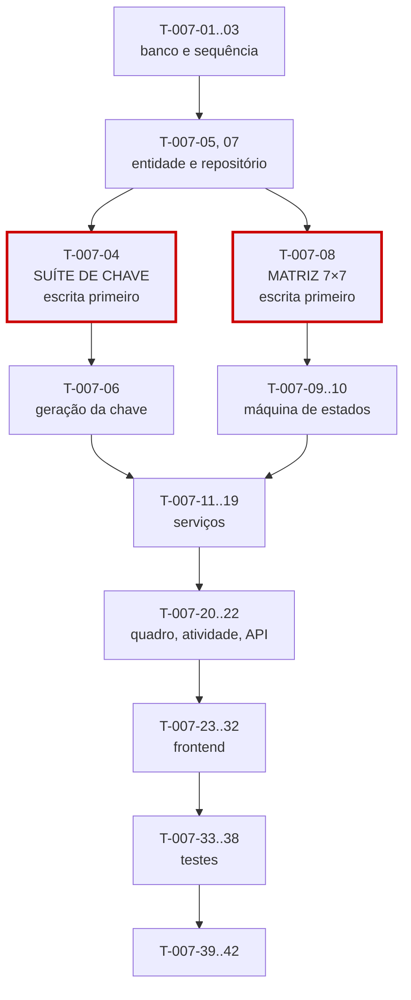

# 007 — Tickets · Tarefas

## 1. Convenções

| Campo | Regra |
|---|---|
| **ID** | `T-007-XX`, estável e imutável |
| **Descrição** | Verbo no infinitivo + objeto |
| **Dependências** | IDs de tarefas ou features concluídas |
| **Estimativa** | Horas-agente; acima de 8h deve ser decomposta |
| **Prioridade** | `P0` bloqueante · `P1` necessária · `P2` cortável |

> **Dependência temporal com `014-comments`:** RN-815 (comentários de sistema) exige a entidade `Comment`, que só existe em `014` (`P2`, sprint S11). Até lá, `SystemCommentEmitter` grava apenas o `AuditLog` correspondente e a linha do tempo é montada de auditoria e work logs. `T-007-32` fecha essa lacuna e é executada **dentro de `014`**, não aqui.

## 2. Resumo

| Grupo | Tarefas | Estimativa |
|---|:--:|---|
| Banco | 3 | 7h |
| Backend | 14 | 44h |
| Frontend | 10 | 31h |
| Testes | 6 | 24h |
| Documentação | 2 | 3h |
| Infra | 2 | 3h |
| **Total** | **37** | **112h ≈ 7 dias-agente** |

## 3. Banco

| ID | Descrição | Dependências | Estimativa | Prioridade |
|---|---|---|:--:|:--:|
| T-007-01 | Criar `V019__create_tickets.sql` com índice único `(contract_id, number)`, único parcial de `key` e os `CHECK` de INV-TCK-05 | 004, 005, 006 | 2,5h | P0 |
| T-007-02 | Criar `V020__ticket_number_sequence.sql` com aquisição **atômica** de `number` por contrato | T-007-01 | 3h | P0 |
| T-007-03 | Criar `V021__ticket_indexes.sql` com os índices de listagem, quadro, prazo e o GIN de busca sem acento | T-007-01 | 1,5h | P0 |

## 4. Backend

### 4.1 Domínio e chave

| ID | Descrição | Dependências | Estimativa | Prioridade |
|---|---|---|:--:|:--:|
| T-007-04 | **Escrever antes do código:** suíte parametrizada da tabela normativa de chaves (§6.2) e teste de concorrência com 100 criações simultâneas | T-007-01 | 3h | P0 |
| T-007-05 | Criar a entidade `Ticket` com os enums `TicketType`, `TicketStatus`, `TicketPriority` | T-007-01 | 2h | P0 |
| T-007-06 | Implementar `TicketNumberGenerator` (aquisição atômica) e `TicketKeyBuilder` | T-007-04, T-007-02 | 3h | P0 |
| T-007-07 | Criar `TicketRepository` com `search` por `Specification` retornando projeção, `findByKey`, `findBoardGrouped`, `nextNumberForContract` e `incrementTotals` | T-007-05 | 4h | P0 |

### 4.2 Máquina de estados

| ID | Descrição | Dependências | Estimativa | Prioridade |
|---|---|---|:--:|:--:|
| T-007-08 | **Escrever antes do código:** matriz completa das 49 células (7×7), com aceitação e rejeição de cada uma | T-007-05 | 4h | P0 |
| T-007-09 | Implementar `TicketStateMachine` com a matriz §4.7, `availableTransitions` por estado **e** papel (ME-06) e RN-310 | T-007-08 | 5h | P0 |
| T-007-10 | Implementar `ActiveTimerGuard` (RN-311, considerando `PAUSED`) e `BlockReasonValidator` (§4.7) | T-007-09 | 2h | P0 |

### 4.3 Serviços

| ID | Descrição | Dependências | Estimativa | Prioridade |
|---|---|---|:--:|:--:|
| T-007-11 | Implementar `AssigneeValidator` (RN-304) consumindo `MembershipService` | T-007-05 | 1,5h | P0 |
| T-007-12 | Implementar `TicketService.create` na ordem da §6.1, consumindo `ContractService.getActiveForWorkLog` e `TagLinkService.linkToTicket` | T-007-06, T-007-11 | 4h | P0 |
| T-007-13 | Implementar `TicketService.update` com imutabilidade de `number`, `key` e `reporterId` (RN-011) | T-007-12 | 2,5h | P0 |
| T-007-14 | Implementar `TicketTransitionService` (transição e atribuição) com ownership de `MEMBER` (nota ⁴) | T-007-09, T-007-10 | 4h | P0 |
| T-007-15 | Implementar `ContractMoveGuard` e a movimentação preservando `number` e `key` (RN-305) | T-007-13 | 3h | P0 |
| T-007-16 | Implementar `TicketDeletionGuard` (RN-307) consultando `WorkLogService` | T-007-13 | 2h | P0 |
| T-007-17 | Implementar `TicketTotalsService.applyWorkLogDelta` por `UPDATE ... SET x = x + ?` (RN-308) | T-007-07 | 3h | P0 |
| T-007-18 | Implementar `TicketTransitionService.reopenOnWorkLog` (RN-312), sem reversão na exclusão do work log (CX-06) | T-007-14, T-007-17 | 2,5h | P0 |
| T-007-19 | Implementar `SystemCommentEmitter` gravando `AuditLog`; ponto de extensão para `Comment` de `014` (RN-815) | T-007-14 | 2h | P1 |
| T-007-20 | Implementar `TicketBoardService` em **uma** consulta agrupada, com limite por coluna | T-007-07 | 3h | P0 |
| T-007-21 | Implementar `TicketActivityService` unindo auditoria e work logs, paginado por cursor, com filtro de horas de terceiros para `MEMBER` (IMP-02) | T-007-07 | 4h | P1 |
| T-007-22 | Criar DTOs, mappers, os três controllers com OpenAPI; registrar os códigos de erro da §12 | T-007-20, T-007-15 | 4h | P0 |

## 5. Frontend

| ID | Descrição | Dependências | Estimativa | Prioridade |
|---|---|---|:--:|:--:|
| T-007-23 | Criar `TicketApi`, `TicketStore` e `TicketActivityStore` com `boardColumns` computed | T-007-22 | 4h | P0 |
| T-007-24 | Criar `dt-ticket-key`, `dt-ticket-status-badge` e `dt-ticket-priority-badge` como componentes compartilhados | — | 2h | P0 |
| T-007-25 | Criar `dt-markdown-editor` e `dt-markdown-view` com sanitização por allowlist | — | 4h | P0 |
| T-007-26 | Criar `dt-assignee-picker` listando apenas memberships **ativos** (RN-304) | T-007-23 | 2h | P0 |
| T-007-27 | Criar `TicketFormPage` (P20) com prévia da chave, `unsavedChangesGuard` e mapeamento de erros `422` por campo | T-007-25, T-007-26 | 4,5h | P0 |
| T-007-28 | Criar `dt-ticket-card`, `dt-ticket-progress` (com selo de estouro — RN-309) e `TicketListPage` (P17) com filtros compostos na URL | T-007-23, T-007-24 | 4,5h | P0 |
| T-007-29 | Criar `TicketBoardPage` (P18) com arrastar e soltar acessível por teclado, respeitando `availableTransitions` | T-007-28 | 4,5h | P0 |
| T-007-30 | Criar `dt-ticket-transition-menu`, `dt-block-reason-dialog` e `dt-move-contract-dialog` (com alerta sobre a `key` inalterada) | T-007-23 | 3,5h | P0 |
| T-007-31 | Criar `dt-ticket-timeline` com paginação por cursor e `TicketDetailPage` (P19) | T-007-30, T-007-23 | 4h | P1 |
| T-007-32 | Aplicar `hasPermission` e `isOwnTicket` para ocultar ações não permitidas a `MEMBER` (nota ⁴) | T-007-31 | 2h | P0 |

## 6. Testes

| ID | Descrição | Dependências | Estimativa | Prioridade |
|---|---|---|:--:|:--:|
| T-007-33 | Testes de RN-310 (`startedAt` na 1ª entrada, `completedAt` limpo em toda saída) e das guardas RN-311 e `blockReason` | T-007-09, T-007-10 | 4h | P0 |
| T-007-34 | Testes de RN-305 e RN-307 com work logs em todos os cenários, incluindo preservação de `number` e `key` | T-007-15, T-007-16 | 4h | P0 |
| T-007-35 | Testes de RN-308 (incremento por inspeção de SQL, convergência do reconciliador) e RN-312 (reabertura sem reversão — CX-06) | T-007-17, T-007-18 | 4,5h | P0 |
| T-007-36 | Teste do quadro em **uma** consulta agrupada e do escopo de horas de `MEMBER` na linha do tempo, ambos por inspeção de SQL | T-007-20, T-007-21 | 4h | P0 |
| T-007-37 | Suíte de isolamento entre tenants (id e `key`) + matriz de permissões, incluindo a nota ⁴ | T-007-22 | 4h | P0 |
| T-007-38 | Testes de segurança: XSS em Markdown, título em PDF, `reporterId` e `spentMinutes` forjados; testes de frontend do quadro e da prévia da chave | T-007-25, T-007-29 | 3,5h | P0 |

## 7. Documentação

| ID | Descrição | Dependências | Estimativa | Prioridade |
|---|---|---|:--:|:--:|
| T-007-39 | Sincronizar `docs/04-api/tickets.md` §5 a §11 com o comportamento implementado | T-007-22 | 2h | P0 |
| T-007-40 | Publicar `getForWorkLog`, `applyWorkLogDelta`, `reopenOnWorkLog` e `getKeyById` para `008`, `009`, `012` e `013`; atualizar o status em `implementation-order.md` §12 | T-007-22 | 1h | P0 |

## 8. Infra

| ID | Descrição | Dependências | Estimativa | Prioridade |
|---|---|---|:--:|:--:|
| T-007-41 | Registrar o reconciliador de `spentMinutes` e `billableMinutes` no `DenormalizationReconcileJob` | T-007-17 | 1,5h | P0 |
| T-007-42 | Configurar as métricas da §29, com alerta em `ticket.totals.drift` e `ticket.number.contention` | T-007-22 | 1,5h | P1 |

## 9. Ordem de execução

**Caminho crítico:** `T-007-01 → 02 → 05 → 04/08 → 06 → 09 → 12 → 14 → 22 → 27 → 35`.

**Duas suítes escritas antes do código:**

| Suíte | Por quê |
|---|---|
| `T-007-04` (chave e concorrência) | A geração de `number` é a única operação desta feature que falha **silenciosamente** sob concorrência. Um teste escrito depois passaria contra uma implementação `MAX + 1` em ambiente de teste sequencial, e o defeito só apareceria em produção, como duas chaves iguais comunicadas ao mesmo cliente (R-01, CP-03) |
| `T-007-08` (matriz 7×7) | 49 células, das quais 22 são transições válidas e 27 são proibidas. Escrever a matriz depois significaria testar as transições que o código implementa, deixando as proibidas sem cobertura — e é justamente uma transição proibida executada por engano que corrompe o histórico (`DONE → CANCELLED`) |

**Paralelizável:** `T-007-24` e `T-007-25` (componentes visuais e Markdown) são independentes do backend e podem ser desenvolvidos com MSW. `T-007-21` e `T-007-31` (linha do tempo) são `P1` e podem ser concluídos após a entrega do núcleo.

**Bloqueio para outras features:** `T-007-40` (interfaces públicas) bloqueia `008-worklogs`, que é a próxima do caminho crítico. Priorizá-la é o que mantém a fila andando.

**Dívida planejada:** `SystemCommentEmitter` (`T-007-19`) grava apenas auditoria até `014-comments` existir. A tarefa de conectá-lo à entidade `Comment` pertence ao backlog de `014` e está registrada em OB-06 da spec.

## 10. Critérios de conclusão por grupo

| Grupo | Concluído quando |
|---|---|
| Banco | 100 criações simultâneas no mesmo contrato produzem 100 números distintos; índice único de `key` comprovado; `CHECK` de INV-TCK-05 rejeita valor inválido |
| Backend | Tabela normativa de chaves reproduzida; 49 células da matriz cobertas; RN-310 exata; totais por incremento comprovados em SQL; quadro em consulta única; horas de terceiros filtradas por query |
| Frontend | Prévia da chave coincide com a gerada; quadro navegável por teclado; ações refletem `availableTransitions` e papel; Markdown sanitizado; zero violações do axe-core |
| Testes | Suítes de chave e de matriz escritas antes do código; cobertura ≥ 90% em `TicketStateMachine`, services e validators; isolamento verde por id **e** por `key` |
| Documentação | `tickets.md` sincronizado; quatro interfaces públicas publicadas para `008`, `009`, `012` e `013` |
| Infra | Reconciliador registrado; métricas ativas; alerta de `totals.drift` configurado |
