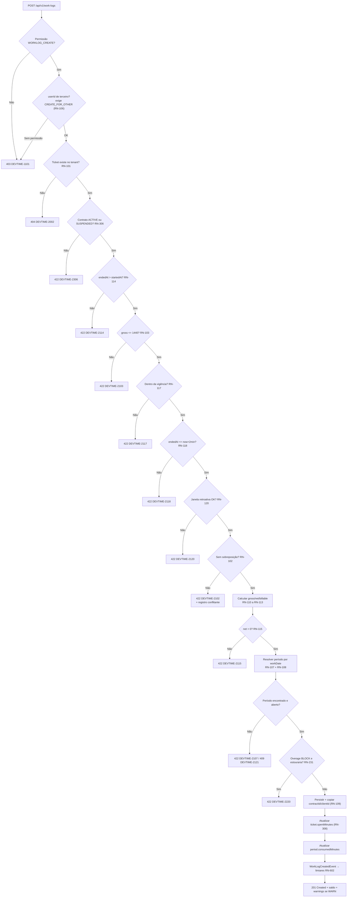
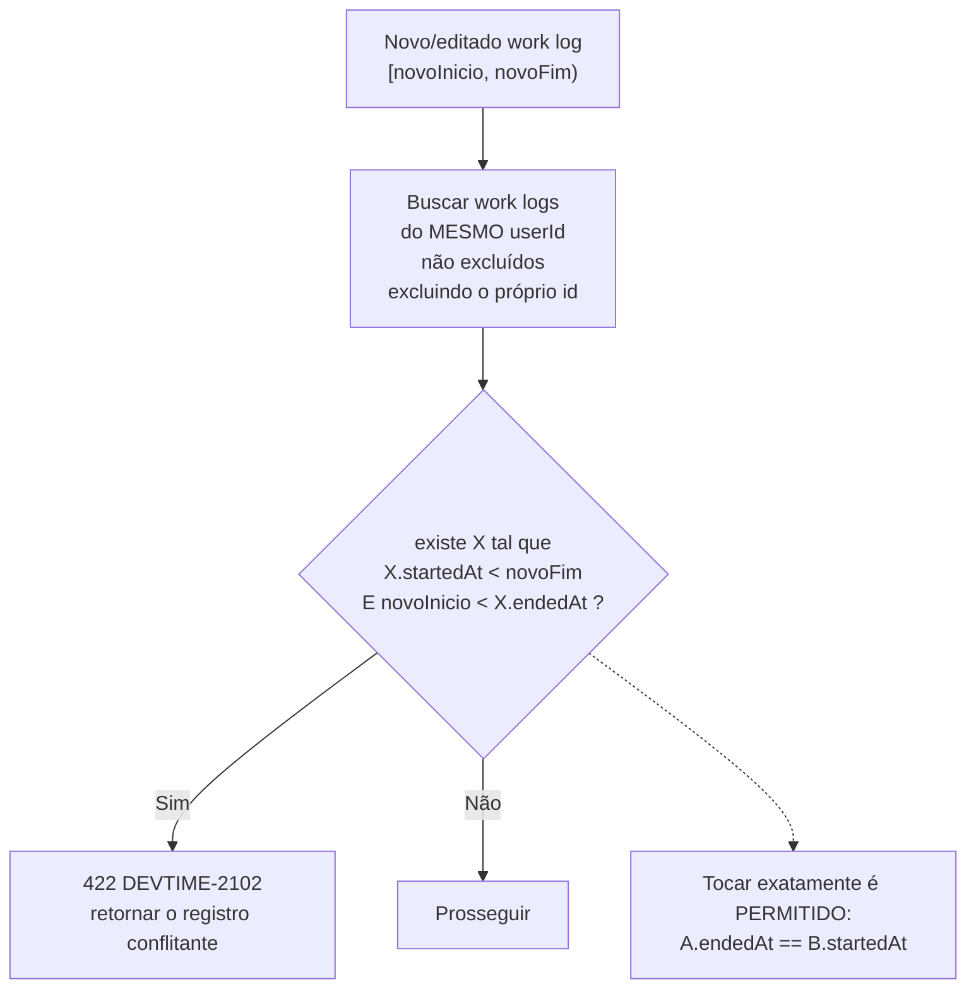
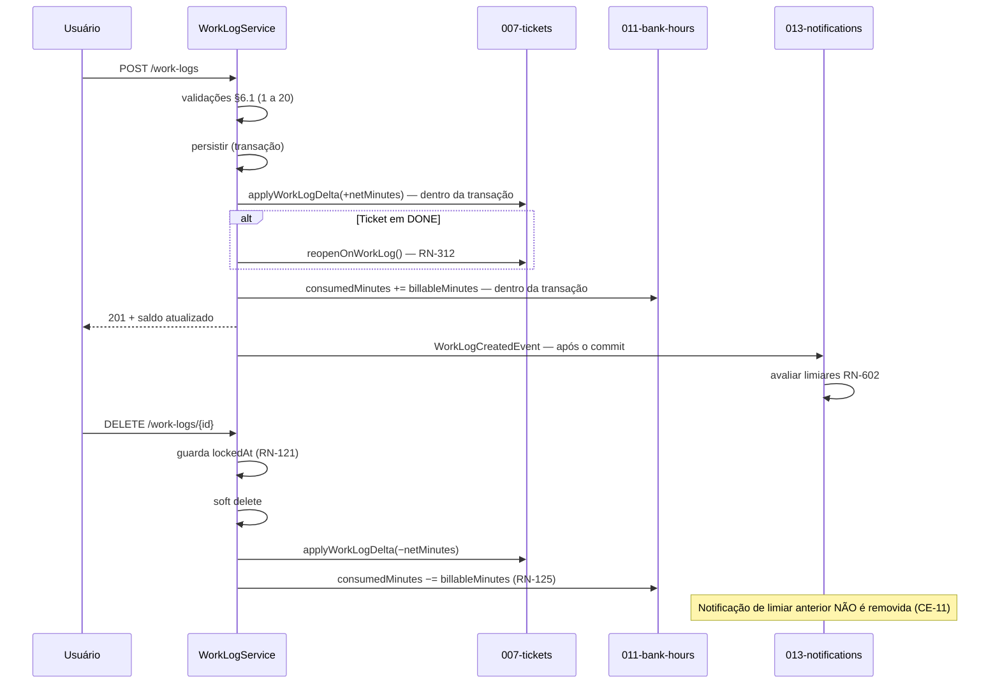

# 008 — Work Logs

| Campo | Valor |
|---|---|
| **Feature** | 008 |
| **Épico** | EP-07 (Registro de Horas e Cronômetro) |
| **Sprint** | S5 |
| **Prioridade** | P0 |
| **Complexidade** | **Crítica** |
| **Estimativa** | 40 pts · 10 dias-agente |
| **Stories** | US-080, US-088 a US-097, US-104, US-105 |
| **Status** | SPEC_APPROVED |

## 1. Objetivo

Registrar, editar e excluir sessões de trabalho vinculadas a um ticket, aplicando integralmente as regras temporais, de cálculo e de alocação em período, e propagando os totais para ticket e contrato.

## 2. Problema que resolve

`WorkLog` é a entidade mais crítica do sistema (§6.13 de `entities.md`). Ela é o dado que o cliente compra, o número que aparece na fatura e a linha do relatório que sustenta uma conversa contratual. Todo o resto do DevTime existe para produzir, proteger ou explicar work logs.

Duas classes de erro tornam esta feature crítica — não por dificuldade, mas por consequência:

| Erro | Consequência |
|---|---|
| **Sobreposição não detectada (RN-102)** | Superfaturamento acidental: a mesma hora cobrada duas vezes. É a falha que destrói a confiança do cliente de forma irrecuperável (RP-01) |
| **Alocação no período errado (RN-107)** | Horas aparecem no mês errado; um relatório já entregue passa a divergir do saldo |

Por isso a complexidade é `Crítica` e SQ-02 se aplica: as suítes de sobreposição e de cálculo são escritas **antes** do código.

## 3. Escopo

| # | Item | Referência |
|---|---|---|
| E-01 | CRUD de work log com soft delete | §6.13 `entities.md` |
| E-02 | Vínculo obrigatório a ticket | RN-101 |
| E-03 | Detecção de sobreposição por usuário, com intervalos semi-abertos | RN-102 |
| E-04 | Limite de 24 horas por sessão | RN-103 |
| E-05 | Categoria obrigatória, com cadeia de pré-seleção | RN-104 |
| E-06 | Descrição obrigatória de 3 a 2.000 caracteres | RN-105 |
| E-07 | Lançamento em nome de outro membro | RN-106 |
| E-08 | Resolução automática do período por `workDate` | RN-107 |
| E-09 | Atribuição de sessão que atravessa a meia-noite à data de início | RN-108 |
| E-10 | Cópia imutável de `contractId` e `clientId` do ticket | RN-109 |
| E-11 | Cálculo de `grossMinutes`, `netMinutes` e `billableMinutes` | RN-110 a RN-112 |
| E-12 | Arredondamento para baixo configurável | RN-113 |
| E-13 | Validações temporais completas | RN-114 a RN-120 |
| E-14 | Bloqueio de edição em período fechado | RN-121 |
| E-15 | Regras de edição e exclusão por papel e ownership | RN-122 |
| E-16 | Recálculo de totais de ticket e período | RN-123, RN-125 |
| E-17 | Restrição de movimentação entre períodos | RN-124 |
| E-18 | Imutabilidade de `source` e `timerId` | RN-126 |
| E-19 | Aplicação da política de excedente na criação | RN-231 a RN-234 |
| E-20 | Duplicação de registro e validação prévia sem persistir | §5 `worklogs.md` |
| E-21 | Calendário e totais agregados | §7, §8 `worklogs.md` |
| E-22 | Telas P21, P22 e P23 | `pages.md` |

## 4. Fora do escopo

| Item | Onde está | Motivo |
|---|---|---|
| Cronômetro | `009-timer` | O timer é uma **forma de capturar** um work log; ele reusa integralmente estas validações (RN-159) |
| Cálculo de saldo, extrato e ajustes | `011-bank-hours` | Esta feature **atualiza** `consumedMinutes`; a aritmética do saldo é de `011` |
| Fechamento de período e `lockedAt` | `011-bank-hours` | Esta feature **respeita** `lockedAt` (RN-121); quem o preenche é `011` |
| Geração de períodos | `004-contracts` | Esta feature **resolve** o período existente (RN-107) |
| Relatórios e exportação | `012-reports` | É saída |
| Notificações de limiar | `013-notifications` | Esta feature publica o evento; `013` avalia e entrega |
| Aprovação de horas | F5 | `permissions.md` §14: `approvalStatus` e `WORKLOG_APPROVE` são pós-MVP |
| Importação em massa | Fora do MVP | `source = IMPORT` já existe no enum, sem caminho de entrada |
| Sugestão automática por IA | `future/020-ai` | `source = AI_SUGGESTION` reservado |

## 5. Dependências

### 5.1 Features
| Feature | Tipo | O que consome |
|---|---|---|
| `007-tickets` | Bloqueante | `TicketService.getForWorkLog` (RN-101, RN-109), `applyWorkLogDelta` (RN-308), `reopenOnWorkLog` (RN-312) |
| `004-contracts` | Bloqueante | `ContractPeriodService.resolveOpenPeriod` (RN-107), vigência (RN-117), política de excedente (RN-231) |
| `005-categories` | Bloqueante | `CategoryService.resolveDefault` e `getActiveById` (RN-104), `billableByDefault` (RN-112) |
| `006-tags` | Bloqueante | `TagLinkService.linkToWorkLog` (INV-TAG-01) |
| `002-users` | Bloqueante | `tenant.settings` (`roundingMinutes`, `retroactiveLimitDays`, `allowFutureWorkLogs`), fuso |
| `009-timer` | Consumidora | Reusa integralmente `WorkLogService.create` (RN-159) |
| `011-bank-hours` | Consumidora | Consome `consumedMinutes`; preenche `lockedAt` |
| `010`, `012`, `013` | Consumidoras | Agregações, relatórios e alertas |

### 5.2 Documentos obrigatórios
| Documento | Seções relevantes |
|---|---|
| `docs/04-api/worklogs.md` | §5 a §8 |
| `docs/02-domain/entities.md` | §6.13 WorkLog, §7.2 DateRange |
| `docs/02-domain/business-rules.md` | RN-101 a RN-126, RN-231 a RN-234, RN-009 a RN-011 |
| `docs/02-domain/state-machines.md` | §5 efeitos cruzados, §4.6 ContractPeriod |
| `docs/02-domain/permissions.md` | §6.6, §7, §9, OWN-01, OWN-02 |
| `docs/05-ui/pages.md` | P21, P22, P23 |

### 5.3 Infraestrutura
| Componente | Uso |
|---|---|
| PostgreSQL | `work_logs`, `work_log_tags`; índice dedicado de sobreposição |
| Fuso horário do tenant | Conversão de `workDate` (RN-009, ART-031) |

## 6. Regras de negócio

| ID | Tipo | Enunciado resumido | Erro | Onde é aplicada |
|---|---|---|---|---|
| RN-101 | Bloqueante | Todo work log pertence a um ticket | `DEVTIME-2100` / 422 | `WorkLogService.create` |
| RN-102 | Bloqueante | Sessões do mesmo usuário não se sobrepõem; intervalos `[início, fim)` | `DEVTIME-2102` / 422 | `OverlapDetector` |
| RN-103 | Bloqueante | `grossMinutes` ≤ 1.440 | `DEVTIME-2103` / 422 | `WorkLogValidator` |
| RN-104 | Bloqueante | Categoria válida e ativa; cadeia de pré-seleção | `DEVTIME-2104` / 422 | `CategoryService` |
| RN-105 | Bloqueante | Descrição de 3 a 2.000 caracteres após aparar | `DEVTIME-2105` / 422 | Bean Validation + service |
| RN-106 | Bloqueante | `userId` é o autenticado, salvo `MANAGER`/`ADMIN`/`OWNER` lançando por membro ativo | `DEVTIME-1101` / 403 | `WorkLogOwnershipPolicy` |
| RN-107 | Automática | `contractPeriodId` resolvido pelo período que contém `workDate`; sem período, rejeita | `DEVTIME-2107` / 422 | `ContractPeriodService` |
| RN-108 | Automática | Sessão que atravessa a meia-noite pertence à data de **início** | — | `WorkDateResolver` |
| RN-109 | Automática | `contractId` e `clientId` copiados do ticket e **nunca** mudam | — | `WorkLogService.create` |
| RN-110 | Automática | `grossMinutes = floor((endedAt − startedAt)/60)` | — | `WorkLogCalculator` |
| RN-111 | Automática | `netMinutes = grossMinutes − pausedMinutes` | — | `WorkLogCalculator` |
| RN-112 | Automática | `billableMinutes = billable ? netMinutes : 0` | — | `WorkLogCalculator` |
| RN-113 | Automática | `roundingMinutes > 0` arredonda `netMinutes` **para baixo** | — | `RoundingPolicy` |
| RN-114 | Bloqueante | `endedAt > startedAt` | `DEVTIME-2114` / 422 | `WorkLogValidator` |
| RN-115 | Bloqueante | `netMinutes > 0` | `DEVTIME-2115` / 422 | `WorkLogValidator` |
| RN-116 | Bloqueante | `0 ≤ pausedMinutes < grossMinutes` | `DEVTIME-2116` / 422 | `WorkLogValidator` |
| RN-117 | Bloqueante | `startedAt` dentro da vigência do contrato | `DEVTIME-2117` / 422 | `ContractValidityValidator` |
| RN-118 | Bloqueante | `endedAt` não no futuro, com tolerância de 2 minutos | `DEVTIME-2118` / 422 | `WorkLogValidator` |
| RN-119 | Bloqueante | `workDate` futura só com `allowFutureWorkLogs` | `DEVTIME-2119` / 422 | `WorkLogValidator` |
| RN-120 | Bloqueante | Retroativo até `retroactiveLimitDays`; além, exige `ADMIN`/`OWNER` | `DEVTIME-2120` / 422 | `RetroactiveWindowPolicy` |
| RN-121 | Bloqueante | `lockedAt ≠ null` impede edição e exclusão | `DEVTIME-2121` / 409 | `LockedPeriodGuard` |
| RN-122 | Bloqueante | Autor edita o próprio; `MANAGER`+ edita de qualquer membro; `VIEWER` não edita | `DEVTIME-1101` / 403 | `WorkLogOwnershipPolicy` |
| RN-123 | Automática | Edição incrementa `editCount`, audita e recalcula os desnormalizados | — | `WorkLogService.update` |
| RN-124 | Bloqueante | Mudar `workDate` entre períodos exige **ambos** abertos | `DEVTIME-2124` / 409 | `PeriodTransferGuard` |
| RN-125 | Automática | Exclusão é lógica, devolve saldo ao período e reduz `ticket.spentMinutes` | — | `WorkLogService.delete` |
| RN-126 | Bloqueante | `source` e `timerId` são imutáveis | `DEVTIME-2003` / 422 | `WorkLogService.update` |
| RN-231 | Bloqueante | `OveragePolicy = BLOCK` rejeita o registro que estouraria o saldo | `DEVTIME-2220` / 422 | `OveragePolicyEvaluator` |
| RN-232 | **Aviso** | `WARN` permite e retorna `warnings[]` com `DEVTIME-2221` | — | `OveragePolicyEvaluator` |
| RN-233 | Automática | `ALLOW_BILLABLE` permite e marca o excedente para cobrança | — | `OveragePolicyEvaluator` |
| RN-234 | Automática | Em `BLOCK`, o registro **não** é dividido automaticamente | — | `OveragePolicyEvaluator` |
| RN-306 | Bloqueante | Contrato `ENDED`/`CANCELLED` não aceita registro | `DEVTIME-2306` / 422 | `TicketService.getForWorkLog` |
| RN-009 | Automática | Instantes em UTC; datas no fuso do tenant | — | Toda a feature |
| RN-010 | Automática | Durações em minutos inteiros; segundos **truncados** | — | `WorkLogCalculator` |
| RN-003 | Automática | Exclusão é lógica | — | Todas |
| RN-004 | Bloqueante | Alteração exige `version` | `DEVTIME-2004` / 409 | Edições |
| RN-012 | Bloqueante | Listagem paginada, `size` máximo 100 | `DEVTIME-2006` / 400 | `WorkLogController` |
| RN-001 / RN-002 | Bloqueante | Tenant do usuário; recurso externo retorna `404` | `DEVTIME-1200` / `2002` | Filtro automático |
| RN-006 | Automática | Toda alteração gera `AuditLog` na mesma transação | — | Todas |

### 6.1 Ordem de aplicação — criação de work log

A ordem é **normativa** (SV-03) e reproduz o fluxograma da §5.5 de `business-rules.md`.

| # | Verificação | Falha |
|---|---|---|
| 1 | Autenticado | `401 DEVTIME-1001` |
| 2 | Permissão `WORKLOG_CREATE` | `403 DEVTIME-1101` |
| 3 | `userId` de terceiro exige `WORKLOG_CREATE_FOR_OTHER` (RN-106) | `403 DEVTIME-1101` |
| 4 | Ticket existe no tenant (RN-101) | `404 DEVTIME-2002` |
| 5 | Contrato `ACTIVE` ou `SUSPENDED` (RN-306) | `422 DEVTIME-2306` |
| 6 | `endedAt > startedAt` (RN-114) | `422 DEVTIME-2114` |
| 7 | `grossMinutes ≤ 1440` (RN-103) | `422 DEVTIME-2103` |
| 8 | Dentro da vigência do contrato (RN-117) | `422 DEVTIME-2117` |
| 9 | `endedAt ≤ now + 2 min` (RN-118) | `422 DEVTIME-2118` |
| 10 | `workDate` futura permitida (RN-119) | `422 DEVTIME-2119` |
| 11 | Janela retroativa (RN-120) | `422 DEVTIME-2120` |
| 12 | **Sem sobreposição** (RN-102) | `422 DEVTIME-2102` + o registro conflitante |
| 13 | Calcular `gross`, `paused`, `net`, `billable` (RN-110 a RN-113) | — |
| 14 | `pausedMinutes` coerente (RN-116) | `422 DEVTIME-2116` |
| 15 | `netMinutes > 0` (RN-115) | `422 DEVTIME-2115` |
| 16 | Categoria válida e ativa (RN-104) | `422 DEVTIME-2104` |
| 17 | Descrição de 3 a 2.000 caracteres (RN-105) | `422 DEVTIME-2105` |
| 18 | Resolver período por `workDate` (RN-107) | `422 DEVTIME-2107` |
| 19 | Período está `OPEN` ou `REOPENED` | `409 DEVTIME-2121` |
| 20 | Política de excedente (RN-231) | `422 DEVTIME-2220` se `BLOCK` |
| 21 | Persistir; copiar `contractId` e `clientId` (RN-109) | — |
| 22 | Vincular tags (INV-TAG-01) | `422 DEVTIME-2313` |
| 23 | Atualizar `ticket.spentMinutes` (RN-308) e reabrir se `DONE` (RN-312) | — |
| 24 | Atualizar `period.consumedMinutes` | — |
| 25 | Publicar `WorkLogCreatedEvent`; avaliar limiares (RN-602) | — |
| 26 | `201 Created` com o saldo atualizado e `warnings[]` se `WARN` | — |

**Por que a sobreposição (12) precede o cálculo (13):** a detecção usa apenas `startedAt` e `endedAt`, disponíveis na entrada. Calcular antes desperdiçaria trabalho no caso mais comum de rejeição. E porque a mensagem "já existe um registro neste intervalo" é mais acionável que "tempo líquido inválido" quando ambas se aplicam.

**Por que a resolução do período (18) vem depois das validações temporais:** é a única verificação que exige consulta a outra feature. Todas as validações puras ocorrem antes, para que uma requisição obviamente inválida não gere I/O.

**Por que a política de excedente (20) é a última:** ela depende do `billableMinutes` calculado (13) e do período resolvido (18). É também a única regra cujo resultado pode ser um **aviso** em vez de erro (RN-232), e precisa do registro pronto para compor a resposta.

### 6.2 Detecção de sobreposição (RN-102)

**Definição normativa.** Dois work logs A e B do **mesmo usuário** se sobrepõem se, e somente se:

```
A.startedAt < B.endedAt  E  B.startedAt < A.endedAt
```

Os intervalos são **semi-abertos** `[início, fim)`. Sessões que se tocam exatamente (`A.endedAt == B.startedAt`) **são permitidas**.

**Tabela normativa** (reproduz o diagrama Gantt da §5.2 de `business-rules.md`):

| # | Sessão existente | Nova sessão | Resultado | Motivo |
|:--:|---|---|:--:|---|
| 1 | 09:00–11:00 | 11:00–12:00 | ✅ Permitido | Tocam-se exatamente; intervalo semi-aberto |
| 2 | 09:00–11:00 | 13:00–14:00 | ✅ Permitido | Sem interseção |
| 3 | 09:00–11:00 | 08:00–09:00 | ✅ Permitido | Toca pelo início |
| 4 | 09:00–11:00 | 09:30–10:30 | ❌ Rejeitado | Contida |
| 5 | 09:00–11:00 | 10:00–12:00 | ❌ Rejeitado | Parcial à direita |
| 6 | 09:00–11:00 | 08:00–10:00 | ❌ Rejeitado | Parcial à esquerda |
| 7 | 09:00–11:00 | 08:00–15:00 | ❌ Rejeitado | Envolve |
| 8 | 09:00–11:00 | 09:00–11:00 | ❌ Rejeitado | Idêntica |
| 9 | 09:00–11:00 | 10:59–11:01 | ❌ Rejeitado | Sobreposição de 1 minuto |

**Escopo da verificação:**

| Dimensão | Regra |
|---|---|
| Usuário | Apenas do **mesmo** `userId`. Dois usuários no mesmo ticket ao mesmo tempo são permitidos (CE-07) |
| Tenant | Restrita ao tenant corrente. **Limitação conhecida** — ver OB-03 |
| Excluídos | Work logs com `deletedAt` são ignorados |
| Próprio registro | Na edição, o próprio id é excluído da comparação |
| Ticket | Irrelevante: a sobreposição é por pessoa, não por ticket |

### 6.3 Cálculo (RN-110 a RN-113)

| # | Passo | Fórmula |
|---|---|---|
| 1 | `grossMinutes` | `floor((endedAt − startedAt) em segundos / 60)` — segundos **truncados**, nunca arredondados (RN-010) |
| 2 | `netMinutes` bruto | `grossMinutes − pausedMinutes` |
| 3 | Arredondamento | Se `roundingMinutes > 0`: `netMinutes = floor(netMinutes / r) × r` — sempre **para baixo** (PR-03) |
| 4 | `billableMinutes` | `billable ? netMinutes : 0` |

**Tabela normativa de cálculo** (reproduz §5.3 de `business-rules.md`):

| Cenário | `startedAt` | `endedAt` | Pausas | `gross` | `paused` | `net` | `billable` | Consome saldo |
|---|---|---|---|---:|---:|---:|:--:|---:|
| Normal | 09:00:00 | 11:30:00 | — | 150 | 0 | 150 | ✔ | 150 |
| Com segundos | 09:00:00 | 11:30:59 | — | 150 | 0 | 150 | ✔ | 150 |
| Com pausa | 09:00:00 | 12:00:00 | 25 | 180 | 25 | 155 | ✔ | 155 |
| Não faturável | 14:00:00 | 15:00:00 | — | 60 | 0 | 60 | ✖ | 0 |
| Arredondamento 15 | 09:00:00 | 10:52:00 | — | 112 | 0 | **105** | ✔ | 105 |
| Atravessa meia-noite | 22:00 (d10) | 01:30 (d11) | — | 210 | 0 | 210 | ✔ | 210 (`workDate = d10`) |
| Inválido — 25h | 08:00 (d10) | 09:00 (d11) | — | 1500 | — | — | — | ❌ RN-103 |
| Inválido — pausa total | 09:00 | 10:00 | 60 | 60 | 60 | 0 | — | ❌ RN-115 |

> **Arredondamento para cima é proibido (PR-03).** Cobrar tempo não trabalhado é a violação de confiança mais direta que o produto poderia cometer. `roundingMinutes = 0` desativa o arredondamento e é o padrão.

### 6.4 Resolução de `workDate` e do período (RN-107, RN-108)

| # | Passo | Regra |
|---|---|---|
| 1 | Converter `startedAt` (UTC) para o fuso do tenant | RN-009, ART-031 |
| 2 | `workDate` = **data local de `startedAt`** | RN-108 |
| 3 | Localizar o período do contrato cujo `[startDate, endDate]` **fechado** contém `workDate` | RN-107, §7.2 `entities.md` |
| 4 | Nenhum período encontrado → rejeitar | `DEVTIME-2107` |
| 5 | Período encontrado mas não `OPEN`/`REOPENED` → rejeitar | `DEVTIME-2121` |

**Por que a data de início, e não a de fim (RN-108):** uma sessão das 22h às 01h30 é uma única narrativa de trabalho. Dividi-la em dois registros produziria duas descrições duplicadas e confundiria o cliente; atribuí-la ao dia seguinte deslocaria o trabalho de uma noite de terça para quarta. Atribuir ao início preserva a narrativa e é previsível.

**Consequência (CE-02):** uma sessão que atravessa a virada do período de contrato pertence integralmente ao período que contém `workDate` — ou seja, ao período da data de **início**.

### 6.5 Invariantes envolvidas
| ID | Invariante | Como é garantida |
|---|---|---|
| INV-WKL-01 | `endedAt > startedAt` | RN-114 + `CHECK` |
| INV-WKL-02 | `netMinutes > 0` | RN-115 + `CHECK` |
| INV-WKL-03 | `grossMinutes ≤ 1440` | RN-103 + `CHECK` |
| INV-WKL-04 | `0 ≤ pausedMinutes < grossMinutes` | RN-116 + `CHECK` |
| INV-WKL-05 | Nenhuma sobreposição por `userId` | `OverlapDetector` + índice dedicado |
| INV-WKL-06 | `contractId` e `clientId` derivam de `ticketId` na criação | RN-109; campos 🔒 |
| INV-WKL-07 | `lockedAt ≠ null` ⇒ registro imutável | `LockedPeriodGuard` (RN-121) |
| INV-WKL-08 | `contractPeriodId` corresponde ao período que contém `workDate` | RN-107 + reconciliação |
| INV-WKL-09 | `source = TIMER` ⇒ `timerId` não nulo | `CHECK` |

## 7. Fluxo principal — registro manual

1. Usuário com `WORKLOG_CREATE` abre P23, a partir de P21, P22 ou do detalhe de um ticket.
2. Seleciona o ticket — a lista mostra apenas tickets de contratos que aceitam registro (RN-306).
3. Informa data, hora de início, hora de fim, pausas, descrição, categoria, faturável e tags.
4. A categoria vem pré-selecionada pela cadeia de RN-104; `billable` vem de `category.billableByDefault`.
5. O front calcula e exibe `net` em tempo real, espelhando RN-110 a RN-113 (FM-02).
6. Opcionalmente, chama `POST /work-logs/validate` para verificar sobreposição e saldo **sem persistir**.
7. Envia `POST /api/v1/work-logs`.
8. `WorkLogService` aplica a ordem da §6.1 integralmente.
9. Persiste com `source = MANUAL`, copiando `contractId` e `clientId` do ticket (RN-109).
10. Atualiza `ticket.spentMinutes` e `period.consumedMinutes` na mesma transação.
11. Se o ticket estava `DONE`, reabre (RN-312).
12. Publica `WorkLogCreatedEvent` após o commit; `013` avalia os limiares (RN-602).
13. Retorna `201` com o saldo atualizado do período e, em `WARN`, `warnings[]` com `DEVTIME-2221`.

## 8. Fluxos alternativos

| # | Fluxo | Gatilho | Comportamento |
|---|---|---|---|
| FA-01 | Validação prévia | Botão "verificar" em P23 | `POST /work-logs/validate` retorna sobreposições, saldo e avisos **sem persistir** |
| FA-02 | Sessão atravessando a meia-noite | `endedAt` no dia seguinte | Aceita; `workDate` = data de início (RN-108); registro único |
| FA-03 | Lançamento em nome de outro | `MANAGER`+ informa `userId` | Exige `WORKLOG_CREATE_FOR_OTHER`; a sobreposição é verificada contra o **membro indicado** |
| FA-04 | Registro não faturável | `billable = false` | `billableMinutes = 0`; não consome saldo; aparece como `nonBillableMinutes` (RN-223) |
| FA-05 | Arredondamento ativo | `roundingMinutes > 0` | `net` arredondado **para baixo**; a UI mostra o valor bruto e o arredondado |
| FA-06 | Excedente com `WARN` | Estouraria o saldo | `201` com `warnings[]`; notificação `CONTRACT_OVERAGE` (RN-232) |
| FA-07 | Excedente com `BLOCK` | Idem | `422 DEVTIME-2220` informando os minutos disponíveis; **sem divisão automática** (RN-234) |
| FA-08 | Excedente com `ALLOW_BILLABLE` | Idem | `201`; excedente marcado para cobrança à `overageRate` (RN-233) |
| FA-09 | Edição do próprio registro | P23 em modo edição | `PATCH` com `version`; revalida a ordem da §6.1 integralmente |
| FA-10 | Edição de registro de terceiro | `MANAGER`+ | Permitida por `WORKLOG_UPDATE_ANY` (RN-122) |
| FA-11 | Edição em período fechado | Registro com `lockedAt` | `409 DEVTIME-2121`; a mensagem orienta a solicitar reabertura |
| FA-12 | Mudança de `workDate` entre períodos | Alteração da data | Exige **ambos** os períodos abertos (RN-124); recalcula os dois |
| FA-13 | Exclusão | P21 ou P23 | Soft delete; devolve saldo ao período e reduz `ticket.spentMinutes` (RN-125) |
| FA-14 | Duplicação | P21 | `POST /work-logs/{id}/duplicate`; copia ticket, categoria, descrição e duração; **exige** novo horário, revalidando RN-102 |
| FA-15 | Calendário | P22 | `GET /work-logs/calendar`; agregação por dia no fuso do tenant |
| FA-16 | Totais agregados | P21 | `GET /work-logs/totals` com os filtros aplicados |
| FA-17 | Lançamento retroativo além da janela | `workDate` antiga | Permitido só para `ADMIN`/`OWNER` (RN-120) |
| FA-18 | Registro sem período correspondente | `workDate` fora de todo período | `422 DEVTIME-2107`; a mensagem indica o intervalo coberto |
| FA-19 | `MEMBER` consultando registros | P21 | Vê **apenas os próprios** (§9 `permissions.md`) |
| FA-20 | Registro gerado por timer | `009-timer` | `source = TIMER`, `timerId` preenchido; ambos imutáveis (RN-126) |

## 9. Diagramas

### 9.1 Fluxo completo de criação (§6.1)



### 9.2 Regra de sobreposição (RN-102)



### 9.3 Efeitos cruzados na criação e exclusão



## 10. Estados

`WorkLog` **não possui campo `status`** nem máquina de estados. Seus estados são derivados de dois campos:

| Estado (derivado) | Condição | Operações permitidas | Operações bloqueadas |
|---|---|---|---|
| Editável | `deletedAt = null` e `lockedAt = null` | Editar, excluir, mover de período (se ambos abertos) | — |
| Travado | `lockedAt ≠ null` (período fechado) | Somente leitura | Editar e excluir (`DEVTIME-2121`) |
| Excluído | `deletedAt ≠ null` | — | Todas. Invisível a toda consulta padrão e a relatórios (RN-704) |

> **Por que não há máquina de estados:** um work log não transiciona — ele é criado, possivelmente editado e possivelmente excluído. `lockedAt` é imposto **de fora**, pelo fechamento do período em `011`, e não por uma ação sobre o work log. Modelar isso como estado próprio criaria uma máquina cujas transições pertencem a outra entidade.

## 11. Transições

| Origem | Destino | Gatilho | Guarda | Efeito | Permissão |
|---|---|---|---|---|---|
| — | Editável | Criação manual | §6.1 integral | Copia `contractId`/`clientId`; atualiza ticket e período | `WORKLOG_CREATE` |
| — | Editável | Criação por timer | RN-159: mesmas validações | `source = TIMER`, `timerId` preenchido | `TIMER_USE` |
| Editável | Editável | Edição | §6.1 revalidada; RN-121; RN-124 se mudar de período | `editCount++`; recalcula desnormalizados (RN-123) | `WORKLOG_UPDATE_OWN`/`_ANY` |
| Editável | Travado | Fechamento do período | Executado por `011` | `lockedAt = now()` | `PERIOD_CLOSE` (em `011`) |
| Travado | Editável | Reabertura do período | Executado por `011` | `lockedAt = null` | `PERIOD_REOPEN` (em `011`) |
| Editável | Excluído | Exclusão | `lockedAt = null` (RN-121) | Devolve saldo; reduz `ticket.spentMinutes` (RN-125) | `WORKLOG_DELETE_OWN`/`_ANY` |

### 11.1 Transições proibidas

| Transição | Motivo da proibição |
|---|---|
| Editar ou excluir com `lockedAt ≠ null` | RN-121, ART-005. Um relatório entregue ao cliente não muda silenciosamente. A correção exige reabertura formal e auditada do período |
| Mover `workDate` para período fechado | RN-124. Alteraria um relatório já emitido |
| Alterar `contractId` ou `clientId` | RN-109, INV-WKL-06. Um relatório passado não pode mudar porque um ticket foi reclassificado hoje (ART-005) |
| Alterar `source` ou `timerId` | RN-126. A métrica "% de horas via timer" precisa ser confiável; converter manual em timer a corromperia |
| Criar sobreposto | RN-102, INV-WKL-05. Superfaturamento acidental |
| Criar com `netMinutes = 0` | RN-115. Registro vazio polui o relatório sem informar nada |
| Divisão automática ao estourar o saldo | RN-234, PR-03. O sistema nunca decide sozinho quanto do trabalho é faturável |
| Arredondar para cima | RN-113, PR-03. Cobrar tempo não trabalhado |
| Excluir fisicamente | RN-003, ART-051 |

## 12. Casos de erro

| Código | HTTP | Situação | Mensagem ao usuário | Regra |
|---|:--:|---|---|---|
| `DEVTIME-1101` | 403 | Papel sem permissão, ou ownership violado | Você não tem permissão para esta ação | RN-106, RN-122 |
| `DEVTIME-2002` | 404 | Ticket ou registro de outro tenant, ou fora do escopo | Recurso não encontrado | RN-002, CE-P-04 |
| `DEVTIME-2003` | 422 | Alteração de `source`, `timerId`, `contractId` ou `clientId` | Este campo não pode ser alterado | RN-109, RN-126 |
| `DEVTIME-2004` | 409 | Conflito de `version` | O registro foi alterado. Recarregue e tente novamente | RN-004 |
| `DEVTIME-2006` | 400 | `size` acima de 100 | Tamanho de página inválido | RN-012 |
| `DEVTIME-2100` | 422 | Ticket ausente | Ticket é obrigatório para registrar horas | RN-101 |
| `DEVTIME-2102` | 422 | Sobreposição | Já existe um registro de horas neste intervalo | RN-102 |
| `DEVTIME-2103` | 422 | Sessão acima de 24h | A sessão não pode ultrapassar 24 horas | RN-103 |
| `DEVTIME-2104` | 422 | Categoria inválida ou inativa | Categoria inválida ou inativa | RN-104 |
| `DEVTIME-2105` | 422 | Descrição ausente ou curta | Descrição obrigatória (mínimo 3 caracteres) | RN-105 |
| `DEVTIME-2107` | 422 | Nenhum período para a data | Não há período de contrato para esta data | RN-107 |
| `DEVTIME-2114` | 422 | `endedAt ≤ startedAt` | A hora final deve ser posterior à inicial | RN-114 |
| `DEVTIME-2115` | 422 | `netMinutes ≤ 0` | O tempo líquido deve ser maior que zero | RN-115 |
| `DEVTIME-2116` | 422 | `pausedMinutes` inválido | Tempo de pausa inválido | RN-116 |
| `DEVTIME-2117` | 422 | Fora da vigência | Data fora da vigência do contrato | RN-117 |
| `DEVTIME-2118` | 422 | `endedAt` no futuro | Não é possível registrar horas no futuro | RN-118 |
| `DEVTIME-2119` | 422 | `workDate` futura não permitida | Registro com data futura não permitido | RN-119 |
| `DEVTIME-2120` | 422 | Fora da janela retroativa | Fora da janela de lançamento retroativo | RN-120 |
| `DEVTIME-2121` | 409 | Período fechado | Registro pertence a período fechado | RN-121 |
| `DEVTIME-2124` | 409 | Período de destino fechado | Período de destino está fechado | RN-124 |
| `DEVTIME-2220` | 422 | Saldo insuficiente com `BLOCK` | Saldo insuficiente no contrato | RN-231 |
| `DEVTIME-2221` | 201 | **Aviso** de excedente com `WARN` | Aviso: saldo do contrato excedido | RN-232 |
| `DEVTIME-2306` | 422 | Contrato encerrado | Contrato encerrado não aceita registros | RN-306 |
| `DEVTIME-2313` | 422 | 11ª tag | Máximo de 10 etiquetas | INV-TAG-01 |
| `DEVTIME-1201` | 403 | Escrita em tenant suspenso | Organização suspensa: apenas leitura | RN-007 |

### 12.1 Casos extremos

| # | Caso | Comportamento esperado |
|---|---|---|
| CX-01 | Sessão atravessa a meia-noite | `workDate` = data de início; registro único, sem divisão (RN-108, CE-01) |
| CX-02 | Sessão atravessa a virada do período | Alocada ao período que contém `workDate`, ou seja, o do início (CE-02) |
| CX-03 | Horário de verão — hora repetida | Instantes em UTC eliminam a ambiguidade; a duração calculada é a real decorrida (CE-03) |
| CX-04 | Horário de verão — hora inexistente | Idem; `workDate` usa a regra de transição da IANA (CE-04) |
| CX-05 | Work log de 1 minuto | Permitido; `netMinutes > 0` é o único critério (CE-08) |
| CX-06 | Duas sessões que se tocam exatamente | Permitidas (RN-102, caso 1 da §6.2) |
| CX-07 | Sobreposição de exatamente 1 minuto | Rejeitada (caso 9 da §6.2) |
| CX-08 | Dois usuários no mesmo ticket ao mesmo tempo | Permitido — RN-102 restringe por usuário (CE-07) |
| CX-09 | `endedAt` 1 minuto no futuro | Aceito — tolerância de 2 minutos para diferença de relógio (RN-118) |
| CX-10 | `endedAt` 3 minutos no futuro | Rejeitado (`DEVTIME-2118`) |
| CX-11 | Sessão de exatamente 1.440 minutos | Aceita; 1.441 rejeitada (RN-103) |
| CX-12 | Pausas iguais ao tempo bruto | Rejeitado por RN-116 antes de RN-115 |
| CX-13 | Arredondamento de 15 min sobre 112 min | Resulta em 105, nunca 120 (RN-113) |
| CX-14 | Arredondamento que zera o líquido | Sessão de 10 min com `roundingMinutes = 15` → `net = 0` → rejeitado por RN-115. **Comportamento correto** e contraintuitivo — ver OB-05 |
| CX-15 | Descrição com 3 e com 2.000 caracteres | Ambas aceitas; 2 e 2.001 rejeitadas |
| CX-16 | Descrição só com espaços | Rejeitada — a validação ocorre após aparar as bordas (RN-105) |
| CX-17 | Edição que cria sobreposição com outro registro | Rejeitada; o próprio id é excluído da comparação |
| CX-18 | Edição de `workDate` para período aberto diferente | Permitida; ambos os períodos recalculados (RN-124) |
| CX-19 | Edição de `workDate` para período fechado | `409 DEVTIME-2124` |
| CX-20 | Exclusão derruba o consumo abaixo de um limiar notificado | A notificação anterior **não** é removida; o `dedupeKey` impede novo alerta se subir de novo (CE-11) |
| CX-21 | Registro com `billable = false` estourando o saldo | Não estoura: `billableMinutes = 0` não consome saldo (RN-112, RN-223) |
| CX-22 | `BLOCK` com saldo faltando 5 minutos | Rejeitado integralmente; **nenhuma divisão automática** (RN-234) |
| CX-23 | Contrato `HOURLY_OPEN` | `availableMinutes = 0`; `consumptionRate` sempre 0; nenhum alerta nem bloqueio (CE-10) |
| CX-24 | Lançamento em período `REOPENED` | Permitido — `REOPENED` aceita work log como `OPEN` (§4.6 SM) |
| CX-25 | `MANAGER` lança em nome de membro suspenso | Rejeitado — RN-106 exige membro **ativo** |
| CX-26 | Contrato `SUSPENDED` | Aceita apenas registro retroativo dentro da vigência (RN-306) |
| CX-27 | Timer encerrado gerando work log inválido | O work log falha e **o timer permanece ativo** (RN-160, tratado em `009`) |
| CX-28 | Duplicação com o mesmo horário | Rejeitada por RN-102 — a duplicação exige novo horário (FA-14) |
| CX-29 | Usuário com 100.000 work logs | A detecção de sobreposição continua < 50 ms pelo índice dedicado |
| CX-30 | Registro criado em período que fecha em seguida | O registro é travado pelo fechamento; edições posteriores exigem reabertura |

## 13. Modelo de dados

### 13.1 Entidades impactadas
| Entidade | Operação | Tabela | Referência |
|---|---|---|---|
| `WorkLog` | Cria, lê, atualiza, soft delete | `work_logs` | §6.13 |
| *(vínculo)* | Cria, remove | `work_log_tags` | `006-tags` |
| `Ticket` | Atualiza (`spentMinutes`, `status`) | `tickets` | Via `TicketService` |
| `ContractPeriod` | Atualiza (`consumedMinutes`, `nonBillableMinutes`) | `contract_periods` | Via `ContractPeriodService` |
| `Contract` | Lê (vigência, `overagePolicy`) | `contracts` | Via `ContractService` |
| `Category` | Lê (RN-104) | `categories` | Via `CategoryService` |
| `AuditLog` | Cria | `audit_logs` | §6.20 |

### 13.2 Campos obrigatórios na criação
| Campo | Tipo | Origem | Imutável | Validação |
|---|---|---|:--:|---|
| `tenantId` | UUID | `TenantContext` | ✔ 🔒 | Nunca da requisição (ART-021) |
| `ticketId` | UUID | Request | ✖ | Ticket do tenant; contrato aceita registro (RN-101, RN-306) |
| `contractId` | UUID | Do ticket | ✔ 🔒 💾 | Copiado; nunca da requisição (RN-109) |
| `clientId` | UUID | Do contrato | ✔ 🔒 💾 | Idem |
| `contractPeriodId` | UUID | Resolvido | ✖ 💾 | Período que contém `workDate` (RN-107) |
| `userId` | UUID | Autenticado ou informado | ✔ 🔒 | RN-106 |
| `categoryId` | UUID | Request ou cadeia | ✖ | Categoria ativa (RN-104) |
| `workDate` | DATE | Derivado de `startedAt` | ✖ | Data local do início (RN-108) |
| `startedAt` | TIMESTAMPTZ | Request | ✖ | UTC |
| `endedAt` | TIMESTAMPTZ | Request | ✖ | UTC; `> startedAt` (RN-114) |
| `grossMinutes` | int | Calculado | ✖ 💾 | RN-110; ≤ 1440 |
| `pausedMinutes` | int | Request | ✖ | `0 ≤ p < gross` (RN-116) |
| `netMinutes` | int | Calculado | ✖ 💾 | RN-111 + RN-113; `> 0` |
| `description` | Text(2000) | Request | ✖ | 3–2.000 após aparar (RN-105) |
| `billable` | boolean | Request ou categoria | ✖ | Default de `category.billableByDefault` |
| `source` | enum | Sistema | ✔ 🔒 | `MANUAL` ou `TIMER` (RN-126) |
| `timerId` | UUID | Sistema | ✔ 🔒 | Não nulo se `source = TIMER` (INV-WKL-09) |
| `lockedAt` | TIMESTAMPTZ | `011` | ✖ | Nulo na criação |
| `editCount` | int | Sistema | ✖ | `0`; incrementado em cada edição (RN-123) |

### 13.3 Migrations
| Migration | Conteúdo | Compatibilidade |
|---|---|---|
| `V022__create_work_logs.sql` | Tabela `work_logs` + `CHECK` de INV-WKL-01 a 04 e 09 | Nova tabela |
| `V023__work_log_overlap_index.sql` | Índice dedicado `(tenant_id, user_id, started_at, ended_at)` WHERE `deleted_at IS NULL` | Índice crítico |
| `V024__work_log_tags.sql` | `work_log_tags` + `idx_work_log_tags_tag` — **migration incremental de `006`** (CE-O-03) | Nova tabela |
| `V025__work_log_indexes.sql` | Índices de listagem, calendário, período e categoria — inclui `idx_work_logs_category`, requisito de `005` (CE-O-03) | Índices |

### 13.4 Índices
| Índice | Colunas | Sustenta |
|---|---|---|
| `idx_work_logs_overlap` | `(tenant_id, user_id, started_at, ended_at)` WHERE `deleted_at IS NULL` | **RN-102** — o índice mais crítico da feature |
| `idx_work_logs_period` | `(tenant_id, contract_period_id)` WHERE `deleted_at IS NULL` | RN-219, agregação de saldo |
| `idx_work_logs_ticket` | `(tenant_id, ticket_id)` WHERE `deleted_at IS NULL` | RN-308 e listagem por ticket |
| `idx_work_logs_user_date` | `(tenant_id, user_id, work_date DESC)` WHERE `deleted_at IS NULL` | Listagem pessoal e calendário |
| `idx_work_logs_category` | `(tenant_id, category_id)` WHERE `deleted_at IS NULL` | RN-505 e estatística de `005` |
| `idx_work_logs_contract_date` | `(tenant_id, contract_id, work_date)` WHERE `deleted_at IS NULL` | Relatórios de `012` |
| `idx_work_logs_locked` | `(tenant_id, contract_period_id)` WHERE `locked_at IS NULL AND deleted_at IS NULL` | Fechamento em `011` |

> **Sobre uma constraint de exclusão no banco para RN-102.** PostgreSQL suporta `EXCLUDE USING gist` sobre `tstzrange`, como usado em `004` para períodos. Aqui isso **não** é aplicado, porque a exclusão precisaria ser parcial por `user_id` e ignorar registros excluídos — combinação que a constraint suporta, mas que colide com o soft delete: um registro excluído logicamente continua fisicamente na tabela e bloquearia o intervalo. A garantia é, portanto, **da aplicação**, sustentada por `idx_work_logs_overlap` e por teste de concorrência dedicado (R-01). Esta é uma decisão consciente com risco residual documentado — ver OB-02.

## 14. Endpoints utilizados

| Método | Rota | Operação | Permissão | Sucesso | Doc |
|---|---|---|---|:--:|---|
| GET | `/api/v1/work-logs` | Listar com filtros | `WORKLOG_VIEW_OWN`/`_ANY` | 200 | §5 |
| GET | `/api/v1/work-logs/{id}` | Detalhar | `WORKLOG_VIEW_OWN`/`_ANY` | 200 | §5 |
| POST | `/api/v1/work-logs` | Criar | `WORKLOG_CREATE` | 201 | §6 |
| PUT/PATCH | `/api/v1/work-logs/{id}` | Atualizar | `WORKLOG_UPDATE_OWN`/`_ANY` | 200 | §6 |
| DELETE | `/api/v1/work-logs/{id}` | Excluir (lógico) | `WORKLOG_DELETE_OWN`/`_ANY` | 204 | §6 |
| POST | `/api/v1/work-logs/{id}/duplicate` | Duplicar | `WORKLOG_CREATE` | 201 | §6 |
| POST | `/api/v1/work-logs/validate` | Validar sem persistir | `WORKLOG_CREATE` | 200 | §6 |
| GET | `/api/v1/work-logs/calendar` | Agregação por dia | `WORKLOG_VIEW_OWN`/`_ANY` | 200 | §7 |
| GET | `/api/v1/work-logs/totals` | Totais dos filtros | `WORKLOG_VIEW_OWN`/`_ANY` | 200 | §8 |

## 15. Eventos

| Evento | Publicado por | Consumidores | Momento | Efeito |
|---|---|---|---|---|
| `WorkLogCreatedEvent` | `WorkLogService` | `013-notifications`, métricas | Após o commit | Avalia limiares (RN-602); telemetria |
| `WorkLogUpdatedEvent` | `WorkLogService` | `013`, métricas | Após o commit | Reavalia limiares |
| `WorkLogDeletedEvent` | `WorkLogService` | `013`, métricas | Após o commit | Reavalia; **não** remove notificação anterior (CE-11) |
| *(chamada direta)* `TicketTotalsService.applyWorkLogDelta` | `WorkLogService` | `007-tickets` | **Dentro** da transação | RN-308 |
| *(chamada direta)* `TicketTransitionService.reopenOnWorkLog` | `WorkLogService` | `007-tickets` | **Dentro** da transação | RN-312 |
| *(chamada direta)* `ContractPeriodService.applyConsumptionDelta` | `WorkLogService` | `011-bank-hours` | **Dentro** da transação | `consumedMinutes` |

**Justificativa dos momentos.** Os três desnormalizados — `ticket.spentMinutes`, `period.consumedMinutes` e o status do ticket — são atualizados **dentro** da transação, por chamada direta e não por evento assíncrono. Motivo: a resposta `201` já devolve o saldo atualizado (§6.1, passo 26). Se `consumedMinutes` fosse atualizado após o commit, a resposta traria um saldo desatualizado no exato momento em que o usuário mais confia nele. Notificações são publicadas **após** o commit porque envolvem entrega externa (TX-06).

## 16. Permissões

| Operação | Permissão | Papéis | Ownership | Escopo de dados |
|---|---|---|---|---|
| Ver os próprios | `WORKLOG_VIEW_OWN` | Todos os 5 papéis | OWN-01 | — |
| Ver de qualquer membro | `WORKLOG_VIEW_ANY` | OWNER, ADMIN, MANAGER, VIEWER | — | **`MEMBER` não possui**: vê apenas os próprios (§9) |
| Criar para si | `WORKLOG_CREATE` | OWNER, ADMIN, MANAGER, MEMBER | — | — |
| Criar para outro | `WORKLOG_CREATE_FOR_OTHER` | OWNER, ADMIN, MANAGER | Membro de destino **ativo** (RN-106) | — |
| Editar o próprio | `WORKLOG_UPDATE_OWN` | OWNER, ADMIN, MANAGER, MEMBER | OWN-01, OWN-02 | Bloqueado se `lockedAt` |
| Editar de qualquer | `WORKLOG_UPDATE_ANY` | OWNER, ADMIN, MANAGER | Dispensa ownership (OWN-08) | Idem |
| Excluir o próprio | `WORKLOG_DELETE_OWN` | OWNER, ADMIN, MANAGER, MEMBER | OWN-01, OWN-02 | Idem |
| Excluir de qualquer | `WORKLOG_DELETE_ANY` | OWNER, ADMIN, MANAGER | — | Idem |
| Editar em período fechado | `WORKLOG_UPDATE_LOCKED` | OWNER, ADMIN | Apenas **após** reabertura por `011` | — |
| Lançar fora da janela retroativa | — | ADMIN, OWNER (RN-120) | — | — |

> **OWN-01:** o work log pertence ao usuário indicado em `userId`, **não** a quem o criou. Um `MANAGER` que lança em nome de outro membro não se torna dono do registro — o membro é. Isso importa: o membro pode editar o próprio registro criado por terceiro.
>
> **OWN-02:** ownership **não** sobrepõe guardas de estado. O autor não edita um registro com `lockedAt ≠ null` (RN-121). A única saída é a reabertura formal do período.
>
> **`MEMBER` vê apenas os próprios registros** (§9). O filtro é aplicado por `Specification` no repositório (IMP-02), nunca em memória. Um work log de colega acessado por id direto retorna `404`, nunca `403` (CE-P-04).

## 17. Validações

### 17.1 Camada 1 — Formato (`400`)
| Campo | Restrição | Mensagem |
|---|---|---|
| `ticketId` | `@NotNull` | Informe o ticket |
| `startedAt` | `@NotNull`, ISO-8601 com fuso | Informe o horário de início |
| `endedAt` | `@NotNull`, ISO-8601 com fuso | Informe o horário de término |
| `pausedMinutes` | `@Min(0)` | Tempo de pausa inválido |
| `description` | `@NotBlank`, `@Size(min=3,max=2000)` | Descrição obrigatória (mínimo 3 caracteres) |
| `categoryId` | `@NotNull` | Informe a categoria |
| `billable` | `@NotNull` | Informe se é faturável |
| `userId` | UUID válido | Membro inválido |
| `tagIds` | `@Size(max=10)` | Máximo de 10 etiquetas |
| `size` | `@Max(100)` | Tamanho de página inválido |

### 17.2 Camada 2 — Negócio
| Validação | Regra | Erro |
|---|---|---|
| Ticket existe e o contrato aceita registro | RN-101, RN-306 | `DEVTIME-2002` / `2306` |
| `endedAt > startedAt` | RN-114 | `DEVTIME-2114` / 422 |
| `grossMinutes ≤ 1440` | RN-103 | `DEVTIME-2103` / 422 |
| Dentro da vigência | RN-117 | `DEVTIME-2117` / 422 |
| `endedAt ≤ now + 2 min` | RN-118 | `DEVTIME-2118` / 422 |
| `workDate` futura permitida | RN-119 | `DEVTIME-2119` / 422 |
| Janela retroativa | RN-120 | `DEVTIME-2120` / 422 |
| **Sem sobreposição** | RN-102 | `DEVTIME-2102` / 422 |
| `0 ≤ pausedMinutes < gross` | RN-116 | `DEVTIME-2116` / 422 |
| `netMinutes > 0` | RN-115 | `DEVTIME-2115` / 422 |
| Categoria ativa | RN-104 | `DEVTIME-2104` / 422 |
| Período existe e está aberto | RN-107 | `DEVTIME-2107` / `2121` |
| Política de excedente | RN-231 | `DEVTIME-2220` / 422 |
| Registro não travado | RN-121 | `DEVTIME-2121` / 409 |
| Ambos os períodos abertos ao mover | RN-124 | `DEVTIME-2124` / 409 |
| Membro de destino ativo | RN-106 | `DEVTIME-1101` / 403 |
| `version` correspondente | RN-004 | `DEVTIME-2004` / 409 |

### 17.3 Camada 3 — Consistência
| Constraint | Garante | Mapeado para |
|---|---|---|
| `CHECK (ended_at > started_at)` | INV-WKL-01 | `DEVTIME-2114` |
| `CHECK (net_minutes > 0)` | INV-WKL-02 | `DEVTIME-2115` |
| `CHECK (gross_minutes <= 1440)` | INV-WKL-03 | `DEVTIME-2103` |
| `CHECK (paused_minutes >= 0 AND paused_minutes < gross_minutes)` | INV-WKL-04 | `DEVTIME-2116` |
| `CHECK (source <> 'TIMER' OR timer_id IS NOT NULL)` | INV-WKL-09 | `DEVTIME-9002` |
| FK `work_logs.ticket_id` → `tickets.id` | RN-101 | `DEVTIME-2002` |
| FK `work_logs.contract_period_id` → `contract_periods.id` | RN-107 | `DEVTIME-2107` |

## 18. Auditoria

| Ação | `action` | `beforeState` | `afterState` | Metadata |
|---|---|---|---|---|
| Criação | `WORK_LOG_CREATED` | — | `{ticketId, workDate, netMinutes, billable, source}` | IP, traceId, `createdFor` se RN-106 |
| Edição | `WORK_LOG_UPDATED` | Campos alterados | Campos alterados | `editCount`, IP, traceId |
| Mudança de período | `WORK_LOG_PERIOD_CHANGED` | `{contractPeriodId, workDate}` | `{contractPeriodId, workDate}` | Períodos origem e destino, traceId |
| Exclusão | `WORK_LOG_DELETED` | `{netMinutes, billableMinutes, contractPeriodId}` | `{deletedAt}` | Saldo devolvido, IP, traceId |
| Travamento | `WORK_LOG_LOCKED` | `{lockedAt: null}` | `{lockedAt}` | Executada por `011`, `actorType = SYSTEM` |
| Destravamento | `WORK_LOG_UNLOCKED` | `{lockedAt}` | `{lockedAt: null}` | Idem; justificativa da reabertura |

> Toda edição registra os valores **anteriores** de `netMinutes` e `billableMinutes`. Em uma disputa contratual, a pergunta é "esse registro sempre teve 150 minutos?" — e a auditoria é a única resposta possível.

## 19. Segurança

| # | Vetor | Mitigação | Verificação |
|---|---|---|---|
| SG-01 | Registro de outro tenant por id | Filtro automático; `404` (ART-024) | Suíte de isolamento |
| SG-02 | `MEMBER` acessando registro de colega | Escopo por `Specification`; `404` (CE-P-04) | Inspeção de SQL |
| SG-03 | `MEMBER` inferindo horas de colegas por contagem ou paginação | Escopo aplicado também no `count` e nos totais | Teste de contagem |
| SG-04 | Lançamento em nome de terceiro sem permissão | `WORKLOG_CREATE_FOR_OTHER` verificada no service (IMP-01) | Matriz de permissões |
| SG-05 | Edição de registro travado por contorno de API | `LockedPeriodGuard` no service, não só no controller | Teste dedicado |
| SG-06 | `contractId`/`clientId` forjados no payload | Campos ausentes dos DTOs; sempre copiados do ticket | Teste com payload malicioso |
| SG-07 | `source`/`timerId` forjados para simular timer | Campos ausentes dos DTOs de escrita (RN-126) | Teste |
| SG-08 | Sobreposição criada por corrida entre duas requisições | Verificação + reconciliação; teste de concorrência dedicado | R-01 |
| SG-09 | Manipulação de `netMinutes` para inflar cobrança | Campo **sempre calculado**, nunca aceito da requisição | Teste |
| SG-10 | XSS por descrição em UI e PDF | Escape na renderização | Teste com payload |
| SG-11 | Injeção em filtros de listagem | `Specification` tipada (RP-04) | Teste |

### 19.1 LGPD

| Dado pessoal | Base legal | Retenção | Exportação | Anonimização | Proibido em log |
|---|---|---|---|---|---|
| `userId` (quem trabalhou) | Execução de contrato | Vida do tenant | ✔ `GET /tenant/export` | Substituído por `Usuário Removido` | Permitido (é UUID) |
| `description` (texto livre) | Legítimo interesse | Vida do tenant | ✔ | Não se aplica | ❌ conteúdo em log |
| Padrão temporal de trabalho | Legítimo interesse | Vida do tenant | ✔ | — | — |

**Análise.** O conjunto de work logs de um usuário revela seu **padrão de trabalho**: horários, jornada, dias produtivos. É dado pessoal de natureza sensível do ponto de vista trabalhista, ainda que não seja categoria especial pela LGPD. Três consequências:

1. `MEMBER` não vê registros de colegas (§9) — a restrição é de privacidade, não apenas de negócio.
2. A remoção de um membro **preserva** os work logs (RN-458), porque eles compõem o registro contratual devido ao cliente. A anonimização substitui a exibição do nome, mantendo o vínculo por UUID.
3. `description` é texto livre e nunca entra em log de aplicação (§28).

## 20. Performance

| Operação | Meta | Índice/estratégia | Risco |
|---|---|---|---|
| **Detecção de sobreposição** | **p95 < 50 ms** | `idx_work_logs_overlap`; consulta com `EXISTS`, não `IN` | Executada em **toda** criação e edição |
| Criação completa | p95 < 300 ms | Todas as validações puras antes de qualquer I/O | Caminho mais quente do sistema |
| Listagem com filtros | p95 < 400 ms | `idx_work_logs_user_date`; projeção | Tenant com 500k registros |
| Calendário mensal | p95 < 300 ms | Agregação por dia sobre `idx_work_logs_user_date` | — |
| Totais agregados | p95 < 500 ms | Agregação com os mesmos filtros da listagem | Intervalo longo |
| Atualização de desnormalizados | < 50 ms | Incremento, nunca reagregação | Dentro da transação de criação |
| Resolução de período | < 50 ms | Delegada a `004`; `idx_periods_contract_dates` | — |

### 20.1 Escalabilidade

`work_logs` é a **maior tabela do sistema**. Um tenant ativo com 5 pessoas produz cerca de 25.000 registros por ano; em 4 anos, 100.000. Três pontos determinam se a feature escala:

**Detecção de sobreposição.** É a operação mais sensível: executa em toda criação e edição, e uma degradação aqui degrada o ato central do produto. O índice `(tenant_id, user_id, started_at, ended_at)` torna a busca uma varredura de faixa restrita ao usuário — tipicamente poucas dezenas de linhas, independentemente do tamanho da tabela. A consulta usa `EXISTS` com `LIMIT 1`, retornando ao primeiro conflito.

**Atualização de desnormalizados.** `ticket.spentMinutes` e `period.consumedMinutes` são atualizados por **incremento** (`SET x = x + ?`). Reagregar todos os work logs do período a cada registro seria linear no volume — inaceitável no caminho quente. A reconciliação noturna corrige divergências.

**Listagens e relatórios.** Sempre paginadas, sempre com projeção, sempre com intervalo de datas limitado. RN-705 limita relatórios a 366 dias, o que também protege as listagens que compartilham os mesmos índices.

Com 100k+ registros por tenant, o particionamento por faixa de `work_date` torna-se uma opção. Não é feito no MVP porque adiciona complexidade operacional a um problema que ainda não existe — mas os índices já incluem `work_date` como coluna principal em três casos, o que torna o particionamento futuro uma migração de estrutura, não de consultas.

## 21. Componentes Frontend

### 21.1 Rotas
| Rota | Componente | Guard | Lazy | Tela |
|---|---|---|:--:|---|
| `/work-logs` | `WorkLogListPage` | `permissionGuard(['WORKLOG_VIEW_OWN'])` | ✔ | P21 |
| `/work-logs/calendar` | `WorkLogCalendarPage` | `permissionGuard(['WORKLOG_VIEW_OWN'])` | ✔ | P22 |
| `/work-logs/new` | `WorkLogFormPage` | `permissionGuard(['WORKLOG_CREATE'])` | ✔ | P23 |
| `/work-logs/:id/edit` | `WorkLogFormPage` | `permissionGuard(['WORKLOG_UPDATE_OWN'])` | ✔ | P23 |

### 21.2 Componentes
| Componente | Tipo | Responsabilidade | Inputs | Outputs |
|---|---|---|---|---|
| `WorkLogListPage` | Page | Lista com filtros, totais e paginação na URL | — | — |
| `WorkLogCalendarPage` | Page | Calendário mensal com totais por dia | — | — |
| `WorkLogFormPage` | Page | Criação e edição, com cálculo em tempo real e validação prévia | — | — |
| `dt-time-range-input` | Shared | Início, fim e pausas, com cálculo de `net` ao vivo | `value`, `roundingMinutes` | `change` |
| `dt-duration-display` | Shared | Exibe `HH:MM`, com valor bruto e arredondado quando diferem | `grossMinutes`, `netMinutes` | — |
| `dt-overlap-warning` | Presentational | Registro conflitante com link para ele (RN-102) | `conflict` | `navigate` |
| `dt-balance-preview` | Presentational | Saldo do período antes e depois do registro | `balance`, `deltaMinutes` | — |
| `dt-work-log-row` | Presentational | Linha da lista com ticket, categoria, duração e ações | `workLog`, `canEdit` | `edit`, `delete`, `duplicate` |
| `dt-work-log-calendar` | Presentational | Grade mensal com totais e densidade por dia | `days`, `month` | `selectDay` |
| `dt-locked-badge` | Shared | Indica registro travado por período fechado (RN-121) | `lockedAt` | — |
| `dt-user-picker` | Shared | Seleção de membro para RN-106; só membros **ativos** | `value` | `change` |

> `dt-time-range-input` **espelha** RN-110 a RN-113 no cliente (FM-02) para dar retorno imediato. O servidor recalcula sempre — o cálculo do cliente é ergonomia, nunca a fonte da verdade. Divergência entre os dois é defeito de alta prioridade, coberta por teste cruzado.

### 21.3 Stores e serviços Angular
| Artefato | Tipo | Estado exposto | Escopo |
|---|---|---|---|
| `WorkLogStore` | Store | `workLogs`, `filters`, `totals`, `loading`, `error` | Provido na rota `/work-logs` |
| `WorkLogApi` | API | Somente HTTP dos 9 endpoints | `providedIn: 'root'` |
| `WorkLogCalendarStore` | Store | `days`, `month`, `monthTotals` | Provido em P22 |

### 21.4 Guards, interceptors, pipes e directives
| Artefato | Tipo | Uso |
|---|---|---|
| `permissionGuard` | Guard | Protege P21–P23 |
| `unsavedChangesGuard` | Guard | Formulário de registro |
| `hasPermission` | Directive | Oculta criar, editar, excluir e lançar por terceiro |
| `durationPipe` | Pipe | Minutos → `HH:MM` |
| `workLogCalculator` | Utilitário | Espelha RN-110 a RN-113 (FM-02) |

## 22. Serviços Backend

### 22.1 Controllers
| Classe | Rota base | Endpoints |
|---|---|---|
| `WorkLogController` | `/api/v1/work-logs` | listar, detalhar, criar, atualizar, excluir, duplicar, validar |
| `WorkLogAggregationController` | `/api/v1/work-logs` | calendário, totais |

### 22.2 Services
| Interface | Implementação | Responsabilidade | Permissão declarada |
|---|---|---|---|
| `WorkLogService` | `WorkLogServiceImpl` | CRUD aplicando a ordem da §6.1 | `WORKLOG_*` |
| `WorkLogValidationService` | `WorkLogValidationServiceImpl` | Validação prévia sem persistir (FA-01) | `WORKLOG_CREATE` |
| `WorkLogAggregationService` | `WorkLogAggregationServiceImpl` | Calendário e totais | `WORKLOG_VIEW_*` |

**Interfaces públicas consumidas por outras features:**

| Método | Consumidor | Contrato |
|---|---|---|
| `WorkLogService.createFromTimer(timerData)` | `009-timer` | Aplica **as mesmas** validações da §6.1 (RN-159); falha não altera o timer (RN-160) |
| `WorkLogService.countByTicket(ticketId)` | `007` | RN-305, RN-307 |
| `WorkLogService.countByCategory(categoryId)` | `005` | RN-505 |
| `WorkLogService.sumByPeriod(periodId)` | `011` | RN-219, reconciliação no fechamento |
| `WorkLogService.lockByPeriod(periodId)` | `011` | RN-241, passo 3 |
| `WorkLogService.unlockByPeriod(periodId)` | `011` | RN-243 |
| `WorkLogService.findForReport(filter)` | `012` | Registros não excluídos (RN-704) |

> `createFromTimer` **não** é um caminho paralelo de validação. Ele monta o comando e delega ao mesmo `create`, exatamente como RN-159 exige. Duplicar as validações criaria dois conjuntos que divergiriam na primeira alteração de regra — o modo de falha que RN-159 existe para impedir.

### 22.3 Componentes de domínio
| Classe | Tipo | Responsabilidade | Regras |
|---|---|---|---|
| `OverlapDetector` | Validator | Detecção de sobreposição semi-aberta por usuário | RN-102, INV-WKL-05 |
| `WorkLogCalculator` | Calculator | `gross`, `net`, `billable`; truncamento de segundos | RN-110 a RN-112, RN-010 |
| `RoundingPolicy` | Policy | Arredondamento **para baixo** ao múltiplo configurado | RN-113 |
| `WorkDateResolver` | Utilitário | `workDate` = data local de `startedAt` | RN-108, RN-009 |
| `WorkLogValidator` | Validator | RN-103, RN-114, RN-115, RN-116, RN-118, RN-119 | — |
| `ContractValidityValidator` | Validator | `startedAt` dentro da vigência | RN-117 |
| `RetroactiveWindowPolicy` | Policy | Janela retroativa e exceção por papel | RN-120 |
| `LockedPeriodGuard` | Validator | Bloqueia edição e exclusão de registro travado | RN-121, INV-WKL-07 |
| `PeriodTransferGuard` | Validator | Ambos os períodos abertos | RN-124 |
| `WorkLogOwnershipPolicy` | Policy | RN-106 e RN-122; escopo de `MEMBER` | OWN-01, OWN-02 |
| `OveragePolicyEvaluator` | Policy | `BLOCK`, `WARN`, `ALLOW_BILLABLE`; sem divisão automática | RN-231 a RN-234 |
| `MemberWorkLogScopeSpecification` | Specification | Escopo de dados de `MEMBER` | §9 `permissions.md`, IMP-02 |

### 22.4 Jobs
| Classe | Cron | Lock | Responsabilidade | Idempotência |
|---|---|---|---|---|
| `WorkLogConsistencyJob` | `0 15 2 * * *` | `workLogConsistency`, 30m | Detecta sobreposições e `contractPeriodId` divergente de `workDate` (INV-WKL-05, INV-WKL-08); **alerta**, não corrige | Somente leitura; convergente |
| `DenormalizationReconcileJob` | `0 0 2 * * *` | compartilhado | Reconcilia `spentMinutes` e `consumedMinutes` por agregação real | Convergente |

> `WorkLogConsistencyJob` **detecta e alerta, não corrige**. Uma sobreposição que chegou ao banco significa que a validação falhou — corrigir automaticamente esconderia o defeito e escolheria arbitrariamente qual registro sacrificar. O alerta é operacional e crítico (§29).

## 23. DTOs

| DTO | Direção | Campos principais | Observação |
|---|---|---|---|
| `WorkLogCreateRequest` | Request | `ticketId`, `startedAt`, `endedAt`, `pausedMinutes`, `description`, `categoryId`, `billable`, `tagIds[]`, `userId?` | `contractId`, `clientId`, `contractPeriodId`, `workDate`, `netMinutes`, `source`, `timerId` **ausentes** — todos derivados |
| `WorkLogUpdateRequest` | Request | Campos editáveis + `version` | `source`, `timerId`, `contractId`, `clientId` ausentes (RN-109, RN-126) |
| `WorkLogResponse` | Response | Todos + `grossMinutes`, `netMinutes`, `billableMinutes`, `durationLabel`, `lockedAt`, `editCount`, `ticket`, `category`, `tags[]`, `version` | — |
| `WorkLogSummaryProjection` | Projection | `id`, `workDate`, `ticketKey`, `categoryName`, `netMinutes`, `billable`, `lockedAt` | Listagem — **nunca** a entidade |
| `WorkLogFilter` | Filter | `userId`, `ticketId`, `contractId`, `clientId`, `categoryId`, `tagIds[]`, `dateFrom`, `dateTo`, `billable`, `source`, `search` | — |
| `WorkLogValidateRequest` | Request | Mesmos de criação | FA-01 |
| `WorkLogValidateResponse` | Response | `valid`, `errors[]`, `warnings[]`, `conflicts[]`, `calculated`, `balancePreview` | **Nada é persistido** |
| `WorkLogCalendarResponse` | Response | `days[]` com `date`, `totalMinutes`, `billableMinutes`, `entryCount` | §7 `worklogs.md` |
| `WorkLogTotalsResponse` | Response | `totalMinutes`, `billableMinutes`, `nonBillableMinutes`, `entryCount`, `byCategory[]` | §8 |
| `DuplicateRequest` | Request | `startedAt`, `endedAt` | Demais campos copiados do original |
| `BalancePreview` | Nested | `availableMinutes`, `consumedBefore`, `consumedAfter`, `remainingAfter` | Exibido antes de salvar |

## 24. Mappers

| Mapper | De → Para | Mapeamentos não triviais |
|---|---|---|
| `WorkLogMapper` | `WorkLog` → `WorkLogResponse` | `durationLabel` em `HH:MM`; `billableMinutes` derivado; ticket e categoria carregados em lote |
| `WorkLogSummaryMapper` | `WorkLogSummaryProjection` → listagem | Sem `description`; duração formatada |
| `WorkLogCalendarMapper` | Agregação → `WorkLogCalendarResponse` | Agrupamento por dia no **fuso do tenant**, não em UTC |

## 25. Repositories

| Repository | Entidade | Métodos específicos | Índice usado |
|---|---|---|---|
| `WorkLogRepository` | `WorkLog` | `existsOverlapping(userId, start, end, excludeId)`, `search(Specification, Pageable)` retornando projeção, `sumByPeriod`, `sumByTicket`, `countByCategory`, `aggregateByDay`, `lockByPeriod`, `unlockByPeriod` | `idx_work_logs_overlap`, `idx_work_logs_period`, `idx_work_logs_user_date` |
| `WorkLogTagRepository` | *(vínculo)* | `findByWorkLogId`, `deleteByWorkLogId` | `pk_work_log_tags` |

> `existsOverlapping` usa `EXISTS` com `LIMIT 1` e retorna o registro conflitante em uma segunda consulta apenas quando há conflito. Carregar todos os registros do usuário no período para comparar em memória seria correto e inaceitavelmente lento — e é exatamente o que CP-05 proíbe.

## 26. Entities utilizadas
| Entidade | Origem | Campos relevantes |
|---|---|---|
| `WorkLog` | Esta feature | Todos |
| `Ticket` | `007-tickets` | `contractId`, `status`, `spentMinutes` |
| `Contract` | `004-contracts` | `startDate`, `endDate`, `overagePolicy`, `status` |
| `ContractPeriod` | `004`/`011` | `startDate`, `endDate`, `status`, `consumedMinutes` |
| `Category` | `005-categories` | `active`, `billableByDefault` |
| `Tag` | `006-tags` | Vínculo por `work_log_tags` |
| `Tenant` | `002-users` | `settings`, `timezone` |

## 27. Validators e Exceptions

| Classe | Tipo | Regra | Código de erro |
|---|---|---|---|
| `OverlapDetector` | Validator | RN-102 | `DEVTIME-2102` |
| `WorkLogValidator` | Validator | RN-103, RN-114 a RN-119 | Diversos |
| `ContractValidityValidator` | Validator | RN-117 | `DEVTIME-2117` |
| `RetroactiveWindowPolicy` | Validator | RN-120 | `DEVTIME-2120` |
| `LockedPeriodGuard` | Validator | RN-121 | `DEVTIME-2121` |
| `PeriodTransferGuard` | Validator | RN-124 | `DEVTIME-2124` |
| `OveragePolicyEvaluator` | Policy | RN-231 a RN-234 | `DEVTIME-2220` / `2221` |
| `OverlappingWorkLogException` | Exception | RN-102 | `DEVTIME-2102` / 422 |
| `WorkLogLockedException` | Exception | RN-121 | `DEVTIME-2121` / 409 |
| `NoPeriodForDateException` | Exception | RN-107 | `DEVTIME-2107` / 422 |
| `InsufficientBalanceException` | Exception | RN-231 | `DEVTIME-2220` / 422 |
| `RetroactiveLimitException` | Exception | RN-120 | `DEVTIME-2120` / 422 |
| `SessionTooLongException` | Exception | RN-103 | `DEVTIME-2103` / 422 |

## 28. Logs

| Evento | Nível | Campos | Proibido |
|---|---|---|---|
| Registro criado | INFO | `tenantId`, `userId`, `workLogId`, `ticketKey`, `netMinutes`, `source` | **`description`** — texto livre (§19.1) |
| Sobreposição rejeitada | INFO | `userId`, intervalo tentado, id do conflitante | Descrições |
| Registro editado | INFO | `workLogId`, `editCount`, campos alterados | Valores de `description` |
| Mudança de período | **WARN** | `workLogId`, período origem e destino | — |
| Exclusão | INFO | `workLogId`, `netMinutes` devolvidos | — |
| Edição bloqueada por RN-121 | INFO | `workLogId`, `contractPeriodId` | — |
| Excedente com `BLOCK` | INFO | `contractPeriodId`, minutos disponíveis e solicitados | — |
| **Sobreposição detectada pelo job** | **ERROR** | Ids dos registros conflitantes, `userId` | Descrições |
| Divergência de `contractPeriodId` | **ERROR** | `workLogId`, período atual e esperado | — |

> As duas últimas linhas são `ERROR` com alerta operacional: significam que uma invariante foi violada no banco, ou seja, que a validação falhou. É a classe de defeito que RP-01 descreve e que exige investigação imediata.

## 29. Métricas

| Métrica | Tipo | Tags | Alerta |
|---|---|---|---|
| `worklog.created` | Counter | `source` (`MANUAL`, `TIMER`) | — |
| `worklog.source.timer_ratio` | Gauge | — | Queda indica problema no cronômetro |
| `worklog.overlap.rejected` | Counter | — | > 50/dia indica UI sem retorno prévio adequado |
| `worklog.overlap.detected_in_db` | Counter | — | **> 0 é alerta crítico** — invariante violada |
| `worklog.period.mismatch` | Counter | — | **> 0 é alerta crítico** — INV-WKL-08 violada |
| `worklog.overlap.check.duration` | Timer | — | p95 > 50 ms degrada o caminho quente |
| `worklog.create.duration` | Timer | — | p95 > 300 ms |
| `worklog.overage.blocked` | Counter | `contractId` bucket | Crescimento indica contratos subdimensionados |
| `worklog.overage.warned` | Counter | — | — |
| `worklog.locked.edit_attempt` | Counter | — | Crescimento indica necessidade de reabertura frequente |
| `worklog.retroactive.beyond_window` | Counter | — | — |
| `worklog.rounding.minutes_lost` | Counter | — | Acompanha o impacto de RN-113 |
| `worklog.totals.drift` | Counter | — | > 0 por dois dias indica falha no incremento |

## 30. Comportamentos esperados

| # | Comportamento |
|---|---|
| CE-01 | Todo work log pertence a um ticket; não existe registro avulso |
| CE-02 | A ordem de validação da §6.1 é seguida integralmente, sem exceção |
| CE-03 | A sobreposição é verificada por usuário, com intervalos semi-abertos |
| CE-04 | Sessões que se tocam exatamente são permitidas |
| CE-05 | Segundos são truncados, nunca arredondados |
| CE-06 | O arredondamento é sempre para baixo |
| CE-07 | Sessão que atravessa a meia-noite pertence à data de início, sem divisão |
| CE-08 | `contractId` e `clientId` são copiados do ticket e nunca mudam |
| CE-09 | Registro travado é imutável até a reabertura formal do período |
| CE-10 | A exclusão devolve saldo ao período e reduz o total do ticket |
| CE-11 | `BLOCK` rejeita integralmente, sem dividir o registro |
| CE-12 | `WARN` permite e retorna `warnings[]` |
| CE-13 | Horas não faturáveis não consomem saldo |
| CE-14 | `MEMBER` vê apenas os próprios registros, com filtro na consulta |
| CE-15 | O timer reusa integralmente estas validações |
| CE-16 | A resposta de criação já traz o saldo atualizado |
| CE-17 | A validação prévia não persiste nada |

## 31. Comportamentos proibidos

| # | Proibição | Motivo |
|---|---|---|
| CP-01 | Criar work log sem ticket | RN-101; hora sem explicação |
| CP-02 | Permitir sobreposição do mesmo usuário | RN-102; superfaturamento acidental |
| CP-03 | Tratar intervalos como fechados na sobreposição | Rejeitaria sessões consecutivas legítimas |
| CP-04 | Arredondar segundos para cima | RN-010, PR-03 |
| CP-05 | Comparar sobreposição em memória | Inaceitavelmente lento no caminho quente |
| CP-06 | Arredondar `netMinutes` para cima | RN-113, PR-03; cobra tempo não trabalhado |
| CP-07 | Dividir automaticamente o registro que estoura o saldo | RN-234, PR-03 |
| CP-08 | Dividir sessão que atravessa a meia-noite | RN-108; duplica descrições |
| CP-09 | Aceitar `netMinutes`, `contractId` ou `clientId` da requisição | RN-109, SG-09 |
| CP-10 | Alterar `source` ou `timerId` | RN-126 |
| CP-11 | Editar registro com `lockedAt` | RN-121, ART-005 |
| CP-12 | Mover registro para período fechado | RN-124 |
| CP-13 | Excluir fisicamente | RN-003 |
| CP-14 | Duplicar as validações no caminho do timer | RN-159; dois caminhos divergem na 1ª mudança de regra |
| CP-15 | Reagregar todos os work logs para atualizar desnormalizados | Linear no caminho mais quente |
| CP-16 | Filtrar o escopo de `MEMBER` em memória | IMP-02; vaza por contagem e paginação |
| CP-17 | Corrigir automaticamente sobreposições detectadas pelo job | Esconde o defeito e escolhe arbitrariamente qual registro sacrificar |
| CP-18 | Logar `description` | Texto livre com possível dado pessoal (§19.1) |
| CP-19 | Persistir qualquer coisa em `/validate` | FA-01 |
| CP-20 | Acessar `WorkLogRepository` a partir de outra feature | AR-02 |

## 32. Restrições

| # | Restrição | Origem |
|---|---|---|
| RS-01 | Sessão máxima de 24 horas | RN-103 |
| RS-02 | Descrição entre 3 e 2.000 caracteres | RN-105 |
| RS-03 | Máximo de 10 tags | INV-TAG-01 |
| RS-04 | Sobreposição verificada apenas dentro do tenant | Limitação conhecida — OB-03 |
| RS-05 | Sem constraint de exclusão no banco para RN-102 | Colide com soft delete — §13.3, OB-02 |
| RS-06 | Sem aprovação de horas | F5 |
| RS-07 | Sem importação em massa | Fora do MVP |
| RS-08 | Listagem com `size` máximo de 100 | RN-012 |
| RS-09 | Tolerância de 2 minutos para relógio adiantado | RN-118 |

## 33. Critérios de aceite

| # | Critério | Verificação |
|---|---|---|
| CA-01 | A tabela normativa de sobreposição (§6.2) é reproduzida nos 9 casos | Teste parametrizado |
| CA-02 | A tabela normativa de cálculo (§6.3) é reproduzida nos 8 casos | Teste parametrizado |
| CA-03 | Sessões que se tocam exatamente são aceitas | Teste |
| CA-04 | Sobreposição de 1 minuto é rejeitada | Teste |
| CA-05 | Dois usuários no mesmo ticket ao mesmo tempo são aceitos | Teste |
| CA-06 | Segundos são truncados: 11:30:59 produz os mesmos 150 min que 11:30:00 | Teste |
| CA-07 | Arredondamento de 15 sobre 112 min produz 105, nunca 120 | Teste |
| CA-08 | Sessão 22h→01h30 gera registro único com `workDate` do dia de início | Teste |
| CA-09 | A ordem de validação da §6.1 é respeitada, verificada por payload com múltiplos erros | Teste |
| CA-10 | `contractId` e `clientId` são copiados e imutáveis | Teste |
| CA-11 | Registro travado rejeita edição e exclusão com `DEVTIME-2121` | Teste |
| CA-12 | Mover para período fechado retorna `DEVTIME-2124` | Teste |
| CA-13 | Exclusão devolve saldo e reduz `ticket.spentMinutes` | Teste |
| CA-14 | `BLOCK` rejeita sem dividir; `WARN` permite com `warnings[]` | Teste por política |
| CA-15 | Horas não faturáveis não consomem saldo | Teste |
| CA-16 | 100 criações simultâneas sobrepostas produzem no máximo uma persistida | Teste de concorrência |
| CA-17 | Detecção de sobreposição < 50 ms com 100.000 registros | Teste de performance |
| CA-18 | `MEMBER` não vê registro de colega, nem por id direto | Teste com inspeção de SQL |
| CA-19 | `/validate` não persiste nada | Teste com inspeção do banco |
| CA-20 | O cálculo do frontend coincide com o do backend em toda a tabela §6.3 | Teste cruzado |
| CA-21 | Registro de outro tenant retorna `404` | Suíte de isolamento |
| CA-22 | Existe teste para cada célula da matriz de permissões desta feature | Relatório |

## 34. Checklist de implementação

- [ ] **Suítes de sobreposição e de cálculo escritas e revisadas antes do código** (SQ-02)
- [ ] `V022` com os `CHECK` de INV-WKL-01 a 04 e 09
- [ ] `V023` com `idx_work_logs_overlap` — o índice mais crítico da feature
- [ ] `V024` e `V025` criam `work_log_tags` e `idx_work_logs_category`, requisitos herdados de `006` e `005` (CE-O-03)
- [ ] `OverlapDetector` usa comparação **estrita** nos dois lados: `X.startedAt < novoFim AND novoInicio < X.endedAt`
- [ ] `OverlapDetector` exclui o próprio id na edição e ignora excluídos
- [ ] `OverlapDetector` usa `EXISTS` com `LIMIT 1`, nunca carrega registros em memória
- [ ] `WorkLogCalculator` **trunca** segundos com `floor`, nunca `round`
- [ ] `RoundingPolicy` arredonda **para baixo**; `0` desativa
- [ ] `WorkDateResolver` converte para o fuso do tenant antes de extrair a data
- [ ] Resolução de período usa intervalo **fechado** `[startDate, endDate]` (§7.2)
- [ ] Ordem da §6.1 seguida exatamente, com validações puras antes de qualquer I/O
- [ ] `contractId`, `clientId`, `netMinutes`, `source` e `timerId` ausentes de todos os DTOs de escrita
- [ ] `createFromTimer` **delega** ao mesmo `create`, sem duplicar validação (RN-159)
- [ ] `LockedPeriodGuard` verificado no **service**, não só no controller (IMP-01)
- [ ] Desnormalizados atualizados por incremento, **dentro** da transação
- [ ] `MemberWorkLogScopeSpecification` aplicada no repositório, inclusive em `count` e totais
- [ ] `/validate` não abre transação de escrita nem persiste nada
- [ ] `workLogCalculator` do frontend espelha exatamente RN-110 a RN-113 (FM-02)
- [ ] `WorkLogConsistencyJob` **alerta**, não corrige
- [ ] Nenhum log contém `description`
- [ ] Calendário agrupa por dia no **fuso do tenant**, não em UTC
- [ ] Listagem retorna `WorkLogSummaryProjection`, sem `description`
- [ ] Filtros e paginação persistidos na URL
- [ ] Nenhum texto fixo em P21–P23 (ART-095)

## 35. Checklist de revisão

- [ ] Nenhum acesso a `WorkLogRepository` de fora da feature
- [ ] `404` (não `403`) para registro de outro tenant ou de colega
- [ ] Tabela normativa de sobreposição coberta nos 9 casos
- [ ] Tabela normativa de cálculo coberta nos 8 casos
- [ ] Teste de concorrência de sobreposição presente e verde
- [ ] Toda `RN-XXX` da §6 possui teste referenciando o ID no `@DisplayName`
- [ ] Incremento de desnormalizados comprovado por inspeção de SQL
- [ ] Escopo de `MEMBER` aplicado por query, comprovado em SQL
- [ ] Timer comprovadamente reusa o mesmo caminho de validação
- [ ] Nenhum log com `description`
- [ ] Cobertura ≥ 95% em `OverlapDetector`, `WorkLogCalculator` e `RoundingPolicy`
- [ ] Cobertura ≥ 90% em services e validators
- [ ] Nenhuma consulta N+1 nas listagens

## 36. Checklist de QA

- [ ] Todos os cenários de `acceptance.md` verdes
- [ ] Os 9 casos de sobreposição da §6.2, manualmente
- [ ] Os 8 casos de cálculo da §6.3, conferindo o valor exibido
- [ ] Sessão atravessando a meia-noite
- [ ] Sessão em horário de verão, na hora repetida e na inexistente
- [ ] Arredondamento ativo e desativado
- [ ] Registro não faturável não altera o saldo
- [ ] As três políticas de excedente
- [ ] Lançamento retroativo dentro e fora da janela, como `MEMBER` e como `ADMIN`
- [ ] Lançamento em nome de outro membro, ativo e suspenso
- [ ] Edição e exclusão em período aberto, fechado e reaberto
- [ ] Mudança de data entre períodos abertos e para período fechado
- [ ] Duplicação com mesmo e com novo horário
- [ ] Validação prévia conferindo que nada é salvo
- [ ] Como `MEMBER`: conferir que registros de colegas não aparecem
- [ ] Calendário conferindo os totais por dia no fuso do tenant
- [ ] Zero violações do axe-core em P21–P23
- [ ] Navegação completa por teclado no formulário de horário
- [ ] Comportamento após recarga, perda de conexão e troca de tenant

## 37. Definition of Done

| # | Item | Referência |
|---|---|---|
| DoD-01 | Todos os critérios da §33 verdes | — |
| DoD-02 | Cobertura ≥ 95% em `OverlapDetector`, `WorkLogCalculator` e `RoundingPolicy` | SQ-02 |
| DoD-03 | Cobertura ≥ 90% em services e validators | CA-08 `backend.md` |
| DoD-04 | Suíte de isolamento verde para os 9 endpoints | CA-03 `architecture.md` |
| DoD-05 | Teste de concorrência de sobreposição verde | R-01 |
| DoD-06 | `docs/04-api/worklogs.md` sincronizado | ART-111 |
| DoD-07 | Zero violações do axe-core em P21–P23 | AC-01 |
| DoD-08 | Sete interfaces públicas publicadas para `005`, `007`, `009`, `011` e `012` | AR-03 |
| DoD-09 | Duas aprovações no PR (complexidade crítica) | PR-04, SQ-03 |
| DoD-10 | Teste cruzado de cálculo frontend × backend verde | FM-02 |

## 38. Riscos

| # | Risco | Prob. | Impacto | Mitigação | Gatilho |
|---|---|:--:|:--:|---|---|
| R-01 | **Sobreposição não detectada sob concorrência** | Média | **Crítico** | Índice dedicado; teste de concorrência; `WorkLogConsistencyJob` com alerta crítico | `worklog.overlap.detected_in_db` > 0 |
| R-02 | **Alocação no período errado** | Baixa | **Crítico** | `WorkDateResolver` testado em bordas de fuso e de período; job de consistência | `worklog.period.mismatch` > 0 |
| R-03 | Erro de truncamento inflando minutos | Baixa | Alto | Tabela normativa de cálculo como oráculo; teste com segundos | Divergência reportada |
| R-04 | Arredondamento aplicado para cima | Baixa | **Crítico** | `RoundingPolicy` com teste explícito de direção; revisão obrigatória | Qualquer arredondamento para cima |
| R-05 | Detecção de sobreposição degradando com volume | Média | Alto | Índice dedicado; teste de performance com 100k registros | p95 > 50 ms |
| R-06 | Desnormalizados divergindo | Média | Médio | Incremento transacional + reconciliação noturna | `worklog.totals.drift` > 0 |
| R-07 | Cálculo do frontend divergindo do backend | Média | Baixo | Teste cruzado sobre a mesma tabela normativa | Valor exibido diferente do salvo |
| R-08 | `MEMBER` inferindo horas de colegas | Baixa | Alto | Escopo por query, inclusive em contagem e totais | Contagem divergente do visível |
| R-09 | Timer com caminho de validação divergente | Baixa | Alto | `createFromTimer` delega ao mesmo `create`; teste de equivalência | Regra aplicada em um caminho e não no outro |

## 39. Observações

| # | Observação |
|---|---|
| OB-01 | **Por que a sobreposição usa intervalos semi-abertos:** com intervalos fechados, uma sessão terminando às 11:00 e outra começando às 11:00 seriam sobrepostas — rejeitando o caso mais comum do mundo real, que é encerrar uma tarefa e começar a seguinte. A convenção `[início, fim)` está declarada em §7.2 de `entities.md` como regra global para instantes, e esta feature é sua principal consumidora. |
| OB-02 | **Sem constraint `EXCLUDE` no banco para RN-102 (§13.3, RS-05):** seria a garantia mais forte, e é usada em `004` para períodos. Aqui colide com o soft delete — um registro excluído logicamente permanece na tabela e bloquearia o intervalo, impedindo o usuário de recriar um registro que ele mesmo apagou. Alternativas avaliadas: (a) constraint parcial com `WHERE deleted_at IS NULL` — PostgreSQL **não** suporta `EXCLUDE` parcial com predicado sobre coluna nula em todas as versões-alvo; (b) tabela separada de intervalos ativos — duplicaria dado e exigiria sincronização. Optamos pela garantia de aplicação com **três** camadas de defesa: validação, índice dedicado e job de detecção com alerta crítico. O risco residual está declarado em R-01 e é o principal motivo da classificação `Crítica`. |
| OB-03 | **A sobreposição é verificada apenas dentro do tenant (RS-04):** um usuário que participa de dois tenants pode registrar horas sobrepostas, uma em cada. Isso contradiz o espírito de RN-102 ("uma pessoa não trabalha em duas coisas ao mesmo tempo") e é coerente com RN-150, que **restringe o timer por usuário, não por tenant** (CE-13). A inconsistência é real e conhecida: o timer é global, o work log é por tenant. Verificar globalmente exigiria consulta cross-tenant, que ART-021 proíbe sem `@CrossTenant` justificado. Resolver isso exige decisão de produto registrada em `business-rules.md` **antes** do código. Enquanto isso, o comportamento é o descrito aqui, e não um defeito. |
| OB-04 | **A ordem da §6.1 é normativa, não sugerida.** Ela determina **qual erro o usuário vê** quando o payload viola várias regras ao mesmo tempo. Um registro sobreposto e com descrição curta deve informar a sobreposição — é o problema mais difícil de o usuário perceber sozinho. Alterar a ordem muda a experiência sem mudar a validação, por isso ela é testada explicitamente (CA-09). |
| OB-05 | **CX-14 é contraintuitivo e correto:** uma sessão de 10 minutos com `roundingMinutes = 15` arredonda para 0 e é rejeitada por RN-115. Parece um defeito — o usuário trabalhou e não conseguiu registrar. É a consequência aritmética inevitável de arredondar para baixo (PR-03), e a alternativa seria arredondar para cima, cobrando 15 minutos por 10 trabalhados. A UI deve alertar sobre o arredondamento **antes** de salvar, exibindo o valor bruto e o resultante lado a lado (`dt-duration-display`). |
| OB-06 | **Por que os desnormalizados são atualizados por chamada direta e não por evento:** eventos assíncronos seriam mais desacoplados. Foram rejeitados porque a resposta `201` já devolve o saldo atualizado (§6.1, passo 26) — o valor que o usuário mais confere. Um saldo desatualizado no exato momento do registro destruiria a confiança no número, que é o produto. O acoplamento é assumido e mediado por interfaces públicas (AR-03), não por acesso direto a repositório. |
| OB-07 | **`WorkLogConsistencyJob` alerta e não corrige (CP-17):** corrigir automaticamente exigiria escolher qual dos dois registros sobrepostos truncar ou excluir — uma decisão sobre horas faturáveis que o sistema não tem autoridade para tomar (PR-03). O alerta é `ERROR` com acionamento operacional, e a correção é humana e auditada. |
| OB-08 | **Evolução SaaS:** `source` já contempla `IMPORT` e `AI_SUGGESTION`, sem caminho de entrada no MVP. A importação em massa (F5) e a sugestão automática (F7, `future/020-ai`) reutilizarão `WorkLogService.create` integralmente — pelo mesmo motivo de RN-159. O campo `approvalStatus` de F5 (`permissions.md` §14) é aditivo e não altera nenhuma regra atual. |
| OB-09 | **Dívida conhecida:** o particionamento de `work_logs` por faixa de `work_date` não foi feito. Os índices já usam `work_date` como coluna principal em três casos, tornando o particionamento futuro uma migração de estrutura sem reescrita de consultas. Adiado porque adiciona complexidade operacional a um problema que só aparece acima de alguns milhões de linhas por tenant. |
