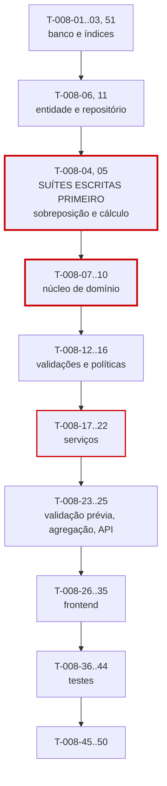

# 008 — Work Logs · Tarefas

## 1. Convenções

| Campo | Regra |
|---|---|
| **ID** | `T-008-XX`, estável e imutável |
| **Descrição** | Verbo no infinitivo + objeto |
| **Dependências** | IDs de tarefas ou features concluídas |
| **Estimativa** | Horas-agente; acima de 8h deve ser decomposta |
| **Prioridade** | `P0` bloqueante · `P1` necessária · `P2` cortável |

> **Complexidade crítica (SQ-02):** `T-008-04` (sobreposição) e `T-008-05` (cálculo) são escritas e **revisadas** antes de `T-008-06` a `T-008-09`. Nenhuma linha de `OverlapDetector` ou `WorkLogCalculator` é escrita antes das suítes existirem.
>
> **SQ-03:** o PR desta feature exige **duas aprovações**.

## 2. Resumo

| Grupo | Tarefas | Estimativa |
|---|:--:|---|
| Banco | 4 | 10h |
| Backend | 18 | 62h |
| Frontend | 10 | 34h |
| Testes | 9 | 42h |
| Documentação | 3 | 5h |
| Infra | 3 | 6h |
| **Total** | **47** | **159h ≈ 10 dias-agente** |

## 3. Banco

| ID | Descrição | Dependências | Estimativa | Prioridade |
|---|---|---|:--:|:--:|
| T-008-01 | Criar `V022__create_work_logs.sql` com os `CHECK` de INV-WKL-01 a 04 e 09 | 004, 005, 006, 007 | 3h | P0 |
| T-008-02 | Criar `V023__work_log_overlap_index.sql` com `idx_work_logs_overlap` — o índice mais crítico da feature | T-008-01 | 2h | P0 |
| T-008-03 | Criar `V024__work_log_tags.sql` com `work_log_tags` e `idx_work_log_tags_tag` — migration incremental herdada de `006` (CE-O-03) | T-008-01 | 2h | P0 |
| T-008-51 | Criar `V025__work_log_indexes.sql` com os demais índices da §13.4, incluindo `idx_work_logs_category`, requisito herdado de `005` (CE-O-03) | T-008-01 | 3h | P0 |

> `T-008-51` pertence ao grupo Banco mas recebeu numeração no fim da faixa porque `T-008-04` e `T-008-05` já estavam reservadas para as suítes escritas primeiro (§4.1), e IDs são **estáveis e imutáveis** (§9 do `README.md`): renumerá-las quebraria as referências cruzadas desta spec.

## 4. Backend

### 4.1 Suítes escritas primeiro (SQ-02)

| ID | Descrição | Dependências | Estimativa | Prioridade |
|---|---|---|:--:|:--:|
| T-008-04 | **Escrever antes do código:** suíte parametrizada dos 9 casos da tabela normativa de sobreposição (§6.2), incluindo edição com exclusão do próprio id | T-008-01 | 5h | P0 |
| T-008-05 | **Escrever antes do código:** suíte parametrizada dos 8 casos da tabela normativa de cálculo (§6.3), incluindo truncamento de segundos e direção do arredondamento | T-008-01 | 4h | P0 |

### 4.2 Núcleo de domínio

| ID | Descrição | Dependências | Estimativa | Prioridade |
|---|---|---|:--:|:--:|
| T-008-06 | Criar a entidade `WorkLog` com os enums `WorkLogSource` e os campos derivados | T-008-01 | 2,5h | P0 |
| T-008-07 | Implementar `OverlapDetector` com comparação estrita nos dois lados, `EXISTS` + `LIMIT 1` e exclusão do próprio id | T-008-04, T-008-06 | 4h | P0 |
| T-008-08 | Implementar `WorkLogCalculator` (RN-110 a RN-112) com `floor` sobre segundos, sem ponto flutuante | T-008-05 | 3h | P0 |
| T-008-09 | Implementar `RoundingPolicy` arredondando **para baixo**, com `0` desativando (RN-113) | T-008-05 | 2h | P0 |
| T-008-10 | Implementar `WorkDateResolver` convertendo para o fuso do tenant antes de extrair a data (RN-108, RN-009) | T-008-06 | 3h | P0 |
| T-008-11 | Criar `WorkLogRepository` com `existsOverlapping`, `search` por projeção, `sumByPeriod`, `sumByTicket`, `aggregateByDay`, `lockByPeriod` e `unlockByPeriod` | T-008-06 | 4h | P0 |

### 4.3 Validações e políticas

| ID | Descrição | Dependências | Estimativa | Prioridade |
|---|---|---|:--:|:--:|
| T-008-12 | Implementar `WorkLogValidator` (RN-103, RN-114 a RN-116, RN-118, RN-119) | T-008-08 | 3h | P0 |
| T-008-13 | Implementar `ContractValidityValidator` (RN-117) e `RetroactiveWindowPolicy` com exceção por papel (RN-120) | T-008-12 | 3h | P0 |
| T-008-14 | Implementar `LockedPeriodGuard` (RN-121) e `PeriodTransferGuard` (RN-124), ambos no **service** (IMP-01) | T-008-06 | 3h | P0 |
| T-008-15 | Implementar `WorkLogOwnershipPolicy` (RN-106, RN-122) e `MemberWorkLogScopeSpecification` aplicada também em `count` e totais (IMP-02) | T-008-11 | 4h | P0 |
| T-008-16 | Implementar `OveragePolicyEvaluator` com as três políticas e **sem** divisão automática (RN-231 a RN-234) | T-008-08 | 3,5h | P0 |

### 4.4 Serviços e API

| ID | Descrição | Dependências | Estimativa | Prioridade |
|---|---|---|:--:|:--:|
| T-008-17 | Implementar `WorkLogService.create` na ordem **exata** da §6.1, com validações puras antes de qualquer I/O | T-008-07, T-008-12, T-008-16 | 6h | P0 |
| T-008-18 | Implementar a cópia imutável de `contractId`/`clientId` (RN-109) e a resolução de período (RN-107) | T-008-17, T-008-10 | 3h | P0 |
| T-008-19 | Implementar a propagação transacional para `ticket.spentMinutes` (RN-308), reabertura (RN-312) e `period.consumedMinutes` | T-008-18 | 4h | P0 |
| T-008-20 | Implementar `WorkLogService.update` revalidando a §6.1, com `editCount` e RN-123 | T-008-17 | 4h | P0 |
| T-008-21 | Implementar `WorkLogService.delete` devolvendo saldo e reduzindo os totais (RN-125) | T-008-19 | 2,5h | P0 |
| T-008-22 | Implementar `createFromTimer` **delegando** ao mesmo `create`, sem duplicar validação (RN-159) | T-008-17 | 2h | P0 |
| T-008-23 | Implementar `WorkLogValidationService` (`/validate`) sem persistir nada, retornando conflitos, cálculo e prévia de saldo | T-008-17 | 3h | P0 |
| T-008-24 | Implementar `WorkLogAggregationService` (calendário e totais) agrupando no **fuso do tenant** | T-008-11 | 3,5h | P1 |
| T-008-25 | Criar DTOs, mappers e os dois controllers com OpenAPI; registrar os códigos de erro da §12 e os `warnings[]` de RN-232 | T-008-23, T-008-24 | 4,5h | P0 |

## 5. Frontend

| ID | Descrição | Dependências | Estimativa | Prioridade |
|---|---|---|:--:|:--:|
| T-008-26 | Criar `WorkLogApi`, `WorkLogStore` e `WorkLogCalendarStore` | T-008-25 | 4h | P0 |
| T-008-27 | Implementar `workLogCalculator` do frontend espelhando RN-110 a RN-113 e o teste cruzado contra a mesma tabela normativa (FM-02) | T-008-08, T-008-09 | 3,5h | P0 |
| T-008-28 | Criar `dt-time-range-input` com cálculo de `net` ao vivo e tratamento de sessão que atravessa a meia-noite | T-008-27 | 4h | P0 |
| T-008-29 | Criar `dt-duration-display` exibindo bruto e arredondado lado a lado quando divergem (OB-05) | T-008-27 | 2h | P0 |
| T-008-30 | Criar `dt-overlap-warning` com link para o registro conflitante e `dt-balance-preview` | T-008-26 | 3h | P0 |
| T-008-31 | Criar `WorkLogFormPage` (P23) integrando validação prévia, `unsavedChangesGuard` e mapeamento de erros `422` por campo | T-008-28, T-008-30 | 5h | P0 |
| T-008-32 | Criar `dt-user-picker` (RN-106) listando apenas membros ativos e `dt-locked-badge` | T-008-26 | 2,5h | P1 |
| T-008-33 | Criar `dt-work-log-row` e `WorkLogListPage` (P21) com filtros, totais e paginação na URL | T-008-26 | 4h | P0 |
| T-008-34 | Criar `dt-work-log-calendar` e `WorkLogCalendarPage` (P22) | T-008-33 | 4h | P1 |
| T-008-35 | Aplicar `hasPermission` e ocultar registros de terceiros para `MEMBER`; exibir avisos de excedente | T-008-33 | 2h | P0 |

## 6. Testes

| ID | Descrição | Dependências | Estimativa | Prioridade |
|---|---|---|:--:|:--:|
| T-008-36 | **Teste de concorrência de sobreposição:** 100 requisições simultâneas com intervalos sobrepostos | T-008-17 | 5h | P0 |
| T-008-37 | Testes da ordem de validação da §6.1 com payloads violando várias regras simultaneamente | T-008-17 | 4h | P0 |
| T-008-38 | Testes de fuso: meia-noite, virada de período, horário de verão na hora repetida e na inexistente | T-008-10 | 5h | P0 |
| T-008-39 | Testes das três políticas de excedente, incluindo ausência de divisão automática (RN-234) | T-008-16 | 3,5h | P0 |
| T-008-40 | Testes de RN-121 e RN-124 com períodos em todos os estados, incluindo `REOPENED` | T-008-14 | 4h | P0 |
| T-008-41 | Testes de propagação transacional e convergência do reconciliador, com inspeção de SQL do incremento | T-008-19 | 4h | P0 |
| T-008-42 | Teste de equivalência entre `create` e `createFromTimer` (RN-159) | T-008-22 | 3h | P0 |
| T-008-43 | Teste de performance da detecção de sobreposição com 100.000 registros | T-008-07 | 4h | P0 |
| T-008-44 | Suíte de isolamento + escopo de `MEMBER` com inspeção de SQL (inclusive `count` e totais) + matriz de permissões | T-008-25 | 5h | P0 |

## 7. Documentação

| ID | Descrição | Dependências | Estimativa | Prioridade |
|---|---|---|:--:|:--:|
| T-008-45 | Sincronizar `docs/04-api/worklogs.md` §5 a §8 com o comportamento implementado | T-008-25 | 2h | P0 |
| T-008-46 | Publicar as sete interfaces públicas da §22.2 para `005`, `007`, `009`, `011` e `012` | T-008-25 | 1,5h | P0 |
| T-008-47 | Reexecutar e marcar como verdes `TS-005-33` e `TS-006-34`, que dependiam da tabela `work_logs` real; atualizar o status em `implementation-order.md` §12 | T-008-44 | 1,5h | P0 |

## 8. Infra

| ID | Descrição | Dependências | Estimativa | Prioridade |
|---|---|---|:--:|:--:|
| T-008-48 | Implementar `WorkLogConsistencyJob` que **detecta e alerta**, nunca corrige (CP-17) | T-008-11 | 3h | P0 |
| T-008-49 | Registrar os reconciliadores no `DenormalizationReconcileJob` | T-008-19 | 1,5h | P0 |
| T-008-50 | Configurar as métricas da §29, com **alerta crítico** em `worklog.overlap.detected_in_db` e `worklog.period.mismatch` | T-008-48 | 1,5h | P0 |

## 9. Ordem de execução

**Caminho crítico:** `T-008-01 → 02 → 06 → 04/05 → 07 → 08 → 17 → 18 → 19 → 25 → 31 → 36`.

**Regra inegociável (SQ-02).** `T-008-04` e `T-008-05` são concluídas e **revisadas** antes de `T-008-07`. As duas tabelas normativas — sobreposição (§6.2) e cálculo (§6.3) — são o oráculo desta feature. Escrevê-las depois significaria escrever testes que confirmam o comportamento do código, e o comportamento do código é exatamente o que está sob suspeita: um erro de comparação (`<` em vez de `<=`) ou de direção de arredondamento passa despercebido em revisão e produz superfaturamento silencioso.

**Três tarefas de teste com peso de bloqueio:**

| Tarefa | Por quê |
|---|---|
| `T-008-36` (concorrência) | É o único teste capaz de expor R-01. A validação de sobreposição é da aplicação, não do banco (OB-02) — sem este teste, a garantia é uma suposição |
| `T-008-38` (fuso) | Cobre R-02. Bordas de meia-noite e horário de verão são o modo de falha que só aparece duas vezes por ano, em produção |
| `T-008-43` (performance) | A detecção roda em **toda** criação e edição. Degradação aqui degrada o ato central do produto |

**Paralelizável:** `T-008-27` a `T-008-29` (cálculo e componentes de duração no frontend) dependem apenas das regras, não do backend, e podem ser desenvolvidos com MSW. `T-008-24` e `T-008-34` (calendário) são `P1` e podem ser concluídos após o núcleo.

**Bloqueio para outras features:** `T-008-46` bloqueia `009-timer` integralmente — o timer não tem caminho próprio de validação (RN-159). Bloqueia também `011-bank-hours`, que depende de `sumByPeriod`, `lockByPeriod` e `unlockByPeriod`.

**Dívida quitada aqui:** `T-008-03` e `T-008-04b` criam estruturas declaradas como requisito em `005` e `006` mas impossíveis de criar lá, porque `work_logs` não existia (CE-O-03). `T-008-47` fecha o ciclo reexecutando os testes daquelas features contra a tabela real.

## 10. Critérios de conclusão por grupo

| Grupo | Concluído quando |
|---|---|
| Banco | `CHECK` de INV-WKL-01 a 04 rejeitam valor inválido por `INSERT` direto; `idx_work_logs_overlap` comprovado no plano de execução da detecção |
| Backend | As duas tabelas normativas reproduzidas integralmente; ordem da §6.1 verificada com payload multi-erro; arredondamento comprovadamente para baixo; timer delegando ao mesmo `create`; desnormalizados por incremento |
| Frontend | Cálculo do cliente idêntico ao do servidor em toda a tabela §6.3; valor bruto e arredondado exibidos quando divergem; conflito de sobreposição com link para o registro; zero violações do axe-core |
| Testes | Suítes de sobreposição e cálculo escritas antes do código; concorrência verde; fuso coberto nas 4 bordas; p95 da detecção < 50 ms com 100k registros; cobertura ≥ 95% no núcleo e ≥ 90% em services |
| Documentação | `worklogs.md` sincronizado; sete interfaces publicadas; `TS-005-33` e `TS-006-34` reexecutados e verdes |
| Infra | `WorkLogConsistencyJob` ativo e comprovadamente **não corretivo**; alertas críticos configurados e testados |
