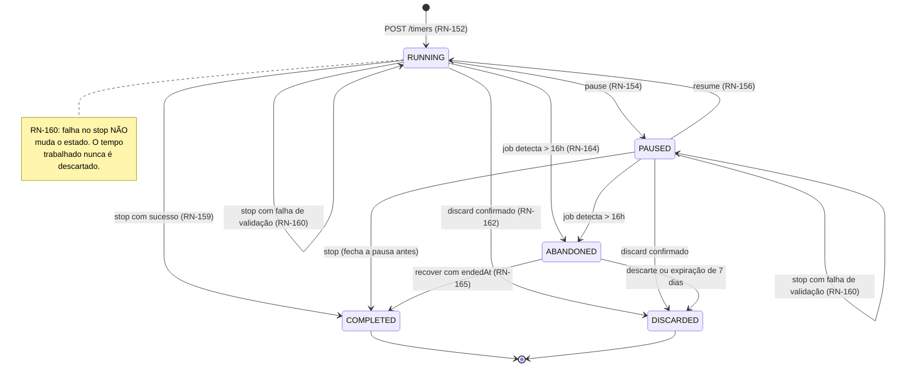
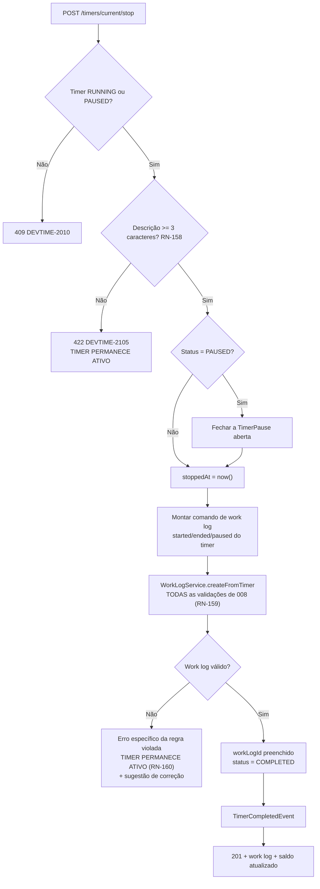
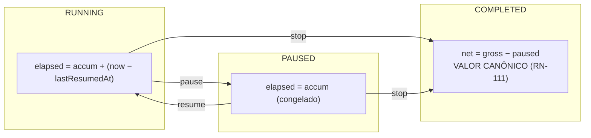

# 009 — Timer

| Campo | Valor |
|---|---|
| **Feature** | 009 |
| **Épico** | EP-07 (Registro de Horas e Cronômetro) |
| **Sprint** | S6 |
| **Prioridade** | P0 |
| **Complexidade** | **Crítica** |
| **Estimativa** | 34 pts · 8 dias-agente |
| **Stories** | US-081 a US-087, US-098 a US-103 |
| **Status** | SPEC_APPROVED |

## 1. Objetivo

Capturar tempo de trabalho em andamento com estado persistido integralmente no servidor, permitindo pausar, retomar e encerrar, gerando ao final um work log que passa pelas mesmas validações do registro manual.

## 2. Problema que resolve

O registro manual exige que a pessoa lembre quando começou. Na prática ela não lembra, e o que acontece é uma de duas coisas: ou ela subestima e trabalha de graça, ou arredonda para cima e cobra a mais. O cronômetro elimina a estimativa.

A decisão estruturante desta feature é que **o estado vive no servidor** (RN-151). O frontend apenas renderiza o tempo decorrido a partir de `startedAt`, `lastResumedAt` e `accumulatedActiveSeconds`. Fechar o navegador, trocar de máquina, perder a conexão ou reiniciar o backend não perde nada (RN-167).

RP-02 identifica **perda de tempo trabalhado** como risco de alta probabilidade e alto impacto. Duas regras existem exclusivamente para eliminá-lo: RN-160 (falha na validação **não** descarta o timer) e RN-164 (timer esquecido vira `ABANDONED`, nunca um work log com valor arbitrário).

## 3. Escopo

| # | Item | Referência |
|---|---|---|
| E-01 | Timer único por usuário, entre todos os seus tenants | RN-150 |
| E-02 | Estado 100% persistido no servidor | RN-151, RN-167 |
| E-03 | Início, pausa, retomada e encerramento | RN-152 a RN-159 |
| E-04 | Registro de pausas em `TimerPause` | §6.15 `entities.md` |
| E-05 | Geração de work log reusando **integralmente** as validações de `008` | RN-159 |
| E-06 | Preservação do timer quando a validação falha | RN-160 |
| E-07 | Edição de ticket, categoria, descrição e faturável durante a execução | RN-161 |
| E-08 | Descarte explícito e irreversível | RN-162 |
| E-09 | Alerta de timer longo, uma única vez | RN-163 |
| E-10 | Marcação automática como abandonado | RN-164 |
| E-11 | Recuperação de abandonado em até 7 dias | RN-165 |
| E-12 | Troca de tarefa em operação atômica | RN-166 |
| E-13 | Encerramento de timer de terceiro por `OWNER`/`ADMIN` | `TIMER_STOP_ANY`, OWN-05 |
| E-14 | Visão de cronômetros ativos da equipe | `TIMER_VIEW_ANY` |
| E-15 | Componente global de cronômetro em todas as telas | `layouts.md` |

## 4. Fora do escopo

| Item | Onde está | Motivo |
|---|---|---|
| Validações de work log | `008-worklogs` | RN-159: o timer **reusa**, não redefine |
| Cálculo de saldo | `011-bank-hours` | O work log gerado atualiza; a aritmética é de `011` |
| Registro manual | `008-worklogs` | Caminho distinto de captura |
| Notificação de timer longo e abandonado | `013-notifications` | Esta feature publica o evento; `013` entrega |
| Detecção de ociosidade do usuário | Fora do roadmap | Exigiria monitorar atividade do sistema operacional — invasivo e fora do produto |
| Cronômetro offline com sincronização | Fora do roadmap | Contradiz RN-151; estado local reintroduz o risco que a feature elimina |
| Múltiplos cronômetros simultâneos | Fora do roadmap | Contradiz RN-150 e RN-102 |

## 5. Dependências

### 5.1 Features
| Feature | Tipo | O que consome |
|---|---|---|
| `008-worklogs` | **Bloqueante** | `WorkLogService.createFromTimer` — todo o encerramento depende disso (RN-159) |
| `007-tickets` | Bloqueante | `TicketService.getForWorkLog`; RN-311 consulta timers ativos |
| `005-categories` | Bloqueante | Categoria do timer; `billableByDefault` |
| `004-contracts` | Bloqueante | RN-306 na validação do ticket |
| `002-users` | Bloqueante | `tenant.settings` (`timerLongRunningMinutes`, `timerAutoAbandonMinutes`) |
| `013-notifications` | Consumidora | `TimerLongRunningEvent`, `TimerAbandonedEvent`, `TimerForceStoppedEvent` |
| `010-dashboard` | Consumidora | Timer ativo no painel |

### 5.2 Documentos obrigatórios
| Documento | Seções relevantes |
|---|---|
| `docs/04-api/worklogs.md` | §9 a §12 (timers) |
| `docs/02-domain/entities.md` | §6.14 Timer, §6.15 TimerPause |
| `docs/02-domain/business-rules.md` | RN-150 a RN-167, RN-102 a RN-120 (por RN-159) |
| `docs/02-domain/state-machines.md` | §4.8 Timer |
| `docs/02-domain/permissions.md` | §6.6, OWN-05 |
| `docs/05-ui/layouts.md` | Componente global de cronômetro |

### 5.3 Infraestrutura
| Componente | Uso |
|---|---|
| PostgreSQL | `timers`, `timer_pauses` |
| Agendador | Job a cada 15 minutos para RN-163 e RN-164 |
| SSE ou polling | Sincronização do cronômetro entre abas — ver §21.3 |

## 6. Regras de negócio

| ID | Tipo | Enunciado resumido | Erro | Onde é aplicada |
|---|---|---|---|---|
| RN-150 | Bloqueante | Máximo de **um** timer ativo por usuário, entre **todos** os seus tenants | `DEVTIME-2150` / 409 | `TimerService.start` |
| RN-151 | Automática | Estado persistido no servidor; o front apenas exibe | — | Toda a feature |
| RN-152 | Automática | Ao iniciar: `startedAt = lastResumedAt = now()`, `accumulatedActiveSeconds = 0` | — | `TimerService.start` |
| RN-153 | Bloqueante | Só pausa se `RUNNING` | `DEVTIME-2153` / 409 | `TimerStateMachine` |
| RN-154 | Automática | Ao pausar: acumula o trecho ativo, status `PAUSED`, abre `TimerPause` | — | `TimerService.pause` |
| RN-155 | Bloqueante | Só retoma se `PAUSED` | `DEVTIME-2155` / 409 | `TimerStateMachine` |
| RN-156 | Automática | Ao retomar: fecha a pausa, recalcula `pausedMinutes`, `lastResumedAt = now()` | — | `TimerService.resume` |
| RN-157 | Bloqueante | Pausas ilimitadas, mas a soma não pode igualar ou exceder o bruto | `DEVTIME-2116` / 422 | `WorkLogValidator` de `008` |
| RN-158 | Bloqueante | Encerramento exige descrição com ao menos 3 caracteres | `DEVTIME-2105` / 422 | `TimerService.stop` |
| RN-159 | Automática | Ao encerrar: fecha pausa aberta, gera work log com `source = TIMER`; **todas** as validações RN-102 a RN-120 são aplicadas | — | `WorkLogService.createFromTimer` |
| RN-160 | Bloqueante | Se o work log violar qualquer regra, o encerramento falha e **o timer permanece ativo** | conforme a regra | `TimerService.stop` |
| RN-161 | Automática | Ticket, categoria, descrição e `billable` são editáveis enquanto `RUNNING`/`PAUSED` | — | `TimerService.update` |
| RN-162 | Bloqueante | Descarte exige confirmação explícita e é irreversível; nenhum work log é gerado | — | `TimerService.discard` |
| RN-163 | Automática | Ultrapassar `timerLongRunningMinutes` gera notificação **uma única vez** por timer | — | `TimerMonitorJob` |
| RN-164 | Automática | Ultrapassar `timerAutoAbandonMinutes` marca `ABANDONED`; **nenhum** work log automático | — | `TimerMonitorJob` |
| RN-165 | Bloqueante | Abandonado recuperável em até 7 dias informando `endedAt`; depois é descartado por job | `DEVTIME-2165` / 409 | `TimerService.recover` |
| RN-166 | Automática | `?stopCurrent=true` encerra o atual e inicia o novo em **uma** operação atômica | — | `TimerService.start` |
| RN-167 | Automática | Reinício do backend não afeta timers ativos; nenhum estado vive em memória | — | Arquitetura |
| RN-460 | Automática | Timer de membro removido é descartado, notificando o `OWNER` | — | Consumidor de `MembershipRemovedEvent` |
| RN-311 | Bloqueante | Ticket com timer ativo não vai para `DONE` | `DEVTIME-2311` / 409 | Consultado por `007` |
| RN-240 | Bloqueante | Período com timer ativo não fecha | `DEVTIME-2240` / 409 | Consultado por `011` |
| RN-001 / RN-002 | Bloqueante | Tenant do usuário; recurso externo retorna `404` | `DEVTIME-1200` / `2002` | Filtro automático |
| RN-006 | Automática | Toda transição gera `AuditLog` na mesma transação | — | Todas |

### 6.1 Ordem de aplicação — encerramento (RN-158 a RN-160)

| # | Passo | Falha |
|---|---|---|
| 1 | Permissão `TIMER_USE` (próprio) ou `TIMER_STOP_ANY` (de terceiro) | `403 DEVTIME-1101` |
| 2 | Timer existe e está `RUNNING` ou `PAUSED` | `409 DEVTIME-2010` |
| 3 | Descrição preenchida com ao menos 3 caracteres (RN-158) | `422 DEVTIME-2105` — **timer permanece ativo** |
| 4 | Se `PAUSED`, fechar a pausa aberta (RN-159) | — |
| 5 | Calcular `stoppedAt = now()` e consolidar `accumulatedActiveSeconds` | — |
| 6 | Montar o comando de work log: `startedAt = timer.startedAt`, `endedAt = timer.stoppedAt`, `pausedMinutes = timer.pausedMinutes` | — |
| 7 | Delegar a `WorkLogService.createFromTimer` — **todas** as validações de `008` | conforme a regra — **timer permanece ativo** (RN-160) |
| 8 | Preencher `workLogId`, status `COMPLETED` | — |
| 9 | Auditar; publicar `TimerCompletedEvent` | — |

**Por que o timer permanece ativo em qualquer falha (RN-160):** é a regra que sustenta PV-03. Se o encerramento descartasse o timer ao falhar em RN-102 (sobreposição) ou RN-220 (saldo), o usuário perderia horas efetivamente trabalhadas por causa de um erro de configuração. Ele deve poder corrigir o ticket, ajustar a descrição ou pedir um ajuste de saldo — com o cronômetro ainda rodando. **O tempo trabalhado nunca é descartado pelo sistema.**

**Por que a descrição é verificada antes de fechar a pausa (passo 3 antes do 4):** fechar a pausa altera o estado persistido. Rejeitar depois exigiria desfazer essa alteração. Validar antes mantém o timer intocado no caminho de erro mais frequente.

### 6.2 Cálculo do tempo decorrido

| Campo | Fórmula | Onde |
|---|---|---|
| `elapsedSeconds` | `accumulatedActiveSeconds + (status = RUNNING ? now() − lastResumedAt : 0)` | Exibição em tempo real |
| `grossElapsedSeconds` | `now() − startedAt` | RN-164 |
| `grossMinutes` do work log | `floor((stoppedAt − startedAt)/60)` | **Valor canônico** (RN-110) |
| `netMinutes` do work log | `grossMinutes − pausedMinutes` | **Valor canônico** (RN-111) |

> **Nota de consistência normativa** (§6.1 de `business-rules.md`): `accumulatedActiveSeconds` e `gross − paused` podem divergir em até 1 minuto por truncamento. **O valor canônico é sempre `gross − paused`.** `accumulatedActiveSeconds` serve exclusivamente para exibição em tempo real. Persistir o work log a partir de `accumulatedActiveSeconds` produziria um valor diferente do que as regras de `008` calculariam — dois números para a mesma sessão.

**Exemplo normativo** (reproduz o diagrama de sequência da §6.1 de `business-rules.md`):

| Instante | Ação | `accumulated` | `pausedMinutes` | Status |
|---|---|---:|---:|---|
| 09:00:00 | Iniciar | 0 | 0 | `RUNNING` |
| 10:30:00 | Pausar | 5.400 | 0 | `PAUSED` |
| 11:00:00 | Retomar | 5.400 | 30 | `RUNNING` |
| 12:15:40 | Encerrar | 9.940 | 30 | `COMPLETED` |

Resultado: `gross = floor((12:15:40 − 09:00:00)/60) = 195`; `paused = 30`; **`net = 165`** (02:45). `accumulatedActiveSeconds` de 9.940 s equivale a 165,67 min — a divergência de truncamento prevista, que não é usada.

### 6.3 Invariantes envolvidas
| ID | Invariante | Como é garantida |
|---|---|---|
| INV-TMR-01 | No máximo **um** timer `RUNNING`/`PAUSED` por `userId` | Índice único parcial global + RN-150 |
| INV-TMR-02 | `PAUSED` ⇒ existe `TimerPause` aberta | `TimerStateMachine` |
| INV-TMR-03 | `RUNNING` ⇒ nenhuma `TimerPause` aberta | `TimerStateMachine` |
| INV-TMR-04 | `COMPLETED` ⇒ `workLogId` e `stoppedAt` preenchidos | `CHECK` + service |
| INV-TMR-05 | `DISCARDED` ⇒ `workLogId` nulo | `CHECK` |

## 7. Fluxo principal — iniciar, pausar, retomar, encerrar

1. Usuário com `TIMER_USE` clica em "iniciar" no componente global ou no detalhe do ticket.
2. Seleciona o ticket; categoria e `billable` vêm pré-preenchidos pela cadeia de RN-104.
3. `POST /api/v1/timers`. O servidor verifica RN-150 **entre todos os tenants do usuário**.
4. Persiste com `startedAt = lastResumedAt = now()`, `accumulatedActiveSeconds = 0`, status `RUNNING` (RN-152).
5. O front passa a exibir o tempo decorrido, calculado localmente a partir dos campos retornados — **sem** consultar o servidor a cada segundo.
6. Ao pausar: `POST /timers/current/pause`. O servidor acumula o trecho ativo e abre uma `TimerPause` (RN-154).
7. Ao retomar: `POST /timers/current/resume`. Fecha a pausa, recalcula `pausedMinutes`, `lastResumedAt = now()` (RN-156).
8. Durante a execução, o usuário pode alterar ticket, categoria, descrição e `billable` (RN-161).
9. Ao encerrar: `POST /timers/current/stop` com a descrição. O servidor aplica a ordem da §6.1.
10. `WorkLogService.createFromTimer` aplica **todas** as validações de `008` (RN-159).
11. Sucesso: timer vai a `COMPLETED` com `workLogId`; a resposta traz o work log e o saldo atualizado.
12. Falha: erro específico retornado e **o timer permanece no estado atual** (RN-160).

## 8. Fluxos alternativos

| # | Fluxo | Gatilho | Comportamento |
|---|---|---|---|
| FA-01 | Iniciar com outro já ativo | `POST /timers` | `409 DEVTIME-2150`, informando o timer ativo e em qual tenant |
| FA-02 | Troca de tarefa | `POST /timers?stopCurrent=true` | Encerra o atual e inicia o novo em **uma** operação atômica (RN-166); se o encerramento falhar, nada acontece |
| FA-03 | Pausar timer já pausado | — | `409 DEVTIME-2153` |
| FA-04 | Retomar timer em execução | — | `409 DEVTIME-2155` |
| FA-05 | Encerrar sem descrição | — | `422 DEVTIME-2105`; **timer permanece ativo** (RN-158) |
| FA-06 | Encerramento com sobreposição | Work log conflitaria | `422 DEVTIME-2102`; **timer permanece ativo**; a UI sugere ajustar o horário de início |
| FA-07 | Encerramento com saldo insuficiente (`BLOCK`) | — | `422 DEVTIME-2220`; **timer permanece ativo**; a UI sugere marcar como não faturável ou pedir ajuste |
| FA-08 | Encerramento com contrato encerrado | CE-12 | `422 DEVTIME-2306`; **timer permanece ativo**; a UI orienta a mover o ticket |
| FA-09 | Descarte | `DELETE /timers/current?confirm=true` | Irreversível; nenhum work log; o tempo descartado é registrado em auditoria (RN-162) |
| FA-10 | Descarte sem confirmação | — | `422`; nada acontece |
| FA-11 | Timer longo | 8h decorridas | Notificação `TIMER_LONG_RUNNING` **uma única vez** (RN-163) |
| FA-12 | Timer abandonado | 16h decorridas | Status `ABANDONED`; **nenhum** work log; notificação com ação de recuperar (RN-164) |
| FA-13 | Recuperação de abandonado | `POST /timers/{id}/recover` | Exige `endedAt` manual; aplica todas as validações; até 7 dias (RN-165) |
| FA-14 | Recuperação após 7 dias | — | `409 DEVTIME-2165`; o timer é descartado por job |
| FA-15 | Recuperação com período já fechado | CE-ME-04 | Falha em RN-121; a UI orienta a solicitar reabertura ou descartar |
| FA-16 | Encerramento forçado por `ADMIN` | `POST /timers/{id}/force-stop` | Exige `TIMER_STOP_ANY`; notifica o dono (OWN-05) |
| FA-17 | Visão da equipe | `GET /timers/active` | Exige `TIMER_VIEW_ANY`; lista os timers ativos do tenant |
| FA-18 | Membro removido com timer ativo | `MembershipRemovedEvent` | Timer descartado; `OWNER` notificado (RN-460, CE-ME-06) |
| FA-19 | Reinício do backend | — | Timers ativos continuam válidos; nenhum estado em memória (RN-167) |
| FA-20 | Duas abas abertas | — | Ambas exibem o mesmo timer; ações em uma refletem na outra (§21.3) |
| FA-21 | Usuário em dois tenants | CE-13 | RN-150 bloqueia o segundo timer, mesmo em tenant diferente |

## 9. Diagramas

### 9.1 Máquina de estados (§4.8 `state-machines.md`)

### 9.2 Encerramento com preservação (RN-159, RN-160)

### 9.3 Cálculo por estado

## 10. Estados

| Estado | Significado | Operações permitidas | Operações bloqueadas |
|---|---|---|---|
| `RUNNING` | Contando tempo ativo | Pausar, encerrar, descartar, editar (RN-161) | Retomar (`DEVTIME-2155`) |
| `PAUSED` | Congelado; pausa aberta | Retomar, encerrar, descartar, editar | Pausar (`DEVTIME-2153`) |
| `ABANDONED` | Ultrapassou 16h sem ação | Recuperar com `endedAt` (7 dias), descartar | Pausar, retomar, encerrar sem `endedAt` |
| `COMPLETED` | Encerrado; work log gerado | — | Todas. Terminal |
| `DISCARDED` | Descartado; nenhum work log | — | Todas. Terminal |

## 11. Transições

| Origem | Destino | Gatilho | Guarda | Efeito | Permissão |
|---|---|---|---|---|---|
| — | `RUNNING` | `POST /timers` | Nenhum timer ativo do usuário em **nenhum** tenant (RN-150); ticket válido; contrato aceita registro (RN-306) | `startedAt = lastResumedAt = now()`; `accum = 0` | `TIMER_USE` |
| `RUNNING` | `PAUSED` | `pause` | Status `RUNNING` (RN-153) | `accum += now − lastResumedAt`; abre `TimerPause` | `TIMER_USE` |
| `PAUSED` | `RUNNING` | `resume` | Status `PAUSED` (RN-155) | Fecha `TimerPause`; recalcula `pausedMinutes`; `lastResumedAt = now()` | `TIMER_USE` |
| `RUNNING`/`PAUSED` | `COMPLETED` | `stop` | Descrição (RN-158); **todas** as validações de `008` (RN-159) | Gera work log; `workLogId`; `stoppedAt` | `TIMER_USE` / `TIMER_STOP_ANY` |
| `RUNNING`/`PAUSED` | *(permanece)* | `stop` com falha | — | **Nenhuma alteração de estado** (RN-160) | — |
| `RUNNING`/`PAUSED` | `DISCARDED` | `discard` com `confirm=true` | Confirmação explícita (RN-162) | Nenhum work log; auditoria registra o tempo descartado | `TIMER_USE` |
| `RUNNING`/`PAUSED` | `ABANDONED` | Job a cada 15 min | `now − startedAt > timerAutoAbandonMinutes` (RN-164) | Notificação; **nenhum** work log | Sistema |
| `ABANDONED` | `COMPLETED` | `recover` com `endedAt` | Dentro de 7 dias (RN-165); `endedAt` válido por todas as regras de `008` | Gera work log com o `endedAt` informado | `TIMER_USE` |
| `ABANDONED` | `DISCARDED` | Descarte ou job após 7 dias | — | — | `TIMER_USE` / Sistema |
| `RUNNING`/`PAUSED` | `DISCARDED` | Membro removido | `MembershipRemovedEvent` (RN-460) | Notifica o `OWNER`; tempo apenas em auditoria | Sistema |

### 11.1 Transições proibidas

| Transição | Motivo da proibição |
|---|---|
| `COMPLETED → *` | Terminal. O work log já existe e é a entidade a ser editada, não o timer |
| `DISCARDED → *` | RN-162: o descarte é irreversível por definição |
| `RUNNING → RUNNING` por `pause` | RN-153. Auto-transição por operação inválida é erro, não idempotência |
| `PAUSED → PAUSED` por `resume` | RN-155. Idem |
| `RUNNING`/`PAUSED` → `DISCARDED` **por falha de validação** | RN-160. É a proibição mais importante da feature: descartar tempo trabalhado por erro de configuração |
| `ABANDONED → COMPLETED` com `endedAt` automático | RN-164. Encerrar com valor arbitrário violaria PR-03 — o sistema não inventa quanto foi trabalhado |
| Segundo timer ativo do mesmo usuário | RN-150, INV-TMR-01, coerente com RN-102 |
| Alteração de `startedAt` | Seria reescrever quando o trabalho começou |

## 12. Casos de erro

| Código | HTTP | Situação | Mensagem ao usuário | Regra |
|---|:--:|---|---|---|
| `DEVTIME-1101` | 403 | Sem `TIMER_USE`, ou encerrar de terceiro sem `TIMER_STOP_ANY` | Você não tem permissão para esta ação | OWN-05 |
| `DEVTIME-2002` | 404 | Timer ou ticket de outro tenant | Recurso não encontrado | RN-002 |
| `DEVTIME-2010` | 409 | Operação em estado terminal | Este cronômetro já foi encerrado | ME-04 |
| `DEVTIME-2105` | 422 | Encerramento sem descrição | Descrição obrigatória (mínimo 3 caracteres) | RN-158 |
| `DEVTIME-2150` | 409 | Já existe timer ativo | Já existe um cronômetro ativo | RN-150 |
| `DEVTIME-2153` | 409 | Pausar timer não em execução | O cronômetro não está em execução | RN-153 |
| `DEVTIME-2155` | 409 | Retomar timer não pausado | O cronômetro não está pausado | RN-155 |
| `DEVTIME-2165` | 409 | Recuperação após 7 dias | Cronômetro abandonado não pode mais ser recuperado | RN-165 |
| `DEVTIME-2102` | 422 | Sobreposição no encerramento | Já existe um registro de horas neste intervalo | RN-102 via RN-159 |
| `DEVTIME-2103` | 422 | Sessão acima de 24h | A sessão não pode ultrapassar 24 horas | RN-103 via RN-159 |
| `DEVTIME-2116` | 422 | Pausas ≥ tempo bruto | Tempo de pausa inválido | RN-157 |
| `DEVTIME-2220` | 422 | Saldo insuficiente com `BLOCK` | Saldo insuficiente no contrato | RN-231 via RN-159 |
| `DEVTIME-2306` | 422 | Contrato encerrado | Contrato encerrado não aceita registros | RN-306, CE-12 |
| `DEVTIME-2121` | 409 | Período fechado na recuperação | Registro pertence a período fechado | RN-121, CE-ME-04 |

> **Todos os erros de `422` no encerramento preservam o timer** (RN-160). A mensagem de erro é acompanhada de uma **sugestão de correção** específica: sobreposição → ajustar o horário de início; saldo → marcar como não faturável ou pedir ajuste; contrato encerrado → mover o ticket.

### 12.1 Casos extremos

| # | Caso | Comportamento esperado |
|---|---|---|
| CX-01 | Usuário em dois tenants inicia timer em ambos | Bloqueado por RN-150 — o limite é por **usuário**, não por tenant (CE-13) |
| CX-02 | Encerramento falha em sobreposição | Timer permanece; a UI sugere ajustar o início (RN-160) |
| CX-03 | Encerramento falha por saldo | Timer permanece; a UI sugere não faturável ou ajuste |
| CX-04 | Contrato encerrado durante a execução | O timer continua; o encerramento falha em RN-306; a UI orienta a mover o ticket (CE-12) |
| CX-05 | Timer de 8h exatas | Notificação de longo gerada uma vez; nova execução do job **não** duplica (RN-163) |
| CX-06 | Timer de 16h exatas | Vai a `ABANDONED` (RN-164) |
| CX-07 | Timer pausado atingindo 16h | Vai a `ABANDONED` igualmente — o critério é `now − startedAt`, não o tempo ativo |
| CX-08 | Recuperação de abandonado no 7º dia | Permitida; no 8º, `DEVTIME-2165` |
| CX-09 | Recuperação com `endedAt` que gera 25h | Rejeitada por RN-103; o timer permanece `ABANDONED` |
| CX-10 | Recuperação cujo período foi fechado | Falha em RN-121; a UI orienta reabertura ou descarte (CE-ME-04) |
| CX-11 | Pausas somando exatamente o tempo bruto | Rejeitado por RN-157/RN-116; timer permanece |
| CX-12 | 50 pausas em uma sessão | Permitido; RN-157 não limita a quantidade |
| CX-13 | Divergência de 1 min entre `accumulated` e `gross − paused` | Esperada; o valor canônico é `gross − paused` (§6.2) |
| CX-14 | Duas abas encerrando simultaneamente | Uma conclui; a outra recebe `409 DEVTIME-2010` |
| CX-15 | Perda de conexão durante a execução | Nenhum efeito; o estado está no servidor (RN-151) |
| CX-16 | Reinício do backend com timers ativos | Todos continuam válidos (RN-167) |
| CX-17 | Troca de tarefa cujo encerramento falha | **Nada acontece**: o atual permanece e o novo não é criado (RN-166 é atômico) |
| CX-18 | Fechamento de período com timer `PAUSED` | Bloqueado igualmente — `PAUSED` é ativo (RN-240, CE-ME-01) |
| CX-19 | Membro removido com timer `PAUSED` | Descartado igualmente; o tempo fica apenas em auditoria (RN-460, CE-ME-06) |
| CX-20 | `ADMIN` encerra timer de terceiro sem descrição | `422 DEVTIME-2105`; o timer do outro permanece |
| CX-21 | Timer iniciado e encerrado no mesmo minuto | `gross = 0` → `net = 0` → rejeitado por RN-115; timer permanece |
| CX-22 | Alteração de ticket durante a execução para contrato encerrado | Permitida na edição (RN-161); o encerramento falhará em RN-306 |

## 13. Modelo de dados

### 13.1 Entidades impactadas
| Entidade | Operação | Tabela | Referência |
|---|---|---|---|
| `Timer` | Cria, lê, atualiza | `timers` | §6.14 |
| `TimerPause` | Cria, atualiza | `timer_pauses` | §6.15 |
| `WorkLog` | Cria (via `008`) | `work_logs` | RN-159 |
| `Ticket` | Lê | `tickets` | Via `TicketService` |
| `AuditLog` | Cria | `audit_logs` | §6.20 |

### 13.2 Campos obrigatórios na criação
| Campo | Tipo | Origem | Imutável | Validação |
|---|---|---|:--:|---|
| `tenantId` | UUID | `TenantContext` | ✔ 🔒 | Nunca da requisição |
| `userId` | UUID | Autenticado | ✔ 🔒 | Nunca da requisição (OWN-05) |
| `ticketId` | UUID | Request | ✖ | Ticket do tenant; contrato aceita registro; editável (RN-161) |
| `categoryId` | UUID | Request ou cadeia | ✖ | Categoria ativa; editável |
| `status` | enum | Sistema | ✖ | `RUNNING`; alterado só por endpoint de ação |
| `startedAt` | TIMESTAMPTZ | Sistema | ✔ 🔒 | `now()` (RN-152) |
| `lastResumedAt` | TIMESTAMPTZ | Sistema | ✖ | `= startedAt` na criação |
| `accumulatedActiveSeconds` | int | Sistema | ✖ | `0` |
| `pausedMinutes` | int | Sistema | ✖ 💾 | `0`; recalculado a cada retomada |
| `description` | Text(2000) | Request | ✖ | Opcional ao iniciar; **obrigatória** ao encerrar (RN-158) |
| `billable` | boolean | Da categoria | ✖ | Editável |
| `longRunningNotifiedAt` | TIMESTAMPTZ | Sistema | ✖ | Nulo; evita duplicação (RN-163) |
| `pause.pausedAt` | TIMESTAMPTZ | Sistema | ✔ 🔒 | `now()` |
| `pause.resumedAt` | TIMESTAMPTZ | Sistema | ✖ | Nulo enquanto aberta |

### 13.3 Migrations
| Migration | Conteúdo | Compatibilidade |
|---|---|---|
| `V026__create_timers.sql` | `timers` + `CHECK` de INV-TMR-04 e 05 | Nova tabela |
| `V027__create_timer_pauses.sql` | `timer_pauses` + índice único parcial de pausa aberta por timer | Nova tabela |
| `V028__timer_unique_active.sql` | **Índice único parcial global** `(user_id)` WHERE `status IN ('RUNNING','PAUSED')` | Constraint crítica |

> `V028` é a garantia estrutural de RN-150 e INV-TMR-01. Diferentemente de RN-102 em `008` — onde a constraint colide com soft delete (OB-02 daquela spec) — aqui ela é viável e obrigatória: `Timer` não usa soft delete, e o índice é sobre um único campo com predicado de status. É o que torna o limite de um timer por usuário uma garantia do banco, não uma suposição da aplicação.
>
> **Atenção:** o índice é sobre `(user_id)` **sem** `tenant_id`, deliberadamente. RN-150 é por usuário entre **todos** os tenants (CE-13). Incluir `tenant_id` permitiria dois timers ativos em tenants distintos, violando a regra.

### 13.4 Índices
| Índice | Colunas | Sustenta |
|---|---|---|
| `uq_timers_active_user` | `(user_id)` WHERE `status IN ('RUNNING','PAUSED')` | **RN-150, INV-TMR-01** |
| `idx_timers_tenant_status` | `(tenant_id, status)` | `GET /timers/active` |
| `idx_timers_monitor` | `(status, started_at)` WHERE `status IN ('RUNNING','PAUSED')` | `TimerMonitorJob` (RN-163, RN-164) |
| `idx_timers_ticket` | `(tenant_id, ticket_id)` WHERE `status IN ('RUNNING','PAUSED')` | RN-311, RN-240 |
| `idx_timers_abandoned` | `(status, started_at)` WHERE `status = 'ABANDONED'` | Expiração de 7 dias (RN-165) |
| `uq_timer_pauses_open` | `(timer_id)` WHERE `resumed_at IS NULL` | INV-TMR-02, INV-TMR-03 |

## 14. Endpoints utilizados

| Método | Rota | Operação | Permissão | Sucesso | Doc |
|---|---|---|---|:--:|---|
| GET | `/api/v1/timers/current` | Timer ativo do usuário | `TIMER_USE` | 200 / 204 | §9 |
| POST | `/api/v1/timers` | Iniciar; `?stopCurrent=true` para trocar | `TIMER_USE` | 201 | §9 |
| PATCH | `/api/v1/timers/current` | Editar ticket, categoria, descrição, faturável | `TIMER_USE` | 200 | §10 |
| POST | `/api/v1/timers/current/pause` | Pausar | `TIMER_USE` | 200 | §10 |
| POST | `/api/v1/timers/current/resume` | Retomar | `TIMER_USE` | 200 | §10 |
| POST | `/api/v1/timers/current/stop` | Encerrar e gerar work log | `TIMER_USE` | 201 | §11 |
| DELETE | `/api/v1/timers/current` | Descartar com `?confirm=true` | `TIMER_USE` | 204 | §11 |
| GET | `/api/v1/timers/abandoned` | Abandonados recuperáveis | `TIMER_USE` | 200 | §12 |
| POST | `/api/v1/timers/{id}/recover` | Recuperar com `endedAt` | `TIMER_USE` | 201 | §12 |
| GET | `/api/v1/timers/active` | Cronômetros ativos da equipe | `TIMER_VIEW_ANY` | 200 | §12 |
| POST | `/api/v1/timers/{id}/force-stop` | Encerrar timer de terceiro | `TIMER_STOP_ANY` | 201 | §12 |

## 15. Eventos

| Evento | Publicado por | Consumidores | Momento | Efeito |
|---|---|---|---|---|
| `TimerStartedEvent` | `TimerService` | Métricas | Após o commit | Telemetria |
| `TimerCompletedEvent` | `TimerService` | Métricas, `010-dashboard` | Após o commit | Atualiza painel |
| `TimerLongRunningEvent` | `TimerMonitorJob` | `013-notifications` | Após o commit | `TIMER_LONG_RUNNING`, uma vez (RN-163) |
| `TimerAbandonedEvent` | `TimerMonitorJob` | `013-notifications` | Após o commit | `TIMER_ABANDONED` com ação de recuperar |
| `TimerForceStoppedEvent` | `TimerService` | `013-notifications` | Após o commit | Notifica o **dono** (OWN-05) |
| `TimerDiscardedEvent` | `TimerService` | Métricas | Após o commit | Telemetria do tempo descartado |
| `MembershipRemovedEvent` | `002-users` | `TimerService` | **Dentro** da transação | Descarta o timer (RN-460) |

## 16. Permissões

| Operação | Permissão | Papéis | Ownership | Escopo de dados |
|---|---|---|---|---|
| Operar o próprio cronômetro | `TIMER_USE` | OWNER, ADMIN, MANAGER, MEMBER | OWN-05 — exclusivo do `userId` | Apenas o próprio |
| Ver cronômetros ativos da equipe | `TIMER_VIEW_ANY` | OWNER, ADMIN, MANAGER | — | Todo o tenant |
| Encerrar cronômetro de terceiro | `TIMER_STOP_ANY` | OWNER, ADMIN | — | Notifica o dono |
| Recuperar abandonado | `TIMER_USE` | Idem ao próprio | OWN-05 | Apenas o próprio |

> **OWN-05 é a regra de ownership mais restritiva do sistema:** o timer pertence **exclusivamente** ao seu `userId`. Nem `MANAGER` o opera — apenas `OWNER` e `ADMIN` podem encerrá-lo via `TIMER_STOP_ANY`, e ainda assim com notificação ao dono. A justificativa é que o cronômetro representa trabalho **em andamento** de uma pessoa específica; interferir nele sem que ela saiba produziria um registro de horas que ela não reconhece como seu.
>
> **`VIEWER` não possui `TIMER_USE`** (CE-P-06): recebe `403 DEVTIME-1101` ao tentar iniciar.

## 17. Validações

### 17.1 Camada 1 — Formato (`400`)
| Campo | Restrição | Mensagem |
|---|---|---|
| `ticketId` | `@NotNull` | Informe o ticket |
| `categoryId` | `@NotNull` | Informe a categoria |
| `description` | `@Size(max=2000)`; `@NotBlank` + `@Size(min=3)` **no encerramento** | Descrição obrigatória (mínimo 3 caracteres) |
| `billable` | `@NotNull` | Informe se é faturável |
| `endedAt` (recuperação) | `@NotNull`, ISO-8601 | Informe o horário real de término |
| `confirm` (descarte) | `@AssertTrue` | Confirmação obrigatória |

### 17.2 Camada 2 — Negócio
| Validação | Regra | Erro |
|---|---|---|
| Nenhum timer ativo do usuário em nenhum tenant | RN-150 | `DEVTIME-2150` / 409 |
| Ticket válido e contrato aceita registro | RN-306 | `DEVTIME-2306` / 422 |
| Status permite pausar | RN-153 | `DEVTIME-2153` / 409 |
| Status permite retomar | RN-155 | `DEVTIME-2155` / 409 |
| Descrição no encerramento | RN-158 | `DEVTIME-2105` / 422 |
| **Todas** as validações de work log | RN-159 | Conforme a regra — timer preservado (RN-160) |
| Recuperação dentro de 7 dias | RN-165 | `DEVTIME-2165` / 409 |
| Confirmação no descarte | RN-162 | `422` |
| Ownership do timer | OWN-05 | `DEVTIME-1101` / 403 |

### 17.3 Camada 3 — Consistência
| Constraint | Garante | Mapeado para |
|---|---|---|
| `uq_timers_active_user` | INV-TMR-01, RN-150 | `DEVTIME-2150` |
| `uq_timer_pauses_open` | INV-TMR-02, INV-TMR-03 | `DEVTIME-9002` |
| `CHECK (status <> 'COMPLETED' OR (work_log_id IS NOT NULL AND stopped_at IS NOT NULL))` | INV-TMR-04 | `DEVTIME-9002` |
| `CHECK (status <> 'DISCARDED' OR work_log_id IS NULL)` | INV-TMR-05 | `DEVTIME-9002` |

## 18. Auditoria

| Ação | `action` | `beforeState` | `afterState` | Metadata |
|---|---|---|---|---|
| Início | `TIMER_STARTED` | — | `{ticketId, startedAt}` | IP, traceId |
| Pausa | `TIMER_PAUSED` | `{status}` | `{status, accumulatedActiveSeconds}` | traceId |
| Retomada | `TIMER_RESUMED` | `{status}` | `{status, pausedMinutes}` | traceId |
| Encerramento | `TIMER_COMPLETED` | `{status}` | `{status, workLogId, netMinutes}` | traceId |
| **Falha no encerramento** | `TIMER_STOP_FAILED` | — | — | Código do erro, `elapsedSeconds`, traceId |
| **Descarte** | `TIMER_DISCARDED` | `{status, elapsedSeconds}` | `{status}` | **Tempo descartado**, IP, traceId |
| Abandono | `TIMER_ABANDONED` | `{status}` | `{status}` | `actorType = SYSTEM`, `grossElapsedSeconds` |
| Recuperação | `TIMER_RECOVERED` | `{status}` | `{status, workLogId}` | `endedAt` informado, traceId |
| Encerramento forçado | `TIMER_FORCE_STOPPED` | `{status}` | `{status, workLogId}` | Quem forçou, traceId |

> O descarte registra **quanto tempo foi descartado**. É a única operação do sistema que destrói trabalho registrado sem gerar contrapartida, e a auditoria é o que permite responder "por que faltam 3 horas naquela terça".
>
> `TIMER_STOP_FAILED` registra tentativas frustradas. Um usuário que tenta encerrar cinco vezes e falha em todas está perdendo tempo real de trabalho — e essa é uma métrica de produto, não apenas de erro.

## 19. Segurança

| # | Vetor | Mitigação | Verificação |
|---|---|---|---|
| SG-01 | Operar timer de outro usuário | OWN-05 verificada no service; `/current` resolve pelo token | Teste com id de terceiro |
| SG-02 | Timer de outro tenant | Filtro automático; `404` | Suíte de isolamento |
| SG-03 | Burlar RN-150 com requisições simultâneas | Índice único parcial no banco (`V028`) | Teste de concorrência |
| SG-04 | Burlar RN-150 usando dois tenants | Índice **sem** `tenant_id` (§13.3) | Teste cross-tenant |
| SG-05 | `startedAt` forjado para inflar o tempo | Campo sempre do servidor; ausente dos DTOs | Teste com payload |
| SG-06 | `accumulatedActiveSeconds` manipulado | Idem; calculado no servidor | Teste |
| SG-07 | Encerramento forçado sem notificar o dono | `TimerForceStoppedEvent` obrigatório | Teste |
| SG-08 | `VIEWER` iniciando cronômetro | `TIMER_USE` negada (CE-P-06) | Matriz de permissões |
| SG-09 | XSS por descrição | Escape na renderização | Teste com payload |

### 19.1 LGPD

| Dado pessoal | Base legal | Retenção | Exportação | Anonimização | Proibido em log |
|---|---|---|---|---|---|
| `userId` e padrão de uso do cronômetro | Execução de contrato | Vida do tenant | ✔ | Substituído por `Usuário Removido` | Permitido (é UUID) |
| `description` | Legítimo interesse | Vida do tenant | ✔ | Não se aplica | ❌ conteúdo em log |
| Horários de início, pausa e retomada | Legítimo interesse | Vida do tenant | ✔ | — | — |

**Análise.** As pausas de um timer revelam o **ritmo de trabalho** de uma pessoa em granularidade fina: quando parou, por quanto tempo, quantas vezes. É o dado mais íntimo que o produto coleta. Três consequências:

1. `TIMER_VIEW_ANY` mostra **apenas** que existe um cronômetro ativo e em qual ticket — nunca o histórico de pausas.
2. `TimerPause.reason` é opcional e nunca obrigatório: exigir justificativa para pausas transformaria o produto em ferramenta de vigilância, contrariando os princípios de produto.
3. O histórico de pausas não é exposto em nenhum relatório. Ele existe apenas para calcular `pausedMinutes`.

## 20. Performance

| Operação | Meta | Índice/estratégia | Risco |
|---|---|---|---|
| `GET /timers/current` | p95 < 100 ms | `uq_timers_active_user` | Chamado ao carregar **toda** tela |
| Início | p95 < 200 ms | Verificação de RN-150 pelo índice único | — |
| Pausa e retomada | p95 < 150 ms | PK + índice de pausa aberta | — |
| Encerramento | p95 < 400 ms | Inclui todas as validações de `008` | Herda o custo de `008` |
| `GET /timers/active` | p95 < 200 ms | `idx_timers_tenant_status` | — |
| `TimerMonitorJob` | Dentro da janela de 15 min | `idx_timers_monitor` | Muitos timers ativos globalmente |
| Exibição do tempo decorrido | 0 ms de servidor | **Calculado no cliente** a partir dos campos retornados | — |

### 20.1 Escalabilidade

`timers` é uma tabela pequena: no máximo um registro ativo por usuário. `timer_pauses` cresce com o uso, mas em ordem de dezenas por timer.

O ponto crítico não é volume, é **frequência de leitura**. `GET /timers/current` é chamado ao carregar toda tela, porque o componente de cronômetro é global. A mitigação é dupla: (a) o índice único parcial torna a consulta uma busca direta; (b) **o front não consulta o servidor a cada segundo** — ele recebe `startedAt`, `lastResumedAt` e `accumulatedActiveSeconds` uma vez e calcula localmente. Um cronômetro que fizesse *polling* por segundo geraria 3.600 requisições por hora por usuário ativo, o que é insustentável e completamente desnecessário.

`TimerMonitorJob` percorre timers ativos **de todos os tenants** a cada 15 minutos. Com 10.000 usuários ativos simultâneos, são 10.000 linhas — trivial. O job usa `idx_timers_monitor` e processa em lote, trocando o `TenantContext` a cada iteração e limpando-o ao final (CE-P-08).

## 21. Componentes Frontend

### 21.1 Rotas
| Rota | Componente | Guard | Lazy | Tela |
|---|---|---|:--:|---|
| — | `dt-timer-widget` | — | ✖ | Componente **global** no layout, presente em todas as telas autenticadas |
| `/timers/abandoned` | `AbandonedTimersPage` | `permissionGuard(['TIMER_USE'])` | ✔ | — |

> O cronômetro não possui tela própria. Ele é um componente persistente do layout (`layouts.md`), visível e operável de qualquer lugar. Uma tela dedicada obrigaria o usuário a navegar para pausar — atrito inaceitável na operação mais frequente do produto.

### 21.2 Componentes
| Componente | Tipo | Responsabilidade | Inputs | Outputs |
|---|---|---|---|---|
| `dt-timer-widget` | Shared | Cronômetro global: exibição, iniciar, pausar, retomar, encerrar | — | — |
| `dt-timer-display` | Presentational | Tempo decorrido em `HH:MM:SS`, calculado localmente | `startedAt`, `lastResumedAt`, `accumulated`, `status` | — |
| `dt-timer-start-dialog` | Presentational | Seleção de ticket, categoria e faturável | `defaults` | `start`, `cancel` |
| `dt-timer-stop-dialog` | Presentational | Descrição obrigatória, prévia do work log e do saldo | `timer`, `preview` | `stop`, `cancel` |
| `dt-timer-error-panel` | Presentational | Erro de encerramento **com a sugestão de correção** e o timer ainda visível | `error`, `suggestion` | `retry`, `edit` |
| `dt-timer-discard-dialog` | Presentational | Confirmação explícita exibindo o tempo a ser descartado | `elapsedSeconds` | `confirm`, `cancel` |
| `dt-timer-switch-dialog` | Presentational | Troca de tarefa (RN-166), explicando a atomicidade | `current`, `target` | `confirm`, `cancel` |
| `dt-active-timers-list` | Presentational | Cronômetros da equipe, **sem** histórico de pausas | `timers` | `forceStop` |
| `AbandonedTimersPage` | Page | Abandonados com prazo restante e recuperação | — | — |

> `dt-timer-error-panel` é o componente mais importante desta feature. Ele materializa RN-160: quando o encerramento falha, o usuário precisa ver **o erro, a sugestão e o cronômetro ainda rodando** na mesma tela. Um erro genérico que sumisse com o cronômetro faria o usuário acreditar que perdeu o trabalho.

### 21.3 Stores e serviços Angular
| Artefato | Tipo | Estado exposto | Escopo |
|---|---|---|---|
| `TimerStore` | Store | `current`, `elapsed` (computed por `interval` local), `status`, `error` | `providedIn: 'root'` |
| `TimerApi` | API | Somente HTTP dos 11 endpoints | `providedIn: 'root'` |

**Sincronização entre abas.** Duas abas abertas devem refletir o mesmo estado. A estratégia é, em ordem de preferência:

| # | Mecanismo | Quando |
|---|---|---|
| 1 | `BroadcastChannel` entre abas do mesmo navegador | Ação local propagada imediatamente, sem rede |
| 2 | Revalidação em `visibilitychange` | Ao voltar o foco da aba, confirma o estado com o servidor |
| 3 | *Polling* de baixa frequência (60 s) | Rede de segurança para ações feitas em outro dispositivo |

**Nunca** *polling* por segundo. O tempo decorrido é sempre calculado localmente a partir dos três campos persistidos — o servidor é a fonte da verdade do **estado**, não do **relógio**.

### 21.4 Guards, interceptors, pipes e directives
| Artefato | Tipo | Uso |
|---|---|---|
| `permissionGuard` | Guard | Protege a página de abandonados |
| `hasPermission` | Directive | Oculta o cronômetro de `VIEWER`; oculta encerramento forçado |
| `elapsedTimePipe` | Pipe | Segundos → `HH:MM:SS` |
| `unloadWarningGuard` | Guard | Alerta ao fechar a aba com timer ativo — **informativo**, pois nada se perde (RN-151) |

## 22. Serviços Backend

### 22.1 Controllers
| Classe | Rota base | Endpoints |
|---|---|---|
| `TimerController` | `/api/v1/timers` | atual, iniciar, editar, pausar, retomar, encerrar, descartar |
| `TimerRecoveryController` | `/api/v1/timers` | abandonados, recuperar |
| `TimerAdminController` | `/api/v1/timers` | ativos da equipe, encerramento forçado |

### 22.2 Services
| Interface | Implementação | Responsabilidade | Permissão declarada |
|---|---|---|---|
| `TimerService` | `TimerServiceImpl` | Ciclo de vida completo | `TIMER_USE`, `TIMER_STOP_ANY` |
| `TimerRecoveryService` | `TimerRecoveryServiceImpl` | Recuperação de abandonados (RN-165) | `TIMER_USE` |
| `TimerQueryService` | `TimerQueryServiceImpl` | Timer atual e ativos da equipe | `TIMER_USE`, `TIMER_VIEW_ANY` |

**Interfaces públicas consumidas por outras features:**

| Método | Consumidor | Contrato |
|---|---|---|
| `TimerQueryService.hasActiveForTicket(ticketId)` | `007` | RN-311 — inclui `PAUSED` |
| `TimerQueryService.hasActiveForPeriod(periodId)` | `011` | RN-240 — inclui `PAUSED` (CE-ME-01) |
| `TimerService.discardForUser(userId, tenantId)` | `002` | RN-460 |

### 22.3 Componentes de domínio
| Classe | Tipo | Responsabilidade | Regras |
|---|---|---|---|
| `TimerStateMachine` | StateMachine | Matriz §4.8; garante que falha no `stop` não transiciona | RN-153, RN-155, RN-160 |
| `TimerElapsedCalculator` | Calculator | `elapsedSeconds` e `grossElapsedSeconds` | §6.2 |
| `TimerPausePolicy` | Policy | Abre e fecha pausas; recalcula `pausedMinutes` | RN-154, RN-156, INV-TMR-02/03 |
| `ActiveTimerPolicy` | Policy | Unicidade por usuário entre tenants | RN-150, INV-TMR-01 |
| `TimerToWorkLogAssembler` | Utilitário | Monta o comando de work log a partir do timer | RN-159 |
| `TimerSwitchPolicy` | Policy | Troca atômica de tarefa | RN-166 |
| `AbandonedTimerPolicy` | Policy | Janela de 7 dias | RN-165 |

### 22.4 Jobs
| Classe | Cron | Lock | Responsabilidade | Idempotência |
|---|---|---|---|---|
| `TimerMonitorJob` | `0 */15 * * * *` | `timerMonitor`, 10m | Detecta timers longos (RN-163) e abandonados (RN-164) | `longRunningNotifiedAt` impede duplicação; abandono é convergente |
| `AbandonedTimerCleanupJob` | `0 45 3 * * *` | `timerCleanup`, 15m | Descarta abandonados com mais de 7 dias (RN-165) | Convergente |

> `TimerMonitorJob` **não** encerra timers nem gera work logs. Ele apenas marca `ABANDONED` e notifica. Encerrar automaticamente exigiria inventar um `endedAt`, violando PR-03 e RN-164.

## 23. DTOs

| DTO | Direção | Campos principais | Observação |
|---|---|---|---|
| `TimerStartRequest` | Request | `ticketId`, `categoryId`, `description?`, `billable?` | `startedAt`, `userId` **ausentes** — sempre do servidor |
| `TimerUpdateRequest` | Request | `ticketId?`, `categoryId?`, `description?`, `billable?` | RN-161; `startedAt` ausente |
| `TimerStopRequest` | Request | `description` | Obrigatória (RN-158) |
| `TimerRecoverRequest` | Request | `endedAt` | RN-165 |
| `TimerResponse` | Response | `id`, `status`, `ticket`, `category`, `startedAt`, `lastResumedAt`, `accumulatedActiveSeconds`, `pausedMinutes`, `billable`, `description`, `availableTransitions[]` | O cliente calcula `elapsed` a partir destes campos |
| `TimerStopResponse` | Response | `workLog`, `balance`, `warnings[]` | Herda os avisos de `008` |
| `TimerStopErrorResponse` | Response | `code`, `detail`, `suggestion`, `timer` | **O timer é devolvido**, provando que permanece ativo (RN-160) |
| `ActiveTimerProjection` | Projection | `userId`, `userName`, `ticketKey`, `startedAt`, `status` | Equipe — **sem** histórico de pausas (§19.1) |
| `AbandonedTimerResponse` | Response | `id`, `ticket`, `startedAt`, `grossElapsedSeconds`, `recoverableUntil` | RN-165 |

> `TimerStopErrorResponse` inclui o objeto `timer` completo. É deliberado: a resposta de erro **prova** ao cliente que o cronômetro continua ativo, permitindo que a UI o mantenha visível sem uma segunda requisição.

## 24. Mappers

| Mapper | De → Para | Mapeamentos não triviais |
|---|---|---|
| `TimerMapper` | `Timer` → `TimerResponse` | `availableTransitions` conforme o status; `elapsed` **não** é calculado no servidor |
| `ActiveTimerMapper` | `Timer` → `ActiveTimerProjection` | Omite descrição e pausas (§19.1) |
| `TimerToWorkLogMapper` | `Timer` → comando de work log | `startedAt`, `endedAt = stoppedAt`, `pausedMinutes` (RN-159) |

## 25. Repositories

| Repository | Entidade | Métodos específicos | Índice usado |
|---|---|---|---|
| `TimerRepository` | `Timer` | `findActiveByUser(userId)` **sem filtro de tenant**, `findActiveByTenant`, `existsActiveForTicket`, `existsActiveForPeriod`, `findLongRunning`, `findAbandonedOlderThan` | `uq_timers_active_user`, `idx_timers_monitor`, `idx_timers_abandoned` |
| `TimerPauseRepository` | `TimerPause` | `findOpenByTimer`, `sumDurationByTimer` | `uq_timer_pauses_open` |

> `findActiveByUser` é a **única consulta do sistema que ignora o filtro de tenant**, e exige `@CrossTenant` com justificativa explícita (ART-023, IA-10): RN-150 é por usuário entre todos os tenants (CE-13). Sem essa exceção, a regra seria inaplicável. A consulta retorna apenas o timer do **próprio** usuário autenticado, nunca de terceiros — o escopo é o usuário, não o tenant.

## 26. Entities utilizadas
| Entidade | Origem | Campos relevantes |
|---|---|---|
| `Timer` | Esta feature | Todos |
| `TimerPause` | Esta feature | Todos |
| `WorkLog` | `008-worklogs` | Criado no encerramento |
| `Ticket` | `007-tickets` | `id`, `contractId` |
| `Category` | `005-categories` | `active`, `billableByDefault` |
| `Tenant` | `002-users` | `settings.timerLongRunningMinutes`, `settings.timerAutoAbandonMinutes` |

## 27. Validators e Exceptions

| Classe | Tipo | Regra | Código de erro |
|---|---|---|---|
| `ActiveTimerPolicy` | Validator | RN-150 | `DEVTIME-2150` |
| `TimerStateMachine` | StateMachine | RN-153, RN-155 | `DEVTIME-2153` / `2155` |
| `AbandonedTimerPolicy` | Validator | RN-165 | `DEVTIME-2165` |
| `ActiveTimerExistsException` | Exception | RN-150 | `DEVTIME-2150` / 409 |
| `TimerNotRunningException` | Exception | RN-153 | `DEVTIME-2153` / 409 |
| `TimerNotPausedException` | Exception | RN-155 | `DEVTIME-2155` / 409 |
| `TimerStopValidationException` | Exception | RN-160 | Código da regra violada; **carrega o timer preservado** |
| `TimerNotRecoverableException` | Exception | RN-165 | `DEVTIME-2165` / 409 |

## 28. Logs

| Evento | Nível | Campos | Proibido |
|---|---|---|---|
| Timer iniciado | INFO | `tenantId`, `userId`, `timerId`, `ticketKey` | **`description`** |
| Pausa e retomada | DEBUG | `timerId`, `pausedMinutes` | `reason` da pausa |
| Encerramento com sucesso | INFO | `timerId`, `workLogId`, `netMinutes` | `description` |
| **Falha no encerramento** | **WARN** | `timerId`, código do erro, `elapsedSeconds` | `description` |
| Descarte | **WARN** | `timerId`, `elapsedSeconds` descartados | `description` |
| Abandono | INFO | `timerId`, `grossElapsedSeconds` | — |
| Encerramento forçado | **WARN** | `timerId`, quem forçou, dono | — |
| RN-150 violada | INFO | `userId`, tenant do timer existente | — |

> Falha no encerramento é `WARN`, não `INFO`: é o evento que precede perda de tempo trabalhado. Um usuário que falha repetidamente está em risco de desistir e descartar.

## 29. Métricas

| Métrica | Tipo | Tags | Alerta |
|---|---|---|---|
| `timer.started` | Counter | — | — |
| `timer.completed` | Counter | — | — |
| `timer.stop.failed` | Counter | `errorCode` | **> 20/dia é alerta** — indica perda iminente de tempo trabalhado (RP-02) |
| `timer.discarded` | Counter | — | Crescimento indica frustração com o encerramento |
| `timer.discarded.minutes` | Distribution | — | Tempo total descartado — métrica direta de RP-02 |
| `timer.abandoned` | Counter | — | > 5% dos timers indica esquecimento sistemático |
| `timer.recovered` | Counter | — | — |
| `timer.abandoned.expired` | Counter | — | Cada ocorrência é tempo perdido definitivamente |
| `timer.duration` | Distribution | — | p95 acima de 8h indica uso incorreto |
| `timer.current.duration` | Timer | — | p95 > 100 ms degrada o carregamento de toda tela |
| `timer.concurrent.rejected` | Counter | — | Crescimento indica UI não informando o timer ativo |

> `timer.discarded.minutes` e `timer.abandoned.expired` são as duas métricas que medem **diretamente** o risco RP-02. Elas quantificam quanto tempo trabalhado o sistema deixou de capturar.

## 30. Comportamentos esperados

| # | Comportamento |
|---|---|
| CE-01 | O estado vive integralmente no servidor |
| CE-02 | O tempo decorrido é calculado no cliente, sem consulta por segundo |
| CE-03 | Existe no máximo um timer ativo por usuário, entre todos os tenants |
| CE-04 | Falha no encerramento **nunca** altera o estado do timer |
| CE-05 | Toda falha no encerramento vem acompanhada de sugestão de correção |
| CE-06 | O encerramento reusa integralmente as validações de `008` |
| CE-07 | O valor canônico é `gross − paused`, não `accumulatedActiveSeconds` |
| CE-08 | Ticket, categoria, descrição e faturável são editáveis durante a execução |
| CE-09 | O descarte exige confirmação e registra o tempo descartado |
| CE-10 | Timer longo notifica uma única vez |
| CE-11 | Timer abandonado **nunca** gera work log automaticamente |
| CE-12 | Abandonado é recuperável por 7 dias informando o término real |
| CE-13 | A troca de tarefa é atômica: ou ambas as operações ocorrem, ou nenhuma |
| CE-14 | Reinício do backend não afeta timers ativos |
| CE-15 | Encerramento forçado sempre notifica o dono |
| CE-16 | Timer pausado conta como ativo para RN-311 e RN-240 |

## 31. Comportamentos proibidos

| # | Proibição | Motivo |
|---|---|---|
| CP-01 | Manter estado do timer apenas no cliente | RN-151, RN-167; reintroduz RP-02 |
| CP-02 | Descartar o timer quando a validação falha | RN-160; é a proibição central da feature |
| CP-03 | Gerar work log automaticamente ao abandonar | RN-164, PR-03; inventaria tempo não trabalhado |
| CP-04 | Usar `accumulatedActiveSeconds` como valor do work log | §6.2; produziria número divergente das regras de `008` |
| CP-05 | Duplicar as validações de work log | RN-159; dois caminhos divergem na 1ª mudança de regra |
| CP-06 | Permitir dois timers ativos do mesmo usuário | RN-150, INV-TMR-01 |
| CP-07 | Incluir `tenant_id` no índice único de timer ativo | Permitiria burlar RN-150 com dois tenants (CE-13) |
| CP-08 | Consultar o servidor a cada segundo | 3.600 requisições/hora/usuário; desnecessário |
| CP-09 | Aceitar `startedAt` ou `accumulatedActiveSeconds` da requisição | SG-05, SG-06 |
| CP-10 | Alterar `startedAt` | Reescreveria quando o trabalho começou |
| CP-11 | Encerrar timer de terceiro sem notificar | OWN-05 |
| CP-12 | Expor histórico de pausas na visão da equipe | §19.1; vigilância |
| CP-13 | Exigir justificativa para pausas | §19.1 |
| CP-14 | Descartar timer sem confirmação explícita | RN-162 |
| CP-15 | Retornar erro de encerramento sem o timer no corpo | A UI precisa provar ao usuário que o tempo não se perdeu |
| CP-16 | Logar `description` ou `reason` de pausa | §19.1 |
| CP-17 | Acessar `TimerRepository` a partir de outra feature | AR-02 |

## 32. Restrições

| # | Restrição | Origem |
|---|---|---|
| RS-01 | Um timer ativo por usuário | RN-150 |
| RS-02 | Sem funcionamento offline | RN-151 |
| RS-03 | Recuperação de abandonado limitada a 7 dias | RN-165 |
| RS-04 | Sem detecção de ociosidade | Invasivo; fora do produto |
| RS-05 | Sem histórico de pausas em relatórios | §19.1 |
| RS-06 | `findActiveByUser` é a única consulta `@CrossTenant` da feature | ART-023; justificada por CE-13 |
| RS-07 | Job de monitoramento a cada 15 minutos | Granularidade suficiente para limiares de 8h e 16h |

## 33. Critérios de aceite

| # | Critério | Verificação |
|---|---|---|
| CA-01 | O exemplo normativo da §6.2 produz exatamente `net = 165` | Teste |
| CA-02 | O valor do work log é `gross − paused`, nunca `accumulatedActiveSeconds` | Teste |
| CA-03 | Cem inícios simultâneos do mesmo usuário produzem **um** timer | Teste de concorrência |
| CA-04 | RN-150 bloqueia timer em segundo tenant do mesmo usuário | Teste cross-tenant |
| CA-05 | Falha de encerramento em cada regra de `008` preserva o timer | Teste parametrizado por regra |
| CA-06 | A resposta de erro de encerramento contém o timer | Teste de contrato |
| CA-07 | Encerramento sem descrição preserva o timer | Teste |
| CA-08 | Pausar pausado e retomar em execução retornam `409` | Teste |
| CA-09 | Pausas são registradas e `pausedMinutes` é recalculado a cada retomada | Teste com 50 pausas |
| CA-10 | Timer de 8h notifica uma única vez, mesmo com o job rodando várias vezes | Teste com `Clock` fixo |
| CA-11 | Timer de 16h vai a `ABANDONED` sem gerar work log | Teste |
| CA-12 | Timer `PAUSED` também é abandonado por `now − startedAt` | Teste |
| CA-13 | Recuperação funciona no 7º dia e falha no 8º | Teste com `Clock` fixo |
| CA-14 | Troca de tarefa é atômica: falha no encerramento não cria o novo | Teste |
| CA-15 | Encerramento forçado notifica o dono | Teste |
| CA-16 | Membro removido tem o timer descartado | Teste de integração |
| CA-17 | Timer `PAUSED` bloqueia `DONE` do ticket e fechamento do período | Teste |
| CA-18 | O front não faz requisição por segundo | Teste de frontend com contagem de requisições |
| CA-19 | Duas abas refletem o mesmo estado | Teste E2E multi-aba |
| CA-20 | Timer de outro tenant retorna `404` | Suíte de isolamento |
| CA-21 | `VIEWER` recebe `403` ao iniciar | Matriz de permissões |
| CA-22 | Existe teste para cada célula da matriz de permissões desta feature | Relatório |

## 34. Checklist de implementação

- [ ] `V028` com índice único parcial sobre `(user_id)` **sem** `tenant_id` (CP-07)
- [ ] `uq_timer_pauses_open` garantindo no máximo uma pausa aberta
- [ ] `CHECK` de INV-TMR-04 e INV-TMR-05
- [ ] `findActiveByUser` anotada com `@CrossTenant` e justificativa explícita (ART-023)
- [ ] `TimerStateMachine` garante que falha no `stop` **não** transiciona (RN-160)
- [ ] Descrição validada **antes** de fechar a pausa (§6.1, passo 3 antes do 4)
- [ ] `TimerToWorkLogAssembler` monta o comando; `WorkLogService.createFromTimer` valida
- [ ] **Nenhuma** validação de work log duplicada nesta feature (CP-05)
- [ ] Work log usa `gross − paused`, nunca `accumulatedActiveSeconds` (CP-04)
- [ ] `TimerStopErrorResponse` inclui o objeto `timer` completo
- [ ] Toda falha de encerramento traz `suggestion` específica
- [ ] `startedAt`, `userId` e `accumulatedActiveSeconds` ausentes de todos os DTOs de escrita
- [ ] `TimerSwitchPolicy` atômica: falha no encerramento não cria o novo timer
- [ ] `TimerMonitorJob` **não** encerra nem gera work log (CP-03)
- [ ] `longRunningNotifiedAt` impede notificação duplicada (RN-163)
- [ ] Abandono usa `now − startedAt`, não tempo ativo (CX-07)
- [ ] `hasActiveForTicket` e `hasActiveForPeriod` incluem `PAUSED`
- [ ] `ActiveTimerProjection` omite descrição e pausas (§19.1)
- [ ] `TimerPause.reason` opcional, nunca obrigatório
- [ ] Front calcula o tempo localmente; **nenhum** *polling* por segundo
- [ ] `BroadcastChannel` + `visibilitychange` + *polling* de 60 s para multi-aba
- [ ] `dt-timer-error-panel` mantém o cronômetro visível no erro
- [ ] `dt-timer-discard-dialog` exibe o tempo a ser descartado
- [ ] Nenhum log contém `description` nem `reason` de pausa
- [ ] Auditoria de descarte registra o tempo descartado

## 35. Checklist de revisão

- [ ] Nenhum acesso a `TimerRepository` de fora da feature
- [ ] `@CrossTenant` presente e justificado apenas em `findActiveByUser`
- [ ] Nenhuma validação de work log reimplementada aqui
- [ ] Teste parametrizado provando preservação do timer em **cada** regra de `008`
- [ ] Índice único de timer ativo comprovado por teste de concorrência
- [ ] Índice comprovadamente **sem** `tenant_id`
- [ ] `404` (não `403`) para timer de outro tenant
- [ ] Toda `RN-XXX` da §6 possui teste referenciando o ID
- [ ] Nenhum log com texto livre
- [ ] Cobertura ≥ 90% em `TimerStateMachine`, services e políticas

## 36. Checklist de QA

- [ ] Todos os cenários de `acceptance.md` verdes
- [ ] Ciclo completo: iniciar, pausar, retomar, encerrar
- [ ] Encerramento falhando em sobreposição, saldo e contrato encerrado — conferindo que o cronômetro **continua rodando**
- [ ] Encerramento sem descrição
- [ ] Descarte com e sem confirmação
- [ ] Troca de tarefa com sucesso e com falha
- [ ] Fechar o navegador e reabrir com o timer rodando
- [ ] Duas abas simultâneas, operando em ambas
- [ ] Perder a conexão e restabelecer
- [ ] Timer atingindo 8h e 16h (com relógio manipulado)
- [ ] Recuperação de abandonado dentro e fora do prazo
- [ ] Tentativa de iniciar segundo timer, inclusive em outro tenant
- [ ] Encerramento forçado por `ADMIN`, conferindo a notificação ao dono
- [ ] Como `VIEWER`: cronômetro oculto
- [ ] Zero violações do axe-core no componente global
- [ ] Operação completa por teclado
- [ ] Conferir que a rede não recebe requisição por segundo

## 37. Definition of Done

| # | Item | Referência |
|---|---|---|
| DoD-01 | Todos os critérios da §33 verdes | — |
| DoD-02 | Cobertura ≥ 90% em `TimerStateMachine`, services e políticas | CA-08 `backend.md` |
| DoD-03 | Suíte de isolamento verde para os 11 endpoints | CA-03 `architecture.md` |
| DoD-04 | Teste de concorrência de RN-150 verde | SG-03 |
| DoD-05 | Teste parametrizado de RN-160 cobrindo todas as regras de `008` | RP-02 |
| DoD-06 | `docs/04-api/worklogs.md` §9 a §12 sincronizado | ART-111 |
| DoD-07 | Zero violações do axe-core no componente global | AC-01 |
| DoD-08 | Interfaces `hasActiveForTicket`, `hasActiveForPeriod` e `discardForUser` publicadas | AR-03 |
| DoD-09 | Duas aprovações no PR (complexidade crítica) | PR-04, SQ-03 |
| DoD-10 | Dogfooding iniciado — marco **M1** de `mvp.md` | §7 `implementation-order.md` |

## 38. Riscos

| # | Risco | Prob. | Impacto | Mitigação | Gatilho |
|---|---|:--:|:--:|---|---|
| R-01 | **Perda de tempo trabalhado (RP-02)** | Alta | Alto | Estado 100% no servidor; RN-160 com teste por regra; métricas `timer.discarded.minutes` e `timer.abandoned.expired` | Instabilidade no dogfooding |
| R-02 | Encerramento falhando repetidamente e levando ao descarte | Média | Alto | Sugestão de correção específica por erro; `dt-timer-error-panel` mantendo o cronômetro visível | `timer.stop.failed` > 20/dia |
| R-03 | Dois timers ativos por corrida | Baixa | Médio | Índice único parcial no banco; teste de concorrência | Violação de INV-TMR-01 |
| R-04 | RN-150 burlada com dois tenants | Média | Médio | Índice **sem** `tenant_id`; teste cross-tenant | Dois timers do mesmo usuário |
| R-05 | Divergência entre tempo exibido e salvo | Média | Médio | Valor canônico documentado; exibição de prévia no encerramento | Reclamação sobre minutos faltando |
| R-06 | Timers dessincronizados entre abas | Média | Baixo | `BroadcastChannel` + revalidação em `visibilitychange` | Estado divergente reportado |
| R-07 | Job não detectando abandonados | Baixa | Médio | Lock distribuído; alerta de job falho; teste de idempotência | `timer.abandoned` zerado por 24h |
| R-08 | *Polling* excessivo degradando a API | Baixa | Médio | Cálculo local obrigatório; teste contando requisições | `timer.current.duration` com volume anômalo |

## 39. Observações

| # | Observação |
|---|---|
| OB-01 | **RN-160 é a regra mais importante desta feature.** Toda a arquitetura do encerramento existe para garanti-la: validar a descrição antes de fechar a pausa, devolver o timer no corpo do erro, manter o componente visível na tela de erro. A alternativa — descartar o timer ao falhar — seria mais simples e destruiria o produto: um usuário que perde 3 horas de trabalho por causa de um erro de saldo não volta a usar o cronômetro. |
| OB-02 | **Por que o valor canônico é `gross − paused` e não `accumulatedActiveSeconds` (§6.2):** `accumulated` é mais preciso (segundos, não minutos truncados), o que o torna tentador. Foi rejeitado porque o work log gerado precisa ser **indistinguível** de um manual: as mesmas fórmulas, os mesmos arredondamentos, o mesmo resultado. Se o timer produzisse 166 minutos onde o cálculo manual daria 165, existiriam dois números para a mesma sessão, e o relatório perderia a coerência interna. A divergência de até 1 minuto está documentada em `business-rules.md` e é aceita. |
| OB-03 | **O índice único de timer ativo ignora `tenant_id` deliberadamente (§13.3, CP-07).** É a única constraint do sistema que atravessa tenants, e contradiz o instinto de ART-022. A justificativa é CE-13: RN-150 é uma regra sobre a **pessoa**, não sobre a organização — uma pessoa não trabalha em duas coisas ao mesmo tempo, mesmo que sejam de clientes diferentes. Isso torna `findActiveByUser` a única consulta `@CrossTenant` da feature, com justificativa registrada em RS-06. |
| OB-04 | **Inconsistência conhecida com RN-102.** O timer é restrito **globalmente** por usuário (RN-150), mas a sobreposição de work logs é verificada **apenas dentro do tenant** (OB-03 de `008-worklogs`). Um usuário em dois tenants não pode ter dois timers, mas pode ter dois work logs manuais sobrepostos. A inconsistência é real, está documentada nas duas specs, e resolvê-la exige decisão de produto registrada em `business-rules.md` — não pode nascer aqui (SP-01). |
| OB-05 | **`TimerMonitorJob` não encerra automaticamente (CP-03, RN-164).** Encerrar um timer de 16h exigiria escolher um `endedAt`: o instante do limite? o último sinal de atividade? Qualquer escolha inventa quanto foi trabalhado, violando PR-03. Marcar `ABANDONED` e pedir o horário real ao usuário preserva a verdade do dado ao custo de uma interação — troca claramente favorável. |
| OB-06 | **O cronômetro não tem tela própria (§21.1).** É um componente global de layout. A decisão é ergonômica: pausar é a operação mais frequente do produto, e obrigar a navegar até uma tela para pausar produziria pausas não registradas — que é o mesmo que dados errados. |
| OB-07 | **Sincronização entre abas é aproximada, não garantida (§21.3).** `BroadcastChannel` cobre abas do mesmo navegador; a revalidação em `visibilitychange` cobre a volta do foco; o *polling* de 60 s cobre outros dispositivos. Uma solução exata exigiria WebSocket ou SSE por usuário, cujo custo operacional não se justifica para uma janela de inconsistência de até um minuto em um estado que o servidor sempre resolve corretamente. |
| OB-08 | **Evolução SaaS:** `TimerPause.reason` já existe e é persistido, sem uso obrigatório. Em F5, com aprovação de horas, ele pode se tornar visível ao aprovador — mas a decisão de §19.1 (nunca obrigatório, nunca em relatório) deve ser revisitada explicitamente, porque transforma o produto em ferramenta de controle, o que contraria os princípios de produto atuais. |
