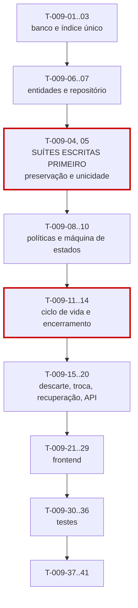

# 009 — Timer · Tarefas

## 1. Convenções

| Campo | Regra |
|---|---|
| **ID** | `T-009-XX`, estável e imutável |
| **Descrição** | Verbo no infinitivo + objeto |
| **Dependências** | IDs de tarefas ou features concluídas |
| **Estimativa** | Horas-agente; acima de 8h deve ser decomposta |
| **Prioridade** | `P0` bloqueante · `P1` necessária · `P2` cortável |

> **Complexidade crítica (SQ-02):** `T-009-04` (preservação do timer) e `T-009-05` (unicidade sob concorrência) são escritas e **revisadas** antes de `T-009-06` a `T-009-14`.
>
> **SQ-03:** duas aprovações obrigatórias no PR.
>
> **Bloqueio absoluto:** esta feature não inicia sem `008-worklogs` em `DONE`. O encerramento **é** uma chamada a `WorkLogService.createFromTimer` (RN-159); não existe caminho próprio de validação.

## 2. Resumo

| Grupo | Tarefas | Estimativa |
|---|:--:|---|
| Banco | 3 | 7h |
| Backend | 14 | 47h |
| Frontend | 9 | 30h |
| Testes | 7 | 32h |
| Documentação | 2 | 3h |
| Infra | 3 | 6h |
| **Total** | **38** | **125h ≈ 8 dias-agente** |

## 3. Banco

| ID | Descrição | Dependências | Estimativa | Prioridade |
|---|---|---|:--:|:--:|
| T-009-01 | Criar `V026__create_timers.sql` com os `CHECK` de INV-TMR-04 e INV-TMR-05 | 008 | 2,5h | P0 |
| T-009-02 | Criar `V027__create_timer_pauses.sql` com `uq_timer_pauses_open` garantindo no máximo uma pausa aberta | T-009-01 | 2h | P0 |
| T-009-03 | Criar `V028__timer_unique_active.sql` com índice único parcial sobre `(user_id)` **sem** `tenant_id`, e os índices de monitoramento | T-009-01 | 2,5h | P0 |

> `V028` é a garantia estrutural de RN-150. A ausência de `tenant_id` no índice é **deliberada** (CP-07): incluí-lo permitiria dois timers ativos do mesmo usuário em tenants distintos, violando CE-13. Esta é a decisão mais fácil de errar da migration inteira.

## 4. Backend

### 4.1 Suítes escritas primeiro (SQ-02)

| ID | Descrição | Dependências | Estimativa | Prioridade |
|---|---|---|:--:|:--:|
| T-009-04 | **Escrever antes do código:** suíte parametrizada provando que o timer é preservado ao falhar em **cada** regra de work log (RN-102 a RN-120, RN-231) | 008, T-009-01 | 5h | P0 |
| T-009-05 | **Escrever antes do código:** teste de concorrência de RN-150 com 100 inícios simultâneos, incluindo o caso cross-tenant | T-009-03 | 4h | P0 |

### 4.2 Núcleo

| ID | Descrição | Dependências | Estimativa | Prioridade |
|---|---|---|:--:|:--:|
| T-009-06 | Criar as entidades `Timer` e `TimerPause` com o enum `TimerStatus` | T-009-01 | 2h | P0 |
| T-009-07 | Criar `TimerRepository` com `findActiveByUser` anotada `@CrossTenant` e justificada (ART-023), e `TimerPauseRepository` | T-009-06 | 3h | P0 |
| T-009-08 | Implementar `ActiveTimerPolicy` (RN-150) apoiada no índice único, tratando a violação como `DEVTIME-2150` | T-009-05, T-009-07 | 3h | P0 |
| T-009-09 | Implementar `TimerElapsedCalculator` (§6.2) e `TimerPausePolicy` (RN-154, RN-156) | T-009-06 | 3,5h | P0 |
| T-009-10 | Implementar `TimerStateMachine` com a matriz §4.8, garantindo que falha no `stop` **não** transiciona (RN-160) | T-009-04, T-009-06 | 4h | P0 |

### 4.3 Ciclo de vida

| ID | Descrição | Dependências | Estimativa | Prioridade |
|---|---|---|:--:|:--:|
| T-009-11 | Implementar `TimerService.start` (RN-152) e `update` (RN-161) | T-009-08 | 3h | P0 |
| T-009-12 | Implementar `pause` e `resume` com abertura e fechamento de `TimerPause` (RN-153 a RN-156) | T-009-09, T-009-10 | 3,5h | P0 |
| T-009-13 | Implementar `TimerToWorkLogAssembler` usando `gross − paused` como valor canônico (CP-04) | T-009-09 | 2,5h | P0 |
| T-009-14 | Implementar `TimerService.stop` na ordem da §6.1, delegando a `WorkLogService.createFromTimer` e **preservando o timer** em qualquer falha (RN-159, RN-160) | T-009-13, T-009-10 | 5h | P0 |
| T-009-15 | Implementar `discard` com confirmação obrigatória e auditoria do tempo descartado (RN-162) | T-009-11 | 2h | P0 |
| T-009-16 | Implementar `TimerSwitchPolicy` para `?stopCurrent=true` de forma **atômica** (RN-166) | T-009-14 | 3h | P1 |
| T-009-17 | Implementar `TimerRecoveryService` com janela de 7 dias (RN-165) | T-009-14 | 3h | P1 |
| T-009-18 | Implementar `TimerQueryService` com `hasActiveForTicket` e `hasActiveForPeriod` incluindo `PAUSED`, e a projeção da equipe **sem** pausas (§19.1) | T-009-07 | 3h | P0 |
| T-009-19 | Implementar `force-stop` com `TIMER_STOP_ANY` e notificação obrigatória ao dono (OWN-05) | T-009-14 | 2,5h | P1 |
| T-009-20 | Criar DTOs, mappers e os três controllers com OpenAPI; `TimerStopErrorResponse` **carregando o timer preservado** | T-009-19, T-009-17 | 4h | P0 |

## 5. Frontend

| ID | Descrição | Dependências | Estimativa | Prioridade |
|---|---|---|:--:|:--:|
| T-009-21 | Criar `TimerApi` e `TimerStore` em escopo `root`, com `elapsed` computado **localmente** por `interval`, sem requisição por segundo (CP-08) | T-009-20 | 4h | P0 |
| T-009-22 | Implementar a sincronização entre abas: `BroadcastChannel`, revalidação em `visibilitychange` e *polling* de 60 s | T-009-21 | 4h | P0 |
| T-009-23 | Criar `dt-timer-display` calculando `HH:MM:SS` a partir dos três campos persistidos | T-009-21 | 2,5h | P0 |
| T-009-24 | Criar `dt-timer-widget` como componente **global** do layout, operável de qualquer tela | T-009-23 | 4h | P0 |
| T-009-25 | Criar `dt-timer-start-dialog` e `dt-timer-switch-dialog` explicando a atomicidade da troca | T-009-24 | 3h | P0 |
| T-009-26 | Criar `dt-timer-stop-dialog` com descrição obrigatória e prévia do work log e do saldo | T-009-24 | 3,5h | P0 |
| T-009-27 | Criar `dt-timer-error-panel` mantendo o cronômetro **visível** e exibindo a sugestão de correção (RN-160) | T-009-26 | 3,5h | P0 |
| T-009-28 | Criar `dt-timer-discard-dialog` exibindo o tempo a ser descartado e `AbandonedTimersPage` | T-009-24 | 3h | P1 |
| T-009-29 | Criar `dt-active-timers-list` **sem** histórico de pausas (§19.1) e aplicar `hasPermission` para ocultar o cronômetro de `VIEWER` | T-009-24 | 2,5h | P1 |

## 6. Testes

| ID | Descrição | Dependências | Estimativa | Prioridade |
|---|---|---|:--:|:--:|
| T-009-30 | Testes do exemplo normativo da §6.2 e da escolha do valor canônico `gross − paused` | T-009-13 | 3h | P0 |
| T-009-31 | Testes da máquina de estados §4.8, incluindo todas as transições proibidas | T-009-10 | 4h | P0 |
| T-009-32 | Testes de pausa e retomada com 50 pausas, verificando `pausedMinutes` e INV-TMR-02/03 | T-009-12 | 4h | P0 |
| T-009-33 | Testes do `TimerMonitorJob` com `Clock` fixo: 8h notifica uma vez, 16h abandona, `PAUSED` abandona igualmente | T-009-34 | 5h | P0 |
| T-009-34 | Testes de recuperação: 7º dia permitido, 8º rejeitado, período fechado, `endedAt` inválido | T-009-17 | 4h | P0 |
| T-009-35 | Testes de troca atômica, encerramento forçado com notificação e descarte de membro removido | T-009-16, T-009-19 | 4h | P0 |
| T-009-36 | Testes de frontend (contagem de requisições, multi-aba) + suíte de isolamento + matriz de permissões | T-009-22, T-009-20 | 5h | P0 |

## 7. Documentação

| ID | Descrição | Dependências | Estimativa | Prioridade |
|---|---|---|:--:|:--:|
| T-009-37 | Sincronizar `docs/04-api/worklogs.md` §9 a §12 com o comportamento implementado | T-009-20 | 2h | P0 |
| T-009-38 | Publicar `hasActiveForTicket`, `hasActiveForPeriod` e `discardForUser` para `007`, `011` e `002`; atualizar o status em `implementation-order.md` §12 | T-009-20 | 1h | P0 |

## 8. Infra

| ID | Descrição | Dependências | Estimativa | Prioridade |
|---|---|---|:--:|:--:|
| T-009-39 | Implementar `TimerMonitorJob` a cada 15 min com `@SchedulerLock`, que **não** encerra nem gera work log (CP-03) | T-009-11 | 3h | P0 |
| T-009-40 | Implementar `AbandonedTimerCleanupJob` para descarte após 7 dias | T-009-39 | 1,5h | P1 |
| T-009-41 | Configurar as métricas da §29, com **alerta** em `timer.stop.failed` e acompanhamento de `timer.discarded.minutes` e `timer.abandoned.expired` | T-009-20 | 1,5h | P0 |

## 9. Ordem de execução

**Caminho crítico:** `T-009-01 → 03 → 06 → 04/05 → 10 → 13 → 14 → 20 → 27 → 30`.

**Por que estas duas suítes precedem o código:**

| Suíte | Por quê |
|---|---|
| `T-009-04` (preservação) | RN-160 é a regra central da feature e a mais fácil de quebrar sem perceber: basta o `stop` alterar o estado antes de chamar a validação. Um teste escrito depois refletiria a ordem que o código já usa. Escrito antes, ele **define** essa ordem |
| `T-009-05` (unicidade) | RN-150 depende de um índice único cuja definição correta (sem `tenant_id`) é contraintuitiva. O teste cross-tenant é o único artefato que torna esse detalhe verificável |

**Paralelizável:** `T-009-23` e `T-009-24` (exibição e widget) dependem apenas do contrato da API e podem ser desenvolvidos com MSW. `T-009-16`, `T-009-17`, `T-009-19`, `T-009-28` e `T-009-29` são `P1` e podem ser concluídos após o núcleo.

**Dependência inversa importante:** `T-009-18` (`hasActiveForTicket`, `hasActiveForPeriod`) é consumida por `007` (RN-311) e `011` (RN-240). Como `007` já estará em `DONE`, sua implementação de RN-311 precisará ser **conectada** a esta interface — tarefa registrada em `T-009-38`. Até lá, `007` trata "nenhum timer ativo" como verdadeiro, comportamento correto enquanto a feature não existe.

**Marco:** a conclusão desta feature entrega **M1** e inicia o dogfooding (§7 de `implementation-order.md`). É a primeira vez que o produto é usado para registrar trabalho real — e o principal detector de RP-02.

## 10. Critérios de conclusão por grupo

| Grupo | Concluído quando |
|---|---|
| Banco | Índice único comprovado por teste de concorrência e por teste cross-tenant; pausa aberta única garantida; `CHECK` de INV-TMR-04/05 rejeitam `INSERT` direto |
| Backend | Timer preservado em falha de **cada** regra de `008`; valor canônico `gross − paused`; nenhuma validação de work log duplicada; troca de tarefa atômica; job que não encerra nem gera work log |
| Frontend | Nenhuma requisição por segundo, comprovado por contagem; abas sincronizadas; cronômetro visível na tela de erro com sugestão; zero violações do axe-core |
| Testes | Suítes de preservação e unicidade escritas antes do código; cobertura ≥ 90%; bordas de 8h e 16h com `Clock` fixo; isolamento verde nos 11 endpoints |
| Documentação | `worklogs.md` §9 a §12 sincronizado; três interfaces publicadas e conectadas em `007` |
| Infra | `TimerMonitorJob` idempotente; alertas de `timer.stop.failed` ativos; métricas de RP-02 sendo coletadas antes do início do dogfooding |
