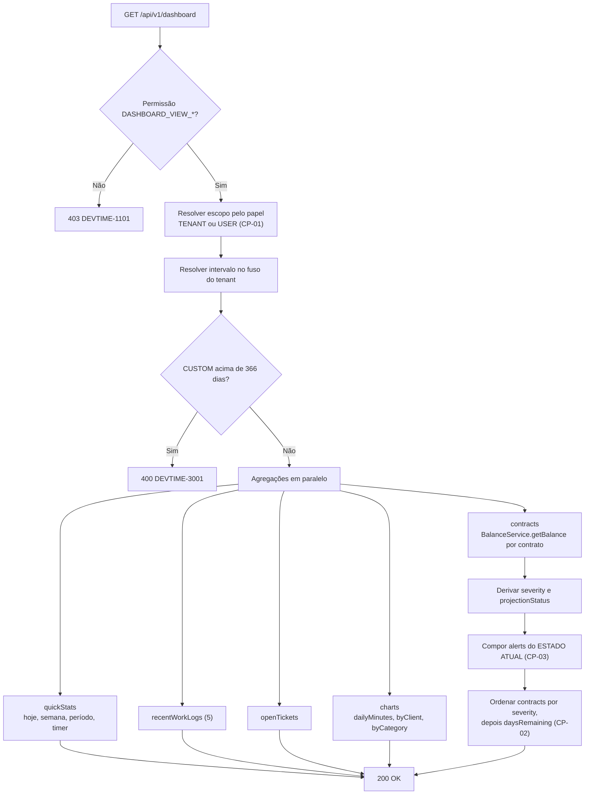
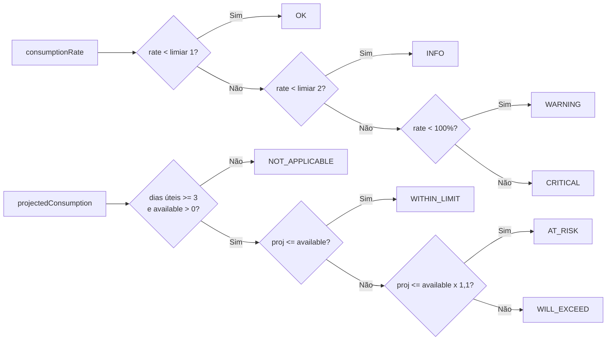
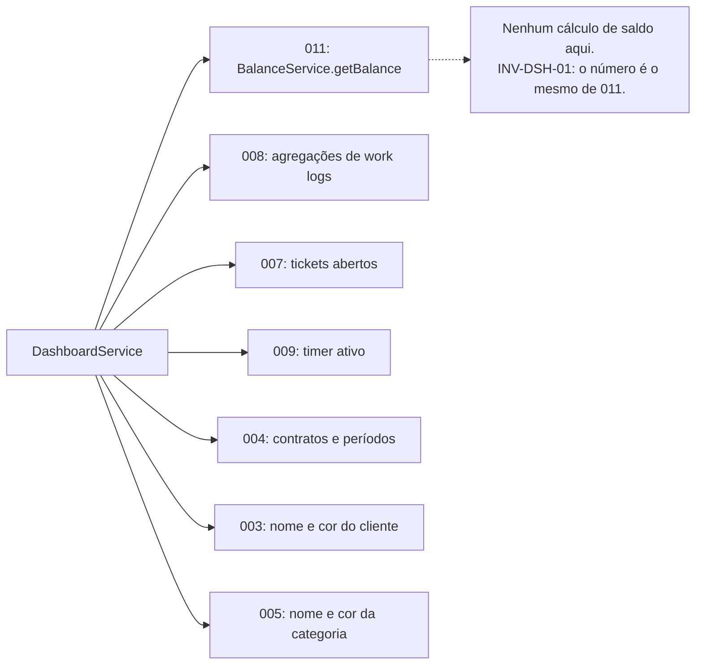

# 010 — Dashboard

| Campo | Valor |
|---|---|
| **Feature** | 010 |
| **Épico** | EP-09 (Dashboard) |
| **Sprint** | S8 |
| **Prioridade** | P1 |
| **Complexidade** | Média |
| **Estimativa** | 21 pts · 5 dias-agente |
| **Stories** | US-125 a US-134 |
| **Status** | SPEC_APPROVED |

## 1. Objetivo

Apresentar, em uma única tela, o estado operacional do tenant: horas do dia, da semana e do período, situação de saldo de cada contrato ordenada por criticidade, alertas derivados do estado presente, registros recentes, tickets abertos e três gráficos de distribuição.

## 2. Problema que resolve

Toda a informação do dashboard já existe em outras telas. O problema que ele resolve não é de dado, é de **atenção**: o freelancer precisa saber, em cinco segundos ao abrir o sistema, se algum contrato está perto de estourar. Sem isso, ele descobre o excedente quando o cliente reclama da fatura.

A ordenação por **criticidade** (§10.1 de `reports.md`) é a decisão central: contratos não aparecem em ordem alfabética nem por data, mas por quão perto estão de um problema. O que exige ação hoje fica no topo.

A segunda decisão é que `alerts` deriva do **estado atual**, não das notificações persistidas. Uma notificação é um evento passado; o dashboard responde "como estão as coisas agora". Se um ajuste resolveu o excedente ontem, o alerta desaparece hoje — mesmo que a notificação permaneça no histórico (CE-11).

## 3. Escopo

| # | Item | Referência |
|---|---|---|
| E-01 | Estatísticas rápidas: hoje, semana, período, timer ativo | §10.1 `reports.md` |
| E-02 | Cartões de contrato ordenados por criticidade | §10.1 |
| E-03 | Severidade e projeção por contrato | §6.7 `entities.md` |
| E-04 | Alertas derivados do estado presente | §10.1 |
| E-05 | Cinco registros de horas mais recentes | §10.1 |
| E-06 | Tickets abertos do usuário | §10.1 |
| E-07 | Gráfico de minutos por dia, com 30 pontos sempre preenchidos | §10.1 |
| E-08 | Gráficos de distribuição por cliente e por categoria | §10.1 |
| E-09 | Recarga isolada de gráfico por tipo | §10.2 |
| E-10 | Escopo `TENANT` ou `USER` conforme o papel | §10.1, §9 `permissions.md` |
| E-11 | Seleção de período, incluindo intervalo personalizado | §10.1 |
| E-12 | Tela P09 | `pages.md` |

## 4. Fora do escopo

| Item | Onde está | Motivo |
|---|---|---|
| Cálculo de saldo | `011-bank-hours` | Esta feature **consome** `BalanceService.getBalance` |
| Notificações persistidas | `013-notifications` | `alerts` deriva do estado presente, **não** das notificações |
| Relatórios e exportação | `012-reports` | Dashboard é visão operacional, não documento entregável |
| Registro de horas e cronômetro | `008`, `009` | Apenas exibidos |
| Personalização de layout | Fora do roadmap | Um layout curado é mais útil que um configurável mal montado |
| Comparação entre períodos | Fora do roadmap | Sem demanda validada |
| Metas e indicadores de produtividade individual | Fora do roadmap | Contraria a decisão de privacidade de §19.1 de `009-timer` |
| Dashboard por cliente | `003-clients` | `GET /clients/{id}/summary` já cobre |

## 5. Dependências

### 5.1 Features
| Feature | Tipo | O que consome |
|---|---|---|
| `011-bank-hours` | **Bloqueante** | `BalanceService.getBalance`; severidade e projeção |
| `008-worklogs` | Bloqueante | Agregações por dia, cliente e categoria; registros recentes |
| `007-tickets` | Bloqueante | Tickets abertos do usuário |
| `009-timer` | Bloqueante | Timer ativo em `quickStats` |
| `004-contracts` | Bloqueante | Contratos e períodos correntes |
| `003-clients` | Bloqueante | Nome e cor do cliente nos gráficos |
| `005-categories` | Bloqueante | Nome e cor da categoria |

### 5.2 Documentos obrigatórios
| Documento | Seções relevantes |
|---|---|
| `docs/04-api/reports.md` | §10 Dashboard |
| `docs/02-domain/entities.md` | §6.7 campos derivados de `ContractPeriod` |
| `docs/02-domain/business-rules.md` | RN-218 a RN-222, RN-602, RN-702 |
| `docs/02-domain/permissions.md` | §6.9, §7, §9 |
| `docs/05-ui/pages.md` | P09 |
| `docs/05-ui/design-system.md` | Cores de severidade, tokens de gráfico |

### 5.3 Infraestrutura
| Componente | Uso |
|---|---|
| PostgreSQL | Agregações sobre `work_logs`, `contract_periods`, `tickets` |
| Cache em memória | Gráficos, com invalidação por evento — ver §20 |

## 6. Regras de negócio

> **Esta feature não introduz nenhuma regra de negócio.** Ela é integralmente derivada. Todas as regras abaixo são **consumidas** de outras features, e é exatamente por isso que a seção existe: para tornar explícito que o dashboard não recalcula nada por conta própria.

| ID | Tipo | Enunciado resumido | Erro | Onde é aplicada |
|---|---|---|---|---|
| RN-218 a RN-222 | Derivada | Fórmulas de saldo | — | Consumidas de `011` via `BalanceService` |
| RN-223 | Derivada | Não faturáveis fora do saldo | — | Idem |
| RN-702 | Automática | Período aberto é marcado como **parcial** | — | `dt-partial-badge` de `011` |
| RN-012 | Bloqueante | Listagens internas limitadas | `DEVTIME-2006` / 400 | `DashboardController` |
| RN-705 | Bloqueante | Intervalo personalizado não excede 366 dias | `DEVTIME-3001` / 400 | `DashboardPeriodResolver` |
| RN-009 | Automática | Datas no fuso do tenant | — | Toda agregação |
| RN-001 / RN-002 | Bloqueante | Tenant do usuário; recurso externo retorna `404` | `DEVTIME-1200` / `2002` | Filtro automático |

### 6.1 Regras de composição da resposta (§10.1 de `reports.md`)

| # | Regra | Motivo |
|---|---|---|
| CP-01 | `scope = TENANT` para papéis com `DASHBOARD_VIEW_ANY`; `USER` para `MEMBER` | §9 `permissions.md` |
| CP-02 | `contracts` ordenado por `severity` decrescente, depois `daysRemaining` crescente | O que exige ação hoje fica no topo |
| CP-03 | `alerts` derivado do **estado atual**, nunca das notificações persistidas | O dashboard responde "como está agora" |
| CP-04 | `charts.dailyMinutes` sempre com **30 pontos**; dias sem registro com zero | Um gráfico que omite dias vazios sugere continuidade que não existe |
| CP-05 | `recentWorkLogs` limitado a 5 | É atalho, não listagem |
| CP-06 | Percentuais dos gráficos somam 100 ± arredondamento, com o resto atribuído à maior fatia | Evita "Outros: −0,01%" |

### 6.2 Escala de severidade

Derivada de `consumptionRate` e dos limiares do contrato (`notificationThresholds`, default `[50, 80, 100]`):

| `severity` | Condição | Cor |
|---|---|---|
| `OK` | `rate < 50%` | Neutra |
| `INFO` | `50% ≤ rate < 80%` | Informativa |
| `WARNING` | `80% ≤ rate < 100%` | Atenção |
| `CRITICAL` | `rate ≥ 100%` | Crítica |

> A escala usa os **limiares do contrato**, não valores fixos. Um contrato com `notificationThresholds = [70, 90]` produz `INFO` a partir de 70% e `WARNING` a partir de 90%. Fixar 50/80/100 no dashboard divergiria dos alertas que o cliente recebe por e-mail (RN-602) — dois números diferentes para a mesma situação.

**Contrato `HOURLY_OPEN`:** `available = 0` ⇒ `rate = 0` ⇒ `severity = OK` sempre; nenhum alerta (CE-10).

### 6.3 Estados de projeção

| `projectionStatus` | Condição | Significado |
|---|---|---|
| `WITHIN_LIMIT` | `projectedConsumption ≤ available` | O ritmo atual não estoura o saldo |
| `AT_RISK` | `available < projectedConsumption ≤ available × 1,1` | Estouro provável, margem estreita |
| `WILL_EXCEED` | `projectedConsumption > available × 1,1` | Estouro provável com folga |
| `NOT_APPLICABLE` | `available = 0` ou menos de 3 dias úteis decorridos | Projeção sem base estatística |

> `NOT_APPLICABLE` com menos de 3 dias úteis é deliberado: `burnRate` calculado sobre um único dia projeta 20× esse dia, produzindo alarmes falsos no início de todo período. Exibir "vai estourar" no dia 2 e "tudo certo" no dia 10 destrói a confiança na projeção.

### 6.4 Invariantes envolvidas
| ID | Invariante | Como é garantida |
|---|---|---|
| INV-DSH-01 | O saldo exibido é idêntico ao de `011` para o mesmo período | Consome `BalanceService`, nunca recalcula |
| INV-DSH-02 | `scope = USER` nunca expõe dado de terceiro | `Specification` no repositório (IMP-02) |
| INV-DSH-03 | `dailyMinutes` sempre possui 30 pontos | Preenchimento de lacunas no mapper |
| INV-DSH-04 | Nenhum valor monetário sem `CONTRACT_VIEW_FINANCIAL` | Omissão no mapper |

## 7. Fluxo principal

1. Usuário autenticado acessa `/dashboard` (P09).
2. O guard verifica `DASHBOARD_VIEW_OWN` ou `DASHBOARD_VIEW_ANY`.
3. O front envia `GET /api/v1/dashboard` com o período de `user.preferences.dashboardPeriod` (default `CURRENT_PERIOD`).
4. `DashboardService` resolve o escopo pelo papel (CP-01) e o intervalo de datas no fuso do tenant.
5. Executa as agregações em paralelo: estatísticas, contratos, registros recentes, tickets abertos e três gráficos.
6. Para cada contrato ativo, consome `BalanceService.getBalance` e deriva `severity` e `projectionStatus`.
7. Compõe `alerts` a partir do estado presente dos períodos (CP-03).
8. Ordena `contracts` por criticidade (CP-02).
9. Retorna `200` com a estrutura completa da §10.1 de `reports.md`.
10. O front renderiza; a troca de período de um gráfico usa `GET /dashboard/chart/{type}`, sem recarregar tudo.

## 8. Fluxos alternativos

| # | Fluxo | Gatilho | Comportamento |
|---|---|---|---|
| FA-01 | Tenant sem nenhum contrato | Conta nova | Retorna estrutura vazia com estado de boas-vindas, apontando para o onboarding (P08) |
| FA-02 | Tenant sem registros no período | — | Estatísticas zeradas; `dailyMinutes` com 30 pontos em zero; gráficos vazios com mensagem |
| FA-03 | `MEMBER` acessando | Papel sem `DASHBOARD_VIEW_ANY` | `scope = USER`; apenas os próprios registros; sem valores monetários |
| FA-04 | Timer ativo | — | `activeTimerMinutes` preenchido; o cartão do timer destaca o ticket |
| FA-05 | Troca de período | Seletor | Nova chamada completa; o período escolhido é persistido em `preferences` |
| FA-06 | Intervalo personalizado | `period=CUSTOM` | Exige `from` e `to`; limitado a 366 dias (RN-705) |
| FA-07 | Recarga de um gráfico | Seletor local do gráfico | `GET /dashboard/chart/{type}`; não recarrega o dashboard |
| FA-08 | Contrato com excedente | `rate ≥ 100%` | `severity = CRITICAL`; cartão no topo; alerta correspondente |
| FA-09 | Contrato `HOURLY_OPEN` | — | `severity = OK`; sem projeção nem alerta (CE-10) |
| FA-10 | Período no início | Menos de 3 dias úteis | `projectionStatus = NOT_APPLICABLE` |
| FA-11 | Período aberto | — | Todos os valores marcados como **parciais** (RN-702) |
| FA-12 | Período fechado como corrente | Contrato encerrado | Saldo servido do snapshot; marcado como definitivo |
| FA-13 | Ajuste resolve o excedente | `011` | O alerta **desaparece** na próxima carga; a notificação permanece no histórico (CE-11) |
| FA-14 | 50 contratos ativos | Tenant grande | Cartões paginados por rolagem; os 10 mais críticos carregados primeiro |

## 9. Diagramas

### 9.1 Composição da resposta

### 9.2 Escala de severidade e projeção

### 9.3 Origem de cada bloco

## 10. Estados

`Dashboard` **não é uma entidade** e não possui estado persistido. Seus estados são de apresentação:

| Estado | Condição | Comportamento |
|---|---|---|
| Carregando | Requisição em andamento | Esqueletos por bloco; cada bloco aparece ao ficar pronto |
| Vazio — sem contratos | Tenant novo | Estado de boas-vindas com atalho para o onboarding (FA-01) |
| Vazio — sem registros | Contratos existem, período sem horas | Estrutura completa com zeros e mensagem explicativa |
| Parcial | Período corrente aberto | Todos os valores com selo de parcial (RN-702) |
| Definitivo | Período corrente fechado | Valores do snapshot, sem selo de parcial |
| Erro parcial | Um bloco falhou | Os demais são exibidos; o bloco com falha oferece "tentar novamente" |

> **Erro parcial é comportamento esperado, não defeito.** O dashboard agrega seis fontes; se a agregação de gráficos falhar, os cartões de contrato — que são o dado mais importante — devem continuar visíveis. Falhar tudo por causa de um gráfico transformaria um problema pequeno em tela branca.

## 11. Transições

| Origem | Destino | Gatilho | Efeito |
|---|---|---|---|
| Carregando | Carregado | Resposta recebida | Renderiza os blocos |
| Carregado | Carregando | Troca de período | Nova chamada completa; período persistido em `preferences` |
| Carregado | Carregado | Troca de período de um gráfico | Apenas aquele gráfico é recarregado (§10.2) |
| Carregado | Carregado | Evento de `008`, `009` ou `011` | Invalidação de cache; recarga na próxima navegação |
| Qualquer | Erro parcial | Falha em um bloco | Bloco isolado com ação de repetir |

### 11.1 Transições proibidas
| Transição | Motivo da proibição |
|---|---|
| Recalcular saldo localmente | INV-DSH-01. Dois cálculos do mesmo número divergem na primeira mudança de regra |
| Derivar `alerts` das notificações persistidas | CP-03. O dashboard reflete o presente; a notificação é um evento passado |
| Omitir dias sem registro em `dailyMinutes` | CP-04, INV-DSH-03. Sugere continuidade inexistente |
| Exibir dado de terceiro em `scope = USER` | INV-DSH-02, §9 `permissions.md` |
| Falhar o dashboard inteiro por falha de um bloco | §10; transforma problema pequeno em tela branca |
| Atualização automática por *polling* | §20; o dashboard não é monitor em tempo real |

## 12. Casos de erro

| Código | HTTP | Situação | Mensagem ao usuário | Regra |
|---|:--:|---|---|---|
| `DEVTIME-1101` | 403 | Sem `DASHBOARD_VIEW_OWN` nem `_ANY` | Você não tem permissão para esta ação | §7 permissions |
| `DEVTIME-2002` | 404 | Contrato ou período de outro tenant | Recurso não encontrado | RN-002 |
| `DEVTIME-2006` | 400 | Limite de listagem interna excedido | Parâmetro inválido | RN-012 |
| `DEVTIME-3001` | 400 | Intervalo personalizado acima de 366 dias | Intervalo de datas excede o máximo permitido | RN-705 |
| `DEVTIME-2000` | 422 | `period=CUSTOM` sem `from` ou `to` | Informe o período personalizado | §10.1 |
| `DEVTIME-1201` | 403 | Tenant cancelado | Organização cancelada | RN-008 |

> Tenant **suspenso** permite leitura (RN-007), portanto o dashboard funciona normalmente. Apenas o tenant cancelado é bloqueado.

### 12.1 Casos extremos

| # | Caso | Comportamento esperado |
|---|---|---|
| CX-01 | Tenant sem contratos | Estado de boas-vindas; nenhuma agregação executada |
| CX-02 | Tenant sem registros no período | 30 pontos em zero; gráficos vazios com mensagem, não ausentes |
| CX-03 | Um único dia com registro no mês | 29 pontos em zero e 1 com valor; o gráfico não sugere tendência |
| CX-04 | Período com menos de 3 dias úteis decorridos | `projectionStatus = NOT_APPLICABLE` (§6.3) |
| CX-05 | Contrato `HOURLY_OPEN` | `severity = OK`; sem projeção nem alerta (CE-10) |
| CX-06 | Contrato com `available = 0` e consumo positivo | `rate = 100`; `severity = CRITICAL` (RN-222) |
| CX-07 | 50 contratos ativos | Os 10 mais críticos primeiro; demais por rolagem |
| CX-08 | Contrato com limiares personalizados `[70, 90]` | Severidade segue **esses** limiares, não 50/80 (§6.2) |
| CX-09 | Ajuste resolve o excedente | Alerta desaparece; notificação permanece no histórico (CE-11, FA-13) |
| CX-10 | Período corrente fechado | Servido do snapshot; sem selo de parcial (FA-12) |
| CX-11 | Timer ativo em outro tenant do mesmo usuário | **Não** aparece — `quickStats` é do tenant corrente |
| CX-12 | `MEMBER` sem nenhum registro próprio | Estatísticas zeradas; nenhum dado de colega exibido |
| CX-13 | `MEMBER` com contratos vinculados | Vê os cartões desses contratos, **sem** valores monetários |
| CX-14 | Percentuais somando 99,99% por arredondamento | O resto é atribuído à maior fatia (CP-06) |
| CX-15 | Cliente sem cor definida | Cor derivada do nome (`ClientColorGenerator` de `003`) |
| CX-16 | Categoria excluída com registros no período | Exibida com o nome vigente (`getAllForReport` de `005`) |
| CX-17 | Falha na agregação de gráficos | Cartões e estatísticas exibidos; gráficos com ação de repetir |
| CX-18 | Intervalo personalizado de exatamente 366 dias | Aceito; 367 rejeitado (RN-705) |
| CX-19 | Fuso do tenant diferente do navegador | Agregações no fuso do **tenant**; "hoje" é o dia local do tenant |
| CX-20 | Dia de virada de horário de verão | O dia tem 23 ou 25 horas; o agrupamento usa a data local, sem duplicar nem omitir |

## 13. Modelo de dados

### 13.1 Entidades impactadas
| Entidade | Operação | Tabela | Referência |
|---|---|---|---|
| `WorkLog` | **Lê** (agregações) | `work_logs` | Via `WorkLogAggregationService` |
| `ContractPeriod` | **Lê** (saldo) | `contract_periods` | Via `BalanceService` |
| `Contract` | **Lê** | `contracts` | Via `ContractService` |
| `Ticket` | **Lê** | `tickets` | Via `TicketService` |
| `Timer` | **Lê** | `timers` | Via `TimerQueryService` |
| `Client`, `Category` | **Lê** (nome e cor) | — | Via services |

> **Esta feature não cria, atualiza nem exclui nenhum registro.** É integralmente de leitura. Nenhuma migration, nenhuma auditoria de escrita, nenhum evento publicado.

### 13.2 Campos obrigatórios na criação
Não se aplica — a feature não persiste nada.

### 13.3 Migrations
| Migration | Conteúdo | Compatibilidade |
|---|---|---|
| `V032__dashboard_indexes.sql` | Índices de cobertura para as agregações da §13.4 | Somente índices |

> Única migration da feature, e apenas de índices. Sem ela, as agregações usariam os índices de listagem de `008`, que não cobrem as colunas necessárias — degradando com volume (RP-06).

### 13.4 Índices
| Índice | Colunas | Sustenta |
|---|---|---|
| `idx_work_logs_dashboard_daily` | `(tenant_id, work_date, user_id)` INCLUDE `(net_minutes, billable_minutes)` | `dailyMinutes` e `quickStats` — índice **coberto** |
| `idx_work_logs_dashboard_client` | `(tenant_id, work_date, client_id)` INCLUDE `(net_minutes)` | `byClient` |
| `idx_work_logs_dashboard_category` | `(tenant_id, work_date, category_id)` INCLUDE `(net_minutes)` | `byCategory` |
| `idx_contracts_active_dashboard` | `(tenant_id, status)` WHERE `status IN ('ACTIVE','SUSPENDED')` | Cartões de contrato |
| `idx_tickets_open_assignee` | `(tenant_id, assignee_id, status)` WHERE `status NOT IN ('DONE','CANCELLED')` | `openTickets` — criado em `007` |
| `idx_work_logs_user_date` | `(tenant_id, user_id, work_date DESC)` | `recentWorkLogs` — criado em `008` |

> Os três primeiros usam `INCLUDE` para se tornarem **índices cobertos**: a agregação é resolvida sem acessar a tabela. É o que permite atingir p95 < 800 ms com 100.000 registros (RNF-003, RP-06).

## 14. Endpoints utilizados

| Método | Rota | Operação | Permissão | Sucesso | Doc |
|---|---|---|---|:--:|---|
| GET | `/api/v1/dashboard` | Dashboard completo | `DASHBOARD_VIEW_OWN`/`_ANY` | 200 | §10.1 `reports.md` |
| GET | `/api/v1/dashboard/chart/{type}` | Gráfico isolado | `DASHBOARD_VIEW_OWN`/`_ANY` | 200 | §10.2 |

**Tipos de gráfico:** `daily-minutes`, `by-client`, `by-category`, `by-contract`, `billable-ratio`, `consumption-trend`.

## 15. Eventos

| Evento | Publicado por | Consumidores | Momento | Efeito |
|---|---|---|---|---|
| `WorkLogCreatedEvent` etc. | `008-worklogs` | `DashboardCacheInvalidator` | Após o commit | Invalida o cache de gráficos do tenant |
| `PeriodClosedEvent` | `011-bank-hours` | Idem | Após o commit | Invalida o cache |
| `PeriodReopenedEvent` | `011-bank-hours` | Idem | Após o commit | Invalida o cache |
| `AdjustmentAppliedEvent` | `011-bank-hours` | Idem | Após o commit | Invalida o cache |

> **Esta feature não publica nenhum evento.** Ela apenas consome, para invalidar cache. Um dashboard que publicasse eventos criaria dependência circular com as features que ele agrega.

## 16. Permissões

| Operação | Permissão | Papéis | Ownership | Escopo de dados |
|---|---|---|---|---|
| Dashboard consolidado | `DASHBOARD_VIEW_ANY` | OWNER, ADMIN, MANAGER, VIEWER | — | `scope = TENANT`: todos os dados |
| Dashboard pessoal | `DASHBOARD_VIEW_OWN` | Todos os 5 papéis | OWN-01 | `scope = USER`: apenas os próprios registros |
| Valores monetários | `CONTRACT_VIEW_FINANCIAL` | OWNER, ADMIN, MANAGER, VIEWER | — | `MEMBER` **não** vê |

**Regra de resolução do escopo (CP-01):**

| Papel | `scope` | `quickStats` | `contracts` | `recentWorkLogs` | Gráficos |
|---|---|---|---|---|---|
| OWNER, ADMIN, MANAGER, VIEWER | `TENANT` | Todo o tenant | Todos | De todos | De todos |
| MEMBER | `USER` | Apenas os próprios | Apenas vinculados ² | Apenas os próprios | Apenas os próprios |

> **`VIEWER` vê o dashboard consolidado.** É deliberado: o papel existe para o contador ou sócio não operacional, que precisa da visão financeira completa sem poder alterar nada (§9 `permissions.md`).
>
> **`MEMBER` vê contratos vinculados sem valores monetários** (nota ² de `permissions.md`). Ele precisa saber se o contrato em que trabalha está perto do limite — essa informação muda o que ele faz hoje. Não precisa saber quanto isso vale.

## 17. Validações

### 17.1 Camada 1 — Formato (`400`)
| Campo | Restrição | Mensagem |
|---|---|---|
| `period` | Enum: `CURRENT_PERIOD`, `LAST_7_DAYS`, `LAST_30_DAYS`, `CUSTOM` | Período inválido |
| `from`, `to` | Obrigatórios se `CUSTOM`; datas válidas; `to ≥ from` | Informe o período personalizado |
| `type` (gráfico) | Um dos 6 tipos da §14 | Tipo de gráfico inválido |

### 17.2 Camada 2 — Negócio
| Validação | Regra | Erro |
|---|---|---|
| Intervalo personalizado ≤ 366 dias | RN-705 | `DEVTIME-3001` / 400 |
| Escopo conforme o papel | CP-01, §9 | Aplicado por `Specification` |
| Valores monetários por permissão | INV-DSH-04 | Omitidos no mapper |

### 17.3 Camada 3 — Consistência
Não se aplica — a feature não escreve. A consistência dos valores exibidos é garantida pelas features de origem.

## 18. Auditoria

| Ação | `action` | Observação |
|---|---|---|
| — | — | **Não se aplica.** Nenhuma escrita ocorre nesta feature. Consultas de leitura não geram `AuditLog` — se gerassem, cada abertura de dashboard poluiria a trilha de auditoria com dezenas de entradas sem valor investigativo (RN-006 aplica-se a **alterações**). |

> A ausência de auditoria aqui é uma decisão, não um esquecimento. O acesso ao dashboard é registrado em **log de aplicação** (§28) para fins de telemetria, não na trilha de auditoria do tenant.

## 19. Segurança

| # | Vetor | Mitigação | Verificação |
|---|---|---|---|
| SG-01 | Dado de outro tenant em agregação | Filtro automático em toda consulta; nenhuma agregação sem `tenant_id` | Suíte de isolamento |
| SG-02 | `MEMBER` inferindo horas de colegas pelos totais | `scope = USER` aplicado por `Specification`; agregações filtradas por `user_id` | Inspeção de SQL |
| SG-03 | `MEMBER` inferindo faturamento pelos cartões | Valores monetários omitidos no mapper | Teste por papel |
| SG-04 | `MEMBER` inferindo carteira completa de clientes pelos gráficos | `byClient` restrito aos clientes dos contratos vinculados | Teste dedicado |
| SG-05 | Enumeração de contratos por id no gráfico | Ids retornados são apenas dos contratos visíveis ao papel | Teste |
| SG-06 | Intervalo enorme causando exaustão de recursos | RN-705 limita a 366 dias | Teste com 367 dias |
| SG-07 | Cache servindo dado de outro tenant | Chave de cache **sempre** inclui `tenantId` e o escopo resolvido | Teste com dois tenants |

### 19.1 LGPD

| Dado pessoal | Base legal | Retenção | Exportação | Anonimização | Proibido em log |
|---|---|---|---|---|---|
| Agregados por usuário (`quickStats` em `scope = USER`) | Legítimo interesse | Não retido — calculado sob demanda | Via `008` | Nome substituído na exibição | ❌ |

**Análise.** O dashboard **não persiste** nenhum dado pessoal: tudo é agregado sob demanda a partir das features de origem. A questão relevante é de **exposição**, não de retenção.

A decisão está em CP-01 e §16: `MEMBER` vê `scope = USER`. Isso significa que o dashboard nunca se torna um painel de produtividade comparativa entre colegas — o que seria a consequência natural de dar `DASHBOARD_VIEW_ANY` a todos. Essa restrição é coerente com a decisão de §19.1 de `009-timer` (o histórico de pausas não é exposto) e é o que impede o produto de virar ferramenta de vigilância.

Por isso, "metas e indicadores de produtividade individual" está explicitamente **fora do escopo** (§4).

## 20. Performance

| Operação | Meta | Índice/estratégia | Risco |
|---|---|---|---|
| Dashboard completo | **p95 < 800 ms** com 100.000 registros | Agregações em paralelo; índices cobertos; cache de gráficos | RP-06 — o risco central da feature |
| `quickStats` | p95 < 150 ms | `idx_work_logs_dashboard_daily` coberto | — |
| Cartões de contrato | p95 < 300 ms | `BalanceService` sobre desnormalizados; sem agregação | 50 contratos ativos |
| `dailyMinutes` | p95 < 200 ms | Índice coberto; 30 pontos | — |
| `byClient` / `byCategory` | p95 < 250 ms cada | Índices cobertos | — |
| `recentWorkLogs` | p95 < 100 ms | `idx_work_logs_user_date`, limite 5 | — |
| `openTickets` | p95 < 150 ms | `idx_tickets_open_assignee` parcial | — |
| Gráfico isolado | p95 < 250 ms | Mesmo índice do bloco correspondente | — |

**Estratégia de cache.** Gráficos são cacheados em memória por `(tenantId, scope, userId?, chartType, periodKey)`, com TTL de 5 minutos e invalidação por evento (§15). `quickStats` e cartões de contrato **não** são cacheados: são os valores que o usuário mais espera ver atualizados, e já são rápidos por serem servidos de desnormalizados.

**Sem atualização automática.** O dashboard não faz *polling* nem mantém conexão aberta. É uma foto do momento da carga, e o usuário recarrega quando quiser. Um dashboard que se atualiza sozinho a cada 30 segundos multiplicaria a carga de agregação por um ganho de percepção irrelevante — nenhuma decisão do usuário depende de saber o saldo com 30 segundos de atraso.

### 20.1 Escalabilidade

RP-06 identifica **desempenho com volume** como o risco desta feature, e a meta de 800 ms com 100.000 registros (RNF-003) é o critério objetivo.

Três decisões sustentam essa meta:

**Índices cobertos.** Os três índices de agregação usam `INCLUDE`, resolvendo a soma sem tocar na tabela. Com 100.000 registros, a agregação de 30 dias lê algumas centenas de entradas de índice, não centenas de milhares de linhas.

**Saldo servido de desnormalizados.** Os cartões de contrato consomem `BalanceService`, que lê `consumedMinutes` já calculado (`011`). Agregar work logs por contrato a cada carga do dashboard seria linear no volume — exatamente o que os desnormalizados de `008` e `011` existem para evitar.

**Agregações em paralelo.** Os seis blocos são independentes e executam concorrentemente. O tempo total é o do bloco mais lento, não a soma.

Com 50 contratos ativos, os cartões são o bloco mais custoso: 50 chamadas a `BalanceService`. A mitigação é carregar os 10 mais críticos primeiro (CX-07) e os demais por rolagem — o usuário age sobre os críticos, e os outros podem esperar.

## 21. Componentes Frontend

### 21.1 Rotas
| Rota | Componente | Guard | Lazy | Tela |
|---|---|---|:--:|---|
| `/dashboard` | `DashboardPage` | `permissionGuard(['DASHBOARD_VIEW_OWN'])` | ✔ | P09 |

### 21.2 Componentes
| Componente | Tipo | Responsabilidade | Inputs | Outputs |
|---|---|---|---|---|
| `DashboardPage` | Page | Orquestra os blocos, seletor de período e estados vazios | — | — |
| `dt-quick-stats` | Presentational | Hoje, semana, período e timer ativo | `stats` | — |
| `dt-contract-status-card` | Presentational | Contrato com saldo, medidor, severidade e projeção | `contract`, `showFinancial` | `select` |
| `dt-alert-list` | Presentational | Alertas do estado atual, com link para o recurso | `alerts` | `navigate` |
| `dt-recent-worklogs` | Presentational | Cinco registros mais recentes | `workLogs` | `select` |
| `dt-open-tickets` | Presentational | Tickets em andamento | `tickets` | `select` |
| `dt-daily-minutes-chart` | Presentational | Barras de 30 dias, com zeros visíveis | `data` | `changePeriod` |
| `dt-distribution-chart` | Presentational | Rosca por cliente ou categoria, com cores da entidade | `data`, `title` | `changePeriod` |
| `dt-period-selector` | Shared | Seleção de período, incluindo intervalo personalizado | `value` | `change` |
| `dt-block-error` | Shared | Erro isolado de um bloco, com ação de repetir | `error` | `retry` |
| `dt-empty-state` | Shared | Estado vazio com orientação contextual | `variant` | `action` |

> `dt-balance-summary`, `dt-consumption-gauge` e `dt-partial-badge` são **reutilizados de `011-bank-hours`** (§21.2 daquela spec). Recriá-los aqui produziria duas representações visuais do mesmo saldo, que divergiriam.
>
> `dt-daily-minutes-chart` exibe os zeros explicitamente (CP-04). Um gráfico de barras que omite dias vazios comprime o eixo e sugere trabalho contínuo onde houve pausa.

### 21.3 Stores e serviços Angular
| Artefato | Tipo | Estado exposto | Escopo |
|---|---|---|---|
| `DashboardStore` | Store | `data`, `period`, `loading` por bloco, `errors` por bloco | Provido na rota `/dashboard` |
| `DashboardApi` | API | Somente HTTP dos 2 endpoints | `providedIn: 'root'` |

> `loading` e `errors` são **por bloco**, não globais. É o que permite o estado de erro parcial da §10: um gráfico que falha não apaga os cartões de contrato.

### 21.4 Guards, interceptors, pipes e directives
| Artefato | Tipo | Uso |
|---|---|---|
| `permissionGuard` | Guard | Protege P09 |
| `hasPermission` | Directive | Oculta valores monetários sem `CONTRACT_VIEW_FINANCIAL` |
| `durationPipe` | Pipe | Minutos → `HH:MM` |
| `consumptionRatePipe` | Pipe | Percentual com 2 casas — reutilizado de `011` |
| `severityDirective` | Directive | Aplica cor por severidade |

## 22. Serviços Backend

### 22.1 Controllers
| Classe | Rota base | Endpoints |
|---|---|---|
| `DashboardController` | `/api/v1/dashboard` | dashboard completo, gráfico isolado |

### 22.2 Services
| Interface | Implementação | Responsabilidade | Permissão declarada |
|---|---|---|---|
| `DashboardService` | `DashboardServiceImpl` | Orquestra os blocos em paralelo e compõe a resposta | `DASHBOARD_VIEW_OWN`/`_ANY` |
| `DashboardChartService` | `DashboardChartServiceImpl` | Os 6 tipos de gráfico, com cache | Idem |
| `DashboardAlertService` | `DashboardAlertServiceImpl` | Alertas derivados do **estado atual** (CP-03) | Idem |

> **Esta feature não expõe nenhuma interface pública** para outras features. Ela é folha no grafo de dependências: consome de seis features e não é consumida por nenhuma. É o que permite cortá-la sem impacto — ela é `P1`, e está na ordem de corte de `mvp.md`.

### 22.3 Componentes de domínio
| Classe | Tipo | Responsabilidade | Regras |
|---|---|---|---|
| `DashboardScopeResolver` | Policy | Resolve `TENANT` ou `USER` pelo papel | CP-01, §9 |
| `DashboardPeriodResolver` | Utilitário | Resolve o intervalo no fuso do tenant; valida 366 dias | RN-009, RN-705 |
| `SeverityCalculator` | Calculator | Severidade pelos limiares **do contrato** | §6.2 |
| `ProjectionCalculator` | Calculator | `projectionStatus` com guarda de 3 dias úteis | §6.3 |
| `ChartGapFiller` | Utilitário | Preenche os 30 pontos de `dailyMinutes` | CP-04, INV-DSH-03 |
| `PercentageNormalizer` | Utilitário | Ajusta o resto de arredondamento na maior fatia | CP-06 |
| `DashboardCacheInvalidator` | Policy | Invalida cache por evento | §15 |

### 22.4 Jobs
| Classe | Cron | Lock | Responsabilidade | Idempotência |
|---|---|---|---|---|
| — | — | — | **Não se aplica.** Nenhuma operação desta feature é agendada. Pré-computar o dashboard por job significaria exibir dado defasado sem que o usuário soubesse; as agregações sob demanda com índices cobertos atingem a meta sem isso. | — |

## 23. DTOs

| DTO | Direção | Campos principais | Observação |
|---|---|---|---|
| `DashboardRequest` | Filter | `period`, `from?`, `to?` | `from`/`to` obrigatórios se `CUSTOM` |
| `DashboardResponse` | Response | `period`, `scope`, `quickStats`, `contracts[]`, `alerts[]`, `recentWorkLogs[]`, `openTickets[]`, `charts` | Estrutura da §10.1 de `reports.md` |
| `QuickStatsDto` | Nested | `todayMinutes`, `todayLabel`, `weekMinutes`, `weekLabel`, `periodMinutes`, `periodLabel`, `activeTimerMinutes` | Rótulos em `HH:MM` já formatados |
| `ContractStatusDto` | Nested | `contractId`, `code`, `name`, `clientName`, `clientColor`, `periodId`, `periodLabel`, `availableMinutes`, `consumedMinutes`, `remainingMinutes`, `consumptionRate`, `severity`, `daysRemaining`, `projectedConsumedMinutes`, `projectionStatus`, `isPartial` | Monetários omitidos sem permissão |
| `DashboardAlertDto` | Nested | `type`, `severity`, `message`, `entityType`, `entityId` | Derivado do estado atual |
| `ChartPointDto` | Nested | `date`, `netMinutes`, `billableMinutes` | 30 pontos sempre |
| `ChartSliceDto` | Nested | `label`, `color`, `minutes`, `percentage` | Cor da entidade de origem |
| `ChartResponse` | Response | `type`, `points[]` ou `slices[]` | §10.2 |

## 24. Mappers

| Mapper | De → Para | Mapeamentos não triviais |
|---|---|---|
| `DashboardMapper` | Agregações → `DashboardResponse` | Ordenação por severidade e `daysRemaining`; omissão de monetários; rótulos em `HH:MM` |
| `ContractStatusMapper` | `Contract` + saldo → `ContractStatusDto` | `severity` e `projectionStatus` derivados; `isPartial` do status do período |
| `ChartMapper` | Agregação → `ChartResponse` | Preenchimento de lacunas; normalização de percentuais |

## 25. Repositories

| Repository | Entidade | Métodos específicos | Índice usado |
|---|---|---|---|
| `DashboardAggregationRepository` | *(consulta)* | `sumByDay`, `sumByClient`, `sumByCategory`, `sumForQuickStats` | Os três índices cobertos da §13.4 |

> Repositório **exclusivamente de leitura**, com consultas de agregação. Os demais dados vêm de interfaces públicas das features de origem (`BalanceService`, `TicketService`, `TimerQueryService`), nunca de acesso direto a seus repositórios (AR-02).

## 26. Entities utilizadas
| Entidade | Origem | Campos relevantes |
|---|---|---|
| `WorkLog` | `008-worklogs` | `workDate`, `netMinutes`, `billableMinutes`, `userId`, `clientId`, `categoryId` |
| `ContractPeriod` | `011-bank-hours` | Todos os campos de saldo |
| `Contract` | `004-contracts` | `code`, `name`, `status`, `notificationThresholds` |
| `Ticket` | `007-tickets` | `key`, `title`, `status`, `assigneeId` |
| `Timer` | `009-timer` | `status`, `elapsedSeconds` |
| `Client`, `Category` | `003`, `005` | `name`, `color` |

## 27. Validators e Exceptions

| Classe | Tipo | Regra | Código de erro |
|---|---|---|---|
| `DashboardPeriodResolver` | Validator | RN-705 | `DEVTIME-3001` |
| `DateRangeTooLargeException` | Exception | RN-705 | `DEVTIME-3001` / 400 |
| `InvalidChartTypeException` | Exception | §10.2 | `DEVTIME-2000` / 422 |

## 28. Logs

| Evento | Nível | Campos | Proibido |
|---|---|---|---|
| Dashboard carregado | DEBUG | `tenantId`, `userId`, `scope`, `period`, duração por bloco | Valores agregados |
| Bloco com falha | **WARN** | `tenantId`, bloco, causa | Dados do bloco |
| Intervalo rejeitado | INFO | `tenantId`, dias solicitados | — |
| Cache de gráfico | DEBUG | Chave (sem dados), acerto ou falha | Conteúdo do cache |

> Carregamento em `DEBUG`, não `INFO`: o dashboard é a tela mais acessada do produto, e registrar cada abertura em `INFO` inundaria o log sem valor investigativo. Falha de bloco é `WARN` porque indica degradação parcial visível ao usuário.

## 29. Métricas

| Métrica | Tipo | Tags | Alerta |
|---|---|---|---|
| `dashboard.load.duration` | Timer | `scope` | **p95 > 800 ms** — meta RNF-003 |
| `dashboard.block.duration` | Timer | `block` | Identifica o bloco mais lento |
| `dashboard.block.failed` | Counter | `block` | > 1% das cargas indica instabilidade |
| `dashboard.chart.cache_hit_ratio` | Gauge | `chartType` | < 50% indica TTL inadequado |
| `dashboard.contracts.count` | Distribution | — | p99 alto justifica revisar a paginação de cartões |
| `dashboard.severity.critical` | Gauge | — | Percentual de contratos em `CRITICAL` no tenant |
| `dashboard.range.rejected` | Counter | — | Crescimento indica seletor permitindo intervalo inválido |

## 30. Comportamentos esperados

| # | Comportamento |
|---|---|
| CE-01 | Nenhum saldo é recalculado; todos vêm de `011` |
| CE-02 | Contratos são ordenados por severidade, depois por dias restantes |
| CE-03 | Alertas refletem o estado presente, não notificações passadas |
| CE-04 | `dailyMinutes` sempre possui 30 pontos, com zeros visíveis |
| CE-05 | A severidade usa os limiares do contrato, não valores fixos |
| CE-06 | A projeção só é exibida com ao menos 3 dias úteis decorridos |
| CE-07 | `MEMBER` vê apenas dados próprios e contratos vinculados |
| CE-08 | Valores monetários são omitidos sem `CONTRACT_VIEW_FINANCIAL` |
| CE-09 | Falha em um bloco não impede a exibição dos demais |
| CE-10 | Período aberto é marcado como parcial |
| CE-11 | Agregações usam o fuso do tenant |
| CE-12 | Nenhuma escrita, nenhuma auditoria, nenhum evento publicado |
| CE-13 | Percentuais somam 100%, com o resto na maior fatia |
| CE-14 | Nenhuma atualização automática; a foto é do momento da carga |

## 31. Comportamentos proibidos

| # | Proibição | Motivo |
|---|---|---|
| CP-01 | Recalcular saldo localmente | INV-DSH-01; dois cálculos divergem na primeira mudança de regra |
| CP-02 | Derivar `alerts` de notificações persistidas | O dashboard reflete o presente (CE-11 de `008`) |
| CP-03 | Omitir dias sem registro no gráfico | INV-DSH-03; sugere continuidade inexistente |
| CP-04 | Usar limiares fixos 50/80/100 | Divergiria dos alertas por e-mail do mesmo contrato |
| CP-05 | Exibir projeção com menos de 3 dias úteis | Produz alarmes falsos no início de todo período |
| CP-06 | Expor dado de terceiro em `scope = USER` | INV-DSH-02, §9 `permissions.md` |
| CP-07 | Exibir valor monetário a `MEMBER` | INV-DSH-04 |
| CP-08 | Falhar o dashboard inteiro por falha de um bloco | Transforma problema pequeno em tela branca |
| CP-09 | Agregar sem filtro de tenant | ART-021 |
| CP-10 | Cachear sem `tenantId` e escopo na chave | SG-07; vazaria dado entre tenants |
| CP-11 | Fazer *polling* de atualização automática | Multiplica a carga por ganho irrelevante |
| CP-12 | Pré-computar o dashboard por job | Exibiria dado defasado sem o usuário saber |
| CP-13 | Gerar `AuditLog` em consulta de leitura | Poluiria a trilha sem valor investigativo |
| CP-14 | Acessar repositórios de outras features diretamente | AR-02 |
| CP-15 | Agregar em UTC em vez do fuso do tenant | "Hoje" ficaria errado para metade dos usuários |

## 32. Restrições

| # | Restrição | Origem |
|---|---|---|
| RS-01 | Feature exclusivamente de leitura | Decisão de escopo |
| RS-02 | Intervalo personalizado limitado a 366 dias | RN-705 |
| RS-03 | `recentWorkLogs` limitado a 5 | §10.1 `reports.md` |
| RS-04 | `dailyMinutes` com exatamente 30 pontos | §10.1 |
| RS-05 | Sem personalização de layout | Decisão de escopo |
| RS-06 | Sem atualização automática | §20 |
| RS-07 | Sem indicadores de produtividade individual | §19.1 |
| RS-08 | Meta de p95 < 800 ms com 100.000 registros | RNF-003 |

## 33. Critérios de aceite

| # | Critério | Verificação |
|---|---|---|
| CA-01 | O saldo exibido é idêntico ao retornado por `011` para o mesmo período | Teste de equivalência |
| CA-02 | Contratos ordenados por severidade, depois por `daysRemaining` | Teste com 5 contratos em severidades distintas |
| CA-03 | A severidade usa os limiares do contrato, não fixos | Teste com `[70, 90]` |
| CA-04 | `alerts` desaparece quando o estado é resolvido, mesmo com notificação no histórico | Teste |
| CA-05 | `dailyMinutes` retorna 30 pontos, com zeros nos dias sem registro | Teste |
| CA-06 | `projectionStatus` é `NOT_APPLICABLE` com menos de 3 dias úteis | Teste |
| CA-07 | Contrato `HOURLY_OPEN` tem `severity = OK` e nenhum alerta | Teste |
| CA-08 | `MEMBER` recebe `scope = USER` e nenhum dado de colega | Teste com inspeção de SQL |
| CA-09 | `MEMBER` não recebe nenhum valor monetário | Teste de contrato |
| CA-10 | Falha em um bloco não impede os demais | Teste com injeção de falha por bloco |
| CA-11 | Agregações usam o fuso do tenant | Teste com dois fusos |
| CA-12 | Percentuais somam 100%, com o resto na maior fatia | Teste com valores que geram resto |
| CA-13 | Intervalo de 367 dias é rejeitado; 366 aceito | Teste |
| CA-14 | p95 < 800 ms com 100.000 registros | Teste de performance |
| CA-15 | Cache nunca serve dado de outro tenant | Teste com dois tenants |
| CA-16 | Nenhuma escrita ocorre em nenhum caminho | Teste com inspeção de SQL |
| CA-17 | Tenant sem contratos exibe estado de boas-vindas | Teste |
| CA-18 | Contrato de outro tenant retorna `404` | Suíte de isolamento |

## 34. Checklist de implementação

- [ ] `V032` com os três índices **cobertos** (`INCLUDE`) da §13.4
- [ ] Nenhuma migration de tabela; a feature não persiste nada
- [ ] `DashboardService` consome `BalanceService.getBalance`, **nunca** recalcula saldo
- [ ] `SeverityCalculator` usa `contract.notificationThresholds`, não valores fixos
- [ ] `ProjectionCalculator` retorna `NOT_APPLICABLE` com menos de 3 dias úteis
- [ ] `DashboardAlertService` deriva do **estado atual**, sem consultar `notifications`
- [ ] `ChartGapFiller` garante 30 pontos com zeros explícitos
- [ ] `PercentageNormalizer` atribui o resto à maior fatia
- [ ] `DashboardScopeResolver` aplica `USER` para `MEMBER`, por `Specification`
- [ ] Escopo aplicado em **todas** as agregações, inclusive `quickStats` e gráficos
- [ ] Valores monetários omitidos no mapper sem `CONTRACT_VIEW_FINANCIAL`
- [ ] `DashboardPeriodResolver` valida 366 dias e resolve no fuso do tenant
- [ ] Agregações executadas em **paralelo**, não sequencialmente
- [ ] Chave de cache inclui `tenantId`, escopo e `userId` quando aplicável
- [ ] `quickStats` e cartões **não** cacheados
- [ ] Invalidação de cache por evento de `008`, `009` e `011`
- [ ] `DashboardStore` com `loading` e `errors` **por bloco**
- [ ] `dt-balance-summary`, `dt-consumption-gauge` e `dt-partial-badge` **reutilizados** de `011`
- [ ] Nenhum `AuditLog` gerado
- [ ] Nenhum evento publicado
- [ ] Carregamento logado em `DEBUG`, falha de bloco em `WARN`
- [ ] Nenhum *polling* nem conexão persistente
- [ ] Nenhum texto fixo em P09 (ART-095)

## 35. Checklist de revisão

- [ ] Nenhum cálculo de saldo nesta feature
- [ ] Nenhum acesso direto a repositório de outra feature
- [ ] Nenhuma operação de escrita em nenhum caminho
- [ ] Escopo de `MEMBER` aplicado por query, comprovado em SQL
- [ ] Chave de cache com `tenantId`, comprovada por teste
- [ ] Índices cobertos comprovados no plano de execução
- [ ] `404` (não `403`) para recurso de outro tenant
- [ ] Cobertura ≥ 90% em services e calculators
- [ ] Nenhuma agregação sem filtro de tenant

## 36. Checklist de QA

- [ ] Todos os cenários de `acceptance.md` verdes
- [ ] Tenant novo, sem contratos
- [ ] Tenant com contratos e sem registros no período
- [ ] Contratos em `OK`, `INFO`, `WARNING` e `CRITICAL`, conferindo a ordem
- [ ] Contrato com limiares personalizados
- [ ] Contrato `HOURLY_OPEN`
- [ ] Período no início (projeção não aplicável) e no fim
- [ ] Ajuste que resolve o excedente, conferindo o alerta desaparecer
- [ ] Timer ativo aparecendo em `quickStats`
- [ ] Troca de período, incluindo intervalo personalizado e 367 dias
- [ ] Recarga isolada de cada um dos 6 gráficos
- [ ] Como `MEMBER`: conferir ausência de dados de colegas e de valores monetários
- [ ] Como `VIEWER`: conferir visão consolidada completa
- [ ] Tenant em fuso diferente do navegador
- [ ] Dia de virada de horário de verão
- [ ] Simular falha de um bloco e conferir os demais
- [ ] Zero violações do axe-core em P09
- [ ] Gráficos com alternativa textual acessível
- [ ] Navegação completa por teclado

## 37. Definition of Done

| # | Item | Referência |
|---|---|---|
| DoD-01 | Todos os critérios da §33 verdes | — |
| DoD-02 | Cobertura ≥ 90% em services e calculators | CA-08 `backend.md` |
| DoD-03 | Suíte de isolamento verde para os 2 endpoints | CA-03 `architecture.md` |
| DoD-04 | **p95 < 800 ms com 100.000 registros** | RNF-003, RP-06 |
| DoD-05 | `docs/04-api/reports.md` §10 sincronizado | ART-111 |
| DoD-06 | Zero violações do axe-core em P09, com gráficos acessíveis | AC-01 |
| DoD-07 | Teste de equivalência com `011` verde | INV-DSH-01 |
| DoD-08 | Nenhuma escrita comprovada por inspeção de SQL | RS-01 |

## 38. Riscos

| # | Risco | Prob. | Impacto | Mitigação | Gatilho |
|---|---|:--:|:--:|---|---|
| R-01 | **Desempenho com volume (RP-06)** | Média | Médio | Índices cobertos; saldo de desnormalizados; agregações paralelas; teste de carga desde S8 | p95 > 800 ms |
| R-02 | Saldo divergindo do exibido em `011` | Baixa | **Alto** | Consome `BalanceService`; teste de equivalência; nenhum cálculo local | Qualquer divergência — reportável como RP-03 |
| R-03 | Severidade divergindo dos alertas por e-mail | Média | Médio | Usa os limiares do contrato, os mesmos de RN-602 | Cliente recebendo alerta que a tela não mostra |
| R-04 | Projeção gerando alarme falso | Média | Baixo | Guarda de 3 dias úteis; `NOT_APPLICABLE` explícito | Reclamação sobre projeção instável |
| R-05 | Cache vazando dado entre tenants | Baixa | **Crítico** | `tenantId` e escopo na chave; teste com dois tenants | Qualquer ocorrência |
| R-06 | `MEMBER` inferindo dados de colegas | Baixa | Alto | Escopo por `Specification` em todas as agregações; inspeção de SQL | Total divergente do visível |
| R-07 | Tela branca por falha de um bloco | Média | Médio | Estado de erro por bloco | `dashboard.block.failed` > 1% |
| R-08 | Gráfico enganoso por omissão de dias | Média | Baixo | `ChartGapFiller` com 30 pontos obrigatórios | Gráfico com menos de 30 pontos |

## 39. Observações

| # | Observação |
|---|---|
| OB-01 | **Esta feature não cria nenhuma regra de negócio (§6).** É integralmente derivada, e a seção de regras existe para tornar isso explícito. O maior risco de um dashboard é reimplementar cálculos "porque é mais rápido" — produzindo um segundo número que divergirá do primeiro na primeira mudança de regra. INV-DSH-01 e CP-01 existem para impedir isso. |
| OB-02 | **`alerts` derivado do estado atual, não das notificações (CP-03).** É a decisão menos óbvia da feature. Uma notificação é um evento passado e permanente (o `dedupeKey` de RN-603 garante que não se repita). O dashboard responde a outra pergunta: "o que está errado **agora**". Se um ajuste resolveu o excedente, o alerta deve sumir — mesmo com a notificação no histórico (CE-11). Derivá-lo das notificações produziria alertas fantasmas que o usuário não consegue resolver. |
| OB-03 | **Severidade pelos limiares do contrato (§6.2, CP-04).** Fixar 50/80/100 seria mais simples. Foi rejeitado porque um contrato com `notificationThresholds = [70, 90]` receberia alerta por e-mail em 70% enquanto a tela mostraria "OK" — dois números para a mesma situação, e o usuário não sabe em qual confiar. |
| OB-04 | **A guarda de 3 dias úteis na projeção (§6.3, CP-05) é arbitrária e deliberada.** Com um único dia decorrido, `burnRate × totalDays` projeta 20× esse dia. O número é matematicamente correto e praticamente inútil — e pior, alarmante. Três dias é o mínimo para que a média tenha alguma estabilidade. Não vem de `docs/`, é uma decisão de apresentação desta spec, e está registrada aqui para poder ser revista com dados do beta. |
| OB-05 | **Erro parcial é um requisito, não uma tolerância (§10).** O dashboard agrega seis fontes independentes. Um estado global de erro faria a falha do gráfico menos importante apagar os cartões de contrato, que são o motivo de a tela existir. Por isso `loading` e `errors` são por bloco na store. |
| OB-06 | **A feature é folha no grafo (§22.2).** Não expõe interface pública e não é consumida por ninguém. É o que a torna a candidata mais segura de corte — ela é `P1` e consta na ordem de corte de `mvp.md`. Cortá-la não quebra nada; nenhuma outra feature depende dela. |
| OB-07 | **Sem atualização automática (§20, CP-11).** Um dashboard que se atualiza sozinho parece mais moderno. Foi rejeitado porque nenhuma decisão do usuário depende de saber o saldo com 30 segundos de atraso, e o custo seria multiplicar por N a carga de agregação — o exato risco RP-06 que a feature já precisa mitigar. |
| OB-08 | **Evolução SaaS:** os seis tipos de gráfico da §10.2 incluem `by-contract`, `billable-ratio` e `consumption-trend`, que não aparecem na resposta principal. Eles existem para que a tela possa oferecer troca de visualização sem alteração de contrato de API. Em F7 (`future/020-ai`), a base de agregação desta feature é o candidato natural para alimentar sugestões preditivas de consumo. |
| OB-09 | **Dívida conhecida:** o cache é em memória local, não distribuído. Com múltiplas instâncias, cada uma mantém o seu, e a invalidação por evento precisa alcançar todas. Enquanto o deploy for de instância única (§10 de `architecture.md`), isso é irrelevante. Ao escalar horizontalmente, o caminho é um cache distribuído com invalidação por canal — mudança de infraestrutura, sem alteração de lógica. |
