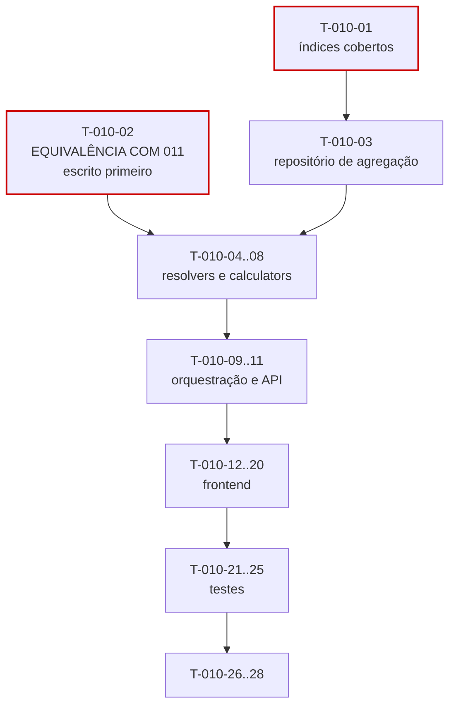

# 010 — Dashboard · Tarefas

## 1. Convenções

| Campo | Regra |
|---|---|
| **ID** | `T-010-XX`, estável e imutável |
| **Descrição** | Verbo no infinitivo + objeto |
| **Dependências** | IDs de tarefas ou features concluídas |
| **Estimativa** | Horas-agente; acima de 8h deve ser decomposta |
| **Prioridade** | `P0` bloqueante · `P1` necessária · `P2` cortável |

> **Feature `P1`, folha no grafo.** Nenhuma outra feature depende desta (§22.2 da spec). É a candidata mais segura de corte na ordem de §11.1 de `mvp.md` — cortá-la não bloqueia nada.
>
> **Paralelizável com `013-notifications` em S8** (§8.1 de `implementation-order.md`): ambas consomem `011` e não se tocam.

## 2. Resumo

| Grupo | Tarefas | Estimativa |
|---|:--:|---|
| Banco | 1 | 3h |
| Backend | 10 | 30h |
| Frontend | 9 | 26h |
| Testes | 5 | 16h |
| Documentação | 2 | 3h |
| Infra | 1 | 2h |
| **Total** | **28** | **80h ≈ 5 dias-agente** |

## 3. Banco

| ID | Descrição | Dependências | Estimativa | Prioridade |
|---|---|---|:--:|:--:|
| T-010-01 | Criar `V032__dashboard_indexes.sql` com os três índices **cobertos** (`INCLUDE`) e o índice parcial de contratos ativos | 008, 011 | 3h | P0 |

> Única migration da feature, e apenas de índices — a feature não persiste nada. Os `INCLUDE` são o que transforma as agregações em index-only scans e sustentam a meta de p95 < 800 ms (RNF-003, RP-06). Sem eles, as consultas cairiam nos índices de listagem de `008`, que não cobrem as colunas somadas.

## 4. Backend

| ID | Descrição | Dependências | Estimativa | Prioridade |
|---|---|---|:--:|:--:|
| T-010-02 | **Escrever antes do código:** teste de equivalência provando que o saldo do dashboard é idêntico ao de `BalanceService` para o mesmo período | 011 | 3h | P0 |
| T-010-03 | Criar `DashboardAggregationRepository` com as quatro consultas de agregação, validando os index-only scans no plano de execução | T-010-01 | 4h | P0 |
| T-010-04 | Implementar `DashboardPeriodResolver` (fuso do tenant, validação de 366 dias) e `DashboardScopeResolver` (`TENANT`/`USER` por papel) | T-010-03 | 3h | P0 |
| T-010-05 | Implementar `SeverityCalculator` usando `contract.notificationThresholds`, **nunca** limiares fixos | T-010-04 | 2,5h | P0 |
| T-010-06 | Implementar `ProjectionCalculator` com a guarda de 3 dias úteis e os quatro estados de `projectionStatus` | T-010-05 | 2,5h | P0 |
| T-010-07 | Implementar `ChartGapFiller` (30 pontos obrigatórios) e `PercentageNormalizer` (resto na maior fatia) | T-010-03 | 2,5h | P0 |
| T-010-08 | Implementar `DashboardAlertService` derivando alertas do **estado atual**, sem consultar `notifications` | T-010-05 | 2,5h | P0 |
| T-010-09 | Implementar `DashboardService` orquestrando os seis blocos em **paralelo**, consumindo `BalanceService`, `TicketService` e `TimerQueryService` | T-010-02, T-010-06, T-010-08 | 5h | P0 |
| T-010-10 | Implementar `DashboardChartService` com os 6 tipos, cache por `(tenantId, scope, userId?, chartType, periodKey)` e TTL de 5 min | T-010-07 | 3h | P1 |
| T-010-11 | Criar DTOs, mappers com omissão de monetários e `DashboardController`; ordenação por severidade e `daysRemaining` | T-010-09, T-010-10 | 4h | P0 |

## 5. Frontend

| ID | Descrição | Dependências | Estimativa | Prioridade |
|---|---|---|:--:|:--:|
| T-010-12 | Criar `DashboardApi` e `DashboardStore` com `loading` e `errors` **por bloco** | T-010-11 | 3h | P0 |
| T-010-13 | Criar `dt-quick-stats` | T-010-12 | 2h | P0 |
| T-010-14 | Criar `dt-contract-status-card` **reutilizando** `dt-balance-summary`, `dt-consumption-gauge` e `dt-partial-badge` de `011` | T-010-12, 011 | 3,5h | P0 |
| T-010-15 | Criar `dt-alert-list` com navegação para o recurso de origem | T-010-12 | 2h | P0 |
| T-010-16 | Criar `dt-daily-minutes-chart` exibindo os zeros explicitamente, com alternativa textual acessível | T-010-12 | 3,5h | P0 |
| T-010-17 | Criar `dt-distribution-chart` usando as cores das entidades de origem, com alternativa textual | T-010-16 | 3h | P0 |
| T-010-18 | Criar `dt-recent-worklogs`, `dt-open-tickets` e `dt-period-selector` com intervalo personalizado | T-010-12 | 3h | P1 |
| T-010-19 | Criar `dt-block-error` e `dt-empty-state` nas duas variantes (sem contratos, sem registros) | T-010-12 | 2,5h | P0 |
| T-010-20 | Montar `DashboardPage` (P09) integrando os blocos com carregamento e erro independentes | T-010-14, T-010-17, T-010-19 | 3,5h | P0 |

## 6. Testes

| ID | Descrição | Dependências | Estimativa | Prioridade |
|---|---|---|:--:|:--:|
| T-010-21 | Testes de `SeverityCalculator` com limiares default e personalizados, e de `ProjectionCalculator` nas quatro faixas e na guarda de 3 dias | T-010-06 | 3h | P0 |
| T-010-22 | Testes de `ChartGapFiller` (30 pontos, mês vazio, um único dia) e de `PercentageNormalizer` | T-010-07 | 2,5h | P0 |
| T-010-23 | Testes de escopo de `MEMBER` com inspeção de SQL em **todas** as agregações, incluindo `quickStats` e gráficos | T-010-09 | 3,5h | P0 |
| T-010-24 | **Teste de carga:** p95 < 800 ms com 100.000 registros, validando os index-only scans | T-010-11 | 4h | P0 |
| T-010-25 | Testes de falha isolada por bloco, cache com dois tenants, fuso e horário de verão, e suíte de isolamento | T-010-11, T-010-10 | 3h | P0 |

## 7. Documentação

| ID | Descrição | Dependências | Estimativa | Prioridade |
|---|---|---|:--:|:--:|
| T-010-26 | Sincronizar `docs/04-api/reports.md` §10 com o comportamento implementado | T-010-11 | 2h | P0 |
| T-010-27 | Atualizar o status da feature em `implementation-order.md` §12 | T-010-25 | 1h | P0 |

## 8. Infra

| ID | Descrição | Dependências | Estimativa | Prioridade |
|---|---|---|:--:|:--:|
| T-010-28 | Implementar `DashboardCacheInvalidator` reagindo a eventos de `008`, `009` e `011`; configurar as métricas da §29 com **alerta em `dashboard.load.duration` p95 > 800 ms** | T-010-10 | 2h | P0 |

## 9. Ordem de execução

**Caminho crítico:** `T-010-01 → 03 → 04 → 09 → 11 → 20 → 24`.

**Duas tarefas com peso desproporcional ao seu tamanho:**

| Tarefa | Por quê |
|---|---|
| `T-010-02` (equivalência com `011`) | Escrita **antes** do código. É o único teste que impede o modo de falha mais provável desta feature: reimplementar o cálculo de saldo "porque é mais rápido que chamar o service", produzindo um segundo número que divergirá na primeira mudança de regra (OB-01, R-02). Uma divergência aqui é reportável como RP-03 e aciona SQ-10 |
| `T-010-01` (índices cobertos) | É a diferença entre atingir e não atingir RNF-003. Sem os `INCLUDE`, nenhuma otimização de código compensa a leitura da tabela |

**Paralelizável:** `T-010-13` a `T-010-19` (componentes) dependem apenas do contrato da API e podem ser desenvolvidos com MSW. `T-010-10` e `T-010-18` são `P1` e podem ser adiados dentro da sprint.

**Dependência de componentes:** `T-010-14` reutiliza três componentes de `011-bank-hours` (§21.2 daquela spec). Se `011` não os tiver publicado como compartilhados, esta tarefa fica bloqueada — e recriá-los aqui produziria duas representações do mesmo saldo, que divergiriam visualmente. A dependência é registrada em `T-011-15` daquela feature.

**Ordem de corte:** sendo `P1` e folha no grafo, esta feature inteira pode ser cortada sem impacto em nenhuma outra. Se cortada parcialmente, a ordem é: `T-010-10` e `T-010-18` (gráficos secundários e blocos auxiliares) primeiro, depois `T-010-16` e `T-010-17` (gráficos), preservando `quickStats` e cartões de contrato — que são o motivo de a tela existir.

## 10. Critérios de conclusão por grupo

| Grupo | Concluído quando |
|---|---|
| Banco | Os três índices são comprovadamente **cobertos** no plano de execução, sem acesso à tabela |
| Backend | Saldo idêntico ao de `011` (teste de equivalência); severidade pelos limiares do contrato; projeção com guarda de 3 dias; 30 pontos garantidos; alertas do estado atual; agregações em paralelo; **nenhuma escrita** |
| Frontend | Componentes de saldo reutilizados de `011`; erro e carregamento por bloco; zeros visíveis no gráfico; gráficos com alternativa textual; zero violações do axe-core |
| Testes | Equivalência com `011` verde; p95 < 800 ms com 100.000 registros; escopo de `MEMBER` comprovado em SQL; cache isolado entre tenants |
| Documentação | `reports.md` §10 sincronizado; status atualizado |
| Infra | Invalidação por evento funcionando; alerta de p95 configurado e testado |
