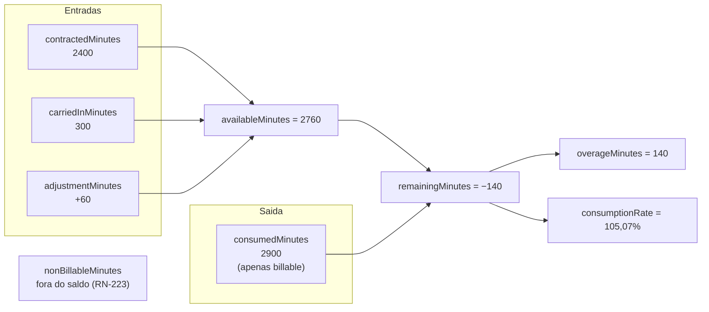
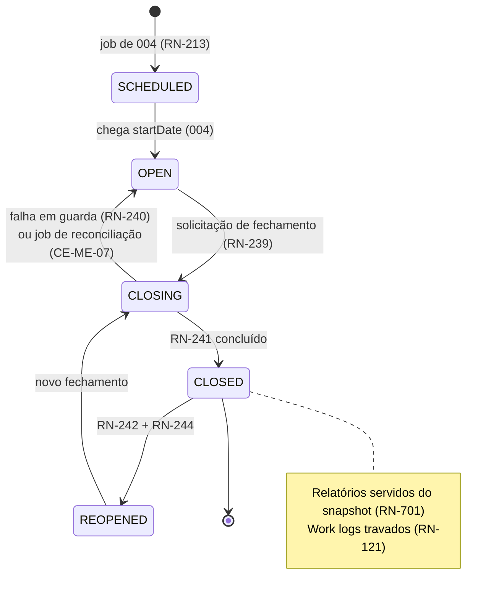
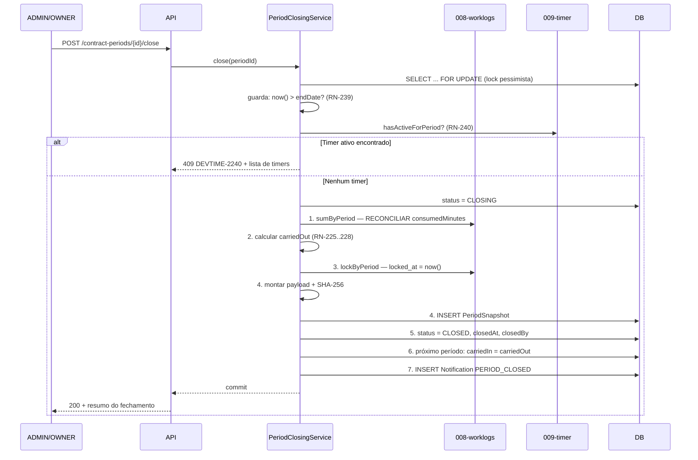
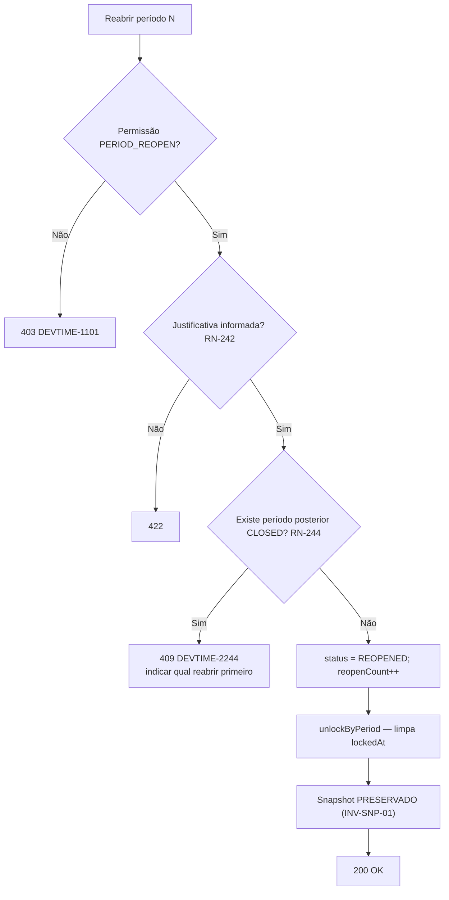

# 011 — Bank Hours

| Campo | Valor |
|---|---|
| **Feature** | 011 |
| **Épico** | EP-08 (Banco de Horas) · EP-12 (Fechamento de Período) |
| **Sprint** | S7 (saldo, extrato, ajustes) · S10 (fechamento, snapshot, reabertura) |
| **Prioridade** | P0 |
| **Complexidade** | **Crítica** |
| **Estimativa** | 45 pts · 11 dias-agente |
| **Stories** | US-110 a US-124 (EP-08) · US-160 a US-167 (EP-12) |
| **Status** | SPEC_APPROVED |

## 1. Objetivo

Calcular, explicar e congelar o saldo de horas de cada período de contrato: fórmulas canônicas de disponível, consumido e restante; transporte de saldo entre períodos; ajustes manuais auditáveis; e fechamento atômico que trava os registros e gera um snapshot imutável.

## 2. Problema que resolve

O saldo é **o número** do produto. É o que o cliente pergunta ("quantas horas ainda tenho?"), o que sustenta a fatura e o que aparece no topo do dashboard. RP-03 identifica **erro de cálculo de saldo** como risco crítico: uma única divergência reportada por um cliente destrói a credibilidade de todos os outros números, e SQ-10 determina que ela **bloqueia toda a fila de desenvolvimento** até a causa raiz ser corrigida.

A segunda função é o **extrato explicativo**. Um saldo que o cliente não consegue conferir é tão ruim quanto um saldo errado: ele precisa ver de onde vieram as horas contratadas, o que foi transportado, quais ajustes existiram e quais registros consumiram o quê. Um número sem rastro gera disputa.

A terceira é a **imutabilidade** (ART-005). Depois que um período é fechado e o relatório entregue, aquele número não pode mudar — nem por edição de work log, nem por alteração de contrato, nem por recálculo. O `PeriodSnapshot` com checksum é o que garante isso.

## 3. Escopo

### 3.1 Sprint S7 — saldo, extrato e ajustes

| # | Item | Referência |
|---|---|---|
| E-01 | Fórmulas canônicas de saldo | RN-218 a RN-222 |
| E-02 | Horas não faturáveis fora do saldo | RN-223 |
| E-03 | Extrato explicativo do período | §10 `contracts.md` |
| E-04 | Ajustes manuais imutáveis, com justificativa | RN-215, RN-235 a RN-238 |
| E-05 | Projeção de consumo (`burnRate`, `projectedConsumption`) | §6.7 `entities.md` |
| E-06 | Tela P16 | `pages.md` |

### 3.2 Sprint S10 — fechamento, snapshot e reabertura

| # | Item | Referência |
|---|---|---|
| E-07 | Cálculo de carry-over pelas três políticas | RN-224 a RN-228 |
| E-08 | Propagação de `carriedOut` para `carriedIn` | RN-229 |
| E-09 | Expiração de saldo transportado | RN-230 |
| E-10 | Fechamento atômico em 7 passos | RN-241 |
| E-11 | Guardas de fechamento | RN-239, RN-240 |
| E-12 | `PeriodSnapshot` com checksum SHA-256 | §6.9 `entities.md` |
| E-13 | Reabertura com justificativa e ordem inversa | RN-242 a RN-244 |
| E-14 | Registro de excedente no snapshot | RN-245 |
| E-15 | Job de reconciliação de períodos presos em `CLOSING` | CE-ME-07 |

## 4. Fora do escopo

| Item | Onde está | Motivo |
|---|---|---|
| Criação e geração de períodos | `004-contracts` | Esta feature opera sobre períodos já existentes |
| Transições `SCHEDULED → OPEN` | `004-contracts` | Fronteira explícita: `004` mantém até `OPEN`; daí em diante é `011` |
| Registro e edição de work logs | `008-worklogs` | Esta feature **consome** `billableMinutes` e **trava** registros |
| Relatório e exportação | `012-reports` | Esta feature **produz** o snapshot; `012` o serve |
| Dashboard | `010-dashboard` | Consome o saldo calculado |
| Alertas de limiar | `013-notifications` | Esta feature publica o evento; `013` avalia e entrega |
| Faturamento e cobrança | Fora do roadmap | NO-01 |
| Aprovação de horas antes do fechamento | F5 | `permissions.md` §14 |

> **Fronteira com `004`:** `004` cria e mantém `ContractPeriod` com `contractedMinutes`, `startDate`, `endDate`, `sequence` e `status` até `OPEN`. A partir de `OPEN`, `consumedMinutes`, `carriedIn/Out`, `adjustmentMinutes` e as transições `CLOSING`, `CLOSED` e `REOPENED` pertencem a esta feature. **`004` nunca calcula saldo; `011` nunca gera período.**

## 5. Dependências

### 5.1 Features
| Feature | Tipo | O que consome |
|---|---|---|
| `004-contracts` | Bloqueante | `ContractPeriod` já gerado; `rolloverPolicy`, `overagePolicy`, `rolloverCapMinutes`, `rolloverExpiryPeriods` |
| `008-worklogs` | Bloqueante | `sumByPeriod` (RN-219), `lockByPeriod` e `unlockByPeriod` (RN-241, RN-243) |
| `009-timer` | Bloqueante | `hasActiveForPeriod` (RN-240) |
| `002-users` | Bloqueante | Papéis para RN-238 e RN-242; auditoria |
| `010-dashboard` | Consumidora | Saldo, criticidade e projeção |
| `012-reports` | Consumidora | `PeriodSnapshot` (RN-701) |
| `013-notifications` | Consumidora | `ConsumptionChangedEvent`, `PeriodClosedEvent` |

### 5.2 Documentos obrigatórios
| Documento | Seções relevantes |
|---|---|
| `docs/04-api/contracts.md` | §10 a §13 (períodos, ajustes, fechamento) |
| `docs/02-domain/entities.md` | §6.7 ContractPeriod, §6.8 PeriodAdjustment, §6.9 PeriodSnapshot |
| `docs/02-domain/business-rules.md` | RN-215, RN-218 a RN-245 |
| `docs/02-domain/state-machines.md` | §4.6 ContractPeriod, §5 efeitos cruzados |
| `docs/02-domain/permissions.md` | §6.4, §7, §10 |
| `docs/05-ui/pages.md` | P16 |

### 5.3 Infraestrutura
| Componente | Uso |
|---|---|
| PostgreSQL | `contract_periods`, `period_adjustments`, `period_snapshots`; lock pessimista no fechamento |
| Agendador | Job de reconciliação de `CLOSING` preso; job de expiração de carry-over |

## 6. Regras de negócio

| ID | Tipo | Enunciado resumido | Erro | Onde é aplicada |
|---|---|---|---|---|
| RN-218 | Automática | `availableMinutes = contracted + carriedIn + adjustment` | — | `BalanceCalculator` |
| RN-219 | Automática | `consumedMinutes = Σ billableMinutes` dos work logs não excluídos do período | — | `BalanceCalculator` |
| RN-220 | Automática | `remainingMinutes = available − consumed` (pode ser negativo) | — | `BalanceCalculator` |
| RN-221 | Automática | `overageMinutes = max(0, consumed − available)` | — | `BalanceCalculator` |
| RN-222 | Automática | `consumptionRate = available > 0 ? consumed/available × 100 : (consumed > 0 ? 100 : 0)` | — | `BalanceCalculator` |
| RN-223 | Automática | Horas não faturáveis **não** consomem saldo; aparecem como `nonBillableMinutes` | — | `BalanceCalculator` |
| RN-224 | Automática | `carriedOutMinutes` é calculado **apenas no fechamento** | — | `RolloverCalculator` |
| RN-225 | Automática | `NONE` ⇒ `carriedOut = 0` | — | `RolloverCalculator` |
| RN-226 | Automática | `FULL` ⇒ `carriedOut = max(0, remaining)` | — | `RolloverCalculator` |
| RN-227 | Automática | `CAPPED` ⇒ `carriedOut = min(max(0, remaining), rolloverCapMinutes)` | — | `RolloverCalculator` |
| RN-228 | Automática | Saldo **negativo nunca é transportado** | — | `RolloverCalculator` |
| RN-229 | Automática | No fechamento, `carriedOut[N]` vira `carriedIn[N+1]`; se `N+1` não existir, é criado | — | `PeriodClosingService` |
| RN-230 | Automática | Saldo transportado expira após `rolloverExpiryPeriods`; debitado por ajuste automático `OTHER` | — | `RolloverExpiryJob` |
| RN-215 | Bloqueante | Ajuste exige justificativa de no mínimo 10 caracteres e `reason` válido | `DEVTIME-2215` / 422 | `AdjustmentValidator` |
| RN-235 | Bloqueante | Ajustes só em períodos `OPEN` ou `REOPENED` | `DEVTIME-2235` / 409 | `AdjustmentService` |
| RN-236 | Bloqueante | Ajustes são **imutáveis**; correção por ajuste de sinal contrário | `DEVTIME-2236` / 409 | `AdjustmentService` |
| RN-237 | Bloqueante | `availableMinutes` não pode ficar negativo por efeito de ajuste | `DEVTIME-2237` / 422 | `AdjustmentValidator` |
| RN-238 | Bloqueante | Apenas `ADMIN` e `OWNER` aplicam ajustes | `DEVTIME-1101` / 403 | `PERIOD_ADJUST` |
| RN-239 | Bloqueante | Fechamento só após `endDate`, ou antecipado por `ADMIN`/`OWNER` com confirmação | `DEVTIME-2239` / 409 | `ClosingGuard` |
| RN-240 | Bloqueante | Fechamento rejeitado se houver timer ativo no período | `DEVTIME-2240` / 409 | `ClosingGuard` |
| RN-241 | Automática | Sequência atômica de 7 passos; falha em qualquer um faz rollback total | — | `PeriodClosingService` |
| RN-242 | Bloqueante | Reabertura exige `ADMIN`/`OWNER` e justificativa; incrementa `reopenCount` | `DEVTIME-1101` / 403 | `PeriodReopeningService` |
| RN-243 | Automática | Na reabertura: limpa `lockedAt`, status `REOPENED`, **preserva** o snapshot, recalcula `carriedIn` seguinte no refechamento | — | `PeriodReopeningService` |
| RN-244 | Bloqueante | Não reabre se houver período **posterior** fechado; ordem do mais recente para o mais antigo | `DEVTIME-2244` / 409 | `ReopeningGuard` |
| RN-245 | Automática | Fechamento com excedente registra o valor no snapshot | — | `SnapshotBuilder` |
| RN-121 | Automática | Work logs do período fechado recebem `lockedAt` | — | Passo 3 de RN-241 |
| RN-602 | Automática | Limiares avaliados a cada alteração de `consumedMinutes` | — | Publica evento para `013` |
| RN-004 | Bloqueante | Alteração exige `version` | `DEVTIME-2004` / 409 | Edições |
| RN-001 / RN-002 | Bloqueante | Tenant do usuário; recurso externo retorna `404` | `DEVTIME-1200` / `2002` | Filtro automático |
| RN-006 | Automática | Toda alteração gera `AuditLog` na mesma transação | — | Todas |

### 6.1 Fórmulas canônicas — exemplo normativo

Reproduz o diagrama da §7.3 de `business-rules.md`:

| Entrada | Valor |
|---|---:|
| `contractedMinutes` | 2.400 |
| `carriedInMinutes` | 300 |
| `adjustmentMinutes` | +60 |
| `consumedMinutes` | 2.900 |

| Derivado | Fórmula | Resultado |
|---|---|---:|
| `availableMinutes` | `2400 + 300 + 60` | **2.760** |
| `remainingMinutes` | `2760 − 2900` | **−140** |
| `overageMinutes` | `max(0, 2900 − 2760)` | **140** |
| `consumptionRate` | `2900 / 2760 × 100` | **105,07%** |

**Ordem de cálculo obrigatória:** `available` → `consumed` → `remaining` → `overage` → `rate`. Cada valor depende do anterior; calcular fora de ordem produz resultados inconsistentes quando `available` é zero.

**Aritmética inteira.** Todos os minutos são inteiros (RN-010). `consumptionRate` é o único valor fracionário e é calculado com precisão decimal, nunca com `double` — ponto flutuante binário produziria `105.06999999` em vez de `105,07`, e o número exibido ao cliente precisa ser reproduzível.

### 6.2 Tabela normativa de carry-over (RN-225 a RN-228)

| Política | Cap | `available` | `consumed` | `remaining` | `carriedOut` | Observação |
|---|---:|---:|---:|---:|---:|---|
| `NONE` | — | 2400 | 1800 | 600 | **0** | Saldo perdido |
| `FULL` | — | 2400 | 1800 | 600 | **600** | Tudo transportado |
| `CAPPED` | 300 | 2400 | 1800 | 600 | **300** | Limitado ao teto |
| `CAPPED` | 300 | 2400 | 2250 | 150 | **150** | Abaixo do teto |
| `FULL` | — | 2400 | 2900 | −500 | **0** | Negativo não transporta (RN-228) |
| `NONE` | — | 2400 | 2400 | 0 | **0** | Consumo exato |

**Por que saldo negativo nunca é transportado (RN-228):** transportar dívida transforma um problema pontual em permanente e torna o saldo incompreensível para o cliente. Excedente é uma negociação do mês, não uma pendência acumulada.

### 6.3 Sequência atômica de fechamento (RN-241)

| # | Passo | Falha → |
|---|---|---|
| 0 | Adquirir lock pessimista (`SELECT ... FOR UPDATE`) no período | `409` se já em `CLOSING` (CE-ME-08) |
| 0.1 | Guarda: `now() > endDate` ou confirmação de antecipação (RN-239) | `DEVTIME-2239` |
| 0.2 | Guarda: nenhum timer ativo no período (RN-240) | `DEVTIME-2240` com a lista de timers |
| 0.3 | Status `CLOSING` | — |
| 1 | **Reconciliar** `consumedMinutes` por agregação real dos work logs | Rollback |
| 2 | Calcular `carriedOutMinutes` (RN-225 a RN-228) | Rollback |
| 3 | `UPDATE work_logs SET locked_at = now()` no período | Rollback |
| 4 | Montar o payload e calcular o checksum SHA-256; inserir `PeriodSnapshot` | Rollback |
| 5 | Status `CLOSED`, `closedAt`, `closedBy` | Rollback |
| 6 | Propagar `carriedOut` como `carriedIn` do período seguinte; criar se não existir (RN-229) | Rollback |
| 7 | Criar notificação `PERIOD_CLOSED` | Rollback |

**Por que o passo 1 é reconciliação e não leitura:** `consumedMinutes` é desnormalizado, atualizado por incremento em `008`. Uma divergência acumulada por falha de evento produziria um snapshot errado — e o snapshot é **definitivo**. O fechamento é o último momento em que a correção ainda é possível, então ele recalcula do zero e registra a diferença encontrada.

**Por que o lock é pessimista e não otimista:** dois fechamentos simultâneos com *optimistic locking* fariam ambos executarem os 7 passos e um falharia no commit — mas o passo 3 já teria travado work logs e o passo 4 já teria gerado um snapshot. O lock pessimista impede a segunda execução de começar (CE-ME-08).

### 6.4 Invariantes envolvidas
| ID | Invariante | Como é garantida |
|---|---|---|
| INV-PER-05 | Todos os minutos ≥ 0, exceto `remaining` | `CHECK` + RN-237 |
| INV-PER-06 | `CLOSED` ⇒ `closedAt` e `closedBy` preenchidos | `CHECK` + passo 5 |
| INV-PER-07 | No máximo um período `OPEN` por contrato | Índice único parcial de `004` |
| INV-PER-08 | `CLOSED` ⇒ existe `PeriodSnapshot` | Passo 4 antes do 5; verificado por job |
| INV-ADJ-01 | Ajustes são imutáveis | Sem endpoint de edição; `CHECK` de coluna imutável |
| INV-SNP-01 | Snapshot é imutável; reabertura **não** o apaga | Sem `UPDATE` nem `DELETE`; novo snapshot por refechamento |

## 7. Fluxo principal — fechamento de período

1. `ADMIN`/`OWNER` abre P16 após o `endDate` do período.
2. A tela exibe o extrato completo: contratado, transportado, ajustes, consumido, restante e a lista de work logs.
3. Clica em "fechar período". A UI exibe o resumo do que será congelado e o `carriedOut` previsto.
4. `POST /api/v1/contract-periods/{id}/close`.
5. `PeriodClosingService` executa a sequência da §6.3 integralmente, dentro de uma transação.
6. Sucesso: `200` com o resumo do fechamento — consumo reconciliado, `carriedOut`, checksum do snapshot.
7. Todos os work logs do período ficam travados (RN-121); qualquer edição passa a exigir reabertura.
8. O período seguinte recebe `carriedIn`.
9. `PeriodClosedEvent` é publicado após o commit; `013` notifica.
10. A partir daí, relatórios do período são servidos **exclusivamente** do snapshot (RN-701).

## 8. Fluxos alternativos

| # | Fluxo | Gatilho | Comportamento |
|---|---|---|---|
| FA-01 | Consulta de saldo ao vivo | P16, dashboard | Calculado sob demanda para `OPEN`/`REOPENED`; marcado como **parcial** (RN-702) |
| FA-02 | Consulta de período fechado | P16 | Servido do snapshot; marcado como **definitivo** |
| FA-03 | Ajuste de crédito | P16 | `minutes > 0`; exige justificativa ≥ 10 caracteres e `reason` |
| FA-04 | Ajuste de débito | P16 | `minutes < 0`; rejeitado se deixar `available` negativo (RN-237) |
| FA-05 | Estorno de ajuste | P16 | Novo ajuste de sinal contrário; o original **nunca** é editado (RN-236) |
| FA-06 | Ajuste em período fechado | P16 | `409 DEVTIME-2235`; exige reabertura |
| FA-07 | Fechamento antecipado | Antes do `endDate` | Exige `ADMIN`/`OWNER` **e** confirmação explícita (RN-239) |
| FA-08 | Fechamento com timer ativo | — | `409 DEVTIME-2240` listando os timers; inclui `PAUSED` (CE-ME-01) |
| FA-09 | Fechamento com excedente | `consumed > available` | Permitido; o excedente é registrado no snapshot (RN-245); `carriedOut = 0` |
| FA-10 | Fechamento sem período seguinte | Último do contrato | O período seguinte é **criado** para receber `carriedIn` (RN-229) |
| FA-11 | Reabertura | P16 | Exige `ADMIN`/`OWNER` e justificativa; `reopenCount++`; snapshot preservado |
| FA-12 | Reabertura com posterior fechado | — | `409 DEVTIME-2244`; a UI indica qual período reabrir primeiro |
| FA-13 | Refechamento após reabertura | P16 | Gera **novo** snapshot; recalcula e propaga `carriedIn` seguinte |
| FA-14 | Expiração de carry-over | Job | Ajuste automático `reason = OTHER`, justificativa "Expiração de saldo transportado" (RN-230) |
| FA-15 | Período preso em `CLOSING` | Falha de infraestrutura | Job detecta após 10 minutos e reverte para `OPEN`, com alerta operacional (CE-ME-07) |
| FA-16 | Divergência na reconciliação | Passo 1 | Fechamento prossegue com o valor **real**; a diferença é registrada em auditoria e gera alerta |
| FA-17 | Contrato `HOURLY_OPEN` | — | `available = 0`; `rate` sempre 0; nenhum alerta; carry-over não se aplica (CE-10) |
| FA-18 | Extrato de período reaberto | P16 | Exibido como parcial, **com aviso de reabertura** e o `reopenCount` |

## 9. Diagramas

### 9.1 Composição do saldo (RN-218 a RN-222)

### 9.2 Máquina de estados do período (§4.6)

### 9.3 Sequência de fechamento (RN-241)

### 9.4 Reabertura em ordem inversa (RN-244)

## 10. Estados

| Estado | Significado | Operações permitidas | Operações bloqueadas |
|---|---|---|---|
| `SCHEDULED` | Futuro; ainda não iniciado | Consultar | Work log, ajuste, fechamento |
| `OPEN` | Em apuração | Work log, ajuste, fechamento (após `endDate` ou antecipado) | Reabertura |
| `CLOSING` | Fechamento em curso | Nenhuma | Todas — período bloqueado para escrita |
| `CLOSED` | Fechado; snapshot gerado | Consultar (do snapshot), reabrir | Work log, ajuste, edição |
| `REOPENED` | Reaberto para correção | Work log, ajuste, refechamento | Nova reabertura sem refechar antes |

## 11. Transições

| Origem | Destino | Gatilho | Guarda | Efeito | Permissão |
|---|---|---|---|---|---|
| `OPEN`/`REOPENED` | `CLOSING` | Solicitação | `now() > endDate` ou confirmação (RN-239); nenhum timer ativo (RN-240) | Lock pessimista; bloqueia escrita | `PERIOD_CLOSE` |
| `CLOSING` | `CLOSED` | Automático | Passos 1 a 7 bem-sucedidos | RN-241 integral | Sistema |
| `CLOSING` | `OPEN` | Falha de guarda ou job de reconciliação | — | Libera lock; erro detalhado | Sistema |
| `CLOSED` | `REOPENED` | Solicitação | Justificativa (RN-242); nenhum posterior `CLOSED` (RN-244) | Limpa `lockedAt`; `reopenCount++`; **preserva** o snapshot | `PERIOD_REOPEN` |
| `REOPENED` | `CLOSING` | Refechamento | Iguais às de `OPEN → CLOSING` | Gera **novo** snapshot; recalcula `carriedOut` e propaga | `PERIOD_CLOSE` |

### 11.1 Transições proibidas

| Transição | Motivo da proibição |
|---|---|
| `CLOSED → OPEN` direto | Reabertura é operação auditada e nomeada. `REOPENED` é distinto de `OPEN` para que relatórios exibam o aviso de reabertura |
| Reabrir com posterior `CLOSED` | RN-244. O `carriedIn` do posterior derivou do `carriedOut` deste; alterá-lo invalidaria um período já congelado |
| Ajuste em `CLOSED` | RN-235. Alteraria um relatório entregue |
| Work log em `CLOSED` | RN-121, ART-005 |
| Editar ou excluir `PeriodAdjustment` | RN-236, INV-ADJ-01. Correção só por estorno |
| Alterar ou excluir `PeriodSnapshot` | INV-SNP-01. É a âncora da imutabilidade |
| Transportar saldo negativo | RN-228 |
| Fechar com timer ativo, inclusive `PAUSED` | RN-240, CE-ME-01 |
| Fechamento parcial | RN-241 é atômico: os 7 passos ou nenhum |

## 12. Casos de erro

| Código | HTTP | Situação | Mensagem ao usuário | Regra |
|---|:--:|---|---|---|
| `DEVTIME-1101` | 403 | Papel sem `PERIOD_ADJUST`, `PERIOD_CLOSE` ou `PERIOD_REOPEN` | Você não tem permissão para esta ação | RN-238, RN-242 |
| `DEVTIME-2002` | 404 | Período de outro tenant | Recurso não encontrado | RN-002 |
| `DEVTIME-2004` | 409 | Conflito de `version` | O registro foi alterado. Recarregue e tente novamente | RN-004 |
| `DEVTIME-2215` | 422 | Justificativa com menos de 10 caracteres | Justificativa obrigatória (mínimo 10 caracteres) | RN-215 |
| `DEVTIME-2235` | 409 | Ajuste em período não aberto | Ajuste só é permitido em período aberto | RN-235 |
| `DEVTIME-2236` | 409 | Tentativa de editar ajuste | Ajustes não podem ser alterados. Registre um estorno | RN-236 |
| `DEVTIME-2237` | 422 | Ajuste deixaria `available` negativo | O ajuste deixaria o saldo disponível negativo | RN-237 |
| `DEVTIME-2239` | 409 | Fechamento antes do `endDate` sem confirmação | Período ainda não pode ser fechado | RN-239 |
| `DEVTIME-2240` | 409 | Timer ativo no período | Existe cronômetro ativo no período | RN-240 |
| `DEVTIME-2244` | 409 | Reabertura com posterior fechado | Existe período posterior já fechado | RN-244 |
| `DEVTIME-2010` | 409 | Transição fora da matriz §4.6 | Operação não permitida neste estado do período | ME-04 |
| `DEVTIME-9002` | — | Inconsistência detectada por job | Log `ERROR` + alerta operacional | §7 SM |

### 12.1 Casos extremos

| # | Caso | Comportamento esperado |
|---|---|---|
| CX-01 | `availableMinutes = 0` e `consumed = 0` | `rate = 0` (RN-222, ramo `consumed = 0`) |
| CX-02 | `availableMinutes = 0` e `consumed > 0` | `rate = 100`, não divisão por zero (RN-222) |
| CX-03 | Contrato `HOURLY_OPEN` | `available = 0` sempre; `rate = 0`; nenhum alerta (CE-10) |
| CX-04 | `remaining` exatamente 0 | `overage = 0`; `carriedOut = 0` em qualquer política |
| CX-05 | `CAPPED` com `rolloverCapMinutes = 0` | Equivale a `NONE`; aceito e documentado |
| CX-06 | Ajuste que zera exatamente o excedente | Permitido; `overage` passa a 0; a notificação anterior **permanece** no histórico (CE-14) |
| CX-07 | Ajuste de débito maior que o disponível | `422 DEVTIME-2237` |
| CX-08 | Ajuste de débito que deixa `available` exatamente 0 | Permitido — a regra proíbe negativo, não zero |
| CX-09 | Justificativa com exatamente 10 caracteres | Aceita; 9 rejeitada |
| CX-10 | Fechamento com `consumed` divergente do real | Reconciliado no passo 1; a diferença é auditada e alertada (FA-16) |
| CX-11 | Fechamento sem nenhum work log | Permitido; snapshot com lista vazia; `carriedOut` conforme a política |
| CX-12 | Fechamento do último período do contrato | O período seguinte é criado apenas para receber `carriedIn` (RN-229) |
| CX-13 | Fechamento de contrato `ENDED` | Permitido — o período foi truncado por `004` e fecha automaticamente após 3 dias (CE-ME-02) |
| CX-14 | Dois fechamentos simultâneos | Lock pessimista; o segundo recebe `409` (CE-ME-08) |
| CX-15 | Falha de infraestrutura durante `CLOSING` | Job reverte para `OPEN` após 10 minutos, com alerta (CE-ME-07) |
| CX-16 | Reabertura em cascata de 3 períodos | Obrigatoriamente do mais recente para o mais antigo; a cada refechamento o `carriedIn` seguinte é recalculado (CE-ME-03) |
| CX-17 | Reabertura de período com 10.000 work logs | `unlockByPeriod` em lote; não carrega entidades |
| CX-18 | Refechamento gera segundo snapshot | Ambos preservados, versionados por `snapshotAt` (INV-SNP-01) |
| CX-19 | Carry-over expirando em período fechado | O ajuste automático de expiração só é aplicado a períodos abertos; em fechado, é adiado para o próximo aberto |
| CX-20 | `rolloverExpiryPeriods = 0` | Nunca expira (RN-230) |
| CX-21 | Snapshot com checksum divergente | Detectado por job; `ERROR` + alerta; o snapshot **não** é corrigido automaticamente |
| CX-22 | Consulta de saldo de período `SCHEDULED` | Retorna os valores congelados na criação, com `consumed = 0` e marcação de "não iniciado" |

## 13. Modelo de dados

### 13.1 Entidades impactadas
| Entidade | Operação | Tabela | Referência |
|---|---|---|---|
| `ContractPeriod` | Lê, atualiza (saldo e status) | `contract_periods` | §6.7 |
| `PeriodAdjustment` | Cria, lê | `period_adjustments` | §6.8 |
| `PeriodSnapshot` | Cria, lê | `period_snapshots` | §6.9 |
| `WorkLog` | Lê (soma), atualiza (`lockedAt`) | `work_logs` | Via `WorkLogService` |
| `Timer` | Lê (RN-240) | `timers` | Via `TimerQueryService` |
| `AuditLog` | Cria | `audit_logs` | §6.20 |

### 13.2 Campos obrigatórios na criação de ajuste
| Campo | Tipo | Origem | Imutável | Validação |
|---|---|---|:--:|---|
| `tenantId` | UUID | `TenantContext` | ✔ 🔒 | Nunca da requisição |
| `contractPeriodId` | UUID | Path | ✔ 🔒 | Período `OPEN`/`REOPENED` (RN-235) |
| `minutes` | int | Request | ✔ 🔒 | ≠ 0; não pode deixar `available` negativo (RN-237) |
| `reason` | enum | Request | ✖ | `COURTESY`, `CORRECTION`, `NEGOTIATED_EXTRA`, `PENALTY`, `MIGRATION`, `OTHER` |
| `justification` | Text(1000) | Request | ✖ | Mínimo 10 caracteres (RN-215) |
| `appliedBy` | UUID | Autenticado | ✔ 🔒 | Nunca da requisição |
| `appliedAt` | TIMESTAMPTZ | Sistema | ✔ 🔒 | `now()` |

> `minutes` e `appliedBy` são imutáveis porque o ajuste inteiro é imutável (RN-236, INV-ADJ-01). `reason` e `justification` aparecem como mutáveis na tabela apenas porque não há endpoint de edição — **nenhum** campo de ajuste é alterável.

### 13.3 Migrations
| Migration | Conteúdo | Compatibilidade |
|---|---|---|
| `V029__create_period_adjustments.sql` | `period_adjustments` + `CHECK (minutes <> 0)` + `CHECK (length(justification) >= 10)` | Nova tabela |
| `V030__create_period_snapshots.sql` | `period_snapshots` + único `(contract_period_id, snapshot_at)` + índice de checksum | Nova tabela |
| `V031__period_balance_columns.sql` | Garante `carried_in`, `carried_out`, `adjustment_minutes`, `non_billable_minutes`, `reopen_count` em `contract_periods`; `CHECK` de INV-PER-05 e INV-PER-06 | Alteração compatível |

> `V030` usa único `(contract_period_id, snapshot_at)`, **não** apenas `contract_period_id`. Um período reaberto e refechado gera um **segundo** snapshot (CX-18, INV-SNP-01); a unicidade simples impediria o refechamento.

### 13.4 Índices
| Índice | Colunas | Sustenta |
|---|---|---|
| `idx_adjustments_period` | `(tenant_id, contract_period_id, applied_at)` | Extrato de ajustes |
| `uq_snapshots_period_at` | `(contract_period_id, snapshot_at)` | INV-SNP-01, CX-18 |
| `idx_snapshots_period` | `(tenant_id, contract_period_id)` | Consulta do snapshot mais recente |
| `idx_periods_closing_stuck` | `(status, updated_at)` WHERE `status = 'CLOSING'` | CE-ME-07 |
| `idx_periods_rollover_expiry` | `(tenant_id, contract_id, sequence)` WHERE `carried_in_minutes > 0` | RN-230 |
| `idx_work_logs_period` | `(tenant_id, contract_period_id)` WHERE `deleted_at IS NULL` | RN-219 — criado em `008` |

## 14. Endpoints utilizados

| Método | Rota | Operação | Permissão | Sucesso | Doc |
|---|---|---|---|:--:|---|
| GET | `/api/v1/contract-periods/{id}` | Detalhe com saldo | `PERIOD_VIEW` | 200 | §10 |
| GET | `/api/v1/contract-periods/{id}/statement` | Extrato explicativo | `PERIOD_VIEW` | 200 | §10 |
| GET | `/api/v1/contracts/{id}/periods` | Períodos do contrato | `PERIOD_VIEW` | 200 | §10 |
| POST | `/api/v1/contract-periods/{id}/adjustments` | Aplicar ajuste | `PERIOD_ADJUST` | 201 | §11 |
| GET | `/api/v1/contract-periods/{id}/adjustments` | Listar ajustes | `PERIOD_VIEW` | 200 | §11 |
| POST | `/api/v1/contract-periods/{id}/close` | Fechar | `PERIOD_CLOSE` | 200 | §12 |
| POST | `/api/v1/contract-periods/{id}/reopen` | Reabrir | `PERIOD_REOPEN` | 200 | §13 |
| GET | `/api/v1/contract-periods/{id}/snapshot` | Snapshot mais recente | `PERIOD_VIEW` | 200 | §13 |

> **Não existe** endpoint de edição ou exclusão de ajuste (RN-236) nem de alteração de snapshot (INV-SNP-01). A ausência é deliberada e faz parte da garantia: o que não tem rota não pode ser feito por engano.

## 15. Eventos

| Evento | Publicado por | Consumidores | Momento | Efeito |
|---|---|---|---|---|
| `ConsumptionChangedEvent` | `BalanceService` | `013-notifications` | Após o commit | Avalia limiares (RN-602) |
| `AdjustmentAppliedEvent` | `AdjustmentService` | `013`, métricas | Após o commit | Reavalia limiares |
| `PeriodClosingStartedEvent` | `PeriodClosingService` | Métricas | **Dentro** da transação | Telemetria |
| `PeriodClosedEvent` | `PeriodClosingService` | `013`, `012`, `010` | Após o commit | Notifica; invalida caches de relatório |
| `PeriodReopenedEvent` | `PeriodReopeningService` | `013`, `012`, `010` | Após o commit | Notifica; invalida caches |
| `WorkLogCreatedEvent` etc. | `008-worklogs` | `BalanceService` | **Dentro** da transação | `consumedMinutes` incremental |

## 16. Permissões

| Operação | Permissão | Papéis | Ownership | Escopo de dados |
|---|---|---|---|---|
| Consultar período e extrato | `PERIOD_VIEW` | OWNER, ADMIN, MANAGER, VIEWER; `MEMBER` restrito ² | — | `MEMBER`: apenas períodos de contratos vinculados |
| Ver valores monetários | `CONTRACT_VIEW_FINANCIAL` | OWNER, ADMIN, MANAGER, VIEWER | — | `MEMBER` **não** vê |
| Aplicar ajuste | `PERIOD_ADJUST` | **OWNER, ADMIN** | — | RN-238 |
| Fechar período | `PERIOD_CLOSE` | **OWNER, ADMIN** | — | — |
| Fechamento antecipado | `PERIOD_CLOSE` + confirmação | **OWNER, ADMIN** | — | RN-239 |
| Reabrir período | `PERIOD_REOPEN` | **OWNER, ADMIN** | — | Justificativa obrigatória (RN-242) |
| Editar work log travado | `WORKLOG_UPDATE_LOCKED` | **OWNER, ADMIN** | — | Somente **após** reabertura |

> **`MANAGER` não fecha nem ajusta.** Ele gerencia entrega, não apuração financeira. Fechar um período congela o número que vai para a fatura; ajustar saldo é conceder ou retirar horas contratadas. Ambas são decisões de quem responde comercialmente pelo tenant (§7 de `permissions.md`).

## 17. Validações

### 17.1 Camada 1 — Formato (`400`)
| Campo | Restrição | Mensagem |
|---|---|---|
| `minutes` | `@NotNull`, `!= 0` | Informe uma quantidade de minutos diferente de zero |
| `reason` | Enum válido | Motivo de ajuste inválido |
| `justification` | `@NotBlank`, `@Size(min=10,max=1000)` | Justificativa obrigatória (mínimo 10 caracteres) |
| `confirmed` (fechamento antecipado) | `@AssertTrue` | Confirmação obrigatória |
| `reason` (reabertura) | `@NotBlank`, `@Size(min=10)` | Justificativa obrigatória |

### 17.2 Camada 2 — Negócio
| Validação | Regra | Erro |
|---|---|---|
| Período `OPEN` ou `REOPENED` para ajuste | RN-235 | `DEVTIME-2235` / 409 |
| `available` resultante ≥ 0 | RN-237 | `DEVTIME-2237` / 422 |
| Ajuste imutável | RN-236 | `DEVTIME-2236` / 409 |
| `now() > endDate` ou confirmação | RN-239 | `DEVTIME-2239` / 409 |
| Nenhum timer ativo no período | RN-240 | `DEVTIME-2240` / 409 |
| Nenhum período posterior `CLOSED` | RN-244 | `DEVTIME-2244` / 409 |
| Justificativa na reabertura | RN-242 | `422` |
| `version` correspondente | RN-004 | `DEVTIME-2004` / 409 |

### 17.3 Camada 3 — Consistência
| Constraint | Garante | Mapeado para |
|---|---|---|
| `CHECK (minutes <> 0)` | Ajuste com efeito | `400` |
| `CHECK (length(justification) >= 10)` | RN-215 | `DEVTIME-2215` |
| `CHECK (contracted >= 0 AND carried_in >= 0 AND carried_out >= 0 AND consumed >= 0)` | INV-PER-05 | `DEVTIME-9002` |
| `CHECK (status <> 'CLOSED' OR (closed_at IS NOT NULL AND closed_by IS NOT NULL))` | INV-PER-06 | `DEVTIME-9002` |
| `uq_snapshots_period_at` | INV-SNP-01 | `DEVTIME-2001` |
| Ausência de rota de `UPDATE`/`DELETE` em ajuste e snapshot | RN-236, INV-SNP-01 | — |

## 18. Auditoria

| Ação | `action` | `beforeState` | `afterState` | Metadata |
|---|---|---|---|---|
| Ajuste aplicado | `PERIOD_ADJUSTMENT_APPLIED` | `{adjustmentMinutes, availableMinutes}` | `{adjustmentMinutes, availableMinutes}` | `reason`, `justification`, IP, traceId |
| Fechamento iniciado | `PERIOD_CLOSING_STARTED` | `{status}` | `{status: CLOSING}` | traceId |
| **Reconciliação divergente** | `PERIOD_CONSUMPTION_RECONCILED` | `{consumedMinutes}` | `{consumedMinutes}` | **Diferença encontrada**, traceId |
| Fechamento concluído | `PERIOD_CLOSED` | `{status}` | `{status: CLOSED, carriedOut, checksum}` | Resumo completo, IP, traceId |
| Work logs travados | `WORK_LOG_LOCKED` | — | `{lockedAt}` | Contagem, `actorType = SYSTEM` |
| Reabertura | `PERIOD_REOPENED` | `{status, reopenCount}` | `{status, reopenCount}` | **Justificativa**, quem reabriu, IP, traceId |
| Fechamento revertido por job | `PERIOD_CLOSING_REVERTED` | `{status: CLOSING}` | `{status: OPEN}` | Tempo preso, `actorType = SYSTEM` |
| Expiração de carry-over | `PERIOD_ROLLOVER_EXPIRED` | `{carriedInMinutes}` | `{adjustmentMinutes}` | `actorType = SYSTEM` |

> A auditoria da reconciliação (`PERIOD_CONSUMPTION_RECONCILED`) registra a **diferença encontrada**. Se o desnormalizado divergiu do real, esse é o único registro de que houve divergência — e a primeira evidência a consultar quando alguém questionar um número.
>
> A reabertura registra a **justificativa completa**. É a operação que altera um relatório já entregue; sem o motivo registrado, ela é indefensável em disputa contratual.

## 19. Segurança

| # | Vetor | Mitigação | Verificação |
|---|---|---|---|
| SG-01 | Período de outro tenant | Filtro automático; `404` | Suíte de isolamento |
| SG-02 | `MANAGER` fechando ou ajustando | `PERIOD_CLOSE`/`PERIOD_ADJUST` restritas a `OWNER`/`ADMIN` | Matriz de permissões |
| SG-03 | Edição de ajuste por contorno de API | **Nenhuma rota** de `PATCH`/`DELETE`; campos imutáveis | Inspeção de rotas |
| SG-04 | Alteração de snapshot | Nenhuma rota; sem `UPDATE` em código | Inspeção |
| SG-05 | Adulteração de snapshot no banco | Checksum SHA-256 verificado na leitura; job de verificação periódica | CX-21 |
| SG-06 | `consumedMinutes` manipulado por API | Campo derivado; ausente de todos os DTOs de escrita | Teste com payload |
| SG-07 | Fechamento antecipado sem confirmação | `confirmed` obrigatório e verificado no service | Teste |
| SG-08 | Reabertura em cascata burlando RN-244 | Guarda verificada a cada reabertura, não apenas na primeira | Teste com 3 períodos |
| SG-09 | `MEMBER` inferindo faturamento pelo extrato | Escopo por `Specification`; valores monetários por `CONTRACT_VIEW_FINANCIAL` | Teste por papel |

### 19.1 LGPD

| Dado pessoal | Base legal | Retenção | Exportação | Anonimização | Proibido em log |
|---|---|---|---|---|---|
| `closedBy`, `appliedBy` (quem executou) | Obrigação legal — trilha contratual | Vida do tenant + 5 anos | ✔ | Substituído por `Usuário Removido` | Permitido (é UUID) |
| `justification` do ajuste e da reabertura | Legítimo interesse | Idem | ✔ | Não se aplica | ❌ conteúdo em log |
| Payload do snapshot (contém `userId` e descrições de work logs) | Obrigação legal | Idem | ✔ | **Não anonimizável** — ver análise | ❌ |

**Análise.** O `PeriodSnapshot` contém a lista completa de work logs, com usuário, descrição e minutos. Ele é **imutável por design** (INV-SNP-01, ART-005), o que cria uma tensão real com o direito ao apagamento da LGPD.

A resolução é: o snapshot é **registro contratual**, com base legal em obrigação legal e execução de contrato — a mesma que justifica manter uma nota fiscal emitida. Ele não é anonimizado nem alterado, porque isso destruiria a prova do que foi entregue e cobrado. Um pedido de apagamento de titular é atendido nas **exibições** (nome substituído por "Usuário Removido" ao renderizar) e nos dados operacionais, nunca no payload congelado. Esta decisão é registrada aqui explicitamente porque é a única do sistema em que a imutabilidade prevalece sobre o apagamento, e precisa ser defensável.

## 20. Performance

| Operação | Meta | Índice/estratégia | Risco |
|---|---|---|---|
| Cálculo de saldo (período aberto) | p95 < 200 ms | `consumedMinutes` desnormalizado; sem agregação | Chamado pelo dashboard e por P16 |
| Extrato completo | p95 < 600 ms | Paginação dos work logs; ajustes por índice | Período com 5.000 registros |
| Reconciliação no fechamento | < 3 s | Agregação por `idx_work_logs_period` | Período com 10.000 work logs |
| Travamento de work logs | < 2 s | `UPDATE` em lote | Idem |
| Geração do snapshot | < 5 s | Montagem em memória com projeção; SHA-256 sobre JSON canônico | Payload grande |
| Fechamento completo | p95 < 15 s | Transação única com lock pessimista | Bloqueia escrita no período durante a execução |
| Reabertura | < 3 s | `UPDATE` em lote de `lockedAt` | — |
| Verificação de checksum | < 500 ms | Sob demanda; não a cada leitura | — |

### 20.1 Escalabilidade

O cálculo de saldo é servido do desnormalizado `consumedMinutes`, o que o torna **constante** independentemente do volume de work logs. Essa é a decisão que permite o dashboard e o extrato responderem rápido em qualquer escala.

O fechamento é a operação mais pesada do sistema: reconcilia, trava e serializa todos os registros do período. Com 10.000 work logs, roda em segundos — e é executado **uma vez por mês por contrato**, por um administrador que espera uma operação deliberada. A transação mantém o lock pelo tempo total, bloqueando escritas naquele período; para um período que já passou do `endDate`, isso é irrelevante na prática.

O payload do snapshot cresce linearmente com os work logs. Com 10.000 registros, o JSON chega a alguns megabytes — armazenado em `JSONB`, comprimido pelo PostgreSQL. Acima disso, o caminho é armazenar o payload em object storage e manter apenas o checksum e a referência no banco; não foi feito agora porque adiciona uma dependência externa a um problema que só aparece em contratos muito grandes.

Períodos fechados são **servidos do snapshot** (RN-701), o que os torna imunes a qualquer degradação de `work_logs` — um relatório de 2 anos atrás responde na mesma velocidade que o do mês passado.

## 21. Componentes Frontend

### 21.1 Rotas
| Rota | Componente | Guard | Lazy | Tela |
|---|---|---|:--:|---|
| `/contracts/:id/periods/:periodId` | `PeriodDetailPage` | `permissionGuard(['PERIOD_VIEW'])` | ✔ | P16 |

### 21.2 Componentes
| Componente | Tipo | Responsabilidade | Inputs | Outputs |
|---|---|---|---|---|
| `PeriodDetailPage` | Page | Saldo, extrato, ajustes e ações do período | — | — |
| `dt-balance-summary` | Shared | Cartão de saldo com disponível, consumido, restante e taxa | `balance`, `isPartial` | — |
| `dt-balance-breakdown` | Presentational | Composição visual: contratado + transportado + ajustes − consumido | `balance` | — |
| `dt-consumption-gauge` | Shared | Medidor com limiares 50/80/100 e cor por criticidade | `rate`, `thresholds` | — |
| `dt-period-statement` | Presentational | Extrato paginado: work logs e ajustes em ordem cronológica | `periodId` | `loadMore` |
| `dt-adjustment-dialog` | Presentational | Ajuste com `reason`, justificativa e **prévia do saldo resultante** | `period` | `apply`, `cancel` |
| `dt-adjustment-list` | Presentational | Ajustes com autor, motivo e justificativa; ação de estornar | `adjustments`, `canAdjust` | `reverse` |
| `dt-close-period-dialog` | Presentational | Resumo do que será congelado, `carriedOut` previsto e confirmação de antecipação | `period`, `preview` | `confirm`, `cancel` |
| `dt-reopen-dialog` | Presentational | Justificativa obrigatória e aviso sobre o relatório já emitido | `period` | `confirm`, `cancel` |
| `dt-period-timeline` | Presentational | Sequência de períodos com status e saldo | `periods` | `select` |
| `dt-partial-badge` | Shared | Selo "parcial" em período aberto ou reaberto (RN-702) | `status`, `reopenCount` | — |
| `dt-projection-chart` | Presentational | `burnRate` e consumo projetado até o fim do período | `period` | — |

> `dt-adjustment-dialog` exibe **prévia do saldo resultante** antes de aplicar. Como o ajuste é imutável (RN-236), um erro só se corrige por estorno — que fica registrado para sempre no extrato que o cliente vê. A prévia é a única defesa contra um ajuste digitado errado.
>
> `dt-partial-badge` é obrigatório em toda exibição de período aberto ou reaberto (RN-702). Um número em evolução exibido sem essa marcação será lido como final.

### 21.3 Stores e serviços Angular
| Artefato | Tipo | Estado exposto | Escopo |
|---|---|---|---|
| `PeriodStore` | Store | `period`, `balance`, `adjustments`, `criticality` (computed), `loading` | Provido em P16 |
| `PeriodApi` | API | Somente HTTP dos 8 endpoints | `providedIn: 'root'` |
| `StatementStore` | Store | `entries`, `cursor`, `hasMore` | Provido em P16 |

### 21.4 Guards, interceptors, pipes e directives
| Artefato | Tipo | Uso |
|---|---|---|
| `permissionGuard` | Guard | Protege P16 |
| `hasPermission` | Directive | Oculta ajustar, fechar e reabrir de quem não tem permissão |
| `durationPipe` | Pipe | Minutos → `HH:MM` |
| `consumptionRatePipe` | Pipe | Percentual com 2 casas, arredondamento `HALF_UP` |
| `criticalityDirective` | Directive | Aplica cor por faixa de consumo |

## 22. Serviços Backend

### 22.1 Controllers
| Classe | Rota base | Endpoints |
|---|---|---|
| `ContractPeriodController` | `/api/v1/contract-periods` | detalhe, extrato, snapshot |
| `PeriodAdjustmentController` | `/api/v1/contract-periods/{id}/adjustments` | aplicar, listar |
| `PeriodClosingController` | `/api/v1/contract-periods/{id}` | fechar, reabrir |

### 22.2 Services
| Interface | Implementação | Responsabilidade | Permissão declarada |
|---|---|---|---|
| `BalanceService` | `BalanceServiceImpl` | Fórmulas canônicas; atualização incremental de `consumedMinutes` | `PERIOD_VIEW` |
| `PeriodStatementService` | `PeriodStatementServiceImpl` | Extrato paginado unindo work logs e ajustes | `PERIOD_VIEW` |
| `AdjustmentService` | `AdjustmentServiceImpl` | Aplicação de ajustes imutáveis | `PERIOD_ADJUST` |
| `PeriodClosingService` | `PeriodClosingServiceImpl` | Sequência atômica de 7 passos (RN-241) | `PERIOD_CLOSE` |
| `PeriodReopeningService` | `PeriodReopeningServiceImpl` | Reabertura com guardas (RN-242 a RN-244) | `PERIOD_REOPEN` |
| `SnapshotService` | `SnapshotServiceImpl` | Geração, leitura e verificação de checksum | `PERIOD_VIEW` |

**Interfaces públicas consumidas por outras features:**

| Método | Consumidor | Contrato |
|---|---|---|
| `BalanceService.getBalance(periodId)` | `008`, `010`, `013` | Saldo completo; ao vivo se aberto, do snapshot se fechado |
| `BalanceService.applyConsumptionDelta(periodId, delta)` | `008` | Incremento transacional de `consumedMinutes` |
| `BalanceService.checkOverage(periodId, additionalMinutes)` | `008` | RN-231: informa se o registro estouraria o saldo |
| `SnapshotService.getForReport(periodId)` | `012` | RN-701: payload congelado do período fechado |

### 22.3 Componentes de domínio
| Classe | Tipo | Responsabilidade | Regras |
|---|---|---|---|
| `BalanceCalculator` | Calculator | Fórmulas RN-218 a RN-222, em aritmética inteira | §6.1 |
| `RolloverCalculator` | Calculator | Carry-over pelas três políticas | RN-224 a RN-228 |
| `AdjustmentValidator` | Validator | Justificativa, `reason`, saldo não negativo | RN-215, RN-237 |
| `ClosingGuard` | Validator | `endDate`, confirmação e ausência de timer | RN-239, RN-240 |
| `ReopeningGuard` | Validator | Nenhum posterior `CLOSED` | RN-244 |
| `SnapshotBuilder` | Generator | Payload canônico + SHA-256 | §6.9, RN-245 |
| `ChecksumVerifier` | Validator | Verifica integridade do snapshot | SG-05, CX-21 |
| `ConsumptionReconciler` | Policy | Agregação real vs. desnormalizado | Passo 1 de RN-241 |

### 22.4 Jobs
| Classe | Cron | Lock | Responsabilidade | Idempotência |
|---|---|---|---|---|
| `StuckClosingJob` | `0 */10 * * * *` | `stuckClosing`, 5m | Reverte para `OPEN` períodos presos em `CLOSING` há mais de 10 min; alerta operacional | Convergente (CE-ME-07) |
| `RolloverExpiryJob` | `0 30 2 * * *` | `rolloverExpiry`, 20m | Aplica ajuste automático de expiração (RN-230) | `dedupeKey` por período; convergente |
| `AutoClosePeriodJob` | `0 0 4 * * *` | `autoClose`, 30m | Fecha automaticamente períodos de contratos `ENDED` após 3 dias (CE-ME-02) | Convergente |
| `SnapshotIntegrityJob` | `0 0 5 * * 0` | `snapshotIntegrity`, 60m | Verifica checksums; **alerta**, não corrige | Somente leitura |
| `DenormalizationReconcileJob` | `0 0 2 * * *` | compartilhado | Reconcilia `consumedMinutes` de períodos **abertos** | Convergente |

> `DenormalizationReconcileJob` reconcilia apenas períodos **abertos**. Reconciliar um período fechado alteraria um valor congelado — o snapshot é a verdade, e divergência nele é detectada por `SnapshotIntegrityJob`, que **alerta sem corrigir** (CX-21).

## 23. DTOs

| DTO | Direção | Campos principais | Observação |
|---|---|---|---|
| `PeriodBalanceResponse` | Response | `contracted`, `carriedIn`, `adjustment`, `available`, `consumed`, `nonBillable`, `remaining`, `overage`, `consumptionRate`, `isPartial`, `reopenCount` | `isPartial` verdadeiro em `OPEN`/`REOPENED` (RN-702) |
| `PeriodStatementResponse` | Response | `entries[]` com tipo, data, descrição, minutos e saldo acumulado; `cursor` | Extrato explicativo |
| `AdjustmentRequest` | Request | `minutes`, `reason`, `justification` | `appliedBy` e `appliedAt` **ausentes** — do servidor |
| `AdjustmentResponse` | Response | Todos + `appliedBy`, `appliedAt` | Sem rota de edição |
| `ClosePeriodRequest` | Request | `confirmed`, `earlyClosingReason?` | `confirmed` obrigatório se antes do `endDate` |
| `ClosePeriodResponse` | Response | `consumedReconciled`, `reconciliationDelta`, `carriedOut`, `lockedWorkLogs`, `snapshotChecksum` | Resumo do fechamento |
| `ReopenPeriodRequest` | Request | `reason` | Mínimo 10 caracteres (RN-242) |
| `PeriodProjectionResponse` | Response | `burnRate`, `projectedConsumption`, `elapsedDays`, `totalDays` | §6.7 `entities.md` |
| `SnapshotResponse` | Response | `snapshotAt`, `checksum`, `schemaVersion`, `payload` | Leitura apenas |
| `ClosePreviewResponse` | Response | `consumedReconciled`, `carriedOutPreview`, `activeTimers[]`, `canClose` | Consumido por `dt-close-period-dialog` |

## 24. Mappers

| Mapper | De → Para | Mapeamentos não triviais |
|---|---|---|
| `PeriodBalanceMapper` | `ContractPeriod` → `PeriodBalanceResponse` | Derivados calculados por `BalanceCalculator`; monetários omitidos sem `CONTRACT_VIEW_FINANCIAL`; `isPartial` conforme o status |
| `StatementMapper` | Fontes heterogêneas → `PeriodStatementResponse` | Unifica work logs e ajustes com saldo acumulado progressivo |
| `SnapshotPayloadMapper` | Entidades → payload canônico | **Ordenação determinística** obrigatória — o checksum depende dela |

> `SnapshotPayloadMapper` produz JSON **canônico**: chaves ordenadas, sem espaços variáveis, datas em formato fixo. Sem isso, dois payloads com o mesmo conteúdo produziriam checksums diferentes, e RN-708 (determinismo do PDF) seria inverificável.

## 25. Repositories

| Repository | Entidade | Métodos específicos | Índice usado |
|---|---|---|---|
| `ContractPeriodRepository` | `ContractPeriod` | `findByIdForUpdate` (lock pessimista), `findNextPeriod`, `existsClosedAfter`, `findStuckClosing`, `applyConsumptionDelta` | `idx_periods_closing_stuck` |
| `PeriodAdjustmentRepository` | `PeriodAdjustment` | `findByPeriod`, `sumByPeriod` | `idx_adjustments_period` |
| `PeriodSnapshotRepository` | `PeriodSnapshot` | `findLatestByPeriod`, `findAllByPeriod` | `uq_snapshots_period_at` |

> `PeriodAdjustmentRepository` e `PeriodSnapshotRepository` **não expõem** `save` para atualização nem `delete`. A ausência é a implementação de RN-236 e INV-SNP-01 no nível do repositório — antes de qualquer service.

## 26. Entities utilizadas
| Entidade | Origem | Campos relevantes |
|---|---|---|
| `ContractPeriod` | `004-contracts` | Todos os campos de saldo e status |
| `PeriodAdjustment` | Esta feature | Todos |
| `PeriodSnapshot` | Esta feature | Todos |
| `Contract` | `004-contracts` | `rolloverPolicy`, `rolloverCapMinutes`, `rolloverExpiryPeriods`, `overagePolicy` |
| `WorkLog` | `008-worklogs` | `billableMinutes`, `lockedAt` |
| `Timer` | `009-timer` | Existência de ativo (RN-240) |

## 27. Validators e Exceptions

| Classe | Tipo | Regra | Código de erro |
|---|---|---|---|
| `AdjustmentValidator` | Validator | RN-215, RN-237 | `DEVTIME-2215` / `2237` |
| `ClosingGuard` | Validator | RN-239, RN-240 | `DEVTIME-2239` / `2240` |
| `ReopeningGuard` | Validator | RN-244 | `DEVTIME-2244` |
| `ChecksumVerifier` | Validator | SG-05 | `DEVTIME-9002` |
| `PeriodNotOpenException` | Exception | RN-235 | `DEVTIME-2235` / 409 |
| `ImmutableAdjustmentException` | Exception | RN-236 | `DEVTIME-2236` / 409 |
| `NegativeBalanceException` | Exception | RN-237 | `DEVTIME-2237` / 422 |
| `PeriodNotClosableException` | Exception | RN-239 | `DEVTIME-2239` / 409 |
| `ActiveTimerInPeriodException` | Exception | RN-240 | `DEVTIME-2240` / 409 |
| `LaterPeriodClosedException` | Exception | RN-244 | `DEVTIME-2244` / 409 |

## 28. Logs

| Evento | Nível | Campos | Proibido |
|---|---|---|---|
| Ajuste aplicado | INFO | `periodId`, `minutes`, `reason`, `userId` | **`justification`** — texto livre |
| Fechamento iniciado | INFO | `periodId`, `contractId` | — |
| **Divergência na reconciliação** | **WARN** | `periodId`, valor desnormalizado, valor real, diferença | — |
| Fechamento concluído | INFO | `periodId`, `carriedOut`, `lockedWorkLogs`, checksum | — |
| Fechamento rejeitado | INFO | `periodId`, motivo, timers ativos | — |
| **Reabertura** | **WARN** | `periodId`, `reopenCount`, quem reabriu | `reason` (texto livre) |
| **Período preso revertido** | **ERROR** | `periodId`, tempo preso | — |
| **Checksum divergente** | **ERROR** | `periodId`, `snapshotAt` | Payload |
| Expiração de carry-over | INFO | `periodId`, minutos expirados | — |

> Reabertura é `WARN`: altera um relatório entregue. Checksum divergente e período preso são `ERROR` com alerta: significam que uma garantia estrutural foi violada.

## 29. Métricas

| Métrica | Tipo | Tags | Alerta |
|---|---|---|---|
| `period.closed` | Counter | — | — |
| `period.close.duration` | Timer | `workLogCount` bucket | p95 > 15 s |
| `period.close.rejected` | Counter | `reason` | Crescimento indica UI sem prévia adequada |
| **`period.reconciliation.delta`** | Distribution | — | **≠ 0 é alerta** — o desnormalizado divergiu |
| `period.reopened` | Counter | — | > 5/mês indica processo de fechamento prematuro |
| `period.stuck_closing` | Counter | — | **> 0 é alerta crítico** |
| **`period.snapshot.checksum_mismatch`** | Counter | — | **> 0 é alerta crítico** — adulteração ou defeito |
| `adjustment.applied` | Counter | `reason` | — |
| `adjustment.minutes` | Distribution | `reason` | Volume alto de `COURTESY` indica contratos subdimensionados |
| `balance.overage.periods` | Gauge | — | Percentual de períodos com excedente |
| `rollover.expired.minutes` | Counter | — | Volume alto indica política inadequada |
| `balance.calculation.duration` | Timer | — | p95 > 200 ms |

> `period.reconciliation.delta` diferente de zero é o **sinal precoce de RP-03**. Ele indica que `consumedMinutes` divergiu do real — exatamente o defeito que produziria um saldo errado. Qualquer ocorrência exige investigação, mesmo que o fechamento tenha corrigido o valor.

## 30. Comportamentos esperados

| # | Comportamento |
|---|---|
| CE-01 | As fórmulas são aplicadas na ordem canônica, em aritmética inteira |
| CE-02 | Horas não faturáveis nunca consomem saldo |
| CE-03 | `consumptionRate` trata `available = 0` sem divisão por zero |
| CE-04 | Saldo negativo nunca é transportado |
| CE-05 | `carriedOut` é calculado exclusivamente no fechamento |
| CE-06 | O fechamento reconcilia antes de congelar |
| CE-07 | O fechamento é atômico: os 7 passos ou nenhum |
| CE-08 | Work logs do período fechado ficam travados |
| CE-09 | O snapshot é imutável e preservado na reabertura |
| CE-10 | Refechamento gera um novo snapshot, sem apagar o anterior |
| CE-11 | Ajustes são imutáveis; correção por estorno |
| CE-12 | Ajuste nunca deixa o disponível negativo |
| CE-13 | Reabertura exige justificativa e ordem do mais recente ao mais antigo |
| CE-14 | Período aberto ou reaberto é sempre marcado como parcial |
| CE-15 | Relatório de período fechado vem exclusivamente do snapshot |
| CE-16 | Período preso em `CLOSING` é revertido automaticamente com alerta |

## 31. Comportamentos proibidos

| # | Proibição | Motivo |
|---|---|---|
| CP-01 | Calcular saldo com ponto flutuante | Produz valores irreproduzíveis no número que o cliente confere |
| CP-02 | Transportar saldo negativo | RN-228; transforma problema pontual em permanente |
| CP-03 | Calcular `carriedOut` fora do fechamento | RN-224; o valor mudaria a cada consulta |
| CP-04 | Consumir saldo com horas não faturáveis | RN-223 |
| CP-05 | Dividir por zero em `consumptionRate` | RN-222 define os dois ramos |
| CP-06 | Fechar sem reconciliar | Congelaria uma divergência para sempre |
| CP-07 | Fechamento parcial | RN-241 é atômico |
| CP-08 | Fechar com timer ativo, inclusive `PAUSED` | RN-240, CE-ME-01 |
| CP-09 | Editar ou excluir ajuste | RN-236, INV-ADJ-01 |
| CP-10 | Alterar ou apagar snapshot | INV-SNP-01, ART-005 |
| CP-11 | Apagar o snapshot anterior ao refechar | CX-18; a série de snapshots é o histórico da reabertura |
| CP-12 | Reabrir com período posterior fechado | RN-244 |
| CP-13 | Reabrir sem justificativa | RN-242 |
| CP-14 | Exibir período aberto sem marcação de parcial | RN-702 |
| CP-15 | Servir relatório de período fechado do banco ao vivo | RN-701 |
| CP-16 | Reconciliar período fechado | Alteraria valor congelado |
| CP-17 | Corrigir checksum divergente automaticamente | Esconderia adulteração ou defeito |
| CP-18 | Usar lock otimista no fechamento | Permitiria dois fechamentos executarem parcialmente |
| CP-19 | `MANAGER` fechar ou ajustar | RN-238, §7 `permissions.md` |
| CP-20 | Logar `justification` | Texto livre (§19.1) |
| CP-21 | Acessar `ContractPeriodRepository` a partir de outra feature | AR-02 |

## 32. Restrições

| # | Restrição | Origem |
|---|---|---|
| RS-01 | Saldo em minutos inteiros | RN-010 |
| RS-02 | Justificativa mínima de 10 caracteres | RN-215 |
| RS-03 | Ajustes e snapshots imutáveis | RN-236, INV-SNP-01 |
| RS-04 | Fechamento restrito a `OWNER`/`ADMIN` | RN-238, §7 |
| RS-05 | Reabertura em ordem inversa | RN-244 |
| RS-06 | Payload do snapshot em `JSONB`, sem object storage | Decisão de escopo; ver §20.1 |
| RS-07 | Sem aprovação de horas antes do fechamento | F5 |
| RS-08 | Sem faturamento | NO-01 |

## 33. Critérios de aceite

| # | Critério | Verificação |
|---|---|---|
| CA-01 | O exemplo normativo da §6.1 produz exatamente 2.760 / −140 / 140 / 105,07% | Teste |
| CA-02 | A tabela normativa de carry-over da §6.2 é reproduzida nas 6 linhas | Teste parametrizado |
| CA-03 | `consumptionRate` trata `available = 0` nos dois ramos | Teste |
| CA-04 | Nenhum cálculo usa ponto flutuante | Inspeção de código + teste de reprodutibilidade |
| CA-05 | Horas não faturáveis não alteram `consumed` | Teste |
| CA-06 | Ajuste sem justificativa de 10 caracteres é rejeitado | Teste |
| CA-07 | Ajuste que deixaria `available` negativo é rejeitado; que deixa zero é aceito | Teste |
| CA-08 | Não existe rota de edição ou exclusão de ajuste | Inspeção de rotas |
| CA-09 | Fechamento executa os 7 passos ou nenhum | Teste com injeção de falha em cada passo |
| CA-10 | Fechamento reconcilia e registra a diferença | Teste com desnormalizado corrompido |
| CA-11 | Fechamento com timer `RUNNING` e `PAUSED` é rejeitado | Teste |
| CA-12 | Fechamento antecipado exige confirmação | Teste |
| CA-13 | Dois fechamentos simultâneos: um conclui, outro recebe `409` | Teste de concorrência |
| CA-14 | `carriedOut` vira `carriedIn` do seguinte; criado se não existir | Teste |
| CA-15 | Reabertura preserva o snapshot e limpa `lockedAt` | Teste |
| CA-16 | Refechamento gera segundo snapshot sem apagar o primeiro | Teste |
| CA-17 | Reabertura com posterior fechado é rejeitada | Teste com 3 períodos |
| CA-18 | Período preso em `CLOSING` é revertido pelo job após 10 min | Teste com `Clock` fixo |
| CA-19 | Checksum divergente é detectado e alertado, não corrigido | Teste |
| CA-20 | O payload do snapshot é canônico e produz checksum determinístico | Teste com dupla geração |
| CA-21 | Período aberto é sempre marcado como parcial | Teste de contrato |
| CA-22 | `MANAGER` recebe `403` ao fechar e ao ajustar | Matriz de permissões |
| CA-23 | Período de outro tenant retorna `404` | Suíte de isolamento |

## 34. Checklist de implementação

- [ ] **Suítes de fórmulas e de carry-over escritas antes do código** (SQ-02)
- [ ] `BalanceCalculator` em aritmética **inteira**; `consumptionRate` com decimal, nunca `double`
- [ ] Ordem canônica de cálculo: `available` → `consumed` → `remaining` → `overage` → `rate`
- [ ] `consumptionRate` com os dois ramos de `available = 0` (RN-222)
- [ ] `RolloverCalculator` reproduz as 6 linhas da §6.2
- [ ] Saldo negativo nunca transportado (RN-228)
- [ ] `carriedOut` calculado **apenas** no fechamento (RN-224)
- [ ] `V030` com único `(contract_period_id, snapshot_at)`, permitindo refechamento
- [ ] Repositórios de ajuste e snapshot **sem** métodos de atualização ou exclusão
- [ ] Nenhuma rota de `PATCH`/`DELETE` para ajuste ou snapshot
- [ ] `AdjustmentValidator` verifica saldo resultante ≥ 0 (RN-237)
- [ ] Fechamento com **lock pessimista** (`SELECT ... FOR UPDATE`), nunca otimista
- [ ] Passo 1 **reconcilia** por agregação real e registra a diferença
- [ ] Os 7 passos em **uma** transação; falha faz rollback total
- [ ] `SnapshotPayloadMapper` produz JSON canônico com ordenação determinística
- [ ] Checksum SHA-256 sobre o payload canonicalizado
- [ ] Reabertura **preserva** o snapshot (INV-SNP-01)
- [ ] `ReopeningGuard` verificado a cada reabertura, inclusive em cascata
- [ ] `unlockByPeriod` em lote, sem carregar entidades
- [ ] `isPartial` verdadeiro em `OPEN` e `REOPENED` (RN-702)
- [ ] `StuckClosingJob` reverte para `OPEN` com alerta (CE-ME-07)
- [ ] `SnapshotIntegrityJob` **alerta sem corrigir** (CP-17)
- [ ] `DenormalizationReconcileJob` reconcilia apenas períodos **abertos**
- [ ] `dt-adjustment-dialog` exibe prévia do saldo resultante
- [ ] `dt-partial-badge` presente em toda exibição de período aberto ou reaberto
- [ ] Valores monetários omitidos sem `CONTRACT_VIEW_FINANCIAL`
- [ ] Nenhum log contém `justification`
- [ ] Nenhum texto fixo em P16 (ART-095)

## 35. Checklist de revisão

- [ ] Nenhum acesso a `ContractPeriodRepository` de fora da feature
- [ ] Nenhum cálculo de saldo com ponto flutuante
- [ ] Nenhuma rota nem método de repositório permite alterar ajuste ou snapshot
- [ ] Lock pessimista comprovado por teste de concorrência
- [ ] Atomicidade dos 7 passos comprovada com injeção de falha em cada um
- [ ] Determinismo do checksum comprovado por dupla geração
- [ ] Toda `RN-XXX` da §6 possui teste referenciando o ID
- [ ] `404` (não `403`) para período de outro tenant
- [ ] Cobertura ≥ 95% em `BalanceCalculator` e `RolloverCalculator`
- [ ] Cobertura ≥ 90% em services e validators
- [ ] Nenhum log com texto livre

## 36. Checklist de QA

- [ ] Todos os cenários de `acceptance.md` verdes
- [ ] Exemplo normativo da §6.1 conferido na tela
- [ ] As 6 linhas de carry-over da §6.2, uma a uma
- [ ] Contrato `HOURLY_OPEN` sem alerta nem saldo
- [ ] Ajustes de crédito, débito e estorno
- [ ] Ajuste que deixaria saldo negativo
- [ ] Tentativa de editar ajuste pela interface
- [ ] Fechamento no prazo e antecipado
- [ ] Fechamento com timer rodando e pausado
- [ ] Fechamento com excedente
- [ ] Conferir que work logs ficam travados após o fechamento
- [ ] Tentativa de editar work log travado
- [ ] Reabertura com e sem justificativa
- [ ] Reabertura em cascata de 3 períodos, na ordem certa e na errada
- [ ] Refechamento conferindo o segundo snapshot
- [ ] Extrato conferindo que a soma dos lançamentos bate com o saldo
- [ ] Selo de "parcial" em período aberto e reaberto
- [ ] Como `MANAGER`: ações de fechar e ajustar ocultas e recusadas
- [ ] Como `MEMBER`: valores monetários ausentes
- [ ] Zero violações do axe-core em P16

## 37. Definition of Done

| # | Item | Referência |
|---|---|---|
| DoD-01 | Todos os critérios da §33 verdes | — |
| DoD-02 | Cobertura ≥ 95% em `BalanceCalculator` e `RolloverCalculator` | SQ-02 |
| DoD-03 | Cobertura ≥ 90% em services e validators | CA-08 `backend.md` |
| DoD-04 | Suíte de isolamento verde para os 8 endpoints | CA-03 `architecture.md` |
| DoD-05 | Atomicidade dos 7 passos provada com injeção de falha em cada um | RN-241 |
| DoD-06 | Determinismo do checksum provado | RN-708 |
| DoD-07 | `docs/04-api/contracts.md` §10 a §13 sincronizado | ART-111 |
| DoD-08 | Zero violações do axe-core em P16 | AC-01 |
| DoD-09 | Interfaces `getBalance`, `applyConsumptionDelta`, `checkOverage` e `getForReport` publicadas | AR-03 |
| DoD-10 | Duas aprovações no PR (complexidade crítica) | PR-04, SQ-03 |
| DoD-11 | Marco **M2** — fechamento atômico habilitando o beta fechado | §7 `implementation-order.md` |

## 38. Riscos

| # | Risco | Prob. | Impacto | Mitigação | Gatilho |
|---|---|:--:|:--:|---|---|
| R-01 | **Erro de cálculo de saldo (RP-03)** | Média | **Crítico** | Tabelas normativas como oráculo; aritmética inteira; reconciliação no fechamento; determinismo testado | Qualquer divergência reportada — **bloqueia a fila** (SQ-10) |
| R-02 | Divergência do desnormalizado congelada no snapshot | Média | **Crítico** | Passo 1 reconcilia antes de congelar; `period.reconciliation.delta` alertado | `delta ≠ 0` |
| R-03 | Fechamento parcial por falha de infraestrutura | Baixa | **Crítico** | Transação única; `StuckClosingJob` reverte; teste com falha em cada passo | `period.stuck_closing` > 0 |
| R-04 | Snapshot adulterado ou corrompido | Baixa | Alto | Checksum SHA-256; `SnapshotIntegrityJob` semanal; sem rota de escrita | `checksum_mismatch` > 0 |
| R-05 | Checksum não determinístico por serialização variável | Média | Alto | JSON canônico com ordenação fixa; teste de dupla geração | Checksums diferentes para o mesmo conteúdo |
| R-06 | Reabertura em cascata corrompendo `carriedIn` | Média | Alto | RN-244 verificada a cada reabertura; recálculo no refechamento; teste com 3 períodos | Saldo inconsistente após cascata |
| R-07 | Dois fechamentos simultâneos | Baixa | Alto | Lock pessimista; teste de concorrência | Dois snapshots do mesmo fechamento |
| R-08 | Ajuste digitado errado e imutável | Média | Médio | Prévia obrigatória no diálogo; estorno documentado | Volume alto de estornos |
| R-09 | Fechamento lento bloqueando o período | Baixa | Baixo | Operação mensal e deliberada; medição com 10.000 work logs | p95 > 15 s |

## 39. Observações

| # | Observação |
|---|---|
| OB-01 | **Por que o fechamento reconcilia (§6.3, passo 1).** `consumedMinutes` é desnormalizado e atualizado por incremento em `008`. Confiar nele no fechamento significaria congelar uma eventual divergência **para sempre**, porque o snapshot é definitivo. A reconciliação custa segundos uma vez por mês e é a última oportunidade de correção. A métrica `period.reconciliation.delta` transforma cada divergência encontrada em sinal de investigação, mesmo quando o fechamento a corrigiu. |
| OB-02 | **Lock pessimista, não otimista (CP-18).** Com *optimistic locking*, dois fechamentos simultâneos executariam os 7 passos e um falharia no commit — mas o passo 3 já teria travado work logs e o passo 4 já teria inserido um snapshot. O rollback desfaria tudo, porém o custo seria alto e o comportamento sob falha parcial de infraestrutura, imprevisível. O lock pessimista impede a segunda execução de **começar** (CE-ME-08). |
| OB-03 | **A imutabilidade é implementada por ausência, não por verificação.** Não existe rota de `PATCH`/`DELETE` para ajuste ou snapshot, e os repositórios não expõem métodos de atualização. Uma verificação em runtime poderia ser contornada por uma chamada interna futura; a ausência de caminho não. É a aplicação mais literal de "se não está escrito, não existe" (SP-05). |
| OB-04 | **A tensão entre INV-SNP-01 e a LGPD é real e resolvida explicitamente (§19.1).** O snapshot contém dado pessoal e é imutável por design. A resolução — tratá-lo como registro contratual com base legal em obrigação legal, atendendo o apagamento nas exibições e nos dados operacionais — é a única decisão do sistema em que a imutabilidade prevalece sobre o direito ao apagamento. Está documentada aqui porque precisa ser defensável, não presumida. |
| OB-05 | **O snapshot em `JSONB` tem limite prático (§20.1, RS-06).** Com 10.000 work logs o payload chega a alguns megabytes. Funciona, mas não escala indefinidamente. O caminho natural é object storage com checksum e referência no banco — adiado porque adiciona dependência externa a um problema que só aparece em contratos muito grandes, e a migração é aditiva. |
| OB-06 | **`REOPENED` é um estado distinto de `OPEN` deliberadamente.** Poderia voltar a `OPEN` na reabertura, simplificando a máquina. Foi rejeitado porque relatórios e telas precisam exibir o aviso de reabertura e o `reopenCount` (FA-18) — um período que já foi entregue ao cliente e voltou atrás não é equivalente a um período que nunca fechou. |
| OB-07 | **`RolloverExpiryJob` não age em períodos fechados (CX-19).** Aplicar o ajuste de expiração em um período fechado alteraria um valor congelado. O débito é adiado para o próximo período aberto. A consequência é que a expiração pode ocorrer um ciclo depois do previsto — aceito, e preferível a violar ART-005. |
| OB-08 | **Evolução SaaS:** `PeriodSnapshot.schemaVersion` já existe e é persistido. Quando as fórmulas de cálculo mudarem — o que `business-rules.md` §19 prevê como possível —, snapshots antigos permanecem legíveis pelo algoritmo da sua versão, sem migração de dados. É o mecanismo que torna a evolução das regras compatível com a imutabilidade dos relatórios já emitidos. |
| OB-09 | **Dívida conhecida:** não há verificação de checksum na **leitura** do snapshot, apenas no job semanal. Verificar a cada leitura custaria recalcular o SHA-256 de um payload de megabytes em toda geração de relatório. O compromisso é a janela de até 7 dias entre uma adulteração e sua detecção — aceitável, dado que não existe caminho de escrita pela aplicação. |
