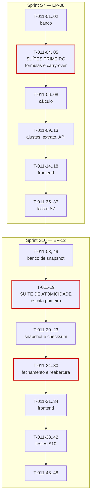

# 011 — Bank Hours · Tarefas

## 1. Convenções

| Campo | Regra |
|---|---|
| **ID** | `T-011-XX`, estável e imutável |
| **Descrição** | Verbo no infinitivo + objeto |
| **Dependências** | IDs de tarefas ou features concluídas |
| **Estimativa** | Horas-agente; acima de 8h deve ser decomposta |
| **Prioridade** | `P0` bloqueante · `P1` necessária · `P2` cortável |

> **Complexidade crítica (SQ-02):** `T-011-04` (fórmulas) e `T-011-05` (carry-over) são escritas e **revisadas** antes de `T-011-06` a `T-011-08`.
>
> **SQ-03:** duas aprovações obrigatórias no PR.
>
> **SQ-10:** qualquer divergência de saldo reportada **bloqueia toda a fila** até a causa raiz ser corrigida.

## 2. Duas sprints não contíguas

Esta feature ocupa **S7** e **S10**, deliberadamente separadas (§7 de `implementation-order.md`).

| Sprint | Entrega | Épico | Por quê |
|:--:|---|---|---|
| **S7** | Saldo, extrato e ajustes | EP-08 | O dashboard (`010`) e as notificações (`013`) dependem do saldo em S8 |
| **S10** | Fechamento, snapshot e reabertura | EP-12 | O congelamento só é verificável de ponta a ponta se os relatórios (`012`, S9) já existirem |

**Consequência prática:** as tarefas `T-011-01` a `T-011-18` são de S7; `T-011-19` a `T-011-45` são de S10. A feature só entra em `DONE` ao fim de S10.

## 3. Resumo

| Grupo | Tarefas | Estimativa | Sprint |
|---|:--:|---|:--:|
| Banco | 4 | 9h | S7 · S10 |
| Backend | 19 | 68h | S7 · S10 |
| Frontend | 11 | 36h | S7 · S10 |
| Testes | 8 | 42h | S7 · S10 |
| Documentação | 2 | 4h | S10 |
| Infra | 4 | 8h | S10 |
| **Total** | **48** | **167h ≈ 11 dias-agente** | — |

## 4. Banco

| ID | Descrição | Dependências | Estimativa | Prioridade | Sprint |
|---|---|---|:--:|:--:|:--:|
| T-011-01 | Criar `V029__create_period_adjustments.sql` com `CHECK (minutes <> 0)` e `CHECK (length(justification) >= 10)` | 004, 008 | 2h | P0 | S7 |
| T-011-02 | Criar `V031__period_balance_columns.sql` garantindo as colunas de saldo e os `CHECK` de INV-PER-05 e INV-PER-06 | T-011-01 | 2,5h | P0 | S7 |
| T-011-03 | Criar `V030__create_period_snapshots.sql` com único `(contract_period_id, snapshot_at)` — **não** apenas `contract_period_id` | T-011-02 | 2,5h | P0 | S10 |
| T-011-49 | Criar `idx_periods_closing_stuck` e `idx_periods_rollover_expiry` | T-011-02 | 2h | P0 | S10 |

> `T-011-49` pertence ao grupo Banco mas recebeu numeração no fim da faixa porque `T-011-04` e `T-011-05` já estavam reservadas para as suítes escritas primeiro (§5.1), e IDs são **estáveis e imutáveis** (§9 do `README.md`).

> `V030` usa único **composto** deliberadamente: um período reaberto e refechado gera um segundo snapshot (CX-18, INV-SNP-01). A unicidade simples por `contract_period_id` impediria o refechamento — erro fácil de cometer e difícil de detectar antes de S10.

## 5. Backend — S7 (saldo, extrato, ajustes)

### 5.1 Suítes escritas primeiro (SQ-02)

| ID | Descrição | Dependências | Estimativa | Prioridade |
|---|---|---|:--:|:--:|
| T-011-04 | **Escrever antes do código:** suíte do exemplo normativo da §6.1 e dos ramos de `consumptionRate` com `available = 0` | T-011-02 | 4h | P0 |
| T-011-05 | **Escrever antes do código:** suíte parametrizada das 6 linhas da tabela de carry-over da §6.2 | T-011-02 | 3h | P0 |

### 5.2 Cálculo

| ID | Descrição | Dependências | Estimativa | Prioridade |
|---|---|---|:--:|:--:|
| T-011-06 | Implementar `BalanceCalculator` em aritmética **inteira**, na ordem canônica, com `consumptionRate` em decimal (nunca `double`) | T-011-04 | 4h | P0 |
| T-011-07 | Implementar `RolloverCalculator` com as três políticas e a proibição de transporte negativo (RN-228) | T-011-05 | 3h | P0 |
| T-011-08 | Implementar `BalanceService` com `getBalance`, `applyConsumptionDelta` transacional e `checkOverage` para `008` | T-011-06 | 4h | P0 |

### 5.3 Ajustes e extrato

| ID | Descrição | Dependências | Estimativa | Prioridade |
|---|---|---|:--:|:--:|
| T-011-09 | Criar a entidade `PeriodAdjustment` e `PeriodAdjustmentRepository` **sem** métodos de atualização ou exclusão (RN-236) | T-011-01 | 2,5h | P0 |
| T-011-10 | Implementar `AdjustmentValidator` (RN-215, RN-237) e `AdjustmentService` restrito a `PERIOD_ADJUST` | T-011-09, T-011-08 | 3,5h | P0 |
| T-011-11 | Implementar `PeriodStatementService` unindo work logs e ajustes com saldo acumulado, paginado por cursor | T-011-08 | 4h | P1 |
| T-011-12 | Implementar a projeção de consumo (`burnRate`, `projectedConsumption`) | T-011-08 | 2,5h | P1 |
| T-011-13 | Criar DTOs, mappers e `ContractPeriodController` + `PeriodAdjustmentController`; omitir monetários sem `CONTRACT_VIEW_FINANCIAL` | T-011-11, T-011-10 | 4h | P0 |

## 6. Frontend — S7

| ID | Descrição | Dependências | Estimativa | Prioridade |
|---|---|---|:--:|:--:|
| T-011-14 | Criar `PeriodApi`, `PeriodStore` e `StatementStore` com `criticality` computed | T-011-13 | 3,5h | P0 |
| T-011-15 | Criar `dt-balance-summary`, `dt-balance-breakdown` e `dt-consumption-gauge` como componentes **compartilhados** (consumidos por `010`) | T-011-14 | 4h | P0 |
| T-011-16 | Criar `dt-partial-badge` e aplicá-lo em toda exibição de período aberto ou reaberto (RN-702) | T-011-14 | 1,5h | P0 |
| T-011-17 | Criar `dt-adjustment-dialog` com **prévia do saldo resultante** e `dt-adjustment-list` com ação de estorno | T-011-14 | 4h | P0 |
| T-011-18 | Criar `dt-period-statement`, `dt-projection-chart` e `PeriodDetailPage` (P16) | T-011-15, T-011-17 | 4,5h | P0 |

## 7. Backend — S10 (fechamento, snapshot, reabertura)

| ID | Descrição | Dependências | Estimativa | Prioridade |
|---|---|---|:--:|:--:|
| T-011-19 | **Escrever antes do código:** suíte de atomicidade com injeção de falha em **cada** um dos 7 passos de RN-241 | T-011-03 | 5h | P0 |
| T-011-20 | Criar a entidade `PeriodSnapshot` e `PeriodSnapshotRepository` **sem** métodos de atualização ou exclusão (INV-SNP-01) | T-011-03 | 2,5h | P0 |
| T-011-21 | Implementar `SnapshotPayloadMapper` produzindo JSON **canônico** com ordenação determinística | T-011-20 | 4h | P0 |
| T-011-22 | Implementar `SnapshotBuilder` com SHA-256 sobre o payload canonicalizado e registro de excedente (RN-245) | T-011-21 | 3h | P0 |
| T-011-23 | Implementar `ChecksumVerifier` e `SnapshotService.getForReport` para `012` | T-011-22 | 2,5h | P0 |
| T-011-24 | Implementar `ConsumptionReconciler` (passo 1) registrando a diferença encontrada em auditoria e métrica | T-011-08 | 3h | P0 |
| T-011-25 | Implementar `ClosingGuard` (RN-239, RN-240) consumindo `TimerQueryService.hasActiveForPeriod` | T-011-24 | 3h | P0 |
| T-011-26 | Implementar `PeriodClosingService` com **lock pessimista** e os 7 passos em uma transação | T-011-19, T-011-25, T-011-22 | 6h | P0 |
| T-011-27 | Implementar a propagação de `carriedOut` para `carriedIn`, criando o período seguinte se necessário (RN-229) | T-011-26, T-011-07 | 3h | P0 |
| T-011-28 | Implementar `ReopeningGuard` (RN-244) e `PeriodReopeningService` preservando o snapshot (RN-243) | T-011-26 | 4h | P0 |
| T-011-29 | Implementar a prévia de fechamento (`ClosePreviewResponse`) consumida pelo diálogo | T-011-26 | 2,5h | P1 |
| T-011-30 | Criar `PeriodClosingController` com OpenAPI; registrar os códigos de erro da §12 | T-011-28, T-011-29 | 3h | P0 |

## 8. Frontend — S10

| ID | Descrição | Dependências | Estimativa | Prioridade |
|---|---|---|:--:|:--:|
| T-011-31 | Criar `dt-close-period-dialog` com resumo do congelamento, `carriedOut` previsto e confirmação de antecipação | T-011-30 | 4h | P0 |
| T-011-32 | Criar `dt-reopen-dialog` com justificativa obrigatória e aviso sobre o relatório já emitido | T-011-30 | 2,5h | P0 |
| T-011-33 | Criar `dt-period-timeline` e integrar as ações de fechamento e reabertura em P16 | T-011-31, T-011-32 | 3,5h | P0 |
| T-011-34 | Exibir o extrato de período fechado a partir do snapshot, com selo de definitivo | T-011-33 | 2,5h | P0 |

## 9. Testes

| ID | Descrição | Dependências | Estimativa | Prioridade | Sprint |
|---|---|---|:--:|:--:|:--:|
| T-011-35 | Testes de `BalanceService.applyConsumptionDelta` sob concorrência e da convergência do reconciliador | T-011-08 | 4h | P0 | S7 |
| T-011-36 | Testes de ajuste: imutabilidade, saldo negativo, período fechado, estorno, justificativa de 9 e 10 caracteres | T-011-10 | 4h | P0 | S7 |
| T-011-37 | Testes do extrato: soma dos lançamentos igual ao saldo, paginação por cursor, período com 5.000 registros | T-011-11 | 4h | P1 | S7 |
| T-011-38 | Teste de determinismo do checksum com dupla geração e com ordem de carregamento variada | T-011-22 | 4h | P0 | S10 |
| T-011-39 | Teste de concorrência: dois fechamentos simultâneos com lock pessimista | T-011-26 | 4h | P0 | S10 |
| T-011-40 | Testes de reabertura: preservação do snapshot, cascata de 3 períodos, refechamento gerando segundo snapshot | T-011-28 | 5h | P0 | S10 |
| T-011-41 | Testes dos jobs com `Clock` fixo: `CLOSING` preso, expiração de carry-over, integridade de checksum | T-011-43 | 5h | P0 | S10 |
| T-011-42 | Suíte de isolamento + matriz de permissões (incluindo `MANAGER` recusado) + testes de frontend da prévia de ajuste | T-011-30 | 5h | P0 | S10 |

## 10. Documentação

| ID | Descrição | Dependências | Estimativa | Prioridade |
|---|---|---|:--:|:--:|
| T-011-44 | Sincronizar `docs/04-api/contracts.md` §10 a §13 com o comportamento implementado | T-011-30 | 2h | P0 |
| T-011-45 | Publicar `getBalance`, `applyConsumptionDelta`, `checkOverage` e `getForReport` para `008`, `010`, `012` e `013`; atualizar o status em `implementation-order.md` §12 | T-011-30 | 2h | P0 |

## 11. Infra

| ID | Descrição | Dependências | Estimativa | Prioridade |
|---|---|---|:--:|:--:|
| T-011-43 | Implementar `StuckClosingJob`, `RolloverExpiryJob`, `AutoClosePeriodJob` e `SnapshotIntegrityJob` — este último **alertando sem corrigir** (CP-17) | T-011-26 | 4h | P0 |
| T-011-46 | Registrar o reconciliador de `consumedMinutes` no `DenormalizationReconcileJob`, restrito a períodos **abertos** | T-011-08 | 1,5h | P0 |
| T-011-47 | Configurar as métricas da §29, com **alerta crítico** em `period.reconciliation.delta`, `period.stuck_closing` e `period.snapshot.checksum_mismatch` | T-011-43 | 1,5h | P0 |
| T-011-48 | Configurar o alerta de `SQ-10`: divergência de saldo reportada dispara bloqueio da fila | T-011-47 | 1h | P0 |

## 12. Ordem de execução

**Caminho crítico:** `T-011-01 → 02 → 04/05 → 06 → 08 → 13` (S7) → `T-011-03 → 19 → 21 → 22 → 26 → 30 → 39` (S10).

**Três suítes escritas antes do código:**

| Suíte | Por quê |
|---|---|
| `T-011-04` (fórmulas) | O saldo é **o número** do produto. Um erro de ordem de cálculo ou de tratamento de `available = 0` produz um valor plausível e errado — que ninguém percebe até um cliente conferir |
| `T-011-05` (carry-over) | As três políticas têm bordas sutis: negativo não transporta, teto limita, zero é válido. A tabela normativa é o único artefato que torna essas bordas verificáveis |
| `T-011-19` (atomicidade) | RN-241 tem 7 passos. Uma falha no passo 4 que deixasse work logs travados sem snapshot criaria um período impossível de fechar **e** impossível de editar. O teste injeta falha em **cada** passo |

**Paralelizável em S7:** `T-011-15` e `T-011-16` (componentes de saldo) são compartilhados com `010-dashboard` e podem ser desenvolvidos com MSW, liberando `010` para começar em paralelo em S8.

**Bloqueio para outras features:** `T-011-45` bloqueia `010-dashboard`, `012-reports` e `013-notifications`. Entregar `getBalance` e `checkOverage` ao fim de S7 é o que permite `010` e `013` rodarem em S8, conforme a §8.1 de `implementation-order.md`.

**Dependência inversa:** `T-011-08` (`checkOverage`) é consumida por `008-worklogs`, que já estará em `DONE`. A implementação de RN-231 em `008` precisará ser **conectada** a esta interface — tarefa registrada em `T-011-45`. Até lá, `008` trata a política de excedente com o saldo calculado localmente, comportamento correto e temporário.

## 13. Critérios de conclusão por grupo

| Grupo | Concluído quando |
|---|---|
| Banco | `CHECK` de INV-PER-05/06 rejeitam `INSERT` direto; único de snapshot é **composto**, permitindo refechamento comprovado por teste |
| Backend S7 | Exemplo normativo reproduzido exatamente; 6 linhas de carry-over verdes; nenhum ponto flutuante; ajustes sem caminho de alteração; extrato somando ao saldo |
| Backend S10 | Atomicidade provada com falha em **cada** um dos 7 passos; checksum determinístico em dupla geração; reabertura preservando o snapshot; cascata em ordem inversa |
| Frontend | Prévia de saldo no ajuste; selo de parcial em todo período aberto; monetários ocultos sem permissão; zero violações do axe-core |
| Testes | Suítes de fórmulas, carry-over e atomicidade escritas antes do código; cobertura ≥ 95% nos calculators e ≥ 90% em services; isolamento verde nos 8 endpoints |
| Documentação | `contracts.md` §10 a §13 sincronizado; quatro interfaces publicadas e conectadas em `008` |
| Infra | Quatro jobs ativos e idempotentes; `SnapshotIntegrityJob` comprovadamente **não corretivo**; alertas críticos configurados e testados; gatilho de SQ-10 operacional |
