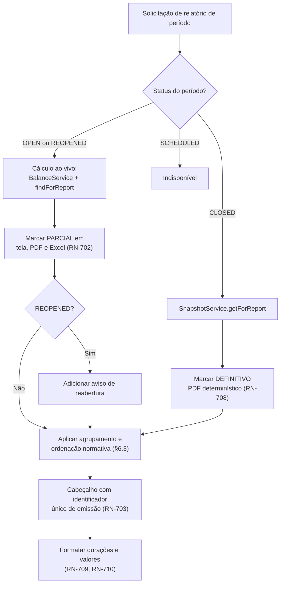
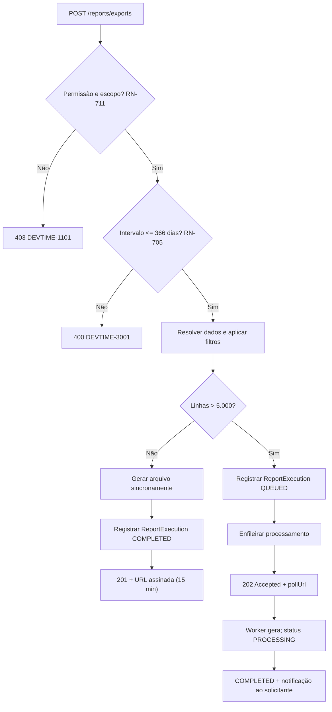
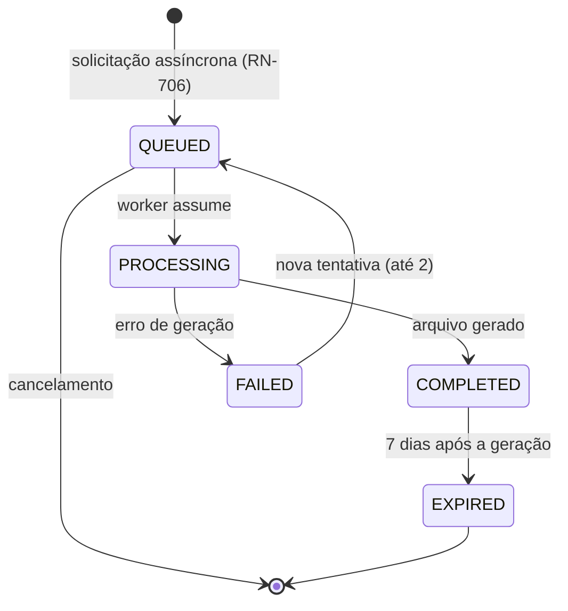

# 012 — Reports & Export

| Campo | Valor |
|---|---|
| **Feature** | 012 |
| **Épico** | EP-11 (Relatórios e Exportação) |
| **Sprint** | S9 |
| **Prioridade** | P0 |
| **Complexidade** | Alta |
| **Estimativa** | 34 pts · 8 dias-agente |
| **Stories** | US-145 a US-157 |
| **Status** | SPEC_APPROVED |

## 1. Objetivo

Gerar relatórios de horas — por período de contrato, por cliente, por folha de horas, por ticket e de produtividade — e exportá-los em PDF, Excel e CSV, servindo períodos fechados exclusivamente do snapshot e marcando períodos abertos como parciais.

## 2. Problema que resolve

O relatório é o **entregável** do produto. Todo o resto existe para produzi-lo. É o documento que o freelancer anexa ao e-mail de cobrança, que o cliente confere antes de aprovar a fatura e que sustenta a conversa quando há discordância.

PV-05 e RP-04 identificam a **qualidade visual do PDF** como risco: um relatório que parece exportação de planilha faz o cliente duvidar do profissionalismo de quem o enviou, independentemente de os números estarem corretos. O PDF não é um dump de dados — é um documento com cabeçalho, identidade e legibilidade.

A segunda função é a **imutabilidade percebida**. RN-701 determina que relatório de período fechado vem do snapshot, ignorando o estado atual do banco. Isso significa que o PDF gerado hoje é idêntico ao gerado há seis meses (RN-708). Sem essa garantia, cada regeração poderia produzir números diferentes, e o documento perderia valor probatório.

## 3. Escopo

| # | Item | Referência |
|---|---|---|
| E-01 | Relatório de período de contrato | §6 `reports.md` |
| E-02 | Resumo consolidado por cliente | §7.1 |
| E-03 | Folha de horas por intervalo | §7.2 |
| E-04 | Detalhamento por ticket | §7.3 |
| E-05 | Relatório de produtividade | §7.4 |
| E-06 | Período fechado servido do snapshot | RN-701 |
| E-07 | Período aberto marcado como parcial em todas as saídas | RN-702 |
| E-08 | Cabeçalho com identificação e identificador único de emissão | RN-703 |
| E-09 | Exclusão de registros logicamente removidos | RN-704 |
| E-10 | Limite de 366 dias no intervalo | RN-705 |
| E-11 | Exportação assíncrona acima de 5.000 linhas | RN-706 |
| E-12 | Registro de `ReportExecution` com filtros aplicados | RN-707 |
| E-13 | PDF determinístico | RN-708 |
| E-14 | Formatação monetária e de duração | RN-709, RN-710 |
| E-15 | Restrição de escopo por permissão | RN-711 |
| E-16 | URL de download assinada, expirando em 15 minutos | RN-712 |
| E-17 | Seis agrupamentos e ordenação padrão | §13 `business-rules.md` |
| E-18 | Tela P24 | `pages.md` |

## 4. Fora do escopo

| Item | Onde está | Motivo |
|---|---|---|
| Cálculo de saldo | `011-bank-hours` | Esta feature **consome** o snapshot ou `BalanceService` |
| Fechamento de período | `011-bank-hours` | Esta feature consome o snapshot produzido lá |
| Dashboard | `010-dashboard` | Visão operacional, não documento entregável |
| Envio automático por e-mail ao cliente | Fora do MVP | `Contact.receivesReports` já existe, sem uso — ver OB-07 |
| Relatório personalizado com colunas configuráveis | Fora do roadmap | Conflito CF-02 de `personas.md` |
| Faturamento e emissão de nota fiscal | Fora do roadmap | NO-01 |
| Assinatura digital do PDF | Fora do roadmap | Sem demanda validada; o checksum do snapshot já garante integridade |
| Relatórios de custo interno | F5 | `Membership.defaultHourlyCost` já existe, sem uso |

## 5. Dependências

### 5.1 Features
| Feature | Tipo | O que consome |
|---|---|---|
| `011-bank-hours` | **Bloqueante** | `SnapshotService.getForReport` (RN-701), `BalanceService.getBalance` para períodos abertos |
| `008-worklogs` | Bloqueante | `WorkLogService.findForReport` (RN-704) |
| `003-clients` | Bloqueante | Dados do cliente no cabeçalho (RN-703) |
| `004-contracts` | Bloqueante | Dados do contrato e taxas |
| `005-categories` | Bloqueante | `CategoryService.getAllForReport` — inclui excluídas |
| `006-tags` | Bloqueante | `TagService.getAllForReport` |
| `007-tickets` | Bloqueante | `TicketService.getKeyById` |
| `002-users` | Bloqueante | Dados do tenant no cabeçalho; nomes de usuários |
| `013-notifications` | Consumidora | Notificação de exportação concluída |

### 5.2 Documentos obrigatórios
| Documento | Seções relevantes |
|---|---|
| `docs/04-api/reports.md` | §5 a §9, §11 |
| `docs/02-domain/business-rules.md` | RN-701 a RN-712, §13 |
| `docs/02-domain/entities.md` | §6.9 PeriodSnapshot |
| `docs/02-domain/state-machines.md` | §4.10 ReportExecution |
| `docs/02-domain/permissions.md` | §6.9, §7, CE-P-10 |
| `docs/05-ui/pages.md` | P24 |
| `docs/05-ui/design-system.md` | Identidade visual do PDF |

### 5.3 Infraestrutura
| Componente | Uso |
|---|---|
| PostgreSQL | `report_executions`; leitura de snapshots e work logs |
| Object storage | Arquivos exportados, com URL assinada (RN-712) |
| Motor de PDF | Renderização com identidade visual — decisão de `integrations.md` |
| Fila assíncrona | Exportações acima de 5.000 linhas (RN-706) |

## 6. Regras de negócio

| ID | Tipo | Enunciado resumido | Erro | Onde é aplicada |
|---|---|---|---|---|
| RN-701 | Automática | Período `CLOSED` é servido **exclusivamente** do snapshot | — | `ReportDataResolver` |
| RN-702 | Automática | Período `OPEN`/`REOPENED` é calculado ao vivo e marcado **PARCIAL** em tela, PDF e Excel | — | `ReportDataResolver` |
| RN-703 | Automática | Todo relatório inclui tenant, cliente, contrato, período, data de emissão e identificador único | — | `ReportHeaderBuilder` |
| RN-704 | Automática | Registros excluídos logicamente **não** aparecem | — | `WorkLogService.findForReport` |
| RN-705 | Bloqueante | Intervalo não excede 366 dias | `DEVTIME-3001` / 400 | `ReportPeriodValidator` |
| RN-706 | Automática | Acima de 5.000 linhas, processamento assíncrono com `202 Accepted` | — | `ExportService` |
| RN-707 | Automática | Toda exportação registra `ReportExecution` com filtros, formato, contagem e solicitante | — | `ExportService` |
| RN-708 | Automática | PDF de período fechado é **determinístico**: duas gerações produzem conteúdo idêntico, exceto o carimbo de emissão | — | `PdfRenderer` |
| RN-709 | Automática | Valores monetários com 2 casas, `HALF_UP`, com símbolo da moeda do contrato | — | `MoneyFormatter` |
| RN-710 | Automática | Durações em `HH:MM` no PDF; em Excel, duas colunas — `HH:MM` texto e horas decimais numéricas | — | `DurationFormatter` |
| RN-711 | Bloqueante | Usuário só exporta contratos aos quais tem acesso | `DEVTIME-1101` / 403 | `ReportScopePolicy` |
| RN-712 | Automática | URL de download assinada, expirando em 15 minutos | — | `SignedUrlProvider` |
| RN-012 | Bloqueante | Listagem de execuções paginada | `DEVTIME-2006` / 400 | `ExportController` |
| RN-009 | Automática | Datas no fuso do tenant | — | Toda agregação |
| RN-001 / RN-002 | Bloqueante | Tenant do usuário; recurso externo retorna `404` | `DEVTIME-1200` / `2002` | Filtro automático |
| RN-006 | Automática | `ReportExecution` é criada com auditoria | — | `ExportService` |

### 6.1 Resolução da fonte de dados (RN-701, RN-702)

A decisão mais importante da feature. Reproduz a fronteira estabelecida em `011`:

| Estado do período | Fonte | Marcação | Determinismo |
|---|---|---|:--:|
| `CLOSED` | **Snapshot** (`SnapshotService.getForReport`) | Definitivo | ✔ RN-708 |
| `REOPENED` | Cálculo ao vivo | **PARCIAL** + aviso de reabertura | ✖ |
| `OPEN` | Cálculo ao vivo | **PARCIAL** | ✖ |
| `SCHEDULED` | Indisponível | — | — |
| Intervalo livre (folha de horas) | Cálculo ao vivo | **PARCIAL** se contiver período aberto | ✖ |

**Consequência de RN-701:** um relatório de período fechado **ignora** alterações posteriores no banco. Se uma categoria foi renomeada, o relatório exibe o nome vigente ao fechamento (CE-R-02). Se o cliente mudou de nome, idem. Isso é o comportamento correto: o documento entregue não muda retroativamente.

**Consequência de RN-702:** todo relatório de período aberto é marcado como parcial em **todas** as saídas — tela, PDF e Excel. A marcação no PDF é visual e proeminente, não uma nota de rodapé: um PDF parcial que circule sem essa indicação será tratado como final.

### 6.2 Ordem de aplicação — geração de relatório

| # | Verificação | Falha |
|---|---|---|
| 1 | Permissão `REPORT_VIEW_OWN` ou `REPORT_VIEW_ANY` | `403 DEVTIME-1101` |
| 2 | Escopo: `MEMBER` só exporta os próprios registros (CE-P-10, RN-711) | `403 DEVTIME-1101` |
| 3 | Recursos referenciados existem no tenant | `404 DEVTIME-2002` |
| 4 | Intervalo de datas ≤ 366 dias (RN-705) | `400 DEVTIME-3001` |
| 5 | Resolver a fonte: snapshot ou cálculo ao vivo (§6.1) | — |
| 6 | Aplicar filtros e agrupamento | — |
| 7 | Excluir registros logicamente removidos (RN-704) | — |
| 8 | Montar cabeçalho com identificador único de emissão (RN-703) | — |
| 9 | Formatar durações e valores (RN-709, RN-710) | — |
| 10 | Contar linhas; acima de 5.000 na exportação, enfileirar (RN-706) | — |
| 11 | Registrar `ReportExecution` (RN-707) | — |
| 12 | Retornar dados, ou `202` com identificador de acompanhamento | — |

**Por que o escopo (2) precede a existência (3):** um `MEMBER` que solicita relatório de um contrato ao qual não tem acesso deve receber `403` por escopo antes de o sistema confirmar que o contrato existe. Verificar a existência primeiro vazaria, pelo código de erro, que o contrato existe. CE-P-10 é explícito: `MEMBER` exporta apenas com escopo `myWorkLogs`; qualquer outro filtro retorna `403`.

**Por que a contagem (10) vem depois dos filtros (6):** o limiar de 5.000 linhas é sobre o resultado **filtrado**, não sobre o total do tenant. Um relatório de um único dia nunca deveria ser assíncrono só porque o tenant tem 100.000 registros.

### 6.3 Agrupamentos e ordenação (§13 `business-rules.md`)

| Agrupamento | Aplicável a |
|---|---|
| Por data | Todos |
| Por ticket | Período, cliente, folha de horas |
| Por categoria | Todos |
| Por usuário | Período, cliente, folha de horas, produtividade |
| Por tag | Período, cliente, folha de horas |
| Por semana | Folha de horas, produtividade |

**Ordenação padrão obrigatória:** data crescente, depois `ticket.key`, depois `startedAt`.

> A ordenação é **normativa**, não configurável. Dois relatórios do mesmo período devem listar os registros na mesma sequência — é o que permite ao cliente comparar o PDF de hoje com o de ontem linha a linha. Sem ordenação determinística, RN-708 é inverificável.

### 6.4 Formatação (RN-709, RN-710)

| Tipo | PDF | Excel | CSV |
|---|---|---|---|
| Duração | `HH:MM` | **Duas colunas**: `HH:MM` (texto) e horas decimais (numérico, 2 casas) | `HH:MM` e decimal |
| Valor monetário | Símbolo + 2 casas, `HALF_UP` | Numérico com formato de moeda | Numérico sem símbolo |
| Data | Formato do `locale` do tenant | Data nativa | ISO-8601 |
| Percentual | 2 casas | Numérico com formato de percentual | Numérico |

**Por que duas colunas de duração no Excel (RN-710):** `HH:MM` como texto é legível mas não somável; horas decimais são somáveis mas menos legíveis. O cliente que abre o Excel quer as duas coisas — conferir visualmente e aplicar fórmulas. Uma única coluna forçaria a escolha e geraria retrabalho manual.

**Por que `HALF_UP` (RN-709):** é o arredondamento que o cliente espera em valores financeiros. Diferentemente de RN-113, que arredonda **duração para baixo** por princípio (PR-03), o valor monetário derivado de uma duração já truncada é arredondado normalmente.

### 6.5 Invariantes envolvidas
| ID | Invariante | Como é garantida |
|---|---|---|
| INV-RPT-01 | Relatório de período `CLOSED` é idêntico entre gerações | RN-708; fonte é o snapshot; ordenação determinística |
| INV-RPT-02 | Nenhum registro excluído aparece em relatório | RN-704; `findForReport` filtra |
| INV-RPT-03 | Todo relatório aberto é marcado como parcial em todas as saídas | RN-702 |
| INV-RPT-04 | `MEMBER` nunca exporta dado de terceiro | RN-711, CE-P-10 |
| INV-RPT-05 | Todo arquivo exportado possui `ReportExecution` correspondente | RN-707 |
| INV-RPT-06 | URL de download expira em 15 minutos | RN-712 |

## 7. Fluxo principal — relatório de período de contrato

1. Usuário com `REPORT_VIEW_ANY` abre P24 e escolhe "relatório de período".
2. Seleciona cliente, contrato e período; escolhe o agrupamento.
3. Envia `GET /api/v1/reports/contract-period/{periodId}`.
4. `ReportService` aplica a ordem da §6.2.
5. `ReportDataResolver` verifica o status do período: `CLOSED` → snapshot; aberto → cálculo ao vivo.
6. Aplica o agrupamento e a ordenação normativa (§6.3).
7. `ReportHeaderBuilder` monta o cabeçalho com identificador único de emissão (RN-703).
8. Retorna `200` com os dados estruturados e a marcação de parcial quando aplicável.
9. A tela exibe o relatório com totais, agrupamentos e o selo de parcial ou definitivo.
10. Ao exportar, o usuário escolhe o formato; se o resultado tem até 5.000 linhas, o arquivo é gerado de forma síncrona e a URL assinada é retornada.
11. Acima de 5.000 linhas, `202 Accepted` com `pollUrl`; o processamento é assíncrono e o usuário é notificado ao concluir.
12. `ReportExecution` é registrada em ambos os casos (RN-707).

## 8. Fluxos alternativos

| # | Fluxo | Gatilho | Comportamento |
|---|---|---|---|
| FA-01 | Período fechado | `status = CLOSED` | Servido do snapshot; marcado definitivo; PDF determinístico |
| FA-02 | Período aberto | `OPEN` | Cálculo ao vivo; marcado **PARCIAL** em todas as saídas |
| FA-03 | Período reaberto | `REOPENED` | Cálculo ao vivo; parcial **com aviso de reabertura** |
| FA-04 | Período reaberto e refechado | — | Passa a refletir o **novo** snapshot; o anterior é preservado mas não servido (CE-R-04) |
| FA-05 | Resumo por cliente | `/reports/client-summary/{clientId}` | Exige `REPORT_VIEW_ANY`; agrega todos os contratos do cliente |
| FA-06 | Folha de horas | `/reports/timesheet` | Intervalo livre até 366 dias; parcial se contiver período aberto |
| FA-07 | Detalhamento por ticket | `/reports/ticket-detail/{ticketId}` | Todos os registros do ticket, com totais |
| FA-08 | Produtividade | `/reports/productivity` | Exige `REPORT_VIEW_ANY`; agregação por usuário e semana |
| FA-09 | Exportação síncrona | ≤ 5.000 linhas | Arquivo gerado; `201` com URL assinada |
| FA-10 | Exportação assíncrona | > 5.000 linhas | `202` com `pollUrl`; notificação ao concluir (RN-706) |
| FA-11 | Acompanhamento de exportação | `GET /reports/exports/{id}` | Estado conforme §4.10 de `state-machines.md` |
| FA-12 | Download | `GET /reports/exports/{id}/download` | URL assinada, 15 minutos (RN-712) |
| FA-13 | URL expirada | Após 15 minutos | Nova solicitação de download gera nova URL, sem regerar o arquivo |
| FA-14 | Arquivo expirado | 7 dias após a geração | `EXPIRED`; exige nova geração (§4.10) |
| FA-15 | Cancelamento de exportação | `DELETE /reports/exports/{id}` | Permitido em `QUEUED`; ignorado em `PROCESSING` |
| FA-16 | Falha na geração | Erro no motor | `FAILED` com motivo; até 2 novas tentativas (§4.10) |
| FA-17 | `MEMBER` exportando | Papel sem `REPORT_VIEW_ANY` | Permitido **apenas** com escopo `myWorkLogs`; outro filtro → `403` (CE-P-10) |
| FA-18 | Contrato sem valor hora | `hourlyRate` nulo | Colunas monetárias **omitidas**, sem erro (CE-R-05, CE-09) |
| FA-19 | Relatório sem registros | Filtro sem resultado | Gerado normalmente, com totais zerados e mensagem explícita (CE-R-06) |
| FA-20 | Registro excluído após o filtro | — | Não aparece (RN-704); em período fechado é impossível, pois está travado (CE-R-03) |
| FA-21 | Descrição com emoji ou caractere especial | — | Preservada em PDF, XLSX e CSV (CE-R-08) |

## 9. Diagramas

### 9.1 Resolução da fonte de dados (RN-701, RN-702)

### 9.2 Exportação síncrona e assíncrona (RN-706)

### 9.3 Máquina de estados de `ReportExecution` (§4.10)

## 10. Estados

| Estado | Significado | Ações disponíveis | Bloqueadas |
|---|---|---|---|
| `QUEUED` | Aguardando processamento | Cancelar, acompanhar | Baixar |
| `PROCESSING` | Em geração | Acompanhar | Cancelar, baixar |
| `COMPLETED` | Pronto | Baixar (URL assinada, 15 min) | Cancelar |
| `FAILED` | Erro | Ver motivo, tentar novamente (até 2) | Baixar |
| `EXPIRED` | Arquivo removido após 7 dias | Gerar novamente | Baixar |

## 11. Transições

| Origem | Destino | Gatilho | Guarda | Efeito | Permissão |
|---|---|---|---|---|---|
| — | `QUEUED` | Exportação > 5.000 linhas | RN-705, RN-711 | Registra `ReportExecution` com filtros (RN-707) | `REPORT_EXPORT` |
| — | `COMPLETED` | Exportação ≤ 5.000 linhas | Idem | Arquivo gerado sincronamente | `REPORT_EXPORT` |
| `QUEUED` | `PROCESSING` | Worker assume | — | — | Sistema |
| `QUEUED` | *cancelado* | Cancelamento | Ainda em `QUEUED` | Soft delete da execução | `REPORT_EXPORT` |
| `PROCESSING` | `COMPLETED` | Arquivo gerado | — | Notifica o solicitante | Sistema |
| `PROCESSING` | `FAILED` | Erro de geração | — | Registra o motivo | Sistema |
| `FAILED` | `QUEUED` | Nova tentativa | Máximo de 2 | — | Sistema / `REPORT_EXPORT` |
| `COMPLETED` | `EXPIRED` | 7 dias | Job de limpeza | Remove o binário do storage | Sistema |

### 11.1 Transições proibidas
| Transição | Motivo da proibição |
|---|---|
| Servir período `CLOSED` do banco ao vivo | RN-701, ART-005. O documento entregue não muda retroativamente |
| Gerar relatório de período aberto sem marcação de parcial | RN-702, INV-RPT-03. Um número em evolução seria tratado como final |
| Incluir registro excluído | RN-704, INV-RPT-02 |
| `MEMBER` exportar dado de terceiro | RN-711, CE-P-10, INV-RPT-04 |
| Exportar sem registrar `ReportExecution` | RN-707, INV-RPT-05 |
| URL de download sem expiração | RN-712, INV-RPT-06 |
| Cancelar exportação em `PROCESSING` | O worker já está gerando; cancelar exigiria interromper o processo no meio |
| Terceira tentativa após `FAILED` | §4.10; duas falhas indicam problema que nova tentativa não resolve |
| Ordenação configurável | §6.3; quebraria o determinismo de RN-708 |

## 12. Casos de erro

| Código | HTTP | Situação | Mensagem ao usuário | Regra |
|---|:--:|---|---|---|
| `DEVTIME-1101` | 403 | Sem permissão, ou `MEMBER` fora do escopo `myWorkLogs` | Você não tem permissão para esta ação | RN-711, CE-P-10 |
| `DEVTIME-2002` | 404 | Contrato, período, cliente ou ticket de outro tenant | Recurso não encontrado | RN-002 |
| `DEVTIME-2006` | 400 | `size` acima do limite na listagem de execuções | Tamanho de página inválido | RN-012 |
| `DEVTIME-3001` | 400 | Intervalo acima de 366 dias | Intervalo de datas excede o máximo permitido | RN-705 |
| `DEVTIME-3002` | 409 | Download de exportação não concluída | O arquivo ainda está sendo gerado | §4.10 |
| `DEVTIME-3003` | 410 | Download de exportação expirada | O arquivo expirou. Gere novamente | §4.10 |
| `DEVTIME-3004` | 409 | Cancelamento de exportação em processamento | Não é possível cancelar uma exportação em andamento | §11.1 |
| `DEVTIME-2000` | 422 | Filtros inválidos ou agrupamento incompatível | Filtros inválidos para este relatório | §6.3 |
| `DEVTIME-1201` | 403 | Tenant cancelado | Organização cancelada | RN-008 |

> Tenant **suspenso** permite leitura **e exportação** (RN-007). É deliberado: um tenant inadimplente precisa poder exportar seus dados — bloquear a exportação seria retê-los como garantia.

### 12.1 Casos extremos

| # | Caso | Comportamento esperado |
|---|---|---|
| CX-01 | Relatório de período aberto | Marcado `PARTIAL` em tela, PDF e Excel (CE-R-01) |
| CX-02 | Cliente renomeado após o fechamento | O relatório exibe o nome vigente **no fechamento** (CE-R-02, RN-701) |
| CX-03 | Categoria excluída com registros no período fechado | Nome vigente no fechamento, do snapshot |
| CX-04 | Categoria excluída em período aberto | Nome atual via `getAllForReport`, que inclui excluídas |
| CX-05 | Registro excluído após o fechamento | Impossível — registros ficam travados (CE-R-03, RN-121) |
| CX-06 | Período reaberto e refechado | Reflete o **novo** snapshot; o anterior é preservado mas não servido (CE-R-04) |
| CX-07 | Contrato sem valor hora | Colunas monetárias omitidas, sem erro (CE-R-05, CE-09) |
| CX-08 | Relatório com zero registros | Gerado com totais zerados e mensagem explícita (CE-R-06) |
| CX-09 | Exportação de 50.000 linhas | Assíncrona; notificação ao concluir (CE-R-07) |
| CX-10 | Exportação de exatamente 5.000 linhas | **Síncrona** — o limiar é "acima de 5.000" |
| CX-11 | Exportação de 5.001 linhas | Assíncrona |
| CX-12 | Descrição com emoji e caractere especial | Preservada em PDF, XLSX e CSV (CE-R-08) |
| CX-13 | Descrição iniciando com `=`, `+`, `-` ou `@` | **Neutralizada** em CSV e XLSX para impedir injeção de fórmula |
| CX-14 | Intervalo de exatamente 366 dias | Aceito; 367 rejeitado |
| CX-15 | Duas gerações do mesmo PDF de período fechado | Conteúdo **idêntico**, exceto o carimbo de emissão (RN-708) |
| CX-16 | Usuário removido do tenant com registros no relatório | Nome exibido como no snapshot; em período aberto, `Usuário Removido` |
| CX-17 | Download 16 minutos após a geração da URL | `403` do storage; nova solicitação gera nova URL sem regerar o arquivo (FA-13) |
| CX-18 | Arquivo baixado 8 dias após a geração | `410 DEVTIME-3003`; exige nova geração |
| CX-19 | Duas exportações idênticas simultâneas | Duas `ReportExecution` distintas; dois arquivos; nenhuma deduplicação |
| CX-20 | Falha na geração duas vezes | Permanece `FAILED`; nenhuma terceira tentativa automática |
| CX-21 | `MEMBER` solicitando relatório de produtividade | `403` — exige `REPORT_VIEW_ANY` |
| CX-22 | `MEMBER` com filtro `myWorkLogs` | Permitido (CE-P-10) |
| CX-23 | Relatório de folha de horas cruzando períodos aberto e fechado | Marcado **PARCIAL** — a presença de qualquer período aberto torna o conjunto parcial |
| CX-24 | Snapshot com checksum divergente | Relatório é gerado, mas com alerta operacional; a verificação é de `011` (CX-21 daquela spec) |

## 13. Modelo de dados

### 13.1 Entidades impactadas
| Entidade | Operação | Tabela | Referência |
|---|---|---|---|
| `ReportExecution` | Cria, lê, atualiza status, soft delete | `report_executions` | §4.10 SM |
| `PeriodSnapshot` | **Lê** | `period_snapshots` | Via `SnapshotService` |
| `WorkLog` | **Lê** | `work_logs` | Via `WorkLogService.findForReport` |
| `ContractPeriod`, `Contract`, `Client`, `Ticket`, `Category`, `Tag`, `Tenant`, `User` | **Lê** | — | Via services |
| `AuditLog` | Cria | `audit_logs` | RN-707 |

### 13.2 Campos obrigatórios na criação de `ReportExecution`
| Campo | Tipo | Origem | Imutável | Validação |
|---|---|---|:--:|---|
| `tenantId` | UUID | `TenantContext` | ✔ 🔒 | Nunca da requisição |
| `reportType` | enum | Request | ✔ 🔒 | Um dos 5 tipos |
| `format` | enum | Request | ✔ 🔒 | `PDF`, `XLSX`, `CSV` |
| `filters` | JSONB | Request | ✔ 🔒 | Filtros aplicados, para reprodutibilidade (RN-707) |
| `requestedBy` | UUID | Autenticado | ✔ 🔒 | Nunca da requisição |
| `status` | enum | Sistema | ✖ | `QUEUED` ou `COMPLETED` |
| `rowCount` | int | Sistema | ✖ | Contagem real de linhas |
| `storageKey` | String(500) | Sistema | ✖ | Chave no object storage |
| `attemptCount` | int | Sistema | ✖ | `0`; máximo 2 |
| `failureReason` | Text | Sistema | ✖ | Preenchido em `FAILED` |
| `expiresAt` | TIMESTAMPTZ | Sistema | ✖ | `now() + 7 dias` |

### 13.3 Migrations
| Migration | Conteúdo | Compatibilidade |
|---|---|---|
| `V033__create_report_executions.sql` | `report_executions` + `CHECK (attempt_count <= 2)` | Nova tabela |
| `V034__report_indexes.sql` | Índices de acompanhamento e limpeza | Índices |

### 13.4 Índices
| Índice | Colunas | Sustenta |
|---|---|---|
| `idx_report_exec_tenant_user` | `(tenant_id, requested_by, created_at DESC)` WHERE `deleted_at IS NULL` | Listagem de exportações do usuário |
| `idx_report_exec_queued` | `(status, created_at)` WHERE `status IN ('QUEUED','FAILED')` | Worker e novas tentativas |
| `idx_report_exec_expiry` | `(expires_at)` WHERE `status = 'COMPLETED'` | Job de expiração |
| `idx_work_logs_contract_date` | `(tenant_id, contract_id, work_date)` WHERE `deleted_at IS NULL` | Consultas de relatório — criado em `008` |
| `idx_snapshots_period` | `(tenant_id, contract_period_id)` | Leitura do snapshot — criado em `011` |

## 14. Endpoints utilizados

| Método | Rota | Operação | Permissão | Sucesso | Doc |
|---|---|---|---|:--:|---|
| GET | `/api/v1/reports/contract-period/{periodId}` | Relatório de período | `REPORT_VIEW_OWN`/`_ANY` | 200 | §6 |
| GET | `/api/v1/reports/client-summary/{clientId}` | Resumo por cliente | `REPORT_VIEW_ANY` | 200 | §7.1 |
| GET | `/api/v1/reports/timesheet` | Folha de horas | `REPORT_VIEW_OWN`/`_ANY` | 200 | §7.2 |
| GET | `/api/v1/reports/ticket-detail/{ticketId}` | Detalhe por ticket | `REPORT_VIEW_OWN`/`_ANY` | 200 | §7.3 |
| GET | `/api/v1/reports/productivity` | Produtividade | `REPORT_VIEW_ANY` | 200 | §7.4 |
| POST | `/api/v1/reports/exports` | Solicitar exportação | `REPORT_EXPORT` | 201 / 202 | §8.1 |
| GET | `/api/v1/reports/exports` | Listar exportações | `REPORT_EXPORT` | 200 | §8 |
| GET | `/api/v1/reports/exports/{id}` | Acompanhar | `REPORT_EXPORT` | 200 | §8.2 |
| GET | `/api/v1/reports/exports/{id}/download` | Baixar | `REPORT_EXPORT` | 302 / 200 | §8.3 |
| DELETE | `/api/v1/reports/exports/{id}` | Cancelar | `REPORT_EXPORT` | 204 | §8 |

## 15. Eventos

| Evento | Publicado por | Consumidores | Momento | Efeito |
|---|---|---|---|---|
| `ExportRequestedEvent` | `ExportService` | Worker de exportação | Após o commit | Enfileira o processamento |
| `ExportCompletedEvent` | `ExportWorker` | `013-notifications` | Após o commit | Notifica o solicitante |
| `ExportFailedEvent` | `ExportWorker` | `013-notifications` | Após o commit | Notifica com o motivo |
| `PeriodClosedEvent` | `011-bank-hours` | `ReportCacheInvalidator` | Após o commit | Invalida cache do período |
| `PeriodReopenedEvent` | `011-bank-hours` | Idem | Após o commit | Invalida cache |

## 16. Permissões

| Operação | Permissão | Papéis | Ownership | Escopo de dados |
|---|---|---|---|---|
| Relatório de período, folha de horas, ticket | `REPORT_VIEW_OWN` | Todos os 5 papéis | OWN-01 | `MEMBER`: apenas os próprios registros |
| Relatórios de todo o tenant | `REPORT_VIEW_ANY` | OWNER, ADMIN, MANAGER, VIEWER | — | `MEMBER` **não** possui |
| Resumo por cliente | `REPORT_VIEW_ANY` | OWNER, ADMIN, MANAGER, VIEWER | — | — |
| Produtividade | `REPORT_VIEW_ANY` | OWNER, ADMIN, MANAGER, VIEWER | — | — |
| Exportar | `REPORT_EXPORT` | OWNER, ADMIN, MANAGER, VIEWER; `MEMBER` ⁵ | — | `MEMBER`: **somente** `myWorkLogs` |
| Valores monetários | `CONTRACT_VIEW_FINANCIAL` | OWNER, ADMIN, MANAGER, VIEWER | — | `MEMBER` **não** vê |

> **⁵ CE-P-10 é explícito e restritivo:** `MEMBER` exporta **apenas** com escopo `myWorkLogs`. Qualquer outro filtro — por cliente, por contrato, por usuário — retorna `403`, mesmo que ele tenha vínculo com o contrato. A restrição existe porque a exportação produz um **arquivo** que sai do sistema: um relatório consolidado do tenant nas mãos de qualquer membro é um vazamento que o controle de tela não impede.
>
> **`VIEWER` exporta.** O papel existe para o contador, cuja função é justamente produzir e conferir documentos.

## 17. Validações

### 17.1 Camada 1 — Formato (`400`)
| Campo | Restrição | Mensagem |
|---|---|---|
| `from`, `to` | Datas válidas; `to ≥ from` | Informe um intervalo válido |
| `format` | Enum: `PDF`, `XLSX`, `CSV` | Formato inválido |
| `groupBy` | Um dos 6 agrupamentos, compatível com o tipo | Agrupamento inválido para este relatório |
| `reportType` | Um dos 5 tipos | Tipo de relatório inválido |
| `size` | `@Max(100)` | Tamanho de página inválido |

### 17.2 Camada 2 — Negócio
| Validação | Regra | Erro |
|---|---|---|
| Intervalo ≤ 366 dias | RN-705 | `DEVTIME-3001` / 400 |
| Escopo do solicitante | RN-711, CE-P-10 | `DEVTIME-1101` / 403 |
| Agrupamento compatível com o tipo | §6.3 | `DEVTIME-2000` / 422 |
| Exportação concluída para download | §4.10 | `DEVTIME-3002` / 409 |
| Exportação não expirada | §4.10 | `DEVTIME-3003` / 410 |
| Cancelamento apenas em `QUEUED` | §11.1 | `DEVTIME-3004` / 409 |
| Máximo de 2 tentativas | §4.10 | Permanece `FAILED` |

### 17.3 Camada 3 — Consistência
| Constraint | Garante | Mapeado para |
|---|---|---|
| `CHECK (attempt_count <= 2)` | §4.10 | `DEVTIME-9002` |
| `CHECK (status <> 'COMPLETED' OR storage_key IS NOT NULL)` | INV-RPT-05 | `DEVTIME-9002` |
| FK `report_executions.requested_by` → `users.id` | RN-707 | `DEVTIME-2002` |

## 18. Auditoria

| Ação | `action` | `beforeState` | `afterState` | Metadata |
|---|---|---|---|---|
| Exportação solicitada | `REPORT_EXPORT_REQUESTED` | — | `{reportType, format, rowCount}` | **Filtros aplicados**, IP, traceId |
| Exportação concluída | `REPORT_EXPORT_COMPLETED` | `{status}` | `{status, storageKey}` | Duração, traceId |
| Exportação falhou | `REPORT_EXPORT_FAILED` | `{status}` | `{status, failureReason}` | `attemptCount`, traceId |
| Download realizado | `REPORT_DOWNLOADED` | — | — | Quem baixou, IP, traceId |
| Exportação expirada | `REPORT_EXPORT_EXPIRED` | `{status}` | `{status}` | `actorType = SYSTEM` |

> **O download é auditado** (`REPORT_DOWNLOADED`). É a operação em que dado do tenant sai do sistema em forma de arquivo. Quando houver questionamento sobre quem teve acesso a um relatório consolidado, esta é a única resposta possível.
>
> Os **filtros aplicados** são registrados (RN-707). Sem eles, um `ReportExecution` diria "alguém exportou um PDF" sem dizer de quê — inútil para investigação.

## 19. Segurança

| # | Vetor | Mitigação | Verificação |
|---|---|---|---|
| SG-01 | Relatório de outro tenant | Filtro automático; `404` | Suíte de isolamento |
| SG-02 | `MEMBER` exportando consolidado do tenant | CE-P-10: apenas `myWorkLogs`; qualquer outro filtro → `403` | Teste por combinação de filtro |
| SG-03 | URL de download compartilhada indefinidamente | Assinatura com expiração de 15 minutos (RN-712) | Teste com 16 minutos |
| SG-04 | Enumeração de exportações de terceiros | `idx_report_exec_tenant_user`; listagem restrita ao solicitante | Teste com id de terceiro |
| SG-05 | **Injeção de fórmula em CSV/XLSX** | Células iniciando com `=`, `+`, `-` ou `@` são neutralizadas com prefixo | Teste com payload |
| SG-06 | XSS via descrição no PDF | Escape na renderização; nenhum HTML interpretado | Teste com payload |
| SG-07 | Vazamento de valores monetários | Colunas omitidas sem `CONTRACT_VIEW_FINANCIAL`, **também no arquivo** | Teste de conteúdo do arquivo |
| SG-08 | Intervalo enorme causando exaustão | RN-705; contagem antes da geração | Teste com 367 dias |
| SG-09 | Arquivo permanecendo no storage após expiração | Job remove o binário, não apenas marca `EXPIRED` | Teste de remoção física |
| SG-10 | Snapshot adulterado servido como definitivo | Checksum verificado por `011`; alerta operacional (CX-24) | Teste |

### 19.1 LGPD

| Dado pessoal | Base legal | Retenção | Exportação | Anonimização | Proibido em log |
|---|---|---|---|---|---|
| Nome do usuário nas linhas do relatório | Execução de contrato | Vida do tenant | ✔ (é a própria exportação) | `Usuário Removido` em período aberto; **preservado** no snapshot | ❌ |
| Descrições de work log | Legítimo interesse | Idem | ✔ | Não se aplica | ❌ conteúdo em log |
| Dados do cliente no cabeçalho | Execução de contrato | Idem | ✔ | Conforme `003-clients` §19.1 | ❌ documento completo |
| Arquivo exportado no storage | Legítimo interesse | **7 dias** | — | Removido na expiração | ❌ |

**Análise.** Esta feature é o principal ponto de **saída** de dado pessoal do sistema: ela produz arquivos que deixam o ambiente controlado. Quatro decisões decorrem disso:

1. **Retenção curta do arquivo (7 dias).** O relatório é um documento de uso imediato. Manter arquivos indefinidamente criaria um repositório paralelo de dados pessoais fora do banco, com controle de acesso mais fraco.
2. **URL com expiração de 15 minutos** (RN-712). Uma URL permanente seria um link compartilhável sem autenticação — o modo mais fácil de vazar um relatório consolidado.
3. **Download auditado.** É a única forma de responder quem obteve o arquivo.
4. **`MEMBER` restrito a `myWorkLogs`** (CE-P-10). A restrição mais dura do sistema para um papel que, em tela, vê mais que isso. A diferença é que o arquivo persiste fora do sistema.

Sobre a **anonimização no snapshot**: nomes em período fechado vêm do payload congelado e **não** são anonimizados. É a mesma tensão documentada em §19.1 de `011-bank-hours`, com a mesma resolução — o snapshot é registro contratual. Em período aberto, a anonimização se aplica normalmente.

## 20. Performance

| Operação | Meta | Índice/estratégia | Risco |
|---|---|---|---|
| Relatório de período fechado | p95 < 500 ms | Leitura direta do snapshot; nenhuma agregação | — |
| Relatório de período aberto | p95 < 1,5 s | `idx_work_logs_contract_date`; projeção | Período com 10.000 registros |
| Folha de horas de 366 dias | p95 < 3 s | Índice de data; paginação na tela | Intervalo máximo |
| Resumo por cliente | p95 < 2 s | Agregação por contrato; limitada aos períodos do intervalo | Cliente com 50 contratos |
| Produtividade | p95 < 2 s | Agregação por usuário e semana | Tenant com 20 membros |
| Geração de PDF | < 5 s para 1.000 linhas | Renderização em fluxo; sem carregar tudo em memória | RP-04 |
| Geração de XLSX | < 5 s para 5.000 linhas | Escrita em fluxo (`SXSSF` ou equivalente) | Memória com 50.000 linhas |
| Exportação assíncrona | Dentro de 5 min para 50.000 linhas | Worker com escrita em fluxo | — |
| Contagem de linhas | < 500 ms | `COUNT` com os mesmos filtros | Executado antes de decidir sync/async |

### 20.1 Escalabilidade

Relatórios de período **fechado** são imunes a volume: vêm do snapshot, que é uma leitura de uma linha. É a consequência mais valiosa de RN-701 — um relatório de dois anos atrás responde na mesma velocidade que o do mês passado, independentemente de quantos registros o tenant acumulou.

Relatórios de período **aberto** e a folha de horas escalam com o volume. Três mitigações: índice de `(tenant_id, contract_id, work_date)`, projeção em vez de entidade, e o limite de 366 dias de RN-705 — que existe tanto por proteção de performance quanto por sentido de produto.

**Geração de arquivo é o gargalo real.** Um XLSX de 50.000 linhas construído em memória consome centenas de megabytes. A escrita em **fluxo** é obrigatória, não otimização: sem ela, uma exportação grande derruba a instância. O mesmo vale para o PDF, que renderiza página a página.

O limiar de 5.000 linhas para assincronia (RN-706) é o ponto em que a geração síncrona começaria a exceder o tempo aceitável de uma requisição HTTP. Acima dele, o usuário recebe `202` e é notificado — o que também melhora a experiência: ele não fica com a tela travada.

## 21. Componentes Frontend

### 21.1 Rotas
| Rota | Componente | Guard | Lazy | Tela |
|---|---|---|:--:|---|
| `/reports` | `ReportsPage` | `permissionGuard(['REPORT_VIEW_OWN'])` | ✔ | P24 |

### 21.2 Componentes
| Componente | Tipo | Responsabilidade | Inputs | Outputs |
|---|---|---|---|---|
| `ReportsPage` | Page | Seleção de tipo, filtros, visualização e exportação | — | — |
| `dt-report-type-selector` | Presentational | Os 5 tipos, com os indisponíveis ao papel desabilitados e explicados | `availableTypes` | `select` |
| `dt-report-filters` | Presentational | Filtros por tipo, com validação de 366 dias no cliente | `reportType` | `change` |
| `dt-report-viewer` | Presentational | Tabela agrupada com totais e subtotais | `report` | `changeGrouping` |
| `dt-partial-warning` | Shared | Aviso **proeminente** de relatório parcial, com o motivo | `status`, `reopenCount` | — |
| `dt-report-header-preview` | Presentational | Prévia do cabeçalho que sairá no PDF | `header` | — |
| `dt-export-dialog` | Presentational | Formato, aviso de assincronia acima de 5.000 linhas | `rowCount` | `export`, `cancel` |
| `dt-export-list` | Presentational | Exportações com status, progresso e download | `executions` | `download`, `cancel`, `retry` |
| `dt-grouping-selector` | Shared | Os 6 agrupamentos, filtrados por compatibilidade | `reportType`, `value` | `change` |
| `dt-empty-report` | Shared | Relatório sem registros, com mensagem explícita | `filters` | — |

> `dt-partial-warning` é **proeminente**, não uma nota de rodapé. Um relatório parcial exibido discretamente será impresso e enviado ao cliente como se fosse final — e é exatamente esse o cenário que RN-702 existe para evitar.

### 21.3 Stores e serviços Angular
| Artefato | Tipo | Estado exposto | Escopo |
|---|---|---|---|
| `ReportStore` | Store | `report`, `filters`, `rowCount`, `loading`, `error` | Provido na rota `/reports` |
| `ExportStore` | Store | `executions`, `polling` | Provido em P24 |
| `ReportApi` | API | Somente HTTP dos 10 endpoints | `providedIn: 'root'` |

> `ExportStore` faz *polling* de exportações em `QUEUED` ou `PROCESSING`, com intervalo de 3 segundos e limite de 5 minutos. É o único *polling* do produto, e é justificado: o usuário está esperando um arquivo, e a alternativa (SSE) não se justifica para um evento único por exportação. Ao concluir, o *polling* para e a notificação de `013` também chega.

### 21.4 Guards, interceptors, pipes e directives
| Artefato | Tipo | Uso |
|---|---|---|
| `permissionGuard` | Guard | Protege P24 |
| `hasPermission` | Directive | Oculta tipos que exigem `REPORT_VIEW_ANY`; oculta colunas monetárias |
| `durationPipe` | Pipe | Minutos → `HH:MM` |
| `moneyPipe` | Pipe | Valor com moeda do contrato, 2 casas, `HALF_UP` |

## 22. Serviços Backend

### 22.1 Controllers
| Classe | Rota base | Endpoints |
|---|---|---|
| `ReportController` | `/api/v1/reports` | os 5 tipos de relatório |
| `ReportExportController` | `/api/v1/reports/exports` | solicitar, listar, acompanhar, baixar, cancelar |

### 22.2 Services
| Interface | Implementação | Responsabilidade | Permissão declarada |
|---|---|---|---|
| `ReportService` | `ReportServiceImpl` | Os 5 tipos, aplicando a ordem da §6.2 | `REPORT_VIEW_OWN`/`_ANY` |
| `ExportService` | `ExportServiceImpl` | Solicitação, decisão sync/async, `ReportExecution` | `REPORT_EXPORT` |
| `ExportWorker` | `ExportWorkerImpl` | Processamento assíncrono com novas tentativas | Sistema |
| `SignedUrlProvider` | `SignedUrlProviderImpl` | URL assinada com 15 minutos (RN-712) | `REPORT_EXPORT` |

> **Esta feature não expõe interface pública** para outras features. Como `010-dashboard`, é folha no grafo — mas, diferentemente dela, é `P0`: o produto sem relatório não tem entregável.

### 22.3 Componentes de domínio
| Classe | Tipo | Responsabilidade | Regras |
|---|---|---|---|
| `ReportDataResolver` | Policy | Decide snapshot ou cálculo ao vivo | RN-701, RN-702 |
| `ReportHeaderBuilder` | Generator | Cabeçalho com identificador único de emissão | RN-703 |
| `ReportPeriodValidator` | Validator | Limite de 366 dias | RN-705 |
| `ReportScopePolicy` | Policy | Escopo por papel; CE-P-10 para `MEMBER` | RN-711 |
| `ReportGroupingPolicy` | Policy | Agrupamentos válidos por tipo; ordenação normativa | §6.3 |
| `DurationFormatter` | Utilitário | `HH:MM` e horas decimais | RN-710 |
| `MoneyFormatter` | Utilitário | 2 casas, `HALF_UP`, moeda do contrato | RN-709 |
| `PdfRenderer` | Generator | PDF com identidade visual, em fluxo, determinístico | RN-708, RP-04 |
| `XlsxRenderer` | Generator | Excel com duas colunas de duração, em fluxo | RN-710 |
| `CsvRenderer` | Generator | CSV com neutralização de fórmula | SG-05 |
| `FormulaInjectionSanitizer` | Utilitário | Neutraliza células iniciando com `=`, `+`, `-`, `@` | SG-05 |

### 22.4 Jobs
| Classe | Cron | Lock | Responsabilidade | Idempotência |
|---|---|---|---|---|
| `ExportProcessorJob` | `*/30 * * * * *` | `exportProcessor`, 10m | Assume execuções `QUEUED`; reprocessa `FAILED` até 2 tentativas | Lock por execução; convergente |
| `ExportExpiryJob` | `0 0 6 * * *` | `exportExpiry`, 30m | Marca `EXPIRED` e **remove o binário** do storage | Convergente |

> `ExportExpiryJob` remove o binário, não apenas marca o status. Manter arquivos no storage após a expiração criaria um repositório de dados pessoais sem controle de acesso (§19.1, SG-09).

## 23. DTOs

| DTO | Direção | Campos principais | Observação |
|---|---|---|---|
| `ContractPeriodReportResponse` | Response | `header`, `period`, `balance`, `entries[]`, `totals`, `groups[]`, `isPartial`, `reopenCount?` | §6 `reports.md` |
| `ClientSummaryReportResponse` | Response | `header`, `client`, `contracts[]`, `totals`, `isPartial` | §7.1 |
| `TimesheetReportResponse` | Response | `header`, `range`, `entries[]`, `totals`, `groups[]`, `isPartial` | §7.2 |
| `TicketDetailReportResponse` | Response | `header`, `ticket`, `entries[]`, `totals` | §7.3 |
| `ProductivityReportResponse` | Response | `header`, `byUser[]`, `byWeek[]`, `totals` | §7.4 |
| `ReportHeaderDto` | Nested | `tenant`, `logoUrl`, `client?`, `contract?`, `period?`, `issuedAt`, `issueId` | RN-703 |
| `ReportEntryDto` | Nested | `workDate`, `ticketKey`, `ticketTitle`, `categoryName`, `userName`, `description`, `netMinutes`, `durationLabel`, `billable`, `tags[]`, `value?` | `value` omitido sem permissão |
| `ExportRequest` | Request | `reportType`, `format`, `filters`, `groupBy?` | `requestedBy` **ausente** |
| `ExportResponse` | Response | `id`, `status`, `rowCount`, `downloadUrl?`, `pollUrl?`, `expiresAt` | `202` traz `pollUrl` |
| `ExportExecutionDto` | Response | `id`, `reportType`, `format`, `status`, `rowCount`, `requestedAt`, `attemptCount`, `failureReason?` | Filtros retornados para reprodutibilidade |

## 24. Mappers

| Mapper | De → Para | Mapeamentos não triviais |
|---|---|---|
| `SnapshotReportMapper` | `PeriodSnapshot.payload` → `ContractPeriodReportResponse` | Lê do payload congelado, **não** das entidades atuais (RN-701) |
| `LiveReportMapper` | Entidades → resposta | Cálculo ao vivo; marca `isPartial` |
| `ReportHeaderMapper` | Tenant + cliente + contrato → `ReportHeaderDto` | Gera `issueId` único por emissão |
| `ReportEntryMapper` | `WorkLog` ou item do payload → `ReportEntryDto` | Omite `value` sem `CONTRACT_VIEW_FINANCIAL`; formata durações |

> `SnapshotReportMapper` e `LiveReportMapper` produzem a **mesma estrutura** de resposta a partir de fontes diferentes. É o que permite ao frontend não saber de onde o dado veio — apenas se é parcial ou definitivo.

## 25. Repositories

| Repository | Entidade | Métodos específicos | Índice usado |
|---|---|---|---|
| `ReportExecutionRepository` | `ReportExecution` | `findByUser`, `findQueued`, `findExpired`, `countAttempts` | `idx_report_exec_*` |
| `ReportQueryRepository` | *(consulta)* | `findEntriesForPeriod`, `findEntriesForRange`, `aggregateByUser`, `aggregateByWeek`, `countEntries` | `idx_work_logs_contract_date` |

## 26. Entities utilizadas
| Entidade | Origem | Campos relevantes |
|---|---|---|
| `ReportExecution` | Esta feature | Todos |
| `PeriodSnapshot` | `011-bank-hours` | `payload`, `checksum`, `snapshotAt` |
| `WorkLog` | `008-worklogs` | Todos os campos de linha de relatório |
| `ContractPeriod`, `Contract` | `004`, `011` | Saldo, taxas, moeda |
| `Client` | `003-clients` | Nome, razão social, documento |
| `Tenant` | `002-users` | Nome, logo, documento, `locale`, `currency` |
| `Category`, `Tag`, `Ticket`, `User` | Diversas | Rótulos das linhas |

## 27. Validators e Exceptions

| Classe | Tipo | Regra | Código de erro |
|---|---|---|---|
| `ReportPeriodValidator` | Validator | RN-705 | `DEVTIME-3001` |
| `ReportScopePolicy` | Validator | RN-711, CE-P-10 | `DEVTIME-1101` |
| `ReportGroupingPolicy` | Validator | §6.3 | `DEVTIME-2000` |
| `DateRangeTooLargeException` | Exception | RN-705 | `DEVTIME-3001` / 400 |
| `ExportNotReadyException` | Exception | §4.10 | `DEVTIME-3002` / 409 |
| `ExportExpiredException` | Exception | §4.10 | `DEVTIME-3003` / 410 |
| `ExportNotCancellableException` | Exception | §11.1 | `DEVTIME-3004` / 409 |
| `ReportScopeViolationException` | Exception | RN-711 | `DEVTIME-1101` / 403 |

## 28. Logs

| Evento | Nível | Campos | Proibido |
|---|---|---|---|
| Relatório gerado | INFO | `tenantId`, `userId`, `reportType`, `rowCount`, fonte (snapshot ou ao vivo), duração | **Conteúdo das linhas** |
| Exportação solicitada | INFO | `executionId`, `format`, `rowCount`, sync ou async | Filtros com dado pessoal |
| Exportação concluída | INFO | `executionId`, duração, tamanho do arquivo | — |
| **Exportação falhou** | **WARN** | `executionId`, `attemptCount`, causa | — |
| **Download realizado** | **INFO** | `executionId`, `userId`, IP | — |
| Escopo violado | **WARN** | `userId`, filtro solicitado | — |
| Arquivo expirado e removido | INFO | `executionId` | — |

> Escopo violado é `WARN`: um `MEMBER` tentando exportar consolidado do tenant é uma tentativa de acesso além do permitido, e a recorrência é sinal a investigar.

## 29. Métricas

| Métrica | Tipo | Tags | Alerta |
|---|---|---|---|
| `report.generated` | Counter | `reportType`, `source` (snapshot, live) | — |
| `report.duration` | Timer | `reportType`, `source` | p95 acima das metas da §20 |
| `report.snapshot_ratio` | Gauge | — | Baixo indica que poucos períodos são fechados |
| `export.requested` | Counter | `format`, `mode` (sync, async) | — |
| `export.duration` | Timer | `format`, `rowCount` bucket | p95 > 5 s no síncrono |
| `export.failed` | Counter | `format`, `reason` | > 2% das exportações |
| `export.rows` | Distribution | `format` | p99 alto justifica revisar o limiar de 5.000 |
| `export.download` | Counter | — | — |
| `export.url_expired` | Counter | — | Alto indica que 15 minutos é curto na prática |
| `report.scope_violation` | Counter | — | Crescimento indica UI oferecendo filtro não permitido |
| `pdf.generation.duration` | Timer | `pageCount` bucket | Acompanha RP-04 |

## 30. Comportamentos esperados

| # | Comportamento |
|---|---|
| CE-01 | Período fechado é servido exclusivamente do snapshot |
| CE-02 | Duas gerações do mesmo PDF fechado produzem conteúdo idêntico |
| CE-03 | Período aberto é marcado como parcial em tela, PDF e Excel |
| CE-04 | Período reaberto exibe aviso de reabertura |
| CE-05 | Registros excluídos nunca aparecem |
| CE-06 | Todo relatório traz cabeçalho com identificador único de emissão |
| CE-07 | A ordenação é normativa e não configurável |
| CE-08 | Durações no Excel vêm em duas colunas |
| CE-09 | Valores monetários usam `HALF_UP` e a moeda do contrato |
| CE-10 | Colunas monetárias são omitidas sem permissão, também no arquivo |
| CE-11 | Acima de 5.000 linhas a exportação é assíncrona |
| CE-12 | Toda exportação registra `ReportExecution` com os filtros |
| CE-13 | URL de download expira em 15 minutos |
| CE-14 | Arquivo expira em 7 dias e o binário é removido |
| CE-15 | `MEMBER` exporta apenas os próprios registros |
| CE-16 | Todo download é auditado |
| CE-17 | Células iniciando com caractere de fórmula são neutralizadas |

## 31. Comportamentos proibidos

| # | Proibição | Motivo |
|---|---|---|
| CP-01 | Servir período fechado do banco ao vivo | RN-701, ART-005; o documento entregue não muda |
| CP-02 | Gerar relatório aberto sem marcação de parcial | RN-702, INV-RPT-03 |
| CP-03 | Exibir a marcação de parcial discretamente | Será impressa e enviada como final |
| CP-04 | Incluir registro excluído | RN-704 |
| CP-05 | Ordenação configurável | §6.3; quebraria o determinismo de RN-708 |
| CP-06 | Coluna única de duração no Excel | RN-710; forçaria escolha entre legível e somável |
| CP-07 | Arredondar valor monetário para baixo | RN-709 usa `HALF_UP` |
| CP-08 | Incluir valor monetário no arquivo sem permissão | SG-07; o arquivo sai do sistema |
| CP-09 | `MEMBER` exportar com filtro diferente de `myWorkLogs` | RN-711, CE-P-10 |
| CP-10 | Exportar sem registrar `ReportExecution` | RN-707, INV-RPT-05 |
| CP-11 | URL de download sem expiração | RN-712 |
| CP-12 | Manter o binário após a expiração | SG-09, §19.1 |
| CP-13 | Construir XLSX ou PDF inteiro em memória | Derruba a instância com 50.000 linhas |
| CP-14 | Gerar sincronamente acima de 5.000 linhas | RN-706; excederia o tempo de requisição |
| CP-15 | Cancelar exportação em `PROCESSING` | Exigiria interromper o worker no meio |
| CP-16 | Terceira tentativa automática após `FAILED` | §4.10 |
| CP-17 | Deixar de neutralizar fórmula em CSV/XLSX | SG-05; execução de código na máquina do cliente |
| CP-18 | Logar conteúdo de linha de relatório | §19.1 |
| CP-19 | Acessar repositórios de outras features diretamente | AR-02 |

## 32. Restrições

| # | Restrição | Origem |
|---|---|---|
| RS-01 | Intervalo máximo de 366 dias | RN-705 |
| RS-02 | Limiar de 5.000 linhas para assincronia | RN-706 |
| RS-03 | URL de download com 15 minutos | RN-712 |
| RS-04 | Arquivo retido por 7 dias | §4.10, §19.1 |
| RS-05 | Máximo de 2 tentativas de geração | §4.10 |
| RS-06 | Ordenação normativa, não configurável | §6.3 |
| RS-07 | `MEMBER` exporta apenas `myWorkLogs` | CE-P-10 |
| RS-08 | Sem colunas configuráveis | Conflito CF-02 de `personas.md` |
| RS-09 | Sem envio automático por e-mail no MVP | OB-07 |
| RS-10 | Sem assinatura digital do PDF | Sem demanda validada |

## 33. Critérios de aceite

| # | Critério | Verificação |
|---|---|---|
| CA-01 | Período fechado é servido do snapshot, ignorando alterações posteriores no banco | Teste com dados alterados após o fechamento |
| CA-02 | Duas gerações do mesmo PDF fechado produzem bytes idênticos, exceto o carimbo | Teste de determinismo |
| CA-03 | Período aberto é marcado como parcial em tela, PDF e Excel | Teste nas três saídas |
| CA-04 | Período reaberto exibe aviso de reabertura | Teste |
| CA-05 | Registro excluído não aparece em nenhum relatório | Teste |
| CA-06 | Cabeçalho traz tenant, cliente, contrato, período, emissão e `issueId` único | Teste |
| CA-07 | A ordenação segue data, `ticket.key`, `startedAt` em todos os relatórios | Teste |
| CA-08 | Excel traz duas colunas de duração, a decimal sendo somável | Teste com abertura do arquivo |
| CA-09 | Valor monetário usa `HALF_UP` e a moeda do contrato | Teste com valores de borda |
| CA-10 | Contrato sem valor hora omite colunas monetárias, sem erro | Teste |
| CA-11 | 5.000 linhas é síncrono; 5.001 é assíncrono | Teste nos dois limiares |
| CA-12 | Toda exportação registra `ReportExecution` com os filtros aplicados | Teste |
| CA-13 | URL expira em 15 minutos; nova solicitação não regera o arquivo | Teste com relógio manipulado |
| CA-14 | Arquivo expira em 7 dias e o binário é removido do storage | Teste de remoção física |
| CA-15 | `MEMBER` com `myWorkLogs` exporta; com qualquer outro filtro recebe `403` | Teste por combinação |
| CA-16 | Colunas monetárias ausentes do **arquivo** para quem não tem permissão | Teste de conteúdo |
| CA-17 | Célula iniciando com `=`, `+`, `-` ou `@` é neutralizada em CSV e XLSX | Teste com payload |
| CA-18 | Descrição com emoji é preservada nos três formatos | Teste |
| CA-19 | Todo download é auditado com quem baixou | Teste |
| CA-20 | Exportação de 50.000 linhas conclui sem esgotar memória | Teste de carga |
| CA-21 | Relatório de outro tenant retorna `404` | Suíte de isolamento |
| CA-22 | Existe teste para cada célula da matriz de permissões desta feature | Relatório |

## 34. Checklist de implementação

- [ ] `ReportDataResolver` decide snapshot × ao vivo pelo status do período (§6.1)
- [ ] Período `CLOSED` lido **exclusivamente** do snapshot, nunca das entidades atuais
- [ ] `SnapshotReportMapper` e `LiveReportMapper` produzem a **mesma** estrutura
- [ ] Ordenação normativa aplicada em **todos** os relatórios, sem opção de configuração
- [ ] `ReportHeaderBuilder` gera `issueId` único por emissão
- [ ] `isPartial` propagado a tela, PDF e Excel
- [ ] `dt-partial-warning` **proeminente**, não nota de rodapé
- [ ] Aviso de reabertura quando `reopenCount > 0`
- [ ] `findForReport` usado em todos os caminhos, garantindo RN-704
- [ ] `ReportScopePolicy` aplica CE-P-10: `MEMBER` só com `myWorkLogs`
- [ ] Escopo verificado **antes** da existência do recurso (§6.2)
- [ ] `DurationFormatter` gera as duas colunas no XLSX
- [ ] `MoneyFormatter` com `HALF_UP` e moeda do contrato
- [ ] Colunas monetárias omitidas **no arquivo**, não só na tela
- [ ] `FormulaInjectionSanitizer` aplicado em CSV **e** XLSX
- [ ] `PdfRenderer` e `XlsxRenderer` escrevem em **fluxo**, sem carregar tudo em memória
- [ ] Contagem de linhas antes de decidir sync × async
- [ ] Limiar de 5.000 é "acima de", não "a partir de"
- [ ] `ReportExecution` registrada em **ambos** os modos, com os filtros
- [ ] URL assinada com 15 minutos; nova solicitação não regera o arquivo
- [ ] `ExportExpiryJob` **remove o binário**, não só marca `EXPIRED`
- [ ] Máximo de 2 tentativas, garantido por `CHECK`
- [ ] Cancelamento apenas em `QUEUED`
- [ ] Download auditado com `REPORT_DOWNLOADED`
- [ ] Nenhum log contém conteúdo de linha
- [ ] *Polling* de exportação limitado a 5 minutos
- [ ] Nenhum texto fixo em P24 (ART-095)

## 35. Checklist de revisão

- [ ] Nenhum caminho serve período fechado do banco ao vivo
- [ ] Determinismo do PDF comprovado por dupla geração com comparação de bytes
- [ ] Marcação de parcial presente nas três saídas
- [ ] Escopo de `MEMBER` comprovado por teste em todas as combinações de filtro
- [ ] Neutralização de fórmula comprovada em CSV e XLSX
- [ ] Escrita em fluxo comprovada por teste de memória com 50.000 linhas
- [ ] Colunas monetárias ausentes do arquivo, verificado no conteúdo
- [ ] Remoção física do binário na expiração
- [ ] Toda `RN-XXX` da §6 possui teste referenciando o ID
- [ ] `404` (não `403`) para recurso de outro tenant
- [ ] Nenhum log com conteúdo de relatório
- [ ] Cobertura ≥ 90% em services, renderers e policies

## 36. Checklist de QA

- [ ] Todos os cenários de `acceptance.md` verdes
- [ ] Os 5 tipos de relatório, com todos os agrupamentos compatíveis
- [ ] Período fechado, aberto e reaberto — conferindo a marcação em cada saída
- [ ] Alterar dado no banco após o fechamento e conferir que o relatório não muda
- [ ] Gerar o mesmo PDF duas vezes e comparar
- [ ] Abrir o XLSX e somar a coluna decimal de duração
- [ ] Contrato sem valor hora
- [ ] Relatório sem registros
- [ ] Exportação de 5.000 e de 5.001 linhas
- [ ] Exportação de 50.000 linhas, acompanhando o status até concluir
- [ ] Baixar após 16 minutos e solicitar novamente
- [ ] Cancelar exportação em `QUEUED` e tentar em `PROCESSING`
- [ ] Descrição com `=SUM(A1:A9)` — conferir que o Excel não executa
- [ ] Descrição com emoji nos três formatos
- [ ] Como `MEMBER`: exportar `myWorkLogs` e tentar por cliente
- [ ] Como `MEMBER`: conferir ausência de valores monetários no arquivo
- [ ] Como `VIEWER`: exportar consolidado
- [ ] **Avaliação visual do PDF por pessoa externa** — o critério de RP-04
- [ ] Zero violações do axe-core em P24

## 37. Definition of Done

| # | Item | Referência |
|---|---|---|
| DoD-01 | Todos os critérios da §33 verdes | — |
| DoD-02 | Cobertura ≥ 90% em services, renderers e policies | CA-08 `backend.md` |
| DoD-03 | Suíte de isolamento verde para os 10 endpoints | CA-03 `architecture.md` |
| DoD-04 | Determinismo do PDF provado por comparação de bytes | RN-708 |
| DoD-05 | Escrita em fluxo provada com 50.000 linhas sem esgotar memória | §20.1 |
| DoD-06 | `docs/04-api/reports.md` sincronizado | ART-111 |
| DoD-07 | Zero violações do axe-core em P24 | AC-01 |
| DoD-08 | **Avaliação visual do PDF aprovada por pessoa externa ao time** | RP-04, PV-05 |
| DoD-09 | Neutralização de fórmula verificada nos dois formatos tabulares | SG-05 |

## 38. Riscos

| # | Risco | Prob. | Impacto | Mitigação | Gatilho |
|---|---|:--:|:--:|---|---|
| R-01 | **Qualidade visual do PDF (RP-04)** | Média | Alto | Spike antecipado para S8; avaliação por pessoa externa como critério de DoD; identidade visual de `design-system.md` | Avaliação externa negativa |
| R-02 | Período fechado servido do banco por engano | Baixa | **Crítico** | `ReportDataResolver` único ponto de decisão; teste com dados alterados após fechamento | Relatório mudando entre gerações |
| R-03 | PDF não determinístico | Média | Alto | Ordenação normativa; fonte única (snapshot); teste de comparação de bytes | Bytes divergentes |
| R-04 | Exportação grande esgotando memória | Média | Alto | Escrita em fluxo obrigatória; teste com 50.000 linhas | `OutOfMemory` em produção |
| R-05 | `MEMBER` exportando consolidado | Baixa | **Alto** | CE-P-10 aplicado antes da verificação de existência; teste por combinação de filtro | `report.scope_violation` > 0 |
| R-06 | Injeção de fórmula em planilha | Média | Alto | `FormulaInjectionSanitizer` em CSV e XLSX; teste com payload | Fórmula executando na máquina do cliente |
| R-07 | Arquivo permanecendo no storage após expiração | Média | Médio | Job remove o binário; teste de remoção física | Arquivo acessível após 7 dias |
| R-08 | Marcação de parcial ignorada pelo usuário | Média | Médio | Aviso proeminente, não rodapé; presente nas três saídas | Cliente tratando parcial como final |
| R-09 | URL de 15 minutos curta na prática | Média | Baixo | Nova solicitação gera nova URL sem regerar; métrica `export.url_expired` | Métrica alta |

## 39. Observações

| # | Observação |
|---|---|
| OB-01 | **RN-701 é a regra mais consequente desta feature.** Servir período fechado do snapshot significa que o relatório **ignora** o estado atual do banco — inclusive correções legítimas. Um nome de cliente digitado errado e corrigido depois continuará errado no relatório do período fechado. É contraintuitivo e correto: o documento entregue ao cliente não muda retroativamente, e a correção vale a partir do próximo período. Alterar isso exigiria abrir mão de ART-005. |
| OB-02 | **A ordenação é normativa por causa do determinismo (§6.3, CP-05).** Permitir ordenação configurável seria trivial e desejável do ponto de vista de usabilidade. Foi rejeitado porque RN-708 exige que duas gerações produzam conteúdo idêntico — e conteúdo idêntico inclui a ordem das linhas. O agrupamento é configurável; a ordenação dentro dele, não. |
| OB-03 | **Duas colunas de duração no Excel (RN-710) parece redundante e não é.** `HH:MM` como texto é o que o cliente confere visualmente; horas decimais é o que ele soma. Uma coluna só forçaria escolha, e o cliente resolveria manualmente — convertendo `149:00` em `149` na calculadora. Duas colunas é o custo de duas células por linha para eliminar retrabalho manual. |
| OB-04 | **CE-P-10 é a restrição mais dura do sistema para um papel** (§16). `MEMBER` vê todos os tickets em tela (§9 de `permissions.md`) mas exporta apenas os próprios registros. A assimetria é deliberada: tela é acesso controlado e auditável; arquivo é dado que sai do sistema e circula sem controle. Por isso o escopo é verificado **antes** da existência do recurso (§6.2), evitando vazar por código de erro. |
| OB-05 | **A neutralização de fórmula (SG-05) não está em `docs/`.** É uma decisão de implementação desta spec, derivada de RP-04 e do princípio de não confiar em texto livre do usuário. Uma descrição `=SUM(...)` em CSV executa quando o cliente abre no Excel — e o cliente é um terceiro, não o usuário do sistema. Registrado aqui porque é uma mitigação de segurança que a documentação de domínio não previu. |
| OB-06 | **Escrita em fluxo é requisito, não otimização (§20.1, CP-13).** Um XLSX de 50.000 linhas construído em memória consome centenas de megabytes; duas exportações simultâneas derrubariam a instância. Isso é diferente das otimizações de outras features, onde a alternativa é lenta — aqui a alternativa **falha**. |
| OB-07 | **Envio automático por e-mail está fora do MVP, mas o modelo já suporta (§4, RS-09).** `Contact.receivesReports` existe e é persistido desde `003-clients` (OB-04 daquela spec). Habilitar o envio exige apenas o fluxo de disparo, sem alteração de modelo. Foi adiado porque envio automático de documento financeiro a terceiro exige confirmação e trilha que ainda não estão especificadas. |
| OB-08 | **Evolução SaaS:** `ReportExecution.filters` armazena os filtros aplicados, o que torna toda exportação **reproduzível**. Em F8 (`future/019-public-api`), isso é a base natural para exportações agendadas e para webhooks de "relatório pronto" — a estrutura já existe. |
| OB-09 | **Dívida conhecida:** o relatório de período aberto não é cacheado. Cada carga reexecuta as agregações. Aceitável porque relatório de período aberto é consultado poucas vezes ao dia, ao contrário do dashboard. Se o padrão de uso mostrar o contrário, o caminho é o mesmo cache por evento de `010-dashboard`. |
