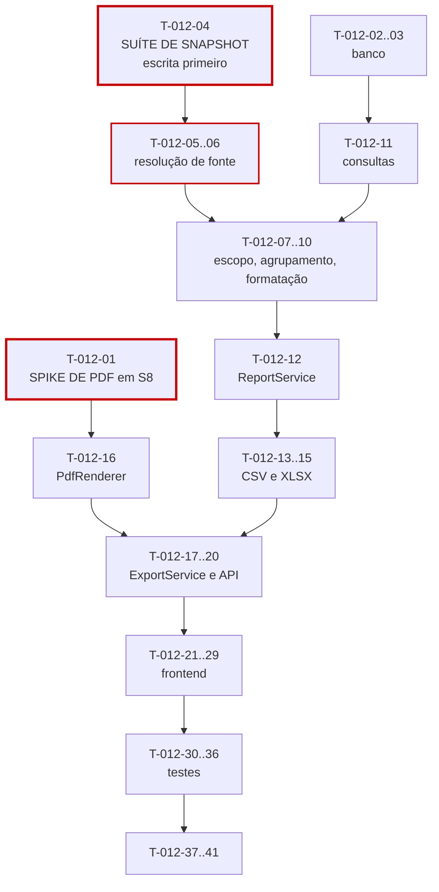

# 012 — Reports & Export · Tarefas

## 1. Convenções

| Campo | Regra |
|---|---|
| **ID** | `T-012-XX`, estável e imutável |
| **Descrição** | Verbo no infinitivo + objeto |
| **Dependências** | IDs de tarefas ou features concluídas |
| **Estimativa** | Horas-agente; acima de 8h deve ser decomposta |
| **Prioridade** | `P0` bloqueante · `P1` necessária · `P2` cortável |

> **Spike antecipado (RP-04).** O spike de qualidade visual do PDF deve ser concluído em **S8**, antes desta sprint. `T-012-01` registra essa dependência: sem a decisão de motor de PDF e de identidade visual tomada, `T-012-16` começa às cegas e o risco de reescrita é alto.
>
> **Dependência de sequência:** esta feature entra em S9, **antes** de `011` concluir o fechamento em S10 (§7 de `implementation-order.md`). É intencional — o congelamento de `011` só é verificável de ponta a ponta se os relatórios já existirem. Consequência prática em `T-012-05`.

## 2. Resumo

| Grupo | Tarefas | Estimativa |
|---|:--:|---|
| Banco | 2 | 4h |
| Backend | 16 | 60h |
| Frontend | 9 | 28h |
| Testes | 7 | 30h |
| Documentação | 2 | 4h |
| Infra | 3 | 6h |
| **Total** | **39** | **132h ≈ 8 dias-agente** |

## 3. Pré-requisito

| ID | Descrição | Dependências | Estimativa | Prioridade |
|---|---|---|:--:|:--:|
| T-012-01 | **Concluir o spike de PDF em S8:** escolher o motor, validar a identidade visual de `design-system.md` e provar renderização em fluxo com 1.000 linhas | — | (fora desta sprint) | P0 |

> Sem `T-012-01` concluído, `T-012-16` não inicia. Um motor de PDF escolhido durante a implementação e trocado depois invalida todo o trabalho de layout — é o modo de falha que RP-04 descreve.

## 4. Banco

| ID | Descrição | Dependências | Estimativa | Prioridade |
|---|---|---|:--:|:--:|
| T-012-02 | Criar `V033__create_report_executions.sql` com `CHECK (attempt_count <= 2)` e `CHECK` de `storage_key` em `COMPLETED` | 011 | 2,5h | P0 |
| T-012-03 | Criar `V034__report_indexes.sql` com os índices de acompanhamento, fila e expiração | T-012-02 | 1,5h | P0 |

## 5. Backend

### 5.1 Resolução de fonte — o núcleo da feature

| ID | Descrição | Dependências | Estimativa | Prioridade |
|---|---|---|:--:|:--:|
| T-012-04 | **Escrever antes do código:** suíte provando que período `CLOSED` é servido do snapshot e ignora alterações posteriores no banco | 011 | 4h | P0 |
| T-012-05 | Implementar `ReportDataResolver` com a matriz da §6.1 (snapshot × ao vivo × indisponível) | T-012-04 | 4h | P0 |
| T-012-06 | Implementar `SnapshotReportMapper` e `LiveReportMapper` produzindo a **mesma** estrutura de resposta | T-012-05 | 5h | P0 |

> **Nota de sequência sobre `T-012-05`:** o fechamento de período é entregue em `011` na sprint **S10**, posterior a esta. Durante S9, o caminho de snapshot é implementado e testado contra snapshots criados por fixture, e o caminho ao vivo cobre todos os cenários reais. A reexecução de `T-012-04` contra o fechamento real de `011` é tarefa **de S10**, registrada em `T-011-42` daquela feature. Declarar isso é obrigatório: um teste de snapshot que nunca viu um fechamento real não prova RN-701.

### 5.2 Composição do relatório

| ID | Descrição | Dependências | Estimativa | Prioridade |
|---|---|---|:--:|:--:|
| T-012-07 | Implementar `ReportPeriodValidator` (RN-705) e `ReportScopePolicy` aplicando CE-P-10 **antes** da verificação de existência (§6.2) | T-012-02 | 3,5h | P0 |
| T-012-08 | Implementar `ReportGroupingPolicy` com os 6 agrupamentos por tipo e a **ordenação normativa** (§6.3) | T-012-06 | 3h | P0 |
| T-012-09 | Implementar `ReportHeaderBuilder` com `issueId` único por emissão (RN-703) | T-012-06 | 2h | P0 |
| T-012-10 | Implementar `DurationFormatter` (duas colunas no XLSX) e `MoneyFormatter` (`HALF_UP`, moeda do contrato) | — | 3h | P0 |
| T-012-11 | Criar `ReportQueryRepository` com as consultas dos 5 tipos, usando projeção | T-012-03 | 4h | P0 |
| T-012-12 | Implementar `ReportService` para os 5 tipos, aplicando a ordem da §6.2 | T-012-08, T-012-11, T-012-07 | 6h | P0 |

### 5.3 Exportação

| ID | Descrição | Dependências | Estimativa | Prioridade |
|---|---|---|:--:|:--:|
| T-012-13 | Implementar `FormulaInjectionSanitizer` neutralizando `=`, `+`, `-` e `@` | — | 2h | P0 |
| T-012-14 | Implementar `CsvRenderer` em fluxo, com sanitização | T-012-13, T-012-10 | 2,5h | P0 |
| T-012-15 | Implementar `XlsxRenderer` em **fluxo**, com duas colunas de duração e sanitização | T-012-13, T-012-10 | 4h | P0 |
| T-012-16 | Implementar `PdfRenderer` com a identidade visual, em fluxo e **determinístico** | T-012-01, T-012-09 | 6h | P0 |
| T-012-17 | Implementar `ExportService` com contagem de linhas e decisão sync × async no limiar de 5.000 (RN-706) | T-012-14, T-012-15, T-012-16 | 4h | P0 |
| T-012-18 | Implementar `ReportExecution` com registro dos filtros aplicados (RN-707) | T-012-17 | 2,5h | P0 |
| T-012-19 | Implementar `SignedUrlProvider` com expiração de 15 minutos e nova URL sem regerar o arquivo (RN-712) | T-012-17 | 2,5h | P0 |
| T-012-20 | Criar DTOs, mappers com omissão de monetários **no arquivo**, e os dois controllers com OpenAPI | T-012-19, T-012-12 | 4h | P0 |

## 6. Frontend

| ID | Descrição | Dependências | Estimativa | Prioridade |
|---|---|---|:--:|:--:|
| T-012-21 | Criar `ReportApi`, `ReportStore` e `ExportStore` com *polling* de 3 s limitado a 5 minutos | T-012-20 | 4h | P0 |
| T-012-22 | Criar `dt-report-type-selector` desabilitando e **explicando** os tipos indisponíveis ao papel | T-012-21 | 2,5h | P0 |
| T-012-23 | Criar `dt-report-filters` com validação de 366 dias no cliente e `dt-grouping-selector` por compatibilidade | T-012-22 | 3,5h | P0 |
| T-012-24 | Criar `dt-partial-warning` **proeminente**, com o motivo (aberto ou reaberto) | T-012-21 | 2h | P0 |
| T-012-25 | Criar `dt-report-viewer` com agrupamento, subtotais e totais | T-012-23, T-012-24 | 4h | P0 |
| T-012-26 | Criar `dt-report-header-preview` mostrando o cabeçalho que sairá no PDF | T-012-21 | 2h | P1 |
| T-012-27 | Criar `dt-export-dialog` com aviso de assincronia acima de 5.000 linhas | T-012-25 | 2,5h | P0 |
| T-012-28 | Criar `dt-export-list` com status, progresso, download, cancelamento e nova tentativa | T-012-21 | 3,5h | P0 |
| T-012-29 | Montar `ReportsPage` (P24) e `dt-empty-report`; aplicar `hasPermission` para ocultar colunas monetárias | T-012-27, T-012-28 | 4h | P0 |

## 7. Testes

| ID | Descrição | Dependências | Estimativa | Prioridade |
|---|---|---|:--:|:--:|
| T-012-30 | **Teste de determinismo do PDF:** dupla geração com comparação de bytes, ignorando o carimbo de emissão | T-012-16 | 4h | P0 |
| T-012-31 | Testes de marcação de parcial nas **três** saídas (tela, PDF, Excel), incluindo período reaberto | T-012-20 | 3,5h | P0 |
| T-012-32 | Testes de escopo: `MEMBER` com `myWorkLogs` e com cada outro filtro; verificação antes da existência | T-012-07 | 4h | P0 |
| T-012-33 | Testes de formatação: duas colunas no XLSX somáveis, `HALF_UP` em bordas, contrato sem valor hora | T-012-10, T-012-15 | 3,5h | P0 |
| T-012-34 | Testes de injeção de fórmula em CSV **e** XLSX, e de XSS no PDF | T-012-13 | 3h | P0 |
| T-012-35 | **Teste de memória:** exportação de 50.000 linhas em XLSX e PDF sem esgotar memória | T-012-17 | 5h | P0 |
| T-012-36 | Testes do ciclo de exportação (limiares 5.000/5.001, URL expirada, arquivo expirado com remoção física, 2 tentativas) + suíte de isolamento + matriz de permissões | T-012-20, T-012-19 | 4h | P0 |

## 8. Documentação

| ID | Descrição | Dependências | Estimativa | Prioridade |
|---|---|---|:--:|:--:|
| T-012-37 | Sincronizar `docs/04-api/reports.md` §5 a §9 e §11 com o comportamento implementado | T-012-20 | 2,5h | P0 |
| T-012-38 | Registrar em `implementation-order.md` §12 o status da feature e a pendência de reexecutar `T-012-04` contra o fechamento real de `011` em S10 | T-012-36 | 1,5h | P0 |

## 9. Infra

| ID | Descrição | Dependências | Estimativa | Prioridade |
|---|---|---|:--:|:--:|
| T-012-39 | Configurar o object storage com URL assinada e política de acesso privado | T-012-19 | 2h | P0 |
| T-012-40 | Implementar `ExportProcessorJob` (fila, 2 tentativas) e `ExportExpiryJob` que **remove o binário** | T-012-18 | 2,5h | P0 |
| T-012-41 | Configurar as métricas da §29, com alerta em `export.failed` e acompanhamento de `pdf.generation.duration` (RP-04) | T-012-40 | 1,5h | P1 |

## 10. Ordem de execução

**Caminho crítico:** `T-012-01 (S8) → T-012-04 → 05 → 06 → 12 → 16 → 17 → 20 → 29 → 30`.

**Três tarefas com peso desproporcional:**

| Tarefa | Por quê |
|---|---|
| `T-012-01` (spike de PDF, em S8) | RP-04 é o risco desta feature, e o critério de DoD é **avaliação por pessoa externa**. Escolher o motor durante a implementação e descobrir que ele não produz o resultado necessário significaria reescrever todo o layout. Antecipar para S8 é o que torna o risco gerenciável |
| `T-012-04` (suíte de snapshot) | Escrita antes de `ReportDataResolver`. É o único teste que expõe o modo de falha de R-02: servir período fechado do banco ao vivo. O defeito é silencioso — o relatório funciona e os números parecem certos, até alguém alterar um dado e o "documento definitivo" mudar |
| `T-012-35` (teste de memória) | A escrita em fluxo é **requisito**, não otimização (OB-06). Sem este teste, uma exportação de 50.000 linhas derruba a instância em produção, e o defeito não aparece em nenhum teste funcional |

**Paralelizável:** `T-012-10` e `T-012-13` (formatação e sanitização) são puros e independentes de tudo. `T-012-22` a `T-012-24` podem ser desenvolvidos com MSW. `T-012-26` é `P1`.

**Dependência temporal declarada:** `T-012-04` roda em S9 contra snapshots de fixture. Sua reexecução contra o fechamento real de `011` ocorre em S10 e é registrada em `T-012-38`. Marcar RN-701 como provada sem essa reexecução seria declarar verificado algo que nunca foi exercitado com dado real.

## 11. Critérios de conclusão por grupo

| Grupo | Concluído quando |
|---|---|
| Pré-requisito | Motor de PDF escolhido, identidade visual validada e renderização em fluxo provada — **em S8** |
| Banco | `CHECK` de tentativas e de `storage_key` rejeitam `INSERT` direto; índices de fila e expiração criados |
| Backend | Período fechado comprovadamente servido do snapshot, ignorando alterações no banco; snapshot e ao vivo com a **mesma** estrutura; ordenação normativa; escopo antes da existência; renderers em fluxo; sanitização de fórmula nos dois formatos tabulares |
| Frontend | Aviso de parcial proeminente nas três saídas; tipos indisponíveis explicados; *polling* limitado; colunas monetárias ocultas; zero violações do axe-core |
| Testes | Determinismo do PDF provado por bytes; 50.000 linhas sem esgotar memória; escopo de `MEMBER` provado em todas as combinações; isolamento verde nos 10 endpoints |
| Documentação | `reports.md` sincronizado; pendência de S10 registrada |
| Infra | Storage privado com URL assinada; binário removido na expiração, comprovado por teste; métricas de RP-04 sendo coletadas |
