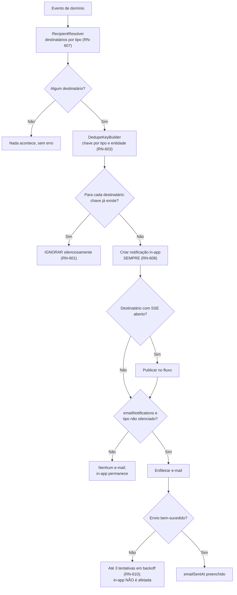
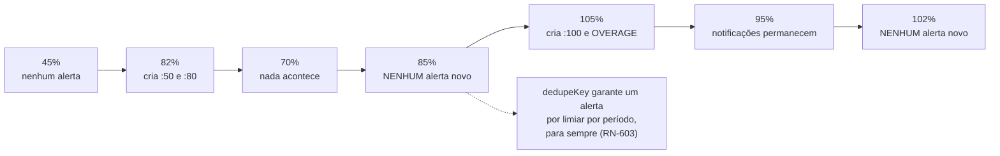
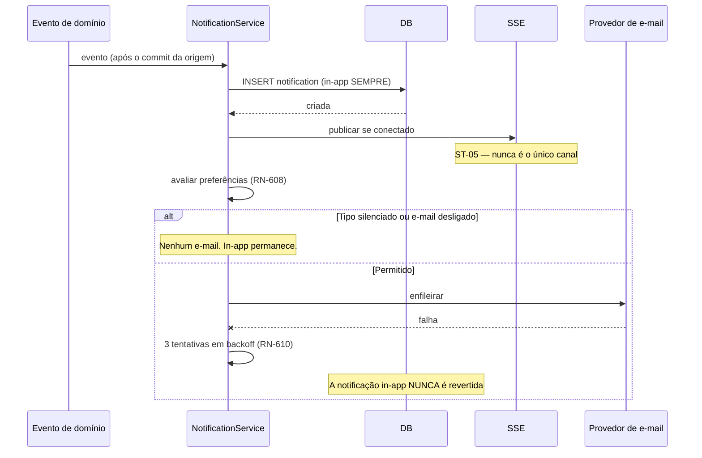

# 013 — Notifications

| Campo | Valor |
|---|---|
| **Feature** | 013 |
| **Épico** | EP-10 (Notificações) |
| **Sprint** | S8 |
| **Prioridade** | P1 |
| **Complexidade** | Média |
| **Estimativa** | 21 pts · 5 dias-agente |
| **Stories** | US-135 a US-144 |
| **Status** | SPEC_APPROVED |

## 1. Objetivo

Gerar, deduplicar e entregar notificações de consumo de saldo, fechamento de período, cronômetro e ticket — em central in-app, por fluxo em tempo real e por e-mail — respeitando as preferências do destinatário.

## 2. Problema que resolve

O saldo de um contrato pode estourar sem que ninguém perceba. O dashboard mostra a situação **quando o usuário abre o sistema**; a notificação alcança quem não abriu. R-01 de `implementation-order.md` identifica **timer esquecido** como o erro operacional mais comum, e o excedente de contrato como o mais caro.

A regra central é a **deduplicação** (RN-601, RN-603). Sem ela, o consumo oscilando em torno de 80% por edições e exclusões de work log geraria uma notificação a cada oscilação — e o usuário desligaria as notificações inteiras. O `dedupeKey` garante **um alerta por limiar por período**, para sempre.

A segunda decisão é que a notificação **in-app é sempre criada**, independentemente das preferências (RN-608). Preferência silencia o e-mail, não o histórico: um alerta que o usuário optou por não receber por e-mail continua consultável na central.

## 3. Escopo

| # | Item | Referência |
|---|---|---|
| E-01 | Deduplicação por `dedupeKey` único por destinatário | RN-601 |
| E-02 | Avaliação de limiares de consumo a cada alteração | RN-602 |
| E-03 | Um alerta por limiar por período | RN-603 |
| E-04 | Alerta de excedente com severidade crítica | RN-604 |
| E-05 | Aviso de fechamento iminente, 3 dias antes | RN-605 |
| E-06 | Aviso de contrato próximo do fim, 15 dias antes | RN-606 |
| E-07 | Resolução de destinatários por tipo de evento | RN-607 |
| E-08 | E-mail conforme preferências; in-app sempre criada | RN-608 |
| E-09 | Limpeza de notificações lidas há mais de 90 dias | RN-609 |
| E-10 | Reprocessamento de e-mail com até 3 tentativas | RN-610 |
| E-11 | Os 11 tipos da matriz de notificações | §12 `business-rules.md` |
| E-12 | Central in-app com leitura, contagem e exclusão | §7, §8 `notifications.md` |
| E-13 | Fluxo em tempo real por SSE | §7.2 `notifications.md` |
| E-14 | Preferências por tipo | §9 `notifications.md` |
| E-15 | Telas P25 e P28 | `pages.md` |

## 4. Fora do escopo

| Item | Onde está | Motivo |
|---|---|---|
| Cálculo de consumo e saldo | `011-bank-hours` | Esta feature **reage** a `ConsumptionChangedEvent` |
| Detecção de timer longo e abandonado | `009-timer` | `TimerMonitorJob` detecta; esta feature entrega |
| Alertas do dashboard | `010-dashboard` | Derivados do estado presente, **não** desta feature (CP-03 daquela spec) |
| Notificação por push ou aplicativo móvel | Fora do roadmap | Sem canal móvel no MVP |
| Notificação por webhook | F8 | `future/019-public-api` |
| Notificação a contatos do cliente | Fora do MVP | `Contact.receivesReports` é de `012` |
| Digest diário ou semanal agregado | Fora do roadmap | Sem demanda validada; a deduplicação já limita o volume |
| Preferência por contrato ou por cliente | Fora do roadmap | Preferência por **tipo** cobre o caso |

## 5. Dependências

### 5.1 Features
| Feature | Tipo | O que consome |
|---|---|---|
| `011-bank-hours` | **Bloqueante** | `ConsumptionChangedEvent`, `PeriodClosedEvent`, `AdjustmentAppliedEvent`; limiares e `consumptionRate` |
| `009-timer` | Bloqueante | `TimerLongRunningEvent`, `TimerAbandonedEvent`, `TimerForceStoppedEvent` |
| `007-tickets` | Bloqueante | `TicketAssignedEvent`, `TicketReopenedEvent` |
| `004-contracts` | Bloqueante | `notificationThresholds`, `endDate`, `autoRenew` |
| `002-users` | Bloqueante | `user.preferences.emailNotifications` e `mutedNotificationTypes`; papéis para RN-607 |
| `012-reports` | Consumidora | `ExportCompletedEvent`, `ExportFailedEvent` |
| `014-comments` | Consumidora | `CommentCreatedEvent` com menções |
| `015-attachments` | Consumidora | Evento de arquivo infectado |

### 5.2 Documentos obrigatórios
| Documento | Seções relevantes |
|---|---|
| `docs/04-api/notifications.md` | §5 a §9 |
| `docs/02-domain/entities.md` | §6.18 Notification, §6.2.1 preferências |
| `docs/02-domain/business-rules.md` | RN-601 a RN-610, §12 matriz |
| `docs/02-domain/permissions.md` | §6.9 |
| `docs/03-architecture/integrations.md` | Provedor de e-mail |
| `docs/05-ui/pages.md` | P25, P28 |

### 5.3 Infraestrutura
| Componente | Uso |
|---|---|
| PostgreSQL | `notifications` com índice único de deduplicação |
| Provedor de e-mail | Envio transacional — `integrations.md` |
| SSE | Fluxo em tempo real por usuário (§7.2) |
| Agendador | Jobs de fechamento iminente, contrato terminando, limpeza e reprocessamento |

## 6. Regras de negócio

| ID | Tipo | Enunciado resumido | Erro | Onde é aplicada |
|---|---|---|---|---|
| RN-601 | Automática | `dedupeKey` único por destinatário; chave existente é **ignorada silenciosamente** | — | Índice único + `NotificationService` |
| RN-602 | Automática | Limiares avaliados após cada alteração de `consumedMinutes` | — | Consumidor de `ConsumptionChangedEvent` |
| RN-603 | Automática | `dedupeKey` de consumo é `CONTRACT_USAGE:{periodId}:{threshold}` | — | `DedupeKeyBuilder` |
| RN-604 | Automática | Acima de 100%, além do limiar, gera `CONTRACT_OVERAGE` com severidade `CRITICAL` | — | `ConsumptionAlertPolicy` |
| RN-605 | Automática | `PERIOD_CLOSING` 3 dias antes de `endDate` | — | `PeriodClosingReminderJob` |
| RN-606 | Automática | `CONTRACT_ENDING` 15 dias antes de `contract.endDate` | — | `ContractEndingReminderJob` |
| RN-607 | Automática | Destinatários: `OWNER`/`ADMIN` para contrato e período; responsável para ticket; o próprio usuário para timer | — | `RecipientResolver` |
| RN-608 | Automática | E-mail respeita `emailNotifications` e `mutedNotificationTypes`; **in-app é sempre criada** | — | `EmailDispatchPolicy` |
| RN-609 | Automática | Notificações lidas há mais de 90 dias são removidas por job | — | `NotificationCleanupJob` |
| RN-610 | Automática | Falha de e-mail **não** impede a in-app; até 3 tentativas em backoff exponencial | — | `EmailRetryJob` |
| RN-012 | Bloqueante | Listagem paginada, `size` máximo 100 | `DEVTIME-2006` / 400 | `NotificationController` |
| RN-003 | Automática | Exclusão é lógica | — | `NotificationService.delete` |
| RN-001 / RN-002 | Bloqueante | Tenant do usuário; recurso externo retorna `404` | `DEVTIME-1200` / `2002` | Filtro automático |

### 6.1 Matriz de notificações (§12 `business-rules.md`)

| Tipo | Gatilho | Severidade | Destinatário | `dedupeKey` |
|---|---|---|---|---|
| `CONTRACT_USAGE_50` | `rate ≥ 50%` | `INFO` | OWNER, ADMIN | `CONTRACT_USAGE:{periodId}:50` |
| `CONTRACT_USAGE_80` | `rate ≥ 80%` | `WARNING` | OWNER, ADMIN | `CONTRACT_USAGE:{periodId}:80` |
| `CONTRACT_USAGE_100` | `rate ≥ 100%` | `CRITICAL` | OWNER, ADMIN | `CONTRACT_USAGE:{periodId}:100` |
| `CONTRACT_OVERAGE` | `overageMinutes > 0` | `CRITICAL` | OWNER, ADMIN | `CONTRACT_OVERAGE:{periodId}` |
| `PERIOD_CLOSING` | 3 dias antes de `endDate` | `INFO` | OWNER, ADMIN | `PERIOD_CLOSING:{periodId}` |
| `PERIOD_CLOSED` | Fechamento concluído | `INFO` | OWNER, ADMIN | `PERIOD_CLOSED:{periodId}` |
| `TIMER_LONG_RUNNING` | RN-163 | `WARNING` | Dono do timer | `TIMER_LONG:{timerId}` |
| `TIMER_ABANDONED` | RN-164 | `WARNING` | Dono do timer | `TIMER_ABANDONED:{timerId}` |
| `TICKET_ASSIGNED` | Atribuição a membro | `INFO` | Responsável | `TICKET_ASSIGNED:{ticketId}:{assigneeId}` |
| `TICKET_COMMENTED` | Novo comentário | `INFO` | Responsável + mencionados | `TICKET_COMMENT:{commentId}:{userId}` |
| `CONTRACT_ENDING` | 15 dias antes de `endDate` | `WARNING` | OWNER, ADMIN | `CONTRACT_ENDING:{contractId}` |

> Os limiares de consumo usam `contract.notificationThresholds`, cujo default é `[50, 80, 100]`. Um contrato com `[70, 90]` gera `CONTRACT_USAGE:{periodId}:70` e `:90` — os tipos são derivados dos limiares configurados, não fixos. É a mesma decisão de §6.2 de `010-dashboard`, e é o que mantém a tela e o e-mail coerentes.

### 6.2 Ordem de aplicação — criação de notificação

| # | Passo | Falha → |
|---|---|---|
| 1 | Resolver os destinatários por tipo (RN-607) | Nenhum destinatário: nada é criado, sem erro |
| 2 | Montar o `dedupeKey` (RN-603) | — |
| 3 | Para cada destinatário, tentar inserir | Chave existente: **ignorada silenciosamente** (RN-601) |
| 4 | Criar a notificação in-app **sempre** (RN-608) | — |
| 5 | Publicar no fluxo SSE do destinatário conectado | Falha de fluxo não impede nada (ST-05) |
| 6 | Avaliar `emailNotifications` e `mutedNotificationTypes` (RN-608) | Silenciado: nenhum e-mail, in-app permanece |
| 7 | Enfileirar o e-mail | Falha de envio: até 3 tentativas (RN-610) |

**Por que a inserção é silenciosa em caso de chave duplicada (passo 3):** a avaliação de limiares roda a **cada** alteração de `consumedMinutes` (RN-602). Em um dia com 20 registros de horas, o limiar de 50% é avaliado 20 vezes. Retornar erro na duplicata obrigaria cada chamador a tratar uma condição normal; ignorar silenciosamente torna a operação idempotente por construção.

**Por que a in-app precede o e-mail (passos 4 e 6):** RN-610 determina que falha de e-mail não impede a notificação. Criar a in-app primeiro garante isso estruturalmente — se o e-mail falhar, o registro já existe.

### 6.3 Comportamento na oscilação de consumo

Consequência combinada de RN-601, RN-603 e CE-11 de `business-rules.md`:

| Momento | `rate` | Ação |
|---|---:|---|
| 1 | 45% | Nenhum alerta |
| 2 | 82% | Cria `CONTRACT_USAGE:{p}:50` e `:80` |
| 3 | 70% (exclusão de registro) | Nada acontece; notificações permanecem |
| 4 | 85% | **Nenhum alerta novo** — as chaves já existem |
| 5 | 105% | Cria `:100` e `CONTRACT_OVERAGE:{p}` |
| 6 | 95% (ajuste de saldo) | Nada acontece; as notificações permanecem no histórico |
| 7 | 102% | **Nenhum alerta novo** |

> A notificação anterior **não é removida** quando o consumo cai (CE-11). Ela é o registro de que o limiar foi atingido, não um indicador de estado atual. O indicador de estado é o dashboard (CP-03 de `010`), que faz o oposto: reflete o presente e o alerta desaparece.

### 6.4 Invariantes envolvidas
| ID | Invariante | Como é garantida |
|---|---|---|
| INV-NOT-01 | `(recipientId, dedupeKey)` é único | Índice único |
| INV-NOT-02 | Notificação in-app existe independentemente do e-mail | Ordem da §6.2 |
| INV-NOT-03 | Cada limiar gera no máximo uma notificação por período por destinatário | RN-603 + INV-NOT-01 |
| INV-NOT-04 | Notificação nunca é entregue apenas pelo fluxo SSE | ST-05: o histórico está sempre em `/notifications` |
| INV-NOT-05 | Falha de e-mail nunca reverte a criação da notificação | E-mail enfileirado após o commit |

## 7. Fluxo principal — alerta de consumo

1. Um work log é criado, alterado ou excluído em `008`.
2. `011` atualiza `consumedMinutes` e publica `ConsumptionChangedEvent` **após o commit**.
3. `ConsumptionAlertPolicy` calcula `consumptionRate` e compara com cada limiar de `contract.notificationThresholds`.
4. Para cada limiar ultrapassado, monta o `dedupeKey` `CONTRACT_USAGE:{periodId}:{threshold}` (RN-603).
5. `RecipientResolver` resolve os destinatários: `OWNER` e `ADMIN` ativos do tenant (RN-607).
6. Para cada destinatário, tenta inserir. Chave existente → ignorada (RN-601).
7. Se `rate ≥ 100%`, cria também `CONTRACT_OVERAGE` com severidade `CRITICAL` (RN-604).
8. A notificação in-app é criada em todos os casos (RN-608).
9. Se o destinatário tem fluxo SSE aberto, a notificação é publicada nele.
10. `EmailDispatchPolicy` avalia as preferências; se permitido, o e-mail é enfileirado.
11. Falha no envio dispara até 3 tentativas em backoff exponencial (RN-610), sem afetar a in-app.

## 8. Fluxos alternativos

| # | Fluxo | Gatilho | Comportamento |
|---|---|---|---|
| FA-01 | Limiar já notificado | Consumo oscilando | Nenhuma notificação nova (§6.3) |
| FA-02 | Limiares personalizados | `notificationThresholds = [70,90]` | Tipos derivados desses valores, não de 50/80/100 |
| FA-03 | Contrato `HOURLY_OPEN` | `available = 0` | `rate` sempre 0; **nenhum** alerta de consumo (CE-10) |
| FA-04 | Consumo sobe vários limiares de uma vez | 0% → 105% | Cria os três limiares **e** o excedente, em uma só avaliação |
| FA-05 | Tenant sem `OWNER`/`ADMIN` ativo | Situação anômala | Nenhuma notificação criada, sem erro; a situação é impossível por INV-TEN-02 |
| FA-06 | Usuário com tipo silenciado | `mutedNotificationTypes` | In-app criada; **nenhum** e-mail (RN-608) |
| FA-07 | Usuário com e-mail desligado | `emailNotifications = false` | In-app criada; nenhum e-mail para nenhum tipo |
| FA-08 | Falha no provedor de e-mail | Erro de envio | In-app permanece; 3 tentativas em backoff; após isso, registrada como falha |
| FA-09 | Fluxo SSE não conectado | Usuário offline | Notificação criada normalmente; entregue ao abrir a central (ST-05) |
| FA-10 | Fluxo SSE cai durante a conexão | Rede instável | O cliente reconecta; nenhuma notificação é perdida, pois o histórico é a fonte |
| FA-11 | Marcar como lida | P25 | `readAt` preenchido; contagem de não lidas decrementada |
| FA-12 | Marcar todas como lidas | P25 | Todas as não lidas do usuário recebem `readAt` |
| FA-13 | Marcar como não lida | P25 | `readAt` limpo |
| FA-14 | Excluir notificação | P25 | Soft delete; sai da listagem |
| FA-15 | Limpeza automática | Job | Lidas há mais de 90 dias são removidas (RN-609) |
| FA-16 | Alteração de preferências | P28 | Efeito imediato; notificações já criadas não são afetadas |
| FA-17 | Fechamento iminente | Job, 3 dias antes | `PERIOD_CLOSING` a `OWNER`/`ADMIN` (RN-605) |
| FA-18 | Contrato terminando | Job, 15 dias antes | `CONTRACT_ENDING` a `OWNER`/`ADMIN` (RN-606) |
| FA-19 | Timer longo ou abandonado | `009-timer` | Ao **dono** do timer, não a gestores (RN-607) |
| FA-20 | Cronômetro encerrado por terceiro | `TimerForceStoppedEvent` | Ao dono, informando quem encerrou (OWN-05 de `009`) |
| FA-21 | Ticket atribuído | `007-tickets` | Ao **novo** responsável; o anterior não é notificado da remoção |
| FA-22 | Exportação concluída | `012-reports` | Ao solicitante |

## 9. Diagramas

### 9.1 Criação com deduplicação (RN-601, RN-603)

### 9.2 Oscilação de consumo (§6.3)

### 9.3 Independência entre in-app e e-mail (RN-608, RN-610)

## 10. Estados

| Estado (derivado) | Condição | Operações permitidas |
|---|---|---|
| Não lida | `readAt = null` | Marcar como lida, excluir |
| Lida | `readAt ≠ null` | Marcar como não lida, excluir |
| E-mail pendente | `emailSentAt = null` e permitido | Reprocessamento automático |
| E-mail enviado | `emailSentAt ≠ null` | — |
| E-mail falho | 3 tentativas esgotadas | Nenhuma nova tentativa automática |
| Excluída | `deletedAt ≠ null` | — |
| Purgada | Lida há mais de 90 dias | Removida por job (RN-609) |

> `Notification` não possui campo `status`. Todos os estados derivam de `readAt`, `emailSentAt` e `deletedAt`. Um enum de status duplicaria informação já presente nesses três campos.

## 11. Transições

| Origem | Destino | Gatilho | Guarda | Efeito | Permissão |
|---|---|---|---|---|---|
| — | Não lida | Evento de domínio | `dedupeKey` inexistente (RN-601) | In-app criada; SSE; e-mail conforme preferências | Sistema |
| Não lida | Lida | `POST /{id}/read` | Destinatário é o usuário | `readAt = now()` | `NOTIFICATION_VIEW` |
| Não lidas | Lidas | `POST /read-all` | — | Todas as não lidas do usuário | `NOTIFICATION_VIEW` |
| Lida | Não lida | `POST /{id}/unread` | Destinatário é o usuário | `readAt = null` | `NOTIFICATION_VIEW` |
| Qualquer | Excluída | `DELETE /{id}` | Destinatário é o usuário | Soft delete | `NOTIFICATION_VIEW` |
| Lida | Purgada | Job após 90 dias | `readAt` há mais de 90 dias | Remoção (RN-609) | Sistema |

### 11.1 Transições proibidas
| Transição | Motivo da proibição |
|---|---|
| Criar com `dedupeKey` existente | RN-601, INV-NOT-01. Produziria o ruído que a regra existe para evitar |
| **Remover** notificação quando o consumo cai abaixo do limiar | CE-11. A notificação registra que o limiar foi atingido, não o estado atual |
| Deixar de criar a in-app por preferência do usuário | RN-608, INV-NOT-02. Preferência silencia o e-mail, não o histórico |
| Reverter a in-app por falha de e-mail | RN-610, INV-NOT-05 |
| Entregar apenas pelo fluxo SSE | ST-05, INV-NOT-04. O histórico é sempre a fonte |
| Quarta tentativa de e-mail | RN-610; três falhas indicam problema que nova tentativa não resolve |
| Um usuário ler ou excluir notificação de outro | O destinatário é o único operador |
| Purgar notificação não lida | RN-609 restringe a lidas; purgar não lida esconderia um alerta nunca visto |

## 12. Casos de erro

| Código | HTTP | Situação | Mensagem ao usuário | Regra |
|---|:--:|---|---|---|
| `DEVTIME-1101` | 403 | Sem `NOTIFICATION_VIEW` | Você não tem permissão para esta ação | §6.9 permissions |
| `DEVTIME-2002` | 404 | Notificação de outro usuário ou tenant | Recurso não encontrado | RN-002 |
| `DEVTIME-2006` | 400 | `size` acima de 100 | Tamanho de página inválido | RN-012 |
| `DEVTIME-2000` | 422 | Tipo inválido em `mutedNotificationTypes` | Tipo de notificação inválido | §9 notifications.md |
| `DEVTIME-1201` | 403 | Escrita em tenant suspenso | Organização suspensa: apenas leitura | RN-007 |

> **Não existe erro de duplicação.** Tentar criar notificação com `dedupeKey` existente é comportamento normal e silencioso (RN-601). Um código de erro para isso obrigaria todos os chamadores a tratar uma condição esperada.

### 12.1 Casos extremos

| # | Caso | Comportamento esperado |
|---|---|---|
| CX-01 | Limiar avaliado 20 vezes no mesmo dia | Uma única notificação por limiar (RN-601) |
| CX-02 | Consumo cai abaixo do limiar e volta a subir | Nenhuma notificação nova; a anterior permanece (CE-11) |
| CX-03 | Consumo salta de 0% a 105% em um registro | Cria `:50`, `:80`, `:100` **e** `CONTRACT_OVERAGE` na mesma avaliação |
| CX-04 | Contrato `HOURLY_OPEN` | Nenhum alerta de consumo (CE-10) |
| CX-05 | Limiares personalizados `[70, 90]` | Chaves `:70` e `:90`; nenhuma `:50` ou `:80` |
| CX-06 | Limiar `[100]` apenas | Somente `:100` e o excedente |
| CX-07 | Ajuste que zera o excedente | `CONTRACT_OVERAGE` permanece no histórico (CE-14) |
| CX-08 | Período reaberto e refechado | `PERIOD_CLOSED:{periodId}` já existe; **nenhuma** nova notificação de fechamento |
| CX-09 | Dois `OWNER` no tenant | Duas notificações, uma por destinatário, cada uma com o mesmo `dedupeKey` |
| CX-10 | `ADMIN` promovido após o alerta | Não recebe a notificação retroativamente |
| CX-11 | Usuário com todos os tipos silenciados | Nenhum e-mail; central funciona normalmente |
| CX-12 | Tipo silenciado depois da criação | A notificação já criada permanece; o e-mail já enviado não é revertido |
| CX-13 | E-mail falhando três vezes | In-app intacta; nenhuma quarta tentativa; falha registrada |
| CX-14 | Provedor de e-mail indisponível por horas | Notificações acumulam na fila; reprocessadas ao restabelecer |
| CX-15 | Usuário com 5.000 notificações | Listagem paginada; contagem de não lidas por índice parcial |
| CX-16 | Notificação lida há exatamente 90 dias | **Não** purgada; o limiar é estritamente maior |
| CX-17 | Notificação não lida há 2 anos | **Não** purgada — RN-609 restringe a lidas |
| CX-18 | SSE com 500 usuários conectados | Cada um recebe apenas as próprias; nenhum vazamento |
| CX-19 | SSE reconectando | Nenhuma notificação perdida; o histórico é a fonte (ST-05) |
| CX-20 | Membro removido do tenant | Notificações preservadas; acesso revogado com o membership |
| CX-21 | Timer encerrado por `ADMIN` | Notificação ao **dono**, não ao `ADMIN` (FA-20) |
| CX-22 | Ticket reatribuído | Notifica o novo; o anterior **não** é notificado da remoção (FA-21) |
| CX-23 | Menção a membro inativo | Nenhuma notificação — RN-813 filtra membros ativos |
| CX-24 | Job de fechamento iminente rodando duas vezes | Idempotente por `dedupeKey` |

## 13. Modelo de dados

### 13.1 Entidades impactadas
| Entidade | Operação | Tabela | Referência |
|---|---|---|---|
| `Notification` | Cria, lê, atualiza, soft delete | `notifications` | §6.18 |
| `User` | Lê (`preferences`) | `users` | §6.2.1 |
| `Membership` | Lê (papéis para RN-607) | `memberships` | Via `MembershipService` |
| `ContractPeriod`, `Contract`, `Timer`, `Ticket` | Lê (contexto e payload) | — | Via services |

### 13.2 Campos obrigatórios na criação
| Campo | Tipo | Origem | Imutável | Validação |
|---|---|---|:--:|---|
| `tenantId` | UUID | Contexto do evento | ✔ 🔒 | — |
| `recipientId` | UUID | `RecipientResolver` | ✔ 🔒 | Membership ativo (RN-607) |
| `type` | enum | Origem | ✔ 🔒 | Um dos tipos da §6.1 |
| `severity` | enum | Origem | ✖ | `INFO`, `WARNING`, `CRITICAL` |
| `title` | String(150) | Origem | ✖ | — |
| `body` | String(500) | Origem | ✖ | — |
| `payload` | JSONB | Origem | ✖ | Dados para renderização e link |
| `entityType` | String(40) | Origem | ✖ | Ex.: `CONTRACT_PERIOD` |
| `entityId` | UUID | Origem | ✖ | — |
| `dedupeKey` | String(200) | `DedupeKeyBuilder` | ✔ 🔒 | Único por destinatário (RN-601) |
| `readAt` | TIMESTAMPTZ | Sistema | ✖ | Nulo na criação |
| `emailSentAt` | TIMESTAMPTZ | Sistema | ✖ | Nulo; preenchido no envio |

### 13.3 Migrations
| Migration | Conteúdo | Compatibilidade |
|---|---|---|
| `V035__create_notifications.sql` | `notifications` + **índice único** `(recipient_id, dedupe_key)` | Nova tabela |
| `V036__notification_indexes.sql` | Índices de listagem, contagem, fila de e-mail e limpeza | Índices |

> O índice único de `V035` é a garantia estrutural de RN-601 e INV-NOT-01. Sem ele, duas avaliações concorrentes de limiar criariam duas notificações idênticas — e o `dedupeKey` seria apenas uma convenção.

### 13.4 Índices
| Índice | Colunas | Sustenta |
|---|---|---|
| `uq_notifications_recipient_dedupe` | `(recipient_id, dedupe_key)` | **RN-601, INV-NOT-01** |
| `idx_notifications_recipient_created` | `(recipient_id, created_at DESC)` WHERE `deleted_at IS NULL` | Listagem |
| `idx_notifications_unread` | `(recipient_id)` WHERE `read_at IS NULL AND deleted_at IS NULL` | Contagem de não lidas — índice parcial |
| `idx_notifications_email_pending` | `(created_at)` WHERE `email_sent_at IS NULL AND deleted_at IS NULL` | Fila de reprocessamento |
| `idx_notifications_purge` | `(read_at)` WHERE `read_at IS NOT NULL AND deleted_at IS NULL` | RN-609 |

## 14. Endpoints utilizados

| Método | Rota | Operação | Permissão | Sucesso | Doc |
|---|---|---|---|:--:|---|
| GET | `/api/v1/notifications` | Listar com filtros | `NOTIFICATION_VIEW` | 200 | §7 |
| GET | `/api/v1/notifications/unread-count` | Contagem de não lidas | `NOTIFICATION_VIEW` | 200 | §7.1 |
| GET | `/api/v1/notifications/stream` | Fluxo SSE | `NOTIFICATION_VIEW` | 200 | §7.2 |
| POST | `/api/v1/notifications/{id}/read` | Marcar como lida | `NOTIFICATION_VIEW` | 200 | §8.1 |
| POST | `/api/v1/notifications/read-all` | Marcar todas como lidas | `NOTIFICATION_VIEW` | 200 | §8.2 |
| POST | `/api/v1/notifications/{id}/unread` | Marcar como não lida | `NOTIFICATION_VIEW` | 200 | §8 |
| DELETE | `/api/v1/notifications/{id}` | Excluir | `NOTIFICATION_VIEW` | 204 | §8.3 |
| GET | `/api/v1/notifications/preferences` | Consultar preferências | `NOTIFICATION_VIEW` | 200 | §9.1 |
| PATCH | `/api/v1/notifications/preferences` | Alterar preferências | `NOTIFICATION_VIEW` | 200 | §9.2 |

> **Não existe endpoint de criação.** Notificações nascem exclusivamente de eventos de domínio. Uma rota de criação permitiria a um usuário fabricar alertas, e nenhum caso de uso a exige.

## 15. Eventos

| Evento | Publicado por | Momento | Notificação gerada |
|---|---|---|---|
| `ConsumptionChangedEvent` | `011-bank-hours` | Após o commit | `CONTRACT_USAGE_*`, `CONTRACT_OVERAGE` |
| `AdjustmentAppliedEvent` | `011-bank-hours` | Após o commit | Reavalia limiares |
| `PeriodClosedEvent` | `011-bank-hours` | Após o commit | `PERIOD_CLOSED` |
| `TimerLongRunningEvent` | `009-timer` | Após o commit | `TIMER_LONG_RUNNING` |
| `TimerAbandonedEvent` | `009-timer` | Após o commit | `TIMER_ABANDONED` |
| `TimerForceStoppedEvent` | `009-timer` | Após o commit | Ao dono do timer |
| `TicketAssignedEvent` | `007-tickets` | Após o commit | `TICKET_ASSIGNED` |
| `TicketReopenedEvent` | `007-tickets` | Após o commit | Ao responsável |
| `CommentCreatedEvent` | `014-comments` | Após o commit | `TICKET_COMMENTED` |
| `ExportCompletedEvent` / `ExportFailedEvent` | `012-reports` | Após o commit | Ao solicitante |

> **Todos os eventos consumidos são publicados após o commit da origem.** É obrigatório: a notificação envolve entrega externa (e-mail), e TX-06 proíbe chamada externa dentro de transação. Consumir dentro da transação faria uma falha de provedor de e-mail reverter um fechamento de período.
>
> **Esta feature não publica eventos de domínio.** É consumidora terminal.

## 16. Permissões

| Operação | Permissão | Papéis | Ownership | Escopo de dados |
|---|---|---|---|---|
| Listar, contar, ler, excluir | `NOTIFICATION_VIEW` | Todos os 5 papéis | **Apenas as próprias** | `recipientId` = usuário autenticado |
| Fluxo SSE | `NOTIFICATION_VIEW` | Todos | Apenas o próprio fluxo | — |
| Preferências | `NOTIFICATION_VIEW` | Todos | Apenas as próprias | — |
| Criação | — | Sistema (`actorType = SYSTEM`) | — | Ignora RBAC; respeita o tenant (CE-P-08) |

> Não há papel que enxergue notificações de terceiros. Nem `OWNER`. A notificação é dirigida a uma pessoa, e ler a de outra não tem finalidade legítima — a informação subjacente está disponível nas telas de origem, com o controle de acesso adequado.

## 17. Validações

### 17.1 Camada 1 — Formato (`400`)
| Campo | Restrição | Mensagem |
|---|---|---|
| `mutedNotificationTypes` | Cada item deve ser um tipo válido | Tipo de notificação inválido |
| `emailNotifications` | `@NotNull` boolean | Preferência inválida |
| `size` | `@Max(100)` | Tamanho de página inválido |
| `unreadOnly`, `severity`, `type` | Filtros válidos | Filtro inválido |

### 17.2 Camada 2 — Negócio
| Validação | Regra | Erro |
|---|---|---|
| Destinatário é o usuário autenticado | §16 | `DEVTIME-2002` / 404 |
| Tipos silenciados existem | §9 notifications.md | `DEVTIME-2000` / 422 |
| `dedupeKey` inexistente | RN-601 | Ignorado silenciosamente |

### 17.3 Camada 3 — Consistência
| Constraint | Garante | Mapeado para |
|---|---|---|
| `uq_notifications_recipient_dedupe` | INV-NOT-01, RN-601 | Ignorado silenciosamente pelo service |
| FK `notifications.recipient_id` → `users.id` | RN-607 | `DEVTIME-2002` |

## 18. Auditoria

| Ação | `action` | Observação |
|---|---|---|
| — | — | **Não se aplica** à criação, leitura e exclusão de notificação. Uma notificação é derivada de um evento que **já** foi auditado na feature de origem: `PERIOD_CLOSED` decorre de um fechamento auditado em `011`; `TICKET_ASSIGNED`, de uma atribuição auditada em `007`. Auditar novamente duplicaria a trilha sem acrescentar informação. |
| Alteração de preferências | `USER_PREFERENCES_UPDATED` | Auditada em `002-users`, pois altera `user.preferences` |

> A ausência de auditoria aqui é decisão, não omissão. O que precisa ser rastreável é o **fato** (o período fechou, o ticket foi atribuído), não a notificação sobre ele. Falhas de envio de e-mail são registradas em **log**, não na trilha do tenant.

## 19. Segurança

| # | Vetor | Mitigação | Verificação |
|---|---|---|---|
| SG-01 | Ler notificação de outro usuário | `recipientId` sempre do token; `404` para as demais | Teste com id de terceiro |
| SG-02 | Notificação de outro tenant | Filtro automático; `404` | Suíte de isolamento |
| SG-03 | Fluxo SSE recebendo notificação de terceiro | Fluxo por `recipientId`, nunca por tenant | Teste com 2 usuários conectados |
| SG-04 | Fabricar notificação por API | **Nenhuma** rota de criação (§14) | Inspeção de rotas |
| SG-05 | Enumerar notificações de terceiros por id | `404` indistinguível de inexistente | Teste |
| SG-06 | Vazamento de dado sensível no corpo do e-mail | `body` limitado a 500 caracteres; sem descrições de work log nem valores monetários | Inspeção de conteúdo |
| SG-07 | Exaustão por avaliação de limiar em rajada | Deduplicação torna a operação idempotente; índice único impede acúmulo | Teste com 100 avaliações |
| SG-08 | SSE mantendo conexão indefinidamente | Tempo limite de conexão; reconexão pelo cliente | Teste de longa duração |
| SG-09 | XSS por `title` ou `body` na central | Escape na renderização | Teste com payload |

### 19.1 LGPD

| Dado pessoal | Base legal | Retenção | Exportação | Anonimização | Proibido em log |
|---|---|---|---|---|---|
| `recipientId` | Legítimo interesse | Até 90 dias após a leitura (RN-609) | ✔ | Substituído por `Usuário Removido` | Permitido (é UUID) |
| `title`, `body`, `payload` | Legítimo interesse | Idem | ✔ | Não se aplica | ❌ conteúdo em log |
| Endereço de e-mail do destinatário | Legítimo interesse | Vida do usuário (em `002`) | ✔ | — | ❌ e-mail em claro |

**Análise.** A retenção de 90 dias após a leitura (RN-609) é a política mais **curta** do sistema, e é deliberada: notificação é informação transitória cujo valor expira ao ser lida. O fato subjacente permanece auditado na feature de origem, com retenção própria.

Duas decisões de conteúdo decorrem disso:

1. **`body` não contém descrições de work log nem valores monetários.** Um e-mail é entregue a um provedor externo e pode ser armazenado fora do controle do tenant. Ele informa "o contrato X atingiu 83% do saldo" e leva ao sistema; não reproduz o dado.
2. **Notificações não lidas nunca são purgadas** (CX-17). Purgar um alerta que ninguém viu esconderia a informação que ele existia — o oposto do propósito.

## 20. Performance

| Operação | Meta | Índice/estratégia | Risco |
|---|---|---|---|
| Contagem de não lidas | p95 < 50 ms | `idx_notifications_unread` parcial | Chamado ao carregar **toda** tela |
| Listagem | p95 < 200 ms | `idx_notifications_recipient_created`; paginação | Usuário com 5.000 notificações |
| Criação com deduplicação | < 30 ms | Índice único; inserção com tratamento de conflito | Avaliada em toda alteração de consumo |
| Avaliação de limiares | < 50 ms | Cálculo puro sobre valores já disponíveis no evento | Executada em rajada |
| Marcar todas como lidas | < 500 ms | `UPDATE` em lote | Usuário com 5.000 não lidas |
| Publicação no SSE | < 20 ms | Registro em memória de conexões por usuário | 500 conexões simultâneas |
| Envio de e-mail | Assíncrono | Fila com backoff | Provedor lento |
| Job de limpeza | Dentro da janela | `idx_notifications_purge` | Volume acumulado |

### 20.1 Escalabilidade

`notifications` cresce continuamente, mas RN-609 a mantém limitada: lidas há mais de 90 dias são removidas. Em uso normal, um usuário acumula dezenas, não milhares.

O ponto sensível é a **contagem de não lidas**, chamada ao carregar toda tela — como `GET /timers/current` em `009`. A mitigação é o índice **parcial** sobre `read_at IS NULL`, que contém apenas as não lidas: em um usuário com 5.000 notificações e 3 não lidas, o índice tem 3 entradas.

A **deduplicação** protege contra o crescimento por rajada. Sem ela, um dia com 20 registros de horas geraria 20 notificações do mesmo limiar por destinatário. Com ela, gera uma — e as 19 tentativas seguintes são inserções rejeitadas pelo índice, resolvidas em microssegundos.

O **SSE** mantém uma conexão aberta por usuário conectado. Com 500 usuários simultâneos, são 500 conexões — viável em uma instância, mas é o componente que limita a escala horizontal: ao distribuir em múltiplas instâncias, a publicação precisa alcançar a instância onde o usuário está conectado. Enquanto o deploy for de instância única (§10 de `architecture.md`), o registro em memória é suficiente. É a dívida registrada em OB-08.

## 21. Componentes Frontend

### 21.1 Rotas
| Rota | Componente | Guard | Lazy | Tela |
|---|---|---|:--:|---|
| `/notifications` | `NotificationCenterPage` | `permissionGuard(['NOTIFICATION_VIEW'])` | ✔ | P25 |
| `/settings/notifications` | `NotificationPreferencesPage` | Autenticada | ✔ | P28 |
| — | `dt-notification-bell` | — | ✖ | Componente **global** do layout |

### 21.2 Componentes
| Componente | Tipo | Responsabilidade | Inputs | Outputs |
|---|---|---|---|---|
| `NotificationCenterPage` | Page | Lista com filtros, leitura e exclusão | — | — |
| `NotificationPreferencesPage` | Page | Preferências por tipo e chave geral de e-mail | — | — |
| `dt-notification-bell` | Shared | Sino global com contagem de não lidas e prévia | — | `openCenter` |
| `dt-notification-item` | Presentational | Item com severidade, título, corpo e link para a origem | `notification` | `read`, `unread`, `delete`, `navigate` |
| `dt-notification-severity-badge` | Shared | Selo por severidade | `severity` | — |
| `dt-notification-filters` | Presentational | Filtros por tipo, severidade e não lidas | `value` | `change` |
| `dt-notification-preference-row` | Presentational | Linha por tipo, com alternância de silenciamento | `type`, `muted` | `toggle` |
| `dt-empty-notifications` | Shared | Estado vazio | — | — |

> `dt-notification-bell` é global, como `dt-timer-widget` de `009`. A contagem vem de `unread-count` e é atualizada pelo fluxo SSE quando disponível, ou ao navegar entre telas.

### 21.3 Stores e serviços Angular
| Artefato | Tipo | Estado exposto | Escopo |
|---|---|---|---|
| `NotificationStore` | Store | `notifications`, `unreadCount`, `filters`, `loading` | `providedIn: 'root'` |
| `NotificationApi` | API | Somente HTTP dos 9 endpoints | `providedIn: 'root'` |
| `NotificationStreamService` | Service | Conexão SSE com reconexão automática | `providedIn: 'root'` |

**Estratégia de tempo real.** `NotificationStreamService` abre o fluxo SSE ao autenticar e reconecta com backoff em caso de queda. Ao reconectar, ele **recarrega a contagem e a listagem** — nunca assume que não perdeu nada. É a implementação de ST-05: o fluxo é otimização de latência, e o histórico é a fonte da verdade.

Se o SSE não estiver disponível ou falhar repetidamente, o serviço degrada para atualizar a contagem em cada navegação. A central continua completa.

### 21.4 Guards, interceptors, pipes e directives
| Artefato | Tipo | Uso |
|---|---|---|
| `permissionGuard` | Guard | Protege P25 |
| `relativeTimePipe` | Pipe | "há 5 minutos", "ontem" |
| `notificationTypePipe` | Pipe | Rótulo legível do tipo |
| `severityDirective` | Directive | Cor por severidade |

## 22. Serviços Backend

### 22.1 Controllers
| Classe | Rota base | Endpoints |
|---|---|---|
| `NotificationController` | `/api/v1/notifications` | listar, contar, ler, ler todas, não ler, excluir |
| `NotificationStreamController` | `/api/v1/notifications/stream` | fluxo SSE |
| `NotificationPreferencesController` | `/api/v1/notifications/preferences` | consultar, alterar |

### 22.2 Services
| Interface | Implementação | Responsabilidade | Permissão declarada |
|---|---|---|---|
| `NotificationService` | `NotificationServiceImpl` | Criação com deduplicação; leitura e exclusão | `NOTIFICATION_VIEW` |
| `NotificationQueryService` | `NotificationQueryServiceImpl` | Listagem e contagem | `NOTIFICATION_VIEW` |
| `NotificationStreamService` | `NotificationStreamServiceImpl` | Registro de conexões e publicação | `NOTIFICATION_VIEW` |
| `EmailDispatchService` | `EmailDispatchServiceImpl` | Envio com preferências e novas tentativas | Sistema |

> **Esta feature não expõe interface pública.** Ela é consumidora terminal: reage a eventos e não é chamada por ninguém. As features de origem publicam eventos sem conhecer este consumidor — o que permite cortá-la sem alterar nenhuma delas.

### 22.3 Componentes de domínio
| Classe | Tipo | Responsabilidade | Regras |
|---|---|---|---|
| `DedupeKeyBuilder` | Utilitário | Monta a chave por tipo, conforme a §6.1 | RN-601, RN-603 |
| `RecipientResolver` | Policy | Destinatários por tipo de evento | RN-607 |
| `ConsumptionAlertPolicy` | Policy | Avalia limiares do contrato e o excedente | RN-602, RN-604 |
| `EmailDispatchPolicy` | Policy | Decide o envio pelas preferências | RN-608 |
| `NotificationTemplateRenderer` | Generator | Título e corpo por tipo, sem dado sensível | §19.1 |

### 22.4 Jobs
| Classe | Cron | Lock | Responsabilidade | Idempotência |
|---|---|---|---|---|
| `PeriodClosingReminderJob` | `0 0 8 * * *` | `periodClosingReminder`, 15m | `PERIOD_CLOSING` 3 dias antes (RN-605) | `dedupeKey`; convergente |
| `ContractEndingReminderJob` | `0 15 8 * * *` | `contractEndingReminder`, 15m | `CONTRACT_ENDING` 15 dias antes (RN-606) | `dedupeKey`; convergente |
| `EmailRetryJob` | `0 */5 * * * *` | `emailRetry`, 10m | Reprocessa e-mails pendentes, até 3 tentativas (RN-610) | Contador por notificação |
| `NotificationCleanupJob` | `0 30 4 * * *` | `notificationCleanup`, 30m | Remove lidas há mais de 90 dias (RN-609) | Convergente |

> Todos os jobs de lembrete são idempotentes **pelo `dedupeKey`**, não por controle próprio. Rodar duas vezes no mesmo dia não gera notificação duplicada — a segunda inserção é rejeitada pelo índice único. É a mesma garantia que protege a avaliação de limiares em rajada.

## 23. DTOs

| DTO | Direção | Campos principais | Observação |
|---|---|---|---|
| `NotificationResponse` | Response | `id`, `type`, `severity`, `title`, `body`, `payload`, `entityType`, `entityId`, `readAt`, `createdAt` | `dedupeKey` **não** é exposto — é detalhe interno |
| `NotificationFilter` | Filter | `unreadOnly`, `type`, `severity`, `from`, `to` | — |
| `UnreadCountResponse` | Response | `count` | Leve por design |
| `NotificationPreferencesResponse` | Response | `emailNotifications`, `mutedNotificationTypes[]`, `availableTypes[]` | `availableTypes` permite à UI listar sem hardcode |
| `NotificationPreferencesRequest` | Request | `emailNotifications?`, `mutedNotificationTypes?` | Atualização parcial |
| `StreamEventDto` | Stream | `id`, `type`, `severity`, `title`, `unreadCount` | Payload mínimo; o detalhe vem da listagem |

> `StreamEventDto` é deliberadamente mínimo. O fluxo informa **que** algo aconteceu e a nova contagem; o cliente busca o detalhe se precisar. Enviar o objeto completo pelo fluxo duplicaria o contrato e obrigaria a mantê-lo sincronizado com a listagem.

## 24. Mappers

| Mapper | De → Para | Mapeamentos não triviais |
|---|---|---|
| `NotificationMapper` | `Notification` → `NotificationResponse` | Omite `dedupeKey`; resolve o link de navegação a partir de `entityType` e `entityId` |
| `StreamEventMapper` | `Notification` → `StreamEventDto` | Payload mínimo |
| `EmailTemplateMapper` | `Notification` → modelo de e-mail | Sem descrições nem valores monetários (§19.1) |

## 25. Repositories

| Repository | Entidade | Métodos específicos | Índice usado |
|---|---|---|---|
| `NotificationRepository` | `Notification` | `insertIgnoringDuplicate`, `findByRecipient`, `countUnread`, `markAllRead`, `findPendingEmail`, `findPurgeable` | Todos os cinco da §13.4 |

> `insertIgnoringDuplicate` executa a inserção tratando a violação do índice único como sucesso silencioso (RN-601). Verificar a existência antes de inserir criaria uma janela de corrida entre a verificação e a inserção — exatamente o cenário de duas avaliações concorrentes do mesmo limiar.

## 26. Entities utilizadas
| Entidade | Origem | Campos relevantes |
|---|---|---|
| `Notification` | Esta feature | Todos |
| `User` | `002-users` | `preferences.emailNotifications`, `preferences.mutedNotificationTypes`, `email` |
| `Membership` | `002-users` | `role`, `status` — RN-607 |
| `ContractPeriod`, `Contract` | `004`, `011` | `notificationThresholds`, `endDate`, saldo |
| `Timer`, `Ticket` | `009`, `007` | Contexto do payload |

## 27. Validators e Exceptions

| Classe | Tipo | Regra | Código de erro |
|---|---|---|---|
| `NotificationTypeValidator` | Validator | §9 notifications.md | `DEVTIME-2000` |
| `InvalidNotificationTypeException` | Exception | §9 | `DEVTIME-2000` / 422 |

> Lista curta por construção: a feature quase não tem caminhos de erro. Notificações não são criadas por usuário, e as operações de leitura são triviais. A ausência de exceções é consequência de RN-601 tornar a duplicação um caso normal.

## 28. Logs

| Evento | Nível | Campos | Proibido |
|---|---|---|---|
| Notificação criada | DEBUG | `tenantId`, `recipientId`, `type`, `dedupeKey` | **`title`, `body`, `payload`** |
| Duplicata ignorada | DEBUG | `recipientId`, `dedupeKey` | — |
| E-mail enviado | INFO | `notificationId`, `type` | **Endereço de e-mail em claro** |
| **E-mail falhou** | **WARN** | `notificationId`, tentativa, causa | Endereço, conteúdo |
| **E-mail falhou 3 vezes** | **ERROR** | `notificationId`, `type` | — |
| Conexão SSE aberta ou fechada | DEBUG | `userId`, duração | — |
| Limpeza executada | INFO | Contagem removida | — |

> Criação em `DEBUG`, não `INFO`: a avaliação de limiares roda em toda alteração de consumo, e registrar cada uma em `INFO` inundaria o log. Três falhas de e-mail é `ERROR` porque significa que o destinatário não foi alcançado por aquele canal.

## 29. Métricas

| Métrica | Tipo | Tags | Alerta |
|---|---|---|---|
| `notification.created` | Counter | `type`, `severity` | — |
| `notification.deduped` | Counter | `type` | Alto é **esperado e saudável** — indica a regra funcionando |
| `notification.email.sent` | Counter | `type` | — |
| `notification.email.failed` | Counter | `attempt` | > 5% das tentativas |
| `notification.email.exhausted` | Counter | — | **> 0 é alerta** — destinatário não alcançado |
| `notification.email.suppressed` | Counter | `reason` (desligado, silenciado) | Alto indica notificações irrelevantes |
| `notification.unread_count.duration` | Timer | — | p95 > 50 ms degrada o carregamento de toda tela |
| `notification.stream.connections` | Gauge | — | Acompanha o limite de escala do SSE |
| `notification.stream.reconnects` | Counter | — | Alto indica instabilidade de rede ou de tempo limite |
| `notification.purged` | Counter | — | — |

> `notification.deduped` alto é sinal de **saúde**, não de problema. Ele mede quantas notificações redundantes a regra evitou — o valor direto de RN-601.

## 30. Comportamentos esperados

| # | Comportamento |
|---|---|
| CE-01 | Cada limiar gera no máximo uma notificação por período por destinatário |
| CE-02 | Tentativa de duplicata é ignorada silenciosamente, sem erro |
| CE-03 | Notificação não é removida quando o consumo cai |
| CE-04 | Limiares vêm do contrato, não de valores fixos |
| CE-05 | Acima de 100%, o excedente gera notificação própria |
| CE-06 | In-app é sempre criada, independentemente das preferências |
| CE-07 | Preferência silencia o e-mail, nunca o histórico |
| CE-08 | Falha de e-mail nunca reverte a notificação |
| CE-09 | Até 3 tentativas de envio, com backoff |
| CE-10 | Nenhuma notificação é entregue apenas pelo fluxo |
| CE-11 | O fluxo reconectando recarrega o histórico |
| CE-12 | Cada usuário vê apenas as próprias notificações |
| CE-13 | Não existe rota de criação |
| CE-14 | Lidas há mais de 90 dias são removidas; não lidas nunca |
| CE-15 | Jobs de lembrete são idempotentes pelo `dedupeKey` |
| CE-16 | Corpo da notificação não contém dado sensível |

## 31. Comportamentos proibidos

| # | Proibição | Motivo |
|---|---|---|
| CP-01 | Criar notificação com `dedupeKey` existente | RN-601, INV-NOT-01 |
| CP-02 | Retornar erro em caso de duplicata | Obrigaria todo chamador a tratar condição normal |
| CP-03 | Verificar existência antes de inserir | Janela de corrida entre verificação e inserção |
| CP-04 | Remover notificação quando o consumo cai | CE-11; ela registra o fato, não o estado |
| CP-05 | Usar limiares fixos 50/80/100 | Divergiria do dashboard do mesmo contrato |
| CP-06 | Deixar de criar a in-app por preferência | RN-608, INV-NOT-02 |
| CP-07 | Reverter a in-app por falha de e-mail | RN-610, INV-NOT-05 |
| CP-08 | Quarta tentativa de e-mail | RN-610 |
| CP-09 | Entregar apenas pelo fluxo SSE | ST-05, INV-NOT-04 |
| CP-10 | Assumir, ao reconectar, que nada foi perdido | O histórico é a fonte |
| CP-11 | Expor `dedupeKey` na API | Detalhe interno; expor convidaria a manipulação |
| CP-12 | Criar rota de criação de notificação | Permitiria fabricar alertas |
| CP-13 | Permitir a um usuário ler notificação de outro | §16 |
| CP-14 | Purgar notificação não lida | Esconderia alerta nunca visto |
| CP-15 | Incluir descrição de work log ou valor monetário no e-mail | §19.1; o e-mail sai para provedor externo |
| CP-16 | Consumir eventos dentro da transação da origem | TX-06; falha de e-mail reverteria um fechamento |
| CP-17 | Auditar a criação de notificação | Duplicaria a trilha do fato de origem |
| CP-18 | Logar `title`, `body` ou endereço de e-mail | §19.1 |
| CP-19 | Acessar repositórios de outras features diretamente | AR-02 |

## 32. Restrições

| # | Restrição | Origem |
|---|---|---|
| RS-01 | Um alerta por limiar por período por destinatário | RN-601, RN-603 |
| RS-02 | Máximo de 3 tentativas de e-mail | RN-610 |
| RS-03 | Retenção de 90 dias após a leitura | RN-609 |
| RS-04 | Notificações não lidas nunca são purgadas | RN-609, CX-17 |
| RS-05 | Sem rota de criação | §14 |
| RS-06 | Sem visibilidade de notificações de terceiros | §16 |
| RS-07 | Sem push nem canal móvel | Fora do roadmap |
| RS-08 | Sem digest agregado | Sem demanda; a deduplicação já limita o volume |
| RS-09 | SSE limitado a deploy de instância única | OB-08 |
| RS-10 | Corpo sem dado sensível | §19.1 |

## 33. Critérios de aceite

| # | Critério | Verificação |
|---|---|---|
| CA-01 | Cem avaliações do mesmo limiar produzem **uma** notificação | Teste |
| CA-02 | Duplicata é ignorada sem erro nem exceção propagada | Teste |
| CA-03 | Consumo oscilando não gera notificação nova | Teste com a sequência da §6.3 |
| CA-04 | Notificação anterior permanece quando o consumo cai | Teste |
| CA-05 | Limiares personalizados geram chaves correspondentes | Teste com `[70,90]` |
| CA-06 | Salto de 0% a 105% cria três limiares e o excedente | Teste |
| CA-07 | Contrato `HOURLY_OPEN` não gera alerta de consumo | Teste |
| CA-08 | In-app criada mesmo com tipo silenciado | Teste |
| CA-09 | In-app criada mesmo com e-mail desligado | Teste |
| CA-10 | Falha de e-mail não reverte a in-app | Teste com provedor falhando |
| CA-11 | Três tentativas e nenhuma quarta | Teste |
| CA-12 | Fluxo SSE entrega apenas ao destinatário | Teste com 2 usuários conectados |
| CA-13 | Reconexão do fluxo recarrega histórico e contagem | Teste de frontend |
| CA-14 | Usuário não acessa notificação de terceiro, nem por id | Teste |
| CA-15 | Não existe rota de criação | Inspeção de rotas |
| CA-16 | Lidas há 91 dias são purgadas; há 90 não | Teste com `Clock` fixo |
| CA-17 | Não lidas nunca são purgadas, mesmo após 2 anos | Teste |
| CA-18 | Jobs de lembrete rodando duas vezes não duplicam | Teste |
| CA-19 | Corpo do e-mail não contém descrição nem valor monetário | Inspeção de conteúdo |
| CA-20 | Contagem de não lidas com p95 < 50 ms com 5.000 notificações | Teste de performance |
| CA-21 | Notificação de outro tenant retorna `404` | Suíte de isolamento |

## 34. Checklist de implementação

- [ ] `V035` com **índice único** `(recipient_id, dedupe_key)` — garantia estrutural de RN-601
- [ ] `idx_notifications_unread` como índice **parcial** sobre `read_at IS NULL`
- [ ] `insertIgnoringDuplicate` trata violação do único como **sucesso silencioso**, sem verificação prévia (CP-03)
- [ ] `DedupeKeyBuilder` reproduz exatamente as chaves da §6.1
- [ ] `ConsumptionAlertPolicy` usa `contract.notificationThresholds`, **nunca** fixos (CP-05)
- [ ] Acima de 100%, cria o limiar **e** `CONTRACT_OVERAGE` (RN-604)
- [ ] Contrato `HOURLY_OPEN` não avalia limiares (CE-10)
- [ ] `RecipientResolver` restringe a memberships **ativos** (RN-607)
- [ ] In-app criada **antes** de qualquer decisão de e-mail (§6.2)
- [ ] `EmailDispatchPolicy` verifica `emailNotifications` **e** `mutedNotificationTypes`
- [ ] E-mail enfileirado **após** o commit da notificação (INV-NOT-05)
- [ ] Máximo de 3 tentativas, com backoff exponencial
- [ ] Todos os eventos consumidos **após o commit** da origem (CP-16)
- [ ] Fluxo SSE por `recipientId`, nunca por tenant
- [ ] `StreamEventDto` mínimo; detalhe vem da listagem
- [ ] Cliente **recarrega** histórico e contagem ao reconectar (CP-10)
- [ ] Degradação para atualização por navegação se o SSE falhar
- [ ] `dedupeKey` ausente de todos os DTOs de resposta (CP-11)
- [ ] **Nenhuma** rota de criação de notificação
- [ ] Toda operação restrita ao `recipientId` do token
- [ ] `NotificationCleanupJob` remove apenas **lidas** (CP-14)
- [ ] Jobs de lembrete idempotentes pelo `dedupeKey`, sem controle próprio
- [ ] `EmailTemplateMapper` **sem** descrições de work log nem valores monetários
- [ ] Nenhum log contém `title`, `body` ou endereço de e-mail
- [ ] Nenhum `AuditLog` criado por esta feature (CP-17)
- [ ] `title` e `body` escapados na renderização
- [ ] Nenhum texto fixo em P25 e P28 (ART-095)

## 35. Checklist de revisão

- [ ] Índice único de deduplicação presente e comprovado por teste de concorrência
- [ ] Nenhuma verificação de existência antes da inserção
- [ ] Limiares vindos do contrato, coerentes com `010-dashboard`
- [ ] In-app comprovadamente independente do e-mail
- [ ] Nenhum evento consumido dentro de transação da origem
- [ ] Fluxo SSE isolado por usuário, comprovado com dois conectados
- [ ] Nenhuma rota de criação
- [ ] Toda `RN-XXX` da §6 possui teste referenciando o ID
- [ ] Nenhum log com conteúdo de notificação ou e-mail
- [ ] Cobertura ≥ 90% em services e policies
- [ ] `404` (não `403`) para notificação de terceiro

## 36. Checklist de QA

- [ ] Todos os cenários de `acceptance.md` verdes
- [ ] Sequência completa de oscilação de consumo da §6.3
- [ ] Contrato com limiares personalizados
- [ ] Contrato `HOURLY_OPEN`
- [ ] Salto direto para 105%
- [ ] Silenciar um tipo e conferir que a in-app continua chegando
- [ ] Desligar e-mail globalmente
- [ ] Provedor de e-mail indisponível — conferir a in-app e as 3 tentativas
- [ ] Marcar como lida, não lida, todas como lidas, excluir
- [ ] Central com 5.000 notificações — conferir paginação e contagem
- [ ] Fluxo em tempo real com duas abas e dois usuários
- [ ] Derrubar a rede e reconectar — conferir que nada se perde
- [ ] Jobs de fechamento iminente e contrato terminando
- [ ] Notificação de timer chegando ao dono, não a gestores
- [ ] Cronômetro encerrado por `ADMIN` — conferir notificação ao dono
- [ ] Conferir o corpo do e-mail: nenhuma descrição, nenhum valor
- [ ] Zero violações do axe-core em P25 e P28
- [ ] Sino global acessível por teclado, com contagem anunciada

## 37. Definition of Done

| # | Item | Referência |
|---|---|---|
| DoD-01 | Todos os critérios da §33 verdes | — |
| DoD-02 | Cobertura ≥ 90% em services e policies | CA-08 `backend.md` |
| DoD-03 | Suíte de isolamento verde para os 9 endpoints | CA-03 `architecture.md` |
| DoD-04 | Teste de concorrência de deduplicação verde | RN-601 |
| DoD-05 | `docs/04-api/notifications.md` sincronizado | ART-111 |
| DoD-06 | Zero violações do axe-core em P25 e P28 | AC-01 |
| DoD-07 | Coerência de limiares com `010-dashboard` verificada | CP-05 |
| DoD-08 | Corpo do e-mail auditado quanto a dado sensível | §19.1 |

## 38. Riscos

| # | Risco | Prob. | Impacto | Mitigação | Gatilho |
|---|---|:--:|:--:|---|---|
| R-01 | **Alerta duplicado ou ausente** | Média | Médio | Índice único; teste de concorrência; `dedupeKey` por limiar por período | Dois alertas do mesmo limiar |
| R-02 | Ruído fazendo o usuário desligar tudo | Média | Alto | Deduplicação; preferências por tipo; métrica `email.suppressed` | `email.suppressed` crescendo |
| R-03 | Limiares divergindo do dashboard | Média | Médio | Ambos usam `contract.notificationThresholds`; teste de coerência | Alerta que a tela não mostra |
| R-04 | E-mail nunca chegando ao destinatário | Média | Médio | 3 tentativas; in-app como garantia; alerta em `email.exhausted` | `email.exhausted` > 0 |
| R-05 | Notificação revertida por falha de e-mail | Baixa | Alto | In-app criada antes; e-mail após o commit | Notificação ausente após falha de envio |
| R-06 | Fluxo SSE vazando entre usuários | Baixa | **Alto** | Fluxo por `recipientId`; teste com dois conectados | Notificação de terceiro recebida |
| R-07 | SSE limitando a escala horizontal | Média | Médio | Registro em memória enquanto instância única; dívida em OB-08 | Necessidade de segunda instância |
| R-08 | Dado sensível no corpo do e-mail | Baixa | Alto | `EmailTemplateMapper` sem descrições nem valores; inspeção em DoD | Auditoria de conteúdo falha |
| R-09 | Contagem de não lidas degradando | Baixa | Médio | Índice parcial; medição com 5.000 notificações | p95 > 50 ms |

## 39. Observações

| # | Observação |
|---|---|
| OB-01 | **A deduplicação silenciosa (RN-601, CP-02) é a decisão mais consequente da feature.** A avaliação de limiares roda em **toda** alteração de consumo — dezenas de vezes por dia. Retornar erro na duplicata obrigaria `011` a tratar uma condição normal em cada publicação de evento. Ignorar silenciosamente torna a criação idempotente por construção, e o índice único garante isso mesmo sob concorrência. |
| OB-02 | **Notificação registra o fato, não o estado (CE-11, CP-04).** Quando o consumo cai de 82% para 70%, a notificação de 80% permanece. É contraintuitivo — parece um alerta desatualizado. A justificativa é que ela documenta **que o limiar foi atingido**, informação que não deixa de ser verdadeira. O indicador de estado atual é o dashboard, que faz deliberadamente o oposto (CP-03 de `010`). As duas features respondem a perguntas diferentes sobre o mesmo dado. |
| OB-03 | **In-app sempre criada (RN-608, CP-06).** Preferência silencia o **canal**, não o registro. Um usuário que desligou e-mails de consumo continua tendo o histórico na central. A alternativa — respeitar a preferência em ambos — deixaria o usuário sem nenhum registro de que o contrato estourou, o que é pior que o ruído que ele quis evitar. |
| OB-04 | **Ausência de auditoria é decisão (§18, CP-17).** A notificação é derivada de um fato já auditado na origem. Auditá-la novamente criaria duas entradas para o mesmo evento, e a segunda não acrescentaria informação. O que precisa ser rastreável é o fechamento do período, não o e-mail sobre ele. |
| OB-05 | **`StreamEventDto` mínimo (§23).** O fluxo informa que algo aconteceu e a nova contagem; o detalhe vem da listagem. Enviar o objeto completo criaria um segundo contrato a manter sincronizado com `NotificationResponse` — e o ganho seria evitar uma requisição que só ocorre se o usuário abrir a central. |
| OB-06 | **A retenção de 90 dias é a mais curta do sistema (§19.1, RN-609).** Notificação é informação transitória; seu valor expira ao ser lida. Notificações **não lidas** nunca são purgadas (CX-17) porque purgar um alerta que ninguém viu esconderia sua existência. |
| OB-07 | **Esta feature é folha no grafo, como `010-dashboard`.** Não expõe interface pública e não é consumida por ninguém. As features de origem publicam eventos sem conhecê-la. É `P1` e pode ser cortada sem alterar nenhuma outra — apenas os eventos deixariam de ter consumidor. |
| OB-08 | **Dívida conhecida — SSE e escala horizontal (RS-09, §20.1).** O registro de conexões é em memória local. Com múltiplas instâncias, a publicação não alcançaria o usuário conectado em outra. Enquanto o deploy for de instância única (§10 de `architecture.md`), funciona. Ao escalar, o caminho é um canal de mensagens (Redis pub/sub ou equivalente) para distribuir a publicação — mudança de infraestrutura, sem alteração da lógica de deduplicação nem do contrato da API. ST-05 protege esse cenário: como o fluxo nunca é o único canal, uma publicação perdida degrada a latência, não a entrega. |
| OB-09 | **Evolução SaaS:** os webhooks de F8 (`future/019-public-api`) são um **canal adicional** nesta feature, não uma feature nova: `EmailDispatchPolicy` ganha um irmão `WebhookDispatchPolicy`, e a matriz de preferências ganha uma coluna. A estrutura de `dedupeKey`, destinatários e novas tentativas já está no lugar. |
