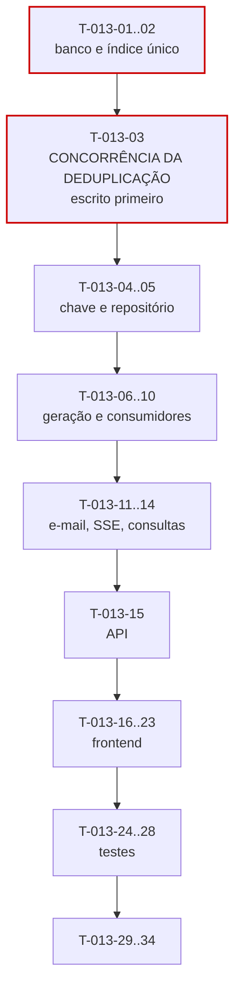

# 013 — Notifications · Tarefas

## 1. Convenções

| Campo | Regra |
|---|---|
| **ID** | `T-013-XX`, estável e imutável |
| **Descrição** | Verbo no infinitivo + objeto |
| **Dependências** | IDs de tarefas ou features concluídas |
| **Estimativa** | Horas-agente; acima de 8h deve ser decomposta |
| **Prioridade** | `P0` bloqueante · `P1` necessária · `P2` cortável |

> **Feature `P1`, folha no grafo** (§22.2 da spec). Não expõe interface pública; as features de origem publicam eventos sem conhecê-la. Cortá-la deixa os eventos sem consumidor, sem quebrar nenhuma outra feature.
>
> **Paralelizável com `010-dashboard` em S8** (§8.1 de `implementation-order.md`): ambas consomem `011` e não se tocam.

## 2. Resumo

| Grupo | Tarefas | Estimativa |
|---|:--:|---|
| Banco | 2 | 5h |
| Backend | 12 | 34h |
| Frontend | 8 | 22h |
| Testes | 5 | 15h |
| Documentação | 2 | 3h |
| Infra | 4 | 7h |
| **Total** | **33** | **86h ≈ 5 dias-agente** |

## 3. Banco

| ID | Descrição | Dependências | Estimativa | Prioridade |
|---|---|---|:--:|:--:|
| T-013-01 | Criar `V035__create_notifications.sql` com **índice único** `(recipient_id, dedupe_key)` | 009, 011 | 3h | P0 |
| T-013-02 | Criar `V036__notification_indexes.sql`, com `idx_notifications_unread` como índice **parcial** sobre `read_at IS NULL` | T-013-01 | 2h | P0 |

> O índice único de `V035` é a garantia estrutural de RN-601. Sem ele, duas avaliações concorrentes do mesmo limiar criariam duas notificações idênticas, e o `dedupeKey` seria apenas convenção. O índice **parcial** de `V036` é o que mantém a contagem de não lidas em p95 < 50 ms num usuário com 5.000 notificações.

## 4. Backend

### 4.1 Deduplicação — o núcleo

| ID | Descrição | Dependências | Estimativa | Prioridade |
|---|---|---|:--:|:--:|
| T-013-03 | **Escrever antes do código:** teste de concorrência com 100 avaliações simultâneas do mesmo limiar, provando que apenas uma notificação é criada | T-013-01 | 3,5h | P0 |
| T-013-04 | Implementar `DedupeKeyBuilder` reproduzindo exatamente as 11 chaves da §6.1 | — | 2h | P0 |
| T-013-05 | Criar a entidade `Notification` e `NotificationRepository` com `insertIgnoringDuplicate` — tratamento da violação do único como **sucesso silencioso**, sem verificação prévia | T-013-03, T-013-04 | 3,5h | P0 |

### 4.2 Geração

| ID | Descrição | Dependências | Estimativa | Prioridade |
|---|---|---|:--:|:--:|
| T-013-06 | Implementar `RecipientResolver` por tipo de evento, restrito a memberships **ativos** (RN-607) | T-013-05 | 2,5h | P0 |
| T-013-07 | Implementar `ConsumptionAlertPolicy` usando `contract.notificationThresholds` e o excedente de RN-604 | T-013-06 | 3,5h | P0 |
| T-013-08 | Implementar `NotificationTemplateRenderer` gerando título e corpo **sem** descrições nem valores monetários (§19.1) | T-013-06 | 3h | P0 |
| T-013-09 | Implementar `NotificationService` na ordem da §6.2 — in-app **antes** de qualquer decisão de e-mail | T-013-07, T-013-08 | 4h | P0 |
| T-013-10 | Criar os consumidores dos 10 eventos da §15, todos reagindo **após o commit** da origem | T-013-09 | 4h | P0 |

### 4.3 Entrega

| ID | Descrição | Dependências | Estimativa | Prioridade |
|---|---|---|:--:|:--:|
| T-013-11 | Implementar `EmailDispatchPolicy` verificando `emailNotifications` **e** `mutedNotificationTypes` (RN-608) | T-013-09 | 2,5h | P0 |
| T-013-12 | Implementar `EmailDispatchService` com enfileiramento após o commit e até 3 tentativas em backoff (RN-610) | T-013-11 | 3,5h | P0 |
| T-013-13 | Implementar `NotificationStreamService` (SSE) com registro de conexões por `recipientId`, nunca por tenant | T-013-09 | 4h | P1 |
| T-013-14 | Implementar `NotificationQueryService` (listagem, contagem, leitura, exclusão), tudo restrito ao `recipientId` do token | T-013-05 | 3h | P0 |

### 4.4 API

| ID | Descrição | Dependências | Estimativa | Prioridade |
|---|---|---|:--:|:--:|
| T-013-15 | Criar DTOs (com `dedupeKey` **ausente**), mappers e os três controllers; **nenhuma** rota de criação | T-013-14, T-013-13 | 4h | P0 |

## 5. Frontend

| ID | Descrição | Dependências | Estimativa | Prioridade |
|---|---|---|:--:|:--:|
| T-013-16 | Criar `NotificationApi` e `NotificationStore` em escopo `root` | T-013-15 | 3h | P0 |
| T-013-17 | Implementar `NotificationStreamService` do cliente, com reconexão em backoff que **recarrega histórico e contagem** | T-013-16 | 4h | P1 |
| T-013-18 | Implementar a degradação para atualização por navegação quando o SSE falha repetidamente | T-013-17 | 2h | P1 |
| T-013-19 | Criar `dt-notification-severity-badge` e `dt-notification-item` com link para a origem | T-013-16 | 2,5h | P0 |
| T-013-20 | Criar `dt-notification-bell` como componente **global**, com contagem acessível e anunciada | T-013-19 | 3h | P0 |
| T-013-21 | Criar `dt-notification-filters` e `NotificationCenterPage` (P25) com leitura, exclusão e estado vazio | T-013-20 | 3,5h | P0 |
| T-013-22 | Criar `dt-notification-preference-row` e `NotificationPreferencesPage` (P28), listando os tipos a partir de `availableTypes` | T-013-16 | 3h | P1 |
| T-013-23 | Aplicar escape em `title` e `body` na renderização; verificar acessibilidade por teclado no sino e na central | T-013-21 | 1h | P0 |

## 6. Testes

| ID | Descrição | Dependências | Estimativa | Prioridade |
|---|---|---|:--:|:--:|
| T-013-24 | Testes da sequência completa de oscilação da §6.3, incluindo limiares personalizados, salto direto a 105% e `HOURLY_OPEN` | T-013-07 | 4h | P0 |
| T-013-25 | Testes de independência entre in-app e e-mail: tipo silenciado, e-mail desligado, provedor falhando 3 vezes | T-013-12 | 3,5h | P0 |
| T-013-26 | **Teste de coerência com `010-dashboard`:** os mesmos limiares produzem a mesma severidade na tela e no alerta | T-013-07, 010 | 2,5h | P0 |
| T-013-27 | Testes do fluxo SSE: isolamento com dois usuários conectados, reconexão recarregando o histórico | T-013-13, T-013-17 | 3h | P1 |
| T-013-28 | Testes dos jobs com `Clock` fixo (lembretes idempotentes, purga de 90 e 91 dias, não lida nunca purgada) + suíte de isolamento + performance da contagem | T-013-29 | 2h | P0 |

## 7. Documentação

| ID | Descrição | Dependências | Estimativa | Prioridade |
|---|---|---|:--:|:--:|
| T-013-29 | Sincronizar `docs/04-api/notifications.md` §5 a §9 com o comportamento implementado | T-013-15 | 2h | P0 |
| T-013-30 | Atualizar o status da feature em `implementation-order.md` §12 e registrar a dívida do SSE (OB-08) em `docs/07-backlog/future.md` | T-013-28 | 1h | P0 |

## 8. Infra

| ID | Descrição | Dependências | Estimativa | Prioridade |
|---|---|---|:--:|:--:|
| T-013-31 | Configurar o provedor de e-mail transacional conforme `integrations.md` | — | 2h | P0 |
| T-013-32 | Implementar `PeriodClosingReminderJob` (RN-605) e `ContractEndingReminderJob` (RN-606), idempotentes **pelo `dedupeKey`** | T-013-09 | 2,5h | P1 |
| T-013-33 | Implementar `EmailRetryJob` (RN-610) e `NotificationCleanupJob` que remove apenas **lidas** (RN-609) | T-013-12 | 1,5h | P0 |
| T-013-34 | Configurar as métricas da §29, com **alerta em `notification.email.exhausted`** e acompanhamento de `notification.stream.connections` | T-013-33 | 1h | P1 |

## 9. Ordem de execução

**Caminho crítico:** `T-013-01 → 03 → 05 → 07 → 09 → 15 → 21 → 24`.

**Duas tarefas com peso desproporcional:**

| Tarefa | Por quê |
|---|---|
| `T-013-03` (concorrência da deduplicação) | Escrita antes de `insertIgnoringDuplicate`. É o único teste que expõe a diferença entre "verificar e inserir" — que tem janela de corrida — e "inserir tratando conflito". A implementação errada passa em qualquer teste sequencial e falha em produção, gerando dois alertas do mesmo limiar (R-01) |
| `T-013-26` (coerência com `010`) | As duas features derivam severidade dos **mesmos** limiares. Uma divergência produz um cliente recebendo alerta por e-mail que a tela não mostra — e o usuário não sabe em qual confiar (R-03) |

**Paralelizável:** `T-013-04` e `T-013-08` (chave e templates) são puros. `T-013-19` a `T-013-22` podem ser desenvolvidos com MSW. `T-013-13`, `T-013-17`, `T-013-18`, `T-013-22` e `T-013-32` são `P1`.

**Ordem de corte:** sendo `P1` e folha no grafo, a feature toda é cortável. Se cortada parcialmente, a ordem é: `T-013-13`/`T-013-17`/`T-013-18` (SSE — a central por navegação já entrega o valor), depois `T-013-22` (preferências — o default de tudo ativo é aceitável), preservando a geração com deduplicação e a central, que são o motivo de a feature existir.

**Dependência inversa:** `T-013-10` consome eventos de `007`, `009`, `011` e `012`. As três primeiras já estarão em `DONE`; `012` entra em S9, depois desta feature. Os consumidores de `ExportCompletedEvent` e `ExportFailedEvent` são implementados aqui, mas só exercitados quando `012` existir — registrado em `T-013-30`.

## 10. Critérios de conclusão por grupo

| Grupo | Concluído quando |
|---|---|
| Banco | Índice único comprovado por teste de concorrência; índice de não lidas comprovadamente **parcial** no plano de execução |
| Backend | 100 avaliações simultâneas produzem **uma** notificação; nenhuma verificação de existência antes da inserção; in-app criada antes de qualquer decisão de e-mail; todos os eventos consumidos após o commit; chaves idênticas às da §6.1 |
| Frontend | Reconexão recarrega histórico e contagem; degradação sem SSE funcional; sino acessível com contagem anunciada; `title` e `body` escapados; zero violações do axe-core |
| Testes | Sequência de oscilação verde; coerência de severidade com `010` provada; isolamento do fluxo com dois usuários; contagem com p95 < 50 ms em 5.000 notificações |
| Documentação | `notifications.md` sincronizado; dívida do SSE registrada em `future.md` |
| Infra | Provedor de e-mail configurado; jobs idempotentes pelo `dedupeKey`; limpeza removendo apenas lidas; alerta de `email.exhausted` ativo |
