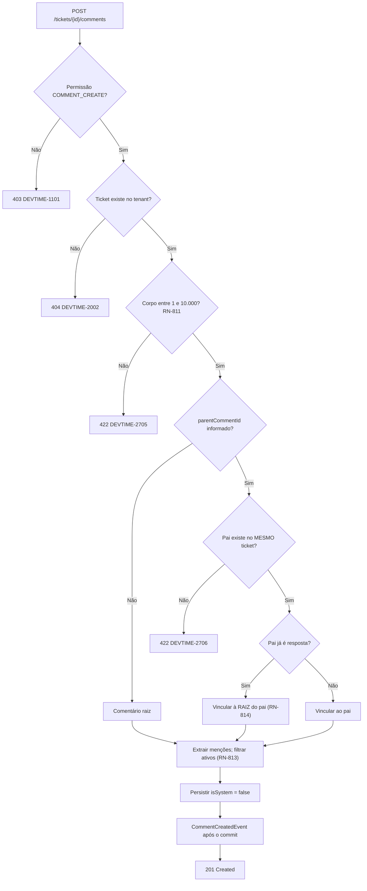
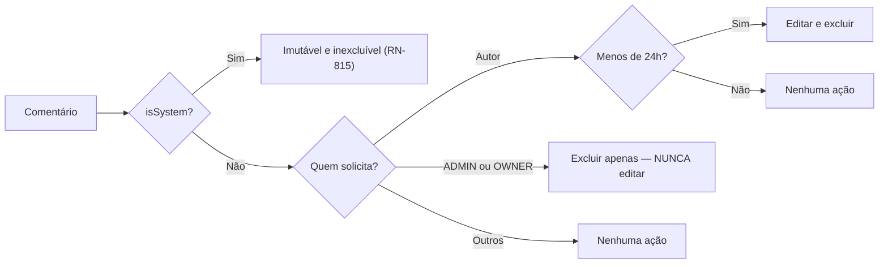

# 014 — Comments

| Campo | Valor |
|---|---|
| **Feature** | 014 |
| **Épico** | EP-13 (Comentários e Anexos) |
| **Sprint** | S11 |
| **Prioridade** | P2 |
| **Complexidade** | Baixa |
| **Estimativa** | 13 pts · 3 dias-agente |
| **Stories** | US-170 a US-174 |
| **Status** | SPEC_APPROVED |

## 1. Objetivo

Registrar a conversa sobre um ticket: comentários de usuário em Markdown, com um nível de resposta e menções que notificam membros ativos, além dos comentários de sistema gerados automaticamente em mudanças estruturais.

## 2. Problema que resolve

O work log responde "quantas horas" e o ticket responde "em quê". Falta o **porquê**: a decisão que mudou o rumo, o impedimento que justificou o atraso, o alinhamento com o cliente. Sem esse registro, a informação vive em e-mail e mensagem privada, e desaparece quando alguém sai do projeto.

A segunda função é fechar a lacuna deixada por `007-tickets`: RN-815 exige comentários de sistema em mudanças de status, de responsável e de contrato, mas a entidade `Comment` não existia. Até esta feature, `SystemCommentEmitter` gravava apenas o `AuditLog`, e a linha do tempo do ticket era incompleta (OB-06 de `007`).

Esta é a feature **mais cortável do MVP** — `P2`, e a primeira na ordem de corte de `mvp.md` §11.1. É registrada com o mesmo rigor porque, se entrar, precisa entrar correta.

## 3. Escopo

| # | Item | Referência |
|---|---|---|
| E-01 | CRUD de comentário com soft delete | §6.16 `entities.md` |
| E-02 | Corpo entre 1 e 10.000 caracteres, em Markdown | RN-811 |
| E-03 | Edição pelo autor em até 24 horas | RN-812 |
| E-04 | Exclusão por `ADMIN`/`OWNER` a qualquer momento | RN-812 |
| E-05 | Menções `@` notificando apenas membros ativos | RN-813 |
| E-06 | Um nível de resposta; resposta a resposta vincula à raiz | RN-814 |
| E-07 | Comentários de sistema imutáveis | RN-815 |
| E-08 | Integração com a linha do tempo do ticket | §11 `tickets.md` |
| E-09 | Componentes na tela P19 | `pages.md` |

## 4. Fora do escopo

| Item | Onde está | Motivo |
|---|---|---|
| Anexos em comentário | `015-attachments` | Entidade própria; `Comment` é o alvo mais simples para validar o upload |
| Comentários em work log, contrato ou cliente | Fora do roadmap | A conversa acontece sobre a unidade de trabalho |
| Reações ou votos | Fora do roadmap | Sem demanda validada |
| Rascunhos e edição colaborativa | Fora do roadmap | Fora do propósito |
| Histórico de versões do comentário | Fora do roadmap | `editedAt` indica que houve edição; o conteúdo anterior fica na auditoria |
| Notificação de menção | `013-notifications` | Esta feature publica o evento; `013` entrega |
| Visibilidade para o cliente | F6 | `future/018-subscriptions` |
| Mais de um nível de resposta | Fora do roadmap | RN-814 |

## 5. Dependências

### 5.1 Features
| Feature | Tipo | O que consome |
|---|---|---|
| `007-tickets` | **Bloqueante** | Ticket como alvo; `SystemCommentEmitter` passa a gravar `Comment` |
| `002-users` | Bloqueante | Membros ativos para menções (RN-813); papéis para RN-812 |
| `013-notifications` | Consumidora | `CommentCreatedEvent` com menções |
| `015-attachments` | Consumidora | Anexo pode pertencer a comentário (INV-ATT-01) |

### 5.2 Documentos obrigatórios
| Documento | Seções relevantes |
|---|---|
| `docs/04-api/tickets.md` | §11 (comentários e linha do tempo) |
| `docs/02-domain/entities.md` | §6.16 Comment |
| `docs/02-domain/business-rules.md` | RN-811 a RN-815 |
| `docs/02-domain/permissions.md` | §6.8, §7, OWN-03 |
| `docs/05-ui/pages.md` | P19 |

### 5.3 Infraestrutura
| Componente | Uso |
|---|---|
| PostgreSQL | `comments` |
| Nenhuma integração externa | Menções são resolvidas internamente |

## 6. Regras de negócio

| ID | Tipo | Enunciado resumido | Erro | Onde é aplicada |
|---|---|---|---|---|
| RN-811 | Bloqueante | Corpo entre 1 e 10.000 caracteres | `DEVTIME-2705` / 422 | Bean Validation + service |
| RN-812 | Bloqueante | Apenas o autor edita, em até 24h; `ADMIN`/`OWNER` excluem a qualquer momento | `DEVTIME-1101` / 403 | `CommentEditPolicy` |
| RN-813 | Automática | Menções `@` notificam apenas membros **ativos** do tenant | — | `MentionExtractor` |
| RN-814 | Automática | Um nível de profundidade; responder a resposta vincula ao comentário **raiz** | — | `CommentThreadPolicy` |
| RN-815 | Automática | Comentários de sistema em mudança de status, de responsável e de contrato; são **imutáveis** | — | `SystemCommentEmitter` (de `007`) |
| RN-003 | Automática | Exclusão é lógica | — | `CommentService.delete` |
| RN-004 | Bloqueante | Alteração exige `version` | `DEVTIME-2004` / 409 | Edição |
| RN-011 | Bloqueante | `ticketId`, `authorId`, `parentCommentId` e `isSystem` são imutáveis | `DEVTIME-2003` / 422 | `CommentService.update` |
| RN-012 | Bloqueante | Listagem paginada, `size` máximo 100 | `DEVTIME-2006` / 400 | `CommentController` |
| RN-001 / RN-002 | Bloqueante | Tenant do usuário; recurso externo retorna `404` | `DEVTIME-1200` / `2002` | Filtro automático |
| RN-006 | Automática | Toda alteração gera `AuditLog` na mesma transação | — | Todas |

### 6.1 Ordem de aplicação — criação de comentário

| # | Verificação | Falha |
|---|---|---|
| 1 | Permissão `COMMENT_CREATE` | `403 DEVTIME-1101` |
| 2 | Ticket existe no tenant | `404 DEVTIME-2002` |
| 3 | Corpo entre 1 e 10.000 caracteres após aparar (RN-811) | `422 DEVTIME-2705` |
| 4 | `parentCommentId`, se informado, existe no **mesmo** ticket | `422 DEVTIME-2706` |
| 5 | Se o pai já é resposta, vincular à **raiz** (RN-814) | — |
| 6 | Extrair menções e filtrar por membros ativos (RN-813) | — |
| 7 | Persistir com `isSystem = false` e `authorId` do usuário autenticado | — |
| 8 | Publicar `CommentCreatedEvent` após o commit | — |
| 9 | Gerar `AuditLog` na mesma transação | — |

**Por que a normalização da hierarquia ocorre na criação (passo 5), não na leitura:** um comentário cujo `parentCommentId` aponta para outra resposta produziria uma árvore de profundidade arbitrária, e a leitura precisaria achatá-la a cada consulta. Resolver na escrita mantém a estrutura sempre plana — dois níveis, garantidos por construção.

**Por que menções inválidas não geram erro (passo 6):** `@joao` pode ser texto legítimo, não menção. Rejeitar o comentário porque um `@` não corresponde a membro ativo transformaria escrita livre em formulário. Menções não resolvidas ficam como texto.

### 6.2 Extração de menções (RN-813)

| # | Passo | Regra |
|---|---|---|
| 1 | Localizar padrões `@identificador` no corpo | Texto livre; nenhum caractere é obrigatório antes |
| 2 | Resolver cada identificador contra memberships do tenant | Comparação pelo identificador de exibição do usuário |
| 3 | Filtrar por `status = ACTIVE` | RN-813 |
| 4 | Persistir os ids resolvidos em `mentionedUserIds` | Array de UUID |
| 5 | Menções não resolvidas permanecem apenas como texto | Nenhum erro |

**Tabela normativa:**

| Corpo | Membros ativos | `mentionedUserIds` | Notificados |
|---|---|---|---|
| `@ana revisar isso` | `ana` ativa | `[id-ana]` | Ana |
| `@ana e @bruno` | `ana` ativa, `bruno` suspenso | `[id-ana]` | Apenas Ana |
| `@carlos` | `carlos` não existe | `[]` | Ninguém |
| `email@dominio.com` | — | `[]` | Ninguém — não é padrão de menção isolado |
| `@ana @ana` | `ana` ativa | `[id-ana]` | Ana **uma vez** |
| `@ana` (autor é Ana) | `ana` ativa | `[id-ana]` | **Ninguém** — o autor não é notificado da própria menção |

### 6.3 Janela de edição (RN-812)

| Condição | Autor | `ADMIN`/`OWNER` | Outros |
|---|---|---|---|
| Comentário próprio, < 24h | Editar, excluir | Excluir | — |
| Comentário próprio, ≥ 24h | — | Excluir | — |
| Comentário de terceiro | — | Excluir | — |
| Comentário de sistema | — | — | — |

> **`ADMIN`/`OWNER` excluem, mas não editam.** Excluir é ato de moderação — remover conteúdo inadequado. Editar o comentário de outra pessoa é falsificar o que ela disse. A distinção é deliberada e está em RN-812: `COMMENT_DELETE_ANY` existe; `COMMENT_UPDATE_ANY` **não** existe no catálogo da §6.8 de `permissions.md`.

### 6.4 Invariantes envolvidas
| ID | Invariante | Como é garantida |
|---|---|---|
| INV-CMT-01 | `parentCommentId` sempre aponta para um comentário raiz | Normalização no passo 5 da §6.1 |
| INV-CMT-02 | `parentCommentId` pertence ao mesmo ticket | Validação no passo 4 |
| INV-CMT-03 | `isSystem = true` ⇒ imutável e inexcluível | `CommentEditPolicy` + ausência de rota |
| INV-CMT-04 | `mentionedUserIds` contém apenas membros ativos no momento da criação | Filtro no passo 6 |
| INV-CMT-05 | `ticketId`, `authorId` e `isSystem` são imutáveis | Campos ausentes dos DTOs de atualização |

## 7. Fluxo principal

1. Usuário com `COMMENT_CREATE` abre P19 e escreve no campo de comentário.
2. Ao digitar `@`, o componente sugere membros **ativos** do tenant.
3. Envia `POST /api/v1/tickets/{id}/comments`.
4. `CommentService` aplica a ordem da §6.1.
5. `MentionExtractor` resolve as menções contra membros ativos (§6.2).
6. Persiste com `isSystem = false`, `authorId` do autenticado e `mentionedUserIds` resolvidos.
7. Publica `CommentCreatedEvent` após o commit; `013` notifica o responsável do ticket e os mencionados.
8. Gera `AuditLog` `COMMENT_CREATED` na mesma transação.
9. Retorna `201` com o comentário renderizado.
10. A linha do tempo do ticket passa a incluí-lo (§11 de `tickets.md`).

## 8. Fluxos alternativos

| # | Fluxo | Gatilho | Comportamento |
|---|---|---|---|
| FA-01 | Resposta a comentário raiz | `parentCommentId` informado | Vinculada normalmente; um nível |
| FA-02 | Resposta a uma resposta | `parentCommentId` de resposta | Vinculada à **raiz** (RN-814); a UI exibe a quem se responde |
| FA-03 | Menção a membro suspenso | `@bruno` suspenso | Fica como texto; nenhuma notificação (RN-813) |
| FA-04 | Menção inexistente | `@carlos` | Idem; nenhum erro |
| FA-05 | Auto-menção | Autor menciona a si | Registrada em `mentionedUserIds`, **sem** notificação |
| FA-06 | Edição pelo autor em 23h | P19 | Permitida; `editedAt` preenchido |
| FA-07 | Edição pelo autor em 25h | P19 | `403 DEVTIME-1101` |
| FA-08 | Exclusão pelo autor | P19 | Permitida em até 24h |
| FA-09 | Exclusão por `ADMIN` | P19 | Permitida a qualquer momento (RN-812) |
| FA-10 | Tentativa de editar comentário de terceiro | P19 | `403` — **nem** `ADMIN` edita (§6.3) |
| FA-11 | Comentário de sistema | Transição em `007` | Criado com `isSystem = true`; imutável |
| FA-12 | Tentativa de editar comentário de sistema | — | `403`; nenhuma rota o alcança |
| FA-13 | Exclusão de comentário com respostas | P19 | Soft delete do raiz; as respostas **permanecem** — ver CX-08 |
| FA-14 | Ticket excluído | `007` | Comentários seguem em soft delete lógico com o ticket |
| FA-15 | Autor removido do tenant | `002` | Comentários **preservados** (RN-458); nome exibido como `Usuário Removido` |
| FA-16 | Anexo em comentário | `015` | Vinculado por `commentId` (INV-ATT-01) |

## 9. Diagramas

### 9.1 Criação com normalização de hierarquia (RN-814)

### 9.2 Janela de edição e moderação (RN-812)

## 10. Estados

| Estado (derivado) | Condição | Operações permitidas |
|---|---|---|
| Editável | `isSystem = false`, autor, < 24h | Editar, excluir |
| Somente moderável | `isSystem = false`, ≥ 24h ou terceiro | Excluir por `ADMIN`/`OWNER` |
| Imutável | `isSystem = true` | Nenhuma |
| Editado | `editedAt ≠ null` | Conforme a janela |
| Excluído | `deletedAt ≠ null` | Nenhuma |

> `Comment` não possui campo `status`. Os estados derivam de `isSystem`, `authorId`, `createdAt` e `deletedAt`.

## 11. Transições

| Origem | Destino | Gatilho | Guarda | Efeito | Permissão |
|---|---|---|---|---|---|
| — | Editável | Criação de usuário | §6.1 | Menções resolvidas; evento publicado | `COMMENT_CREATE` |
| — | Imutável | Criação de sistema | Transição em `007` (RN-815) | `isSystem = true` | Sistema |
| Editável | Editado | Edição | Autor e < 24h (RN-812) | `editedAt = now()`; menções reextraídas | `COMMENT_UPDATE_OWN` |
| Editável | Excluído | Exclusão pelo autor | Autor e < 24h | Soft delete | `COMMENT_UPDATE_OWN` |
| Qualquer não sistema | Excluído | Moderação | — | Soft delete | `COMMENT_DELETE_ANY` |

### 11.1 Transições proibidas
| Transição | Motivo da proibição |
|---|---|
| `ADMIN`/`OWNER` **editar** comentário de terceiro | §6.3. Editar o que outra pessoa disse é falsificação; `COMMENT_UPDATE_ANY` não existe no catálogo |
| Autor editar após 24 horas | RN-812. A janela existe para corrigir erro recente, não reescrever o histórico da conversa |
| Editar ou excluir comentário de sistema | RN-815, INV-CMT-03. É registro automático de fato ocorrido |
| Resposta com mais de um nível | RN-814, INV-CMT-01. Normalizada na escrita |
| Resposta a comentário de outro ticket | INV-CMT-02 |
| Alterar `ticketId`, `authorId` ou `isSystem` | RN-011, INV-CMT-05 |
| Excluir fisicamente | RN-003 |

## 12. Casos de erro

| Código | HTTP | Situação | Mensagem ao usuário | Regra |
|---|:--:|---|---|---|
| `DEVTIME-1101` | 403 | Sem permissão, fora da janela de 24h, ou tentativa de editar de terceiro | Você não tem permissão para esta ação | RN-812 |
| `DEVTIME-2002` | 404 | Ticket ou comentário de outro tenant | Recurso não encontrado | RN-002 |
| `DEVTIME-2003` | 422 | Alteração de campo imutável | Este campo não pode ser alterado | RN-011 |
| `DEVTIME-2004` | 409 | Conflito de `version` | O registro foi alterado. Recarregue e tente novamente | RN-004 |
| `DEVTIME-2006` | 400 | `size` acima de 100 | Tamanho de página inválido | RN-012 |
| `DEVTIME-2705` | 422 | Corpo vazio ou acima de 10.000 caracteres | O comentário deve ter entre 1 e 10.000 caracteres | RN-811 |
| `DEVTIME-2706` | 422 | `parentCommentId` inexistente ou de outro ticket | Comentário de origem inválido | INV-CMT-02 |
| `DEVTIME-1201` | 403 | Escrita em tenant suspenso | Organização suspensa: apenas leitura | RN-007 |

### 12.1 Casos extremos

| # | Caso | Comportamento esperado |
|---|---|---|
| CX-01 | Corpo com 1 e com 10.000 caracteres | Ambos aceitos; 0 e 10.001 rejeitados |
| CX-02 | Corpo só com espaços | Rejeitado — validação após aparar |
| CX-03 | Resposta a uma resposta | Vinculada à **raiz** (RN-814) |
| CX-04 | Resposta a comentário de outro ticket | `422 DEVTIME-2706` |
| CX-05 | Menção repetida | `mentionedUserIds` sem duplicata; uma notificação |
| CX-06 | Auto-menção | Registrada; **nenhuma** notificação |
| CX-07 | Menção a membro que é suspenso depois | A notificação já enviada permanece; `mentionedUserIds` não é reavaliado |
| CX-08 | Exclusão de raiz com respostas | Raiz em soft delete; **respostas permanecem visíveis**, indicando "comentário removido" no lugar do original |
| CX-09 | Edição em exatamente 24h | **Rejeitada** — o limite é estritamente menor que 24h |
| CX-10 | Edição alterando menções | Reextraídas; **novas** menções notificam; as anteriores não são renotificadas |
| CX-11 | Autor removido do tenant | Comentário preservado; nome exibido como `Usuário Removido` (RN-458) |
| CX-12 | `ADMIN` tentando editar | `403` — apenas exclusão (§6.3) |
| CX-13 | Ticket com 500 comentários | Listagem paginada por cursor; respostas carregadas com a raiz |
| CX-14 | Markdown com payload de XSS | Renderizado como texto; sanitização por allowlist |
| CX-15 | Comentário de sistema em ticket sem `014` implantada | Não ocorre — a partir desta feature, `SystemCommentEmitter` grava `Comment` |
| CX-16 | Menção com padrão de e-mail | Não é tratada como menção |

## 13. Modelo de dados

### 13.1 Entidades impactadas
| Entidade | Operação | Tabela | Referência |
|---|---|---|---|
| `Comment` | Cria, lê, atualiza, soft delete | `comments` | §6.16 |
| `Ticket` | Lê (alvo) | `tickets` | Via `TicketService` |
| `Membership` | Lê (menções, RN-813) | `memberships` | Via `MembershipService` |
| `Attachment` | Lê (anexos do comentário) | `attachments` | `015-attachments` |
| `AuditLog` | Cria | `audit_logs` | §6.20 |

### 13.2 Campos obrigatórios na criação
| Campo | Tipo | Origem | Imutável | Validação |
|---|---|---|:--:|---|
| `tenantId` | UUID | `TenantContext` | ✔ 🔒 | Nunca da requisição |
| `ticketId` | UUID | Path | ✔ 🔒 | Ticket do tenant |
| `authorId` | UUID | Autenticado | ✔ 🔒 | Nunca da requisição |
| `body` | Text(10000) | Request | ✖ | 1–10.000 após aparar (RN-811) |
| `parentCommentId` | UUID | Request | ✔ 🔒 | Raiz do mesmo ticket (RN-814) |
| `editedAt` | TIMESTAMPTZ | Sistema | ✖ | Nulo; preenchido na edição |
| `mentionedUserIds` | UUID[] | Derivado | ✖ | Membros ativos (RN-813) |
| `isSystem` | boolean | Sistema | ✔ 🔒 | `false` por usuário; `true` por RN-815 |

### 13.3 Migrations
| Migration | Conteúdo | Compatibilidade |
|---|---|---|
| `V037__create_comments.sql` | `comments` + `CHECK (length(trim(body)) BETWEEN 1 AND 10000)` + FK autorreferente de `parent_comment_id` | Nova tabela |

### 13.4 Índices
| Índice | Colunas | Sustenta |
|---|---|---|
| `idx_comments_ticket_created` | `(tenant_id, ticket_id, created_at)` WHERE `deleted_at IS NULL` | Listagem por ticket e linha do tempo |
| `idx_comments_parent` | `(parent_comment_id)` WHERE `deleted_at IS NULL` | Respostas de um raiz |
| `idx_comments_author` | `(tenant_id, author_id, created_at DESC)` WHERE `deleted_at IS NULL` | Comentários do autor |
| `idx_comments_mentions` | GIN sobre `mentioned_user_ids` | Consulta por menções |

## 14. Endpoints utilizados

| Método | Rota | Operação | Permissão | Sucesso | Doc |
|---|---|---|---|:--:|---|
| GET | `/api/v1/tickets/{id}/comments` | Listar do ticket | `COMMENT_VIEW` | 200 | §11 `tickets.md` |
| POST | `/api/v1/tickets/{id}/comments` | Criar | `COMMENT_CREATE` | 201 | §11 |
| PATCH | `/api/v1/comments/{id}` | Editar | `COMMENT_UPDATE_OWN` | 200 | §11 |
| DELETE | `/api/v1/comments/{id}` | Excluir | `COMMENT_UPDATE_OWN` / `COMMENT_DELETE_ANY` | 204 | §11 |

## 15. Eventos

| Evento | Publicado por | Consumidores | Momento | Efeito |
|---|---|---|---|---|
| `CommentCreatedEvent` | `CommentService` | `013-notifications` | Após o commit | Notifica responsável e mencionados |
| `CommentUpdatedEvent` | `CommentService` | `013-notifications` | Após o commit | Notifica **apenas** menções novas (CX-10) |
| `TicketStatusChangedEvent` | `007-tickets` | `SystemCommentEmitter` | **Dentro** da transação | Comentário de sistema (RN-815) |
| `TicketAssignedEvent` | `007-tickets` | Idem | **Dentro** da transação | Idem |
| `TicketContractMovedEvent` | `007-tickets` | Idem | **Dentro** da transação | Idem |

**Justificativa dos momentos:** comentários de **sistema** são criados dentro da transação da transição — um status alterado sem o comentário correspondente deixa a linha do tempo incompleta, e ambos são o mesmo fato. Notificações são publicadas **após** o commit, porque envolvem entrega externa (TX-06).

## 16. Permissões

| Operação | Permissão | Papéis | Ownership | Escopo de dados |
|---|---|---|---|---|
| Ler | `COMMENT_VIEW` | Todos os 5 papéis | — | Todos os comentários do tenant |
| Criar | `COMMENT_CREATE` | OWNER, ADMIN, MANAGER, MEMBER | — | — |
| Editar o próprio | `COMMENT_UPDATE_OWN` | OWNER, ADMIN, MANAGER, MEMBER | OWN-03 + janela de 24h | — |
| Excluir o próprio | `COMMENT_UPDATE_OWN` | Idem | Idem | — |
| Excluir qualquer | `COMMENT_DELETE_ANY` | OWNER, ADMIN, MANAGER | — | Moderação |
| Criar de sistema | — | Sistema | — | Ignora RBAC (CE-P-08) |

> **`COMMENT_UPDATE_ANY` não existe** no catálogo da §6.8 de `permissions.md`. A ausência é a implementação de §6.3: ninguém edita o comentário de outra pessoa. `MANAGER` possui `COMMENT_DELETE_ANY` — moderação é função de quem gerencia a entrega.
>
> **`VIEWER` lê mas não comenta.** Coerente com o papel: consulta e exporta, não escreve nada.

## 17. Validações

### 17.1 Camada 1 — Formato (`400`)
| Campo | Restrição | Mensagem |
|---|---|---|
| `body` | `@NotBlank`, `@Size(min=1,max=10000)` | O comentário deve ter entre 1 e 10.000 caracteres |
| `parentCommentId` | UUID válido | Comentário de origem inválido |
| `size` | `@Max(100)` | Tamanho de página inválido |

### 17.2 Camada 2 — Negócio
| Validação | Regra | Erro |
|---|---|---|
| Corpo entre 1 e 10.000 após aparar | RN-811 | `DEVTIME-2705` / 422 |
| Pai existe no mesmo ticket | INV-CMT-02 | `DEVTIME-2706` / 422 |
| Janela de 24h para edição | RN-812 | `DEVTIME-1101` / 403 |
| Autor é quem edita | OWN-03 | `DEVTIME-1101` / 403 |
| Comentário de sistema imutável | RN-815 | `DEVTIME-1101` / 403 |
| `version` correspondente | RN-004 | `DEVTIME-2004` / 409 |

### 17.3 Camada 3 — Consistência
| Constraint | Garante | Mapeado para |
|---|---|---|
| `CHECK (length(trim(body)) BETWEEN 1 AND 10000)` | RN-811 | `DEVTIME-2705` |
| FK `comments.parent_comment_id` → `comments.id` | INV-CMT-01 | `DEVTIME-2706` |
| FK `comments.ticket_id` → `tickets.id` | Alvo válido | `DEVTIME-2002` |

## 18. Auditoria

| Ação | `action` | `beforeState` | `afterState` | Metadata |
|---|---|---|---|---|
| Criação | `COMMENT_CREATED` | — | `{ticketId, isSystem, mentionCount}` | IP, traceId |
| **Edição** | `COMMENT_UPDATED` | **`{body}` anterior** | `{body}` novo | IP, traceId |
| Exclusão | `COMMENT_DELETED` | `{authorId}` | `{deletedAt}` | Quem excluiu, IP, traceId |
| Criação de sistema | `COMMENT_SYSTEM_CREATED` | — | `{ticketId, trigger}` | `actorType = SYSTEM` |

> A edição registra o **corpo anterior completo**. É o único lugar onde o conteúdo original sobrevive — não há histórico de versões (§4). Sem isso, uma edição dentro da janela de 24h apagaria irreversivelmente o que foi dito.

## 19. Segurança

| # | Vetor | Mitigação | Verificação |
|---|---|---|---|
| SG-01 | Comentário de outro tenant | Filtro automático; `404` | Suíte de isolamento |
| SG-02 | Editar comentário de terceiro | `COMMENT_UPDATE_ANY` inexistente; ownership no service | Matriz de permissões |
| SG-03 | Burlar a janela de 24h | `CommentEditPolicy` no service, não no controller | Teste com `Clock` fixo |
| SG-04 | Editar comentário de sistema | `isSystem` verificado antes de qualquer edição | Teste |
| SG-05 | **XSS por Markdown** | Sanitização com allowlist; nenhum `innerHTML` cru | Teste com payloads |
| SG-06 | Menção usada para descobrir membros suspensos | Sugestão e resolução restritas a **ativos**; nenhuma resposta diferencia suspenso de inexistente | Teste |
| SG-07 | `authorId` forjado | Sempre do `TenantContext`; ausente dos DTOs | Teste com payload |
| SG-08 | `isSystem` forjado para criar comentário imutável | Campo ausente dos DTOs de escrita | Teste |
| SG-09 | Exaustão por comentário de 10.000 caracteres em massa | Limite por comentário; `COMMENT_CREATE` exige autenticação | Métrica |

### 19.1 LGPD

| Dado pessoal | Base legal | Retenção | Exportação | Anonimização | Proibido em log |
|---|---|---|---|---|---|
| `authorId` | Execução de contrato | Vida do tenant | ✔ | `Usuário Removido` na exibição | Permitido (é UUID) |
| `body` (texto livre) | Legítimo interesse | Vida do tenant | ✔ | **Não** anonimizável automaticamente | ❌ conteúdo em log |
| `mentionedUserIds` | Legítimo interesse | Idem | ✔ | Vínculo preservado | Permitido |

**Análise.** `body` é o campo de texto livre mais longo do sistema (10.000 caracteres) e o mais provável de conter dado pessoal de terceiros — nome de contato do cliente, telefone, detalhe de conversa. O sistema não pode preveni-lo.

O tratamento é: (a) conteúdo exportável; (b) **editável pelo autor por 24h** e **excluível por `ADMIN`/`OWNER` a qualquer momento** — o que dá ao tenant um caminho imediato de remoção sem depender de suporte; (c) nunca em log de aplicação (§28).

A remoção de um membro **preserva** os comentários (RN-458), porque eles compõem o contexto do trabalho entregue. A anonimização substitui o nome exibido, não o vínculo.

## 20. Performance

| Operação | Meta | Índice/estratégia | Risco |
|---|---|---|---|
| Listagem por ticket | p95 < 250 ms | `idx_comments_ticket_created`; paginação por cursor | Ticket com 500 comentários |
| Criação | p95 < 200 ms | Extração de menções em memória; uma consulta de resolução | — |
| Resolução de menções | < 50 ms | Uma consulta em lote para todos os identificadores | Comentário com 20 menções |
| Sugestão de menção | p95 < 100 ms | Consulta de memberships ativos, com limite de 10 e debounce de 250 ms | Chamada a cada tecla |
| Respostas de um raiz | < 100 ms | `idx_comments_parent` | — |
| Linha do tempo | p95 < 500 ms | Compartilha o índice; união com auditoria e work logs em `007` | Ticket com 1.000 eventos |

### 20.1 Escalabilidade

`comments` cresce com o uso, mas em ordem modesta: dezenas por ticket em uso intenso. Não é uma tabela de risco.

Dois pontos merecem atenção. A **sugestão de menção** é chamada a cada tecla após `@`; a mitigação é debounce de 250 ms e limite de 10 sugestões, como em `006-tags`. E a **resolução de menções na criação** faz uma consulta em lote para todos os identificadores encontrados, nunca uma por menção — um comentário com 20 menções não deve gerar 20 consultas.

A listagem é paginada por **cursor**, não por `OFFSET`. Um ticket com 500 comentários teria a última página progressivamente mais lenta com `OFFSET`.

## 21. Componentes Frontend

### 21.1 Rotas
| Rota | Componente | Guard | Lazy | Tela |
|---|---|---|:--:|---|
| — | `dt-comment-thread` | — | ✖ | Componente de P19, sem rota própria |

### 21.2 Componentes
| Componente | Tipo | Responsabilidade | Inputs | Outputs |
|---|---|---|---|---|
| `dt-comment-thread` | Presentational | Lista de raízes com respostas, paginada por cursor | `ticketId` | `loadMore` |
| `dt-comment-item` | Presentational | Comentário com autor, data, indicação de edição e ações conforme a janela | `comment`, `canEdit`, `canDelete` | `edit`, `delete`, `reply` |
| `dt-comment-editor` | Presentational | Markdown com autocompletar de menção e contador de caracteres | `value`, `maxLength` | `submit`, `cancel` |
| `dt-mention-autocomplete` | Shared | Sugestão de membros **ativos** ao digitar `@` | `query` | `select` |
| `dt-system-comment` | Presentational | Comentário de sistema com estilo distinto e sem ações | `comment` | — |
| `dt-comment-deleted` | Presentational | Ocupa o lugar de um raiz excluído que possui respostas (CX-08) | — | — |

> `dt-markdown-editor` e `dt-markdown-view` são **reutilizados de `007-tickets`** (§21.2 daquela spec). A sanitização é a mesma, e replicá-la criaria duas allowlists que divergiriam — com uma delas eventualmente permitindo XSS.
>
> `dt-system-comment` tem estilo visualmente distinto e **nenhuma** ação. O usuário precisa distinguir imediatamente o que o sistema registrou do que uma pessoa escreveu.

### 21.3 Stores e serviços Angular
| Artefato | Tipo | Estado exposto | Escopo |
|---|---|---|---|
| `CommentStore` | Store | `comments`, `cursor`, `hasMore`, `loading` | Provido em P19 |
| `CommentApi` | API | Somente HTTP dos 4 endpoints | `providedIn: 'root'` |

### 21.4 Guards, interceptors, pipes e directives
| Artefato | Tipo | Uso |
|---|---|---|
| `hasPermission` | Directive | Oculta criar, editar e excluir |
| `canEditComment` | Directive | Habilita edição apenas para o autor e dentro de 24h |
| `relativeTimePipe` | Pipe | "há 5 minutos" — reutilizado de `013` |
| `mentionHighlightPipe` | Pipe | Destaca menções resolvidas no corpo renderizado |

## 22. Serviços Backend

### 22.1 Controllers
| Classe | Rota base | Endpoints |
|---|---|---|
| `TicketCommentController` | `/api/v1/tickets/{id}/comments` | listar, criar |
| `CommentController` | `/api/v1/comments/{id}` | editar, excluir |

### 22.2 Services
| Interface | Implementação | Responsabilidade | Permissão declarada |
|---|---|---|---|
| `CommentService` | `CommentServiceImpl` | CRUD com a ordem da §6.1 | `COMMENT_*` |
| `SystemCommentService` | `SystemCommentServiceImpl` | Comentários de sistema (RN-815) | Sistema |

**Interfaces públicas consumidas por outras features:**

| Método | Consumidor | Contrato |
|---|---|---|
| `SystemCommentService.emit(ticketId, trigger, payload)` | `007-tickets` | Cria `Comment` com `isSystem = true`, **dentro** da transação da transição |
| `CommentService.findForTimeline(ticketId, cursor)` | `007-tickets` | Comentários para a linha do tempo |
| `CommentService.existsForComment(commentId)` | `015-attachments` | Valida o alvo do anexo (INV-ATT-01) |

> `SystemCommentService.emit` é o que fecha a dívida de OB-06 de `007-tickets`. A partir desta feature, `SystemCommentEmitter` daquela feature passa a chamá-lo em vez de gravar apenas `AuditLog`.

### 22.3 Componentes de domínio
| Classe | Tipo | Responsabilidade | Regras |
|---|---|---|---|
| `MentionExtractor` | Utilitário | Extrai e resolve menções contra membros ativos | RN-813, §6.2 |
| `CommentThreadPolicy` | Policy | Normaliza a hierarquia para um nível | RN-814, INV-CMT-01 |
| `CommentEditPolicy` | Policy | Janela de 24h; autor; sistema imutável | RN-812, RN-815 |
| `SystemCommentTemplates` | Utilitário | Textos dos comentários de sistema por gatilho | RN-815 |

### 22.4 Jobs
| Classe | Cron | Lock | Responsabilidade | Idempotência |
|---|---|---|---|---|
| — | — | — | **Não se aplica.** Nenhuma operação desta feature é temporal ou agendada. A janela de 24h é verificada na requisição, não por job. | — |

## 23. DTOs

| DTO | Direção | Campos principais | Observação |
|---|---|---|---|
| `CommentCreateRequest` | Request | `body`, `parentCommentId?` | `authorId`, `isSystem`, `mentionedUserIds` **ausentes** |
| `CommentUpdateRequest` | Request | `body`, `version` | `parentCommentId` ausente (imutável) |
| `CommentResponse` | Response | `id`, `body`, `author`, `createdAt`, `editedAt`, `isSystem`, `mentionedUsers[]`, `parentCommentId`, `replies[]`, `attachments[]`, `canEdit`, `canDelete`, `version` | `canEdit`/`canDelete` calculados no servidor |
| `CommentThreadResponse` | Response | `comments[]` (raízes com respostas), `cursor`, `hasMore` | Paginada por cursor |
| `MentionedUserDto` | Nested | `id`, `displayName` | Apenas ativos no momento da criação |

> `canEdit` e `canDelete` são calculados no **servidor** e retornados. O cliente não deve reimplementar a janela de 24h e o ownership — duas implementações divergiriam, e a do cliente seria a que o usuário vê.

## 24. Mappers

| Mapper | De → Para | Mapeamentos não triviais |
|---|---|---|
| `CommentMapper` | `Comment` → `CommentResponse` | `canEdit`/`canDelete` por papel e janela; `mentionedUsers` resolvidos; autor removido exibido como `Usuário Removido` |
| `CommentThreadMapper` | Lista plana → árvore de dois níveis | Agrupa respostas sob a raiz; ordena cronologicamente em ambos os níveis |

## 25. Repositories

| Repository | Entidade | Métodos específicos | Índice usado |
|---|---|---|---|
| `CommentRepository` | `Comment` | `findByTicketCursor`, `findRepliesByParents`, `findRootById`, `countByTicket` | `idx_comments_ticket_created`, `idx_comments_parent` |

> `findRepliesByParents` recebe a lista de raízes e busca **todas** as respostas em uma consulta. Uma consulta por raiz produziria N+1 numa listagem de 20 raízes.

## 26. Entities utilizadas
| Entidade | Origem | Campos relevantes |
|---|---|---|
| `Comment` | Esta feature | Todos |
| `Ticket` | `007-tickets` | `id` — alvo |
| `Membership` | `002-users` | `status`, `userId` — RN-813 |
| `Attachment` | `015-attachments` | Vínculo por `commentId` |

## 27. Validators e Exceptions

| Classe | Tipo | Regra | Código de erro |
|---|---|---|---|
| `CommentEditPolicy` | Validator | RN-812, RN-815 | `DEVTIME-1101` |
| `CommentThreadPolicy` | Validator | RN-814, INV-CMT-02 | `DEVTIME-2706` |
| `CommentBodyTooLongException` | Exception | RN-811 | `DEVTIME-2705` / 422 |
| `CommentEditWindowExpiredException` | Exception | RN-812 | `DEVTIME-1101` / 403 |
| `SystemCommentImmutableException` | Exception | RN-815 | `DEVTIME-1101` / 403 |
| `InvalidParentCommentException` | Exception | INV-CMT-02 | `DEVTIME-2706` / 422 |

## 28. Logs

| Evento | Nível | Campos | Proibido |
|---|---|---|---|
| Comentário criado | INFO | `tenantId`, `userId`, `commentId`, `ticketKey`, contagem de menções | **`body`** — texto livre (§19.1) |
| Comentário editado | INFO | `commentId`, tempo desde a criação | `body`, antes ou depois |
| Comentário excluído | INFO | `commentId`, quem excluiu, se era próprio | `body` |
| Edição bloqueada por janela | INFO | `commentId`, horas decorridas | — |
| Comentário de sistema criado | DEBUG | `commentId`, `ticketId`, gatilho | Texto gerado |

> `body` **nunca** entra em log. É o campo mais longo e mais provável de conter dado pessoal de terceiros (§19.1). A auditoria — que é dado do tenant, não log de aplicação — preserva o corpo anterior nas edições.

## 29. Métricas

| Métrica | Tipo | Tags | Alerta |
|---|---|---|---|
| `comment.created` | Counter | `isSystem` | — |
| `comment.edited` | Counter | — | — |
| `comment.edit.blocked_window` | Counter | — | > 20/dia indica que 24h é curto na prática |
| `comment.deleted` | Counter | `byModerator` | Pico indica moderação de conteúdo inadequado |
| `comment.mentions` | Distribution | — | p99 alto justifica limitar menções por comentário |
| `comment.mention.unresolved` | Counter | — | Alto indica autocompletar falhando |
| `comment.body.length` | Distribution | — | Acompanha o uso real do limite de 10.000 |
| `comment.thread.duration` | Timer | `commentCount` bucket | p95 > 250 ms |
| `comment.reply.depth_normalized` | Counter | — | Mede quantas respostas foram achatadas à raiz |

## 30. Comportamentos esperados

| # | Comportamento |
|---|---|
| CE-01 | Corpo entre 1 e 10.000 caracteres, validado após aparar |
| CE-02 | Autor edita em até 24h; depois, ninguém edita |
| CE-03 | `ADMIN`/`OWNER` excluem a qualquer momento, mas **nunca** editam |
| CE-04 | Menções resolvem apenas membros ativos |
| CE-05 | Menção não resolvida fica como texto, sem erro |
| CE-06 | Auto-menção não notifica |
| CE-07 | Hierarquia é normalizada a um nível na escrita |
| CE-08 | Comentários de sistema são imutáveis |
| CE-09 | Comentários de sistema são criados na transação da transição |
| CE-10 | A edição registra o corpo anterior em auditoria |
| CE-11 | Exclusão de raiz preserva as respostas |
| CE-12 | `canEdit` e `canDelete` são calculados no servidor |
| CE-13 | Markdown é sanitizado por allowlist |
| CE-14 | Autor removido tem o comentário preservado |
| CE-15 | `body` nunca entra em log |

## 31. Comportamentos proibidos

| # | Proibição | Motivo |
|---|---|---|
| CP-01 | Permitir a `ADMIN`/`OWNER` editar comentário de terceiro | §6.3; falsificaria o que a pessoa disse |
| CP-02 | Permitir edição após 24h | RN-812 |
| CP-03 | Editar ou excluir comentário de sistema | RN-815, INV-CMT-03 |
| CP-04 | Rejeitar comentário por menção não resolvida | Transformaria escrita livre em formulário |
| CP-05 | Notificar o autor da própria menção | Ruído sem valor |
| CP-06 | Permitir hierarquia com mais de um nível | RN-814, INV-CMT-01 |
| CP-07 | Normalizar a hierarquia na leitura | Exigiria achatar a árvore a cada consulta |
| CP-08 | Aceitar `authorId`, `isSystem` ou `mentionedUserIds` da requisição | SG-07, SG-08 |
| CP-09 | Excluir as respostas ao excluir o raiz | Apagaria conversa de terceiros |
| CP-10 | Reimplementar a janela de 24h no cliente | Duas implementações divergiriam |
| CP-11 | Renderizar Markdown sem sanitização | SG-05 |
| CP-12 | Replicar a allowlist de sanitização de `007` | Duas listas divergiriam; uma permitiria XSS |
| CP-13 | Uma consulta de resolução por menção | N+1 em comentário com muitas menções |
| CP-14 | Paginar por `OFFSET` | Última página progressivamente mais lenta |
| CP-15 | Logar `body` | §19.1 |
| CP-16 | Criar comentário de sistema fora da transação da transição | Linha do tempo incompleta |
| CP-17 | Acessar `CommentRepository` a partir de outra feature | AR-02 |

## 32. Restrições

| # | Restrição | Origem |
|---|---|---|
| RS-01 | Corpo entre 1 e 10.000 caracteres | RN-811 |
| RS-02 | Janela de edição de 24 horas | RN-812 |
| RS-03 | Um nível de resposta | RN-814 |
| RS-04 | Sem histórico de versões | Decisão de escopo; o corpo anterior fica na auditoria |
| RS-05 | Comentários apenas em ticket | Decisão de escopo |
| RS-06 | Sem reações nem votos | Sem demanda validada |
| RS-07 | Sem visibilidade para o cliente | F6 |
| RS-08 | Listagem com `size` máximo de 100 | RN-012 |

## 33. Critérios de aceite

| # | Critério | Verificação |
|---|---|---|
| CA-01 | Corpo com 1 e 10.000 caracteres aceito; 0 e 10.001 rejeitados | Teste |
| CA-02 | Corpo só com espaços rejeitado | Teste |
| CA-03 | Autor edita em 23h59; rejeitado em 24h exatas | Teste com `Clock` fixo |
| CA-04 | `ADMIN` exclui a qualquer momento e recebe `403` ao tentar editar | Teste |
| CA-05 | A tabela normativa de menções da §6.2 é reproduzida nas 6 linhas | Teste parametrizado |
| CA-06 | Auto-menção registrada sem notificação | Teste |
| CA-07 | Resposta a resposta vincula à raiz | Teste |
| CA-08 | Resposta a comentário de outro ticket rejeitada | Teste |
| CA-09 | Comentário de sistema é imutável e inexcluível | Teste |
| CA-10 | Comentário de sistema criado na mesma transação da transição | Teste com rollback |
| CA-11 | A edição registra o corpo anterior em auditoria | Teste |
| CA-12 | Exclusão de raiz preserva as respostas visíveis | Teste |
| CA-13 | `canEdit` e `canDelete` vêm do servidor e coincidem com o comportamento real | Teste de contrato |
| CA-14 | Markdown com payload de XSS renderizado como texto | Teste de segurança |
| CA-15 | Autor removido tem o comentário preservado com nome anonimizado | Teste |
| CA-16 | Resolução de menções em **uma** consulta | Inspeção de SQL |
| CA-17 | Nenhum log contém `body` | Inspeção de log |
| CA-18 | Comentário de outro tenant retorna `404` | Suíte de isolamento |
| CA-19 | Existe teste para cada célula da matriz de permissões desta feature | Relatório |

## 34. Checklist de implementação

- [ ] `V037` com `CHECK (length(trim(body)) BETWEEN 1 AND 10000)` e FK autorreferente
- [ ] `MentionExtractor` reproduz a tabela normativa da §6.2, incluindo a auto-menção sem notificação
- [ ] Resolução de menções em **uma** consulta em lote (CP-13)
- [ ] Menção não resolvida permanece como texto, sem erro (CP-04)
- [ ] `CommentThreadPolicy` normaliza a hierarquia **na escrita** (CP-07)
- [ ] `CommentEditPolicy` com janela estritamente **menor** que 24h
- [ ] `COMMENT_UPDATE_ANY` **não** implementada — nem `ADMIN` edita (CP-01)
- [ ] `isSystem` verificado antes de qualquer edição ou exclusão
- [ ] `authorId`, `isSystem` e `mentionedUserIds` ausentes de todos os DTOs de escrita
- [ ] `canEdit` e `canDelete` calculados no **servidor** (CP-10)
- [ ] `SystemCommentService.emit` chamado **dentro** da transação da transição de `007`
- [ ] `SystemCommentEmitter` de `007` atualizado para chamar esta feature (fecha OB-06 de `007`)
- [ ] `dt-markdown-editor` e `dt-markdown-view` **reutilizados** de `007` (CP-12)
- [ ] `dt-mention-autocomplete` com debounce de 250 ms e limite de 10, apenas ativos
- [ ] `dt-system-comment` visualmente distinto e sem ações
- [ ] Exclusão de raiz **preserva** as respostas; `dt-comment-deleted` ocupa o lugar
- [ ] Paginação por **cursor**, nunca `OFFSET`
- [ ] `findRepliesByParents` em uma consulta para todas as raízes
- [ ] Auditoria de edição registra o **corpo anterior completo**
- [ ] Nenhum log contém `body`
- [ ] Nenhum texto fixo nos componentes (ART-095)

## 35. Checklist de revisão

- [ ] Nenhum acesso a `CommentRepository` de fora da feature
- [ ] Nenhuma rota nem permissão permite editar comentário de terceiro
- [ ] Comentário de sistema comprovadamente imutável por todos os caminhos
- [ ] Comentário de sistema comprovadamente na transação da transição
- [ ] Sanitização reutilizada de `007`, sem allowlist duplicada
- [ ] Resolução de menções em uma consulta, comprovado em SQL
- [ ] Nenhuma consulta N+1 ao carregar respostas
- [ ] Nenhum log com `body`
- [ ] Toda `RN-XXX` da §6 possui teste referenciando o ID
- [ ] Cobertura ≥ 90% em services e policies
- [ ] `404` (não `403`) para comentário de outro tenant

## 36. Checklist de QA

- [ ] Todos os cenários de `acceptance.md` verdes
- [ ] Comentário com 1, 10.000 e 10.001 caracteres
- [ ] Corpo só com espaços
- [ ] Menções a membro ativo, suspenso, inexistente, repetido e a si mesmo
- [ ] Autocompletar de menção sugerindo apenas ativos
- [ ] Resposta a raiz e resposta a resposta
- [ ] Resposta a comentário de outro ticket
- [ ] Editar em 1h, em 23h e em 25h
- [ ] Como `ADMIN`: excluir comentário de terceiro e tentar editá-lo
- [ ] Excluir raiz com respostas — conferir que as respostas permanecem
- [ ] Provocar mudança de status, de responsável e de contrato em `007` — conferir os comentários de sistema
- [ ] Tentar editar e excluir comentário de sistema
- [ ] Markdown com `<script>`, `<iframe>` e `javascript:` em link
- [ ] Ticket com 500 comentários — conferir paginação
- [ ] Autor removido do tenant — conferir preservação e anonimização
- [ ] Zero violações do axe-core nos componentes
- [ ] Navegação e envio completos por teclado

## 37. Definition of Done

| # | Item | Referência |
|---|---|---|
| DoD-01 | Todos os critérios da §33 verdes | — |
| DoD-02 | Cobertura ≥ 90% em services e policies | CA-08 `backend.md` |
| DoD-03 | Suíte de isolamento verde para os 4 endpoints | CA-03 `architecture.md` |
| DoD-04 | `docs/04-api/tickets.md` §11 sincronizado | ART-111 |
| DoD-05 | Zero violações do axe-core nos componentes de P19 | AC-01 |
| DoD-06 | Interfaces `emit`, `findForTimeline` e `existsForComment` publicadas para `007` e `015` | AR-03 |
| DoD-07 | **`SystemCommentEmitter` de `007` conectado**, fechando OB-06 daquela spec | §22.2 |
| DoD-08 | Linha do tempo de `007` passa a incluir comentários | §11 `tickets.md` |

## 38. Riscos

| # | Risco | Prob. | Impacto | Mitigação | Gatilho |
|---|---|:--:|:--:|---|---|
| R-01 | **Menção a membro inativo** | Baixa | Baixo | RN-813 filtra ativos; autocompletar sugere apenas ativos | Notificação a membro suspenso |
| R-02 | XSS por Markdown | Baixa | **Alto** | Sanitização reutilizada de `007`, com allowlist única | Teste de segurança falho |
| R-03 | Janela de 24h burlada por caminho interno | Baixa | Médio | `CommentEditPolicy` no service; teste com `Clock` fixo | Edição de comentário antigo |
| R-04 | Comentário de sistema fora da transação | Média | Médio | Chamada direta dentro da transação; teste com rollback | Status alterado sem comentário |
| R-05 | Hierarquia com mais de um nível | Baixa | Baixo | Normalização na escrita; teste de profundidade | Resposta de terceiro nível |
| R-06 | N+1 ao carregar respostas | Média | Baixo | `findRepliesByParents` em lote; inspeção de SQL | p95 acima da meta |
| R-07 | Dado pessoal de terceiro no corpo | Média | Médio | Editável por 24h e excluível por moderador; fora de log | Solicitação de titular |
| R-08 | Duas allowlists de sanitização divergindo | Média | Alto | Componentes reutilizados de `007`; revisão explícita | Payload passando em um lugar e não no outro |

## 39. Observações

| # | Observação |
|---|---|
| OB-01 | **`ADMIN` exclui mas não edita (§6.3, CP-01).** A assimetria é a decisão mais importante da feature. Excluir é moderação legítima; editar o comentário de outra pessoa é alterar o registro do que ela disse — em um sistema cuja auditoria é vendida como diferencial, isso seria contraditório. A implementação é por **ausência**: `COMMENT_UPDATE_ANY` não existe no catálogo da §6.8 de `permissions.md`, e portanto não há permissão a conceder. |
| OB-02 | **A hierarquia é normalizada na escrita (§6.1, passo 5, CP-07).** Um `parentCommentId` apontando para outra resposta é silenciosamente redirecionado à raiz. A alternativa — rejeitar — seria mais explícita, mas a UI nunca oferece esse caminho, e rejeitar produziria um erro que só apareceria a quem chamasse a API diretamente. Normalizar mantém a estrutura plana por construção e a leitura trivial. |
| OB-03 | **Exclusão de raiz preserva as respostas (CX-08, CP-09).** É contraintuitivo: um fio com o primeiro comentário removido parece quebrado. A alternativa — excluir em cascata — apagaria conversa de **terceiros** por decisão de uma pessoa. A UI resolve exibindo `dt-comment-deleted` no lugar do original, preservando o contexto sem preservar o conteúdo. |
| OB-04 | **Sem histórico de versões (RS-04).** A edição sobrescreve o corpo, e o anterior fica **apenas** na auditoria (§18). É suficiente porque a janela é de 24h e a auditoria é consultável. Um histórico completo exigiria uma tabela de versões para um caso de uso raro em uma feature `P2`. |
| OB-05 | **Esta feature fecha a dívida de `007-tickets` (OB-06 daquela spec).** Até aqui, `SystemCommentEmitter` gravava apenas `AuditLog`, e a linha do tempo era montada de auditoria e work logs. `T-014` conecta `SystemCommentService.emit`, e a linha do tempo passa a estar completa. **Se esta feature for cortada, a lacuna permanece** — e isso é comportamento correto e documentado, não defeito. |
| OB-06 | **Feature mais cortável do MVP.** É `P2` e a primeira na ordem de corte de `mvp.md` §11.1. `015-attachments` depende dela (INV-ATT-01), então cortá-la corta as duas. O impacto é: nenhuma conversa registrada no ticket e a linha do tempo sem comentários de sistema. Nada quebra. |
| OB-07 | **Componentes de Markdown reutilizados de `007` (CP-12).** Não é apenas economia: duas allowlists de sanitização divergiriam com o tempo, e a divergência apareceria como um payload que passa em um lugar e não no outro. Uma única implementação é a mitigação de R-08. |
| OB-08 | **Evolução SaaS:** o portal do cliente (F6, `future/018-subscriptions`) precisará distinguir comentários **internos** de comentários **visíveis ao cliente**. O campo não existe hoje. Adicioná-lo é aditivo — um booleano com default `false` —, mas exige decidir o que acontece com os comentários existentes: mantê-los internos é a única opção segura, e essa decisão precisa ser registrada quando F6 for especificada. |
