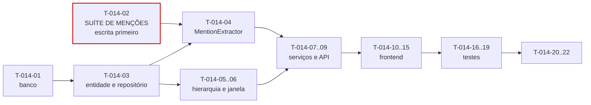

# 014 — Comments · Tarefas

## 1. Convenções

| Campo | Regra |
|---|---|
| **ID** | `T-014-XX`, estável e imutável |
| **Descrição** | Verbo no infinitivo + objeto |
| **Dependências** | IDs de tarefas ou features concluídas |
| **Estimativa** | Horas-agente; acima de 8h deve ser decomposta |
| **Prioridade** | `P0` bloqueante · `P1` necessária · `P2` cortável |

> **Feature `P2` — primeira na ordem de corte** (§11.1 de `mvp.md`). Cortá-la corta também `015-attachments`, que depende dela (INV-ATT-01). O impacto é: nenhuma conversa no ticket e a linha do tempo sem comentários de sistema. Nada quebra.
>
> **Fecha uma dívida de `007-tickets`:** `T-014-14` conecta `SystemCommentEmitter` daquela feature à entidade `Comment`, resolvendo OB-06 de `007`. Se esta feature for cortada, a lacuna permanece — comportamento correto e documentado.

## 2. Resumo

| Grupo | Tarefas | Estimativa |
|---|:--:|---|
| Banco | 1 | 2h |
| Backend | 8 | 22h |
| Frontend | 6 | 15h |
| Testes | 4 | 10h |
| Documentação | 2 | 3h |
| Infra | 1 | 1h |
| **Total** | **22** | **53h ≈ 3 dias-agente** |

## 3. Banco

| ID | Descrição | Dependências | Estimativa | Prioridade |
|---|---|---|:--:|:--:|
| T-014-01 | Criar `V037__create_comments.sql` com `CHECK (length(trim(body)) BETWEEN 1 AND 10000)`, FK autorreferente de `parent_comment_id` e os quatro índices da §13.4 | 007, 002 | 2h | P0 |

## 4. Backend

| ID | Descrição | Dependências | Estimativa | Prioridade |
|---|---|---|:--:|:--:|
| T-014-02 | **Escrever antes do código:** suíte parametrizada da tabela normativa de menções (§6.2), incluindo auto-menção sem notificação e padrão de e-mail | T-014-01 | 2,5h | P0 |
| T-014-03 | Criar a entidade `Comment` e `CommentRepository` com `findByTicketCursor` e `findRepliesByParents` **em lote** | T-014-01 | 2,5h | P0 |
| T-014-04 | Implementar `MentionExtractor` resolvendo em **uma** consulta em lote, filtrando por membros ativos (RN-813) | T-014-02, T-014-03 | 3h | P0 |
| T-014-05 | Implementar `CommentThreadPolicy` normalizando a hierarquia **na escrita** (RN-814) | T-014-03 | 2h | P0 |
| T-014-06 | Implementar `CommentEditPolicy` com janela estritamente **menor** que 24h, ownership e imutabilidade de sistema | T-014-03 | 2,5h | P0 |
| T-014-07 | Implementar `CommentService` na ordem da §6.1, com `canEdit` e `canDelete` calculados no **servidor** | T-014-04, T-014-05, T-014-06 | 3,5h | P0 |
| T-014-08 | Implementar `SystemCommentService.emit` e `SystemCommentTemplates` para os três gatilhos de RN-815 | T-014-07 | 2,5h | P1 |
| T-014-09 | Criar DTOs, `CommentThreadMapper` (árvore de dois níveis) e os dois controllers com OpenAPI | T-014-08 | 3,5h | P0 |

## 5. Frontend

| ID | Descrição | Dependências | Estimativa | Prioridade |
|---|---|---|:--:|:--:|
| T-014-10 | Criar `CommentApi` e `CommentStore` com paginação por **cursor** | T-014-09 | 2,5h | P0 |
| T-014-11 | Criar `dt-mention-autocomplete` com debounce de 250 ms, limite de 10 e apenas membros ativos | T-014-10 | 3h | P0 |
| T-014-12 | Criar `dt-comment-editor` **reutilizando** `dt-markdown-editor` de `007`, com contador de caracteres | T-014-11 | 2,5h | P0 |
| T-014-13 | Criar `dt-comment-item` (ações conforme `canEdit`/`canDelete` do servidor), `dt-system-comment` sem ações e `dt-comment-deleted` | T-014-10 | 3h | P0 |
| T-014-14 | Criar `dt-comment-thread` e integrá-lo a P19 e à linha do tempo de `007` | T-014-13, T-014-12 | 3h | P0 |
| T-014-15 | Aplicar `hasPermission` e `canEditComment`; garantir navegação e envio por teclado | T-014-14 | 1h | P0 |

## 6. Testes

| ID | Descrição | Dependências | Estimativa | Prioridade |
|---|---|---|:--:|:--:|
| T-014-16 | Testes da janela de 24h com `Clock` fixo (1h, 23h59, 24h exatas, 25h) e de `ADMIN` recusado ao **editar** | T-014-06 | 2,5h | P0 |
| T-014-17 | Testes de hierarquia: resposta a resposta normalizada, pai de outro ticket, profundidade máxima | T-014-05 | 2,5h | P0 |
| T-014-18 | Testes de comentário de sistema: imutabilidade e criação **dentro** da transação, com rollback | T-014-08 | 2,5h | P1 |
| T-014-19 | Testes de exclusão de raiz preservando respostas, N+1 em respostas (inspeção de SQL), XSS em Markdown e suíte de isolamento | T-014-09 | 2,5h | P0 |

## 7. Documentação

| ID | Descrição | Dependências | Estimativa | Prioridade |
|---|---|---|:--:|:--:|
| T-014-20 | Sincronizar `docs/04-api/tickets.md` §11 com o comportamento implementado | T-014-09 | 1,5h | P0 |
| T-014-21 | Publicar `emit`, `findForTimeline` e `existsForComment` para `007` e `015`; **atualizar `007-tickets` para conectar `SystemCommentEmitter`**, fechando OB-06 daquela spec; atualizar o status em `implementation-order.md` §12 | T-014-08 | 1,5h | P0 |

## 8. Infra

| ID | Descrição | Dependências | Estimativa | Prioridade |
|---|---|---|:--:|:--:|
| T-014-22 | Configurar as métricas da §29, com acompanhamento de `comment.edit.blocked_window` e `comment.mention.unresolved` | T-014-09 | 1h | P1 |

## 9. Ordem de execução

**Caminho crítico:** `T-014-01 → 03 → 04 → 07 → 09 → 14 → 19`.

**Uma tarefa com peso desproporcional:** `T-014-02` (suíte de menções), escrita antes de `MentionExtractor`. A tabela normativa da §6.2 tem seis linhas, e três delas são casos que uma implementação ingênua erra: menção a membro suspenso (deve ficar como texto, não falhar), menção repetida (uma notificação, não duas) e auto-menção (registrada, mas **sem** notificação). Escrita depois, a suíte refletiria o comportamento implementado.

**Paralelizável:** `T-014-11` e `T-014-12` (editor e autocompletar) dependem do contrato da API e podem ser desenvolvidos com MSW. `T-014-08` e `T-014-18` (comentários de sistema) são `P1`.

**Ordem de corte interna:** se a feature entrar parcialmente, a ordem é `T-014-08`/`T-014-18` (comentários de sistema — a linha do tempo continua com auditoria e work logs, como antes desta feature), preservando os comentários de usuário, que são o motivo de a feature existir.

**Dependência de saída:** `T-014-21` bloqueia `015-attachments`, que precisa de `existsForComment` para validar o alvo do anexo (INV-ATT-01).

## 10. Critérios de conclusão por grupo

| Grupo | Concluído quando |
|---|---|
| Banco | `CHECK` de tamanho rejeita `INSERT` direto com 0 e 10.001 caracteres; FK autorreferente criada |
| Backend | Tabela normativa de menções reproduzida nas 6 linhas; resolução em **uma** consulta; hierarquia normalizada na escrita; janela estritamente menor que 24h; `canEdit`/`canDelete` do servidor; comentário de sistema imutável e transacional |
| Frontend | Editor e sanitização **reutilizados** de `007`; autocompletar com debounce e apenas ativos; ações conforme o servidor; `dt-comment-deleted` no lugar de raiz excluído; zero violações do axe-core |
| Testes | Suíte de menções escrita antes do código; janela verificada com `Clock` fixo; nenhuma consulta N+1 em respostas; XSS neutralizado; isolamento verde nos 4 endpoints |
| Documentação | `tickets.md` §11 sincronizado; três interfaces publicadas; **`SystemCommentEmitter` de `007` conectado** |
| Infra | Métricas ativas |
