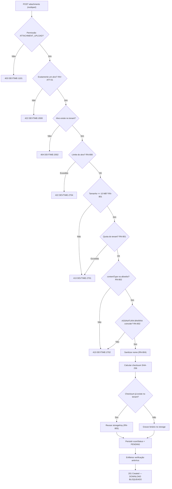
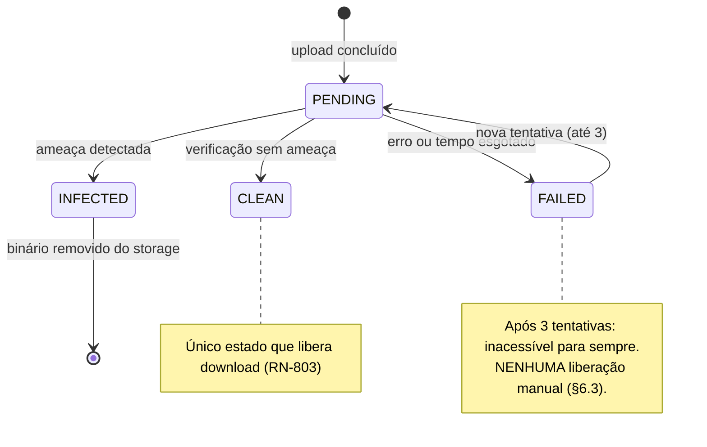
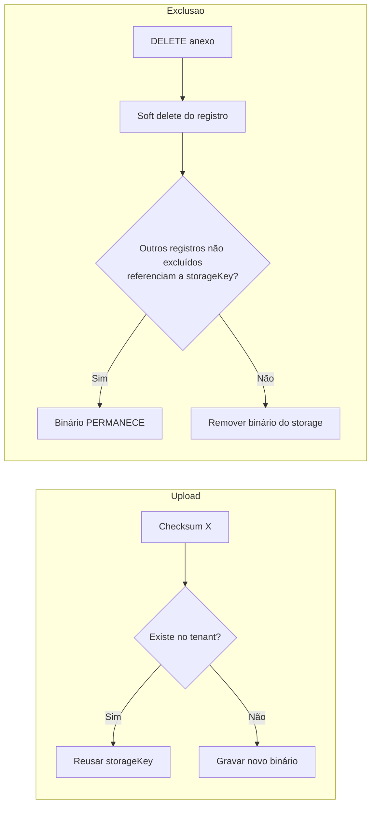

# 015 — Attachments

| Campo | Valor |
|---|---|
| **Feature** | 015 |
| **Épico** | EP-13 (Comentários e Anexos) |
| **Sprint** | S11 |
| **Prioridade** | P2 |
| **Complexidade** | Alta |
| **Estimativa** | 21 pts · 5 dias-agente |
| **Stories** | US-175 a US-179 |
| **Status** | SPEC_APPROVED |

## 1. Objetivo

Permitir o envio de arquivos a tickets e comentários, com validação de tamanho, allowlist de tipos verificada por assinatura binária, verificação antivírus antes de liberar o download, deduplicação por checksum e URL de acesso controlado.

## 2. Problema que resolve

Um ticket frequentemente depende de um artefato: a captura de tela do erro, o documento que o cliente enviou, o log que comprova o problema. Sem anexo, esses arquivos vivem em e-mail e desaparecem do contexto do trabalho.

O risco desta feature é **qualitativamente diferente** de todas as outras: ela é o único ponto em que **conteúdo binário de origem externa** entra no sistema e é redistribuído. §9 de `implementation-order.md` classifica "arquivo malicioso liberado" como risco de **impacto crítico**, com gatilho de acionamento explícito — EICAR liberado para download.

Por isso a complexidade é `Alta` numa feature `P2`: o volume de trabalho é modesto, mas cada camada de defesa é obrigatória. Três controles independentes protegem o download: allowlist de `contentType`, verificação de *magic number* e antivírus (RN-802, RN-803).

## 3. Escopo

| # | Item | Referência |
|---|---|---|
| E-01 | Upload em ticket ou comentário, exclusivamente | INV-ATT-01 |
| E-02 | Limite de 10 MB por arquivo e quota de 1 GB por tenant | RN-801 |
| E-03 | Allowlist de tipos com verificação de assinatura binária | RN-802 |
| E-04 | Download liberado apenas com `scanStatus = CLEAN` | RN-803 |
| E-05 | Sanitização do nome, preservando o original como metadado | RN-804 |
| E-06 | Deduplicação por `checksumSha256` dentro do tenant | RN-805 |
| E-07 | Limite de 20 anexos por ticket e 5 por comentário | RN-806 |
| E-08 | Máquina de estados de verificação com até 3 tentativas | §4.9 `state-machines.md` |
| E-09 | Exclusão lógica com remoção do binário no último referenciador | RN-805 |
| E-10 | Componentes em P19 | `pages.md` |

## 4. Fora do escopo

| Item | Onde está | Motivo |
|---|---|---|
| Comentários | `014-comments` | Entidade própria; anexo pode pertencer a ela |
| Anexos em work log, contrato ou cliente | Fora do roadmap | O artefato pertence à unidade de trabalho |
| Prévia de documento no navegador | Fora do roadmap | Renderizar conteúdo externo amplia a superfície de ataque |
| Edição de imagem ou anotação | Fora do roadmap | Fora do propósito |
| Versionamento de arquivo | Fora do roadmap | Um novo anexo substitui na prática |
| Anexo em relatório exportado | `012-reports` | Relatório é documento próprio |
| Quota por plano | F6 | `future/018-subscriptions`; o MVP usa o limite fixo de RN-801 |
| Compartilhamento externo por link público | Fora do roadmap | Contradiz o controle de acesso |

## 5. Dependências

### 5.1 Features
| Feature | Tipo | O que consome |
|---|---|---|
| `014-comments` | **Bloqueante** | `CommentService.existsForComment` — o alvo mais simples para validar o upload (§9 de `implementation-order.md`) |
| `007-tickets` | Bloqueante | Ticket como alvo alternativo |
| `002-users` | Bloqueante | `uploadedBy`; quota por tenant |
| `013-notifications` | Consumidora | Notificação de arquivo infectado |

### 5.2 Documentos obrigatórios
| Documento | Seções relevantes |
|---|---|
| `docs/04-api/tickets.md` | §11 (anexos) |
| `docs/02-domain/entities.md` | §6.17 Attachment |
| `docs/02-domain/business-rules.md` | RN-801 a RN-806 |
| `docs/02-domain/state-machines.md` | §4.9 Attachment |
| `docs/02-domain/permissions.md` | §6.8, §7, OWN-07 |
| `docs/03-architecture/integrations.md` | Object storage e verificador antivírus |
| `docs/03-architecture/security.md` | Tratamento de upload |

### 5.3 Infraestrutura
| Componente | Uso |
|---|---|
| PostgreSQL | `attachments` |
| Object storage | Binários, com acesso **privado** e URL assinada |
| **Verificador antivírus** | Obrigatório; sem ele nenhum download é liberado |
| Fila assíncrona | Enfileiramento da verificação |

## 6. Regras de negócio

| ID | Tipo | Enunciado resumido | Erro | Onde é aplicada |
|---|---|---|---|---|
| RN-801 | Bloqueante | Máximo de 10 MB por arquivo; quota de 1 GB por tenant no plano gratuito | `DEVTIME-2701` / 413 | `UploadValidator` |
| RN-802 | Bloqueante | Allowlist de tipos; `contentType` declarado deve coincidir com o *magic number* | `DEVTIME-2702` / 415 | `MagicNumberValidator` |
| RN-803 | Bloqueante | Download só com `CLEAN`; `PENDING` retorna `409`; `INFECTED` retorna `403` e o binário é removido | `DEVTIME-2703` / 409 | `DownloadGuard` |
| RN-804 | Automática | Nome sanitizado (sem *path traversal* nem caracteres de controle); original preservado como metadado | — | `FileNameSanitizer` |
| RN-805 | Automática | Arquivos idênticos por `checksumSha256` no tenant compartilham `storageKey`; a exclusão do último referenciador remove o binário | — | `DeduplicationPolicy` |
| RN-806 | Bloqueante | Máximo de 20 anexos por ticket e 5 por comentário | `DEVTIME-2704` / 422 | `AttachmentLimitPolicy` |
| RN-003 | Automática | Exclusão é lógica | — | `AttachmentService.delete` |
| RN-011 | Bloqueante | `fileName`, `contentType`, `sizeBytes`, `storageKey`, `checksumSha256` e `uploadedBy` são imutáveis | `DEVTIME-2003` / 422 | Ausência de rota de edição |
| RN-012 | Bloqueante | Listagem paginada | `DEVTIME-2006` / 400 | `AttachmentController` |
| RN-001 / RN-002 | Bloqueante | Tenant do usuário; recurso externo retorna `404` | `DEVTIME-1200` / `2002` | Filtro automático |
| RN-006 | Automática | Toda alteração gera `AuditLog` na mesma transação | — | Todas |

### 6.1 Ordem de aplicação — upload

A ordem é **normativa** e determina a defesa em profundidade.

| # | Verificação | Falha |
|---|---|---|
| 1 | Permissão `ATTACHMENT_UPLOAD` | `403 DEVTIME-1101` |
| 2 | Exatamente um alvo informado: ticket **ou** comentário (INV-ATT-01) | `422 DEVTIME-2000` |
| 3 | Alvo existe no tenant | `404 DEVTIME-2002` |
| 4 | Limite de anexos no alvo (RN-806) | `422 DEVTIME-2704` |
| 5 | `sizeBytes ≤ 10 MB` (RN-801) | `413 DEVTIME-2701` |
| 6 | Quota do tenant não excedida (RN-801) | `413 DEVTIME-2701` |
| 7 | `contentType` declarado está na allowlist (RN-802) | `415 DEVTIME-2702` |
| 8 | **Assinatura binária coincide com o `contentType`** (RN-802) | `415 DEVTIME-2702` |
| 9 | Sanitizar o nome; preservar o original (RN-804) | — |
| 10 | Calcular `checksumSha256` | — |
| 11 | Se o checksum já existe no tenant, reusar a `storageKey` (RN-805) | — |
| 12 | Caso contrário, gravar o binário no storage | — |
| 13 | Persistir com `scanStatus = PENDING` | — |
| 14 | Enfileirar a verificação antivírus | — |
| 15 | `201 Created` — **download ainda bloqueado** (RN-803) | — |

**Por que o tamanho (5) precede a verificação de tipo (7 e 8):** um arquivo de 500 MB deve ser rejeitado antes de qualquer leitura de conteúdo. Ler os primeiros bytes de um upload que será descartado por tamanho desperdiça banda e abre caminho para exaustão de recursos.

**Por que a assinatura binária (8) é separada da allowlist (7):** são defesas independentes. O passo 7 confia no que o cliente **declara**; o passo 8 verifica o que o arquivo **é**. Um executável renomeado para `.pdf` com `contentType: application/pdf` passa em 7 e falha em 8. Sem o passo 8, a allowlist é apenas uma convenção.

**Por que a deduplicação (11) ocorre após a validação:** um arquivo idêntico a um já verificado reusa a `storageKey`, mas o novo registro nasce em `PENDING` de todo modo — ver OB-03.

### 6.2 Allowlist e assinaturas (RN-802)

| Categoria | `contentType` | Assinatura verificada |
|---|---|---|
| Imagem | `image/png` | `89 50 4E 47 0D 0A 1A 0A` |
| Imagem | `image/jpeg` | `FF D8 FF` |
| Imagem | `image/gif` | `47 49 46 38` |
| Imagem | `image/webp` | `52 49 46 46` + `57 45 42 50` no offset 8 |
| Documento | `application/pdf` | `25 50 44 46` |
| Texto | `text/plain` | Sem assinatura — ver nota |
| Texto | `text/csv` | Sem assinatura — ver nota |
| Compactado | `application/zip` | `50 4B 03 04` |
| Office | `.docx`, `.xlsx`, `.pptx` | `50 4B 03 04` (contêiner ZIP) + verificação do manifesto interno |

> **Sobre tipos sem assinatura.** `text/plain` e `text/csv` não possuem *magic number*. Para eles, a verificação é: (a) ausência de bytes nulos e de sequências de controle típicas de binário nos primeiros 8 KB; (b) decodificação válida em UTF-8. Um executável enviado como `text/plain` falha em (a). Esta é a categoria mais fraca da allowlist, e é justamente por isso que o antivírus (RN-803) é a defesa que não pode ser dispensada.
>
> **Sobre documentos Office e ZIP.** São contêineres ZIP e compartilham a mesma assinatura. A verificação adicional lê o manifesto interno (`[Content_Types].xml` nos formatos Office) para distinguir um `.docx` legítimo de um ZIP renomeado. Um ZIP declarado como `application/zip` é aceito sem essa verificação — e é o vetor mais provável de conteúdo malicioso, coberto pelo antivírus.

### 6.3 Estados de verificação (§4.9 `state-machines.md`)

| Estado | Download | Efeito de entrada |
|---|:--:|---|
| `PENDING` | ❌ `409` | Verificação enfileirada |
| `CLEAN` | ✅ | Download liberado |
| `INFECTED` | ❌ `403` | **Binário removido do storage**; quem enviou é notificado; evento de segurança registrado |
| `FAILED` | ❌ `409` | Reprocessa até 3 vezes; depois permanece `FAILED` e o download continua bloqueado |

**Consequência de `FAILED`:** um arquivo cuja verificação falhou três vezes é **inacessível para sempre**. Não há caminho de liberação manual. É deliberado: liberar um arquivo não verificado por decisão administrativa converteria três camadas de defesa em uma caixa de diálogo. O usuário reenvia o arquivo.

### 6.4 Deduplicação (RN-805)

| # | Passo | Regra |
|---|---|---|
| 1 | Calcular `checksumSha256` do conteúdo | — |
| 2 | Buscar anexo não excluído do **mesmo tenant** com o mesmo checksum | Nunca entre tenants |
| 3 | Encontrado: reusar a `storageKey`; **não** gravar o binário novamente | Economia de storage |
| 4 | Não encontrado: gravar e gerar nova `storageKey` | — |
| 5 | Na exclusão, contar quantos registros não excluídos referenciam a `storageKey` | — |
| 6 | Se for o último, remover o binário do storage | RN-805 |

**Por que a deduplicação é restrita ao tenant (passo 2):** compartilhar binário entre tenants criaria um canal de inferência — o tempo de upload revelaria que outro tenant possui o mesmo arquivo. O ganho de storage não compensa o vazamento.

### 6.5 Invariantes envolvidas
| ID | Invariante | Como é garantida |
|---|---|---|
| INV-ATT-01 | Exatamente um de `ticketId`/`commentId` é não nulo | `CHECK` no banco + validação no passo 2 |
| INV-ATT-02 | Download só com `scanStatus = CLEAN` | `DownloadGuard` (RN-803) |
| INV-ATT-03 | `contentType` coincide com a assinatura binária | `MagicNumberValidator` (passo 8) |
| INV-ATT-04 | `fileName` sanitizado; original em metadado | `FileNameSanitizer` |
| INV-ATT-05 | Nenhum binário órfão no storage | Contagem de referências no passo 6 |
| INV-ATT-06 | `INFECTED` ⇒ binário ausente do storage | Efeito de entrada em `INFECTED` |

## 7. Fluxo principal

1. Usuário com `ATTACHMENT_UPLOAD` arrasta um arquivo em P19, em um ticket ou comentário.
2. O front valida tamanho e extensão localmente (FM-02) e exibe o progresso.
3. Envia `POST /api/v1/tickets/{id}/attachments` como *multipart*.
4. `AttachmentService` aplica a ordem da §6.1 integralmente.
5. `MagicNumberValidator` lê os primeiros bytes e compara com a assinatura do `contentType` declarado.
6. `FileNameSanitizer` remove *path traversal* e caracteres de controle; o nome original vai para metadado.
7. `DeduplicationPolicy` calcula o checksum e reusa a `storageKey` se o conteúdo já existir no tenant.
8. Persiste com `scanStatus = PENDING` e enfileira a verificação.
9. Retorna `201` — a UI indica "verificando", e o **download permanece bloqueado**.
10. O verificador processa e atualiza para `CLEAN`, `INFECTED` ou `FAILED`.
11. Em `CLEAN`, o download é liberado por URL assinada.
12. Em `INFECTED`, o binário é removido, quem enviou é notificado e um evento de segurança é registrado.

## 8. Fluxos alternativos

| # | Fluxo | Gatilho | Comportamento |
|---|---|---|---|
| FA-01 | Upload em comentário | `POST /comments/{id}/attachments` | Limite de 5 (RN-806) |
| FA-02 | Arquivo idêntico já enviado | Mesmo checksum no tenant | `storageKey` reusada; registro novo em `PENDING` |
| FA-03 | Download durante a verificação | `PENDING` | `409 DEVTIME-2703`; a UI indica que a verificação está em curso |
| FA-04 | Download de arquivo infectado | `INFECTED` | `403`; o binário já foi removido |
| FA-05 | Download após falha de verificação | `FAILED` | `409`; **nenhuma** liberação manual (§6.3) |
| FA-06 | Extensão renomeada | `.exe` como `.pdf` | `415 DEVTIME-2702` no passo 8 |
| FA-07 | Nome com *path traversal* | `../../etc/passwd` | Sanitizado; original preservado como metadado |
| FA-08 | Arquivo acima de 10 MB | — | `413 DEVTIME-2701` antes de qualquer leitura de conteúdo |
| FA-09 | Quota do tenant excedida | Soma acima de 1 GB | `413 DEVTIME-2701` informando o consumo atual |
| FA-10 | 21º anexo no ticket | — | `422 DEVTIME-2704` |
| FA-11 | Exclusão de anexo | P19 | Soft delete; binário removido se for o último referenciador |
| FA-12 | Exclusão do último referenciador de conteúdo compartilhado | — | Binário removido; os demais registros permanecem íntegros |
| FA-13 | Exclusão pelo autor | P19 | `ATTACHMENT_DELETE_OWN` (OWN-07) |
| FA-14 | Exclusão por gestor | P19 | `ATTACHMENT_DELETE_ANY` |
| FA-15 | Falha do verificador | Erro ou tempo esgotado | `FAILED`; até 3 tentativas (§4.9) |
| FA-16 | Comentário excluído com anexos | `014` | Anexos seguem em soft delete lógico |
| FA-17 | Upload sem alvo ou com dois alvos | Payload inválido | `422 DEVTIME-2000` |

## 9. Diagramas

### 9.1 Ordem de validação do upload (§6.1)

### 9.2 Máquina de estados de verificação (§4.9)

### 9.3 Deduplicação e remoção do binário (RN-805)

## 10. Estados

| Estado | Significado | Operações permitidas | Bloqueadas |
|---|---|---|---|
| `PENDING` | Verificação em curso | Consultar metadados, excluir | **Download** (`409`) |
| `CLEAN` | Verificado sem ameaça | Consultar, **baixar**, excluir | — |
| `INFECTED` | Ameaça detectada; binário removido | Consultar metadados, excluir | Download (`403`) |
| `FAILED` | Três tentativas esgotadas | Consultar metadados, excluir | Download (`409`), permanentemente |
| Excluído | Soft delete | — | Todas |

## 11. Transições

| Origem | Destino | Gatilho | Guarda | Efeito | Permissão |
|---|---|---|---|---|---|
| — | `PENDING` | Upload | §6.1 integral | Binário gravado ou reusado; verificação enfileirada | `ATTACHMENT_UPLOAD` |
| `PENDING` | `CLEAN` | Verificação sem ameaça | — | Download liberado | Sistema |
| `PENDING` | `INFECTED` | Ameaça detectada | — | **Binário removido**; quem enviou notificado; evento de segurança | Sistema |
| `PENDING` | `FAILED` | Erro ou tempo esgotado | — | Reprocessa até 3 vezes | Sistema |
| `FAILED` | `PENDING` | Nova tentativa | `attemptCount < 3` | — | Sistema |
| Qualquer | Excluído | Exclusão | Autor (OWN-07) ou `ATTACHMENT_DELETE_ANY` | Soft delete; binário removido se último referenciador | `ATTACHMENT_DELETE_*` |

### 11.1 Transições proibidas
| Transição | Motivo da proibição |
|---|---|
| `INFECTED` → qualquer | O binário já foi removido; não há o que verificar novamente |
| `FAILED` → `CLEAN` por decisão manual | §6.3. Converteria três camadas de defesa em uma caixa de diálogo |
| Quarta tentativa de verificação | §4.9; três falhas indicam problema que nova tentativa não resolve |
| Download em `PENDING`, `INFECTED` ou `FAILED` | RN-803, INV-ATT-02 |
| Alterar `fileName`, `contentType`, `sizeBytes`, `storageKey`, `checksumSha256` ou `uploadedBy` | RN-011. Alterar o `contentType` após a verificação permitiria burlar a validação de assinatura |
| Anexo com dois alvos, ou nenhum | INV-ATT-01 |
| Deduplicação entre tenants | §6.4; criaria canal de inferência |
| Remover binário com outros referenciadores | INV-ATT-05; quebraria os demais registros |
| Gravar binário antes de validar a assinatura | Colocaria conteúdo não verificado no storage |
| Excluir fisicamente o registro | RN-003 |

## 12. Casos de erro

| Código | HTTP | Situação | Mensagem ao usuário | Regra |
|---|:--:|---|---|---|
| `DEVTIME-1101` | 403 | Sem permissão, ou exclusão sem ownership | Você não tem permissão para esta ação | OWN-07 |
| `DEVTIME-2002` | 404 | Alvo ou anexo de outro tenant | Recurso não encontrado | RN-002 |
| `DEVTIME-2000` | 422 | Nenhum alvo ou dois alvos informados | Informe exatamente um destino para o anexo | INV-ATT-01 |
| `DEVTIME-2003` | 422 | Alteração de campo imutável | Este campo não pode ser alterado | RN-011 |
| `DEVTIME-2006` | 400 | `size` acima do limite | Tamanho de página inválido | RN-012 |
| `DEVTIME-2701` | **413** | Arquivo acima de 10 MB, ou quota excedida | Arquivo excede o tamanho máximo | RN-801 |
| `DEVTIME-2702` | **415** | Tipo fora da allowlist, ou assinatura divergente | Tipo de arquivo não permitido | RN-802 |
| `DEVTIME-2703` | **409** | Download em `PENDING` ou `FAILED` | Arquivo em verificação de segurança | RN-803 |
| `DEVTIME-2703` | **403** | Download em `INFECTED` | Arquivo bloqueado por segurança | RN-803 |
| `DEVTIME-2704` | 422 | Limite de anexos no alvo | Máximo de anexos atingido | RN-806 |
| `DEVTIME-1201` | 403 | Escrita em tenant suspenso | Organização suspensa: apenas leitura | RN-007 |

### 12.1 Casos extremos

| # | Caso | Comportamento esperado |
|---|---|---|
| CX-01 | Arquivo de exatamente 10 MB | Aceito; 10 MB + 1 byte rejeitado |
| CX-02 | Arquivo de 0 byte | Rejeitado — nenhuma assinatura corresponde |
| CX-03 | Executável renomeado para `.pdf` com `contentType` de PDF | `415` no passo 8 (assinatura) |
| CX-04 | PDF válido declarado como `image/png` | `415` — a assinatura não corresponde ao declarado |
| CX-05 | ZIP renomeado para `.docx` | `415` — o manifesto interno não corresponde |
| CX-06 | ZIP legítimo com conteúdo malicioso | Aceito pela allowlist; **bloqueado pelo antivírus** |
| CX-07 | `text/plain` com bytes nulos | `415` — heurística de binário (§6.2) |
| CX-08 | Nome `../../etc/passwd` | Sanitizado para nome seguro; original em metadado |
| CX-09 | Nome com 300 caracteres | Truncado ao limite de 255, preservando a extensão |
| CX-10 | Nome com emoji | Preservado; não é caractere de controle |
| CX-11 | Dois uploads do mesmo arquivo | `storageKey` reusada; dois registros distintos, ambos em `PENDING` |
| CX-12 | Exclusão de um de dois registros que compartilham binário | Binário **permanece**; o outro registro continua baixável |
| CX-13 | Exclusão do último referenciador | Binário removido do storage |
| CX-14 | Arquivo idêntico a um `INFECTED` | O binário não existe mais; um novo upload grava novamente e é verificado de novo |
| CX-15 | Download durante a verificação | `409 DEVTIME-2703` |
| CX-16 | Arquivo `FAILED` após 3 tentativas | Inacessível permanentemente; o usuário reenvia |
| CX-17 | Quota atingida com 1 GB exato | Próximo upload rejeitado |
| CX-18 | Quota liberada por exclusão | Novo upload aceito; a quota considera apenas registros não excluídos e binários presentes |
| CX-19 | 20 anexos no ticket e 5 no comentário do mesmo ticket | Ambos permitidos — os limites são por **alvo**, independentes |
| CX-20 | Verificador indisponível por horas | Anexos acumulam em `PENDING`; nenhum download liberado; processados ao restabelecer |
| CX-21 | Upload concorrente do 20º e 21º anexo | Um aceito, outro `422`; nunca 21 |
| CX-22 | Arquivo EICAR de teste | Detectado como `INFECTED`; binário removido; **este é o gatilho de acionamento do risco** (§9 de `implementation-order.md`) |

## 13. Modelo de dados

### 13.1 Entidades impactadas
| Entidade | Operação | Tabela | Referência |
|---|---|---|---|
| `Attachment` | Cria, lê, atualiza `scanStatus`, soft delete | `attachments` | §6.17 |
| `Ticket` | Lê (alvo e contagem) | `tickets` | Via `TicketService` |
| `Comment` | Lê (alvo e contagem) | `comments` | Via `CommentService` |
| `AuditLog` | Cria | `audit_logs` | §6.20 |

### 13.2 Campos obrigatórios na criação
| Campo | Tipo | Origem | Imutável | Validação |
|---|---|---|:--:|---|
| `tenantId` | UUID | `TenantContext` | ✔ 🔒 | Nunca da requisição |
| `ticketId` | UUID | Path ou nulo | ✔ 🔒 | Exclusivo com `commentId` (INV-ATT-01) |
| `commentId` | UUID | Path ou nulo | ✔ 🔒 | Idem |
| `fileName` | String(255) | Sanitizado | ✔ 🔒 | RN-804; truncado a 255 |
| `originalFileName` | String(255) | Request | ✔ 🔒 | Metadado; nunca usado como caminho |
| `contentType` | String(120) | Request, **verificado** | ✔ 🔒 | Allowlist + assinatura (RN-802) |
| `sizeBytes` | bigint | Sistema | ✔ 🔒 | ≤ 10 MB (RN-801) |
| `storageKey` | String(500) | Sistema | ✔ 🔒 | Nunca derivada do nome do arquivo |
| `checksumSha256` | String(64) | Calculado | ✔ 🔒 | Deduplicação e integridade |
| `scanStatus` | enum | Sistema | ✖ | `PENDING` na criação |
| `attemptCount` | int | Sistema | ✖ | `0`; máximo 3 |
| `uploadedBy` | UUID | Autenticado | ✔ 🔒 | Nunca da requisição |

> **`storageKey` nunca é derivada de `fileName`.** É um identificador opaco gerado pelo sistema. Derivá-la do nome permitiria a um nome malicioso influenciar o caminho no storage — o mesmo vetor que RN-804 sanitiza, reintroduzido pela porta dos fundos.

### 13.3 Migrations
| Migration | Conteúdo | Compatibilidade |
|---|---|---|
| `V038__create_attachments.sql` | `attachments` + `CHECK` de INV-ATT-01 + `CHECK (size_bytes > 0 AND size_bytes <= 10485760)` + `CHECK (attempt_count <= 3)` | Nova tabela |
| `V039__attachment_indexes.sql` | Índices de alvo, checksum, fila de verificação e quota | Índices |

### 13.4 Índices
| Índice | Colunas | Sustenta |
|---|---|---|
| `idx_attachments_ticket` | `(tenant_id, ticket_id)` WHERE `ticket_id IS NOT NULL AND deleted_at IS NULL` | Anexos do ticket e RN-806 |
| `idx_attachments_comment` | `(tenant_id, comment_id)` WHERE `comment_id IS NOT NULL AND deleted_at IS NULL` | Anexos do comentário e RN-806 |
| `idx_attachments_checksum` | `(tenant_id, checksum_sha256)` WHERE `deleted_at IS NULL` | Deduplicação (RN-805) |
| `idx_attachments_storage_key` | `(storage_key)` WHERE `deleted_at IS NULL` | Contagem de referências na exclusão |
| `idx_attachments_scan_queue` | `(scan_status, created_at)` WHERE `scan_status IN ('PENDING','FAILED')` | Fila de verificação |
| `idx_attachments_quota` | `(tenant_id)` INCLUDE `(size_bytes)` WHERE `deleted_at IS NULL` | Quota do tenant — índice coberto |

## 14. Endpoints utilizados

| Método | Rota | Operação | Permissão | Sucesso | Doc |
|---|---|---|---|:--:|---|
| GET | `/api/v1/tickets/{id}/attachments` | Listar do ticket | `ATTACHMENT_VIEW` | 200 | §11 `tickets.md` |
| POST | `/api/v1/tickets/{id}/attachments` | Enviar em ticket | `ATTACHMENT_UPLOAD` | 201 | §11 |
| GET | `/api/v1/comments/{id}/attachments` | Listar do comentário | `ATTACHMENT_VIEW` | 200 | §11 |
| POST | `/api/v1/comments/{id}/attachments` | Enviar em comentário | `ATTACHMENT_UPLOAD` | 201 | §11 |
| GET | `/api/v1/attachments/{id}/download` | Baixar | `ATTACHMENT_VIEW` | 302 / 200 | §11 |
| DELETE | `/api/v1/attachments/{id}` | Excluir | `ATTACHMENT_DELETE_OWN` / `_ANY` | 204 | §11 |

> **Não existe endpoint de atualização.** Todos os campos relevantes são imutáveis (RN-011), e `scanStatus` é alterado apenas pelo verificador. A ausência é a implementação de RN-011 — alterar `contentType` após a verificação permitiria burlar a validação de assinatura.

## 15. Eventos

| Evento | Publicado por | Consumidores | Momento | Efeito |
|---|---|---|---|---|
| `AttachmentUploadedEvent` | `AttachmentService` | `ScanWorker` | Após o commit | Enfileira a verificação |
| `AttachmentScannedEvent` | `ScanWorker` | Métricas | Após o commit | Telemetria |
| **`AttachmentInfectedEvent`** | `ScanWorker` | `013-notifications`, log de segurança | Após o commit | Notifica quem enviou; registra evento de segurança |
| `AttachmentDeletedEvent` | `AttachmentService` | Métricas | Após o commit | Telemetria |

## 16. Permissões

| Operação | Permissão | Papéis | Ownership | Escopo de dados |
|---|---|---|---|---|
| Listar e consultar metadados | `ATTACHMENT_VIEW` | Todos os 5 papéis | — | Todo o tenant |
| **Baixar** | `ATTACHMENT_VIEW` | Todos os 5 papéis | — | Apenas `CLEAN` (RN-803) |
| Enviar | `ATTACHMENT_UPLOAD` | OWNER, ADMIN, MANAGER, MEMBER | — | — |
| Excluir o próprio | `ATTACHMENT_DELETE_OWN` | OWNER, ADMIN, MANAGER, MEMBER | OWN-07 | — |
| Excluir qualquer | `ATTACHMENT_DELETE_ANY` | OWNER, ADMIN, MANAGER | — | Moderação |
| Atualizar `scanStatus` | — | Sistema | — | Ignora RBAC (CE-P-08) |

> **`VIEWER` baixa mas não envia.** Coerente com o papel: o contador precisa acessar o documento que o cliente enviou; não precisa enviar nada.
>
> **OWN-07:** o anexo pertence a `uploadedBy`. Diferentemente de comentários, **não** há janela temporal — o autor exclui a qualquer momento.

## 17. Validações

### 17.1 Camada 1 — Formato (`400`)
| Campo | Restrição | Mensagem |
|---|---|---|
| arquivo | *multipart* presente e não vazio | Selecione um arquivo |
| `contentType` | Declarado no *multipart* | Tipo de arquivo não informado |
| `originalFileName` | `@Size(max=255)` | Nome de arquivo muito longo |
| `size` | `@Max(100)` | Tamanho de página inválido |

### 17.2 Camada 2 — Negócio
| Validação | Regra | Erro |
|---|---|---|
| Exatamente um alvo | INV-ATT-01 | `DEVTIME-2000` / 422 |
| Limite de anexos no alvo | RN-806 | `DEVTIME-2704` / 422 |
| Tamanho ≤ 10 MB | RN-801 | `DEVTIME-2701` / 413 |
| Quota do tenant | RN-801 | `DEVTIME-2701` / 413 |
| `contentType` na allowlist | RN-802 | `DEVTIME-2702` / 415 |
| **Assinatura binária coincidente** | RN-802 | `DEVTIME-2702` / 415 |
| Download apenas com `CLEAN` | RN-803 | `DEVTIME-2703` / 409 ou 403 |
| Ownership na exclusão | OWN-07 | `DEVTIME-1101` / 403 |

### 17.3 Camada 3 — Consistência
| Constraint | Garante | Mapeado para |
|---|---|---|
| `CHECK ((ticket_id IS NULL) <> (comment_id IS NULL))` | INV-ATT-01 | `DEVTIME-2000` |
| `CHECK (size_bytes > 0 AND size_bytes <= 10485760)` | RN-801 | `DEVTIME-2701` |
| `CHECK (attempt_count <= 3)` | §4.9 | `DEVTIME-9002` |
| FK `attachments.ticket_id` → `tickets.id` | Alvo válido | `DEVTIME-2002` |
| FK `attachments.comment_id` → `comments.id` | Idem | `DEVTIME-2002` |

## 18. Auditoria

| Ação | `action` | `beforeState` | `afterState` | Metadata |
|---|---|---|---|---|
| Upload | `ATTACHMENT_UPLOADED` | — | `{fileName, contentType, sizeBytes, checksum, deduplicated}` | IP, traceId |
| Verificado limpo | `ATTACHMENT_SCAN_CLEAN` | `{scanStatus}` | `{scanStatus}` | Duração, `actorType = SYSTEM` |
| **Infectado** | `ATTACHMENT_SCAN_INFECTED` | `{scanStatus}` | `{scanStatus}` | **Ameaça identificada**, quem enviou, IP do upload, `actorType = SYSTEM` |
| Falha de verificação | `ATTACHMENT_SCAN_FAILED` | `{scanStatus, attemptCount}` | `{scanStatus, attemptCount}` | Causa, `actorType = SYSTEM` |
| **Download** | `ATTACHMENT_DOWNLOADED` | — | — | Quem baixou, IP, traceId |
| Exclusão | `ATTACHMENT_DELETED` | `{fileName, scanStatus}` | `{deletedAt}` | Se o binário foi removido, IP, traceId |

> **Download é auditado**, como em `012-reports`: é o momento em que conteúdo binário sai do sistema.
>
> **`ATTACHMENT_SCAN_INFECTED` registra a ameaça identificada e o IP do upload.** É o único registro de uma tentativa de introduzir arquivo malicioso, e a base de qualquer investigação de segurança.

## 19. Segurança

> Esta é a seção mais crítica da feature. §9 de `implementation-order.md` classifica "arquivo malicioso liberado" com impacto **crítico**.

| # | Vetor | Mitigação | Verificação |
|---|---|---|---|
| SG-01 | **Executável renomeado** | Verificação de assinatura binária, independente da allowlist (passo 8) | Teste com `.exe` renomeado |
| SG-02 | **Arquivo malicioso em tipo permitido** | Antivírus obrigatório; nenhum download sem `CLEAN` | **Teste com EICAR** |
| SG-03 | ZIP com conteúdo malicioso | Antivírus; ZIP é o vetor mais provável (CX-06) | Teste com EICAR em ZIP |
| SG-04 | *Path traversal* no nome | `FileNameSanitizer`; `storageKey` **nunca** derivada do nome | Teste com `../../` |
| SG-05 | `storageKey` influenciada por entrada do usuário | Identificador opaco gerado pelo sistema (§13.2) | Inspeção de código |
| SG-06 | Anexo de outro tenant | Filtro automático; `404` | Suíte de isolamento |
| SG-07 | Deduplicação vazando entre tenants | Busca restrita ao tenant (§6.4) | Teste com mesmo arquivo em dois tenants |
| SG-08 | URL de download compartilhada indefinidamente | URL assinada com expiração curta; storage **privado** | Teste após a expiração |
| SG-09 | Liberação manual de arquivo não verificado | **Nenhum** caminho existe (§6.3) | Inspeção de rotas e código |
| SG-10 | `contentType` alterado após a verificação | Campo imutável; **nenhuma** rota de atualização | Inspeção de rotas |
| SG-11 | Exaustão por upload em massa | Limite por arquivo, por alvo e quota por tenant | Teste de carga |
| SG-12 | Binário permanecendo após `INFECTED` | Remoção como efeito de entrada; verificado por teste | Teste de acesso direto ao storage |
| SG-13 | XSS por nome de arquivo na UI | Escape na renderização | Teste com payload |
| SG-14 | Bomba de descompressão em ZIP | Antivírus; sem descompressão pela aplicação | Teste |
| SG-15 | Enumeração de anexos por id | `404` para outro tenant | Teste |

### 19.1 LGPD

| Dado pessoal | Base legal | Retenção | Exportação | Anonimização | Proibido em log |
|---|---|---|---|---|---|
| `uploadedBy` | Execução de contrato | Vida do tenant | ✔ | `Usuário Removido` na exibição | Permitido (é UUID) |
| `originalFileName` | Legítimo interesse | Idem | ✔ | Não se aplica | ❌ em log |
| **Conteúdo do arquivo** | Legítimo interesse | Vida do tenant | ✔ | **Não inspecionável** | ❌ |

**Análise.** O conteúdo de um anexo é **opaco ao sistema**: pode ser um documento com dados de terceiros, uma captura de tela com informação pessoal, um contrato assinado. O sistema não inspeciona nem classifica.

Cinco consequências:

1. **O storage é privado.** Nenhum objeto é público; todo acesso passa por URL assinada com expiração curta.
2. **Todo download é auditado** (§18) — é a única forma de responder quem acessou o quê.
3. **A exclusão remove o binário** quando não há mais referências (RN-805). Diferentemente de outras entidades, aqui o soft delete não é suficiente: manter o binário acessível por `storageKey` após a exclusão lógica manteria o dado disponível.
4. **`INFECTED` remove o binário imediatamente**, sem esperar exclusão pelo usuário.
5. **O nome do arquivo nunca entra em log.** É texto livre e pode conter dado pessoal — `contrato-joao-silva.pdf` é um exemplo trivial.

## 20. Performance

| Operação | Meta | Índice/estratégia | Risco |
|---|---|---|---|
| Upload de 10 MB | p95 < 5 s | Fluxo direto ao storage; assinatura lida dos primeiros bytes | Banda do cliente |
| Verificação de assinatura | < 50 ms | Leitura dos primeiros 8 KB apenas | — |
| Cálculo do checksum | < 500 ms para 10 MB | Fluxo, sem carregar o arquivo em memória | — |
| Verificação de quota | < 50 ms | `idx_attachments_quota` **coberto** | Tenant com muitos anexos |
| Deduplicação | < 50 ms | `idx_attachments_checksum` | — |
| Listagem por alvo | p95 < 150 ms | Índices parciais por alvo | — |
| Download | p95 < 200 ms | Redirecionamento para URL assinada; o binário não passa pela aplicação | — |
| Verificação antivírus | Assíncrona | Fila com até 3 tentativas | Verificador lento |
| Contagem de referências na exclusão | < 50 ms | `idx_attachments_storage_key` | — |

### 20.1 Escalabilidade

`attachments` é uma tabela pequena — dezenas por ticket, no máximo. O volume está no **storage**, não no banco.

**O checksum e a assinatura são calculados em fluxo**, sem carregar o arquivo em memória. Um upload de 10 MB carregado integralmente seria viável; com uploads concorrentes, não. É o mesmo princípio de escrita em fluxo de `012-reports` (OB-06 daquela spec): a alternativa não é lenta, **falha**.

**O binário nunca passa pela aplicação no download.** O endpoint retorna redirecionamento para URL assinada, e o cliente busca direto no storage. Servir o arquivo pela aplicação consumiria banda e memória proporcionais ao tráfego de download.

A **quota** usa índice coberto com `INCLUDE (size_bytes)`, resolvendo a soma sem tocar na tabela. Sem isso, cada upload somaria todos os anexos do tenant.

A **verificação é assíncrona** e não bloqueia o upload. A consequência aceita é que o arquivo fica indisponível por alguns segundos após o envio — e a UI comunica isso explicitamente. Verificar de forma síncrona faria o tempo de upload depender do verificador.

## 21. Componentes Frontend

### 21.1 Rotas
| Rota | Componente | Guard | Lazy | Tela |
|---|---|---|:--:|---|
| — | `dt-attachment-list` | — | ✖ | Componente de P19, sem rota própria |

### 21.2 Componentes
| Componente | Tipo | Responsabilidade | Inputs | Outputs |
|---|---|---|---|---|
| `dt-attachment-list` | Presentational | Anexos com estado de verificação e ações | `attachments`, `canUpload`, `canDelete` | `upload`, `download`, `delete` |
| `dt-attachment-upload` | Shared | Arrastar e soltar, com validação local e progresso | `target`, `maxCount` | `uploaded`, `error` |
| `dt-attachment-item` | Presentational | Nome, tamanho, tipo e **estado de verificação** | `attachment` | `download`, `delete` |
| `dt-scan-status-badge` | Shared | Selo por `scanStatus`, com explicação do que significa | `scanStatus` | — |
| `dt-attachment-blocked` | Presentational | Explica por que o download está bloqueado, por estado | `scanStatus` | — |
| `dt-quota-indicator` | Presentational | Consumo da quota do tenant | `usedBytes`, `limitBytes` | — |

> `dt-scan-status-badge` e `dt-attachment-blocked` são obrigatórios, não decorativos. Um botão de download desabilitado sem explicação faz o usuário acreditar que o sistema está com defeito. Ele precisa saber que o arquivo está **em verificação** (aguarde), **infectado** (foi bloqueado) ou **com falha de verificação** (reenvie).

### 21.3 Stores e serviços Angular
| Artefato | Tipo | Estado exposto | Escopo |
|---|---|---|---|
| `AttachmentStore` | Store | `attachments`, `uploading`, `progress`, `quota` | Provido em P19 |
| `AttachmentApi` | API | Somente HTTP dos 6 endpoints | `providedIn: 'root'` |

> O store faz *polling* de anexos em `PENDING`, com intervalo de 3 s e limite de 2 minutos — mesma estratégia de `012-reports` para exportações, e pelo mesmo motivo: o usuário está esperando um resultado assíncrono de curta duração.

### 21.4 Guards, interceptors, pipes e directives
| Artefato | Tipo | Uso |
|---|---|---|
| `hasPermission` | Directive | Oculta enviar e excluir |
| `fileSizePipe` | Pipe | Bytes em unidade legível |
| `fileIconPipe` | Pipe | Ícone por `contentType` |
| `uploadInterceptor` | Interceptor | Progresso de upload |

## 22. Serviços Backend

### 22.1 Controllers
| Classe | Rota base | Endpoints |
|---|---|---|
| `TicketAttachmentController` | `/api/v1/tickets/{id}/attachments` | listar, enviar |
| `CommentAttachmentController` | `/api/v1/comments/{id}/attachments` | listar, enviar |
| `AttachmentController` | `/api/v1/attachments/{id}` | baixar, excluir |

### 22.2 Services
| Interface | Implementação | Responsabilidade | Permissão declarada |
|---|---|---|---|
| `AttachmentService` | `AttachmentServiceImpl` | Upload na ordem da §6.1; exclusão com contagem de referências | `ATTACHMENT_*` |
| `AttachmentDownloadService` | `AttachmentDownloadServiceImpl` | `DownloadGuard` e URL assinada | `ATTACHMENT_VIEW` |
| `ScanService` | `ScanServiceImpl` | Integração com o verificador; atualização de `scanStatus` | Sistema |
| `QuotaService` | `QuotaServiceImpl` | Consumo e limite por tenant | `ATTACHMENT_VIEW` |

### 22.3 Componentes de domínio
| Classe | Tipo | Responsabilidade | Regras |
|---|---|---|---|
| `UploadValidator` | Validator | Tamanho e quota | RN-801 |
| **`MagicNumberValidator`** | Validator | Assinatura binária × `contentType` declarado | RN-802, INV-ATT-03 |
| `FileNameSanitizer` | Utilitário | *Path traversal*, caracteres de controle, truncamento | RN-804, INV-ATT-04 |
| `ChecksumCalculator` | Utilitário | SHA-256 em fluxo | RN-805 |
| `DeduplicationPolicy` | Policy | Reuso de `storageKey` no tenant; contagem de referências | RN-805, INV-ATT-05 |
| `AttachmentLimitPolicy` | Policy | 20 por ticket, 5 por comentário | RN-806 |
| `DownloadGuard` | Validator | Somente `CLEAN` | RN-803, INV-ATT-02 |
| `TargetExclusivityValidator` | Validator | Exatamente um alvo | INV-ATT-01 |
| `StorageKeyGenerator` | Generator | Identificador **opaco**, sem influência do nome | SG-05 |

### 22.4 Jobs
| Classe | Cron | Lock | Responsabilidade | Idempotência |
|---|---|---|---|---|
| `ScanWorkerJob` | `*/20 * * * * *` | `scanWorker`, 10m | Processa `PENDING` e reprocessa `FAILED` até 3 tentativas | Lock por anexo; convergente |
| `OrphanBinaryJob` | `0 0 5 * * 0` | `orphanBinary`, 60m | Detecta binários no storage sem registro que os referencie; **alerta**, não remove | Somente leitura |

> `OrphanBinaryJob` **alerta sem remover** (INV-ATT-05). Remover automaticamente um binário que o job julgou órfão apagaria dado do cliente com base numa inferência — e um erro na contagem de referências tornaria a remoção irreversível. O alerta é operacional e a remoção é humana.

## 23. DTOs

| DTO | Direção | Campos principais | Observação |
|---|---|---|---|
| `AttachmentUploadRequest` | Request | arquivo (*multipart*), `contentType` | `storageKey`, `checksum`, `uploadedBy`, `scanStatus` **ausentes** |
| `AttachmentResponse` | Response | `id`, `fileName`, `originalFileName`, `contentType`, `sizeBytes`, `scanStatus`, `uploadedBy`, `createdAt`, `canDownload`, `canDelete` | `storageKey` e `checksum` **nunca** expostos |
| `AttachmentListResponse` | Response | `attachments[]`, `count`, `maxCount` | `maxCount` permite à UI desabilitar o envio |
| `QuotaResponse` | Response | `usedBytes`, `limitBytes`, `percentage` | — |
| `DownloadResponse` | Response | `url`, `expiresAt` | URL assinada |

> `storageKey` e `checksumSha256` **nunca** são expostos. `storageKey` revelaria a estrutura do storage; `checksum` permitiria verificar se um arquivo específico existe no tenant sem tê-lo — canal de inferência análogo ao que §6.4 evita.
>
> `canDownload` é calculado no servidor a partir de `scanStatus`, como `canEdit` em `014`. O cliente não deve reimplementar RN-803.

## 24. Mappers

| Mapper | De → Para | Mapeamentos não triviais |
|---|---|---|
| `AttachmentMapper` | `Attachment` → `AttachmentResponse` | Omite `storageKey` e `checksum`; `canDownload` de `scanStatus`; `canDelete` por ownership; autor removido como `Usuário Removido` |

## 25. Repositories

| Repository | Entidade | Métodos específicos | Índice usado |
|---|---|---|---|
| `AttachmentRepository` | `Attachment` | `findByTicket`, `findByComment`, `countByTarget`, `findByChecksum`, `countByStorageKey`, `sumSizeByTenant`, `findPendingScan` | Todos os seis da §13.4 |

> `sumSizeByTenant` usa o índice coberto de quota. `countByStorageKey` é o que decide se o binário pode ser removido na exclusão (RN-805).

## 26. Entities utilizadas
| Entidade | Origem | Campos relevantes |
|---|---|---|
| `Attachment` | Esta feature | Todos |
| `Ticket` | `007-tickets` | `id` — alvo |
| `Comment` | `014-comments` | `id` — alvo |
| `Tenant` | `002-users` | Quota |

## 27. Validators e Exceptions

| Classe | Tipo | Regra | Código de erro |
|---|---|---|---|
| `UploadValidator` | Validator | RN-801 | `DEVTIME-2701` |
| `MagicNumberValidator` | Validator | RN-802 | `DEVTIME-2702` |
| `AttachmentLimitPolicy` | Validator | RN-806 | `DEVTIME-2704` |
| `DownloadGuard` | Validator | RN-803 | `DEVTIME-2703` |
| `TargetExclusivityValidator` | Validator | INV-ATT-01 | `DEVTIME-2000` |
| `FileTooLargeException` | Exception | RN-801 | `DEVTIME-2701` / 413 |
| `QuotaExceededException` | Exception | RN-801 | `DEVTIME-2701` / 413 |
| `UnsupportedFileTypeException` | Exception | RN-802 | `DEVTIME-2702` / 415 |
| `ContentTypeMismatchException` | Exception | RN-802 | `DEVTIME-2702` / 415 |
| `AttachmentNotScannedException` | Exception | RN-803 | `DEVTIME-2703` / 409 |
| `AttachmentInfectedException` | Exception | RN-803 | `DEVTIME-2703` / 403 |
| `AttachmentLimitExceededException` | Exception | RN-806 | `DEVTIME-2704` / 422 |

## 28. Logs

| Evento | Nível | Campos | Proibido |
|---|---|---|---|
| Upload aceito | INFO | `tenantId`, `userId`, `attachmentId`, `contentType`, `sizeBytes`, `deduplicated` | **`fileName`** e `originalFileName` (§19.1) |
| Tipo rejeitado pela allowlist | INFO | `contentType` declarado | Nome |
| **Assinatura divergente** | **WARN** | `contentType` declarado, assinatura encontrada | Nome, conteúdo |
| Verificado limpo | INFO | `attachmentId`, duração | — |
| **Infectado** | **ERROR** | `attachmentId`, ameaça, `uploadedBy`, IP do upload | Nome, conteúdo |
| Falha de verificação | WARN | `attachmentId`, tentativa, causa | — |
| **Três falhas esgotadas** | **ERROR** | `attachmentId` | — |
| Download | INFO | `attachmentId`, `userId`, IP | Nome |
| Exclusão | INFO | `attachmentId`, se o binário foi removido | Nome |
| Binário órfão detectado | **WARN** | `storageKey` | — |

> **Assinatura divergente é `WARN`, não `INFO`:** é uma tentativa de burlar a allowlist. Pode ser erro de cliente, mas é o padrão de um ataque.
>
> **Infectado é `ERROR` com alerta:** é o evento que RP de `implementation-order.md` §9 identifica como crítico.

## 29. Métricas

| Métrica | Tipo | Tags | Alerta |
|---|---|---|---|
| `attachment.uploaded` | Counter | `contentType`, `deduplicated` | — |
| `attachment.rejected.size` | Counter | — | — |
| `attachment.rejected.type` | Counter | `contentType` | — |
| **`attachment.rejected.signature`** | Counter | `declaredType` | **> 5/dia é alerta** — padrão de tentativa de burla |
| **`attachment.infected`** | Counter | — | **> 0 é alerta crítico** |
| `attachment.scan.duration` | Timer | `sizeBytes` bucket | p95 > 30 s |
| `attachment.scan.failed` | Counter | `attempt` | > 5% das verificações |
| **`attachment.scan.exhausted`** | Counter | — | **> 0 é alerta** — arquivo inacessível para sempre |
| `attachment.download` | Counter | — | — |
| `attachment.download.blocked` | Counter | `scanStatus` | Alto em `PENDING` indica verificador lento |
| `attachment.dedup.ratio` | Gauge | — | Mede a economia de storage |
| `attachment.quota.usage` | Gauge | — | > 80% por tenant justifica aviso |
| `attachment.orphan.detected` | Counter | — | **> 0 é alerta** — contagem de referências com defeito |

## 30. Comportamentos esperados

| # | Comportamento |
|---|---|
| CE-01 | A ordem da §6.1 é seguida integralmente |
| CE-02 | Tamanho é validado antes de qualquer leitura de conteúdo |
| CE-03 | A assinatura binária é verificada independentemente da allowlist |
| CE-04 | O nome é sanitizado e o original preservado como metadado |
| CE-05 | `storageKey` é opaca e nunca derivada do nome |
| CE-06 | Arquivos idênticos no tenant compartilham binário |
| CE-07 | A deduplicação nunca atravessa tenants |
| CE-08 | O download exige `CLEAN`, sem exceção |
| CE-09 | `INFECTED` remove o binário imediatamente |
| CE-10 | Três falhas de verificação tornam o arquivo inacessível permanentemente |
| CE-11 | Não há caminho de liberação manual |
| CE-12 | A exclusão remove o binário apenas no último referenciador |
| CE-13 | Os limites são por alvo e independentes |
| CE-14 | O binário nunca passa pela aplicação no download |
| CE-15 | Checksum e assinatura são calculados em fluxo |
| CE-16 | Todo download é auditado |
| CE-17 | A UI explica por que o download está bloqueado |

## 31. Comportamentos proibidos

| # | Proibição | Motivo |
|---|---|---|
| CP-01 | Liberar download sem `CLEAN` | RN-803, INV-ATT-02 |
| CP-02 | Qualquer caminho de liberação manual | §6.3; converteria três defesas em uma caixa de diálogo |
| CP-03 | Confiar apenas no `contentType` declarado | SG-01; a allocklist sozinha é convenção |
| CP-04 | Gravar o binário antes de validar a assinatura | Colocaria conteúdo não verificado no storage |
| CP-05 | Derivar `storageKey` do nome do arquivo | SG-05; reintroduz o vetor que RN-804 sanitiza |
| CP-06 | Deduplicar entre tenants | §6.4; canal de inferência |
| CP-07 | Expor `storageKey` ou `checksum` | §23; revelaria estrutura e permitiria inferência |
| CP-08 | Manter o binário após `INFECTED` | INV-ATT-06 |
| CP-09 | Remover binário com outros referenciadores | INV-ATT-05 |
| CP-10 | Remover binário órfão automaticamente | Apagaria dado com base em inferência |
| CP-11 | Quarta tentativa de verificação | §4.9 |
| CP-12 | Alterar `contentType` após a verificação | Permitiria burlar a validação de assinatura |
| CP-13 | Criar rota de atualização de anexo | RN-011 |
| CP-14 | Carregar o arquivo inteiro em memória | Falha com uploads concorrentes |
| CP-15 | Servir o binário pela aplicação | Consome banda e memória proporcionais ao download |
| CP-16 | Storage público | §19.1; todo acesso por URL assinada |
| CP-17 | Descomprimir ZIP na aplicação | SG-14; bomba de descompressão |
| CP-18 | Renderizar prévia de documento externo | §4; amplia a superfície de ataque |
| CP-19 | Logar `fileName` ou `originalFileName` | §19.1 |
| CP-20 | Desabilitar download sem explicar | CE-17; usuário acredita ser defeito |
| CP-21 | Acessar `AttachmentRepository` de outra feature | AR-02 |

## 32. Restrições

| # | Restrição | Origem |
|---|---|---|
| RS-01 | 10 MB por arquivo; 1 GB por tenant | RN-801 |
| RS-02 | Allowlist fechada de tipos | RN-802 |
| RS-03 | Antivírus é dependência **obrigatória** | RN-803 |
| RS-04 | 20 anexos por ticket, 5 por comentário | RN-806 |
| RS-05 | Três tentativas de verificação | §4.9 |
| RS-06 | Nenhuma liberação manual | §6.3 |
| RS-07 | Deduplicação restrita ao tenant | §6.4 |
| RS-08 | Sem prévia no navegador | Superfície de ataque |
| RS-09 | Sem versionamento de arquivo | Fora do roadmap |
| RS-10 | Quota fixa; por plano é F6 | `future/018-subscriptions` |

## 33. Critérios de aceite

| # | Critério | Verificação |
|---|---|---|
| CA-01 | A ordem da §6.1 é respeitada, verificada com payload violando várias regras | Teste |
| CA-02 | Arquivo de 10 MB aceito; 10 MB + 1 byte rejeitado com `413` | Teste |
| CA-03 | Tamanho rejeitado **antes** de qualquer leitura de conteúdo | Teste com inspeção |
| CA-04 | Executável renomeado para `.pdf` rejeitado com `415` | Teste |
| CA-05 | Cada tipo da allowlist é aceito com a assinatura correta e rejeitado com a errada | Teste parametrizado nos 9 tipos |
| CA-06 | `text/plain` com bytes nulos rejeitado | Teste |
| CA-07 | ZIP renomeado para `.docx` rejeitado pelo manifesto | Teste |
| CA-08 | **Arquivo EICAR detectado como `INFECTED` e binário removido** | Teste de segurança |
| CA-09 | EICAR dentro de ZIP também detectado | Teste |
| CA-10 | Download em `PENDING` retorna `409`; em `INFECTED`, `403`; em `FAILED`, `409` | Teste |
| CA-11 | Não existe nenhum caminho de liberação manual | Inspeção de rotas e código |
| CA-12 | Nome com `../../` sanitizado; original preservado | Teste |
| CA-13 | `storageKey` não contém nenhuma parte do nome do arquivo | Teste |
| CA-14 | Arquivo idêntico reusa `storageKey`; dois registros distintos | Teste |
| CA-15 | Mesmo arquivo em dois tenants gera dois binários | Teste |
| CA-16 | Exclusão de um de dois referenciadores preserva o binário | Teste |
| CA-17 | Exclusão do último referenciador remove o binário do storage | Teste com acesso direto |
| CA-18 | 21º anexo no ticket e 6º no comentário rejeitados | Teste |
| CA-19 | Quota excedida rejeita com `413` informando o consumo | Teste |
| CA-20 | Três falhas esgotam as tentativas; nenhuma quarta | Teste |
| CA-21 | `storageKey` e `checksum` ausentes de toda resposta | Teste de contrato |
| CA-22 | Upload e checksum em fluxo, sem esgotar memória com uploads concorrentes | Teste de carga |
| CA-23 | Download redireciona para URL assinada; o binário não passa pela aplicação | Teste |
| CA-24 | Todo download é auditado | Teste |
| CA-25 | Nenhum log contém nome de arquivo | Inspeção de log |
| CA-26 | Anexo de outro tenant retorna `404` | Suíte de isolamento |
| CA-27 | Existe teste para cada célula da matriz de permissões desta feature | Relatório |

## 34. Checklist de implementação

- [ ] `V038` com `CHECK` de INV-ATT-01 (`(ticket_id IS NULL) <> (comment_id IS NULL)`), de tamanho e de tentativas
- [ ] `idx_attachments_quota` com `INCLUDE (size_bytes)` — índice coberto
- [ ] Ordem da §6.1 seguida **exatamente**; tamanho antes de leitura de conteúdo
- [ ] `MagicNumberValidator` verifica os 9 tipos da §6.2, com heurística de binário para texto
- [ ] Verificação de manifesto interno para os formatos Office
- [ ] `FileNameSanitizer` remove *path traversal*, caracteres de controle e trunca a 255 preservando a extensão
- [ ] `StorageKeyGenerator` produz identificador **opaco**, sem nenhuma parte do nome (CP-05)
- [ ] `ChecksumCalculator` em **fluxo**, sem carregar o arquivo em memória
- [ ] Binário gravado **após** a validação de assinatura (CP-04)
- [ ] `DeduplicationPolicy` restrita ao tenant (CP-06)
- [ ] `scanStatus = PENDING` na criação; download bloqueado
- [ ] `DownloadGuard` no **service**, não só no controller
- [ ] **Nenhum** caminho de liberação manual (CP-02) — verificado por inspeção
- [ ] `INFECTED` remove o binário como efeito de entrada
- [ ] Exclusão conta referências por `storageKey` antes de remover
- [ ] `OrphanBinaryJob` **alerta sem remover** (CP-10)
- [ ] Máximo de 3 tentativas, garantido por `CHECK`
- [ ] **Nenhuma** rota de atualização de anexo (CP-13)
- [ ] `storageKey` e `checksum` ausentes de todos os DTOs de resposta
- [ ] `canDownload` calculado no servidor a partir de `scanStatus`
- [ ] Download por **redirecionamento** para URL assinada; storage privado
- [ ] `dt-scan-status-badge` e `dt-attachment-blocked` explicam o bloqueio (CP-20)
- [ ] *Polling* de `PENDING` limitado a 2 minutos
- [ ] Nome de arquivo escapado na renderização
- [ ] Nenhum log contém `fileName` nem `originalFileName`
- [ ] `ATTACHMENT_SCAN_INFECTED` registra a ameaça e o IP do upload
- [ ] Nenhum texto fixo nos componentes (ART-095)

## 35. Checklist de revisão

- [ ] Nenhum acesso a `AttachmentRepository` de fora da feature
- [ ] **Teste com EICAR presente e verde** — gatilho de acionamento do risco crítico
- [ ] Assinatura verificada para os 9 tipos, com casos positivos e negativos
- [ ] Nenhum caminho libera download sem `CLEAN`
- [ ] `storageKey` comprovadamente sem influência do nome
- [ ] Deduplicação comprovadamente restrita ao tenant
- [ ] Remoção do binário comprovada por acesso direto ao storage
- [ ] Nenhuma rota de atualização
- [ ] `storageKey` e `checksum` ausentes de toda resposta
- [ ] Cálculo em fluxo comprovado por teste de memória
- [ ] Nenhum log com nome de arquivo
- [ ] Toda `RN-XXX` da §6 possui teste referenciando o ID
- [ ] Cobertura ≥ 90% em validators e services; ≥ 95% em `MagicNumberValidator`

## 36. Checklist de QA

- [ ] Todos os cenários de `acceptance.md` verdes
- [ ] Upload de cada um dos 9 tipos da allowlist
- [ ] Arquivo de 10 MB e de 10 MB + 1 byte
- [ ] Arquivo de 0 byte
- [ ] Executável renomeado para cada extensão da allowlist
- [ ] PDF declarado como PNG
- [ ] ZIP renomeado para `.docx`
- [ ] `.txt` com bytes nulos
- [ ] **Arquivo EICAR, isolado e dentro de ZIP**
- [ ] Download durante a verificação, após infecção e após falha — conferindo a explicação exibida
- [ ] Nome com `../../`, com 300 caracteres e com emoji
- [ ] Mesmo arquivo duas vezes no mesmo ticket
- [ ] Mesmo arquivo em dois tenants
- [ ] Excluir um de dois registros que compartilham binário
- [ ] Excluir o último referenciador e conferir o storage
- [ ] 20 anexos no ticket e tentar o 21º
- [ ] 5 anexos no comentário e tentar o 6º
- [ ] Quota próxima do limite e excedida
- [ ] Verificador indisponível — conferir acúmulo em `PENDING`
- [ ] Como `VIEWER`: baixar sim, enviar não
- [ ] Excluir anexo próprio e de terceiro, por cada papel
- [ ] Nome com `<script>` renderizado como texto
- [ ] Zero violações do axe-core nos componentes
- [ ] Upload e exclusão completos por teclado

## 37. Definition of Done

| # | Item | Referência |
|---|---|---|
| DoD-01 | Todos os critérios da §33 verdes | — |
| DoD-02 | **Teste com EICAR verde**, isolado e em ZIP | §9 `implementation-order.md` |
| DoD-03 | Cobertura ≥ 95% em `MagicNumberValidator`; ≥ 90% em services e validators | CA-08 `backend.md` |
| DoD-04 | Suíte de isolamento verde para os 6 endpoints | CA-03 `architecture.md` |
| DoD-05 | Nenhum caminho de liberação manual, provado por inspeção | CP-02 |
| DoD-06 | Remoção do binário provada por acesso direto ao storage | INV-ATT-05, INV-ATT-06 |
| DoD-07 | `docs/04-api/tickets.md` §11 sincronizado | ART-111 |
| DoD-08 | Zero violações do axe-core nos componentes de P19 | AC-01 |
| DoD-09 | Storage configurado como **privado**, verificado por acesso anônimo | CP-16 |
| DoD-10 | Verificador antivírus operacional em todos os ambientes | RS-03 |

## 38. Riscos

| # | Risco | Prob. | Impacto | Mitigação | Gatilho |
|---|---|:--:|:--:|---|---|
| R-01 | **Arquivo malicioso liberado** | Baixa | **Crítico** | Três defesas independentes: allowlist, assinatura binária, antivírus; **teste com EICAR** obrigatório em DoD | **EICAR liberado para download** |
| R-02 | Verificador indisponível bloqueando todos os downloads | Média | Médio | Estado `PENDING` explícito na UI; até 3 tentativas; alerta em `scan.exhausted` | `download.blocked` alto em `PENDING` |
| R-03 | Pressão para liberar arquivo `FAILED` manualmente | Média | **Alto** | **Nenhum** caminho implementado (CP-02); decisão documentada em OB-02 | Solicitação de exceção |
| R-04 | *Path traversal* pela `storageKey` | Baixa | Alto | `storageKey` opaca; teste de inspeção | Nome influenciando o caminho |
| R-05 | Deduplicação vazando entre tenants | Baixa | Alto | Busca restrita ao tenant; teste com dois tenants | Binário compartilhado entre tenants |
| R-06 | Binário órfão ou removido indevidamente | Média | Médio | Contagem de referências; `OrphanBinaryJob` alerta sem remover | `orphan.detected` > 0 |
| R-07 | Esgotamento de memória em uploads concorrentes | Média | Alto | Cálculo em fluxo; teste de carga concorrente | `OutOfMemory` em produção |
| R-08 | Storage acidentalmente público | Baixa | **Crítico** | Verificação de acesso anônimo em DoD-09 | Objeto acessível sem assinatura |
| R-09 | Quota consumida por deduplicação mal contabilizada | Baixa | Baixo | Quota soma `sizeBytes` de registros não excluídos | Divergência reportada |

## 39. Observações

| # | Observação |
|---|---|
| OB-01 | **A separação entre allowlist e assinatura binária é a decisão mais importante (§6.1, passos 7 e 8).** São defesas de naturezas diferentes: o passo 7 confia no que o cliente declara, o passo 8 verifica o que o arquivo é. Muitos sistemas implementam apenas o primeiro, e é exatamente aí que um executável renomeado passa. Manter os dois passos separados e explícitos é o que torna a defesa auditável. |
| OB-02 | **Não existe liberação manual de arquivo `FAILED` (§6.3, CP-02, R-03).** É a decisão que mais provavelmente sofrerá pressão: um usuário com um arquivo importante inacessível pedirá exceção. Ceder criaria um caminho que converte três camadas de defesa em uma caixa de diálogo — e quem clica em "liberar mesmo assim" não tem como avaliar o risco. A alternativa oferecida é reenviar o arquivo, o que reinicia a verificação. Se essa decisão for revista, ela precisa ser revista em `business-rules.md` **antes** do código, com trilha de auditoria e restrição de papel. |
| OB-03 | **Arquivo deduplicado nasce em `PENDING` mesmo que o original já esteja `CLEAN` (§6.1, passo 13; CX-11).** É redundante — o conteúdo é bit a bit idêntico e já foi verificado. Foi mantido porque a alternativa exigiria confiar que o `checksumSha256` garante identidade de conteúdo **e** que o resultado da verificação anterior permanece válido (assinaturas de antivírus são atualizadas; um arquivo limpo ontem pode ser detectado hoje). O custo é uma verificação extra; o benefício é não ter um caminho em que o `scanStatus` é herdado. |
| OB-04 | **`text/plain` e `text/csv` são a categoria mais fraca da allowlist (§6.2).** Não possuem assinatura, e a heurística de bytes nulos é contornável. Estão na allowlist porque log e CSV são anexos legítimos e frequentes. A mitigação real é o antivírus — e este é o ponto que torna RS-03 (antivírus obrigatório) não negociável. |
| OB-05 | **`OrphanBinaryJob` alerta sem remover (CP-10).** Remover automaticamente apagaria dado do cliente com base numa inferência sobre a contagem de referências. Se essa contagem tiver defeito, a remoção é irreversível. O mesmo princípio de `WorkLogConsistencyJob` em `008` e `SnapshotIntegrityJob` em `011`: detectar é do sistema, corrigir é humano. |
| OB-06 | **O binário nunca passa pela aplicação (§20.1, CP-15).** O download é redirecionamento para URL assinada. Além de performance, isso tem consequência de segurança: a aplicação nunca manipula o conteúdo de um arquivo depois do upload, reduzindo a superfície para exploração via biblioteca de processamento de arquivo. |
| OB-07 | **Feature `P2` com complexidade `Alta`.** A combinação é incomum e correta: o volume de trabalho é modesto, mas cada camada de defesa é obrigatória e o impacto de falha é crítico. Ela depende de `014-comments` (INV-ATT-01), então é a **última** da fila e a segunda a ser cortada. Se cortada, nenhum artefato é anexável — limitação aceitável para o MVP. |
| OB-08 | **Evolução SaaS:** a quota é fixa em 1 GB (RS-10). Em F6 (`future/018-subscriptions`), ela passa a vir do plano — mudança aditiva em `QuotaService`, sem alteração de modelo. `Attachment` já possui `sizeBytes` e o índice coberto de quota, que é toda a estrutura necessária para cobrança por consumo de storage. |
