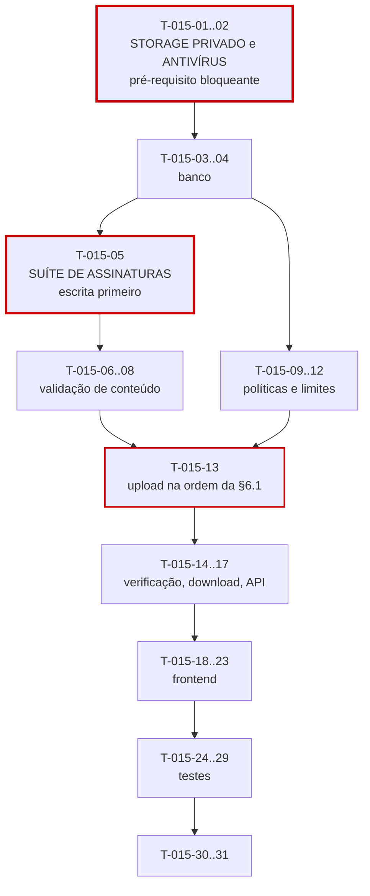

# 015 — Attachments · Tarefas

## 1. Convenções

| Campo | Regra |
|---|---|
| **ID** | `T-015-XX`, estável e imutável |
| **Descrição** | Verbo no infinitivo + objeto |
| **Dependências** | IDs de tarefas ou features concluídas |
| **Estimativa** | Horas-agente; acima de 8h deve ser decomposta |
| **Prioridade** | `P0` bloqueante · `P1` necessária · `P2` cortável |

> **Última feature da fila** (ordem 15 de 15). Depende de `014-comments` (INV-ATT-01), que é o alvo mais simples para validar o upload (§6 de `implementation-order.md`).
>
> **`P2` com complexidade `Alta`.** O volume é modesto; cada camada de defesa é obrigatória. §9 de `implementation-order.md` classifica "arquivo malicioso liberado" com impacto **crítico** e gatilho explícito: **EICAR liberado para download**.
>
> **Dependência de infraestrutura bloqueante:** sem verificador antivírus operacional (`T-015-02`), nenhum download é liberado e a feature não pode ser considerada entregue (RS-03, DoD-10).

## 2. Resumo

| Grupo | Tarefas | Estimativa |
|---|:--:|---|
| Infra (pré-requisito) | 2 | 6h |
| Banco | 2 | 4h |
| Backend | 12 | 38h |
| Frontend | 6 | 16h |
| Testes | 6 | 24h |
| Documentação | 2 | 3h |
| **Total** | **30** | **91h ≈ 5 dias-agente** |

## 3. Infra — pré-requisito

| ID | Descrição | Dependências | Estimativa | Prioridade |
|---|---|---|:--:|:--:|
| T-015-01 | Configurar o object storage como **privado**, com URL assinada e verificação de que acesso anônimo é recusado | — | 3h | P0 |
| T-015-02 | Configurar o verificador antivírus conforme `integrations.md`, em **todos** os ambientes, incluindo o de teste | — | 3h | P0 |

> `T-015-01` e `T-015-02` precedem todo o restante. Um storage acidentalmente público (R-08) é falha crítica independente de qualquer código, e sem verificador nenhum download pode ser liberado (RS-03). O ambiente de teste precisa do verificador porque `T-015-24` (EICAR) é critério de DoD.

## 4. Banco

| ID | Descrição | Dependências | Estimativa | Prioridade |
|---|---|---|:--:|:--:|
| T-015-03 | Criar `V038__create_attachments.sql` com `CHECK ((ticket_id IS NULL) <> (comment_id IS NULL))`, `CHECK` de tamanho e de tentativas | 007, 014 | 2,5h | P0 |
| T-015-04 | Criar `V039__attachment_indexes.sql` com os seis índices da §13.4, incluindo o **coberto** de quota (`INCLUDE (size_bytes)`) | T-015-03 | 1,5h | P0 |

## 5. Backend

### 5.1 Validação de conteúdo — o núcleo de segurança

| ID | Descrição | Dependências | Estimativa | Prioridade |
|---|---|---|:--:|:--:|
| T-015-05 | **Escrever antes do código:** suíte parametrizada dos 9 tipos da §6.2, com casos positivos e **negativos** — cada tipo declarado com a assinatura de outro | T-015-03 | 4h | P0 |
| T-015-06 | Implementar `MagicNumberValidator` para os 9 tipos, com heurística de binário para `text/plain` e `text/csv` e verificação de manifesto interno nos formatos Office | T-015-05 | 5h | P0 |
| T-015-07 | Implementar `FileNameSanitizer` (*path traversal*, caracteres de controle, truncamento a 255 preservando a extensão) e `StorageKeyGenerator` **opaco** | T-015-03 | 3h | P0 |
| T-015-08 | Implementar `ChecksumCalculator` em **fluxo**, sem carregar o arquivo em memória | T-015-03 | 2,5h | P0 |

### 5.2 Políticas e limites

| ID | Descrição | Dependências | Estimativa | Prioridade |
|---|---|---|:--:|:--:|
| T-015-09 | Criar a entidade `Attachment` e `AttachmentRepository` com `countByTarget`, `findByChecksum`, `countByStorageKey` e `sumSizeByTenant` | T-015-03 | 3h | P0 |
| T-015-10 | Implementar `TargetExclusivityValidator` (INV-ATT-01) e `AttachmentLimitPolicy` (RN-806) | T-015-09 | 2,5h | P0 |
| T-015-11 | Implementar `UploadValidator` (tamanho) e `QuotaService` usando o índice coberto | T-015-09 | 2,5h | P0 |
| T-015-12 | Implementar `DeduplicationPolicy` restrita ao **tenant**, com reuso de `storageKey` e contagem de referências na exclusão | T-015-08, T-015-09 | 3,5h | P0 |

### 5.3 Upload, verificação e download

| ID | Descrição | Dependências | Estimativa | Prioridade |
|---|---|---|:--:|:--:|
| T-015-13 | Implementar `AttachmentService.upload` na ordem **exata** da §6.1 — tamanho antes de leitura de conteúdo, binário gravado **após** a validação de assinatura | T-015-06, T-015-11, T-015-12 | 5h | P0 |
| T-015-14 | Implementar `ScanService` e `ScanWorkerJob` com até 3 tentativas; `INFECTED` **remove o binário** como efeito de entrada | T-015-13, T-015-02 | 4h | P0 |
| T-015-15 | Implementar `DownloadGuard` no **service** e `AttachmentDownloadService` com redirecionamento para URL assinada | T-015-14 | 3h | P0 |
| T-015-16 | Implementar `AttachmentService.delete` com contagem de referências antes de remover o binário (RN-805) | T-015-12 | 2,5h | P0 |
| T-015-17 | Criar DTOs (**sem** `storageKey` nem `checksum`), mapper com `canDownload` do servidor e os três controllers; **nenhuma** rota de atualização | T-015-16, T-015-15 | 4h | P0 |

## 6. Frontend

| ID | Descrição | Dependências | Estimativa | Prioridade |
|---|---|---|:--:|:--:|
| T-015-18 | Criar `AttachmentApi` e `AttachmentStore` com *polling* de `PENDING` limitado a 2 minutos | T-015-17 | 3h | P0 |
| T-015-19 | Criar `dt-attachment-upload` com arrastar e soltar, validação local de tamanho e extensão (FM-02) e progresso | T-015-18 | 3,5h | P0 |
| T-015-20 | Criar `dt-scan-status-badge` e `dt-attachment-blocked`, **explicando** o motivo do bloqueio por estado (CP-20) | T-015-18 | 2,5h | P0 |
| T-015-21 | Criar `dt-attachment-item` com nome escapado e ações conforme `canDownload`/`canDelete` do servidor | T-015-20 | 2,5h | P0 |
| T-015-22 | Criar `dt-attachment-list`, `dt-quota-indicator` e integrar a P19, em ticket e em comentário | T-015-21, T-015-19 | 3h | P0 |
| T-015-23 | Aplicar `hasPermission`; garantir upload e exclusão completos por teclado | T-015-22 | 1,5h | P0 |

## 7. Testes

| ID | Descrição | Dependências | Estimativa | Prioridade |
|---|---|---|:--:|:--:|
| T-015-24 | **Teste com EICAR:** arquivo isolado e dentro de ZIP, verificando detecção, `INFECTED`, remoção do binário e bloqueio do download | T-015-14 | 5h | P0 |
| T-015-25 | Testes de burla de tipo: executável renomeado para cada extensão da allowlist; PDF declarado como PNG; ZIP como `.docx`; `.txt` com bytes nulos | T-015-06 | 4h | P0 |
| T-015-26 | Testes de deduplicação: mesmo arquivo duas vezes, em dois tenants, exclusão de um de dois referenciadores, exclusão do último com verificação **no storage** | T-015-16 | 4h | P0 |
| T-015-27 | Testes de estados: download em `PENDING`, `INFECTED` e `FAILED`; 3 tentativas esgotadas; **inspeção de que não existe liberação manual** | T-015-15 | 4h | P0 |
| T-015-28 | Testes de sanitização e `storageKey` opaca; limites por alvo; quota; upload concorrente do 20º e 21º | T-015-13 | 3,5h | P0 |
| T-015-29 | **Teste de memória:** uploads concorrentes de 10 MB sem esgotar heap; suíte de isolamento; matriz de permissões; XSS em nome de arquivo | T-015-17 | 3,5h | P0 |

## 8. Documentação

| ID | Descrição | Dependências | Estimativa | Prioridade |
|---|---|---|:--:|:--:|
| T-015-30 | Sincronizar `docs/04-api/tickets.md` §11 (anexos) com o comportamento implementado | T-015-17 | 1,5h | P0 |
| T-015-31 | Atualizar o status em `implementation-order.md` §12; registrar em `docs/07-backlog/future.md` a decisão de OB-02 (ausência de liberação manual) como ponto a revisitar apenas com mudança em `business-rules.md` | T-015-29 | 1,5h | P0 |

## 9. Ordem de execução

**Caminho crítico:** `T-015-01/02 → 03 → 05 → 06 → 13 → 14 → 15 → 17 → 22 → 24`.

**Quatro tarefas com peso desproporcional ao seu tamanho:**

| Tarefa | Por quê |
|---|---|
| `T-015-01` (storage privado) | Um bucket acidentalmente público é falha crítica que nenhum código corrige. É verificado por acesso anônimo em DoD-09 |
| `T-015-02` (antivírus) | RS-03 o torna dependência **obrigatória**. Sem ele em ambiente de teste, `T-015-24` não roda — e `T-015-24` é critério de DoD |
| `T-015-05` (suíte de assinaturas) | Escrita antes de `MagicNumberValidator`. Os casos **negativos** são o ponto: cada tipo declarado com a assinatura de outro. Uma implementação que apenas verifica se a assinatura está na allowlist — sem cruzar com o `contentType` declarado — passa em todos os casos positivos e falha em todos os negativos |
| `T-015-24` (EICAR) | É o **gatilho de acionamento** do risco crítico da feature (§9 de `implementation-order.md`). Sem ele, a proteção contra arquivo malicioso é uma suposição |

**Paralelizável:** `T-015-07` e `T-015-08` (sanitização e checksum) são puros. `T-015-19` a `T-015-21` podem ser desenvolvidos com MSW. `T-015-09` a `T-015-12` (políticas) são independentes de `T-015-06`.

**Regra de sequência:** `T-015-13` implementa a ordem da §6.1 **exatamente**. Duas decisões dentro dela são fáceis de inverter e caras: validar o tamanho **antes** de qualquer leitura de conteúdo (evita exaustão) e gravar o binário **após** a validação de assinatura (evita conteúdo não verificado no storage). Ambas são cobertas por `T-015-28`.

**Ordem de corte:** esta feature depende de `014`; cortar `014` corta esta. Se apenas esta for cortada, nenhum artefato é anexável — limitação aceitável para o MVP. **Não há corte parcial possível:** remover qualquer camada de validação de `T-015-06`, `T-015-13` ou `T-015-14` transformaria a feature em vetor de distribuição de malware. Ou entra completa, ou não entra.

## 10. Critérios de conclusão por grupo

| Grupo | Concluído quando |
|---|---|
| Infra | Acesso anônimo ao storage comprovadamente recusado; verificador antivírus operacional em **todos** os ambientes, incluindo teste |
| Banco | `CHECK` de exclusividade de alvo rejeita `INSERT` com dois alvos e com nenhum; índice de quota comprovadamente **coberto** |
| Backend | Os 9 tipos validados com casos positivos e negativos; `storageKey` sem nenhuma parte do nome; checksum em fluxo; ordem da §6.1 exata; `INFECTED` removendo o binário; **nenhum** caminho de liberação manual |
| Frontend | Motivo do bloqueio explicado por estado; nome escapado; ações conforme o servidor; *polling* limitado; zero violações do axe-core |
| Testes | **EICAR detectado, isolado e em ZIP**; todas as burlas de tipo rejeitadas; remoção do binário verificada **no storage**; uploads concorrentes sem esgotar memória; isolamento verde nos 6 endpoints |
| Documentação | `tickets.md` §11 sincronizado; decisão de OB-02 registrada em `future.md` |
